This document is the Accepted Manuscript version of a Published Work that appeared in final form in The Journal of Organic Chemistry , copyright © 2024 American Chemical Society after peer review and technical editing by the publisher. To access the final edited and published work see https://doi.org/10.1021/acs.joc.4c01029.

How to cite: Maurya, M. R.; Maurya, S. K.; Kumar, N.; Avecilla, F. Nonoxidovanadium(IV) Complex-Catalyzed Synthesis of 2-Amino-3-Cyano-4HPyrans/4H-Chromenes, Biscoumarins, and Xanthenes under Green Conditions. J. Org. Chem. 2024 , 89 -12158. https://doi.org/10.1021/acs.joc.4c01029.

CHO

CHO

CHO

NC

[pubs.acs.org/joc](pubs.acs.org/joc?ref=pdf)

ÖHI

Xanthenes

(8a-8f)

## 1 Nonoxidovanadium(IV) Complex-Catalyzed Synthesis of 2 -Amino-32 cyano -4 H -pyrans/4 H -chromenes, Biscoumarins, and Xanthenes 3 under Green Conditions

- 4 Mannar R. Maurya, * Shailendra K. Maurya, § Naveen Kumar, § and Fernando Avecilla

Cite This:

https://doi.org/10.1021/acs.joc.4c01029

## ACCESS

[Metrics &amp; More](https://pubs.acs.org/page/pdf_proof?ref=pdf)

[Read Online](https://pubs.acs.org/page/pdf_proof?ref=pdf)

[Article Recommendations](https://pubs.acs.org/page/pdf_proof?ref=pdf)

5 ABSTRACT: Reaction of [V IV O(acac)2] (Hacac = acetylacetone) with a Mannich base, 6 N , N , N ′ , N ′ -tetrakis(2-hydroxy-3,5-ditertbutyl benzyl)-1,2-diaminoethane (H4L, I ) in a 1:1 7 molar ratio in MeOH, leads to the formation of the nonoxidovanadium(IV) complex 8 [V IV L] ( 1 ). Air stable complex 1 has been characterized using various spectroscopic 9 techniques, DFT calculations, and single-crystal X-ray studies. 1 adopts distorted octahedral 10 geometry where ligand coordinates through all coordination functionalities available. This 11 complex has been used as a catalyst in the one-pot, three-component synthesis of 2-amino12 3-cyano-4 H -pyrans using 1,3-dicarbonyls (1,3-cyclohexanedione, dimedone, barbituric acid, 13 and 4-hydroxycoumarin), malononitrile, and various substituted aromatic aldehydes in 14 equimolar amounts employing ethanol as a green solvent. The catalytic reaction revealed 15 that the multicomponent synthesis of 4 H -pyrans and chromenes is greatly influenced by 16 both types of 1,3-dicarbonyl compound employed and the nature of the substituent on the 17 aromatic ring of the aldehyde. Synthesized catalysts have also been used in the synthesis of

18

19

20

[Supporting Information](https://pubs.acs.org/page/pdf_proof?ref=pdf)

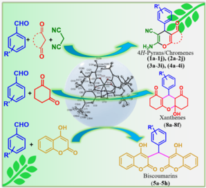

pharmacologically relevant oxygen-containing heterocycles, specifically, 1,8-dioxo-octahydro-1

H

-xanthenes and biscoumarins. The possible mechanism for the synthesized one-pot, multicomponent product has been proposed by isolating intermediate(s) generated

during synthesis.

## 21 ■ INTRODUCTION

22 Amavadin, an octacoordinated vanadium(IV) complex, was 23 isolated from Amanita mushrooms in the early 1970s. It was 24 originally thought to be an oxidovanadium(IV) complex, but 25 later on, it was established to be a nonoxidovanadium(IV) 26 complex, 1 though vanadium in its higher oxidation states is 27 generally associated with oxido group(s). The chemistry of 28 vanadium(IV/V) with such oxido group(s) has extensively 29 been studied for many years due to their comparatively simple 30 synthesis, structural diversity, 2 biological, 3 catalytic, 4 electro31 chemical, and spectroscopic capabilities, 5 and, more recently, 32 their amazing magnetic characteristics as possible molecular 33 quantum bits. 6 -12 Conversely, very little information is 34 available on nonoxidovanadium(IV) chemistry because a 35 hard 'bare' V IV ion has a strong tendency toward hydrolysis 36 or oxidation due to its oxophilic nature. 13 -16

37 Complexes with phenol-containing ligands continue to 38 pique the curiosity of inorganic chemists due to their 39 importance in seemingly unrelated domains such as bio40 inorganic chemistry, molecular magnetism, and catalysis. These 41 phenol-containing ligands are predicted to stabilize higher 42 oxidation states with strongly covalent M -O(phenolate) 43 bonds because they have excellent π -donor atoms. 17 While 44 isolating oxidovanadium(V) complexes with N , N , N ′ , N ′ -45 tetrakis(2-hydroxy-3,5-disubstitutedbenzyl)-1,2-diaminoethane 46 ligands, 6 it has been observed that the ligand having tert -butyl

Article

47 groups present at 3and 5-positions of the phenyl groups 48 c1 (H4L, Chart 1) shows different behavior compared to other 49 ligands of the series even under aerobic reaction conditions. 50 Therefore, we decided to undertake the synthesis, character51 ization, and reactivity of the vanadium complex of H4L ( I ) 52 separately. The formation of the nonoxidovanadium(IV)

Chart 1. Synthetic Route to Prepare 1 and Its Possible Structure

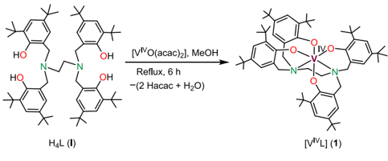

Received:

April 29, 2024

Revised:

July 15, 2024

Accepted:

August 9, 2024

53 complex [V IV L] presented here is a unique synthetic protocol 54 that maximizes sustainable development and minimizes 55 pollution in chemical synthesis. Such a concern has received 56 the burgeoning attention of the scientific community because 57 of the increasing concern about the environment. 18 -20 In 58 addition, its catalytic potential has been explored for the one59 pot multicomponent synthesis of 2-amino-3-cyano-4 H -pyrans/ 60 4 H -chromenes under green conditions.

61 On the other hand, the application of multicomponent 62 reactions (MCRs), recognized for their benefits such as high 63 atom economy, synthetic efficiency, convergence, reduced 64 reaction and purification steps, selectivity, lower energy 65 consumption, etc., has garnered attention in both academic 66 research and industrial sectors as a step toward addressing 67 concerns in green synthesis. 21 -27 Being the primary con68 stituents of many naturally occurring products, pyran/ 69 chromene-annulated heterocycle derivatives represent a 70 significant class of oxygen-containing heterocycles. They are 71 widely used as cosmetics, pigments, and potentially biode72 gradable agrochemicals 28,29 and display a broad range of 73 biological activities. Due to the wide range of significance 74 shown by pyran/chromene-annulated compounds (Figure 1

Figure 1. Representative example of biologically active 4 H -pyran/ chromene derivatives.

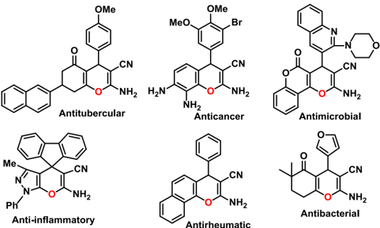

75 for some examples), numerous organic chemists have paid 76 close attention to their production during the past two decades 77 with antibacterial, anticancer, antitubercular, antimicrobial, 78 anticoagulant, antiallergic, antibiotic, antiulcer, anti-inflamma79 tory, diuretic, potassium channel activator, hypolipidemic, and 80 immunomodulating activity. 30 -41 They can also be used as 81 cognitive enhancers to treat neurodegenerative illnesses like 82 schizophrenia and myoclonus as well as diseases like 83 Alzheimer's, amyotrophic lateral sclerosis, Huntington's, 84 Parkinson's, AIDS-associated dementia, and Down's syn85 drome. 42 -45

86 Under the suitability of reagents, the above catalytic MCRs 87 can also be tuned for the syntheses of bioactive xanthene and 88 biscoumarin derivatives. Polycyclic compounds containing a 89 xanthene core have also been given substantial importance 90 owing to the broad range of their remarkable biological 91 activities. The important biological activities of heterocyclic 92 compounds with xanthene scaffolds include their anticancer 93 and antiproliferative activities, antibacterial and antifungal 94 activities, anti-Alzheimer activity, and anti-inflammatory and 95 antidiabetic activities. 46 -54 Apart from their biological 96 activities, xanthene derivatives have also been studied for 97 their electronic and photophysical applications including their

98 use in laser dyes 55 -57 and also have applications in the food 99 industry. 58 Inspired by the above-mentioned properties of 100 xanthene, numerous synthetic methodologies have been 101 reported in literature, 46,47,59 and some of them involve the 102 use of transition-metal complexes as a Lewis acid catalyst. 59 -63 103 As far as current knowledge is concerned, no studies have been 104 reported in the scientific literature on the synthesis of xanthene 105 f2 derivatives catalyzed by vanadium complexes. Figure 2a 106 presents some representative bioactive xanthene derivatives 107 with their respective biological role. 54,62,64

108 Biscoumarins are another significant class of oxygen109 containing heterocyclic organic molecules and possess 110 important pharmaceutical and biological activities, such as 111 enzyme inhibition, anticoagulant, anti-HIV, antiviral, antipy112 retic, antithrombotic, antimicrobial, anticancer, and antioxidant 113 activities (for example, see Figure 2b). 65 -67 Biscoumarin 114 derivatives have also been explored for their interesting 115 photophysical properties and utilized as competent laser 116 dyes. 68 Because of the versatile applications of biscoumarin 117 derivatives, researchers have increasingly focused their efforts 118 on developing efficient synthetic techniques for biscoumarin 119 derivatives. 65,68,69

120 The scientific literature reveals that a considerable number 121 of studies have been reported on the applications of transition122 metal-based Lewis acid catalysts in the multicomponent 123 synthesis of 4 H -pyrans/4 H -chromenes 70 -73 as well as the 124 synthesis of bioactive xanthene and biscoumarin derivatives 125 over time. 59 -63,74 Only two studies on the vanadium-catalyzed 126 multicomponent syntheses of 4 H -pyrans/4 H -chromenes were 127 identified in literature 75,76 until our recent research on the 128 vanadium-catalyzed syntheses. 77 However, we do not find any 129 report on the synthesis of bioactive xanthene and biscoumarin 130 derivatives using vanadium-based catalysts. Most of the 131 literature for the syntheses of all these biologically significant 132 molecules is associated with some noticeable disadvantages 133 such as extended reaction times, harsh reaction conditions, 134 costly and hazardous catalysts, high-catalyst loading, difficult 135 workup procedure, the use of solvents, formation of 136 byproducts, etc. Considering the important features of these 137 biomolecules, we wish to explore the catalytic potential of 138 synthesized nonoxidovanadium(IV) complex 1 of H4L ( I ) 139 (Chart 1) toward syntheses of biomolecules discussed above.

## ■ RESULTS AND DISCUSSION

140

141 Synthesis of 1 and Its Stability. Ligand-specific 142 nonoxidovanadium(IV) complex 1 was synthesized by reacting 143 H4L ( I ) with [V IV O(acac)2] in refluxing MeOH without any 144 special care. Extremely large steric hindrance due to two tert -145 butyl substituents on each phenyl group and tetrabasic nature 146 of ligand possibly forced to stabilize the complex as nonoxido 147 form after eliminating the oxido group from precursor 148 [V IV O(acac)2] (Chart 1). Neves et al. reported one such 149 nonoxidovanadium(IV) complex, [V IV (tben)] of N , N , N ′ , N ′ -150 tetrakis(2-hydroxybenzyl)ethylenediamine (H4tben) using 151 VCl3 in THF in the presence of Et3N via air-sensitive 152 intermediate complex [Et3 NH][V III (tben)]. 78 However, the 153 method reported here is more feasible and environmentally 154 benign and produces a higher yield of 1 . Ligands with less 155 hindered substituents present on the phenyl group have 156 resulted in mainly oxidovanadium(V) complexes. 6 The HRMS 157 (ESI) of 1 (Figure S1) reveals a distinctive peak at m / z = 158 980.6553, which is consistent with the [ 1 + H ] + ion and 159 validates the formation of 1 . Compound 1 is stable in the air

f3

f4

C(29)

C131) D

C(28) C(30)

[C125)(](https://pubs.acs.org/page/pdf_proof?ref=pdf)

C(24)

C(13) C127 /C114) (120)

[(C1231012) 012A)](https://pubs.acs.org/page/pdf_proof?ref=pdf)

C(18)

C(19)

C(12)

C(9B)

PO(1)

C(11)

C(6)

C(5)

C(4)

C(7)

C(8B)

(I10A) ((10BI (18A)

Figure 2. (a) Some biologically active oxygen-containing heterocyclic molecules with a xanthene core and (b) some representatives of bioactive biscoumarin derivatives.

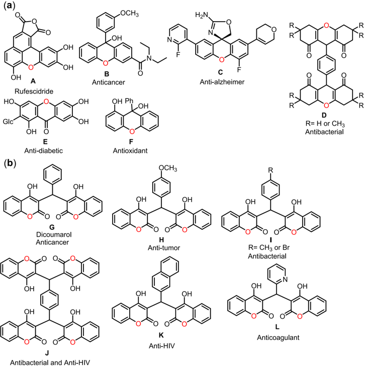

160 for a long period of time and is soluble in MeCN, MeOH, 161 EtOH, DMF, and DMSO. It does not even oxidize under the 162 influence of aqueous H2O2 (Figures S2 and S3). The thermal 163 profile shows its stability up to, ca., 215 ° C and thus makes it 164 suitable for catalytic reactions at temperature. Compound 1 165 decomposes exothermically in two major steps under an 166 oxygen atmosphere, forming V2O5 at, ca., 525 ° C (Figure S4). 167 The observed residue of 9.0% at this temperature matches well 168 with the theoretical value of 9.3%. The structure of 1 was also 169 elucidated using an SC-XRD investigation.

170 Structure Description. Figure 3 shows an ORTEP 171 representation of mononuclear vanadium(IV) complex 1 . 172 The asymmetric unit contains only half of the compound. 173 The vanadium center is six-coordinated, and the structure can 174 be analyzed considering the geometry of the cavity generated 175 for the ligand defined for the two ethylenediamine nitrogen 176 atoms and the four phenoxy oxygen atoms. This cavity can be 177 defined as a trigonal antiprism. The configuration of the ethyl 178 groups generates two optical isomers labeled as Δ or Λ , 179 indicating either right-handed ( Δ ) or left-handed ( Λ ), with 180 respect to the ethylenediamine group, N -CH2 -CH2 -N 181 (Figure 4), which are in equal amounts (racemate). 79 The 182 coordination polyhedron (Figure S5) can be described as a 183 distorted octahedron (trigonal antiprism), in which the ligand's 184 two symmetrical halves are organized in a facial fashion ( fac -185 NO2 donor set), with atoms of the same type occupying cis -

Figure 3. ORTEP representation (50% probability level) of 1 with an atom numbering scheme.

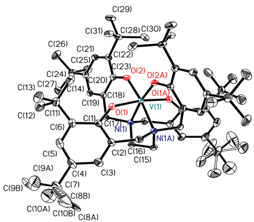

186 positions to each other. Neves et al. also observed this kind of 187 facial arrangement in [V IV (tben)], where two N atoms of the 188 ethylenediamine occupy the cis -positions of the equatorial 189 plane. 78 This distortion can be studied considering the angles 190 and distances with respect to the atoms implied (Table S1). 191 The angle between the centroids of triangular faces defined for

C(1),

C(2) C(16)

[C(15)](https://pubs.acs.org/page/pdf_proof?ref=pdf)

C(3)

% yield

[2000 2500 3000 3500 4000 4500 5000](https://pubs.acs.org/page/pdf_proof?ref=pdf)

THF

N

V

Figure 4. ORTEP representation (50% probability level) of two different optical isomers that can be labeled as Δ or Λ , indicating either right-handed ( Δ ) or left-handed ( Λ ), with respect to the ethylenediamine group, N -CH2 -CH2 -N.

192 O(1), O(2), and O(2A), X(1A) and for N(1), N(1A), and 193 O(1A), X(1B) of the antiprism and the vanadium atoms is &lt; 194 X(1A) -V(1) -X(1B) = 170.5 ° (ideal value, 180 ° ). The 195 distances to donor atoms are V(1) -O(1), 1.8509(11) Å; 196 V(1) -O(2), 1.8597(11) Å; and V(1) -N(1), 2.1908(13) Å. 197 Bond angles and bond lengths obtained through SC-XRD 198 match well with the data obtained through DFT calculations 199 (Table S2, Figures S6 and S7). This indicates that the 200 octahedron has a significant distortion. π -π Interactions and 201 hydrogen bonds were not observed in the crystal packing.

202 FT-IR and UV -Visible Spectral Studies. The IR 203 spectrum of the complex showed no evidence of V  O in 204 the 950 -1000 cm -1 region (see Supporting Informaton and 205 Figure S8) which confirms the formation of the 206 nonxidovanadium(IV) complex. Furthermore, the disappear207 ance of the 3622 cm -1 peak (which is present in H 4 L) in the 208 IR spectrum of 1 indicates the deprotonation of the phenolic 209 OH group due to the coordination of phenolate oxygens to 210 vanadium. 211 Complex 1 also displays two bands in the UV region 274 nm 212 ( ε : 2.26 × 10 4 ) and 328 ( ε : 9.11 × 10 3 ) and one broad band in 213 the visible region at 565 nm ( ε : 9.68 × 10 3 ) compared to only 214 two ligand bands at 223 ( ε : 2.73 × 10 4 ) and 281 ( ε : 1.09 × 215 10 4 ) in the UV region (Figure S9). Generally, a characteristic 216 charge transfer band due to V V O-aminophenolate appears at, 217 ca., 550 nm in complexes of such ligands; 6,80,81 therefore, the 218 broad band at 565 nm is possibly a mixture of ligand-to-metal 219 charge transfer (LMCT) from the filled p orbital of phenolate220 O to d orbitals of vanadium as well as of d -d transition.

221 EPR Spectral Study. The X-band first derivative EPR 222 spectrum of [V IV L] ( 1 ) was recorded as a powder at 100 K 223 (Figure 5). The obtained spectrum exhibits eight well-defined 224 isotropic lines (I = 7/2), typical for vanadium(IV) complexes

Figure 5. X-band EPR spectra of [V IV L] ( 1 ) as a powder at 100 K.

225 reported in literature. 82 The spin Hamiltonian parameters, g iso 226 and A iso, of the complex were found to be 1.946 and 134.7 × 227 10 -4 cm -1 , respectively. The EPR findings are close to the 228 values usually observed for V(IV) complexes with distorted 229 octahedral geometry. 82,83

Catalytic Activity Study: A Homogeneous One-Pot, Three-Component Synthesis of 2-Amino-3-cyano-4 H -p y r a n s / 4 H - c h r o m e n e s . The s y n t h e s i z e d nonoxidovanadium(IV) complex 1 was used as a catalyst for the synthesis of 2-amino-3-cyano-4 H -pyrans (Chart 2) under

Chart 2. Multicomponent Syntheses of 4 H -Pyrans Catalyzed by 1

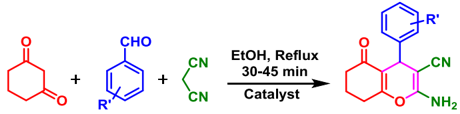

235 green conditions. Initially, screening of the different solvents 236 was conducted considering multicomponent reagents [benzal237 dehyde (0.106 g, 1.0 mmol), malononitrile (0.066 g, 1.0 238 mmol), 1,3-cyclohexanedione (0.112 g, 1.0 mmol)], and 239 catalyst (0.002g, 2.04 × 10 -3 mmol) in a 5 mL solvent; the 240 reaction was run at reflux temperature for THF, H2O, and 241 CHCl3 while at 80 ° C for toluene and MeCN, and the product 242 yield was recorded. Conducting the reaction under solvent-free 243 conditions resulted in only 56% product. Thus, among various 244 solvents screened, EtOH gave the highest yield in 45 min 245 f6 (Figure 6), and therefore, subsequent optimization was 246 conducted in EtOH.

Figure 6. Effect of various solvents for the multicomponent synthesis of 4 H -pyrans under the optimized reaction conditions.

247 Thus, for the same amounts of multicomponent reagents as 248 noted above, varied amounts of catalyst {0.002 g (2.04 × 10 -3 249 mmol), 0.003 g (3.06 × 10 -3 mmol), and 0.004 g (4.08 × 10 -3 250 mmol)} were taken; the reaction was run in EtOH (5 mL) at 251 various temperatures (r.t., 40, 50, 60, 70, and reflux), and the 252 yield of products in each case was noted at different times 253 t1 (Table 1). Based on these studies, the best-suited conditions 254 for the synthesis of 2-amino-5-oxo-4-phenyl-5,6,7,8-tetrahydro255 4 H -chromene-3-carbonitrile (entry 6 in Table 1) were to use 256 2.04 × 10 -3 mmol (0.002 g) of 1 in refluxing EtOH for 45 min 257 to obtain a 90% yield with 100% selectivity.

Substrate Scope of the MCRs to Other 4 H -Pyran Derivatives. The catalytic efficacy of 1 has also been explored with other aromatic aldehyde variants and 1,3-dicarbonyl or

258

259

260

230

231

232

233

234 c2

f7

f8

c3

Table 1. Optimization of Various Reaction Conditions for the Synthesis of 2-Amino-5-oxo-4-phenyl-5,6,7,8tetrahydro-4 H -chromene-3-carbonitrile a

| entry   | catalyst (g, mmol)   |   time (min) | temp. ( °   | isolated yield (%)   |
|---------|----------------------|--------------|-------------|----------------------|
| 1       | 0.002, 2.04 × 10 - 3 |           45 | r.t.        | 20                   |
| 2       | 0.002, 2.04 × 10 - 3 |           45 | 40          | 25                   |
| 3       | 0.002, 2.04 × 10 - 3 |           45 | 50          | 43                   |
| 4       | 0.002, 2.04 × 10 - 3 |           45 | 60          | 70                   |
| 5       | 0.002, 2.04 × 10 - 3 |           45 | 70          | 80                   |
| 6 b     | 0.002, 2.04 × 10 - 3 |           45 | reflux      | 90                   |
| 7       | 0.002, 2.04 × 10 - 3 |           30 | reflux      | 65                   |
| 8       | 0.002, 2.04 × 10 - 3 |           60 | reflux      | 93                   |
| 9       | 0.004, 4.08 × 10 - 3 |           45 | reflux      | 93                   |
| 10      | 0.003, 3.06 × 10 - 3 |           45 | reflux      | 92                   |
| 11      | -                    |           45 | reflux      | trace                |

a Multicomponent reagents: benzaldehyde (0.106 g, 1.0 mmol), malononitrile (0.066 g, 1.0 mmol), and 1,3-cyclohexanedione (0.112 g, 1.0 mmol). b Optimized reaction conditions.

261 C -H-activated compounds using the above-optimized reac262 tion condition. Thus, 4 H -pyran derivatives of 1,3-cyclo263 hexanedione ( A ) or dimedone ( B ) with malononitrile and 264 variously substituted aldehydes have also been synthesized. As 265 shown in Figure 7, 4 H -pyran derivatives of A and B ( 1a -1j , 266 2a -2j ) were produced selectively in a high yield without any 267 side product formation regardless of the nature of substituted 268 aryl aldehyde. However, within these products, yields produced 269 by electron-withdrawing substituents containing aldehydes are 270 better than those of electron-donation substituents. Electron271 withdrawing groups boost up the electrophilicity of the 272 carbonyl carbon in aldehydes, thereby promoting the efficient 273 Knoevenagel condensation with malononitrile as the pivotal 274 first step of this reaction.

275 Extending the scope of this multicomponent reaction, 276 barbituric acid ( C ) was also reacted with malononitrile and 277 several substituted aryl aldehydes in a one-pot reaction. The 278 reaction resulted in the formation of 4 H -pyran derivatives ( 3a , 279 3d -3i ) with 100% selectivity when aryl aldehydes were 280 unsubstituted or contained electron-withdrawing substituents 281 (Figure 8a). In contrast, 6a and 6b were formed exclusively 282 when benzaldehyde featured strong electron-donating sub283 stituents, such as 4-methoxybenzaldehyde and 4-methylben284 zaldehyde. In the later cases, malononitrile was left unreacted 285 due to its low reactivity with 6a and 6b . 84 However, the 286 reaction of 6a and 6b with excess malononitrile resulted in a 287 relatively moderate yield of the corresponding 4 H -pyran 288 derivatives 3a and 3b (Figure 8a). The synthetic strategy 289 and the products of this reaction, along with their isolated 290 yields and reaction time, are presented in Figure 8b.

291 The role of the substituent on the aromatic ring of aldehyde 292 was found to be more interesting and significant in the 293 synthesis of 4 H -chromene derivatives ( 4a -4i ) of 4-hydrox294 ycoumarin. As shown in Chart 3, 4 H -chromene derivatives ( 4f , 295 4h , and 4i ) were successfully isolated selectively only when the 296 aldehyde had a very strong electron-withdrawing group (e.g., 297 4-nitrobenzaldehyde, 2-nitrobenzaldehyde, and 2-chloroben298 zaldehyde). However, the selectivity decreased with a decrease 299 in the electron-withdrawing strength of the substituent (e.g., 4300 chlorobenzaldehyde, 4-bromobenzaldehyde, and 2-furfuryl) 301 and resulted in the formation of biscoumarin derivatives ( 5d , 302 5e , and 5g ) as a byproduct along with a moderate yield of 4 H -303 chromene derivatives ( 4d , 4e , and 4g ). Interestingly,

304 biscoumarin derivatives ( 5a , 5b , and 5c ) were formed 305 exclusively in cases when benzaldehyde had either no 306 substituent or had electron-releasing substituents (e.g., 4307 methoxybenzaldehyde and 4-methylbenzaldehyde), and malo308 nonitrile does not participate in this multicomponent reaction 309 (Chart 3). However, 4a -4e and 4g can be synthesized 310 selectively by adopting a two-step process through isolable 311 Knoevenagel intermediates 7a -7e and 7g which upon reaction 312 with 4-hydroxycoumarin in the following step yield 4a -4e and 313 f9 4g (Chart 3). Figure 9 presents all synthesized 4 H -chromene 314 derivatives ( 4a -4i ) under different reaction conditions.

315 Plausible Mechanism. The literature described two 316 different types of mechanisms for the multicomponent 317 synthesis of 4 H -pyrans/4 H -chromenes catalyzed by a Lewis 318 acid. 70 -73 Until our recent detailed study, there was a dearth of 319 comparative research emphasizing the role of 1,3-dicarbonyl 320 compounds and the influence of substituents on the 321 aldehyde(s) in deciding the type of mechanistic pathway 322 involved. 77 However, these mechanisms were devoted to 323 dioxidovanadium(V) complexes. Catalytic reactions carried 324 out above suggested that both 1,3-dicarbonyls and the nature 325 of substituent present on the aldehyde play a decisive role in 326 the mechanism involved. The two plausible mechanisms for 327 this multicomponent synthesis of 4 H -pyrans/4 H -chromenes 328 c4 catalyzed by vanadium are illustrated in Chart 4.

329 Mechanism type-I proceeds in three steps: The first step 330 consists of the reaction between malononitrile and aromatic 331 aldehyde (a Knoevenagel condensation) in the presence of 332 catalyst 1 yielding the intermediate ( X ). Here, the carbonyl 333 group of the aryl aldehyde is activated by the interaction of the 334 highly Lewis acidic V(IV) center with the oxygen atom of the 335 carbonyl group. The nonoxidovanadium(IV) center activates 336 the cyano group of the intermediate ( X ) to facilitate 337 nucleophilic attack by the enolate form of a 1,3-dicarbonyl 338 compound in the second step resulting in the Michael adduct 339 ( XX ). The final step involves cyclization of XX via an 340 intramolecular nucleophilic attack forming another intermedi341 ate XXX which upon tautomerization yields the desired 342 product with simultaneous regeneration of the catalyst.

343 The type-II mechanism is significantly different in its first 344 two steps. It begins with the formation of a Knoevenagel 345 Intermediate ( Y ) by a vanadium-catalyzed reaction between 346 aryl aldehyde and 1,3-dicarbonyls. Y on reaction with activated 347 malononitrile in the second step gives Michael adduct XX , and 348 the remaining steps are common as described in the type-I 349 mechanism.

350 Synthesis of 4 H -pyrans/4 H -chromenes from the successfully 351 isolated X -type Knoevenagel intermediates ( 7a -7j of Chart 3) 352 supports the type-I mechanism. However, an attempt to isolate 353 the Y -type Knoevenagel intermediates in the first step to 354 support the type-II mechanism by performing a reaction of aryl 355 aldehydes with 1,3-dicarbonyls ( A -D ) employing catalyst 1 356 resulted in the formation of different products depending on 357 the type of 1,3-carbonyl involved. Y -type intermediates ( 6a -358 6f , Chart S1) of barbituric acid were isolated exclusively 359 regardless of the nature of substituents on the aryl aldehyde(s). 360 The reaction of 6a -6f with malononitrile in the second step 361 selectively produced the corresponding 4 H -pyran derivatives. 362 This suggests that both types (type-I/II) of mechanisms are 363 applicable for the multicomponent synthesis of 4 H -pyran 364 derivatives of barbituric acid. The reaction of other 1,3365 dicarbonyls [1,3-cyclohexanedione ( A ), dimedone ( B ), and 4366 hydroxycoumarin ( D )] with aryl aldehyde variants always

Figure 7. (a) Reaction scheme for isolating 4 H -pyran derivatives of 1,3-cyclohexanedione ( A ) or dimedone ( B ). (b) 4 H -Pyran derivatives of 1,3cyclohexanedione ( A ). (c) 4 H -Pyran derivatives of dimedone ( B ). Reaction conditions: multicomponent reagents [aldehyde (1.0 mmol), malononitrile (1.0 mmol), cyclohexanedione/dimedone (1.0 mmol), catalyst (0.002 g, 2.14 × 10 -3 mmol), and EtOH (5 mL)] under reflux conditions.

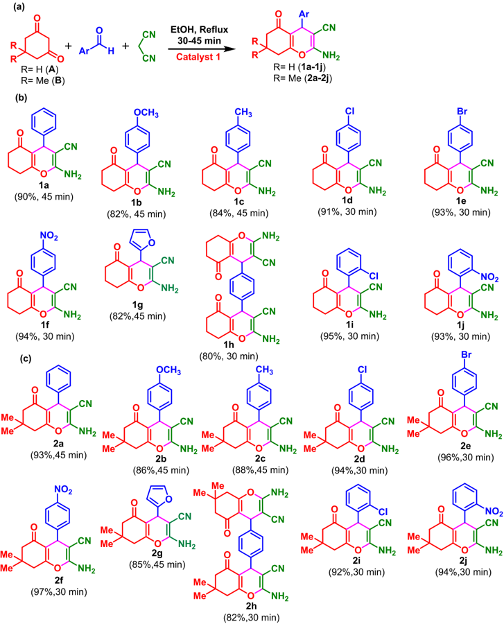

367 resulted in the formation of other products with no isolation of 368 Y -type intermediates. Therefore, only the type-I mechanism is 369 applicable for the synthesis of 4 H -pyran/4 H -chromene 370 derivatives of these 1,3-dicarbonyls ( A , B , and D ). 371 Inspired by the known biological relevance of xanthene 372 derivatives and bis(4-hydroxycoumarins) and an indication of 373 their formations during the study of the mechanism for the 374 syntheses of 2-amino-3-cyano-4 H -pyrans, we carried out a 375 detailed study separately by reacting 1,3-cyclohexanedione 376 ( A )/dimedone ( B ) or 4-hydroxycoumarin with various 377 substituted aldehydes using catalyst 1 . Thus, the reaction of 378 1,3-cyclohexanedione ( A ) with equimolar amounts of various 379 derivatives of aryl aldehyde exclusively gave 1,8-dioxo380 octahydro-1 H -xanthene derivatives [e.g., 8a -8f of Figure 10] 381 irrespective of the aldehyde variants though according to the 382 type-II mechanism proposed above, isolation of the Y -type 383 Knoevenagel intermediate was expected. This suggests that the

384 formed intermediate ( Y ) undergoes subsequent reaction with 385 another molecule of 1,3-cyclohexanedione to give tetraketone 386 derivatives (another intermediate) which then undergo 387 intramolecular cyclization to give 1,8-dioxo-octahydro-1 H -388 xanthenes [see mechanism depicted in (Chart S2a)]. Wang 389 et al. also documented the formation of 1,8-dioxo-octahydro 390 xanthenes through a similar mechanism in an L-proline391 catalyzed reaction between aryl aldehydes and 1,3-cyclo392 hexanedione. 85

393 On the other hand, when one equivalent of dimedone 394 reacted with one or two equivalents of benzaldehyde in the 395 presence of catalyst 1 and refluxed for 20 min, it yielded a 396 tetraketone derivative ( 9a ). Extending the reaction time by an 397 additional 20 min led to the intramolecular cyclization of 9a 398 followed by the elimination of one water molecule resulting in 399 the formation of the 1,8-dioxo-hexahydro-1 H -xanthene de400 rivative ( 10a ) (refer to Chart S2). To investigate the influence

Figure 8. (a) Reaction scheme for isolating 4 H -pyran derivatives of barbituric acid ( C ). (b) 4 H -Pyran derivatives of barbituric acid ( C ). a Reaction was carried out in two steps; aldehyde (1.0 mmol), C (1.0 mmol), and catalyst 1 (0.002 g, 2.04 × 10 -3 mmol) were refluxed in 5 mL EtOH for 15 min followed by the addition of excess malononitrile and refluxing for next 30 min.

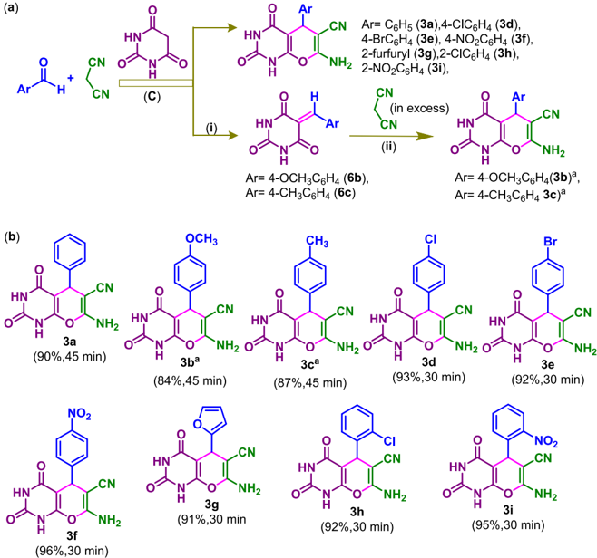

Chart 3. Synthesis of 4 H -Chromene Derivatives of 4-Hydroxycoumarin by Employing Different Substituted Aldehydes a a

a Reaction conditions: ( i ) 4-hydroxycoumarin (1.0 mmol), aldehyde (1.0 mmol), and malononitrile (1.0 mmol) in 5 mL EtOH at reflux temperature for 30 min using 0.002 g (2.04 × 10 -3 mmol) of 1 ( ii ) malononitrile (1.0 mmol) and aldehyde (1.0 mmol) in 5 mL EtOH at reflux temperature for 15 -20 min using 0.002 g (2.04 × 10 -3 mmol) of 1 to give 7a -7i , and ( iii ) 7a -7i (1.0 mmol) and 4-hydroxycoumarin (1.0 mmol) in 5 mL EtOH at reflux temperature for 30 min using 0.002 g (2.04 × 10 -3 mmol) of 1 .

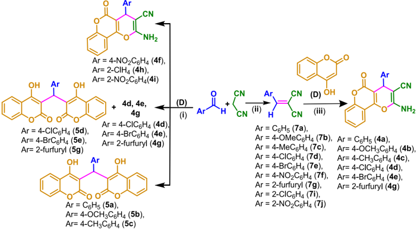

401 of substituents on benzaldehyde, three additional 1,8-dioxo402 hexahydro-1 H -xanthene derivatives ( 10b -10d ) were isolated 403 by reacting one equivalent of differently substituted aldehydes 404 with two equivalents of dimedone using catalyst 1 . Synthesis of 405 hexahydro-1 H -xanthene derivatives via a Lewis acid catalyzed

406 reaction involving dimedone and aryl aldehyde(s) has also 407 been reported in literature. 62,86

408 It is also noteworthy that the octahydro-1 H -xanthene 409 derivatives ( 8a -8f ) did not undergo dehydration to form the 410 corresponding hexahydro-1 H -xanthene derivatives even after 411 refluxing the vanadium-catalyzed reaction between two equiv

Figure 9. 4 H -Chromene derivatives of 4-hydroxy coumarin ( D ). Reaction conditions: a initially, aldehyde (1.0 mmol), malononitrile (1.0 mmol), and catalyst 1 (0.002 g, 2.04 × 10 -3 mmol) were mixed and refluxed in 5 mL EtOH for 15 min; then, 4-hydroxy coumarin (1.0 mmol) was added and further refluxed for another 30 min. b Synthesized using a one-pot multicomponent reaction of 4-hydroxycoumarin malononitrile and aldehyde (see Chart 3).

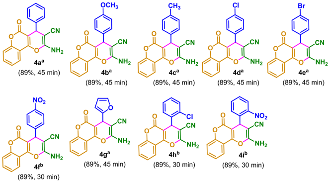

Chart 4. Two Different Mechanisms Proposed for the Catalytic Multicomponent Synthesis of 2-Amino-3-cyano4 H -pyrans Using Nonoxidovanadium(IV) Complex Reaction of 1,3-Cyclohexanedione/dimedone/4hydroxycoumarin with Equimolar Amounts of Different Aryl Aldehydes-Catalytic Syntheses of 1,8-Dioxooctahydroxanthene and Biscoumarin Derivatives.

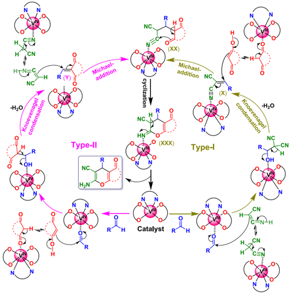

412 of 1,3-cyclohexanedione and one equivalent of aromatic 413 aldehyde for an extended period of 60 min.

414 Surprisingly, Michael products ( 5a -5h ) were obtained 415 exclusively (see Figure 11) while trying to isolate Y -type 416 Knoevenagel intermediates of 4-hydroxycoumarin ( D ). Kidwai 417 et al. have also reported such an observation and suggested 418 that 4-hydroxycoumarin is not a Knoevenagel reagent because 419 its second molecule immediately attacks the Y -type inter420 mediates in a Michael-addition fashion to yield biscoumarin 421 derivatives 5a -5h (Figure 11). 87 These results are useful to

422 clarify the formation of biscoumarins as byproducts during the 423 multicomponent synthesis of 4 H -chromene derivatives of 4424 hydroxycoumarin when aldehyde without high EWG was 425 employed (Chart 3). Formation of biscoumarins ( 5a -5c , 426 Chart 3) as the sole product during the multicomponent 427 reaction of 4-hydroxycoumarin malononitrile and aldehydes 428 without an electron-withdrawing substituent or with an 429 electron-donating substituent suggests that the formation of 430 these biscoumarin derivatives via Y -intermediates is relatively 431 faster compared to both: (i) the formation of X -type 432 intermediates to give 4 H -chromenes via a type-I process and 433 (ii) the reaction of malononitrile with Y -intermediates to give 434 4 H -chromenes through a type-II mechanism. Furthermore, the 435 formation of biscoumarins ( 5d , 5e , and 5g , Chart 3) as a 436 byproduct in the case of a weak electron-withdrawing group on 437 benzaldehyde suggests that the rate of 4 H -chromenes 438 formation via the type-I mechanism is comparable to the 439 rate of biscoumarin formation via Y -intermediates. Finally, the 440 selective formation of 4 H -chromenes ( 4f , 4h , and 4i , Chart 3) 441 without any byproduct while using a highly electron-with442 drawing group on benzaldehyde indicates a relatively faster rate 443 of the formation of 4 H -chromene derivatives via the type-I 444 mechanism than the formation of biscoumarins via Y -type 445 intermediates.

Without catalysts, no product formation was observed in 30 min under the optimized conditions. Based on the literature on Lewis acid catalyzed syntheses of these xanthenes and biscoumarin derivatives, Charts S2 ( a ) and S2 ( b ) present a plausible mechanism for the catalytic syntheses of xanthene and biscoumarin derivatives, respectively. 61,74

446

447

448

449

450

451

452 Reusability of Catalyst 1. The reusability of homoge453 neous catalyst 1 was also investigated in the multicomponent 454 synthesis of 4 H -pyrans/4 H -chromenes. After completion of 455 the reaction, the separated white solid of 2-amino-5-oxo-4456 phenyl-5,6,7,8-tetrahydro-4 H -chromene-3-carbonitrile ( 1a of 457 Figure 7) was filtered, and another batch of multicomponent 458 reagents [1,3-cyclohexanedione (0.112 g, 1.0 mmol), malono459 nitrile (0.066 g, 1.0 mmol), and benzaldehyde (0.106 g, 1.0 460 mmol)] was added to the filtrate. The reaction was carried out 461 for another 45 min without adding any additional catalyst. The 462 f12 same process was repeated four times, and yields for all batches

f12

f12

Figure 10. (a) Scheme for isolating 1,8-dioxo-octahydro-1 H -xanthene/1,8-dioxo-hexahydro-1 H -xanthene derivatives of 1,3-cyclohexanedione/ dimedone. (b) Xanthene derivatives of 1,3-cyclohexanedione/dimedone. Reaction conditions: reagents [aldehyde (1.0 mmol), 1,3cyclohexanedinoe/dimedone (2.0 mmol), catalyst (0.002 g, 2.04 × 10 -3 mmol), and EtOH (5 mL) under reflux conditions for 20 -50 min of reaction time.

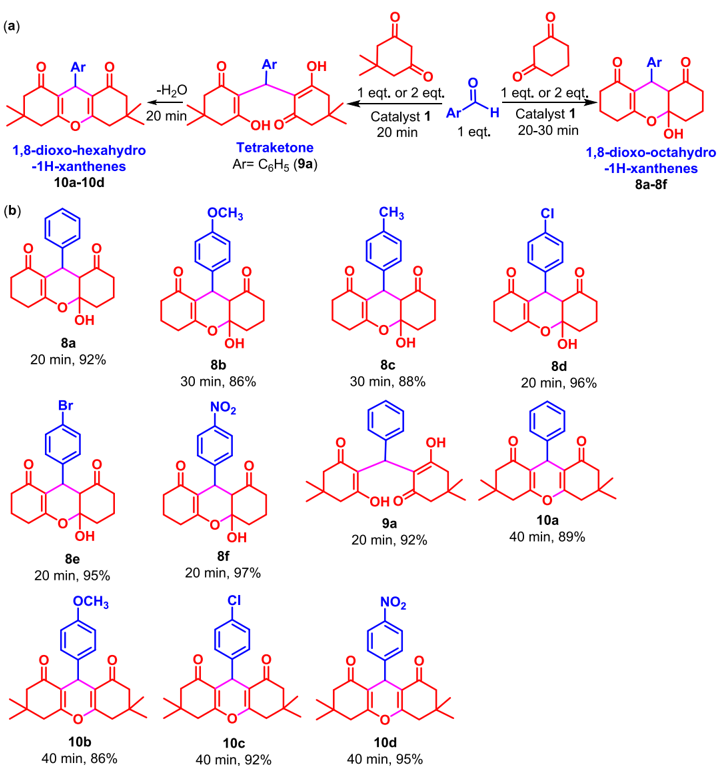

463 were compared. No considerable loss in the yield of 1a (Figure 464 12) demonstrated that catalyst 1 is stable during the 465 multicomponent synthesis of 4 H -pyrans. The EPR spectrum 466 of the catalyst present in the filtrate after the fourth successive 467 run was recorded (Figure S10). The spectrum contains eight 468 well-defined isotropic lines (I = 7/2, g iso = 1.938, A iso = 134.8 × 469 10 -4 cm -1 ) which confirmed the stability of 1 in the reaction 470 filtrate. The MALDI-TOF mass spectrum recorded after a 471 fourth successive run ( m / z = 979.520, Figure S11) further 472 supports its stability and reusability.

473 Comparing the Catalytic Studies with Previous 474 Literature. The catalytic efficacy of this also shows a favorable 475 comparison with findings documented in earlier studies (Table 476 2). In fact, the nonoxidovanadium(IV) complex reported here 477 has an advantage over most of the catalysts reported in terms 478 of a shorter reaction time, a simple workup procedure, higher 479 reusability, and better yield for the synthesis of 2-amino-3480 cyano-4 H -pyrans. Even it can be tuned for the syntheses of 481 xanthene and biscoumarin derivatives.

## 482 ■ CONCLUSIONS

483 A nonoxidovanadium(IV) complex [V IV L] ( 1 ) of N , N , N ′ , N , ′ -484 tetrakis(2-hydroxy-3,5-ditertbutyl benzyl)-1,2-diaminoethane

485 (H4L) has been prepared, and its distorted octahedral structure 486 has been confirmed by SC-XRD analysis. Its structure was 487 further validated by DFT calculations. The oxidation state +4 488 of vanadium in 1 has been supported by its EPR spectrum. 489 Complex 1 serves as a highly competent reusable and green 490 catalyst in the multicomponent synthesis of biologically 491 important pyran-annulated heterocycles (4 H -pyrans/chro492 mene derivatives). Depending on the nature of the aromatic 493 aldehyde, the synthesis of other physiologically significant 494 oxygen-containing heterocycles xanthene and biscoumarin 495 derivatives can also be obtained selectively. Results of the 496 mechanistic studies of this catalytic reaction revealed the 497 possibility of two different types of mechanisms depending on 498 the type of 1,3-dicarbonyl employed in the reaction. 499 Intermediate compounds have also been isolated in support 500 of the two proposed mechanisms. Results of the mechanistic 501 studies suggested that both types of mechanistic pathways are 502 possible during the multicomponent synthesis of 4 H -pyran 503 derivatives of barbituric acid. However, the multicomponent 504 synthesis of 4 H -pyran/chromene derivatives of 1,3-cyclo505 hexanedione/dimedone/4-hydroxycoumarin is possible only 506 if the reaction adopts a type-I mechanism because unexpected 507 products (xanthenes/tetraketones/biscoumarins) are formed if

100

80

% Yield

40

20

92

91

89

2

З

Catalytic runs

Figure 11. (a) Scheme for isolating biscoumarin derivatives and (b) biscoumarin derivatives of 4-hydroxy coumarin. Reaction conditions: aldehyde (1.0 mmol), 4-hydroxycoumarin (2.0 mmol), catalyst 1 (0.002 g, 2.04 × 10 -3 mmol), and EtOH (5 mL) under reflux conditions for 20 -30 min of reaction time.

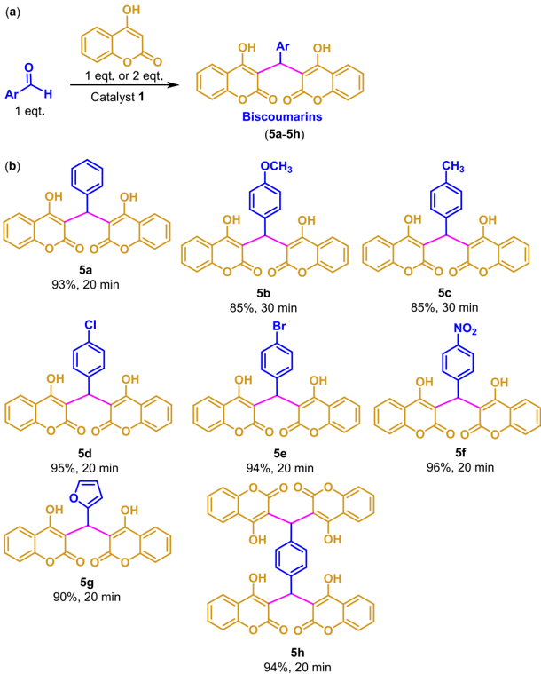

Figure 12. Reusability test of catalyst 1 and yield of product for four consecutive catalytic runs.

508 the reaction proceeds via a type-II mechanism. These results 509 concluded that the nature of the 1,3-dicarbonyl employed and 510 the substituent on the aromatic ring of aldehyde dictate the 511 reaction to follow a particular mechanism. Alternatively, it can 512 be said that the comparative rate of these two mechanistic 513 pathways depends on the nature of 1,3-dicarbonyl employed in 514 the reaction as well as the nature of the substituent present on

515 the aromatic aldehyde. The unexpected products (xanthenes 516 and biscoumarins) isolated during the investigation of the 517 type-II mechanism are of biological relevance, and therefore, 518 several xanthene/biscoumarin derivatives by performing the 519 reaction of aryl aldehyde(s) with 1,3-cyclohaxanedione/4520 hydroxycoumarin have also been isolated catalyzed by 1 . Based 521 on the literature available, the suitable mechanism(s) for 522 xanthene/biscoumarin formation has also been proposed. 523 Complex 1 is resistant to oxidation and is reusable for these 524 catalytic reactions.

## ■ EXPERIMENTAL SECTION

Materials and Methods. Ethylenediamine (SRL, India), 2,4-ditert -butylphenol (Sigma-Aldrich, USA), paraformaldehyde V2O5 (Himedia, India), and methanol (Rankem, India) were utilized as received. All additional chemicals and solvents utilized were of analytical reagent (AR) grade. [V IV O(acac)2] 103 and ligand H4L ( I) 6 were prepared following the reported methods.

Details of Instrumentation and single-crystal X-ray data collection are provided in Tables S3 and S4, Figures S12 -S14.

525

526

527

528

529

530

531

532

533

534 Preparation of [V IV L] (1). A solution of [V IV O(acac)2] (0.331 g, 535 1.25 mmol) in 10 mL of MeOH was added to a suspension of H4L 536 (0.934 g, 1.0 mmol) in 30 mL of methanol. Subsequently, the reaction 537 mixture was heated to reflux with stirring in an oil bath where a clear 538 blue solution formed within a few minutes. After 6 h of reflux, the

Table 2. Comparison of Catalytic Results with the Previous Literature

| s. no.   | catalyst (amount)                            | conditions                | time (min.)   | yield (%)   | reference   |
|----------|----------------------------------------------|---------------------------|---------------|-------------|-------------|
| a 1      | Fe 3 O 4 /SiO 2 /Met (30.0 mg)               | EtOH + H 2 O (1:1)/reflux | 60            | 86          | 88          |
| 2        | 2,2,2-trifluoroethanol (2 mL)                | reflux                    | 300           | 90          | 89          |
| 3        | nano ZnO (10 mol %)                          | EtOH + H 2 O (1:1)/r.t.   | 210           | 86          | 90          |
| b 4      | RE(PFO) 3 (5 mol %)                          | EtOH/60 ° C               | 300           | 90          | 91          |
| c 5      | TBAF                                         | H 2 O/reflux              | 30            | 97          | 92          |
| d 6      | H 2 O (1 mL)/PEG-400 (1 mL)                  | 100 ° C                   | 45            | 97          | 93          |
| e 7      | urea: ChCl (2:1)                             | 80 ° C                    | 240           | 95          | 94          |
| f 8      | DABCO (10 mol %)                             | H 2 O/reflux              | 120           | 94          | 95          |
| 9        | Zn[L-proline] 2 (17 mol %)                   | EtOH/reflux               | 50            | 90          | 96          |
| g 10     | [Ch][OH]                                     | 80 ° C, water             | 60            | 92          | 97          |
| 11       | KF/basic Al 2 O 3                            | r.t., ultrasound, alcohol | 60            | 81          | 98          |
| 12       | cerium(III) chloride                         | H 2 O - EtOH              | 90            | 86          | 99          |
| 13       | L -proline                                   | water                     | 300           | 81          | 100         |
| h 14     | TAFMC-1 (30.0 mg)                            | reflux                    | 900           | 80          | 101         |
| 15       | hydrotalcite [15 (wt %)]                     | H 2 O, 60 ° C             | 300           | 90          | 102         |
| 16       | [V IV L] ( 1 ) (0.002 g, 2.04 × 10 - 3 mmol) | EtOH, reflux              | 30 - 45       | 81 - 97     | this work   |

a Met (metformin). b RE(PFO)3 (rare-earth perfluorooctanoate). c TBAF (tetrabutylammonium fluoride). d PEG (polyethylene glycol). e ChCl (choline chloride). f DABCO (1,4-diazabicyclo[2.2.2.]octane). g [Ch][OH] (choline hydroxide). h TAFMC {tungstic acid-functinalized mesoporous SBA-15 (SBA = Santa Barbara Amorphous)}.

539 reaction mixture was allowed to cool to room temperature. The 540 precipitated black solid was filtered, washed with cold MeOH, and 541 dried under the vacuum. Yield: 0.79 g (80.6%). HRMS (ESI) m / z : 542 [M + H] + Calcd for C62H93N2O4V: 980.6575. Found 980.6553. 543 Elemental analysis Anal. Calcd for C62H92N2O4V: C 75.96; H 9.46; N 544 2.86. Found: C 75.91; H 9.38; N 2.81. UV -vis (DMSO) [ λ max nm ( ε 545 liter mol -1 cm -1 )]: 241 (2.90 × 10 4 ), 274 (2.26 × 10 4 ), 328 (9.11 × 546 10 3 ), and 565 (9.68 × 10 3 ). Needle-shaped black crystals suitable for 547 SC-XRD analysis of 1 were grown by dissolving it in EtOH and left 548 undisturbed at room temperature for 2 days.

549 Catalytic Activity Study: Syntheses of 2-Amino-3-cyano-4 H -550 pyrans/4 H -chromenes. The multicomponent reaction follows a 551 general method. 77 A solution containing benzaldehyde (0.106 g, 1.0 552 mmol), malononitrile (0.66 g, 1.0 mmol), and 1,3-cyclohexanedione 553 (0.112 g, 1.0 mmol) along with catalyst 1 (0.002 g, 2.14 × 10 -3 554 mmol) was prepared in ethanol (5 mL). The resulting mixture was 555 heated under reflux conditions for 30 -45 min using an oil bath. A 556 white solid began to precipitate shortly after refluxing commenced. 557 The progress of the reaction was monitored by TLC using ethyl 558 acetate -hexane as the mobile phase. Upon completion, the reaction 559 mixture was cooled, resulting in precipitation of the product. The 560 product was isolated by filtration, washed with cold ethanol, and 561 subsequently dried under the vacuum. Yield: 0.239 g (90%).

562

563

564

565

Other products were isolated similarly and characterized by recording their 1 H and 13 C NMR spectra (Figures S15 -S90). The obtained spectral data closely matched the values reported in the literature for these compounds. 313270 -74104 -107

566

567

568

569

570

571

572

573

574

Catalytic Synthesis of Biscoumarin Derivatives 5a -5h. Refluxing a reaction mixture of 4-hydroxycoumarin (2.0 mmol), aromatic aldehyde(s) (1.0 mmol), and 1 (2.04 × 10 -3 mmol) in ethanol (5 mL) in an oil bath for 30 min produced biscoumarin derivatives 5a -5h as a white powdered solid. Finally, the white solids were recrystallized from methanol after separation from the reaction mixture. Yield: 85 -96%. See Figures S91 -S106 for the NMR spectra ( 1 H and 13 C) of 5a -5h . The obtained spectral data closely matched the values reported in the literature for these compounds. 104

575 Synthesis of Knoevenagel Products 6a -6f. These compounds 576 were synthesized by performing a condensation reaction between 577 aromatic aldehyde(s) (2.0 mmol) and barbituric acid (2.0 mmol) in 578 ethanol (5 mL) for 20 min employing catalyst 1 (2.04 × 10 -3 mmol) 579 and using an oil bath. Other details are as described above. Yield: 89 -580 95%. See Figures S107 -S118 for the NMR spectra. The obtained

NMR spectral data closely matched the values reported in the literature for these compounds. 108

Synthesis of Knoevenagel Products 7a -7i. These Knoevenagel intermediates were synthesized by performing a condensation reaction between aromatic aldehyde(s) (2.0 mmol) and malononitrile (2.0 mmol) in ethanol (5 mL) for 20 min employing catalyst 1 (2.04 × 10 -3 mmol) and using an oil bath. After the reaction mixture was cooled to r.t., a separated white solid was worked up as stated above. All synthesized compounds were recrystallized from methanol. Yield: 90 -96%. See Figures S121 -S128 for the NMR spectra. The obtained spectral data closely matched the values reported in the literature for these compounds. 32104105

581

582

583

584

585

586

587

588

589

590

591

592

Catalytic Synthesis of Xanthene Derivatives 8a -8f, 9a, and 10a -10d. Synthesis of 1,8-dioxo-octahydro-1 H -xanthene derivatives ( 8a -8f) involved a reaction of 1,3-cyclohexanedione (2.0 mmol), aromatic aldehyde(s) (1.0 mmol), and 1 (2.04 × 10 -3 mmol) in ethanol (5 mL) at reflux temperature for 20 -30 min using an oil bath. A white crystalline solid was obtained upon cooling the resultant reaction mixture at r.t., which was filtered and washed with cold ethanol. Finally, they were recrystallized from methanol. Yield: 86 -96%.

593

594

595

596

597

598

599

600

601

602 The tetraketone derivative ( 9a ) was synthesized by reacting 603 dimedone (0.0280 g, 2.0 mmol) with benzaldehyde (0.106 g, 1.0 604 mmol) using catalyst 1 (0.002 g, 2.04 × 10 -3 mmol) in refluxing 605 ethanol for 20 min and using an oil bath. Cooling the reaction mixture 606 to room temperature yielded a white crystalline solid with a 92% yield. 607 Extending the reaction time to 40 min yielded the corresponding 1,8608 dioxo-hexahydro-1 H -xanthene derivative ( 10a ) as a white solid with a 609 89% yield. Other 1,8-dioxo-hexahydro-1 H -xanthene derivatives 610 ( 10b -10d ) were synthesized by using the same method in a 89 -611 95% yield. See Figures S129 -S150 for the NMR spectra. The 612 obtained spectral data closely matched the values reported in the 613 literature for these compounds. 698586 Although the single-crystal 614 structures of compounds 8c , 9a , and 10a are reported in literature, 109 615 crystals of these compounds were grown by dissolving them in 616 methanol for a more accurate analysis. The molecular structures were 617 then verified through single-crystal X-ray diffraction analysis (see 618 Supporting Information).

Compounds 8d and 8e appear to be undocumented in the literature. Therefore, these were further characterized by using HRMS analyses (Figures S152 and S153).

619

620

621

622

623

624

625

626

## Data Availability Statement

## ■ ASSOCIATED CONTENT

The data underlying this study are available in the published article and its Supporting Information.

## * sı Supporting Information

627 The Supporting Information is available free of charge at 628 https://pubs.acs.org/doi/10.1021/acs.joc.4c01029.

629

630

631

632

633

IR, UV -visible, and MALDI-TOF mass spectra; TGA, DFT, and molecular structures; X-ray crystal structure determination; crystal packing (intermolecular interactions) for compounds 1 , 8c , 9a , and 10a ; 1 H and 13 C NMR spectra of catalytic products (PDF)

634

## Accession Codes

635 CCDC 2347304, 2370405, 2370407, and 2370756 contain the 636 supplementary crystallographic data for this paper. These data 637 can be obtained free of charge via www.ccdc.cam.ac.uk/ 638 data\_request/cif, or by emailing data\_request@ccdc.cam.ac. 639 uk, or by contacting the Cambridge Crystallographic Data 640 Centre, 12 Union Road, Cambridge CB2 1EZ, UK; fax: +44 641 1223 336 033.

642

643

644

645

646

647

648

649

650

651

652

653

654

655

656

657

658

## ■ Corresponding Author

## AUTHOR INFORMATION

Mannar R. Maurya -Department of Chemistry, Indian Institute of Technology Roorkee, Roorkee 247667, India; orcid.org/0000-0001-9977-6287; Email: m.maurya@ cy.iitr.ac.in

## Authors

Shailendra K. Maurya -Department of Chemistry, Indian Institute of Technology Roorkee, Roorkee 247667, India;

orcid.org/0009-0006-8215-8953 Naveen Kumar -Department of Chemistry, Indian Institute of Technology Roorkee, Roorkee 247667, India Fernando Avecilla -Grupo NanoToxGen, Centro Interdisciplinar de Qu í mica y Biolog í a (CICA), Departamento de Qu í mica, Facultade de Ciencias,

̃

Universidade da Corun a, A Coruna 15071, Spain

Complete contact information is available at:

[659 https://pubs.acs.org/10.1021/acs.joc.4c01029](https://pubs.acs.org/page/pdf_proof?ref=pdf)

660

## Author Contributions

661

662

663

664

665 M.R.M. acknowledges the Science and Engineering Research 666 Board Department of Science and Technology, New Delhi, 667 India, for funding (grant no. CRG/2018/000182). We also 668 thank DST-FIST, New Delhi, for providing funds [SR/FST/ 669 CS-II/2018/72(C)] to the department for single-crystal X-ray 670 diffractometer and 500 MHz NMR facility.

671

- (1) 672 (a) Armstrong, E. M.; Beddoes, R. L.; Calviou, L. J.; Charnock, J. 673 M.; Collison, D.; Ertok, N.; Naismith, J. H.; Garner, C. D. The 674 Chemical nature of amavadin. J. Am. Chem. Soc 1993 , 115 , 807 -808.

§ S.K.M. and N.K. contributed equally.

## Notes

The authors declare no competing financial interest.

## ■ ACKNOWLEDGMENTS

## ■ REFERENCES

- [675 (b) Kneifel, H.; Bayer, E. Stereochemistry and total synthesis of 676 amavadin the naturally occurring vanadium compound of Amanita 677 muscaria. J. Am. Chem. Soc 1986 , 108 , 3075 -3077.](https://doi.org/10.1021/ja00271a043?urlappend=%3Fref%3DPDF&jav=AM&rel=cite-as)
- (2) 678 (a) Rehder, D. The coordination chemistry of vanadium as 679 related to its biological functions. Coord. Chem. Rev 1999 , 182 , 297 -680 322. (b) Maurya, M. R. Development of the coordination chemistry 681 of vanadium through bis(acetylacetonato)oxovanadium(IV): Syn682 thesis reactivity and structural aspects. Coord. Chem. Rev 2003 , 237 , 683 163 -181. (c) Sutradhar, M.; Pombeiro, A. J. L. Coordination 684 chemistry of non-oxido oxido and dioxidovanadium(IV/V) complexes 685 with azine fragment ligands. Coord. Chem. Rev 2014 , 265 , 89 -124. 686 (d) Maurya, M. R. Probing the synthetic protocols and coordination 687 chemistry of oxidodioxidooxidoperoxido-vanadium and related 688 complexes of higher nuclearity. Coord. Chem. Rev 2019 , 383 , 43 -81. 689 (e) Costa Pessoa, J. Thirty years through vanadium chemistry. J. Inorg. 690 Biochem 2015 , 147 , 4 -24.
- (3) (a) Baran, E. J. Oxovanadium(IV) and oxovanadium(V) complexes relevant to biological systems. J. Inorg. Biochem 2000 , 80 , 1 -10. (b) Hashmi, K.; Gupta, S.; Gupta, S.; Siddique, A.; Khan, T.; Joshi, S. Medicinal applications of vanadium complexes with Schiff bases. J. Trace Elem Med. Biol 2023 , 79 , 127245.

691

692

693

694

695

- (4) (a) Butler, A.; Clague, M. J.; Meister, G. E. Vanadium peroxide complexes. Chem. Rev 1994 , 94 , 625 -638. (b) Sutradhar, M.; Martins, L. M. D. R. S.; Silva, M. F. C. G. D.; Pombeiro, A. J. L. Vanadium complexes: Recent progress in oxidation catalysis. Coord. Chem. Rev 2015 , 301 -302 , 200 -239. (c) Langeslay, R. R.; Kaphan, D. M.; Marshall, C. L.; Stair, P. C.; Sattelberger, A. P.; Delferro, M. Catalytic applications of vanadium: A mechanistic perspective. Chem. Rev 2019 , 119 , 2128 -2191.

̈

696

697

698

699

700

701

702

703

- (5) 704 (a) Kondo, M.; Minakoshi, S.; Iwata, K.; Shimizu, T.; Matsuzaka, 705 H.; Kamigata, N.; Kitagawa, S. Crystal structure of a tris(dithiolene) 706 vanadium(IV) complex having unprecedented D3 h symmetry. Chem. 707 Lett 1996 , 25 , 489 -490. (b) Paine, T. K.; Weyhermu ller, T.; Slep, L. 708 D.; Neese, F.; Bill, E.; Bothe, E.; Wieghardt, K.; Chaudhuri, P. 709 Nonoxovanadium(IV) and oxovanadium(V) complexes with mixed O 710 X O-donor ligands (X = S Se P or PO). Inorg. Chem 2004 , 43 , 7324 -711 7338. (c) Kundu, S.; Mondal, D.; Bhattacharya, K.; Endo, A.; Sanna, 712 D.; Garribba, E.; Chaudhury, M. Nonoxidovanadium(IV) compounds 713 involving dithiocarbazate-based tridentate ONS ligands: Synthesis 714 electronic and molecular structure spectroscopic and redox properties. 715 Inorg. Chem 2015 , 54 , 6203 -6215. (d) Yan, J. A.; Chen, Y. S.; Chang, 716 Y. H.; Tsai, C. Y.; Lyu, C. L.; Luo, C. G.; Lee, G. H.; Hsu, H. F. 717 Redox interconversion of non-oxido vanadium complexes accom718 panied by acid -base chemistry of thiol and thiolate. Inorg. Chem 719 2017 , 56 , 9055 -9063. (e) Banerjee, A.; Patra, S. A.; Sahu, G.; 720 Sciortino, G.; Pisanu, F.; Garribba, E.; Carvalho, M. F. N. N.; Correia, 721 I.; Pessoa, J. C.; Reuter, H.; et al. A series of non-oxido V IV complexes 722 of dibasic ONS donor ligands: Solution stability chemical trans723 formations protein interactions and antiproliferative activity. Inorg. 724 Chem 2023 , 62 , 7932 -7953.
- (6) [Maurya, M. R.; Maurya, S. K.; Kumar, N.; Avecilla, F.; Gupta, P. Substituent controlled synthesis of dioxidomolybdenum(VI) complexes of NNN'N'-tetrakis(2-hydroxyl-35-disubstitutedbenzyl)-12-diaminoethane their trans-metalation to oxidovanadium(V) complexes and biocatalytic applications. Eur. J. Inorg. Chem 2022 , 2022 (23), No. e202200266.](https://doi.org/10.1002/ejic.202200266)
- (7) [Maurya, M. R.; Prakash, V.; Dar, T. A.; Sankar, M. Facile synthesis of β -tetracyano vanadyl porphyrin from its tetrabromo analogue and its excellent catalytic activity for bromination and epoxidation reactions. ACS Omega 2023 , 8 , 6391 -6401.](https://doi.org/10.1021/acsomega.2c06638?urlappend=%3Fref%3DPDF&jav=AM&rel=cite-as)
- (8) [Maurya, M. R.; Kumar, N.; Avecilla, F. Mononuclear/binuclear [V IV O]/V V O2] complexes derived from 13-diaminoguanidine and their catalytic application for the oxidation of benzoin via oxygen atom transfer. ACS Omega 2023 , 8 , 1301 -1318.](https://doi.org/10.1021/acsomega.2c06732?urlappend=%3Fref%3DPDF&jav=AM&rel=cite-as)
- (9) Galloni, P.; Conte, V.; Floris, B. A Journey into the electrochemistry of vanadium compounds. Coord. Chem. Rev 2015 , 301 -302 , 240 -299.
- (10) Smith, T. S.; Lobrutto, R.; Pecoraro, V. L. Paramagnetic spectroscopy of vanadyl complexes and its applications to biological systems. Coord. Chem. Rev 2002 , 228 , 1 -18.

725

726

727

728

729

730

731

732

733

734

735

736

737

738

739

740

741

742

743

744

- (11) 745 Bader, K.; Winkler, M.; Van Slageren, J. Tuning of molecular 746 qubits: very long coherence and spin -lattice relaxation times. Chem. 747 Commun 2016 , 52 , 3623 -3626.
- (12) 748 Atzori, M.; Tesi, L.; Morra, E.; Chiesa, M.; Sorace, L.; Sessoli, 749 R. Room-temperature quantum coherence and rabi oscillations in 750 vanadyl phthalocyanine: Toward multifunctional molecular spin 751 qubits. J. Am. Chem. Soc 2016 , 138 , 2154 -2157.
- (13) 752 (a) Westrup, K. C. M.; Gregório, T.; Stinghen, D.; Reis, D. M.; 753 Hitchcock, P. B.; Ribeiro, R. R.; Barison, A.; Back, D. F.; De Sá, E. L.; 754 Nunes, G. G.; et al. Non-oxovanadium(IV) alkoxide chemistry: Solid 755 state structures aggregation equilibria and thermochromic behaviour 756 in solution. Dalton Trans 2011 , 40 , 3198 -3210. (b) Sanna, D.; 757 Sciortino, G.; Ugone, V.; Micera, G.; Garribba, E. Nonoxido V IV 758 complexes: Prediction of the EPR spectrum and electronic structure 759 of simple coordination compounds and amavadin. Inorg. Chem 2016 , 760 55 , 7373 -7387.
- (14) 761 Stinghen, D.; Atzori, M.; Fernandes, C. M.; Ribeiro, R. R.; de 762 Sa, E. L.; Back, D. F.; Giese, S. O. K.; Hughes, D. L.; Nunes, G. G.; 763 Morra, E.; et al. A rare example of four-coordinate nonoxido 764 vanadium(IV) alkoxide in the solid state: Structure spectroscopy and 765 magnetization dynamics. Inorg. Chem 2018 , 57 , 11393 -11403.
- (15) 766 Vergopoulos, V.; Jantzen, S.; Rodewald, D.; Rehder, D. 767 [Vanadium(salen)benzilate]-A novel non-oxo vanadium(IV) com768 plex. J. Chem. Soc. Chem. Commun 1995 , 3 , 377 -378.
- (16) 769 Kabanos, T. A.; Slawin, Z.; M, A.; Williamsb, D. J.; Derek 770 Woollins, J. New Non-oxo vanadium-(IV) and-(V) complexes. J. 771 Chem. Soc. Dalton Trans 1992 , 1423 -1427.

̈

- (17) [772 Kajiwara, T.; Wagner, R.; Bill, E.; Weyhermu ller, T.; 773 Chaudhuri, P. Non-oxo 5-coordinate and 6-coordinate vanadium(IV) 774 complexes with their precursor [LV III (CH3OH)] 0 Where L = a 775 trianionic aminetris(phenolate)-[NOOO] donor ligand: A magneto776 structural and EPR study. Dalton Trans 2011 , 40 , 12719 -12726.](https://doi.org/10.1039/c1dt11277e)
- (18) 777 Polshettiwar, V.; Luque, R.; Fihri, A.; Zhu, H.; Bouhrara, M.; 778 Basset, J. M. Magnetically recoverable nanocatalysts. Chem. Rev 2011 , 779 111 , 3036 -3075.
- (19) 780 Garbarino, S.; Ravelli, D.; Protti, S.; Basso, A. Photoinduced 781 multicomponent reactions. Angew. Chem. Int. Ed 2016 , 55 , 15476 -782 15484.
- (20) 783 Zhang, M.; Chen, M. N.; Li, J. M.; Liu, N.; Zhang, Z. H. 784 Visible-light-initiated one-pot three-component synthesis of 2-amino785 4 H -pyran-35-dicarbonitrile derivatives. ACS Comb. Sci 2019 , 21 , 786 685 -691.
- (21) 787 Cioc, R. C.; Ruijter, E.; Orru, R. V. A. Multicomponent 788 reactions: Advanced tools for sustainable organic synthesis. Green 789 Chem 2014 , 16 , 2958 -2975.
- (22) 790 Ramón, D. J.; Yus, M. Asymmetric multicomponent reactions 791 (AMCRs): The new frontier. Angew. Chem. Int. Ed 2005 , 44 , 1602 -792 1634.
- (23) 793 Pandit, K. S.; Kupwade, R. V.; Chavan, P. V.; Desai, U. V.; 794 Wadgaonkar, P. P.; Kodam, K. M. Problem solving and environ795 mentally benign approach toward diversity oriented synthesis of novel 796 2-amino-3-phenyl (or alkyl) sulfonyl-4 H -chromenes at ambient 797 temperature. ACS Sustainable Chem. Eng 2016 , 4 (6), 3450 -3464.
- (24) 798 Dekamin, M. G.; Eslami, M. Highly efficient organocatalytic 799 synthesis of diverse and densely functionalized 2-amino-3-cyano-4 H -800 pyrans under mechanochemical ball milling. Green Chem 2014 , 16 , 801 4914 -4921.
- (25) 802 Singh, M. S.; Chowdhury, S. Recent developments in solvent803 free multicomponent reactions: A perfect synergy for eco-compatible 804 organic synthesis. RSC Adv 2012 , 2 , 4547 -4592.
- (26) [805 Dekamin, M. G.; Azimoshan, M.; Ramezani, L. Chitosan: A 806 highly efficient renewable and recoverable bio-polymer catalyst for the 807 expeditious synthesis of α -amino nitriles and imines under mild 808 conditions. Green Chem 2013 , 15 , 811 -820.](https://doi.org/10.1039/c3gc36901c)
- (27) [809 Dai, P.; Zha, G.; Lai, X.; Liu, W.; Gan, Q.; Shen, Y. Inorganic 810 base catalyzed synthesis of (2-amino-3-cyano-4 H -chromene-4-yl) 811 phosphonate derivatives via multi-component reaction under mild 812 and efficient conditions. RSC Adv 2014 , 4 , 63420 -63424.](https://doi.org/10.1039/C4RA09359C)
- (28) 813 Singh, P. K.; Silakari, O. The current status of O-heterocycles: 814 A synthetic and medicinal overview. ChemMedChem 2018 , 13 , 1071 -815 1087.
- (29) Zhou, Y.; Liu, Y.; Guo, Y.; Liu, M.; Chen, J.; Huang, X.; Gao, W.; Ding, J.; Cheng, Y.; Wu, H. Mechanochromic and acidochromic response of 4 H -pyran derivatives with aggregation-induced emission properties. Dye. Pigm 2017 , 141 , 428 -440.

816

817

818

819

- (30) 820 (a) Karimirad, F.; Behbahani, F. K. Glycerol-mediated and 821 simple synthesis of 18-dioxo-decahydroacridines under transition 822 metal-free conditions. Polycycl. Aromat. Compds 2021 , 41 , 2238 -823 2246. (b) Daloee, T. S.; Farahnaz, K. B. A green route for the 824 synthesis of 2-amino-5 10-dioxo-4-aryl-5 10-dihydro-4 H -benzo [g] 825 chromene-3-carbonitriles using L-proline as a basic organocatalyst. 826 Polycycl. Aromat. Compds 2020 , 42 , 681 -689.
- (31) Reddy, T. N.; Ravinder, M.; Bikshapathi, R.; Sujitha, P.; Kumar, C. G.; Rao, V. J. Design synthesis and biological evaluation of 4 H -pyran derivatives as antimicrobial and anticancer agents. Med. Chem. Res 2017 , 26 , 2832 -2844.
- (32) [Zhang, G.; Zhang, Y.; Yan, J.; Chen, R.; Wang, S.; Ma, Y.; Wang, R. One-pot enantioselective synthesis of functionalized pyranocoumarins and 2-amino-4 H -chromenes: Discovery of a type of potent antibacterial agent. J. Org. Chem 2012 , 77 , 878 -888.](https://doi.org/10.1021/jo202020m?urlappend=%3Fref%3DPDF&jav=AM&rel=cite-as)
- (33) Mohareb, R. M.; Zaki, M. Y.; Abbas, N. S. Synthesis antiinflammatory and anti-ulcer evaluations of thiazole thiophene pyridine and pyran derivatives derived from androstenedione. Steroids 2015 , 98 , 80 -91.
- (34) Bonsignore, L.; Loy, G.; Secci, D.; Calignano, A. Synthesis and pharmacological activity of 2-oxo-(2 H ) 1-benzopyran-3-carboxamide derivatives. Eur. J. Med. Chem 1993 , 28 , 517 -520.
- (35) Martínez-Grau, A.; Marco, J. L. Friedlander reaction on 2amino-3-cyano-4 H -pyrans: Synthesis of derivates of 4 H -pyran[23b]quinoline new tacrine analogues. Bioorg. Med. Chem. Lett 1997 , 7 , 3165 -3170.
- (36) [Saini, A.; Kumar, S.; Sandhu, J. S. A New LiBr-catalyzed facile and efficient method for the synthesis of 14-alkyl or aryl-14 H -dibenzo[aj]xanthenes and tetrahydrobenzo[b]pyrans under solventfree conventional and microwave heating. Synlett 2006 , No. 12, 1928 -1932.](https://doi.org/10.1055/s-2006-947339)
- (37) Tang, L.; Yu, J.; Leng, Y.; Feng, Y.; Yang, Y.; Ji, R. Synthesis and insulin-sensitizing activity of a novel kind of benzopyran derivative. Bioorg. Med. Chem. Lett 2003 , 13 , 3437 -3440.
- (38) Thompson, R.; Doggrell, S.; Hoberg, J. O. Potassium channel activators based on the benzopyran substructure: Synthesis and activity of the C-8 substituent. Bioorg. Med. Chem 2003 , 11 , 1663 -1668.
- (39) Raj, T.; Bhatia, R. K.; Kapur, A.; Sharma, M.; Saxena, A. K.; Ishar, M. P. S. Cytotoxic activity of 3-(5-phenyl-3 H -[124]dithiazol-3yl)chromen-4-ones and 4-oxo-4 H -chromene-3-carbothioic acid nphenylamides. Eur. J. Med. Chem 2010 , 45 , 790 -794.
- (40) Venkatesham, A.; Rao, R. S.; Nagaiah, K.; Yadav, J. S.; Roopajones, G.; Basha, S. J.; Sridhar, B.; Addlagatta, A. Synthesis of new chromeno-annulated cis -fused pyrano[34-c]pyran derivatives via domino Knoevenagel -hetero-Diels -Alder reactions and their biological evaluation towards antiproliferative activity. MedChemComm 2012 , 3 , 652 -658.
- (41) Kalaria, P. N.; Satasia, S. P.; Raval, D. K. Synthesis characterization and biological screening of novel 5-imidazopyrazole incorporated fused pyran motifs under microwave irradiation. New J. Chem 2014 , 38 , 1512 -1521.
- (42) García-Font, N.; Hayour, H.; Belfaitah, A.; Pedraz, J.; Moraleda, I.; Iriepa, I.; Bouraiou, A.; Chioua, M.; Marco-Contelles, J.; OsetGasque, M. J. Potent anticholinesterasic and neuroprotective pyranotacrines as inhibitors of beta-amyloid aggregation oxidative stress and tau-phosphorylation for Alzheimer's disease. Eur. J. Med. Chem 2016 , 118 , 178 -192.
- (43) [Savelieff, M. G.; Nam, G.; Kang, J.; Lee, H. J.; Lee, M.; Lim, M. H. Development of multifunctional molecules as potential therapeutic candidates for Alzheimer's disease Parkinson's disease and amyo-](https://doi.org/10.1021/acs.chemrev.8b00138?urlappend=%3Fref%3DPDF&jav=AM&rel=cite-as)

827

828

829

830

831

832

833

834

835

836

837

838

839

840

841

842

843

844

845

846

847

848

849

850

851

852

853

854

855

856

857

858

859

860

861

862

863

864

865

866

867

868

869

870

871

872

873

874

875

876

877

878

879

880

- 881 trophic lateral sclerosis in the last decade. Chem. Rev 2019 , 119 , 882 1221 -1322.
- (44) 883 Kemnitzer, W.; Drewe, J.; Jiang, S.; Zhang, H.; Zhao, J.; 884 Crogan-Grundy, C.; Xu, L.; Lamothe, S.; Gourdeau, H.; Denis, R.; 885 et al. Discovery of 4-aryl-4 H -chromenes as a new series of apoptosis 886 inducers using a cell-and caspase-based high-throughput screening 887 assay. 3. Structure-activity relationships of fused rings at the 78888 positions. J. Med. Chem 2007 , 50 , 2858 -2864.
- (45) 889 Fernández-Bachiller, M. I.; Pérez, C.; Monjas, L.; Rademann, J.; 890 Rodríguez-Franco, M. I. New Tacrine -4-Oxo-4 H -c H romene 891 H ybrids as Multifunctional Agents for t H e Treatment of Alz H eimer's 892 Disease wit H C H olinergic Antioxidant and β -Amyloid-Reducing 893 Properties. J. Med. Chem 2012 , 55 , 1303 -1317.
- (46) 894 Ghahsare, A. G.; Nazifi, Z. S.; Nazifi, S. M. R. Structure895 bioactivity relationship study of xanthene derivatives: A brief review. 896 Current Org. Synth 2020 , 16 , 1071 -1077.

̃

- (47) 897 Maia, M.; Resende, D. I. S. P.; Dura es, F.; Pinto, M. M. M.; 898 Sousa, E. Xanthenes in medicinal chemistry: Synthetic strategies and 899 biological activities. Eur. J. Med. Chem 2021 , 210 , 113085.
- (48) 900 Epstein, O.; Bryan, M. C.; Cheng, A. C.; Derakhchan, K.; 901 Dineen, T. A.; Hickman, D.; Hua, Z.; Human, J. B.; Kreiman, C.; 902 Marx, I. E.; et al. Lead optimization and modulation of hERG activity 903 in a series of aminooxazoline xanthene β -site amyloid precursor 904 protein cleaving enzyme (BACE1) inhibitors. J. Med. Chem 2014 , 57 , 905 9796 -9810.
- (49) 906 (a) Srinivas Lavanya Kumar, M.; Singh, J.; Manna, S. K.; Maji, 907 S.; Konwar, R.; Panda, G. Diversity oriented synthesis of chromene908 xanthene hybrids as antibreast cancer agents. Bioorg. Med. Chem. Lett 909 2018 , 28 , 778 -782. (b) Karaman, O.; Alkan, G. A.; Kizilenis, C.; 910 Akgul, C. C.; Gunbas, G. Xanthene dyes for cancer imaging and 911 treatment: A material odyssey. Coord. Chem. Rev 2023 , 475 , 214841. (50) 912 Spatafora, C.; Barresi, V.; Bhusainahalli, V. M.; Micco, S. D.; 913 Musso, N.; Riccio, R.; Bifulco, G.; Condorelli, D.; Tringali, C. Bio914 inspired benzo[kl]xanthene lignans: Synthesis DNA-interaction and 915 antiproliferative properties. Org. Biomol. Chem 2014 , 12 , 2686 -2701. (51) 916 Abualhasan, M.; Hawash, M.; Aqel, S.; Al-Masri, M.; Mousa, A.; 917 Issa, L. Biological evaluation of xanthene and thioxanthene derivatives 918 as antioxidant anticancer and COX inhibitors. ACS Omega 2023 , 8 , 919 38597 -38606.
- (52) 920 Santos, S. J.; Rossatto, F. C. P.; Jardim, N. S.; A vila, D. S.; 921 Ligabue-Braun, R.; Fontoura, L. A. M.; Zimmer, K. R.; Russowsky, D. 922 Chromene-dihydropyrimidinone and xanthene-dihydropyrimidinone 923 hybrids: Design synthesis and antibacterial and antibiofilm activities. 924 New J. Chem 2023 , 47 , 7500 -7520.

́

- (53) 925 Kasabe, U. I.; Kale, K. B.; Rode, N. R.; Shelar, A. V.; Patil, R. 926 H.; Mhaske, P. C.; Chaskar, M. G. Synthesis and antifungal screening 927 of tetramethyl hexahydro-1 H -xanthene-18(2 H )-dione derivatives as 928 potential inhibitors of morphogenesis and biofilm formation in 929 Candida albicans. New J. Chem 2022 , 46 , 2128 -2139.
- (54) 930 Miura, T.; Ichiki, H.; Hashimoto, I.; Iwamoto, N.; Kao, M.; 931 Kubo, M.; Ishihara, E.; Komatsu, Y.; Okada, M.; Ishida, T.; Tanigawa,
3. 932 K. Antidiabetic activity of a xanthone compound mangiferin. 933 Phytomedicine 2001 , 8 , 85 -87.
- (55) 934 Martins, J. S.; Bartolomeu, A. A.; Santos, W. H. D.; Filho, L. C. 935 D. S.; De Oliveira, E. F.; Lavarda, F. C.; Cuin, A.; Legnani, C.; Maciel, 936 I. O.; Fragneaud, B.; Quirino, W. G. New class of organic hole937 transporting materials based on xanthene derivatives for organic 938 electronic applications. J. Phys. Chem. C 2017 , 121 , 12999 -13007.
- (56) 939 Chen, X.; Pradhan, T.; Wang, F.; Kim, J. S.; Yoon, J. 940 Fluorescent chemo sensors based on spiroring-opening of xanthenes 941 and related derivatives. Chem. Rev 2012 , 112 , 1910 -1956.
- (57) 942 Shankarling, G.; Jarag, K. Laser dyes. Resonance 2010 , 15 , 804 -943 818.
- (58) 944 Erdemir, S.; Malkondu, S. A switch-on xanthene-triphenyl945 amine based fluorescent and colorimetric sensor for the detection of 946 ultra-trace Hg 2+ in food samples and living cells. Food Chem 2022 , 947 376 , 131951.
- (59) 948 Shabir, G.; Saeed, A.; Channar, P. A. A review on the recent 949 trends in synthetic strategies and applications of xanthene dyes. Mini950 Rev. Org. Chem 2018 , 15 , 166 -197.
- (60) 951 Da Silva, M. L.; Teixeira, R. R.; Amarante, G. W. Different 952 concepts of catalysis in the synthesis of xanthenediones: A brief 953 overview. Adv. Org. Synth 2017 , 7 , 199 -227.
- (61) 954 (a) Hasanzadeh Banakar, S.; Dekamin, M. G.; Yaghoubi, A. 955 Selective and highly efficient synthesis of xanthenedione or 956 tetraketone derivatives catalyzed by ZnO nanorod-decorated 957 graphene oxide. New J. Chem 2018 , 42 , 14246 -14262. (b) Ilangovan, 958 A.; Malayappasamy, S.; Muralidharan, S.; Maruthamuthu, S. A highly 959 efficient green synthesis of 1 8-dioxooctahydroxanthenes. Chem. 960 Central J 2011 , 5 , 81.
- (62) 961 Arora, B.; Sharma, S.; Dutta, S.; Sharma, A.; Yadav, S.; Rana, P.; 962 Rana, P.; Sharma, R. K. A sustainable gateway to access 18-dioxo963 octahydroxanthene scaffolds via a surface-engineered halloysite-based 964 magnetically responsive catalyst. New J. Chem 2022 , 46 , 5405 -5418.

̧

- (63) 965 Turhan, K.; Pekta , B.; Tu rkan, F.; Tu cu, F. T.; Turgut, Z.; 966 Taslimi, P.; Karaman, H. S.; Gulcin, I. Novel benzo[b]xanthene 967 derivatives: Bismuth(III)triflate-catalyzed one-pot synthesis character968 ization and acetylcholinesterase glutathione S-transferase and 969 butyrylcholinesterase inhibitory properties. Arch. Pharm 2020 , 353 , 970 No. e2000030.

̈

̈

- (64) 971 (a) Di Micco, S.; Mazué, F.; Daquino, C.; Spatafora, C.; 972 Delmas, D.; Latruffe, N.; Tringali, C.; Riccioa, R.; Bifulco, G. 973 Structural basis for the potential antitumour activity of DNA974 interacting benzo[kl]xanthene lignans. Org. Biomol. Chem 2011 , 9 , 975 701 -710. (b) Kaya, M.; Basar, E.; Colak, F. Synthesis and 976 antimicrobial activity of some bisoctahydroxanthene-18-dione de977 rivatives. Med. Chem. Res 2011 , 20 , 1214 -1219.
- (65) 978 Danish, S.; Aamer, S.; Larik, F. M.; Larik, F. A.; Salma, B.; Ali, 979 C. P. Recent synthetic approaches to 33 ′ -(methylene)bis(coumarins). 980 Org. Prepn. Proc. Int 2019 , 51 , 199 -239.
- (66) Faisal, M.; Saeed, A.; Shahzad, D.; Fattah, T. A.; Lal, B.; Channar, P. A.; Mahar, J.; Saeed, S.; Mahesar, P. A.; Larik, F. A. Enzyme inhibitory activities an insight into the structure -Activity relationship of biscoumarin derivatives. Eur. J. Med. Chem 2017 , 141 , 386 -403.

981

982

983

984

985

- (67) (a) Ren, Q. C.; Gao, C.; Xu, Z.; Feng, L. S.; Liu, M. L.; Wu, X.; Zhao, F. Bis-coumarin derivatives and their biological activities. Curr. Topics Med. Chem 2018 , 18 , 101 -113. (b) Sadeghpour, M.; Olyaei, A.; Adl, A. 4-Aminocoumarin derivatives: Synthesis and applications. New J. Chem 2021 , 45 , 5744 -5763.

986

987

988

989

990

- (68) 991 (a) Sarmah, M.; Chutia, K.; Dutta, D.; Gogoi, P. Overview of 992 coumarin-fused-coumarins: Synthesis photophysical properties and 993 their applications. Org. Biomol. Chem 2021 , 20 , 55 -72. (b) Bedi, P.; 994 Chaudhary, D.; Bose, R.; Santra, S.; Ansari, K. R.; Kaur, R.; Pramanik, 995 T.; Sangtam, T.; Singh, A. Synthetic methodologies to access 996 bioactive bis-coumarin scaffold: A recent progress. Z. Physikal. Chemie 997 2024 , 238 , 1151.

̧

- (69) (a) Pesyan, N. N.; Akhteh, N.; Batmani, H.; An ı l, B.; ahin, E. A Facile and Catalyst-free Synthesis of Hexahydroacridine-18(2H5H)dione and Octahydroacridin-10 (1 H )-yl) thiourea Derivatives: Interand Intramolecular Aza-Michael addition. Heterocycl. Commun 2020 , 26 , 26 -32. (b) Wang, F.-M.; Hu, B.-X.; Chen, C.-X.; Zhou, Z.-Y.; Bao, D.; Chen, L.-Z. Synthesis and biological activities of 10substituted 9-aryl-3467910-hexahydroacridine-18(2 H 5 H )-diones. Chin. J. Struct. Chem 2016 , 442 -448.
- (70) Tamimi, M.; Heravi, M. M.; Mirzaei, M.; Zadsirjan, V.; Lotfian, N.; Eshtiagh-Hosseini, H. Ag3[PMo12O40]: An efficient and green catalyst for the synthesis of highly functionalized pyran-annulated heterocycles via multicomponent reaction. Appl. Organometal. Chem 2019 , 33 , No. e5043.
- (71) Chahkamali, F. O.; Sobhani, S.; Sansano, J. M. A novel basemetal multifunctional catalyst for the synthesis of 2-amino-3-cyano4 H -chromenes by a multicomponent tandem oxidation process. Sci. Rep 2022 , 12 , 2867.
- (72) (a) Sandaroos, R.; Nazif, A.; Molaei, H.; Salimi, S. Multicomponent synthesis of a new series of 4 H -furo[34-b]pyrans

998

999

1000

1001

1002

1003

1004

1005

1006

1007

1008

1009

1010

1011

1012

1013

1014

1015

1016

1017 with iron(III) triflate as catalyst. Res. Chem. Intermed 2015 , 41 , 5033 -1018 5040. (b) Maleki, A.; Varzi, Z.; Hassanzadeh-Afruzi, F. Preparation 1019 and characterization of an eco-friendly ZnFe2O4@alginic acid 1020 nanocomposite catalyst and its application in the synthesis of 21021 amino-4-cyano-4 H -pyran derivatives. Polyhedron 2019 , 171 , 193 -202. 1022 (c) Azari, M.; Behbahani, F. K. Synthesis of pyrano [2 3-d] 1023 pyrimidine diones derivatives using iron (III) phosphate. Heterocyclic 1024 Lett 2018 , 8 , 553 -560. (d) Karimirad, F.; Behbahani, F. K. γ -Fe2O3@ 1025 Si-(CH2)3@ mel@(CH2)4SO3H as a magnetically bifunctional and 1026 retrievable nanocatalyst for green synthesis of benzo [c] acridine-8 (9 1027 H )-ones and 2-amino-4 H -chromenes. Inorg. Nano-Met. Chem 2021 , 1028 51 , 656 -666. (e) Ferdousian, R.; Behbahani, F. K.; Mohtat, B. 1029 Synthesis and characterization of Fe3O4@Sal@Cu as a novel efficient 1030 and heterogeneous catalyst and its application in the synthesis of 21031 amino-4 H -chromenes. Mol. Diver 2022 , 26 , 3295 -3307.

- (73) 1032 Rajput, J. K.; Kaur, G. Synthesis and applications of CoFe2O4 1033 nanoparticles for multicomponent reactions. Catal. Sci. Technol 2014 , 1034 4 , 142 -151.
- (74) [1035 Brahmachari, G.; Begam, S. Ceric ammonium nitrate (CAN): 1036 An efficient and eco-friendly catalyst for one-pot synthesis of diversely 1037 functionalized biscoumarins in aqueous medium under ambient 1038 conditions. ChemistrySelect 2019 , 4 , 5415 -5420.](https://doi.org/10.1002/slct.201900961)
- (75) [1039 Khosravan, M.; Abdolahi, L.; Ebrahimipour, S. F. A novel 1040 anionic di-oxido vanadium(V) Schiff base complex: Synthesis spectral 1041 characterization X-ray crystal structure catalytic activity for the 1042 preparation of tetrahydro-4 H -chromene derivatives and antibacterial 1043 properties. Inorg. Chem. Commun 2021 , 128 , 108561.](https://doi.org/10.1016/j.inoche.2021.108561)
- (76) 1044 Abaszadeh, M.; Seifi, M.; Ebrahimipour, S. F. Two ligand 1045 oxidio-vanadium(IV)complexes as novel efficient catalysts in multi1046 component reactions for synthesis of tetrahydrobenzopyran deriva1047 tives. Bull. Chem. Soc. Ethop. 2016 , 30 , 253 -262.
- (77) 1048 Maurya, M. R.; Kumar, N.; Avecilla, F. Controlled modification 1049 of triaminoguanidine-based μ 3 ligands in multinuclear [V IV O]/ 1050 [V V O2] complexes and their catalytic potential in the synthesis of 1051 2-amino-3-cyano-4 H -pyrans/4 H -chromenes. Inorg. Chem 2024 , 63 , 1052 2505 -2524.
- (78) 1053 Neves, A.; Ceccato, A. S.; Vencato, I.; Mascarenhas, Y. P.; 1054 Erasmus-Buhr, C. Synthesis structure and electrochemical character1055 ization of a new non-oxo vanadium(IV) complex. J. Chem. Soc. Chem. 1056 Commun 1992 , 8 , 652 -654.

̃

- (79) 1057 Rodríguez-Cortin as, R.; Avecilla, F.; Platas-Iglesias, C.; Imbert, 1058 D.; Bu nzli, J.-C. G.; De Blas, A.; Rodríguez-Blas, T. Structural and 1059 photophysical properties of heterobimetallic 4f-Zn iminophenolate 1060 cryptates. Inorg. Chem 2002 , 41 , 5336 -5349.

̈

- (80) [1061 Maurya, M. R.; Uprety, B.; Avecilla, F. Dioxidomolybdenum1062 (VI) complexes of tripodal tetradentate ligands for catalytic oxygen 1063 atom transfer between benzoin and dimethyl sulfoxide and for 1064 oxidation of pyrogallol. Eur. J. Inorg. Chem 2016 , 2016 , 4802 -4813.](https://doi.org/10.1002/ejic.201600694)

1065

Barroso, S.; Adao, P.; Madeira, F.; Duarte, M. T.; Pessoa, J. C.;

1066

1067

1068

(81)

Martins,

[Syntheses](https://doi.org/10.1021/ic1007704?urlappend=%3Fref%3DPDF&jav=AM&rel=cite-as)

Chem

M.

[Vanadium](https://doi.org/10.1021/ic1007704?urlappend=%3Fref%3DPDF&jav=AM&rel=cite-as)

A.

[structures](https://doi.org/10.1021/ic1007704?urlappend=%3Fref%3DPDF&jav=AM&rel=cite-as)

2010

49

,

[and diaminebis](https://doi.org/10.1021/ic1007704?urlappend=%3Fref%3DPDF&jav=AM&rel=cite-as)

[reactivity](https://doi.org/10.1021/ic1007704?urlappend=%3Fref%3DPDF&jav=AM&rel=cite-as)

, 7452

7463.

-

- (82) 1069 (a) Augustyniak-Jablokow, M. A.; Borshch, S. A.; Daniel, C.; 1070 Hartl, H.; Yablokov, Y. V. EPR study of the magnetic states of a 1071 mixed-valence V IV 4 V V 2 alkoxypolyoxovanadium cluster. New J. Chem 1072 2005 , 29 , 1064 -1071. (b) Richa; Kumar, A.; Verma, I.; Gautam, M.; 1073 Erande, R. D.; Kłak, J.; Choquesillo-Lazarte, D.; Mota, A. J.; Rajput, 1074 A.; Arora, H.; et al. Structural and magnetic characterization of mixed1075 valence vanadium (IV/V) complex with {(VO)2( μ -O)}3+ core: 1076 Theoretical and experimental insights. J. Mol. Str 2022 , 1269 (1269), 1077 133805.
- (83) [1078 Maurya, R. C.; Singh, H.; Pandey, A. Vanadium(IV) complexes 1079 of bioinorganic and industrial relevance: Synthesis and character1080 ization of some oxovanadium(IV) complexes involving Schiff bases 1081 derived biologically active 4-benzoyl-3-methyl-1-phenyl-2-pyrazolin-51082 one and certain aromatic amines. Synth. React. Inorg. Met. Org. Chem 1083 2002 , 32 , 231 -246.](https://doi.org/10.1081/SIM-120003205)

[in](https://doi.org/10.1021/ic1007704?urlappend=%3Fref%3DPDF&jav=AM&rel=cite-as)

[(phenolate)](https://doi.org/10.1021/ic1007704?urlappend=%3Fref%3DPDF&jav=AM&rel=cite-as)

[sulfoxidation complexes:](https://doi.org/10.1021/ic1007704?urlappend=%3Fref%3DPDF&jav=AM&rel=cite-as)

[catalysis.](https://doi.org/10.1021/ic1007704?urlappend=%3Fref%3DPDF&jav=AM&rel=cite-as)

Inorg.

- (84) 1084 Jursic, B. S.; Neumann, D. M. Preparation of 55 ′ -pyrilidene and 1085 55 ′ -quinolidene bis-barbituric acid derivatives. J. Heterocyclic Chem 1086 2003 , 40 , 465 -474.
- (85) 1087 Wang, F.-M.; Bao, D.; Hu, B.-X.; Zhou, Z.-Y.; Huang, D.-D.; 1088 Chen, L.-Z.; Liu, Y.-M. L-Proline-catalysed the synthesis of aromatic 1089 aldehydes and ketones and their acridione derivatives at room 1090 temperature. J. Chem. Res 2015 , 39 (8), 445 -450.
- (86) 1091 (a) Pore, D. M.; Shaikh, T. S.; Patil, N. G.; Dongare, S. B.; 1092 Desai, U. V. Envirocat EPZ-10: A solid acid catalyst for the synthesis 1093 of 18-dioxo-octahydroxanthenes in aqueous medium. Synth. Commun 1094 2010 , 40 , 2215 -2219. (b) Kantevari, S.; Bantu, R.; Nagarapu, L. 1095 HClO4 -SiO2 and PPA -SiO2 catalyzed efficient one-pot Knoevenagel 1096 condensation Michael addition and cyclo-dehydration of dimedone 1097 and aldehydes in acetonitrile aqueous and solvent free conditions: 1098 Scope and limitations. J. Mol. Catal. A: Chem 2007 , 269 , 53 -57.
- (87) Kidwai, M.; Bansal, V.; Mothsra, P.; Saxena, S.; Somvanshi, R. K.; Dey, S.; Singh, T. P. Molecular iodine: A versatile catalyst for the synthesis of bis(4-hydroxycoumarin) methanes in water. J. Mol. Catal. A: Chem 2007 , 268 , 76 -81.
- (88) Alizadeh, A.; Khodaei, M. M.; Beygzadeh, M.; Kordestani, D.; Feyzi, M. Biguanide-functionalized Fe3O4/SiO2 magnetic nanoparticles: An efficient heterogeneous organosuperbase catalyst for various organic transformations in aqueous media. Bull. Korean Chem. Soc 2012 , 33 , 2546 -2552.
- (89) [Khaksar, S.; Rouhollahpour, A.; Talesh, S. M. A Facile and efficient synthesis of 2-amino-3-cyano-4H-chromenes and tetrahydrobenzo[b]pyrans using 222-trifluoroethanol as a metal-free and reusable medium. J. Fluorine Chem 2012 , 141 , 11 -15.](https://doi.org/10.1016/j.jfluchem.2012.05.014)
- (90) [Bhattacharyya, P.; Pradhan, K.; Paul, S.; Das, A. R. Nano crystalline ZnO catalyzed one pot multicomponent reaction for an easy access of fully decorated 4 H -pyran scaffolds and its rearrangement to 2-pyridone nucleus in aqueous media. Tetrahedron Lett 2012 , 53 , 4687 -4691.](https://doi.org/10.1016/j.tetlet.2012.06.086)
- (91) Wang, L. M.; Shao, J. H.; Tian, H.; Wang, Y. H.; Liu, B. Rare earth perfluorooctanoate [Re(PFO)3] catalyzed one-pot synthesis of benzopyran derivatives. J. Fluorine Chem 2006 , 127 , 97 -100.
- (92) [Gao, S.; Tsai, C. H.; Tseng, C.; Yao, C. F. Fluoride ion catalyzed multicomponent reactions for efficient synthesis of 4 H -chromene and N-arylquinoline derivatives in aqueous media. Tetrahedron 2008 , 64 , 9143 -9149.](https://doi.org/10.1016/j.tet.2008.06.061)

̈

- three-component reaction. Res. Chem. Intermed 2018 , 44 , 1035 1043. Azizi, N.; Dezfooli, S.; Khajeh, M.; Hashemi, M. M. Efficient deep eutectic solvents catalyzed synthesis of pyran and benzopyran
- (93) [Lu , C. W.; Wang, J. J.; Li, F.; Yu, S. J.; An, Y. Efficient synthesis of 2-amino-3-cyano-4 H -pyran derivatives via a non-catalytic one-pot -](https://doi.org/10.1007/s11164-017-3151-9)
- (94) derivatives. J. Mol. Liq 2013 , 186 , 76 -80.
- (95) [Tahmassebi, D.; Bryson, J. A.; Binz, S. I. 14-Diazabicyclo[2.2.2]octane as an efficient catalyst for a clean one-pot synthesis of tetrahydrobenzo[b]pyran derivatives via multicomponent reaction in aqueous media. Synth. Commun 2011 , 41 , 2701 -2711.](https://doi.org/10.1080/00397911.2010.515345)
- (96) Heravi, M. M.; Ghods, A.; Bakhtiari, K.; Derikvand, F. Zn[(L)proline]2: An efficient catalyst for the synthesis of biologically active pyrano[23-d]pyrimidine derivatives. Synth. Commun 2010 , 40 , 1927 -1931.
- (97) Hu, H.; Qiu, F.; Ying, A.; Yang, J.; Meng, H. An environmentally benign protocol for aqueous synthesis of tetrahydrobenzo[b]pyrans catalyzed by cost-effective ionic liquid. Int. J. Mol. Sci 2014 , 15 , 6897 -6909.
- (98) [Balalaie, S.; Sheikh-Ahmadi, M.; Bararjanian, M. Tetra-methyl ammonium hydroxide: an efficient and versatile catalyst for the onepot synthesis of tetrahydrobenzo[b]pyran derivatives in aqueous media. Catal. Commun 2007 , 8 , 1724 -1728.](https://doi.org/10.1016/j.catcom.2007.01.034)
- (99) Sabitha, G.; Arundhathi, K.; Sudhakar, K.; Sastry, B. S.; Yadav, J. S. Cerium(III) chloride-catalyzed one-pot synthesis of tetrahydrobenzo[b] pyrans. Synth. Commun 2009 , 39 , 433 -442.
- (100) Azath, I. A.; Puthiaraj, P.; Pitchumani, K. One-pot multicomponent solvent-free synthesis of 2-amino-4H-benzo[b]pyrans catalyzed by per-6-aminoβ -cyclodextrin. ACS Sustainable Chem. Eng 2013 , 1 , 174 -179.

1099

1100

1101

1102

1103

1104

1105

1106

1107

1108

1109

1110

1111

1112

1113

1114

1115

1116

1117

1118

1119

1120

1121

1122

1123

1124

1125

1126

1127

1128

1129

1130

1131

1132

1133

1134

1135

1136

1137

1138

1139

1140

1141

1142

1143

1144

1145

1146

1147

1148

1149

1150

1151

1152

- (101) [1153 Kundu, S. K.; Mondal, J.; Bhaumik, A. Tungstic acid 1154 functionalized mesoporous SBA-15: A novel heterogeneous catalyst 1155 for facile one-pot synthesis of 2-amino-4H-chromenes in aqueous 1156 medium. Dalton Trans 2013 , 42 , 10515.](https://doi.org/10.1039/c3dt50947h)
- (102) 1157 Kale, S. R.; Kahandal, S. S.; Burange, A. S.; Gawande, M. B.; 1158 Jayaram, R. V. A benign synthesis of 2-amino-4 H -chromene in 1159 aqueous medium using hydrotalcite (HT) as a heterogeneous base 1160 catalyst. Catal. Sci. Technol 2013 , 3 , 2050 -2056.
- (103) 1161 Rowe, R. A.; Jones, M. M. Vanadium(IV) oxy 1162 (acetylacetonate)[bis (2 4 -pentanediono) oxovanadium(IV)]. 1163 Inorg. Synth 1957 , 5 , 113 -116.
- (104) 1164 Shirini, F.; Daneshvar, N. Introduction of taurine (21165 aminoethanesulfonic acid) as a green bio-organic catalyst for the 1166 promotion of organic reactions under green conditions. RSC Adv 1167 2016 , 6 , 110190 -110205.
- (105) 1168 (a) Goli-Jolodar, O.; Shirini, F.; Seddighi, M. An efficient and 1169 practical synthesis of specially 2-amino-4 H -pyrans catalyzed by 1170 C4(DABCO-SO3H)2 · 4Cl. Dyes Pigm 2016 , 133 , 292 -303. (b) Rosta1171 mi, A.; Atashkar, B.; Gholami, H. Novel magnetic nanoparticles 1172 Fe3O4-immobilized domino Knoevenagel condensation Michael 1173 addition and cyclization catalyst. Catal. Commun 2013 , 37 (37), 1174 69 -74.
- (106) [1175 Esmaeilpour, M.; Javidi, J.; Dehghani, F.; Dodeji, F. N. A 1176 green one-pot three-component synthesis of tetrahydrobenzo [b] 1177 pyran and 3 4-dihydropyrano [c] chromene derivatives using a 1178 Fe3O4@ SiO2 -imid -PMA n magnetic nanocatalyst under ultrasonic 1179 irradiation or reflux conditions. RSC Adv 2015 , 5 , 26625 -26633.](https://doi.org/10.1039/C5RA01021G)
- (107) 1180 (a) Abedini, M.; Shirini, F.; Mohammad-Alinejad Omran, J.; 1181 Seddighi, M.; Goli-Jolodar, O. Succinimidinium N-sulfonic acid 1182 hydrogen sulfate as an efficient ionic liquid catalyst for the synthesis of 1183 5-arylmethylene-pyrimidine-2 4 6-trione and pyrano[2 3-d] pyrimi1184 dinone derivatives. Res. Chem. Intermed 2016 , 42 , 4443 -4458. 1185 (b) Chen, L.; Bao, S.; Yang, L.; Zhang, X.; Li, B.; Li, Y. Cheap 1186 thiamine hydrochloride as efficient catalyst for synthesis of 4 H -benzo 1187 [b] pyrans in aqueous ethanol. Res. Chem. Intermed 2017 , 43 , 3883 -1188 3891.
- (108) 1189 (a) Seyyedi, N.; Shirini, F.; Langarudi, M. S. N. DABCO1190 based ionic liquids: Green and recyclable catalysts for the synthesis of 1191 barbituric and thiobarbituric acid derivatives in aqueous media. RSC 1192 Adv 2016 , 6 , 44630 -44640. (b) Khurana, J. M.; Vij, K. Nickel 1193 nanoparticles catalyzed Knoevenagel condensation of aromatic 1194 aldehydes with barbituric acids and 2-thiobarbituric acids. Catal. 1195 Lett 2010 , 138 , 104 -110.

(109) 1196 (a) Al-Omran, F.; Mohareb, R. M.; El-Khair, A. A. New route 1197 for synthesis spectroscopy and X-ray studies of 2[aryl-(6 ′ -hydroxy1198 4 ′ 4 ′ -dimethyl-2 ′ -oxocyclohex-6 ′ -enyl)methyl]3-hydroxy-55-dimethyl1199 cyclohex-2-enone and 18-dioxo octahydroxanthenes and antitumor 1200 evaluation. Med. Chem. Res 2014 , 23 , 1623 -1633. (b) Choudhary, D.; 1201 Agrawal, C.; Khatri, V.; Thakuria, R.; Basak, A. K. Transition metal 1202 and base free coupling of N-tosylhydrazones with 1 3-dicarbonyl 1203 compound. Tetrahedron Lett 2017 , 58 , 1132 -1136. (c) Wang, F.; 1204 Bao, D.; Hu, B.; Zhou, Z.; Liu, Q.; Gao, F.; Wu, X. Xanthene-1,81205 diketone derivatives as well as preparation method and application 1206 thereof. US 1,04,610,218 A, 2015.