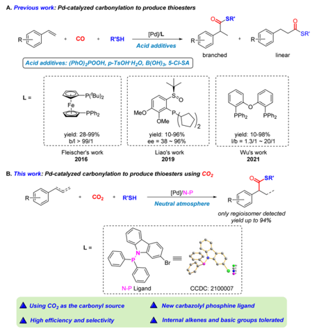
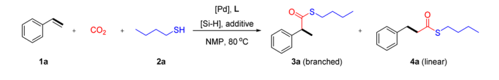
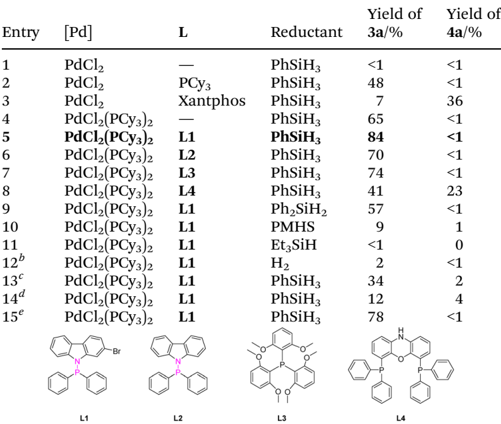
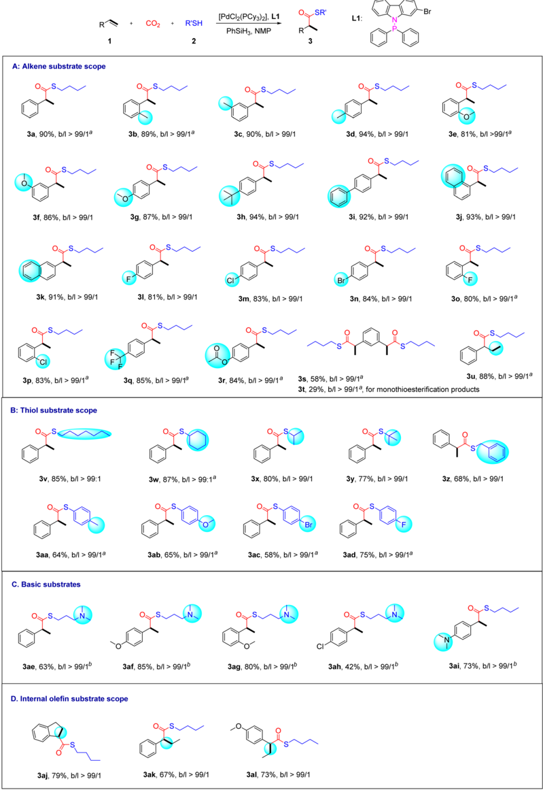
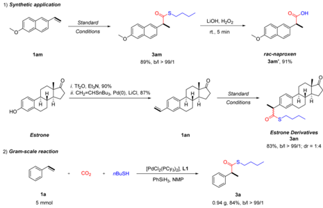
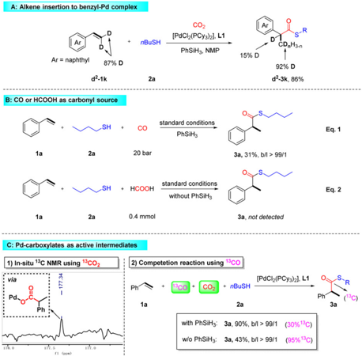
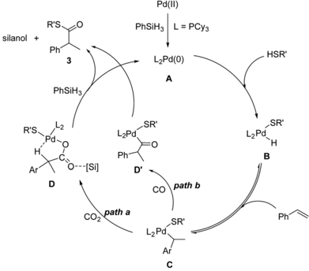

Open Access A

a

lang.

n.

C

ID

b

A. Previous work: Pd-catalyzed carbonylation to produce thioesters

CCS

CHINESE

Li D

BY-NO

cC)

Check for updates

CHEMICAL

SRI

## ORGANIC CHEMISTRY

FRONTIERS

·PPhz

MeO

OMe

/2

## RESEARCH ARTICLE

Fleischer's work

Liao's work

2016

2019

Cite this: Org. Chem. Front. , 2024, 11 , 1322

Wu's work

2021

## Palladium-catalyzed thiocarbonylation of alkenes toward branched thioesters using CO2 †

Huan Wang, a Chen Li, a Yudong Li, a Jianbin Chen, c Shaoli Liu b and Yuehui Li * a

N-P Ligand

CCDC: 2100007

Received 22nd November 2023, Accepted 12th January 2024

DOI: 10.1039/d3qo01940c

[rsc.li/frontiers-organic](http://rsc.li/frontiers-organic)

## Introduction

The functionalization of alkenes is an ideal way to enable the direct synthesis of functionalized valuable chemicals. The control of selectivity, however, remains a formidable challenge in developing such transformations, which inspires the exploration of a series of catalytic systems to address this selectivity issue. 1 In this respect, suitable catalysts and ligands are key to reaction selectivity.

Thioesters represent an important class of molecules widely existing in natural products and are widely applied in drug synthesis. 2 Over the last 20 years, research on thiocarbonylation to produce thioesters was pioneered by Alper and colleagues, focusing on activated alkenes, including allenes, 3 vinylcyclopropanes, 4 allylic alcohols, 5 conjugated enynes 6 and 1,3dienes. 7 Simple alkenes were used as substrates in patents from Drent 8 and Foley. 9 As shown in Scheme 1A, in 2016, Fleischer and colleagues reported the palladium catalyzed thiocarbonylation of styrene derivatives. 10 a The importance of thioesters in metal-catalyzed reactions was later reviewed by Fleischer and colleagues. 10 b An asymmetric version was subsequently implemented by Liao and his colleagues using chiral sulfoxide-( P -dialkyl)-phosphine (SOP) ligands. 11 In 2021, Wu and colleagues reported a method to give linear products

a Lanzhou Institute of Chemical Physics (LICP), Chinese Academy of Sciences, Lanzhou, 730000, P. R. China. E-mail: yhli@licp.cas.cn

b College of Chemistry and Chemical Engineering, Yantai University, Yantai, 264005, P. R. China

c School of Chemistry and Chemical Engineering, Qilu University of Technology (Shandong Academy of Sciences), Jinan, 2503535, P. R. China

† Electronic supplementary information (ESI) available. CCDC 2100007. For ESI and crystallographic data in CIF or other electronic format see DOI: https://doi. org/10.1039/d3qo01940c

|

Thioesters are important intermediates in natural transformations and versatile precursors in organic synthesis. Here, for the fi rst time, thiocarbonylation of alkenes using CO2 was developed for the preparation of a broad array of thioesters from the reactions of alkenes with di ff erent thiols under neutral conditions (40 examples, up to 94% yields, b / l &gt; 99/1). Using the combination of a Pd catalyst and the N -P type carbazophosphine ligand, the reactivity and selectivity were well tuned. Experimental and DFT mechanistic studies imply that this reaction might proceed via the direct insertion of CO2 into the Pd -C bond to generate the Pd -carboxylate species and enable the formation of Markovnikov thioester products.

with high selectivity. 12 However, in all these reactions toxic and dangerous carbon monoxide is used as the carbonyl source and challenging issues still remain in terms of substrate scope and catalyst e ffi ciency due to the addition of acid additives, e.g. internal alkenes and basic substrates are not suitable reactants. Thus, it is desirable and significant to explore CO-free thiocarbonylation methods to address these issues. Moreover, thiols are widely regarded as catalyst poisons for late transition metals and the competing hydrothiolation side reaction might hinder the progress. 13

Scheme 1 Palladium-catalyzed carbonylation to produce thioesters.

SR'

pph2

Pphz

View Article Online

View Journal | View Issue

Open Access A

15€

1a

BY-NO

cC)

PdC12 (PCY3)2

COZ

SHI

2a

PhSiHз

3a (branched)

4a (linear)

Using renewable and abundant carbon dioxide (CO2) as an alternative carbonyl source to synthesize high value-added molecules is an important part of C1 chemistry. 14 -16 Coordination of CO2 with a transition metal is recognized as a powerful way for CO2 activation, commonly resulting in the formation of a metal -CO2 complex. 17,18 In this regard, there are two typical strategies, 19 including (i) direct CO2 insertion into the metal -carbon bond through nucleophilic attack and (ii) reactions of low valent metal complexes (mainly nickel (0) and palladium (0)) with CO2 and unsaturated compounds, leading to the formation of five-membered metallalactones through oxidative cycloaddition. CO2 insertion into the metal -carbon bond is the ideal straightforward way of CO2 utilization. However, the formed metal carboxylates usually have robust C -O(M) bonds and limited reactivity and are inert to nucleophiles, such as H2, alcohol and amines. 20 -22 In this respect, processes such as acidification, alkylation or reductive elimination are necessary to obtain the neutral products instead of carboxylate salts. 23 -25 To the best of our knowledge, catalytic thiocarbonylation of alkenes to produce thioesters using CO2 has not been reported yet.

Based on our recent work on catalytic CO2 transformation/ utilization, 26 we envisioned that appropriate electronic and spatial properties of carbazole-derived phosphine ligands might enhance the activity of Pd-intermediates for direct preparation of high-selectivity neutral compounds from CO2. Phosphine ligands with a carbazolyl motif have been successfully used in many palladium-catalyzed biaryl syntheses and direct C -H bond arylation processes. 27 The sp 3 -hybridized N o ff ers weak coordination to the palladium center whenever needed during the catalytic cycle and potentially increases the catalyst longevity, while the flattened carbazolyl bottom ring takes advantage of the extended flat-wall-like rigidity and facilitates the reductive elimination process. Herein, we developed palladium-catalyzed thiocarbonylation of alkenes for the preparation of thioesters by using CO2 as the carbonyl source in the presence of hydrosilane as a reductant. The use of the newly designed N -P-type carbazole-derived ligand allows for high e ffi ciency. Moreover, the reaction does not require acidic additives, which provides neutral and suitable conditions for the smooth transformation of basic substrates. Internal alkenes can also be compatible (Scheme 1B).

## Results and discussion

Initially, we selected styrene 1a and n BuSH 2a as the model substrates and examined the influence of palladium salts, ligands, reductants, and additives. The reaction does not proceed without ligands (Table 1, entry 1). To our delight, when monophosphine ligand PCy3 was added to the reaction, branched thioester product 3a was obtained with a yield of 48% (Table 1, entry 2). When the bisphosphine ligand Xantphos was added, the reaction selectivity was reversed, and the linear thioester product 4a was mainly obtained with a yield of 36% (Table 1, entry 3). PdCl2(PCy3)2 was able to cata-

L1

(Pd], L

[Si-H], additive

78

&lt;1

Table 1 Condition optimization for thiocarbonylation of styrene a

| Entry   | [Pd]              | L        | Reductant   | Yield of 3a /%   | Yield of 4a /%   |
|---------|-------------------|----------|-------------|------------------|------------------|
| 1       | PdCl 2            | -        | PhSiH 3     | <1               | <1               |
| 2       | PdCl 2            | PCy 3    | PhSiH 3     | 48               | <1               |
| 3       | PdCl 2            | Xantphos | PhSiH 3     | 7                | 36               |
| 4       | PdCl 2 (PCy 3 ) 2 | -        | PhSiH 3     | 65               | <1               |
| 5       | PdCl 2 (PCy 3 ) 2 | L1       | PhSiH 3     | 84               | <1               |
| 6       | PdCl 2 (PCy 3 ) 2 | L2       | PhSiH 3     | 70               | <1               |
| 7       | PdCl 2 (PCy 3 ) 2 | L3       | PhSiH 3     | 74               | <1               |
| 8       | PdCl 2 (PCy 3 ) 2 | L4       | PhSiH 3     | 41               | 23               |
| 9       | PdCl 2 (PCy 3 ) 2 | L1       | Ph 2 SiH 2  | 57               | <1               |
| 10      | PdCl 2 (PCy 3 ) 2 | L1       | PMHS        | 9                | 1                |
| 11      | PdCl 2 (PCy 3 ) 2 | L1       | Et 3 SiH    | <1               | 0                |
| 12 b    | PdCl 2 (PCy 3 ) 2 | L1       | H 2         | 2                | <1               |
| 13 c    | PdCl 2 (PCy 3 ) 2 | L1       | PhSiH 3     | 34               | 2                |
| 14 d    | PdCl 2 (PCy 3 ) 2 | L1       | PhSiH 3     | 12               | 4                |
| 15 e    | PdCl 2 (PCy 3 ) 2 | L1       | PhSiH 3     | 78               | <1               |

a Reaction conditions: 1a (0.2 mmol), 2a (1.7 equiv.), [Pd] (5.0 mol%), monophosphine ligand (10.0 mol%), bidentate phosphine ligand (5.0 mol%), [Si -H] (1.8 equiv.), CO2 (20 bar), 80 °C, 18 h. PMHS = polymethylhydrosilane. b H2 (10 bar). c p -TsOH (20.0 mol%). d B(OH)3 (20.0 mol%). e PdCl2(PCy3)2 (2.0 mol%). Yields of 3a and 4a were determined by GC analysis using dodecane as the internal standard.

lyze the reaction with high selectivity for branched thioesters, resulting in a yield of 65% (Table 1, entry 4). The best result was obtained through the use of L1 (84% yield) (Table 1, entry 5). We found that the addition of L1 suppressed the hydrothiolation side-reaction and increased the yield. These results show the importance of ligand e ff ects in both reactivity and selectivity in thiocarbonylation of alkenes. The use of other mono or di-phosphines led to decreased yields or lower selectivity (Table 1, entries 6 -8). In addition, the use of H2 or other hydrosilanes instead of PhSiH3 was not suitable (Table 1, entries 9 -12). To our surprise, di ff erent from previously reported methods using CO relying on the use of Brønsted acid additives, 10 -12 the addition of p -TsOH or B(OH)3 significantly inhibited the desired reaction (Table 1, entries 13 and 14). According to literature research, acidic conditions may not be conducive to the catalytic conversion of CO2. 28 When the amount of catalyst was reduced to 2 mmol%, the yield reduced to 78% (Table 1, entry 15).

With the optimized reaction conditions in hand, we next explored the substrate scope of this methodology. First, di ff erent styrene substrates were screened (Scheme 2A). In general, various thioester products were smoothly obtained from styrene derivatives bearing either electron-withdrawing or electron-donating groups. Specifically, styrenes containing ortho -, meta - or para -halogen (F, Cl, or Br), alkyl (Me, t Bu, or F3C), aryl (Ph), ether (OMe), or ester (OAc) groups were compa-

Open Access A

BY-NO

A: Alkene substrate scope cC)

За, 90%, b/l &gt; 99/1ª

3f, 86%, b/l &gt; 99/1

3k, 91%, b/l &gt; 99/1

3p, 83%, b/l &gt; 99/1ª

3v, 85%, b/l &gt; 99:1

Заа, 64%, b/l &gt; 99/1ª

C. Basic substrates

Зае, 63%, b/l &gt; 99/1b

D. Internal olefin substrate scope

3aj, 79%, b/l &gt; 99/1

COz

R'SH

(PdCi2(PCy3)2). L1

PhSiH3, NMP

Scheme 2 Synthesis of branched thioesters by thiocarbonylation of alkenes. Reaction conditions: ole fi n (0.2 mmol), thiol (1.7 equiv.), PdCl2(PCy3)2 (5.0 mol%), L1 (10.0 mol%), PhSiH3 (1.8 equiv.), CO2 (20 bar), NMP (0.5 mL), and stirred at 80 °C for 18 h; branched to linear ratios determined by GC-MS. a With ZnI2 (20 mol%). b With DABCO (20 mol%), DABCO = 1,4-diazobicyclo [2.2.2] octane. Isolated yields of branched products.

SR

L1:

Br

Open Access A

1) Synthetic application

BY-NO

1am cC)

Зam rac-naproxen

tible. These substrates were converted into branched thioesters in good yields ( 3b -3i , 3l -3r , 80% -94%). Naphthyl alkenes also appeared to be suitable for this transformation ( 3j -3k ). Meanwhile, we found that the addition of zinc iodide could further improve the yields. According to the literature, zinc iodide might act as a weak Lewis acid to activate the carbonyl oxygen of CO2. 21 b For the diolefin substrate, the reaction can give dithioesterified products 3s and monothioesterified products 3t , with dithioester as the major product. The terminal non-conjugated alkene allylbenzene was exclusively converted into the branched product 3u in good yield via chain walking of Pd -H.

Unfortunately, simple aliphatic olefins are prone to olefin isomerization, so they are not suitable substrates. Next, the generality of the procedure was tested on various thiol substrates (Scheme 2B). In most cases, this transformation provided the desired branched thioester products in moderate to good yields (58 -87%). Among them, aliphatic primary, secondary and tertiary thiols furnished high yields of branched products 3v -3y . The use of benzylthiol also resulted in product 3z with a moderate yield of 68%. Thiophenols led to the formation of the desired thioester product with only a minor amount of linear thioether as the by-product ( 3aa -3ad ). In general, as arylthiols are poorer nucleophiles than alkylthiols, they are more likely to go through hydrothiolation of styrenes. 29

To our delight, alkaline substrates with amino groups and internal alkenes are also tolerated in our system (Scheme 2C and D). The amino functional group is a very important structural fragment in organic chemistry. By fine-tuning the reaction conditions, products 3ae -3ai were successfully obtained with the addition of DABCO (42% -85% yields) (Scheme 2C). The role of DABCO might be related to the increase of CO2 concentration in the solution. 28 As shown in Scheme 2D, under optimized conditions, internal alkenes with steric hindrance were also transformed into the desired branched thioesters in moderate to good yields ( 3aj -3al , 67% -79%). We believe that this result might originate from the advantages of the neutral-Pd-mediated catalytic procedure compared to cationic palladium catalytic systems that use CO. The stronger hydridic character of Pd -H (chemical shift: ca. -14 ppm vs. ca. -7 ppm for cationic Pd -H in 1 H NMR) might make the insertion of olefin molecules more e ffi cient, 30 and thus under neutral conditions, it allows good yields for internal olefin substrates and basic substrates. In addition, competition reactions between di ff erent substrates were carried out as well (Scheme S4 † ).

Furthermore, the applicability of this method was studied (Scheme 3). 2-Arylpropionic acids are related to nonsteroidal anti-inflammatory drugs (NSAIDs). 31 Starting from 6-methoxy2-vinylnaphthalene 1am , naproxen 3am ′ was obtained in high yield after convenient hydrolysis of thioester 3am . Estrone is an important female hormone. 32 Under standard conditions, the estrone derivative 3an can be successfully prepared with a yield of 83%. Moreover, a gram-scale reaction proceeds well, giving the desired product with 84% yield. In addition, pre-

1a

Standard

LIOH, H2O2

Scheme 3 Application study.

liminary attempts on the asymmetric thiocarbonylation of styrene were carried out. It was found that with the addition of the chiral ferrocene derived ligand, the enantio -enriched branched product can be obtained with 38% yield and 46% ee. Further exploration of this asymmetric process is underway.

Mechanistic studies were conducted to further understand the CO2-based thiocarbonylation system. First, to verify the source of hydride in the Pd -H species, in situ NMR experiments in a J. Young/valved NMR tube were carried out. As shown in Fig. S2, † by mixing PdCl2(PCy3)2 and PhSiH3 in C6D6 at 80 °C for 4 h, hydride signals were not detected (Fig. S2-A † ). After adding n BuSH to the above reaction solution at 80 °C for 1 h, new species at -14.36 ppm in 1 H NMR (Fig. S2-B † ) and 42.10 ppm in 31 P NMR (Fig. S3-B † ) were observed, which might correspond to the formation of trans -Pd(PCy3)2(H) (SC4H9). 30 a , b Furthermore, on heating the above mixture at 80 °C for 4 h or 18 h, the strength of the hydride signal increased (Fig. S2-C and D † ). These results suggested that thiols play an important role in the formation of the Pd(II) -H species. 33 It could involve a process in which phenylsilane first reduces Pd(II) to Pd(0), followed by a reaction with thiols to generate the crucial Pd(II) -H species.

Then, deuterium labeling experiments were performed (Scheme S2 † ). When deuterated heptanethiol d-2v (62% D) was subjected to the reaction, product d 2 -3v (18% D in CH and 54% D in CD n H3 -n ) was obtained in 81% yield (Scheme S2-a † ). Further experiments using PhSiD3 indicate that hydride exchange between PhSiD3 and Pd -H might exist (Scheme S2b † ). Meanwhile, the hydropalladation reaction of palladium hydride to the alkylpalladium species was found to be reversible when d 2 -1k was used as the starting material (Scheme 4A).

Furthermore, in order to test the possibility of CO or HCOOH as the intermediate, control experiments were performed (Scheme 4B). First, we observed that ca. 700 ppm concentration of CO was generated under standard conditions (Scheme S3 and Fig. S4 † ). Then, by replacing CO2 with CO under our standard conditions, the product 3a was obtained in 31% yield, which suggested that CO might be an intermediate in the transformation (Scheme 4B, eqn (1)). In addition, the reduction of CO2 by PhSiH3 is likely to proceed through the

Open Access A

A: Alkene insertion to benzyl-Pd complex silanol +

Ph

Ar = naphthyl

BY-NO

cC)

PhSiH3

15% D

S-R

CD H3n

HSR'

92% D

Scheme 4 Experimental studies on the mechanism. Reaction conditions: 1a / d 2 -1k (0.2 mmol), 2a (1.7 equiv.), PdCl2(PCy3)2 (5.0 mol%), L1 (10.0 mol%), PhSiH3 (1.8 equiv.), CO2 (20 bar), NMP (0.5 mL), and stirred at 80 °C for 18 h. Isolated yields of branched products.

formation of silyl formates {HC(O)O-SiR3}, 1 c which would readily release CO under heating conditions. 34 Indeed, we detected the formation of silyl formate by NMR (Scheme S3, Fig. S5 and S6 † ). However, on addition of substrate styrene 1a and n BuSH 2a in situ , the formation of product 3a at 80 °C for 18 h under N2 conditions was not detected, which suggested that silyl formate might not be the major intermediate. Additionally, by employing HCOOH as the carbonylation source in the absence of PhSiH3, no formation of 3a was observed (Scheme 4B, eqn (2)), which suggested that HCOOH might not be the major intermediate.

Then, in situ NMR experiments in a Young/valved NMR tube were carried out (Scheme 4C; left and Fig. S7 † ). The tube was charged with 13 CO2 and then heated at 80 °C for 30 min, and a peak at 177.34 ppm in 13 C NMR was observed. This signal might correspond to the formation of the Pd -carboxylate species. 21 b ,35,36 At the same time, a signal at δ = 200.34 ppm was detected, demonstrating the formation of thioester 13 C3a (Fig. S7 † ). To further confirm whether Pd carboxylate is the active intermediate, competition experiments using CO2 and 13 CO were performed (Scheme 4C; right and Fig. S10 and S11 † ). In the presence of silane, a high yield was obtained and the enrichment of the 13 C atom was only 30 atom%, which was determined and analyzed using HRMS. Considering the formation of only trace amounts of CO from CO2, it means that 30% of the product is formed from 13 CO and the other major part (70%) is from CO2. When silane is absent, the product is almost completely 13 C-labeled. Moreover, the hydrochloric acid quenching experiment showed the formation of the 2-phenylpropionic acid species (Fig. S8 and S9 † ). Therefore, we believe that the reaction may

1a

1a

87% D

Pd(II)

COz

[PdCl (PCY3)2], L1

L = РСУз

PhSiH3, NMP

L2Pd(O)

also go through the path of direct CO2 insertion to form the palladium carboxylate species. The free radical mechanism was excluded through the reaction with the addition of butylated hydroxytoluene (see the ESI for details † ). 37

Based on the experimental results and previous reports, we propose a plausible reaction mechanism for the thiocarbonylation of alkenes using CO2 (Scheme 5). 10 -12,38,39 First, Pd(0) species is formed from the reduction of the Pd(II) precursor by phenylsilane. The active Pd -H species B is generated from the oxidative addition of thiol to the Pd(0) species. 10 a After insertion of alkenes, the benzyl-Pd complex C is generated, 40 which is then transformed into the carboxylate Pd species R(CO2)Pd D upon insertion of CO2 into the Pd -C bond ( path a ). According to DFT calculations (Fig. S12 † ), the palladium carboxylate species D is stabilized in the form of a five-membered ring structure. Then, the carboxylate Pd species D reacts with PhSiH3 and thiols to produce the desired product 3 with the regeneration of the Pd(0)/Pd -H species. The formation of silyl ester intermediates might be involved, even though their formation was not detected by in situ NMR. 35 a The carboxylate Pd species D reacts with PhSiH3 to produce silyl ester intermediates, which are subsequently attacked by thiolate ions to yield the desired product 3 and silanol. According to the literature, the ligand e ff ect is crucial and it can determine the rate of CO2 insertion into the Pd -C bond. 35 a Ligands such as the N -P ligand with higher nucleophilicity or steric hindrance properties may be beneficial in our system. The reaction of aliphatic alkene substrates only gave isomerized alkene products, which indicates that the route from B to C is favorable and reversible for both aromatic and aliphatic alkene substrates. However, the formation of the thermodynamically more stable benzyl palladium intermediate C is believed to be crucial for the slow CO2 insertion step. 41 This explains why aliphatic alkenes are not suitable substrates. At the moment, CO produced from the reaction between CO2 and silanes also participates in the reaction cycle through path b to generate the acyl palladium species D ′ , which is subsequently attacked by thiol directly, resulting in the formation of the Pd -H species B

Scheme 5 Plausible reaction pathways for thiocarbonylation using CO2.

or undergoing reductive elimination to produce thioester product 3 .

Furthermore, the stability of the key intermediate Pd carboxylates was evaluated by computational calculations (Fig. S12 † ). The vibrational frequencies and the changes in Gibbs free energy ( Δ G ) values at 298 K were both calculated. And no imaginary frequency appears (see the ESI for the data of the vibrational frequency † ), which indicates that D is a stable intermediate. Meanwhile, the conversion of C to D is exothermic by 5.6 kcal mol -1 and thermodynamically advantageous, which indicates that the intermediate D is favored at 298 K. Therefore, based on the computational calculations, we can conclude that intermediate D with a five-membered ring structure is stable.

## Conclusions

In summary, highly regioselective and e ffi cient thiocarbonylation of alkenes using CO2 as a source of the carbonyl group has been developed for the first time. This versatile protocol provides a straightforward and CO-free route to an array of valuable thioesters in moderate to good yields. The success of this thiocarbonylation reaction is attributed to the careful selection of Pd catalysts and the novel N -P-type carbazolyl phosphine ligands. Good functional group tolerance with a broad substrate scope was achieved. We speculate this reaction proceeded via the Pd carboxylate intermediate, and the CO pathway cannot be excluded. This method demonstrates the benefits of using CO2 for the synthesis of carbonyl compounds from internal alkenes and basic reactants, providing promising potential in the synthesis of bio-relevant molecules.

## Data availability

The datasets supporting this article have been uploaded as part of the ESI. †

## Author contributions

Y. L. directed and coordinated the project. H. W., C. L., Y. L. and J. C. performed the experiments, analysed the data and prepared the ESI. † Y. L., H. W. and S. L. wrote the paper. S. L. contributed to DFT mechanistic studies.

## Con fl icts of interest

The authors declare no conflict of interest.

## Acknowledgements

We are grateful for the financial support from NSFC (No. 22022204, 22072167 and 22202219) and the Nature Science Foundation of Jiangsu (No. BK20200055).

## References

- 1 ( a ) T. G. Ostapowicz, M. Schmitz, M. Krystof, J. Klankermayer and W. Leitner, Carbon Dioxide as a C1 Building Block for the Formation of Carboxylic Acids by Formal Catalytic Hydrocarboxylation, Angew. Chem., Int. Ed. , 2013, 52 , 12119 -12123, ( Angew. Chem. , 2013, 125 , 12341 -12345); ( b ) L. Wu, Q. Liu, I. Fleischer, R. jackstell and M. Beller, Ruthenium-catalysed alkoxycarbonylation of alkenes with carbon dioxide, Nat. Commun. , 2014, 5 , 3091; ( c ) X. Ren, Z. Zheng, L. Zhang, Z. Wang, C. Xia and K. Ding, Rhodium-Complex-Catalyzed Hydroformylation of Olefins with CO2 and Hydrosilane, Angew. Chem., Int. Ed. , 2017, 56 , 310 -313.
- 2 ( a ) X. Jiang, G. Wang, Z. Zheng, X. Yu, Y. Hong, H. Xia and C. Yu, Autocatalytic Synthesis of Thioesters via Thiocarbonylation of gem-Difluoroalkenes, Org. Lett. , 2020, 22 , 9762 -9766; ( b ) G. S. Hamilton, Y. Q. Wu, D. C. Limburg, D. E. Wilkinson and J. P. Steiner, Synthesis of N -Glyoxyl Prolyl and Pipecolyl Amides and Thioesters and Evaluation of Their In Vitro and In Vivo Nerve Regenerative E ff ects, J. Med. Chem. , 2002, 45 , 3549 -3557; ( c ) P. J. Bracher, P. W. Snyder and B. R. Bohall, The Relative Rates of ThiolThioester Exchange and Hydrolysis for Alkyl and Aryl Thioalkanoates in Water, Origins Life Evol. Biospheres , 2011, 41 , 399 -412; ( d ) E. A. Ilardi, E. Vitaku and J. T. Njardarson, The Relative Rates of Thiol-Thioester Exchange and Hydrolysis for Alkyl and Aryl Thioalkanoates in Water, J. Med. Chem. , 2014, 57 , 2832 -2842; ( e ) X.-L. Liu, Y. Shi, J. S. Kang, P. Oelschlaeger and K.-W. Yang, Amino Acid Thioester Derivatives: A Highly Promising Sca ff old for the Development of Metalloβ -lactamase L1 Inhibitors, ACS Med. Chem. Lett. , 2015, 6 , 660 -664; ( f ) Y. E. Du, W. S. Byun, S. B. Lee, S. Hwang, Y.-H. Shin, B. Shin, Y.-J. Jang, S. Hong, J. Shin, S. K. Lee and D.-C. Oh, N -Acetylcysteamine-Bearing Indenone Thioesters from a Wood Ant-Associated Bacterium, Org. Lett. , 2020, 22 , 5337 -5341; ( g ) P. E. Dawson, T. W. Muir, I. Clark-Lewis and S. B. Kent, Synthesis of Proteins by Native Chemical Ligation, Science , 1994, 266 , 776 -779.
- 3 W.-J. Xiao, G. Vasapollo and H. Alper, Highly Regioselective Palladium-Catalyzed Thiocarbonylation of Allenes with Thiols and Carbon Monoxide, J. Org. Chem. , 1998, 63 , 2609 -2612.
- 4 C.-F. Li, W.-J. Xiao and H. Alper, Palladium-Catalyzed RingOpening Thiocarbonylation of Vinylcyclopropanes with Thiols and Carbon Monoxide, J. Org. Chem. , 2009, 74 , 888 -890.
- 5 W.-J. Xiao and H. Alper, Highly Regioselective Thiocarbonylation of Allylic Alcohols with Thiols and Carbon Monoxide Catalyzed by Palladium Complexes: A New and E ffi cient Route to β , γ -Unsaturated Thioesters, J. Org. Chem. , 1998, 63 , 7939 -7944.
- 6 W.-J. Xiao, G. Vasapollo and H. Alper, Highly Chemo- and Regioselective Thiocarbonylation of Conjugated Enynes with Thiols and Carbon Monoxide Catalyzed by Palladium

- Complexes: An E ffi cient and Atom-Economical Access to 2(Phenylthiocarbonyl)-1,3-dienes, J. Org. Chem. , 1999, 64 , 2080 -2084.
- 7 W.-J. Xiao, G. Vasapollo and H. Alper, Highly Regioselective Thiocarbonylation of Conjugated Dienes via PalladiumCatalyzed Three-Component Coupling Reactions, J. Org. Chem. , 2000, 65 , 4138 -4144.
- 8 E. G. B. Drent, Preparation of Thiol Esters. 2246130A, 1990. 4422977,
- 9 P. U. S. Foley, Hydroesterification of 1-Alkene. 1983.
- 10 ( a ) V. Hirschbeck, P. H. Gehrtz and I. Fleischer, Regioselective Thiocarbonylation of Vinyl Arenes, J. Am. Chem. Soc. , 2016, 138 , 16794 -16799; ( b ) V. Hirschbeck, P. H. Gehrtz and I. Fleischer, Metal-Catalyzed Synthesis and Use of Thioesters: Recent Developments, Chem. -Eur. J. , 2018, 24 , 7092 -7107.
- 11 X. Wang, B. Wang, X. Yin, W. Yu, Y. Liao, J. Ye, M. Wang, L. Hu and J. Liao, Palladium-Catalyzed Enantioselective Thiocarbonylation of Styrenes, Angew. Chem., Int. Ed. , 2019, 58 , 12264 -12270.
- 12 H.-J. Ai, F. Zhao, H.-Q. Geng and X.-F. Wu, PalladiumCatalyzed Enantioselective Thiocarbonylation of Styrenes, ACS Catal. , 2021, 11 , 3614 -3619.
- 13 ( a ) M. R. Dubois, Catalytic applications of transition-metal complexes with sulfide ligands, Chem. Rev. , 1989, 89 , 1 -9; ( b ) L. L. Hegedus and R. W. McCabe, Catalyst Poisoning , Marcel Dekker, New York, 1984.
- 14 ( a ) Z. Han, L. Rong, J. Wu, L. Zhang, Z. Wang and K. Ding, Catalytic Hydrogenation of Cyclic Carbonates: A Practical Approach from CO2 and Epoxides to Methanol and Diols, Angew. Chem., Int. Ed. , 2012, 51 , 13041 -13045; ( b ) Q. Liu, L. Wu, I. Fleischer, D. Selent, R. Franke, R. Jackstell and M. Beller, Development of a Ruthenium/Phosphite Catalyst System for Domino Hydroformylation-Reduction of Olefins with Carbon Dioxide, Chem , 2014, 20 , 6888 -6894; ( c ) C. Federsel, R. Jackstell and M. Beller, Angew. Chem. , 2010, 122 , 6392 -6395; ( d ) C. Ziebart, C. Federsel, P. Anbarasan, R. Jackstell, W. Baumann, A. Spannenberg and M. Beller, Well-Defined Iron Catalyst for Improved Hydrogenation of Carbon Dioxide and Bicarbonate, J. Am. Chem. Soc. , 2012, 134 , 20701 -20704; ( e ) Y. Li, X. Cui, K. Dong, K. Junge and M. Beller, Utilization of CO2 as a C1 Building Block for Catalytic Methylation Reactions, ACS Catal. , 2017, 7 , 1077 -1086; ( f ) Z. Liu, Z. Yang, B. Yu, X. Yu, H. Zhang, Y. Zhao, P. Yang and Z. Liu, Rhodium-Catalyzed Formylation of Aryl Halides with CO2 and H2, Org. Lett. , 2018, 20 , 5130 -5134; ( g ) Y. Shen, Q. Zheng, Z.-N. Chen, D. Wen, J. H. Clark, X. Xu and T. Tu, Highly E ffi cient and Selective N-Formylation of Amines with CO2 and H2 Catalyzed by Porous Organometallic Polymers, Angew. Chem., Int. Ed. , 2021, 60 , 4125 -4132; ( h ) J. Qiu, S. Gao, C. Li, L. Zhang, Z. Wang, X. Wang and K. Ding, Construction of All-Carbon Chiral Quaternary Centers through CuI-Catalyzed Enantioselective Reductive Hydroxymethylation of 1,1-Disubstituted Allenes with CO2, Chem. -Eur. J. , 2019, 25 , 13874 -13878; ( i ) L. Zhang, Z. Han,

|

- X. Zhao, Z. Wang and K. Ding, Highly E ffi cient RutheniumCatalyzed N -Formylation of Amines with H2 and CO2, Angew. Chem., Int. Ed. , 2015, 54 , 6186 -6189; ( j ) W. He, X. Wu, Y. Li, J. Xiong, Z. Tang, Y. Wei, Z. Zhao, X. Zhang and J. Liu, Z-scheme heterojunction of SnS2-decorated 3DOM-SrTiO3 for selectively photocatalytic CO2 reduction into CH4, Chin. Chem. Lett. , 2020, 31 , 2774 -2778; ( k ) T. Qin, Y. Qian, F. Zhang and B. Lin, Cloride-derived copper electrode for e ffi cient electrochemical reduction of CO2 to ethylene, Chin. Chem. Lett. , 2019, 30 , 314 -318; ( l ) T. Sakakura, J. C. Choi and H. Yasuda, Transformation of Carbon Dioxide, Chem. Rev. , 2007, 107 , 2365 -2387; ( m ) C. A. Hu ff and M. S. Sanford, Cascade Catalysis for the Homogeneous Hydrogenation of CO2 to Methanol, J. Am. Chem. Soc. , 2011, 133 , 18122 -18125; ( n ) C. A. Huff and M. S. Sanford, Catalytic CO2 Hydrogenation to Formate by a Ruthenium Pincer Complex, ACS Catal. , 2013, 3 , 2412 -2416.
2. 15 ( a ) J. Pospech, I. Fleischer, R. Franke, S. Buchholz and M. Beller, Alternative Metalle für die homogen katalysierte Hydroformylierung, Angew. Chem. , 2013, 125 , 2922 -2944, (Alternative Metals for Homogeneous Catalyzed Hydroformylation Reactions , Angew. Chem., Int. Ed. , 2013, 52 , 2852 -2872); ( b ) I. Fleischer, K. M. Dyballa, R. Jennerjahn, R. Jackstell, R. Franke, A. Spannenberg and M. Beller, From Olefins to Alcohols: E ffi cient and Regioselective Ruthenium-Catalyzed Domino Hydroformylation/Reduction Sequence, Angew. Chem. , 2013, 125 , 3021 -3025, (From Olefins to Alcohols: E ffi cient and Regioselective Ruthenium-Catalyzed Domino Hydroformylation/Reduction Sequence , Angew. Chem., Int. Ed. , 2013, 52 , 2949 -2953); ( c ) L. Wu, I. Fleischer, R. Jackstell, I. Profir, R. Franke and M. Beller, RutheniumCatalyzed Hydroformylation/Reduction of Olefins to Alcohols: Extending the Scope to Internal Alkenes, J. Am. Chem. Soc. , 2013, 135 , 14306 -14312; ( d ) L. Wu, I. Fleischer, R. Jackstell and M. Beller, E ffi cient and Regioselective Ruthenium-catalyzed Hydro-aminomethylation of Olefins, J. Am. Chem. Soc. , 2013, 135 , 3989 -3996; ( e ) R. Sang, P. Kucmierczyk, K. Dong, R. Franke, H. Neumann, R. Jackstell and M. Beller, Palladium-Catalyzed Selective Generation of CO from Formic Acid for Carbonylation of Alkenes, J. Am. Chem. Soc. , 2018, 140 , 5217 -5223; ( f ) J. Yang, J. Liu, H. Neumann, R. Jackstell and M. Beller, Direct synthesis of adipic acid esters via palladium-catalyzed carbonylation of 1,3-dienes, Science , 2019, 366 , 1514 -1517; ( g ) L. Wu, Q. Liu, R. Jackstell and M. Beller, Carbonylations of Alkenes with CO Surrogates, Angew. Chem., Int. Ed. , 2014, 53 , 6310 -6320.
3. 16 ( a ) T. Morimoto and K. Kakiuchi, Evolution of Carbonylation Catalysis: No Need for Carbon Monoxide, Angew. Chem., Int. Ed. , 2004, 43 , 5580 -5588; ( b ) A. Gual, C. Godard, S. Castillón and C. Claver, Highlights of the Rhcatalysed asymmetric hydroformylation of alkenes using phosphorus donor ligands, Tetrahedron: Asymmetry , 2010, 21 , 1135 -1146; ( c ) L. Wang, C. Qi, W. Xiong and H. Jiang,

Recent advances in fixation of CO2 into organic carbamates through multicomponent reaction strategies, Chin. J. Catal. , 2022, 43 , 1598 -1617; ( d ) S.-M. Xia, Z.-W. Yang, K.-H. Chen, N. Wang and L.-N. He, E ffi cient hydrocarboxylation of alkynes based on carbodiimide-regulated in situ CO generation from HCOOH: An alternative indirect utilization of CO2, Chin. J. Catal. , 2022, 43 , 1642 -1651; ( e ) K. Jing, M.-K. Wei, S.-S. Yan, L.-L. Liao, Y.-N. Niu, S.-P. Luo, B. Yu and D.-G. Yu, Visible-light photoredox-catalyzed carboxylation of benzyl halides with CO2: Mild and transition-metal-free, Chin. J. Catal. , 2022, 43 , 1667 -1673; ( f ) Z. Zhang, L.-L. Liao, S.-S. Yan, L. Wang, Y.-Q. He, J.-H. Ye, J. Li, Y.-G. Zhi and D.-G. Yu, Lactamization of sp 2 C-H Bonds with CO2: Transition-Metal-Free and RedoxNeutral, Angew. Chem., Int. Ed. , 2016, 55 , 7068 -7072; ( g ) Z. Zhang, T. Ju, M. Miao, J.-L. Han, Y.-H. Zhang, X.-Y. Zhu, J.-H. Ye, D.-G. Yu and Y.-G. Zhi, TransitionMetal-Free Lactonization of sp 2 C-H Bonds with CO2, Org. Lett. , 2017, 19 (2), 396 -399; ( h ) L. Song, L. Zhu, Z. Zhang, J.-H. Ye, S.-S. Yan, J.-L. Han, Z.-B. Yin, Y. Lan and D.-G. Yu, Catalytic Lactonization of Unactivated Aryl C-H Bonds with CO2: Experimental and Computational Investigation, Org. Lett. , 2018, 20 (13), 3776 -3779; ( i ) L. Song, G.-M. Cao, W.-J. Zhou, J.-H. Ye, Z. Zhang, X.-Y. Tian, J. Li and D.-G. Yu, Pd-catalyzed carbonylation of aryl C-H bonds in benzamides with CO2, Org. Chem. Front. , 2018, 5 , 2086 -2090; ( j ) Z. Zhang, X.-Y. Zhou, J.-G. Wu, L. Song and D.-G. Yu, Transition-metal-free lactamization of C(sp 3 )-H bonds with CO2: facile generation of pyrido[1,2-a]pyrimidin-4-ones, Green Chem. , 2020, 22 , 28 -32; ( k ) C.-K. Ran, L. Song, Y.-N. Niu, M.-K. Wei, Z. Zhang, X.-Y. Zhou and D.-G. Yu, Transition-metal-free synthesis of thiazolidin-2-ones and 1,3-thiazinan-2-ones from arylamines, elemental sulfur and CO2, Green Chem. , 2021, 23 , 274 -279.

- 17 B. Yu and L.-N. He, Upgrading Carbon Dioxide by Incorporation into Heterocycles, ChemSusChem , 2015, 8 , 52 -62.
- 18 ( a ) K. Huang, C.-L. Sun and Z.-J. Shi, Transition-metal-catalyzed C -C bond formation through the fixation of carbon dioxide, Chem. Soc. Rev. , 2011, 40 , 2435 -2245; ( b ) A. Behr, Kohlendioxid als alternativer C1-Baustein: Aktivierung durch Übergangsmetallkomplexe, Angew. Chem. , 1988, 100 , 681 -698.
- 19 T. Sakakura, J.-C. Choi and H. Yasuda, Transformation of Carbon Dioxide, Chem. Rev. , 2007, 107 , 2365 -2387.
- 20 ( a ) A. P. Deziel, M. R. Espinosa, L. Pavlovic, D. J. Charboneau, N. Hazari, K. H. Hopmann and B. Q. Mercado, Ligand and solvent e ff ects on CO2 insertion into group 10 metal alkyl bonds, Chem. Sci. , 2022, 13 , 2391 -2404; ( b ) A. Correa and R. Martín, PalladiumCatalyzed Direct Carboxylation of Aryl Bromides with Carbon Dioxide, J. Am. Chem. Soc. , 2009, 131 , 15974 -15975; ( c ) T. G. Ostapowicz, M. Hçlscher and W. Leitner, CO2 Insertion into Metal-Carbon Bonds: A Computational Study of RhI Pincer Complexes, Chem. -Eur. J. , 2011, 17 , 10329 -10338 For decarboxylation, see: ( d ) B. M. Trost, J. Xu and
- T. Schmidt, Palladium-Catalyzed Decarboxylative Asymmetric Allylic Alkylation of Enol Carbonates, J. Am. Chem. Soc. , 2009, 131 , 18343 -18357; ( e ) D. Tanaka, S. P. Romeril and A. G. Myers, On the Mechanism of the Palladium(II)-Catalyzed Decarboxylative Olefination of Arene Carboxylic Acids. Crystallographic Characterization of Non-Phosphine Palladium(II) Intermediates and Observation of Their Stepwise Transformation in Heck-like Processes, J. Am. Chem. Soc. , 2005, 127 , 10323 -10333.
- 21 ( a ) J. Takaya and N. Iwasawa, Hydrocarboxylation of Allenes with CO2 Catalyzed by Silyl Pincer-Type Palladium Complex, J. Am. Chem. Soc. , 2008, 130 , 15254 -15255; ( b ) S. Zhang, W.-Q. Chen, A. Yu and L.-N. He, Hydrocarboxylation of Allenes with CO2 Catalyzed by Silyl Pincer-Type Palladium Complex, ChemCatChem , 2015, 7 , 3972 -3977.
- 22 ( a ) W. Xiong, F. Shi, R. Cheng, B. Zhu, L. Wang, P. Chen, H. Lou, W. Wu, C. Qi, M. Lei and H. Jiang, PalladiumCatalyzed Highly Regioselective Hydrocarboxylation of Alkynes with Carbon Dioxide, ACS Catal. , 2020, 10 , 7968 -7978; ( b ) E. Negishi and A. De Meijere, Handbook of Organopalladium Chemistry for Organic Synthesis , John Wiley &amp; Sons, Inc.: New York, 2003; ( c ) K. Shen, X. Han and X. Lu, Cationic Pd(II)-Catalyzed Reductive Cyclization of Alkyne-Tethered Ketones or Aldehydes Using Ethanol as Hydrogen Source, Org. Lett. , 2013, 15 , 1732 -1735; ( d ) K. Shen, X. Han, G. Xia and X. Lu, Cationic Pd(ii)-catalyzed cyclization of N -tosyl-aniline tethered alkynyl ketones initiated by hydropalladation of alkynes: a facile way to 1,2dihydro or 1,2,3,4-tetrahydroquinoline derivatives, Org. Chem. Front. , 2015, 2 , 145 -149.
- 23 K. Zhang, B.-H. Ren, X.-F. Liu, L.-L. Wang, M. Zhang, W.-M. Ren, X.-B. Lu and W.-Z. Zhang, Direct and Selective Electrocarboxylation of Styrene Oxides with CO2 for Accessing β -Hydroxy Acids, Angew. Chem., Int. Ed. , 2022, 61 , e202207660.
- 24 ( a ) X. Huang, B. Fulton, K. White and A. Bugarin, MetalFree, Regioand Stereoselective Synthesis of Linear (E) Allylic Compounds Using C, N, O, and S Nucleophiles, Org. Lett. , 2015, 17 , 2594 -2597; ( b ) F. Fontana, C. C. Chen and V. K. Aggarwal, Palladium-Catalyzed Insertion of CO2 into Vinylaziridines: New Route to 5-Vinyloxazolidinones, Org. Lett. , 2011, 13 , 3454 -3457; ( c ) K. Matsumoto, R. Yanagi and Y. Oe, Recent Advances in the Synthesis of Carboxylic Acid Esters, in Carboxylic Acid -Key Role in Life Sciences , IntechOpen, London, United Kingdom, 2018.
- 25 L. Kuhn, V. A. Vil ' , Y. A. Barsegyan, A. O. Terent ' ev and I. V. Alabugin, Carboxylate as a Non-innocent L Ligand: Computational and Experimental Search for Metal-Bound Carboxylate Radicals, Org. Lett. , 2022, 24 , 3817 -3822.
- 26 ( a ) H. Wang, Y. Li, S. Liu, M. Makha, J.-F. Bai and Y. Li, CO2-Promoted Direct Acylation of Amines and Phenols by the Activation of Inert Thioacid Salts, ChemSusChem , 2022, 15 , e202200227; ( b ) H. Wang, Y. Dong, C. Zheng, C. A. Sandoval, M. Makha and Y. Li, Catalytic Cyanation Using CO2 and NH3, Chem , 2018, 4 , 2883 -2893; ( c ) Y. Dong,

- P. Yang, S. Zhao and Y. Li, Nat. Commun. , 2020, 11 , 4096; ( d ) X. Jiang, Z. Huang, M. Makha, C.-X. Du, D. Zhao, F. Wang and Y. Li, Reductive cyanation of organic chlorides using CO2 and NH3 via Triphos-Ni(I) species, Green Chem. , 2020, 22 , 5317 -5324; ( e ) Z. Huang, X. Jiang, S. Zhou, P. Yang, C.-X. Du and Y. Li, Mn-Catalyzed Selective Double and MonoN -Formylation and N -Methylation of Amines by using CO2, ChemSusChem , 2019, 12 , 3054 -3059; ( f ) H. Wang, Y. Li, Y. Sun and Y. Li, J. Org. Chem. , 2023, 88 , 8835 -8842.
2. 27 ( a ) M. P. Leung, P. Y. Choy, W. I. Lai, K. B. Gan and F. Y. Kwong, Facile Assembly of Carbazolyl-Derived Phosphine Ligands and Their Applications in PalladiumCatalyzed Sterically Hindered Arylation Processes, Org. Process Res. Dev. , 2019, 23 , 1602 -1609; ( b ) W. C. Fu, Z. Zhou and F. Y. Kwong, A benzo[c]carbazolyl-based phosphine ligand for Pd-catalyzed tetra-ortho-substituted biaryl syntheses, Org. Chem. Front. , 2016, 3 , 273 -276; ( c ) Q. Li, Q. Wei, P. Xie, L. Liu, X.-X. Zhong, F.-B. Li, N.-Y. Zhu, W.-Y. Wong, W. T.-K. Chan, H.-M. Qin and N. S. Alharbi, Phosphotungstic salt used as an e ffi cient catalyst to rapidly remove RhB from water solution, J. Coord. Chem. , 2018, 71 , 1 -21.
3. 28 ( a ) R. Yuan, S. Xu and G. Fu, Mechanisms of CO2 Incorporation into Propargylic Amine Catalyzed by Ag(I)/ Amine Catalysts, J. Org. Chem. , 2018, 83 , 11896 -11904; ( b ) S. I. G. P. Mohamed, T. Nguyen, M. Bavarian and S. Nejati, One-Step Synthesis of an Ionic Covalent Organic Polymer for CO2 Capture, ACS Appl. Polym. Mater. , 2022, 4 , 8021 -8025.
4. 29 U. Biermann, W. Butte, R. Koch, P. A. Fokou, O. Türünc, M. A. R. Meier and J. O. Metzger, Initiation of Radical Chain Reactions of Thiol Compounds and Alkenes without any Added Initiator: Thiol-Catalyzed cis/trans Isomerization of Methyl Oleate, Chem. -Eur. J. , 2012, 18 , 8201 -8207.
5. 30 ( a ) Y. Hu, Z. Shen and H. Huang, Palladium-Catalyzed Intramolecular Hydroaminocarbonylation to Lactams: Additive-Free Protocol Initiated by Palladium Hydride, ACS Catal. , 2016, 6 , 6785 -6789; ( b ) B. Gao, G. Zhang, X. Zhou and H. Huang, Palladium-catalyzed regiodivergent hydroaminocarbonylation of alkenes to primary amides with ammonium chloride, Chem. Sci. , 2018, 9 , 380 -386; ( c ) A. Seayad, S. Jayasree, K. Damodaran, L. Toniolo and R. V. Chaudhari, On the mechanism of hydroesterification of styrene using an in situ-formed cationic palladium complex, J. Organomet. Chem. , 2000, 601 , 100 -107.
6. 31 P. J. Harrington and E. Lodewijk, Twenty Years of Naproxen Technology, Org. Process Res. Dev. , 1997, 1 , 72 -76.
7. 32 T. Furuy, A. E. Strom and T. Ritter, Silver-Mediated Fluorination of Functionalized Aryl Stannanes, J. Am. Chem. Soc. , 2009, 131 , 1662 -1663.
8. 33 ( a ) I. D. Hills and G. C. Fu, Elucidating Reactivity Di ff erences in Palladium-Catalyzed Coupling Processes: The Chemistry of Palladium Hydrides, J. Am. Chem. Soc. , 2004, 126 , 13178 -13179; ( b ) V. V. Grushin, Hydrido
9. Complexes of Palladium, Chem. Rev. , 1996, 96 , 2011 -2033; ( c ) R. C. Boyle, J. T. Mague and M. J. Fink, The First Stable Mononuclear Silyl Palladium Hydrides, J. Am. Chem. Soc. , 2003, 125 , 3228 -3229; ( d ) M. R. Hurst, L. N. Zakharov and A. K. Cook, The mechanism of oxidative addition of Pd(0) to Si-H bonds: electronic e ff ects, reaction mechanism, and hydrosilylation, Chem. Sci. , 2021, 12 , 13045 -13060; ( e ) C. J. Rodriguez, D. F. Foster, R. Graham, G. R. Eastham and D. J. Cole-Ham, Highly selective formation of linear esters from terminal and internal alkenes catalysed by palladium complexes of bis-(di-tert-butylphosphinomethyl) benzene, Chem. Commun. , 2004, 1720 -1721.
10. 34 ( a ) T. Morimoto and K. Kakiuchi, Evolution of Carbonylation Catalysis: No Need for Carbon Monoxide, Angew. Chem., Int. Ed. , 2004, 43 , 5580 -5588; ( b ) L. P. Wu, Q. Liu, R. Jackstell and M. Beller, Carbonylations of Alkenes with CO Surrogates, Angew. Chem., Int. Ed. , 2014, 53 , 6310 -6320.
11. 35 ( a ) N. Hzari and J. E. Heimann, Carbon Dioxide Insertion into Group 9 and 10 Metal-Element σ Bonds, Inorg. Chem. , 2017, 56 , 13655 -13678; ( b ) H.-W. Suh, M. Guard and N. Hazari, A mechanistic study of allene carboxylation with CO2 resulting in the development of a Pd(ii) pincer complex for the catalytic hydroboration of CO2, Chem. Sci. , 2014, 5 , 3859 -3872; ( c ) R. Johansson and O. F. Wendt, Insertion of CO2 into a palladium allyl bond and a Pd(II) catalysed carboxylation of allyl stannanes, Dalton Trans. , 2007, 488 -492; ( d ) D. P. Hruszkewycz, J. Wu, J. C. Green, N. Hazari and T. J. Schmeier, Mechanistic Studies of the Insertion of CO2 into Palladium(I) Bridging Allyl Dimers, Organometallics , 2012, 31 , 470 -485; ( e ) J. Wu, J. C. Green, N. Hazari, D. P. Hruszkewycz, C. D. Incarvito and T. J. Schmeier, The Reaction of Carbon Dioxide with Palladium-Allyl Bonds, Organometallics , 2010, 29 , 6369 -6376; ( f ) L. Song, Y.-X. Jiang, Z. Zhang, Y.-Y. Gui, X.-Y. Zhou and D.-G. Yu, CO2 = CO + [O]: recent advances in carbonylation of C-H bonds with CO2, Chem. Commun. , 2020, 56 , 8355 -8367.
12. 36 ( a ) T. Hung, P. W. Jolly and G. Wilke, The insertion of the dioxides of carbon and sulphur into the palladium-carbon bond, J. Organomet. Chem. , 1980, 190 , C5 -C7 ( σ CO: 175.7 ppm); ( b ) M. T. Johnson, R. Johansson, M. V. Kondrashov, G. Steyl, M. S. G. Ahlquist, A. Roodt and O. F. Wendt, Mechanisms of the CO2 Insertion into (PCP) Palladium Allyl and Methyl σ -Bonds. A Kinetic and Computational Study, Organometallics , 2010, 29 , 3521 -3529 ( σ CO: 177.23 ppm); ( c ) P. W. Jolly, S. Stobbe, G. Wilke, R. Goddard, C. Krüger, J. C. Sekutowski and Y.-H. Tsay, Reactions of Carbon Dioxide with Allylnickel Compounds, Angew. Chem., Int. Ed. Engl. , 1978, 17 , 124 -125 ( σ CO: 175.09 ppm).
13. 37 N. Taniguchi, Brønsted Acid-Assisted Zinc-Catalyzed Markovnikov-Type Hydrothiolation of Alkenes Using Thiols, J. Org. Chem. , 2020, 85 , 6528 -6534.
14. 38 ( a ) T. O. Vieira, M. J. Green and H. Alper, Highly Regioselective Anti-Markovnikov Palladium-Borate-

Catalyzed Methoxycarbonylation Reactions: Unprecedented Results for Aryl Olefins, Org. Lett. , 2006, 8 , 6143 -6145; ( b ) A. C. Ferreira, R. Crous, L. Bennie, A. M. M. Meij, K. Blann, B. C. B. Bezuidenhoudt, D. A. Young, M. J. Green and A. Roodt, Esters as Alternative Acid Promoters in the Palladium-Catalyzed Methoxycarbonylation of Ethylene, Angew. Chem., Int. Ed. , 2007, 46 , 2273 -2275.

- 39 K. Osakada, Y. Ozawa and A. Yamamoto, Molecular Structure and Carbonylation of Ethyl(benzenethiolato)-pal-
- ladium(II) Complex, trans-PdEt(SPh)(PMe3)2, Bull. Chem. Soc. Jpn. , 1991, 64 , 2002 -2004.
- 40 S. Zhang, Y. Yamamoto and M. Bao, Benzyl Palladium Intermediates: Unique and Versatile Reactive Intermediates for Aromatic Functionalization, Adv. Synth. Catal. , 2021, 363 , 587 -601.
- 41 R. Santi and M. Marchi, Carbon dioxide insertion into π -allylpalladium complexes: synthesis of 3-methylbutenoic acids and their 2-methylallylic esters, J. Organomet. Chem. , 1979, 182 , 117 -119.