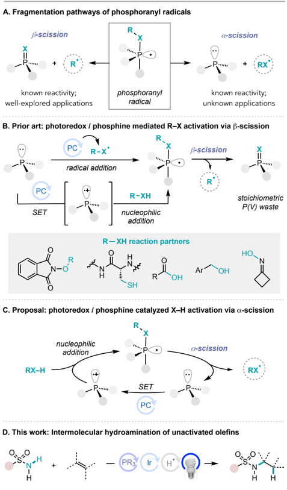
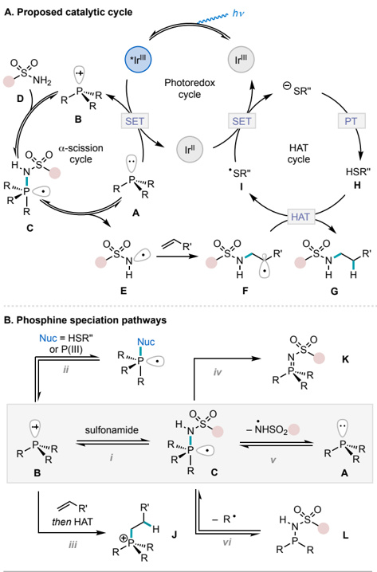
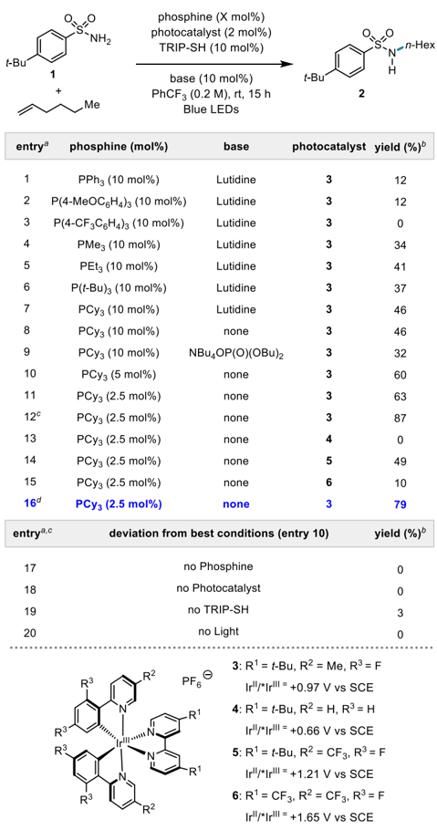
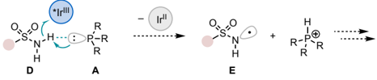
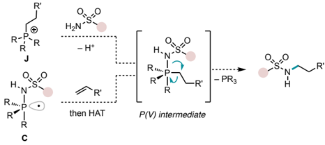
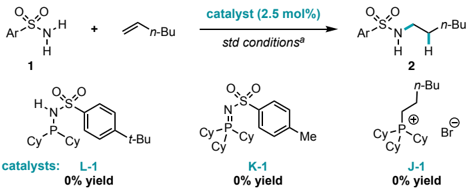
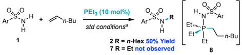
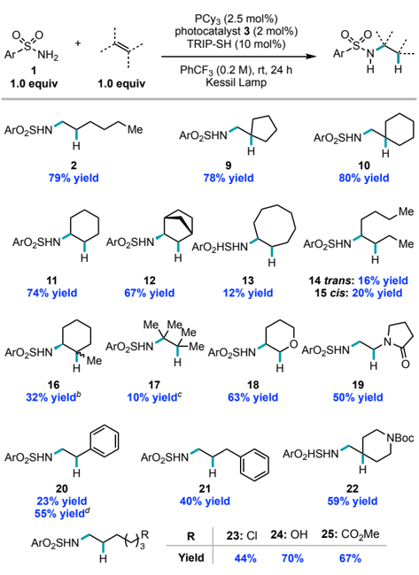
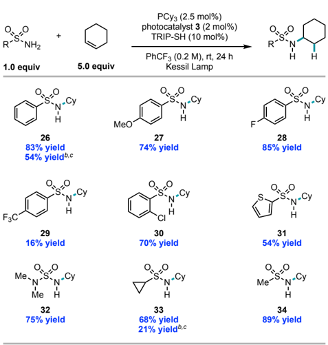
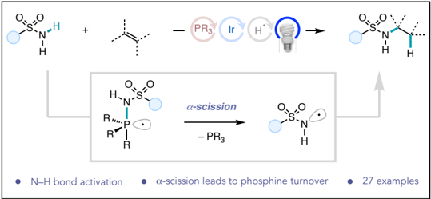

## Phosphine/Photoredox Catalyzed anti-Markovnikov Hydroamination of Olefins with Primary Sulfonamides via a -Scission from Phosphoranyl Radicals

Alex J. Chinn ‡,1 , Kassandra Sedillo ‡,1 , Abigail G. Doyle* ,1,2

- 1 Department of Chemistry, Princeton University, Princeton, New Jersey 08544, United States
- 2 Department of Chemistry and Biochemistry, University of California, Los Angeles, California 90095, United States

Supporting Information Placeholder

ABSTRACT: New strategies to access radicals from common feedstock chemicals hold the potential to broadly impact synthetic chemistry. We report a dual phosphine and photoredox catalytic system that enables direct formation of sulfonamidyl radicals from primary sulfonamides. Mechanistic investigations support that the N -centered radical is generated via a -scission of the P-N bond of a phosphoranyl radical intermediate, formed by sulfonamide nucleophilic addition to a phosphine radical cation. As compared to the recently well-explored β-scission chemistry of phosphoranyl radicals, this strategy is applicable to activation of N -based nucleophiles and is catalytic in phosphine. We highlight application of this activation strategy to an intermolecular anti-Markovnikov hydroamination of unactivated olefins with primary sulfonamides. A range of structurally diverse secondary sulfonamides can be prepared in good to excellent yields under mild conditions.

## INTRODUCTION

Photoredox catalysis and electrochemistry have enabled the development of valuable synthetic methods by offering mild, selective,  and  practical  mechanisms  for  electron  transfer. 1,2 While many common functional groups can be easily oxidized or reduced to afford reactive radical intermediates, many others remain inaccessible or present chemoselectivity challenges due to prohibitively high oxidation/reduction potentials. 3 A classic strategy to circumvent these challenges is to append a sacrificial redox auxiliary to the functional group to alter its redox potential, albeit this strategy introduces additional synthetic manipulations as well as accompanying waste and scope limitations. 4 Recently,  alternative  approaches,  such  as in  situ activation, 5 proton-coupled electron transfer (PCET), 6 molecular electrocatalysis, 2,7 electro-photochemistry, 8 and multi-photon excitation have been explored to enable the generation of valuable radical classes otherwise challenging to access directly from feedstock chemicals via electron transfer. 9

In this context, our group and others were drawn to phosphoranyl radicals to effect homolytic cleavage of otherwise redox inaccessible X-Y bonds via photoredox catalysis. 10,11 Seminal publications  from  Bentrude  and  Roberts  demonstrated  that these intermediates fragment through either an a - or b -scission pathway to produce a new radical and a resulting P(III) or P(V) species, respectively  (Figure 1A). 12 Historically, phosphoranyl radicals were accessed by direct radical addition to a P(III) species  and  the  harsh  conditions  required  for  radical  generation limited  widespread  synthetic  applications. 13 More  recently, photoredox catalysis has provided a platform to generate phosphoranyl radicals under mild conditions either via radical addition  to  the  P(III)  species  or  single-electron  oxidation  of  the P(III) species followed by nucleophilic addition (Figure 1B). 14 Thus, this activation strategy has seen recent widespread application for deoxygenation and desulfurization reactions of various common organic functional groups. 15 As an example, our group recently described the direct deoxygenation of benzylic alcohols and carboxylic acids and the hydroacylation of olefins with carboxylic acids using a phosphine in conjunction with

Figure 1. Synthesis and reactivity of phosphoranyl radicals.

visible light photoredox catalysis. 10

While  β-scission  methods  have  proven  to  be  effective  in overcoming voltage-gated restrictions, the process is thermodynamically driven by formation of the stoichiometric phosphine oxide byproduct, which has largely limited its utility to oxygenbased nucleophiles. We questioned whether taking advantage of the synthetically unexplored α-scission fragmentation pathway, wherein scission is instead kinetically favored due to an unpaired electron occupying a P-X antibonding orbital, could lead to new opportunities for synthesis and facilitate a process catalytic  in  phosphine (Figure 1C). Prior studies have shown that α-scission occurs site-selectively from the apical position of a phosphoranyl radical, and that electronegative functional groups  have  a  preference  for  the  apical  site,  suggesting  that electronegative ligands could selectively undergo α-scission. 12d, 12e, 16 As such, we envisioned a process wherein a trapped nucleophile would preferentially undergo α-scission, without displacing  any  P(III)  substituents  already  present,  enabling  the generation  of  radical  species  with  only  catalytic  amounts  of phosphine. While the generation of P=O/S bonds via β-scission could potentially compete with a -scission for many O- and Snucleophiles, we hypothesized that a catalytic α-scission strategy could be applied to N-based nucleophiles, for which no examples of β-scission have been reported. With these criteria in mind, we were drawn to study N-H bond activation of primary sulfonamides, which possess both high N-H bond strength and oxidation potential (BDFE ~ 105 kcal/mol, E 1/2 = +2.6 V versus SCE in MeCN). Here we demonstrate realization of this goal in the context of an anti-Markovnikov olefin hydroamination with primary sulfonamides catalyzed by both tricyclohexylphosphine (PCy 3 ) and a visible light photoredox catalyst (Figure 1D).

Intermolecular  hydroamination  reactions  between  primary sulfonamides and olefins are an attractive method for the direct and atom-economical synthesis of secondary sulfonamides, a prevalent structural feature in bioactive molecules. 17 Whereas Markovnikov-selective approaches have significant precedent, 18 only recently have methods accessing anti-Markovnikov selectivity  been  described.  In  particular,  Nicewicz    and  coworkers  described  a  photoredox-catalyzed  anti-Markovnikov hydroamination that proceeds via alkene radical cation intermediates. 19 Whereas this strategy is applicable to trisubstituted aliphatic alkenes and substituted styrenes, Knowles and co-workers  showed that anti-Markovnikov hydroamination of unactivated  olefins  was  possible  via  PCET  activation  of  the  N-H bonds to produce a sulfonamidyl radical. 20 While highly enabling,  the  intermolecular  reaction  has  not  been  extensively demonstrated beyond electron-rich p -methoxybenzenesulfonamide. Thus, identification of new catalytic strategies for N-H bond activation could offer synthetic advances in catalytic olefin hydroamination. 21, 22

## RESULTS AND DISCUSSION

We envisioned a catalytic cycle beginning with excitation of the  photocatalyst,  followed  by  single  electron  oxidation  of  a phosphine catalyst A to the corresponding radical cation B (Figure 2A). Nucleophilic trapping of B with sulfonamide D would form phosphoranyl radical intermediate C . a -Scission of the PN bond in C would liberate an N -centered radical E and regenerate the phosphine catalyst A . Reaction of the N -centered radical with the olefin partner would form intermediate F , which upon  hydrogen  atom  transfer  (HAT)  with  catalytic  thiol H , should generate the desired product G. Single electron transfer

(SET) between the thiyl radical I and the reduced photocatalyst, followed by proton transfer (PT), would regenerate the photocatalyst as well as the HAT catalyst, completing the cycle.

Figure 2. Proposed catalytic cycle and alternative speciation pathways.

Notably, success in the proposed scheme would require that reaction conditions are carefully tuned to accommodate the promiscuous reactivity of phosphine radical cation B and phosphoranyl radical C (Figure 2B). While nucleophilic trapping of a sulfonamide by B would progress the reaction ( i ), the presence of other nucleophilic species, such as excess P(III) A and thiol H , could lead to unproductive phosphoranyl radical formation ( ii )  and  subsequent  degradation. 23 Phosphine  radical  cations have also been shown to react with olefins which could then form the corresponding phosphonium species upon HAT ( iii ). 24 From  the  phosphoranyl  radical C ,  undesired  decomposition such as over-oxidation to form imidophosphorane K is possible ( iv ). 25 Moreover, while sulfonamide α-scission should be kinetically preferred ( v ), undesired P -R bond α-scission ( vi ) could give rise to aminophosphorane L . These pathways are likely to dominate if P -N bond α-scission is inefficient or if the N -centered  radical  is  not  rapidly  trapped  by  the  olefin,  leading  to reformation of the phosphoranyl radical.

With these considerations in mind, we embarked on initial reaction discovery efforts using the hydroamination of electronically unactivated 1-hexene with p -tert -butylbenzene sulfonamide 1 as a model system (Table 1). On the basis of our prior work, 10a we elected to evaluate [Ir(dF(Me)ppy) 2 dtbbpy]-PF 6 ( 3 )

[dF(Me)ppy = 2-(2,4-difluorophenyl)-5-methylpyridine; dtbbpy  =  4,4′-ditert -butyl-2,2′-bipyridine]  as  a  photocatalyst and lutidine as a base to facilitate proton transfer. Sterically hindered  2,4,6-tri iso propylbenzenethiol  (TRIP-SH)  was  selected as an HAT catalyst to sterically disfavor nucleophilic addition of the thiol to the phosphine radical cation. To our delight, we found that triphenylphosphine catalyzed the hydroamination in PhCF 3 as solvent, albeit in low yield (12%, entry 1). Electronrich P( p -MeOC 6 H 4 ) 3 showed no improvement in yield (12%) and electron-deficient P( p -CF 3 C 6 H 4 ) 3 afforded no product (entries 2 &amp; 3). We were excited to observe that trialkylphosphines exhibited  improved  levels  of  reactivity  (entries  4-7):  PCy 3 , which  is  commercially  available  and  relatively  inexpensive, provided the highest yield at 46%. 26

Next, we evaluated other reaction dimensions using PCy 3 as catalyst. Hydroamination proceeded in the absence of lutidine (entry  8),  likely  because  PCy 3 itself  has  comparable  basicity (pK a ~ 15 in MeCN) and can facilitate proton transfer with TRIP thiol. 27 Inclusion of a stronger base, such as the monophosphate base employed by Knowles and co-workers in their PCET hydroamination, led to decreased reaction yield, potentially due to promotion  of  undesired  nucleophilic  addition  into  the  phosphine radical cation ( ii in Figure 2B). Further experimentation revealed that the phosphine catalyst loading has a significant impact on reactivity, with lower loadings of phosphine showing an increase in yield (entries 8, 10, and 11). We attribute this observation to the fact that higher concentrations of phosphine could favor addition of the N -centered radical to PCy 3 to reform the phosphoranyl radical according to LeChatelier's principle (Figure 2B, reverse of vi ), which could ultimately favor catalyst decomposition according to pathways iv and vi .  We hypothesized that an increase in olefin stoichiometry could kinetically trap  the N -centered  radical,  potentially  outcompeting  the  decomposition pathways. Gratifyingly, reactions performed with two equivalents of olefin delivered product 2 in 87% yield (entry  12). 28 Interestingly,  despite  the  use  of  excess  olefin,  only monofunctionalized sulfonamide was observed, likely because the product is too sterically hindered to undergo nucleophilic addition to the phosphine radical cation. Upon evaluating a selection of Ir photocatalysts, we found that those with excited state oxidation potentials below that of PCy 3 were completely ineffective (entry 13). Catalysts with higher oxidation potentials also led to decreased yields, likely due to over oxidation of the phosphoranyl radical to form the imidophosphorane K (entries 14 &amp; 15, vida infra for full discussion of the catalytic relevance of K ). Finally, reactions run on 0.5 mmol scale were conducted using Kessil lamps (34 W) rather than blue LEDs (12 W), resulting in a notable increase in yield (entry 16). Control experiments revealed that each component was required in order to achieve high levels of reactivity (entries 17-20).

Although our observations during reaction optimization were consistent with a phosphoranyl radical mechanism, alternative reaction pathways could lead to product formation. Direct oxidation/deprotonation could instead generate a sulfonamidyl radical, or a multisite PCET pathway (Figure 3A), as demonstrated by Knowles and co-workers, could be operative. Alternatively, it is possible that C-N bond formation occurs through a reductive  elimination  mechanism  from  a  P(V)  intermediate  analogous to work from McNally and co-workers in C-C, C-O, and C-N bond formation (Figure 3B). 35 Such a species could arise from either nucleophilic addition of a sulfonamide to phosphonium J , or a two-step olefin addition/HAT process with a phosphoranyl radical.

Table 1. Optimization studies

The high redox potential and pK a of sulfonamides (E 1/2 = +2.6 V versus SCE in MeCN, pK a ~ 27 in MeCN ) 20 eliminates the possibility of a direct oxidation/deprotonation mechanism. Instead,  if  multisite  PCET  were  operative,  the  basic  phosphine and photocatalyst would work in concert to perform a net HAT (Figure 3A). 29 We reasoned that Stern-Volmer quenching studies would be effective in discriminating between this pathway and a phosphoranyl radical mechanism. 30 If a PCET pathway is operative,  then  a  combination  of  sulfonamide  and  phosphine would be more effective at quenching an excited photocatalyst than either component on its own. Instead, we found that PCy 3 was  more  effective  at  quenching  the  excited  photocatalyst

C. Stern-Volmer luminescence quenching experiments

(Figure 3C, red line, K SV = 1617) than the combination of the phosphine  and  sulfonamide,  which  produced  a  smaller  slope (green line, K SV =  1486) (Figure 3C, left). Studies conducted wherein sulfonamide concentration was increased in the presence  of  constant  phosphine  showed  a  slightly  negative  slope (K SV = -0.02) (Figure 3C, right). These experiments are inconsistent with a PCET mechanism, and suggest instead that hydrogen  bonding  between  the  phosphine  and  sulfonamide  removes electron density from the phosphine, making it a less effective  quenching  species. 31 We  also  assessed  the  effective BDFE of the oxidant/base pair, as demonstrated by Mayer and co-workers. 32 A value of approximately 90 kcal/mol is found for PCy 3 and [Ir(dF(Me)ppy) 2 (dtbbpy)]PF 6 whereas the calculated  BDFE  of  a  primary  sulfonamide  is  approximately  105 kcal/mol, making a PCET mechanism thermodynamically unlikely. 20,33 Instead,  the  rapid  oxidation  of  phosphine  in  these studies  indicates  that  a  phosphine  radical  cation  is  readily formed in the reaction mixture, which should facilitate phosphoranyl radical formation.

Although preliminary efforts to directly observe the phosphoranyl radical intermediate were unsuccessful, we were able to detect via 31 P NMR aminophosphine L-1 and imidophosphorane K-1 , which likely arise via the pathways outlined in Figure 2B (Figure 3D) (See SI Section 4.1 for full details). 34 While these species provide indirect evidence for the intermediacy of a  phosphoranyl  radical  intermediate,  we  also  recognized  that they could conceivably be catalytically relevant as either catalysts themselves or as bases in multisite PCET. However, subjecting independently synthesized samples of L-1 and K-1 to the reaction conditions in the absence of PCy 3 revealed that neither species was catalytically viable (Figure 3D).

While multiple examples of C-C bond formation via P(V) reductive elimination have been reported, 36 no examples exist for C(sp 3 )-N bond formation.  Nevertheless, we sought to experimentally evaluate the feasibility of the reductive C-N bond formation  pathway  in  Figure  3B.  First,  we  subjected  independently prepared phosphonium J-1 to  the catalytic reaction conditions  in  the  absence  of  PCy 3 (Fig  3D).  Hydroamination was  not  observed,  suggesting  that  the  nucleophilic  addition pathway to generate  the  P(V)  intermediate  is  not  viable,  although counterion effects may influence reactivity. While the olefin addition/HAT pathway is still possible, to the best of our knowledge, there are no reports wherein phosphoranyl radicals have been trapped by olefins, making this pathway unlikely. To investigate the proposed P(V) mechanism further, triethylphosphine was used as the catalyst under standard reaction conditions (Figure 3E). This catalyst would afford P(V) intermediate 8 , from which a mixture of ethylated and n -hexylated secondary sulfonamides ( 7 and 2 ) would be expected since there should be little to no difference in reductive elimination among these two primary alkyl substituents. However, formation of desired product 2 occurred in 50% yield while the ethylated product 7 was not observed by 1 H NMR nor HRMS (See SI Section 4.5 for full details). Together these studies provide strong evidence that the proposed α-scission mechanism is more likely than either a PCET or P(V) reductive elimination, and that PCy 3 is likely the active form of the catalyst.

We next examined a variety of olefins under our optimized reaction conditions. Acyclic, cyclic and bicyclic olefins underwent  hydroamination  to  afford  the  desired  products  in  high yield (Figure 4). Terminal monosubstituted, 1,1-disubstituted, and  1,2-disubstituted  olefins  were  also  competent  reaction partners ( 2,  9 -13 ).  In  the  case  of cis -  and trans -4-octene, we found that alkene configuration does not affect reactivity ( 14 -15 ). Trisubstituted and tetrasubstituted olefins were also competent substrates ( 16 -17 ),  albeit  hydroamination proceeded in lower yields, likely because sulfonamidyl radical trapping is not as efficient with these more hindered olefins, leading to reformation of the phosphoranyl radical and subsequent decomposition pathways (Figure 2B). In general, the electrophilic sulfonamidyl radical  undergoes  hydroamination  in  good  yield  with electron-rich olefins, such as an enol ether ( 18 ) and vinylpyrrolidinone ( 19 ). 37 Only modest reactivity is observed with styrene ( 20 ) and allyl benzene ( 21 ).

## A. Alternative mechanism: N-H activation via proton-coupled electron transfer

## B. Alternative mechanism: C-N bond formation from P(V) intermediate

## C. Stern-Volmer luminescence quenching experiments

## D. Catalytic performance of isolated P-derived byproducts

E. Evaluation of P(V) mechanism with mixed

n

-alkyl ligands

Figure 3. Mechanistic studies. a Std conditions: as in entry 16, Table 1 without PCy 3 .

Figure 4. Olefin scope. a Reactions performed on 0.5 mmol scale with 1.0 equiv. of sulfonamide 1 (Ar = p -t -butylbenzene ) and 1.0 equiv of olefin. Isolated yield, reported as an average of two runs. b 1:2 cis/trans mixture of diastereomers. c Reaction was conducted with 3.0 equiv. of olefin. d 1 H NMR yield determined by comparison to an internal standard.

Gratifyingly, the standard reaction conditions tolerate a wide range of functional groups, including carbamates ( 22 ), primary alkyl chlorides ( 23 ), unprotected primary alcohols ( 24 ), and methyl esters ( 25 ). The success of 24 , is particularly encouraging as no competitive β -scission was detected despite the presence of a nucleophilic alcohol.

Turning to the sulfonamide scope, we found that hydroamination  of  cyclohexene  with  benzenesulfonamide  under  the standard reaction conditions delivered only 54% of the desired product 26 (Figure  5).  We  hypothesized  that  electron-neutral and deficient arylsulfonamides and alkyl sulfonamides might undergo α-scission less efficiently due to the relative instability of the resulting N -centered radical. As such, we reasoned that reactivity could be improved by employing an excess of olefin to rapidly trap the sulfonamidyl radical, and prevent decomposition  of  the  catalyst.  Since  we  previously  observed  that  the method  is  selective  for  monoalkylation,  we  anticipated  that over-alkylation would not be an issue. While employment of an excess of olefin is not ideal, sulfonamides are often considered the more valuable component in drug discovery. 17c, 17d, 38

Figure 5. Sulfonamide scope. a Reactions were performed on 0.5 mmol scale. Isolated yield, reported as an average of two runs. b 1 H NMR  yield  determined  by  comparison  to  1,4-Bis(trimethylsilyl)benzene as an internal standard and reported as an average of two runs. c Reaction was conducted with 1.0 equiv. of olefin.

Gratifyingly, upon employing 5.0 equivalents of cyclohexene, we were able to isolate the secondary sulfonamides derived from  electron-rich  and  neutral  substrates  ( 11 , 26-28) in  7485% yield. However, an electron-deficient aryl sulfonamide delivered low yield ( 29 ), likely resulting from poor nucleophilicity of the substrate which limits its ability to trap the phosphine radical cation. Using these conditions, we were pleased to see a variety of medicinally relevant motifs undergo hydroamination. For example, ortho -chlorobenzenesulfonamidse ( 30 ),  a  structure prevalent in 12 approved drugs, 39 proved to be a competent coupling  partner  (70%  yield).  Additionally,  thiophene-2-sulfonamide,  a  scaffold  in  the  approved  drugs  dorzolamide  and brinzolamide, and N,N -dimethylsulfamoyl amine, present in the approved  drug  beclabuvir,  gave  products 31 and 32 ,  respectively. The catalytic reaction can be extended to aliphatic sulfonamides as well. Cyclopropyl and methyl sulfonamide underwent olefin hydroamination to afford 33 and 34 in 68 and 89% yield, respectively.

## CONCLUSION

In summary, we have developed a catalytic strategy for N-H activation of sulfonamides via phosphine and photoredox catalysis. This strategy was explored in an intermolecular anti-Markovnikov hydroamination of unactivated olefins with sulfonamides.  Mechanistic  studies  suggest  that  sulfonamidyl  radical generation proceeds via α-scission from a phosphoranyl radical intermediate in a polar-radical crossover pathway. We anticipate that with improved understanding of the reactivity and selectivity of phosphoranyl radicals it will be possible to further expand the diversity of nucleophiles and reaction classes capable of interfacing with phosphine/photoredox catalysis and apply this strategy in new synthetic contexts.

## ASSOCIATED CONTENT

## Supporting Information .

The Supporting Information is available free of charge at XXXX. Experimental procedures, experimental data, and characterization and spectral data for new compounds (PDF).

## AUTHOR INFORMATION

## Corresponding Author

Abigail G. Doyle -Department of Chemistry, Princeton University, Princeton, New Jersey 08544, United States; Department of Chemistry and Biochemistry, University of California, Los Angeles,  California  90095,  United  States; orcid.org/00000002-6641-0833; Email: agdoyle@chem.ucla.edu

## Authors

- Alex J. Chinn - Department of Chemistry, Princeton University, Princeton, New Jersey 08544, United States; Current address: AstraZeneca Oncology R&amp;D, 35 Gatehouse Drive, Waltham, Massachusetts  02451,  United  States; orcid.org/0000-00028020-7815

Kassandra  F.  Sedillo -Department  of  Chemistry,  Princeton University, Princeton, New Jersey 08544, United States

## Author Contributions

‡ A.J.C. and K.F.S. contributed equally.

## Funding Sources

Financial support for this project was provided by the BioLEC, an Energy Frontier Research Center funded by the U.S. Department of Energy, Office of Science, Office of Basic Energy Sciences under Award no. DE-SC0019370.

## Notes

The authors declare no competing financial interest.

## ACKNOWLEDGMENT

We thank Dr. John Eng for assistance with analytical equipment, and Dr. Jesus I. Martinez-Alvarado for helpful discussions.

## REFERENCES

1. (a) Shaw, M. H.; Twilton, J.; MacMillan, D. W. Photoredox Catalysis in Organic Chemistry. J. Org. Chem. 2016 , 81 , 6898926; (b) Romero, N. A.; Nicewicz, D. A. Organic Photoredox Catalysis. Chem. Rev. 2016 , 116 , 10075-10166; (c) Crespi, S.; Fagnoni, M. Generation of Alkyl Radicals: From the Tyranny of Tin to the Photon Democracy. Chem. Rev. 2020 , 120 , 97909833; (d) Narayanam, J. M. R.; Stephenson, C. R. J. Visible Light Photoredox Catalysis: Applications in Organic Synthesis. Chem. Soc. Rev. 2011 , 40 , 102-113; (e) Goddard, J.-P.; Ollivier, C.; Fensterbank, L. Photoredox Catalysis for the Generation of Carbon Centered Radicals. Acc.  Chem.  Res. 2016 , 49 ,  19241936.
2. (a) Yan, M.; Kawamata, Y.; Baran, P. S. Synthetic Organic Electrochemical  Methods  Since  2000:  On  the  Verge  of  a Renaissance. Chem. Rev. 2017 , 117 , 13230-13319; (b) Zhu, C.; Ang, N. W. J.; Meyer, T. H.; Qiu, Y.; Ackermann, L. Organic Electrochemistry:  Molecular  Syntheses  with  Potential. ACS Cent. Sci. 2021 , 7 , 415-431; (c) Shi, S.-H.; Liang, Y.; Jiao, N. Electrochemical Oxidation Induced Selective C-C  Bond Cleavage. Chem. Rev. 2021 , 121 , 485-505.
3. Roth, H. G.; Romero, N. A.; Nicewicz, D. A. Experimental and Calculated Electrochemical Potentials of Common Organic Molecules for Applications to Single-Electron Redox Chemistry. Synlett 2016 , 27 , 714-723.
4. (a) Guo, J.-J.; Hu, A.; Zuo, Z. Photocatalytic Alkoxy RadicalMediated Transformations. Tetrahedron Lett. 2018 , 59 , 21032111; (b) Chen, J. R.; Hu, X. Q.; Lu, L. Q.; Xiao, W. J. Visible Light  Photoredox-Controlled  Reactions  of  N-Radicals  and Radical Ions. Chem. Soc. Rev. 2016 , 45 , 2044-2056.
5. Wappes, E. A.; Nakafuku, K. M.; Nagib, D. A. Directed β CH Amination of Alcohols via Radical Relay Chaperones. J. Am. Chem. Soc. 2017 , 139 , 10204-10207.
6. (a) Gentry, E. C.; Knowles, R. R. Synthetic Applications of Proton-Coupled Electron Transfer. Acc. Chem. Res. 2016 , 49 , 1546-1556; (b) Tsui, E.; Wang, H.; Knowles, R. R. Catalytic Generation of Alkoxy Radicals From Unfunctionalized Alcohols. Chem. Sci. 2020 , 11 , 11124-11141; (c) Thammavongsy,  Z.;  Mercer,  I.  P.;  Yang,  J.  Y.  Promoting Proton Coupled Electron Transfer in Redox Catalysts Through Molecular Design. Chem. Commun. 2019 , 55 , 10342-10358.
7. (a) Novaes, L. F. T.; Liu, J.; Shen, Y.; Lu, L.; Meinhardt, J. M.;  Lin,  S.  Electrocatalysis  as  an  Enabling  Technology  for Organic Synthesis. Chem. Soc. Rev. 2021 , 50 , 7883-8346; (b) Savéant, J.-M. Molecular Catalysis of Electrochemical Reactions. Mechanistic Aspects. Chem. Rev. 2008 , 108 , 23482378.
8. (a) Liu, J.; Lu, L.; Wood, D.; Lin, S. New Redox Strategies in  Organic  Synthesis  by  Means  of  Electrochemistry  and Photochemistry. ACS Cent. Sci. 2020 , 6 , 1317-1340; (b) Yu, Y.; Guo, P.; Zhong, J.-S.; Yuan, Y.; Ye, K.-Y. Merging Photochemistry  with  Electrochemistry  in  Organic  Synthesis. Org. Chem. Front. 2020 , 7 , 131-135; (c) Huang, H.; Strater, Z. M.; Rauch, M.; Shee, J.; Sisto, T. J.; Nuckolls, C.; Lambert, T. H. Electrophotocatalysis with a Trisaminocyclopropenium Radical  Dication. Angew.  Chem.  Int.  Ed. 2019 , 58 ,  1331813322; (d) Zhang, W.; Carpenter, K. L.; Lin, S. Electrochemistry Broadens the Scope of Flavin Photocatalysis: Photoelectrocatalytic Oxidation of Unactivated Alcohols. Angew. Chem. Int. Ed. 2020 , 59 , 409-417; (e) Wang, F.; Stahl, S. S. Merging Photochemistry with Electrochemistry: Functional-Group Tolerant Electrochemical Amination C(sp 3 )-H Bonds. Angew. Chem. Int. Ed. 2019 , 58 of  Vicinal  C-H  Bonds. Science 2021 , 371 Wickens, Z. K. Potent Reductants via
9. of , 6385-6390; (f) Shen, T.; Lambert, T. H. Electrophotocatalytic Diamination ,  620-626;  (g) Cowper,  N.  G.  W.;  Chernowsky,  C.  P.;  Williams,  O.  P.; Electron-Primed Photoredox  Catalysis:  Unlocking  Aryl  Chlorides  for  Radical Coupling. J. Am. Chem. Soc. 2020 , 142 , 2093-2099.
9.  (a)  Glaser,  F.;  Kerzig,  C.;  Wenger,  O.  S.  Multi-Photon Excitation  in  Photoredox  Catalysis:  Concepts,  Applications, Methods. Angew. Chem. Int. Ed. 2020 , 59 ,  10266-10284; (b) Ravetz, B. D.; Pun, A. B.; Churchill, E. M.; Congreve, D. N.; Rovis, T.; Campos, L. M. Photoredox Catalysis Using Infrared Light via Triplet Fusion Upconversion. Nature 2019 , 565 , 343346.
10. (a) Stache, E. E.; Ertel, A. B.; Tomislav, R.; Doyle, A. G. Generation of Phosphoranyl Radicals via Photoredox Catalysis Enables Voltage-Independent Activation of Strong C-O Bonds. ACS Catal. 2018 , 8 , 11134-11139; (b) Martinez Alvarado, J. I.; Ertel, A. B.; Stegner, A.; Stache, E. E.; Doyle, A. G. Direct Use of  Carboxylic  Acids  in  the  Photocatalytic  Hydroacylation  of Styrenes  To  Generate  Dialkyl  Ketones. Org.  Lett. 2019 , 21 , 9940-9944.
11. (a) Zhang, M.; Xie, J.; Zhu, C. A General Deoxygenation Approach for Synthesis of Ketones From Aromatic Carboxylic Acids  and  Alkenes. Nat.  Commun. 2018 , 9 ,  3517-3527;  (b) Ruzi, R.; Ma, J.; Yuan, X.-A.; Wang, W.; Wang, S.; Zhang, M.;

Dai, J.; Xie, J.; Zhu, C. Deoxygenative Arylation of Carboxylic Acids by Aryl Migration. Chem. Eur. J. 2019 , 25 , 12724-12729. (c) Ning, Y.; Wang, S.; Li, M.; Han, J.; Zhu, C.; Xie, J. SiteSpecific Umpolung Amidation of Carboxylic Acids, Via Triplet Synergistic Catalysis. Nat. Commun. 2021 , 12 , 4637-4636.

12. (a)  Bentrude,  W.  G.  Phosphoranyl  Radicals  -  Their Structure, Formation, and Reactions. Acc. Chem. Res. 2002 , 15 , 117-125; (b)  Bentrude,  W.  G.;  Hansen,  E.  R.;  Khan,  W.  A.; Min, T. B.; Rogers, P. E. Free-Radical Chemistry of Organophosphorus Compounds.  III. α vs. β Scission in Reactions of Alkoxy  and Thiyl Radicals with Trivalent Organophosphorus Derivatives. J.  Am.  Chem.  Soc. 2002 , 95 , 2286-2293; (c) Bentrude, W. G.; Hansen, E. R.; Khan, W. A.; Rogers, P. E. α vs. β Scission in Reactions of Alkoxy and Thiyl Radicals  with  Diethyl  alkylphosphonites. J.  Am.  Chem.  Soc. 2002 , 94 , 2867-2868; (d) Davies, A. G.; Dennis, R. W.; Griller, D.;  Roberts,  B.  P.  A  Kinetic  Study  of  α-  and  β-scission  of Phosphoranyl  Radicals,  Rn.̄P(OR)4-n. J.  Organomet.  Chem. 1972 , 40 , 33-35; (e) Roberts, B. P.; Singh, K. Site-Selectivity in the β-Scission of Alkoxyphosphoranyl Radicals. A Reinterpretation. J. Chem. Soc., Perkin Trans. II 1980 ,  15491556.

13.  (a)  Zhang,  L.;  Koreeda,  M.  Radical  Deoxygenation  of Hydroxyl Groups via Phosphites. J. Am. Chem. Soc. 2004 , 126 , 13190-13191; (b) Ding, B.; Bentrude, W.  G. Trimethyl Phosphite as a Trap for Alkoxy Radicals Formed from the Ring Opening of Oxiranylcarbinyl Radicals. Conversion to Alkenes. Mechanistic Applications to the Study of C-C versus C-O Ring Cleavage. J. Am. Chem. Soc. 2003 , 125 , 3248-3259; (c) Jordan, P. A.; Miller, S. J. An  Approach  to  the Site-Selective Deoxygenation of Hydroxy Groups Based on Catalytic Phosphoramidite  Transfer. Angew.  Chem.  Int.  Ed. 2012 , 51 , 2907-2911.

14. (a) Rossi-Ashton, J. A.; Clarke, A. K.; Unsworth, W. P.; Taylor, R. J. K. Phosphoranyl Radical Fragmentation Reactions Driven by Photoredox Catalysis. ACS Catal. 2020 , 10 ,  72507261; (b) Hu, X.-Q.; Hou, Y.-X.; Liu, Z.-K.; Gao, Y. Recent Advances  in  Phosphoranyl  Radical-Mediated  Deoxygenative Functionalisation. Org. Chem. Front. 2020 , 7 ,  2319-2324; (c) Luo,  K.;  Yang,  W.  C.;  Wu,  L.  Photoredox  Catalysis  in Organophosphorus Chemistry. Asian  J.  Org.  Chem. 2017 , 6 , 350-367; (d) Pan, D.; Nie, G.; Jiang, S.; Li, T.; Jin, Z. Radical Reactions  Promoted  by  Trivalent  Tertiary  Phosphines. Org. Chem.  Front. 2020 , 7 ,  2349-2371;  (e)  Shao,  X.;  Zheng,  Y.; Ramadoss, V.; Tian, L.; Wang, Y. Recent Advances in P(III)Assisted  Deoxygenative  Reactions  Under  Photochemical  or Electrochemical  Conditions. Org.  Biomol.  Chem. 2020 , 18 , 5994-6005.

15.  (a)  Han,  J.  B.;  Guo,  A.;  Tang,  X.  Y.  Alkylation  of Allyl/Alkenyl Sulfones by Deoxygenation of Alkoxyl Radicals. Chemistry 2019 , 25 , 2989-2994; (b) Gao, X. F.; Du, J. J.; Liu, Z.;  Guo, J. Visible-Light-Induced Specific Desulfurization of Cysteinyl Peptide and Glycopeptide in Aqueous Solution. Org Lett 2016 , 18 ,  1166-9; (c) Zheng, L.; Xia, P. J.; Zhao, Q. L.; Qian, Y. E.; Jiang, W. N.; Xiang, H. Y.; Yang, H. Photocatalytic Hydroacylation of Alkenes by Directly Using Acyl Oximes. J Org Chem 2020 , 85 ,  11989-11996; (d) Ye, Z.-P.; Hu, Y.-Z.; Xia,  P.-J.;  Xiang,  H.-Y.;  Chen,  K.;  Yang,  H.  Photocatalytic Intermolecular Anti-Markovnikov Hydroamination of Unactivated Alkenes with N-Hydroxyphthalimide. Org. Chem. Front. 2021 , 8 , 273-277.

16. (a) Cooper, J. W.; Roberts, B. P. Configurational Effects in the α-Scission of Phosphoranyl Radicals. J. Chem. Soc., Perkin

Trans.  II 1976 ,  808-813;  (b)  Trippett,  S.  Apicophilicity  and Ring-Strain  in  Five-Coordinate  Phosphoranes. Phosphorus Sulfur 1976 , 1 , 89-98.

17.  (a)  Koksal,  Z.;  Kalin,  R.;  Camadan,  Y.;  Usanmaz,  H.; Almaz, Z.; Gulcin, I.; Gokcen, T.; Goren, A. C.; Ozdemir, H. Secondary Sulfonamides as Effective Lactoperoxidase Inhibitors. Molecules 2017 , 22 ;  (b)  Supuran,  C.  T.  Special Issue: Sulfonamides. Molecules 2017 , 22 ; (c) Zhao, C.; Rakesh, K. P.; Ravidar, L.; Fang, W.-Y.; Qin, H.-L. Pharmaceutical and Medicinal Significance of Sulfur (SVI)-Containing Motifs for Drug Discovery: A Critical Review. Eur. J. Med. 2019 , 162 , 679-734; (d) Apaydın, S.; Török, M. Sulfonamide Derivatives as  Multi-Target  Agents  for  Complex  Diseases. Bioorganic Med. Chem. Lett. 2019 , 29 , 2042-2050.

18. (a) Fei, J.; Wang, Z.; Cai, Z.; Sun, H.; Cheng, X. Synthesis of α-Tertiary Amine Derivatives by Intermolecular Hydroamination of Unfunctionalized Alkenes with Sulfamates under Trifluoromethanesulfonic Acid Catalysis. Adv. Synth. &amp; Catal. 2015 , 357 ,  4063-4068;  (b)  Karshtedt,  D.;  Bell,  A.  T.; Tilley, T. D. Platinum-Based Catalysts for the Hydroamination of  Olefins  with  Sulfonamides  and  Weakly  Basic  Anilines. J. Am. Chem. Soc. 2005 , 127 , 12640-12646; (c) Zhang, J.; Yang, C.-G.;  He,  C.  Gold(I)-Catalyzed  Intra-  and  Intermolecular Hydroamination  of  Unactivated  Olefins. J.  Am.  Chem.  Soc. 2006 , 128 , 1798-1799.

19.  Nguyen,  T.  M.;  Manohar,  N.;  Nicewicz,  D.  A.  AntiMarkovnikov Hydroamination of Alkenes Catalyzed by a TwoComponent  Organic  Photoredox  System:  Direct  Access  to Phenethylamine Derivatives. Angew. Chem. Int. Ed. 2014 , 53 , 6198-6201.

20. Zhu, Q.; Graff, D. E.; Knowles, R. R. Intermolecular AntiMarkovnikov  Hydroamination  of  Unactivated  Alkenes  with Sulfonamides Enabled by Proton-Coupled Electron Transfer. J Am Chem Soc 2018 , 140 , 741-747.

21.  (a)  Qin,  Q.;  Ren,  D.;  Yu,  S.  Visible-Light-Promoted Chloramination of Olefins with N-Chlorosulfonamide as Both Nitrogen and Chlorine Sources. Org. Biomol. Chem. 2015 , 13 , 10295-10298; (b) Chen, J.; Guo, H. M.; Zhao, Q. Q.; Chen, J. R.; Xiao, W. J. Visible Light-Driven Photocatalytic Generation of  Sulfonamidyl  Radicals  for  Alkene  Hydroamination  of Unsaturated  Sulfonamides. Chem. Commun. 2018 , 54 ,  67806783; (c) Hu, X.-Q.; Chen, J.-R.; Wei, Q.; Liu, F.-L.; Deng, Q.H.; Beauchemin, A. M.; Xiao, W.-J. Photocatalytic Generation of N-Centered Hydrazonyl Radicals: A Strategy for Hydroamination of β,γ-Unsaturated Hydrazones. Angew. Chem.  Int.  Ed. 2014 , 53 ,  12163-12167;  (d)  Miyazawa,  K.; Koike, T.; Akita, M. Regiospecific Intermolecular Aminohydroxylation of Olefins by Photoredox Catalysis. Chem. Eur. J. 2015 , 21 , 11677-11680.

22.  (a)  Lardy,  S.  W.;  Schmidt,  V.  A.  Intermolecular  Radical Mediated Anti-Markovnikov Alkene Hydroamination Using NHydroxyphthalimide. J.  Am.  Chem.  Soc. 2018 , 140 ,  1231812322;  (b)  Miller,  D.  C.;  Ganley,  J.  M.;  Musacchio,  A.  J.; Sherwood,  T.  C.;  Ewing,  W.  R.;  Knowles,  R.  R.  AntiMarkovnikov  Hydroamination  of  Unactivated  Alkenes  with Primary Alkyl Amines. J. Am. Chem. Soc. 2019 , 141 , 1659016594;  (c)  Nguyen,  S.  T.;  Zhu,  Q.;  Knowles,  R.  R.  PCETEnabled Olefin Hydroamidation Reactions with N-Alkyl Amides. ACS Catal. 2019 , 9 , 4502-4507.

23. (a) Yasui, S.; Shioji, K.; Tsujimoto, M.; Ohno, A. Reactivity of  a  Trivalent  Phosphorus  Radical  Cation  as  an  Electrophile Toward Pyridine Derivatives. Heteroat. Chem. 2000 , 11 , 152157; (b) Yasui, S.; Yamazaki, S. Intramolecular Stabilization of

- the Phosphine Radical Cation by the Second Phosphorus Atom during the Photooxidation of Diphosphines: 31P  NMR Spectroscopic Analysis. Chem. Lett. 2015 , 44 , 422-424.
24.  (a)  Zagumennov,  V.  A.;  Sizova,  N.  A.;  Nikitin,  E.  V. Electrochemical Oxidation of Tertiary Phosphines  in the Presence of Camphene. Russ. J. Gen. Chem. 2009 , 79 ,  14731482; (b)  Ohmori,  H.;  Takanami,  T.;  Masui,  M.  Reaction  of Triphenylphosphine Radical Cation with Cycloalkenes: Electrochemical One-Step Preparation of 1Cycloalkenyltriphenylphosphonium  Salts. Tetrahedron  Lett. 1985 , 26 , 2199-2200.
25. (a) Yasui,  S.; Shioji,  K.;  Ohno,  A.  Reactivity  of  a Phosphoranyl Radicals Generated by Photoreaction of Phenyl Diphenylphosphinite with 10-MethylAcridium Iodide - AlphaScission vs Single-Electron Transfer. Heteroat. Chem. 1994 , 5 , 85-90;  (b)  Yasui,  S.;  Shioji,  K.;  Tsujimoto,  M.;  Ohno,  A. Kinetic  Study  on  the  Reaction  of  Tributylphosphine  with Methylviologen.  Reactivity  of  the  Phosphine  Radical  Cation Intermediate  Towards  nucleophiles. J.  Chem.  Soc.,  Perkin Trans. II 1999 , 855-862.
26. Reactivity trends observed during optimization efforts were also observed in reactions conduted under optimized conditions. See SI Section 2.2 for full details.
27.  Haav,  K.;  Saame,  J.;  Kütt,  A.;  Leito,  I.  Basicity  of Phosphanes  and  Diphosphanes  in  Acetonitrile. Eur.  J.  Org. Chem. 2012 , 2012 , 2167-2172.
28. A control reaction conducted using Nmethylbenzenesulfonamide as a nucleophile showed no reactivity, confirming that second functionalization events are not possible under the reaction conditions.
29.  (a)  Mayer,  J.  M.  Proton-Coupled  Electron  Transfer:  A Reaction Chemist's View. Annu. Rev. Phys. Chem. 2004 , 55 , 363-390; (b) Darcy, J. W.; Koronkiewicz, B.; Parada, G. A.; Mayer,  J.  M.  A  Continuum  of  Proton-Coupled  Electron Transfer Reactivity. Acc. Chem. Res. 2018 , 51 , 2391-2399; (c) Weinberg, D. R.; Gagliardi, C. J.; Hull, J. F.; Murphy, C. F.; Kent, C. A.; Westlake, B. C.; Paul, A.; Ess, D. H.; McCafferty, D. G.; Meyer, T. J. Proton-Coupled Electron Transfer. Chem. Rev. 2012 , 112 , 4016-4093.
30. Arias-Rotondo, D. M.; McCusker, J. K. The photophysics of photoredox catalysis: a roadmap for catalyst design. Chem. Soc. Rev. 2016 , 45 , 5803-5820.
- photoexciteation, or the monitored wavelength of photocatalyst fluorescence
32. Warren, J. J.; Tronic, T. A.; Mayer, J. M. Thermochemistry of Proton-Coupled Electron Transfer Reagents and its Implications. Chem. Rev. 2010 , 110 , 6961-7001.
33.  Kargin,  Y.  M.;  Budnikova,  Y.  G.  Electrochemistry  of Organophosphorus Compounds. Russ. J. Gen. Chem. 2001 , 71 , 1393-1421.
34.  Aminophosphine L-1 is  only  observed  in  the  absence  of olefin or in reactions with sterically bulky phosphines.
35. (a) Hilton, M. C.; Zhang, X.; Boyle, B. T.; Alegre-Requena, J.  V.;  Paton,  R.  S.;  McNally,  A.  Heterobiaryl  Synthesis  by Contractive  C-C  Coupling  via  P(V)  Intermediates. Science 2018 , 362 ,  799-804;  (b)  Hilton,  M.  C.;  Dolewski,  R.  D.; McNally,  A.  Selective  Functionalization  of Pyridines via Heterocyclic Phosphonium Salts. J. Am. Chem. Soc. 2016 , 138 , 13806-13809;  (c)  Patel,  C.;  Mohnike,  M.;  Hilton,  M.  C.; McNally, A. A Strategy to Aminate Pyridines, Diazines, and Pharmaceuticals  via  Heterocyclic  Phosphonium  Salts. Org. Lett. 2018 , 20 , 2607-2610.
36. (a) Reichl, K. D.; Radosevich, A. T. A Phosphine-Mediated Stereocontrolled Synthesis of Z-Enediynes by a Vicinal Dialkynylation of Ethynylphosphonium Salts. Chem. Commun.
- 2014 , 50 , 9302-9305; (b) Uchida, Y.; Kozawa, H. Formation of 2,2′-Bipyridyl by Ligand Coupling on the Phosphorus Atom. Tetrahedron Lett. 1989 , 30 , 6365-6368.
37. Parsaee, F.; Senarathna, M.  C.; Kannangara,  P. B.; Alexander, S. N.; Arche, P. D. E.; Welin, E. R. Radical Philicity and its Role in Selective Organic Transformations. Nat. Rev. Chem. 2021 .
38.  Syed  Shoaib  Ahmad,  S.;  Gildardo,  R.;  Muhammad,  A. Recent  Advances  in  Medicinal  Chemistry  of  Sulfonamides. Rational  Design  as  Anti-Tumoral,  Anti-Bacterial  and  AntiInflammatory Agents. Mini-Rev. Med. Chem. 2013 , 13 , 70-86. 39. Wishart, D. S.; Feunang, Y. D.; Guo, A. C.; Lo, E. J.; Marcu, A.;  Grant,  J.  R.;  Sajed,  T.;  Johnson,  D.;  Li,  C.;  Sayeeda,  Z.; Assempour, N.; Iynkkaran, I.; Liu, Y.; Maciejewski, A.; Gale, N.; Wilson, A.; Chin, L.; Cummings, R.; Le, D.; Pon, A.; Knox, C.;  Wilson,  M.  DrugBank  5.0:  A  Major  Update  to  the DrugBank  Database  for  2018. Nucleic  Acids  Res. 2018 , 46 , 1074-1082.
31. The absorption spectra of the sulfonamide was not found to interfere  with  either  the  emitted  wavelength  of  light  for

