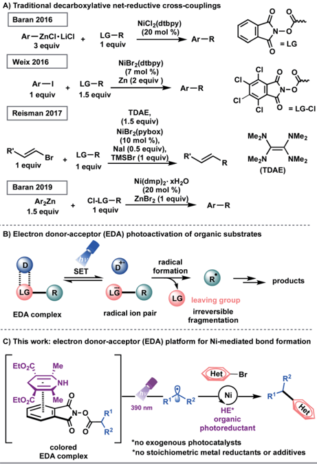
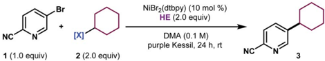
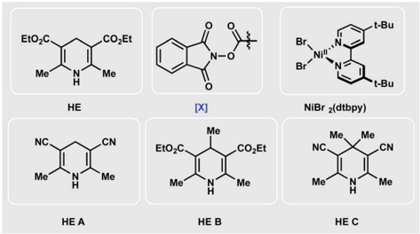
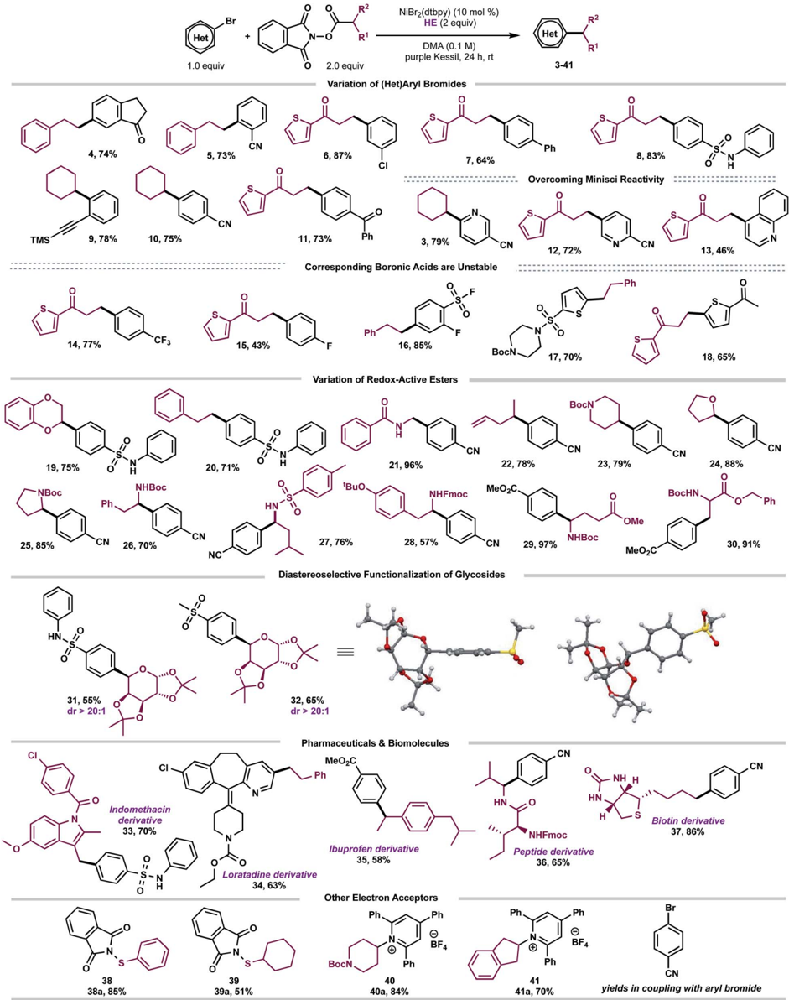
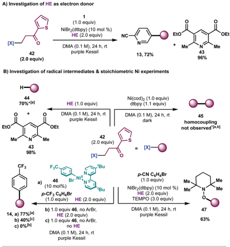
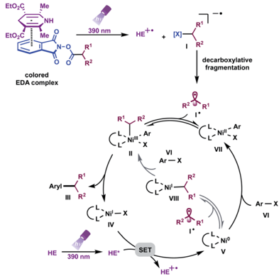

## Chemical Science

## EDGE ARTICLE

Cite this: Chem. Sci. , 2021, 12 , 5450

All publication charges for this article have been paid for by the Royal Society of Chemistry

Received 16th February 2021 Accepted 4th March 2021

DOI: 10.1039/d1sc00943e

rsc.li/chemical-science

## Introduction

Transition metal-catalyzed cross-couplings have become indispensable tools for the rapid assembly of C(sp 3 ) -C(sp 2 ) linkages in medicinal chemistry settings. 1 Among these platforms, netreductive cross-electrophile couplings are particularly advantageous because they facilitate the direct integration of alkyl electrophiles, 1 f , j ,2 bypassing the need for preformed, reactive carbon nucleophiles. 3 However, the vast majority of reductive crosscoupling reactions rely on (super)stoichiometric loadings of metal powders, including manganese and zinc as chemical reductants, to restore the active catalyst. 1 f , j ,2 In addition to safety concerns with respect to metal waste disposal, the industry's dependence on these reaction paradigms highlights the necessity for inexpensive and scalable strategies for the incorporation of abundant feedstocks in cross-coupling manifolds. 1 d ,4 Recently, several seminal studies have demonstrated the use of organic reducing agents in cross-electrophile processes. Pioneering work from Tanaka and colleagues showcased the use of tetrakis(dimethylamino)ethylene (TDAE) as a homogeneous organic reductant to achieve the homo-coupling of aryl halides. 5 Subsequently, the Weix group utilized this reductant to activate C(sp 3 )-hybridized electrophiles. 2 a ,6 In 2017, Reisman demonstrated that TDAE, in place of

Roy and Diana Vagelos Laboratories, Department of Chemistry, University of Pennsylvania, 231 South 34th Street, Philadelphia, Pennsylvania 19104-6323, USA

† Electronic supplementary information (ESI) available: Experimental and computational details, as well as spectral data. CCDC 2062315. For ESI and crystallographic data in CIF or other electronic format see DOI: 10.1039/d1sc00943e

‡ These authors contributed equally.

|

View Article Online View Journal  | View Issue

## Photoactive electron donor -acceptor complex platform for Ni-mediated C(sp 3 ) -C(sp 2 ) bond formation †

Lisa Marie Kammer, ‡ Shorouk O. Badir, ‡ Ren-Ming Hu and Gary A. Molander *

A dual photochemical/nickel-mediated decarboxylative strategy for the assembly of C(sp 3 ) -C(sp 2 ) linkages is disclosed. Under light irradiation at 390 nm, commercially available and inexpensive Hantzsch ester (HE) functions as a potent organic photoreductant to deliver catalytically active Ni(0) species through singleelectron transfer (SET) manifolds. As part of its dual role, the Hantzsch ester e ff ects a decarboxylativebased radical generation through electron donor -acceptor (EDA) complex activation. This homogeneous, net-reductive platform bypasses the need for exogenous photocatalysts, stoichiometric metal reductants, and additives. Under this cross-electrophile paradigm, the coupling of diverse C(sp 3 )-centered radical architectures (including primary, secondary, stabilized benzylic, a -oxy, and a -amino systems) with (hetero)aryl bromides has been accomplished. The protocol proceeds under mild reaction conditions in the presence of sensitive functional groups and pharmaceutically relevant cores.

manganese or zinc, functions as a terminal organic reductant in the enantioselective cross-coupling of alkylN -hydroxyphthalimide esters (redox active esters, RAEs) with alkenyl bromides (Scheme 1A). 7 These protocols, however, are complicated by the air-sensitive nature of the organic super-electron-donor. 8 Strategies utilizing amines and tris(trimethylsilyl)silane as non-metallic reducing agents have also been disclosed. 9

In recent years, photochemical methods have been enlisted to assemble challenging structural motifs using excitable catalysts under visible-light conditions. Such systems are inherently mild, e ffi cient at room temperature, and evade the need for reactive additives (pyrophoric reagents, strong bases, harsh oxidants and reductants). 10 In these dual manifolds, the reduced state of the photocatalyst has been proposed to restore the catalytically active Ni 0 species through single-electron transfer (SET) events. 11 However, the majority of these redoxactive auxiliaries are based on precious metals including ruthenium and iridium, presenting limitations with respect to scalability and sustainability. 12 These processes are further complicated by the oxidation/reduction steps of the photocatalyst. To establish a complementary reactivity mode, the Melchiorre group elegantly reported the direct photoexcitation of 4-alkyl-1,4-dihydropyridines (DHPs) to trigger the generation of C(sp 3 ) -centered radicals in the absence of external catalysts. 13,14 Although this advancement presented a milestone in its own right, the scope of the radical precursor in the reported Ni-catalyzed C(sp 3 ) -C(sp 2 ) cross-coupling was limited to secondary and stabilized primary systems 13 a owing to competitive C -H bond scission inherent to DHP feedstocks. 15 In this context, the generation of heteroatom- and unactivated carbon-

Open Access A

A) Traditional decarboxylative net-reductive cross-couplings

BY-NO

cC)

NiCI2(dtbpy)

· Ar-R

3 equiv

Weix 2016

Ar —I|

1 equiv

Br

Arzzn

1.5 equiv

LG

Me

Me colored

EDA complex

1 equiv

N-O

= LG

Scheme 1 (A) Strategies toward net-reductive decarboxylative-based cross-couplings. (B) Overview of electron donor -acceptor (EDA) photoactivation. (C) Electron donor -acceptor (EDA) complex platform for Ni-mediated alkyl transfer using HE as an organic photoreductant.

based radicals through direct visible-light excitation in Nicatalyzed cross-couplings remains underdeveloped.

Recently, synthetic methods driven by the photoactivity of electron donor -acceptor (EDA) complexes (Scheme 1B) have gained considerable momentum, including borylation, thioetheri  cation, and sulfonylation. 16 Inspired by this advance, we examined the feasibility of EDA complex photoactivation as an enabling technology in Ni-mediated C(sp 3 ) -C(sp 2 ) crosscouplings (Scheme 1C). Under light irradiation at 390 nm, a commercially available and inexpensive electron donor, Hantzsch ester (HE, diethyl-1,4-dihydro-2,6-dimethyl-3,5pyridinedicarboxylate), serves as a potent organic photoreductant to deliver diverse radical architectures from carboxylic acid feedstocks 17 for further functionalization in Nicatalyzed cross-couplings. As part of its dual role, the excited HE modulates the oxidation state of the transition-metal, delivering catalytically active Ni(0) species, thus bypassing the need for exogenous, expensive photocatalysts.

## Discussion

Encouraged by the potential synthetic applications of harnessing photoactive EDA complexes toward Ni-mediated bond

(20 mol %)

formation, we examined the feasibility of the proposed netreductive cross-electrophile coupling using 5-bromo-2cyanopyridine 1 and cyclohexylN -hydroxyphthalimide-ester 2 as model substrates (Table 1). From the outset of our investigation, it was evident that the solvent plays a key role in this process (entries 1 -4), as it heavily a ff ects the molecular assembly and formation of EDA complexes. Once exciplexbased charge transfer occurs, the resulting radical ion pair is stabilized by interaction with solvent dipoles. 18 In this vein, dimethylacetamide (DMA) proved crucial to the success of this photochemical method.

We then studied the in  uence of the dihydropyridine (DHP) backbone on the e ffi cacy of the cross-coupling (Table 1, entries 5 -7). To this end, we subjected four di ff erent DHP derivatives to the reaction conditions to gain a deeper understanding of their dual role in EDA complex photoactivation as well as the reduction of Ni species through SET paradigms. It was demonstrated that Hantzsch ester (HE) and cyano substitution at C3 and C5 of the DHP (HE A , entry 5) promoted the reaction most e ffi ciently. For experimental simplicity, commercially available and inexpensive Hantzsch ester HE was adopted as the standard photoreductant. The C-4-substituted DHP (HE B , entry 6) resulted in diminished reactivity. Not surprisingly, 4,4 0 -dimethyl HE C (entry 7) led to no product formation. This result can be rationalized by the lack of photooxidative aromatization as an intrinsic driving force to supress a competitive back electron transfer (BET) event from the radical ion pair, restoring the ground-state EDA complex. 16 a ,19 Finally, a ligand screen was performed (Table 1, entries 10 -12), demonstrating that 4,4 0 -ditert -butyl-2,2 0 -bipyridine (dtbpy), 2,2 0 -bipyridine (bpy), and electron-rich 4,4 0 -dimethoxy-2,2 0 -bipyridine (dMeObpy) function as viable ligand frameworks. Of note, modest conversion to 3 was observed using ligand-free nickel(II) bromide trihydrate.

Notably, the developed net-reductive photochemical conditions are user-friendly, employing an air-stable nickel precatalyst and a mild, homogeneous reductant (HE). Deviations from the standard reaction setup are tolerated. For example, modest product formation was observed when the reaction was carried out under air (Table 1, entry 9). Similarly, although superior reactivity was accomplished using purple Kessil irradiation ( l max ¼ 390 nm), a ff ording a potent photoreductant [ E red(HE * /HE c + ) ¼  2.28 V vs. SCE], 20 comparable results were achieved under blue light (entry 8, l max ¼ 456 nm). Control experiments demonstrated that all reaction parameters are key to the formation of C(sp 3 ) -C(sp 2 ) linkages (Table 1, entries 14 -16).

With suitable conditions established, we examined the scope of the decarboxylative arylation employing a broad palette of (hetero)aryl bromides (Scheme 2). In general, organic halides substituted with electron-withdrawing groups exhibited excellent reactivity, although electron-neutral and electron-donating groups also a ff orded the desired products in modest yields. More sterically-encumbered ortho -substituted aryl bromides ( 5 , 9 ) did not hinder the cross-coupling e ffi cacy. Furthermore, substitution at the meta position ( 4 , 6 ) is tolerated. Several sensitive functional groups, including secondary sulfonamides ( 8 , 19 , 20 , 31 ), ketones ( 4 , 11 , 18 ), trimethylsilylalkyne ( 9 ), and

Open Access A

NC

BY-NO

cC)

EtO2C.

Me*

NC.

Me^

1.34

Br

\_CN

Me

EtO2C.

Me*

\_COzEt

Me

Br.

purple Kessil, 24 h, rt

Bri

Table 1 Optimization of the reaction conditions a

HE

[×]

Me

NiBr ½(dtbpy)

a Optimization reactions were performed using 1 (0.1 mmol), 2 (0.2 mmol), HE (0.2 mmol), and NiBr2(dtbpy) (10 mol%) in dry, degassed solvent (1.0 mL, 0.1 M) under purple Kessil irradiation for 24 h at rt. b Product to internal standard ratio (P/IS) was calculated using 1,3,5-trimethoxybenzene as internal standard using LC-MS analysis of the crude reaction mixture. c Isolated yield of 3 on 0.5 mmol scale.

|   Entry | Deviation from std conditions   | 3/IS ratio b   |   Entry | Deviation from std conditions   | 3/IS ratio b   |
|---------|---------------------------------|----------------|---------|---------------------------------|----------------|
|       1 | None                            | 1.42 (79%) c   |       9 | Under air                       | 0.93           |
|       2 | DMSO                            | Traces         |      10 | NiBr 2 (dMe-phen)               | Traces         |
|       3 | THF                             | Traces         |      11 | NiBr 2 (bpy)                    | 1.32           |
|       4 | MeCN                            | 0.32           |      12 | NiBr 2 (dMeObpy)                | 1.37           |
|       5 | HE A                            | 1.40           |      13 | NiBr 2 $ 3H 2 O                 | 0.92           |
|       6 | HE B                            | 0.36           |      14 | No light                        | 0              |
|       7 | HE C                            | 0              |      15 | No Ni                           | 0              |
|       8 | Blue Kessil                     | 1.34           |      16 | No HE                           | Traces         |

terminal alkene ( 22 ) remained intact under the developed photoredox conditions. To this end, substrates 6 , 9 and 22 can be further diversi  ed via Kumada-, sila-Sonogashira-couplings, as well as Giese-type additions, respectively. 21

Notably, several heteroarenes (electron-de  cient: 3 , 12 , 13 , 34 and electron-rich: 17 , 18 ) were compatible structural motifs. In particular, nitrogen-containing heteroaryl bromides, including quinoline ( 13 ) and pyridine ( 3 , 12 , 34 ) sca ff olds, reacted in a chemoselective fashion to yield C(sp 3 ) -C(sp 2 ) linkages, despite their propensity to undergo visible lightmediated Minisci C -H alkylation with alkylN -hydroxyphthalimide-esters. 22 This demonstrates a complementary reactivity mode to existing Minisci protocols, delivering linchpins that drive molecular complexity. 23

Next, the aliphatic photocoupling was evaluated with respect to redox-active carboxylate derivatives (Scheme 2). The reaction proceeded smoothly using a diverse array of proteinogenic and non-proteinogenic amino acids ( 21 , 23 , 25 -30 ). Bifunctional reagents, including Boc- ( 17 , 23 , 25 -26 , 29 -30 ) and Fmoc-protected ( 28 ) amines, a ff orded the arylated products without compromising yields. The scope was further extended to secondary, benzylic ( 35 ), and stabilized a -oxy ( 19 , 24 , 31 , 32 ) radical architectures. Remarkably,

|

primary alkyl systems that lack any radical stabilizing groups displayed exceptional reactivity ( 4 -8 , 11 -18 ), providing a clear advantage in terms of scope over previously reported protocols. 13 a Of note, medicinally relevant structures including thiophene ( 6 -8 ), piperidine ( 23 ), and pyrrolidine ( 25 ) motifs were e ffi ciently incorporated.

To demonstrate the amenability of this cross-coupling for late-stage functionalization, including glycodiversi  cation of drug sca ff olds, photoredox-generated glycosyl radicals were successfully harnessed in this dual-catalytic manifold (Scheme 2). The desired C-aryl carbohydrates ( 31 and 32 ) were obtained in good yields and excellent diastereoselectivity (dr &gt; 20 : 1). The relative con  guration of the major diastereomer 32 was elucidated based on X-ray crystallography with the aryl group cis with respect to the dimethyl acetal protecting group (Scheme 2). E ffi cient decarboxylative arylation was observed with pharmaceutically relevant cores, displaying a high density of pendant functional groups, including indomethacin 24 and loratadine 25 precursors ( 33 , 34 ). To evaluate the amenability toward bioactive molecules further, carboxylic acid derivatives stemming from dipeptide ( 36 ) and D-biotin ( 37 ) were subjected to the reaction conditions. The corresponding cross-coupled products were obtained in moderate

10

NiBr2 (dtbpy) (10 mol %)

HE (2.0 equiv)

DMA (0.1 M)

NO HE

-t-Bu

Open Access A

BY-NO

cC)

2.0 equiv

3-41

Scheme 2 Scope of the developed C(sp 3 ) -C(sp 2 ) cross-coupling. All values correspond to isolated yields after puri fi cation. Reaction conditions as depicted in Table 1, entry 1 (0.5 mmol scale).

to high yields (65 -86%). Finally, to demonstrate the versatility of EDA paradigms toward Ni-catalyzed bond-forming processes, the cross-coupling was further extended to other electron acceptors including redox-active thiols ( 38a -39a ) 26 and pyridinium-activated amines ( 40a -41a ) 9 b ,16 d ,27 in the absence of external catalysts.

Open Access A

A)

BY-NO

cC)

10

B)

0.6

To gain insight into the mechanism of this photochemical net-reductive cross-coupling, we analysed the reaction components by UV/vis absorption spectroscopy (Fig. 1). In line with seminal reports, 16 although cyclohexylN -hydroxyphthalimideester shows absorption in the visible light region, mixtures of the RAE and HE in DMA at 0.2 M display a signi  cant bathochromic shi  (Fig. 1B, brick red and blue lines).

The absorption band (brick red line) stems from the formation of a new molecular aggregation, a colored EDA complex (Fig. 1A), exhibiting a wavelength band tailing to 500 nm. Preliminary studies revealed an association constant of 2.04 M  1 of HE with 2 , indicating a plausible EDA complex association event prior to homolytic fragmentation (Fig. 1C). Analysis of this complex using Job's method 29 revealed a 1 : 1 stoichiometry of the most absorbing species (Fig. 1D). Notably, concentration is a crucial parameter for e ff ective crosscoupling. A dilute reaction mixture (10  4 M) exhibits a blueshi  ed absorption band, indicating the inhibition of EDA complex formation (see ESI † ). Furthermore, a DMA solution of HE was found to absorb visible light ( l &gt; 400 nm), indicating selective photoexcitation of this species at 390 nm to generate a potent reducing agent (Fig. 1B, purple line). Under the optimized reaction conditions, near full recovery of pyridine was observed (relative to 2.0 equiv. of HE), demonstrating the role of aryl bromide

RAE

excited HE as an organic single-electron donor in this system (Scheme 3A).

To probe the formation of alkyl radical intermediates, TEMPO trapping experiments were performed. The corresponding TEMPO-adduct was isolated in 63% yield and con  rmed via HRMS analysis (Scheme 3B, bottom right). Stoichiometric experiments with Ni complex 46 , synthesized through oxidative addition of 4-bromobenzotri  uoride to Ni(cod)2/dtbpy, revealed that C(sp 3 ) alkyl transfer does not occur in the absence of HE, thus highlighting the likelihood of EDA complex activation for e ff ective cross-coupling (Scheme 3B, bottom le  ). As anticipated, Ni complex 46 is catalytically active in the reaction, delivering the desired arylated product in 77% yield (Scheme 3B, bottom le  ).

Furthermore, negligible conversion of 42 was observed in the presence of stoichiometric amounts of Ni(COD)2/dtbpy; traces of homocoupling or alkene-side products, if any, were detected in the crude mixture, ruling out the role of Ni as a catalytic reductant toward redox-active esters (Scheme 3B, top right). Finally, it is worth noting that reduction of redox-active esters with photoredox catalysts is reported in the presence of HE as a hydrogen atom transfer (HAT) donor. 30 A model reaction in the absence of Ni/dtbpy and aryl halide a ff orded the hydroalkylated product in 70% yield with full recovery of pyridine

Fig. 1 (A) Visual appearance of reaction components and mixtures thereof. (B) UV/vis absorption spectra measured in DMA (0.1 M) unless otherwise noted. Ni complex ¼ NiBr2(dtbpy), aryl bromide ¼ 4-bromobenzonitrile, and RAE ¼ cyclohexylN -hydroxyphthalimide ester. Mixture refers to a DMA solution of all reaction components. (C) Benesi -Hildebrand plot. 28 (D) Job plot 29 for a mixture of N -(cyclohexyl)-hydroxyphthalimide ester ( 2 ) and HE in DMA (0.2 M).

|

UV/vis Studies

Open Access A

A) Investigation of HE as electron donor

BY-NO

NiBr2 (dtbpy) (10 mol %)

cC)

42

(2.0 equiv)

B) Investigation of radical intermediates &amp; stoichiometric Ni experiments

44

70%*(a]

43

98%

a) (10 mol%)

p-CF3 C&amp;H&amp;Br

Me

NH

HE (2.0 equiv)

NC-

EtO

OEt

colored

EDA complex

Aryl -

HE

HE+*

Scheme 3 (A) Investigation of HE as electron donor. (B) Mechanistic experiments. [a] Isolated yield on 0.3 mmol scale, [b] analysed via GC-MS analysis, [c] NMR yield, * 1.0 equiv. of 42. (C) Proposed mechanism.

(Scheme 3B, top le  ). These  ndings demonstrate that the rate of alkyl radical addition to aryl-Ni(II) species VII must be faster than hydrogen atom abstraction from HE.

Based on these experiments, we propose a mechanistic scenario involving the intermediacy of an EDA complex between the electron-de  cient, aliphatic redox-active esters and the electron-rich HE (Scheme 3C). Photoirradiation at 390 nm triggers an intra-complex SET event, generating a dihydropyridine radical cation and a phthalimide radical anion. The latter species undergoes decarboxylative fragmentation to yield an alkyl radical I c . Although the absorptivity of the EDA complex is signi  cantly greater than that of the Hantzsch ester itself, and although the entropic advantage inherent in intra-complex

Me charge transfer provides an enormous rate enhancement over intermolecular SET, we cannot rule out the intervention of some direct electron transfer from the photoexcited Hantzsch ester to initiate radical formation from the RAE. This high-energy, C(sp 3 )-hybridized intermediate can su ff er two potential fates. Based on previous computational studies, 11 one plausible mechanistic pathway involves initial radical combination with a Ni 0 species, generating a Ni I intermediate that engages in oxidative addition with the aryl halides to produce high valent Ni III species II . Subsequent reductive elimination from this complex yields the desired cross-coupled product and the corresponding L n Ni I species IV . At this juncture, a key SET event from the excited state HE [ E red(HE * /HE c + ) ¼  2.28 V vs. SCE 20 ] to Ni [ E red(Ni I /Ni 0 ) ¼  1.17 V vs. SCE in THF 10 d ] regenerates the active Ni 0 catalyst. However, a process that involves initial oxidative addition of the aryl halides to Ni 0 species V , a ff ording aryl-Ni II complex VII , cannot be ruled out based on stoichiometric experiments with Ni complex 46 (Scheme 3B). In this scenario, VII would engage the radical to generate Ni III complex II , which would then be carried on through the catalytic cycle.

## Conclusion

In summary, we have demonstrated the implementation of an electron donor -acceptor (EDA) complex platform toward Nicatalyzed C(sp 3 ) -C(sp 2 ) bond formation, circumventing the need for exogenous photocatalysts, additives, and stoichiometric metal reductants. Under the developed conditions, the generation of heteroatom- and unactivated carbon-based radicals through direct visible-light excitation of diverse electron acceptors is feasible, providing a clear advantage in terms of scope over previously reported photochemical systems. 13 Upon light irradiation at 390 nm, excited HE functions as a potent organic photoreductant exhibiting a dual role: generation of reactive C(sp 3 )-hybridized radicals through EDA complex activation as well as restoration of the desired catalytically active Ni(0) species through SET paradigms. This decarboxylative cross-electrophile arylation is amenable to the synthesis of peptidomimetics, drug-like molecules, and the diastereoselective functionalization of carbohydrates. The commercial availability of carboxylic acids and related electron acceptor species facilitates the rapid incorporation of diverse carbonand heteroatom-based radical architectures with high functional group tolerance. Key mechanistic and spectroscopic studies highlight the necessity for EDA photoactivation for e ffi cient alkyl transfer and help inform the design of improved EDA-based paradigms in Ni-catalyzed cross-couplings.

## Author contributions

Shorouk O. Badir conceived the topic. Lisa Marie Kammer, Shorouk O. Badir, and Ren-Ming Hu completed experiments with input from Gary A. Molander. Shorouk O. Badir and Lisa Marie Kammer prepared the manuscript with input from Gary A. Molander.

## Confl icts of interest

There are no con  icts to declare.

## Acknowledgements

The authors are grateful for  nancial support provided by NIGMS (R35 GM 131680 to G. M.). Shorouk O. Badir is supported by the Bristol-Myers Squibb Graduate Fellowship for Synthetic Organic Chemistry. The NSF Major Research Instrumentation Program (award NSF CHE-1827457), the NIH supplement awards 3R01GM118510-03S1 and 3R01GM08760506S1, as well as the Vagelos Institute for Energy Science and Technology supported the purchase of the NMRs used in this study. We thank Dr Charles W. Ross, III (UPenn) for mass spectral data and Dr Patrick Carroll (UPenn) for X-ray crystallography data. Merck is acknowledged for donation of aryl halide informer sets. Access to a UV/vis spectrophotometer was provided by the Petersson lab (UPenn). We thank Kessil for donation of lamps.

## Notes and references

- 1 For selected examples see: ( a ) R. Jana, T. P. Pathak and M. S. Sigman, Chem. Rev. , 2011, 111 , 1417 -1492; ( b ) P. G. Gildner and T. J. Colacot, Organometallics , 2015, 34 , 5497 -5508; ( c ) C. C. C. Johansson Seechurn, M. O. Kitching, T. J. Colacot and V. Snieckus, Angew. Chem., Int. Ed. , 2012, 51 , 5062 -5085; ( d ) L.-C. Campeau and N. Hazari, Organometallics , 2019, 38 , 3 -35; ( e ) J. Choi and G. C. Fu, Science , 2017, 356 , 7230; ( f ) J. Gu, X. Wang, W. Xue and H. Gong, Org. Chem. Front. , 2015, 2 , 1411 -1421; ( g ) X. Hu, Chem. Sci. , 2011, 2 , 1867 -1886; ( h ) A. Kaga and S. Chiba, ACS Catal. , 2017, 7 , 4697 -4706; ( i ) X. Ma, B. Murray and M. R. Biscoe, Nat. Rev. Chem. , 2020, 4 , 584 -599; ( j ) D. J. Weix, Acc. Chem. Res. , 2015, 48 , 1767 -1775.
- 2 For selected examples see: ( a ) D. A. Everson, R. Shrestha and D. J. Weix, J. Am. Chem. Soc. , 2010, 132 , 920 -921; ( b ) D. A. Everson and D. J. Weix, J. Org. Chem. , 2014, 79 , 4793 -4798; ( c ) J. Gu, C. Qiu, W. Lu, Q. Qian, K. Lin and H. Gong, Synthesis , 2017, 49 , 1867 -1873; ( d ) X. Yu, T. Yang, S. Wang, H. Xu and H. Gong, Org. Lett. , 2011, 13 , 2138 -2141; ( e ) B. P. Woods, M. Orlandi, C.-Y. Huang, M. S. Sigman and A. G. Doyle, J. Am. Chem. Soc. , 2017, 139 , 5688 -5691; ( f ) Y. Jin, H. Yang and C. Wang, Org. Lett. , 2019, 21 , 7602 -7608; ( g ) N. T. Kadunce and S. E. Reisman, J. Am. Chem. Soc. , 2015, 137 , 10480 -10483; ( h ) C. E. I. Knappke, S. Grupe, D. G¨ artner, M. Corpet, C. Gosmini and A. Jacobi von Wangelin, Chem. -Eur. J. , 2014, 20 , 6828 -6842; ( i ) T. Moragas, A. Correa and R. Martin, Chem. -Eur. J. , 2014, 20 , 8242 -8258; ( j ) Z.-X. Tian, J.-B. Qiao, G.-L. Xu, X. Pang, L. Qi, W.-Y. Ma, Z.-Z. Zhao, J. Duan, Y.-F. Du, P. Su, X.-Y. Liu and X.-Z. Shu, J. Am. Chem. Soc. , 2019, 141 , 7637 -7643; ( k ) A. H. Cherney and S. E. Reisman, J. Am. Chem. Soc. , 2014, 136 , 14365 -14368; ( l ) K. M. M. Huihui, J. A. Caputo, Z. Melchor, A. M. Olivares, A. M. Spiewak, K. A. Johnson, T. A. DiBenedetto, S. Kim,

|

- L. K. G. Ackerman and D. J. Weix, J. Am. Chem. Soc. , 2016, 138 , 5016 -5019; for selected examples using electrochemical methods, see: ( m ) H. Li, C. P. Breen, H. Seo, T. F. Jamison, Y.-Q. Fang and M. M. Bio, Org. Lett. , 2018, 20 , 1338 -1341; ( n ) T. Koyanagi, A. Herath, A. Chong, M. Ratnikov, A. Valiere, J. Chang, V. Molteni and J. Loren, Org. Lett. , 2019, 21 , 816 -820; for cross-electrophile coupling in biological environments, see: ( o ) D. T. Flood, S. Asai, X. Zhang, J. Wang, L. Yoon, Z. C. Adams, B. C. Dillingham, B. B. Sanchez, J. C. Vantourout, M. E. Flanagan, D. W. Piotrowski, P. Richardson, S. A. Green, R. A. Shenvi, J. S. Chen, P. S. Baran and P. E. Dawson, J. Am. Chem. Soc. , 2019, 141 , 9998 -10006.
2. 3 For selected examples on decarboxylative arylation using carbon preformed nucleophiles, see: ( a ) T.-G. Chen, H. Zhang, P. K. Mykhailiuk, R. R. Merchant, C. A. Smith, T. Qin and P. S. Baran, Angew. Chem., Int. Ed. , 2019, 58 , 2454 -2458; ( b ) J. Cornella, J. T. Edwards, T. Qin, S. Kawamura, J. Wang, C.-M. Pan, R. Gianatassio, M. Schmidt, M. D. Eastgate and P. S. Baran, J. Am. Chem. Soc. , 2016, 138 , 2174 -2177; ( c ) X.-G. Liu, C.-J. Zhou, E. Lin, X.-L. Han, S.-S. Zhang, Q. Li and H. Wang, Angew. Chem., Int. Ed. , 2018, 57 , 13096 -13100; ( d ) F. Toriyama, J. Cornella, L. Wimmer, T.-G. Chen, D. D. Dixon, G. Creech and P. S. Baran, J. Am. Chem. Soc. , 2016, 138 , 11132 -11135.
3. 4 M. J. Buskes and M.-J. Blanco, Molecules , 2020, 25 , 3493.
4. 5 ( a ) M. Kuroboshi, Y. Waki and H. Tanaka, Synlett , 2002, 2002 , 0637 -0639; ( b ) M. Kuroboshi, Y. Waki and H. Tanaka, J. Org. Chem. , 2003, 68 , 3938 -3942.
5. 6 ( a ) L. L. Anka-Lu ff ord, K. M. M. Huihui, N. J. Gower, L. K. G. Ackerman and D. J. Weix, Chem. -Eur. J. , 2016, 22 , 11564 -11567; ( b ) D. A. Everson, B. A. Jones and D. J. Weix, J. Am. Chem. Soc. , 2012, 134 , 6146 -6159; for a dual catalytic system utilizing TDAE as reductant, see: ( c ) D. J. Charboneau, E. L. Barth, N. Hazari, M. R. Uehling and S. L. Zultanski, ACS Catal. , 2020, 10 , 12642 -12656.
6. 7 N. Suzuki, J. L. Hofstra, K. E. Poremba and S. E. Reisman, Org. Lett. , 2017, 19 , 2150 -2153.
7. 8 ( a ) C. Burkholder, W. R. Dolbier and M. M´ edebielle, J. Org. Chem. , 1998, 63 , 5385 -5394; ( b ) A. Kolomeitsev, M. M´ edebielle, P. Kirsch, E. Lork and G.-V. R¨ oschenthaler,
- J. Chem. Soc., Perkin Trans. 1 , 2000, 2183 -2185; ( c )
- F. Glaser, C. B. Larsen, C. Kerzig and O. S. Wenger, Photochem. Photobiol. Sci. , 2020, 19 , 1035 -1041.
10. 9 For selected examples, see: ( a ) K. Shimomaki, K. Murata, R. Martin and N. Iwasawa, J. Am. Chem. Soc. , 2017, 139 , 9467 -9470; ( b ) J. Yi, S. O. Badir, L. M. Kammer, M. Ribagorda and G. A. Molander, Org. Lett. , 2019, 21 (9), 3346 -3351; ( c ) T. Q. Chen and D. W. C. MacMillan, Angew. Chem., Int. Ed. , 2019, 58 , 14584 -14588; ( d ) Q.-Y. Meng, T. E. Schirmer, K. Katou and B. K¨ onig, Angew. Chem., Int. Ed. , 2019, 58 , 5723 -5728; ( e ) F. Cong, X.-Y. Lv, C. S. Day and R. Martin, J. Am. Chem. Soc. , 2020, 142 , 20594 -20599; ( f ) H. Guan, Q. Zhang, P. J. Walsh and J. Mao, Angew. Chem., Int. Ed. , 2020, 59 , 5172 -5177; ( g ) S. Patel, S. O. Badir and G. A. Molander, Trends Chem. , 2021, 3 , 161 -175; ( h )

- P. Zhang, C. C. Le and D. W. C. MacMillan, J. Am. Chem. Soc. , 2016, 138 , 8084 -8087.
2. 10 For selected examples, see: ( a ) J. C. Tellis, D. N. Primer and G. A. Molander, Science , 2014, 345 , 433; ( b ) Z. Zuo, D. T. Ahneman, L. Chu, J. A. Terrett, A. G. Doyle and D. W. MacMillan, Science , 2014, 345 , 437 -440; ( c ) D. N. Primer, I. Karakaya, J. C. Tellis and G. A. Molander, J. Am. Chem. Soc. , 2015, 137 , 2195 -2198; ( d ) B. J. Shields and A. G. Doyle, J. Am. Chem. Soc. , 2016, 138 , 12719 -12722; ( e ) D. R. Heitz, K. Rizwan and G. A. Molander, J. Org. Chem. , 2016, 81 , 7308 -7313; ( f ) J. C. Tellis, C. B. Kelly, D. N. Primer, M. Jou ff roy, N. R. Patel and G. A. Molander, Acc. Chem. Res. , 2016, 49 , 1429 -1439; ( g ) J. K. Matsui, S. B. Lang, D. R. Heitz and G. A. Molander, ACS Catal. , 2017, 2563 -2575; ( h ) J. A. Milligan, J. P. Phelan, S. O. Badir and G. A. Molander, Angew. Chem., Int. Ed. , 2019, 58 , 6152 -6163; ( i ) S. O. Badir and G. A. Molander, Chem , 2020, 6 , 1327 -1339; ( j ) A. Lipp, S. O. Badir and G. A. Molander, Angew. Chem., Int. Ed. , 2021, 60 , 1714 -1726.
3. 11 O. Gutierrez, J. C. Tellis, D. N. Primer, G. A. Molander and M. C. Kozlowski, J. Am. Chem. Soc. , 2015, 137 , 4896 -4899.
4. 12 K. Teegardin, J. I. Day, J. Chan and J. Weaver, Org. Process Res. Dev. , 2016, 20 , 1156 -1163.
5. 13 For selected examples, see: ( a ) L. Buzzetti, A. Prieto, S. R. Roy and P. Melchiorre, Angew. Chem., Int. Ed. , 2017, 56 , 15039 -15043; ( b ) G. Goti, B. Bieszczad, A. Vega-Pe ˜ naloza and P. Melchiorre, Angew. Chem., Int. Ed. , 2019, 58 , 1213 -1217; ( c ) T. van Leeuwen, L. Buzzetti, L. A. Perego and P. Melchiorre, Angew. Chem., Int. Ed. , 2019, 131 , 5007 -5011; ( d ) E. Gandolfo, X. Tang, S. Raha Roy and P. Melchiorre, Angew. Chem., Int. Ed. , 2019, 58 , 16854 -16858; ( e ) B. Bieszczad, L. A. Perego and P. Melchiorre, Angew. Chem., Int. Ed. , 2019, 58 , 16878 -16883; ( f ) N. Alandini, L. Buzzetti, G. Favi, T. Schulte, L. Candish, K. D. Collins and P. Melchiorre, Angew. Chem., Int. Ed. , 2020, 59 , 5248 -5253; ( g ) L. Cardinale, M. O. Konev and A. J. von Wangelin, Chem. -Eur. J. , 2020, 26 , 8239.
6. 14 For selected example on the direct excitation of boracenebased alkylborates, see: Y. Sato, K. Nakamura, Y. Sumida, D. Hashizume, T. Hosoya and H. Ohmiya, J. Am. Chem. Soc. , 2020, 142 , 9938 -9943.
7. 15 ( a ) R. S. Varma and D. Kumar, Tetrahedron Lett. , 1999, 40 , 21 -24; ( b ) X. Bi, T. Tang, X. Meng, M. Gou, X. Liu and P. Zhao, Catal. Sci. Technol. , 2020, 10 , 360 -371; ( c ) C. Zheng and S.-L. You, Chem. Soc. Rev. , 2012, 41 , 2498 -2518; ( d ) G.-B. Shen, L. Xie, H.-Y. Yu, J. Liu, Y.-H. Fu and M. Yan, RSC Adv. , 2020, 10 , 31425 -31434.
8. 16 For selected examples, see: ( a ) G. E. Crisenza, D. Mazzarella and P. Melchiorre, J. Am. Chem. Soc. , 2020, 142 , 5461 -5476; ( b ) A. Noble, R. S. Mega, D. P  ¨ asterer, E. L. Myers and V. K. Aggarwal, Angew. Chem., Int. Ed. , 2018, 57 , 2155 -2159; ( c ) B. Liu, C.-H. Lim and G. Miyake, J. Am. Chem. Soc. , 2017, 139 (39), 13616 -13619; ( d ) J. Wu, P. S. Grant, X. Li,
- A. Noble and V. K. Aggarwal, Angew. Chem., Int. Ed. , 2019, 58 , 5697 -5701; ( e ) A. Fawcett, J. Pradeilles, Y. Wang, T. Mutsuga, E. L. Myers and V. K. Aggarwal, Science , 2017, 357 , 283 -286; ( f ) L. Chen, J. Liang, Z.-Y. Chen, J. Chen, M. Yan and X.-j. Zhang, Adv. Synth. Catal. , 2019, 361 , 956 -960; ( g ) J. Zhang, Y. Li, R. Xu and Y. Chen, Angew. Chem., Int. Ed. , 2017, 129 , 12793 -12797; ( h ) D. Chen, L. Xu, T. Long, S. Zhu, J. Yang and L. Chu, Chem. Sci. , 2018, 9 , 9012 -9017; ( i ) C. Zheng, G.-Z. Wang and R. Shang, Adv. Synth. Catal. , 2019, 361 , 4500 -4505.
10. 17 S. Murarka, Adv. Synth. Catal. , 2018, 360 , 1735 -1753.
11. 18 ( a ) B. Lipp and T. Opatz, in Photochemistry , RSC, 2019, vol. 46, pp. 370 -394; ( b ) G. J. Kavarnos and N. J. Turro, Chem. Rev. , 1986, 86 , 401 -449; ( c ) N. J. Turro, Pure Appl. Chem. , 1981, 53 , 259; ( d ) N. J. Turro, Modern Molecular Photochemistry , Benjamin/Cummings, Menlo Park, CA, 1978; ( e ) N. J. Turro, V. Rammamurthy, W. Cherry and W. Farneth, Chem. Rev. , 1978, 78 , 125.
12. 19 ( a ) R. Foster, J. Phys. Chem. , 1980, 84 , 2135 -2141; ( b ) S. V. Rosokha and J. K. Kochi, Acc. Chem. Res. , 2008, 41 , 641 -653.
13. 20 J. Jung, J. Kim, G. Park, Y. You and E. J. Cho, Adv. Synth. Catal. , 2016, 358 , 74 -80.
14. 21 ( a ) B. Giese, Angew. Chem., Int. Ed. , 1983, 22 , 753 -764; ( b ) J. Huang and S. P. Nolan, J. Am. Chem. Soc. , 1999, 121 , 9889 -9890; ( c ) G. Dyker, Angew. Chem., Int. Ed. , 1999, 38 , 1698 -1712.
15. 22 ( a ) T. C. Sherwood, N. Li, A. N. Yazdani and T. G. M. Dhar, J. Org. Chem. , 2018, 83 (5), 3000 -3012; ( b ) L. Kammer, A. Rahman and T. Opatz, Molecules , 2018, 23 , 764; ( c )

R.

A.

Garza-Sanchez,

A.

Tlahuext-Aca,

G.

Tavakoli and

- F. Glorius, ACS Catal. , 2017, 7 , 4057 -4061; ( d ) M.-C. Fu,
- R. Shang, B. Zhao, B. Wang and Y. Fu, Science , 2019, 363 , 1429 -1434.
3. 23 F. Minisci, R. Bernardi, F. Bertini, R. Galli and M. Perchinummo, Tetrahedron , 1971, 27 , 3575 -3579.
4. 24 G. Alv´ an, M. Orme, L. Bertilsson, R. Ekstrand and L. Palm´ er, Clin. Pharmacol. Ther. , 1975, 18 , 364 -373.
5. 25 R. S. Geha and E. O. Meltzer, J. Allergy Clin. Immunol. , 2001, 107 , 751 -762.
6. 26 ( a ) S. Graßl, C. Hamze, T. J. Koller and P. Knochel, Chem. -Eur. J. , 2019, 25 , 3752 -3755; ( b ) V. P. Reddy, A. V. Kumar, K. Swapna and K. R. Rao, Org. Lett. , 2009, 11 , 1697 -1700; ( c ) B. Liu, C.-H. Lim and G. M. Miyake, J. Am. Chem. Soc. , 2017, 139 , 13616 -13619.
7. 27 R. Martin-Montero, V. R. Yatham, H. Yin, J. Davies and R. Martin, Org. Lett. , 2019, 21 (8), 2947 -2951.
8. 28 H. A. Benesi and J. Hildebrand, J. Am. Chem. Soc. , 1949, 71 , 2703 -2707.
9. 29 J. S. Renny, L. L. Tomasevich, E. H. Tallmadge and D. B. Collum, Angew. Chem., Int. Ed. , 2013, 52 , 11998 -12013.
10. 30 For selected examples, see: G. Pratsch, G. L. Lackner and L. E. Overman, J. Org. Chem. , 2015, 80 , 6025 -6036.