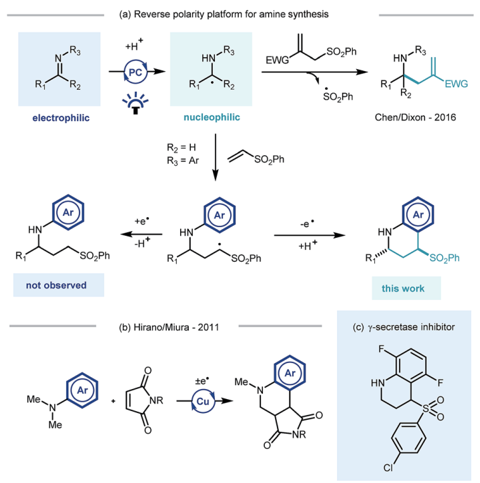
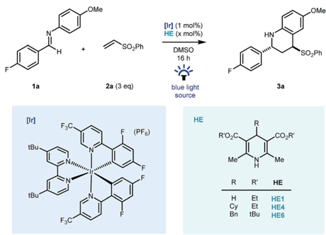
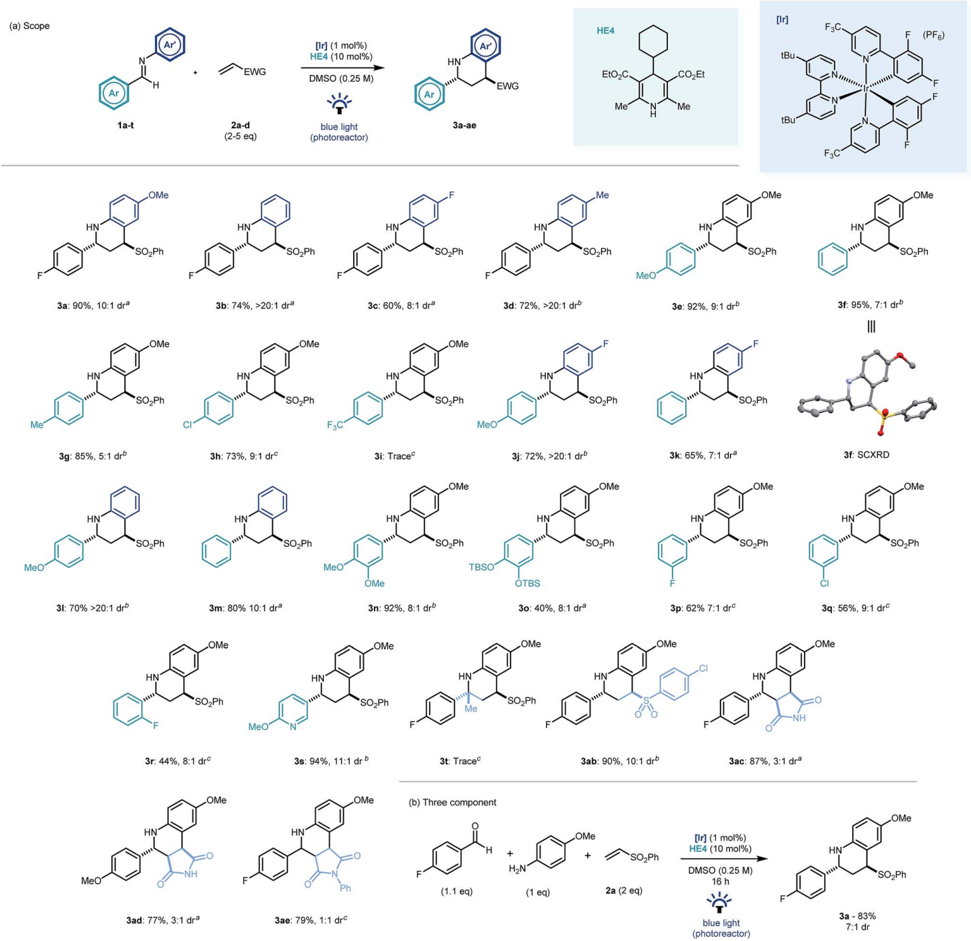
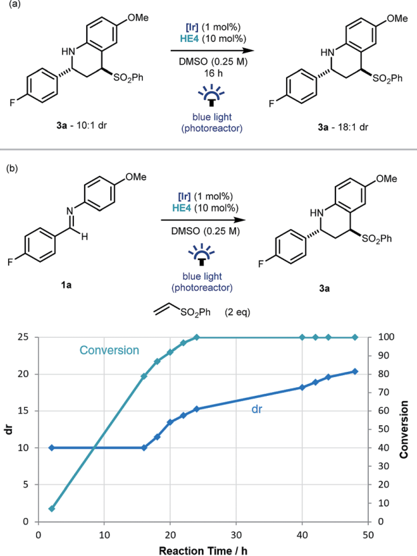
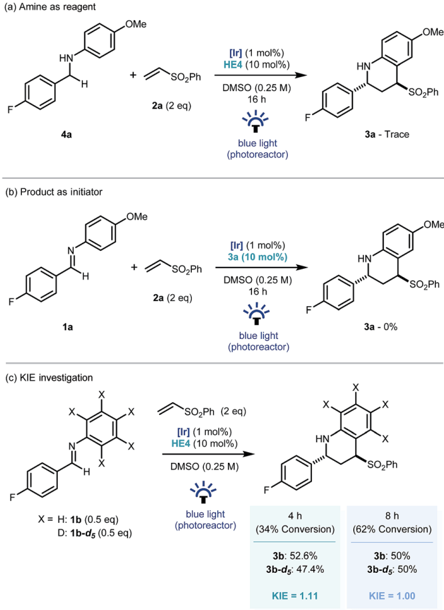
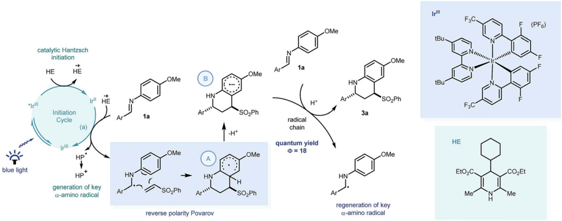

le Arrik

ID

a

en i

\ *₴

HN

Open Access /

(a) Reverse polarity platform for amine synthesis

R2 = H

R3 = Ar

-SO,Ph

## EDGE ARTICLE

HN'

SO,Ph

SO,Ph

Cite this: Chem. Sci. , 2018, 9

, 6653

All publication charges for this article have been paid for by the Royal Society of Chemistry

Received 13th April 2018 Accepted 6th July 2018

DOI: 10.1039/c8sc01704b

rsc.li/chemical-science

## Introduction

Photoredox catalysis, through its ability to generate reactive radical intermediates under mild yet highly tunable reaction conditions and experimental set-ups, 1 o ff ers great potential for new reaction discovery. 2 Pioneering developments have significantly expanded the synthetic toolbox 3 and have been applied in the construction of building blocks 4 and natural products, 5 and also in the derivatization of biologically relevant molecules 6 and macromolecular peptide structures. 7

Photocatalytic approaches to the synthesis and functionalisation of amines and their derivatives -with direct impact on medicinal chemistry programmes 8 -have been particularly prevalent. 9 Recent e ff orts have focussed on the photocatalytic generation and trapping of a -amino radicals derived from a range of starting materials. 10 Noteworthy examples include single electron transfer (SET) decarboxylation of amino acid derivatives, 11 direct hydrogen atom transfer (HAT) of aliphatic amines, 12 or via the SET reduction of imine derivatives. 13 The resulting a -amino radicals have been shown to subsequently engage in radical -radical coupling reactions, 14 partake in transition metal catalysed cross coupling processes or react with a range of electrophilic species. 15

Building on Knowles' seminal studies on proton coupled electron transfer (PCET) for the generation of a -heteroatom radicals, 13 a our group recently reported the photocatalytic

a Department of Chemistry, Chemical Research Laboratory, University of Oxford, 12 Mans  eld Road, Oxford, UK. E-mail: darren.dixon@chem.ox.ac.uk

b Davenport Research Laboratories, Department of Chemistry, University of Toronto, 80 St. George Street, Toronto, ON, Canada

c Janssen Research and Development, C/Rio Jarama, 75A, Toledo, Spain

† Electronic supplementary information (ESI) available. CCDC 1831373. For ESI and crystallographic data in CIF or other electronic format see DOI: 10.1039/c8sc01704b

+H+

EWG

„SO,Ph

SO,Ph

Ri

'EWG

Chen/Dixon - 2016

HN

## Photocatalytic reverse polarity Povarov reaction †

Jamie A. Leitch, a Angel L. Fuentes de Arriba, a Joanne Tan, b Oskar Ho ff , a Carlos M. Mart ´ ı nez c and Darren J. Dixon * a

A visible light mediated iridium photocatalysed reverse polarity Povarov reaction of aryl imines and electron de fi cient alkenes is described. Operating via a putative nucleophilic a -amino radical, generated by a proton coupled electron transfer process, addition to a range of conjugated electron de fi cient alkene substrates a ff ords substituted tetrahydroquinoline products in high yields and with typically good to excellent diastereoselectivity in favor of the trans diastereoisomer. Sub-stoichiometric quantities of Hantzsch ester were found to be key to initiate the overall redox-neutral, free radical cyclization cascade. This new reaction complements existing two electron Lewis acid mediated variants and expands the capabilities of imine umpolung chemistry to synthetically relevant cyclisation methodology.

reductive coupling of imines with allyl sulfone electrophiles using Eosin Y as the photocatalyst, and Hantzsch ester as the stoichiometric reductant, under green LED light irradiation. 15 b Contemporaneously Chen, 15 a and later Ngai, 15 c reported similar reactivity of in situ generated a -amino radicals from imines. Such a reversal of the natural imine polarity via the PCET manifold establishes a new umpolung approach for the synthesis of a -functionalised amines (Scheme 1a), and creates many opportunities for new reaction discovery.

Scheme 1 Previous reports in the context of this work. PC ¼ photocatalyst.

View Article Online View Journal  | View Issue

Open Access /

1a

[r]

tBu- tBu

OMe

SO,Ph

In a continuation of our programme, we sought to explore and expand the synthetic utility of photocatalytic imine umpolung chemistry. Our previous work demonstrated that the a -allylated amine product was the outcome of the reaction with Michael acceptors bearing a sulfone leaving group. 15 b With prospective coupling partners not possessing a suitable leaving group it was unclear as to what the outcome of the reaction would be. Following nucleophilic addition, the intermediate g -amino radical could either gain a further electron and proton to form the Michael addition product, 15 a or potentially cyclize onto the pendant electron rich aromatic ring and subsequently rearomatize (Scheme 1a). Both pathways would be synthetically useful but the latter would allow the direct construction of the biologically relevant tetrahydroquinoline sca ff old, examples of which have shown to possess biological activity in g -secretase inhibitors (Scheme 1c) 16 and androgen agonists/antagonists. 17 Previous studies by Hirano and Miura on the copper catalysed redox coupling of N , N -dimethylaniline and maleimide derivatives provided some precedent for the cyclisation pathway (Scheme 1b) 18 and encouraged us to investigate along these lines of enquiry. Herein, we wish to report our  ndings. 16 h

[Ir] (1 mol%)

HE (x mol%)

DMSO

OMe

SO,Ph

Preliminary studies were carried out using  uorine tagged aldimine ( 1a ), phenyl vinyl sulfone ( 2a , 3 equiv.) as the Michael acceptor, (Ir[dF(CF3)ppy]2(dtbbpy))PF6 ( [Ir] , 1 mol%) as photocatalyst and the commercial Hantzsch ester ( HE1 , 1.2 equiv.) as a stoichiometric reductant, in DMSO, under blue LED light irradiation. Pleasingly, good reactivity was identi  ed early and importantly cyclised product 3a -a reverse polarity Povarov product 19 -was formed as the sole coupling product in the reaction mixture (Table 1, entry 1) as a 7 : 1 mixture of diastereomers. Despite the typical use of Hantzsch esters as a superstoichiometric reductive quencher in photoredox coupling reactions of imines, 20,21 our redoxneutral process bene  ted from the use of 60 mol% HE1 . This was largely due to suppression of over-reduction and aza-pinacol side products (entry 2) and the use of substituted Hantzsch esters ( HE4 &amp; HE6 , entries 3 &amp; 4) further suppressed their formation. 16,22 Further reduction of the Hantzsch ester loading to 10 mol% led to lower reaction conversions (entry 5) using blue LED irradiation, however by switching to a commercial photoreactor, full conversion was achieved in 16 hours and the product was isolated in excellent yield (90%) as a 10 : 1 mixture of diastereomers. The reaction methodology was also amenable to a reduction in equivalents of vinyl sulfone coupling partner without major impact on reaction e ffi ciency (entry 7) and reactivity was completely lost on removal of Hantzsch ester (entry 8), or iridium photocatalyst (entry 9), and in the absence of light (entry 10).

With optimal conditions established, we looked to probe the scope of the photocatalytic reverse polarity Povarov reaction (Scheme 2a). Initially, the tolerance to variation on the aniline portion of the aldimine was investigated. Pleasingly, the reaction proceeded well with a number of substituents in the 4-position ( 3b -d ). Good reaction e ffi ciency and excellent diastereoselectivity towards the trans diastereoisomeric

|

HN

Table 1 Optimization of photocatalytic reverse polarity Povarov reaction

| Entry   | HE ( x mol%)   | Light source   | 3a c       | dr     |
|---------|----------------|----------------|------------|--------|
| 1       | HE1 (120 mol%) | LED bath       | 64         | 7 : 1  |
| 2       | HE1 (60 mol%)  | LED bath       | 84         | 7 : 1  |
| 3       | HE4 (60 mol%)  | LED bath       | 100 (56) d | 10 : 1 |
| 4       | HE6 (60 mol%)  | LED bath       | 99         | 11 : 1 |
| 5       | HE4 (10 mol%)  | LED bath       | 54         | 8 : 1  |
| 6       | HE4 (10 mol%)  | Photoreactor   | 95 (90) d  | 10 : 1 |
| 7 e     | HE4 (10 mol%)  | Photoreactor   | 93 (88) d  | 10 : 1 |
| 8 e     | -              | Photoreactor   | -          | -      |
| 9 e , f | HE4 (10 mol%)  | Photoreactor   | -          | -      |
| 10 e    | HE4 (10 mol%)  | -              | -          | -      |

a General reaction conditions: 1a (0.25 mmol), phenyl vinyl sulfone (1.25 mmol, 5 eq.), (Ir[dF(CF3)ppy]2(dtbbpy))PF6 (0.0025 mmol), Hantzsch ester derivatives ( x mol%), DMSO (1 mL). b For further details on blue light source see ESI. c 19 F NMR yield determined by direct conversion between 1a and 3a (major + minor diastereoisomer) including by-products. d Isolated yield a  er silica gel column chromatography. e 2 eq. phenyl vinyl sulfone used. f Without the iridium catalyst.

product was noted in all cases. 23 This is in contrast to Brønsted or Lewis acid catalysed Povarov reactions in which cis -con  gured stereoisomeric products o  en predominate. 19 When variations to the aromatic ring of the aldehyde moiety were explored, electronics were found to play a pivotal role, with electron rich and neutral arenes giving excellent yields ( 3e -g , 3j -n ) whereas electron poor aromatics led to longer reaction times ( 3h ) and even complete nulli  cation of reactivity ( 3i ). 3-Fluoro and 2- uoro-substituted aldimines were tolerated in this chemistry however longer reaction times were required and yields diminished with proximity to the imine C ] N bond ( 3p -r ). A substituted pyridyl substrate was also shown to be e ff ective in the reaction mixture leading to an excellent yield of product ( 3s ).

Disappointingly, ketimines were not found to be viable substrates for this reaction ( 3t ) even a  er prolonged reaction times. 4-Chlorophenyl vinyl sulfone was found to be an excellent electrophile ( 3ab ). Similarly, maleimide and N -phenylmaleimide electrophiles were shown to be excellent coupling

Open Access /

(a) Scope

За: 90%, 10:1 dra

3g: 85%, 5:1 drb

3l: 70% &gt;20:1 drb

MeO'

/ EWG

CO,Et

Scheme 2 Scope of the photocatalytic reverse polarity Povarov reaction. Reaction time: a 16 h, b 40 h, c 64 h.

partners in the new cyclisation methodology, however diastereoselectivity was respectively reduced or absent in the reaction products ( 3ac -ae ). The chemistry was extendable to a three component one-pot process (Scheme 2b) and demonstrated the expedient construction of complex tetrahydroquinoline structures using simple building blocks, as well as its potential application to modular library synthesis.

An interesting observation made throughout the optimisation studies was that a  er the imine substrate 1a was consumed in the reaction vessel, product diastereomeric ratio continued to increase, suggesting that epimerization was occurring under the reaction conditions. To investigate this further, Povarov product 3a (dr 10 : 1) was resubmitted to the reaction conditions. Pleasingly an increase to 18 : 1 was observed and mass balance was maintained (Scheme 3a). As this epimerization does not take place without the iridium catalyst, or in the absence of light, a photoredox based mechanism for the formation of a planar a -amino radical is proposed. 24 Monitoring the reaction over time from initiation using 19 F NMR spectroscopy, demonstrated that the formation of 3a had an intrinsic kinetic dr of  10 : 1 in favor of the trans diastereoisomer. Then from the point of  90% conversion, the diastereoselectivity increased gradually up to 20 : 1 a  er 48 hours (Scheme 3b).

Recent investigations have shown that imines ( E 0 1/2 ¼  1.90 V vs. SCE in CH3CN), 25 can be reduced more readily using

[Ir] (1 mol%)

HE4 (10 mol%)

DMSO (0.25 M)

HN

HE4

EtOzC.

Dr]

tBu

FzC

(PF6)

Open Access /

(a)

(a) Amine as reagent

HN

HNI

3a - 10:1 dr

4a

(b)

(b) Product as initiator

1a

1a

Conversion

X = H: 1b (0.5 eq)

D: 1b-ds (0.5 eq)

DMSO (0.25 M)

[Ir] (1 mol%)

SOPh

16 h

„OMe

OMe

+ .

HE4 (10 mol%)

HN

10

Scheme 3 Investigation into the diastereoselectivity of the reaction.

proton-coupled electron transfer. Chen's, 15 a ours, 15 b and Ngai's 15 c previous investigations have demonstrated that partially oxidized Hantzsch esters are acidic enough to be used as proton donors in PCET mechanisms. 26 To probe this further, the reaction was repeated using the reduced amine -which is a by-product of the reaction -as starting material ( 4a , Scheme 4a). Only trace amounts of product were observed, suggesting the reverse polarity Povarov reaction does not proceed via initial reduction of the imine. This reinforces the proposal of PCET construction of the key a -amino radical.

As only sub stoichiometric quantities of the Hantzsch ester are needed for full conversion, its role is likely as an initiator in a self-propagating mechanism. We were intrigued to identify whether either the cyclised product 3a or an intermediate could act as a reductive quencher to propagate further product formation. To this end, we carried out a control experiment where HE4 (10 mol%) was replaced with 3a (Scheme 4b). Importantly, no product formation was observed suggesting that an intermediate -not the product of the reaction -is capable of propagating this reaction mechanism. Kinetic isotope e ff ect (KIE) studies demonstrated that the isotopic sensitivity of selectivity determining steps has a value of  1, suggesting that the substrates are kinetically committed toward product formation prior to any C -H cleavage events (Scheme 5c). 27

From these insights, we propose that PCET would enable Ir [dF(CF3)ppy]2(dtbbpy)PF6 ( E 0 1/2 ¼ 1.37 V vs. SCE in CH3CN) 1 a to reduce the imine readily to form the key a -amino radical (Scheme 5) which can react with the phenyl vinyl sulfone in

|

SO,Ph

HN

OMe

SOPh

.OMe

Scheme 4 Control and mechanistic experiments.

a step-wise radical cyclization to give the stabilised Povarov radical intermediate A . As this methodology only requires substoichiometric quantities of the substituted Hantzsch ester ( HE4 ), we suggest this Povarov radical intermediate A can lose a proton (kinetically facile) to form radical anion intermediate B , in a base assisted homolytic aromatic substitution-type mechanism. 28 Using Yoon's method, we calculated the quantum yield of the reaction between 1a and 2a , to be 18. 29 This suggests that a radical chain process is in operation, with the strongly reducing radical anion intermediate able to reduce fresh imine substrate with concomitant protonation, 30 thus forming the product ( 3a ) and regenerating the key a -amino radical.

## Conclusions

In conclusion we have developed a new photocatalytic reverse polarity Povarov reaction to construct decorated tetrahydroquinolines in high yield and diastereoselectivity. This polarity reversal was postulated to stem from an a -amino radical formed via the PCET of imine derivatives. 10 mol% of a Hantzsch ester was found to be optimal as a reductive initiator, a feature which has not previously been disclosed in photoredox catalysis. Further investigations are ongoing to establish further coupling partners and sca ff olds for this reverse polarity platform for the synthesis of a -functionalised amines.

Open Access /

catalytic Hantzsch initiation

Initiation

Cycle generation of key

a-amino radical tBu.

Scheme 5 Postulated mechanism for the visible light mediated reverse polarity Povarov reaction with key PCET processes highlighted. HE ¼ Hantzsch ester, HP ¼ Hantzsch pyridine.

## Confl icts of interest

There are no con  icts to declare.

## Acknowledgements

JAL wishes to thank the Leverhulme Trust (RPG-2017-069) for a research fellowship. ALFA wishes to thank the Marie Curie Actions-MSCA-IF-EF-ST (660125) and Dr Soledad EncinasMadrazo for fruitful discussion. JT would like to thank NSERC CGS-D and NSERC MSFSS. OH is supported by the EPSRC Centre for Doctoral Training in Synthesis for Biology and Medicine, generously supported by AstraZeneca, Diamond Light Source, Defence Science and Technology Laboratory, Evotec, GlaxoSmithKline, Janssen, Novartis, P  zer, Syngenta, Takeda, UCB, and Vertex. We also thank Heyao Shi for X-ray structure determination and Dr Amber L. Thompson and Dr Kirsten E. Christensen (Oxford Chemical Crystallography Service) for X-ray mentoring and help. We also thank Dr Hamish Hepburn for helpful discussions.

## Notes and references

- 1 P. V. Pham, D. A. Nagib and D. W. C. MacMillan, Angew. Chem., Int. Ed. , 2011, 50 , 6119.
- 2 J. K. Matsui, S. B. Lang, D. R. Heitz and G. A. Molander, ACS Catal. , 2017, 7 , 2563.
- 3 For selected reviews on photoredox catalysis see: ( a ) C. K. Prier, D. A. Rankic and D. W. C. MacMillan, Chem. Rev. , 2013, 113 , 5322; ( b ) K. L. Skubi, T. R. Blum and T. P. Yoon, Chem. Rev. , 2016, 116 , 10035; ( c ) J. Twilton, C. Lee, P. Zhang, M. H. Shaw, R. W. Evans and D. W. C. MacMillan, Nat. Rev. Chem. , 2017, 1 , 1.
- 4 Z. Zuo, D. T. Ahneman, L. Chu, J. A. Terrett, A. G. Doyle and D. W. C. MacMillan, Science , 2014, 345 , 437.
- 5 ( a ) S. Inuki, K. Sato, T. Fukuyama, I. Ryu and Y. Fujimoto, J. Org. Chem. , 2017, 82 , 1248; ( b ) Y. Slutskyy, C. R. Jamison,
- P. Zhao, J. Lee, Y. H. Rhee and L. E. Overman, J. Am. Chem. Soc. , 2017, 139 , 7192.
- 6 D. A. Nagib and D. W. C. MacMillan, Nature , 2011, 480 , 224. 7 S. Bloom, C. Liu, D. K. K¨ olmel, J. X. Qiao, Y. Zhang, M. A. Poss, W. R. Ewing and D. W. C. MacMillan, Nat. Chem. , 2017, 10 , 205.
- 8 J. J. Douglas, M. J. Sevrin and C. R. J. Stephenson, Org. Process Res. Dev. , 2016, 20 , 1134.
- 9 ( a ) T. L. Lemke, Review of Organic Functional Groups: Introduction to Medicinal Organic Chemistry , Lippincott Williams &amp; Williams, Baltimore, 4th edn, 2003; ( b ) J. W. Beatty and C. R. J. Stephenson, Acc. Chem. Res. , 2015, 48 , 1474.
- 10 K. N. Lee and M.-Y. Ngai, Chem. Commun. , 2017, 53 , 13093. 11 For key publications see: ( a ) Z. Zuo and D. W. C. MacMillan, J. Am. Chem. Soc. , 2014, 136 , 5257; ( b ) Z. Zuo, H. Cong, W. Li, J. Choi, G. C. Fu and D. W. C. MacMillan, J. Am. Chem. Soc. , 2016, 138 , 1832; ( c ) A. Noble and D. W. C. MacMillan, J. Am. Chem. Soc. , 2014, 136 , 11602; ( d ) L. Fan, J. Jia, H. Hou, Q. Lefebvre and M. Rueping, Chem. -Eur. J. , 2016, 22 , 16437; ( e ) R. S. Procter, H. J. Davis and R. J. Phipps, Science , 2018, DOI: 10.1126/science.aar6376.
- 12 For key publications see: ( a ) A. G. Condie, J. C. GonzalezGomez and C. R. J. Stephenson, J. Am. Chem. Soc. , 2010, 132 , 1464; ( b ) D. A. DiRocco and T. J. Rovis, J. Am. Chem. Soc. , 2012, 134 , 8094.
- 13 For review see: ( a ) E. C. Gentry and R. R. Knowles, Acc. Chem. Res. , 2016, 49 , 1546; For key publications see: ( b ) G. J. Choi, Q. Zhu, D. C. Miller, C. J. Gu and R. R. Knowles, Nature , 2016, 539 , 268; ( c ) K. T. Tarantino, O. Lium and R. R. Knowles, J. Am. Chem. Soc. , 2013, 135 , 10022; ( d ) L. J. Rono, H. G. Yayla, D. Y. Wang, M. F. Armstrong and R. R. Knowles, J. Am. Chem. Soc. , 2013, 135 , 17735.
- 14 ( a ) J. L. Je ff rey, F. R. Petronijevic and D. W. C. MacMillan, J. Am. Chem. Soc. , 2015, 137 , 8404; ( b ) D. Hager and D. W. C. MacMillan, J. Am. Chem. Soc. , 2014, 136 , 16986; ( c ) D. Uraguchi, N. Kinoshita, T. Kizu and T. Ooi, J. Am. Chem.

OMe

F (PF6)

- Soc. , 2015, 137 , 13768; ( d ) M. Nakajima, E. Fava, S. Loescher, Z. Jiang and M. Rueping, Angew. Chem., Int. Ed. , 2015, 54 , 8828; ( e ) E. Fava, A. Millet, M. Nakajima, S. Loescher and M. Rueping, Angew. Chem., Int. Ed. , 2016, 55 , 6776; ( f ) N. R. Patel, C. B. Kelly, A. P. Siegenfeld and G. A. Molander, ACS Catal. , 2017, 7 , 1766.
- 15 ( a ) L. Qi and Y. Chen, Angew. Chem., Int. Ed. , 2016, 55 , 13312; ( b ) A. L. Fuentes de Arriba, F. Urbitsch and D. J. Dixon, Chem. Commun. , 2016, 52 , 14434; ( c ) K. N. Lee, Z. Lei and M.-Y. Ngai, J. Am. Chem. Soc. , 2017, 139 , 5003; ( d ) H.-H. Zhang and S. Yu, J. Org. Chem. , 2017, 82 , 9995; ( e ) M. Chen, X. Zhao, C. Yang and W. Xia, Org. Lett. , 2017, 19 , 3807.
- 16 T. Asberom, T. Bara, C. E. Bennett, D. A. Burnett, M. A. Caplen, J. W. Clader, D. J. Cole, M. S. Domalski, H. B. Josien, C. E. Knutson, H. Li, M. D. McBriar, D. A. Pissarnitski, L. Qiang, M. Rajagopalan, T. K. Sasikumar, J. Su, H. Tang, W.-L. Wu, R. Xu and Z. Zhao, PCT Int. Appl., WO 2007084595 A2 20070726, 2007.
- 17 M. Miyakawa, S. Amano, M. Kamei, K. Hanada, K. Furuya and N. Yamamoto, PCT Int. Appl., WO 2002022585A1 20020321, 2002.
- 18 ( a ) M. Nishino, K. Hirano, T. Satoh and M. Miura, J. Org. Chem. , 2011, 76 , 6447; ( b ) S. Zhu, A. Das, L. Bui, H. Zhou, D. Curran and M. Rueping, J. Am. Chem. Soc. , 2013, 135 , 1823; ( c ) X. Ju, D. Li, W. Li, W. Yu and F. Bian, Adv. Synth. Catal. , 2012, 354 , 3561.
- 19 ( a ) L. S. Povarov and B. M. Mikhailov, IIzv. Akad. Nauk SSSR, Ser. Khim. , 1963, 953; ( b ) L. S. Povarov, V. I. Grigos and B. M. Mikhailov, IIzv. Akad. Nauk SSSR, Ser. Khim. , 1963, 2039; ( c ) L. S. Povarov, Russ. Chem. Rev. , 1967, 36 , 656; ( d ) H. Liu, G. Dagousset, G. Masson, P. Retailleau and J. Zhu, J. Am. Chem. Soc. , 2009, 131 , 4598; ( e ) S. Kobayashi and S. Nagayama, J. Am. Chem. Soc. , 1996, 118 , 8977.
- 20 Hantzsch ester contamination of product led to lower isolated yields. Experimentally, both HE4 and 1a were
- shown to be capable of quenching the photoexcited iridium species, see ESI. †
- 21 It must be noted that despite their use as alkyl radical precursors in photoredox catalysis, no alkyl addition products were observed, see ( a ) A. Guti´ errez-Bonet, J. C. Tellis, J. K. Matsui, B. A. Vara and G. A. Molander, ACS Catal. , 2016, 6 , 8004; ( b ) A. Guti´ errez-Bonet, C. Remeur, J. K. Matsui and G. A. Molander, J. Am. Chem. Soc. , 2017, 139 , 12251 and ref. 15 d .
- 22 W. Huang, X. Cheng, W. Huang and X. Cheng, Synlett , 2017, 28 , 148.
- 23 3f was characterized further by SCXRD -CCDC 1831373. †
- 24 A postulated epimerization mechanism is given in the ESI. †
- 25 H. G. Roth, N. A. Romero and D. A. Nicewicz, Synlett , 2016, 27 , 714.
- 26 Previous investigations have shown that when used in conjugation with photocatalyst Eosin Y (also a pH indicator), the reduced Hantzsch leads to a colour change, which shows presence of acid in the reaction medium, see ref. 15 b .
- 27 E. M. Simmons and J. F. Hartwig, Angew. Chem., Int. Ed. , 2012, 51 , 3066.
- 28 ( a ) S. Wertz, D. Leifert and A. Studer, Org. Lett. , 2013, 15 , 928; ( b ) D. Leifert, C. G. Daniliuc and A. Studer, Org. Lett. , 2013, 15 , 6286; ( c ) T. D. Svejstrup, A. Ru ff oni, F. Juli` a, V. M. Aubert and D. Leonori, Angew. Chem., Int. Ed. , 2017, 56 , 14948. For similar example on aniline structures. ( d ) J. A. Leitch, C. L. McMullin, A. J. Paterson, M. F. Mahon, Y. Bhonoah and C. G. Frost, Angew. Chem., Int. Ed. , 2017, 56 , 15131.
- 29 M. A. Cismesia and T. P. Yoon, Chem. Sci. , 2015, 6 , 5426.
- 30 It is not known at this time whether the proton shuttle between B and the propagation PCET reduction is pseudoconcerted or whether it transfers via the Hantzsch pyridine formed in situ .