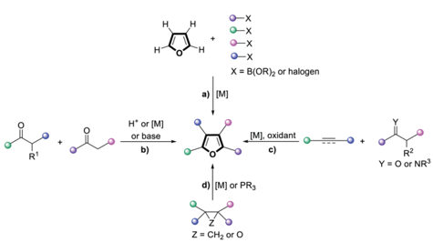
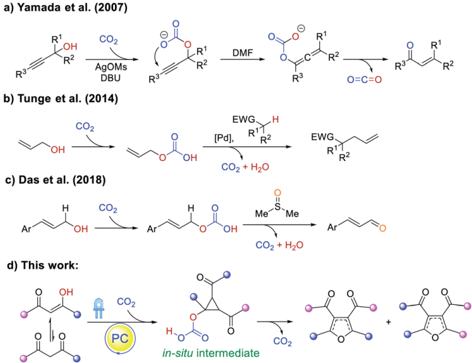
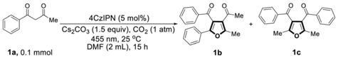
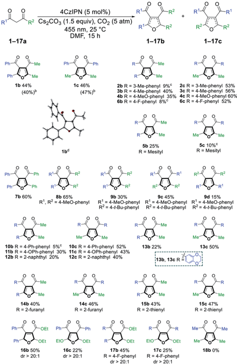
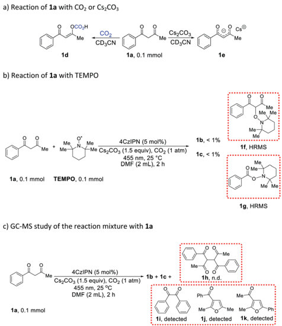
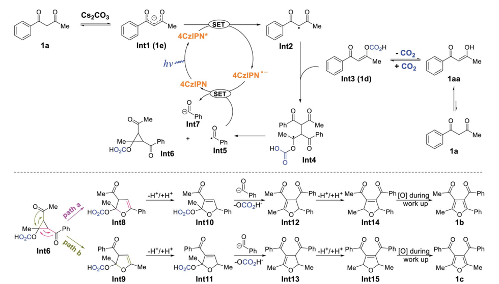

Open Access A

cC)

## Chemical Science a)

or base

X = B(OR)2 or halogen

[M], oxidant c)

## EDGE ARTICLE

Z = CH2 or O

Cite this: Chem. Sci. , 2022, 13 , 241

All publication charges for this article have been paid for by the Royal Society of Chemistry

Received 17th November 2021 Accepted 6th December 2021

DOI: 10.1039/d1sc06403g

rsc.li/chemical-science

## Introduction

Polysubstituted furans are of great importance in the  avor and fragrance industry, pharmaceutical industry and materials chemistry, and are also valuable building blocks in organic synthesis. 1 However, the preparation of such polysubstituted furans is o  en complicated and circuitous. While direct functionalization of the furan C -Hpositions is possible (Scheme 1a), regioselectivity challenges and detrimental reactivity of the furan ring itself hampered such approaches. Classical strategies to construct fully functionalized furans include the Feist -Benary reaction 2 and Paal -Knorr condensation 3 (Scheme 1b).

Scheme 1 Approaches to access highly substituted furans via : (a) successive direct functionalization of furan C -H; (b) condensation; (c) annulation of unsaturated substrates with ketones or imines; (d) migratory cycloisomerization and rearrangements.

Institute of Organic Chemistry, Faculty of Chemistry and Pharmacy, University of Regensburg, 93040 Regensburg, Germany. E-mail: Burkhard.Koenig@chemie. uni-regensburg.de

† Electronic supplementary information (ESI) available. CCDC 2113371. For ESI and crystallographic data in CIF or other electronic format see DOI: 10.1039/d1sc06403g

R2

Y = O or NR3

View Article Online View Journal  | View Issue

## Photocatalytic synthesis of tetra-substituted furans promoted by carbon dioxide †

Ya-Ming Tian,

Huaiju Wang,

Ritu and Burkhard K ¨ onig

Wereport a simple protocol for the transition metal-free, visible-light-driven conversion of 1,3-diketones to tetra-substituted furan skeleton compounds in carbon dioxide (CO2) atmosphere under mild conditions. It was found that CO2 could be incorporated at the diketone enolic OH position, which was key to enabling the cleavage of a C -Obondduring the rearrangement of a cyclopropane intermediate. This method allows for the same-pot construction of two isomers of the high-value tetra-substituted furan sca ff old. The synthetic scope and preliminary mechanistic investigations are presented.

Annulation of unsaturated substrates with ketones or imines 4 (Scheme 1c) as well as other cross-coupling approaches 5 could also a ff ord polysubstituted furans, but migratory cycloisomerization 6 and rearrangements 7 are the most straightforward and convergent routes (Scheme 1d). 8 Furthermore, current methods to access such furans typically require the use of metal catalysts and multiple components. As such, an atom-e ffi cient, transition metal-free, organocatalytic protocol to synthesize tetra-substituted furans from a single precursor is highly sought a  er.

Carbon dioxide as a natural, abundant, inexpensive, easy-toseparate, and recyclable C1 building block has become the focus of recent research, 9 -11 but its capability to catalytically promote reactions has not been widely explored. Shell Oil Company  rst patented the utilization of CO2 to facilitate the synthesis of propionaldehydes in 1968, 12 but only in 2007 was a CO2-catalyzed rearrangement of propargyl alcohols to unsaturated ketones reported by Yamada (Scheme 2a). 13 Proceeding via a carbonate intermediate generated between CO2 and the propargyl alcohol, the reaction regenerates the gas upon formation of the product. Similarly, Tunge showed the use of CO2 to engage allylic OH groups, producing better leaving groups for cross-coupling (Scheme 2b), 11 g and Das further reported the CO2-promoted oxidation of allylic alcohols to unsaturated aldehydes (Scheme 2c). 10 b More recently, it was also demonstrated that CO2 can act on amine substrates to activate a -C -H bonds for intermolecular hydrogen atom transfer. 14,15 Taken together, while the study of CO2-catalysis is still in its infancy, it o ff ers new opportunities to perform organocatalysis that can complement traditional metal-based chemistry.

Therefore, we envisioned utilizing CO2 together with organic dyes to catalyze the cyclizations of 1,3-diketones 1 b ,16,17 and subsequent cyclopropane rearrangement events 7 en route to valuable tetra-substituted furan products, enabled by the reversible interaction of CO2 with the enol forms that can provide favorable carbonate leaving groups. 10 b , c ,11 g The

Open Access A

a) Yamada et al. (2007)

455 nm, 25 °C

R3

AgOMs

DBU

1a, 0.1 mmol b) Tunge et al. (2014)

cC)

c) Das et al. (2018)

d) This work:

DMF (2 mL), 15 h

1b

1c

Scheme 2 CO2-promoted organic transformations: (a) rearrangement of propargyl alcohols to unsaturated ketones; (b) cross-coupling using native allylic alcohol; (c) oxidation of allylic alcohols to unsaturated aldehydes. This work: (d) synthesis of tetra-substituted furans.

optimization survey, substrate scope, and preliminary mechanistic studies of this transition metal-free, photocatalytic, and CO2-promoted furan synthesis strategy are presented herein.

## Results and discussion

We started our investigation by employing 1-phenyl-1,3butanedione ( 1a ) as the model substrate in the presence of CO2. At  rst, a range of commercially available organic photocatalysts and bases were screened (Table S1 † ). Gratifyingly, the desired tetra-substituted furans were produced by using 4CzIPN as the photocatalyst, N , N -dimethylformamide (DMF) as solvent, Cs2CO3 as a base, at 25  C under 455 nm light irradiation, and in CO2 atmosphere. Surprisingly, two di ff erent tetra-substituted isomers can be formed in the same reaction system, giving 48%

Table 1 Control experiments for the reaction of 1a

|   Entry | Deviations from standard conditions   | Yield of 1b a   | Yield of 1c a   |
|---------|---------------------------------------|-----------------|-----------------|
|       1 | None                                  | 48%             | 50%             |
|       2 | 60  C                                       | 24%             | 75%             |
|       3 | N 2 (1 atm) instead of CO 2           | n.d.            | n.d.            |
|       4 | Air (1 atm) instead of CO 2           | <1%             | <1%             |
|       5 | No light, 25  C                                       | n.d.            | n.d.            |
|       6 | No light, 60  C                                       | n.d.            | n.d.            |
|       7 | No 4CzIPN                             | n.d.            | n.d.            |
|       8 | No Cs 2 CO 3                          | n.d.            | n.d.            |

|

DMF

R3

Mei

Me

O=C=O

Mei

R3

Me and 50% yield of products 1b and 1c , respectively (Table 1, entry 1). Temperature of the photocatalytic reaction seemingly has an e ff ect on the regioselectivity between 1b and 1c (Table 1, entry 2). The yields of the products are in  uenced by the amount of base, with 1.5 equivalents of Cs2CO3 providing the best yields (Table S2 † ). We then screened a range of solvents, with DMF proving to be optimal (Table S3 † ). Light sources at di ff erent wavelengths were found to be similarly e ff ective (Table S4 † ). However, when the CO2 atmosphere was replaced with N2, no desired products were formed (Table 1, entry 3). Only trace amounts of products 1b and 1c were detected when the reaction was carried out under air (Table 1, entry 4), indicating that CO2 is an indispensable component in this reaction. In the dark, no reaction occurred at either 25  C or 60  C (Table 1, entries 5 and 6), ruling out a base-catalyzed thermal pathway. Similarly, no detectable products were formed when the reaction was carried out in the absence of photocatalyst or base (Table 1, entries 7 and 8).

With the optimized reaction conditions in hand, we evaluated the scope and limitations of this method (Scheme 3). Both electron-rich and electron-de  cient phenyl rings were well tolerated ( 2 -4 , 6 ), but a mesityl group provided deleterious steric hindrance ( 5 ). Diaryl-1,3-diketones reacted smoothly to a ff ord the desired products ( 7 -9 ). Notably, the reaction of 9a could produce three di ff erent products when the two phenyl groups contain di ff erent substituents. Other benzene systems such as biphenyl ( 10 ), phenyl ether ( 11 ), naphthalene ( 12 ) and benzodioxane ( 13 ) were also compatible with our reaction conditions. The preference for the symmetric regioisomers in 2 , 6 , and 10 cannot be explained at the current stage. Furthermore, this method was successfully extended to heterocyclic substituents, such as furan and thiophene ( 14 , 15 ). Surprisingly, when the 1,3-diketone motif was replaced with 3-oxo-ester, the reaction yielded 2,5-dihydrofurans ( 16b , 17 ) and unsymmetric 2,3-dihydrofurans ( 16c , dr &gt; 20 : 1) that resisted regioisomerization and further oxidation to furans even a  er extensive exposure to air ( vide infra ). We speculate that the less hydridic C2 hydrogens and the overall less electron-rich conjugation systems made 16 and 17 products stable to oxidation, while the electronic e ff ects of the benzene ring could a ff ect the equilibrium between di ff erent dihydrofuran isomers ( 16c vs. 17c ). Unfortunately, no reaction occurred with acetylacetone 18a ( vide infra ). The structure of product 1b was unambiguously con  rmed via single crystal X-ray analysis. A gram-scale reaction of 1a was also conducted under standard conditions, giving 40% and 47% yield of products 1b and 1c , respectively.

In order to gain insight into the aforementioned transformation, a series of mechanistic studies was conducted. To con  rm whether the reaction proceeds via a radical process, in situ electron paramagnetic resonance (EPR) spectra of di ff erent reactions were recorded (Table S6 † and Fig. S1 -S14 † ). No signal was observed for the mixture of 1a , 4CzIPN, and CO2, either with or without blue light irradiation (Table S6, † entries 1 and 2). Similarly, the mixture of 1a , Cs2CO3, and CO2 did not show any signal with or without blue light irradiation (Table S6, † entries 3

Open Access A

a) Reaction of 1a with CO2 or CS2CO3

RI

1-17a cC)

Ph-

4CzIPN (5 mol%)

COZ

CD}CN

DMF, 15 h b) Reaction of 1a with TEMPO

Phi

-Me

"Me

1b 44%

(40%)º

Me

Me

Me

14b 40%

R = 2-furanyl

OEt

16b 50%

dr &gt; 20:1

455 nm, 25 °C

Me CD,CN

RI

Cs®

Me

1-17c

Scheme 3 Substrate scope of tetra-substituted furan from 1,3-diketone. a Reaction conditions: 1,3-diketone (0.5 mmol), 4CzIPN (0.025 mmol), Cs2CO3 (0.75 mmol), CO2 (5 atm) in DMF (5 mL) at 25  Cunder irradiation with a 455 nm LED for 15 h. Reported yields are isolated yields unless stated otherwise. b Isolated yields of gram-scale reaction. c Yields were determined by GC-MS analysis against an internal standard and are the average of two runs. Products were not isolated due to their low yields. d Crystal structure of 1b as determined by X-ray crystallography at 123 K (see ESI † ).

and 4). In addition, there was no EPR signal when mixing 4CzIPN, Cs2CO3, and CO2 (Table S6, † entries 5 and 6), or 1a with CO2 alone (Table S6, † entries 7 and 8). However, a signi  cant EPR signal was observed when a composition of 1a , 4CzIPN, Cs2CO3, and CO2 was irradiated (Table S6, † entry 10). When the CO2 atmosphere was replaced with N2, the same signal was still present (Table S6, † entry 12), indicating that CO2 did not participate in the generation of this radical species. To identify the origin of the radical resonance signal, we employed 7a instead of 1a in the EPR measurement, obtaining an identical signal (Fig. S7 -S9 † ). Speculating that the signal arose from a 4CzIPN radical anion, we recorded the EPR spectrum of this species by adding NEt3 as an electron donor to a solution of 4CzIPN (Fig. S14 † ), which gave the same resonance signal as did the catalysis system. 18 Accordingly, we concluded that 1a , 4CzIPN, Cs2CO3 and light irradiation together resulted in the

RI

CS2CO3

1-17b

R1

formation of 4CzIPN radical anion. Then, the redox behavior of 1a and its anion 1a  were investigated. For 1a , no oxidation peak was observed within the electrochemical window of DMF as solvent (Fig. S15 † ). The anion of 1a , synthesized independently, showed an irreversible one-electron oxidation ( E ox ¼  0.09 V vs. SCE), which is able to reduce the photoexcited state of 4CzIPN ( E 1/2[PC * /PC  ] ¼ +1.35 V vs. SCE) 19 to provide the EPR-observed radical anion and a transient alkyl radical of 1a . Stern -Volmer luminescence quenching experiments (Fig. S17 and S18 † ) revealed e ffi cient quenching of photoexcited 4CzIPN * upon addition of 1a and Cs2CO3 ( K SV ¼ 113 M  1 ). In situ NMR studies demonstrated that 1a react with CO2 to produce compound 1d (Scheme 4a and Fig. S20 -S31, † observing the carbonic acid carbon peak), and naturally, Cs2CO3 can deprotonate 1a to give salt 1e (Scheme 4a and Fig. S32 † ). While no change was observed when 1a or 1d was subjected to irradiation together with 4CzIPN (Fig. S33 -S40 † ), the 1 Hspectrum of 1e was altered under these conditions (Fig. S41 -S44 † ).

When the reaction of 1a was carried out in the presence of 1 equiv. 2,2,6,6-tetramethylpiperidinyloxyl (TEMPO) as a radical trap, the desired reactivity was almost completely shut down, while adducts 1f and 1g were formed, hinting at the presence of C(sp 3 )-centered alkyl radicals generated from 1a , as well as benzoyl radicals (Scheme 4b). The detection of benzil 1i lends further support to the formation of benzoyl radicals in the course of the reaction (Scheme 4c). Correspondingly, trisubstituted furans 1j and 1k were also present in the reaction mixture (Scheme 4c). It is worth noting that benzoyl radical PhC(O) c ( E red ¼ 1.13 V vs. SCE) 20 is capable of oxidizing 4CzIPN radical anion ( E 1/2[PC/PC  ] ¼  1.21 V vs. SCE), 19 whereas

Scheme 4 Mechanistic studies.

Open Access A

cC)

1a

4CzIPN*

CH3C(O) c ( E red ¼  1.75 V vs. SCE) 20 is not, giving a possible explanation to the lack of reactivity with acetylacetone 18a . In addition, the dimer ( 1h ) of starting material 1a was not formed in any appreciable amount (Scheme 4c), suggesting that alkyl radicals originating from 1a did not undergo a simple dimerization. Light ' on -o ff ' experiments indicate that the reaction needs continuous light irradiation to proceed (Fig. S19 † ), ruling out a radical-chain mechanism. Int1 (1e) Ph Int2 Me

Based on the above observations and previous studies, 7 a mechanism for the CO2-promoted photocatalytic activation of 1,3-diketones to a ff ord tetra-substituted furans is proposed (Scheme 5). The starting material 1a is deprotonated by Cs2CO3 to generate enolate 1e , which is oxidized by photoexcited 4CzIPN * through a single electron transfer process, forming 4CzIPN c  and radical Int2 . In addition, 1a also equilibrates with CO2 to form adduct 1d , which reacts with radical Int2 , giving the dimeric Int4 . Subsequently, Int4 ejects benzoyl radical PhC(O) c ( Int5 ) to form acylcyclopropane Int6 via an intramolecular cyclization process (see ESI † section XII for discussion). Density functional theory (DFT) calculations reveal that the formation of Int5 and Int6 from Int4 ( D G ¼ +10 kcal mol  1 , see ESI † section XIII) is most likely the rate-determining step. Therea  er, benzoyl radical Int5 oxidizes 4CzIPN c  to close the catalytic cycle and produce benzoyl anion Int7 . The ring-opening rearrangement of Int6 results in furanoid structures, Int8 and Int9 , via two di ff erent pathways. 7 c , d Computations suggest that the ring-opening processes are exergonic and favorable. The protonation and deprotonation of Int8 and Int9 lead to the formation of conjugated Int10 and Int11 . Cleavage of the C -O bonds and the accompanying nucleophilic attack by Int7

## Conclusion

In conclusion, we have developed an unusual, transition metalfree, CO2-promoted, visible-light-induced photocatalytic synthesis of highly substituted furan derivatives using 1,3diketones as the only starting material. Mechanistic investigations indicated that CO2 was catalytically incorporated in order to create a better leaving group from the enolic OH group. The reaction proceeds under mild conditions via diketone radical additions and acylcyclopropane rearrangements, leading to the formation of two isomeric but di ff erently substituted furan products. From 3-oxo-ester starting materials, partially hydrogenated furan sca ff olds could also be obtained. This protocol expands the scope of the photocatalytic de novo synthesis of heterocyclic compounds as well as the catalytic use of CO2 as a reaction promoter.

## Data availability

All experimental, computational, and crystallographic data are available in the ESI. †

Scheme 5 Proposed reaction mechanism.

CS2CO3

Me

SET

Me generate tetra-substituted 2,3-dihydrofurans Int12 and Int13 (isolated as product 16c ). We postulated that 1j and 1k detected by GC-MS came from the direct C -Ocleavage of Int10 and Int11 with further aromatization in air. Intermediates Int12 and Int13 undergo additional protonation and deprotonation to a ff ord the more conjugated Int14 and Int15 (isolated as products 16b , 17b , 17c ). At last, aromatization-driven oxidation processes yield the desired tetra-substituted furans.

1a

## Author contributions

Y.-M. T. and B. K. conceived the project. Y.-M. T. performed and analyzed the experiments. H. W. performed the DFT and CBS calculations. R. synthesized some materials. Y.-M. T., H. W., and B. K. prepared the manuscript. All authors discussed the results.

## Confl icts of interest

There are no con  icts to declare.

## Acknowledgements

This work was supported by the German Science Foundation (DFG) (KO 1537/18-1). This project has received funding from the European Research Council (ERC) under the European Union's Horizon 2020 Research and Innovation Programme (grant agreement 741623). We thank Dr Rudolf Vasold (University of Regensburg) for his assistance in GC-MS measurements, Regina Hoheisel (University of Regensburg) for her assistance in cyclic voltammetry measurements and Birgit Hischa (University of Regensburg) for her assistance in single crystal X-ray measurements.

## Notes and references

- 1 ( a ) A. V. Gulevich, A. S. Dudnik, N. Chernyak and V. Gevorgyan, Chem. Rev. , 2013, 113 , 3084 -3213; ( b ) A. Blanc, V. B´ en´ eteau, J.-M. Weibel and P. Pale, Org. Biomol. Chem. , 2016, 14 , 9184 -9205; ( c ) W. Zhang, W. Xu, F. Zhang and Y. Li, Chin. J. Org. Chem. , 2019, 39 , 1277 -1283.
- 2 F. Feist, Chem. Ber. , 1902, 35 , 1537 -1545.
- 3 V. Amarnath and K. Amarnath, J. Org. Chem. , 1995, 60 , 301 -307.
- 4 ( a ) Y. Yang, J. Yao and Y. Zhang, Org. Lett. , 2013, 15 , 3206 -3209; ( b ) B. Lu, J. Wu and N. Yoshikai, J. Am. Chem. Soc. , 2014, 136 , 11598 -11601; ( c ) S. Manna and A. P. Antonchick, Org. Lett. , 2015, 17 , 4300 -4303; ( d ) T. Naveen, A. Deb and D. Maiti, Angew. Chem., Int. Ed. , 2017, 56 , 1111 -1115; ( e ) S. Agasti, T. Pal, T. K. Achar, S. Maiti, D. Pal, S. Mandal, K. Daud, G. K. Lahiri and D. Maiti, Angew. Chem., Int. Ed. , 2019, 58 , 11039 -11043.
- 5 ( a ) K. Miki, F. Nishino, K. Ohe and S. Uemura, J. Am. Chem. Soc. , 2002, 124 , 5260 -5261; ( b ) K. Miki, Y. Washitake, K. Ohe and S. Uemura, Angew. Chem., Int. Ed. , 2004, 43 , 1857 -1860; ( c ) J. Barluenga, L. Riesgo, R. Vicente, L. A. L´ opez and M. Tom´ as, J. Am. Chem. Soc. , 2008, 130 , 13528 -13529; ( d ) G. Zhang, X. Huang, G. Li and L. Zhang, J. Am. Chem. Soc. , 2008, 130 , 1814 -1815; ( e ) J. Gonz´ alez, J. Gonz´ alez, C. P´ erezCalleja, L. A. L´ opez and R. Vicente, Angew. Chem., Int. Ed. , 2013, 52 , 5853 -5857; ( f ) L. Zhou, M. Zhang, W. Li and J. Zhang, Angew. Chem., Int. Ed. , 2014, 53 , 5853 -5857; ( g ) Z.-M. Zhang, P. Chen, W. Li, Y. Niu, X.-L. Zhao and J. Zhang, Angew. Chem., Int. Ed. , 2014, 53 , 4350 -4354; ( h ) Y. Wang, P. Zhang, D. Qian and J. Zhang, Angew. Chem., Int. Ed. , 2015, 54 , 14849 -14852; ( i ) J. S. Clark, F. Romiti,
- K. F. Hogg, M. H. S. A. Hamid, S. C. Richter, A. Boyer, J. C. Redman and L. J. Farrugia, Angew. Chem., Int. Ed. , 2015, 54 , 5744 -5747; ( j ) M.-Y. Huang, J.-M. Yang, Y.-T. Zhao and S.-F. Zhu, ACS Catal. , 2019, 9 , 5353 -5357.
- 6 R. K. Shiroodi, O. Koleda and V. Gevorgyan, J. Am. Chem. Soc. , 2014, 136 , 13146 -13149.
- 7 ( a ) S. Pratapan, K. Ashok, K. R. Gopidas, N. P. Rath, P. K. Das and M. V. George, J. Org. Chem. , 1990, 55 , 1304 -1308; ( b ) M. C. Sajimon, D. Ramaiah, M. Muneer, E. S. Ajithkumar, N. P. Rath and M. V. George, J. Org. Chem. , 1999, 64 , 6347 -6352; ( c ) J. Barluenga, H. Fanlo, S. L´ opez and J. Fl´ orez, Angew. Chem., Int. Ed. , 2007, 46 , 4136 -4140; ( d ) J. Shao, Q. Luo, H. Bi and S. R. Wang, Org. Lett. , 2021, 23 , 459 -463; ( e ) X. He, Y. Tang, Y. Wang, J.-B. Chen, S. Xu, J. Dou and Y. Li, Angew. Chem., Int. Ed. , 2019, 58 , 10698 -10702.
- 8 H. Jin and A. F¨ urstner, Angew. Chem., Int. Ed. , 2020, 59 , 13618 -13622.
- 9 ( a ) T. Sakakura, J.-C. Choi and H. Yasuda, Chem. Rev. , 2007, 107 , 2365 -2387; ( b ) Q. Liu, L. Wu, R. Jackstell and M. Beller, Nat. Commun. , 2015, 6 , 5933 -5948; ( c ) X. He, L.-Q. Qiu, W.-J. Wang, K.-H. Chen and L.-N. He, Green Chem. , 2020, 22 , 7301 -7320; ( d ) Z. Zhang, J.-H. Ye, T. Ju, L.-L. Liao, H. Huang, Y.-Y. Gui, W.-J. Zhou and D.-G. Yu, ACS Catal. , 2020, 10 , 10871 -10885; ( e ) Z. Fan, Z. Zhang and C. Xi, ChemSusChem , 2020, 13 , 6201 -6218; ( f ) J.-H. Ye, T. Ju, H. Huang, L.-L. Liao and D.-G. Yu, Acc. Chem. Res. , 2021, 54 , 2518 -2531; ( g ) B. Cai, H. W. Cheo, T. Liu and J. Wu, Angew. Chem., Int. Ed. , 2021, 60 , 18950 -18980.
- 10 ( a ) C.-J. Li and B. M. Trost, Proc. Natl. Acad. Sci. U. S. A. , 2008, 105 , 13197 -13202; ( b ) D. Riemer, B. Mandaviya, W. Schilling, A. C. G¨ otz, T. K¨ uhl, M. Finger and S. Das, ACS Catal. , 2018, 8 , 3030 -3034; ( c ) D. Riemer, W. Schilling, A. Goetz, Y. Zhang, S. Gehrke, I. Tkach, O. Holl´ oczki and S. Das, ACS Catal. , 2018, 8 , 11679 -11687.
- 11 ( a ) P. Braunstein, D. Matt and D. Nobel, Chem. Rev. , 1988, 88 , 747 -764; ( b ) T. Sakakura and K. Kohno, Chem. Commun. , 2009, 1312 -1330; ( c ) K. Huang, C.-L. Sun and Z.-J. Shi, Chem. Soc. Rev. , 2011, 40 , 2435 -2452; ( d ) R. Mart´ ı n and A. W. Kleij, ChemSusChem , 2011, 4 , 1259 -1263; ( e ) Y. Tsuji and T. Fujihara, Chem. Commun. , 2012, 48 , 9956 -9964; ( f ) P. G. Jessop, S. M. Mercer and D. J. Heldebrant, Energy Environ. Sci. , 2012, 5 , 7240 -7253; ( g ) S. B. Lang, T. M. Locascio and J. A. Tunge, Org. Lett. , 2014, 16 , 4308 -4311; ( h ) F. D. Bobbink and P. J. Dyson, J. Catal. , 2016, 343 , 52 -61; ( i ) M. B¨ orjesson, T. Moragas, D. Gallego and R. Martin, ACS Catal. , 2016, 6 , 6739 -6749; ( j ) S. Wang, G. Du and C. Xi, Org. Biomol. Chem. , 2016, 14 , 3666 -3676; ( k ) P. Hirapara, D. Riemer, N. Hazra, J. Gajera, M. Finger and S. Das, Green Chem. , 2017, 19 , 5356 -5360; ( l ) W. Schilling and S. Das, Tetrahedron Lett. , 2018, 59 , 3821 -3828; ( m ) Z. Zhang, J.-H. Ye, D.-S. Wu, Y.-Q. Zhou and D.-G. Yu, Chem. -Asian J. , 2018, 13 , 2292 -2307; ( n ) A. Tortajada, F. Juli´ a-Hern´ andez, M. B¨ orjesson, T. Moragas and R. Martin, Angew. Chem., Int. Ed. , 2018, 57 , 15948 -15982; ( o ) L. Wang, W. Sun and C. Liu, Chin. J. Chem. , 2018, 36 , 353 -362; ( p ) Y. Cao, X. He, N. Wang, H.-R. Li and L.-N. He, Chin. J. Chem. , 2018, 36 , 644 -659; ( q ) C. S. Yeung,

Angew. Chem., Int. Ed. , 2019, 58 , 5492 -5502; ( r ) Q.-Y. Meng, T. E. Schirmer, A. L. Berger, K. Donabauer and B. K¨ onig, J. Am. Chem. Soc. , 2019, 141 , 11393 -11397; ( s ) M. Schmalzbauer, T. D. Svejstrup, F. Fricke, P. Brandt, M. J. Johansson, G. Bergonzini and B. K¨ onig, Chem , 2020, 6 , 2658 -2672; ( t ) S. Wang, B.-Y. Cheng, M. Sr ˇ sen and B. K¨ onig, J. Am. Chem. Soc. , 2020, 142 , 7524 -7531; ( u ) Y. Zhang, T. Zhang and S. Das, Green Chem. , 2020, 22 , 1800 -1820; ( v ) K. Donabauer and B. K¨ onig, Acc. Chem. Res. , 2021, 54 , 242 -252; ( w ) R. Cauwenbergh and S. Das, Green Chem. , 2021, 23 , 2553 -2574; ( x ) P. K. Sahoo, Y. Zhang and S. Das, ACS Catal. , 2021, 11 , 3414 -3442.

- 12 E. F. Lutz (Shell Oil Co.), US Pat. 3518310A, 1970.
- 13 Y. Sugawara, W. Yamada, S. Yoshida, T. Ikeno and T. Yamada, J. Am. Chem. Soc. , 2007, 129 , 12902 -12903.
- 14 J. Ye, I. Kalvet, F. Schoenebeck and T. Rovis, Nat. Chem. , 2018, 10 , 1037 -1041.
- 15 M. Kapoor, P. Chand-Thakuri and M. C. Young, J. Am. Chem. Soc. , 2019, 141 , 7980 -7989.
- 16 ( a ) J. Song, H. Zhang, X. Chen, X. Li and D. Xu, Synth. Commun. , 2010, 40 , 1847 -1855; ( b ) Y. Yue, Y. Zhang,

|

- W. Song, X. Zhang, J. Liu and K. Zhuo, Adv. Synth. Catal. , 2014, 356 , 2459 -2464; ( c ) P.-J. Zhou, C.-K. Li, S.-F. Zhou, A. Shoberu and J. P. Zou, Org. Biomol. Chem. , 2017, 15 , 2629 -2637.
2. 17 ( a ) C. He, S. Guo, J. Ke, J. Hao, H. Xu, H. Chen and A. Lei, J. Am. Chem. Soc. , 2012, 134 , 5766 -5769; ( b ) Y. Ma, S. Zhang, S. Yang, F. Song and J. You, Angew. Chem., Int. Ed. , 2014, 53 , 7870 -7874.
3. 18 For the EPR signals of similar isophthalonitrile spieces, see:( a ) E. W. Evans, Y. Olivier, Y. Puttisong, W. K. Myers, T. J. H. Hele, S. M. Menke, T. H. Thomas, D. Credgington, D. Beljonne, R. H. Friend and N. C. Greenham, J. Phys. Chem. Lett. , 2018, 9 , 4053 -4058; ( b ) J. Xu, J. Cao, X. Wu, H. Wang, X. Yang, X. Tang, R. W. Toh, R. Zhou, E. K. L. Yeow and J. Wu, J. Am. Chem. Soc. , 2021, 143 , 13266 -13273.
4. 19 T.-Y. Shang, L.-H. Lu, Z. Cao, Y. Liu, W.-M. He and B. Yu, Chem. Commun. , 2019, 55 , 5408 -5419.
5. 20 C. Chatgilialoglu, D. Crich, M. Komatsu and I. Ryu, Chem. Rev. , 1999, 99 , 1991 -2069.