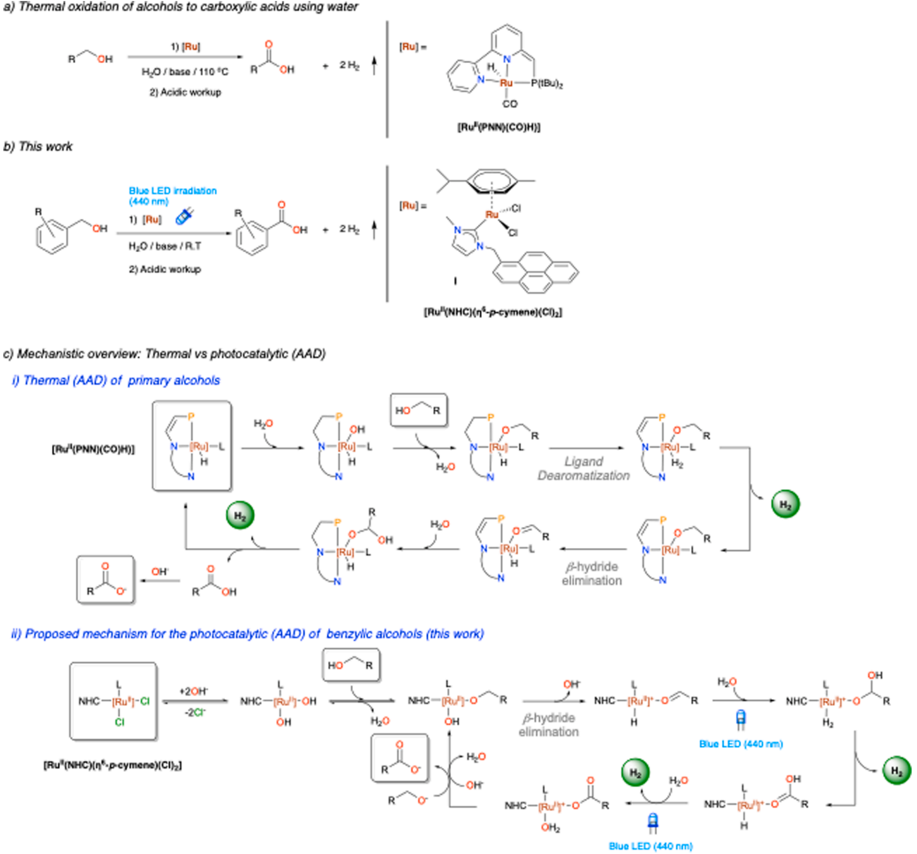
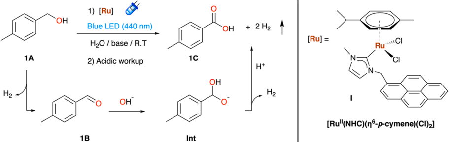
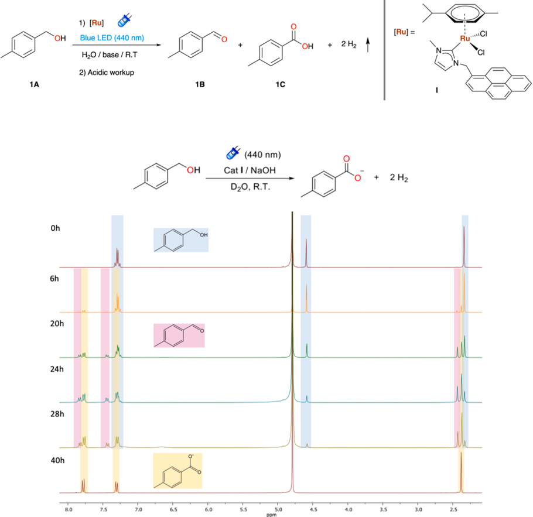
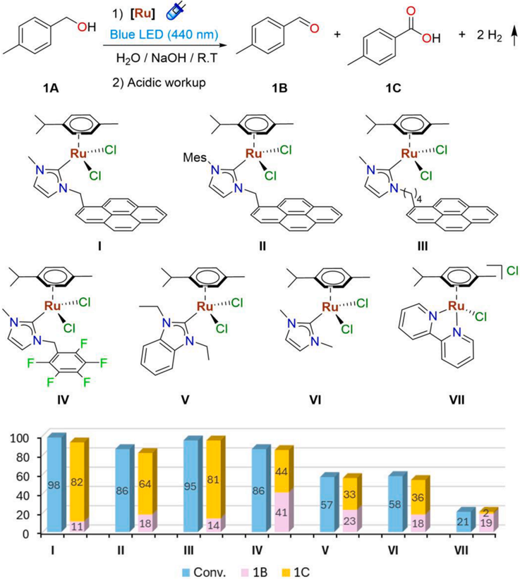
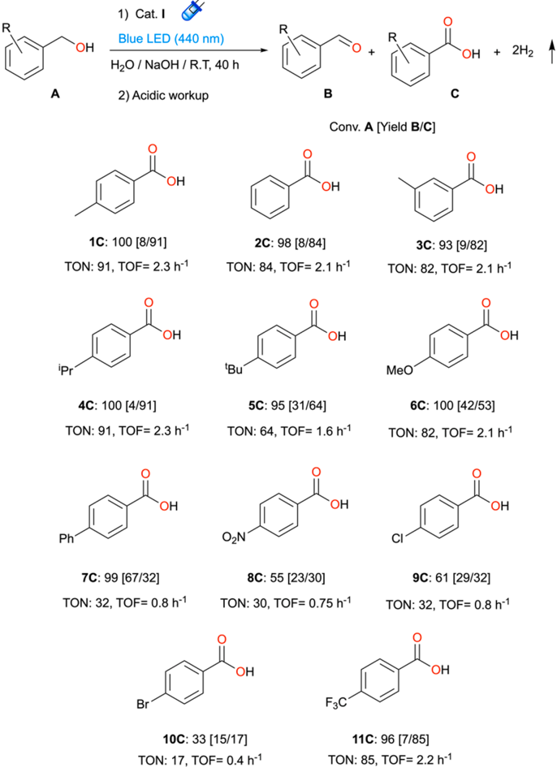
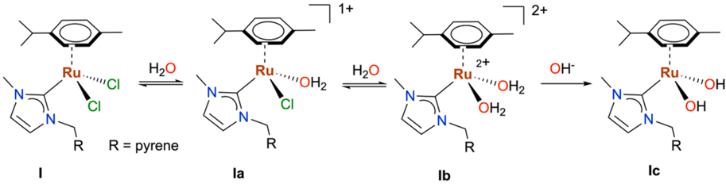
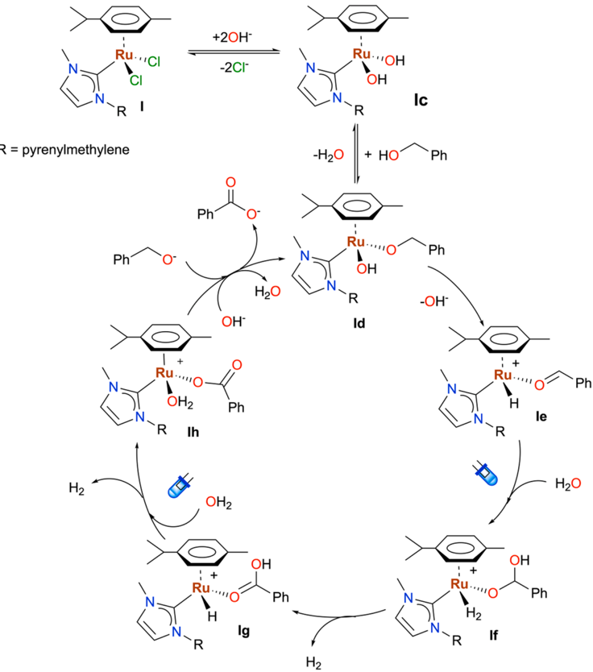

Research article

## Photodehydrogenation of alcohols catalysed by a single ruthenium N-Heterocyclic carbene complex

Laura Ib ´ a ˜ nez-Ib ´ a ˜ nez a , Gregorio Guisado-Barrios

b,*

, Jos ´ e A. Mata

- a Institute of Advanced Materials (INAM), Universitat Jaume I, Avda. Vicent Sos Baynat s/n, 12071 Castell ´ on, Spain
- b Instituto de Síntesis Química y Cat ´ alisis Homog ´ enea (ISQCH), CSIC-Universidad de Zaragoza 50009 Zaragoza, Spain

A R T I C L E  I N F O

Keywords: Photocatalysis Single catalyst Dehydrogenation Benzylic alcohols Ruthenium LOHCs Hydrogen storage

## 1. Introduction

The  dehydrogenation  of  alcohols  to  carboxylic  acid  derivatives stands  as  a  central  transformation  in  organic  reactions,  allowing  the synthesis of a wide variety of functionalized molecules with extensive applications in agrochemicals, pharmaceuticals, and material sciences [1]. Over the past decades, traditional oxidation methods using lowatom-economy  strong  oxidants  such  as  perchlorates,  hypervalent  iodines,  peroxides  and  molecular  oxygen  have  been  replaced  by  more sustainable  alternatives  aiming  to  lessen  the  environmental  impact [2 -5]. Among them, the acceptorless alcohol dehydrogenation (AAD) catalyzed by transition metal complexes with the concomitant formation of  molecular  hydrogen  as  the  only  side  product  has  emerged  as  a powerful synthetic tool approach due to their potential use as LOHCs (Liquid Organic Hydrogen Carriers) [6 -8]. LOHCs  schemes are comprised of a H2-lean and H2-rich organic molecules that enable green hydrogen storage in a safer and a more environmentally friendly manner through continuous hydrogenation and dehydrogenation cycles [9 -11].

Milstein  and  coworkers  pioneered  the  (AAD)  field  when  they  reported the direct dehydrogenation of alcohols to carboxylate salts and H2  in  alkaline  water  catalyzed  by  a  ruthenium  PNN  pincer  complex (Scheme 1a) [12]. After this seminal report, several examples involving ruthenium [13 -21] or iridium [22] complexes with a wide variety of

A B S T R A C T

The transition metal catalyzed dehydrogenation of alcohols to carboxylate salts and H2 is an attractive tool due to their potential use as LOHCs (Liquid Organic Hydrogen Carriers). Still, most current methods encompass harsh conditions and two steps synthesis. Herein, we describe an efficient ruthenium(II) catalyzed hydrogen production from benzylic alcohols to the corresponding carboxylate derivatives assisted by visible light. Our photocatalytic system comprises a standalone N-heterocyclic carbene based piano stool ruthenium complex playing a dual role, harvesting visible-light and enabling H2  generation under mild conditions in aqueous media.

ancillary ligands under thermal conditions have been reported. Even first-row metal like manganese, [23] or cobalt [24] complexes have been studied  for  these  transformations  although  displayed  lower  catalytic performance  when  compared  with  the  noble  metal  counterparts.  In addition,  electro,  but  specially  photooxidation  protocols  have  been considered  as  substitute  to  traditional  thermal  procedures  for  the preparation of aldehydes or ketones from alcohols [1,25 -32]. Despite that, the photocatalytic dehydrogenation of alcohols to acids at room temperature remains uncovered [33].

The use of visible light can deliver photon energies varying from 71 to 38 kcal/mol, which are greater than or akin to the energy barrier for many thermally catalysed reactions using transition metal (TM) complexes [34]. Thus, photocatalysis has garnered considerable attention in the realm of organic reactions, due to its inherent advantages such as mild  reaction  conditions,  operational  simplicity,  and  minimal  waste generation [35,36].

Until now, depending on the catalytic system composition, two main subclasses could be differentiated. The first one involves a single photocatalysts  (organic  dye  or  TM  based  photosensitizer),  which  upon irradiation can activate an organic substrate via energy transfer or single electron transfer (SET), without being directly entangled in the bond forming/breaking event. The second implies a dual catalytic manifold merging  an  exogenous  photosensitizer  with  either  an  organo  or  TM

* Corresponding author at: Departamento de Química Inorg ´ anica. Instituto de Síntesis Química y Cat ´ alisis Homog ´ enea (ISQCH), CSIC-Universidad de Zaragoza, 50009 Zaragoza, Spain.

** Corresponding author. E-mail addresses: gguisado@unizar.es (G. Guisado-Barrios), jmata@uji.es (J.A. Mata).

## [https://doi.org/10.1016/j.jcat.2025.116134](https://doi.org/10.1016/j.jcat.2025.116134)

Received 13 December 2024; Received in revised form 2 April 2025; Accepted 6 April 2025

Contents lists available at ScienceDirect

## Journal of Catalysis

journal homepage: www.elsevier.com/locate/jcat

a) Thermal oxidation of alcohols to carboxylic acids using water

1) [Ru]

[Ru] =

nez et al.

Rul

- P(IBu)2

based  catalysts,  the  latter  being  responsible  for  the  bond  forming/ breaking event. In this context, Kanai et al .  reported the visible light promoted acceptorless dehydrogenation of alcohols to ketones using a ternary  hybrid  catalytic  system,  constituted  by  a  nickel  catalyst  Ni (NTf)2 ⋅ xH2O  (NTf = trifluoromethanesulfonimide),  a  thiophosphate organocatalyst  (TPA)  and  a  photoredox  catalyst  (Mes-Acrid + )  [28]. Importantly, the detection of esters in crude mixtures seemingly formed via hemiacetal dehydrogenation obtained from the primary alcohol and the  aldehyde  led  its  further  application  in  the  acceptorless  crossdehydrogenative  coupling  (ACDC)  between  aldehydes  and  alcohols under  mild  conditions.  Conversely,  a  third  subclass  where  a  single photocatalyst playing a dual role, harnessing photon energy and being active  in  catalytic  cycles  where  a  reaction  intermediate  is  directly bonded to the catalyst has recently emerged [32,37 -43]. Miller et al., used  this  approach  towards  the  photochemical  dehydrogenation  of formic acid generating CO2  and H2  using single Ir(III) metal complex [Cp*Ir(bpy-OMe)(Cl)] + (1-OMe, bpy-OMe = 4,4 ′ -dimethoxy-2,2 ′ -bipyridine) [44]. More recently, our group reported the visible light assisted acceptorless  dehydrogenation  of  N-heterocycles  and  formation  of  H2 catalysed  by  a  mesoionic  carbene  (MIC)  [45 -48]  based  Ir(III)  metal complex  [Cp*Ir(MIC)(CH3CN)]OTf  [49].  Previously,  we  had  also  reported the synthesis of ruthenium(II) complex I of formula [RuCl2(NHC)

[Ru]—

i) Proposed mechanism for the photocatalytic (AAD) of benzylic alcohols (this work)

NHC -[Ru]-CI

[Ru"(NHC)(n*-p-cymene)(CI)≥]

( η 6 -p -cymene)]  containing  a  N-heterocyclic  carbene  ligand  (NHC) bearing a methyl and pyrenylmethylene as N-substituents at the azole ring [50]. In that case, the presence of the pyrene group allowed the immobilization of I by means of π -stacking interactions onto the surface of  reduced graphene oxide providing a hybrid material that resulted competent  towards  the  thermal  synthesis  of  carboxylic  acids  from alcohol dehydrogenation [21]. In this context, a photocatalytic system based  on  ruthenium trans -[Ru II (trpy)(pypz -pyr)H2O](PF6)2  bearing  a bidentate pyridylpyrazole ligand (pypz -pyr) with a pyrene moiety the photooxidation of benzylic alcohols in water using a phosphate buffer and Na2S2O8 as oxidant was recently described by Romero et al. [32]. However, only moderate yields of aldehyde B and only traces of the corresponding acid C were observed. Inspired by these precedents, we aimed to explore the potential benefits of pyrenylmethylene group as chromophore  for  photocatalytic  applications  [51].  Herein,  we  now describe the photodehydrogenation of benzylic alcohols catalysed by a standalone  NHC-Ru II metal  complex  in  water  at  room  temperature assisted by visible light in the absence of any buffer or oxidant (Scheme 1b, this work).

ß-hydride

Scheme 1. a) Thermal dehydrogenation of alcohols to carboxylic acids using water; b) this work; c) mechanistic overview: thermal vs photocatalytic (aad).

elimination

OH

nez et al.

[Ru] =

produced, we carried out the reaction at 40 ◦ C in the absence of light irradiation (entry 9). In this case, only a (41 %) conversion was obtained giving a mixture of 1B : 1C ratio in 18:21 % yield, which resulted much lower than the conversion obtained under visible light (Blue LED 440 nm)  irradiation  (98  %)  with  a  ratio 1B : 1C of  11:82  %  yield.  This experiment  suggest  that  the  temperature ' s  effect  is  negligible  when compared to light irradiation (Entry 1 vs 9) for the conversion of the benzyl  alcohol.  Next,  the  catalytic  activity  of I was evaluated under different LED light sources 390, 427, 440 and 525 nm at 100 % intensity (entries 1, 10 -12). Among them, irradiation with either the 427 or 440 nm gave the highest yield of 1C in similar quantities. Besides that, the performance of the catalyst decreased significantly when the intensity was reduced to 50 % (entry 13), indicating that at this point we do not have catalysts saturation.

After  evaluating  the  effect  of  the  visible  light,  additional  control experiments  were  performed.  For  instance,  increasing  reaction  time from 24 to 36 h at 1 mol% catalyst loading of I exhibited only slightly increase from 82 to 87 % yield (entry 14). In parallel, we examined the reaction set up and the influence of molecular oxygen in the outcome of the  reaction.  As  stated  above,  optimal  conditions  involved  N2  atmosphere  in  an  open  system  (entry  1).  When  the  photocatalytic  transformation was done in a closed system preventing the release of the

## 2. Results and discussion

1A

1C

We initiated our study evaluating the photocatalytic dehydrogenation of p -methylbenzyl alcohol 1A (model substrate) to form the corresponding benzylic carboxylic acid 1C in the presence of complex I and NaOH following the reaction sequence and acidic work-up as depicted in (Fig. 1).

It was found that the optimal reaction conditions (Table 1, entry 1) required 1 mol% catalyst loading of I , NaOH as base (2 equiv.) and 24 h irradiation using a blue LED (440 nm) as light source under N2  atmosphere  but  an  open  system  (See  photoreactor  system  ESI  Fig.  S32). However, prior optimization, a series of control experiments were conducted. For instance, the role of ruthenium(II) complex I was confirmed, since in its absence the reaction does not proceed (entry 2). Likewise, the addition of 2 equivalents of NaOH or KOH is also necessary (entries 3 and 6). Halving the amount of NaOH to 1 equivalent or in catalytic quantity (2 mol%) reduced considerably the yield of 1C (entries 4 and 5 respectively). Similar effect was observed when NaOH was replaced by a weaker  base  such  as  Cs2CO3 or  K2CO3  (entries  7 -8).  Once  we  had confirmed the need of catalyst and base, we studied the effect of the light source (blue LED 440 nm) and the reaction temperature. To confirm that the formation of the benzylic carboxylic acid 1C was photocatalytically

Fig. 1. Schematic representation of the reaction sequence and acidic work-up.

1) [Ru]

Table 1 Optimization of the conditions. a.

| Entry   |   Cat (mol%) | Base (x eq)    |   Light (nm) |   Conv (%) b A |   Yield (%) b B |   Yield (%) b C |
|---------|--------------|----------------|--------------|----------------|-----------------|-----------------|
| 1 a     |            1 | NaOH (2)       |          440 |             98 |              11 |              82 |
| 2 c     |              | NaOH (2)       |          440 |              0 |               0 |               0 |
| 3 d     |            1 |                |          440 |             20 |              17 |               0 |
| 4 e     |            1 | NaOH (1)       |          440 |             75 |              38 |              35 |
| 5 e     |            1 | NaOH (0.02)    |          440 |             21 |              21 |               0 |
| 6       |            1 | KOH (2)        |          440 |             97 |              10 |              83 |
| 7       |            1 | Cs 2 CO 3 (1)  |          440 |             58 |              47 |               9 |
| 8       |            1 | K 2 CO 3 (1.5) |          440 |             22 |              18 |               3 |
| 9 c     |            1 | NaOH (2)       |              |             41 |              18 |              21 |
| 10 d    |            1 | NaOH (2)       |          390 |             70 |              41 |              28 |
| 11 d    |            1 | NaOH (2)       |          427 |             98 |              14 |              84 |
| 12 d    |            1 | NaOH (2)       |          525 |             10 |               6 |               4 |
| 13 e    |            1 | NaOH (2)       |          440 |             63 |              38 |              25 |
| 14 f    |            1 | NaOH (2)       |          440 |            100 |               8 |              87 |
| 15 g    |            1 | NaOH (2)       |          440 |              7 |               2 |               2 |
| 16 h    |            1 | NaOH (2)       |          440 |             95 |              23 |              72 |

100

80

Oh

Yield (%)

6h

20h

24h

28h

40h

8.0

1A

7.5

1) [Ru]

OH

(440 nm)

Cat I / NaOH

nez et al.

он + 2 Hг

Fig. 2. Monitoring of the reaction by 1 H NMR spectroscopy using D2O. Characteristic signals of alcohol 1A (blue), aldehyde 1B (pink) except CHO signal at 9.8 ppm, and carboxylate 1C (yellow). Reaction conditions: substrate 1A (0.5 mmol), catalyst I (1.0 mol%), 1 mmol NaOH, D2O (2 mL), blue LEDs (440 nm) at room temperature under inert (N2) atmosphere, open system (bubbler). (For interpretation of the references to colour in this figure legend, the reader is referred to the web version of this article.)

generated H2, the reaction barely proceeded (entry 15). Therefore, an open system is  required.  On  the  other  hand,  when  the  reaction  was carried out in an open flask the yield of 1C decreased to 72 % (entry 16), reflecting a minor interference of oxygen in the catalytic outcome due to its presence. Further optimization was devoted to rule out the Cannizzaro ' s reaction (redox disproportionation of a non-enolizable aldehyde B using  NaOH  as  base  producing  alcohol A and  carboxylate C [52,53,54]. When the reaction was conducted at room temperature in the absence of I the aldehyde B was barely converted into the corresponding derivatives (Table S1, entry 1). Raising the temperature to 45 ◦ C exhibited a 17 % conversion of B producing mostly the carboxylate C (Table S1, entry 2). In contrast, when the reaction was carried out at room temperature under visible light irradiation (Blue LED 440 nm) a 30 % conversion of B was detected producing only a 26 % C much lower than the 82 % obtained when the reaction was done in the presence of catalyst I (Table S1, entry 3).

After completing the optimization of reaction conditions, we decided

Fig. 3. Reaction progress profile of the photocatalytic dehydrogenation of p -methylbenzyl alcohol.

CI

H½O / base / R.T

OOI

80

60

40

20

1A

Ru

ЛІ

86

781

11

OH

nez et al.

H2O / NaOH / R.T

2) Acidic workup

Ru''''CI

CI

18

Fig. 4. Schematic representation of ruthenium (II) complexes I -VII used in this study. Reaction conditions: 0.5 mmol of p -methylbenzyl alcohol 1A , ruthenium complexes I -VII (1.0 mol%), 2 equiv. NaOH, H2O (2 mL), room temperature, t = 24 h, λ = 440 nm, inert atmosphere and open system (bubbler).

to monitor the course of the reaction. For this purpose, 1 H NMR spectra of the photocatalytic mixture were recorded at different times using D2O as solvent. At t = 0 h, the model substrate 1A presents three different signals  (Fig.  2)  corresponding  to  the  protons  at  the ortho -  and meta -position of the aromatic ring at lower field (7.29 ppm), the methylene group (4.58 ppm), and the methyl group at the para -  position of the benzene  ring  (2.34  ppm).  After  6  h  of  irradiation  new  peaks  corresponding to the aromatic ring and methyl group of both, aldehyde 1B and acid 1C were noted. Most of the initial alcohol and formed aldehyde are consumed after 28 h. Finally, only the signals of acid 1C could be observed after 40 h. From the 1 H NMR experiment, a reaction profile could be obtained by representing the percentages of the conversion of alcohol 1A (blue), and the yields of aldehyde 1B (pink) and acid 1C (yellow) at different times (Fig. 3). Graphically can be observed that the maximum amount of aldehyde 1B produced is below 30 % and that alcohol 1A is fully converted into the acid 1C .

Next, we evaluated and compared the catalytic performance of I with a series of related NHC based ruthenium(II) derivatives II -VII (Fig. 6) bearing  different  alkyl  or  aryl  N-substituents  of  the  imidazolylidene ligand along with complex VII of formula [RuCl(bpy)( η 6 -p -cymene)]Cl containing a bipyridyl ligand (bpy) instead. From a perusal of Fig. 4, it can be concluded that complexes I and III having methyl and pyrenyl alkyl substituents at the nitrogen of the NHC ligand resulted the most active  catalysts  with  almost  complete  conversion  of  alcohol 1A and quantitative formation of acid 1C (81 -82 % yield). Interestingly, the analogue derivative of I complex II bearing a bulkier aromatic substituent vs the methyl group resulted less efficient generating the acid in a 64 % yield. On the other hand, catalyst IV having a pentafluorobenzyl wingtip  instead  of  the  pyrenylmethylene,  albeit  displayed  moderate conversion  of  the  alcohol 1A exhibited  a  44  %  yield  of  acid 1C .  In contrast, complexes V and VI containing ethyl and methyl substituents respectively at both nitrogen of the azole ring or VII having a bipyridyl ligand  instead  resulted  less  effective  producing  a  mixture  of  both, aldehyde and acid in poor yield, indicating that the presence of the NHC ligand  containing  a  pyrenylmethylene  or  pentafluorobenzyl  wingtip enhance the performance of the ruthenium (II) complexes.

To  further  confirm  the  observed  catalytic  performance  of  the different complexes under visible light irradiation, we registered the UV vis spectra for complexes I-VI in methanol (Fig. S26). Complexes I-III show around 300 nm the standard bands observed for pyrene-based molecules, which are due to intra-ligand π-π * transitions of the pyrene tag [55]. Notably, although these complexes do not absorb strongly at wavelengths greater than 400 nm, there is an overlap between its absorption  spectrum  and  the  emission  spectrum  of  the  blue-LED  light

1) [Ru]

98I

1) Cat. I

· 1+

2+

nez et al.

H20 / NaOH / R.T, 40 h

RU·.....'CI

CI

R

Н20

2) Acidic workup

R = pyrene

OH

1C: 100 [8/91]

TON: 91, TOF= 2.3 h-1

OH

'Pr

4C: 100 [4/91]

TON: 91, TOF= 2.3 h-1

Ph

7C: 99 [67/32]

TON: 32, TOF= 0.8 h-1

Br

10C: 33 [15/17]

TON: 17, TOF= 0.4 h-1

2+

OH-

Fig. 5. Photocatalytic dehydrogenation of benzylic alcohols derivatives 1 -11A . Reaction conditions: 0.5 mmol of substrate, 1 mmol NaOH (2 equiv.), t = 40 h, blue LED λ = 440 nm, H2O (2 mL), 1.0 mol% I , room temperature, inert atmosphere (N2), open system (bubbler). Conversion [yield B / C ]. TOF value calculated after 40 h. (For interpretation of the references to colour in this figure legend, the reader is referred to the web version of this article.)

Fig. 6. Aqueous chemical speciation of I in basic media.

RU·...''OH2

H½O

RU·..·''OH

+20H- nez et al.

-2CI

source. It is important to note that absorption of I increase significantly (Fig. S29) under reaction conditions (water at pH = 14). In addition, independently of the solvent used, the absorption is lower in the green light region (530 nm), which agrees with the low alcohol conversion observed (Table 1, entry 14). Still, albeit light absorption is required to cause a photochemical reaction, [56,57] we have not found a direct correlation using precatalysts I-VI , which may indicate that light plays a more important role on the intermediates formed during alcohol dehydrogenation. Since complex I was selected as best performing catalyst, its  absorption, emission and excitation spectra were recorded. In the emission  spectra  the  complex  exhibited  a  maximum  at  450  nm  in methanol  (Fig.  S31).  Finally,  after  evaluating  all  the  ruthenium  (II) complexes we explored the scope of different substituted benzyl alcohols under the standard reaction conditions using catalyst I and 40 h of reaction. The results obtained are shown in Fig. 5. All the products 1-11C were isolated  after  acidification  and  characterized  by 1 H NMR spectroscopy (Section S3.4). By inspecting Fig. 5, it can be observed that carboxylic acid 2C without any substituent at the aryl group was obtained in 84 % yield. On the other hand, derivatives 1C and 3C bearing a methyl group either in the meta - or para - position were obtained in high yield, 91 and 82 % respectively. Likewise, carboxylic acid derivative 4C having an isopropyl group at the para - position was isolated in a 91 % yield. In contrast, their analogues 5C and 6C bearing electron donating

H2

groups tert -butyl or methoxy substituents were obtained in moderate yields.  On  the  contrary,  those  derivatives  containing  electron  withdrawing substituents at the 4-position of the aryl ring 7-10C were isolated in lower yields, except 11C having a CF3  group which could be obtained in 85 % yield. TONs up to 91 were obtained and TOFs up to 2.3 h 1 .

After evaluating the scope of substrates, we carried out different tests to gain some insight into the reaction mechanism. Firstly, the generation of  H2 during  the  photocatalytic  dehydrogenation  of  alcohols  was confirmed qualitatively by GC-TCD (Fig. S45). The presence of H2 confirms a dehydrogenation process and not an oxidation. Hydrogen release from the reaction media is required to drive the reaction towards the formation of products as it is not thermodynamically favoured. Then, we aimed  to  isolate/characterize  any  plausible  reaction  intermediate  by NMR and/or mass spectroscopy. In the 1 H NMR spectra of complex I in D2O, the presence of multiple sets and significant line broadening at room  temperature,  indicates  the  co-existence  of  several  species  in equilibrium (Fig. S47, top).

In contrast, when NaOH was added to emulate the reaction media, the  equilibrium  is  completely  displaced  and  only  one  set  of  signals corresponding to the complex Ic was observed (Fig. 6). The speciation of I was also conducted by ESI/MS analysis. The results confirm the presence of species characterized by halide substitution reactions (Fig. S48).

H20

Fig. 7. Proposed reaction mechanism for the photocatalytic dehydrogenation of alcohols using I .

nez et al.

These experiments confirm the initial transformation of I into species characterized by ligand substitution. Once we analysed the behaviour of I under ESI/MS conditions, we explored the formation of reaction intermediates using benzyl alcohol as representative substrate. ESI mass spectrum analysis of aqueous solution containing I in the presence of benzyl  alcohol  under  catalytic  conditions  and  after  15  h  reveals  the formation  of Ig with  formula  [Ru( p -cymene)(NHC)(H2O)(PhCO2)] + species (Fig. S49, simulated (top); experimental (bottom)). The formation of Ru species with carboxylates was confirmed by CID mass spectra experiments of the mass-selected carboxylic acid intermediate [Ig -H2O] þ at m / z 653.2 at 10 eV collision energy (Fig. S50).

Based on this experimental evidences and previous results of [Ru( p -cymene)(NHC)] 2 + complexes under thermal conditions, a plausible reaction mechanism is proposed (Fig. 7) [21]. Initially, complex I containing an NHC ligand, two chlorides and p -cymene is solubilized in basic water forming the dihydroxy species Ic of formula [Ru(OH)2(NHC) ( η 6 -p -cymene)]. Then, in basic media the benzyl alcohol reacts with Ic forming the active intermediate Id . The tendency of the alkoxide species Id to form the corresponding aldehyde B was confirmed by  1 H NMR (Fig. 2). An ensuing β -hydride elimination takes place giving rise to the Ru-H Ie . It is worth mentioning that related intermediates of Id and Ie have  been  previously  characterized  by  ESI-MS  as  [ Id-HO ] + and [ IePhCHO ] + respectively [21]. At this stage, nucleophilic attack of water to the coordinated aldehyde Ie takes places along with the protonation of adjacent Ru-H whose hydricity is enhanced by visible light irradiation [58] assisting in this way the formation of dihydrogen gem -diolate If . Subsequently, β -hydride  elimination  together  with  the  release  of  a molecule of H2  gives complex Ig .  Then, the Ru-H complex bearing a coordinated  carboxylic  acid  assisted  by  visible  light  is  protonated releasing the second equivalent of H2. The vacant coordination site is completed by a water molecule forming Ih (species detected by ESI/MS). Finally, Ih reacts with an alkoxide molecule releasing the carboxylate and regenerating the initial catalyst.

## 3. Conclusions

In summary, the photocatalytic ruthenium catalysed dehydrogenation of benzylic alcohols to afford the corresponding carboxylic acids is described. A standalone N-heterocyclic carbene (NHC) based ruthenium (II) complex playing a dual task, harvesting visible light and enhancing the hydricity of the Ru-H bond facilitating the generation and release of H2 under mild conditions in water. Key for the observed catalytic performance of the catalyst can be ascribed to the presence of an NHC ligand that possess a methyl and pyrenylmethylene substituents at the azole ring. To best of our knowledge, the present work represents the first example of photodehydrogenation of alcohols to acids catalysed by a single molecular complex, preventing the use of oxidants. This molecular  complex  is  postulated  as  a  competent  contender  for  future hydrogen storage technologies.

## Author contributions

The manuscript was written through contributions of all authors. All authors have given approval to the final version of the manuscript.

## CRediT authorship contribution statement

Laura  Ib ´ a ˜ nez-Ib ´ a ˜ nez: Writing -review &amp; editing,  Investigation, Formal analysis, Data curation. Gregorio Guisado-Barrios: Writing -review &amp; editing,  Writing -original  draft,  Visualization,  Validation, Supervision, Project administration, Methodology, Investigation, Funding acquisition, Formal analysis, Data curation, Conceptualization. Jos ´ e  A.  Mata: Writing -review &amp; editing,  Writing -original  draft, Visualization, Validation, Supervision, Project administration, Methodology, Funding acquisition, Formal analysis, Data curation, Conceptualization.

## Declaration of competing interest

The authors declare that they have no known competing financial interests or personal relationships that could have appeared to influence the work reported in this paper.

## Acknowledgments

́

J.A.M  thanks  to  PID2021-126071OB-C22  and  Thematic  Network ' OASIS ' RED2022-134074-T financed by MICIN/AEI/10.13039/ 501100011033/FEDER ' Una  manera  de  hacer  Europa ' ,  Generalitat Valenciana  (MFA/2022/043)  with  funding  from  European  Union NextGenerationEU  and  Universitat  Jaume  I  (UJI-B2022-23).  G.G.-B. gratefully  acknowledges  PID2021-122900NB-I00  funded  by  MICIN/ AEI/10.13039/501100011033/FEDER ' Una manera de hacer Europa ' and MCIN/AEI/10.13039/501100011033 ' Next Generation  EU ' / PRTR/CNS2023-143731,  Gobierno  de  Arag ´ on/FEDER,  UE  (DGA/ FEDER, UE (GA/FEDER, Arquitectura Molecular Inorg ´ anica y Aplicaciones,  Group  E50\_23R)  and  2024ICT332  funded  by  CSIC  (Ayudas Incorporaci ´ on Científicos Titulares OPIs). L.I.-I. thanks MICIU (FPU20/ 04385) for a grant. The authors thank ' Servei Central d ' Instrumentacio ́ Cienti fica (SCIC) de la Universitat Jaume I ' . The authors would like to acknowledge the use of ' Servicio General de Apoyo a la Investigacio nSAI, Universidad de Zaragoza ' .

## Appendix A. Supplementary material

Supplementary data to this article can be found online at https://doi. org/10.1016/j.jcat.2025.116134.

## References

- [1] S. Kar, D. Milstein, Oxidation of organic compounds using water as the oxidant with H2  liberation catalyzed by molecular metal complexes, Acc. Chem. Res. 55 (2022) 2304 -2315, https://doi.org/10.1021/acs.accounts.2c00328.
- [2] T. Zweifel, J. Naubron, H. Grützmacher, Catalyzed dehydrogenative coupling of primary alcohols with water, methanol, or amines, Angew. Chem. Int. Ed. 48 (2009) 559 -563, https://doi.org/10.1002/anie.200804757.
- [3] S. Annen, T. Zweifel, F. Ricatto, H. Grützmacher, Catalytic aerobic dehydrogenative coupling of primary alcohols and water to acids promoted by a rhodium(I) amido N-heterocyclic carbene complex, ChemCatChem 2 (2010) 1286 -1295, https://doi.org/10.1002/cctc.201000100.
- [4] M. Trincado, H. Grützmacher, F. Vizza, C. Bianchini, Domino rhodium/palladiumcatalyzed dehydrogenation reactions of alcohols to acids by hydrogen transfer to inactivated alkenes, Chem. A Eur. J. 16 (2010) 2751 -2757, https://doi.org/ 10.1002/chem.200903069.
- [5] T.L. Gianetti, S.P. Annen, G. Santiso-Quinones, M. Reiher, M. Driess, H. Grützmacher, Nitrous oxide as a hydrogen acceptor for the dehydrogenative coupling of alcohols, Angew. Chem. Int. Ed. Engl. 55 (2016) 1854 -1858, https:// doi.org/10.1002/anie.201509288.
- [6] C. Gunanathan, D. Milstein, Applications of acceptorless dehydrogenation and related transformations in chemical synthesis, Science 341 (2013) 1229712, https://doi.org/10.1126/science.1229712.
- [7] R.H. Crabtree, Homogeneous transition metal catalysis of acceptorless dehydrogenative alcohol oxidation: applications in hydrogen storage and to heterocycle synthesis, Chem. Rev. 117 (2017) 9228 -9246, https://doi.org/ 10.1021/acs.chemrev.6b00556.
- [8] M. Trincado, J. B ¨ osken, H. Grützmacher, Homogeneously catalyzed acceptorless dehydrogenation of alcohols: a progress report, Coord. Chem. Rev. 443 (2021) 213967, https://doi.org/10.1016/j.ccr.2021.213967.
- [9] P. Preuster, C. Papp, P. Wasserscheid, Liquid organic hydrogen carriers (LOHCs): toward a hydrogen-free hydrogen economy, Acc. Chem. Res. 50 (2017) 74 -85, https://doi.org/10.1021/acs.accounts.6b00474.
- [10] P.M. Modisha, C.N.M. Ouma, R. Garidzirai, P. Wasserscheid, D. Bessarabov, The prospect of hydrogen storage using liquid organic hydrogen carriers, Energy Fuels 33 (2019) 2778 -2796, https://doi.org/10.1021/acs.energyfuels.9b00296.
- [11] C. Chu, K. Wu, B. Luo, Q. Cao, H. Zhang, Hydrogen storage by liquid organic hydrogen carriers: catalyst, renewable carrier, and technology -a review, Carbon Resour. Convers. 6 (2023) 334 -351, https://doi.org/10.1016/j. crcon.2023.03.007.
- [12] E. Balaraman, E. Khaskin, G. Leitus, D. Milstein, Catalytic transformation of alcohols to carboxylic acid salts and H2  using water as the oxygen atom source, Nat. Chem. 5 (2013) 122 -125, https://doi.org/10.1038/nchem.1536.
- [13] H.-M. Liu, L. Jian, C. Li, C.-C. Zhang, H.-Y. Fu, X.-L. Zheng, H. Chen, R.-X. Li, Dehydrogenation of alcohols to carboxylic acid catalyzed by in situ-generated

́

## L. Ib ´ a ˜ nez-Ib ´ a ˜

nez et al.

facial ruthenium-CPP complex, J. Org. Chem. 84 (2019) 9151 -9160, https://doi. org/10.1021/acs.joc.9b01100.

- [14] A. Singh, S.K. Singh, A.K. Saini, S.M. Mobin, P. Mathur, Facile oxidation of alcohols to carboxylic acids in basic water medium by employing ruthenium picolinate cluster as an efficient catalyst, Appl. Organomet. Chem. 32 (2018) e4574, https:// doi.org/10.1002/aoc.4574.
- [15] A. Sarbajna, I. Dutta, P. Daw, S. Dinda, S.M.W. Rahaman, A. Sarkar, J.K. Bera, Catalytic conversion of alcohols to carboxylic acid salts and hydrogen with alkaline water, ACS Catal. 7 (2017) 2786 -2790, https://doi.org/10.1021/ acscatal.6b03259.
- [16] Z. Dai, Q. Luo, X. Meng, R. Li, J. Zhang, T. Peng, Ru(II) complexes bearing 2,6-bis (benzimidazole-2-yl)pyridine ligands: a new class of catalysts for efficient dehydrogenation of primary alcohols to carboxylic acids and H2  in the alcohol/ CsOH system, J. Organomet. Chem. 830 (2017) 11 -18, https://doi.org/10.1016/j. jorganchem.2016.11.038.
- [17] E.W. Dahl, T. Louis-Goff, N.K. Szymczak, Second sphere ligand modifications enable a recyclable catalyst for oxidant-free alcohol oxidation to carboxylates, Chem. Commun. 53 (2017) 2287 -2289, https://doi.org/10.1039/c6cc10206a.
- [18] J. Malineni, H. Keul, M. M ¨ oller, A green and sustainable phosphine-free NHCruthenium catalyst for selective oxidation of alcohols to carboxylic acids in water, Dalton Trans. 44 (2015) 17409 -17414, https://doi.org/10.1039/c5dt01358e.
- [19] L. Zhang, D.H. Nguyen, G. Raffa, X. Trivelli, F. Capet, S. Desset, S. Paul, F. Dumeignil, R.M. Gauvin, Catalytic conversion of alcohols into carboxylic acid salts in water: scope, recycling, and mechanistic insights, ChemSusChem 9 (2016) 1413 -1423, https://doi.org/10.1002/cssc.201600243.
- [20] J.-H. Choi, L.E. Heim, M. Ahrens, M.H.G. Prechtl, Selective conversion of alcohols in water to carboxylic acids by in situ generated ruthenium trans dihydrido carbonyl PNP complexes, Dalton Trans. 43 (2014) 17248 -17254, https://doi.org/ 10.1039/c4dt01634c.
- [21] D. Ventura-Espinosa, C. Vicent, M. Baya, J.A. Mata, Ruthenium molecular complexes immobilized on graphene as active catalysts for the synthesis of carboxylic acids from alcohol dehydrogenation, Catal. Sci. Technol. 6 (2016) 8024 -8035, https://doi.org/10.1039/c6cy01455k.
- [22] V. Cherepakhin, T.J. Williams, Iridium catalysts for acceptorless dehydrogenation of alcohols to carboxylic acids: scope and mechanism, ACS Catal. 8 (2018) 3754 -3763, https://doi.org/10.1021/acscatal.8b00105.
- [23] Z. Shao, Y. Wang, Y. Liu, Q. Wang, X. Fu, Q. Liu, A general and efficient Mncatalyzed acceptorless dehydrogenative coupling of alcohols with hydroxides into carboxylates, Org. Chem. Front. 5 (2018) 1248 -1256, https://doi.org/10.1039/ c8qo00023a.
- [24] D.R. Pradhan, S. Pattanaik, J. Kishore, C. Gunanathan, Cobalt-catalyzed acceptorless dehydrogenation of alcohols to carboxylate salts and hydrogen, Org. Lett. 22 (2020) 1852 -1857, https://doi.org/10.1021/acs.orglett.0c00193.
- [25] D. Tang, G. Lu, Z. Shen, Y. Hu, L. Yao, B. Li, G. Zhao, B. Peng, X. Huang, A review on photo-, electro- and photoelectro- catalytic strategies for selective oxidation of alcohols, J. Energy Chem. 77 (2023) 80 -118, https://doi.org/10.1016/j. jechem.2022.10.038.
- [26] W. Song, A.K. Vannucci, B.H. Farnum, A.M. Lapides, M.K. Brennaman, B. Kalanyan, L. Alibabaei, J.J. Concepcion, M.D. Losego, G.N. Parsons, T.J. Meyer, Visible light driven benzyl alcohol dehydrogenation in a dye-sensitized photoelectrosynthesis cell, J. Am. Chem. Soc. 136 (2014) 9773 -9779, https://doi. org/10.1021/ja505022f.
- [27] X. Yang, H. Zhao, J. Feng, Y. Chen, S. Gao, R. Cao, Visible-light-driven selective oxidation of alcohols using a dye-sensitized TiO2-polyoxometalate catalyst, J. Catal. 351 (2017) 59 -66, https://doi.org/10.1016/j.jcat.2017.03.017.
- [28] H. Fuse, H. Mitsunuma, M. Kanai, Catalytic acceptorless dehydrogenation of aliphatic alcohols, J. Am. Chem. Soc. 142 (2020) 4493 -4499, https://doi.org/ 10.1021/jacs.0c00123.
- [29] Q. Fan, H. Zhang, H. Ren, Y. He, Y. Gu, G. Wu, H. Zhu, Z. Xie, Z. Le, Photocatalystfree light-driven dehydrogenation of alcohols into carbonyl compounds under mild conditions, Chem. Asian J. 17 (2022) e202200468, https://doi.org/10.1002/ asia.202200468.
- [30] X.-J. Yang, Y.-W. Zheng, L.-Q. Zheng, L.-Z. Wu, C.-H. Tung, B. Chen, Visible lightcatalytic dehydrogenation of benzylic alcohols to carbonyl compounds by using an eosin Y and nickel -thiolate complex dual catalyst system, Green Chem. 21 (2019) 1401 -1405, https://doi.org/10.1039/c8gc03828g.
- [31] A. Badalyan, S.S. Stahl, Cooperative electrocatalytic alcohol oxidation with electron-proton-transfer mediators, Nature 535 (2016) 406 -410, https://doi.org/ 10.1038/nature18008.
- [32] E. Clerich, S. Aff ` es, E. Antic ´ o, X. Fontrodona, F. Teixidor, I. Romero, Molecular and supported ruthenium complexes as photoredox oxidation catalysts in water, Inorg. Chem. Front. 9 (2022) 5347 -5359, https://doi.org/10.1039/d2qi01504h.
- [33] P.K. Verma, Advancement in photocatalytic acceptorless dehydrogenation reactions: opportunity and challenges for sustainable catalysis, Coord. Chem. Rev. 472 (2022) 214805, https://doi.org/10.1016/j.ccr.2022.214805.
- [34] W.-M. Cheng, R. Shang, Transition metal-catalyzed organic reactions under visible light: recent developments and future perspectives, ACS Catal. 10 (2020) 9170 -9196, https://doi.org/10.1021/acscatal.0c01979.
- [35] B. K ¨ onig, Chemical photocatalysis, De Gruyter (2013), https://doi.org/10.1515/ 9783110269246.
- [36] M. Akita, P. Ceroni, C.R.J. Stephenson, G. Masson, Progress in photocatalysis for organic chemistry, J. Org. Chem. 88 (2023) 6281 -6283, https://doi.org/10.1021/ acs.joc.3c00812.
- [37] K.P.S. Cheung, S. Sarkar, V. Gevorgyan, Visible light-induced transition metal catalysis, Chem. Rev. 122 (2022) 1543 -1625, https://doi.org/10.1021/acs. chemrev.1c00403.
- [38] S. Ouchi, T. Inoue, J. Nogami, Y. Nagashima, K. Tanaka, Design, synthesis and visible-light-induced non-radical reactions of dual-functional Rh catalysts, Nat. Synth. 2 (2023) 535 -547, https://doi.org/10.1038/s44160-023-00268-9.
- [39] S. Jana, C. Pei, S.B. Bahukhandi, R.M. Koenigs, Photoinduced ruthenium-catalyzed alkyl-alkyl cross-coupling reactions, Chem. Catal. 1 (2021) 467 -479, https://doi. org/10.1016/j.checat.2021.04.007.
- [40] J. Kim, D. Kim, S. Chang, Merging two functions in a single rh catalyst system: bimodular conjugate for light-induced oxidative coupling, J. Am. Chem. Soc. 142 (2020) 19052 -19057, https://doi.org/10.1021/jacs.0c09982.
- [41] J. Thongpaen, R. Manguin, V. Dorcet, T. Vives, C. Duhayon, M. Mauduit, O. Basl ´ e, Visible light induced rhodium(I)-catalyzed C H borylation, Angew. Chem. Int. Ed. 58 (2019) 15244 -15248, https://doi.org/10.1002/anie.201905924.
- [42] B.J. Shields, B. Kudisch, G.D. Scholes, A.G. Doyle, Long-lived charge-transfer states of nickel(II) aryl halide complexes facilitate bimolecular photoinduced electron transfer, J. Am. Chem. Soc. 140 (2018) 3035 -3039, https://doi.org/10.1021/ jacs.7b13281.
- [43] J. Ma, A.R. Rosales, X. Huang, K. Harms, R. Riedel, O. Wiest, E. Meggers, Visiblelight-activated asymmetric βC -H functionalization of acceptor-substituted ketones with 1,2-dicarbonyl compounds, J. Am. Chem. Soc. 139 (2017) 17245 -17248, https://doi.org/10.1021/jacs.7b09152.
- [44] S.M. Barrett, S.A. Slattery, A.J.M. Miller, Photochemical Formic acid dehydrogenation by iridium complexes: understanding mechanism and overcoming deactivation, ACS Catal. 5 (2015) 6320 -6327, https://doi.org/ 10.1021/acscatal.5b01995.
- [45] G. Guisado-Barrios, M. Soleilhavoup, G. Bertrand, 1 H-1,2,3-Triazol-5-ylidenes: readily available mesoionic carbenes, Acc. Chem. Res. 51 (2018) 3236 -3244, https://doi.org/10.1021/acs.accounts.8b00480.
- [46] G. Guisado-Barrios, J. Bouffard, B. Donnadieu, G. Bertrand, Crystalline 1H-l,2,3Triazol-5-ylidenes: new stable mesoionic carbenes (MICs), Angew. Chem. Int. Ed. 49 (2010) 4759 -4762, https://doi.org/10.1002/anie.201001864.
- [47] P. Mathew, A. Neels, M. Albrecht, 1,2,3-Triazolylidenes as versatile abnormal carbene ligands for late transition metals, J. Am. Chem. Soc. 130 (2008) 13534 -13535, https://doi.org/10.1021/ja805781s.
- [48] ´ A. Vivancos, C. Segarra, M. Albrecht, Mesoionic and related less heteroatomstabilized N-heterocyclic carbene complexes: synthesis, catalysis, and other applications, Chem. Rev. 118 (2018) 9493 -9586, https://doi.org/10.1021/acs. chemrev.8b00148.
- [49] C. Mejuto, L. Ib ´ a ˜ nez-Ib ´ a ˜ nez, G. Guisado-Barrios, J.A. Mata, Visible-light-promoted iridium(III)-catalyzed acceptorless dehydrogenation of N -heterocycles at room temperature, ACS Catal. 12 (2022) 6238 -6245, https://doi.org/10.1021/ acscatal.2c01224.
- [50] S. Sabater, J.A. Mata, E. Peris, Catalyst enhancement and recyclability by immobilization of metal complexes onto graphene surface by noncovalent interactions, ACS Catal. 4 (2014) 2038 -2047, https://doi.org/10.1021/ cs5003959.
- [51] J. Gu, J. Chen, R.H. Schmehl, Using intramolecular energy transfer to transform non-photoactive, visible-light-absorbing chromophores into sensitizers for photoredox reactions, J. Am. Chem. Soc. 132 (2010) 7338 -7346, https://doi.org/ 10.1021/ja909785b.
- [52] S. Cannizzaro, Ueber den der Benzo ¨ es ¨ aure entsprechenden alkohol, Justus Liebigs Ann. Chem. 88 (1853) 129 -130, https://doi.org/10.1002/jlac.18530880114.
- [53] T.A. Geissman, Org. React. (2012) 94 -113, https://doi.org/10.1002/0471264180. or002.03.
- [54] B. Chatterjee, D. Mondal, S. Bera, Synthetic applications of the Cannizzaro reaction, Beilstein J. Org. Chem. 20 (2024) 1376 -1395, https://doi.org/10.3762/ bjoc.20.120.
- [55] B. Maubert, N.D. McClenaghan, M.T. Indelli, S. Campagna, Absorption spectra and photophysical properties of a series of polypyridine ligands containing appended pyrenyl and anthryl chromophores and of their ruthenium(II) and osmium(II) complexes, Chem. A Eur. J. 107 (2003) 447 -455, https://doi.org/10.1021/ jp0213497.
- [56] T.V. Grotthuss, Auszug aus vier Abhandlungen Physikalisch-chemischen Inhalts, Ann. Phys. 61 (1819) 50 -74, https://doi.org/10.1002/andp.18190610105.
- [57] A. Albini, Some remarks on the first law of photochemistry, Photochem. Photobiol. Sci. 15 (2016) 319 -324, https://doi.org/10.1039/c5 pp00445d.
- [58] S. Kim, J. Kim, H. Zhong, G.B. Panetti, P.J. Chirik, Catalytic N -H bond formation promoted by a ruthenium hydride complex bearing a redox-active pyrimidineimine ligand, J. Am. Chem. Soc. 144 (2022) 20661 -20671, https://doi.org/ 10.1021/jacs.2c07800.