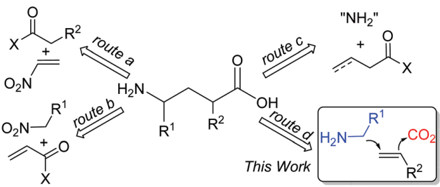
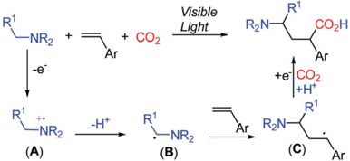
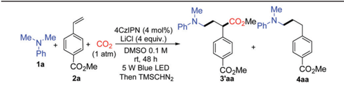
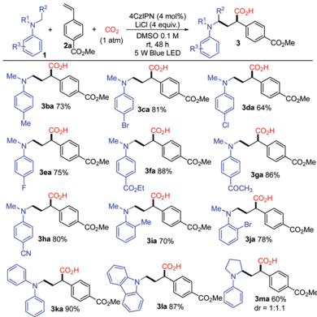
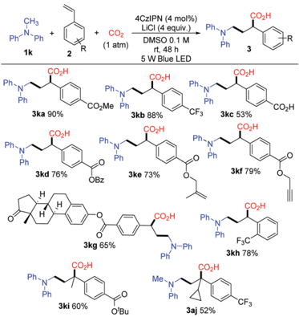
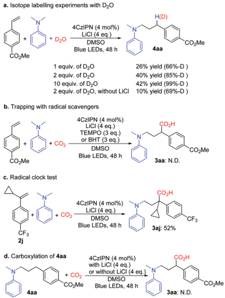
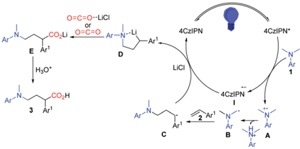

Xi ID *

Check for updates

R2

+

O¿N

O¿N—

route a route c

## Green Chemistry

H½N-

This Work

## COMMUNICATION

Cite this: Green Chem. , 2020, 22 , 5961

Received 2nd July 2020, Accepted 18th August 2020

DOI: 10.1039/d0gc02254c

rsc.li/greenchem

View Article Online View Journal | View Issue

## Photoredox-catalyzed dicarbofunctionalization of styrenes with amines and CO2: a convenient access to γ -amino acids †

Bo Zhang, a Yaping Yi, a Zhong-Qian Wu, a Chao Chen * a

and Chanjuan Xi * a,b

A visible-light-promoted carbocarboxylation of styrenes using CO2 and amines is reported. The reaction is catalyzed by a photoredox catalyst and is compatible with a variety of amines and styrenes. This method a ff ords highly functionalized γ -amino acids in good yields with high regioselectivity.

γ -Amino acids are highly valuable compounds that exist widely in pharmaceuticals and exhibit a diverse range of biological activities as agonists and antagonists of receptors for mammalian neurotransmitters in the central nervous system. 1 Thus, considerable e ff orts have been devoted to the synthesis of γ -amino acids, 2 such as Michael addition of carbonyl compounds to nitroethylenes (Scheme 1, route a) 3 or conjugate addition of nitroalkanes to α , β -unsaturated carbonyl compounds (Scheme 1, route b) 4 to a ff ord γ -amino acids. Recently, Ye and coworkers reported γ -amination of α , β -unsaturated acyl chlorides with azodicarboxylates followed by reductive ring opening of dihydropyridazinones to a ff ord γ -amino acids (Scheme 1, route c). 5 Despite all these e ff orts, these synthetic methods su ff er from limited substrate scope, multiple steps, and/or harsh reaction conditions. We envisioned that the simultaneous incorporation of both α -aminoalkyl and carbon dioxide (CO2) to alkenes via dicarbofunctionalization of alkenes would serve as an ideal route to deliver γ -amino acids (Scheme 1, route d).

The evolving visible-light-mediated photoredox catalysis o ff ers an operating strategy to access open shell radical species, 6 leading to novel methods for difunctionalization of alkenes. 7 Recently, photoredox-promoted single electron oxidation of amines and subsequent deprotonation to generate α -aminoalkyl radicals B have been described (Scheme 2). 8 The

a MOE Key Laboratory of Bioorganic Phosphorus Chemistry &amp; Chemical Biology,

Department of Chemistry, Tsinghua University, Beijing 100084, China.

E-mail: cjxi@tsinghua.edu.cn, chenchao01@mails.tsinghua.edu.cn

b State Key Laboratory of Elemento-Organic Chemistry, Nankai University, Tianjin 300071, China

† Electronic supplementary information (ESI) available. See DOI: 10.1039/ d0gc02254c

addition of the α -aminoalkyl radical B to alkenes resulted in the formation of the alkyl radical species C , which undergoes a single electron reduction to capture an electrophile. 9 We anticipated that the incorporation of CO2 as an electrophile in the reaction mixture might enable the formation of γ -amino acids.

CO2 as a nontoxic, ubiquitous, and recyclable one-carbon source has attracted attention in organic synthesis. 10 The catalytic carboxylation of unsaturated compounds with CO2 has attracted much attention from chemists. 11 Compared with the widely considered hydrocarboxylation of alkene with CO2, 12 photocatalytic functional carboxylation of alkenes with CO2 is more challenging and rarely reported. Recently, the Martin, Yu, Wu, and Li groups demonstrated respectively the photoredox-catalyzed difunctionalization of alkenes under visible light to a ff ord β -functionalized alkylcarboxylic acids with CO2. 13 Taking into account the potential of these transformations and our ongoing interest in the carboxylation of alkenes with CO2 for the e ffi cient dicarbofunctionalization reaction, herein, we report the photoredox-catalyzed α -aminomethylcarboxylation of alkenes with amines and CO2. This strategy is sustainable, general, and practical, representing a rare example of redox-neutral dicarbofunctionalization of alkenes to generate important γ -amino acids with high e ffi ciency and selectivity under mild reaction conditions.

We started the investigation by employing N , N -dimethylaniline 1a and methyl 4-vinylbenzoate 2a as model substrates

Scheme 1 Typical approaches to γ -amino acid derivatives.

COz en D *

"NH½"

22

7 eq. instead of 6 eq. of 1a

R1

Visible

4CzIPN (4 mol%)

'Bu

Ph-N

MON Me

NR2

'Bu

R2 / PF6

R2

+ COz

COzH

Me

1a

(1 atm)

CO¿Me

2a

Ir-2 R'=CF, R2=F

Іг-1 R'=R2=H

R'

3ba 73%

Me

CO¿Me

-NR2

(A)

Me ~

Зеа 75%

COzH

-H+

CO¿Me

COZH

DMSO 0.1 M

5 W Blue LED

rt, 48 h

Q-1 R=H

Q-2 R=OAc

СОгН

Me

Scheme 2 Photocatalytic preparation of γ -amino acids from CO2.

СОгН

CO¿H

under the irradiation of 5 W blue light emitting diodes (LEDs) with atmospheric pressure CO2. Yields were determined after methyl esterification with TMSCHN2 (Table 1). After numerous extensions of the reaction parameters, the desired product 3 ′ aa was obtained in 95% yield when 4 mol% of 1,2,3,5-tetrakis-

Table 1 Optimization of the reaction conditions a

| Entry   | Deviation from standard conditions   | Yield of 3 ′ aa b [%]   | Yield of 4aa b [%]   |
|---------|--------------------------------------|-------------------------|----------------------|
| 1       | None                                 | 95 (89)                 | 4                    |
| 2       | Ir-1 instead of 4CzIPN               | 84                      | 4                    |
| 3       | Ir-2 instead of 4CzIPN               | 76                      | 4                    |
| 4       | Ir-3 instead of 4CzIPN               | 12                      | 1                    |
| 5       | Ru-1 instead of 4CzIPN               | 83                      | 2                    |
| 6       | Without 4CzIPN                       | -                       | -                    |
| 7       | LiF instead of LiCl                  | 44                      | 3                    |
| 8       | LiBF 4 instead of LiCl               | 39                      | 5                    |
| 9       | LiOAc instead of LiCl                | 43                      | 7                    |
| 10      | NaCl instead of LiCl                 | 20                      | 2                    |
| 11      | KCl instead of LiCl                  | 26                      | 3                    |
| 12      | Without LiCl                         | 62                      | 3                    |
| 13      | 2 eq. instead of 4 eq. of LiCl       | 82                      | 5                    |
| 14      | Add 20 mol% Q-1                      | 46                      | 24                   |
| 15      | Add 20 mol% Q-2                      | 48                      | 15                   |
| 16      | DMF instead of DMSO                  | 80                      | 15                   |
| 17      | MeCN instead of DMSO                 | 8                       | 44                   |
| 18      | THF instead of DMSO                  | 8                       | 28                   |
| 19 c    | 0.025 Minstead of 0.1M               | 56                      | 19                   |
| 20      | 2 eq. instead of 6 eq. of 1a         | 79                      | 9                    |
| 21      | 4 eq. instead of 6 eq. of 1a         | 73                      | 11                   |
| 22      | 7 eq. instead of 6 eq. of 1a         | 94                      | 3                    |

|

CO¿H

94

Me

R1

COzH

7(PF&amp;)½

R¿N—

+e

Me

COzH

СО¿Мерп-N

NC.

\_CN

CO¿Me

CO¿H

Bri

CO2

Me ~

(carbazole-9-yl)-4,6-dicyanobenzene (4CzIPN) was used as a photoredox catalyst and LiCl as an additive in DMSO (0.1 M) at room temperature after 48 h irradiation (entry 1). The hydroaminoalkylation product 4aa was also detected by GC as a byproduct. Ir(ppy)2(dtbbpy)(PF6), Ir(dF(CF3)ppy)2(dtbbpy)(PF6), and Ru(bpy)3(PF6)2 were employed as photoredox catalysts which performed less e ff ectively than 4CzIPN (entries 2, 3 and 5). A trace amount of 3 ′ aa was obtained using Ir(ppy)3 instead of 4CzIPN (entry 4). The reaction could not proceed without the photoredox catalyst (entry 6). The choice of the additive was pivotal; LiF, LiBF4, LiOAc, NaCl, and KCl were used as additives to a ff ord lower yields of 3 ′ aa (entries 7 -11). Notably, the reaction proceeded to give the desired product 3 ′ aa in 62% yield in the absence of LiCl (entry 12). When two equivalents of LiCl were employed, the desired product 3 ′ aa was obtained in 82% yield (entry 13). Hydrogen atom transfer (HAT) is frequently involved in photocatalysis, which o ff ers enormous opportunities for C -H activation. 14 The combination of the photoredox catalyst 4CzIPN (4 mol%) with HAT catalysts such as quinuclidin-3-yl acetate and quinuclidine (20 mol%) provided the desired product 3 ′ aa in 46% and 48% yields, respectively (entries 14 and 15). Among the solvents examined, DMSO resulted in the best reactivity and selectivity (entries 1 and 16 -18). Both reactivity and selectivity significantly decreased with the dilution of 1a as expected (entry 19). The utilization of 6 equivalents of amine was proved to be necessary to obtain the desired product in a good yield (entries 1, 20 -22).

With the optimized conditions, a study on the substrate scope was carried out. Firstly, a variety of tertiary amines 1 were used in the reaction with methyl 4-vinylbenzoate 2a to synthesize γ -amino acids with a range of substituents on anilines. The representative results are shown in Scheme 3. The

Scheme 3 Photocatalytic reactions of methyl 4-vinylbenzoate 2a with amines. Reaction conditions: 1 (1.2 mmol), 2a (0.2 mmol), 4CzIPN (0.008 mmol), LiCl (0.8 mmol), DMSO (2 mL), 1 atm CO2, 5 W blue LED, room temperature, 48 h, quenched with HCl (2 M) solution. Yields of isolated carboxylic acid 3 without esteri fi cation with TMSCHN2.

a. Isotope labelling experiments with D20

СНз

Ph-N-Ph

1k

COzMe

Ph

Ph-N

ph-N

Ph

CO¿Me

Ph-N

Ph

2j

4aa

R

+ D20

4CzIPN (4 mol%)

LiCI (4 eq.)

DMSO

CO¿H

CO¿Me

5 W Blue LED

reaction of 2a with dimethylphenylamine ( 1a ) proceeded smoothly to give γ -amino acid 3aa in 88% isolated yield without esterification with TMSCHN2. Introduction of a substituent such as methyl, bromo, chloro, or fluoro at the para -position of the benzene ring did not a ff ect much the yield of γ -amino acids 3 ( 3ba in 73%, 3ca in 81%, 3da in 64%, 3ea in 75%). The amines bearing highly electron-withdrawing groups such as an ester, keto carbonyl, or cyano group at the para -position in the benzene ring yielded the expected products 3 in high yields ( 3fa in 88%, 3ga in 86%, 3ha in 80%). The substituents such as methyl or bromo located at the ortho -position in the benzene ring also a ff orded the target products 3 in good yields ( 3ia in 70%, 3ja in 78%). To our delight, methyldiphenylamine 1k was well applicable and delivered the corresponding γ -amino acid 3ka in 90% yield. γ -Amino acids with a carbazolyl group have potential in materials science; in this reaction, 9-methyl-9 H -carbazole 1l was also applicable and delivered the corresponding γ -amino acid 3la in 87% yield. The cyclic amine 1-phenylpyrrolidine 1m was transformed into 3ma in 60% yield. It is noteworthy that the utilization of primary and secondary amines such as octan-1-amine and N -methylaniline as well as other aromatic amines such as 4-methoxyN , N -dimethylaniline and N -dimethylnaphthalen-1amine did not lead to the corresponding products.

Next, we examined the photocatalytic reactions with a variety of alkenes 2 ; the typical results are shown in Scheme 4. A series of substituted styrenes with electron-withdrawing substituents at the para -position such as trifluoromethyl ( 2b ), carboxyl ( 2c ) and esters ( 2a , 2d , 2e , 2f , 2g , and 2i ) could be accommodated and a ff orded the corresponding products 3 in good yields. Remarkably, γ -amino acid 3kc was prepared smoothly when 4-vinylbenzoic acid ( 2c ) was employed. When

Scheme 4 Photocatalytic reactions of methyldiphenylamine 1k and 1a with alkenes. Reaction conditions: 1k or 1a (1.2 mmol), 2 (0.2 mmol), 4CzIPN (0.008 mmol), LiCl (0.8 mmol), DMSO (2 mL), 1 atm CO2, 5 W blue LED, RT, 48 h, quenched with HCl (2 M) solution. Yields of isolated products.

H(D)

Ph ph-N

benzyl-, alkenyl-, and alkynyl-derivatived ester styrenes such as 2d , 2e , and 2f were employed, the corresponding products 3kd , 3ke , and 3kf were formed in good yields, respectively. Moreover, estrone-derived ester styrene 2g was also tested, and the corresponding α -aminomethylcarboxylation product 3kg was obtained in 65% yield. It is noteworthy that estrone linked with γ -amino-acid moiety could be well soluble in organic solutions while estrone cannot. Notably, the styrene with a substituent at the ortho -position of the benzene ring also gave the corresponding product 3kh in 78% yield. Vinylpyridine was employed as the styrene in this reaction and a trace amount of the desired product was detected. Furthermore, α -substituted styrenes could be used resulting in the target compounds 3ki and 3aj with quaternary carbon centers. Unfortunately, β -substituted styrenes such as methyl ( E )-4( prop-1-en-1-yl)benzoate could not undergo the reaction. In addition, we did not detect the desired products when butyl acrylate and acrylonitrile were used in this reaction. In general, an electron-withdrawing group at the benzene ring of the styrene is essential to obtain the corresponding γ -amino acid in this reaction.

Additional experiments were performed to gain insight into the reaction mechanism. Light on -o ff experiments indicated that continuous light irradiation was essential to perform the reaction, and during the process, hydroaminoalkylation was restrained all the way. The quantum yield of the reaction of 1a with 2a under the optimized conditions was 0.0414 (see the ESI † ). The isotope labelling experiments with D2O implied that γ -amino benzylic anionic species could be the intermediates (Scheme 5a). It is noteworthy that the yield of 4aa increased with increasing amount of D2O, and LiCl also played

Scheme 5 Control experiments for elucidation of the mechanism.

HзО*

Ar'

4CzIPN

4CzIРN*

Scheme 6 The proposed reaction mechanism.

a vital role in this reaction. When the radical scavengers 2,2,6,6-tetramethyl-piperidinyloxyl (TEMPO) and 2,6-ditert -butyl-4-methylphenol (BHT) were used in the reaction, the desired product 3aa was not obtained (Scheme 5b) respectively; these results indicated that this transformation might rely on a radical process. Furthermore, the radical clock substrate 2j was used under the optimal reaction conditions; however, no ringopening product was detected (Scheme 5c), which suggested that the single electron reduction step from the benzyl radical to the benzyl anion is quite quick. Compound 4aa was treated with standard conditions, and 3aa was not observed and 4aa was retained (Scheme 5d), which rules out the direct C -H carboxylation pathway. 15

Based on the aforementioned results, a plausible mechanism was proposed and is shown in Scheme 6. Photo-excited 4CzIPN is reductively quenched with aniline leading to I and the radical cation intermediate A , which then deprotonates and gives α -aminoalkyl radical B in the presence of a base. The carbon radical B undergoes addition to the C v C bond of styrene 2 to selectively generate the γ -amino benzylic radical C . A subsequent single-electron transfer (SET) between C and the reduced photocatalyst 4CzIPN gives the γ -amino benzylic carbanion D , which is proposed as a lithium chelated species to stabilize the carboanion and accelerate the SET process. The nucleophilic addition to CO2 or activated CO2 by LiCl and protonation complete this reaction and yield the expected γ -amino acids.

## Conclusions

In summary, we have developed a catalytic intermolecular dicarbofunctionalization of styrenes with CO2 and amines through photoredox catalysis. The carbocarboxylation has the advantages of superior step and atom economy, broad substrate scope, and mild conditions. This study represents a rare example of the catalytic carbocarboxylation of alkenes with CO2 in a redox-neutral fashion, which could lead to a new general alkene dicarbofunctionalization strategy using abundant and inexpensive chemical feedstock.

## Con fl icts of interest

There are no conflicts to declare.

O=C=O--LiCI

## Acknowledgements

We thank the National Natural Science Foundation of China (No. 21871163, 21871158, 21672120, and 91645120) and the National Key Research and Development Program of China (2016YFB0401400).

## Notes and references

- 1 For selected recent reviews, see: ( a ) P. Conti, L. Tamborini, A. Pinto, A. Blondel, P. Minoprio, A. Mozzarelli and C. De Micheli, Chem. Rev. , 2011, 111 , 6919 -6946; ( b ) R. B. Silverman, Angew. Chem., Int. Ed. , 2008, 47 , 3500 -3504.
- 2 ( a ) M. Ordóñez and C. Cativiela, Tetrahedron: Asymmetry , 2007, 18 , 3 -99; ( b ) K. Maruoka and T. Ooi, Chem. Rev. , 2003, 103 , 3013 -3028.
- 3 ( a ) R. Kastl and H. Wennemers, Angew. Chem., Int. Ed. , 2013, 52 , 7228 -7232; ( b ) J. H. Sim and C. E. Song, Angew. Chem., Int. Ed. , 2017, 56 , 1835 -1839; ( c ) Y. Chi, L. Guo, N. A. Kopf and S. H. Gellman, J. Am. Chem. Soc. , 2008, 130 , 5608 -5609; ( d ) T. Okino, Y. Hoashi, T. Furukawa, X. Xu and Y. Takemoto, J. Am. Chem. Soc. , 2005, 127 , 119 -125; ( e ) M. Wiesner, J. D. Revell, S. Tonazzi and H. Wennemers, J. Am. Chem. Soc. , 2008, 130 , 5610 -5611.
- 4 ( a ) K. Akagawa and K. Kudo, Angew. Chem., Int. Ed. , 2012, 51 , 12786 -12789; ( b ) A. Baschieri, L. Bernardi, A. Ricci, S. Suresh and M. F. Adamo, Angew. Chem., Int. Ed. , 2009, 48 , 9342 -9345.
- 5 ( a ) X. Y. Chen, F. Xia, J. T. Cheng and S. Ye, Angew. Chem., Int. Ed. , 2013, 52 , 10644 -10647; ( b ) L. T. Shen, L. H. Sun and S. Ye, J. Am. Chem. Soc. , 2011, 133 , 15894 -15897.
- 6 For selected reviews, see: ( a ) D. Ravelli, S. Protti and M. Fagnoni, Chem. Rev. , 2016, 116 , 9850 -9913; ( b ) D. Stanveness, I. Bosque and C. R. J. Stephenson, Acc. Chem. Res. , 2016, 49 , 2295 -2306; ( c ) J.-P. Goddard, C. Ollivier and L. Fensterbank, J. Am. Chem. Soc. , 2016, 49 , 1924 -1936; ( d ) N. A. Romero and D. A. Nicewicz, Chem. Rev. , 2016, 116 , 10075 -10166.
- 7 For selected reviews, see: ( a ) M. Y. Cao, X. Ren and Z. Lu, Tetrahedron Lett. , 2015, 56 , 3732 -3742; ( b ) T. Koike and M. Akita, Org. Chem. Front. , 2016, 3 , 1345 -1348; ( c ) T. Koike and M. Akita, Chem , 2018, 4 , 1 -29.
- 8 ( a ) A. McNally, C. K. Prier and D. W. MacMillan, Science , 2016, 352 , 1304 -1308; ( b ) Y. Cai, Y. Tang, L. Fan, Q. Lefebvre, H. Hou and M. Rueping, ACS Catal. , 2018, 8 , 9471 -9476; ( c ) L. Shi and W. Xia, Chem. Soc. Rev. , 2012, 41 , 7687 -7697; ( d ) K. Nakajima, Y. Miyake and Y. Nishibayashi, Acc. Chem. Res. , 2016, 49 , 1946 -1956; ( e ) S. A. Morris, J. Wang and N. Zheng, Acc. Chem. Res. , 2016, 49 , 1957 -1968.
- 9 ( a ) Y. Miyake, K. Nakajima and Y. Nishibayashi, J. Am. Chem. Soc. , 2012, 134 , 3338 -3341; ( b ) P. Kohls, D. Jadhav, G. Pandey and O. Reiser, Org. Lett. , 2012, 14 , 672 -675; ( c ) Y. Yin, Y. Dai, H. Jia, J. Li, L. Bu, B. Qiao, X. Zhao and Z. Jiang, J. Am. Chem. Soc. , 2018, 140 , 6083 -6087;

- ( d ) M. A. Ashley, C. Yamauchi, J. C. K. Chu, S. Otsuka, H. Yorimitsu and T. Rovis, Angew. Chem., Int. Ed. , 2019, 58 , 4002 -4006.
- 10 For selected reviews, see: ( a ) D. Yu, S. P. Teong and Y. Zhang, Coord. Chem. Rev. , 2015, 293 -294 , 279 -291; ( b ) S. Wang, G. Du and C. Xi, Org. Biomol. Chem. , 2016, 14 , 3666 -3676; ( c ) S. Wang and C. Xi, Chem. Soc. Rev. , 2019, 48 , 382 -404; ( d ) Y. Cao, X. He, N. Wang, H.-R. Li and L.-N. He, Chin. J. Chem. , 2018, 36 , 644 -659; ( e ) Q. Liu, L. Wu, R. Jackstell and M. Beller, Nat. Commun. , 2015, 6 , 5933; ( f ) K. Huang, C.-L. Sun and Z.-J. Shi, Acc. Chem. Res. , 2011, 40 , 2435 -2452; ( g ) F. Tan and G. Yin, Chin. J. Chem. , 2018, 36 , 545 -554.
- 11 For selected reviews, see: ( a ) A. Tortajada, F. JuliaHernandez, M. Borjesson, T. Moragas and R. Martin, Angew. Chem., Int. Ed. , 2018, 57 , 15948 -15982; ( b ) M. Bçrjesson, T. Moragas, D. Gallego and R. Martin, ACS Catal. , 2016, 6 , 6739 -6749; ( c ) F. Julia-Hernandez, M. Gaydou, E. Serrano, M. Gemmeren and R. Martin, Top. Curr. Chem. , 2016, 374 , 45; ( d ) Y. Tsuji and T. Fujihara, Chem. Commun. , 2012, 48 , 9956 -9964.
- 12 For selected articles, see: ( a ) B. Yu, Z.-F. Diao, C.-X. Guo and L.-N. He, J. CO2 Util. , 2013, 1 , 60 -68; ( b ) M. Limbach,
- Adv. Organomet. Chem. , 2015, 63 , 175 -202; ( c ) C. M. Williams, J. B. Johnson and T. Rovis, J. Am. Chem. Soc. , 2008, 130 , 14936 -14937; ( d ) E. Shirakawa, D. Ikeda, S. Masui, M. Yoshida and T. Hayashi, J. Am. Chem. Soc. , 2012, 134 , 272 -279; ( e ) M. D. Greenhalgh and S. P. Thomas, J. Am. Chem. Soc. , 2012, 134 , 11900 -11903; ( f ) P. Shao, S. Wang, C. Chen and C. Xi, Org. Lett. , 2016, 18 , 2050 -2053.
- 13 ( a ) V. R. Yatham, Y. Shen and R. Martin, Angew. Chem., Int. Ed. , 2017, 56 , 10915 -10919; ( b ) J. H. Ye, M. Miao, H. Huang, S. S. Yan, Z. B. Yin, W. J. Zhou and D. G. Yu, Angew. Chem., Int. Ed. , 2017, 56 , 15416 -15420; ( c ) Q. Fu, Z.-Y. Bo, J.-H. Ye, T. Ju, H. Huang, L.-L. Liao and D.-G. Yu, Nat. Commun. , 2019, 10 , 3592; ( d ) J. Hou, A. Ee, H. Cao, H.-W. Ong, J. Xu and J. Wu, Angew. Chem., Int. Ed. , 2018, 57 , 17220 -17224; ( e ) H. Wang, Y. Gao, C. Zhou and G. Li, J. Am. Chem. Soc. , 2020, 142 , 8122 -8129.
- 14 For selected reviews, see: ( a ) J. M. Mayer, Acc. Chem. Res. , 2011, 44 , 36 -46; ( b ) L. Capaldo and D. Ravelli, Eur. J. Org. Chem. , 2017, 2056 -2071.
- 15 Q. Meng, T. E. Schirmer, A. L. Berger, K. Donabauer and B. Konig, J. Am. Chem. Soc. , 2019, 141 (29), 11393 -11397.