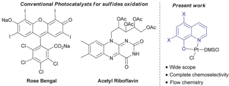
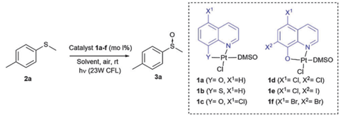
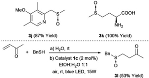
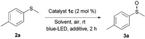
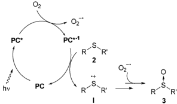
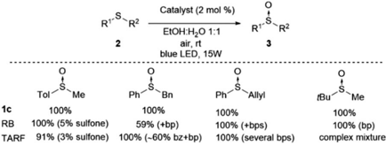
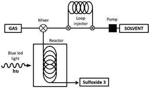

Open Access A

NaO

Open Access Article. Published on 08 April 2016. Downloaded on 6/42026 11:0429 AM.

Conventional Photocatalysts for sulfides oxidation

CrossMark

4 click for updates

OAc I

OAc

OAc

OAc

## ChemComm

Rose Bengal

Present work

Pt-DMSO

· Wide scope

Acetyl Riboflavin

· Complete chemoselectivity

· Flow chemistry

## COMMUNICATION

Cite this: Chem. Commun., 2016, 52 , 9137

Received 21st March 2016, Accepted 8th April 2016

DOI: 10.1039/c6cc02452a

www.rsc.org/chemcomm

A new catalytic system for the photooxidation of sulfides based on Pt(II) complexes is presented. The catalyst is capable of oxidizing a large number of sulfides containing aryl, alkyl, allyl, benzyl, as well as more complex structures such as heterocycles and methionine amino acid, with complete chemoselectivity. In addition, the first sulfur oxidation in a continuous flow process has been developed.

During the recent years, visible light photoredox catalysis has been established as a powerful tool for the synthesis of molecules by selective activation of bonds under mild conditions. 1 The catalysts involved in most of the processes are Ru(II) and Ir(III) complexes 2 or photoorganocatalysts such as eosin Y or flavin. 3 By contrast, few studies have focused on the development of photocatalysts based on other metal complexes such as Fe, Cu, Au, 4 even though complexes such as the platinum organometallic complexes 5 a , b have been widely studied as photosensitizers in solar cells and as electrophosphorescence sensors. 5 c , d A more recent trend in this field is the implementation of photochemical processes in flow reactors that have solved the limitations associated with the scale-up of photochemical reactions for industrial purposes. 6 Most of the continuous flow reactions have been developed using mainly ruthenium and iridium complexes.

During the past few years, our group has synthesized different coordination complexes based on platinum(II) and hydroxyquinoline ligands which have proved to be excellent candidates as antitumoral complexes (Fig. 1). 7 The yellow-orange colour of these compounds and the photophysical properties of hydroxyquinolineplatinum(II) complexes described in the literature, 5 e , f led us to

a Departamento de Quı ´mica Inorga ´nica (Mo ´dulo 7), Facultad de Ciencias, Universidad Auto ´noma de Madrid, 28049-Madrid, Spain. E-mail: silvia.cabrera@uam.es

b Departamento de Quı ´mica Orga ´nica (Mo ´dulo 1), Facultad de Ciencias, Universidad Auto ´noma de Madrid, 28049-Madrid, Spain. E-mail: jose.aleman@uam.es; Web: www.uam.es/jose.aleman

c Synthelia Organics Labs, C/Faraday 7. Labs 2.05 and 0.03, Parque Cientı ´fico de Madrid, 28049 Madrid, Spain

† Dedicated to Prof. Jose Luis Garcı ´a Ruano on the occasion of his retirement.

‡ Electronic supplementary information (ESI) available. See DOI: 10.1039/c6cc02452a

View Article Online View Journal  | View Issue

## Pt(II) coordination complexes as visible light photocatalysts for the oxidation of sulfides using batch and flow processes †‡

Antonio Casado-Sa ´nchez, a Rocı ´ o Go ´ mez-Ballesteros, b Francisco Tato, c Francisco J. Soriano, c Gustavo Pascual-Coca, c Silvia Cabrera* a and Jose ´ Alema ´ n* b

Fig. 1 Visible light photocatalysts for the photooxidation of sulfides.

postulate whether these platinum complexes could be used as visible light photocatalysts for different transformations.

To test this hypothesis, the oxidation of sulfides as the model reaction was proposed. 8 Chemoselective oxidation of sulfides to sulfoxides has been extensively studied due to the importance of sulfoxides in organic synthesis, medicinal chemistry and natural products. 9 Traditionally, this oxidation has been achieved under metal catalysis using peroxides or peracids as the oxidants. However, their over-oxidation to sulfones, and the safety issues associated with handling peroxides ( m -CPBA, peracetic acid) are the main drawbacks associated with their use in industrial processes. Interestingly, the metal photo-oxidation of sulfides using atmospheric O2 proved to be a safer alternative. The different catalytic systems reported for this plausible metalphotooxidation have a narrow scope and large number of by-products. 10 Two organic photocatalysts, i.e. tetraO -acetylriboflavine and Rose Bengal have been reported. 11 These two organocatalysts presented some limitations due to the restricted use of benzyl or tert -butyl sulfides (due to their more difficult oxidation), and the formation of aldehydes as byproducts in some cases, and over-oxidation to sulfones. Furthermore, both catalysts are unstable, making their use in industrial processes difficult. In addition, despite the importance of these structures in industrial chemistry continuous flow sulfur oxidation has not yet been reported. For these reasons, a more robust and soluble catalyst which is capable of oxidising a large variety of sulfides in both, batch and flow reactors, would be highly desirable. In this communication, the oxidation of sulfides using a platinum(II)

Open Access A

2

2a

Catalyst 1c (2 mol %)

RI

blue LED, 15W

Catalyst 1a-f (mo 1%)

Table 1 Catalyst screening and optimization of reaction conditions a

За

1a (Y= O, X'=H)

1d (X1= CI, X2= CI)

|   Entry | Catalyst (mol%)    | Solvent    |   Time (h) | Conversion b (%)   |
|---------|--------------------|------------|------------|--------------------|
|       1 | 1a (5)             | DMF        |         24 | 34                 |
|       2 | 1b (5)             | DMF        |         24 | o 5                |
|       3 | 1c (5)             | DMF        |         24 | 100                |
|       4 | 1d (5)             | DMF        |         24 | 100                |
|       5 | 1e (5)             | DMF        |         24 | o 5                |
|       6 | 1f (5)             | DMF        |         24 | 100                |
|       7 | 1c (2)             | DMF        |         24 | 100                |
|       8 | 1d (2)             | DMF        |         24 | 44                 |
|       9 | 1f (2)             | DMF        |         24 | 40                 |
|      10 | Ru(bpy) 3 Cl 2 (2) | DMF        |         24 | 68                 |
|      11 | Ir(ppy) 3 (2)      | DMF        |         24 | 85                 |
|      12 | 1c (1)             | DMF        |         24 | 65                 |
|      13 | 1c (1)             | CH 2 Cl 2  |         24 | 51                 |
|      14 | 1c (1)             | Toluene    |         24 | 10                 |
|      15 | 1c (1)             | MeOH       |         24 | 96                 |
|      16 | 1c (1)             | EtOH       |         24 | 61                 |
|      17 | 1c (1)             | EtOH:H 2 O |         24 | 100                |
|      18 | 1c (1) c           | EtOH:H 2 O |         21 | 100                |
|      19 | 1c (2) c           | EtOH:H 2 O |         10 | 100                |

coordination complex as the photocatalyst, and the development of both batch and flow processes are presented.

As mentioned above, we have previously reported the synthesis of platinum(II) complexes containing 8-hydroxyquinoline derivatives as ligands (see Table 1). 7 These complexes display metal-to-ligand charge-transfer (MLCT) bands in the visible spectrum region, in which the maximum absorption strongly depends on the substituents of the hydroxyquinoline ligand (see the ESI ‡ ). As a result, modifications of the structure or the coordinating atoms of the quinoline ligand would allow easy tuning of the excited state properties of the complexes. For this reason, this family of platinum(II) complexes are good candidates as visible light photocatalysts.

To evaluate this catalytic system, we began by performing the oxidation of methylp -tolyl sulfide ( 2a ) with 5 mol% of the corresponding complex 1a-f under visible light (23 W commercial fluorescent bulb) for 24 h (Table 1). We found that the Pt complexes 1c , 1d and 1f allowed the complete oxidation of sulfide 2a after 24 h (entries 3, 4 and 6), but only a low conversion was achieved using photocatatalyst 1a (entry 1). As expected and due to the lack of absorption of complexes 1b and 1e in the visible light region (see the ESI ‡ ), these catalysts did not produce any conversion (entries 2 and 5). In order to evaluate the most active catalyst, the oxidation was performed using 2.0 mol% of the catalysts 1c , 1d and 1f (entries 7-9), which revealed that the most active catalyst was complex 1c .

|

R2

The catalytic activity of 1c was compared with that of the most commonly used commercial metallic photocatalysts (entries 7, 10 and 11). Under the same reaction conditions Ru(bpy)3Cl2 and Ir(ppy)3 resulted in lower conversions (68-85%) when compared with the platinum complex 1c . In the next stage we screened different solvents decreasing the catalyst loading of 1c up to 1.0 mol% (entries 12-17). The use of toluene led to a sluggish oxidation (entry 14) while moderate conversions were achieved in CH2Cl2 (entry 13). The most polar solvents such as DMF, EtOH or MeOH gave good conversions (entries 12, 15 and 16). In a mixture of EtOH:H2O, which is considered to be a 'green' solvent, the oxidation of sulfide 2a took place within 24 h (entry 17) and reduced up to 10 h upon irradiation with a blueLED at 2 mol% of the catalyst (entry 19).

Once the optimal conditions had been determined, the oxidation of sulfides of a different nature using the platinum photocatalyst 1c could be studied (Table 2). In addition, the reaction was scaled up to 3.0 mmol without any decrease in the yield (entry 2). Sulfides containing electron-donating or electronwithdrawing groups at the aryl moiety ( 2b-d ) were also oxidized, but for the electron-deficient aryl groups, longer reaction times were needed to obtain high conversions (entries 3-5). The oxidation of sulfides containing other alkyl groups, instead of the methyl group, was also possible (entries 6-8). Therefore, cyclopropyl, allyl or benzyl sulfides were also oxidized with good yields (66-88%), without detection of benzaldehyde, sulfone or unidentified byproducts as was found in other catalytic systems. 11 Dialkyl sulfides, including the sterically hindered tert -butylmethylsulfide, were oxidized to sulfoxides 3h-i in high yields and within short reaction times (entries 9 and 10). It is noteworthy that in all the oxidations studied, the reaction was completely chemoselective and neither sulfone, nor any other byproduct, was detected using 1 H NMR.

It is also important to demonstrate the applicability of the platinum catalyst by testing the oxidation of more functionalized

Table 2 Photo-oxidation of different sulfides ( 2 ) under blue-LED irradiation and 1c a

a All reactions were carried out using 2 (0.3 mmol) and 2 mol% of catalyst 1c in 2 mL of a mixture 1:1 EtOH:H2O under blue-LED irradiation. b Yield after purification by flash chromatography. c Between brackets, conversion yield determined by 1 H NMR analysis of the crude mixture. d Reaction carried out using 3 mmol of 2 .

|   Entry | R 1            | R 2         |   Time (h) | Sulfoxide   | Yield b (%) c   |
|---------|----------------|-------------|------------|-------------|-----------------|
|       1 | p -Me-C 6 H 4  | Me          |         10 | 3a          | 98 (100)        |
|       2 | p -Me-C 6 H 4  | Me          |         25 | 3a          | 97 d (100)      |
|       3 | p -MeO-C 6 H 4 | Me          |         27 | 3b          | 91 (100)        |
|       4 | p -CN-C 6 H 4  | Me          |         48 | 3c          | 62 (70)         |
|       5 | o -Br-C 6 H 4  | Me          |         48 | 3d          | 83 (98)         |
|       6 | Ph             | Cyclopropyl |         48 | 3e          | 88 (100)        |
|       7 | Ph             | Benzyl      |         48 | 3f          | 83 (100)        |
|       8 | Ph             | Allyl       |         48 | 3g          | 62 (100)        |
|       9 | Bu             | Bu          |         13 | 3h          | 85 (100)        |
|      10 | t -Bu          | Me          |         13 | 3i          | 79 (100)        |

Open Access A

1c

RB

hv

Catalyst (2 mol %)

RZ

„COOH

Catalyst 1c (2 mol %)

EtOH:HO 1:1

blue-LED, additive, 2 h air, rt

3j (87% Yield)

PC*

MeO

2a

TolT

BnSH

blue LED, 15W

a) H20, rt

Me

100%

Ph b) Catalyst 1c (2 mol%)

PC

EtOH:H,O 1:1

air, rt, blue LED, 15W

3k (100% Yield)

За

100% (5% sulfone)

TARF

59% (+bp)

91% (3% sulfone)

100% (~60% bz+bp)

Scheme 1 Photooxidation of building blocks with relevant biological applications.

sulfides such as 2j , which contain a benzylic and oxidizable nitrogen, and an unprotected methionine amino acid 2k . The selection of these substrates was also motivated by the importance of the corresponding sulfoxides ( 3j and 3k ) as important compounds in medicinal chemistry and natural products 12 (top, Scheme 1). In both cases, the sulfoxides 3j and 3k were easily obtained in yields of 87% and 100%, respectively, without any traces of byproducts. In addition, the synthesis of ketosulfoxide 3l , which has been used as a useful intermediate in synthesis, 9 was synthesized in one-pot (bottom, Scheme 1). First, the thio-Michael reaction took place, which was irradiated by a blue LED and promoted the oxidation to yield the sulfoxide 3l .

In order to gain further insight into the mechanism, additional experiments were carried out (Table 3). The reaction did not take place in the absence of light ( i.e. in the dark), without the catalyst or under an argon atmosphere, which indicated the key roles of the catalyst, O2, and light in the oxidation process (see the ESI ‡ ). Two main mechanisms for the visible light photocatalytic oxidation of sulfides have been proposed in the literature. 10,11 The first deals with singlet oxygen oxidation, which is formed via an energy transfer process, and the second involves radical intermediates via electron-transfer. The discrimination between these two mechanism pathways is not easy but some indirect tests can indicate the predominant one. It is well known that oxidations via 1 O2 can be accelerated using deuterated solvents. 11 b However, we did not observe any change in the oxidation rate using MeOH or deuterated MeOH (compare entries 1 and 2, and ESI ‡ for the complete kinetic experiment), neither did the addition of DABCO, as a scavenger of 1 O2, induce any significant change in the oxidation rate (entry 3). Furthermore, the oxidation of methylp -nitrophenylsulfide was not possible,

Table 3 Mechanistic experiments in the presence of enhancers or scavengers

|   Entry | Solvent   | Additive (mol%)            |   Conversion a (%) |
|---------|-----------|----------------------------|--------------------|
|       1 | MeOH      | -                          |                 40 |
|       2 | MeOH-D 4  | -                          |                 40 |
|       3 | MeOH      | DABCO (0.5)                |                 39 |
|       4 | MeOH      | Benzoquinone (0.5)         |                  3 |
|       5 | MeOH      | 1,4-Dimethoxybenzene (0.5) |                 26 |

Scheme 2 Mechanistic proposal for the photo-oxidation (PC = photocatalysts).

which suggests a radical type mechanism. Benzoquinone and 1,4-dimethoxybenzene are known to be scavengers of the superoxide radical and sulfide radical cations, respectively. 11 a Thus, the oxidation in the presence of 0.5 equiv. of benzoquinone was almost totally inhibited (entry 4), whereas the use of 1,4-dimethoxybenzene, as the sulfur radical cation scavenger, led to a decrease in the conversion (entry 5). All evidence described above together with the non-oxidation of methylp -nitrophenylsulfide and an 11% conversion in the oxidation of diphenylsulfide point to the outline proposed in Scheme 2 as a plausible mechanism. The photocatalyst (PC) is excited to PC* by the visible light. Then, the PC* may be oxidized generating the oxygen radical anion. Next, the PC is recovered by one-electron oxidation of sulfide 2 , generating a radical cation I . Finally, the sulfide radical cation I could react with the oxygen radical anion or the water to produce the final sulfoxides. To know the source of the oxygen in the sulfoxide, we carried out the oxidation of 2a in a 1:1 mixture of dry EtOH/H2 18 O as a solvent. The mass analysis of the resulting sulfoxide ( 3a ) showed a 155.05 m / z peak as the only product and no trace of the labelled sulfoxide was detected. This evidence suggests that the superoxide anion may be the oxygen source.

Wehave carried out a comparison with the previous catalytic systems (acetylriboflavin, and Rose Bengal) under the same reaction conditions. These results have been included in Scheme 3 (for NMR of the crude reactions see the ESI ‡ ). As it can be observed, the most selective and reactive catalyst is 1c . With the other catalysts lower conversion or the presence of different byproducts (over-oxidation, aldehydes, and unidentified products) were detected using NMR. With this study, it is clearly demonstrated that the present method is the most chemoselective and reliable one.

The scale-up of the photo-chemical processes can easily be adapted to flow chemistry. Our flow system consisted of a HPLC

Scheme 3 Comparative study of catalyst 1c with Rose Bengal (RB) and tetraO -acetylriboflavine (TARF) (bp = byproducts, bz = benzaldehyde) (see the ESI ‡ for spectra).

Open Access A

2

GAS

Blue led light

1c (1.0 mol%)

blue LED, 15W

Reactor

Pump

SOLVENT

Fig. 2 Description of the flow system used for the photooxidation of sulfides.

Table 4 Photooxidation of different sulfides using flow chemistry a

|   Entry | Sulfoxide 3   |   Solvent flow rate (mL min  1 ) |   O 2 flow rate (mL min  1 ) |   Residence time (min) |   Conv. b (%) |
|---------|---------------|----------------------------------|------------------------------|------------------------|---------------|
|       1 | 3a            |                             0.04 |                         0.33 |                     11 |           100 |
|       2 | 3d            |                             0.01 |                         0.04 |                     82 |            50 |
|       3 | 3e            |                             0.01 |                         0.09 |                   39.5 |            78 |
|       4 | 3f            |                             0.01 |                         0.09 |                     40 |            94 |
|       5 | 3g            |                             0.01 |                          0.1 |                     37 |            76 |
|       6 | 3h            |                             0.04 |                         0.35 |                   10.5 |            99 |
|       7 | 3i            |                             0.02 |                         0.34 |                   11.5 |           100 |
|       8 | 3j            |                             0.01 |                         0.17 |                     23 |           100 |

pump and an O2 gas cylinder both connected through a T-mixer to the coil reactor, which was made from an FEP capillary tube with a reactor volume of 4.1 mL (see Fig. 2 and ESI ‡ for more details). To irradiate the system, a blue LED device (15 W) was assembled around the coil reactor. After extensive screening and optimization of the conditions, it was found that the use of O2 was necessary in order to have an appropriate residence time (from hours to minutes), with 1.0 mol% of platinum catalyst 1c , in a 9 : 1 mixture of EtOH/H2O. Using this flow system, the full conversion for the oxidation of methylp -tolylsulfide ( 2a ) was achieved in only 11 min of residence time (entry 1, Table 4). The flow-oxidation of the other representative sulfides ( 2 ) was also carried out. For each substrate, small variations in the flow rate of the solvent and O2 were carried out to obtain the best conversions (see Table 4). The o -bromophenyl derivative 2d was more difficult to oxidize than the methylp -tolylsufide 2a , and under optimum conditions a 50% conversion was obtained after 82 min of residence time (entry 2). Alkyl-aryl sulfides 2e-g were oxidized with a good conversion to the corresponding sulfoxides 3e-g (entries 3-6) in a residence time of 37-40 min. Furthermore, the dialkylsulfoxides ( 2h ), the bulkier t -butyl derivative 2i and the heterocycle 2j were easier to oxidize with a 100% conversion within 10-23 min (entries 6-8).

In conclusion, a new photocatalyst for the oxidation of sulfides based on Pt(II) coordination complexes is presented.

|

The catalyst is capable of oxidizing sulfides containing different aryl or alkyl groups, heterocycles, or unprotected methionine with excellent yields, and without over-oxidation to sulfone or the formation of other byproducts.

J. A. would also like to thank the MICINN for their 'Ramo ´n y Cajal' contract and the European Research Council (ERC-CG, contract number 647550).

## Notes and references

- 1 For general reviews, see: ( a ) M. Fagnoni, D. Dondi, D. Ravelli and A. Albini, Chem. Rev. , 2007, 107 , 2725; ( b ) S. Fukuzumi and K. Ohkubo, Chem. Sci. , 2013, 4 , 561; ( c ) J. M. R. Narayanam and C. R. J. Stephenson, Chem. Soc. Rev. , 2011, 40 , 102; ( d ) L. Shi and W. Xia, Chem. Soc. Rev. , 2012, 41 , 7687; ( e ) A. Albini and M. Fagnoni, Handbook of Synthetic Photochemistry , Wiley-VCH, Weinheim, 2010.
- 2 K. P. Christopher, D. A. Rankic and D. W. C. MacMillan, Chem. Rev. , 2013, 113 , 5322.
- 3 D. P. Hari and B. Ko ´nig, Chem. Commun. , 2014, 50 , 6688.
- 4 For Au, ( a ) Q. Xue, J. Xie, H. Jin, Y. Cheng and C. Zhu, Org. Biomol. Chem. , 2013, 11 , 1606; ( b ) S. J. Kaldas, A. Cannillo, T. McCallum and L. Barriault, Org. Lett. , 2015, 17 , 2864; ( c ) J. Xie, T. Zhang, F. Chen, N. Mehrkens, F. Rominger, M. Rudolph and A. S. K. Hashmi, Angew. Chem., Int. Ed. , 2016, 55 , 2934. For Fe, ( d ) A. Gualandi, M. Marchini, L. Mengozzi, M. Natali, M. Lucarini, P. Ceroni and P. G. Cozzi, ACS Catal. , 2015, 5 , 5927; ( e ) J. Zhang, D. Campolo, F. Dumur, P. Xiao, J. P. Fouassier, D. Gigmes and J. Lalev, J. Polym. Sci., Part A: Polym. Chem. , 2016, DOI: 10.1002/pola.28098; for Cu, ( f ) A. Baralle, L. Fensterbank, J.-P. Goddard and C. Ollivier, Chem. - Eur. J. , 2013, 19 , 10809. For a review, ( g ) S. Paria and O. Raiser, ChemCatChem , 2014, 6 , 2477.
- 5 ( a ) W. J. Choi, S. Choi, K. Ohkubo, S. Fukuzumi, E. J. Cho and Y. You, Chem. Sci. , 2015, 6 , 1454; ( b ) J.-J. Zhong, Q.-Y. Meng, G.-X. Wang, Q. Liu, B. Chen, K. Feng, C.-H. Tung and L.-Z. Wu, Chem. -Eur. J. , 2013, 19 , 6443; ( c ) Z. M. Hudson, C. Sun, M. G. Helander, Y.-L. Chang, Z.-H. Lu and S. Wang, J. Am. Chem. Soc. , 2012, 134 , 13930; ( d ) J. A. Gareth Williams, S. Develay, D. L. Rochester and L. Murphy, Coord. Chem. Rev. , 2008, 252 , 2596. For physical properties of Pt quinoline complexes, see: ( e ) N. M. Shavaleev, H. Adams, J. Best, R. Edge, S. Navaratnam and J. A. Weinstein, Inorg. Chem. , 2006, 45 , 9410; ( f ) C.-H. Zhou and X. Zhao, J. Organomet. Chem. , 2011, 696 , 3322.
- 6 For recent reviews in flow chemistry, see: ( a ) Y. Su, N. J. W. Straathof, V. Hessel and T. Nol, Chem. - Eur. J. , 2014, 20 , 10562; ( b ) Z. J. Garlets, J. D. Nguyen and C. R. J. Stephenson, Isr. J. Chem. , 2014, 54 , 351.
- 7 C. Martı ´ n Santos, S. Cabrera, J. Padro ´n, I. Lo ´pez Solera, A. Quiroga, M. A. Medrano, C. Navarro Ranninger and J. Alema ´n, Dalton Trans. , 2013, 42 , 13343.
- 8 For the synthesis of sulfoxides via oxidation, see: G. E. O'Mahony, A. Ford and A. R. Maguire, J. Sulfur Chem. , 2013, 34 , 301 and reference cited therein.
- 9 For general review, see: M. C. Carren ˜o, G. Herna ´ndez-Torres, M. Ribagorda and A. Urbano, Chem. Commun. , 2009, 6129.
- 10 ( a ) T. Hikita, K. Tamaru, A. Yamagishi and T. Iwamoto, Inorg. Chem. , 1989, 28 , 2221; ( b ) J.-M. Zen, S.-L. Liou, A. S. Kumar and M.-S. Hsia, Angew. Chem., Int. Ed. , 2003, 42 , 577; ( c ) S. Fujita, H. Sato, N. Kakegawa and A. Yamagishi, J. Phys. Chem. B , 2006, 110 , 2533.
- 11 ( a ) S. M. Bonesi, I. Manet, M. Freccero, M. Fagnoni and A. Albini, Chem. -Eur. J. , 2006, 12 , 4844; ( b ) J. Dad'ova ´, E. Svobodova ´, M. Sikorski, B. Ko ¨nig and R. Cibulka, ChemCatChem , 2012, 4 , 620; ( c ) X. Gu, X. Li, Y. Chai, Q. Yang, P. Li and Y. Yao, Green Chem. , 2013, 15 , 357.
- 12 ( a ) J. Senn-Bilfinger, U. Kru ¨ger, E. Sturm, V. Figala, K. Klemm, B. Kohl, G. Rainer and H. Schaefer, J. Org. Chem. , 1997, 52 , 4582; ( b ) S. Barata-Vallejo, C. Ferreri, A. Postigo and C. Chatgilialoglu, Chem. Res. Toxicol. , 2010, 23 , 258.