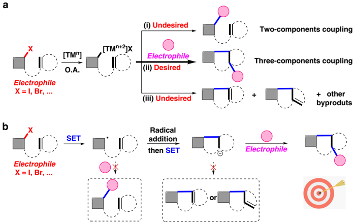
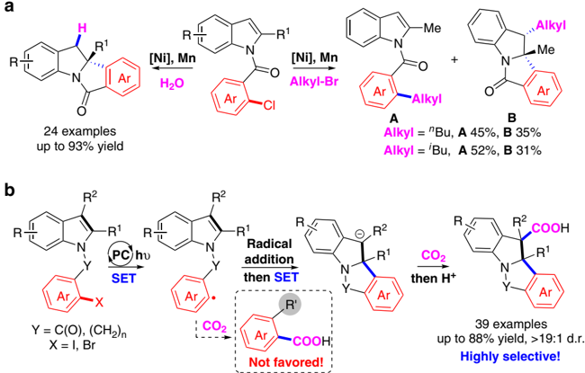
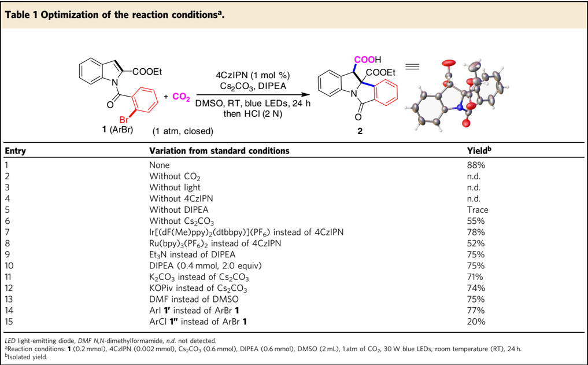
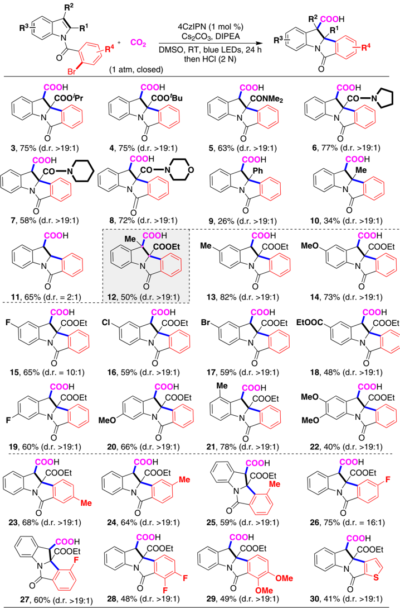
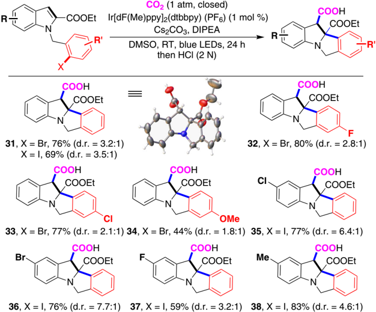
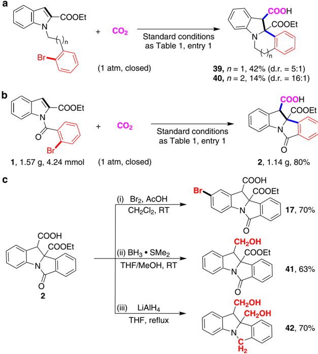
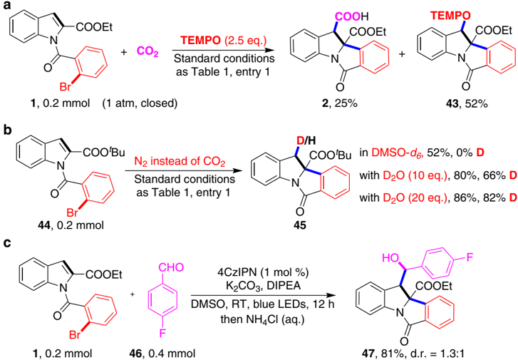
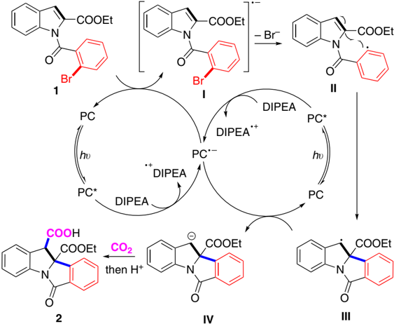

1234567890():,;

## ARTICLE

https://doi.org/10.1038/s41467-020-17085-9

OPEN

## Reductive dearomative arylcarboxylation of indoles with CO2 via visible-light photoredox catalysis

Wen-Jun Zhou 1,2,5 , Zhe-Hao Wang 3,5 , Li-Li Liao 1 , Yuan-Xu Jiang 1 , Ke-Gong Cao 1 , Tao Ju 1 , Yiwen Li 3 , Guang-Mei Cao 1 &amp; Da-Gang Yu 1,4 ✉

Catalytic reductive coupling of two electrophiles and one unsaturated bond represents an economic and efficient way to construct complex skeletons, which is dominated by transitionmetal catalysis via two electron transfer. Herein, we report a strategy of visible-light photoredox-catalyzed successive single electron transfer, realizing dearomative arylcarboxylation of indoles with CO2. This strategy avoids common side reactions in transition-metal catalysis, including ipso-carboxylation of aryl halides and β -hydride elimination. This visible-light photoredox catalysis shows high chemoselectivity, low loading of photocatalyst, mild reaction conditions (room temperature, 1 atm) and good functional group tolerance, providing great potential for the synthesis of valuable but difficultly accessible indoline-3-carboxylic acids. Mechanistic studies indicate that the benzylic radicals and anions might be generated as the key intermediates, thus providing a direction for reductive couplings with other electrophiles, including D2O and aldehyde.

1 Key Laboratory of Green Chemistry &amp; Technology of Ministry of Education, College of Chemistry, Sichuan University, Chengdu 610064, China. 2 College of Chemistry and Chemical Engineering, Neijiang Normal University, Neijiang 641100, China. 3 College of Polymer Science and Engineering, State Key Laboratory of Polymer Materials Engineering, Sichuan University, Chengdu 610065, China. 4 Shanghai Key Laboratory of Green Chemistry and Chemical Processes, East China Normal University, School of Chemistry and Molecular Engineering, Shanghai 200062, China. 5 These authors contributed equally: Wen-Jun Zhou, Zhe-Hao Wang. ✉ email: dgyu@scu.edu.cn

C atalytic reductive coupling of two different electrophiles (or cross-electrophiles coupling) has emerged as a powerful strategy to form C -C bonds 1 . Compared with the conventional cross-coupling, transition-metal (TM)-catalyzed reductive coupling streamlines the preparation and handling of air- and moisture-sensitive organometallic reagents, thus showing signi fi cant advantages, including easily available substrates, operational simplicity, and high-step economy (Fig. 1a, path i) 2,3 . Recently, great achievement has been realized in the threecomponent reductive coupling, that is, difunctionalization of one unsaturated bond with two electrophiles, which could rapidly generate highly functionalized skeletons by forming two new bonds (Fig. 1a, path ii) 4 -9 . Notably, if one electrophile is tethered with the unsaturated bond, a ring could be constructed via intramolecular cyclization 7 -9 . Although the transition-metal catalysis with two-electron transfer process (Fig. 1a) is powerful in tuning the reactivity and selectivity, there are still some challenges in the tandem reductive cyclization/cross-coupling. For example, the ipso-functionalization (Fig. 1a, path i), that is, direct twocomponent coupling, would be favored if the unsaturated bond is not reactive and migratory insertion step is not fast enough. Moreover, the generated organometallic intermediate could undergo other side reactions, including protonation, β -hydride elimination, or isomerization (Fig. 1a, path iii) 10,11 . Therefore, it is highly desirable to develop other strategies, such as successive single-electron transfer (SSET) strategy (Fig. 1b), to prevent side reactions and realize such transformations with high selectivity.

Dearomatization of (hetero)arenes is an ef fi cient and powerful method to provide 3D cyclic skeletons, which exist widely in pharmaceuticals and bioactive natural products 12 -16 . Dearomative functionalization of indoles are particularly interesting to generate important indolines 15,16 . Although many methods have been developed in this fi eld 17 -25 , the dearomative reductive coupling of indoles with two electrophiles is still challenging due to the stability of carbon -carbon double bond within aromaticity and thus slow migratory insertion rate. In 2017, Qin et al. realized an elegant Nicatalyzed asymmetric reductive hydroarylation of carbon -carbon double bond in indoles with water as proton source (Fig. 2a) 21 . When alkyl bromides were used as quenching electrophiles, however, the desired alkylarylation was not ef fi cient and suffered from competitive side reaction, ipso cross-electrophiles coupling. With our continuous interest in green and sustainable synthesis with CO2, which is abundant, recyclable and nontoxic C-1 source, we wondered whether we could realize the dearomative arylcarboxylation of indoles with aryl halides and CO2 as electrophiles via dearomative process 26,27 , generating the valuable and dif fi cultly accessible indoline-3-carboxylic acids 28,29 . However, due to the thermodynamic stability of both CO2 and aromaticity, it is highly challenging to prevent the ipso-carboxylation of aryl halides and realize selective dearomative carboxylation via transition-metal catalysis 30 -34 . Inspired by the merit of visible-light photoredox catalysis 35 -45 , especially the visible-light-driven redox-neutral difunctionalization of alkenes with CO2 46 -49 , we envisioned that the reductive dearomative difunctionalization might be achieved via a radical relay SSET strategy (Fig. 1b). We speculated that the visible-light-induced single-electron reduction of carbon -halide bond could generate a highly active aryl radical, which would prefer to undergo radical addition to the C2 -C3 double bond in indoles instead of CO2 50,51 (for visible-light-induced decarboxylation to access aryl radical, in which aryl radical neither reduced to aryl anion nor trapped by carbon dioxide, see ref. 50 ; as long as radical reaction is concerned, carbon radical is hardly coupling with CO2 unless CO2 is converted to its corresponding radical anion, see ref. 51 ). The resulting benzylic radical might be further reduced via a second SET process to generate carbanion intermediate, which could react with weakly electrophilic CO2 to deliver the desired dearomative arylcarboxylation product (Fig. 2b).

Herein, we report the success of such SSET process via visiblelight photoredox catalysis, realizing the dearomative arylcarboxylation of indoles with CO2 to give indoline-3-carboxylic acids with high selectivities (Fig. 2b). This reaction shows low loading of photocatalyst, generally good yields, mild reaction conditions (room temperature, 1 atm), good functional group tolerance, and broad substrate scope. Mechanistic studies indicate that the benzylic radicals and anions might be generated as the key intermediates. This strategy not only provides a direction for dearomative difunctionalization but also represents a way to realize selective tandem reductive cyclization/cross couplings,

Fig. 1 Strategies for tandem reductive couplings. a Widely investigated transition-metal-catalyzed reductive coupling via two electron transfer process. (i) ipso reductive coupling, (ii) tandem reductive cyclization/coupling, (iii) β -hydride elimination or isomerization as other side reactions. b Rarely investigated radical-type reductive coupling via successive single-electron transfer process. O.A. oxidative addition, SET single-electron transfer. The gray square represents common organic structure. The pink circle represents organic electrophiles.

Fig. 2 Reductive dearomative difunctionalization of indoles. a Tandem Ni-catalyzed asymmetric reductive dearomative functionalization of indoles by using proton or alkyl bromides as another electrophile. b Visible-light-promoted reductive dearomative arylcarboxylation of indoles with CO2 via SSET process, in which carbon centered benzylic radical and benzylic anion as key intermediate. PC photocatalyst.

preventing the undesired two-component couplings and reductive Heck-type reactions via β -hydride elimination 10,11 .

## Results and discussion

Optimization study . With this hypothesis in mind, we investigated the reaction of ethyl 1-(2-bromobenzoyl)-1H-indole-2carboxylate 1 with CO2 under visible-light irradiation conditions (Table 1). When we used 1,2,3,5-tetrakis(carbazol-9-yl)-4,6dicyanobenzene (4CzIPN) as a photocatalyst, Cs2CO3 as a base,

N , N -diisopropylethylamine (DIPEA) as an electron donor, and DMSO as solvent (Table 1, entry 1), the desired carboxylic acid 2 was obtained in 88% isolated yield with high diastereoselectivity (d.r. &gt;19:1). Control experiments revealed that CO2, visible light, photocatalyst, and reductant were all essential for this transformation (Table 1, entries 2 -5). Other photocatalysts, such as Irand Ru-complex, gave lower yields (Table 1, entries 7 and 8). When Et3N was used as a reductant or 2 equiv of DIPEA was used, the yield was dropped to 75% (Table 1, entries 9 and 10),

Fig. 3 Scope of substrates with substituents on indoles. The standard reaction conditions were used, as shown in Table 1, entry 1. Isolated yields are presented.

which might arise from lower ef fi ciency for reductive quenching of the excited photocatalyst. Besides Cs2CO3, other bases, such as K2CO3 and KOPiv, were also ef fi cient for the reaction, while the reaction with Cs2CO3 is the most ef fi cient (Table 1, entries 1, 5, 11, and 12), which might quench the in-situ generated acidic components and stabilize the carboxylates. Moreover, the reaction could also be conducted in DMF to give the desired product in 75% yield (Table 1, entry 13). Compared with aryl bromide 1 , aryl iodide 1 ' and chloride 1 ' were also tested to give lower yields (Table 1, entries 14 and 15). In line with our expectations, not even trace of ipso-carboxylation of Ar -X (X = Cl, Br, I) bond was found in this reaction. The structure of 2 was further con fi rmed by X-ray crystal analysis, which indicated the cis-relationship between the newly generated two C -C bonds (please see Supplementary Information (SI) for more information).

Evaluation of substrate scope . With the optimized reaction conditions in hand, we fi rst tested the substituent effect of the indole ring (Fig. 3). Notably, high diastereoselectivity (d.r. &gt;19:1)

Fig. 4 Scope of substrates bearing unactivated aryl bromides and iodides. Reaction conditions: Indole derivatives (0.2 mmol), Ir-catalyst (0.002 mmol), Cs2CO3 (0.6 mmol), DIPEA (1.3 mmol), DMSO (2 mL), 1 atm of CO2, 30 W blue LEDs, RT, 24 h, isolated yield.

was observed in most cases. We found that several esters ( 2 -4 ) with different alkyl groups showed high reactivity. Moreover, a variety of amides also underwent this reaction well to give corresponding products 5 -8 in moderate to high yields. In contrast, the substrates bearing phenyl ( 9 ) and electron-donating methyl group ( 10 ) at the C2 position, which might hamper the addition of aryl radical to indole, showed low reactivity. When no substitution was located at C2 position, the desired product 11 was obtained in 65% with poor diastereoselectivity of 2:1, which indicates that the substituention located at C2 position is necessary for high diastereoselectivity. Although all-carbon quaternary centers are dif fi cult to synthesize due to the steric hindrance, we further challenged us using the substrate with C2- and C3 disubstitution. Different from previous transition-metal catalysis to give reductive Heck-type products 10,11 , we could obtain the desired product 12 in high chemo- and diastereoselectivity, albeit with moderate conversion, indicating potential of this strategy in organic synthesis. Encouraged by these results, we further investigated other indole derivatives. The substrates with electron-donating groups or electron-withdrawing groups at the C5-position were all suitable for such a reaction to deliver the desired products in moderate to good yields. Many kinds of functional groups, such as methoxyl ( 14 ), fl uoro ( 15 ), chloro ( 16 ), bromo ( 17 ), and ester group ( 18 ), were all tolerated well. The substrates bearing fl uoro ( 19 ) and methoxyl ( 20 ) group at C6position also worked well. To our delight, the reaction was not sensitive to steric hindrance, as the substrate bearing methyl group at C4-position ( 21 ) also worked well. Notably, the substrates bearing C5- and C6-disubstitution, such as dimethoxyl groups ( 22 ), were also tolerated. Besides various substitutions on the indole rings, we further tested the substitution effects to the aryl bromides (R 4 ). Several functional groups were tolerated at para- and meta-position. Different from previous Pd-catalysis 20 , in which the oxidative addition is sensitive to the steric hindrance, the methyl ( 25 ) and fl uoro ( 27 ) groups at ortho-position of C -Br bond did not signi fi cantly affect the reaction, delivering the desired products in satisfactory yields. Moreover, di fl uoro ( 28 )

and dimethoxyl ( 29 ) substituents were also compatible. Notably, heterocycles, such as thiophene ( 30 ), which might inhibit transition-metal catalysis due to the strong coordination, could also survive in this reaction.

In light of these results, we turned our attention to unactivated aryl halides, which are more electron rich and thus more challenging to undergo single-electron reduction by photocatalyst. Under slightly modi fi ed conditions (Fig. 4), a variety of aryl bromides and iodides underwent the reaction to generate desired products 31 -38 in good yields, albeit with moderate diastereoselectivity. The single-crystal analysis of the major isomer of product 31 indicated the trans-relationship between the newly generated C -C bonds (please see Supplementary Information for more information), which is different from 2 . As shown in Fig. 4, both unactivated aryl bromides and iodides could react smoothly with good functional group tolerance. Notably, carbon -halo bonds, especially the C -Br bond ( 36 ), which are reactive in transition-metal catalysis, survived in our reaction conditions.

Furthermore, 1-(2-bromophenethyl)-1H-indole-2-carboxylate and ethyl 1-(3-(2-bromophenyl)propyl)-1H-indole-2-carboxylate were tested in the standard reaction conditions (Fig. 5a) to give the corresponding products bearing 6-membered 39 and 7membered ring 40 in 42% and 14% isolated yields, respectively, demonstrating that this strategy is not restricted to 5-membered ring formation. To further demonstrate the utility of this dearomative arylcarboxylation, we conducted a gram-scale reaction of 1 under standard conditions, which is also smooth to generate 2 in 80% yield (Fig. 5b). Moreover, facile and selective derivatizations, such as bromination and reduction, of carboxylic acid 2 provide easy access to valuable motifs (Fig. 5c).

Proposed mechanism and mechanistic studies . To gain more insight into the reaction mechanism, we further did a variety of control experiments (please see Supplementary Figs. 1 -9 for more information). First, we found that the desired reaction of 1 was

Fig. 5 Synthetic applications. a Synthesis of 6-membered and 7-membered ring-bearing products under the standard conditions. b Gram-scale synthesis of 2 . c Transformations of the product 2 . (i) bromination with Br2 and AcOH. (ii) selective reduction of the C3-ester group by borane. (iii) reduction of amide and ester groups by LiAlH4.

signi fi cantly inhibited by 2,2,6,6-tetramethyl-1-piperdinyloxy (TEMPO). Meanwhile, a TEMPO-radical adduct 43 was isolated, indicating that benzylic radical was involved in the reaction (Fig. 6a). As transient aryl radical can be trapped by TEMPO 52 , the fact that no trapping of the aryl radical with TEMPO indicated that the radical cyclization step might be fast. Second, we did isotope-labeling studies (Fig. 6b). When DMSOd6 was used as solvent in the reaction of 44 , no deuterium incorporation in the hydroarylation product 45 was observed, thus ruling out the possibility of hydrogen-atom transfer with DMSO 53 . We found a 82% deuterium incorporation at C3-position of 45 when 20 equivalent of D2O was added under N2 atmosphere, indicating the formation of benzylic anion intermediate. Furthermore, with slightly modi fi ed the reaction conditions, 4- fl uorobenzaldehyde 46 was applied as electrophile instead of CO2 to deliver the desired product 47 in 81% yield (Fig. 6c), further con fi rming that the benzylic anion might be involved in the reaction.

Moreover, Stern -Volmer fl uorescence quenching experiments were performed (Fig. 7, please see Supplementary Fig. 10 for more information). The luminescence of 4CzIPN at λ max = 536 nm was readily quenched by DIPEA with a slope of 512.5, which was much more signi fi cant than indole 1 (1.9) or the combination of indole 1 and Cs2CO3 (17.4). These results suggested that DIPEA had the priority to undergo SET with excited 4CzIPN.

Based on above-mentioned results and previous work, we proposed the possible mechanism for the reaction of 1 (Fig. 8). The reductive quenching of photo-activated 4CzIPN

(E1/2 [4CzIPN/4CzIPN · -] = -1.21 V vs. SCE in MeCN) 54 by DIPEA (E1/2 Ox =+ 0.63 V vs. SCE in DMF) 55 leads to the corresponding radical anion 4CzIPN · -and the radical cation DIPEA · + . The reduced 4CzIPN · -undergoes a single-electron reduction of aryl bromide (ArBr) 1 , producing the [ArBr] · -radical anion I and regenerating the neutral 4CzIPN to complete one catalytic cycle. Then, the generated [ArBr] · -radical anion undergoes fragmentation to release a bromide anion and an aryl radical II 56,57 , which undergoes facile intramolecular radical addition to the C2 -C3 double bond of indole to afford the benzylic radical III . The following SET with 4CzIPN · -delivers the carbon anion intermediate IV 58,59 , which could undergo nucleophilic addition to CO2 60 -63 . Following protonation provides the dearomative arylcarboxylation product 2 . However, at this stage we could not exclude another possibility that I undergoes radical cyclization via C -C bond formation and following re-aromatization via release of bromide anion to give III . Further experimental and computational investigations are necessary to explore more details for this process.

In conclusion, we report a strategy of successive single-electron transfer (SSET) process for the tandem reductive cyclization/cross couplings, realizing the fi rst dearomative arylcarboxylation of indoles with CO2 via visible-light photoredox catalysis 64 (during the revision of this paper, Li reported an elegant and very similar visible-light photoredox-catalyzed reductive arylcarboxylation of styrenes, see ref. 64 ). Notably, this reaction is highly chemoselective, as common side reactions, such as ipso coupling of aryl

Fig. 6 Preliminary mechanistic studies. a Trapping experiment by radical scavenger 2,2,6,6-tetramethyl-piperidinyloxyl (TEMPO), supporting that radical process might be involved. b Isotopic labeling experiments in DMSOd 6 or in the presence of different amounts of deuterated water, suggesting that benzylic anion was involved. c 4-fluorobenzaldehyde was used as an electrophile instead of CO2, further indirectly confirming the formation of benzylic anion intermediate.

Fig. 7 Optical experiment with fluorescence spectrum. a Steady-state Stern -Volmer experiment of 4CzIPN and DIPEA, the luminescence of 4CzIPN was readily quenched by DIPEA. b Stern -Volmer fluorescence quenching experiments using 4CzIPN with DIPEA, 1 as well as 1 and Cs2CO3.

halides and β -hydride elimination, are avoided. This reaction shows high selectivity, low loading of photocatalyst, generally good yields, mild reaction conditions (room temperature, 1 atm), good functional group tolerance and broad substrate scope, providing great potential for the synthesis of valuable but dif fi cultly accessible indoline-3-carboxylic acids. Mechanistic studies indicate that the benzylic radicals and anions might be generated as the key intermediates. Further application of this strategy in other reductive couplings with diverse electrophiles is underway in our laboratory.

## Methods

General procedure for the synthesis of 2 -30 . An oven-dried Schlenk tube (10 mL) containing a stirring bar was charged with the indole derivative (0.2 mmol) and 4CzIPN (1 mol %). Subsequently, the Schlenk tube was introduced in a glovebox and was charged with Cs2CO3 (0.6 mmol). The tube was sealed and evacuated and back- fi lled with carbon dioxide three times. Then DMSO (2 mL) and DIPEA (0.6 mmol) were added under CO2 fl ow. Once added, the resulting mixture in sealed tube was placed at a distance of 2 -4 cm from a 30-W blue LED and stirred at room temperature (25 °C) for 24 h. Then, the mixture was quenched with 1 mL of H2O and 2 mL of HCl (2 N), extracted with EtOAc, the combined organic phases were concentrated in vacuo. The residue was puri fi ed by silica gel fl ash chromatography (0.1% AcOH in petroleum ether/EtOAc) to give the corresponding desired product.

General procedure for the synthesis of Compound 31 -38 . An oven-dried Schlenk tube (10 mL) containing a stirring bar was charged with the substrate (0.2 mmol) and Ir[dF(Me)ppy]2(dtbbpy)(PF6) (1 mol %) subsequently. Then, the Schlenk tube was then introduced in a glovebox, where it was charged with Cs2CO3 (0.6 mmol). The tube was taken out of the glovebox and connected to a vacuum line where it was evacuated and back- fi lled with CO2 three times. Then DMSO (2 mL) and DIPEA (1.3 mmol) were added under CO2 fl ow. Finally, The reaction mixture in sealed tube was placed at a distance of 2 -4 cm from a 30-W blue LED

Fig. 8 Mechanistic proposal for the arylcarboxylation of 1. PC = 4CzIPN.

and stirred at room temperature (25 °C) for 24 h. Then, the mixture was quenched with 1 mL of H2O and 2 mL of HCl (2 N), extracted with EtOAc, then concentrated in vacuo. The residue was puri fi ed by silica gel fl ash chromatography (0.1% AcOH in petroleum ether/EtOAc) to give the corresponding desired product.

## Data availability

The authors declare that the data supporting the fi ndings of this study are available within the article and its Supplementary Information fi les. Extra data are available from the author upon request. The crystallography data have been deposited at the Cambridge Crystallographic Data Center (CCDC) under accession number CCDC: 1950734 (compound 2 ) and CCDC: 1972327 (compound 31 ) can be obtained free of charge from www.ccdc.cam.ac.uk/getstructures.

Received: 22 March 2020; Accepted: 8 June 2020;

## References

1. Krische, M. J. Metal Catalyzed Reductive C -C Bond Formation (Springer, 2007).
2. Weix, D. J. Methods and mechanisms for cross-electrophile coupling of Csp 2 halides with alkyl electrophiles. Acc. Chem. Res. 48 , 1767 -1775 (2015).
3. Gu, J., Wang, X., Xue, W. &amp; Gong, H. Nickel-catalyzed reductive coupling of alkyl halides with other electrophiles: concept and mechanistic considerations. Org. Chem. Front. 2 , 1411 -1421 (2015).
4. Sun, S. Z., Duan, Y., Mega, R. S., Somerville, R. J. &amp; Martin, R. Site-selective 1,2-dicarbofunctionalization of vinyl boronates through dual catalysis. Angew. Chem. Int. Ed. 59 , 4370 -4374 (2020).
5. Zhao, X. et al. Intermolecular selective carboacylation of alkenes via nickelcatalyzed reductive radical relay. Nat. Commun. 9 , 3488 (2018).
6. Anthony, D., Lin, Q., Baudet, J. &amp; Diao, T. Nickel-catalyzed asymmetric reductive diarylation of vinylarenes. Angew. Chem. Int. Ed. 58 , 3198 -3202 (2019).
7. Wang, K., Ding, Z., Zhou, Z. &amp; Kong, W. Ni-catalyzed enantioselective reductive diarylation of activated alkenes by domino cyclization/crosscoupling. J. Am. Chem. Soc. 140 , 12364 -12368 (2018).
8. Jin, Y. &amp; Wang, C. Nickel-catalyzed asymmetric reductive arylalkylation of unactivated alkenes. Angew. Chem. Int. Ed. 58 , 6722 -6726 (2019).
9. Tian, Z. X. et al. Highly enantioselective cross-electrophile aryl-alkenylation of unactivated alkenes. J. Am. Chem. Soc. 141 , 7637 -7643 (2019).
10. Zhao, L. et al. Ef fi cient construction of fused indolines with a 2-quaternary center via an intramolecular heck reaction with a low catalyst loading. Org. Lett. 14 , 2066 -2069 (2012).
11. Li, X. et al. Palladium-catalyzed enantioselective intramolecular dearomative heck reaction. J. Am. Chem. Soc. 140 , 13945 -13951 (2018).
12. Okumura, M. &amp; Sarlah, D. Visible -light -induced dearomatizations. Eur. J. Org. Chem . 2020 , 1259 -1273 (2020).
13. Zhuo, C.-X., Zheng, C. &amp; You, S.-L. Transition-metal-catalyzed asymmetric allylic dearomatization reactions. Acc. Chem. Res. 47 , 2558 -2573 (2014).
14. Xia, Z. L., Xu, Q. F., Zheng, C. &amp; You, S.-L. Chiral phosphoric acid-catalyzed asymmetric dearomatization reactions. Chem. Soc. Rev. 49 , 286 -300 (2020).
15. Huang, L. et al. Highly diastereo- and enantioselective synthesis of quinuclidine derivatives by an iridium-catalyzed intramolecular allylic dearomatization reaction. CCS Chem. 1 , 106 -116 (2019).
16. Cerveri, A. &amp; Bandini, M. Recent advances in the catalytic functionalization of ' electrophilic ' indoles. Chin. J. Chem. 38 , 287 -294 (2020).
17. Chen, S. et al. Palladium-catalyzed intramolecular dearomatization of indoles via decarboxylative alkynyl termination. Org. Lett. 18 , 4016 -4019 (2016).
18. Liu, R. R. et al. Enantioselective dearomative difunctionalization of indoles by palladium-catalyzed Heck/Sonogashira sequence. Angew. Chem. Int. Ed. 56 , 7475 -7478 (2017).
19. Marchese, A. D., Lind, F., Mahon, Á. E., Yoon, H. &amp; Lautens, M. Forming benzylic iodides via a nickel catalyzed diastereoselective dearomative carboiodination reaction of indoles. Angew. Chem. Int. Ed. 58 , 5095 -5099 (2019).
20. Shen, C. et al. Enantioselective arylative dearomatization of indoles via Pdcatalyzed intramolecular reductive Heck reactions. J. Am. Chem. Soc. 137 , 4936 -4939 (2015).
21. Qin, X., Lee, M. W. Y. &amp; Zhou, J. S. Nickel-catalyzed asymmetric reductive Heck cyclization of aryl halides to afford indolines. Angew. Chem. Int. Ed. 56 , 12723 -12726 (2017).
22. Liang, R. X., Yang, R. Z., Liu, R. R. &amp; Jia, Y. X. Palladium-catalyzed asymmetric dearomative alkenylation of indoles through a reductive-Heck reaction. Org. Chem. Front 5 , 1840 -1843 (2018).
23. Petrone, D. A., Yen, A., Zeidan, N. &amp; Lautens, M. Dearomative indole bisfunctionalization via a diastereoselective palladium-catalyzed arylcyanation. Org. Lett. 17 , 4838 -4841 (2015).
24. Petrone, D. A., Kondo, M., Zeidan, N. &amp; Lautens, M. Pd(0)-catalyzed dearomative diarylation of indoles. Chem. Eur. J. 22 , 5684 -5691 (2016).
25. Zeidan, N., Beisel, T., Ross, R. &amp; Lautens, M. Palladium-catalyzed arylation/ heteroarylation of indoles: access to 2,3-functionalized indolines. Org. Lett. 20 , 7332 -7335 (2018).
26. Ye, J.-H. et al. Radical tri fl uoromethylative dearomatization of indoles and furans with CO2. ACS Catal. 7 , 8324 -8330 (2017).
27. Zhang, Z. et al. Transition-metal-free lactamization of C(sp 3 ) -H bonds with CO2: facile generation of pyrido[1,2-a] pyrimidin-4-ones. Green. Chem. 22 , 28 -32 (2020).
28. Kim, D. H. et al. (Mercaptopropanoyl)indoline-2-carboxylic acids and related compounds as potent angiotensin converting enzyme inhibitors and antihypertensive agents. J. Med. Chem. 26 , 394 -403 (1983).
29. Reid, M. et al. The discovery and SAR of indoline-3-carboxamides -a new series of 5-HT6 antagonists. Bioorg. Med. Chem. Lett. 20 , 3713 -3716 (2010).
30. Correa, A. &amp; Martin, R. Palladium-catalyzed direct carboxylation of aryl bromides with carbon dioxide. J. Am. Chem. Soc. 131 , 15974 -15975 (2009).

31. Fujihara, T., Nogi, K., Xu, T., Terao, J. &amp; Tsuji, Y. Nickel-catalyzed carboxylation of aryl and vinyl chlorides employing carbon dioxide. J. Am. Chem. Soc. 134 , 9106 -9109 (2012).
32. Meng, Q. Y., Wang, S. &amp; König, B. Carboxylation of aromatic and aliphatic bromides and tri fl ates with CO2 by dual visible-light -nickel catalysis. Angew. Chem. Int. Ed. 56 , 13426 -13430 (2017).
33. Higuchi, Y., Mita, T. &amp; Sato, Y. Palladium-catalyzed intramolecular arylative carboxylation of allenes with CO2 for the construction of 3-substituted indole2-carboxylic acids. Org. Lett. 19 , 2710 -2713 (2017).
34. Shimomaki, K., Murata, K., Martin, R. &amp; Iwasawa, N. Visible-light-driven carboxylation of aryl halides by the combined use of palladium and photoredox catalysts. J. Am. Chem. Soc. 139 , 9467 -9470 (2017).
35. Chen, Y., Lu, L.-Q., Yu, D.-G., Zhu, C.-J. &amp; Xiao, W.-J. Visible light-driven organic photochemical synthesis in China. Sci. China Chem. 62 , 24 -57 (2019).
36. Prier, C. K., Rankic, D. A. &amp; MacMillan, D. W. C. Visible light photoredox catalysis with transition metal complexes: applications in organic synthesis. Chem. Rev. 113 , 5322 -5363 (2013).
37. Hopkinson, M. N., Tlahuext-Aca, A. &amp; Glorius, F. Merging visible light photoredox and gold catalysis. Acc. Chem. Res. 49 , 2261 -2272 (2016).
38. Liu, Q. &amp; Wu, L. Z. Recent advances in visible-light-driven organic reactions. Natl Sci. Rev. 4 , 359 -380 (2017).
39. Marzo, L., Pagire, S. K., Reiser, O. &amp; König, B. Visible-light photocatalysis: does it make a difference in organic synthesis? Angew. Chem. Int. Ed. 57 , 10034 -10072 (2018).
40. Buzzetti, L., Crisenza, G. E. M. &amp; Melchiorre, P. Mechanistic studies in photocatalysis. Angew. Chem. Int. Ed. 58 , 3730 -3747 (2019).
41. Jiang, H. &amp; Studer, A. Chemistry with N-centered radicals generated by singleelectron transfer-oxidation using photoredox catalysis. CCS Chem. 1 , 38 -49 (2019).
42. Gui, Y.-Y., Zhou, W.-J., Ye, J.-H. &amp; Yu, D.-G. Photochemical carboxylation of activated C(sp 3 ) -Hbonds with CO2. ChemSusChem 10 , 1337 -1340 (2017).
43. Tan, F. &amp; Yin, G. Homogeneous light-driven catalytic direct carboxylation with CO2. Chin. J. Chem. 36 , 545 -554 (2018).
44. Cao, Y., He, X., Wang, N., Li, H. R. &amp; He, L. N. Photochemical and electrochemical carbon dioxide utilization with organic compounds. Chin. J. Chem. 36 , 644 -659 (2018).
45. Yeung, C. S. Photoredox catalysis as a strategy for CO2 incorporation: direct access to carboxylic acids from a renewable feedstock. Angew. Chem. Int. Ed. 58 , 5492 -5502 (2019).
46. Yatham, V. R., Shen, Y. &amp; Martin, R. Catalytic intermolecular dicarbofunctionalization of styrenes with CO2 and radical precursors. Angew. Chem. Int. Ed. 56 , 10915 -10919 (2017).
47. Ye, J.-H. et al. Visible -light -driven iron -promoted thiocarboxylation of styrenes and acrylates with CO2. Angew. Chem. Int. Ed. 56 , 15416 -15420 (2017).
48. Hou, J. et al. Visible-light-mediated metal-free difunctionalization of alkenes with CO2 and silanes or C(sp 3 ) -H alkanes. Angew. Chem. Int. Ed. 57 , 17220 -17224 (2018).
49. Fu, Q. et al. Transition metal-free phosphonocarboxylation of alkenes with carbon dioxide via visible-light photoredox catalysis. Nat. Commun. 10 , 3592 (2019).
50. Candish, L., Freitag, M., Gensch, T. &amp; Glorius, F. Mild, visible light-mediated decarboxylation of aryl carboxylic acids to access aryl radicals. Chem. Sci. 8 , 3618 -3622 (2017).
51. Seo, H., Katcher, M. &amp; Jamison, T. Photoredox activation of carbon dioxide for amino acid synthesis in continuous fl ow. Nat. Chem. 9 , 453 -456 (2017).
52. Iwata, Y., Tanaka, Y., Kubosaki, S., Morita, T. &amp; Yoshimi, Y. A strategy for generating aryl radicals from arylborates through organic photoredox catalysis: photo-Meerwein type arylation of electronde fi cient alkenes. Chem. Commun. 54 , 1257 -1260 (2018).
53. Yang, W.-W., Li, Z.-J., &amp; Cao, X. Reaction of C60 2with organic halides revisited in DMF: proton transfer from water to RC60 -and unexpected formation of 1,2-dihydro[60]fullerenes. J. Org. Chem . 75 , 4086 -4094 (2010).
54. Luo, J. &amp; Zhang, J. Donor-acceptor fl uorophores for visible-light-promoted organic synthesis: photoredox/Ni dual catalytic C(sp 3 )-C(sp 2 ) cross-coupling. ACS Catal. 6 , 873 -877 (2016).
55. Sayes, M., Benoit, G. &amp; Charette, A. B. Borocyclopropanation of styrenes mediated by UV-light under continuous fl ow conditions. Angew. Chem. Int. Ed. 57 , 13514 -13518 (2018).
56. Ghosh, I., Ghosh, T., Bardagi, J. I. &amp; König, B. Reduction of aryl halides by consecutive visible light-induced electron transfer processes. Science 346 , 725 -728 (2014).
57. Jiang, M., Yang, H. &amp; Fu, H. Visible-light photoredox borylation of aryl halides and subsequent aerobic oxidative hydroxylation. Org. Lett. 18 , 5248 -5251 (2016).
58. Donabauer, K. et al. Photocatalytic carbanion generation-benzylation of aliphatic aldehydes to secondary alcohols. Chem. Sci. 10 , 5162 -5166 (2019).
59. Pitzer, L., Schwarz, J. L. &amp; Glorius, F. Reductive radical-polar crossover: traditional electrophiles in modern radical reactions. Chem. Sci. 10 , 8285 -8291 (2019).
60. Ju, T. et al. Selective and catalytic hydrocarboxylation of enamides and imines with CO2 to generate α , α -disubstituted α -amino acids. Angew. Chem. Int. Ed. 57 , 13897 -13901 (2018).
61. Liao, L.-L. et al. Visible-light-driven external-reductant-free cross-electrophile couplings of tetraalkyl ammonium salts. J. Am. Chem. Soc. 140 , 17338 -17342 (2018).
62. Fan, X., Gong, X., Ma, M., Wang, R. &amp; Walsh, P. J. Visible light-promoted CO2 fi xation with imines to synthesize diaryl α -amino acids. Nat. Commun. 9 , 4936 (2018).
63. Meng, Q. Y., Schirmer, T. E., Berger, A. L., Donabauer, K. &amp; König, B. Photocarboxylation of benzylic C-H bonds. J. Am. Chem. Soc. 141 , 11393 -11397 (2019).
64. Wang, H., Gao, Y., Zhou, C. &amp; Li, G. Visible-light-driven reductive carboarylation of styrenes with CO2 and aryl halides. J. Am. Chem. Soc. 142 , 8122 -8129 (2020).

## Acknowledgements

Financial support provided by the National Natural Science Foundation of China (21822108, 21801176, and 21772129), the Fok Ying Tung Education Foundation (161013), Sichuan Science and Technology Program (20CXTD0112), the Open Research Fund of Shanghai Key Laboratory of Green Chemistry and Chemical Processes, East China Normal University, and the Fundamental Research Funds for the Central Universities.

## Author contributions

D.G.Y. and W.J.Z. conceived and designed the study, and wrote the paper. W.J.Z., Z.H.W., L.L.L., Y.X.J., K.G.C., T.J., Y.L., and G.M.C. performed the experiments and mechanistic studies. Z.H.W. performed the crystallographic studies. All authors contributed to the analysis and interpretation of the data.

## Competing interests

The authors declare no competing interests.

## Additional information

Supplementary information is available for this paper at https://doi.org/10.1038/s41467020-17085-9.

Correspondence and requests for materials should be addressed to D.-G.Y.

Peer review information Nature Communications thanks the anonymous reviewer(s) for their contribution to the peer review of this work.

Reprints and permission information is available at http://www.nature.com/reprints

Publisher ' s note Springer Nature remains neutral with regard to jurisdictional claims in published maps and institutional af fi liations.

Open Access This article is licensed under a Creative Commons Attribution 4.0 International License, which permits use, sharing, adaptation, distribution and reproduction in any medium or format, as long as you give appropriate credit to the original author(s) and the source, provide a link to the Creative Commons license, and indicate if changes were made. The images or other third party material in this article are included in the article ' s Creative Commons license, unless indicated otherwise in a credit line to the material. If material is not included in the article ' s Creative Commons license and your intended use is not permitted by statutory regulation or exceeds the permitted use, you will need to obtain permission directly from the copyright holder. To view a copy of this license, visit http://creativecommons.org/ licenses/by/4.0/.

© The Author(s) 2020