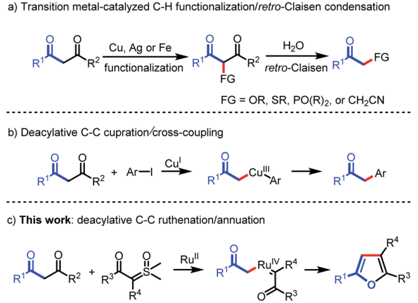
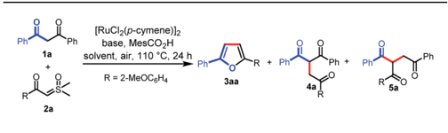
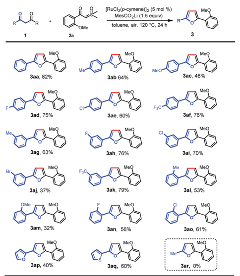
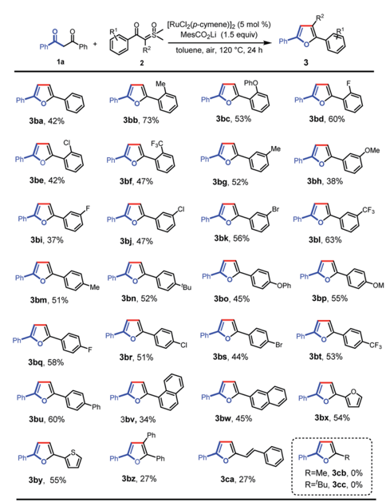
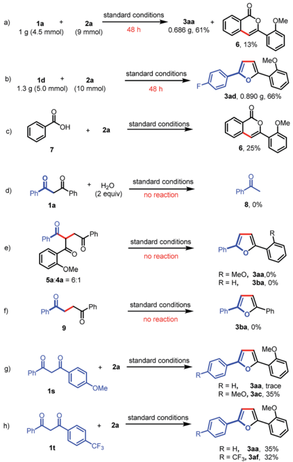
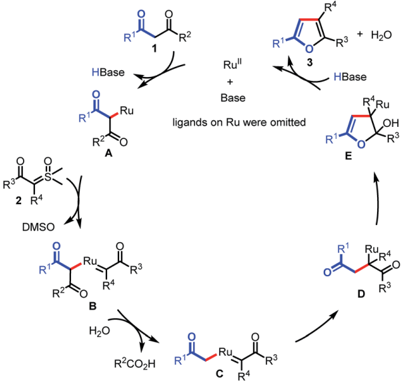

Open Access A

a) Transition metal-catalyzed C-H functionalization/retro-Claisen condensation

*

H20

retro-Claisen R

- GI

FG = OR, SR, PO(R)½, or CH¿CN

## EDGE ARTICLE

c) This work: deacylative C-C ruthenation/annuation

RuV R4

Cite this: Chem. Sci. , 2019, 10 , 9104

All publication charges for this article have been paid for by the Royal Society of Chemistry

Received 2nd July 2019 Accepted 9th August 2019

DOI: 10.1039/c9sc03245b

rsc.li/chemical-science

## Introduction

Carbon -carbon bonds are the most extensive and basic chemical bonds in organic molecules. The selective cleavage of C -C bonds in a constructive manner enables the reconstitution of the molecular skeleton and introduction of new functional groups, thus attracting great attention. 1 In the past decade, chemoselective C -C(CO) bond cleavage has been extensively studied by employing the strategies of chelation assistance, 2 ring-strain release, 3 and aromatization. 4 However, the selective cleavage of unstrained C -C(CO) moieties without an auxiliary directing group still remains an unmet challenge. 5,6 Recently, transition metal-catalyzed C -C(CO) bond functionalization of 1,3-diones has been achieved by Jiao, 6 a Bolm, 6 b Peng, 6 c and Wu. 6 d These methods are understood to proceed through oxidative a -functionalization of 1,3-diones, followed by retro -Claisen condensation to provide a -substituted ketones (Scheme 1a). However, Lei's work demonstrated an alternative reaction pathway for the C -C(CO) bond cleavage of 1,3-diones, in which deacylative a -cupration could occur to form alkyl Cu(III) complexes that subsequently underwent cross-coupling to give a -aryl ketones (Scheme 1b). 7 Inspired by Lei's work, we questioned whether this open shell deacylative a -cupration mechanism might be translated to other transition metals, such as ruthenium, thereby allowing catalytic formation of alkyl Ru intermediates that can be captured by suitable coupling partners. In continuation of our research on C -C(CO) bond cleavage reactions, 8 herein we disclose the  rst ruthenium-catalyzed deacylative annulation of 1,3-diones with sulfoxonium ylides

College of Materials Science &amp; Engineering, Huaqiao University, Xiamen 361021, China. E-mail: glcheng@hqu.edu.cn

† Electronic supplementary information (ESI) available. CCDC 1918495. For ESI and crystallographic data in CIF or other electronic format see DOI: 10.1039/c9sc03245b

|

View Article Online View Journal | View Isue

## Ruthenium(II)-catalyzed chemoselective deacylative annulation of 1,3-diones with sulfoxonium ylides via C -C bond activation †

Si Wen, Weiwei Lv, Dan Ba, Jing Liu and Guolin Cheng *

The fi rst successful example of deacylative annulation of 1,3-diones with sulfoxonium ylides was achieved through Ru(II)-catalyzed C -C bond activation. The excellent chemoselectivity and broad substrate scope render this method a practical and versatile approach for the preparation of (hetero)aryl and alkenyl substituted furans, which are valuable units in many biologically active compounds and functional materials. A preliminary mechanistic study reveals that this process involves a deacylative a -ruthenation to generate key alkyl Ru(II) intermediates with the release of a benzoic acid fragment.

(Scheme 1c). This method provides a practical and mild synthetic route to substituted furans, 9 which are essential structural moieties in many biologically active compounds, natural products, and functional materials. 10

On the other hand, sulfoxonium ylides are readily available and bench-stable carbene precursors, which have been extensively explored for the transition metal-catalyzed functionalization of C -H bonds. 11 However, sulfoxonium ylide carbeneinvolved C -C bond functionalization has not yet been realized due to it being challenging to control the chemoselectivity from the same starting materials. 12

## Results and discussion

We initiated our investigation on the model reaction of 1,3diphenylpropane-1,3-dione ( 1a ) with sulfoxonium ylide ( 2a ) to optimize various reaction parameters. The results are summarized in Table 1. With [RuCl2( p -cymene)]2 as the catalyst,

Scheme 1 Transition metal-catalyzed C -C bond activation of 1,3diones.

Open Access A

Phi

1a

Phil

[RuCI2 (p-cymene)]2

[RuCl2 (p-cymene)]2 (5 mol %)

MesCO¿Li (1.5 equiv)

toluene, air, 120 °C, 24 h

2a

R = 2-MeOC6H4

Table 1 Selected optimization studies a

Заа, 82%

3ad, 75%

MeO

MeO

Зад, 63%

|              |         |            | Yield b (%)   | Yield b (%)         |
|--------------|---------|------------|---------------|---------------------|
| Entry        | Solvent | Base       | 3aa           | 4a + 5a ( 4a : 5a ) |
| 1            | HFIP    | Na 3 PO 4  | 23            | 45 (1 : 6)          |
| 2            | i PrOH  | Na 3 PO 4  | 26            | 8 (1 : 3)           |
| 3            | DMF     | Na 3 PO 4  | 30            | 20 (1 : 3)          |
| 4            | CH 3 CN | Na 3 PO 4  | 25            | 14 (1 : 2)          |
| 5            | DCE     | Na 3 PO 4  | 15            | 24 (1 : 5)          |
| 6            | Toluene | Na 3 PO 4  | 35            | Trace               |
| 7            | Toluene | Na 2 CO 3  | 30            | Trace               |
| 8            | Toluene | K 2 CO 3   | 20            | Trace               |
| 9            | Toluene | Cs 2 CO 3  | 25            | Trace               |
| 10           | Toluene | NaHCO 3    | 24            | 0                   |
| 11           | Toluene | KH 2 PO 4  | 52            | 0                   |
| 12           | Toluene | t BuOLi    | 72            | Trace               |
| 13           | Toluene | -          | 10            | 0                   |
| 14 c         | Toluene | t BuOLi    | Trace         | 0                   |
| 15 c         | Toluene | MesCO 2 Li | 71            | Trace               |
| 16 c , d     | Toluene | MesCO 2 Li | 78            | Trace               |
| 17 c , e     | Toluene | MesCO 2 Li | 40            | Trace               |
| 18 c , d , f | Toluene | MesCO 2 Li | 85(82) g      | Trace               |
| 19 c , d , h | Toluene | MesCO 2 Li | 66            | Trace               |
| 20 c , d , i | Toluene | MesCO 2 Li | 0             | 0                   |

a Reaction conditions: except where otherwise noted, all of the reactions were performed with 1a (0.1 mmol), 2a (0.2 mmol), base (0.15 mmol), MesCO2H (0.15 mmol), and [RuCl2( p -cymene)]2 (5 mol%) in a solvent (1 mL) at 110  C in air for 24 h. b The yields were determined by 1 H NMR analysis of the crude product using CH2Br2 as the internal standard. c Without MesCO2H. d Reaction was carried out at 120  C. e Reaction was carried out at 130  C. f 2 mL of toluene was used. g Isolated yield. h 3 mL of toluene was used. i Without [RuCl2( p -cymene)]2. HFIP ¼ 1,1,1,3,3,3-hexa  uoro-2-propanol. DMF ¼ N , N -dimethylformamide. DCE ¼ 1,2-dichloroethane. MesCO2H ¼ 2,4,6trimethylbenzoic acid.

MesCO2H as the additive, and Na3PO4 as the base, the desired reaction occurred in HFIP to a ff ord the desired furan product ( 3aa ) in 23% yield (entry 1). However, the C -Hcarbene insertion product ( 4a ) 12 a , b and the C -C carbene insertion product ( 5a ) 12 b , c were also obtained as an inseparable mixture in 45% combined yield with 1 : 6 chemoselectivity. Investigations on various solvents indicated that toluene performed better than others, a ff ording 3aa in a yield of 35% with excellent chemoselectivity (Table 1, entries 1 -6). The use of a proper base was crucial for this reaction, and the exploration of di ff erent bases revealed that t BuOLi provided the best yield of 72% (entries 7 -12). Only 10% yield of 3aa was obtained in the absence of a base (entry 13). The MesCO2H additive was proved to be necessary to ensure the generation of 3aa . In the absence of MesCO2H, trace 3aa was observed (entry 14). A comparative yield was observed when MesCO2Li was used instead of t BuOLi and MesCO2H (entry 15). The yield of 3aa could be improved to 78% when the

Заа

reaction was run at an elevated temperature (entry 16). However, a lower yield was obtained when the reaction was carried out at 130  C (entry 17). Excitedly, when the solvent volume was increased to 2 mL, the desired product ( 3aa ) was obtained in 85% yield (entry 18), but when the solvent volume was further increased to 3 mL, the yield of 3aa was reduced to 66% (entry 19). Finally, in the absence of a catalyst, no desired product was observed (entry 20). Then, the optimized reaction conditions were identi  ed as follows: 1a (0.1 mmol), 2a (2 equiv.), [RuCl2( p -cymene)]2 (5 mol%), MesCO2Li (1.5 equiv.) in toluene (2 mL) at 120  C in air for 24 h (entry 18).

With the optimal conditions in hand, we turned our attention to the scope of 1,3-diones for this transformation (Scheme 2). It was found that the 1,3-diones bearing methyl, -methoxy, -halogen, and -CF3 groups could all be smoothly transformed to a ff ord the substituted furan products in moderate to good yields ( 3aa -ao ). The structure of 3ak was unambiguously veri- ed by single-crystal X-ray di ff raction. 13 The reactivity of this transformation was signi  cantly in  uenced by the steric hindrance. 1,3-diones with ortho -substituted phenyl rings ( 3al -ao ) generally gave lower yields of desired products than those with meta -and para -substituents ( 3ab -af ). The electronic properties of the phenyl rings in 1,3-diones were observed to a ff ect the reaction e ffi ciency obviously. The substrates with electron-withdrawing groups ( 3ad -af , 3ah , 3ai , and 3ak ) gave higher yields than those with electron-donating groups ( 3ab , 3ac , and 3ag ). However, a lower yield was observed when 1,3dione with a bromo group was used ( 3aj ). It is noteworthy that

Scheme 2 Scope of 1,3-diones. Reaction conditions: 1 (0.1 mmol), 2a (0.2 mmol), MesCO2Li (0.15 mmol), and [RuCl2( p -cymene)]2 (5 mol%) in toluene (2 mL) at 120  C in air for 24 h.

Open Access A

a)

c)

1a

1d

6, 13%

Заа

(RuCl2 (p-cymene)]2 (5 mol %)

0.686 g, 61%

MesCO,Li (1.5 equiv)

toluene, air, 120 °C, 24 h furan and thiophene rings were also tolerated, giving the desired products in moderate yields ( 3ap and 3aq ), which could be expected to  nd wide applications in organic electronics. 10 b ,14 Finally, this reaction was not applicable to pentane-2,4-dione ( 3ar ). standard conditions 2a

3be, 42%

Ph

Pr

Next, we further investigated the reaction of 1,3diphenylpropane-1,3-dione with a variety of aroyl sulfoxonium ylides under the optimal reaction conditions (Scheme 3). Various valuable functional groups were tolerated, such as methyl, phenyl, phenoxyl, methoxyl, halogen, and tri- uoromethyl. The reactivity was not sensitive to the steric hindrance and electronic properties of the phenyl rings on the sulfoxonium ylides. Substrates with ortho -substituted phenyl rings, having electron-donating moieties ( 3ba -bc ) and electronwithdrawing groups ( 3bd -bf ), gave the desired products in moderate to good yields. The substrates with meta - and para -substituted phenyl rings could be smoothly converted into the desired products in moderate yields ( 3bg -bt ). Then, a phenyl group was introduced at the para -position which formed the tetra(aryl ring)-containing product 3bu in 60% yield. In addition, 1-naphthalenyl ( 3bv ), 2-naphthalenyl ( 3bw ), 2-furyl ( 3bx ), and 2-thienyl ( 3by ) substrates were also tolerated, giving the corresponding products in the yields of 34%, 45%, 54%, and 55%, respectively. Importantly, triphenyl substituted furan ( 3bz ) could also be obtained using a -phenyl sulfoxonium ylide Phi

Scheme 3 Scope of sulfoxonium ylides. Reaction conditions: 1a (0.1 mmol), 2 (0.2 mmol), MesCO2Li (0.15 mmol), and [RuCl2( p -cymene)]2 (5 mol%) in toluene (2 mL) at 120  C in air for 24 h.

|

standard conditions

OMe as the substrate, albeit in low yield due to the increased bulkiness. Alkenoyl sulfoxonium ylide was also a capable substrate, giving 2-alkenyl substituted furan ( 3ca ) in 27% yield. The aryl/ alkenyl groups in conjugation with carbonyl are indispensable moieties for the successful formation of the corresponding furans, and the sulfoxonium ylides with alkanoyl groups failed to provide the desired products ( 3cb and 3cc ).

A gram-scale experiment of this deacylative annulation was demonstrated employing 1a and 2a as model substrates; the product 3aa was obtained in 61% yield, along with an isocoumarin byproduct ( 6 ) (Scheme 4a). The 5 mmol scale reaction of 1d and 2a could give the product 3ad in 66% yield (Scheme 4b). Ackermann recently reported Ru(II)/Ag(I)-catalyzed C -H activation/annulation of benzoic acids with sulfoxonium ylides for the synthesis of isocoumarins. 11 f Indeed, we notice that isocoumarin ( 6 ) could also be generated under the silver-free conditions in 25% yield from benzoic acid ( 7 ) and 2a (Scheme 4c). These results indicated that benzoic acid might be generated during the C -C bond cleavage process.

To further understand the reaction mechanism, the reaction of 1,3-dione ( 1a ) and H2O was investigated under the standard reaction conditions. No reaction was observed, which indicated that the Ru(II)-catalyzed C -C activation could not occur in the absence of a sulfoxonium ylide (Scheme 4d). Furthermore, a mixture of 5a and 4a (6 : 1) could not a ff ord furan products

Scheme 4 Gram-scale reactions and control experiments.

Open Access A

2

DMSO

R2

HBase

— Ru

H2O

Ru"

+

Scheme 5 Plausible catalytic cycle.

( 3aa or 3ba ) under the standard reaction conditions (Scheme 4e). To rule out the possibility that Paal -Knorr furan synthesis is involved in our transformation, we also prepared 1,4diphenylbutane-1,4-dione ( 9 ); however, no desired product ( 3ba ) was obtained when this 1,4-dione was subjected to the standard reaction conditions (Scheme 4f). Finally, the intramolecular competitive reactions of unsymmetrical 1,3-diones ( 1s or 1t ) with 2a indicated that the chemoselectivity of this reaction was a ff ected by the electron density of aryl-groups, and the C -C bond cleavage tended to occur at the less electron-rich moieties (Scheme 4g and h). The electron-de  cient carbonyls are more likely to be attacked by a nucleophile, such as H2O, which may induce the subsequent C -C bond cleavage.

On the basis of these results, we proposed that the reaction would proceed as shown in Scheme 5. The transformation begins with the generation of Ru complex A under basic conditions, which is subsequently captured by sulfoxonium ylide to form Ru carbene complex B . Then, C -C bond activation occurs in the presence of H2O, giving Ru complex C . Migratory insertion of C a ff ords intermediate D . Finally, intramolecular annulation of D results in intermediate E , followed by b -O elimination to furnish the furan products ( 3 ) and regenerate the Ru(II) catalyst.

## Conclusions

In conclusion, we have demonstrated the  rst example of Ru(II)catalyzed chemoselective deacylative annulation of 1,3-diones with sulfoxonium ylides. A series of substituted furans have been synthesized in reasonable yields by this novel method. This protocol which uses unstrained C -C(CO) bonds as nucleophiles in transition metal-catalyzed cross coupling should be expected to  nd wide applications. More work to better understand the mechanistic information on this strategy is currently underway.

## Confl icts of interest

There are no con  icts to declare.

+ H20

R3

HBase

## Acknowledgements

This work was supported by the NSF of China (21672075), the Program for New Century Excellent Talents in Fujian Province University, and the Instrumental Analysis Center of Huaqiao University.

## Notes and references

- 1 For selected reviews, see: ( a ) B. Rybtchinski and D. Milstein, Angew. Chem., Int. Ed. , 1999, 38 , 870; ( b ) C.-H. Jun, Chem. Soc. Rev. , 2004, 33 , 610; ( c ) M. Murakami and T. Matsuda, Chem. Commun. , 2011, 47 , 1100; ( d ) M. A. Drahl, M. Manpadi and L. J. Williams, Angew. Chem., Int. Ed. , 2013, 52 , 11222; ( e ) F. Chen, T. Wang and N. Jiao, Chem. Rev. , 2014, 114 , 8613; ( f ) T. Wang and N. Jiao, Acc. Chem. Res. , 2014, 47 , 1137; ( g ) P.-h. Chen, B. A. Billett, T. Tsukamoto and G. Dong, ACS Catal. , 2017, 7 , 1340; ( h ) P. Sivaguru, Z. Wang, G. Zanoni and X. Bi, Chem. Soc. Rev. , 2019, 48 , 2615. For selected examples, see: ( i ) M. Gozin, A. Weisman, Y. Bendavid and D. Milstein, Nature , 1993, 364 , 699; ( j ) J. Zhu, J. Wang and G. Dong, Nat. Chem. , 2019, 11 , 45.
- 2 ( a ) A. M. Dreis and C. J. Douglas, J. Am. Chem. Soc. , 2009, 131 , 412; ( b ) J. Wang, W. Chen, S. Zuo, L. Liu, X. Zhang and J. Wang, Angew. Chem., Int. Ed. , 2012, 51 , 12334; ( c ) Z.-Q. Lei, H. Li, Y. Li, X.-S. Zhang, K. Chen, X. Wang, J. Sun and Z.-J. Shi, Angew. Chem., Int. Ed. , 2012, 51 , 2690; ( d ) Y. Xia, G. Lu, P. Liu and G. Dong, Nature , 2016, 539 , 546; ( e ) D.-S. Kim, W.-J. Park and C.-H. Jun, Chem. Rev. , 2017, 117 , 8977; ( f ) Y. Xia, J. Wang and G. Dong, J. Am. Chem. Soc. , 2018, 140 , 5347; ( g ) T.-T. Zhao, W.-H. Xu, Z.-J. Zheng, P.-F. Xu and H. Wei, J. Am. Chem. Soc. , 2018, 140 , 586.
- 3 ( a ) L. Souillart and N. Cramer, Chem. Rev. , 2015, 115 , 9410; ( b ) G. Fumagalli, S. Stanton and J. F. Bower, Chem. Rev. , 2017, 117 , 9404; ( c ) L. Deng, M. Chen and G. Dong, J. Am. Chem. Soc. , 2018, 140 , 9652.
- 4 Y. Xu, X. Qi, P. Zheng, C. C. Berti, P. Liu and G. Dong, Nature , 2019, 567 , 373.
- 5 For examples on transition metal-catalyzed oxidative cleavage of unstrained C -C(CO) bonds, see: ( a ) L. Zhang, X. Bi, X. Guan, X. Li, Q. Liu, B.-D. Barry and P. Liao, Angew. Chem., Int. Ed. , 2013, 52 , 11303; ( b ) X. Huang, X. Li, M. Zou, S. Song, C. Tang, Y. Yuan and N. Jiao, J. Am. Chem. Soc. , 2014, 136 , 14858; ( c ) A. Maji, S. Rana, Akanksha and D. Maiti, Angew. Chem., Int. Ed. , 2014, 53 , 2428; ( d ) C. Tang and N. Jiao, Angew. Chem., Int. Ed. , 2014, 53 , 6528; ( e ) N. Vodnala, R. Gujjarappa, C. K. Hazra, D. Kaldhi, A. K. Kabi, U. Beifuss and C. C. Malakar, Adv. Synth. Catal. , 2019, 361 , 135.
- 6 ( a ) C. Zhang, P. Feng and N. Jiao, J. Am. Chem. Soc. , 2013, 135 , 15257; ( b ) L.-H. Zou, D. L. Priebbenow, L. Wang, J. Mottweiler and C. Bolm, Adv. Synth. Catal. , 2013, 355 , 2558; ( c ) L. Li, W. Huang, L. Chen, J. Dong, X. Ma and Y. Peng, Angew. Chem., Int. Ed. , 2017, 56 , 10539; ( d ) Q. Wu, Y. Li, C. Wang, J. Zhang, M. Huang, J. K. Kim and Y. Wu, Org. Chem. Front. , 2018, 5 , 2496.

- 7 C. He, S. Guo, L. Huang and A. Lei, J. Am. Chem. Soc. , 2010, 132 , 8273.
- 8 ( a ) G. Cheng, X. Zeng, J. Shen, X. Wang and X. Cui, Angew. Chem., Int. Ed. , 2013, 52 , 13265; ( b ) X. Yang, G. Cheng, J. Shen, C. Kuai and X. Cui, Org. Chem. Front. , 2015, 2 , 366; ( c ) G. Cheng, W. Lv, C. Kuai, S. Wen and S. Xiao, Chem. Commun. , 2018, 54 , 1726; ( d ) G. Cheng, W. Lv and L. Xue, Green Chem. , 2018, 20 , 4414; ( e ) B. Ge, W. Lv, J. Yu, S. Xiao and G. Cheng, Org. Chem. Front. , 2018, 5 , 3103.
- 9 For selected examples on furan synthesis, see: ( a ) R. C. D. Brown, Angew. Chem., Int. Ed. , 2005, 44 , 850; ( b ) S. F. Kirsch, Org. Biomol. Chem. , 2006, 4 , 2076; ( c ) A. V. Gulevich, A. S. Dudnik, N. Chernyak and V. Gevorgyan, Chem. Rev. , 2013, 113 , 3084; ( d ) M. Zhang, H.-F. Jiang, H. Neumann, M. Beller and P. H. Dixneuf, Angew. Chem., Int. Ed. , 2009, 48 , 1681; ( e ) S. Kramer and T. Skrydstrup, Angew. Chem., Int. Ed. , 2012, 51 , 4681; ( f ) H. Lee, Y. Yi and C.-H. Jun, Adv. Synth. Catal. , 2015, 357 , 3485; ( g ) L. Feng, H. Yan, C. Yang, D. Chen and W. Xia, J. Org. Chem. , 2016, 81 , 7008; ( h ) T. Naveen, A. Deb and D. Maiti, Angew. Chem., Int. Ed. , 2017, 56 , 1111; ( i ) F. Verma, P. K. Singh, S. R. Bhardiya, M. Singh, A. Rai and V. K. Rai, New J. Chem. , 2017, 41 , 4937; ( j ) A. R. White, R. A. Kozlowski, S.-C. Tsai and C. D. Vanderwal, Angew. Chem., Int. Ed. , 2017, 56 , 10525; ( k ) C. Arroniz, G. Chaubet and E. A. Anderson, ACS Catal. , 2018, 8 , 8290; ( l ) X. Wang, A. Lerchen, C. G. Daniliuc and F. Glorius, Angew. Chem., Int. Ed. , 2018, 57 , 1712; ( m ) S. Agasti, T. Pal, T. K. Achar,

|

- S. Maiti, D. Pal, S. Mandal, K. Daud, G. K. Lahiri and D. Maiti, Angew. Chem., Int. Ed. , 2019, 58 , 11039.
2. 10 ( a ) A. Boto and L. Alvarez, Furan and Its Derivatives, Heterocycles in Natural Product Synthesis , Wiley-VCH Verlag GmbH &amp; Co. KGaA, 2011, pp. 97 -152; ( b ) H. Tsuji and E. Nakamura, Acc. Chem. Res. , 2017, 50 , 396.
3. 11 ( a ) L.-Q. Lu, T.-R. Li, Q. Wang and W.-J. Xiao, Chem. Soc. Rev. , 2017, 46 , 4135; ( b ) M. Barday, C. Janot, N. R. Halcovitch, J. Muir and C. Aissa, Angew. Chem., Int. Ed. , 2017, 56 , 13117; ( c ) J. Vaitla, A. Bayer and K. H. Hopmann, Angew. Chem., Int. Ed. , 2017, 56 , 4277; ( d ) Y. Xu, X. Zhou, G. Zheng and X. Li, Org. Lett. , 2017, 19 , 5256; ( e ) K. S. Halskov, M. R. Witten, G. L. Hoang, B. Q. Mercado and J. A. Ellman, Org. Lett. , 2018, 20 , 2464; ( f ) S. Ji, K. Yan, B. Li and B. Wang, Org. Lett. , 2018, 20 , 5981; ( g ) Y.-F. Liang, L. Yang, T. Rogge and L. Ackermann, Chem. -Eur. J. , 2018, 24 , 16548; ( h ) X. Wu, H. Xiong, S. Sun and J. Cheng, Org. Lett. , 2018, 20 , 1396.
4. 12 ( a ) Y. Xi, Y. Su, Z. Yu, B. Dong, E. J. McClain, Y. Lan and X. Shi, Angew. Chem., Int. Ed. , 2014, 53 , 9817; ( b ) Z. Liu, P. Sivaguru, G. Zanoni, E. A. Anderson and X. Bi, Angew. Chem., Int. Ed. , 2018, 57 , 8927; ( c ) Z. Liu, X. Zhang, M. Virelli, G. Zanoni, E. A. Anderson and X. Bi, iScience , 2018, 8 , 54.
5. 13 CCDC 1918495 ( 3ak ) contains the supplementary crystallographic data for this paper. †
6. 14 O. Gidron, N. Varsano, L. J. W. Shimon, G. Leitus and M. Bendikov, Chem. Commun. , 2013, 49 , 6256.