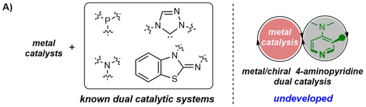
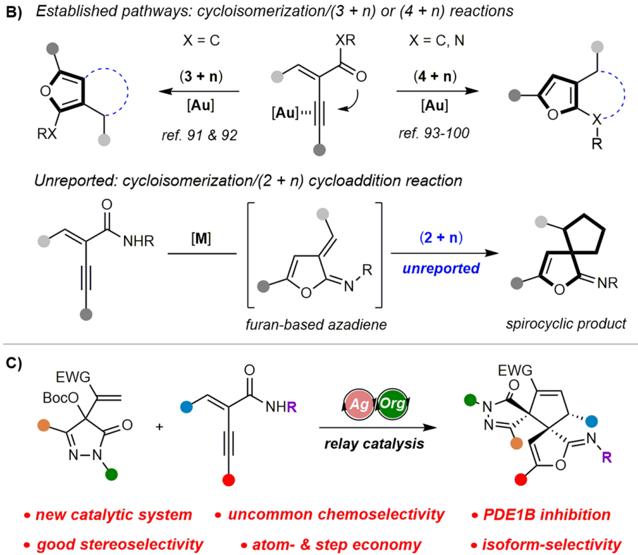
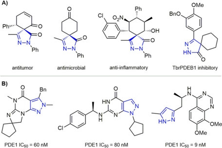
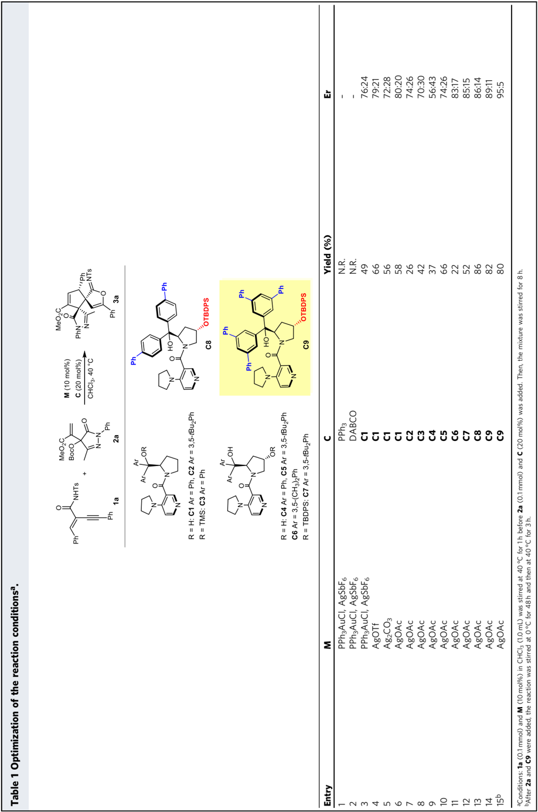
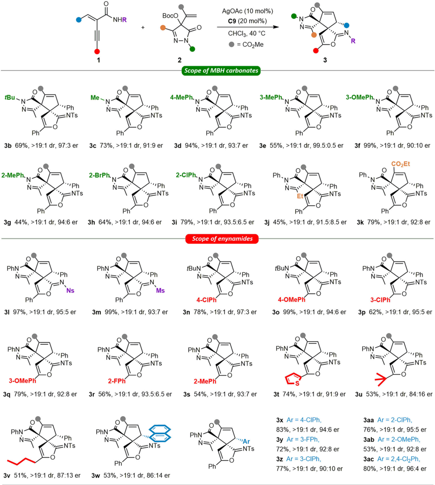
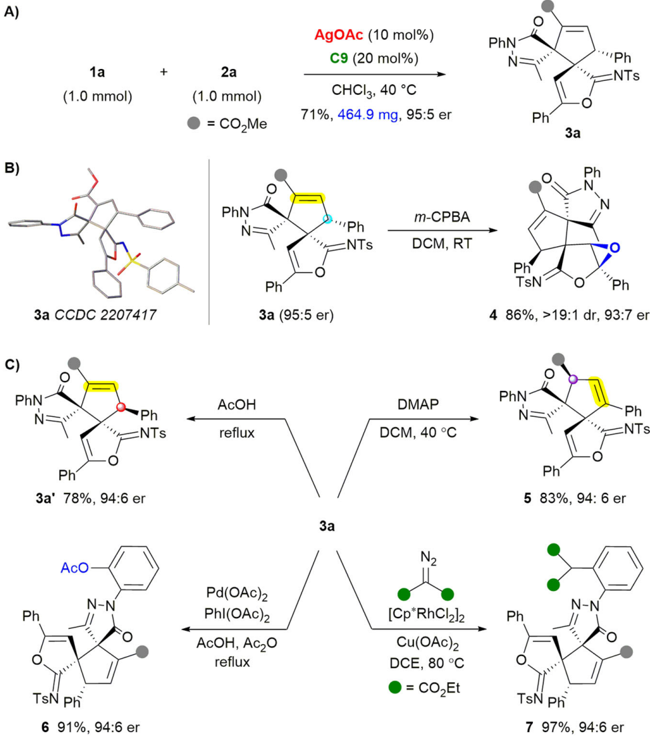
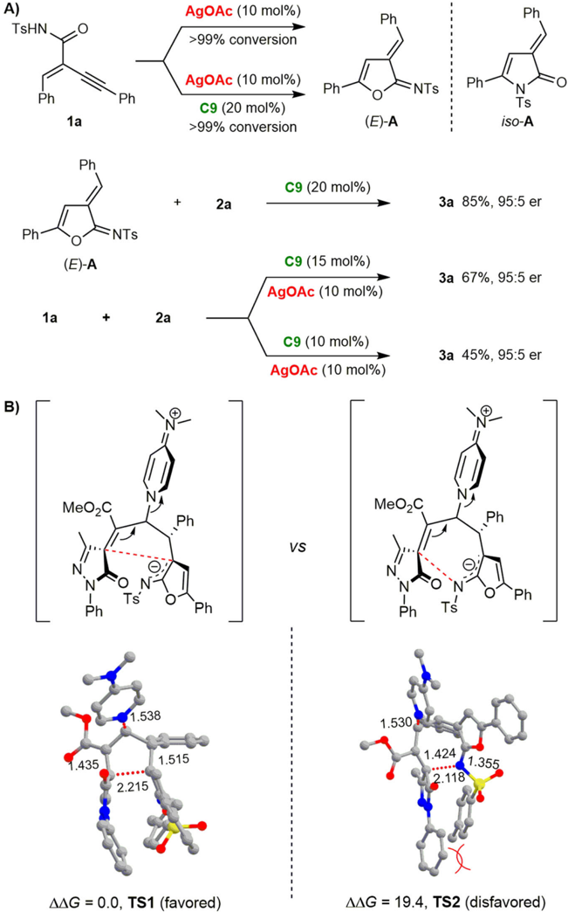
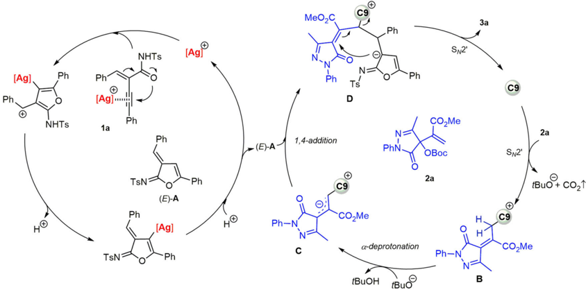

1234567890():,;

ARTICLE

https://doi.org/10.1038/s42004-023-00921-6

OPEN

Silver/chiral pyrrolidinopyridine relay catalytic cycloisomerization/(2 + 3) cycloadditions of enynamides to asymmetrically synthesize bispirocyclopentenes as PDE1B inhibitors

Jing Jiang 1 , Jin Zhou 1 , Yang Li 1 , Cheng Peng 1 , Gu He 2 , Wei Huang 1 , Gu Zhan 1 ✉ &amp; Bo Han 1 ✉

Significant progress has been made in asymmetric synthesis through the use of transition metal catalysts combined with Lewis bases. However, the use of a dual catalytic system involving 4-aminopyridine and transition metal has received little attention. Here we show a metal/Lewis base relay catalytic system featuring silver acetate and a modified chiral pyrrolidinopyridine (PPY). It was successfully applied in the cycloisomerization/(2 + 3) cycloaddition reaction of enynamides. Bispirocyclopentene pyrazolone products could be efficiently synthesized in a stereoselective and economical manner (up to &gt;19:1 dr, 99.5:0.5 er). Transformations of the product could access stereodivergent diastereoisomers and densely functionalized polycyclic derivatives. Mechanistic studies illustrated the relay catalytic model and the origin of the uncommon chemoselectivity. In subsequent bioassays, the products containing a privileged drug-like scaffold exhibited isoform-selective phosphodiesterase 1 (PDE1) inhibitory activity in vitro. The optimal lead compound displayed a good therapeutic effect for ameliorating pulmonary fibrosis via inhibiting PDE1 in vivo.

1 State Key Laboratory of Southwestern Chinese Medicine Resources, School of Pharmacy, Chengdu University of Traditional Chinese Medicine, Chengdu, Sichuan 611137, P.R. China. 2 State Key Laboratory of Biotherapy and Department of Pharmacy, West China Hospital Sichuan University, Chengdu 610041, P.R. China. ✉ email: zhangu@cdutcm.edu.cn; hanbo@cdutcm.edu.cn

A)

RX

-≤- metal

catalysis

D eveloping highly selective, ef fi cient, and economical synthetic strategies is an essential target in modern chemistry. Recently, both the multienzymatic systems and the multicatalysis of small molecules have received extensive attention due to their advantages over conventional methods using a single catalyst 1 -18 . On the one hand, they can unify different bond activation modes by applying different types of catalysts. On the other hand, these processes are able to produce complex products from simple materials without the isolation of intermediates. Therefore, developing new multicatalytic systems is expected to achieve a more ef fi cient and environmentally friendly organic synthesis, which features short time, low cost, and simple operation.

C)

Signi fi cant advances have been made in this area by combining transition metal catalysts with organocatalysts 19 -29 . Chemists have exploited cooperative and relay catalytic systems involving a transition metal with a Lewis base and demonstrated their great potential in asymmetric catalysis. In these processes, tertiary amines 30 -33 , phosphines 34,35 , N -heterocyclic carbenes (NHCs) 36 -39 , and isothioureas 40 -54 were successfully utilized as Lewis base catalysts (Fig. 1A). 4-aminopyridine such as 4-dimethylaminopyridine (DMAP), represents a special class of Lewis base catalysts 55 -59 . They often exhibit excellent catalytic activity and unique selectivity due to their highly nucleophilic planar core structure. Besides, compared with other Lewis base

· new catalytic system

· good stereoselectivity

The cycloisomerization/(3 + n) and (4 + n) cyclization cascade reactions of yne-enones and enynamides have emerged as important methods to construct diverse fused furans (Fig. 1B) 75 -92 . Elegant catalytic systems and different cyclization reactions were successfully developed by the groups of Zhang, Ma, Chi, Zhou, Liu, Deng and others 93 -100 . For instance, the Chi group reported the synthesis of furan-fused lactams via cycloisomerization/(4 + 2) cycloadditions by gold/NHC relay catalysis 93 . Zhao et al. achieved the gold/palladium relay catalytic cycloisomerization/(4 + 5) cycloaddition 94 . In these reports, the process tends to give the aromatic furan products through cascade (3 + n) or (4 + n) cyclization. However, the cycloisomerization/(2 + n) reaction has not been reported. This challenge might result from the steric hindrance of the cycloaddition step and the better thermodynamic stability of the aromatic products.

Fig. 1 Metal/chiral 4-aminopyridine dual catalytic system and its application in cycloisomerization/(2 + 3) cycloaddition cascade reactions of enynamides. A Known and undeveloped metal/organic Lewis base dual catalytic systems. B Cascade cycloisomerization/cyclization of yne-enone and enynamide. C This work: silver/PPY-catalyzed cycloisomerization/(2 + 3) cycloaddition.

catalysts, their aminopyridine skeleton is more modi fi able, which is conducive to modular design and structural modi fi cations 60 -72 . However, in sharp contrast with other Lewis bases, the dual catalytic system of 4-aminopyridine with transition metal has been rarely studied 73,74 , possibly because it can strongly coordinate to the metal center and deactivate the metal complex. Therefore, we envision developing a dual catalytic system combining transition metals with chiral 4-aminopyridines. It could be a powerful tool in asymmetric synthesis if the challenging issues of compatibility and stereocontrol were addressed.

A)

Ph"

-N

Ph antitumor

Bn

PDE1 IC50 = 60 nM

·

Fig. 2 Representative bioactive spiro-pyrazolones and pyrazolecontaining PDE1 inhibitors. A Pharmacologically important spiropyrazolone scaffolds with druggability. B Representative PDE1 inhibitors containing pyrazole pharmacophores.

Spiropyrazolones are scaffolds with great potential for drug discovery due to their diverse biological activities, such as antitumor, antimicrobial, and analgesic (Fig. 2A) 101 -103 . Furthermore, as the privileged structures, pyrazole and pyrazolone derivatives show good binding abilities to various bioactive proteins. For example, their derivatives have a good inhibitory effect on PDE1 (Fig. 2B) 104 -106 . Therefore, it would be interesting to construct a novel spiropyrazolone compound library and study its enzyme binding properties. Our group has a continuing interest in the development of chiral Lewis base catalysts and new strategies for synthesizing medicinally relevant scaffolds 107 -111 . Here, we report a relay catalytic system involving silver acetate and a modi fi ed chiral PPY, which can ef fi ciently catalyze the unreported cycloisomerization/(2 + 3) cycloadditions of enynamides (Fig. 1C). As a result, the bispirocyclopentene pyrazolone products, which exhibited promising PDE1B inhibitory activity, could be ef fi ciently synthesized in a highly stereoselective and economical manner.

## Results and discussion

Optimization of the reaction conditions . Based on our previous study, we fi rst investigated the reaction of enynamide 1a with Edaravone-derived MBH carbonate 2a as the allylic ylide precursor under the dual catalysis of metal and Lewis base catalyst (Table 1, see Tables S1 -S3 of the Supplementary Methods for optimization details) 69,112 -117 . We found that PPh3 and DABCO were ineffective, and no reaction occurred. In sharp contrast, using chiral PPY C1 with PPh3AuCl (5 mol%) and AgSbF6 (10 mol%) at 40 °C in chloroform, bispirocyclopentene pyrazolone product 3a formed from the cycloisomerization/(2 + 3) ylide cycloaddition was obtained in 49% yield with exclusive diastereoselectivity, albeit with moderate enantioselectivity (Table 1, entry 3). In previous reactions, more economical silver salt was usually used as an additive for anion exchange rather than the catalyst for the cycloisomerization of enynamides. Interestingly, in the screening of different metal catalysts, we found AgOTf is a compatible and effective cocatalyst with chiral PPY in the dual catalytic reaction, providing a better yield than the cationic gold catalyst (entry 4). AgOAc, with a lower price, also worked well, affording 3a in 58% yield with 80:20 er (entry 6).

Encouraged by these results, we evaluated a series of chiral PPY catalysts C2 -C7 . Adjusting the substituents on the phenyl groups of Connon ' s catalyst C1 in fl uenced reaction ef fi ciency and enantioselectivity, while only moderate results were obtained. Therefore, we next investigated the bifunctional catalyst C4 -C6 with a C4 -OH group on the prolinol ring 69 . Although C6 could

··OH

Fo

OMe afford better enantioselectivity, low activity was observed in the reaction. By introducing a steric hindrance group to the trans -C4OH and blocking the H-bond donor, 3a could be obtained with 85:15 er ( C7 , entry 12). To further improve the stereoselectivity, we designed and prepared two new PPYs (see page S2 of the Supplementary Methods for detailed procedures). C8 bearing 4-phenyl groups provided 3a in 86% yield with 86:14 er (entry 13). To our grati fi cation, C9 with 3,5-diphenyl phenyl groups exhibited better face shielding, delivering higher enantioselectivity (entry 14). Conducting the reaction at 0 °C, the enantioselectivity could be further improved without affecting the diastereoselectivity and ef fi ciency (&gt;19:1 dr, 95:5 er, entry 15).

Scope of substrates . Having established the chiral PPY/silver dual catalytic system and optimal reaction conditions, we then focused on the substrate scope for the cycloisomerization/(2 + 3) cycloaddition reaction (see pages S5 of the Supplementary Methods for detailed procedures, Supplementary Data 1 for characterization data, Supplementary Data 2 for NMR and HPLC spectra). First, a range of pyrazolone-derived MBH carbonates 2 was investigated (Fig. 3). Different N -alkyl substituents did not affect the reaction yield and stereoselectivity. N -tert -butyl and N -methyl substituted 2 afforded bispirocyclopentene pyrazolone products 3b and 3c in good yield with 97:3 and 91:9 er, respectively. Various 2 with N -aryl groups bearing electron-donating and electron-withdrawing substituents at different positions were well compatible, producing 3d -3i in 44% -99% yields, with up to 99.5:0.5 er. Changing the methyl group on the pyrazolone ring with the ethyl group led to a slightly decreased yield ( 3j ). MBH carbonates 2 bearing an ethyl ester group also worked well, delivering 3k with good results. Remarkably, the reaction showed exclusive diastereoselectivities in all cases.

Next, the scope of the newly developed catalytic system was further explored by using different enynamides in the reactions with 2a . Methanesulfonic and 4-nitrobenzenesulfonic enynamides 1 are suitable substrates. Corresponding products 3l and 3m were obtained in excellent yields with high enantioselectivities. All versions of 1 bearing a para -, meta -and ortho -substituent on the phenyl ring of the alkyne moiety were amenable to the conditions ( 3n -3s ). The high ef fi ciency, excellent diastereoselectivities, and good enantioselectivities are ascribed to the dual catalytic system and its stereocontrol strategy. Enynamides 1 bearing a thiophen-2-yl group was well tolerated ( 3t ). Notably, the alkyl group ( tbutyl and n -butyl) substituted enynamides 1 were also compatible in the reaction, albeit with slightly declined enantioselectivities. Then, we tested substrates 1 with different aryl groups on the alkenyl moiety. Similarly, bispirocyclopentene pyrazolone products 3x -3ac were smoothly obtained with satisfactory results, demonstrating that the electron and steric effect did not affect the reaction much.

Synthetic application . To test the practicability of the relay catalytic cycloisomerization/(2 + 3) ylide cycloaddition strategy, we conducted a scale-up synthesis. The reaction of 1a (1.0 mmol) with 2a afforded 464.9 mg of 3a as a white powder with good yield and uncompromised stereoselectivity (Fig. 4A, see page S6 of the Supplementary Methods for details). The structure and absolute con fi guration of bispirocyclopentene pyrazolone 3 were unambiguously identi fi ed by X-ray crystallography analysis of 3a (CCDC 2207417, see Supplementary Data 3 for details). We then explored the transformation of the product (see page S7 of the Supplementary Methods for detailed procedures, Supplementary Data 2 for characterization data, Supplementary Data 3 for NMR and HPLC spectra), which contains a fused cyclopentene, a furan2(3 H )-imine, and a pyrazolone ring. Interestingly, the oxiranefused polycyclic product 4 could be accessed in 86% yield with

tBu -

N→

Ph

3b 69%, &gt;19:1 dr, 97:3 er

2-MePh-N

Ph

3g 44%, &gt; 19:1 dr, 94:6 er

PhN *

Ph

31 97%, &gt;19:1 dr, 95:5 er

PhN~

N

3-OMePh

3q 79%, &gt; 19:1 dr, 92:8 er

PhN-

3v 51%, &gt; 19:1 dr, 87:13 er

C9 (20 mol%)

CHCI3, 40 °C

Fig. 3 Substrate scope of the MBH carbonates and enynamides a . a Conditions: 1 (0.1 mmol) and AgOAc (10 mol%) in CHCl3 (1.0 mL) was stirred at 40 °C for 1 h. Then, 2 (0.1 mmol) and C9 (20 mol%) were added, and the reaction was stirred at 0 °C for 48 h and at 40 °C for another 3 h.

excellent diastereoselectivity by treating 3a with meta -chloroperoxybenzoic acid (&gt;19:1 dr, Fig. 4B). Remarkably, the switchable divergent synthesis of different isomers was achieved by treating 3a with acid or base, delivering diastereomer 3a ' and isomer 5 in good yield with exclusive diastereoselectivity (Fig. 4C). The spiropyrazolone could serve as a directing group, allowing ef fi cient late-stage modi fi cation of 3a through C -H functionalization. Pd-catalyzed acyloxylation and Rh-catalyzed coupling with diazo esters delivered products 6 and 7 in high yields with exclusive regioselectivity, respectively.

Control experiments . To provide insights into the reaction mechanism, we conducted some control experiments (Fig. 5A, see page S5 of the Supplementary Methods for details). First, we investigated the formation of furan-based azadiene A . Using 10 mol% of silver acetate as a single catalyst or adding both chiral PPY C9 /silver acetate led to very similar results. Azadiene intermediate ( E )-A was ef fi ciently generated as the major product with a trace amount of iso -A , showing that PPY did not in fl uence the cycloisomerization step. Next, control experiments were conducted to disclose the catalyst effect of the subsequent (2 + 3) ylide

А)

B)

1a

(1.0 mmol)

3а CCDC 2207417

c)

PhN -

N=

—NTs

Ph

За' 78%, 94:6 er

AcO

Ph

N-N

TsN Ph

6 91%, 94:6 er

2a

(1.0 mmol)

= CO¿Me

PhN-

N=

AcOH

reflux

Pd(OAc)2

PhI(OAC)2

AcOH, AczO

reflux

AgOAc (10 mol%)

C9 (20 mol%)

Fig. 4 Scale-up synthesis and transformations of product 3a. A Scale-up synthesis of 3a . B Stereoselective epoxidation. C Stereodivrgent isomerization and site-selective C-H functionalization.

cycloaddition. By treating ( E )-A with C9 as the single catalyst, the reaction gave 3a in 85% yield with 95:5 er. The conversion and stereoselectivity are similar to those obtained by dual catalysis, indicating that the reaction may undergo a silver/PPY relay catalytic process. AgOAc and chiral PPY showed good compatibility in the reaction, which is essential to the strategy. Therefore, we further studied the catalytic ef fi ciency when the loading of C9 was reduced to 15 mol% and 10 mol%. Product 3a could be obtained in 67% and 45% yields, respectively, and the stereoselectivity was unaffected. These results showed that even an equimolar amount of AgOAc would not deactivate the Lewis base.

DFT computational calculations and proposed mechanism . Then, density functional theory (DFT) computational calculations were conducted to rationalize the chemoselectivity in this silver/chiral PPY relay catalytic reaction (see Supplementary Data 4 for details). The chemoselectivity is determined in the PPY-catalyzed cycloaddition step, in which (4 + 3) cycloaddition would give the fused-furan product, and the (2 + 3) cycloaddition would deliver the spirocyclic furan-2(3 H )-imine product 3 . The optimized geometries of the key transition state TS1 and TS2 are given in Fig. 5B. The relevant computational details and cartesian coordinates of optimized structures are provided in Supplementary Data 4. Comprising energies of TS1 and TS2 reveal that the (2 + 3) cycloaddition is more favored than the (4 + 3) cycloaddition by 19.4 kcal mol -1 . It may originate from the steric hindrance between the phenyl group of 1a and the N -Ts group in the structure of TS2 . Moreover, natural population analysis (NPA) found that the electron de fi ciency at the internal C2 position is more signi fi cant than that of the terminal N -atom. Accordingly, a relay catalytic mechanism involving Lewis acidcatalyzed cycloisomerization and chiral PPY-catalyzed asymmetric (2 + 3) ylide cycloaddition was proposed (Fig. 6).

PDE1 inhibition of product 3 . Considering the potential inhibitory effect of the known pyrazolone and pyrazole derivatives on PDE, we next evaluated the binding abilities of the synthesized bispirocyclopentene pyrazolones to PDE1. As depicted in Fig. 7A, we investigated the PDE1B inhibitory capacities of 3 at a concentration of 0.1 μ mol·L -1 . To our grati fi cation, 3a exhibited a good inhibitory ratio. Interestingly, the inhibitory activities of 3b and 3c declined with N -alkyl substitution on the pyrazolone fragment. For products containing various N -phenyl groups bearing electron-donating and electron-withdrawing substituents at different positions, the PDE1B inhibition ratios were not signi fi cantly affected ( 3d -3i ). Replacing the methyl group on the pyrazolone ring with the ethyl group led to the loss of inhibitory activity, possibly due to the steric hindrance ( 3j ). The change of the methyl ester on the cyclopentene ring to the ethyl ester displayed a marginal effect on the activity ( 3k ). For products from different enynamides 1 , the methanesulfonamide or 4nitrobenzene-sulfonamide substitution signi fi cantly weakened

PhN

"Ph

:NTS

A)

TsHN

Ph

Ph

1a

B)

1a

Ph

Ph

NTS

(E)-A

MeO¿C

Ph

.435

2a

Ts O Ph

1.538

1.515

2.215

AAG = 0.0, TS1 (favored)

AgOAc (10 mol%)

AgOAc (10 mol%)

C9 (20 mol%)

&gt;99% conversion

2a

Ph

Fig. 5 Control experiments and computational calculations. A Catalyst effect studies. B DFT-optimized structures and relative free energies ( ∆ G , kcal/ mol) of transition states TS1 and TS2 along two possible chemoselective pathways at the M06/Def2-TZVP-SMD(CHCl3)//M06/6-31 G(d,p)SMD(CHCl3) level.

the inhibition ( 3l and 3m ). 3n -3q bearing a para -or meta -substituent on the phenyl ring exhibited a good inhibitory ratio. In contrast, other derivatives 3 from enynamides bearing orthosubstituted phenyl, alkyl and thienyl alkyne moiety have reduced activities ( 3r -3v ). Notably, enynamides 1 bearing different substituted aryl groups on the alkenyl moiety could provide 3 with enhanced inhibitory activities ( 3x -3ac ), especially compound 3x with a 4-Cl-phenyl group.

Then, the IC50 values of three PDE1 subtypes were evaluated by screening the compounds whose inhibition ratio of PDE1B exceeded 60% at 0.1 μ M (Fig. 7B). These compounds generally had an excellent inhibitory effect on PDE1B, and there was no signi fi cant speci fi city among the three PDE1 subtypes. The subtype selectivity of compound 3x across the PDE family was determined and listed in Table S4. It only showed weak inhibitory activities on PDE4 and PDE5 and low inhibitory activities on other PDE subtypes (Fig. 7C). The interaction modes of 3x on PDE1B and PDE3 were studied by molecular docking and molecular dynamics simulations. Figure 7D, E shows the 3D and 2D contour of the binding conformation of 3x and PDE1B after a 100-ns scale molecular dynamics simulation. The RMSD curves of PDE1B or PDE3A with or without compound 3x were depicted

+

[Ag],

Ph.

+

Ph

NHTs

Ph'

1a

TsN=

SN2'

Fig. 6 Proposed mechanism for the silver/chiral PPY relay catalytic cycloisomerization/(2 + 3) cycloaddition cascade reaction of enynamide. The Agcatalyzed cycloisomerization of enynamide 1a generates the azadiene intermediate ( E )-A , while chiral PPY catalyst C9 converts MBH carbonate 2a into the allylic ylide intermediate C . This intermediate then undergoes the (2 + 3) cycloaddition with ( E )-A to produce bispirocyclopentene product 3a .

in Fig. 7F, and the RMSD values of two 3x -protein complexes were relatively stable during the simulation time, which suggested that compound 3x rapidly reached the equilibrium state in the binding pocket of PDEs. The hydrogen bond between the ester group and Ser272, π -π stacking with Phe424, and hydrophobic interactions with Met389, Leu409, and Val417 contributed to the selective binding of 3x to PDE1B (Fig. 7G).

The therapeutic effects and preliminary mechanism of compound 3x . According to the important role of PDEs in in fl ammatory pulmonary damage and fi brosis, the therapeutic effects and preliminary mechanism of compound 3x were evaluated both in vitro and in vivo (Fig. 8). The expression levels of fi brosis markers, such as Fibronectin, Collagen-I, and α -SMA, were stimulated by TGFβ 1 and suppressed after 3x incubation (Fig. 8A). Similar results were observed by the immuno fl uorescence staining of fi bronectin and α -SMA in vitro (Fig. 8B, C). On the bleomycin (BLM)-induced idiopathic pulmonary fi brosis (IPF) rat model, 3x demonstrated a comparable anti- fi brosis effect to the clinically approved drug pirfenidone (PFD, Fig. 8D, E). The pulmonary ventilation markers, such as end-inspiratory pause (EIP), end-expiratory pause (EEP), mid-expiratory fl ow (EF50), peak inspiratory fl ow (PIF), and peak expiratory fl ow (PEF) were alleviated after 3x or PFD treatment in BLM-induced IPF rat models, suggested that the therapeutic capacity of 3x on IPF related respiratory dysfunction. The morphological changes of lung tissues were checked by hematoxylin-eosin (H&amp;E) staining or Masson ' s trichrome staining of collagen deposition. Compared with the control group, remarkable morphological changes and collagen deposition on the alveolar bronchi were observed after BLM administration, and the treatment of PFD or 3x signi fi cantly reduced these pathological changes. Both in vitro and in vivo results suggested that 3x could ameliorate BLM-induced pulmonary fi brosis via inhibiting PDE1.

## Conclusion

In conclusion, we have developed a metal/Lewis base relay catalytic system, featuring silver acetate and a chiral PPY based on chiral 4-hydroxy diarylprolinol. The catalytic system was successfully applied in the cycloisomerization/(2 + 3) cycloaddition reaction of enynamides, which has not been realized before. Bispirocyclopentene pyrazolone products could be ef fi ciently synthesized in a highly stereoselective and economical manner. Moreover, simple transformations of the product could access stereodivergent diastereoisomers and densely functionalized polycyclic derivatives. Control experiments and DFT calculations illustrated the relay catalytic model and the origin of the uncommon chemoselectivity. In subsequent bioassays, the products containing a privileged drug-like scaffold exhibited isoform-selective PDE1 inhibitory activity in vitro. Compound 3x displayed a good therapeutic effect for ameliorating BLM-induced pulmonary fi brosis via inhibiting PDE1 in vivo. We expect this powerful catalytic system to be widely applied in stereoselective construction of other valuable molecules in the future.

## Methods

General procedure for the cycloisomerization/(2 + 3) cycloaddition reaction . A mixture of enynamides 1 (0.10 mmol), AgOAc (1.7 mg, 0.01 mmol, 10 mol%) in CHCl3 (0.5 mL) was stirred at 40 o C for 1 h, MBH carbonate 2 (0.10 mmol), C9 (19.7 mg, 0.02 mmol, 20 mol%) in CHCl3 (0.5 mL) were added to the above solution and stirred at 0 o C for 48 h, and at 40 °C for another 3 h until the reaction was complete (determined by TLC analysis). The mixture was concentrated under vacuum and puri fi ed by column chromatography on silica gel (petroleum ether: ethyl acetate: dichloromethane = 10:1:1 to 5:1:1) to afford the pure products 3 .

Bioassay of phosphodiesterase PDE1 and other PDE subfamilies . The PDE1B protein was puri fi ed according to the protocols described in previous report. PDE activity was measured by a scintillation proximity assay using a fi xed amount of enzyme and substrate concentrations. The phosphodiesterase (PDE) assays measure the conversion of H 3 -cAMP for PDE 1A, 1B, 1C, 3A1, 4D2, 7A2, 8A2 and 10A1) or H 3 -cGMP for PDE 2A, 5A1, 6C, 9A2 and 11A4, by the relevant PDE enzyme subtype. The scintillation proximity beads bind selectively to H 3 -AMP or H 3 -GMP, with the magnitude of radioactive counts being directly related to PDE enzymatic activity. In brief, 1 μ L of test compound in dimethyl sulfoxide was added to each well. Enzyme solution was then added to each well in buffer (Trizma and MgCl2) containing Brij 35 (0.01% (v/v)). For PDE1 subtype assays the buffer additionally included CaCl2 (30 mM) and calmodulin (25 U ml -1 ). Subsequently, 20 μ L of H 3 -cGMP (or 20 μ L of H 3 -cAMP) was added to each well to start the reaction and the plate was incubated for 30 min at 25 o C. Following an additional 8 h incubation period the plates were read on a MicroBeta radioactive plate counter to determine radioactive counts per well.

Computational procedures in molecular dynamics simulations . For each system, energy minimization and MD simulation were performed by using the Gromacs-2020.6 package. The AMBER99 and GAFF force fi eld were utilized to build the topology of protein and ligand molecules, respectively. Prior to MD simulations, the entire system was subject to energy minimization in two stages to remove bad contacts between the complex and the solvent molecules. Firstly, the water molecules and counterions were minimized by freezing the solute using a

NHTs

LAg®

MeOzC

· 100-

PDE1B Inhibition (%)

80

IC50(nM)

D

F

0.8-

RMSD (nm)

0.6

0.4

0.2

0.0·

20

PDE1B-apo

PDE1B-3x

PDE3A-apo

PDE3A-3x

20

40

60

Simulation time (ns)

Fig. 7 PDE1 inhibition of product 3. A The inhibitory rate of compounds 3 on PDEIB @0.1 μ mol·L -1 . B In vitro PDE1 inhibition of selective compounds on three PDE1 subtypes. C Relative inhibition of 3x on the PDE family proteins @0.1 μ mol·L -1 . D 3D contour of the binding conformation of 3x and PDE1B. E 2D contour of the binding conformation of 3x and PDE1B. F The RMSD (root-mean-square deviations) of the protein main chain atoms compared to the initial conformer. G Decomposition of the individual component of binding free energies of 3x -PDE1B complex by MM/PBSA. The error bars indicated the standard errors with mean values in each group (Mean ± SD).

harmonic constraint of a strength of 100 kcal mol -1 Å -2 . Secondly, the entire system was minimized without restriction. Each stage was consisted of a 5000-step steepest descent and a 5000-step conjugate gradient minimization. In MD simulations, Particle Mesh Ewald (PME) was employed to deal with the long-range electrostatic interactions. The cutoff distances for the long-range electrostatic and van der Waals energy interaction were set to 10 Å. The SHAKE procedure was utilized, and the time step was set to 2 fs. The systems were gradually heated in the NVT ensemble from 0 to 300 K over 500 ps and equilibrium in the NPT ensemble over 500 ps. Then, 100-ns scale MD simulations were performed under the constant temperature of 300 K. During the sampling process, the coordinates were saved every 10 ps and the conformations generated from the simulations were used for further binding free energy calculations and decomposition analysis.

Cell culture and western blotting . The HLF cells were purchased from Procell Life Science Technology and was cultured in F12K with 10% fetal bovine serum (FBS) and 1% penicillin/streptomycin (both from Gibco; Thermo Fisher Scienti fi c,

Inc.). All the cell lines were maintained at 37 °C in a humidi fi ed incubator with 5% CO2. The cells were harvested and lysed with RIPA (Beyotime Institute of Biotechnology). The protein concentration of each sample was measured using a Pierce ™ Rapid Gold BCA Protein Assay kit (Thermo Fisher Scienti fi c, Inc.) based on the manufacturer ' s guidelines. Total protein was separated using 12.5% SDSPAGE, transferred to PVDF membranes, blocked with 5% skimmed milk at room temperature for 2 h, then incubated with the following primary antibodies on a shaker overnight at 4 °C. Following which, the membranes were washed with TBS containing 0.1% Tween-20 three times and incubated with HRP-conjugated secondary antibodies (1:10,000 dilution; ProteinTech Group, Inc.) for 1 h at room temperature. The blotted proteins were observed using Immobilon ECL Ultra Western HRP Substrate (Merck KGaA), scanned with a Chemi-Doc System (BioRad Laboratories, Inc.) and analyzed using ImageJ software (https://imagej.net).

Immunofluorescence (IF) assays . In total, about 1 × 10 5 HLF cells administrated with TGF β 1 and/or compound 3x were plated on coverslips, cultured overnight at

PDE1A

PDE1B

PDE1C

Заа

зас

Thr270

Phe392

Ser27:

B

3x (шМ)

Fibronectin

Collagen-l a-SMA

GAPDH

DAPI

TGF-ß1

TGF-B1 +

20uM 3x

TGF -31 +

5uM 3x

EIP ( ms)

BLM

BLM+PFD

EEP (ms)

BLM+Drg

Control

H&amp;E

Masson

2.5

2.0

· Collagen-l a-SMA

Fig. 8 The therapeutic effects and preliminary mechanism of compound 3x. A Western blot analysis of Fibronectin, Collagen-I, α -SMA and GAPDH expression levels. (** p &lt; 0.01; student ' s t -test). B Immunofluorescence staining analysis for the expression of α -SMA proteins, Scale bar = 10 μ m. C Immunofluorescence staining analysis for the expression of Fibronectin, Scale bar = 10 μ m. D The bar graph shows the pulmonary respiratory function of different groups of rats. E Representative hematoxylin-eosin (H&amp;E) staining sections and Masson staining sections from the pulmonary tissues of the control, BLM-treated, BLM + PFD-treated, and BLM + 3x -treated groups, Scale bar = 50 μ m. The error bars indicated the standard errors with mean values in each group (Mean ± SD).

+

20

+

5

expression levels

37 °C, the coverslips were fi xed with 4% pro-cooled paraformaldehyde for 20 min at room temperature, these cells were fi xed in 3.7% formalin (Sigma-Aldrich), permeabilized in 0.25% Triton X-100 (Sigma-Aldrich), and blocked with 10% goat serum for 1 h. After overnight incubation with the primary antibody diluted with 10% goat serum, we added 250 μ L of the fl uorescent secondary antibody solution (1:100, diluted with 10% goat serum) and incubated at room temperature for 1 h in the dark, then brie fl y incubated with DAPI (Invitrogen; Thermo Fisher Scienti fi c, Inc.) at room temperature for 5 min in the dark. Finally, the slides were sealed with neutral balsam and viewed using a confocal fl uorescence microscope (Axiovert 200 M; Zeiss GmbH).

BLM-induced pulmonary damage rat model . All relevant animal care and experimental protocols were in accordance with the ' Guide for the Care and Use of Laboratory Animals ' (National Institutes of Health Publication, revised 1996, No. 86-23, Bethesda, MD) and approved by the Institutional Ethical Committee for Animal Research of Chengdu University of Traditional Chinese Medicine (No. 2022-37). After a habituation period of 1 week, the animals were randomly assigned into four groups: control group, model group, 3x (20 mg kg -1 ) group and positive control group (PFD 150 mg kg -1 ). The modeling method was implemented in the model and the 3x group as follows: after the rats were anesthetized by an intraperitoneal injection of 4% pentobarbital sodium (10 mL kg -1 ), the lower neck was incised aseptically, dissected bluntly, and well exposed; then, about 0.2 mL of bleomycin (5 mg kg -1 ) was injected and the rats were immediately erected and rotated several times to make the liquid distribute evenly. After the wounds were sutured, states of the rats after recovery were observed. In the meantime, the rats in the control group were injected with the same amount of normal saline into the trachea. After 28 days of administration, the respiratory level in each group was measured. Then, the rats were anesthetized by an intraperitoneal injection of 4% pentobarbital sodium, and left lower pulmonary lobes were harvested after the rats were euthanized; the tissues were immersed in 4% buffered paraformaldehyde at room temperature overnight and then embedded in paraf fi n wax. Pulmonary samples were stained by the H&amp;E or Masson ' s trichrome staining. An Olympus FV-3000 microscope was used to examine the stained pulmonary sections.

Reporting summary . Further information on research design is available in the Nature Portfolio Reporting Summary linked to this article.

## Data availability

Detailed experimental details are available in the Supplementary Methods. Full characterization data of compounds can be found in Supplementary Data 1. 1 H, 13 C NMR, 19 F NMF spectra, and HPLC chromatograms can be found in Supplementary Data 2. The X-ray crystallographic coordinates for structures reported in this Article have been deposited at the Cambridge Crystallographic Data Centre (CCDC), under deposition number CCDC 2207417 ( 3a ). These data can be obtained with reference to Supplementary Data 3 or free of charge from The Cambridge Crystallographic Data Centre via www.ccdc.cam.ac.uk/data\_request/cif. Computational chemistry details are available in Supplementary Data 4. The experimental procedures for the bioassay and uncropped images from western blots can be found in Supplementary Data 5. Reprints and permissions information is available online at www.nature.com/reprints.

Received: 28 February 2023; Accepted: 5 June 2023;

## References

1. Hwang, E. T. &amp; Lee, S. Multienzymatic cascade reactions via enzyme complex by immobilization. ACS Catal. 9 , 4402 -4425 (2019).
2. Afewerki, S. &amp; Córdova, A. Combinations of aminocatalysts and metal catalysts: a powerful cooperative approach in selective organic synthesis. Chem. Rev. 116 , 13512 -13570 (2016).
3. Chen, D.-F. &amp; Gong, L.-Z. Organo/transition-metal combined catalysis rejuvenates both in asymmetric synthesis. J. Am. Chem. Soc. 144 , 2415 -2437 (2022).
4. Cozzi, P. G., Gualandi, A., Potenti, S., Calogero, F. &amp; Rodeghiero, G. Asymmetric reactions enabled by cooperative enantioselective amino- and Lewis acid catalysis. Top. Curr. Chem. 378 , 1 (2020).
5. Kim, D.-S., Park, W.-J. &amp; Jun, C.-H. Metal -organic cooperative catalysis in C -H and C -C bond activation. Chem. Rev. 117 , 8977 -9015 (2017).
6. Liu, Y.-Y., Liu, J., Lu, L.-Q. &amp; Xiao, W.-J. Organocatalysis combined with photocatalysis. Top. Curr. Chem. 377 , 37 (2019).
7. Martínez, S., Veth, L., Lainer, B. &amp; Dydio, P. Challenges and opportunities in multicatalysis. ACS Catal. 11 , 3891 -3915 (2021).
8. Nielsen, C. D. T., Linfoot, J. D., Williams, A. F. &amp; Spivey, A. C. Recent progress in asymmetric synergistic catalysis -the judicious combination of selected chiral aminocatalysts with achiral metal catalysts. Org. Biomol. Chem. 20 , 2764 -2778 (2022).
9. Shao, Z. &amp; Deng, Y.-H. Dual Catalysis in Organic Synthesis 2 , 1 -58 (Georg Thieme Verlag, Stuttgart, 2020).
10. Pellissier, H. Recent developments in enantioselective multicatalyzed tandem reactions. Adv. Syn. Catal. 362 , 2289 -2325 (2020).
11. Wang, W., Zhang, F., Liu, Y. &amp; Feng, X. Diastereo- and enantioselective construction of vicinal all-carbon quaternary stereocenters via iridium/ europium bimetallic catalysis. Angew. Chem. Int. Ed. 61 , e202208837 (2022).
12. Yang, W.-L., Shang, X.-Y., Luo, X. &amp; Deng, W.-P. Enantioselective synthesis of spiroketals and spiroaminals via gold and iridium sequential catalysis. Angew. Chem. Int. Ed. 61 , e202203661 (2022).
13. Yang, W.-L. et al. Diastereo- and enantioselective synthesis of bisbenzannulated spiroketals and spiroaminals by Ir/Ag/acid ternary catalysis. Angew. Chem. Int. Ed. 61 , e202210207 (2022).
14. Xiao, L. et al. Cooperative catalyst-enabled regio- and stereodivergent synthesis of α -quaternary α -amino acids via asymmetric allylic alkylation of aldimine esters with racemic allylic alcohols. Angew. Chem. Int. Ed. 61 , e202212948 (2022).
15. Chang, X. et al. Stereodivergent construction of 1,4-nonadjacent stereocenters via hydroalkylation of racemic allylic alcohols enabled by copper/ruthenium relay catalysis. Angew. Chem. Int. Ed. 61 , e202206517 (2022).
16. Zhang, J. et al. Enantio- and diastereodivergent construction of 1,3nonadjacent stereocenters bearing axial and central chirality through synergistic Pd/Cu catalysis. J. Am. Chem. Soc. 143 , 12622 -12632 (2021).
17. Kang, Z. et al. Ternary catalysis enabled three-component asymmetric allylic alkylation as a concise track to chiral α , α -disubstituted ketones. J. Am. Chem. Soc. 143 , 20818 -20827 (2021).
18. Bhaskararao, B. et al. Ir and NHC dual chiral synergetic catalysis: mechanism and stereoselectivity in γ -butyrolactone formation. J. Am. Chem. Soc. 144 , 16171 -16183 (2022).
19. Gong, L.-Z. Asymmetric Organo -Metal Catalysis: Concepts, Principles, and Applications (Wiley- VCH, Weinheim, Germany, 2021).
20. Chen, D.-F., Han, Z.-Y., Zhou, X.-L. &amp; Gong, L.-Z. Asymmetric organocatalysis combined with metal catalysis: concept, proof of concept, and beyond. Acc. Chem. Res. 47 , 2365 -2377 (2014).
21. Du, Z. &amp; Shao, Z. Combining transition metal catalysis and organocatalysis -an update. Chem. Soc. Rev. 42 , 1337 -1378 (2013).
22. Singha, S., Serrano, E., Mondal, S., Daniliuc, C. G. &amp; Glorius, F. Diastereodivergent synthesis of enantioenriched α , β -disubstituted γ -butyrolactones via cooperative N -heterocyclic carbene and Ir catalysis. Nat. Catal. 3 , 48 -54 (2020).
23. DeHovitz, J. S. et al. Static to inducibly dynamic stereocontrol: the convergent use of racemic β -substituted ketones. Science 369 , 1113 -1118 (2020).
24. Liang, D., Chen, J.-R., Tan, L.-P., He, Z.-W. &amp; Xiao, W.-J. Catalytic asymmetric construction of axially and centrally chiral heterobiaryls by minisci reaction. J. Am. Chem. Soc. 144 , 6040 -6049 (2022).
25. Zhang, X. et al. Asymmetric azide -alkyne cycloaddition with Ir(I)/squaramide cooperative catalysis: atroposelective synthesis of axially chiral aryltriazoles. J. Am. Chem. Soc. 144 , 6200 -6207 (2022).
26. Jiang, J. et al. Enantioselective cascade annulation of α -amino-ynones and enals enabled by gold and oxidative NHC relay catalysis. Angew. Chem. Int. Ed. 61 , e202115464 (2022).
27. Fan, T., Song, J. &amp; Gong, L.-Z. Asymmetric redox allylic alkylation to access 3,3 ′ -disubstituted oxindoles enabled by Ni/NHC cooperative catalysis. Angew. Chem. Int. Ed. 61 , e202201678 (2022).
28. Wang, Y. et al. Construction of axially chiral indoles by cycloaddition -isomerization via atroposelective phosphoric acid and silver sequential catalysis. ACS Catal. 12 , 8094 -8103 (2022).
29. Li, D.-A. et al. Organo/silver dual catalytic (3 + 2)/conia-ene type cyclization: asymmetric synthesis of indane-fused spirocyclopenteneoxindoles. Org. Lett. 24 , 6197 -6201 (2022).
30. Knox, G. J., Hutchings-Goetz, L. S., Pearson, C. M. &amp; Snaddon, T. N. Tertiary amine lewis base catalysis in combination with transition metal catalysis. Top. Curr. Chem. 378 , 16 (2020).
31. Chen, P., Li, Y., Chen, Z.-C., Du, W. &amp; Chen, Y.-C. Pseudo-stereodivergent synthesis of enantioenriched tetrasubstituted alkenes by cascade 1,3-oxoallylation/cope rearrangement. Angew. Chem. Int. Ed. 59 , 7083 -7088 (2020).
32. Chen, Z., Chen, Z.-C., Du, W. &amp; Chen, Y.-C. Asymmetric [4 + 3] annulations for constructing divergent oxepane frameworks via cooperative tertiary amine/transition metal catalysis. Org. Lett. 23 , 8559 -8564 (2021).
33. Chen, Z.-C. et al. Cooperative tertiary amine/chiral iridium complex catalyzed asymmetric [4 + 3] and [3 + 3] annulation reactions. Angew. Chem. Int. Ed. 58 , 15021 -15025 (2019).
34. Chen, P. et al. Auto-tandem cooperative catalysis using phosphine/palladium: reaction of Morita -Baylis -Hillman carbonates and allylic alcohols. Angew. Chem. Int. Ed. 58 , 4036 -4040 (2019).
35. Wang, Y., Song, M., Li, E.-Q. &amp; Duan, Z. Auto-tandem palladium/phosphine cooperative catalysis: synthesis of bicyclo[3.1.0]hexenes by selective activation of Morita -Baylis -Hillman carbonates. Org. Chem. Front. 8 , 3366 -3371 (2021).

36. Wen, Y.-H., Zhang, Z.-J., Li, S., Song, J. &amp; Gong, L.-Z. Stereodivergent propargylic alkylation of enals via cooperative NHC and copper catalysis. Nat. Commun. 13 , 1344 (2022).
37. Han, Y.-F. et al. Photoredox cooperative N-heterocyclic carbene/palladiumcatalysed alkylacylation of alkenes. Nat. Commun. 13 , 5754 (2022).
38. Nagao, K. &amp; Ohmiya, H. N-heterocyclic carbene (NHC)/metal cooperative catalysis. Top. Curr. Chem. 377 , 35 (2019).
39. Wang, M. H. &amp; Scheidt, K. A. Cooperative catalysis and activation with N -heterocyclic carbenes. Angew. Chem. Int. Ed. 55 , 14912 -14922 (2016).
40. Zhu, M., Wang, P., Zhang, Q., Tang, W. &amp; Zi, W. Diastereodivergent aldoltype coupling of alkoxyallenes with penta fl uorophenyl esters enabled by synergistic palladium/chiral Lewis base catalysis. Angew. Chem. Int. Ed. 61 , e202207621 (2022).
41. Spoehrle, S. S. M., West, T. H., Taylor, J. E., Slawin, A. M. Z. &amp; Smith, A. D. Tandem palladium and isothiourea relay catalysis: enantioselective synthesis of α -amino acid derivatives via allylic amination and [2,3]-sigmatropic rearrangement. J. Am. Chem. Soc. 139 , 11895 -11902 (2017).
42. Bitai, J., Nimmo, A. J., Slawin, A. M. Z. &amp; Smith, A. D. Cooperative palladium/ isothiourea catalyzed enantioselective formal (3 + 2) cycloaddition of vinylcyclopropanes and α , β -unsaturated esters. Angew. Chem. Int. Ed. 61 , e202202621 (2022).
43. Zhang, Q., Zhu, M. &amp; Zi, W. Synergizing palladium with Lewis base catalysis for stereodivergent coupling of 1,3-dienes with penta fl uorophenyl acetates. Chem. 8 , 2784 -2796 (2022).
44. Kurihara, T., Kojima, M., Yoshino, T. &amp; Matsunaga, S. Achiral Cp * Rh(III)/ chiral lewis base cooperative catalysis for enantioselective cyclization via C -H activation. J. Am. Chem. Soc. 144 , 7058 -7065 (2022).
45. Tian, F., Yang, W.-L., Ni, T., Zhang, J. &amp; Deng, W.-P. Catalytic asymmetric dipolar cycloadditions of indolyl delocalized metal-allyl species for the enantioselective synthesis of cyclopenta [ b ]indoles and pyrrolo[1,2a ]indoles. Sci. Chi. Chem. 64 , 34 -40 (2021).
46. Jiang, X., Beiger, J. J. &amp; Hartwig, J. F. Stereodivergent allylic substitutions with aryl acetic acid esters by synergistic iridium and Lewis base catalysis. J. Am. Chem. Soc. 139 , 87 -90 (2017).
47. Song, J., Zhang, Z.-J. &amp; Gong, L.-Z. Asymmetric [4 + 2] annulation of C1 ammonium enolates with copper-allenylidenes. Angew. Chem. Int. Ed. 56 , 5212 -5216 (2017).
48. Song, J., Zhang, Z.-J., Chen, S.-S., Fan, T. &amp; Gong, L.-Z. Lewis base/copper cooperatively catalyzed asymmetric α -amination of esters with diaziridinone. J. Am. Chem. Soc. 140 , 3177 -3180 (2018).
49. Hutchings-Goetz, L., Yang, C. &amp; Snaddon, T. N. Enantioselective α -allylation of aryl acetic acid esters via C1-ammonium enolate nucleophiles: identi fi cation of a broadly effective palladium catalyst for electron-de fi cient electrophiles. ACS Catal. 8 , 10537 -10544 (2018).
50. Schwarz, K. J., Yang, C., Fyfe, J. W. B. &amp; Snaddon, T. N. Enantioselective α -benzylation of acyclic esters using π -extended electrophiles. Angew. Chem. Int. Ed. 57 , 12102 -12105 (2018).
51. Pearson, C. M., Fyfe, J. W. B. &amp; Snaddon, T. N. A Regio- and stereodivergent synthesis of homoallylic amines by a one-pot cooperative-catalysis-based allylic alkylation/hofmann rearrangement strategy. Angew. Chem. Int. Ed. 58 , 10521 -10527 (2019).
52. Schwarz, K. J., Amos, J. L., Klein, J. C., Do, D. T. &amp; Snaddon, T. N. Uniting C1-ammonium enolates and transition metal electrophiles via cooperative catalysis: the direct asymmetric α -allylation of aryl acetic acid esters. J. Am. Chem. Soc. 138 , 5214 -5217 (2016).
53. Hutchings-Goetz, L. S., Yang, C., Fyfe, J. W. B. &amp; Snaddon, T. N. Enantioselective syntheses of strychnos and chelidonium alkaloids through regio- and stereocontrolled cooperative catalysis. Angew. Chem. Int. Ed. 59 , 17556 -17564 (2020).
54. Lin, H.-C. et al. A Pd -H/isothiourea cooperative catalysis approach to antialdol motifs: enantioselective α -alkylation of esters with oxyallenes. Angew. Chem. Int. Ed. 61 , e202201753 (2022).
55. Fu, G. C. Asymmetric catalysis with ' planar-chiral ' derivatives of 4(dimethylamino)pyridine. Chem. Res. 37 , 542 -547 (2004).
56. Spivey, A. C. &amp; Arseniyadis, S. Nucleophilic catalysis by 4-(dialkylamino) pyridines revisited -the search for optimal reactivity and selectivity. Angew. Chem. Int. Ed. 43 , 5436 -5441 (2004).
57. Wurz, R. P. Chiral dialkylaminopyridine catalysts in asymmetric synthesis. Chem. Rev. 107 , 5570 -5595 (2007).
58. Sun, L., Zhang, Z. F., Xie, F. &amp; Zhang, W. B. Progress in chiral 4-dimethylaminopyridine derivatives as novel nucleophilic catalysts. Chinese J. Org. Chem. 28 , 574 -587 (2008).
59. Mandai, H., Fujii, K. &amp; Suga, S. Recent topics in enantioselective acyl transfer reactions with dialkylaminopyridine-based nucleophilic catalysts. Tetrahedron Lett. 59 , 1787 -1803 (2018).
60. Larionov, E., Mahesh, M., Spivey, A. C., Wei, Y. &amp; Zipse, H. Theoretical prediction of selectivity in kinetic resolution of secondary alcohols catalyzed by chiral DMAP derivatives. J. Am. Chem. Soc. 134 , 9390 -9399 (2012).
61. Murray, J. I. et al. Kinetic resolution of 2-substituted indolines by N-sulfonylation using an atropisomeric 4-DMAPN -oxide organocatalyst. Angew. Chem. Int. Ed. 56 , 5760 -5764 (2017).
62. Piotrowski, D. W. et al. Regio- and enantioselective synthesis of azole hemiaminal esters by Lewis base catalyzed dynamic kinetic resolution. J. Am. Chem. Soc. 138 , 4818 -4823 (2016).
63. Ma, G., Deng, J. &amp; Sibi, M. P. Fluxionally Chiral DMAP catalysts: kinetic resolution of axially chiral biaryl compounds. Angew. Chem. Int. Ed. 53 , 11818 -11821 (2014).
64. Zhan, G. et al. Catalyst-controlled switch in chemo- and diastereoselectivities: annulations of Morita -Baylis -Hillman carbonates from isatins. Angew. Chem. Int. Ed. 55 , 2147 -2151 (2016).
65. Kawabata, T., Muramatsu, W., Nishio, T., Shibata, T. &amp; Schedel, H. A catalytic one-step process for the chemo- and regioselective acylation of monosaccharides. J. Am. Chem. Soc. 129 , 12890 -12895 (2007).
66. Mandai, H. et al. Enantioselective acyl transfer catalysis by a combination of common catalytic motifs and electrostatic interactions. Nat. Commun. 7 , 11297 (2016).
67. Mandai, H. et al. Desymmetrization of meso-1,2-diols by a chiral n,n-4dimethylaminopyridine derivative containing a 1,1 ′ -binaphthyl unit: importance of the hydroxy groups. J. Org. Chem. 82 , 6846 -6856 (2017).
68. Xie, M.-S. et al. Chiral DMAP-N-oxides as acyl transfer catalysts: design, synthesis, and application in asymmetric steglich rearrangement. Angew. Chem. Int. Ed. 58 , 2839 -2843 (2019).
69. Luo, Q. et al. Design and application of chiral bifunctional 4pyrrolidinopyridines: powerful catalysts for asymmetric cycloaddition of allylic N-ylide. ACS Catal. 12 , 7221 -7232 (2022).
70. Xie, M.-S. et al. Rational design of 2-substituted DMAP-N-oxides as acyl transfer catalysts: dynamic kinetic resolution of azlactones. J. Am. Chem. Soc. 142 , 19226 -19238 (2020).
71. Xie, M.-S. et al. Dynamic kinetic resolution of carboxylic esters catalyzed by chiral PPY N-oxides: synthesis of nonsteroidal anti-in fl ammatory drugs and mechanistic insights. ACS Catal. 11 , 8183 -8196 (2021).
72. Li, Q.-H. et al. A novel chiral DMAP -thiourea bifunctional catalyst catalyzed enantioselective Steglich and Black rearrangement reactions. Org. Chem. Front. 6 , 2624 -2629 (2019).
73. Chen, Z.-C. et al. Cooperative tertiary amine/chiral iridium complex catalyzed asymmetric [4 + 3] and [3 + 3] annulation reactions. Angew. Chem. Int. Ed . 58 , 15021 -15025 (2019).
74. Zhang, Y., Ge, X., Lu, H. &amp; Li, G. Catalytic decarboxylative C-N formation to generate alkyl, alkenyl, and aryl amines. Angew. Chem. Int. Ed. 60 , 1845 -1852 (2021).

75.

-

Qian, D. &amp; Zhang, J. Yne enones enable diversity-oriented catalytic cascade

reactions: a rapid assembly of complexity.

Acc. Chem. Res.

53

, 2358

-

2371 (2020).

76. Chen, L., Chen, K. &amp; Zhu, S. Transition-metal-catalyzed intramolecular nucleophilic addition of carbonyl groups to alkynes. Chem. 4 , 1208 -1262 (2018).
77. Day, D. P. &amp; Chan, P. W. H. Gold-catalyzed cycloisomerizations of 1,n-diyne carbonates and esters. Adv. Synth. Catal. 358 , 1368 -1384 (2016).
78. Boyle, J. W., Zhao, Y. &amp; Chan, P. W. H. Product divergence in coinage-metalcatalyzed reactions of π -rich compounds. Synthesis 50 , 1402 -1416 (2018).
79. Fensterbank, L. &amp; Malacria, M. Molecular complexity from polyunsaturated substrates: the gold catalysis approach. Acc. Chem. Res. 47 , 953 -965 (2014).
80. Harris, R. J. &amp; Widenhoefer, R. A. Gold carbenes, gold-stabilized carbocations, and cationic intermediates relevant to gold-catalysed enyne cycloaddition. Chem. Soc. Rev. 45 , 4533 -4551 (2016).
81. Wang, T. &amp; Hashmi, A. S. K. 1,2-Migrations onto gold carbene centers. Chem. Rev. 121 , 8948 -8978 (2021).
82. Lu, Z., Li, T., Mudshinge, S. R., Xu, B. &amp; Hammond, G. B. Optimization of catalysts and conditions in gold(I) catalysis -counterion and additive effects. Chem. Rev. 121 , 8452 -8477 (2021).
83. Campeau, D., León Rayo, D. F., Mansour, A., Muratov, K. &amp; Gagosz, F. Goldcatalyzed reactions of specially activated alkynes, allenes, and alkenes. Chem. Rev. 121 , 8756 -8867 (2021).
84. Yao, T., Zhang, X. &amp; Larock, R. C. AuCl3-catalyzed synthesis of highly substituted furans from 2-(1-alkynyl)-2-alken-1-ones. J. Am. Chem. Soc. 126 , 11164 -11165 (2004).
85. Rauniyar, V., Wang, Z. J., Burks, H. E. &amp; Toste, F. D. Enantioselective synthesis of highly substituted furans by a copper(II)-catalyzed cycloisomerization -indole addition reaction. J. Am. Chem. Soc. 133 , 8486 -8489 (2011).
86. Chen, M. et al. Polymer-bound chiral gold-based complexes as ef fi cient heterogeneous catalysts for enantioselectivity tunable cycloaddition. ACS Catal. 5 , 7488 -7492 (2015).
87. Ma, J., Jiang, H. &amp; Zhu, S. NHC -AuCl/select fl uor: a highly ef fi cient catalytic system for carbene-transfer reactions. Org. Lett. 16 , 4472 -4475 (2014).
88. Ling, F., Li, Z., Zheng, C., Liu, X. &amp; Ma, C. Palladium/copper-catalyzed aerobic intermolecular cyclization of enediyne compounds and alkynes: interrupting cycloaromatization for (4 + 2) cross-benzannulation. J. Am. Chem. Soc. 136 , 10914 -10917 (2014).

89. Li, Z., Ling, F., Cheng, D. &amp; Ma, C. Pd-catalyzed branching cyclizations of enediyne-imides toward furo[2,3b ]pyridines. Org. Lett. 16 , 1822 -1825 (2014).
90. Wan, Y., Zheng, X. &amp; Ma, C. Conjugated dienyne-imides as robust precursors of 1-azatrienes for 6 π electrocyclizations to furo[2,3b ]dihydropyridine cores. Angew. Chem. Int. Ed. 57 , 5482 -5486 (2018).
91. Liu, F., Qian, D., Li, L., Zhao, X. &amp; Zhang, J. Diastereo- and enantioselective gold(I)-catalyzed intermolecular tandem cyclization/[3 + 3]cycloadditions of 2(1-alkynyl)-2-alken-1-ones with nitrones. Angew. Chem. Int. Ed. 49 , 6669 -6672 (2010).
92. Liu, F., Yu, Y. &amp; Zhang, J. Highly substituted furo[3,4d ][1,2]oxazines: goldcatalyzed regiospeci fi c and diastereoselective 1,3-dipolar cycloaddition of 2-(1Alkynyl)-2-alken-1-ones with Nitrones. Angew. Chem. Int. Ed. 48 , 5505 -5508 (2009).
93. Zhou, L. et al. Gold and carbene relay catalytic enantioselective cycloisomerization/cyclization reactions of ynamides and enals. Angew. Chem. Int. Ed. 59 , 1557 -1561 (2020).
94. Yang, G., Ke, Y.-M. &amp; Zhao, Y. Stereoselective access to polyfunctionalized nine-membered heterocycles by sequential gold and palladium catalysis. Angew. Chem. Int. Ed. 60 , 12775 -12780 (2021).
95. Kardile, R. D., Chao, T.-H., Cheng, M.-J. &amp; Liu, R.-S. Gold(I)-catalyzed highly diastereo- and enantioselective cyclization -[4 + 3] annulation cascades between 2-(1-alkynyl)-2-alken-1-ones and anthranils. Angew. Chem. Int. Ed. 59 , 10396 -10400 (2020).
96. Genet, M., Takfaoui, A., Marrot, J., Greck, C. &amp; Moreau, X. Construction of enantioenriched 4,5,6,7-tetrahydrofuro[2,3b ]pyridines through a multicatalytic sequence merging gold and amine catalysis. Adv. Synth. Catal. 363 , 4516 -4520 (2021).
97. Zhang, B. et al. Synthesis of furo[2,3-e][1,4]diazepin-3-one derivatives through tandem cyclization/[4 + 3] annulation reactions. J. Org. Chem. 87 , 3668 -3676 (2022).
98. Yu, J. et al. Catalyst-controlled cycloisomerization/[4 + 3] cycloaddition sequence to construct 2,3-furan-fused dihydroazepines and 2,3-pyrrole-fused dihydrooxepines. Org. Chem. Front. 9 , 1850 -1854 (2022).
99. Yang, W.-L., Shen, J.-H., Zhao, Z.-H., Wang, Z. &amp; Deng, W.-P. Stereoselective synthesis of functionalized azepines via gold and palladium relay catalysis. Org. Chem. Front. 9 , 4685 -4691 (2022).
100. Wang, X., Lv, R. &amp; Li, X. Gold(i)-catalyzed diastereo- and enantioselective [4 + 3] cycloadditions: construction of functionalized furano-benzoxepins. Org. Chem. Front. 9 , 5292 -5298 (2022).
101. Xie, X., Xiang, L., Peng, C. &amp; Han, B. Catalytic asymmetric synthesis of spiropyrazolones and their application in medicinal chemistry. Chem. Rec. 19 , 2209 -2235 (2019).
102. Liu, S., Bao, X. &amp; Wang, B. Pyrazolone: a powerful synthon for asymmetric diverse derivatizations. Chem. Commun. 54 , 11515 -11529 (2018).
103. Chauhan, P., Mahajan, S. &amp; Enders, D. Asymmetric synthesis of pyrazoles and pyrazolones employing the reactivity of pyrazolin-5-one derivatives. Chem. Commun. 51 , 12890 -12907 (2015).
104. Xia, Y. et al. Synthesis and evaluation of polycyclic pyrazolo[3,4d ]pyrimidines as PDE1 and PDE5 cGMP phosphodiesterase inhibitors. J. Med. Chem. 40 , 4372 -4377 (1997).
105. Wu, Y. et al. Discovery of novel selective and orally bioavailable phosphodiesterase-1 inhibitors for the ef fi cient treatment of idiopathic pulmonary fi brosis. J. Med. Chem. 63 , 7867 -7879 (2020).
106. Humphrey, J. M. et al. Discovery of potent and selective periphery-restricted quinazoline inhibitors of the cyclic nucleotide phosphodiesterase PDE1. J. Med. Chem. 61 , 4635 -4640 (2018).
107. Han, B. et al. Asymmetric organocatalysis: an enabling technology for medicinal chemistry. Chem. Soc. Rev. 50 , 1522 -1586 (2021).
108. Wang, B. et al. Rational drug design, synthesis, and biological evaluation of novel chiral tetrahydronaphthalene-fused spirooxindole as MDM2CDK4 dual inhibitor against glioblastoma. Acta. Pharm. Sin. B 10 , 1492 -1510 (2020).
109. Qin, R. et al. Indole-based small molecules as potential therapeutic agents for the treatment of fi brosis. Front. Pharmacol. 13 , 845892 (2022).
110. Li, X. et al. Stereoselective assembly of multifunctional spirocyclohexene pyrazolones that induce autophagy-dependent apoptosis in colorectal cancer cells. J. Org. Chem. 84 , 9138 -9150 (2019).
111. Zhang, Y. et al. Application of organocatalysis in bioorganometallic chemistry: asymmetric synthesis of multifunctionalized spirocyclic pyrazolone -ferrocene hybrids as novel RalA inhibitors. Org. Chem. Front. 5 , 2229 -2233 (2018).
112. Yang, Z.-H. et al. A double deprotonation strategy for cascade annulations of palladium -trimethylenemethanes and Morita -Baylis -Hillman carbonates to construct bicyclo[3.1.0]hexane frameworks. Angew. Chem. Int. Ed. 60 , 13913 -13917 (2021).
113. Tang, X. et al. Formal (3 + 1 + 1) carboannulation of Morita -Baylis -Hillman carbonates with pyridinium ylides: access to spiro-cyclopentadiene oxindoles. Org. Lett. 23 , 8937 -8941 (2021).
114. Liao, J., Xu, J., Wu, Y., Hou, Y. &amp; Guo, H. 4-(Dimethylamino)pyridinecatalyzed (3 + 2) ANnulation of Pyrazoledione-derived Morita -Baylis -Hillman carbonates with 2-arylideneindane-1,3-diones: an access to dispirocyclic compounds. Adv. Synth. Catal. 364 , 1074 -1079 (2022).
116. He, S. et al. Organocatalytic (5 + 1) benzannulation of Morita -Baylis -Hillman carbonates: synthesis of multisubstituted 4-benzylidene pyrazolones. New J. Chem. 46 , 11617 -11622 (2022).
115. Tian, Z. et al. Catalytic asymmetric [3 + 2] cycloaddition of pyrazolonederived MBH carbonate: highly stereoselective construction of the bispiro[pyrazolone-dihydropyrrole-oxindole] skeleton. Chem. Commun . 58 , 5363 -5366 (2022).
117. Wei, X. et al. Asymmetric [3 + 2] spiroannulation of pyrazolone-derived Morita -Baylis -Hillman carbonates with alkynyl ketones: facile access to spiro[cyclopentadiene-pyrazolone] scaffolds. Chem. Commun. 58 , 9504 -9507 (2022).

## Acknowledgements

We are grateful for fi nancial support from the National Natural Science Foundation of China (Nos. 82073998 and 22001024), the Science &amp; Technology Department of Sichuan Province (Nos. 2022JDRC0045), Innovation Team and Talents Cultivation Program of National Administration of Traditional Chinese Medicine (No. ZYYCXTD-D-202209).

## Author contributions

J.J. undertook most of the experimental work and analytical characterization. J.Z. and Y.L. synthesized some substrates. G.H. conducted the bioactivity evaluation. W.H. and C.P. guided part of this study. G.Z. and B.H. initiated the project, wrote the manuscript and supervised the projects.

## Competing interests

The authors declare no competing interests.

## Additional information

Supplementary information The online version contains supplementary material available at https://doi.org/10.1038/s42004-023-00921-6.

Correspondence and requests for materials should be addressed to Gu Zhan or Bo Han.

Peer review information Communications Chemistry thanks Yusuke Kobayashi and the other, anonymous, reviewers for their contribution to the peer review of this work. A peer review fi le is available.

Reprints and permission information is available at http://www.nature.com/reprints

Publisher ' s note Springer Nature remains neutral with regard to jurisdictional claims in published maps and institutional af fi liations.

Open Access This article is licensed under a Creative Commons Attribution 4.0 International License, which permits use, sharing, adaptation, distribution and reproduction in any medium or format, as long as you give appropriate credit to the original author(s) and the source, provide a link to the Creative Commons license, and indicate if changes were made. The images or other third party material in this article are included in the article ' s Creative Commons license, unless indicated otherwise in a credit line to the material. If material is not included in the article ' s Creative Commons license and your intended use is not permitted by statutory regulation or exceeds the permitted use, you will need to obtain permission directly from the copyright holder. To view a copy of this license, visit http://creativecommons.org/ licenses/by/4.0/.

© The Author(s) 2023