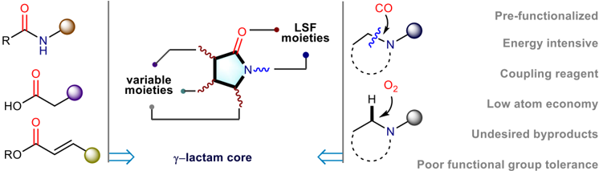
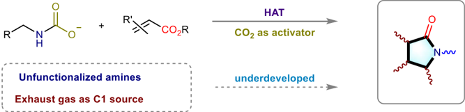
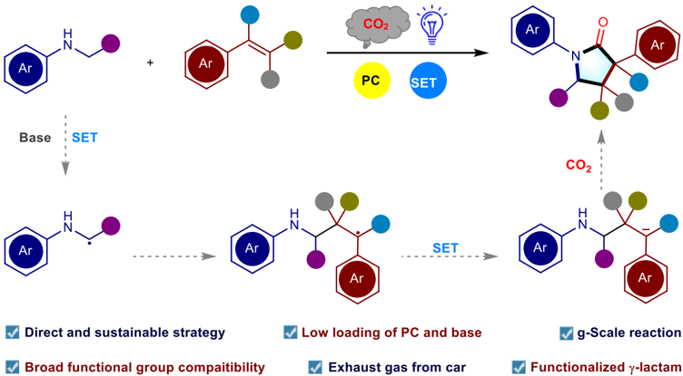
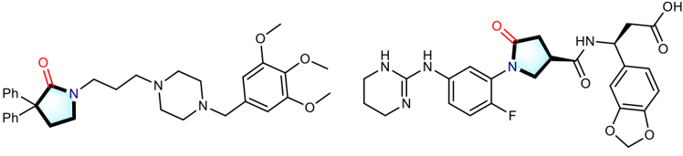
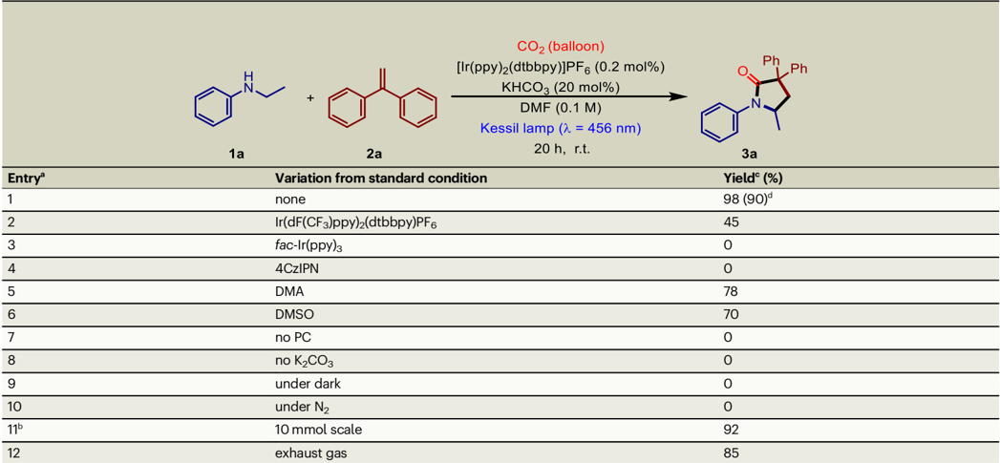
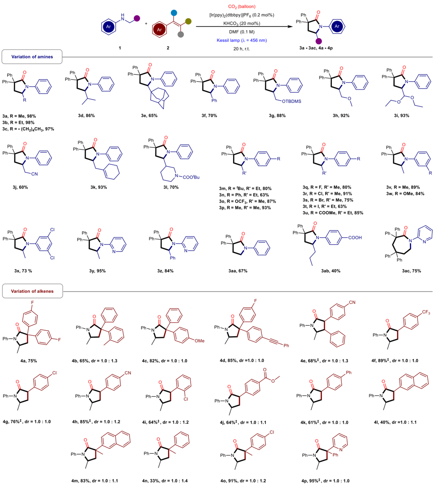
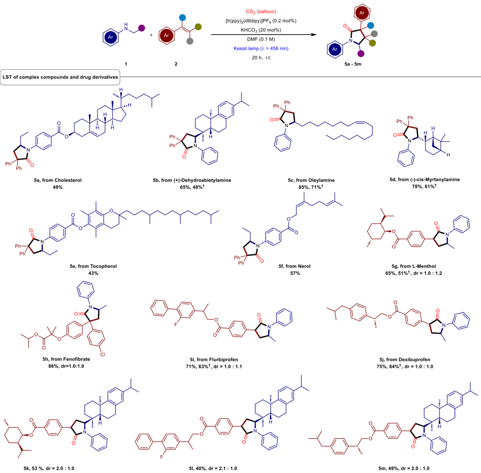
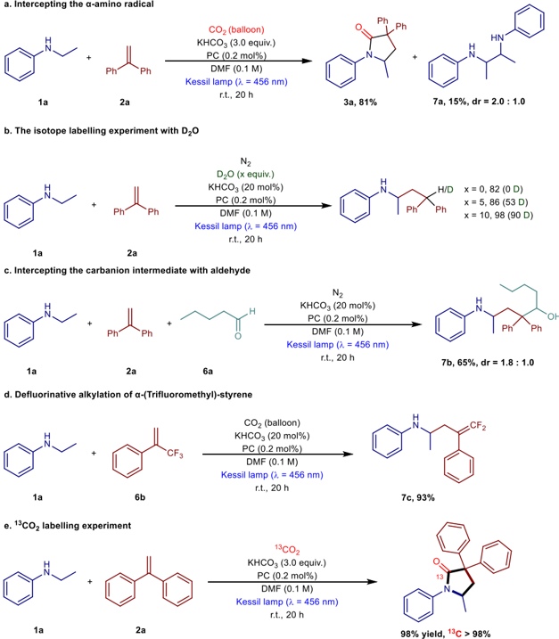
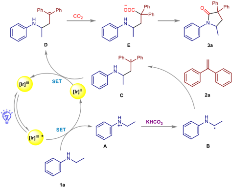

1234567890():,;

1234567890():,;

Article https://doi.org/10.1038/s41467-023-43289-w

## Straightforward synthesis of functionalized γ -Lactams using impure CO2 stream as the carbon source

Received: 6 May 2023

Accepted: 6 November 2023

Check for updates

Yuman Qin 1,2 , Robin Cauwenbergh 2 , Suman Pradhan 1,2 , Rakesh Maiti 1,2 , Philippe Franck 2 &amp; Shoubhik Das 1,2

Direct utilization of CO2 into organic synthesis fi nds enormous applications to synthesize pharmaceuticals and fi ne chemicals. However, pure CO2 gas is essential to achieve these transformations, and the puri fi cation of CO2 is highly cost and energy intensive. Considering this, we describe a straightforward synthetic route for the synthesis of γ -lactams, a pivotal core structure of bioactive molecules, by using commercially available starting materials (alkenes and amines) and impure CO2 stream (exhaust gas is collected from the car) as the carbon source. This blueprint features a broad scope, excellent functional group compatibility and application to the late-stage transformation of existing pharmaceuticals and natural products to synthesize functionalized γ -lactams. We believe that our strategy will provide direct access to γ -lactams in a very sustainable way and will also enhance the Carbon Capture and Utilization (CCU) strategy.

Direct fi xation of CO2 into organic molecules for the synthesis of fi ne ś chemicals and pharmaceuticals is currently an important area 1 -7 . The main reason behind this aspect is that CO2 is a nontoxic and abundantly available carbon source. Considering this, a plethora of transformations have recently been achieved despite the challenging activation of CO2 molecule due to its high thermodynamic stability and kinetic inertness 8 -17 . In organic synthesis, so far, the major focus has been given towards the formation of novel C-C bonds, C-heteroatom bonds, and others by using this strategy 18,19 . It should be clearly noted that in all of the cases, pure CO2 gas has been used as the carbon source, and to the best of our knowledge, impure CO2 stream such as the direct use of the fl ue gas collected from industries or exhaust gas collected from a car has rarely been reported. However, if an impure CO2 stream can be used, it certainly avoids the associated cost and energy requirement for the CO2 puri fi cation procedure and provides a newdirection for the application of the Carbon Capture and Utilization principle 20 -25 . Nonetheless, the presence of impurities such as O2, water vapor, CO, NOx, and hydrocarbons in the CO2 stream can be extremely harmful for the catalyst/reactants/intermediates and can be completely detrimental for the product formation.

Parallel to the use of impure CO2 stream, synthesis of γ -lactams is considered as highly important since this scaffold is a ubiquitous active core in diverse natural products and pharmaceuticals (Fig. 1a). Particularly, the functionalized γ -lactams have exhibited a wide variety of biological activities due to their high potency to inhibit enzymes and the growth of the cancer cells 26 . Besides these, the γ -lactam is a pivotal building block for the synthesis of organic molecular entities 27 . Owing to their high importance, γ -lactams are classically constructed intramolecularly by the condensation of amino acid derivatives in the presence of an equivalent amount of coupling reagent, such as N,N ' -dicyclohexyl carbodiimide (DCC), acetic anhydride and others (Fig. 1b) 28 . Besides these, the N-alkylation 29 -32 and acylation 33,34 of N-protected amides or dioxazolones have also been established as a powerful platform for the synthesis of γ -lactams. However, all these protocols typically required prefunctionalizations of substrates and additionally, faced undesired side reactions. In parallel, an elegant photocatalytic approach where acrylates were used to construct the poly-substituted γ -lactams, has recently been reported. However, the release of a stoichiometric amount

1 Department of Chemistry, University of Bayreuth, 95447 Bayreuth, Germany. 2 Department of Chemistry, Universiteit Antwerpen, 2020 Antwerpen, Belgium.

[e-mail: Shoubhik.Das@uni-bayreuth.de](mailto:Shoubhik.Das@uni-bayreuth.de)

Ph

Ph'

L-, N- and T-type channel blockers b. Existing strategies for the synthesis of y-lactams

moieties

HO

RO

c. Existing strategy for the synthesis of y-lactams using CO2 as an activator variable

moieties

Unfunctionalized amines

Exhaust gas as C1 source d. This work: photocatalytic synthesis of y-lactams using exhaust gas as C1 source

Ar

Base

Ar

Direct and sustainable strategy

Broad functional group compatibility underdeveloped

PC

- SET

Fig. 1 | Strategies for the construction of γ -lactam core. LSF late-stage functionalization, PC photocatalyst, SET single electron transfer; a selected bioactive molecules containing functionalized γ -lactam core; b existing strategies for the

of alcohol as a by-product reduced the atom economy of this strategy 35 . Furthermore, the carbonylation reaction using CO has provided an alternative route for the construction of lactam moiety albeit under energy-intensive conditions 36,37 . Moreover, synthesis of γ -lactams; c existing strategy for the synthesis of γ -lactams using CO2 as an activator; d overview of this work.

the oxidative transformations of the C-H bond also enabled the conversion of the N -heterocyclic motif into corresponding γ -lactam in an atom-economic fashion, however, the oxidizing environment narrowed the substrates scope and limited the

·

N

SET

N

Energy i

Coupling

Low atom e

Nev

compatibility 38,39 . Therefore, the synthesis of γ -lactams in a straightforward and sustainable fashion from widely available starting materials and carbonyl source should bring signi fi cant breakthrough in this domain.

Recently, the photocatalytic transformation of CO2 into valueadded products represents a prospective pathway to achieve CO2 transformation/utilization under mild reaction conditions 40 -42 . Considering this, the group of Schoenebeck and Rovis jointly reported an elegant synthetic blueprint (Fig. 1c) where CO2 acted as an activator for the respective primary amine, which later reacted with acrylates to produce γ -lactam in the presence of a hydrogen atom transfer catalyst 43 . In this strategy, acrylates were the actual carbonyl source for the synthesis of γ -lactam and the role of CO2 was only to activate the respective amino group. At the fi nal stage, CO2 was released from the corresponding intermediate and thus, no fi xation of CO2 molecule occurred to obtain the fi nal product. Furthermore, the research group of Yu has developed a promising approach by utilizing carboxylic acids as bifunctional reagents to synthesize γ -amino acids in a unique CO2-releasing and recapturing manner. One of the examples of this strategy involved the synthesis of a γ -lactam, however, it required three steps: at fi rst, the synthesis of the γ -amino acid occurred, then esteri fi cation with TMSCHN2, and fi nally, acidmediated deprotection followed by a cyclization reaction took place to produce the corresponding γ -lactam 44 . Followed by this strategy, Sun group has established a γ -amino acid synthesis platform that utilized sodium glycinates as an amino source precursor in the presence of an external CO2 to form γ -amino acid and lactams. However, this strategy also required multiple steps to achieve the γ -lactams and additionally, a relatively longer reaction time (48 h) 45 . Particularly, heating the reaction at 80 °C in the presence of (over) stoichiometric amount of acetic anhydride was essential to form the γ -lactam in this strategy.

Considering all these above-mentioned strategies, we became interested to synthesize γ -lactams from commercially available reagents and using impure CO2 stream as a carbon source. The limited availability of amino acids (Multiple steps synthetic routes developed by the group of Yu 44 and Sun 45 ), directed us to utilize amines and that should open the door towards unlimited varieties of γ -lactams in a single step. Particularly, amines are able to generate the corresponding reactive α -amino radicals in a direct fashion under visible-light-mediated photoredox catalysis. However, the direct generation of α -amino radicals is primarily dominated by tertiary amines 46 -50 , and limits the substrates scope as well as diversi fi cation via further modi fi cations. Furthermore, tertiary amines will be problematic for the cyclisation step in the synthesis of γ -lactam. In contrast, secondary amines are considered as an ideal amino source due to their tunable -NH group and their wide availability. Certainly, this approach will circumvent the pre-installation of the functional group (such as in case of amino acids, amino esters, α -silylated derivatives, and imines) 49,51 -54 . Inspired by this information, we anticipated that a three-component reaction among a carbonyl source (CO2 from the impure CO2 stream), an amino source (secondary amine), and a carbon backbone (alkene) could readily build the γ -lactam core unit under the mild reaction conditions of photoredox catalysis (Fig. 1d). In fact, unprotected secondary amines are able to generate the reactive α -amino radicals and should serve as an appropriate amino source to assemble the γ -lactam ring 55,56 . Later, the presence of an easily accessible alkene will act as the carbon backbone and should facilitate the construction of C-C bond by intercepting the α -amino radical (generated from the secondary amines) and will trigger the generation of the corresponding carbanion via further single electron transfer (SET) process. The carbanion can easily attack the electrophilic carbon center of CO2, will lead to the carboxylation reactions and fi nally, an intramolecular nucleophilic attack should generate the functionalized γ -lactam.

## Results and discussion

## Reaction condition optimization

At the beginning of our investigation, we chose N-ethyl aniline ( 1a ) to react with 1,1-diphenylethylene ( 2a ) and CO2 under atmospheric pressure under the irradiation of visible-light. After systematic optimization of the reaction parameters (for detailed information, see Supplementary Table 1 -4), we were delighted to fi nd that, in the presence of 0.2 mol% of Ir(ppy)2(dtbbpy)PF6 and 20 mol% of KHCO3, in N,N-dimethylformamide (DMF) under a 40W blue Kessil lamp ( λ =456nm) at ambient temperature, the desired product was obtained in 98% yield (Table 1, entry 1). We rationalized that the photocatalyst (PC), solvent and the base might play the central role for the generation of the reactive α -amino radical species from 1a 50,57 . For this reason, we set out to investigate a range of PCs (Table 1, entries 2 -4) and unfortunately, none of them reacted similar to the model PC. The underlying rationale behind this disparity can be attributed to the close proximity of the redox potential of [Ir(ppy)2dtbbpy)]PF6 (Ir(III)*/ Ir(II) = +0.66 V vs SCE, Ir(III)*/Ir(II) = -1.51 V vs SCE) 47 to both the oxidizing potential of the secondary amine (+0.81 V vs SCE for Nmethylaniline) 35 and the reducing potential of the benzylic radical ( -1.61 V vs SCE for phenylethyl radical) 40 . This intriguing fact presents an opportunity to successfully complete the catalytic cycle, given the appropriate optimization of reaction conditions. While the inef fi cacy of fac -Ir(ppy)3 in promoting the reaction lies in the fact that the excited state of fac -Ir(ppy)3 (Ir(III)*/Ir(II) = +0.31 V vs SCE) 47 is incapable of oxidizing secondary amine to generate the α -amino radical. This strategy clearly brings an alternative pathway developed by the Xi group with tertiary amines in the presence of a 4CzIPN photocatalyst (Table 1, entry 4) 46 . Since the redox property of 4CzIPN is quite limited, it will be problematic for the activation of the secondary amines and reduction of generated benzylic radical in this protocol and therefore, secondary amines did not exhibit any reactivity in their protocol.

Different solvents such as dimethyl sulfoxide and dimethylacetamide were also evaluated (for detailed information, see Supplementary Table 2), and turned out to be slightly less ef fi cient (Table 1, entries 5 -6). This phenomenon could be attributed to the high solubility of CO2 in DMF. Additionally, further optimizations of the quantity of KHCO3 (for detailed information, see Supplementary Table 3) and reaction temperature (for detailed information, see Supplementary Table 4) were also performed. Furthermore, control experiments were conducted to determine the role of each reaction parameter (Table 1, entries 7 -10), and revealed that no product was formed in the absence of the PC, base, CO2, or visible light. Gratifyingly, the gram-scale conversion proceeded with an excellent yield (92%) by using this photoredox strategy, which clearly demonstrated the practicality and scalability of our rection strategy (Table 1, entry 11). Most interestingly, the use of exhaust gas (containing a mixture of CO2: 10.8414%, N2: 61.0585%, CO: 0.0054%, O2: 2.4532%, CH4: 0.0061% and others: 25.6354%) from a car instead of pure CO2 in this reaction yielded the desired product ( 3a ) with a surprisingly high yield (85%, Table 1, entry 12), which exhibited the robustness as well as practical deployment of our protocol to synthesize this scaffold.

## The substrate scope in anilines and alkenes

After the optimization of the reaction conditions, we became interested to demonstrate the generality of this strategy by varying different amine derivatives in this reaction (Fig. 2). To our observation, different N-alkyl anilines ( 3a -3c ), alkyl chain substituted with secondary alkyl group ( 3d ), bulky tertiary alkyl group ( 3e ) and phenyl group ( 3f ) afforded a series of γ -lactams in good to excellent yields (65 -98%). Alongside, several N-alkyl aniline derivatives with electron withdrawing groups (EWGs) and electron donating groups (EDGs) in the aliphatic chain, including -OTBDMS ( 3g ), -OMe ( 3h ), -(OEt)2 ( 3i ), -CN ( 3j ) also provided the corresponding γ -lactams with good to excellent yields (60 -93%). Notably, this conversion was also amenable

## Table 1 | Optimization studies for the synthesis of γ -lactam

| a     |                                   |             |
|-------|-----------------------------------|-------------|
| Entry | Variation from standard condition | Yield c (%) |
| 1     | none                              | 98 (90) d   |
| 2     | Ir(dF(CF 3 )ppy) 2 (dtbbpy)PF 6   | 45          |
| 3     | fac -Ir(ppy) 3                    | 0           |
| 4     | 4CzIPN                            | 0           |
| 5     | DMA                               | 78          |
| 6     | DMSO                              | 70          |
| 7     | no PC                             | 0           |
| 8     | no K 2 CO 3                       | 0           |
| 9     | under dark                        | 0           |
| 10    | under N 2                         | 0           |
| 11 b  | 10mmol scale                      | 92          |
| 12    | exhaust gas                       | 85          |

to substrates with alkene ( 3k ) as well as protected piperidine ( 3l ) to provide the desired products in excellent yields (93% and 70%). Additionally, anilines bearing EDGs at the para position ( 3m -3p ) afforded the products in good to excellent yields (63 -93%), halidesubstituted aniline derivatives ( 3q -3t ) and EWGs ( 3u ) also delivered the desired products in good to excellent yields (63 -91%). Moreover, the change in substituents pattern i.e., meta-substituted aniline with EDGs ( 3v, 3w ) displayed excellent reactivity under this reaction conditions (89%, 84%). Interestingly, even the polyhalides ( 3x ) provided an excellent yield (73%). Delightfully, the heterocyclic amines containing γ -lactams ( 3y, 3z ) can also be synthesized in excellent yields (95%, 84%). Consistent with the reactivity of carbon radical, the N-methylaniline with primary reaction site was also able to furnish the product ( 3aa ) in a slightly compromised yield (67%). Remarkably, the substrate bearing a carboxylic acid group ( 3ab , 40%) was able to the protonate the in situ generated carbanion intermediates, was also tolerated in this system, indicating the high ef fi ciency and compatibility of this strategy. Surprisingly, the employment of heteroaryl amines led to the construction of seven-membered ε -lactam ( 3ac , 75%), highlighting the diverseness and synthetic utility of this methodology.

Furthermore, the potential utility of this synthetic strategy was also exempli fi ed by varying the structure of alkenes (Fig. 2). In fact, 1,1diarylethylenes bearing EWG ( 4a , 75%) at the para position exhibited good reactivity in this system. On the other hand, in terms of regioselectivity, 1,1-diarylethenes with different substituents, two regioisomeric products were obtained in good to excellent yield. The substrates with -EDGs at the ortho ( 4b ) or para ( 4c, 4d ) position, delivered the corresponding products in good to excellent yields (65 -85%). Furthermore, an internal vinyl arene underwent this conversion to provide the targeted product in good yield ( 4e , 68%). Consistent with the electronic arguments, the aryl alkenes bearing both strong and weak EWGs ( 4f -4k ) were excellent partners and provided γ -lactams in good to excellent yields (61 -89%). Remarkably, the electron-neutral 2-vinylnaphthalene also afforded the desired product in an acceptable yield ( 4l , 40%). Delightfully, the yield was driven high by the methyl substituted external 2-vinylnaphthalene ( 4m , 83%), which could be due to the higher stability of the secondary carbon radical. The electron-neutral substrate was also compatible with the reaction conditions and exhibited the targeted γ -lactam in moderate yield ( 4n , 33%). However, there was a signi fi cant improvement when an EWG was grafted onto the substrate ( 4o , 91%), specially, the biologically relevant vinyl pyridine ( 4p , 95%) was well tolerated.

## Late-Stage Transformations (LST)

Having demonstrated the scope of this protocol, late-stage transformations (LST) of biologically active molecules were carried out to introduce the γ -lactam core in the pharmaceutically active compounds. Since γ -lactam core has the potential to improve the antibiotic, antitumor, and antidepressant properties in drug molecules 26,58 , we rationalized that our straightforward synthetic strategy should open a new avenue to enhance the drug discovery via LST. As shown in Fig. 3, the construction of γ -lactam scaffold in cholesterol derivative ( 5a , 49%) opened a new window for the delivery of anticancer, antimicrobial, antioxidant drugs and cholesterol-based liquid crystals and gelatos 59,60 . The (+)-dehydroabietylamine was also effectively functionalized to 5b in 65% yield which might become an interesting candidate for fragrance and triple-negative breast cancer treatment 61 . Furthermore, a γ -lactam center was successfully installed in varieties of natural products such as oleylamine ( 5c ), (-)-cis- myrtanylamine ( 5d ), tocopherol ( 5e ), and nerol ( 5f ) in good to excellent yields (43 -85%).

Gratifyingly, a variety of bioactive alkenes such as L-menthol ( 5g ) and feno fi brate ( 5h ) were also converted to the corresponding γ -lactam derivatives with good to excellent yields (65% and 86%). Furthermore, when fl urbiprofen and dexibuprofen derivatives were subjected to the reaction conditions, the corresponding γ -lactam ( 5i, 5j ) were obtained in excellent yield (71% and 75%), paving a new opportunity to synthesize profen analogs. Moreover, this strategy was further extended to introduce a γ -lactam core between complex molecules with different biotically features to provide the corresponding conjugated compounds ( 5k -5m , 40 -53%). Expediently, the LST of various complex molecules underwent excellently when the

Fig. 2 | The substrate scope of amines and alkenes. Reaction condition: as mentioned in Table 1, Entry 1; ‡ K3PO4 was used instead of KHCO3.

exhaust gas (containing a mixture of CO2, N2, H2O, CO, Nox, and O2) was considered as the carbon source instead of pure CO2 ( 5bb -5db, 5gb, 5ib, 5jb ; 49 -71%). This clearly demonstrated that the rapid diversi fi cation and construction of functionalized γ -lactams with a large biological spectrum and therapeutic applications could be afforded from the exhaust gas. We strongly believe that this new blueprint will certainly open a new era for the synthesis of drug molecules via the valorization of waste gases.

## Mechanistic investigation

To shed light on the reaction pathway, a range of mechanistic experiments were carried out. At fi rst, radical control experiments were performed, which inhibited the formation of the targeted product in the presence of different equivalents of 2,2,6,6-Tetramethylpiperidinooxy (TEMPO), indicating the involvement of a radical process (Supplementary Table 5). Similarly, the employment of CuCl2 as a quencher identi fi ed the presence of a SET process (Supplementary Table 5, entry 3). In order to understand the initial step of this transformation, Stern-Volmer fl uorescence quenching experiments were also carried out (for details, see Supplementary Fig. 6). In fact, fl uorescence intensity decreased with the increase of N-ethyl aniline concentration, however, no change was observed with 1,1-diphenylethylene, which clearly revealed that the PC after the excitation, was quenched by the N-ethyl aniline. We assumed that the

Fig. 3 | Synthesis of functionalized γ -lactams using the exhaust gas. Reaction conditions: as mentioned in Table 1, Entry 1; † Using exhaust gas from car.

excited state of the PC acted as an oxidant to accept an electron from N-ethyl aniline, followed by losing a proton in the presence of a base, generated the corresponding α -amino radical 34,35 . In fact, the generation of the corresponding dimer 7a was also observed in certain reaction conditions which was the direct evidence for the presence of the α -amino radical (Fig. 4a). Additional experiments were also performed to gain insight into other intermediates formed in this process. The isotope labeling experiments with D2O yielded up to 90% of deuterium incorporation, implying that γ -amino benzylic anion species could be the active intermediate (Fig. 4b). This result was in consistent with the formation of γ -amino alcohol in moderate yield when heptanal was added as an electrophile (Fig. 4c). The de fl uorinated alkylation of tri fl uoromethyl alkene experiment further supported the presence of γ -amino benzylic anion intermediate (Fig. 4d). Furthermore, 13 CO2 labeling experiments clearly revealed that CO2 was the unique carbon source of the carbonyl moiety of the corresponding γ -lactam (Fig. 4e). Moreover, light on/off experiments indicated that the formation of the product was completely inhibited in the absence of light but was able to restart when the light was switched on (For details, see Supplementary Figs. 9, 10).

Based on all these mechanistic investigations, the proposed mechanism has been outlined in Fig. 5. Initially, the [Ir III ] photocatalyst was excited under the irradiation of visible light. The excited [Ir III ]* complex acted as an oxidant to accept an electron from 1a to generate the reduced [Ir II ] together with the formation of species A . Subsequently, A lost a proton with the assistance of KHCO3 to provide the radical B , which subsequently reacted with 2a to afford the radical species C . This radical species underwent a SET reduction process with [Ir II ] to produce γ -amino benzylic anion species D . In the presence of CO2, species D attacked the electrophilic carbon center of CO2 to generate the corresponding carboxylate E . Followed by this, an intramolecular nucleophilic attack on the carboxylic acid group occurred to produce the corresponding γ -lactam product.

In summary, we have developed a photoredox strategy for the synthesis of γ -lactams using easily available amine, alkene, and CO2. Importantly, this photoredox strategy exhibited a broad substrate

Fig. 4 | Mechanistic studies. a intercepting the α -amino radical; b the isotope labeling experiment with D2O; c intercepting the carbanion intermediate with aldehyde; d de fl uorinative alkylation of α -(Tri fl uoromethyl)-styrene; e 13 CO2 labeling experiment.

Fig. 5 | Proposed mechanism for the synthesis of γ -lactams. [Ir]: Ir(ppy)2(dtbbpy) PF6; SET: single electron transfer; The mechanism was proposed with model substrates 1a and 2a .

scope and the application of this system has been diversi fi ed by applying onto complex molecules which highlighted the utility of this strategy for the construction of a library of bioactive analogs.

Moreover, this system can be readily scaled-up, which indicated the strong potential in industrial production. Additionally, detailed mechanistic studies revealed the mechanism of this transformation. However, the central advantage of this strategy is that the exhaust gas can replace pure CO2 for the synthesis of pharmaceutically active compounds which certainly will avoid the all the energy and cost prohibitive CO2 puri fi cation procedure.

## Methods

A dry 10 mL vial equipped with a stirring bar was charged with the 1,1diphenylethylene (0.2 mmol), N-ethylaniline (0.24 mmol), [Ir(ppy)2(dtbbpy)]PF6 (0.2 mol%), and KHCO3 (20 mol%). Subsequently, dimethylformamide (DMF) with a concentration of 0.1 M was introduced as the solvent. The vial was sealed with a rubber plunger, and the reaction mixture was subjected to a continuous stream of carbon dioxide (CO2) for a duration of 10 min. Following complete saturation of the reaction mixture with CO2, the vial was placed approximately 3 cm away from a Kessil lamp ( λ =456nm), and the mixturewasstirred under the irradiation with a fan for a period of 20 h. Subsequent to the irradiation, the mixture was quenched by dilution with a 0.1 M HCl solution (2.0 mL) and ethyl acetate (EtOAc, 2.0 mL). 1,3,5-Trimethoxybenzene was added, and the resulting layers were separated. The aqueous layer was further subjected to extraction with ethyl acetate (2.0 mL x 3), and the combined organic layers were concentrated under reduced pressure using a 40 °C water bath. The yield was analyzed by 1 H NMR spectroscopy.

## Data availability

The data supporting the results of this work are included in this paper or in the Supplementary Information and are also available upon request from the corresponding author.

## References

1. Liang, H. Q., Beweries, T., Francke, R. &amp; Beller, M. Molecular catalysts for the reductive homocoupling of CO2 towards C2+ compounds. Angew. Chem. Int. Ed. 61 , e202200723 (2022).
2. Alkayal, A. et al. Harnessing applied potential: selective β -hydrocarboxylation of substituted ole fi ns. J. Am. Chem. Soc. 142 , 1780 -1785 (2020).
3. Li, X., Benet-Buchholz, J., Escudero-Adán, E. C. &amp; Kleij, A. W. Silvermediated cascade synthesis of functionalized 1,4-Dihydro-2 H -benzo-1,3-oxazin-2-ones from carbon dioxide. Angew. Chem. Int. Ed. 62 , e202217803 (2023).
4. Davies, J., Lyonnet, J. R., Zimin, D. P. &amp; Martin, R. The road to industrialization of fi ne chemical carboxylation reactions. Chem 7 , 2927 -2942 (2021).
5. Pradhan, S. &amp; Das, S. Recent advances on the carboxylations of C(sp 3 ) -H bonds using CO2 as the carbon source. Synlett 34 , 1327 -1342 (2023).
6. Cauwenbergh, R., Goyal, V., Maiti, R., Natte, K. &amp; Das, S. Challenges and recent advancements in the transformation of CO2 into carboxylic acids: straightforward assembly with homogeneous 3d metals. Chem. Soc. Rev. 51 , 9371 -9423 (2022).
7. Zhang, Y., Zhang, T. &amp; Das, S. Catalytic transformation of CO2 into C1chemicals using hydrosilanes as a reducing agent. Green. Chem. 22 , 1800 -1820 (2020).
8. Davies, J. et al. Ni-catalyzed carboxylation of aziridines en route to β -Amino Acids. J. Am. Chem. Soc. 143 , 4949 -4954 (2021).
9. Börjesson, M. et al. Remote sp 2 C -H carboxylation via catalytic 1,4Ni migration with CO2. J. Am. Chem. Soc. 142 , 16234 -16239 (2020).
10. Somerville, R. et al. Ni(I) -alkyl complexes bearing phenanthroline ligands: experimental evidence for CO2 insertion at Ni(I) centers. J. Am. Chem. Soc. 142 , 10936 -10941 (2020).
11. Das, S., Turnell-Ritson, R. C., Dyson, P. J. &amp; Corminboeuf, C. Design of frustrated lewis pair catalysts for direct hydrogenation of CO2. Angew. Chem. Int. Ed. 61 , e202208987 (2022).
12. Gastelu, G. et al. Autocatalytic o -formylation of alcohols using CO2. ACS Catal. 13 , 2403 -2409 (2023).
13. Sheta, A. M. et al. Selective α , δ -hydrocarboxylation of conjugated dienes utilizing CO2 and electrosynthesis. Chem. Sci. 11 , 9109 -9114 (2020).
14. Tortajada, A., Juliá-Hernández, F., Börjesson, M., Moragas, T. &amp; Martin, R. Transition-metal-catalyzed carboxylation reactions with carbon dioxide. Angew. Chem. Int. Ed. 57 , 15948 -15982 (2018).
15. Tortajada, A., Ninokata, R. &amp; Martin, R. Ni-catalyzed site-selective dicarboxylation of 1,3-dienes with CO2. J. Am. Chem. Soc. 140 , 2050 -2053 (2018).
16. Gaydou, M., Moragas, T., Juliá-Hernández, F. &amp; Martin, R. Siteselective catalytic carboxylation of unsaturated hydrocarbons with CO2 and Water. J. Am. Chem. Soc. 139 , 12161 -12164 (2017).
17. Yatham, V. R., Shen, Y. &amp; Martin, R. Catalytic intermolecular dicarbofunctionalization of styrenes with CO2 and radical precursors. Angew. Chem. Int. Ed. 56 , 10915 -10919 (2017).
18. Liu, Q., Wu, L., Jackstell, R. &amp; Beller, M. Using carbon dioxide as a building block in organic synthesis. Nat. Commun. 6 , 5933 (2015).
19. Sang, R. et al. A practical concept for catalytic carbonylations using carbon dioxide. Nat. Commun. 13 , 4432 (2022).
20. Pradhan, S., Roy, S., Sahoo, B. &amp; Chatterjee, I. Utilization of CO2 feedstock for organic synthesis by visible-light photoredox catalysis. Chem. Eur. J. 27 , 2254 -2269 (2021).
21. Yang, Z. Z., He, L. N., Zhao, Y. N., Li, B. &amp; Yu, B. CO2 capture and activation by superbase/polyethylene glycol and its subsequent conversion. Energy Environ. Sci. 4 , 3971 -3975 (2011).
22. Liu, A. H. et al. Equimolar CO2 capture by N-substituted amino acid salts and subsequent conversion. Angew. Chem. Int. Ed. 51 , 11306 -11310 (2012).
23. Kothandaraman, J., Goeppert, A., Czaun, M., Olah, G. A. &amp; Prakash, G. K. S. CO2 capture by amines in aqueous media and its subsequent conversion to formate with reusable ruthenium and iron catalysts. Green. Chem. 18 , 5831 -5838 (2016).
24. Kar, S., Goeppert, A. &amp; Prakash, G. K. S. Integrated CO2 capture and conversion to formate and methanol: connecting two threads. Acc. Chem. Res. 52 , 2892 -2903 (2019).
25. Prajapati, A. et al. Fully-integrated electrochemical system that captures CO2 from fl ue gas to produce value-added chemicals at ambient conditions. Energy Environ. Sci. 15 , 5105 -5117 (2022).
26. Sald´ ı var-Gonz´alez, F. I., Lenci, E., Trabocchi, A. &amp; Medina-Franco, J. L. Exploring the chemical space and the bioactivity pro fi le of lactams: a chemoinformatic study. RSC Adv. 9 , 27105 -27116 (2019).
27. Goudedranche, S., Besnard, C., Egger, L. &amp; Lacour, J. Synthesis of pyrrolidines and pyrrolizidines with α -pseudoquaternary centers by copper-catalyzed condensation of α -diazodicarbonyl compounds and aryl γ -Lactams. Angew. Chem. Int. Ed. 55 , 13775 -13779 (2016).
28. Larock, R. C. Comprehensive Organic Transformations , 2nd ed, Wiley-VCH: New York (1999).
29. Hong,S.Y.etal. Selective formation of γ -lactams via C -Hamidation enabled by tailored iridium catalysts. Science 359 , 1016 -1021 (2018).
30. Wang, H. et al. Iridium-catalyzed enantioselective C(sp 3 ) -H amidation controlled by attractive noncovalent interactions. J. Am. Chem. Soc. 141 , 7194 -7201 (2019).
31. Xing, Q., Chan, C., Yeung, Y. &amp; Yu, W. Ruthenium (II)-catalyzed enantioselective γ -Lactams formation by intramolecular C -H amidation of 1,4,2-dioxazol-5-ones. J. Am. Chem. Soc. 141 , 3849 -3853 (2019).
32. Miller, D. C., Choi, G. J., Orbe, H. S. &amp; Knowles, R. R. Catalytic ole fi n hydroamidation enabled by proton-coupled electron transfer. J. Am. Chem. Soc. 137 , 13492 -13495 (2015).
33. Wu, X., Qu, J. &amp; Chen, Y. Quinim: a new ligand scaffold enables nickel-catalyzed enantioselective synthesis of α -alkylated γ -lactam. J. Am. Chem. Soc. 142 , 15654 -15660 (2020).
34. Treacy, S. M., Vaz, D. R., Noman, S., Tard, C. &amp; Rovis, T. Coupling of α -bromoamidesandunactivatedalkenes toform γ -lactams through EDA and photocatalysis. Chem. Sci. 14 , 1569 -1574 (2023).
35. Zhao, H. &amp; Leonori, D. Minimization of back-electron transfer enables the elusive sp 3 C -Hfunctionalization of secondary anilines. Angew. Chem. Int. Ed. 60 , 7669 -7674 (2021).
36. Lo´pez, B. et al. Preparation of benzolactams by Pd(ii)-catalyzed carbonylation of N-unprotected arylethylamines. Chem. Commun. 47 , 1054 -1056 (2011).
37. Mancuso, R. et al. A stereoselective, multicomponent catalytic carbonylative approach to a new class of α , β -unsaturated γ -lactam derivatives. Catalysts 11 , 227 (2021).
38. Khusnutdinova, J. R., Ben-David, Y. &amp; Milstein, D. Oxidant-free conversion of cyclic amines to lactams and H2 using water as the oxygen atom source. J. Am. Chem. Soc. 136 , 2998 -3001 (2014).
39. Jin, X., Kataoka, K., Yatabe, T., Yamaguchi, K. &amp; Mizuno, N. Supported gold nanoparticles for ef fi cient α -oxygenation of secondary and tertiary amines into amides. Angew. Chem., Int. Ed. 55 , 7212 -7217 (2016).
40. Meng, Q. Y., Schirmer, T. E., Berger, A. L., Donabauer, K. &amp; König, B. Photocarboxylation of benzylic C -H bonds. J. Am. Chem. Soc. 141 , 11393 -11397 (2019).

41. Song, L. et al. Visible-light photocatalytic di- and hydrocarboxylation of unactivated alkenes with CO2. Nat. Catal. 5 , 832 -838 (2022).
42. Cao, G. M. et al. Visible-light photoredox-catalyzed umpolung carboxylation of carbonyl compounds with CO2. Nat. Commun. 12 , 3306 (2021).
43. Ye, J., Kalvet, I., Schoenebeck, F. &amp; Rovis, T. Direct α -alkylation of primary aliphatic amines enabled by CO2 and electrostatics. Nat. Chem. 10 , 1037 -1041 (2018).
44. Liao, L. L. et al. α -amino acids and peptides as bifunctional reagents: carbocarboxylation of activated alkenes via recycling CO2. J. Am. Chem. Soc. 143 , 2812 -2821 (2021).
45. Zhou, C., Li, M., Sun, J., Cheng, J. &amp; Sun, S. Photoredox-catalyzed α -aminomethyl carboxylation of styrenes with sodium glycinates: synthesis of γ -amino acids and γ -lactams. Org. Lett. 23 , 2895 -2899 (2021).
46. Zhang, B., Yi, Y., Wu, Z. Q., Chen, C. &amp; Xi, C. Photoredox-catalyzed dicarbofunctionalization of styrenes with amines and CO2: a convenient access to γ -amino acids. Green. Chem. 22 , 5961 -5965 (2020).
47. Prier, C. K., Rankic, D. A. &amp; MacMillan, D. W. C. Visible light photoredox catalysis with transition metal complexes: applications in organic synthesis. Chem. Rev. 113 , 5322 -5363 (2013).
48. Schultz, D. M. &amp; Yoon, T. P. Solar synthesis: prospects in visible light photocatalysis. Science 343 , 1239176 (2014).
49. Beatty, J. W. &amp; Stephenson, C. R. J. Amine functionalization via oxidative photoredox catalysis: methodology development and complex molecule synthesis. Acc. Chem. Res. 48 , 1474 -1484 (2015).
50. Nakajima, K., Miyake, Y. &amp; Nishibayashi, Y. Synthetic utilization of α -aminoalkyl radicals and related species in visible light photoredox catalysis. Acc. Chem. Res. 49 , 1946 -1956 (2016).
51. Zuo, Z. et al. Merging photoredox with nickel catalysis: coupling of α -carboxyl sp 3 -carbons with aryl halides. Science 345 , 437 -440 (2014).
52. Zuo, Z. et al. Enantioselective decarboxylative arylation of α -amino acids via the merger of photoredox and nickel catalysis. J. Am. Chem. Soc. 138 , 1832 -1835 (2016).
53. Leitch, J. A., Rossolini, T., Rogova, T., Maitland, J. A. P. &amp; Dixon, D. J. α -tertiary dialkyl ether synthesis via reductive photocatalytic α -functionalization of alkyl enol ethers. ACS Catal. 10 , 2009 -2025 (2020).
54. Maitland, J. A. P. et al. Switchable, reagent-controlled diastereodivergent photocatalytic carbocyclisation of imine-derived α -amino radicals. Angew. Chem. Int. Ed. 60 , 24116 -24123 (2021).
55. Lewis, F. D., Zebrowski, B. E. &amp; Correa, P. E. Photochemical reactions of arenecarbonitriles with aliphatic amines. 1. Effect of arene structure on aminyl vs. alpha. -aminoalkyl radical formation. J. Am. Chem. Soc. 106 , 187 -193 (1984).
56. Lewis, F. D. &amp; Correa, P. E. Photochemical reactions of arenecarbonitriles with aliphatic amines. 2. Effect of amine structure on aminyl vs. alpha. -aminoalkyl radical formation. J. Am. Chem. Soc. 106 , 194 -198 (1984).
57. Dinnocenzo, J. P. &amp; Banach, T. E. Deprotonation of tertiary amine cation radicals. A direct experimental approach. J. Am. Chem. Soc. 111 , 8646 -8653 (1989).
58. Caruano, J., Muccioli, G. G. &amp; Robiette, R. Biologically active γ -lactams: synthesis and natural sources. Org. Biomol. Chem. 14 , 10134 -10156 (2016).
59. Kuzu, O. F., Noory, M. A. &amp; Robertson, G. P. The role of cholesterol in cancer. Cancer Res. 76 , 2063 -2070 (2016).
60. Maxfi eld, F. R. &amp; Tabas, I. Role of cholesterol and lipid organization in disease. Nature 438 , 612 -621 (2005).
61. Ling, T. et al. (+)-Dehydroabietylamine derivatives target triplenegative breast cancer. Eur. J. Med. Chem. 102 , 9 -13 (2015).

## Acknowledgements

Y.Q. acknowledge funding from the Chinese Scholarship Council (PhD fellowship to Y.Q., grant no: 202006870012). R.C. acknowledge funding from the FWO (PhD fellowship to R.C.). S.D. thank Francqui foundation (lecturer award to S.D.) Odysseus grant and FWO research project grant. WethankTongZhangandH.Y.VincentChingfortheirkindassistance in Stern-Volmer fl uorescence quenching experiments.

## Author contributions

S.D. and Y.Q. conceived and designed the experiments. Y.Q. and R.C. performed the substrate scope experiments. Y.Q., S.P. and R.M. carried out the mechanistic studies. P.F. collected the exhaust gas. All authors critically reviewed the manuscript and approved the fi nal version.

## Funding

Open Access funding enabled and organized by Projekt DEAL.

## Competing interests

The authors declare no competing interests.

## Additional information

Supplementary information The online version contains supplementary material available at https://doi.org/10.1038/s41467-023-43289-w.

Correspondence and requests for materials should be addressed to Shoubhik Das.

Peer review information Nature Communications thanks Liang-Nian He and the other, anonymous, reviewer(s) for their contribution to the peer review of this work. A peer review fi le is available.

## Reprints and permissions information is available at

[http://www.nature.com/reprints](http://www.nature.com/reprints)

Publisher ' s note Springer Nature remains neutral with regard to jurisdictional claims in published maps and institutional af fi liations.

Open Access This article is licensed under a Creative Commons Attribution 4.0 International License, which permits use, sharing, adaptation, distribution and reproduction in any medium or format, as long as you give appropriate credit to the original author(s) and the source, provide a link to the Creative Commons licence, and indicate if changes were made. The images or other third party material in this article are included in the article ' s Creative Commons licence, unless indicated otherwise in a credit line to the material. If material is not included in the article ' s Creative Commons licence and your intended use is not permitted by statutory regulation or exceeds the permitted use, you will need to obtain permission directly from the copyright holder. To view a copy of this licence, visit http://creativecommons.org/ licenses/by/4.0/.

- ©The Author(s) 2023