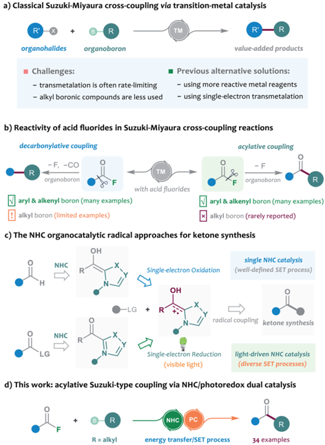
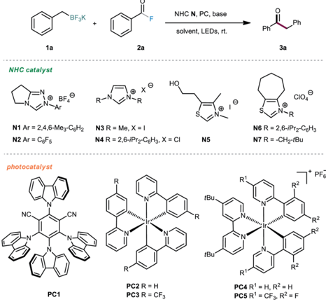
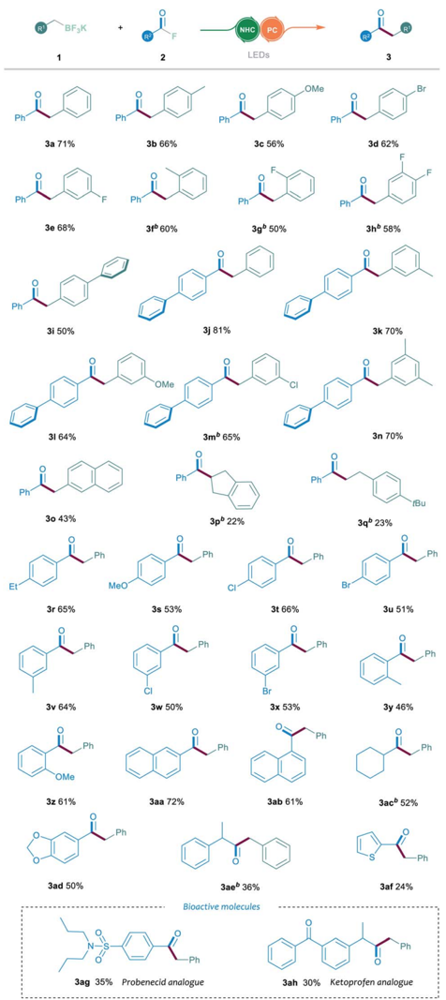
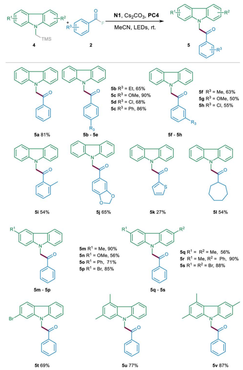
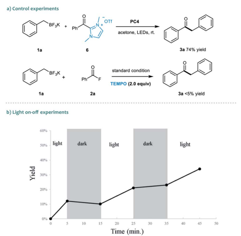
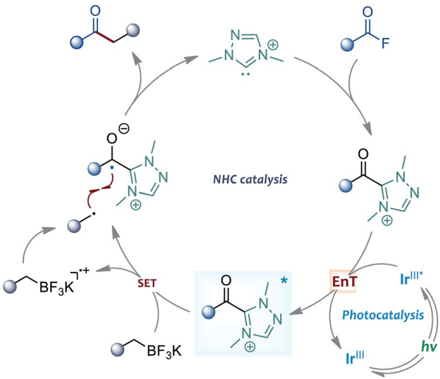

## Chemical S c i e n c e

rsc.li/chemical-science

ISSN 2041-6539

acid fl  uoride enabled by NHC/photoredox dual catalysis

## Chemical Science

## EDGE ARTICLE

Cite this: Chem. Sci. , 2022, 13 , 2584

All publication charges for this article have been paid for by the Royal Society of Chemistry

Received 4th November 2021 Accepted 20th January 2022

DOI: 10.1039/d1sc06102j

rsc.li/chemical-science

## Introduction

The Suzuki -Miyaura cross-coupling of boron compounds with electrophiles, such as organic halides, has played a central role in modern organic synthesis, as it provides a robust protocol to forge carbon -carbon chemical bonds. 1 As one of the most popular synthetic strategies in pharmaceutical science, the Suzuki -Miyaura reaction has been well received by medicinal chemists, with the accomplishment of more than half of the C -C bond-forming processes for drug synthesis. 2 Despite its signi  cant contributions, the cross-coupling method is still imperfect in many aspects and further improving the reaction outcome remains an important research subject. Typically, the transition-metal-catalysed cross-coupling proceeds through a three-stage catalytic cycle, including oxidative addition, transmetalation and reductive elimination. In particular, the rate-determining step of most Suzuki cross-coupling reactions was found to be the transmetalation process, and the transmetalation rate of C(sp 3 )-hybridised boronic reagents is o  en sluggish and problematic, and generally exhibits a much slower rate than that of the C(sp)- or C(sp 2 )-hybridised boron substrates. 3 In this scenario, several slow alkyl transmetalation processes were alternatively realised by using more reactive but air-/moisture-sensitive organometallic species, such as alkyl

a Antibiotics Research and Re-evaluation Key Laboratory of Sichuan Province, Sichuan Industrial Institute of Antibiotics, School of Pharmacy, Chengdu University, Chengdu 610106, P. R. China. E-mail: lijunlong709@hotmail.com

b State Key Laboratory of Southwestern Chinese Medicine Resources, School of Pharmacy, Chengdu University of Traditional Chinese Medicine, Chengdu 611137, China

† Electronic supplementary information (ESI) available: Experimental procedures, characterisation data for new compounds and crystallographic data. See DOI: 10.1039/d1sc06102j

|

View Article Online View Journal  | View Issue

## Suzuki-type cross-coupling of alkyl tri fl uoroborates with acid fl uoride enabled by NHC/ photoredox dual catalysis †

Hua Huang, ab Qing-Song Dai, a Hai-Jun Leng, a Qing-Zhu Li, a Si-Lin Yang, a Ying-Mao Tao, a Xiang Zhang, a Ting Qi a and Jun-Long Li * a

The Suzuki -Miyaura cross-coupling of C(sp 3 )-hybridised boronic compounds still remains a challenging task, thereby hindering the broad application of alkyl boron substrates in carbon -carbon bond-forming reactions. Herein, we developed an NHC/photoredox dual catalytic cross-coupling of alkyl tri fl uoroborates with acid fl uorides, providing an alternative solution to the classical acylative Suzuki coupling chemistry. With this protocol, various ketones could be rapidly synthesised from readily available materials under mild conditions. Preliminary mechanistic studies shed light on the unique radical reaction mechanism.

Grignard reagents and alkylzincs, to replace the bench-stable boron reagents for cross-coupling. 4 Thus, the broad application of alkyl boronic compounds in Suzuki -Miyaura reactions still represents a challenging task. Despite a few examples that used the means of heating, strong bases or ligand screening to promote the e ffi ciency of alkyl boronic Suzuki -Miyaura crosscoupling, the development of mechanistically di ff erent catalytic protocols to address the problem is highly desirable. A breakthrough in this area has been recently achieved by Molander, who employed nickel/photoredox dual catalysis to streamline the alkylboron transmetalation through a singleelectron transfer event. This dual catalytic approach was successfully applied to the cross-coupling of various alkyl tri- uoroborates with aryl bromides, o ff ering a diversity of diarylmethane products (Scheme 1a). 5 Inspired by their elegant work, we envisioned that the concept of the dual catalytic radical approach might be further explored and modi  ed to enable more types of Suzuki -Miyaura reactions by using easilyavailable alkylboron reagents.

The acylative Suzuki reaction, cross-coupling of carboxylic acid derivatives with boron reagents, represents a powerful tool for the synthesis of ketones. 6 As an important kind of carboxylic substrate, acid  uorides are regarded as easy-to-handle and versatile building blocks for cross-coupling chemistry, probably because they display a great balance between stability and reactivity. 7 Rovis and colleagues for the  rst time reported the catalytic cross-coupling of acid  uorides in the presence of organozinc reagents in 2004. 8 However, the boron-based Suzuki-type coupling of acid  uorides remained unexplored until the recent independent studies of Sakai and Sanford's group. 9 In 2017, Sakai et al. 9 a enriched the acylative Suzuki reaction to include acid  uoride substrates, but the method was still limited to the classical C(sp 2 )-hybridised boron reagents.

Open Access A

a) Classical Suzuki-Miyaura cross-coupling via transition-metal catalysis

BY-NO

cC)

organohalides

· Challenges:

organoboron

NHC

organoboron value-added products

Scheme 1 Research motivation for NHC/photoredox dual catalysed Suzuki-type coupling reactions.

Later, Sanford and colleagues disclosed an elegant base-free decarbonylative Suzuki-coupling of acid  uorides with various aryl and alkenyl boronic acids. Intriguingly, a few examples of alkyl boron substrates were found to be productive in the reaction and gave the alkyl substituted aromatic rings; however, the related acylative Suzuki-coupling that leads to selective synthesis of ketones could still not be realised in their catalytic system 9 b (Scheme 1b). To address the challenge, the direct acylative coupling of acid  uorides with alkyl boronic compounds may require a mechanistically di ff erent approach that not only allows the catalytic activation of acid  uorides but also bypasses the traditional boron-transmetalation process.

Recently, the radical-mediated N-heterocyclic carbene (NHC) organocatalysis has emerged as a fertile platform for the discovery of novel acylation reactions. 10 Of particular interest are the diverse newly-developed approaches that allow radical synthesis of ketones from various feedstock materials. For example, Ohmiya and co-workers for the  rst time combined aldehydes with carboxylic acid-derived redox esters to synthesise ketones under NHC radical catalysis. 11 Schiedt and Chi's group independently employed acyl imidazoles or carboxylic esters to react with Hantzsch ester for ketone synthesis by using light-driven NHC catalysis. 12 Moreover, the NHC-catalysed three-component reactions were developed for the preparation of structurally complex ketones by Ohmiya, Studer, our group and other research teams. 13 In these NHC catalysed reactions, the radical Breslow intermediate, generated through either the single-electron oxidation or single-electron reduction process, played a key role in the catalytic process (Scheme 1c). Encouraged by these previous achievements and our continuing interest in this area, 14 the NHC radical catalysis, showing great potential in ketonisation chemistry, 15 was envisaged to be a feasible alternative solution to the aforementioned acylative Suzuki-type couplings. Compared to the traditional preparation of ketones, such as Weinreb ketone synthesis, 16 the radical organocatalytic methods could avoid the use of strong organometallic reagents at a low reaction temperature, thereby improving the synthetic generality and practicability. Herein, we report our recent progress in the development of crosscoupling of acid  uorides with alkyl tri  uoroborates by using an NHC/photoredox dual catalysis strategy 17 (Scheme 1d). Preliminary mechanistic studies, including control reactions, photophysical experimentation, determination of redox potential through cyclic voltammetry, 18 and DFT calculations, suggested a unique sequential energy transfer and single-electron transfer activation pathway.

## Results and discussion

We commenced the investigations by selecting alkyl tri- uoroborate 1a and benzoyl  uoride 2a as model substrates, and a blue light-emitting diode (LED) was used as the visiblelight source. First, several photocatalysts were screened in the presence of NHC organocatalyst N1 and Cs2CO3 in acetone at room temperature. As shown in Table 1, the iridium-based photocatalyst PC4 could promote the desired reaction with the highest e ffi ciency, providing the ketone product 3a in 61% yield (Table 1, entries 1 -5). Then, various NHC catalysts ( N2 -N7 ), including triazolium, imidazolium and thiazolium salts, were tested in this dual catalytic system, but poor conversions were generally observed (Table 1, entries 6 -11). The e ff ect of the solvent was subsequently investigated, but no better results were achieved (Table 1, entries 12 -15). Further screening of various inorganic and organic bases did not improve the reaction outcome (Table 1, entries 16 -19). Finally, the solvent amount was screened, and we were delighted to  nd that the isolated yield could be improved to 71% by using 0.05 M reaction concentration (Table 1, entries 20 -22).

With the optimal conditions in hand, we then explored the generality and limitations of the NHC/photoredox dual catalysed cross-coupling reaction by testing various substituted alkyl tri  uoroborates 1 and acyl  uorides 2 . In general, the electronic variation of the aromatic ring on tri  uoroborate 1 had limited e ff ect on the reaction outcome. As shown in Table 2, the substituted tri  uoroborates bearing either an electronwithdrawing or electron-donating group, such as the halogen, methyl or methoxyl group, were well tolerated to give the corresponding ketone products 3a -3e in 56 -71% yields. It is noteworthy that the ortho -substituted tri  uoroborate could smoothly participate in this reaction, a ff ording the desired products 3f and 3g in 60% and 50% yields, respectively.

Open Access A

BY-NO

1a

2a

Table 1 Optimisation of reaction conditions a

NHC catalyst cC)

За 71%

® BF4°

NAr

NC.

Зі 50%

PC1

31 64%

30 43%

| Entry   | NHC   | PC   | Solvent   | Base      | Yield b (%)   |
|---------|-------|------|-----------|-----------|---------------|
| 1       | N1    | PC1  | Acetone   | Cs 2 CO 3 | 25            |
| 2       | N1    | PC2  | Acetone   | Cs 2 CO 3 | <5            |
| 3       | N1    | PC3  | Acetone   | Cs 2 CO 3 | 15            |
| 4       | N1    | PC4  | Acetone   | Cs 2 CO 3 | 61            |
| 5       | N1    | PC5  | Acetone   | Cs 2 CO 3 | 51            |
| 6       | N2    | PC4  | Acetone   | Cs 2 CO 3 | 8             |
| 7       | N3    | PC4  | Acetone   | Cs 2 CO 3 | <5            |
| 8       | N4    | PC4  | Acetone   | Cs 2 CO 3 | 22            |
| 9       | N5    | PC4  | Acetone   | Cs 2 CO 3 | <5            |
| 10      | N6    | PC4  | Acetone   | Cs 2 CO 3 | 5             |
| 11      | N7    | PC4  | Acetone   | Cs 2 CO 3 | <5            |
| 12      | N1    | PC4  | Toluene   | Cs 2 CO 3 | 44            |
| 13      | N1    | PC4  | MeCN      | Cs 2 CO 3 | 42            |
| 14      | N1    | PC4  | DCM       | Cs 2 CO 3 | 42            |
| 15      | N1    | PC4  | DMF       | Cs 2 CO 3 | 27            |
| 16      | N1    | PC4  | Acetone   | K 2 CO 3  | 43            |
| 17      | N1    | PC4  | Acetone   | NaOAc     | 15            |
| 18      | N1    | PC4  | Acetone   | Et 3 N    | <5            |
| 29      | N1    | PC4  | Acetone   | DBU       | 33            |
| 20 c    | N1    | PC4  | Acetone   | Cs 2 CO 3 | 36            |
| 21 d    | N1    | PC4  | Acetone   | Cs2CO3    | 71            |
| 22 e    |       |      | Acetone   | Cs CO     | 64            |

N1

нО

PC4

a Unless noted otherwise, reactions were performed with 0.10 mmol of 1a , 0.20 mmol of 2a , 0.02 mmol of NHC catalyst N , 0.10 mmol of base and 2 mol% of photocatalyst PC in 1 mL solvent at room temperature for 3 h. b Isolated yields. c 0.5 mL solvent. d 2.0 mL solvent. e 3.0 mL solvent.

In addition, the reaction proceeded smoothly when tri- uoroborate bearing a biphenyl group was used ( 3i ). Furthermore, the reactions between various substituted tri  uoroborates and the biphenyl benzoyl  uoride were also e ffi cient, which o ff ered the ketone products 3j -3n in 64 -81% yields. The 2naphthyl-substituted 1 was compatible in this reaction, delivering the corresponding product 3o in 43% yield. However, when the indenyl or benzyl-ethyl tri  uoroborates were tested, a decrease in the reaction yield was observed ( 3p and 3q ). Then, the reactions

NHC N, PC, base

LEDS

solvent, LEDs, rt.

Phi

За

Ph

Table 2 Substrate scope of the cross-coupling of acid fl uorides and alkyl tri fl uoroborates a

a Unless noted otherwise, reactions were performed with 0.10 mmol of 1 , 0.20 mmol of 2 , 0.02 mmol of the N1 catalyst, 0.10 mmol of Cs2CO3 and 2% mmol of PC4 in 2 mL acetone at room temperature for 3 h; the yield refers to isolated yield of the reactions. b Using Ir[dF(CF3) ppy]2(Phen)PF6 instead of PC4 .

with various aroyl  uorides 2 were examined under the established NHC/photoredox dual catalytic system. A broad range of acyl  uorides 2 with diverse electronic and steric properties were

Open Access A

a) Control experiments

BY-NO

cC)

TMS

Table 3 Cross-coupling of acyl fl uorides and a -silyl carbazole 4 a

1a

5a 81%

Yield

5i 54%

5m - 5p

5t 69%

a Reactions were performed with 0.10 mmol of 1 , 0.20 mmol of 2 , 0.02 mmol of N1 , 0.10 mmol of Cs2CO3 and 2% mmol of PC4 in 1 mL MeCN at room temperature for 1 h, isolated yields.

tested. As shown in Table 2, the aroyl  uorides bearing electronwithdrawing or electron-donating substituents at the para -position could all participate in this reaction and o ff er the products 3r -3u in 51 -66%yields. The reaction could also proceed smoothly when testing various substituents in the meta -position of the aroyl  uorides ( 3v -3x ). Notably, the ortho -substituted aroyl  uorides could successfully a ff ord the desired products 3y and 3z in 46% and 61% yields, respectively. Aroyl  uorides bearing a 1-naphthyl or 2-naphthyl group reacted well to a ff ord ketones 3aa and 3ab in 72% and 61% yields, respectively. Importantly, the reaction proceeded smoothly when the aliphatic acyl  uorides were employed as the substrates ( 3ac and 3ae ). To our grati  cation, this catalytic protocol could also be suitable for the late-stage functionalisation of bioactive molecules. For example, the acyl  uorides, derived from probenecid and ketoprofen, could readily be converted into the corresponding ketone derivatives 3ag and 3ah through the established cross-coupling reaction.

To further illustrate the generality and expandability of this protocol, this catalytic method was subsequently tested for the

N1, Cs2CO3, PC4

OTf

PC4

MeCN, LEDs, rt.

acetone, LEDs, rt.

acylation reaction of a -silyl carbazole 4 . In general, the reactions proceeded e ffi ciently with various substituted a -silyl carbazoles 4 and acyl  uorides 2 . As shown in Table 3, the aroyl  uorides bearing either electron-withdrawing or electron-donating substituents at the para -, meta -or ortho -position could all participate in this reaction and o ff ered the products 5a -5j in 50 -90% yields. In addition, heteroaryl  uoride was also compatible in the reaction albeit with lower yield ( 5k ). Notably, the acyl  uoride featuring a cycloheptyl substituent could also be suitable for the catalytic transformation to provide the corresponding product 5l with good yield. Furthermore, the reactions between various substituted a -silyl carbazoles and the benzoyl  uorides also occurred e ffi ciently, o ff ering the ketone products 5m -5v in 56 -90% yields.

To gain insights into the dual catalytic system, we set up control experiments to shed light on the reaction mechanism (Scheme 2). First, in the presence of alkyl tri  uoroborate 1a , the direct use of acyl azolium ion 6 under photoredox catalysis provided ketone 3a in 74% yield. 19 This result indicated that the acyl azolium intermediate, in situ generated from acyl  uorides and the NHC catalyst, should be involved in this catalytic reaction. Moreover, the catalytic process could be completely suppressed by adding TEMPO in the reaction, suggesting a radical nature of this transformation (Scheme 2a). Next, a light on -o ff experiment was carried out with alkyl tri  uoroborate 1a and benzoyl  uoride 2a (Scheme 2b). We observed that product formation only occurred during the periods of constant irradiation. In addition, we also measured the quantum yield of the reaction, and determined that 4 was 0.69 (see the ESI † for details). 20 The results indicated that the reaction underwent a catalytic radical process rather than a radical chain pathway.

Moreover, the UV-vis absorption spectrum of the photocatalyst [Ir(ppy)2(dtbbpy)]PF6 revealed signi  cant absorption of

Scheme 2 Control experiments and the light on -o ff experiment.

Open Access A

a) UV-vis Absorption

BY-NO

cC)

1 [Ir(ppy)½(dtbbpy)]*(PF6)]

II PhCH,BF¿K+PhCOF+NHC

III PhCH,BF3K +PhCOF+NHC+Cs2CO3

b) Luminescence quenching experiments

Stern-Volmer plots

Photocatalysis nv

Scheme 3 Mechanistic investigations of the reaction.

Scheme 4 Plausible reaction pathway.

visible light, and the tail wavelength reached over 500 nm (Scheme 3a, I ). Without a photocatalyst, no absorption was observed in the spectrum of visible light for the substrates, the NHC catalyst or their combinations (Scheme 3a, II -V ). These results indicated that the photocatalytic process is initiated by the visible light excitation of the photocatalyst. Besides, we also performed Stern -Volmer  uorescence quenching experiments. As illustrated in Scheme 3b, the excited state of photocatalyst PC4 could be readily quenched by acyl azolium, rather than tri  uoroborates. Furthermore, the reduction potential of acyl azolium 6 ( E red ¼  1.31 V vs. SCE) was measured by cyclic voltammetry analysis (Scheme 3c). Compared with the oxidation potential of the excited [Ir(ppy)2(dtbbpy)]PF6 ( E 1/2IV/III * ¼  0.96 V vs. SCE), 21 a single-electron transfer between the excited photocatalyst and acyl acylium is unlikely. Then, we performed density functional theory (DFT) calculations of the triplet energy of acyl azolium intermediates and photocatalyst using the (U) B3LYP functional (for computational details, see the ESI † ). 22 The calculated triplet -singlet energy gaps [ D G (T1 -S0)] of the key intermediates 6 and 7 are 39.5 and 27.1 kcal mol  1 , respectively, which are below the calculated [ D G (T1 -S0)] (49.7 kcal mol  1 ) and experimentally determined result (49.2 kcal mol  1 ) 23 of c) Cyclic Voltammograms

PC4 . Thus, these experimental and computational results indicated that an energy transfer (EnT) process might be feasible under the current circumstance. 24

On the basis of the above observations, the mechanism of the present reaction is proposed in Scheme 4. Upon visible light irradiation, the Ir-based photocatalyst was excited to its excited state. Then, the acyl azolium intermediate, generated from the NHC catalyst and acyl  uoride, was activated by the triple state photocatalyst through an EnT process. Subsequently, the single electron transfer between the excited acyl azolium and benzylic tri  uoroborate generated a ketyl radical and a benzyl radical species. Finally, the cross-coupling of these two radical intermediates a ff orded a ketone product and released the free carbene catalyst.

## Conclusions

In summary, we have developed an alternative strategy to realise the acylative Suzuki-type cross-coupling of alkyl tri  uoroborates and acid  uorides by merging NHC organocatalysis with photoredox catalysis. With the developed dual catalytic system, a broad spectrum of ketones could be facilely synthesised from easily accessible substrates under mild reaction conditions. To further demonstrate the generality of this protocol, the catalytic acylation of a -silyl carbazoles was also disclosed. In addition, we have performed several mechanistic investigations, such as control reactions, photophysical experimentation, cyclic voltammetry analysis, and computational stimulations, to shed light on the unique sequential energy transfer and single-electron transfer activation pathway. Further detailed studies on the reaction mechanism and extension of this dual catalytic system to activate more challenging substrates are currently underway in our laboratory, and the results will be reported in due course.

## Data availability

All experimental data is available in the ESI. †

## Author contributions

J.-L. L. and H. H. conceived and designed the study. H. H., Q.-S. D., S.-L. Y., and Y.-M. T. performed the synthetic experiments

with input from J.-L. L. The mechanistic investigations were performed by H. H., H.-J. L., and Q.-Z. L. The DFT calculations were performed by X. Z. and T. Q. The manuscript was prepared by J.-L. L. and H. H. All authors discussed the experimental results and commented on the manuscript.

## Confl icts of interest

There are no con  icts to declare.

## Acknowledgements

Financial support from NSFC (21871031 and 22071011), the Science &amp; Technology Department of Sichuan Province (2021YJ0404), and Longquan Talents Program, and the start-up founding from Chengdu University is gratefully acknowledged.

## Notes and references

- 1 ( a ) A. Suzuki, Angew. Chem., Int. Ed. , 2011, 50 , 6723 -6737; ( b ) N. Miyaura and A. Suzuki, Chem. Rev. , 1995, 95 , 2457 -2483.
- 2 N. Schneider, D. M. Lowe, R. A. Sayle, M. A. Tarselli and G. A. Landrum, J. Med. Chem. , 2016, 59 , 4385 -4402.
- 3 ( a ) J. F. Hartwig, Organotransition Metal Chemistry: From Bonding to Catalysis , University Science Books, Sausalito, CA, 2010; ( b ) L. S. Hegedus and B. C. G. Soderberg, Transition Metals in the Synthesis of Complex Organic Molecules , University Science Books, Sausalito, CA, 2010.
- 4 For related reviews, see:( a ) A. Sekiya and N. Ishikawa, J. Org. Chem. , 1977, 125 , 281 -290; ( b ) M. J. Zacuto, C. S. Shultz and M. Journet, Org. Process Res. Dev. , 2011, 15 , 158 -161; ( c ) D. Haas, J. M. Hammann, R. Greiner and P. Knochel, ACS Catal. , 2016, 6 , 1540 -1552; ( d ) C. Cordovilla, C. Bartolom´ e, J. M. Mart´ ı nez-Ilarduya and P. Espinet, ACS Catal. , 2015, 5 , 3040 -3053; ( e ) B. Carsten, F. He, H. J. Son, T. Xu and L. Yu, Chem. Rev. , 2011, 111 , 1493 -1528; ( f ) R. Chinchilla and C. N´ ajera, Chem. Rev. , 2007, 107 , 874 -922; ( g ) R. Chinchilla and C. N´ ajera, Chem. Soc. Rev. , 2011, 40 , 5084 -5121.
- 5 J. C. Tellis, D. N. Primer and G. A. Molander, Science , 2014, 345 , 433 -436.
- 6 For selected examples, see:( a ) C. S. Cho, K. Itotani and S. Uemura, J. Org. Chem. , 1993, 443 , 253 -259; ( b ) L. J. Goossen, D. Koley, H. L. Hermann and W. Thiel, J. Am. Chem. Soc. , 2005, 127 , 11102 -11114; ( c ) R. Kakino, H. Narahashi, I. Shimizu and A. Yamamoto, Bull. Chem. Soc. Jpn. , 2002, 75 , 1333 -1345; ( d ) B. W. Xin, Y. H. Zhang and K. Cheng, J. Org. Chem. , 2006, 71 , 5725 -5731; ( e ) C. G. Frost and K. J. Wadsworth, Chem. Commun. , 2001, 2316 -2317; ( f ) S. F. Si, C. Wang, N. Zhang and G. Zou, J. Org. Chem. , 2016, 81 , 4364 -4370; ( g ) L. S. Liebeskind and J. Srogl, J. Am. Chem. Soc. , 2000, 122 , 11260 -11261; ( h ) Y. Yu and L. S. Liebeskind, J. Org. Chem. , 2004, 69 , 3554 -3557; ( i ) H. Yang, H. Li, R. Wittenberg, M. Egi, W. Huang and L. S. Liebeskind, J. Am. Chem. Soc. , 2007, 129 , 1132 -1140; ( j ) L. J. Gooßen and K. Ghosh, Chem. Commun. , 2001, 2084 -2085; ( k ) H. Wu, B. Xu, Y. Li, F. Hong, D. Zhu, J. Jian, X. Pu and Z. Zeng, J. Org. Chem. , 2016, 81 , 2987 -2992; ( l )
- H. Wu, B. Xu, Y. Li, F. Hong, D. Zhu, J. Jian, X. Pu and Z. Zeng, J. Org. Chem. , 2016, 81 , 2987 -2992; ( m ) H. Tatamidani, F. Kakiuchi and N. Chatani, Org. Lett. , 2004, 6 , 3597 -3599; ( n ) J. Wang, S. Zuo, W. Chen, X. Zhang, K. Tan, Y. Tian and J. Wang, J. Org. Chem. , 2013, 78 , 8217 -8231; ( o ) T. B. Halima, W. Zhang, I. Yalaoui, X. Hong, Y. F. Yang, K. N. Houk and S. G. Newman, J. Am. Chem. Soc. , 2017, 139 , 1311 -1318, for a related review, see: ( p ) H. Prokopcov´ a and C. O. Kappe, Angew. Chem., Int. Ed. , 2009, 48 , 2276 -2286.
- 7 Y. Ogiwara and N. Sakai, Angew. Chem., Int. Ed. , 2020, 59 , 574 -594.
- 8 Y. Zhang and T. Rovis, J. Am. Chem. Soc. , 2004, 126 , 15964 -15965.
- 9 ( a ) Y. Ogiwara, D. Sakino, Y. Sakurai and N. Sakai, Eur. J. Org. Chem. , 2017, 4324 -4327; ( b ) C. A. Malapit, J. R. Bour, C. E. Brigham and M. S. Sanford, Nature , 2018, 563 , 100 -104.
- 10 ( a ) T. Ishii, K. Nagao and H. Ohmiya, Chem. Sci. , 2020, 11 , 5630 -5636; ( b ) Q. Z. Li, R. Zeng, B. Han and J. L. Li, Chem. -Eur. J. , 2021, 27 , 3238 -3250; ( c ) Q. Liu and X. Y. Chen, Org. Chem. Front. , 2020, 7 , 2082 -2087; ( d ) A. Mavroskou  s, M. Jakob and M. N. Hopkinson, ChemPhotoChem , 2020, 4 , 5147 -5153; ( e ) L. Dai and S. Ye, Chin. Chem. Lett. , 2021, 32 , 660 -667; ( f ) H. Ohmiya, ACS Catal. , 2020, 10 , 6862 -6869; ( g ) J. Liu, X.-N. Xing, J.-H. Huang, L.-Q. Lu and W.-J. Xiao, Chem. Sci. , 2020, 11 ,
- 10605 -10613.
- 11 ( a ) T. Ishii, K. Ota, K. Nagao and H. Ohmiya, J. Am. Chem. Soc. , 2019, 141 , 14073 -14077; ( b ) T. Ishii, Y. Kakeno, K. Nagao and H. Ohmiya, J. Am. Chem. Soc. , 2019, 141 , 3854 -3858.
- 12 ( a ) A. V. Bay, K. P. Fitzpatrick, R. C. Betori and K. A. Scheidt, Angew. Chem., Int. Ed. , 2020, 59 , 9143 -9148; ( b ) S.-C. Ren, W.-X. Lv, X. Yang, J.-L. Yan, J. Xu, F.-X. Wang, L. Hao, H. Chai, Z. Jin and Y. R. Chi, ACS Catal. , 2021, 11 , 2925 -2934; ( c ) A. V. Bay, K. P. Fitzpatrick, G. A. Gonz´ alezMontiel, A. O. Farah, P. H. Cheong and K. A. Scheidt, Angew. Chem., Int. Ed. , 2021, 60 , 17925 -17931; ( d ) A. A. Bayly, B. R. McDonald, M. Mrksich and K. A. Scheidt, Proc. Natl. Acad. Sci. U. S. A. , 2020, 117 , 13261 -13266for other elegant examples, see:( e ) K. Liu and A. Studer, J. Am. Chem. Soc. , 2021, 143 , 4903 -4909; ( f ) Q.-Y. Meng, N. D¨ oben and A. Studer, Angew. Chem., Int. Ed. , 2020, 59 , 19956 -119960; ( g ) Q.-Y. Meng, L. Lezius and A. Studer, Nat. Commun. , 2021, 12 , 2068 -2075; ( h ) Z. Zuo, C. G. Daniliuc and A. Studer, Angew. Chem., Int. Ed. , 2021, 60 , 25252 -25257; ( i ) M.-S. Liu, L. Min, B.-H. Chen and W. Shu, ACS Catal. , 2021, 11 , 9715 -9721; ( j ) H. Sheng, Q. Liu, X.-D. Su, Y. Lu, Z.-X. Wang and X.-Y. Chen, Org. Lett. , 2020, 22 , 7187 -7192; ( k ) D. Du, K. Zhang, R. Ma, L. Chen, J. Gao, T. Lu, Z. Shi and J. Feng, Org. Lett. , 2020, 22 , 6370 -6375; ( l ) K.-Q. Chen, Z.-X. Wang and X.-Y. Chen, Org. Lett. , 2020, 22 , 8059 -8064; ( m ) A. Mavroskou  s, K. Rajes, P. Golz, A. Agrawal, V. Ruß, J. P. G¨ otze and M. N. Hopkinson, Angew. Chem., Int. Ed. , 2020, 59 , 3190 -3194; ( n ) L. Dai, Z.-H. Xia, Y.-Y. Gao, Z.-H. Gao and S. Ye, Angew. Chem., Int. Ed. , 2019, 58 , 18124 -18130.

- 13 ( a ) Y. Matsuki, N. Ohnishi, Y. Kakeno, S. Takemoto, T. Ishii, K. Nagao and H. Ohmiya, Nat. Commun. , 2021, 12 , 3848; ( b ) Y. Kakeno, M. Kusakabe, K. Nagao and H. Ohmiya, ACS Catal. , 2020, 10 , 8524 -8529; ( c ) W. Liu, A. Vianna, Z. Zhang, S. Huang, L. Huang, M. Melaimi, G. Bertrand and X. Yan, Chem. Catal. , 2021, 1 , 196 -206; ( d ) Z. Li, M. Huang, X. Zhang, J. Chen and Y. Huang, ACS Catal. , 2021, 11 , 10123 -10130; ( e ) K. OTa, K. Nagao and H. Ohmiya, Org. Lett. , 2020, 22 , 3922 -3925; ( f ) I. Kim, H. Im, H. Lee and S. Hong, Chem. Sci. , 2020, 11 , 3192 -3197; ( g ) Y. Gao, Y. Quan, Z. Li, L. Gao, Z. Zhang, X. Zou, R. Yan, Y. Qu and K. Guo, Org. Lett. , 2021, 23 , 183 -189; ( h ) J. L. Li, Y. Q. Liu, W. L. Zou, R. Zeng, X. Zhang, Y. Liu, B. Han, Y. He, H. J. Leng and Q. Z. Li, Angew. Chem., Int. Ed. , 2020, 59 , 1863 -1870; ( i ) B. Zhang, Q. Peng, D. Guo and J. Wang, Org. Lett. , 2020, 22 , 443 -447; ( j ) H. B. Yang, Z. H. Wang, J. M. Li and C. Wu, Chem. Commun. , 2020, 56 , 3801 -3804.
- 14 ( a ) J. L. Li, L. Fu, J. Wu, K. C. Yang, Q. Z. Li, X. J. Gou, C. Peng, B. Han and X. D. Shen, Chem. Commun. , 2017, 53 , 6875 -6878; ( b ) K. C. Yang, Q. Z. Li, Y. Liu, Q. Q. He, Y. Liu, H. J. Leng, A. Q. Jia, S. Ramachandran and J. L. Li, Org. Lett. , 2018, 20 , 7518 -7521; ( c ) Q. Li, L. Zhou, X.-D. Shen, K.-C. Yang, X. Zhang, Q.-D. Dai, H.-J. Leng, Q.-Z. Li and J.-L. Li, Angew. Chem., Int. Ed. , 2018, 57 , 1913 -1917; ( d ) H. Huang, Q.-Z. Li, Y.-Q. Liu, H.-J. Leng, P. Xiang, Q.-S. Dai, X.-H. He, W. Huang and J.-L. Li, Org. Chem. Front. , 2020, 7 , 3862 -3867.
- 15 ( a ) D. M. Flanigan, F. Romanov-Michailidis, N. A. White and T. Rovis, Chem. Rev. , 2015, 115 , 9307 -9387; ( b ) M. N. Hopkinson, C. Richter, M. Schedler and F. Glorius, Nature , 2014, 510 , 485 -496; ( c ) X. Y. Chen, Z. H. Gao and S. Ye, Acc. Chem. Res. , 2020, 53 , 690 -702.
- 16 For related reviews, see:( a ) W. Zhao and W. Liu, Chin. J. Org. Chem. , 2015, 35 , 55 -69; ( b ) N. Chalotra, S. Sultan and B. A. Shah, Asian J. Org. Chem. , 2020, 9 , 863 -881; ( c ) S. G. Davies, A. M. Fletcher and J. E. Thomson, Chem.
- Commun. , 2013, 49 , 8586 -8598; ( d ) M. Nowak, Synlett , 2015, 26 , 561 -562, for selected examples, see: ( e ) S. Nahm and S. M. Weinreb, Tetrahedron Lett. , 1981, 22 , 3815 -3818; ( f ) V. Malathong and S. D. Rychnovsky, Org. Lett. , 2009, 11 , 4220 -4223; ( g ) C. O. Kangani, D. E. Kelley and B. W. Day, Tetrahedron Lett. , 2006, 47 , 6289 -6292.
- 17 ( a ) K. L. Skubi, T. R. Blum and T. P. Yoon, Chem. Rev. , 2016, 116 , 10035 -10074; ( b ) S. Witzel, A. S. K. Hashmi and J. Xie, Chem. Rev. , 2021, 121 , 8868 -8925; ( c ) X.-Y. Yu, J.-R. Chen and W.-J. Xiao, Chem. Rev. , 2021, 121 , 506 -561.
- 18 N. Elgrishi, K. J. Rountree, B. D. McCarthy, E. S. Rountree, T. T. Eisenhart and J. L. Dempsey, J. Chem. Educ. , 2018, 95 , 197 -206.
- 19 The triazole-derived acyl azoliums are unstable and are di ffi cult to isolate and handle. Therefore, the imidazolederived acyl azoliums are used for the mechanistic studies, and the imidazolium species also proved to be the productive intermediate which was con  rmed by the result of control experiments. Studer and co-workers also used a similar mechanistic investigation strategy; for details, see ref. 12f.
- 20 ( a ) A. Bahamonde and P. Melchiorre, J. Am. Chem. Soc. , 2016, 138 , 8019 -8030; ( b ) M. A. Cismesia and T. P. Yoon, Chem. Sci. , 2015, 6 , 5426 -5434.
- 21 ( a ) K. Teegardin, J. I. Day, J. Chan and J. Weaver, Org. Process Res. Dev. , 2016, 20 , 1156 -1163; ( b ) K. Kwon, R. T. Simons, M. Nandakumar and J. L. Roizen, Chem. Rev. , 2021, 122 , 2353 -2428.
- 22 ( a ) P. J. Stephens, F. J. Devlin, C. F. Chabalowski and M. J. Frisch, J. Phys. Chem. , 1994, 98 , 11623 -11627; ( b ) A. D. Becke, J. Chem. Phys. , 1993, 98 , 5648 -5652; ( c ) C. Lee, W. Yang and R. G. Parr, Matter Mater. Phys. , 1988, 37 , 785 -789.
- 23 F. Strieth-Kaltho ff , M. J. James, M. Teders, L. Pitzera and F. Glorius, Chem. Soc. Rev. , 2018, 47 , 7190 -7202.
- 24 F. Strieth-Kaltho ff and F. Glorius, Chem , 2020, 6 , 1888 -1903.