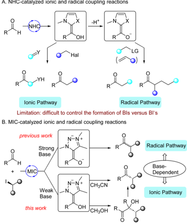
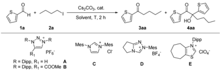
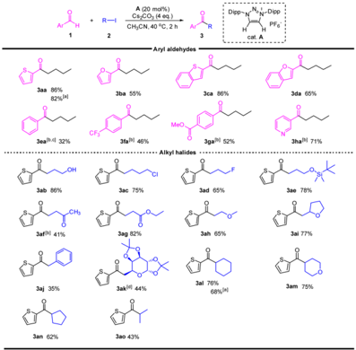
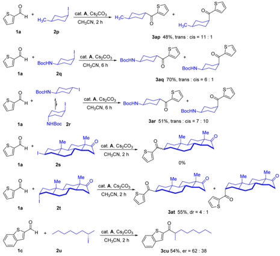
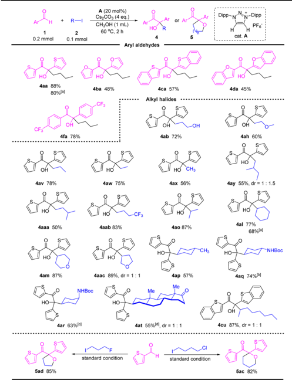
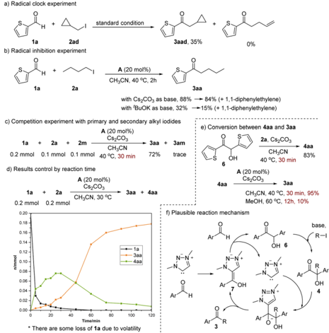
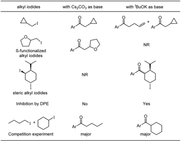
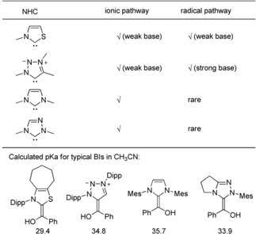

Open Access /

A. NHC-catalyzed ionic and radical coupling reactions

BY-NO

cC)

## Chemical Science

## EDGE ARTICLE

lonic Pathway

Radical Pathway

Limitation: difficult to control the formation of BIs versus BI's previous work

Cite this: Chem. Sci. , 2025, 16 , 9163

All publication charges for this article have been paid for by the Royal Society of Chemistry R MIC

Base this work

OH

CHзОH

Received 5th December 2024 Accepted 23rd April 2025

DOI: 10.1039/d4sc08229j

rsc.li/chemical-science

## Introduction

Over the past decades, N-heterocyclic carbene (NHC) organocatalysis 1 has witnessed tremendous advancement primarily involving the umpolung of aldehydes through the formation of nucleophilic Breslow intermediates (BIs). 2 A large number of organocatalytic reactions have been developed based on the nucleophilic addition of BIs to C(sp 2 )-type electrophiles, such as carbonyl compounds, 3 conjugated enones, 4 imines, 5 etc. This approach has also been extended to nucleophilic substitutions of BIs with some C(sp 3 )-type electrophiles, 6 such as benzyl halides, 7 allyl halides, 8 and even unactivated organic halides. 9 In addition to the ionic pathway, NHC-catalyzed radical reactions have also recently been developed. 10 These reactions involve SET between deprotonated Breslow intermediates (BI -s, also called Breslow enolates) with single-electron oxidants, such as redox-active esters, 11 pyridinium salts, 12 oxime esters, 13 and activated alkyl halides. 14 This process leads to the formation of NHC-derived ketyl radicals and alkyl radicals which then couple to give ketones (Fig. 1A). In short, ionic pathway involves BIs as intermediates, while radical pathway involves BI -s as intermediates. 15 This suggested that it could be possible to switch the

a Key Laboratory of Advanced Light Conversion Materials and Biophotonics, School of Chemistry and Life Resources, Renmin University of China, Beijing, 100872, China. E-mail: yanxy@ruc.edu.cn

b Department of Chemistry and Biochemistry, UCSD-CNR Joint Research Laboratory (IRL3555), University of California, San Diego, La Jolla, CA 92093-0358, USA. E-mail: gbertrand@ucsd.edu

† Electronic supplementary information (ESI) available. See DOI: https://doi.org/10.1039/d4sc08229j

‡ These authors contributed equally.

OH

View Article Onlie View Journal | View Issue

## Switching mesoionic carbene-organocatalysis from radical to ionic pathway through base-controlled formation of Breslow intermediates versus Breslow enolates †

Jie Jiao, ‡ a Zengyu Zhang, ‡ a Guangyin Lu, a Shiqing Huang, a Yajing Bian, a Fan Gao, a Guy Bertrand * b and Xiaoyu Yan * a

N-heterocyclic carbene (NHC) organocatalysis has experienced signi fi cant advancements. Two distinct reaction pathways have been developed, ionic and radical, through Breslow intermediates (BIs) and Breslow enolates (BI -s), respectively. The ability to selectively generate these intermediates is crucial for optimizing reaction outcomes. In this paper we show that with mesoionic carbenes (MICs) it is possible to control the formation of BIs versus BI -s, through the use of weak bases and strong bases, respectively. Of particular interest is the coupling of aldehydes and alkyl halides to yield ketones via an ionic pathway.

reaction mechanism and therefore the nature of the products by controlling the intermediate involved in the reaction. However, for the catalysts frequently involved in these reactions, i.e. thiazol-2-ylidenes, 16 it's still di ffi cult to control the formation of BIs versus BI -s. Indeed, with these carbenes, both ionic and radical pathway 1,2 are feasible with weak bases 17 such as amines or carbonates, which revealed that either BIs or BI -s are formed under these reaction conditions.

Fig. 1 NHC- and MIC-catalyzed ionic and radical coupling reactions.

On the other hand, we have recently shown that besides classical NHCs, another type of persistent carbene, namely mesoionic carbenes (MICs), 18 can be successfully used in organocatalysis via radical pathway. 19 BI -s derived from MICs, are more reducing than classical NHCs, and served as super electron donors (SEDs), 20 enabling the single-electron reduction of unactivated aryl and alkyl halides. 19 a , b The radical coupling reaction of aldehydes and alkyl halides has also been achieved with MIC catalysts. Importantly, in the case of MICs, and in contrast to classical NHCs, it is possible to choose to generate BIs versus BI -s. Indeed, the formation of MIC-derived BI -s required a strong base (typically t BuOK), whereas the deprotonation of MIC precursors giving BIs is possible with a weak base ( e.g. Cs2CO3). 21 Herein, we report that the coupling reaction of aldehydes and alkyl halides, with Cs2CO3 as a base, giving ketones via the ionic pathway as shown by the stereochemistry of the reaction (Fig. 1B). The coupling reaction has a broad functional group tolerance, especially for strong-base sensitive b -functionalized alkyl halides. Mechanistic investigations reveal that the reaction involves a tandem benzoin condensation, a -alkylation, retro-benzoin condensation sequence, where a -alkylated benzoin serves as key intermediate. We also found that the retro-benzoin condensation can be inhibited in MeOH, thus, a -alkylated benzoins can be selectively formed in MeOH. Comparison of the ionic pathway with a weak base and the radical pathway with a strong base, demonstrates the ability to control the formation of BIs versus BI -s through the choice of the base.

Table 1 Optimization of reaction conditions a

| Entry   | Cat.   | Solvent   | Amount of base   |   T (°C) | Yield b of 3aa (%)   | Yield b of 4aa (%)   |
|---------|--------|-----------|------------------|----------|----------------------|----------------------|
| 1       | A      | CH 3 CN   | 2 equiv.         |       60 | 14                   | 25                   |
| 2       | A      | CH 3 CN   | 4 equiv.         |       60 | 41                   | 33                   |
| 3       | A      | CH 3 CN   | 4 equiv.         |       40 | 85                   | Trace                |
| 4       | A      | CH 3 CN   | 4 equiv.         |       25 | 75                   | 15                   |
| 5 c     | A      | CH 3 CN   | 4 equiv.         |       40 | 88(86)               | Trace                |
| 6 c     | A      | 0 PrOH    | 4 equiv.         |       40 | 68                   | 10                   |
| 7 c     | A      | DMSO      | 4 equiv.         |       40 | 79                   | 8                    |
| 8 c     | A      | Dioxane   | 4 equiv.         |       40 | 22                   | Trace                |
| 9 c     | A      | THF       | 4 equiv.         |       40 | 35                   | 6                    |
| 10 c    | A      | MTBE      | 4 equiv.         |       40 | 8                    | Trace                |
| 11 c    | B      | CH 3 CN   | 4 equiv.         |       40 | 60                   | 10                   |
| 12 c    | C      | CH 3 CN   | 4 equiv.         |       40 | 10                   | 31                   |
| 13 c    | D      | CH 3 CN   | 4 equiv.         |       40 | 62                   | 10                   |
| 14 c    | E      | CH 3 CN   | 4 equiv.         |       40 | 6                    | n.d.                 |
| 15 d    | A      | DMSO      | 4 equiv.         |       60 | 85(82)               | Trace                |
| 16      | A      | CH 3 OH   | 4 equiv.         |       60 | 10                   | 89(88)               |

## Results and discussion

In our previous work, we showed that the deprotonation of MIC conjugate acid can be done with Cs2CO3. 21 We  rstly tested the coupling reaction of thiophene-2-carbaldehyde 1a and n butyl iodide 2a in CH3CN with Cs2CO3 as a base. Interestingly, beside formation of the coupling product 3aa , a -alkylated benzoin derivative 4aa was formed. Optimizations revealed that the reaction works well with 4 equivalents of base at 40 °C (Table 1, entries 2 -4). Similar yield was obtained by using a stoichiometric amount of aldehyde and alkyl iodide (entry 5). The reaction also worked well in isopropanol and DMSO, but showed less e ffi ciency in less polar solvents (entries 6 -10). Ester substituted triazolium B , which was frequently used as catalyst in our previously reported radical MIC-organocatalysis, gave a lower yield (60%) (entry 11). A lower yield was also obtained with 1,2,4-triazolium D , and other NHC precursors were even less e ffi cient (entries 12 -14). Base screening revealed Cs2CO3 was the best choice (see ESI † ). Using n butyl bromide instead of n butyl iodide a ff orded the ketone in 85% yield in DMSO as solvent (entry 15). Moreover, the selectivity was reversed in methanol, and the a -alkylated benzoin derivative 4aa was formed in 89% yield with a minor amount of 3aa .

With the optimized reaction conditions in hand, the scope of the reaction was investigated (Table 2). A series of arylaldehydes were tested,  ve-membered hetero-aryl aldehydes gave the desired ketones in 55 -86%. For six-membered aryl aldehydes, the electron-de  cient substrates a ff orded the desired products

Open Access /

BY-NO

cC)

2q

BocHN

3ab 86%

NHBoc 2r

3aj 35%

3an 62%

2t

2u

Dipp-N

NoN-Dipp

PF6

H3С-

3ap 48%, trans : cis = 11 : 1

A (20 mol%)

Cs¿CO, (4 eq.)

Aryl aldehydes

Table 2 Scope of the coupling reaction of aldehydes and alkyl halides

Заа 86%

BocHN

CH CN, 6 h

82% (л)

3ba 55%

3са 86%

3da 65%

BocHN-

in moderate yields, while electron-rich substrates were unreactive. This is likely due to the fact that electron-rich aldehydes reacted with MICs much slowly and thus the competitive alkylation of MICs led to catalyst decomposition. 22

The scope of alkyl halides was then investigated. A number of primary alkyl halides bearing di ff erent functional groups were employed for this reaction, and the desire ketones were obtained in moderated to high yields. It should be noted that the reaction proceeded well with b -functionalized alkyl halides (products 3af -3ai ), which are unstable under strong base conditions. The reaction was also viable for benzyl iodide, a ff ording ketone 3aj in 35% yield. The high functional group tolerance of this reaction encouraged us to investigate the acylation of sugar moiety. Reaction of 6-iodo-glucose with thiophene-2-carbaldehyde a ff orded the 6-acylated glucose in 44% yield. The reaction of secondary alkyl halides also worked well, and the desired ketones were obtained in 43 -76% yields.

To further investigate the mechanism of the process, some complex secondary alkyl iodides were investigated as shown in Fig. 2. Reaction of thiophene-2-carbaldehyde 1a with cis -1-iodo4-methylcyclohexane 2p gave ketone 3ap with 11 : 1 trans / cis . Reaction of 1a with 2q with cis con  guration also gave the product 3aq with mainly trans con  guration. Interestingly, Reaction of 1a with 2r with trans con  guration gave a mixture of trans and cis in 7 : 10 ratio. The partial loss of stereoselectivity is mainly due to slow epimerization under basic condition. 9,24 For 3-iodo-epiandrosterone, only the (3 a ) isomer 2t gave the ketone product, while no reaction occurred with (3 b ) isomer 2s . The reaction also worked for acyclic alkyl iodide, although the stereoselectivity was low. In addition, no reaction occurred with bulky alkyl iodides, such as menthyl iodide.

R—|

Fig. 2 Reaction of aldehydes with complex secondary alkyl iodides.

The reaction of aldehydes with alkyl iodides in MeOH was also investigated as shown in Table 3. A number of a -alkylated benzoin derivatives can be obtained with di ff erent aldehydes and alkyl iodides. Stereo-inversion was observed which revealed that the reaction occurred via an SN2 pathway. When 1, n -dihalide 2c and 2d were used, cyclic ether products 5c and 5d were obtained in high yields. It should be noted that, under similar reaction conditions, but with classical NHC D as catalyst, only ketones were formed and a -alkylated benzoin derivatives 4 and 5 were not detected.

Our previous work involving MIC-catalyzed coupling of aldehydes and alkyl halides with strong bases supported a radical pathway. For comparison, radical clock and radical trapping experiments were conducted to check whether the reaction proceeded through radical pathway. When (iodomethyl)cyclopropane was employed, only 3aad was obtained, and the ring-open product was not detected (Fig. 3a). The reaction with Cs2CO3 was not a ff ected with radical trapping reagents such as 1,1-diphenylethylene (DPE), while DPE inhibited the reaction with t BuOK (Fig. 3b). We also performed competition experiments between primary and secondary alkyl iodides, and the former reacted much faster than the latter (Fig. 3c). All of these experiments were di ff erent than those of our previous results 19 b (radical pathway), and similar as Li's results 9 (ionic pathway). Thus, we can conclude that MICcatalyzed coupling of aldehydes and alkyl halides proceeded through radical pathway with a strong base and ionic pathway with a weak base. To further understand the reaction pathway, we performed the reaction at lower temperature (30 °C) and tracked the formation of products (Fig. 3d). In 30 min, most of the aldehydes were consumed, and a -alkylated benzoin derivative 4aa was formed as the major product. Then 4aa decreased with 3aa increasing. This experiment showed that the aldehyde was  rst converted to 4aa , which was then converted to 3aa . To con  rm this hypothesis, treatment of benzoin derivative 6 with

Open Access /

a) Radical clock experiment alkyl iodides

R-

BY-NO

1a

2ad

0.2 mmol

0.1 mmol b) Radical inhibition experiment

0%

Cs,CO: (4 eq.)

A (20 mol%)

with 'BuOK as base or Ar

3aad, 35%

Aryl aldehydes

Table 3 Scope of the coupling reaction of aldehydes and alkyl halides

cC)

ß-functionalized alkyl iodides

1a

CF3

Inhibition by DPE

1a

4av 78%

4aaa 50%

4am 87%

5ad 85%

2a resulted the formation of 4aa . Then, 4aa can be converted to 3aa quantitively in the presence of MIC catalyst via retrobenzoin condensation in CH3CN, while the reaction was pretty slow in MeOH (Fig. 3e), which is in consistence with the reaction results in MeOH. On the basis of the above results, a plausible mechanism is proposed (Fig. 3f). First, MIC reacts with aldehyde giving the Breslow intermediate 7 , which then attacks another molecule of aldehyde via nucleophilic addition to yield benzoin derivative 6 with releasing of MIC. Alkylation of 6 in basic conditions gives a -alkylated benzoin derivative 4 . MIC-catalyzed retro-benzoin condensation of 4 gives ketone product and Breslow intermediate 7 .

To make a detail comparison of MIC-catalyzed coupling reactions of aldehydes and alkyl iodides with weak and strong bases, we listed the di ff erent experimental results in Fig. 4. Reaction of aldehydes with (iodomethyl)cyclopropane in the presence of Cs2CO3 gave cyclopropylmethyl ketones, while it gave mixture along with ring-open products in the presence of t BuOK. For b -functionalized alkyl iodides (take 2-(iodomethyl) tetrahydrofuran as an example), the reactions only proceeded with Cs2CO3 as a base. In the other hand, for alkyl iodides with with Cs¿CO, as base

Dipp-N-N-N-Dipp

PF6

cat. A

Fig. 3 Mechanism study.

Fig. 4 Comparison of MIC catalyzed coupling reactions with Cs2CO3 and t BuOK.

steric hindrance (take menthyl iodide as an example), the reaction only worked with t BuOK as a base. Radical inhibition experiments with DPE revealed that the reaction was only inhibited with t BuOK as a base. Competition experiments between primary and secondary alkyl iodides also gave di ff erent results. These reactions demonstrated that MIC-catalyzed coupling reactions proceeded via ionic pathway with a weak base and radical pathway with a strong base. These two distinct reaction pathways can be further tracked back to di ff erent intermediate involved, i.e. BIs for the former and BI -s for the latter, respectively.

To gain a further understanding of the base-controlled formation of BIs versus BI -s, we conducted density functional theory (DFT) investigations at the DLPNO-CCSD(T)/cc-pVTZ// M06-2X/6-31+G ** level of theory, employing four di ff erent types of NHC-derived Bis (Fig. 5). Thiazol-2-ylidene-derived BI has

Open Access /

BY-NO

cC)

NHC

S

HOT

Ph

29.4

Dipp-N.

HOT

radical pathway

V (weak base)

|             | V (strong base)   |
|-------------|-------------------|
| Mes-N N-Mes | N-Mes             |

Ph

34.8

Fig. 5 NHC-catalyzed coupling reaction of aldehydes and the calculated p K a of BIs.

a calculated p K a of 29.4, while the MIC-derived BI has a calculated p K a of 34.8. The di ff erence of p K a revealed that, thiazol-2ylidene-derived BIs could be deprotonated by a weak base, while MIC-derived BI can only be deprotonated by a strong base. We also calculated the D G for the deprotonation process of MICderived BI using either a weak base (Me3N and DBU as examples) or strong base ( t BuOK). This process is endergonic for weak bases ( D G = +26.5 and +20.0 kcal mol -1 ) and exergonic with strong bases ( D G = -31.3 kcal mol -1 ). This is in consistence with the experiment results that DBU works for ionic reaction (H/D exchange reaction) 18 c and does not work for radical reactions. 19 In addition, imidazolylidene and 1,2,4triazol-2-ylidene-derived BIs have p K a values of 35.7 and 33.9. Indeed, imidazolylidenes and 1,2,4-triazol-2-ylidenes were rarely employed in radical coupling reaction of aldehydes, probably due to the instability or bulkiness of their BI -s. 25

## Conclusion

NHC-based organocatalysis usually involves dual pathways -ionic and radical -highlighting the challenges associated with controlling the formation of BIs and deprotonated Breslow intermediates (BI -s). The ability to selectively generate these intermediates is crucial for optimizing reaction outcomes. This work presents a novel approach to control the formation of BIs versus BI -s through basicity-tuning, enabling the coupling of aldehydes and alkyl halides to yield ketones via two distinct reaction pathways. Of particular interest is the coupling of aldehydes and alkyl halides to yield ketones via an ionic pathway through the use of weak bases. The reaction shows broad functional group tolerance and can be used for the acylation of sugar moieties. Mechanistic investigations reveal a tandem benzoin condensation, a -alkylation, and retrobenzoin condensation sequence, where a -alkylated benzoin serves as a key intermediate. It should be noted that the mechanism was di ff erent with previous reported ionic coupling reactions of aldehdyes with alkyl halides, in which nucleophilic substitutions of BIs with electrophiles were proposed. This work showcases the potential of MIC catalysis in synthetic organic chemistry, paving the way for the development of new ionic pathway

Dipp methodologies and applications. The ability to selectively form BIs versus BI -s through basicity tuning represents a signi  cant advancement in NHC catalysis, opening up new possibilities for the umpolung of aldehydes and the synthesis of valuable organic compounds. Further studies on the organocatalysis by MICs are under current investigation.

## Data availability

The data supporting this article have been included as part of the ESI. †

## Author contributions

J. J., Z. Z., G. L. and F. G. developed the reaction and conducted the experiments. S. H. and Y. B. conducted DFT calculations. G. B. and X. Y. analysed the data and wrote the paper. G. B. and X. Y. directed the project.

## Confl icts of interest

There are no con  icts to declare.

## Acknowledgements

This work was supported by the National Natural Science Foundation of China (22171284, 22471288), the NSF (CHE2153475), and the Public Computing Cloud Platform, Renmin University of China.

## Notes and references

- 1 ( a ) A. T. Biju, N-Heterocyclic Carbenes in Organocatalysis , Wiley-VCH, Weinheim, 2019; ( b ) D. Enders, O. Niemeier and A. Henseler, Chem. Rev. , 2007, 107 , 5606 -5655; ( c ) V. Nair, R. S. Menon, A. T. Biju, C. R. Sinu, R. R. Paul, A. Jose and V. Sreekumar, Chem. Soc. Rev. , 2011, 40 , 5336 -5346; ( d ) S. J. Ryan, L. Candish and D. W. Lupton, Chem. Soc. Rev. , 2013, 42 , 4906 -4917; ( e ) M. N. Hopkinson, C. Richter, M. Schedler and F. Glorius, Nature , 2014, 510 , 485 -496; ( f ) D. M. Flanigan, F. Romanov-Michailidis, N. A. White and T. Rovis, Chem. Rev. , 2015, 115 , 9307 -9387; ( g ) M. Pareek, Y. Reddi and R. B. Sunoj, Chem. Sci. , 2021, 12 , 7973 -7992; ( h ) P. Bellotti, M. Koy, M. N. Hopkinson and F. Glorius, Nat. Rev. Chem , 2021, 5 , 711 -725.
- 2 ( a ) R. Breslow, J. Am. Chem. Soc. , 1958, 80 , 3719 -3726; ( b ) A. Berkessel, S. Elfert, K. Etzenbach-E ff ers and J. H. Teles, Angew. Chem., Int. Ed. , 2010, 49 , 7120 -7124; ( c ) A. Berkessel, V. R. Yatham, S. Elfert and J. M. Neudör  , Angew. Chem., Int. Ed. , 2013, 52 , 11158 -11162; ( d ) M. Paul, J. M. Neudör  and A. Berkessel, Angew. Chem., Int. Ed. , 2019, 58 , 10596 -10600; ( e ) A. Wessels, M. Klussmann, M. Breugst, N. E. Schlörer and A. Berkessel, Angew. Chem., Int. Ed. , 2022, 61 , e202117682.
- 3 ( a ) Y. Hachisu, J. W. Bode and K. Suzuki, J. Am. Chem. Soc. , 2003, 125 , 8432 -8433; ( b ) T. Ema, Y. Oue, K. Akihara,

- Y. Miyazaki and T. Sakai, Org. Lett. , 2009, 11 , 4866 -4869; ( c ) M.-Q. Jia and S.-L. You, ACS Catal. , 2013, 3 , 622 -624.
2. 4 J. Read de Alaniz and T. Rovis, Synlett , 2009, 8 , 1189 -1207.
3. 5 ( a ) J. A. Murry, D. E. Frantz, A. Soheili, R. Tillyer, E. J. J. Grabowski and P. J. Reider, J. Am. Chem. Soc. , 2001, 123 , 9696 -9697; ( b ) G.-Q. Li, L.-X. Dai and S.-L. You, Chem. Commun. , 2007, 852 -854; ( c ) L.-H. Sun, Z.-Q. Liang, W.-Q. Jia and S. Ye, Angew. Chem., Int. Ed. , 2013, 52 , 5803 -5806; ( d ) D. A. DiRocco and T. Rovis, Angew. Chem., Int. Ed. , 2012, 51 , 5904 -5906.
4. 6 ( a ) F. Gao, Z. Zhang and X. Yan, ChemCatChem , 2024, 16 , e202301331; ( b ) Z.-Z. Zhang, R. Zeng, Y.-Q. Liu and J.-L. Li, ChemCatChem , 2024, 16 , e202400063.
5. 7 M. Padmanaban, A. T. Biju and F. Glorius, Org. Lett. , 2011, 13 , 98 -101.
6. 8 M. Zhao, H. Yang, M.-M. Li, J. Chen and L. Zhou, Org. Lett. , 2014, 16 , 2904 -2907.
7. 9 Q.-Z. Li, R. Zeng, P.-S. Xu, X.-H. Jin, C. Xie, Q.-C. Yang, X. Zhang and J.-L. Li, Angew. Chem., Int. Ed. , 2023, 62 , e202309572.
8. 10 ( a ) S. W. Ragsdale, Chem. Rev. , 2003, 103 , 2333 -2346; ( b ) A. V. Bay and K. A. Scheidt, Trends Chem. , 2022, 4 , 277 -290; ( c ) T. Ishii, K. Nagao and H. Ohmiya, Chem. Sci. , 2020, 11 , 5630 -5636; ( d ) X. Chen, H. Wang, Z. Jin and Y. R. Chi, Chin. J. Chem. , 2020, 38 , 1167 -1202; ( e ) L. Dai and S. Ye, Chin. Chem. Lett. , 2021, 32 , 660 -667; ( f ) K. Q. Chen, H. Sheng, Q. Liu, P. L. Shao and X. Y. Chen, Sci. China Chem. , 2021, 64 , 7 -16; ( g ) K. Liu, M. Schwenzer and A. Studer, ACS Catal. , 2022, 12 , 11984 -11999.
9. 11 ( a ) T. Ishii, Y. Kakeno, K. Nagao and H. Ohmiya, J. Am. Chem. Soc. , 2019, 141 , 3854 -3858; ( b ) T. Ishii, K. Ota, K. Nagao and H. Ohmiya, J. Am. Chem. Soc. , 2019, 141 , 14073 -14077; ( c ) Y. Kakeno, M. Kusakabe, K. Nagao and H. Ohmiya, ACS Catal. , 2020, 10 , 8524 -8529.
10. 12 I. Kim, H. Im, H. Lee and S. Hong, Chem. Sci. , 2020, 11 , 3192 -3197.
11. 13 ( a ) Y. Gao, Y. Quan, Z. Li, L. Gao, Z. Zhang, X. Zou, R. Yan, Y. Qu and K. Guo, Org. Lett. , 2020, 23 , 183 -189; ( b ) L. Chen, S. Jin, J. Gao, T. Liu, Y. Shao, J. Feng, K. Wang, T. Lu and D. Du, Org. Lett. , 2020, 23 , 394 -399; ( c ) S. Jin, X. Sui, G. C. Haug, V. D. Nguyen, H. T. Dang, H. D. Arman and O. V. Larionov, ACS Catal. , 2021, 12 , 285 -294.
12. 14 J.-L. Li, Y.-Q. Liu, W.-L. Zou, R. Zeng, X. Zhang, Y. Liu, B. Han, Y. He, H. J. Leng and Q. Z. Li, Angew. Chem., Int. Ed. , 2020, 59 , 1863 -1870.
13. 15 V. Regnier, E. A. Romero, F. Molton, R. Jazzar, G. Bertrand and D. Martin, J. Am. Chem. Soc. , 2019, 141 , 1109 -1117.
14. 16 A. J. Arduengo, J. R. Goerlich and W. J. Marshall, Liebigs Ann.Recl. , 1997, 365 -374.
15. 17 The basic strength (strong or weak) is relative. In this manuscipt, weak bases refered to bases such as carbonates and amines, while strong bases refered to alkoxides.
16. 18 ( a ) G. Guisado-Barrios, M. Soleilhavoup and G. Bertrand, Acc. Chem. Res. , 2018, 51 , 3236 -3244; ( b ) G. Guisado-Barrios, J. Bou ff ard, B. Donnadieu and G. Bertrand, Angew. Chem., Int. Ed. , 2010, 49 , 4759 -4762; ( c ) W. Liu, L.-L. Zhao, M. Melaimi, L. Cao, X. Xu, J. Bou ff ard, G. Bertrand and X. Yan, Chem , 2019, 5 , 2484 -2494.
17. 19 ( a ) W. Liu, A. Vianna, Z. Zhang, S. Huang, L. Huang, M. Melaimi, G. Bertrand and X. Yan, Chem Catal. , 2021, 1 , 196 -206; ( b ) C. Liu, Z. Zhang, L.-L. Zhao, G. Bertrand and X. Yan, Angew. Chem., Int. Ed. , 2023, 62 , e202303478; ( c ) Z. Zhang, S. Huang, C.-Y. Li, L.-L. Zhao, W. Liu, M. Melaimi, G. Bertrand and X. Yan, Chem Catal. , 2022, 2 , 3517 -3527; ( d ) F. Su, F. Lu, K. Tang, X. Lv, Z. Luo, F. Che, H. Long, X. Wu and Y. R. Chi, Angew. Chem., Int. Ed. , 2023, 62 , e202310072; ( e ) B. Huang, Z. Zhang, J. Jiao, W. Liu and X. Yan, Org. Lett. , 2024, 26 , 7419 -7424; ( f ) T. Wang, Z. Zhang, F. Gao and X. Yan, Org. Lett. , 2024, 26 , 6915 -6920.
18. 20 ( a ) J. Broggi, T. Terme and P. Vanelle, Angew. Chem., Int. Ed. , 2014, 53 , 384 -413; ( b ) J. A. Murphy, J. Org. Chem. , 2014, 79 , 3731 -3746.
19. 21 M. Abdellaoui, K. Oppel, A. Vianna, M. Soleilhavoup, X. Yan, M. Melaimi and G. Bertrand, J. Am. Chem. Soc. , 2024, 146 , 2933 -2938.
20. 22 C. E. I. Knappke, A. J. Arduengo, H. Jiao, J.-M. Neudör  and A. J. von Wangelin, Synthesis , 2011, 23 , 3784 -3795.
21. 23 The absolute con  guration of the chiral centers of 3ak have been assigned based on the reasonable assumption that they inherit from glucose.
22. 24 The epimerization of 3as under basic condition was given in ESI †
23. 25 ( a ) L. Delfau, S. Nichilo, F. Molton, J. Broggi, E. Tom´ asMendivil and D. Martin, Angew. Chem., Int. Ed. , 2021, 60 , 26783 -26789; ( b ) N. Assani, L. Delfau, P. Smits, S. Redon, Y. Kabri, E. Tom´ as-Mendivil, P. Vanelle and D. Martin, Chem. Sci. , 2024, 15 , 14699 -14704.