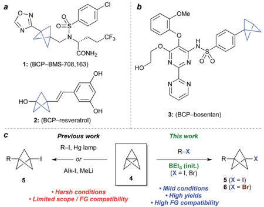
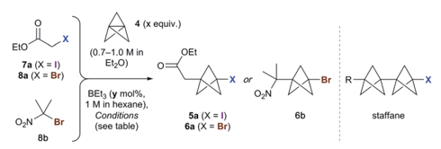
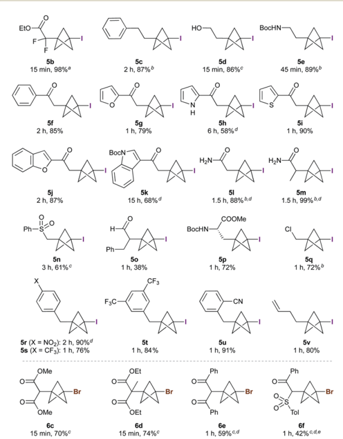
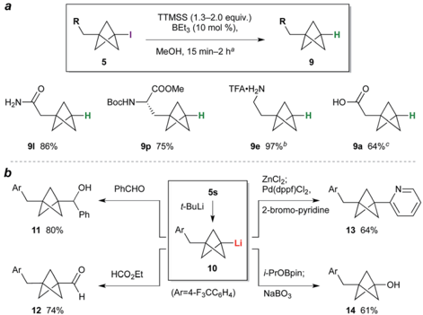
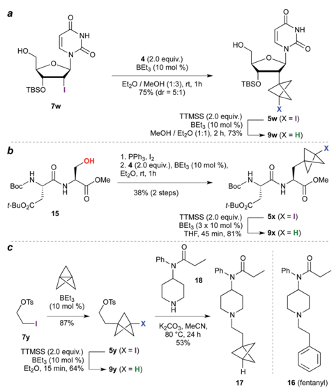
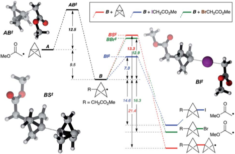

James

İD

on i

\ *₴

CCI.

Open Access /

cC)

HO

b

OMe

## EDGE ARTICLE

Previous work

R-I, Hg lamp

This work

R-X

Alk-I, MeLi

Cite this: Chem. Sci. , 2018, 9 , 5295

## Synthesis and applications of highly functionalized 1-halo-3-substituted bicyclo[1.1.1]pentanes †

· Limited scope / FG compatibility

Received 23rd March 2018 Accepted 20th May 2018

DOI: 10.1039/c8sc01355a

rsc.li/chemical-science

## Introduction

Bioisosteres are important motifs in drug design, 1 enabling the expansion of chemical and intellectual property space 2 while also improving biological pro  les relative to the parent functionality. Bicyclo[1.1.1]pentanes (BCPs) have shown particularly impressive results in this  eld as surrogates for 1,4-disubstituted arenes, tert -butyl, and alkyne groups, imparting desirable properties such as membrane permeability, solubility and metabolic stability. 3,4 Examples include BCP analogues of the g -secretase inhibitor BMS-708, 163 ( 1 , Fig. 1a) 5 and resveratrol ( 2 ), 6 in which the BCP serves as a bioisostere for a p -substituted arene due to its comparable positioning of substituents; and of the pulmonary arterial hypertension agent bosentan ( 3 , Fig. 1b), where a monosubstituted BCP replaces a tert -butyl group. 7,8 Despite these favourable attributes, access to carbon-substituted BCPs remains a challenge. Their synthesis typically relies on multistep sequences from a small number of available precursors, 9 or requires relatively harsh conditions, 10 necessitating early-stage introduction of the BCP and limiting functional group tolerance.

The BCP system is most commonly accessed through ' strain release ' 11 reactions of tricyclo[1.1.1.0 1,3 ]pentane 4 (TCP), 12 where in addition to classical approaches, 3,13 recent work has

a Chemistry Research Laboratory, 12 Mans  eld Road, Oxford, OX1 3TA, UK. E-mail: edward.anderson@chem.ox.ac.uk

b P  zer Worldwide Research and Development, Eastern Point Road, Groton, CT 06340, USA

c P  zer Worldwide Research and Development, 600 Main Street, Cambridge, MA 02139, USA

† Electronic supplementary information (ESI) available. CCDC 1825056 -1825060. For ESI and crystallographic data in CIF or other electronic format see DOI: 10.1039/c8sc01355a

· High yields

Dimitri F. J. Caputo, a Carlos Arroniz, a Alexander B. D ¨ urr, a James J. Mousseau, b Antonia F. Stepan, c Steven J. Mans fi eld a and Edward A. Anderson * a

Bicyclo[1.1.1]pentanes (BCPs) are important bioisosteres of 1,4-disubstituted arenes, tert -butyl and acetylenic groups that can impart physicochemical bene fi ts on drug candidates. Here we describe the synthesis of BCPs bearing carbon and halogen substituents under exceptionally mild reaction conditions, via triethylborane-initiated atom-transfer radical addition ring-opening of tricyclo[1.1.1.0 1,3 ]pentane (TCP) with alkyl halides. This chemistry displays broad substrate scope and functional group tolerance, enabling application to BCP analogues of biologically-relevant targets such as peptides, nucleosides, and pharmaceuticals. The BCP halide products can be converted to the parent phenyl/ tert -butyl surrogates through triethylborane-promoted dehalogenation, or to other derivatives including carbonyls, alcohols, and heterocycles.

seen the development of elegant methods for the synthesis of heteroatom-substituted BCPs. 11,14 The insertion of TCP into C -X bonds would o ff er an appealing entry to carbon-substituted BCPs, as well as the opportunity for further functionalization of the halide product ( 5 , Fig. 1c). 15 To date however, this process has only been achieved using highly activated reagents ( e.g. CF3I), 13 or by mercury lamp irradiation of an alkyl or aryl halide, 10 d , e or methyllithium-promoted alkyl halide addition. 10 b Despite the importance of these contributions, all display limitations in substrate scope, functional group compatibility, or scalability, due to the constraints of the reaction conditions.

Atom transfer radical addition (ATRA) reactions using chemical initiators are an attractive alternative for TCP ring

Fig. 1 (a) Bicyclo[1.1.1]pentanes (BCPs) as 1,4-disubstituted arene bioisosteres. (b) BCP as a tert -butyl bioisostere. (c) Approaches to 1halo-3-substituted BCPs in previous and current work.

View Article Online View Journal  | View Issue

Open Access /

EtO

EtO

7a (X = I)

5b

8а (X = Br)

cC)

O½N

Br

5f

5j

OMe

OMe

6c

8b

Et¿O)

4 (x equiv.)

5c

5d

5e opening, but previously required a large excess of the radical precursor, or su ff ered from the formation of oligomeric ' staffane ' byproducts due to multiple insertions into TCP. 10 d ,13 Building on our studies of radical-mediated nucleoside alkynylation, 16 we questioned whether triethylborane could serve as an e ff ective initiator 17 for the synthesis of 1-halo-3-substituted bicyclopentanes (Fig. 1c). Here we report the development of this method as an e ffi cient and highly functional group tolerant route to halogenated BCPs, the utility of which are illustrated through various derivatizations. Importantly, the mild conditions of this chemistry allow the synthesis of bicyclopentanes that could not be accessed using other methods, and open up opportunities for the late-stage functionalization of more complex molecules. Phi

FzC

·CN

## Results and discussion

1 h, 84%

1 h, 91%

5v

1 h, 80%

We began our studies using ethyl iodoacetate 7a , and were delighted to observe complete reaction in just 15 min at room temperature using 1.3 equivalents of TCP and 10 mol% triethylborane (1 M in hexane), with the product iodide 5a isolated in 83% yield (Table 1, entry 1). A mild exotherm was observed on addition of triethylborane to the reaction, which could be avoided by reducing the temperature (entry 2). The amount of initiator could be decreased to 1 mol% without detriment (entries 2 -5), and the quantity of TCP could also be lowered (to

Table 1 Optimization of triethylborane-promoted tricyclopentane ring-opening

|   Entry | Substrate   |   x (equiv.) |   y (mol%) | T   | t      | Yield a (%)   |
|---------|-------------|--------------|------------|-----|--------|---------------|
|       1 | 7a          |          1.3 |         10 | rt  | 15 min | 83            |
|       2 | 7a          |          1.3 |         10 | 0  C     | 15 min | 87            |
|       3 | 7a          |          1.3 |          5 | 0  C     | 15 min | 89            |
|       4 | 7a          |          1.3 |          1 | 0  C     | 15 min | 95            |
|       5 | 7a          |          1.3 |        0.5 | 0  C     | 15 min | (67 : 33)     |
|       6 | 7a          |          1.1 |          1 | 0  C     | 15 min | 92            |
|       7 | 7a          |          2.0 |         10 | rt  | 16 h   | 98 b          |
|       8 | 7a          |          2.0 |          0 | rt  | 20 h   | (60 : 40) c   |
|       9 | 7a          |          2.0 |          0 | rt  | 20 h   | (33 : 67)     |
|      10 | 8a          |          1.3 |         10 | rt  | 20 h   | 47 d          |
|      11 | 8b          |          1.3 |         10 | rt  | 15 min | 67            |
|      12 | 8b          |          1.3 |         10 | 0  C     | 15 min | 73            |
|      13 | 8b          |          1.3 |          1 | 0  C     | 15 min | (60 : 40)     |

|

HO-

BocHN-

1.1 equiv.), a ff ording 5a in 92% yield (entry 6). Successful reaction was similarly observed using TCP as a solution in dibutyl ether (0.19 M), which is signi  cant for industrial applications (entry 7). The presence of triethylborane proved crucial, as reactions run in its absence failed to reach completion in the dark or light (entries 8 and 9). 18 Importantly, no sta ff ane byproducts were observed under the optimized conditions (entry 6).

Use of the equivalent bromoacetate 8a led to incomplete conversion, or signi  cant sta ff ane formation (entry 10). 19 However, we were pleased to  nd that 2-bromo-2-nitropropane 8b underwent rapid reaction with 1.3 equivalents of TCP to a ff ord 6b in 67% yield (entry 11). 20 As with 7a , full conversion was maintained on cooling the reaction to 0  C (73%, entry 12); however, lowering the quantity of triethylborane resulted in incomplete reaction (entry 13). The success of substrate 8b presumably re  ects a more e ffi cient bromine atom abstraction by the bicyclopentyl radical in the propagation step compared to ester 8a , due to the greater stability of the tertiary nitrosubstituted radical.

The scope of the triethylborane-initiated ATRA was next explored using organohalides featuring a variety of functional groups (Fig. 2). 21 While the optimized conditions (Table 1, entry

Fig. 2 Synthesis of 1-iodoand 1-bromo-3-substituted BCPs. All reactions performed using 2 equiv. tricyclo[1.1.1.0 1,3 ]pentane (TCP) and 10 mol% BEt3 (1 M in hexane) at room temperature, unless indicated otherwise. a 1.1 equiv. TCP, 1 mol% BEt3, 0  C. b 1.3 equiv. TCP, rt. c 1.3 equiv. TCP, 0  C. d Co-solvent added to solubilize the substrate: MeOH for 5m , n ; CH2Cl2 for 5h , k , r and 6e , f . e 5% sta ff ane observed.

Open Access /

a

a

HO

cC)

TBSO

91 86%

b

TTMSS (1.3-2.0 equiv.)

BEt3 (10 mol %),

MeOH, 15 min-2 ha

HO.

6) translated smoothly to ethyl di  uoroiodoacetate, giving bench-stable BCP 5b in 98% yield, 22 incomplete reactions were observed in other cases. To ensure consistency, the substrate screen was therefore conducted using 10 mol% BEt3 and 1.3 -2.0 equivalents of TCP at either 0  C or room temperature, according to the requirements of the substrate. Alkyl iodides showed excellent reactivity, tolerating groups such as hydroxyls and carbamates ( 5c -e ). a -Iodoketones gave high yields across a range of substrates, including heteroaromatics ( 5f -k ). Other electron-withdrawing groups such as amides and sulfones also proved viable ( 5l -5n ), 20 including the sensitive but potentially valuable aldehyde 5o . The formation of 5p is particularly notable due to the potential utility of BCP analogues of amino acids; 23 no racemization was observed in this reaction. Even chloroiodomethane was found to be a suitable substrate, delivering chloromethyl BCP 5q in good yield. Benzyl halides also underwent smooth reaction, providing electronwithdrawing substituents were present on the arene (which presumably accelerates the halide abstraction step from the intermediate BCP radical, 5r -5u ). 20 The involvement of radical intermediates was supported by the use of (iodomethyl)cyclopropane, which exclusively gave the ring-opened product 5v . Finally, other electron-de  cient bromides proved suitable partners, a ff ording products 6c -f in short reaction times; for these substrates, the presence of two electron-withdrawing groups proved essential for e ffi cient bromine atom abstraction. 4 (2.0 equiv.)

While the BCP iodide products are stable towards storage at  20  C (particularly if crystalline), in some cases gradual coloration was observed at ambient temperature. Deiodination was expected to enhance BCP stability, and would simultaneously access the parent phenyl/ tert -butyl bioisostere. We questioned whether triethylborane could again be used as initiator for this C -I bond reduction; pleasingly, the use of 1.3 equivalents of tris(trimethylsilyl)silane (TTMSS) as a non-toxic hydrogen atom source 24 and 10 mol% BEt3 e ff ected smooth deiodination of various BCP iodides (Scheme 1a), giving amide 9l , a BCP analogue of phenylalanine ( 9p ), and tri  uoroacetate salt 9e , the free base of the latter being a BCP equivalent of the monoaminergic neuromodulator phenethylamine. Given the use of the same initiator for both radical processes, a one-pot reaction sequence was also performed in which BCP 9a was prepared directly from 7a in a single operation (64%). Transformation of the iodide into substituents other than hydrogen was also explored (Scheme 1b): lithiation of 5s , 10 b followed by reaction of the resulting organolithium 10 with benzaldehyde or ethyl formate, gave alcohol 11 and aldehyde 12 respectively. Alternatively, transmetalation to the organozinc and crosscoupling with 2-bromopyridine a ff orded pyridyl BCP 13 (64%). 10 a , b Pleasingly, the synthesis of a phenol bioisostere 6 ( 14 ) could also be accomplished by a borylation quench, followed by oxidation with sodium perborate.

The high functional group tolerance and mild reaction conditions suggested that this methodology could be exploited in the functionalization of more complex organic molecules. For example, 2 0 -iodouridine derivative 7w (Scheme 2a) underwent successful ATRA reaction to generate 5w (75%, 5 : 1 dr), with deiodination delivering the 2 0 -deoxy-2 0 -BCP nucleoside 9w

Scheme 1 (a) BCP deiodination. a See the ESI † for experimental conditions for each substrate. b Deiodination product from 5e treated with CF3CO2H (yield over two steps). c Iodide 7a processed through TCP ring opening, deiodination, and hydrolysis (NaOH, MeOH) without puri fi cation. (b) BCP iodide functionalization.

(73%). More generally, the availability of iodides from hydroxyl groups provides a multitude of opportunities for bioisostere installation: Appel reaction of the aspartate -serine dipeptide 15 (Scheme 2b) a ff orded iodide 5x , which on ATRA reaction and subsequent TTMSS reduction generated BCP-functionalized dipeptide 9x . This sequence corresponds to a three step conversion of a serine residue to a potential phenylalanine

Scheme 2 Synthesis of nucleoside, dipeptide, and pharmaceutical BCP analogues.

Open Access /

AB‡

MeO

cC)

AB‡

12.5

B +

BS‡

BBr‡

Fig. 3 Theoretical analysis of the reaction pathway. Calculations carried out at the ROMO62x/def2tzvp level. Relative energies are in kcal mol  1 . See the ESI for details. †

equivalent, and here delivers a BCP analogue of aspartame. Finally, we targeted application of the methodology to the opioid receptor agonist fentanyl ( 16 , Scheme 2c). Synthesis of its BCP analogue 17 was accomplished from iodotosylate 7y where, pleasingly, the primary alkyl tosylate was tolerated in the initial high-yielding TCP ring-opening (87%). TTMSS-mediated reduction of the iodide product 5y a ff orded the useful BCP building block 9y , which underwent alkylation with norfentanyl 18 to a ff ord fentanyl analogue 17 (53%). 20

While the mechanism of this C -X addition reaction likely involves a radical pathway, not least due to the cyclopropane ring fragmentation observed in the formation of 5v (Fig. 2), it is not immediately obvious why reaction propagation via halogen atom abstraction should proceed so e ffi ciently, with avoidance of sta ff ane formation. To explore this, we examined the reaction of a -iodo- and a -bromomethyl acetate with TCP from a theoretical perspective at the ROM062x/def2tzvp level 25 (Fig. 3, in vacuo ). 26 Exergonic addition of the a -carbonyl radical to TCP ( A ) was found to proceed via transition state AB ‡ ( D G ‡ ¼ 12.5 kcal mol  1 ). Reaction of the resultant bicyclopentyl radical B with a -iodo- or a -bromomethyl acetate (iodine/bromine atom transfer, BI ‡ / BBr ‡ ), or with TCP (leading to a sta ff ane radical, BS ‡ ), was computed. Predicted activation barriers of 7.3 and 13.3 kcal mol  1 for iodine atom abstraction and TCP capture respectively suggest that the former productive propagation step is signi  cantly favoured over oligomerization ( DD G ‡ ¼ 6.1 kcal mol  1 ). In contrast, a barrier of 12.9 kcal mol  1 for bromine atom abstraction indeed suggests sta ff ane formation to be competitive ( DD G ‡ ¼ 0.4 kcal mol  1 ), which is consistent with experimental observations (Table 1), and re  ects the in  uence of C -X bond strength in the propagation phase of the reaction.

## Conclusions

In conclusion, we have developed an e ffi cient triethylboranepromoted radical-based method to synthesize 1-halo-3substituted bicyclo[1.1.1]pentanes from readily available

|

B + ICH,CO,Me

B + BrCH,CO¿Me iodide and bromide starting materials. The reaction displays broad substrate scope, and functional group compatibility that is not achievable using other methods, enabling application to the functionalization of complex substrates such as nucleosides, peptides and drug-like molecules. The carbon -halogen bond is easily reduced under similarly mild conditions to reveal the parent bioisostere, or functionalized via methods such as Negishi cross-coupling or oxidation. In addition to o ff ering a new entry to highly-functionalized bicyclopentanes, the C -X bond o ff ers much potential for subsequent transformations; investigations to this end are underway.

## Confl icts of interest

There are no con  icts to declare.

## Acknowledgements

D. F. J. C. and S. J. M. are grateful to the EPSRC Centre for Doctoral Training in Synthesis for Biology and Medicine (EP/ L015838/1) for studentships, generously supported by AstraZeneca, Diamond Light Source, Defence Science and Technology Laboratory, Evotec, GlaxoSmithKline, Janssen, Novartis, P  zer, Syngenta, Takeda, UCB and Vertex. E. A. A. and C. A. thank the EPSRC for funding (EP/M019195/1). A. B. D. thanks the Heinrich Hertz Foundation for a Fellowship. We also thank the University of Oxford Advanced Research Computing (ARC) facility (DOI: 10.5281/zenodo.22558).

## Notes and references

- 1 ( a ) N. A. Meanwell, Chem. Res. Toxicol. , 2016, 29 , 564 -616; ( b ) N. A. Meanwell, J. Med. Chem. , 2011, 54 , 2529 -2591; ( c ) G. A. Patani and E. J. LaVoie, Chem. Rev. , 1996, 96 , 3147 -3176.
- 2 F. Lovering, J. Bikker and C. Humblet, J. Med. Chem. , 2009, 52 , 6752 -6756.
- 3 ( a ) A. M. Dilmaç, E. Spuling, A. de Meijere and S. Br¨ ase, Angew. Chem., Int. Ed. , 2017, 56 , 5684 -5718; ( b ) M. D. Levin, P. Kaszynski and J. Michl, Chem. Rev. , 2000, 100 , 169 -234; ( c ) K. B. Wiberg, Chem. Rev. , 1989, 89 , 975 -983.
- 4 ( a ) For recent examples of other small ring compounds as bioisosteres, see: A. A. Kirichok, I. Shton, M. Kliachyna, I. Pishel and P. K. Mykhailiuk, Angew. Chem., Int. Ed. , 2017, 56 , 8865 -8869; ( b ) P. Lassalas, K. Oukolo ff , V. Makani, M. James, V. Tran, Y. Yao, L. Huang, K. Vijayendran, L. Monti, J. Q. Trojanowski, V. M. Y. Lee, M. C. Kozlowski, A. B. Smith, K. R. Brunden and C. Ballatore, ACS Med. Chem. Lett. , 2017, 8 , 864 -868; ( c ) P. Mukherjee, M. Pettersson, J. K. Dutra, L. Xie and C. W. am Ende, ChemMedChem , 2017, 12 , 1574; ( d ) Y. P. Auberson, C. Brocklehurst, M. Furegati, T. C. Fessard, G. Koch, A. Decker, L. La Vecchia and E. Briard, ChemMedChem , 2017, 12 , 590 -598; ( e ) B. A. Chalmers, H. Xing, S. Houston, C. Clark, S. Ghassabian, A. Kuo, B. Cao, A. Reitsma, C.-E. P. Murray, J. E. Stok, G. M. Boyle, C. J. Pierce, S. W. Littler, D. A. Winkler, P. V. Bernhardt, C. Pasay, J. J. De Voss,

- J. McCarthy, P. G. Parsons, G. H. Walter, M. T. Smith, H. M. Cooper, S. K. Nilsson, J. Tsanaktsidis, G. P. Savage and C. M. Williams, Angew. Chem., Int. Ed. , 2016, 55 , 3580 -3585; ( f ) J. A. Bull, R. A. Cro  , O. A. Davis, R. Doran and K. F. Morgan, Chem. Rev. , 2016, 116 , 12150 -12233.
2. 5 A. F. Stepan, C. Subramanyam, I. V. Efremov, J. K. Dutra, T. J. O'Sullivan, K. J. DiRico, W. S. McDonald, A. Won, P. H. Dor ff , C. E. Nolan, S. L. Becker, L. R. Pustilnik, D. R. Riddell, G. W. Kau ff man, B. L. Kormos, L. Zhang, Y. Lu, S. H. Capetta, M. E. Green, K. Karki, E. Sibley, K. P. Atchison, A. J. Hallgren, C. E. Oborski, A. E. Robshaw, B. Sneed and C. J. O'Donnell, J. Med. Chem. , 2012, 55 , 3414 -3424.
3. 6 Y. L. Goh, Y. T. Cui, V. Pendharkar and V. A. Adsool, ACS Med. Chem. Lett. , 2017, 8 , 516 -520.
4. 7 M. V. Westphal, B. T. Wolfst¨ adter, J.-M. Plancher, J. Gat  eld and E. M. Carreira, ChemMedChem , 2015, 10 , 461 -469.
5. 8 ( a ) For other recent examples of BCPs in medicinal chemistry, see: N. D. Measom, K. D. Down, D. J. Hirst, C. Jamieson, E. S. Manas, V. K. Patel and D. O. Somers, ACS Med. Chem. Lett. , 2017, 8 , 43 -48; ( b ) K. C. Nicolaou, J. Yin, D. Mandal, R. D. Erande, P. Klahn, M. Jin, M. Aujay, J. Sandoval, J. Gavrilyuk and D. Vourloumis, J. Am. Chem. Soc. , 2016, 138 , 1698 -1708; ( c ) R. Pellicciari, R. Filosa, M. C. Fulco, M. Marinozzi, A. Macchiarulo, C. Novak, B. Natalini, M. B. Hermit, S. Nielsen, T. N. Sager, T. B. Stensbøl and C. Thomsen, ChemMedChem , 2006, 1 , 358 -365.
6. 9 ( a ) P. Kaszynski and J. Michl, J. Org. Chem. , 1988, 53 , 4593 -4594; ( b ) 1-azido-3-iodo BCP: K. B. Wiberg and N. McMurdie, J. Am. Chem. Soc. , 1994, 116 , 11990 -11998.
7. 10 ( a ) I. S. Makarov, C. E. Brocklehurst, K. Karaghioso ff , G. Koch and P. Knochel, Angew. Chem., Int. Ed. , 2017, 56 , 12774 -12777; ( b ) M. Messner, S. I. Kozhushkov and A. de Meijere, Eur. J. Org. Chem. , 2000, 1137; ( c ) E. W. Della and D. K. Taylor, J. Org. Chem. , 1994, 59 , 2986 -2996; ( d ) P. Kaszynski, A. C. Friedli and J. Michl, J. Am. Chem. Soc. , 1992, 114 , 601 -620; ( e ) P. Kaszynski, N. D. McMurdie and J. Michl, J. Org. Chem. , 1991, 56 , 307 -316; to our knowledge only esters and a ketone have been shown to be tolerated under mercury lamp irradiation, and only tetrahydropyranyl ethers under MeLi promoted TCP ring opening.
8. 11 ( a ) R. Gianatassio, J. M. Lopchuk, J. Wang, C.-M. Pan, L. R. Malins, L. Prieto, T. A. Brandt, M. R. Collins, G. M. Gallego, N. W. Sach, J. E. Spangler, H. Zhu, J. Zhu and P. S. Baran, Science , 2016, 351 , 241; ( b ) J. M. Lopchuk, K. Fjelbye, Y. Kawamata, L. R. Malins, C.-M. Pan, R. Gianatassio, J. Wang, L. Prieto, J. Bradow, T. A. Brandt, M. R. Collins, J. Elleraas, J. Ewanicki, W. Farrell, O. O. Fadeyi, G. M. Gallego, J. J. Mousseau, R. Oliver, N. W. Sach, J. K. Smith, J. E. Spangler, H. Zhu, J. Zhu and P. S. Baran, J. Am. Chem. Soc. , 2017, 139 , 3209 -3226.
9. 12 K. R. Mondanaro and W. P. Dailey, Org. Synth. , 1998, 75 , 98. For a more recent preparation using PhLi see ref. 11 a . Appropriate precautions should be taken in the
10. preparation of 4 due to the need for relatively large volumes of organolithium solutions.
11. 13 K. B. Wiberg and S. T. Waddell, J. Am. Chem. Soc. , 1990, 112 , 2194 -2216.
12. 14 ( a ) R. M. B¨ ar, S. Kirschner, M. Nieger and S. Br¨ ase, Chem. -Eur. J. , 2018, 24 , 1373 -1382; ( b ) J. Kanazawa, K. Maeda and M. Uchiyama, J. Am. Chem. Soc. , 2017, 139 , 17791 -17794; ( c ) K. Bunker, C. Guo, M. Grier, C. Hopkins, J. Pinchman, D. Slee, P. Q. Huang and M. Kahraman, WO Pat., 2016/ 044331, 2016; ( d ) Y. L. Goh and V. A. Adsool, Org. Biomol. Chem. , 2015, 13 , 11597 -11601; ( e ) N. T. Thirumoorthi,
- C. J. Shen and V. A. Adsool, Chem. Commun. , 2015, 51 , 3139 -3142; ( f ) Y. L. Goh, E. K. W. Tam, P. H. Bernardo,

C.

V.

B.

A.

Cheong,

Adsool,

C.

W.

Org.

Johannes,

Lett.

,

2014,

A.

16

,

D.

William

1884

-

1887;

and

(

g

)

K. D. Bunker, N. W. Sach, Q. Huang and P. F. Richardson,

Org. Lett.

, 2011,

13

, 4746

-

4748.

- 15 ( a ) J. L. Adcock and A. A. Gakh, J. Org. Chem. , 1992, 57 , 6206 -6210; see also ref. 9 a , 10 b and 14 c ; ( b ) C. Mazal, A. J. Paraskos and J. Michl, J. Org. Chem. , 1998, 63 , 2116 -2119.
- 16 ( a ) M. M. Haugland, A. H. El-Sagheer, R. J. Porter, J. Pe ˜ na, T. Brown, E. A. Anderson and J. E. Lovett, J. Am. Chem. Soc. , 2016, 138 , 9069 -9072; ( b ) M. Sukeda, S. Ichikawa, A. Matsuda and S. Shuto, J. Org. Chem. , 2003, 68 , 3465 -3475; ( c ) M. Sukeda, S. Ichikawa, A. Matsuda and S. Shuto, Angew. Chem., Int. Ed. , 2002, 41 , 4748 -4750.
- 17 ( a ) D. P. Curran and T. R. McFadden, J. Am. Chem. Soc. , 2016, 138 , 7741 -7752; ( b ) C. Ollivier and P. Renaud, Chem. Rev. , 2001, 101 , 3415 -3434.
- 18 While the reaction of 7a was not a ff ected if conducted in degassed solvent under a nitrogen atmosphere (&lt;15 min), the equivalent formation of 5s (Table 1) was signi  cantly retarded, requiring 20 h reaction time to reach completion. We believe this supports a standard oxygen-mediated initiation mechanism. See ref. 17, and the ESI. †
- 19 For Et3B-promoted ATRA using 8a , see: H. Yorimitsu, H. Shinokubo, S. Matsubara, K. Oshima, K. Omoto and H. Fujimoto, J. Org. Chem. , 2001, 66 , 7776 -7785.
- 20 Low temperature single crystal X-ray di ff raction data were 40 collected for 5m , 5r , 5s , 6b and 17 using a (Rigaku) Oxford Di ff raction SuperNova A di ff ractometer. Raw frame data were collected and reduced using CrysAlisPro. The structures were solved using SuperFlip [L. Palatinus and G. Chapuis, J. Appl. Crystallogr. , 2007, 40 , 786 -790] and re  ned using CRYSTALS [P. W. Betteridge, J. R. Carruthers, R. I. Cooper, K. Prout and D. J. Watkin, J. Appl. Crystallogr. , 2003, 36 , 1487; R. I. Cooper, A. L. Thompson and D. J. Watkin, J. Appl. Crystallogr. , 2010, 43 , 1100 -1107]. See the ESI (CIF). † CCDC 1825056 -1825060 contain the crystallographic data for this paper. †
- 21 See the ESI † for a discussion of substrates and functional groups that were not tolerated, or led to incomplete conversion, or signi  cant sta ff ane formation.
- 22 This reaction was also conducted on a 5.00 mmol scale, which a ff orded 5b in 94% yield (1.50 g).
- 23 ( a ) For examples of BCP amino acids, see ref. 4 c , 8 c , and: S. O. Kokhan, A. V. Tymtsunik, S. L. Grage, S. Afonin,

- O. Babii, M. Berditsch, A. V. Strizhak, D. Bandak, M. O. Platonov, I. V. Komarov, A. S. Ulrich and P. K. Mykhailiuk, Angew. Chem., Int. Ed. , 2016, 55 , 14788 -14792. ( b ) S. Pritz, M. P¨ atzel, G. Szeimies, M. Dathe and M. Bienert, Org. Biomol. Chem. , 2007, 5 , 1789 -1794; ( c ) For additional examples, see: R. Pellicciari, M. Raimondo, M. Marinozzi, B. Natalini, G. Costantino and C. Thomsen, J. Med. Chem. , 1996, 39 , 2874 -2876.
2. 24 ( a ) TTMSS has been employed in the reduction of BCP halides using AIBN as an initiator, see ref. 14 c and e .
3. Tributyltin hydride has also been used as the reducing agent, see ref. 10 a ; ( b ) N. T. Thirumoorthi and V. A. Adsool, Org. Biomol. Chem. , 2016, 14 , 9485 -9489.
4. 25 ( a ) F. Weigend and R. Ahlrichs, Phys. Chem. Chem. Phys. , 2005, 7 , 3297 -3305; ( b ) Y. Zhao and D. G. Truhlar, Theor. Chem. Acc. , 2008, 120 , 215 -241.
5. 26 For appropriateness of the method chosen, see ref. 14 b , and the ESI. †