Open Access A

Bergbreiter et al.

CrossMark

+ click for updates

ROYAL SOCIETY

OF CHEMISTRY

PIB®

## Green Chemistry

PIB

homogeneous catalyst, precipitation of polymeric product

*Ви.

[Ru(bpy)з]*

Kobayashi et al.

## PAPER

'Bu^

Cite this: Green Chem. , 2016, 18 , 214

PIB

Received 3rd August 2015, Accepted 26th August 2015

DOI: 10.1039/c5gc01792k

[www.rsc.org/greenchem](www.rsc.org/greenchem)

## Introduction

Visible light photoredox catalysis has been rejuvenated as a powerful synthetic tool within the last decade. 1 Many transformations that previously required harsh reaction conditions, toxic reagents, or were unprecedented could be achieved with this technique. As catalysts can be employed inorganic semiconductors typically o ff ering high stabilities, 2 organic dyes being comparably low priced, 3 and transition-metal complexes being most versatile for a broad range of reaction classes. 4 Whereas also copper, 5 chromium 6 and other non-noble metal complexes have been utilized as photoredox catalysts, 7 the most commonly employed transition metal complexes are based on pricey ruthenium or iridium (Fig. 1, left side). Especially, tris-phenylpyridine cyclometalated fac -Ir(ppy)3 ( ppy = phenylpyridine) 8 shows superior applicability in a vast variety of photochemical transformations, e.g. in the direct arylation of sp 3 C -H bonds, 9 trifluoromethylation of alkynes, 10 decarboxylative coupling reactions, 11 and many more. Nevertheless, possible large-scale applications with this catalyst are severely impeded by its high cost in combination with catalyst loadings of typically around 1 mol%, making the development of e ffi cient recycling strategies desirable.

Immobilized photosensitizers have been known since almost 40 years. 12 Common strategies towards recoverable derivatives of

† Electronic supplementary information (ESI) available: Experimental information, detailed setup description and pictures, synthesis and characterization data, NMR spectra. See DOI: 10.1039/c5gc01792k Institute of Organic Chemistry, University of Regensburg, Universitätstr. 31, 93053 Regensburg, Germany. E-mail: Oliver.Reiser@chemie.uni-regensburg.de

|

PIB

PIBI

‚PIB

2+

View Article Online View Journal | View Issue

## Synthesis of a polyisobutylene-tagged fac -Ir(ppy)3 complex and its application as recyclable visible-light photocatalyst in a continuous fl ow process †

Daniel Rackl, Peter Kreitmeier and Oliver Reiser*

The facile synthesis and application of a polyisobutylene-polymer-tagged, iridium(III) photocatalyst is described. The catalytic performance of this complex remains consistently high, while the installed tether allows for its convenient separation from reaction products through a thermomorphic solvent system. Excellent recycling properties were observed both in batch and in fl ow reactions, and especially in the latter the continuous, automatic recovery and reuse of the catalyst either from a mono- or a biphasic reaction solution is realised, making this approach attractive for large-scale applications.

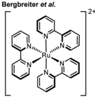

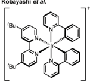

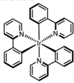

Fig. 1 Commonly used metal-based photocatalysts, their current prices, and strategies to immobilize them. 15

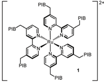

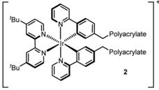

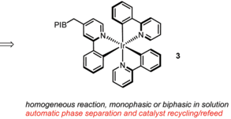

otherwise homogeneously operating catalysts, being especially desirable for photocatalytic processes to ensure e ffi cient light intake, call for their attachment either to an insoluble polymeric resin or to tag them with a phase selective tether. 13

Open Access A

PIB

[Ir] +

a)y

1) BH3, PE

2) H202, NaOH

OH

1) MeSO2CI, Et3N, DCM

2) Lil, acetone, PE

(68%)

matel

Relevant to our work, Bergbreiter et al. achieved the synthesis of 1 representing a recyclable version of [Ru(bpy)3] 2+ (bpy = 2,2 ′ -bipyridine) by installing multiple polyisobutylene (PIB) chains (Fig. 1, right side), 14 which could be separated and resused by selective precipitation of the polymeric reaction product from the reaction solution.

In a complementary approach, a heterogeneous polypyridyl iridium complex 2 was prepared by polymerization of a vinylsubstituted iridium photocatalyst with partially cross-linked acrylates, 16 allowing the recovery of the catalyst by filtration from the reaction solution.

We report here the synthesis and application of PIB tagged 3 , being the first recyclable version of tris-cyclometalated fac -Ir(ppy)3. This catalyst features high activity due to its homogeneous nature in solution, but more importantly allows automatic recovery and reuse in flow systems making use of a thermomorphic or biphasic solvent system. The technology developed should be significant for a broad variety of photocatalytic processes going beyond the benefits of flow as a means of scaling up a reaction. 17

## Results and discussion

On the outset we aimed to develop a homogenous catalyst system to avoid any mass transport problems commonly encountered in heterogeneous systems. Moreover, with special relevance to photocatalysts, heterogeneous supports are impenetrable by visible light, thus greatly reducing the quantum yield for a given reaction. In fact, the most e ffi cient approach for photocatalytic processes is to conduct them in flow in homogeneous phase, 18 but to the best of our knowledge, there are no reports that demonstrate the automatic separation and refeed of a homogeneous photocatalyst under such conditions. We therefore chose to tag one or more of the ppy ligands with polyisobutylene, which has proved to confer excellent solubility to catalysts and reagents in various organic solvents in earlier studies. 19 Our initial strategy was to synthesize Ir(ppy)(PIB-ppy)2 ( 3 ) by reaction of [Ir(ppy)2(MeOH)2]OTf ( 7 ) with polyisobutylene-tagged ppy ligand 8 ; the latter was readily obtained by reacting lithiated 4-methyl-2-phenylpyridine with polyisobutylene iodide ( 6 ) (Scheme 1). 20 Unfortunately this procedure gave none of the desired PIB-tagged 3 , instead only minor amounts of Ir(ppy)(PIB-ppy)2 could be isolated (see ESI † ). Since all attempts of optimization of this route were unsuccessful, the strategy towards Ir(ppy)2(PIB-ppy) ( 3 ) was changed to first form the catalyst core structure 10 and then to attach the polyisobutylene chain in a second step: Gratifyingly, this strategy furnished either Ir(ppy)2(PIB-ppy) ( 3 ), or the twofold alkylated Ir(ppy)2(PIB2-ppy) ( 9 ) depending on the stoichiometry of the reagents involved in good yield (54% for 3 , 84% for 9 ). Since the tertiary, benzylic position in Ir(ppy)2(PIB2-ppy) ( 9 ) might have adversary properties due to its potentially very activated C -H bond, we focused our following investigations on the mono-alkylated Ir(ppy)2(PIB-ppy) ( 3 ).

Scheme 1 Upper part: synthesis of PIB-I ( 6 ) starting from BASF Glissopal® 1000 (4, n ∼ 17). Lower part: two explored methods to synthesize PIB-tagged photocatalyst 3 . [Ir] = [Ir(ppy)2(MeOH)2]OTf ( 7 ). Regents and conditions: (a) 4-methyl-2-phenylpyridine (1.05 equiv.), LDA (1.10 equiv.), THF, hexanes, -78 °C to rt, on, 83% 8 . (b) [Ir] ( 7 ) (1.0 equiv.), phenylpyridine 8 (1.0 equiv.), dioxane, re fl ux, 7 d. (c) Complex 10 (1.0 equiv.), LDA (1.3 equiv.), PIB-I ( 6 ) (1.4 equiv.), THF, hexanes, -78 °C to rt, on, 54% 3. (d) Complex 10 (1.0 equiv.), LDA (13 equiv.), PIB-I ( 6 ) (14 equiv.), THF, hexanes, -78 °C to rt, on, 84% 9 .

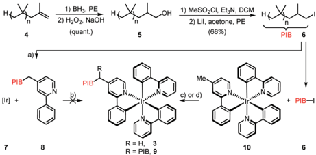

Polymer-bound Ir(ppy)2(PIB-ppy) ( 3 ) exhibits an almost identical UV-Vis spectrum like its parent complex fac -Ir(ppy)3. Photochemical reactions can therefore be carried out without the need of adjusting the excitation wavelength. As the first approach, we envisioned to performing photochemical reactions under their originally published conditions and recover PIB-tagged catalyst 3 by a subsequent liquid/liquid extraction with heptane. Typical solvents for photochemical transformations with fac -Ir( ppy)3 are DMF and acetonitrile. As it turned out Ir(ppy)2(PIB-ppy) ( 3 ) is soluble in neither, even at elevated temperatures. This solubility profile appeared to be ideal to carry out homogenous photochemical transformations using a thermomorphic solvent system (TMS). 21 Such a system comprises of a polar and a nonpolar solvent that have a huge miscibility gap at ambient temperatures. At elevated temperatures the miscibility gap disappears and the former biphasic system becomes homogeneous. After cooling, the former two phases reappear, making the process fully reversible. Acetonitrile and heptane form such a TMS with a upper critical solution temperature (UCST), the temperature where full miscibility is achieved, of 84.6 °C. 22 Thus, for the photochemical reactions investigated, substrates and reagents were dissolved in acetonitrile at room temperature and catalyst 3 containing heptane was added (Scheme 2, (1)), forming a biphasic solution. Heating the reaction mixture to 85 °C led to a homogeneous mixture which was then irradiated with blue LED light (455 nm) until the transformation was completed (2). Cooling to room temperature (3) and phase separation (4) gave back an acetonitrile phase containing the photochemical products and a heptane phase with catalyst Ir(ppy)2(PIB-ppy) ( 3 ) that could be added to the next reaction run (5). While this protocol requires heating in addition to irradiating the reaction mixture, it should be noted that quite a number of photoredox catalyzed processes have been reported that require elevated temperatures to begin with. 23

Open Access A

MeO

substrate

MeCN

12

14

(1)

·￾O

photocat.

13

heptane

(5)

(4)

Photocat. (2.5 mol%), BuzN (10 equiv),

Photocat. (1 mol%), BuzN (2.0 equiv),

HCO2H (10 equiv)

Hantzsch ester (2.0 equiv),

MeCN, 455 nm LED, 3 h

MeCN, 455 nm LED, 3 h

Scheme 2 Photoreactions with Ir(ppy)2(PIB-ppy) ( 3 ) in a thermomorphic solvent system of acetonitrile and heptane.

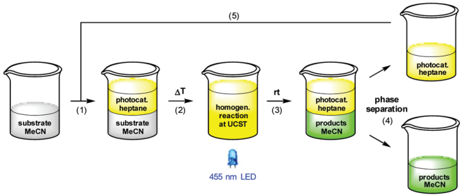

To demonstrate the feasibility of above mentioned concept, we applied polyisobutylene-tagged Ir(ppy)2(PIB-ppy) ( 3 ) to the photochemical deiodation reaction of 11 , originally developed by Stephenson et al. (Table 1, entry 1). 24 Using a mixture of acetonitrile and heptane at 85 °C instead solely acetonitrile at room temperature had little influence on the reaction outcome, and PIB-tagged Ir(ppy)2(PIB-ppy) ( 3 ) was able to catalyze the reaction essentially with the same e ffi ciency as its non-tagged counterpart fac -Ir( ppy)3 (entries 2 and 3). The catalyst was recycled as described above and resubjected to a new reaction run, for which an increase of product yield from 78 to 96% was observed (entry 4). This rise can be explained by the residual solubility of product 12 in the heptane phase. As the heptane phase is then added to the next reaction run, also extracted product from the last reaction run is added, leading to a steady state of extracted and added product after the second catalyst run. The catalyst containing heptane phase was thoroughly extracted with additional acetonitrile after the last run, giving an additional 12% of 12 (relative to one run). This corresponds to the amount of extracted product after the first run (entry 3). In the following runs the product yield stayed constantly high and it was possible to run the reaction for at least 10 times with the same batch of catalyst without an evident decline in e ffi ciency (entry 4). A control experiment

|   Entry | Catalyst                  | Conditions          | Run    | Yield a [%]   |
|---------|---------------------------|---------------------|--------|---------------|
|       1 | fac -Ir(ppy) 3            | MeCN, room temp.    | -      | 83 b          |
|       2 | fac -Ir(ppy) 3            | MeCN/heptane, 85 °C | -      | 73            |
|       3 | Ir(ppy) 2 (PIB-ppy) ( 3 ) | MeCN/heptane, 85 °C | 1      | 78 + 12 c     |
|       4 | Ir(ppy) 2 (PIB-ppy) ( 3 ) | MeCN/heptane, 85 °C | 2 - 10 | 86 - 96       |
|       5 | Ir(ppy) 2 (PIB-ppy) ( 3 ) | MeCN/heptane, 85 °C | -      | 34 d          |

Table 1 Deiodation of 11 with recyclable Ir(ppy)2(PIB-ppy) ( 3 )

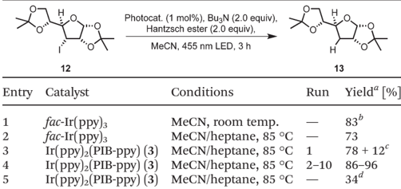

|

MeO

where only one tenth of the catalyst was used yielded only 34% product after irradiation (entry 5).

In addition to a simple deiodation, we also examined the catalytic performance and recycling capabilities of Ir(ppy)2(PIB-ppy) ( 3 ) in the deiodation/cyclization of 13 (Table 2). 24 Also here the reusable catalyst variant 3 performed well (entries 2 and 3). The amount of extracted cyclization product 14 is higher due to its less polar nature, nevertheless the recycling behaviour of 3 was not impaired.

Encouraged by the catalytic performance and excellent recyclability of PIB-tagged 3 in previous batch reactions, we envisioned a continuously operating process in which the catalyst is constantly recycled and reused. For hydroformylations conceptually related flow systems with continuous catalyst recycling have been developed previously. 25 In those studies a polar rhodium catalyst is retained in a DMF phase while the product (long-chained aldehydes) dissolves in decane. Also, latent monophasic fluorous systems are known in flow. 26 In our setup for photochemical transformations in a thermomorphic solvent system we ran the reactions in a transparent, heatable microreactor and thereby enable the irradiation of the reaction mixture while it is homogeneous (Scheme 3). 27 Substrate and reagents dissolved in heptane-saturated acetonitrile 28 (1) are pumped (2) into a microreactor (3) along with a solution of Ir(ppy)2(PIB-ppy) ( 3 ) in heptane (4). Through heating to 90 °C the biphasic system becomes a homogeneous solution which is then irradiated with visible light. A throttle valve (5) ensures that the solvents are not boiling. After the

Table 2 Deiodation/cyclization of 13 with reusable Ir(ppy)2(PIB-ppy) ( 3 )

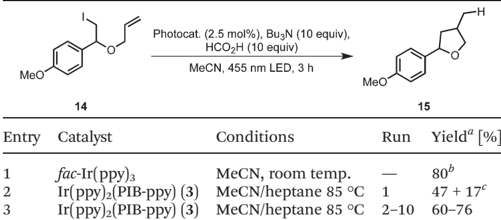

Scheme 3 Continuously operating, catalyst recycling, photoreaction setup.

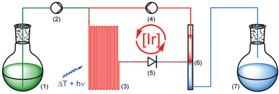

Open Access A

Z-Isomer 16 [%]

16

OAc

Photocat. (0.7 mol%),

'PrzNEt (0.1 equiv)

17

via: ph

5

4

H

18

photoreaction is completed the mixture reaches a cooled phase separator unit (6). While the catalyst containing phase is recycled (4), the product-containing acetonitrile is collected (7).

We applied this reaction setup in the photochemical generation of Z -alkenes from readily available E -alkenes through uphill catalysis as demonstrated by Weaver et al. 29 The double bond in 15 is presumably broken through energy transfer from the excited photocatalyst forming a biradical species 17 that rapidly undergoes intersystem crossing to give the isomerized compound 16 (Table 3). Control experiments in a batch process showed that this reaction could be carried out at elevated temperatures without a detrimental e ff ect on the E / Z ratio (entry 2). Also, neither a switch of solvent to a acetonitrile/ heptane mixture nor the employment of Ir(ppy)2(PIB-ppy) ( 3 ) deteriorated the reaction outcome (entry 3), prompting us to set up this reaction in a continuous process.

The results of the isomerization of 15 in a flow process with continuous catalyst recycling are depicted in Fig. 2. As can be seen the Z / E ratio remains at constant high levels throughout the whole reaction process. The amount of catalyst employed corresponds to the amount used in a 1 mmol batch reaction setup, 30 demonstrating that this setup can e ff ectively decrease the catalyst loading by a factor of at least 30. Catalyst leaching

Table 3 Photocatalyzed E / Z isomerization in a continuous process

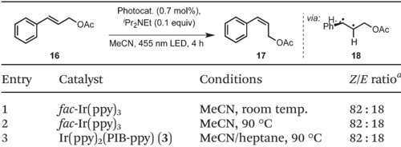

|   Entry | Catalyst                |            | Conditions          | Z / E ratio a   |
|---------|-------------------------|------------|---------------------|-----------------|
|       1 | fac -Ir(ppy) 3          | MeCN, room | temp.               | 82 : 18         |
|       2 | fac -Ir(ppy) 3          | MeCN,      | 90 °C               | 82 : 18         |
|       3 | Ir(ppy) 2 (PIB-ppy) ( ) | 3          | MeCN/heptane, 90 °C | 82 : 18         |

a Ratio determined by 1 H-NMR/GC-FID integration of the crude reaction mixture. The standard deviation for the GC-FID measurements was below 1%.

Fig. 2 Photochemical E / Z isomerization in a fl ow process with continuous catalyst recycling. Z -isomer ratio depicted in blue (determined by GC-FID, showing a range from 83 : 17 to 81 : 19), iridium content lost normalized for 1 mmol substrate depicted in red (determined by ICP-OES). Reaction parameters: 25 30 mmol E -alkene 15 (1.0 equiv.), 3 mmol i Pr2NEt (0.1 equiv.), 7 µmol Ir(ppy)2(PIB2-ppy) ( 3 ) (0.023 mol%), MeCN, heptane, 90 °C, fl owrate 20 µmol 15 /min.

OAc

OAc

Fig. 3 Photochemical isomerization of 15 in a microreactor under biphasic conditions. Ir(ppy)2(PIB-ppy) ( 3 ) is contained in the fl uorescentgreen heptane phase while 15 is located in the colourless acetonitrile phase. The average length of each phase is approximately 2 mm. Results as in Fig. 2 at a fl owrate of 10 µmol 15 /min.

is comparably high at the beginning of the reaction with 2.6% of the totally employed iridium lost relative to the first mmol of converted substrate 15 as determined by ICP-OES. Gratifyingly, the iridium loss severely declines in course of the further reaction, reaching levels well below 0.1% iridium lost per mmol of converted substrate 15 , corresponding to an iridium contamination below 2 ppm of the reaction product. 1 H-NMR analysis performed for the catalyst after the reaction suggests that mainly catalyst molecules that were connected to shorter PIB chains being present from the start in Glissopal® 1000, i.e. having higher polarity, were lost.

While we demonstrated that higher reaction temperatures have no adversary e ff ects on the examined reactions, it might be disadvantageous for other photochemical transformations.

To obliterate such demur, we also carried out the isomerization reaction of 15 at room temperature. This resulted in a biphasic reaction system. 31 Light is absorbed by the photocatalyst in the heptane phase while reaction presumably takes place at the interface to the substrate-containing acetonitrile phase. Through the employment of a microreactor a su ffi ciently high surface area was generated due to lamellar flow and a phase alternation approximately every 2 mm (Fig. 3). Albeit slightly lower flow rates (10 μ mol instead of 20 μ mol 15 /min) were needed, the product yield and recycling capabilities were not impaired, demonstrating that Ir(ppy)2(PIB-ppy) ( 3 ) can be used in both, mono- and biphasic reaction conditions.

## Conclusion

In summary, a short and e ffi cient synthesis for polyisobutylene-tagged Ir(ppy)2(PIB-ppy) ( 3 ) was established. This catalyst showed excellent catalytic performance as well as recyclability in batch and in flow reactions. A process could be developed

where the photocatalyst 3 is constantly recycled, allowing to use drastically lower amounts of high priced iridium compared to the batch process. Catalyst 3 therefore provides an alternative to fac -Ir(ppy)3 when large-scale reaction setups are required.

## Acknowledgements

This work was supported by the GRK 1626 ( ' Chemical Photocatalysis ' ) of the DFG and by BASF AG through a generous gift of Glissopal® 1000. The authors thank A. Wimmer and M. Tautz (Univ. of Regensburg) for their help with preliminary studies and Tehshik P. Yoon (Univ. of Wisconsin-Madison) for helpful discussions.

## Notes and references

- 1 Leading reviews: ( a ) K. Zeitler, Angew. Chem., Int. Ed. , 2009, 48 , 9785 -9789; ( b ) J. M. R. Narayanam and C. R. J. Stephenson, Chem. Soc. Rev. , 2011, 40 , 102 -113; ( c ) C. K. Prier, D. A. Rankic and D. W. C. MacMillan, Chem. Rev. , 2013, 113 , 5322 -5363; ( d ) S. Paria and O. Reiser, ChemCatChem , 2014, 6 , 2477 -2483; ( e ) D. M. Schultz and T. P. Yoon, Science , 2014, 343 , 985.
- 2 ( a ) X. Chen and S. S. Mao, Chem. Rev. , 2007, 107 , 2891 -2959; ( b ) M. Cherevatskaya, M. Neumann, S. Füldner, C. Harlander, S. Kümmel, S. Dankesreiter, A. Pfitzner, K. Zeitler and B. König, Angew. Chem., Int. Ed. , 2012, 51 , 4062 -4066.
- 3 ( a ) M. Neumann, S. Füldner, B. König and K. Zeitler, Angew. Chem., Int. Ed. , 2011, 50 , 951 -954; ( b ) I. Ghosh, T. Ghosh, J. I. Bardagi and B. König, Science , 2014, 346 , 725 -728; ( c ) D. A. Nicewicz and T. M. Nguyen, ACS Catal. , 2014, 4 , 355 -360.
- 4 ( a ) F. Teplý, Collect. Czechoslov. Chem. Commun. , 2011, 76 , 859 -917; ( b ) T. Koike and M. Akita, Inorg. Chem. Front. , 2014, 1 , 562 -576.
- 5 ( a ) J.-M. Kern and J.-P. Sauvage, J. Chem. Soc., Chem. Commun. , 1987, 546 -548; ( b ) S. Paria, M. Pirtsch, V. Kais and O. Reiser, Synthesis , 2013, 45 , 2689 -2698; ( c ) M. Pirtsch, S. Paria, T. Matsuno, H. Isobe and O. Reiser, Chem. -Eur. J. , 2012, 18 , 7336 -7340; ( d ) M. Majek and A. J. von Wangelin, Angew. Chem., Int. Ed. , 2013, 52 , 5919 -5921; ( e ) D. B. Bagal, G. Kachkovskyi, M. Knorn, T. Rawner, B. M. Bhanage and O. Reiser, Angew. Chem., Int. Ed. , 2015, 54 , 6999 -7002.
- 6 S. M. Stevenson, M. P. Shores and E. M. Ferreira, Angew. Chem., Int. Ed. , 2015, 54 , 6506 -6510.
- 7 G. Kachkovskyi, V. Kais, P. Kohls, S. Paria, M. Pirtsch, D. Rackl, H. Seo and O. Reiser, in Chemical Photocatalysis , ed. B. König, De Gruyter, Berlin, 2013, pp. 139 -150.
- 8 K. A. King, P. J. Spellane and R. J. Watts, J. Am. Chem. Soc. , 1985, 107 , 1431 -1432.
- 9 J. D. Cuthbertson and D. W. C. MacMillan, Nature , 2015, 519 , 74 -77.

|

- 10 N. Iqbal, J. Jung, S. Park and E. J. Cho, Angew. Chem., Int. Ed. , 2014, 53 , 539 -542.
- 11 Z. He, M. Bae, J. Wu and T. F. Jamison, Angew. Chem., Int. Ed. , 2014, 53 , 14451 -14455.
- 12 ( a ) M. C. DeRosa and R. J. Crutchley, Coord. Chem. Rev. , 2002, 233 -234 , 351 -371. For recent developments see: ( b ) S. Breitenlechner and T. Bach, Angew. Chem., Int. Ed. , 2008, 47 , 7957 -7959; ( c ) H. Shimakoshi, M. Nishi, A. Tanaka, K. Chikama and Y. Hisaeda, Chem. Commun. , 2011, 47 , 6548 -6550; ( d ) D. Maggioni, F. Fenili, L. D ' Alfonso, D. Donghi, M. Panigati, I. Zanoni, R. Marzi,
- A. Manfredi, P. Ferruti, G. D ' Alfonso, et al. , Inorg. Chem. , 2012, 51 , 12776 -12788.
- 13 M. Benaglia, Recoverable and Recyclable Catalysts , WileyVCH, West Sussex, 2009.
- 14 N. Priyadarshani, Y. Liang, J. Suriboot, H. S. Bazzi and D. E. Bergbreiter, ACS Macro Lett. , 2013, 2 , 571 -574.
- 15 Sigma-Aldrich (May 2015).
- 16 W.-J. Yoo and S. Kobayashi, Green Chem. , 2014, 16 , 2438 -2442.
- 17 L. D. Elliot, J. P. Knowles, P. J. Koovits, K. G. Maskill, M. J. Ralph, G. Lejeune, L. J. Edwards, R. I. Robinson, I. R. Clemens, B. Cox, D. D. Pascie, G. Koch, M. Eberle, M. B. Berry and K. I. Booker-Milburn, Chem. -Eur. J. , 2014, 20 , 15226 -15232.
- 18 For leading reviews on photocatalyzed reactions in flow see: ( a ) Z. J. Garlets, J. D. Nguyen and C. R. J. Stephenson, Isr. J. Chem. , 2014, 54 , 351 -360; ( b ) Y. Su, J. W. Straathof, V. Hessel and T. Noel, Chem. -Eur. J. , 2014, 20 , 10562 -10589.
- 19 Polyisobutylene was introduced as non-polar hydrocarbon support for reagents and catalysts by Bergbreiter et al. : ( a ) D. E. Bergbreiter and J. Li, Chem. Commun. , 2004, 42 -43; ( b ) J. Li, S. Sung, J. Tia and D. E. Bergbreiter, Tetrahedron , 2005, 61 , 12081 -12092.
- 20 Polyisobutylene bromide is commercially available from Strem.
- 21 ( a ) D. E. Bergbreiter, ACS Macro Lett. , 2014, 3 , 260 -265; ( b ) A. Behr, G. Henze and R. Schomäcker, Adv. Synth. Catal. , 2006, 348 , 1485 -1495; ( c ) D. E. Bergbreiter and S. D. Sung, Adv. Synth. Catal. , 2006, 348 , 1352 -1366.
- 22 A. W. Francis, Critical Solution Temperatures , American Chemical Society, Washington, DC, 1961.
- 23 Representative examples: ( a ) X.-J. Tang and W. R. Dolbier Jr., Angew. Chem., Int. Ed. , 2015, 54 , 4246 -4249; ( b ) Z. Zhang, C. S. Thomoson, X.-J. Tang and W. R. Dolbier Jr., Org. Lett. , 2015, 17 , 3528 -3531; ( c ) J.-L. Zhang, Y. Liu, G.-F. Jiang and J.-H. Li, Synlett , 2014, 1031 -1035; ( d ) Y. Liu, J.-L. Zhang, R.-J. Song and J.-H. Li, Eur. J. Org. Chem. , 2014, 1177 -1181.
- 24 J. D. Nguyen, E. M. D ' Amato, J. M. R. Narayanam and C. R. J. Stephenson, Nat. Chem. , 2012, 4 , 854 -859.
- 25 ( a ) M. Zagajewski, J. Dreimann and A. Behr, Chem. Ing. Tech. , 2014, 86 , 449 -457; ( b ) M. Zagajewski, A. Behr, P. Sasse and J. Wittmann, Chem. Eng. Sci. , 2014, 115 , 88 -94; ( c ) S. D. Dietz, C. M. Ohman, T. A. Scholten and

- S. Gebhard, in Org. React. Catal. Soc , Richmond, VA, 2008.
2. 26 ( a ) I. T. Horváth, G. Kiss, R. A. Cook, J. E. Bond, P. A. Stevens, J. Rábai and E. J. Mozeleski, J. Am. Chem. Soc. , 1998, 120 , 3133 -3143; ( b ) E. Perperi, Y. Huang, P. Angeli, G. Manos, C. R. Mathison, D. J. Cole-Hamilton, D. J. Adams and E. G. Hope, Dalton Trans. , 2004, 2062 -2064.
3. 27 D. Rackl, V. Kais, P. Kreitmeier and O. Reiser, Beilstein J. Org. Chem. , 2014, 10 , 2157 -2165.
4. 28 Acetonitrile and heptane exhibit a low solubility at room temperature. The mass fraction of heptane in heptane saturated acetonitrile at 25 °C is about 9%, see: I. Nagata, Thermochim. Acta , 1987, 114 , 227 -238. To avoid an extraction of heptane into acetonitrile over time, fresh substrate is always added in heptane-saturated acetonitrile to keep the amount of heptane constant. As shown in Fig. 2 and discussed in the text, for the first 4 mmol substrate converted,
5. the total loss of 3 is approximately 4% and then drops to &lt;0.1% (&lt;2 ppm) for the remaining 26 mmol. Details are discussed in the ESI. †
6. 29 K. Singh, S. J. Staig and J. D. Weaver, J. Am. Chem. Soc. , 2014, 136 , 5275 -5278.
7. 30 Detailed reaction conditions are described in the ESI. †
8. 31 Photochemical transformations in a biphasic system consisting of deuterated acetonitrile and perfluoroalkane were demonstrated for singlet oxygen-mediated oxidations: S. G. DiMagno, P. H. Dussault and J. A. Schultz, J. Am. Chem. Soc. , 1996, 118 , 5312 -5313. In the commercial Ruhrchemie/Rhone -Poulenc process aqueous catalyst and product phase are continuously separated: E. Wiebus and B. Cornils, Chem. Ing. Tech. , 1994, 66 , 916 -923. For a recent report using ionic liquids as the catalyst phase see: D. C. Fabry, M. A. Ronge and M. Rueping, Chem. -Eur. J. , 2015, 21 , 5350 -5354.