## UC Irvine

## UC Irvine Previously Published Works

## Title

Tertiary Alcohols as Radical Precursors for the Introduction of Tertiary Substituents into Heteroarenes

## Permalink

https://escholarship.org/uc/item/9k89c1xw

## Journal

ACS Catalysis, 9(4)

## ISSN

2155-5435

## Authors

Pitre, Spencer P Muuronen, Mikko Fishman, Dmitry A et al.

## Publication Date

2019-04-05

## DOI

10.1021/acscatal.9b00405

Peer reviewed

## Tertiary Alcohols as Radical Precursors for the Introduction of Tertiary Substituents into

## Heteroarenes

Spencer P. Pitre, Mikko Muuronen, Dmitry A. Fishman, and Larry E. Overman*

Department of Chemistry, University of California, Irvine, California 92697-2025, United States

ABSTRACT: Despite many recent advances in the radical alkylation of electron-deficient heteroarenes since the seminal reports by Minisci and coworkers, methods for the direct incorporation of tertiary alkyl substituents into nitrogen heteroarenes are limited. This report describes the use of tert -alkyl oxalate salts, derived from tertiary alcohols, to introduce tertiary substituents into a variety of heterocyclic substrates. This reaction has reasonably broad scope, proceeds rapidly under mild conditions, and is initiated by either photochemical or thermal activation. Insights into the underlying mechanism of the higher   yielding   visible-light   initiated   process   were   obtained   by   flash   photolysis   studies,   whereas computational studies provided insight into the reaction scope.

KEYWORDS: Minisci Reaction, Photoredox Catalysis, Heterocycle Synthesis, C-H Functionalization, Radical Chemistry.

## Introduction

The addition of carbon radicals to azines was first   reported   125   years   ago   by  Möhlau   and Berger. 1 Initial reports in 1968 by Dou and Minisci, and   subsequent   extensive   studies   by   Minisci, demonstrated   that   regioselectivities   and   yields are markedly improved when these reactions are carried   out   under   acidic,   oxidizing   conditions. 2 The pioneering work by Minisci in this field led to this   radical   process   becoming   a   fundamental method   for   C-H   functionalization   of   electrondeficient   heteroarenes. 3 The   wide   functionalgroup tolerance of radical processes 4  imparts an unusually   wide   scope   to   the   Minisci   reaction, allowing its use for late-stage functionalization of both structurally complex natural products and pharmaceuticals. 3d  The scope and utility of Minisci processes has been greatly expanded in the past decade by the introduction of new precursors and procedures   for   generating   the   carbon   radical intermediates.   The   early   use   of   halide   and carboxylic acids as radical precursors has been augmented by the recent introduction of boronic acids, 5 sulfinate   esters, 6 alkyl   trifluoroborates, 7 alkenes, 8 alcohols, 9 N -(acyloxy)phthalamides, 10 and   4-substituted   dihydropyridines, 11 among others.

In spite of this extensive literature, reports of the   functionalization   of   heteroarenes   by   the introduction of tertiary carbon substituents and the generation of quaternary centers by Minisci processes are limited. 3  The vast majority of these reports describe   only the introduction of adamantyl or tert -butyl groups in this fashion. 12 The  use   of   tertiary   oxalic   acid   monoesters   as tertiary   radical   precursors   was   reported   in   the early 1990s by Togo and Minisci. 12b,12c,13  In 2015, we and the MacMillan group reported that a wide variety of tertiary radicals can be conveniently generated   from tert -alkyl   oxalate   salts   using visible-light photoredox catalysis (eq 1). 14   These salts were shown to be excellent precursors of tertiary carbon radicals, as they, in contrast to tertiary half esters of oxalic acid, are quite stable and can be stored for extended periods at room temperature.   Another   advantage   of   employing these tert -alkyl   oxalate   salts   is   that   they   are significantly easier to oxidize (~ E 1/2 ox   = +1.22 V vs. SCE) compared to the corresponding oxalic acids   (~ E 1/2 ox = +1.86  V   vs   SCE). 15 The   mild oxidation potentials of alkyl oxalate salts are well suited   for   visible-light   photoredox   catalysis,   in particular   for   the   popular   iridium   heteroleptic photocatalyst, Ir[dF(CF3)ppy]2(dtbbpy)PF6 ( I ) [dF(CF3)ppy = 2-(2,4-difluorophenyl)-5trifluoromethylpyridine, dtbbpy = 4,4 ′ -dit -Bu-2,2 ′ -bipyridine],   which   possesses   an   excited   state reduction potential ( E 1/2 red ) of  +1.21 V vs. SCE. 16

## Previous Work: tertAlkyl  Oxalate Salts as  Radical Precursors, 1,4-Radical Addition

O

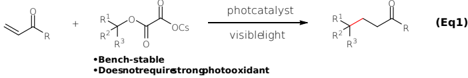

O

This  Work: tert -Alkyl  Oxalate Salts  as  Radical Precursors, Alkylation of  Heterocycles

Method

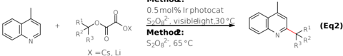

1:

In this report, we present the use of tert -alkyl oxalate salts, derived from tertiary alcohols, as   radical   precursors   for   the   alkylation   of electron-deficient   heteroarenes   (eq   2).   The reaction   proceeds   in   good   yields   with   short reaction times, is broad in scope, and the mild oxidation potentials of the tert -alkyl oxalate salts enables   the   reaction   to   proceed   by   either photochemical or thermal initiation. Insights into the underlying mechanisms of the transformation are also presented.

## Results and Discussion

We first explored the alkylation of lepidine ( 1 ) with cesium 2-( tert -butoxy)-2-oxoacetate ( 2 )   as the radical precursor. After extensive screening of reaction   conditions   (See   Table   S1   of   the Supporting   Information),   it   was   found   that   the alkylation   of 1 with 2 proceeded in 95% yield within   10   min   to   generate   2tert -butyl-4methylquinoline   ( 3 )   employing   0.5   mol   %   of photocatalyst I ,   2   equiv   of   (NH 4 ) 2 S2O8  as   the external oxidant, and 1 equiv of HCl ( c = 0.5 M in DMSO) (Table 1, Entry 1). To our surprise, upon removal of the photocatalyst, 94% yield of 3 was still obtained (Entry 2). Although initially puzzling, it   was   discovered   that   the   observed   reactivity was   the   result   of   thermal   activation,   as   the reaction proceeded in the absence of light at 65 °C (Entry 3). Owing to the low activation barrier for homolysis of (NH4)2S2O8, the heat generated from the blue LEDs employed in our reaction setup (~60 °C) was sufficient  to cleave the O -O bond, 17 generating   two   highly   oxidizing   sulfate radical   anions   (SO4 ·-). 18 The   resulting   SO4 ·radicals   are   then   capable   of   oxidizing 2 to generate tert -butyl radicals. Interestingly, Minisci and coworkers did not observe reactivity in the absence of AgNO3  in their previous studies with oxalic   acid   monoesters,   likely   a   result     of   the higher   potential   required   for   oxidation   these precursors. 12c   Though we were excited about the observed   thermal   reactivity,   we   were   also interested in pursuing the reaction under milder, visible-light   photoredox   catalyzed   conditions.   It was discovered that the thermal reactivity was attenuated at 30 °C (Entry 4). However, upon irradiation with two Kessil blue LED lamps at 30 °C, we once again observed the formation of 3 in 94% yield (Entry 5). Removal of the photocatalyst under these conditions resulted in formation of only trace amounts of product 3 (Entry 6). Control reactions demonstrated that whereas (NH4)2S2O8 was required for reactivity (Entry 7), the reaction was still viable in the absence of added HCl (Entry 8).   Finally,   the   loading   of   (NH 4 ) 2 S2O8  could   be dropped to 1.5 equiv, yielding 3 in 94% isolated yield   (Entry   9).   The   reaction   can   also   be performed under air without a significant loss in yield   (Entry   10).   Seeing   as   some   electrondeficient   heteroarenes   are   prone   to   oxidative degradation   and   oxygen   is   a   potent   triplet excited-state quencher, it is still recommended to perform these reactions under an inert atmosphere. In addition, we were able to employ the organophotocatalyst 4CzIPN ( II ) in place of Ir photocatalyst I , albeit longer reaction times were required to reach comparable yields (Entry 11).

|   Entr y | P C   | (NH 4 ) 2 S 2 O 8   | HCl     | Conditio ns   | Yield    |
|----------|-------|---------------------|---------|---------------|----------|
|        1 | I     | 2 equiv             | 1 equiv | h  , 60 ° C  | 95%      |
|        2 | -     | 2 equiv             | 1 equiv | h  , 60 ° C  | 94%      |
|        3 | -     | 2 equiv             | 1 equiv | 65 ° C        | 89%      |
|        4 | -     | 2 equiv             | 1 equiv | 30 ° C        | N.R.     |
|        5 | I     | 2 equiv             | 1 equiv | h  , 30 ° C  | 94%      |
|        6 | -     | 2 equiv             | 1 equiv | h  , 30 ° C  | 6%       |
|        7 | I     | -                   | 1 equiv | h  , 30 ° C  | N.R.     |
|        8 | I     | 2 equiv             | -       | h  , 30 ° C  | 93%      |
|        9 | I     | 1.5 equiv           | -       | h  , 30 ° C  | 94% a, b |
|       10 | I     | 1.5 equiv           | -       | h  , 30 ° C  | 87% c    |
|       11 | II    | 1.5 equiv           | -       | h  , 30 ° C  | 96% b, d |

Table 1. Optimization and control reactions for   the   alkylation   of   lepidine   (1)   with oxalate precursor 2.

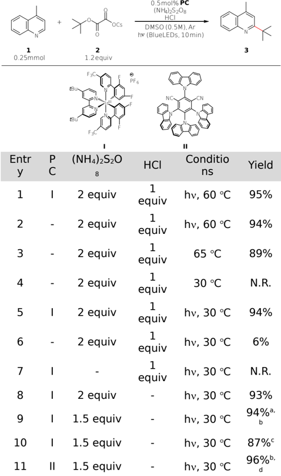

a Reaction was performed at 0.5 mmol scale.  b yield of isolated purified product.  c Reaction was performed under air.  d Reaction was irradiated for 1 h.

With   the   optimized   conditions   in   hand,   we examined the scope of the tert -alkyl oxalate salt radical precursors ( Table 2 ). As demonstrated in our previous work (eq 1), 14a   the identity of the alkali counterion (Li vs. Cs) had no effect on the reactivity   in   forming   Minisci   product 4 .   T ertiary radicals   derived   from   1,2-dimethylcyclohexanol, 1-methylcyclopentanol, and 1-adamantanol added in good yields to give products 5 -7 .   In addition heterocyclic radical precursors provided Minisci products 8 and 9 in high yields. A ketal protecting group was stable under these reaction conditions, presumably because of the absence of exogenous   acid   which   is   often   required   to promote   reactivity   in   Minisci   reactions.   Acyclic tert -alkyl oxalates also provided alkylated products, 13 and 14 ,   in   good   yields.   Finally,   a more complex cis -perhydropentalene   derivative coupled   with 1 in   47%   yield   with   high diastereoselectivity to form 14 ,   highlighting the utility   of   this   method   for   installing   quaternary centers in complex heteroarenes. 19

Table 2. Reaction scope of tert -alkyl oxalate salts. a

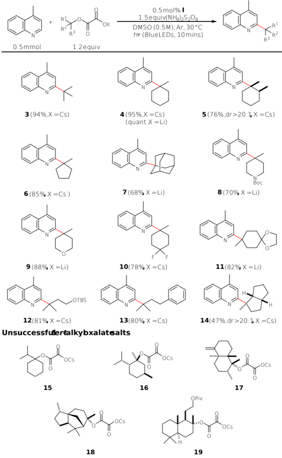

a Yields of isolated purified products after 10 min of irradiation using the optimized conditions (see GP1 in the Supporting Information).

In contrast to our previous work on the Giese reaction of tertiary radicals (eq 1), 14a the Minisci reaction   was   found   to   be   sensitive   to   steric hindrance near the radical center. Whereas  - and  -Me groups were well-tolerated (see formation of 5 ), an i -Pr group at either C1 or C2 of the radical precursor undermined reactivity (oxalates 15 and 16 ).   Other sterically hindered oxalate salts that were competent coupling partners in the Giese reaction with benzyl acrylate (oxalates 17 -19 ) 14a did not couple with lepidine ( 1 ). A computational study determined that the length of the forming C -C bond in the transition state for the addition of tert -butyl   radical   to   protonated 1 was 2.14 Å , much shorter than the transition-state bond for the   addition   of tert -butyl   radical   to   methyl acrylate (2.45 Å , see Supporting Information). 20 In addition,   the   addition   of tert -butyl   radical   to protonated 1 was   calculated   to   be   slightly endothermic, and potentially reversible. That this step   would   become   more   unfavorable   with increasing steric encumbrance about the radical carbon is likely responsible for the limited scope of   the   Minisci   reaction   of   sterically   hindered tertiary radicals.

Our survey of the scope of the tertiary Minisci reaction with regard to the heterocyclic component is summarized in Table 3 .   As   most heteroarenes   reacted   more   slowly   with   1methylcyclohexyl radical than with lepidine, these reactions   were   conducted   for   6   h.   Quinoline yielded the monoalkylated 2-substituted product 20 with 94:6 regioselectivity. High selectivity for introducing tertiary substituents at the 2 position of quinoline was previously reported by Minisci and coworkers, in contrast to the near statistical mixture of C-2 and C-4 regioisomers formed upon reaction with secondary-carbon radicals. 2b Consistent with these observations, C-2substituted quinolines were found to be generally unreactive under our reaction conditions. Quinolines harboring halogen substituents at C-4 gave Minisci products 21 and 22 in   high yield, whereas 7,8-benzoquinoline and phenanthridine furnished products 23 and 24 in moderate yield. Isoquinolines   proved   to   be   much   less   reactive unless   they   contained   an   electron-withdrawing group at C-5, in which case alkylated product 25 was formed in low yield. In contrast to quinoline, pyridine yielded a 1:1 mixture of the 2-( 26 ) and 4-alkylated  regioisomers,   together   with   11%   of the 2,4-dialkylated product. T o our delight, a wide variety   of   functionalized   pyridines   gave   Minisci products 27 -34 in good to high yields. Functional groups   such   as   cyano,   amides,   esters,   and trifluoromethyl were tolerated. T o no surprise, the alcohol group of 3-pyridinemethanol was oxidized under   the   Minisci   conditions,   providing   the   3pyridinecarboxaldehyde   adduct 34 .   For   the majority of the 3-substituted pyridine examples ( 29 -34 ), only trace amounts of other regioisomeric products were observed. A variety of   other   aromatic   heterocycles   gave   Minisci adducts in useful yields. Quinoxaline afforded a single mono-alkylated product 35 in   54% yield, whereas quinazoline gave a 4:1 mixture of the 2,4-dialkylated   ( 36 )   and   4-alkylated   products. Quinazolin-4(3 H )-one provided a single adduct 37 in   51%   yield.   The   6-alkylated   product 38 was formed in 74% from purine together with 13% of the 2,6-di-alkylated product. 3-Formyl-7-azaindole reacted in moderate   yield   to   form 39 . Benzothiazole   and   1-methylbenzimidazole   were also   successfully   alkylated, albeit in only moderate efficiency to yield 40 and 41 . 21

## Table 3. Reaction scope of heteroarene. a

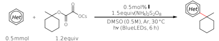

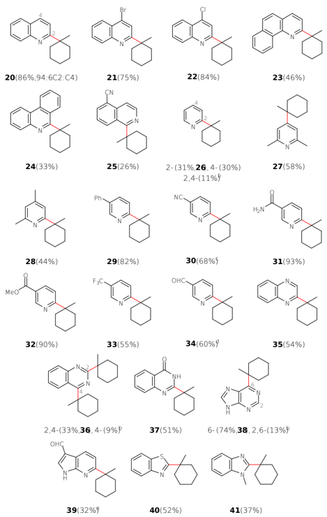

a Yields  of   isolated   purified   products   after   6   h   of   irradiation using the optimized conditions (see GP1 in the Supporting Information).   Unless   noted   otherwise,   less   than   5%   of   a regioisomeric product was detected by NMR analysis of the crude reaction mixture, or by UV analysis during purification of the crude product.   b Yield   from   starting   heterocycle.   c 6% of additional regioisomers were detected by  1 H NMR analysis of the   crude   product   mixture.   d From 3-pyridinemethanol.   e 0.4 mmol of the heteroarene and 1.5 equiv of the tert -alkyl oxalate salt was employed.

The   possibility   of   introducing tert -alkyl substituents   into   nitrogen   ligands   commonly employed   in organometallic catalysis and biologically relevant heteroarenes was of particular interest ( Table 4 ). Using 2.4 equiv of the oxalate salt, 4,7-disubstituted phenanthrolines   and   bathophenanthroline   were dialkylated in useful yields to give the sterically hindered phenanthroline ligands 42 -45 . The ease of   this   method   for   the   functionalization   of phenanthrolines   should   allow   for   streamlined preparation   of   a   variety   of   sterically   hindered phenanthroline   ligands,   including   ones   that incorporate chiral, enantiopure tertiary substituents. As one additional example, 2-(2,4difluorophenyl)-4-methylpyridine was alkylated to give   the   sterically   hindered   dFmppy   ligand analogue 46 . Purine riboside ( 47 ), quinine ( 48 ), and   the   rho-kinase   inhibitor   and   vasodilator fasudil ( 49 ) were also alkylated to incorporate 1methylcyclohexyl substituents in good to moderate yield. The yield of the fasudil analogue 49 could be increased to 39% by using 3 equiv of the oxalate salt precursor.

## Table 4. Reaction scope of the alkylation of ligands and biologically-relevant heteroarenes.

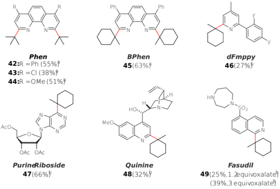

a Modified Conditions : ligand (0.25 mmol), tert -alkyl oxalate (2.4 equiv), PC I (1 mol %), and (NH4)2S2O8  (3 equiv) in 1 mL of DMSO were irradiated for 6 h using two Kessil blue LED lamps at 30 ° C under Ar. Yields of isolated purified product.  b Yields of isolated   purified   products   after   6   h   of   irradiation   using   the optimized conditions (see GP1 in the Supporting Information).

Finally,   the   scope   of   the   thermally-initiated Minisci reaction was briefly examined ( Table 5 ). Under   the   conditions   employed,   the   tertiary radical   precursor   was   completely   consumed within 10 min at 65 °C. In six of the examples (synthesis of 3 , 4 , 6 , 10 , 27 , 32 ), the yield of the thermal reaction was significantly lower (30-45%) than that realized under visible-light photoredox conditions.   It   should   be   noted   that   unreacted heteroarene is typically recovered in these cases, therefore   higher   yields   undoubtedly   could   be achieved by employing an excess of the oxalate salt and (NH4)2S2O8. In the remaining examples (synthesis of 7 , 8 , 35 , 38 , 40 , 45 ), the yield was comparable   under   thermal   and   photochemical conditions. In spite of the lower yields sometimes observed, the thermal reaction should be easier to   implement   and   attractive   for   the   parallel synthesis   of   a   large   collection   of   analog structures.

Table   5.   Reaction   scope   of   the   thermal Minisci reaction. a

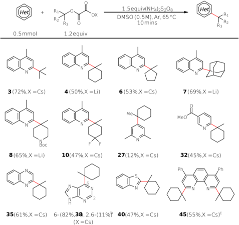

a Yields of isolated purified products after 10 min at 65 ° C using the   optimized   conditions   (see   GP2   in   the   Supporting Information).   b Yield   from   purine.   b 0.25 mmol of BPhen was used.

In order to rationalize the high efficiency of the photoredox-catalyzed Minisci reaction, we turned to excited state kinetic analysis using laser flash photolysis techniques. The pseudo-first-order rate constant (kobs) for the excited state decay was monitored using the luminescence of I , and the bimolecular rate constant (kq) was obtained from a  plot   of   k obs versus   the   concentration   of   the quencher   (See   section IJ of   the   Supporting Information). 22   As expected, the excited state of the   photocatalyst   ( *I )   is   not   quenched   by (NH4)2S2O8; however, both lithium 2-((1methylcyclohexyl)oxy)-2-oxoacetate   and 1 are efficient quenchers of *I (3.29 x 10 8   and 1.29 x 10 8 M -1 s -1 , respectively). At first glance, it would seem   that   quenching   by 1 would   result   in significant   reaction   inhibition,   as   the   desired outcome   involves   oxidative   quenching   by   the tert -alkyl oxalate salt. However, a more accurate comparison   would   be   the   fraction   of   triplets quenched after accounting for the concentrations of each reagent under initial reaction conditions. The fraction of triplets quenched can be easily calculated using eq 3; 23

where   the   various   kq terms   refer   to   the aforementioned bimolecular rate constants, and  0 refers to the lifetime of *I in the absence of a

r

quencher (1.1  s).   Under our standard reaction conditions, we calculate that the fraction of *I being quenched by lithium 2-((1methylcyclohexyl)oxy)-2-oxoacetate   is   actually 75%, while  quenching   by 1 only   accounts   for 25%. Furthermore, chemical actinometry experiments revealed a quantum yield of 12 (See section JK of   the   Supporting   Information), 24 indicating significant chain   propagation.   A synergistic combination of efficient excited state quenching and high quantum yield likely accounts for the unusually short reaction times observed.

The proposed   mechanism   for   this transformation is outlined in Scheme 1A. Upon excitation   with   blue   LEDs, *I is   oxidatively quenched by the tert -alkyl oxalate, triggering a double decarboxylation to form a tertiary radical. The   radical   then   adds   to   the   protonated heteroarene,   yielding   an   amine   radical-cation intermediate. This intermediate then undergoes a proton-coupled   electron-transfer with SO4 ·-, generated   by the reductive cleavage of (NH4)2S2O8 in the catalyst turn-over step, to yield the final product and HSO4 - . We propose that the amine   radical-cation   intermediate   can   also   be quenched by (NH4)2S2O8 to yield HSO4 -  and SO4 ·- , the latter of which can initiate chain propagation by oxidizing the tert -alkyl oxalate salt. The likely mechanism   of   the   thermal   Minisci   reaction   is outlined in Scheme 1B.



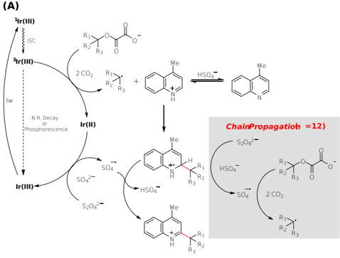





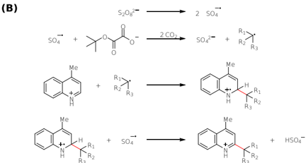

R3

R3

Scheme 1. Proposed   mechanisms   for   the photoredox-catalyzed   Minisci   reaction   (A)

e sulfate









## and the thermally initiated Minisci reaction (B) of tert -alkyl oxalate salts.

## Conclusion

An attractive method for appending tert -alkyl substituents to electron-deficient heteroarenes by either   photochemical   or   thermal   initiation   has been developed. The more efficient visible-light promoted   reaction is accomplished   within minutes or hours at 30 °C and employs only 0.5 mol % of an Ir photocatalyst. The mild conditions and short reaction times of this Minisci reaction result from a synergistic combination of efficient excited state quenching of the photocatalyst and chain propagation.

## AUTHOR INFORMATION

## Corresponding Author

*leoverma@uci.edu

## Present Addresses

M.M.: BASF SE, Carl-Bosch-Strasse 38, 67056 Ludwigshafen, Germany.

## ASSOCIATED CONTENT

Supporting Information . The supporting information   is   available   free   of   charge   via   the Internet at http://pubs.acs.org.



Experimental procedures, reaction optimization,   laser   flash   photolysis   data, quantum   yield   experiments,   compound characterization, and NMR spectra.

## ACKNOWLEDGMENT

Financial support was provided by the U.S. National Science   Foundation   (CHE-1265964   and   CHE1661612). The support of NSERC for a postdoctoral fellowship   award   to   S.P .P .   (NSERC   PDF-502407)   is gratefully   acknowledged.   We   also   thank   Professor Filipp Furche for hosting M.M. in his laboratory and for his support of the computational studies by the National Science Foundation grant CHE1800431. We would like to thank Brian Lydon and Prof. Jenny Yang for their assistance in obtaining the cyclic voltammetry data.

## REFERENCES

- (1) Möhlau, R.; Berger, R., Ueber die Einführung der Phenylgruppe   in   cyclische   Verbindungen   mittels Diazobenzol. Ber.   Dtsch.   Chem.   Ges. 1893, 26 , 1994-2004.
- (2) (a) Dou, H. J. M.; Vernin, G.; Metzger, J., Nouvelle Methode   de   Phenylation   Selective   -   Cas   de   la Methyl-4 Pyridine. Tetrahedron Lett. 1968, 9 , 953957; (b) Minisci, F .; Galli, R.; Cecere, M.; Malatesta, V.;   Caronna,   T.,   Nucleophilic   Character   of   Alkyl Radicals:   New   Syntheses   by   Alkyl   Radicals Generated in Redox Processes. Tetrahedron Lett. 1968, 9 , 5609-5612.
- (3) For selected reviews, see: (a) Minisci, F.; Fontana, F.;   Vismara, E., Substitutions by Nucleophilic Free Radicals: A New General Reaction of Heteroaromatic Bases. J. Heterocyclic Chem. 1990, 27 , 79-96; (b) Minisci, F .; Fontana, F .; Vismara, E., Recent Developments of Free-Radical Substitution of Heteroaromatic Bases. Heterocycles 1989, 28 , 489-519; (c) Harrowven, D. C.; Sutton, B. J., Radical Additions to Pyridines, Quinolines, and Isoquinolines. Prog. in Heterocycl. Chem. 2004 , 16 , 27-53;   (d)   Duncton,   M.   A.   J.,   Minisci   Reactions: Versatile CH-Functionalizations for Medicinal Chemists. Med. Chem. Commun. 2011, 2 ,   11351161; (e) Murakami, K.; Yamada, S.; Kaneda, T.; Itami, K., C-H Functionalization of Azines. Chem. Rev. 2017, 117 ,   9302-9332; (f) Verbitskiy, E. V.; Rusinov, G. L.; Chupakhin, O. L.; Charushin, V. N., Recent Advances in Direct C-H Functionalization of Pyrimidines. Synthesis 2018, 50 ,   193-210;   (g) Wang, C.-S.; Dixneuf, P. H.; Soulé, J.-F ., Photoredox Catalysis   for   Building   C-C   Bonds   from   C(sp 2 )-H Bonds. Chem. Rev. 2018, 118 , 7532-7585.
- (4) Zard, S. Z., Radical Reactions in Organic Synthesis . Oxford University Press: Oxford, 2003.
- (5) (a)   Seiple,   I.   B.;   Su,   S.;   Rodriguez,   R.   A.; Gianatassio, R.; Fujiwara, Y .; Sobel, A. L.; Baran, P. S.,   Direct   C-H   Arylation   of   Electron-Deficient Heterocycles with Arylboronic Acids. J. Am. Chem. Soc. 2010, 132 ,   13194-13196;   (b)   Li,   G.-X.; Morales-Rivera, C. A.; Wang, Y .; Gao, F .; He, G.; Liu, P.;   Chen,   G.,   Photoredox-Mediated   Minisci   C-H Alkylation   of   N-Heteroarenes   using   Boronic   Acids and Hypervalent Iodine. Chem. Sci. 2016, 7 , 64076412.
- (6) Fujiwara, Y .; Dixon, J. A.; O'Hara, F .; Funder, E. D.; Dixon, D. D.; Rodriguez, R. A.; Baxter, R. D.; Herlé, B.; Sach, N.; Collins, M. R.; Ishihara, Y .; Baran, P . S., Practical and Innate Carbon-Hydrogen Functionalization   of   Heterocycles. Nature 2012, 492 , 95-99.
- (7) (a) Molander, G. A.; Colombel, V.; Braz, V. A., Direct Alkylation of Heteroaryls Using Potassium Alkyl- and Alkoxymethyltrifluoroborates. Org. Lett. 2011, 13 , 1852-1855;   (b)   Matsui,   J.   K.;   Primer,   D.   N.; Molander,   G.   A.,   Metal-Free   C-H   Alkylation   of Heteroarenes with Alkyltrifluoroborates: A General Protocol for 1°, 2° and 3° Alkylation. Chem. Sci. 2017, 8 , 3512-3522.
- (8) (a) Ma,   X.; Herzon,   S. B., Intermolecular Hydropyridylation of  Unactivated  Alkenes. J.   Am. Chem. Soc. 2016, 138 ,   8718-8721; (b) Lo, J. C.; Kim, D.; Pan, C.-M.; Edwards, J. T.; Yabe, Y .; Gui, J.; Qin, T.; Gutiérrez, S.; Giacoboni, J.; Smith, M. W.; Holland, P. L.; Baran, P. S., Fe-Catalyzed C-C Bond Construction   from   Olefins   via   Radicals. J.   Am. Chem. Soc. 2017, 139 , 2484-2503.
- (9) (a) Jin, J.; MacMillan, D. W. C., Alcohols as Alkylating Agents   in   Heteroarene   C-H   Functionalization. Nature 2015, 525 , 87-90; (b) McCallum, T.; Pitre, S. P.;   Morin,   M.;   Scaiano,   J.   C.;   Barriault,   L.,   The Photochemical Alkylation and Reduction of Heteroarenes. Chem. Sci. 2017, 8 , 7412-7418.
10. (10)(a)   Cheng,   W.-M.;   Shang,   R.;   Fu,   M.-C.;   Fu,   Y ., Photoredox-Catalysed Decarboxylative Alkylation of N-Heteroarenes with N -(Acyloxy)phthalimides. Chem. Eur. J. 2017, 23 , 2537-2541; (b) Sherwood, T.   C.;   Li,   N.;   Y azdani,   A.   N.;   Dhar,   T.   G.   M., Organocatalyzed, Visible-Light Photoredox-

- Mediated, One-Pot Minisci Reaction Using Carboxylic   Acids   via N -(Acyloxy)phthalimides. J. Org. Chem. 2018, 83 , 3000-3012; (c) Proctor, R. S. J.; Davis, H. J.; Phipps, R. J., Catalytic enantioselective Minisci-Type Addition to Heteroarenes. Science 2018, 360 , 419-422.
- (11)Gutiérrez-Bonet,   Á.;   Remeur,   C.;   Matsui,   J.   K.; Molander,   G.   A.,   Late-Stage   C-H   Alkylation   of Heterocycles   and   1,4-Quinones   via   Oxidative Homolysis of 1,4-Dihydropyridines. J.   Am.   Chem. Soc. 2017, 139 , 12251-12258.
- (12)We   are   aware   of   the   following   reports   that document a slightly broader scope: (a) Fiorentino, M.;  T estaferri,   L.;   Tiecco,   M.;   T roisi,   L.,   Structural Effects   on   the   Reactivity   of   Carbon   Radicals   in Homolytic   Aromatic   Substitution.   Part   4.   The Nucleophilicity   of   Bridgehead   Radicals. J.   Chem. Soc., Perkin Trans. 2 1977 ,   87-93;   (b)   T ogo,   H.; Aoki,   M.;   Y okoyama,   M.,   Alkylation   of   Aromatic Heterocycles with Oxalic Acid Monoalkyl Esters in the Presence of Trivalent Iodine Compounds. Chem. Lett. 1991, 20 , 1691-1694; (c) Coppa, F.; Fontana, F.; Lazzarini, E.; Minisci, F .; Pianese, G.; Zhao, L., A Novel, Simple and Cheap Source of Alkyl Radicals from Alcohols, Useful for Heteroaromatic Substitution. Chem. Lett. 1992, 21 , 1295-1298; (d) McCallum,   T.;   Barriault,   L.,   Direct   Alkylation   of Heteroarenes with Unactivated Bromoalkanes using Photoredox   Gold   Catalysis. Chem. Sci. 2016, 7 , 4754-4758; (e) Genovino, J.;   Lian,   Y .;   Zhang,   Y .; Hope,   T.   O.;   Juneau,   A.;   Gagné,   Y .;   Ingle,   G.; Frenette, M., Metal-Free-Visible Light C-H Alkylation of Heteroaromatics via Hypervalent IodinePromoted   Decarboxylation. Org.   Lett. 2018, 20 , 3229-3232; (f) Garza-Sanchez, R. A.; Tlahuext-Aca, A.; Tavakoli, G.; Glorius, F ., Visible Light-Mediated Direct   Decarboxylative   C-H   Functionalization   of Heteroarenes. ACS Catal. 2017, 7 , 4057-4061; (g) Sun, A. C.; McClain, E. J.; Beatty, J. W.; Stephenson, C.   R.   J.,   Visible   Light-Mediated   Decarboxylative Alkylation of Pharmaceutically Relevant Heterocycles. Org. Lett. 2018, 20 , 3487-3490; (h) Revil-Baudard,   V.   L.;   Vors,   J.-P .;   Zard,   S.   Z., Xanthate-Mediated   Incorporation   of   Quaternary Centers   into   Heteroarenes. Org.  Lett. 2018, 20 , 3531-3535.
- (13)For   a   recent   photochemical   variant   of   T ogo's original work, see: Zhang,   X.-Y .;   Weng,   W.-Z.; Liang,   H.;   Yang,   H.;   Zhang,   B.,   Visible-LightInitiated, Photocatalyst-Free Decarboxylative Coupling of Carboxylic Acids with N-Heterocycles. Org. Lett. 2018, 20 , 4686-4690.
- (14)(a)   Nawrat,   C.   C.;   Jamison,   C.   R.;   Slutskyy,   Y .; MacMillan, D. W. C.; Overman, L. E., Oxalates as Activating   Groups   for   Alcohols   in   Visible   Light Photoredox   Catalysis:   Formation   of   Quaternary Centers   by   Redox-Neutral   Fragment   Coupling. J. Am.   Chem.   Soc. 2015, 137 ,   11270-11273;   (b) Jamison,   C.   R.;   Slutskyy,   Y .;   Overman,   L.   E., Fragment Coupling and Formation of Quaternary Carbons   by   Visible-Light   Photoredox   Catalyzed Reaction   of tert -Alkyl   Hemioxalate   Salts   and Michael Acceptors. Org. Synth. 2017, 94 , 167-183; (c)   Jamison,   C.   R.;   Overman,   L.   E.,   Fragment Coupling   with   T ertiary   Radicals   Generated   by Visible-Light Photocatalysis. Acc. Chem. Res. 2016, 49 , 1578-1586.
- (15)See section N of the Supporting Information for cyclic voltammetry data.
- (16)Lowry, M. S.; Goldsmith, J. I.; Slinker, J. D.; Rohl, R.; Pascal, R. A.; Malliaras, G. G.; Bernhard, S., SingleLayer Electroluminescent Devices and Photoinduced Hydrogen Production from an Ionic Iridium(III) Complex. Chem. Mater. 2005, 17 , 57125719.
- (17)Kolthoff,   I.   M.;   Miller,   I.   K.,   The   Chemistry   of Persulfate. I. The Kinetics and Mechanism of the Decomposition   of   the   Persulfate   Ion   in   Aqueous Medium1. J. Am. Chem. Soc. 1951, 73 , 3055-3059.
- (18)Manoj,   P.;   Prasanthkumar,   K.   P .;   Manoj,   V.   M.; Aravind, U. K.; Manojkumar, T. K.; Aravindakumar, C. T., Oxidation of Substituted Triazines by Sulfate Radical Anion (SO) in Aqueous Medium: A Laser Flash Photolysis and Steady State Radiolysis Study. J. Phys. Org. Chem. 2007, 20 , 122-129.
- (19)For examples of secondary alkyl oxalate salts as radical precursors, see Table S2 of the Supporting Information.
- (20)For detailed computational studies on the Minisci reaction,   see:   Nuhant,   P.;   Oderinde,   M.   S.; Genovino,   J.;   Juneau,   A.;   Gagné,   Y .;   Allais,   C.; Chinigo, G. M.; Choi, C.; Sach, N. W.; Bernier, L.; Fobian,   Y .   M.;   Bundesmann,   M.   W.;   Khunte,   B.; Frenette,   M.;   Fadeyi,   O.   O.,   Visible-Light-Initiated Manganese   Catalysis   for   C-H   Alkylation   of Heteroarenes: Applications and Mechanistic Studies. Angew. Chem. Int. Ed. 2017, 56 , 1530915313.
- (21)Reactions that were unsuccessful or that proceeded in yields lower than 30% are summarized in Table S3 of the Supporting Information.
- (22)Pitre,   S.   P .;   McTiernan,   C.   D.;   Scaiano,   J.   C., Understanding   the   Kinetics   and   Spectroscopy   of Photoredox   Catalysis   and   Transition-Metal-Free Alternatives. Acc.   Chem.   Res. 2016, 49 ,   13201330.
- (23)Pitre, S. P .; McTiernan, C. D.; Ismaili, H.; Scaiano, J. C., Mechanistic Insights and Kinetic Analysis for the Oxidative   Hydroxylation   of   Arylboronic   Acids   by Visible   Light   Photoredox   Catalysis:   A   Metal-Free Alternative. J. Am. Chem. Soc. 2013, 135 , 1328613289.
- (24)For   the   chemical   actinometer   employed   in   our quantum   yield   calculations,   see:   Pitre,   S.   P .; McTiernan, C. D.; Vine, W.; DiPucchio, R.; Grenier, M.;   Scaiano,   J.   C.,   Visible-Light   Actinometry   and Intermittent   Illumination   as   Convenient   T ools   to Study Ru(bpy)3Cl2 Mediated Photoredox Transformations. Sci. Rep. 2015, 5 , 16397.

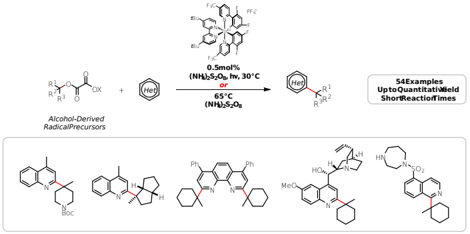