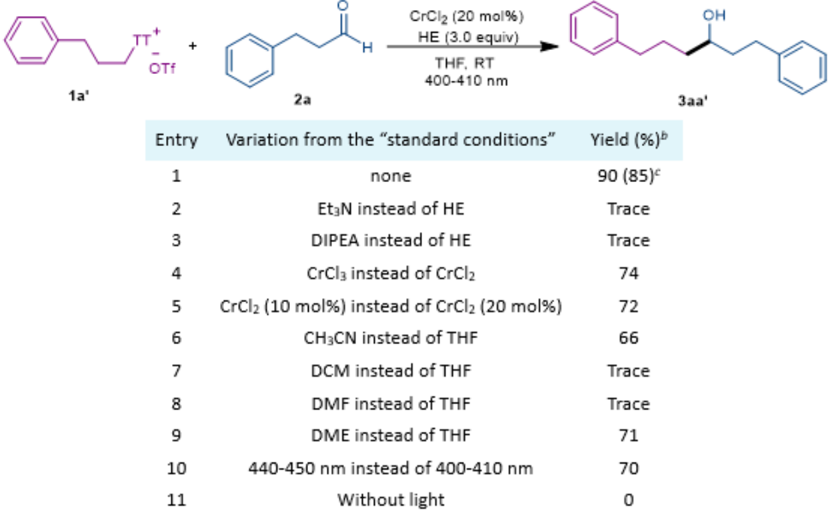
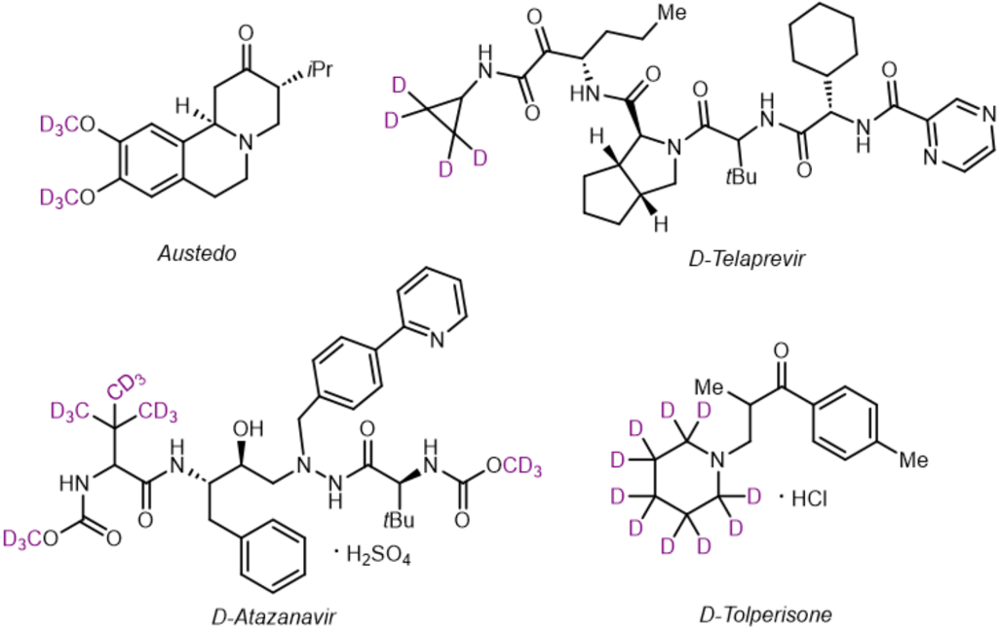
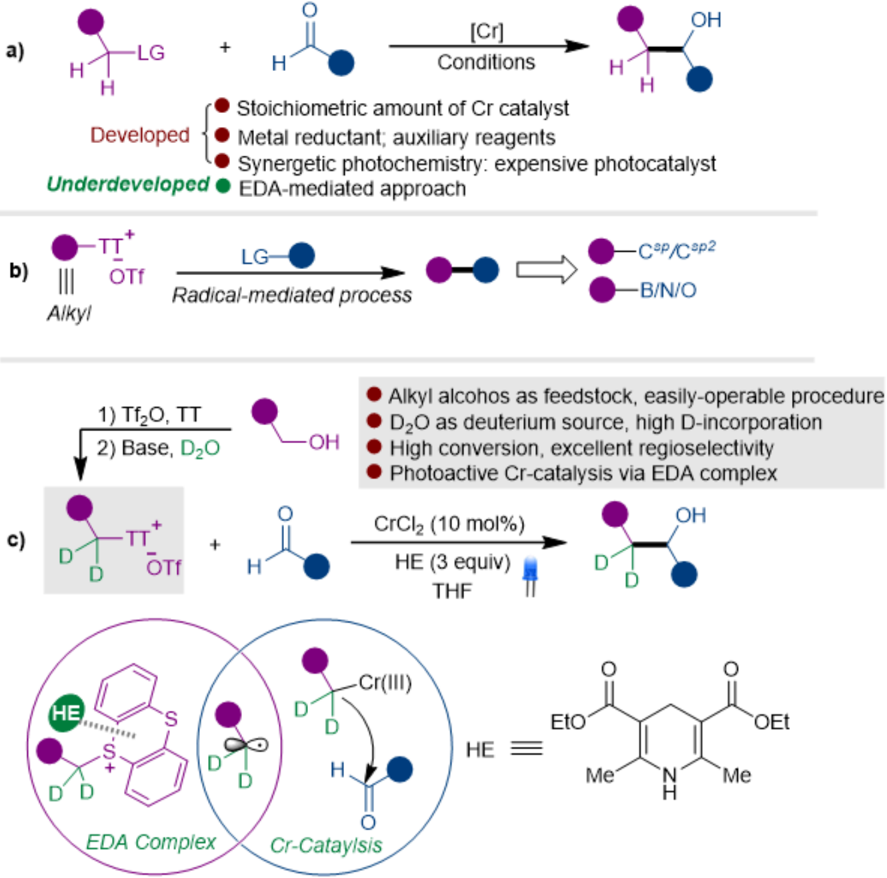
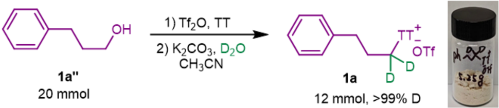
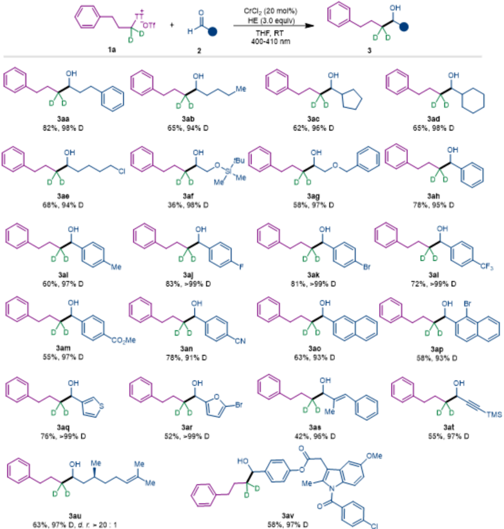
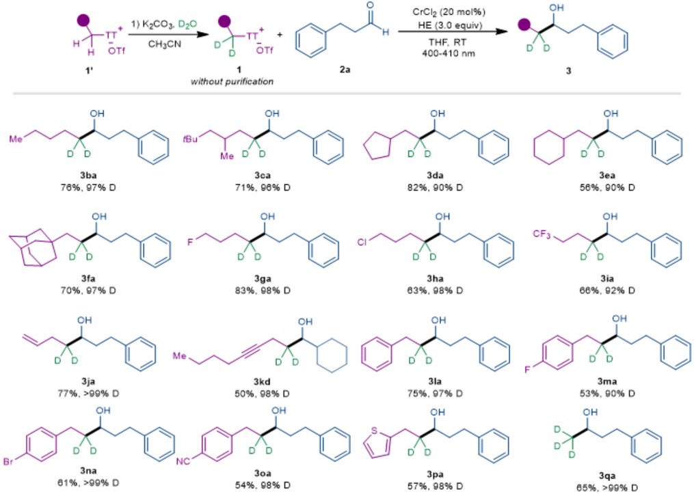
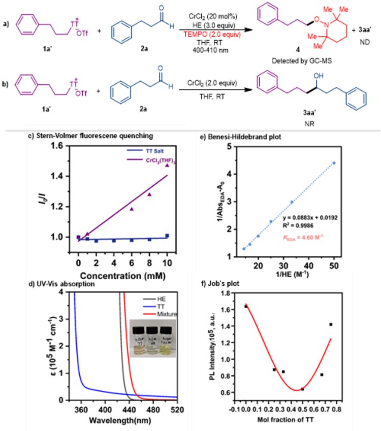
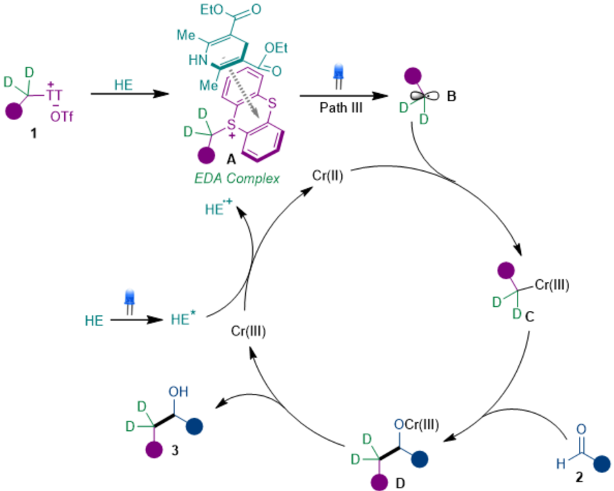
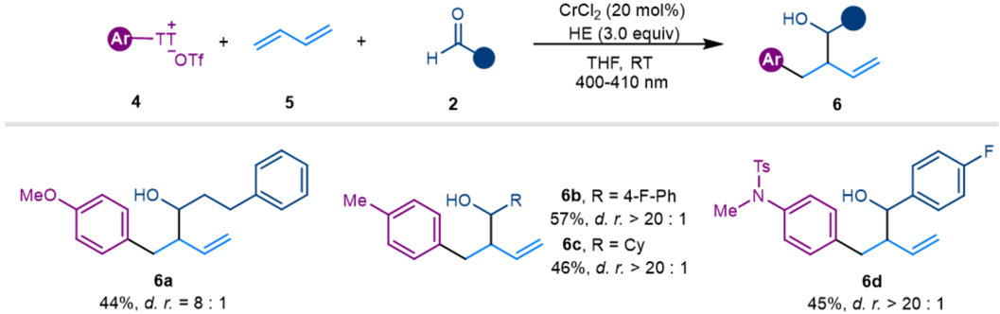

binlin Lnao zhaobinlin@n.jfu.edu.cn

Research Square

Preprints are preliminary reports that have not undergone peer review.

[or referenced by the media as validated information.](https://doi.org/10.21203/rs.3.rs-5102309/v1)

## Thianthrenium-Enabled Chromium-Catalyzed Deuterated Alkyl Addition to Aldehydes via Photoactive Electron Donor-Acceptor Complex

## Binlin Zhao

Nanjing Forestry University

https://orcid.org/0000-0003-3803-6159

## Wenjuan Xiao

Nanjing Forestry University

Youye Tian

Nanjing Forestry University

Liting Du

Nanjing Forestry University

Wen Liu

Nanjing Forestry University

Changping Fang

Nanjing Forestry University

## Mengtao Ma

Nanjing Forestry University

## Article

Keywords:

Posted Date: September 23rd, 2024

DOI: https://doi.org/10.21203/rs.3.rs-5102309/v1

License:

  This work is licensed under a Creative Commons Attribution 4.0 International License.

Read Full License

Additional Declarations: There is NO Competing Interest.

They should not be considered conclusive, used to inform clinical practice,

## Abstract

The Nozaki-Hiyama-Kishi (NHK) reaction offers effective and reliable strategies for the preparation of alcohols via carbon-carbon bond formation. Typical methods usually require stoichiometric amount of chromium salts, co-transition metals and auxiliary reagents, which limits practical application in industrial chemistry. In order to mitigate these limitations, substantial efforts have been made to develop chromium-catalytic approaches. However, excess amount of metal reductants or expensive photocatalysts played essential roles during the catalytic cycles. Here, we present a photoactive electron donor-acceptor (EDA) complex-induced chromium-catalyzed route accomplishing alkyl addition to aldehydes without the requirement of metal reductants or photocatalysts. Furthermore, based on the pHdependent site-selective hydrogen isotope exchange (HIE) of alkyl thianthrenium salts, diversities of β -deuterated secondary alcohols could be prepared with high eciency and excellent deuterium incorporation. Mechanistic studies revealed that the photo-induced intramolecular single electron transfer (SET) of EDA complex happened to provide alkyl radicals that are captured by Cr(II) species to facilitate the subsequent carbon-carbon formation. Meanwhile, the excited Hantzsch ester could act as the terminal reductant for the turnover of the chromium catalyst.

## Introduction

Deuterium as a stable and nonradioactive isotope has been widely used in NMR analysis, mechanistic studies, pharmaceuticals and biochemistry development. 1-5  Deuterium-labeled molecules have attracted remarkable attentions since the rst deuterated drug Austedo (deutertrabenazine) was approved by U. S. Food and Drug Administration (FDA) in 2017, which is used to treat chorea-associated Huntington's disease. 6,7  Remarkably, the selected FDA-approved alkyl deuterated drugs (Fig. 1) demonstrated that the alkyl-deuterated molecules have been gaining lots of traction. To meet the demand for synthesizing deuterated compounds, an increasing number of ecient deuterium-labeled synthetic platforms have been established by various chemical scientists giving access to varieties of deuterated compounds. Compared to the incorporation of deuterium into aromatic rings, approaches for deuteration at aliphatic carbons are limited. 8 Among these strategies for the alkyl deuteration, α -deuterated alcohols could be obtained by the reduction procedure or hydrogen isotope exchange (HIE) strategies with the assistance of the hetero atom or functional groups adjacent to the α -carbon. 9-11 However, it is still of great challenge to realize the synthesis of β -deuterated alcohols with high deuterium-incorporation level and excellent β -regioselectivity. 12,13

The Nozaki-Hiyama-Kishi (NHK) reaction is a well-known classic reaction for carbon-carbon bond construction enabled by the nucleophilic addition of organometallic Cr(III) species to carbonyl compounds. 14,15  Traditionally, the NHK reaction usually required stoichiometric amount of chromium catalyst and a catalytic amount of co-catalyst to achieve the alkyl halides addition to aldehydes. 16-19 In order to reduce the amount of chromium catalyst, catalytic versions were developed with the employment of metal reductants and external auxiliary reagents. 20-22  Recently, the synergetic

photoredox and chromium catalysis strategies provided alternative approaches for the couplings between various alkyl radical precursors and aldehydes, 23 in which the expensive photo-catalysts are essential to fulll the catalytic cycle from Cr(III) to Cr(II) (Fig. 2, A). Inspired by electron donor-acceptor (EDA) complex chemistry that triggers the generation of radical species via the photo-induced intramolecular single electron transfer without the participant of an exogenous photo-catalyst, 24  we hypothesized that Hantzsch ester (HE) could serve as electron donor for the formation of EDA complex with alkyl thianthrenium salts, 25  meanwhile the redox potential of the excited HE was estimated as -2.28 V, 26 which could accomplish the single-electron-transfer (SET) reduction of high-valent Cr(III) species (E 1/2 (Cr 3+ /Cr 2+ ) = - 0.51 V vs SCE in DMF; E 1/2 (Cr 3+ /Cr 2+ ) = - 0.65 V vs SCE in H 2 O). 27,28  Some great achievements have already been made for the photoactive EDA-mediated functionalization of aryl thianthrenium salts. 29-33  In contrast to the prosperous advancement of desulfurative functionalizations of aryl thianthrenium salts, the development of alkyl thianthrenium is rather underdeveloped, 34-36  among which the transformations via photoactive EDA complexes are scarely reported (Fig. 2, B). 37 Here we developed an unprecedented photoactive chromium-catalyzed electron donor-acceptor complexmediated approach, leading to the alkyl addition to aldehydes of alkyl thianthrenium salts with aromatic or aliphatic aldehydes (Fig. 2, C). Notably, it was found that the α -deuterated alkyl thianthrenium salts could be easily prepared from alkyl alcohols with high eciency and high deuterium incorporation under mild basic conditions with the employment of easily available deuterium oxide as deuterium source. 38 Based on this discovery, varieties of β -deuterated secondary alcohols could be obtained by this chromium-catalyzed deuterated alkyl addition to aldehydes via photoactive EDA complexes.

## Results

Table 1| Reaction investigation.#

CrCIz (20 mol%)

HE (3.0 equiv)

| EtaN instead of HE                         |             |
|--------------------------------------------|-------------|
| DIPEA instead of HE                        | Trace Trace |
| CrCla instead of CrCla                     | 74          |
| CrCIz (10 mol%) instead of CrCIz (20 mol%) | 72          |
| CHICN instead of THF                       | 66          |
| DCM instead of THF                         | Trace       |
| DMF instead of THF                         |             |
| DME instead of THF                         | Trace 71    |
| 440-450 nm instead of 400-410 nm           | 70          |
| Without light                              |             |

400 nm-410 nm LEDS, RT, 12 h. 1H NMR yield using CH2Br2 as an internal standard. " Vield of isolated 3aa'

was in parentheses.

Reaction design. To validate our hypothesis, we initially investigated this photo-induced chromiumcatalyzed NHK-type reaction using alkyl thianthrenium salt 1a' and aldehyde 2a as model substrates in the presence of chromium catalyst and HE. It was found that the solution of sulfonium salt 1a' and aldehyde 2a in THF was treated with CrCl 2  (20 mol%) and HE (3.0 equiv) under the irradiation of blue LEDs (400-410 nm), giving access to the desired secondary alcohol 3aa' in 90% yield (85% yield of isolated product) (Entry 1). When the reductant of HE was changed to Et 3 N or iPr 2 NEt, only trace amount of product 3aa' could be detected (Entries 2-3). Additionally, either employment of CrCl 3 or reduction of the loading amount of CrCl 2  led to a slightly decreased yield of 3aa' (Entries 4-5). Operating the reaction in other solvents involving CH 3 CN, DCM, DMF, DME showed that THF was the optimal choice for this reaction (Entries 6-9). Moreover, other blue LEDs (440-450 nm) could also provide 70% yield of alcohol 3aa' (Entry 10), and no product could be detected when the reaction was operated without light (Entry 11).

α -Deuterated alkyl thianthrenium salt 1a was readily accessible, which could be easily prepared in high yields and excellent deuterium incorporation from the corresponding alkyl alcohol 1a'' (Fig. 3). Wherein, the regioselective HIE was achieved through a pH-dependent procedure utilizing D 2 O as the preferred deuterium source under the mild basic conditions.

Scope of the methodology. With the optimal conditions for the photo-induced chromium-catalyzed reactions in hand, we considering utilizing this established platform to facilitate the transfer of

OH

deuterated alkyl moieties from the corresponding thianthrenium salts to the carbonyl units of aldehydes. Our investigation began with an exploration of various aldehydes and alkyl thianthrenium salts. Firstly, a series of aldehydes involving alkyl aldehydes and aryl aldehydes were tested using deuterated substrate 1a as a coupling partner, which was shown in Fig. 4. As expected, the non-biased alkyl aldehydes 2a-2d could couple with 1a furnishing 62-82% yields of β -deuterated secondary alcohols 3aa-3ad with excellent deuterium incorporation. The chloro and ether groups were also compatible with this catalytic conditions, aldehydes 2e-2g could react with deuterated reagent 1a to deliver high deuterium incorporation level of deuterated alcohols 3ae-3ag in modest to good yields. Moreover, aromatic aldehydes could also be selected as good coupling candidates for this photo-induced NHK reactions. Benzaldehyde and the ones bearing methyl, uoro, bromo, triuoromethyl, ester and cyano groups on the aromatic rings performed well providing 60%-83% yields of secondary alcohols 3ah-3an, with deuterium incorporation up to 99%. Meanwhile, π -extended aldehydes 2o-2p were effective under these reaction conditions, producing the deuterated alcohols 3ao-3ap in 58%-63% yields. The coupling reactions between electrophile 1a and heteroaromatic aldehydes 2q-2r could be operated smoothly giving access to products 3aq-3ar in 52%-76% yields. Remarkably, even enal 2s and ynal 2t showed good performance producing medium yields of

- 1,2-addition products with unsaturated C-C bonds untouched. This catalytic platform also proved to be amenable for the late-stage functionalization in cases of complex molecules. The results of (-)-Citronellal 2u and Indometacin-derived aldehyde 2v with thianthrenium salt 1a demonstrated the further potential application for preparing complex β -deuterated secondary alcohols.

Furthermore, a host of alkyl thianthrenium salts were also evaluated, which were shown in Fig. 5. In order to simplify the procedure, the deuterated alkyl thianthrenium salts 1 were in situ-generated via pHdependent procedures, participating in the photoactive chromium-catalyzed reactions subsequently without further purication. The experimental results showed that a wide range of α -deuterated alkyl thianthrenium salts 1 could be probed with the aldehyde 2a. Alkyl thianthrenium salts 1b-1f with different skeletal structures were investigated to be suitable deuterated alkyl precursors, coupling with aldehyde 2a to generate 56%-82% yields of products 1b-1f. Furthermore, alkyl thianthrenium salts 1g-1k containing uoro, chloro, triuoromethyl, alkenyl and alkynyl groups demonstrated high eciency in producing β -deuterated secondary alcohols 3ga-3kd with yields ranging from 50-83%. Phenyl-, functionalized phenyland thiophenyl-substituted thianthrenium salts could also be amenable to this reaction system, providing excellent deuterium-incorporation level of products 3la-3oa in 53%-75% yields. Notably, the deuterated methyl unit could be assembled onto the carbonyl moiety of aldehyde with high eciency leading to the formation of 3qa in 65% yield, which could be applied for the synthesis of CD 3 -labeled compounds or late-stage functionalization of bioactive molecules. 39

Mechanism exploration. To shed light on the mechanism of this photoactive chromium-catalyzed reaction, a set of mechanistic experiments were operated. (Fig. 6). Firstly, a radical trapping experiment was conducted with external addition of 2,2,6,6-Tetramethyl-1-piperidyloxy (TEMPO) into the standard reaction system. It was observed that no alkyl addition product 3aa' was formed along with the detection

of alkyl radical-trapping adduct 4 by GC-MS analysis (Fig. 6, a), which was indicated that a radicalmediated process could be involved and the alkyl thianthrenium salts 1 worked as the radical precursors. Based on this established catalytic platform, we considered three possible pathways for the generation of alkyl radical species from alkyl thianthrenium salts 1: (I) Reductive SET procedure between Cr(II) salts and alkyl thianthrenium salt 1; (II) Reductive SET procedure between excited HE and alkyl thianthrenium salt 1; (III) Photo-induced EDA complex-mediated SET event. The coupling reaction between alkyl thianthrenium salt 1a' and aldehyde 2a were treated with 2.0 equivalent of CrCl 2 , however, the reaction didn't occur (Fig. 6, b). Thus, the possibility of chromium-catalyzed the formation of alkyl radical could be excluded. Moreover, Stern-Volmer quenching experiments of excited HE with alkyl thianthrenium salt 1 and CrCl 3 ·THF were conducted to conform the quenching of excited HE (Fig. 6, c). The emission of HE could be quenched by Cr(III) instead of alkyl thianthrenium salt 1a', suggesting that the excited HE could reduce Cr(III) directly instead of alkyl thianthrenium salt 1a'. In order to explore whether the reactions underwent photo-induced EDA complex-mediated procedure, some related experiments were conducted. The UV-Visible absorption spectrum of alkyl thianthrenium salt 1a', HE and the mixture of 1a' and HE in THF was recorded individually. The mixture of 1a' and HE in THF displayed a signicant red-shift (Fig. 6, d, red line) originated from the association of electron rich HE and electron decient sulfonium salt leading to the formation of a new molecule aggregation. Meanwhile, association constant K EDA  of 4.60

M - 1 of HE with 1a' was investigated by Benesi-Hildebrand plot analysis, suggesting a plausible EDA complex formation between HE and 1a' (Fig. 6, e). 40 Furthermore, Job's plot studies revealed the nature of this interaction, indicating that a 1 : 1 stiochiometric ratio of donor (HE) and acceptor (1a') was involving in the formation of this EDA complex (Fig. 6, f). 41

Based on the above mechanistic studies, we hypothesized the plausible mechanism depicted in Fig. 7. When present in solution, electron-rich HE and electron-decient thiathrenium salts 1 interact with each other generating EDA complex A. Under the irradiation of blue LEDs (400-410 nm), an intra-complex SET happened from donor (HE) to acceptor (1), providing alkyl radical intermediate B. 42,43  Subsequently, the reactive alkyl radical B was captured by Cr(II) salt to form a alkyl-Cr(III) complex C, which was converted into intermediate D enabled by the alkyl addition to carbonyl unit of aldehyde 2. Eventually, the sequential protonation was responsible for the formation of desired secondary alcohol 3 with the release of Cr(III) species. Meanwhile, The Cr(III) salt could be reduced into Cr(II) fullling the catalytic cycle by the excited HE.

Further Applications. Furthermore, this established platform is also ecient for the three-component reaction of aryl thianthrenium salts, 1, 3-butadiene and aldehydes owing to the radical-mediated bridging capability of 1,3-butadiene 44-46 . A series of homoallylic alcohols could be obtained via this dual photocatalysis and chromium catalysis (Fig. 8).

## Discussion

In conclusion, we have developed the rst photoactive EDA complex-mediated chromium-catalyzed platform, which could be applied for alkyl addition from alkyl thianthrenium salts to aldehydes. This catalytic performance was found to be superior to that of the well-established strategies. Based on this approach, diversities of β -deuterated secondary alcohols with excellent deuterium-incorporation levels could be eciently obtained from α -deuterated thianthrenium salts, which could be easily available, conveniently prepared from alcohols utilizing D 2 O as deuterium source. Mechanistic explorations revealed that the EDA complexes generated between electron-rich HE and electron-decient thianthrenium salts played key roles in the generation of radical species. Meanwhile, the excited HE could work as the terminal reductant for the catalytic turnover of chromium catalyst. This chemistry provides highly valuable method for synthesizing deuterated molecules. Additionally, the success of this reaction would expand the application of corporation between EDA complex and metal catalysis.

## Methods

General procedures for chromium-catalyzed deuterated alkyl addition to aldehydes. In a nitrogen-lled glove box, to a 10 mL oven-dried schlenk tube equipped with a stir bar was added CrCl 2  (0.04 mmol, 20 mol%). The schlenk tube was sealed and removed from the glovebox. Then alkyl thianthrenium salts 1 (0.3 mmol, 1.5 equiv) and HE (0.6 mmol, 3 equiv) were added under a nitrogen atmosphere. Subsequently, anhydrous THF (1.0 mL) were added via syringe, followed by addition of aldehyde 2 (0.2 mmol, 1.0 equiv). The reaction mixture was stirred and irradiated with 400-410 nm blue LEDs for 12 hours. After the reaction completed, the reaction mixture was opened to air diluted with 3 mL of ethyl acetate, and ltered over a 1 cm pad of silica. The pad was rinsed with ethyl acetate (3 2 mL), and the combined solutions were concentrated in vacuo. The crude material was loaded onto a silica gel column and separated by ash chromatography (eluent: PE/EA). ×

## Declarations

## Data availability.

The authors declare that the data supporting the ndings of this study are available within the article and Supplementary Information le, or from the corresponding author upon reasonable request.

## Acknowledgements

We gratefully acknowledge nancial support from the National Natural Science Foundation of China (22102072, 22171137), Natural Science Foundation of Jiangsu Province (BK20200765).

## Author contributions

B.Z. conceived the concept, directed the project and wrote the paper. W.X., Y.T., W.L. and C.F. performed the experiments. L. D. and M.M. discussed the results.

## Additional information

Supplementary Information accompanies this paper at http://www.nature.com/ naturecommunications

Competing interests: The authors declare no competing interests.

Reprints and permission information is available online at http://npg.nature.com/ reprintsandpermissions/

## References

1. Belleau B, Burba J, Pindell M, Reiffenstein J (1961) Effect of Deuterium Substitution in Sympathomimetic Amines on Adrenergic Responses. Science 133:102-104
2. Mutlib AE (2008) Application of Stable Isotope-Labeled Compounds in Metabolism and in Metabolism-Mediated Toxicity Studies. Chem Res Toxicol 21:1672-1689
3. Atzrodt J, Derdau V, Kerr WJ, Reid M (2018) Deuterium- and Tritium -Labelled Compounds: Applications in the Life Sciences. Angew Chem Int Ed 57:1758-1784
4. Atzrodt J, Derdau V, Kerr WJ, Reid M (2018) C - H Functionalisation for Hydrogen Isotope Exchange. Angew Chem Int Ed 57:3022-3047
5. Pirali T, Serani M, Cargnin S, Genazzani AA (2019) Applications of Deuterium in Medicinal Chemistry. J Med Chem 62:5276-5297
6. . Schmidt C (2017) First deuterated drug approved. Nat. Biotechnol. 35, 493 - 494
7. DeWitt SH, Maryanoff BE (2018) Deuterated Drug Molecules: Focus on FDA-Approved Deutetrabenazine: Published as part of the Biochemistry series Biochemistry to Bedside. Biochemistry 57:472-473
8. . Valero M, Derdau V (2020) Highlights of aliphatic C(sp 3 )-H hydrogen isotope exchange reactions. J Label Comp Radiopharm 63:266-280
9. Kopf S et al (2022) Recent Developments for the Deuterium and Tritium Labeling of Organic Molecules. Chem Rev 122:6634-6718
10. Jansen-van Vuuren RD, Jedlov č nik L, Ko š mrlj J, Massey TE, Derdau V (2022) Deuterated Drugs and Biomarkers in the COVID-19 Pandemic. ACS Omega 7:41840-41858
11. Itoga M et al (2022) Iridium-catalyzed α -selective deuteration of alcohols. Chem Sci 13:8744-8751
12. Chatterjee B, Gunanathan C (2015) Ruthenium Catalyzed Selective α - and α , β -Deuteration of Alcohols Using D 2 O. Org Lett 17:4794-4797
13. Kar S, Goeppert A, Sen R, Kothandaraman J (2018) Surya Prakash, G. K. Regioselective deuteration of alcohols in D 2 O catalysed by homogeneous manganese and iron pincer complexes. Green Chem 20:2706-2710
14. Jin H, Uenishi J, Christ WJ, Kishi Y (1986) Catalytic effect of nickel(II) chloride and palladium(II) acetate on chromium(II)-mediated coupling reaction of iodo olens with aldehydes. J Am Chem Soc

15. Takai K et al (1986) Reactions of alkenylchromium reagents prepared from alkenyl triuoromethanesulfonates (triates) with chromium(II) chloride under nickel catalysis. J Am Chem Soc 108:6048-6050
1. Takai K, Nitta K, Fujimura O, Utimoto K (1989) Preparation of alkylchromium reagents by reduction of alkyl halides with chromium (II) chloride under cobalt catalysis. J Org Chem 54:4732-4734
17. Wessjohann LA, Schrekker HS (2007) Takai-Utimoto reactions of oxoalkylhalides catalytic in chromium and cobalt. Tetrahedron Lett 48:4323-4325
1. Wessjohann LA, Schmidt G, Schrekker HS (2008) Reaction of secondary and tertiary aliphatic halides with aromatic aldehydes mediated by chromium(II): a selective cross-coupling of alkyl and ketyl radicals. Tetrahedron 64:2134-2142
19. Ni S et al (2019) A Radical Approach to Anionic Chemistry: Synthesis of Ketones, Alcohols, and Amines. J Am Chem Soc 141:6726-6739
20. Fürstner A (1999) Carbon - Carbon Bond Formations Involving Organochromium(III) Reagents. Chem Rev 99:991-1046
21. Li J, Knochel P (2019) Chromium-Catalyzed Cross-Couplings and Related Reactions. Synthesis 51:2100-2106
22. Bandini M, Cozzi PG, Melchiorre P , Umani-Ronchi A (1999) The First Catalytic Enantioselective Nozaki-Hiyama Reaction. Angew Chem Int Ed 38:3357-3359
23. Schwarz JL, Schäfers F, Tlahuext-Aca A, Lückemeier L, Glorius F (2018) Diastereoselective Allylation of Aldehydes by Dual Photoredox and Chromium Catalysis. J Am Chem Soc 140:12705-12709
24. Crisenza GEM, Mazzarella D, Melchiorre P (2020) Synthetic Methods Driven by the Photoactivity of Electron Donor-Acceptor Complexes. J Am Chem Soc 142:5461-5476
25. Kammer LM, Badir SO, Hu R-M, Molander GA (2021) Photoactive electron donor-acceptor complex platform for Ni-mediated C(sp  3 )-C(sp  2 ) bond formation. Chem Sci 12:5450-5457
2. Jung J, Kim J, Park G, You Y, Cho EJ (2016) Selective Debromination and α -Hydroxylation of α -Bromo Ketones Using Hantzsch Esters as Photoreductants. Adv Synth Catal 358:74-80
27. Allen J, Bard RP (1985) Standard Potentials in Aqueous Solutions, 1st Edition, M.Dekker, New York
2. Izutsu PDK (2009) Electrochemistry in Nonaqueous Solutions, Second Edition, Wiley-VCH Verlag GmbH and Co. KGaA, Weinheim
29. Van Dalsen L, Brown RE, Rossi-Ashton JA, Procter DJ (2023) Sulfonium Salts as Acceptors in Electron Donor -Acceptor Complexes. Angew Chem Int Ed 62:e202303104
30. Granados A, Cabrera-Afonso MJ, Escolano M, Badir SO, Molander GA (2022) Thianthrenium-enabled sulfonylation via electron donor-acceptor complex photoactivation. Chem Catal 2:898-907
31. Cabrera-Afonso MJ, Granados A, Molander GA (2022) Sustainable Thioetherication via Electron Donor-Acceptor Photoactivation Using Thianthrenium Salts. Angew Chem Int Ed 61:e202202706

32. Dewanji A et al (2023) A general arene C-H functionalization strategy via electron donor-acceptor complex photoactivation. Nat Chem 15:43-52
33. Zhao H, Cuomo VD, Rossi-Ashton JA, Procter DJ (2024) Aryl sulfonium salt electron donor-acceptor complexes for halogen atom transfer: Isocyanides as tunable coupling partners. Chem 10:12401251
34. Holst DE, Wang DJ, Kim MJ, Guzei IA, Wickens ZK (2021) Aziridine synthesis by coupling amines and alkenes via an electrogenerated dication. Nature 596:74-79
35. Alvarez EM et al (2023) O-, N- and C-bicyclopentylation using thianthrenium reagents. Nat Synth 2:548-556
3. Chen C, Wang M, Lu H, Zhao B, Shi Z (2021) Enabling the Use of Alkyl Thianthrenium Salts in CrossCoupling Reactions by Copper Catalysis. Angew Chem Int Ed 60:21756-21760
37. Chen C, Wang Z-J, Lu H, Zhao Y, Shi Z (2021) Generation of non-stabilized alkyl radicals from thianthrenium salts for C-B and C-C bond formation. Nat Commun 12:4526
3. Zhang J et al (2024) Hydrodeuteroalkylation of Unactivated Olens Using Thianthrenium Salts. Angew Chem Int Ed 63:e202409862
39. Sun Q, Soulé J-F (2021) Broadening of horizons in the synthesis of CD 3  -labeled molecules. Chem Soc Rev 50:10806-10835
40. Benesi HA, Hildebrand JH (1949) A Spectrophotometric Investigation of the Interaction of Iodine with Aromatic Hydrocarbons. J Am Chem Soc 71:2703-2707
41. Renny JS, Tomasevich LL, Tallmadge EH, Collum DB (2013) Method of Continuous Variations: Applications of Job Plots to the Study of Molecular Associations in Organometallic Chemistry. Angew Chem Int Ed 52:11998-12013
42. Wu J, Grant PS, Li X, Noble A, Aggarwal VK (2019) Catalyst-Free Deaminative Functionalizations of Primary Amines by Photoinduced Single -Electron Transfer. Angew Chem Int Ed 58:5697-5701
43. Zhang J, Li Y, Xu R, Chen Y (2017) Donor-Acceptor Complex Enables Alkoxyl Radical Generation for Metal-Free C(sp  3 )-C(sp  3 ) Cleavage and Allylation/Alkenylation. Angew Chem Int Ed 56:1261912623
44. Takai K, Matsukawa N, Takahashi A, Fujii T (1998) Three-Component Coupling Reactions of Alkyl Iodides, 1,3-Dienes, and Carbonyl Compounds by Sequential Generation of Radical and Anionic Species with CrCl 2 . Angew Chem Int Ed 37:152-155
45. Xiong Y, Zhang G (2018) Enantioselective 1,2-Difunctionalization of 1,3-Butadiene by Sequential Alkylation and Carbonyl Allylation. J Am Chem Soc 140:2735-2738
4. Schwarz JL, Huang H-M, Paulisch TO, Glorius F (2020) Dialkylation of 1,3-Dienes by Dual Photoredox and Chromium Catalysis. ACS Catal 10:1621-1627

D}CO

Me

Figure 1 Some selected approved alkyl deuterated drugs.

aj b}

c)

OH

[Cr]

Figure 2

Chromium-catalyzed NHK reactions. a) Development of NHK reactions. b) Desulfurative functionalizations of alkyl thianthrenium salts. c) This work about EDA-induced NHK reaction.

LG

1) Tf2O, TT

t.a5g.

realaton ol acaterated alny, tmantmemum salt.

CrCI, (20 mal%)

IHE (3.0 equiV)

OTI

## Preparation of deuterated alkyl thianthrenium salt.

Figure 4

Substrate scope with respect to aldehydes. Reaction conditions: 1a (0.3 mmol), 2 (0.2 mmol), CrCl 2  (20 mol %), and HE (0.6 mmol) in THF (1.0 mL), 400 nm-410 nm LEDs, RT, 12 h; isolated yields. The deuterium incorporation value was determined by HRMS or  1 H NMR, and d. r. value was determined by 1 H NMR.

11-

Figure 5

Substrate scope with respect to deuterated alkyl thianthrenium salts. Reaction conditions: (1) alkyl thianthrenium salts 1' (0.3 mmol) and K 2 CO3  (0.9 mmol) in MeCN (1 mL) and D 2 O (0.5 mL), 40 ℃ , 2h; (2) 1 (0.3 mmol), 2a (0.2 mmol), CrCl 2  (20 mol %), and HE (0.6 mmol) in THF (1.0 mL), 400 nm-410 nm LEDs, RT, 12 h; isolated yields. The deuterium incorporation value was determined by HRMS or  1 H NMR.

CrCI, (20 mcl%)

HE (3.0 equiv)

Me

Me

Figure 6

Mechanism exploration. a) Radical trapping experiment. b) Reaction investigation utilizing stoichiometric amount of chromium catalyst. c) Stern-Volmer uorescene quenching. d) UV-Vis absorption. e) BenesiHildebrand plot. f) Job's plot.

MeO

EtO

Me

Figure 7

Plausible mechanism.

Figure 8

CrCl2 (20 mol%)

Further application: Photoactive chromium-catalyzed three-component reactions. Reaction conditions: Aryl thianthrenium salts 4 (0.3 mmol), 1,3-butadiene 5 (0.8 mmol), aldehyde 2 (0.2 mmol), CrCl 2  (20 mol %), and HE (0.6 mmol) in THF (1.0 mL), 400 nm-410 nm LEDs, RT, 12 h; isolated yields, and d. r. value was determined by  1 H NMR.

## Supplementary Files

This is a list of supplementary les associated with this preprint. Click to download.

- [SupportingInformation.docx](https://assets-eu.researchsquare.com/files/rs-5102309/v1/2f4f80fe4c0492b7f22fbb9e.docx)