1234567890():,;

ARTICLE

https://doi.org/10.1038/s42004-023-00960-z

OPEN

## Transition metal-free visible light photoredoxcatalyzed remote C(sp 3 ) -H borylation enabled by 1,5-hydrogen atom transfer

Beiqi Sun 1,2 , Wenke Li 2 , Qianyi Liu 2 , Gaoge Zhang 2 &amp; Fanyang Mo 1 ✉

The borylation of unreactive carbon-hydrogen bonds is a valuable method for transforming feedstock chemicals into versatile building blocks. Here, we describe a transition metal-free method for the photoredox-catalyzed borylation of unactivated C(sp 3 ) -H bond, initiated by 1,5-hydrogen atom transfer (HAT). The remote borylation was directed by 1,5-HAT of the amidyl radical, which was generated by photocatalytic reduction of hydroxamic acid derivatives. The method accommodates substrates with primary, secondary and tertiary C(sp 3 ) -H bonds, yielding moderate to good product yields (up to 92%) with tolerance for various functional groups. Mechanistic studies, including radical clock experiments and DFT calculations, provided detailed insight into the 1,5-HAT borylation process.

1 School of Materials Science and Engineering, Peking University, Yiheyuan Road, Beijing 100871, China. 2 College of Engineering, Peking University, Yiheyuan Road, Beijing 100871, China. ✉ email: fmo@pku.edu.cn

A lkyl boronic esters are highly versatile building blocks in organic synthesis because C -B bonds can be easily transformed into various useful functional groups 1 . C -H borylation is desirable and powerful because it directly transforms common C -H bonds into synthetically valuable C -B bonds. Borylation of nonactivated C(sp 3 ) -H is one of the most challenging subjects in the area. In the past decades, a series of methods have been established 2 -4 . and most of them require transition-metals as catalysts, including W 5 , Rh 6 , Pd 7 -10 , Ir 11 -24 (Fig. 1a), and the reaction conditions could be very harsh (temperature 100 -150 °C). In 2020, the Aggarwal group reported the metal-free photoinduced borylation of alkanes (Fig. 1b) 25 . However, due to the low reactivity of alkanes, the reaction requires high equivalency of alkane substrates (10 equiv.), and the yields based on diboron are relatively low (lower than 50% in most cases). Given that boronic esters are important in organic synthesis and medicinal chemistry, it is of great signi fi cance to develop substrate equivalent and ef fi cient C -H borylation methods.

Hydrogen atom transfer (HAT) is a general strategy in organic synthesis, and it represents an attractive approach toward remote C -H functionalization 26 -28 . The earliest example of remote C -H functionalization by means of HAT was Hofmann -Löf fl er -Freytag (HLF) reaction (Fig. 2a) 29,30 , the key step is the 1,5-hydrogen atom abstraction via nitrogen-centered radical, where the bonddissociation energy (BDE) of N -H bond is higher than the C -H bond. In past decades, the nitrogen-centered radical-based HLF type reaction has shown its advances in regioselective functionalization of inert C -H bonds 31,32 , by trapping the carbon-centered radicals towards the formations of C -C 33,34 , C -O 35,36 , C -N 37 -40 , and C -X (X = halogen) 41 -44 bonds. Particularly, amidyl radical is widely explored nitrogen-centered radical in above mentioned processes. In 2016, Knowles 45 and Rovis 46 independently developed oxidative photocatalytic generation of amidyl radicals by direct N -Hbond cleavage, after 1,5-HAT process, followed by the Michael addition of the translocated carbon-centered radical, affording the remote functionalized amides (Fig. 2b). Another way

## a. Transition metal catalyzed C(sp 3 )-H borylation

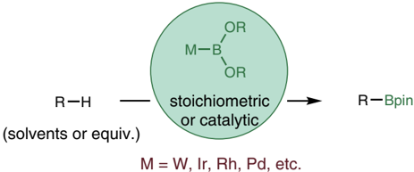

## b. Metal-free C(sp 3 )-H borylation of alkanes

Fig. 1 Unactivated C(sp 3 ) -H bonds borylation. Previously reported: a Transition metal catalyzed C(sp 3 ) -H borylation. b The metal-free photoinduced borylation of alkanes by Aggarwal group.

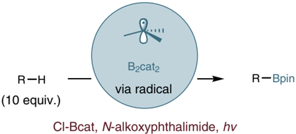

to generate amidyl radical is using activated precursors 47 , for example, single-electron photoreduction of N -acyloxy(halo) phthalimides 48,49 , N -aminopyridinium salts 50 -53 , and hydroxylamides 40,47,54 -58 give the corresponding amidyl radicals upon heterolytic cleavage of the respective leaving groups (Fig. 2c). Despite these advances, trapping the carbon-centered radical with diboron compounds to build C -B bonds, is still challenging and remains unexplored.

In our previous studies, we focused on developing transition metal-free radical borylation reactions 59 -63 . We therefore turned our interest towards the use of amidyl radicals for remote C -H bond ( γ -position of a carbonyl compound) borylation reaction (Fig. 2d). With a properly designed amidyl radical precursor that facilitates an intramolecular 1,5-HAT process, site-selective borylation of γ -C -H bond could be achieved. It is known that α -C -H bond and β -C -H bond could be simply activated 64 . For the direct γ -C -H functionalization, only a few of examples have been reported to date 65 -68 . Thus, our research offers another signi fi cant aspect worthy of consideration. Here we present a method that does not require transition metals for the photoredox-catalyzed borylation of unreactive C(sp 3 ) -H bonds initiated through 1,5-HAT.

## Results and discussion

Reaction optimization . Recently, visible-light photoredox catalysis has been the leading ef fi cient access to N -radicals under mild conditions. With their weak N -O bond, hydroxylamine derivatives have recently been exploited as nitrogen-centered radical precursors in visible-light photocatalysis, given their higher oxidation state, it would be necessary to apply reductive conditions 54,55,57 . Thus, 4-tri fl uoromethylbenzoyl hydroxamic acid derivative ( 1a ) was used as the model substrate to establish optimal reaction parameters, including the equivalency of bis(catecholato) diboron (B2cat2), the choice of photocatalysts (Ir and Ru complexes, or organic photocatalysts), light sources, and additives (Table 1 and Supplementary Table 1 and Fig. 1). We investigated that with Ir( p -CF3ppy)3 (2%) as photocatalyst, 40 W 456 nm light source, Et3N as additive, the desired product was obtained in 45% GC yield. Other amines, such as DABCO, DIPEA or no additive (entry 2 -4), were tested, and DIPEA gave improved yield (47%), almost same yield was obtained with a longer reaction time (30 h) (entry 5). Replacing photocatalyst to Ir(ppy)3, [Ru(bpy)3]Cl2, or 4CzIPN could not give the improved results (entry 6 -8). Gratifyingly, the reaction gave 47% yield by using Eosin Y, which is a non transition metal photocatalyst, and importantly, much cheaper than Ir( p -CF3ppy)3 (entry 9). Furthermore, We examined the in fl uence of the light source. 467 nm wavelength LED turned out to be better than 456 nm LED, leading a jump increasing yield (from 47% to 73%, entry 10). Higher equivalent photocatalyst (5%) resulted in 77% yield (entry 11). Reducing the B2cat2 loading from 3.0 to 2.5 equiv. led to a slightly improved yield (81% GC yield, isolated in 73%), and 4.0 equiv. B 2 cat 2 gave signi fi cantly lower yield (entry 13), which showed that the product yield is not always proportional to the equivalent of borylating reagent. Decreasing the loading of additive DIPEA, the yield dropped to 54% (entry 14). Control experiments revealed that no borylation product formed in the absence of photocatalyst, light or additive (entry 15 -17). To rule out the potential for substrate thermal decomposition, we conducted a control experiment by replacing the light with heating at 50 °C for 12 h in the absence of light. However, no borylation product was detected under these conditions (entry 18). Continuous irradiation is necessary, as turning off the light after 30 min resulted in no product formation (entry 19). The standard reaction in air gave a 76% yield, indicating that the reaction is not sensitive to oxygen (entry 20).

## a. Hofmann-Loffler-Freytag (HLF) reaction

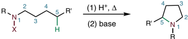

R

- b. C(sp 3 )-H functionalization by oxidative photocatalytic generation of amidyl radicals

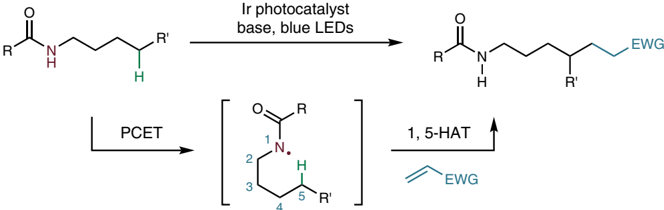

4

- c. C(sp 3 )-H functionalization by amidyl radical precursors
- d. Carbonyl compounds γ -C(sp 3 )-H borylation by amidyl radical precursors

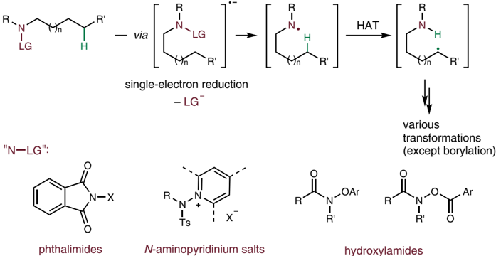

Fig. 2 HLF type remote C -H functionalization reactions. a HLF reaction. b C(sp 3 ) -H functionalization via amidyl radical by Knowles and Rovis group independently. c C(sp 3 ) -H functionalization by amidyl radical precursors. ' N-LG" showed some of the precursors. d This work: carbonyl compounds γ -C(sp 3 ) -H borylation.

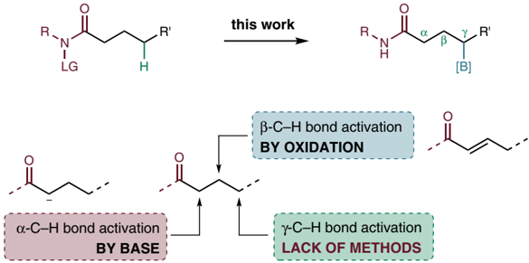

Table 1 Optimization of reaction conditions a .

| Entry   |   B 2 cat 2 | PC (mol%)                   | Light   | Additive     | Yield a,b (%)   |
|---------|-------------|-----------------------------|---------|--------------|-----------------|
| 1       |         3.0 | Ir( p -CF 3 ppy) 3 (2 mol%) | 456nm   | Et 3 N (2.0) | 45              |
| 2       |         3.0 | Ir( p -CF 3 ppy) 3 (2 mol%) | 456nm   | DABCO (2.0)  | 15              |
| 3       |         3.0 | Ir( p -CF 3 ppy) 3 (2 mol%) | 456nm   | DIPEA (2.0)  | 47              |
| 4       |         3.0 | Ir( p -CF 3 ppy) 3 (2 mol%) | 456nm   | none         | trace           |
| 5 c     |         3.0 | Ir( p -CF 3 ppy) 3 (2 mol%) | 456nm   | DIPEA (2.0)  | 49              |
| 6       |         3.0 | Ir(ppy) 3 (2 mol%)          | 456nm   | DIPEA (2.0)  | 30              |
| 7       |         3.0 | [Ru(bpy) 3 ]Cl 2 (2 mol%)   | 456nm   | DIPEA (2.0)  | trace           |
| 8       |         3.0 | 4CzIPN (2 mol%)             | 456 nm  | DIPEA (2.0)  | trace           |
| 9       |         3.0 | Eosin Y (2 mol%)            | 456 nm  | DIPEA (2.0)  | 47              |
| 10      |         3.0 | Eosin Y (2 mol%)            | 467 nm  | DIPEA (2.0)  | 73              |
| 11      |         3.0 | Eosin Y (5 mol%)            | 467 nm  | DIPEA (2.0)  | 77              |
| 12      |         2.5 | Eosin Y (5 mol%)            | 467 nm  | DIPEA (2.0)  | 81 (73)         |
| 13      |         4.0 | Eosin Y (5 mol%)            | 467 nm  | DIPEA (2.0)  | 40              |
| 14      |         2.5 | Eosin Y (5 mol%)            | 467 nm  | DIPEA (1.5)  | 54              |
| 15      |         2.5 | None                        | 467 nm  | DIPEA (2.0)  | trace           |
| 16      |         2.5 | Eosin Y (5 mol%)            | none    | DIPEA (2.0)  | trace           |
| 17      |         2.5 | Eosin Y (5 mol%)            | 467 nm  | None         | trace           |
| 18 d    |         2.5 | Eosin Y (5 mol%)            | none    | DIPEA (2.0)  | trace           |
| 19 e    |         2.5 | Eosin Y (5 mol%)            | 467 nm  | DIPEA (2.0)  | trace           |
| 20 f    |         2.5 | Eosin Y (5 mol%)            | 467 nm  | DIPEA (2.0)  | 76              |

f The reaction was set up in air.

Subtrate scope . With the optimal reaction conditions, we next sought to explore the substrate scope of this visible light photoredox-catalyzed remote C(sp 3 )-H borylation. As summarized in Fig. 3, a variety of hydroxamic acid derivatives were synthesized and tested. The reactions of the substrates with tertiary C -H bonds in the γ -position all gave borylation products in good to excellent yields ( 2a -2d ), while the reactions of the substrate possessing secondary C -H bonds could also afford moderate yield ( 2e, 2h-2j ). Substrates containing tertiary C -H bond in cyclic structure were also tested, and cyclopentyl ( 2f ) and cyclohexyl ( 2g ) products were formed in 83% and 58%, respectively. Specially, we found that this method can activate secondary C(sp 3 )-H bonds in cyclic substrates, producing the corresponding syn product 2h with excellent diastereoselectivity. Moreover, for bicyclic substrate which have more than one γ -positions, such as norbornyl derivative, high site-selectivity was obtained ( 2i , 65%; 2j , 64%) (as indicated by NMR NOE test, see Supplementary Data 2 Figs. 1 -3 for details). With the replacement of tertbutyl group to isopropyl group or cyclohexyl group, the substrates can undergo the desired transformation to form borylation products in moderate to good yields ( 2k -2o ), albeit the undesired hydrogenation by-products accompanied. It may cause by replacing the N -connected alkyl group from tertiary one to secondary one, which weakens the N -H bond, and the 1,5-HAT process was affected thermodynamically (vide infra, a DFT calculation was performed). Interestingly, we found that a benzene ring can be involved in this six-membered ring 1,5-HAT process, as exempli fi ed in the cases of ( 2p -2u ). For isolation of these products, we found the partial instability of the benzylic pinacol boronic esters in silica gel, and that in situ oxidation with H2O2 allowed isolation of the corresponding alcohols in high yields. Various functional groups such as methyl( 2q ), methoxy ( 2r ), chlorine ( 2s ) and bromine ( 2t ) were well tolerated, and the yields were up to 92%. For secondary benzylic substrates( 2u ) or benzylic position on the carbon chain substrates( 2v -2w ), the products were obtained in good yields. α -hydroxy hydroxamic acids derivatives were also tested, including methoxy ( 2x ), acetoxy ( 2y ). Amino acid leucine- derived hydroxamic acid also underwent this remote borylation, giving the desired product in 45% ( 2z ). Our method can also work on complex molecules, such as lithocholic acid and dehydroabietylamine derivatives (in the cases of 2aa and 2ab ). It is worth noting that the last example ( 2ab ) in the substrate scope is a different type other than the rest ones. The borylation of C -H bond took place on the alkyl chain of the amine site.

Mechanistic studies . To gain further insight into the mechanism of this 1,5-HAT borylation reaction, we performed a series of mechanistic investigations. First, 2,2,6,6-tetramethyl-1-piperidinyloxy (TEMPO) was added to standard conditions, and the reaction yielded 16% of the corresponding TEMPO-trapped product 3 as a white solid, instead of the desired borylation product (Fig. 4a). Second, we designed and managed to synthesize the remote cyclopropyl substrate 1ac , and the reaction of 1ac in standard conditions gave the ring-opened terminal borylation product in 32% yield (Fig. 4b). These two experiments indicated the involvement of carbon radical intermediates in this borylation reaction. The photocatalyst Eosin Y was found to be the only absorbing species in the reaction near the excitation wavelength ( λ max = 467 nm) from ultraviolet-visible absorption spectroscopy (Fig. 4c and Supplementary Fig. 2). To determine whether the reaction involves an ef fi cient radical chain mechanism, we performed a light on- off experiment showing no product formation in the dark phases (Fig. 4d and Supplementary Table 2 and Fig. 3).

In recent days, the Chechik group reported a new type of radical scavenger called CHANT to detect short-lived radical intermediates (Supplementary Fig. 4) 69 . In this method, the radical trapping product is a bench-stable terminal alkene that can be analyzed by mass spectrometry (MS). To further testify the 1,5-HAT process, we chose CHANT as radical trapping reagent, and carried out the reaction in standard conditions (Fig. 5). The trapped radicals were then analyzed by electrospray ionization HRMS (Supplementary Tables 3, 4 and Figs. 5 -7). The MS peak at m/z 337.2849 indicates the trapped radical intermediates,

Fig. 3 Substrate scope. a Reaction conditions: substrate (0.3 mmol), B2cat2 (0.75 mmol), Eosin Y (5%), DMA (3 mL), DIPEA (0.6 mmol), irradiated by Kessil 40 W blue LED for 12 h, then with pinacol (4.0 equiv.) and Et3N (1 mL); b Products were formed as mixtures of borylation product and hydrogenation side product; c Yields were of isolated products after in-situ oxidation with hydrogen peroxide (4.0 equiv.); d 1 H NMR yield was reported. e Reaction time was 24 h.

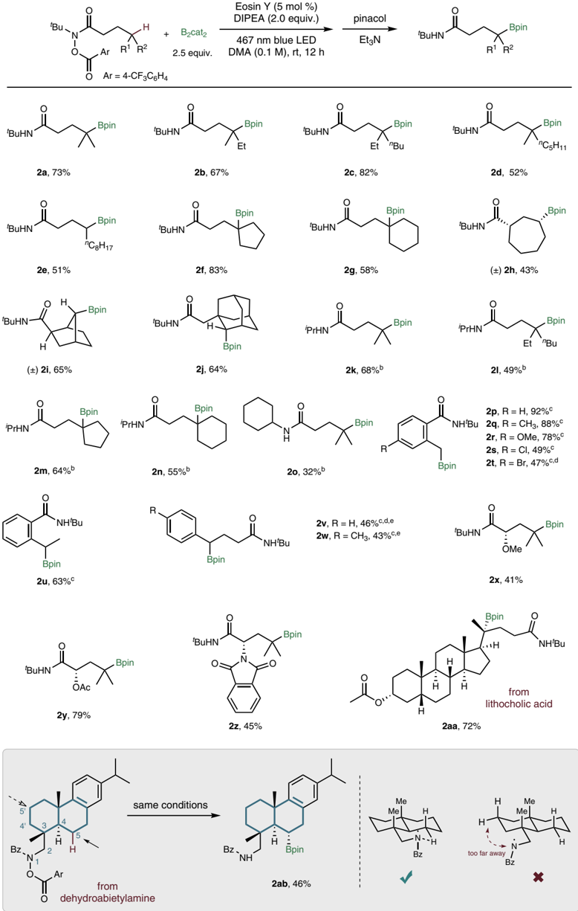

## a. Radical trapping with TEMPO

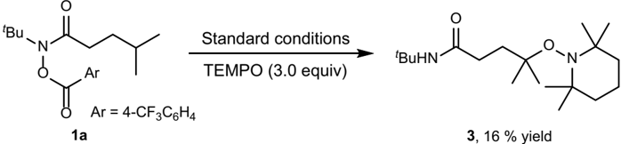

## b. Radical clock reaction

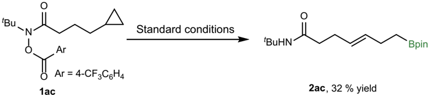

## c. Ultraviolet-visible absorption spectrum

1

0.8

0.6

0.4

0.2

0

300

## d. Light on-off expriment

Eosin Y

Eosin Y + DIPEA

1a + B

2

cat

2  + DIPEA

1a + B

2

cat

400

+ DIPEA + Eosin Y

2

500

wavelength / nm

Fig. 4 Mechanistic studies. a The standard reaction with TEMPO (3.0 equiv.) as a radical scavenger. b Radical clock ring-opening reaction of 1ac . c In the ultraviolet-visible absorption spectrum, the photocatalyst Eosin Y was found to be the only absorbing species in the reaction near the excitation wavelength ( λ max = 467 nm). d The light on-off expriment showed no product formation in dark.

whereas it cannot distinguish the nitrogen-centered radical R1 or the carbon-centered radical R2 , since they are isomers. In order to distinguish them, the tandem mass spectrometry was analyzed at m/z 337.2849, the two low-intensity peaks F1 (m/z 237.1961) and F2 (m/z 181.1336) which contain two nitrogen atoms, could only be attributed to the trapped R1 , the fragments showed that the acyl group RCO was dissociated. The most strong-intensity peaks F3 (m/z 264.1957) is a stable acylium ions, and F4 (m/z 236.2008) is F3 losing CO. They could only be attributed to the trapped R2 , and many other strong peaks could also be attributed to it (see Supplementary Table 4 for details). This experiment proved that the existence of R1 and R2 . The intensity of the trapped R2 is 100 times greater than the trapped R1 . Assuming a similar ionization ef fi ciency of the trapped R1 and R2 species, this suggests that the 1,5-HAT process is very fast and that the carbon-centered radical R2 is the resting state for this radical process.

To better understand the photoredox mechanism of this 1,5HAT process, we carried out density functional theory (DFT) calculations (see Supplementary Information section 6 for details). The computed free energy pro fi le of the key steps in the photo irradiation process is shown in Fig. 6. Eosin Y transfers from ground state EY 2 -to excited singlet state ½ EY 2  Š  (S1) upon being irradiated with the vertical excitation energy of + 65.7 kcal mol -1 (equals to 2.8 eV, corresponds to the energy of 442 nm wavelength light) 70 -72 . Then this singlet state transforms to its more stable triplet counterpart ½ EY 2  Š  (T1) 73 . Next, this triplet state species is oxidatively quenched by 1a to give EY -and 1a -, which further undergoes N -O bond cleavage to form a nitrogen-centered radical, accompanied with the leaving of CF3 C 6 H4 CO  2 group. The N\_radical overcomes a relatively low barrier (7.7 kcal mol -1 ) to the six-member ring transition state HAT\_TS, which allows the hydrogen atom to transfer from C atom to N atom to give the C\_radical, this step is quite favorable thermodynamically. Subsequently, the C\_radical is borylated by diboron to give the desired product 59 .

As shown in substrate scope studies, it is noted that the borylation reactivity is in a order of tertiary C -H bond substrates &gt; secondary ones &gt; primary ones. For tertiary C -H bond substrates, the reactivity of the N-tert -butyl substituted ones

Normalized intensity

600

700

+52.3

1a

CFzC6H4COZ

+13.9

N\_radical

Fig. 5 The radical trapping experiment with CHANT and MS analysis. R1 : carbon-centered radical. R2 : nitrogen-centered radical. Trapped R1 : R1 trapped by CHANT. Trapped R2 : R2 trapped by CHANT. CHANT: N-cyclohexyl-2-[(2,2,6,6-tetramethylpiperidin-1-yl)oxy]methylacrylamide. Cy = cyclohexyl. The fragments F1 and F2 were attributed to trapped R1 ; The fragments F3 and F4 were attributed to trapped R2 .

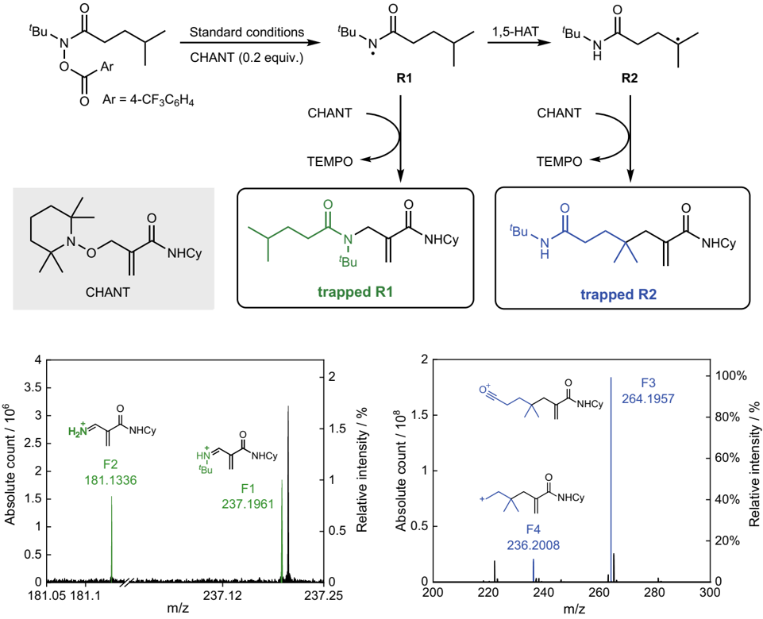

Fig. 6 DFT-computed pathways for the generation of the N -centered radical and 1,5-HAT process. 1a is reducted by EY 2 -(T1)* to give 1a -, followed the leaving of CF 3 C6 H4CO  2 group, which is thermodynamically favorable. The N\_radical overcomes a relatively low barrier (7.7 kcal ⋅ mol -1 ) to give C\_radical. The Gaussian 09 level of M06-2X/6-311 ++ G(d,p)-SMD(DMAc)//B3LYP/6-31 + G(d) was used.

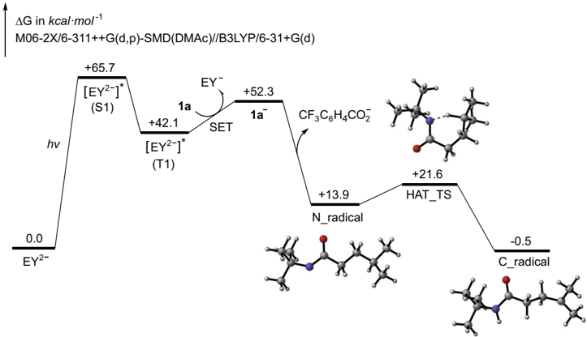

are better than that of the N -isopropyl ones. To further elucidate these reactivity patterns, we calculated the standard Gibbs free energy and the activation Gibbs free energy in the process of 1,5HAT of radicals I to IV (Table 2 and Supplementary Tables 5 -7). Our results indicate that the tertiary C -H bonds are the most thermodynamically and dynamically favorable for 1,5-HAT process, due to the more stability effect of σ -p hyperconjugation. When replacing tertbutyl with isopropyl in tertiary C -H bond substrates, the activation energy raises from 7.7 to 10.8 kcal mol -1 ( IV ), leading to the formation of a certain amount of hydrogenation product.Similar behavior was observed for secondary C -H bond substrates, where the activation energy increases from 7.7 to 10.4 kcal mol -1 ( II ). For the primary C -H bond substrates, the barrier is 13.1 kcal mol -1 ( I ), the

| Table 2 The correlation between the type of remote C - H bonds and reaction parameters.   | Table 2 The correlation between the type of remote C - H bonds and reaction parameters.   | Table 2 The correlation between the type of remote C - H bonds and reaction parameters.   | Table 2 The correlation between the type of remote C - H bonds and reaction parameters.   | Table 2 The correlation between the type of remote C - H bonds and reaction parameters.   |
|-------------------------------------------------------------------------------------------|-------------------------------------------------------------------------------------------|-------------------------------------------------------------------------------------------|-------------------------------------------------------------------------------------------|-------------------------------------------------------------------------------------------|
| kcal mol - 1                                                                              | I                                                                                         | II                                                                                        | III                                                                                       | IV                                                                                        |
| Δ G Θ                                                                                     | - 8.3                                                                                     | - 12.2                                                                                    | - 14.4                                                                                    | - 14.7                                                                                    |
| Δ G ‡                                                                                     | 13.1                                                                                      | 10.4                                                                                      | 7.7                                                                                       | 10.8                                                                                      |

## a. Gram-scale synthesis

Fig. 7 The gram-scale synthesis and further transformations of the borylation products. a Gram-scale synthesis set up in air, resulting 1.59 g 2a as a white solid, the following pictures depict the step-by-step procedure involved in the synthesis. b Conversion of 2a into γ -functionalized carbonyl compounds: oxidation to alcohol; vinylation of boronic ester; transformation to potassium trifluoroborate salts.

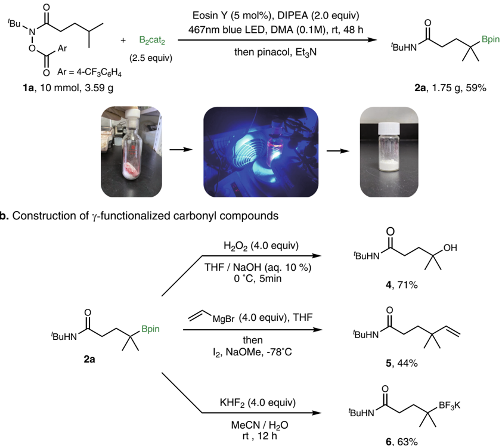

reaction all gave hydrogenation products and no borylation products were obtained.

To further demonstrate the utility of this borylation method, a gram-scale reaction of 1a was carried out under air (Fig. 7a and Supplementary Fig. 8), furnishing 2a in 59% isolated yield. The resulting borylation products could be further transformed to a series of functional groups (Fig. 7b). For example, the tertiary alcohol in γ -position of carbonyl compounds could be obtained by oxidation of the boron compound 2a . In addition, tertiary boronic esters underwent C -C bond formation with vinyl Grignard reagent to afford vinylation products 5 74 . Treatment of 1a with KHF2 yields the potassium tri fl uoroborate salt 6 in 63% yield.

Based on the experimental and computational results as well as studies on previously developed radical borylation reactions 59,62,75 -79 , a proposed mechanism for the photoredoxcatalyzed 1,5-HAT borylation process is presented in Fig. 8. First, substrate 1a is reducted by exicited photocatalyst Eosin Y to give radical A , followed by N -O bond cleavage to give nitrogen-center radical B , due to the higer BDE of N -Hbond, radical B forms the six-membered ring transition state C to allow intramolecular 1,5HAT process to give carbon-centered radical D , which adds to diboron B2cat2 to deliver the adduct E , with the help of DMA, the

Fig. 8 Proposed mechanism for the remote C(sp 3 ) -H borylation reaction enabled by 1,5-HAT process. The carbon radical D is then borylated by B2cat2/ DMA to give G .

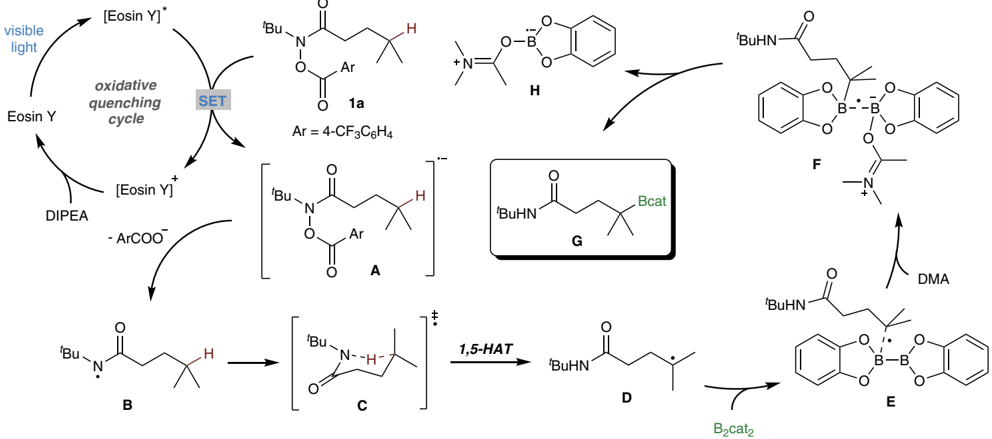

adduct F ' s B -B bond is dissociated to form C -B bond, affords the borylated product G , along with the DMA-Bcat radical H .

## Conclusion

In conclusion, we have developed a transition-metal free visible light photoredox-catalyzed remote C(sp 3 )-H borylation reaction, which enabled by 1,5-HAT process based on hydroxamic acid derivatives. A series of mechanism experiments, as well as DFT calculations resolved the radical mechanism in detail. This investigation afforded remote C -H bond functionalization of γ position of carbonyl compounds, thus provided scarce synthetic method of such type. We anticipate that this approach will fi nd broad applications in synthetic community.

## Methods

General procedure of C(sp 3 ) -H borylation enabled by 1,5-HAT . In a glovebox under a nitrogen atmosphere, sequentially added B2cat2 (0.75 mmol, 1.5 equiv., 178 mg), the substrate (0.3 mmol, 1.0 equiv.), Eosin Y (5%, 0.015 mmol, 10.5 mg) and 3 mL DMA to a 10 mL Schlenk tube with a stir bar, followed by DIPEA (0.6 mmol, 2.0 equiv., 105 μ L). The capped Schlenk tube was removed from the glovebox, and the reaction mixture was irradiated by 467 nm Kessil 40 W LED at a 3 cm distance for 12 h, with a fan for cooling. As the catechol boronate esters are sensitive to hydrolysis, RBcat was transformed to RBpin for isolation. After cooling to room temperature, pinacol (142 mg, 4.0 equiv.) and 1.0 mL triethylamine were added, and the mixture was stirred at room temperature for 1 h. Water was added to the reaction mixture, the aqueous layer was extracted with EtOAc (20 mL × 2). If phase separation was slow, brine was added. The organic phases were combined and washed with 50 mL of saturated brine, the organic phase was dried over anhydrous sodium sulfate and fi ltered, then concentrated under reduced pressure, puri fi ed by column chromatography to give the product. The product was monitored by thin-layer chromatography with phosphomolybdic acid stain.

## Data availability

The authors declare that the data supporting the study are available within the article and Supplementary Information. For experimental details and compounds characterization, see Supplementary Information. For Cartesian coordinates of the structures, see Supplementary Data 1. For NMR spectra, see Supplementary Data 2.

Received: 24 January 2023; Accepted: 17 July 2023;

## References

1. Hall, D. G. Boronic Acids: Preparation, Applications in Organic Synthesis and Medicine (John Wiley &amp; Sons, Weinheim, Germany, 2006).
2. Mkhalid, I. A., Barnard, J. H., Marder, T. B., Murphy, J. M. &amp; Hartwig, J. F. C -H activation for the construction of C -B bonds. Chem. Rev. 110 , 890 -931 (2010).
3. Xu, L. et al. Recent advances in catalytic C -H borylation reactions. Tetrahedron 73 , 7123 -7157 (2017).
4. Tian, Y.-M., Guo, X.-N., Braunschweig, H., Radius, U. &amp; Marder, T. B. Photoinduced borylation for the synthesis of organoboron compounds: focus review. Chem. Rev. 121 , 3561 -3597 (2021).
5. Waltz, K. M. &amp; Hartwig, J. F. Selective functionalization of alkanes by transition-metal boryl complexes. Science 277 , 211 -213 (1997).
6. Chen, H., Schlecht, S., Semple, T. C. &amp; Hartwig, J. F. Thermal, catalytic, regiospeci fi c functionalization of alkanes. Science 287 , 1995 -1997 (2000).
8. He, J. et al. Ligand-promoted borylation of C(sp 3 ) -H bonds with palladium(ii) catalysts. Angew. Chem. Int. Ed. 55 , 785 -789 (2016).
7. Zhang, L.-S. et al. Direct borylation of primary C -H bonds in functionalized molecules by palladium catalysis. Angew. Chem. Int. Ed. 53 , 3899 -3903 (2014).
9. He, J., Shao, Q., Wu, Q. &amp; Yu, J.-Q. Pd (ii)-catalyzed enantioselective C(sp 3 ) -H borylation. J. Am. Chem. Soc. 139 , 3344 -3347 (2017).
10. Chandrashekar, H. B. et al. Ligand-enabled δ -C(sp 3 ) -H borylation of aliphatic amines. Angew. Chem. Int. Ed. 60 , 18194 -18200 (2021).
11. Ohmura, T., Torigoe, T. &amp; Suginome, M. Catalytic functionalization of methyl group on silicon: iridium-catalyzed C(sp 3 ) -H borylation of methylchlorosilanes. J. Am. Chem. Soc. 134 , 17416 -17419 (2012).
12. Liskey, C. W. &amp; Hartwig, J. F. Iridium-catalyzed C -H borylation of cyclopropanes. J. Am. Chem. Soc. 135 , 3375 -3378 (2013).
13. Ohmura, T., Torigoe, T. &amp; Suginome, M. Functionalization of tetraorganosilanes and permethyloligosilanes at a methyl group on silicon via iridium-catalyzed C(sp 3 ) -H borylation. Organometallics 32 , 6170 -6173 (2013).
15. Murakami, R., Tsunoda, K., Iwai, T. &amp; Sawamura, M. Stereoselective C -H borylations of cyclopropanes and cyclobutanes with silica-supported monophosphane-ir catalysts. Chem. -A Eur. J. 20 , 13127 -13131 (2014).
14. Li, Q., Liskey, C. W. &amp; Hartwig, J. F. Regioselective borylation of the C -H bonds in alkylamines and alkyl ethers. observation and origin of high reactivity of primary C -H bonds beta to nitrogen and oxygen. J. Am. Chem. Soc. 136 , 8755 -8765 (2014).
16. Ohmura, T., Torigoe, T. &amp; Suginome, M. Iridium-catalysed borylation of sterically hindered C(sp 3 ) -H bonds: remarkable rate acceleration by a catalytic amount of potassium tert-butoxide. Chem. Commun. 50 , 6333 -6336 (2014).
17. Huang, G., Kalek, M., Liao, R.-Z. &amp; Himo, F. Mechanism, reactivity, and selectivity of the iridium-catalyzed C(sp 3 ) -H borylation of chlorosilanes. Chem. Sci. 6 , 1735 -1746 (2015).

18. Miyamura, S., Araki, M., Suzuki, T., Yamaguchi, J. &amp; Itami, K. Stereodivergent synthesis of arylcyclopropylamines by sequential C -H borylation and suzukimiyaura coupling. Angew. Chem. Int. Ed. 3 , 846 -851 (2015).
19. Cook, A. K., Schimler, S. D., Matzger, A. J. &amp; Sanford, M. S. Catalystcontrolled selectivity in the C -H borylation of methane and ethane. Science 351 , 1421 -1424 (2016).
20. Larsen, M. A., Cho, S. H. &amp; Hartwig, J. Iridium-catalyzed, hydrosilyl-directed borylation of unactivated alkyl C -H bonds. J. Am. Chem. Soc. 138 , 762 -765 (2016).
21. Smith, K. T. et al. Catalytic borylation of methane. Science 351 , 1424 -1427 (2016).
22. Chen, L., Yang, Y., Liu, L., Gao, Q. &amp; Xu, S. Iridium-catalyzed enantioselective α -C(sp 3 ) -H borylation of azacycles. J. Am. Chem. Soc. 142 , 12062 -12068 (2020).
23. Dannatt, J. E., Yadav, A., Smith III, M. R. &amp; Maleczka Jr, R. E. Amide directed iridium C(sp 3 ) -H borylation catalysis with high n-methyl selectivity. Tetrahedron 109 , 132578 (2022).
25. Shu, C., Noble, A. &amp; Aggarwal, V. K. Metal-free photoinduced C(sp 3 ) -H borylation of alkanes. Nature 586 , 714 -719 (2020).
24. Shi, Y., Yang, Y. &amp; Xu, S. Iridium-catalyzed enantioselective C(sp 3 ) -H borylation of aminocyclopropanes. Angew. Chem. Int. Ed. 61 , e202201463 (2022).
26. Stateman, L. M., Nakafuku, K. M. &amp; Nagib, D. A. Remote C -H functionalization via selective hydrogen atom transfer. Synthesis 50 , 1569 -1586 (2018).
27. Sarkar, S., Cheung, K. P. S. &amp; Gevorgyan, V. C -H functionalization reactions enabled by hydrogen atom transfer to carbon-centered radicals. Chem. Sci. 11 , 12974 -12993 (2020).
28. Capaldo, L., Ravelli, D. &amp; Fagnoni, M. Direct photocatalyzed hydrogen atom transfer (HAT) for aliphatic C -H bonds elaboration. Chem. Rev. 122 , 1875 -1924 (2021).
29. Hofmann, A. Ueber die einwirkung des broms in alkalischer lösung auf die amine. Ber. Dtsch. Chem. Ges. 16 , 558 -560 (1883).
30. Löffer, K. &amp; Kaim, H. Synthese des inaktiven δ -coniceins. Ber. Dtsch. Chem. Ges. 42 , 94 -107 (1909).
32. Wu, X. &amp; Zhu, C. Radical functionalization of remote C(sp 3 ) -H bonds mediated by unprotected alcohols and amides. CCS Chem. 2 , 813 -828 (2020).
31. Guo, W., Wang, Q. &amp; Zhu, J. Visible light photoredox-catalysed remote C -H functionalisation enabled by 1,5-hydrogen atom transfer (1, 5-HAT). Chem. Soc. Rev. 50 , 7359 -7377 (2021).
33. Chen, H. &amp; Yu, S. Remote C -C bond formation via visible light photoredoxcatalyzed intramolecular hydrogen atom transfer. Org. Biomol. Chem. 18 , 4519 -4532 (2020).
34. Guo, Q. et al. Visible-light promoted regioselective amination and alkylation of remote C(sp 3 ) -H bonds. Nat. Commun. 11 , 1463 (2020).
35. Rivero, A. R., Fodran, P., Ondrejková, A. &amp; Wallentin, C.-J. Alcohol etheri fi cation via alkoxy radicals generated by visible-light photoredox catalysis. Org. Lett. 22 , 8436 -8440 (2020).
37. Zhao, Y. &amp; Xia, W. Recent advances in radical-based C -Nbond formation via photo-/electrochemistry. Chem. Soc. Rev. 47 , 2591 -2608 (2018).
36. Kim, K., Kim, N. &amp; Hong, S. Visible light-induced intramolecular C -O bond formation via 1, 5-hydrogen atom transfer strategy. Bull. Korean Chem. Soc. 42 , 548 -552 (2021).
38. Min, Q.-Q., Yang, J.-W., Pang, M.-J., Ao, G.-Z. &amp; Liu, F. Copper-catalyzed remote C(sp 3 ) -H amination of carboxamides. Org. Lett. 22 , 2828 -2832 (2020).
39. Wappes, E. A., Fosu, S. C., Chopko, T. C. &amp; Nagib, D. A. Triiodide-mediated δ -amination of secondary C -H bonds. Angew. Chem. 128 , 10128 -10132 (2016).
40. Davies, J., Svejstrup, T. D., Fernandez Reina, D., Sheikh, N. S. &amp; Leonori, D. Visible-light-mediated synthesis of amidyl radicals: transition-metal-free hydroamination and n-arylation reactions. J. Am. Chem. Soc. 138 , 8092 -8095 (2016).
41. Morcillo, S. P. et al. Photoinduced remote functionalization of amides and amines using electrophilic nitrogen radicals. Angew. Chem. Int. Ed. 57 , 12945 -12949 (2018).
42. De Armas, P. et al. Synthesis of 1, 4-epimine compounds. iodosobenzene diacetate, an ef fi cient reagent for neutral nitrogen radical generation. Tetrahedron Lett. 26 , 2493 -2496 (1985).
43. Martínez, C. &amp; Muniz, K. An iodine-catalyzed hofmann -löf fl er reaction. Angew. Chem. Int. Ed. 54 , 8287 -8291 (2015).
44. Qin, Q. &amp; Yu, S. Visible-light-promoted remote C(sp 3 ) -H amidation and chlorination. Org. Lett. 17 , 1894 -1897 (2015).
45. Choi, G. J., Zhu, Q., Miller, D. C., Gu, C. J. &amp; Knowles, R. R. Catalytic alkylation of remote C -H bonds enabled by proton-coupled electron transfer. Nature 539 , 268 -271 (2016).
46. Chu, J. C. &amp; Rovis, T. Amide-directed photoredox-catalysed C -C bond formation at unactivated sp 3 C -H bonds. Nature 539 , 272 -275 (2016).
47. Jung, H., Keum, H., Kweon, J. &amp; Chang, S. Tuning triplet energy transfer of hydroxamates as the nitrene precursor for intramolecular C(sp 3 ) -H amidation. J. Am. Chem. Soc. 142 , 5811 -5818 (2020).
48. Kim, H., Kim, T., Lee, D. G., Roh, S. W. &amp; Lee, C. Nitrogen-centered radicalmediated C -H imidation of arenes and heteroarenes via visible light induced photocatalysis. Chem. Commun. 50 , 9273 -9276 (2014).
49. Allen, L. J., Cabrera, P. J., Lee, M. &amp; Sanford, M. S. N-acyloxyphthalimides as nitrogen radical precursors in the visible light photocatalyzed room temperature C -H amination of arenes and heteroarenes. J. Am. Chem. Soc. 136 , 5607 -5610 (2014).
50. Kim, N., Lee, C., Kim, T. &amp; Hong, S. Visible-light-induced remote C(sp 3 ) -H pyridylation of sulfonamides and carboxamides. Org. Lett. 21 , 9719 -9723 (2019).
51. Moon, Y. et al. Visible light induced alkene aminopyridylation using N-aminopyridinium salts as bifunctional reagents. Nat. Commun. 10 , 4117 (2019).
52. Jiang, H. &amp; Studer, A. Amidyl radicals by oxidation of α -amido-oxy acids: transition-metal-free amido fl uorination of unactivated alkenes. Angew. Chem. Int. Ed. 57 , 10707 -10711 (2018).
53. Greulich, T. W., Daniliuc, C. G. &amp; Studer, A. N-aminopyridinium salts as precursors for N-centered radicals -direct amidation of arenes and heteroarenes. Org. Lett. 17 , 254 -257 (2015).
55. Chen, H., Fan, W., Yuan, X.-A. &amp; Yu, S. Site-selective remote C(sp 3 ) -H heteroarylation of amides via organic photoredox catalysis. Nat. Commun. 10 , 4743 (2019).
54. Chen, H., Guo, L. &amp; Yu, S. Primary, secondary, and tertiary γ -C(sp 3 ) -H vinylation of amides via organic photoredox-catalyzed hydrogen atom transfer. Org. Lett. 20 , 6255 -6259 (2018).
56. Wu, K., Wang, L., Colón-Rodríguez, S., Flechsig, G.-U. &amp; Wang, T. Amidyl radical directed remote allylation of unactivated sp 3 C -H bonds by organic photoredox catalysis. Angew. Chem. Int. Ed. 58 , 1774 -1778 (2019).
57. Chen, H., Jin, W. &amp; Yu, S. Enantioselective remote C(sp 3 ) -H cyanation via dual photoredox and copper catalysis. Org. Lett. 22 , 5910 -5914 (2020).
58. Jin, W. &amp; Yu, S. Photoinduced and palladium-catalyzed remote desaturation of amide derivatives. Org. Lett. 23 , 6931 -6935 (2021).
59. Liu, Q. et al. Transition-metal-free borylation of alkyl iodides via a radical mechanism. Org. Lett. 21 , 6597 -6602 (2019).
60. Liu, Q., Zhang, L. &amp; Mo, F. Organic borylation reactions via radical mechanism. Acta Chim. Sin. 78 , 1297 -1308 (2020).
61. Mo, F., Qiu, D. &amp; Wang, J. Synthesis of arylboronic pinacol esters from corresponding arylamines. Org. Synth 97 , 1 -11 (2020).
62. Sun, B., Zheng, S. &amp; Mo, F. Transition metal-and light-free radical borylation of alkyl bromides and iodides using silane. Chem. Commun. 57 , 5674 -5677 (2021).
63. Liu, Q. et al. Synthesis of alkylboronic esters from alkyl iodides. Org. Synth 99 , 15 -28 (2022).
64. Wang, C. &amp; Dong, G. Catalytic β -functionalization of carbonyl compounds enabled by α , β -desaturation. ACS Catal. 10 , 6058 -6070 (2020).
65. Zhang, F.-L., Hong, K., Li, T.-J., Park, H. &amp; Yu, J.-Q. Functionalization of C(sp 3 ) -H bonds using a transient directing group. Science 351 , 252 -256 (2016).
66. Zhu, R.-Y., Li, Z.-Q., Park, H. S., Senanayake, C. H. &amp; Yu, J.-Q. Ligandenabled γ -C(sp 3 ) -H activation of ketones. J. Am. Chem. Soc. 140 , 3564 -3568 (2018).
67. Jiang, H. &amp; Studer, A. α -aminoxy-acid-auxiliary-enabled intermolecular radical γ -C(sp 3 ) -H functionalization of ketones. Angew. Chem. 130 , 1708 -1712 (2018).
68. Hu, R., Chen, F.-J., Zhang, X., Zhang, M. &amp; Su, W. Copper-catalyzed dehydrogenative γ -C(sp 3 ) -H amination of saturated ketones for synthesis of polysubstituted anilines. Nat. Commun. 10 , 1 -10 (2019).
69. Williams, P. J. et al. New approach to the detection of short-lived radical intermediates. J. Am. Chem. Soc. 144 , 15969 -15976 (2022).
70. Daly, S. et al. The gas-phase photophysics of Eosin Y and its maleimide conjugate. J. Phys. Chem. A 120 , 3484 -3490 (2016).
71. Fan, X.-Z. et al. Eosin Y as a direct hydrogen-atom transfer photocatalyst for the functionalization of C -H bonds. Angew. Chem. Int. Ed. 57 , 8514 -8518 (2018).
72. Yan, D.-M., Zhao, Q.-Q., Rao, L., Chen, J.-R. &amp; Xiao, W.-J. Eosin Y as a redox catalyst and photosensitizer for sequential benzylic C -H amination and oxidation. Chem. -A Eur. J. 24 , 16895 -16901 (2018).
73. Mau, A. W.-H., Johansen, O. &amp; Sasse, W. H. F. Xanthene dyes as sensitizers for the photoreduction of water. Photochem. Photobiol. 41 , 503 -509 (1985).
74. Sonawane, R. P. et al. Enantioselective construction of quaternary stereogenic centers from tertiary boronic esters: methodology and applications. Angew. Chem. Int. Ed. 50 , 3760 -3763 (2011).

75. Fawcett, A. et al. Photoinduced decarboxylative borylation of carboxylic acids. Science 357 , 283 -286 (2017).
76. Hu, D., Wang, L. &amp; Li, P. Decarboxylative borylation of aliphatic esters under visible-light photoredox conditions. Org. Lett. 19 , 2770 -2773 (2017).
77. Hu, J., Wang, G., Li, S. &amp; Shi, Z. Selective C -N borylation of alkyl amines promoted by lewis base. Angew. Chem. Int. Ed. 57 , 15227 -15231 (2018).
78. Wu, J., He, L., Noble, A. &amp; Aggarwal, V. K. Photoinduced deaminative borylation of alkylamines. J. Am. Chem. Soc. 140 , 10700 -10704 (2018).
79. Friese, F. W. &amp; Studer, A. Deoxygenative borylation of secondary and tertiary alcohols. Angew. Chem. Int. Ed. 58 , 9561 -9564 (2019).

## Acknowledgements

This work is supported by the Natural Science Foundation of China (Grant Nos. 22071004, 21933001, 22150013).

## Author contributions

B.S. discovered the method and optimized the reaction condition, performed the substrate synthesis, substrate scope and characterization of the resulting compounds, conducted mechanism studies except DFT calculations, and prepared the manuscript. W.L. contributed to the synthesis of part of the substrates and performed characterizations. Q.L. conducted DFT calculations as part of the mechanism studies. G.Z. helped with reaction condition optimization. F.M. directed the study and prepared the manuscript.

## Competing interests

The authors declare no competing interests.

## Additional information

Supplementary information The online version contains supplementary material available at https://doi.org/10.1038/s42004-023-00960-z.

Correspondence and requests for materials should be addressed to Fanyang Mo.

Peer review information Communications Chemistry thanks the anonymous reviewers for their contribution to the peer review of this work.

Reprints and permission information is available at http://www.nature.com/reprints

Publisher ' s note Springer Nature remains neutral with regard to jurisdictional claims in published maps and institutional af fi liations.

Open Access This article is licensed under a Creative Commons Attribution 4.0 International License, which permits use, sharing, adaptation, distribution and reproduction in any medium or format, as long as you give appropriate credit to the original author(s) and the source, provide a link to the Creative Commons licence, and indicate if changes were made. The images or other third party material in this article are included in the article ' s Creative Commons licence, unless indicated otherwise in a credit line to the material. If material is not included in the article ' s Creative Commons licence and your intended use is not permitted by statutory regulation or exceeds the permitted use, you will need to obtain permission directly from the copyright holder. To view a copy of this licence, visit http://creativecommons.org/ licenses/by/4.0/.

© The Author(s) 2023