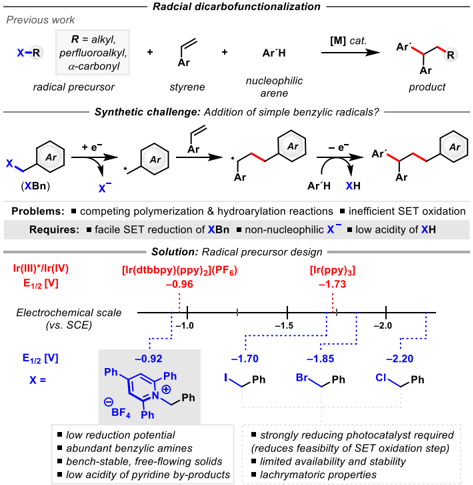
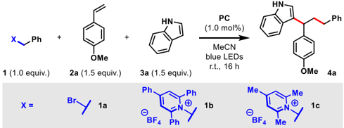
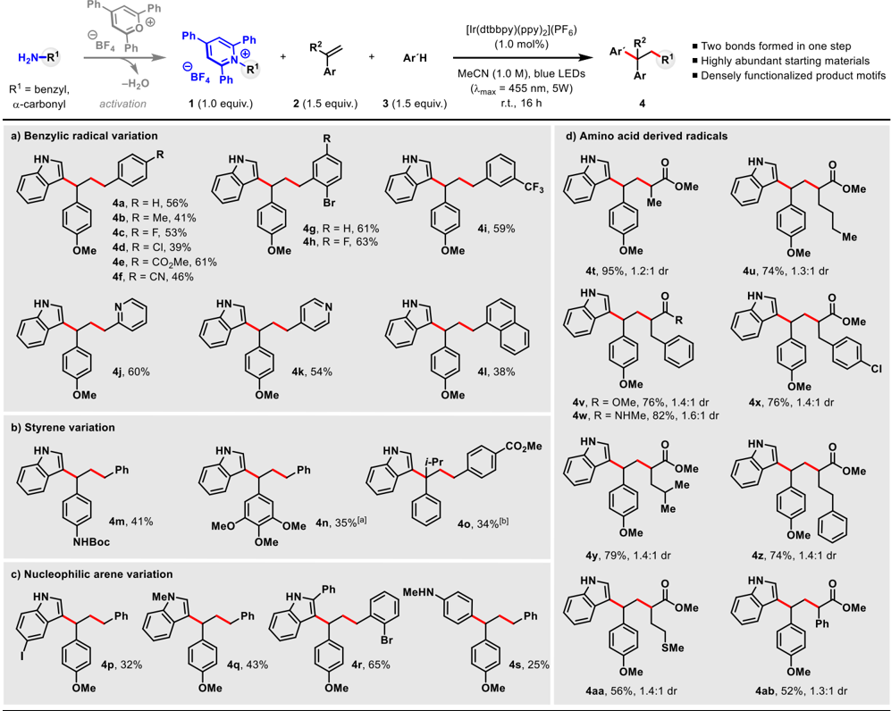
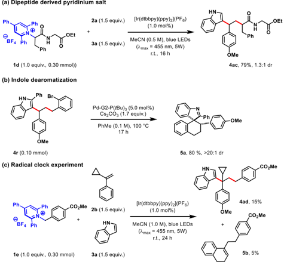
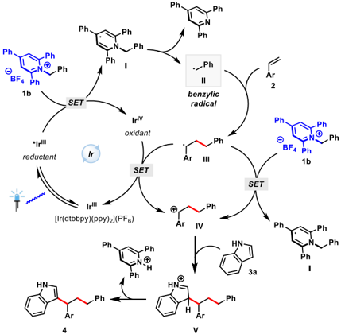
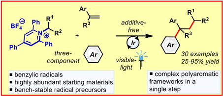

UNIVERSITY

Sheffield

University of

UNIVERSITY OF LEEDS

White Rose

[eprints@whiterose.ac.uk https://eprints.whiterose.ac.uk](https://eprints.whiterose.ac.uk/)

Universities of Leeds, Sheffield and York

Deposited via The University of York.

[White Rose Research Online URL for this paper: https://eprints.whiterose.ac.uk/id/eprint/151867/](https://eprints.whiterose.ac.uk/id/eprint/151867/)

Version: Accepted Version

## Article:

Klauck, Felix J.R., Yoon, Hyung, James, Michael J. et al. (2019) Visible-Light-Mediated Deaminative Three-Component Dicarbofunctionalization of Styrenes with Benzylic Radicals. ACS Catalysis. pp. 236-241. ISSN: 2155-5435

[https://doi.org/10.1021/acscatal.8b04191](https://doi.org/10.1021/acscatal.8b04191)

## Reuse

Items deposited in White Rose Research Online are protected by copyright, with all rights reserved unless indicated otherwise. They may be downloaded and/or printed for private study, or other acts as permitted by national copyright laws. The publisher or other rights holders may allow further reproduction and re-use of the full text version. This is indicated by the licence information on the White Rose Research Online record for the item.

## Takedown

If you consider content in White Rose Research Online to be in breach of UK law, please notify us by emailing eprints@whiterose.ac.uk including the URL of the record and the reason for the withdrawal request.

of Vork

## Visible-Light-Mediated Deaminative Three-Component Dicarbofunctionalization of Styrenes with Benzylic Radicals

Felix J. R. Klauck a , Hyung Yoon b , Michael J. James a , Mark Lautens* b  and Frank Glorius* a a Organisch-Chemisches Institut, Westfälische Wilhelms-Universität Münster, Corrensstraße 40, 48149 M ü nster, Germany.

b Department of Chemistry, Davenport Chemical Laboratories, University of Toronto, 80 St. George Street, Toronto, Ontario M5S 3H6, Canada.

ABSTRACT: The  visible-light-mediated  three-component  dicarbofunctionalization  of  styrenes  using  simple  benzylic radicals  is  described.  Notably,  this  work  describes  a  rare  example  of  undirected dicarbofunctionalization  using unsubstituted benzyl radicals. Key to the success of this strategy was the rational design and use of benzylic pyridinium salts as radical precursors. Using this approach, abundant styrenes, electron-rich heterocycles and benzylic amines were combined to rapidly afford a number of densely functionalized 1,1-diarylalkanes. A dipeptide derived pyridinium salt was applied to that transformation, which resembles a visible-light mediated deaminative generation of radicals from peptides. KEYWORDS: dicarbofunctionalization · deamination · redox-active · photoredox catalysis · visible-light

The utilization of carboxylic acids 1 and their derivatives 2 in decarboxylative reactions are well-explored  and  have gained considerable attention. However, strategies utilizing  other  abundant  functionalities,  such  as  amines, remain scarce. 3 Amines can be readily synthesized, 4 carried through a synthetic sequence in protected forms 5  and even serve as directing groups in regioselective transformations. 6 In contrast to the well-explored formation and conservation of C -N bonds, the majority of deaminative  radical  reactions  employ  diazonium  salts, which are potentially hazardous and can only reliably be synthesized from aromatic amines. 7 Alternatively, condensation of amines with pyrylium salts gives pyridinium salts which are active for nucleophilic displacement. 8

Recently,  the  scope  of  pyridinium  salts  in  deaminative nickel-catalyzed cross-coupling reactions has been explored  by  Watson  and  co-workers. 9   In  our  efforts  to develop visible-light-mediated transformations of abundant functional groups we developed a mild, additivefree  method  to  generate  alkyl  radicals  from  Katritzky pyridinium  salts,  showcasing  the  synthetic  potential  of (naturally) abundant amines, including amino acid derivatives, in synthesis. 10  These salts can be prepared in a single step and are mostly obtained after a simple filtration as bench-stable, free-flowing solids in a pure form.

The  difunctionalization  of  olefins  is  another  powerful strategy in organic synthesis that utilizes abundant olefin feedstocks to provide rapid access to densely functionalized molecules. For that reason intense research into metal-catalyzed 11 and light-mediated 12 protocols is of great interest. As part of this family, dicarbofunctionalization reactions construct elaborate carbon  frameworks  in  a  single  step.  Classically,  these reactions  have  been  realized  by  the  addition  of  carbon nucleophiles to Michael acceptors with subsequent electrophilic  trapping 13 or  by  metal-catalyzed  protocols, wherein β -hydride  elimination  is  supressed. 14   Renewed interest in recent years has given rise to the development of  intramolecular  and  directed  approaches. 15   However, efficient undirected intermolecular three-component dicarbofunctionalization  reactions  remain  an  on-going challenge in organic synthesis (Scheme 1). These processes typically  require  an  appropriate  combination  of  radical precursors, olefins and arene partners. In catalytic transformations, Liu, Masson and Zhang have shown that reactive  perfluoroalkyl  iodides  can  be  used  as  radical precursors to great effect. 16  The groups of Baran, Nevado, Li  and Zhu have shown that precursors for tertiary alkyl and α -carbonyl radicals can also be employed in intermolecular olefin dicarbofunctionalization reactions. 2g,17 More  recently, Giri et al. described an intermolecular  nickel-catalyzed  dicarbofunctionalization method using alkyl iodides, styrenes and arylzinc

reagents. 18 Despite  the  significant  advances  in  this  field, there  is,  to  the  best  of  our  knowledge,  no  method  that efficiently  introduces  simple  benzyl  groups  to  generate densely functionalized  polyaromatic  frameworks  in  a three-component,  undirected  strategy.  Considering  this, we felt that the development of such a method would be highly  desirable  for  the  rapid  and  efficient  synthesis  of these product motifs and would foster further development towards more general undirected dicarbofunctionalization protocols.

## Scheme 1. Activated amines as radical precursors and dicarbofunctionalization of olefins.

We  rationalized  that  in  order  to  realize this highly challenging transformation, the identification of a suitable radical  precursor  would  be  crucial.  We  reasoned  that benzylic Katritzky salts might serve as suitable substrates to  enable  a  visible-light-mediated  mild  protocol  for  the three-component dicarbofunctionalization of olefins. 19  In comparison to benzylic bromides, which are the classical precursors  to  benzylic  radicals  in  a  reductive  fashion, benzylic Katritzky salts have a considerably more positive reduction  potential  (E1/2  = -1.85  V  vs.  SCE  in  MeCN 20 against  E1/2 = -0.92  V  vs.  SCE  in  DMF 21 ).  Thus  their reduction  is  expected  to  be  more  favourable  by  excited state  photocatalysts  or  radical  intermediates  en  route  to product  formation,  which  might  reduce  polymerization side reactions of radical intermediates. Moreover, a dicarbofunctionalization reaction will liberate stoichiometric amounts of the strong acid HBr using BnBr as radical precursor, potentially leading to extensive hydroarylation side reactions.

Table  1.  Three-component  dicarbofunctionalization

using benzylic radicals.

| Entry   | X   | PC                          | Additive   | Yield f   |
|---------|-----|-----------------------------|------------|-----------|
| 1 a     | 1a  | [Ir(dtbbpy)(ppy) 2 ](PF 6 ) | -          | Traces    |
| 2 a     | 1a  | fac -Ir(ppy) 3              | -          | Traces    |
| 3 a     | 1a  | [Ir(dtbbpy)(ppy) 2 ](PF 6 ) | K 2 CO 3 d | 15%       |
| 4 a     | 1a  | fac -Ir(ppy) 3              | K 2 CO 3 d | 18%       |
| 5 a     | 1b  | [Ir(dtbbpy)(ppy) 2 ](PF 6 ) | -          | 48%       |
| 6 b     | 1b  | [Ir(dtbbpy)(ppy) 2 ](PF 6 ) | -          | 63% g     |
| 7 b     | 1b  | [Ir(dtbbpy)(ppy) 2 ](PF 6 ) | NaCl e     | 29%       |

| 8 b    | 1b   | [Ir(dtbbpy)(ppy) 2 ](PF 6 )   | NaI e   | 3%   |
|--------|------|-------------------------------|---------|------|
| 9 b, c | 1c   | [Ir(dtbbpy)(ppy) 2 ](PF 6 )   | -       | 20%  |

a Conditions: 1 (0.10 mmol), 2a (0.15 mmol), 3a (0.15 mmol) and PC (1.0 mol%) in MeCN (0.2 M) under argon. b Conditions: 1 (0.20  mmol), 2a (0.30  mmol), 3a (0.30  mmol)  and PC (1.0 mol%)  in  MeCN  (1.0  M)  under  argon. c Reaction  on  a  0.30 mmol scale. d Additive (2.0 equiv.). e Additive (1.0 equiv.). f Yield determined by calibrated GC-FID analysis with mesitylene as internal standard. g Isolated yield on a 0.30 mmol scale: 56%; For a qualitative analysis on side-products in this protocol, see Supporting Information.

To  test  this  hypothesis  we  first  irradiated  a  mixture  of benzyl  bromide  ( 1a ),  4-methoxystyrene  ( 2a ),  indole  ( 3a ) and common photocatalysts in MeCN for 16 h. As expected, primarily hydroarylation was observed and only traces of the desired dicarbofunctionalization product were obtained (Table 1, Entries 1, 2). To neutralize the liberated acid, K2CO3 was added as a base leading to unsatisfactory yields  of  the  desired  product  (Table  1,  Entries  3,  4).  In support of our hypothesis, the desired dicarbofunctionalization  product  was  obtained  in  48% yield using benzylic Katritzky salt ( 1b ) as radical precursor in  the  absence  of  additives  (Table  1,  Entry  5).  Further optimization  showed that  more  concentrated  conditions lead to an increased yield (for further optimization studies see Supporting Information).  Under  these optimized reaction  conditions  the  desired  product  ( 4a )  could  be obtained in 63% yield using 1.0 equiv. of benzyl Katritzky salt ( 1b ), 1.5 equiv. of styrene ( 2a ), 1.5 equiv. indole ( 3a ) and 1.0 mol% of [Ir(dtbbpy)(ppy)2](PF6) in a MeCN solution (1.0 M) under irradiation with visiblelight (λ max = 455 nm, 5W) for 16 h (Table 1, Entry 6). The addition of halide additives, such as NaCl or NaI, was shown to significantly decrease the  yields,  potentially  due  to  competing  nucleophilic capture of cationic intermediates by the halides (Table 1, Entries  7,  8),  indicating  that  other  benzylic  halides  are presumably not suitable precursors in this method. When trimethylpyridinium salt derivative ( 1c ) was employed the product  was  also  obtained,  but  again  in  reduced  yield (Table  1,  Entry  9).  In  the  absence  of  either  light  or photocatalyst,  no  formation  of  the  desired  product  was observed (see Supporting Information).

Having established that benzyl Katritzky salts can be used as radical precursors to enable challenging dicarbofunctionalization reactions, we explored the scope of  the  newly  developed  protocol.  A  range  of  benzylic Katritzky  salts  were  synthesized  in  this  study  and  the corresponding  radicals  were  employed  to  achieve  an efficient dicarbofunctionalization reaction to yield polyaromatic  carbon  frameworks  (Scheme  2).  In  this regard, a range of para -substituted products were obtained in  good  to  moderate  yield  ( 4a -4f ).  Sterically  demanding ortho -bromo substituents, that are possible reactive sites for further functionalizations, are well tolerated as exemplified by the formation of products 4g -4h . A metatrifluoromethyl substituent could be incorporated into the product structure ( 4i ). Pyridine containing products 4j -4k , which might be challenging to access via transition metalcatalyzed protocols, were obtained in good yield. Variation on  the  styrene  coupling  partner  led  to  generation  of protected amine substituted diarylmethane 4m . 22  Valuable all carbon quarternary centers are successfully generated by this method, as showcased by the formation of product 4o . The  nucleophilic arene partner was  then  varied (Scheme 2c) to provide access to a range of 3-substituted indoles ( 4p -4r ), which is a prominent architecture found in  numerous  natural  products  and  bioactive  substances such as tryptamine, serotonine and indomethacine. 23

Furthermore, N-methylaniline also couples to give exclusively the para -C -H functionalized product 4s , albeit with  a  diminished  yield. 24 Katritzky  salts  derived  from naturally abundant amino acid derivatives can be applied in  this  transformation  and  deliver  complex  γ -diarylated carboxylic acid derivatives in good to excellent yield ( 4t -4ab ). Remarkably the use of methionine derived Katritzky salt allows for the incorporation of a thioether moiety into the  final  product  ( 4aa ),  which  would  presumably  be challenging in transition metal-catalyzed methods, due to catalyst poisoning.

Scheme 2. Scope of the visible-light-mediated deaminative dicarbofunctionalization. Reactions performed on a 0.30 mmol scale in 0.3 mL of solvent. Diastereomeric ratios determined by  1 H NMR spectroscopic analysis of the crude reaction mixture.  a Reaction performed with 2 (2.0 equiv.) and 3 (2.0 equiv.). b 24 h reaction time.

Having demonstrated the functional group tolerance of the protocol we searched to establish applications of our newly developed method. Dipeptide derived Katritzky salt 1d was synthesized and applied in this transformation, showcasing  the  potential  of  this  method  for  the  highly challenging deaminative functionalization of peptides (Scheme 3a). Furthermore bromo-substituted derivative 4r was shown  to engage in a highly diastereoselective intramolecular  dearomative  spirocyclization  reaction  to form 5a (Scheme 3b). 25

To shine light on the mechanistic intricacies of this threecomponent reaction we first performed a radical trapping experiment by adding TEMPO (2.0 equiv.) to the reaction under  standard  conditions.  No  formation  of  the  desired product  was  observed,  supporting  the  involvement  of radical intermediates in product formation. From crude  1 H

NMR spectroscopy, the formation of a radical adduct of the benzylic  radical  was  not  observed.  Rather,  under  these conditions, only trace amounts of the pyridinium salt 1b were  converted.  When  styrene 2b was  used  the  ring opened product 5b was isolated from the reaction mixture, suggesting the presence of a benzylic radical after radical addition to the styrene (Scheme 3c). Next, Stern-Volmer luminescence quenching studies revealed that the benzylic Katritzky  salt 1b is  the  only  quencher  of  the  excited photocatalyst in the reaction mixture.

Scheme 3. Applications of the deaminative dicarbofunctionalization of styrenes and radical clock experiment. Diastereomeric ratios determined by 1 H  NMR  spectroscopic  analysis  of  the  crude  reaction mixture.

Based on these mechanistic studies and literature precedence 17a,17b   we  propose  the  following  mechanism (Scheme 4). The excited state photocatalyst initiates the reaction by the reduction of Katritzky salt 1b . This process is predicted to be thermodynamically feasible (potentials: [Ir(dtbbpy)(ppy)2](PF6), Ir(III)*/Ir(IV): -0.96 V 26 vs. 1b : -0.92  V 21 )  and  the  interaction  of  the  excited  catalyst  was proven  by  Stern-Volmer  quenching  studies.  Pyridinyl radical I fragments and delivers benzylic radical II . 21 This species adds to the styrene producing radical intermediate

III ,  which  then  reduces  the  oxidized  photocatalyst  or another molecule of pyridinium salt 1b to maintain a chain reaction. The resulting cation IV is subsequently trapped by indole ( 3a ) to form the desired dicarbofunctionalization product ( 4 ).

Scheme 4. Proposed mechanism of the deaminative dicarbofunctionalization using Katritzky salts as radical precursors.

In summary, we have developed the first undirected threecomponent dicarbofunctionalization reaction of styrenes with benzylic radicals. The reaction utilizes highly abundant amine derivatives, styrenes and nonprefunctionalized arenes and forges them into an elaborate carbon framework in a single step operation. This reaction process  was  enabled  by  the  use  of  versatile  benzylic pyridinium  salts  as  radical  precursors.  Notably  pyridine moieties, as well as thioethers were well tolerated in this protocol. Furthermore, highly challenging all carbon quaternary  centers  were  also  readily  accessed  by  this method. A dipeptide derived pyridinium salt was applied to that transformation, which resembles the first visiblelight  mediated  deaminative  generation  of  radicals  from peptides. Overall, we hope that this work, and the design of  other  radical  precursors,  will  enable  a  range  of  other previously challenging olefin difunctionalization reactions to be performed.

## AUTHOR INFORMATION

## Corresponding Author

glorius@uni-muenster.de mlautens@chem.utoronto.ca

## Author Contributions

## Notes

The authors declare no competing financial interest.

## ASSOCIATED CONTENT

Supporting Information

The Supporting Information is available free of charge via the Internet at http://pubs.acs.org, which included NMR data and characterization (PDF).

## ACKNOWLEDGMENT

We thank the Fonds der Chemischen Industrie (F.J.R.K), the Alexander von Humboldt Foundation (M.J.J.), the University of Toronto and the J.J. Berry Smith Award (M.L.) for generous financial support. We also thank Michael Teders, Lena Pitzer and Dr. Adrian Tlahuext-Aca for helpful discussions.

## REFERENCES

(1)  (a)  Johnson,  R.  G.;  Ingham,  R.  K.  The  Degradation  Of Carboxylic Acid Salts By  Means Of Halogen  - The Hunsdiecker Reaction. Chem.  Rev. 1956 , 56 ,  219 -269.  (b)  Gooßen,  L.  J.; Rodriguez,  N.;  Gooßen,  K.  Carboxylic  Acids  as  Substrates  in Homogeneous Catalysis. Angew. Chem. Int. Ed. 2008 , 47 ,  3100 -3120. (c) Miyake, Y.; Nakajima, K.; Nishibayashi, Y. Visible lightmediated oxidative decarboxylation of arylacetic acids into benzyl radicals: addition to electron-deficient alkenes by using photoredox catalysts. Chem. Commun. 2013 , 49 , 7854 -7856. (d) Zuo, Z.; MacMillan, D. W. C. Decarboxylative Arylation of α -Amino Acids via Photoredox Catalysis: A One-Step Conversion of Biomass  to  Drug  Pharmacophore. J.  Am.  Chem.  Soc. 2014 , 136 , 5257 -5260.  (e)  Noble,  A.;  MacMillan,  D.  W.  C.    Photoredox α -Vinylation of α -Amino Acids and N -Aryl Amines. J. Am. Chem. Soc. 2014 , 136 ,  11602 -11605.  (f)  Xuan,  J.;  Zhang,  Z.-G.;  Xiao,  W.-J. Visible -Light -Induced Decarboxylative Functionalization of Carboxylic  Acids  and  Their  Derivatives. Angew.  Chem.  Int.  Ed. 2015 , 54 ,  15632 -15641.  (g)  Candish,  L.;  Standley,  E.  A.;  GomezSuárez, A.; Mukherjee, S.; Glorius, F. Catalytic Access  to Alkyl Bromides,  Chlorides  and  Iodides  via  Visible  Light -Promoted Decarboxylative Halogenation. Chem. Eur. J. 2016 , 22 , 9971 -9974. (h)  Candish,  L.;  Pitzer,  L.;  Gomez-Suárez,  A;  Glorius,  F.  Visible Light -Promoted Decarboxylative Di -and Trifluoromethylthiolation of Alkyl Carboxylic Acids. Chem. Eur. J. 2016 , 22 , 4753 -4756.

(2) (a) Barton, D. H. R.; Crich, D.; Motherwell, W. B. New and improved  methods  for  the  radical  decarboxylation  of  acids. J. Chem.  Soc.,  Chem.  Commun. 1983 ,  939 -941.  (b)  Okada,  K.; Okamoto, K.; Oda, M. A new and practical method of decarboxylation: photosensitized decarboxylation of Nacyloxyphthalimides  via  electron-transfer  mechanism. J.  Am. Chem.  Soc. 1988 , 110 ,  8736 -8738.  (c)  Okada,  K.;  Okamoto,  K.; Morita, N.; Okubo, K.; Oda, M. Photosensitized decarboxylative Michael addition through N-(acyloxy)phthalimides via an electron-transfer  mechanism. J.  Am.  Chem.  Soc. 1991 , 113 ,  9401 -9402. (d) Schnermann, M. J.; Overman, L. E. A Concise Synthesis of  (-) -Aplyviolene  Facilitated  by  a  Strategic  Tertiary  Radical Conjugate Addition. Angew. Chem. Int. Ed. 2012 , 51 , 9576 -9580. (e) Candish, L.; Teders, M.; Glorius, F. Transition-Metal-Free, VisibleLight-Enabled Decarboxylative Borylation of Aryl N -Hydroxyphthalimide  Esters. J.  Am.  Chem.  Soc. 2017 , 139 ,  7440 -7443.  (f)  Tlahuext-Aca,  A.;  Garza-Sanchez,  R.  A.;  Glorius,  F. Multicomponent Oxyalkylation of Styrenes Enabled by Hydrogen -Bond -Assisted Photoinduced Electron Transfer. Angew. Chem. Int. Ed. 2017 , 56 , 3708 -3711. (g) Qin, T.; Cornella, J.; Li, C.; Malins,  L.  R.;  Edwards,  J.  T.;  Kawamura,  S.;  Maxwell,  B.  D.; Eastgate, M. D.; Baran, P. S. A general alkyl-alkyl cross-coupling enabled  by  redox-active  esters  and  alkylzinc  reagents. Science 2016 , 352 ,  801 -805. (h) Suzuki, N.; Hofstra, J. L.; Poremba, K. E.; Reisman, S. E. Nickel-Catalyzed Enantioselective Cross-Coupling of N -Hydroxyphthalimide Esters with Vinyl Bromides. Org. Lett. 2017 , 19 , 2150 -2153. (i) Huihui, K. M. M.; Caputo, J. A.; Melchor, Z.; Olivares, A. M.; Spiewak, A. M.; Johnson, K. A.; DiBenedetto, T. A.;

Kim, S.; Ackerman,  L. K. G.; Weix,  D. J. Decarboxylative CrossElectrophile Coupling of N -Hydroxyphthalimide Esters with Aryl Iodides. J. Am. Chem. Soc. 2016 , 138 , 5016 -5019. (j) Proctor, R. S. J.; Davis, H. J.; Phipps, R. J. Catalytic enantioselective Minisci-type addition to heteroarenes. Science 2018 , 360 , 419 -422.

(3)  (a)  McGrath,  N.  A.;  Brichacek,  M.;  Njardarson,  J.  T.  A Graphical Journey of Innovative Organic Architectures That Have Improved  Our  Lives. J.  Chem.  Educ. 2010 , 87 ,  1348 -1349.  (b) Hamley, I. W. Small Bioactive Peptides for Biomaterials Design and Therapeutics. Chem. Rev. 2017 , 117 , 14015 -14041. (c) Zhang, L.; Fu, N.; Luo, S. Pushing the Limits of Aminocatalysis: Enantioselective Transformations of α -Branched β -Ketocarbonyls and Vinyl Ketones by Chiral Primary Amines. Acc. Chem. Res. 2015 , 48 , 986 -997.

(4) (a) Gibson, M. S.; Bradshaw, R.W. The Gabriel Synthesis of Primary  Amines. Angew.  Chem.  Int.  Ed. 1968 , 7 ,  919 -930.  (b) Gomez, S.; Peters, J. A.; Maschmeyer, T. The Reductive Amination of  Aldehydes  and  Ketones  and  the  Hydrogenation  of  Nitriles: Mechanistic Aspects and Selectivity Control. Adv. Synth.  Catal. 2002 , 10 , 1037 -1057. (c) Klinkenberg, J. L.; Hartwig, J. F. Catalytic Organometallic  Reactions  of  Ammonia. Angew.  Chem.  Int.  Ed. 2011 , 50 , 86 -95.

(5) Green, T. W.; Wuts, P. G. M. Protective Groups in Organic Synthesis, Wiley-Interscience, New York, 2007 , 696 -926.

(6) (a) Xu, Y.; Young, M. C.; Wang, C.; Magness, D. M.; Dong, G. Catalytic C(sp 3 )-H Arylation of Free Primary Amines with an exo Directing  Group  Generated  In  Situ. Angew.  Chem.  Int.  Ed. 2016 , 55 ,  9084-9087.  (b)  Liu,  Y.;  Ge,  H.  Site-selective  C -H arylation  of  primary  aliphatic  amines  enabled  by  a  catalytic transient directing group. Nat. Chem. 2016 , 9 , 26 -32. (c) St JohnCampbell,  S.;  Bull,  J.  A. Transient  imines  as  'next  generation' directing groups for the catalytic functionalisation of C -H bonds in a single operation. Org. Biomol. Chem. 2018 , 16 , 4582 -4595.

(8)  (a)  Katritzky,  A.  R.;  Marson,  C.  M.  Pyrylium  Mediated Transformations of Primary Amino Groups into Other Functional Groups. New Synthetic Methods (41). Angew.Chem. Int. Ed. Engl. 1984 , 23 , 420 -429. (b) Katritzky, A. R.; Kashmiri, M. A.; de Viile, G. Z.;  Patel,  R.  C.  Kinetics  and  mechanism  of  the  C-alkylation  of nitroalkane anions by 1-alkyl-2,4,6-triphenylpyridiniums: a nonchain reaction with  radicaloid  characteristics. J.  Am.  Chem. Soc. 1983 , 105 ,  90 -96. (c) Moser, D.; Duan, Y.; Wang, F.; Ma, Y.; O'Neill, M. J.; Cornella, J. Selective Functionalization of Aminoheterocycles by a Pyrylium Salt. Angew. Chem. Int. Ed . 2018 , 57 , 11035 -11039.

(7)  (a)  Griefs,  P.  Vorläufige  Notiz  über  die  Einwirkung  von salpetriger Säure  auf  Amidinitro -und  Aminitrophenyls ä ure. Justus  Liebigs  Ann.  Chem. 1858 , 106 ,  123 -125.  (b)  Oger,  N.; d'Halluin, M.; Le Grognec, E.; Felpin, F.-X. Using Aryl Diazonium Salts  in  Palladium-Catalyzed  Reactions  under  Safer  Conditions. Org. Process Res. Dev. 2014 , 18 , 1786 -1801. (c) Hari, D. P.; Schroll, P.;  K ö nig,  B.  Metal-Free,  Visible-Light-Mediated  Direct  C -H Arylation of Heteroarenes with Aryl Diazonium Salts. J. Am. Chem. Soc. 2012 , 134 , 2958 -2961. (d) Hari, D. P.; Hering, T.; König, B. The Photoredox -Catalyzed Meerwein Addition Reaction: Intermolecular Amino -Arylation of Alkenes. Angew. Chem. Int. Ed. 2014 , 53 , 725 -728.

(9) (a) Basch, C. H.; Liao, J.; Xu, J.; Piane, J. J.; Watson, M. P. Harnessing  Alkyl  Amines  as  Electrophiles  for  Nickel-Catalyzed Cross Couplings via C -N Bond Activation. J. Am. Chem. Soc. 2017 , 139 , 5313 -5316. (b) Liao, J.; Guan, W.; Boscoe, B. P.; Tucker, J. W.; Tomlin,  J.  W.;  Garnsey,  M.  R.;  Watson,  M.  P.  Transforming Benzylic Amines into Diarylmethanes: Cross-Couplings of Benzylic  Pyridinium  Salts  via  C -N  Bond  Activation. Org.  Lett. 2018 , 20 ,  3030 -3033.  (c)  Guan,  W.;  Liao,  J.;  Watson,  M.  P. Vinylation of Benzylic Amines via C -N Bond Functionalization of Benzylic Pyridinium Salts. Synthesis 2018 , 50 , 3231 -3237.

(10)  (a)  Klauck,  F.  J.  R.;  James,  M.  J.;  Glorius,  F.  Deaminative Strategy  for  the  Visible-Light-Mediated  Generation  of  Alkyl Radicals. Angew. Chem. Int. Ed. 2017 , 56 , 12336 -12339. (b) Wu, J.; He,  L.;  Noble,  A.;  Aggarwal,  V.  K.  Photoinduced  Deaminative Borylation  of  Alkylamines. J.  Am.  Chem.  Soc. 2018 , 140 ,  10700 -10704. (c) Sandfort, F.; Strieth-Kalthoff, F.; Klauck, F. J. R.; James, M.  J.;  Glorius,  F.  Deaminative  Borylation  of  Aliphatic  Amines Enabled  by Visible Light Excitation of an Electron -Donor -Acceptor Complex. Chem. Eur. J. 2018 , DOI: 10.1002/chem.201804246. (d) Ociepa, M.; Turkowska, J.; Gryko, D. Redox-activated amines in C(sp3)-C(sp) and C(sp3)-C(sp)2 bond formation enabled by metal-free photoredox catalysis. ACS Catal. 2018 , 8 , 11362 -11367.

(12)  Courant, T.; Masson, G.  Recent  Progress in Visible-Light Photoredox-Catalyzed  Intermolecular  1,2-Difunctionalization  of Double Bonds via an ATRA-Type Mechanism. J. Org. Chem. 2016 , 81 , 6945 -6952.

(11)  Zhang,  J.;  Liu,  L.;  Chen,  T.;  Han,  L.  Transition -Metal -Catalyzed  Three -Component  Difunctionalizations  of  Alkenes. Chem. Asian J. 2018 , 13 , 2277 -2291.

(13) (a) Chapdelaine, M. J.; Hulce, M. Tandem  Vicinal Difunctionalization: β -Addition to α , β -Unsaturated  Carbonyl Substrates Followed by α -Functionalization. Org. React. 1990 , 38 , 227 -294.  (b)  Ihara,  M.;  Fukumoto,  K.  Syntheses  of  Polycyclic Natural Products Employing the Intramolecular Double Michael Reaction. Angew Chem. Int. Ed. Engl. 1993 , 32 , 1010 -1022.

(14)  (a)  Catellani,  M.;  Chiusoli,  G.  P.  One-pot  palladiumcatalyzed  synthesis  of  2,3-disubstituted  bicyclo[2.2.1]heptanes and  bicyclo[2.2.1]hept-5-enes. Tetrahedron  Lett. 1982 , 23 ,  4517 -4520. (b) Larock, R. C.; Hershberger, S. S.; Takagi, K.; Mitchell, M. A. Synthesis and chemistry of alkylpalladium compounds prepared  via  vinylpalladation  of  bicyclic  alkenes. J.  Org.  Chem. 1986 , 51 , 2450 -2457. (c) Liao, L.; Jana, R.; Urkalan, K. B.; Sigman, M. S. A Palladium-Catalyzed Three-Component Cross-Coupling of  Conjugated  Dienes  or  Terminal  Alkenes  with  Vinyl  Triflates and Boronic Acids. J. Am. Chem. Soc. 2011 , 133 , 5784 -5787. (d) Wu, X.; Lin, H.-C.; Li, M.-L.; Li, L.-L.; Han,  Z.-Y.; Gong,  L.-Z. Enantioselective  1,2-Difunctionalization  of  Dienes  Enabled  by Chiral  Palladium  Complex-Catalyzed  Cascade  Arylation/Allylic Alkylation Reaction. J. Am. Chem. Soc. 2015 , 137 , 13476 -13479.

(15) (a) Giri, R.; KC, S. Strategies toward Dicarbofunctionalization  of  Unactivated  Olefins  by  Combined Heck Carbometalation and Cross-Coupling. J. Org. Chem. 2018 , 83 , 3013 -3022. (b) Tour, J. M.; Negishi, E. Metal promoted cyclization. 9.  Controlled  and  catalytic  acylpalladation.  A  novel  route  to cyclopentenone and cyclohexenone derivatives. J. Am. Chem. Soc. 1985 , 107 , 8289 -8291. (c) Shrestha, B.; Basnet, P.; Dhungana, R. K.; KC, S.; Thapa, S.; Sears, J. M.; Giri, R.. Ni-Catalyzed Regioselective 1,2-Dicarbofunctionalization  of  Olefins  by  Intercepting  Heck Intermediates as Imine-Stabilized Transient Metallacycles. J. Am. Chem. Soc. 2017 , 139 , 10653 -10656. (d) Thapa, S.; Basnet, P.; Giri, R.  Copper-Catalyzed  Dicarbofunctionalization  of  Unactivated Olefins by Tandem Cyclization/Cross-Coupling. J. Am. Chem. Soc. 2017 , 139 ,  5700 -5703. (e) Derosa, J.; Tran, V.  T.; Boulous, M. N.; Chen, J. S.; Engle, K. M. Nickel-Catalyzed β , γ -Dicarbofunctionalization  of  Alkenyl  Carbonyl  Compounds  via Conjunctive Cross-Coupling. J. Am. Chem. Soc. 2017 , 139 ,  10657 -10660. (f) Derosa, J.; van der Puyl, V. A.; Tran, V. T.; Liu, M.; Engle, K. M. Directed nickel-catalyzed 1,2-dialkylation of alkenyl carbonyl compounds. Chem. Sci. 2018 , 9 ,  5278 -5283. (g) Yu, H.; Hu, B.;  Huang,  H.  Nickel -Catalyzed Alkylarylation  of  Activated Alkenes with Benzyl -amines via C -N Bond Activation. Chem. Eur. J. 2018 , 24 , 7114 -7117.

(16) (a) Wang, F.; Wang, D.; Mu, X.; Chen, P.; Liu, G. CopperCatalyzed  Intermolecular  Trifluoromethylarylation  of  Alkenes: Mutual Activation of Arylboronic Acid and CF3 +  Reagent. J. Am. Chem. Soc. 2014 , 136 , 10202 -10205. (b) Carboni, A.; Dagousset, G.;

Magnier,  E.;  Masson,  G.  One  pot  and  selective  intermolecular aryland heteroaryl-trifluoromethylation of alkenes by photoredox catalysis. Chem. Commun. 2014 , 50 ,  14197 -14200. (c) Gu, J.-W.; Min, Q.-Q.; Yu, L.-C.; Zhang, X. Tandem Difluoroalkylation-Arylation  of  Enamides  Catalyzed  by  Nickel. Angew. Chem. Int. Ed. 2016 , 55 , 12270 -12274.

(17)  (a)  Ouyang,  X.-H.; Song,  R.-J.; Hu, M.; Yang, Y.;  Li, J.-H. Silver-Mediated Intermolecular 1,2-Alkylarylation of Styrenes with α -Carbonyl Alkyl Bromides and Indoles. Angew. Chem. Int. Ed. 2016 , 55 , 3187 -3191. (b) Li, M.; Yang, J.; Ouyang, X.-H.; Yang, Y.; Hu, M.; Song, R.-J.; Li, J.-H. 1,2-Alkylarylation of Styrenes with α -Carbonyl Alkyl Bromides and Indoles Using Visible-Light Catalysis. J. Org. Chem. 2016 , 81 , 7148 -7154. (c) García-Domínguez, A.; Li, Z.; Nevado, C. Nickel-Catalyzed Reductive Dicarbofunctionalization of Alkenes. J. Am. Chem. Soc. 2017 , 139 , 6835 -6838.

(18) KC, S.; Dhungana, R. K.; Shrestha, B.; Thapa, S.; Khanal, N.; Basnet,  P.;  Lebrun,  R.  W.;  Giri,  R.  Ni-Catalyzed  Regioselective Alkylarylation of Vinylarenes via C(sp 3 ) -C(sp 3 )/C(sp 3 ) -C(sp 2 ) Bond Formation and Mechanistic Studies. J. Am. Chem. Soc. 2018 , 140 , 9801 -9805. For a recent nickel-catalyzed diarylation protocol: Gao, P.; Chen, L.-A.; Brown, M. K. Nickel-Catalyzed Stereoselective  Diarylation  of  Alkenylarenes. J.  Am.  Chem.  Soc. 2018 , 140 , 10653 -10657.

(19) Selected reviews on visible-light photoredox catalysis: (a) Yoon, T. P.; Ischay, M. A.; Du, J. Visible light photocatalysis as a greener approach to photochemical synthesis. Nat. Chem. 2010 , 2 , 527 -532. (b) Prier, C. K.; Rankic, D. A.; MacMillan, D. W. C. Visible Light  Photoredox  Catalysis  with  Transition  Metal  Complexes: Applications in Organic Synthesis. Chem. Rev. 2013 , 113 , 5322 -5363. (c)  Narayanam,  J.  M.  R.;  Stephenson,  C.  R.  J.  Visible  light photoredox catalysis: applications in organic synthesis. Chem. Soc. Rev. 2011 , 40 ,  102 -113.  (d)  Xuan,  J.;  Xiao,  W.-J.  Visible -Light Photoredox Catalysis. Angew. Chem. Int. Ed. 2012 , 51 , 6828 -6838. (e) Tucker, J. W.; Stephenson, C. R. J. Shining Light on Photoredox Catalysis: Theory and Synthetic Applications. J. Org. Chem. 2012 , 77 ,  1617 -1622. (f) Shaw, M. H.;  Twilton, J.; MacMillan,  D. W. C. Photoredox Catalysis in Organic Chemistry. J. Org. Chem. 2016 , 81 , 6898 -6926.  (g)  Marzo,  L.;  Pagire,  S.  K.;  Reiser,  O.;  König,  B. Visible -Light Photocatalysis: Does It Make a Difference in Organic Synthesis? Angew. Chem. Int. Ed. 2018 , 57 , 10034 -10072.

(20)  Koch,  D.  A.;  Henne,  B.  J.;  Bartak,  D.  E.  Carbanion  and Radical Intermediacy in the Electrochemical Reduction of Benzyl Halides in Acetonitrile. J. Electrochem. Soc. 1987 , 134 , 3062 -3067.

(21)  Grimshaw, J.; Moore, S.; Grimshaw, J. T.  Electrochemical Reactions. Part 26. Radicals Derived by Reduction of  NAlkylpyridinium Salts and Homologous N,N'Polymethylenebispyridinium  Salts.  Cleavage  of  the  Carbon-Nitrogen Bond. Acta Chem. Scand. B. 1983 , 37 , 485 -489.

(22) Electron neutral styrene as alkene component gave a low yield  (&lt;10%)  of  the  desired  dicarbofunctionalization  product  as determined  by  the 1 H  NMR  spectrum  of  the  crude  reaction mixture with dibromomethane as an internal standard. With 1octene no formation of the desired product was observed by GCMS analysis of the crude reaction mixture.

(23)  (a)  Jones,  R.  S.  G.  Tryptamine:  a  neuromodulator  or neurotransmitter in mammalian brain? Progress Neurobiol. 1982 , 19 ,  117 -139.  b)  Berger,  M.;  Gray,  J.  A.;  Roth,  B.  L.  The  expanded biology  of  serotonin. Annu.  Rev.  Med. 2009 , 60 ,  355 -366.  c) Ferreira,  S.;  Moncada,  S.;  Vane,  J.  Indomethacin  and  aspirin abolish prostaglandin release from the spleen. Nat. New Biol. 1971 , 231 , 237 -239.

(24)  Using  2n -butylfuran  as  aromatic  coupling  partner,  the dicarbofunctionalization product was detected in low yield (&lt;20%) as  determined  by  the  1 H  NMR spectrum  of  the  crude  reaction mixture with dibromomethane as an internal standard. Using 3- acetyl-2,4-dimethylpyrrole as a coupling partner, the purification of the desired product yet remained unsuccessful.

(25)  Wu.,  K.-J.;  Dai,  L.-X.;  You,  S.-L.  Palladium(0)-Catalyzed Dearomative Arylation of Indoles: Convenient Access to Spiroindolenine Derivatives. Org. Lett. 2012 , 14 , 3772 -3775.

(26) Slinker, J. D.; Gorodetsky, A. A.;  Lowry, M. S.; Wang, J.; Parker, S.; Rohl, R.; Bernhard, S.; Malliaras, G. G. Efficient Yellow Electroluminescence  from  a  Single  Layer  of  a  Cyclometalated Iridium Complex. J. Am. Chem. Soc. 2004 , 126 , 2763 -2767.

## TOC graphic

