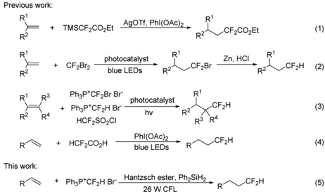
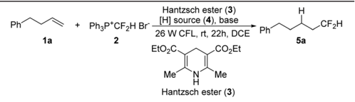
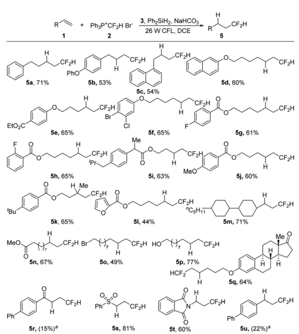
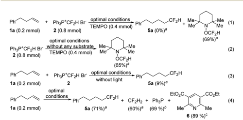
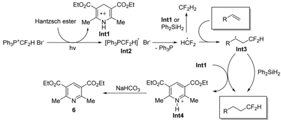

Previous work:

COS

Check for updates

+ TMSCF2CO2Et

## ORGANIC CHEMISTRY ROYAL SOCIETY OF CHEMISTRY R2 R1

AgOTf, PhI(OAC)2 .

R2

## FRONTIERS 1950 blue LEDs

+ Ph3P* CF2H Br

HCF2SO2CI

CF¿H

R¢

## RESEARCH ARTICLE

+ PhzP*CFzH Br

Hantzsch ester, Ph,SiHz,

Cite this: Org. Chem. Front. , 2019, 6 , 3580

Received 21st July 2019, Accepted 4th September 2019

DOI: 10.1039/c9qo00919a

rsc.li/frontiers-organic

View Article Online

View Journal | View Issue

(1)

(3)

(4)

## Visible-light-induced radical hydrodi fl uoromethylation of alkenes †

Jiao Yu, a Jin-Hong Lin, a Yu-Cai Cao b and Ji-Chang Xiao* a

Described here is the radical-mediated hydrodi fl uoromethylation of alkenes that occurs under transitionmetal-free conditions by using the phosphonium salt [Ph3P + CF2H]Br -under the irradiation of 26 W household compact fl uorescent light. The reaction lends itself to a convenient protocol for the installation of a C -CF2H bond while maintaining good functional group tolerance.

The difluoromethyl group (HCF2) has received increasing attention in drug design, because it is a lipophilic hydrogenbond donor and can act as a bioisostere of an OH or SH unit. 1 The past few decades have seen the emergence of many HCF2containing pharmaceuticals and agrochemicals, such as eflornithine, deracoxib, sedaxane, isopyrazam, bixafen, and thiazopir. 2 The high demand for HCF2-substituted biologically active compounds has prompted the development of e ffi cient methods for the incorporation of a HCF2 group into organic molecules.

The straightforward strategies for HCF2 incorporation include the insertion of difluorocarbene into X-H bonds 3 (X = C, N, O, S, etc .) and direct difluoromethylation with a HCF2 reagent. 2,4 Difluorocarbene insertion is highly e ff ective for the installation of an XCF2H moiety (X = N, O, or S), but for the formation of a C -CF2H group by this strategy, a reactive substrate or a strong base has to be used. 5 Over the last few years, a large number of direct difluoromethylation approaches have been developed, such as nucleophilic, 6 radical, 7 electrophilic 8 and transition-metal-promoted reactions, 9 enabling convenient construction of C -CF2H bonds. However, the reported methods usually su ff er from the use of a transition metal that may limit their biomedical applications, or difluoromethylation reagents that are volatile or di ffi cult to prepare. In addition, a further tedious procedure may be required to remove the undesired auxiliary group X from XCF2 moieties to form HCF2-products. It is therefore highly desirable to develop

a Key Laboratory of Organofluorine Chemistry, Shanghai Institute of Organic Chemistry, University of Chinese Academy of Sciences, Chinese Academy of Science, 345 Lingling Road, Shanghai 200032, China. E-mail: jchxiao@sioc.ac.cn b State Key Laboratory of Polyolefins and Catalysis, Shanghai Key Laboratory of Catalysis Technology for Polyolefins, Shanghai Research Institute of Chemical Industry Co. Ltd, China

† Electronic supplementary information (ESI) available. See DOI: 10.1039/ c9qo00919a

|

mild protocols for direct difluoromethylation under transitionmetal-free conditions by using an easy-to-handle reagent.

Hydrodifluoromethylation of alkenes is an attractive approach for the installation of a Csp 3 -CF2H bond. In 2014, Hao described a hydrodifluoromethylation of terminal alkenes with TMSCF2CO2Et, a process in which an excess of silver source is essential (Scheme 1, eqn (1)). 10 In 2015, Qing disclosed a two-step sequence involving visible-light-induced hydrobromodifluoro-methylation with ozone-depleting CF2Br2 and the subsequent reductive debromination to convert the BrCF2 to HCF2 groups (Scheme 1, eqn (2)). 11 Shortly after, they further reported the hydrodifluoromethylation using phosphonium reagents, [Ph3P + CF2Br Br -] 12 and [Ph3P + CF2H Br -], 13 under photocatalytic conditions (eqn (3)). Dolbier et al. found that the photocatalyzed hydrodifluoromethylation with HCF2SO2Cl could also occur well (eqn (3)). 14 Gouverneur reported a visible-light-promoted hydrodifluoromethylation of alkenes with HCF2CO2H (eqn (4)). 15 This operationally simple reaction did not require a photocatalyst, a ff ording the hydrodifluoromethylation products in good yields. Although the above approaches are quite e ffi cient, their synthetic utility

Scheme 1 Hydrodi fl uoromethylation of alkenes.

photocatalyst hv

\_CF2COZEt

R2

n.

RZ

This work:

R2

Phi

EtO2C

MeO

1a

Hantzsch ester (3)

PhzP†CF¿H Br

[H] source (4), base

3, Ph2SiH2, NaHCOз

EtO2C

CO≥Et

.CF¿H

may be compromised by the disadvantages such as the need for an additional step to remove an auxiliary group, 10,11 or the use of an expensive photocatalyst 12 -14 or a strong oxidant. 15 In continuation of our studies on fluoroalkylation, 6 d ,16 we investigated the feasibility of performing direct hydrodifluoromethylation of alkenes under radical mediated conditions. Herein, we report the visible light induced hydrodifluoromethylation of alkenes using the phosphonium salt [Ph3P + CF2H]Br -under the irradiation of with 26 W household compact fluorescent light (CFL) (eqn (5)). CF2H CF¿H

We have previously shown that the phosphonium salt, [Ph3P + CF2H]Br -( 2 ), 6 d could be easily prepared from the phosphobetaine Ph3P + CF2CO2 -, a reagent developed by us, 17 via a convenient decarboxylative protonation. Since salt 2 could be reduced to generate a difluoromethyl radical, 18 various reducing agents were examined in our initial attempts at the hydrodifluoromethylation of alkene 1a with 2 (Table 1, entries 1 -4). However, almost no desired product was detected by using metals as reducing agents (entries 1 -3). We then probed Hantzsch ester 3 , as it was known to act as an e ffi cient reducing agent when irradiated with visible light. 19 To our delight,

Table 1 Optimization of the reaction conditions a

| Entry   | [H] source   | Base         | Ratio b           | Yield c (%)   |
|---------|--------------|--------------|-------------------|---------------|
| 1 d , e | -            | -            | 1 : 3 : 3 : 0 : 0 | ND            |
| 2 d , f |              | -            | 1 : 3 : 3 : 0 : 0 | Trace         |
| 3 d , g | - -          | -            | 1 : 3 : 3 : 0 : 0 | ND            |
| 4 d -   |              | -            | 1 : 3 : 3 : 0 : 0 | 16            |
| 5 h -   |              | -            | 1 : 2 : 2 : 0 : 0 | 4             |
| 6 i -   |              | -            | 1 : 2 : 2 : 0 : 0 | 25            |
| 7       | -            | -            | 1 : 2 : 2 : 0 : 0 | 28            |
| 8       | -            | NaHCO 3      | 1 : 2 : 2 : 0 : 4 | 41            |
| 9       | -            | KH 2 PO 4    | 1 : 2 : 2 : 0 : 4 | 17            |
| 10      | -            | CH 3 COOK    | 1 : 2 : 2 : 0 : 4 | 28            |
| 11      | -            | Na 2 C 2 O 4 | 1 : 2 : 2 : 0 : 4 | 16            |
| 12      | -            | Cs 2 CO 3    | 1 : 2 : 2 : 0 : 4 | 28            |
| 13      | (TMS) 3 SiH  | NaHCO 3      | 1 : 2 : 2 : 4 : 4 | 15            |
| 14      | Ph 2 SiH 2   | NaHCO 3      | 1 : 2 : 2 : 4 : 4 | 50            |
| 15      | Et 3 SiH     | NaHCO 3      | 1 : 2 : 2 : 4 : 4 | 45            |
| 16      | Bu 3 SnH     | NaHCO 3      | 1 : 2 : 2 : 4 : 4 | 6             |
| 17      | Ph 2 SiH 2   | NaHCO 3      | 1 : 2 : 2 : 4 : 2 | 31            |
| 18      | Ph 2 SiH 2   | NaHCO 3      | 1 : 3 : 2 : 4 : 4 | 57            |
| 19      | Ph 2 SiH 2   | NaHCO 3      | 1 : 4 : 2 : 4 : 4 | 70            |
| 20      | Ph 2 SiH 2   | NaHCO 3      | 1 : 4 : 2 : 2 : 4 | 71            |

a Reaction conditions: 1a (0.2 mmol), 2 , 3 , 4 and base in 1,2-dichloroethane (3.5 mL) under the irradiation of household 26 W CFL at room temperature for 22 h. b Molar ratio of 1a : 2 : 3 : 4 : base. c The yields were determined by 19 F NMR; ND = not detected. d CH3CN was used as the reaction solvent. e Mg was used as the reductant instead of a Hantzsch ester. f Zn was used as the reductant instead of a Hantzsch ester. g Fe was used as the reductant instead of a Hantzsch ester. h DMF was used as the reaction solvent. i DCM was used as the reaction solvent.

„CF¿H

= ph

H

5a

\_CF¿H

16% yield was obtained by irradiating the reaction with household 26 W CFL in the presence of a Hantzsch ester (entry 4). A brief survey of the reaction solvents (entries 4 -7) revealed that 1,2-dichloroethane (DCE) was a superior choice (entry 7). The yield was increased in the presence of NaHCO3 (entry 8 vs. 7), but other bases seemed ine ff ective (entries 9 -12 vs. 7). Apparently, a hydrogen source was needed in this hydrodifluoromethylation reaction. The 41% yield (entry 8) indicated that one of the reagents used also served as a hydrogen source. Since it was di ffi cult to increase the yield further, a second hydrogen source was then added (entries 13 -16). The use of Ph2SiH2 increased the yield to 50% (entry 14). The molar ratios of the reagents were screened (entries 17 -20). An increase in the yield was observed by increasing the loading of phosphonium salt 2 (entry 20).

With the optimized reaction conditions in hand (Table 1, entry 20), we then investigated the substrate scope of the visible-light-induced hydrodifluoromethylation of alkenes (Scheme 2). The process could be applied to a wide range of alkenes, and various functional groups could be tolerated, including ester, carbonyl, halides, heterocycles, hydroxyl, sulfonyl, and imide groups. Besides monosubstituted alkenes, disubstituted terminal alkenes could also be converted smoothly into the desired products ( 5k ). However, in the case of trisubstituted alkenes, low regioselectivity was observed, and complex mixtures were obtained. For substrates with electron-

Scheme 2 Hydrodi fl uoromethylation of alkenes. Isolated yields. Reaction conditions: Substrate 1 (0.5 mmol), salt 2 (4 equiv.), Hantzsch ester (2 equiv.), Ph2SiH2 (2 equiv.), and NaHCO3 (4 equiv.) in DCE (9 mL) under the irradiation of 26 W household CFL at room temperature for 22 h. a The yields of 5r and 5u were determined by 19 F NMR spectroscopy.

Phi

1a (0.2 mmol)

PhaP*CF2H Br

Ph

Ph

EtO2C

COzEt

+ PhoP* CF2H Br optimal conditions

Me

Int1

Me

(69%)*

.CF¿H

optimal conditions withdrawing carbonyl and sulfonyl groups, although the carbonyl-substituted alkene showed a low reactivity ( 5r ), the sulfonyl alkene was transformed into the desired product in a good yield ( 5s ). While the reaction of an enamine derivative gave the product in a good yield ( 5t ), the hydrodifluoromethylation of an aryl alkene under the present reaction conditions led to a low conversion ( 5u ). hv Me Me

More experimental evidence was collected to gain insight into the mechanism of this hydrodifluoromethylation reaction. The addition of a radical scavenger, TEMPO (2,2,6,6-tetramethylpiperidin-1-oxyl), completely suppressed the formation of the desired product, and the TEMPO-CF2H byproduct was produced in 69% yield (Scheme 3, eqn (1)). The TEMPO-CF2H adduct was also detected from the reaction run in the absence of a substrate (eqn (2)), indicating that a radical mechanism is operative. The desired product was generated in a very low yield when the reaction was conducted in the dark (eqn (3)), suggesting that light is essential for this process. After the reaction was complete, CF2H2, Ph3P and pyridine 6 were produced as the byproducts (eqn (4)). In particular, Ph3P and 6 , formed from [Ph3P + CF2H]Br -and the Hantzsch ester, respectively, were isolated in high yields, indicating that [Ph3P + CF2H] Br -was reduced while the Hantzsch ester was oxidized in the reaction. The Stern -Volmer luminescence quenching experiments revealed that the phosphonium salt [Ph3P + CF2H]Br -could quench the excited Hantzsch ester (see the ESI † for experimental details), suggesting that electron transfer between these two reagents might have occurred.

On the basis of the above results, we proposed the reaction mechanism as shown in Scheme 4. Under the irradiation of light, a single electron transfer from the Hantzsch ester to the phosphonium salt [Ph3P + CF2H]Br -generates radical cation Int1 and [Ph3PCF2H] · radical. The release of Ph3P from [Ph3PCF2H] · radical provides HCF2 · , which is easily trapped by an alkene to form intermediate Int3 . The HCF2 · radical may also be quenched by Int1 or Ph2SiH2 to give CF2H2. Radical Int3 would abstract a hydrogen atom from Ph2SiH2 or radical cation Int1 to deliver the desired product 5 . The reaction of Int3 with Int1 leads to the formation of pyridinium cation Int4 , which is neutralized by NaHCO3 to a ff ord compound 6 .

Scheme 3 Mechanistic investigations. a The yields were determined by 19 F NMR spectroscopy based on 1a (0.2 mmol); b isolated yield based on [Ph3P + CF2H Br -]; c isolated yield based on the Hantzsch ester.

* (PhPCF¿H]°

CF2H2

· Phi

5a (0%)a

Int1 or

Ph2SiHz

→ HCF2

Br

CF¿H

+

Me

Me

Ri

(1)

Scheme 4 The proposed mechanism.

## Conclusions

In summary, we developed an e ffi cient radical-mediated hydrodifluoromethylation of alkenes using easily available phosphonium salt [Ph3P + CF2H]Br -with the irradiation of 26 Whousehold CFL under transition-metal-free conditions. This operationally simple reaction o ff ers a convenient protocol for the installation of a C sp 3 -CF2H bond. With good functional group tolerance, this approach may find applications in the synthesis of biologically active HCF2-containing molecules.

## Con fl icts of interest

There are no conflicts to declare.

## Acknowledgements

The authors thank the National Natural Science Foundation (21421002, 21672242), the Key Research Program of Frontier Sciences (CAS) (QYZDJSSW-SLH049), and the Shanghai Research Institute of Chemical Industry Co., Ltd (SKL-LCTP-201802) for financial support.

## Notes and references

- 1 ( a ) J. A. Erickson and J. I. McLoughlin, J. Org. Chem. , 1995, 60 , 1626 -1631; ( b ) N. A. Meanwell, J. Med. Chem. , 2011, 54 , 2529 -2591; ( c ) C. D. Sessler, M. Rahm, S. Becker, J. M. Goldberg, F. Wang and S. J. Lippard, J. Am. Chem. Soc. , 2017, 139 , 9325 -9332.
- 2 D. E. Yerien, S. Barata-Vallejo and A. Postigo, Chem. -Eur. J. , 2017, 23 , 14676 -14701.
- 3 C. Ni and J. Hu, Synthesis , 2014, 46 , 842 -863.
- 4 ( a ) Y. Lu, C. Liu and Q. Y. Chen, Curr. Org. Chem. , 2015, 19 , 1638 -1650; ( b ) J. Rong, C. Ni and J. Hu, Asian J. Org. Chem. , 2017, 6 , 139 -152; ( c ) T. Koike and M. Akita, Org. Biomol. Chem. , 2019, 17 , 5413 -5419; ( d ) A. Lemos, C. Lemaire and A. Luxen, Adv. Synth. Catal. , 2019, 361 , 1500 -1537.
- 5 ( a ) S.-L. Lu, X. Li, W.-B. Qin, J.-J. Liu, Y.-Y. Huang, H. N. C. Wong and G.-K. Liu, Org. Lett. , 2018, 20 , 6925 -6929; ( b ) J. Wang, E. Tokunaga and N. Shibata, Chem.

- Commun. , 2018, 54 , 8881 -8884; ( c ) Q. Xie, Z. Zhu, L. Li, C. Ni and J. Hu, Angew. Chem., Int. Ed. , 2019, 58 , 6405 -6410.
- 6 ( a ) Y. Zhao, W. Huang, J. Zheng and J. Hu, Org. Lett. , 2011, 13 , 5342 -5345; ( b ) X. Shen, Q. Liu, T. Luo and J. Hu, Chem. -Eur. J. , 2014, 20 , 6795 -6800; ( c ) D. Chen, C. Ni, Y. Zhao, X. Cai, X. Li, P. Xiao and J. Hu, Angew. Chem., Int. Ed. , 2016, 55 , 12632 -12636; ( d ) Z. Deng, J.-H. Lin, J. Cai and J.-C. Xiao, Org. Lett. , 2016, 18 , 3206 -3209; ( e ) A. L. Trifonov, A. A. Zemtsov, V. V. Levin, M. I. Struchkova and A. D. Dilman, Org. Lett. , 2016, 18 , 3458 -3461.
- 7 ( a ) Y. Fujiwara, J. A. Dixon, R. A. Rodriguez, R. D. Baxter, D. D. Dixon, M. R. Collins, D. G. Blackmond and P. S. Baran, J. Am. Chem. Soc. , 2012, 134 , 1494 -1497; ( b ) Y. Ran, Q.-Y. Lin, X.-H. Xu and F.-L. Qing, J. Org. Chem. , 2016, 81 , 7001 -7007; ( c ) W. Fu, X. Han, M. Zhu, C. Xu, Z. Wang, B. Ji, X.-Q. Hao and M.-P. Song, Chem. Commun. , 2016, 52 , 13413 -13416; ( d ) X. Xu and F. Liu, Org. Chem. Front. , 2017, 4 , 2306 -2310; ( e ) M. Zhu, W. Fu, Z. Wang, C. Xu and B. Ji, Org. Biomol. Chem. , 2017, 15 , 9057 -9060; ( f ) P. Dai, X. Yu, P. Teng, W.-H. Zhang and C. Deng, Org. Lett. , 2018, 20 , 6901 -6905; ( g ) J. Yu, Z. Wu and C. Zhu, Angew. Chem., Int. Ed. , 2018, 57 , 17156 -17160; ( h ) M. Zhu, W. Fun, W. Guo, Y. Tian, Z. Wang, C. Xu and B. Ji, Eur. J. Org. Chem. , 2019, 1614 -1619.
- 8 ( a ) X. Wang, G. Liu, X.-H. Xu, N. Shibata, E. Tokunaga and N. Shibata, Angew. Chem., Int. Ed. , 2014, 53 , 1827 -1831; ( b ) J. Zhu, Y. Liu and Q. Shen, Angew. Chem., Int. Ed. , 2016, 55 , 9050 -9054.
- 9 ( a ) Y. Gu, X. Leng and Q. Shen, Nat. Commun. , 2014, 5 , 5405; ( b ) L. Xu and D. A. Vicic, J. Am. Chem. Soc. , 2016, 138 , 2536 -2539; ( c ) Z. Feng, Q. Q. Min, X. P. Fu, L. An and X. Zhang, Nat. Chem. , 2017, 9 , 918 -923; ( d ) V. Bacauanu, S. b. Cardinal, M. Yamauchi, M. Kondo, D. F. Fernandez, R. Remy and D. W. C. MacMillan, Angew. Chem., Int. Ed. , 2018, 57 , 12543 -12548; ( e ) F. Pan, G. B. Boursalian and T. Ritter, Angew. Chem., Int. Ed. , 2018, 57 , 16871 -16876; ( f ) G. Tu, C. Yuan, Y. Li, J. Zhang and Y. Zhao, Angew. Chem., Int. Ed. , 2018, 57 , 15597 -15601; ( g ) C. Yuan, L. Zhu, R. Zeng, Y. Lan and Y. Zhao, Angew. Chem., Int. Ed. , 2018, 57 , 1277 -1281; ( h ) W. Miao, Y. Zhao, C. Ni, B. Gao, W. Zhang and J. Hu, J. Am. Chem. Soc. , 2018, 140 , 880 -883; ( i ) S.-Q. Zhu, Y.-L. Liu, H. Li, X.-H. Xu and F.-L. Qing, J. Am. Chem. Soc. , 2018, 140 , 11613 -11617; ( j ) X. Zeng, W. Yan,
- S. B. Zacate, T.-H. Chao, X. Sun, Z. Cao, K. G. E. Bradford, M. Paeth, S. B. Tyndall, K. Yang, T.-C. Kuo, M.-J. Cheng and W. Liu, J. Am. Chem. Soc. , 2019, 141 , 11398 -11403; ( k ) K. Hori, H. Motohashi, D. Saito and K. Mikami, ACS Catal. , 2019, 9 , 417 -421.
- 10 G. Ma, W. Wan, J. Li, Q. Hu, H. Jiang, S. Zhu, J. Wang and J. Hao, Chem. Commun. , 2014, 50 , 9749 -9752.
- 11 Q.-Y. Lin, X.-H. Xu and F.-L. Qing, Org. Biomol. Chem. , 2015, 13 , 8740 -8749.
- 12 Q.-Y. Lin, X.-H. Xu, K. Zhang and F.-L. Qing, Angew. Chem., Int. Ed. , 2016, 55 , 1479 -1483.
- 13 W.-Q. Hu, X.-H. Xu and F.-L. Qing, J. Fluorine Chem. , 2018, 208 , 73 -79.
- 14 X.-J. Tang, Z. Zhang and W. R. Dolbier, Jr., Chem. -Eur. J. , 2015, 21 , 18961 -18965.
- 15 C. F. Meyer, S. M. Hell, A. Misale, A. A. Trabanco and V. Gouverneur, Angew. Chem., Int. Ed. , 2019, 58 , 8829 -8833.
- 16 ( a ) C.-P. Zhang, Z.-L. Wang, Q.-Y. Chen, C.-T. Zhang, Y.-C. Gu and J.-C. Xiao, Angew. Chem., Int. Ed. , 2011, 50 , 1896 -1900; ( b ) J. Zheng, J.-H. Lin, X.-Y. Deng and J.-C. Xiao, Org. Lett. , 2015, 17 , 532 -535; ( c ) Y.-L. Ji, J.-J. Luo, J.-H. Lin, J.-C. Xiao and Y. C. Gu, Org. Lett. , 2016, 18 , 1000 -1003; ( d ) Z. Deng, C. Liu, X.-L. Zeng, J.-H. Lin and J.-C. Xiao, J. Org. Chem. , 2016, 81 , 12084 -12090; ( e ) X.-Y. Deng, J.-H. Lin and J.-C. Xiao, Org. Lett. , 2016, 18 , 4384 -4387; ( f ) X.-Y. Pan, Y. Zhao, H.-A. Qu, J.-H. Lin, X.-C. Hang and J.-C. Xiao, Org. Chem. Front. , 2018, 5 , 1452 -1456.
- 17 ( a ) J. Zheng, J. Cai, J.-H. Lin, Y. Guo and J.-C. Xiao, Chem. Commun. , 2013, 49 , 7513 -7515; ( b ) J. Zheng, L. Wang, J.-H. Lin, J.-C. Xiao and S. H. Liang, Angew. Chem., Int. Ed. , 2015, 54 , 13236 -13240; ( c ) J. Zheng, R. Cheng, J.-H. Lin, D. H. Yu, L. Ma, L. Jia, L. Zhang, L. Wang, J.-C. Xiao and S. H. Liang, Angew. Chem., Int. Ed. , 2017, 56 , 3196 -3200; ( d ) J. Yu, J.-H. Lin and J.-C. Xiao, Angew. Chem., Int. Ed. , 2017, 56 , 16669 -16673.
- 18 ( a ) N. B. Heine and A. Studer, Org. Lett. , 2017, 19 , 4150 -4153; ( b ) Q.-Y. Lin, Y. Ran, X.-H. Xu and F.-L. Qing, Org. Lett. , 2016, 18 , 2419 -2422.
- 19 ( a ) S. Azizi, G. Ulrich, M. Guglielmino, S. le Calvé, J. P. Hagon, A. Harriman and R. Ziessel, J. Phys. Chem. A , 2015, 119 , 39 -49; ( b ) L. I. Panferova, A. V. Tsymbal, V. V. Levin, M. I. Struchkova and A. D. Dilman, Org. Lett. , 2016, 18 , 996 -999.