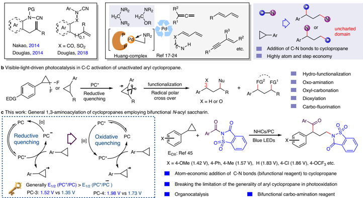
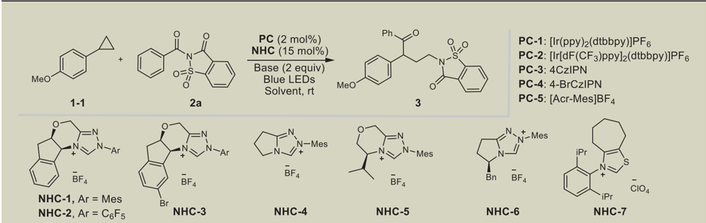
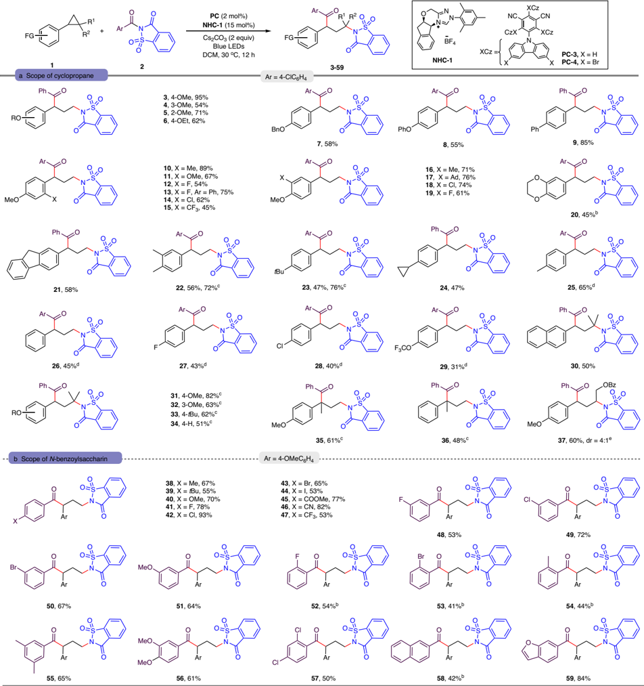
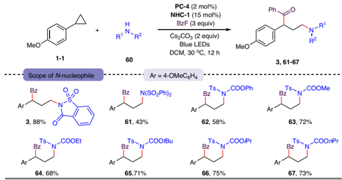
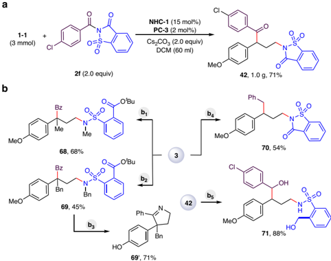
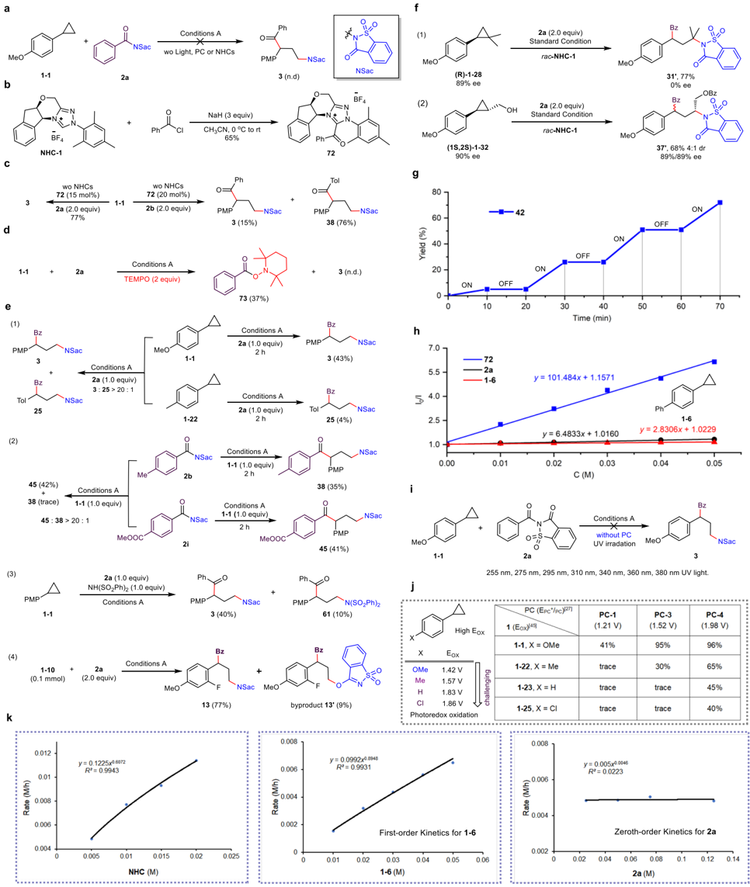
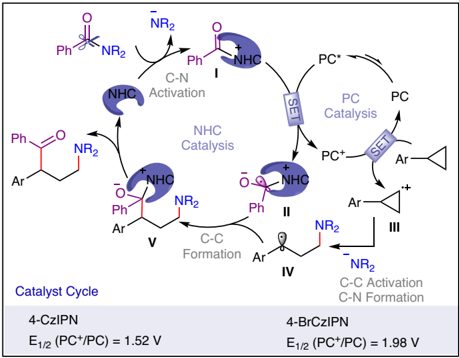

[1234567890():,;](http://crossmark.crossref.org/dialog/?doi=10.1038/s41467-024-53202-8&domain=pdf)

[1234567890():,;](http://crossmark.crossref.org/dialog/?doi=10.1038/s41467-024-53202-8&domain=pdf)

## Article

https://doi.org/10.1038/s41467-024-53202-8

## Visible light-mediated organocatalyzed 1,3-aminoacylation of cyclopropane employing N-benzoyl saccharin as bifunctional reagent

Received: 7 April 2024

Accepted: 4 October 2024

Mingrui Li 1 , Yingtao Wu 1 , Xiao Song 1 , Jiaqiong Sun 1,2 , Zuxiao Zhang 3 , Guangfan Zheng 1 &amp; Qian Zhang 1,4

The carboamination of unsaturated molecules using bifunctional reagents is considered an attractive approach for the synthesis of nitrogen-containing compounds. However, bifunctional C -N reagents have never been employed in the carboamination of cyclopropane. In this study, we use an N -heterocyclic carbene (NHC), N -benzoyl saccharin, as a bifunctional reagent and a photoredox catalyst for a dual-catalyzed 1,3-aminoacylation of cyclopropane. NHCs play multiple roles, functioning as Lewis base catalysts to activate C -Nbonds, promoting the oxidative quenching process of PC*, and acting as ef fi cient acyl radical transfer catalysts for the formation of C -C bonds. The oxidative quenching process between the excited-state PC* and acyl NHC adduct is the key to the photooxidation generality of aryl cyclopropanes.

Check for updates

Nitrogen-containing compounds have broad applications and are commonly found in biologically active molecules, natural products, and drug compounds. Therefore, the development of nitrogencontaining compounds through C -N bond formation have garnered increasing attention in the organic synthesis community. The carboamination 1 -3 of unsaturated molecules offers an ef fi cient strategy for introducing amine and carbon functional groups into substrates in a single step, facilitating the synthesis of complex nitrogen-containing compounds. In this carboamination method, the use of bifunctional reagents 3 -8 for C -Nbond cleavage 9,10 is regarded as an attractive highatom, step-economic approach to increase molecular complexity and diversity. The polar 11,12 or radical 13 [3 + 2] cycloaddition of strained aziridines with unsaturated molecules is a fundamental and important transformation for the synthesis of N -containing heterocycles. However, the employment of unstrained bifunctional C -N reagents is still an emerging area. In 2014, the Nakao 14 andDouglas 15,16 research groups independently made contributions to this fi eld by activating N -CN bonds and enabling the vicinal additions across intramolecular carbon-carbon double bonds (Fig. 1a, Left). Huang and coworkers provided further progress and developed intermolecular carboamination reagents, namely, aminals and N - and O -acetals. They achieved Pd-catalyzed C -N activation using bifunctional reagents and intermolecular addition to unsaturated carbon -carbon bonds 17 -24 , such as allenes 18 , conjugated dienes 19 -21 , and 1,3-enynes 22 -24 via aminomethyl cyclopalladated complexes (Huang complexes) 17 (Fig. 1a, Middle). Despite their importance, these protocols are restricted primarily to unsaturated carbon -carbon bonds. Cyclopropane, which has doublebond character 25,26 , is not suitable for these types of transformations. The design of bifunctional carboamination reagents with a different reaction model might provide a solution for C -N bond addition to cyclopropane.

Visible-light-mediated photocatalysis (PC) has been successfully employed as a powerful tool that enables controllable radical reactions 27 -30 . Light-mediated protocols can activate the C -C bonds of aryl cyclopropane 28 -43 under mild conditions, employing radical cations 31 -43 as the key intermediate. Feng 35 -40 , Studer 41,42 , and others 43

1 Department of Chemistry, Northeast Normal University, Changchun, China. 2 School of Environment, Northeast Normal University, Changchun, China. 3 Department of Chemistry, University of Hawai ' i at M ā noa. 2545 McCarthy Mall, Honolulu, HI, USA. 4 State Key Laboratory of Organometallic Chemistry, Shanghai Institute of Organic Chemistry, Chinese Academy of Sciences 345 Lingling Lu, Shanghai, China. e-mail: sunjq295@nenu.edu.cn; zhenggf265@nenu.edu.cn

a Aminocarbonation of C-C multi-bonds employing unstrained bifunctional C-N reagents (via C-N bond cleavage).

CN

X = CO, SOz

Douglas, 2018

PC*

Reductive quenching

Nakao, 2014

Douglas, 2014

EDG

R

c This work: General 1,3-aminoacylation of cyclopropanes employing bifunctional N-acyl saccharin.

PC

Reductive quenching

PC

Oxidative quenching

PC

Ar

Ar

Generally E1/2 (PC*/PC) &gt; E1/2 (PC*/PC)

PC-3: 1.52 V vs 1.35 V

NR2

H2C

NR2

a

NR2

H2C

OR

NR2

R2

Aminocarbonation of  C-C multi-bonds employing unstrained bifunctional C-N reagents (via C-N bond cleavage ).

Fig. 1 | Motivation for NHCs/PC dual-catalyzed addition of amide (C-N bonds) to cyclopropane. a Aminocarbonation of C-C multi-bonds employing unstrained bifunctional C-N reagents (via C-N bond cleavage). b Visible-light-driven

## Table 1 | Condition Optimizations a

| Entry   | PC (mol%)   | NHCs (15mol%)   | Solvent (2mL)   | Yields   |
|---------|-------------|-----------------|-----------------|----------|
| 1       | PC-1 (2)    | NHC-1           | DCM             | 41%      |
| 2       | PC-2 (2)    | NHC-1           | DCM             | 73%      |
| 3       | PC-3 (2)    | NHC-1           | DCM             | 94%      |
| 4       | PC-4 (2)    | NHC-1           | DCM             | 96%      |
| 5       | PC-5 (2)    | NHC-1           | DCM             | trace    |
| 6       | PC-3 (1)    | NHC-1           | DCM             | 67%      |
| 7       | PC-3 (2)    | NHC-2           | DCM             | trace    |
| 8       | PC-3 (2)    | NHC-3           | DCM             | 87%      |
| 9       | PC-3 (2)    | NHC-4           | DCM             | 36%      |
| 10      | PC-3 (2)    | NHC-5           | DCM             | 94%      |
| 11      | PC-3 (2)    | NHC-6           | DCM             | 85%      |
| 12      | PC-3 (2)    | NHC-7           | DCM             | 17%      |
| 13      | PC-3 (2)    | NHC-1           | PhCF 3          | 65%      |
| 14      | PC-3 (2)    | NHC-1           | DCE             | 82%      |
| 15      | PC-3 (2)    | NHC-1           | CH 3 CN         | 12%      |
| 16      | PC-3 (2)    | NHC-1           | THF             | 37%      |
| 17 b    | PC-3 (2)    | NHC-1           | DCM             | 95%      |

a Unless otherwise noted, all the reactions were carried out with 1 (0.1 mmol), 2 (0.2 mmol), NHCs (0.015 mmol), Cs2CO3 (0.2 mmol), and PC (0.002 mmol) in solvent (2 mL), with 40 W blue LEDs at 30 o C for 12 h. isolated yields. b Racemic NHC-1 was employed.

photocatalysis in C-C activation of unactivated aryl cyclopropane. c General 1, 3-aminoacylation of cyclopropanes employing bifunctional N -acyl saccharin.

PC

Pd

RI

have developed visible light-mediated reductive quenching-driven C -C activation of cyclopropanes, realizing hydrofunctionalization 35 or 1,3-difunctionalizations 36 -43 , including oxoamination 36,43 , oxylcarbonation 39 -42 , dioxylation 38 , and carbo fl uorination 37 (Fig. 1b). Notably, the photoredox cycle relies on a reductive quenching mechanism and is restricted by the high oxidation potential of aryl cyclopropane 34,44,45 , and the oxidation ability of PC*, strong-electrondonating aryl cyclopropane or multisubstituted aryl cyclopropane, is needed. In most cases, the reduction potential of E1/2 (PC + /PC) is signi fi cantly greater than that of E 1/2 (PC*/PC · -) 27 ; thus, we recognized that and switched the photoredox cycle to an oxidative quenching scenario, potentially providing a solution for the reaction generality of aryl cyclopropanes (Fig. 1c, Left). N -heterocyclic carbenes (NHCs) exhibit unique reactivity in activating carbonyl groups 46,47 and can serve as versatile acyl radical transfer catalysts in radical -radical cross couplings 48 -66 . Inspired by NHC-catalyzed C -N activation 54,67 and our continued interest in NHC catalysis 66,68,69 , we now disclose general and practical visible light-mediated organocatalysed 1,3aminoacylation 64,65 of cyclopropane 45 employing N -benzoyl saccharin as a bifunctional 3 -8 carboamination reagent (Fig. 1c, Right). To the best of our knowledge, this protocol represents a new approach for the catalytic addition of C -N bonds to cyclopropane using bifunctional reagents.

Fig. 2 | Scope of the substrate a . a scope of cyclopropane. b scope of N -benzoylsaccharin. a Conditions A: Unless otherwise noted, all the reactions were carried out with 1 (0.1 mmol), 2 (0.2 mmol), NHCs (0.015 mmol), Cs2CO3 (0.2 mmol), and PC (0.002 mmol) in DCM (2 mL), with blue LEDs at 30 o C for 12 h.

b Conditions B: Using 2 (4.0 equiv) for 72 h. c Conditions C: PC-4 instead of PC-3 , 24h. d Conditions D: PC-4 instead of PC-3 , NHCs (0.02 mmol), with blue LEDs at 50 o C for 72 h. e Conditions E: PC-4 instead of PC-3 , using 2 (3.0 equiv) for 24 h.

## Results

## Reaction optimization

Our initial experiments involved utilizing the triazolium salt NHC-1 and [Ir(ppy)2(dtbbpy)]PF6 as a catalyst in DCM under blue LED irradiation to realize C -N addition of N -benzoyl saccharin 2a to cyclopropane 1 -1 , a condition that had shown outstanding reactivity in our previous investigations 66 . Interestingly, the yield of the designed 1, 3-aminoacylation products 3 was 41%. We conducted a photocatalyst screening (Table 1, entries 2 -5) and found that the easily accessible organophotocatalyst 2, 4, 5, 6-tetra(9 H -carbazol-9-yl)isophthalonitrile (4CzIPN, PC-3 ) and its derivative PC-4 exhibited signi fi cantly high ef fi ciency, yielding 94% and 96% of the desired product 3 , respectively. However, the acridine-based photocatalyst PC-5 was not suitable for this aminoacylation system. Reducing PC loading slowed the reaction, as shown in entry 6. Our exploration of different NHC precursors revealed that the triazolium salt NHC-1 was the optimal choice (entries 7 -12), as even the cycloheptane-fused thiazolium salt NHC-7 yielded only 17% of the product (entry 12). An investigation into various solvents also produced relatively poor results (entries 13 -16). Despite the use of a chiral NHC catalyst (Table 1, entries 3, 8, and 10 -11), ineffective chiral induction (&lt; 10% ee) was observed in all cases. Therefore, racemic NHC-1 (entry 17) was chosen as the optimal NHC catalyst for further evaluation.

## Substrate scope

With optimal conditions established, we explored the scope of aryl cyclopropane substrates amenable to aminoacylation (Fig. 2a). The introduction of an electron-donating OMe group on the phenyl ring at the para-, meta-, and ortho-positions facilitated this transformation, resulting in the production of 3 -5 in yields ranging from 54% to 94%. Other strong electron-donating groups, such as ethoxy, benzyloxy, and phenoxy groups as well as a phenyl group at the para position of the aryl ring, were also compatible, yielding 6 -9 in moderate to high amounts. Electron-donating (alkyl and alkoxy), halogen, and electron-withdrawing groups at the ortho-( 10 -15 ) or meta-position ( 16 -19 ) of the 4-methoxyphenyl ring were well tolerated, indicating the system ' s tolerance to various functional groups and steric hindrance. In this transformation, 2, 3-dihydrobenzo[b][1,4]dioxine and 9 H - fl uorinesubstituted cyclopropanes proved effective, yielding desired products 20 and 21 in yields of 45% and 58%, respectively. Furthermore, we demonstrated the generality and robustness of the aminoacylation system by testing a range of challenging aryl cyclopropanes featuring moderate electron-donating (3, 4-dimethyl 22 , tertiary butyl 23 , cyclopropyl 24 , methyl 25 , hydrogen 26 , halogen ( fl uorine 27 , chlorine 28 ), and strong electron-withdrawing (tri fl uoromethoxy, 29 ) groups at the para position of the aryl ring. We employed PC-4 as the photocatalyst, obtaining the corresponding γ -amino ketones in yields ranging from 31% to 76%. Notably, the use of strongly oxidizing PC-4 , rather than PC-3 , signi fi cantly increased the reactivity, as exempli fi ed by 22 (56% to 72%) and 23 (47% to 76%). This marks the fi rst instance of PC-catalyzed radical difunctionalization of a general aryl cyclopropane, overcoming the limitations of previous reports that focused primarily on strong electron-donating substrates. Additionally, 1,1,2-trisubstituted cyclopropanes were con fi rmed as valuable substrates, producing 30 -34 in yields ranging from 50% to 82%. Electron-rich substrates exhibited increased reactivity. Furthermore, 1,1-disubstituted cyclopropanes were compatible with the aminoacylation system and produced 35 and 36 in yields of 61% and 48%, respectively. For the 1,2-disubstituted cyclopropane bearing a hydroxyl (OH) group, the 1,3-aminoacylation/OH-acylation product 37 was produced with a 60% yield and 4:1 dr.

Next, we explored the effectiveness of N -benzoyl saccharin in this redox -neutral, metal-free catalytic system (Fig. 2b). A wide array of electron-donating, halogen, and electron-withdrawing (ester carbonyl, cyano, and tri fl uoromethyl) functional groups at the para position of the aromatic ring of N -benzoyl saccharin were well tolerated, producing the corresponding γ -amino ketones 38 -47 in yields

Fig. 3 | Three-Component 1,3-Aminoacylation of Cyclopropane. a Conditions E: Unless otherwise noted, all the reactions were carried out with 1 (0.1 mmol), 60 (0.2 mmol), benzoyl fl uoride (0.3 mmol), NHCs (0.015 mmol), Cs2CO3 (0.2 mmol), and PC (0.002 mmol) in DCM (2 mL), with blue LEDs at 30 o C for 12 h.

Fig. 4 | Synthetic applicability. a Large-scale synthesis. b Follow-up transformations. Reaction conditions: b1 , 3 (0.1 mmol), KO t Bu(4.0 equiv), 18-crown-6 (1.0 mol %), CH3I (4.0 equiv), THF (2.0 mL), rt. 1 h. b2 , 3 (0.1 mmol), KO t Bu (4.0 equiv), 18-crown-6 (1.0 mol%), PhCH2Br (4.0 equiv), THF (2.0 mL), rt. 1 h. b3 , 69 (0.1 mmol), PhOH(3.0equiv),HBr(48%,0.6 mL),95 o C, 18 h. b4 , 3 (0.1 mmol), Et3SiH (2.5 equiv), TFA(1.0 ml), rt, 24 h. b5 , 42 (0.1 mmol), NaBH4 (2.0 equiv), MeOH (1.0 mL), 0 o C, 1 h.

ranging from 53% to 94%. Notably, the tolerance of halogen groups, speci fi cally iodine, provides potential for further cross-coupling transformations. Meta -substituted N -aroyl saccharins were also amenable, yielding 48 -51 in acceptable amounts. However, ortho -substituted N -aroyl saccharins exhibited relatively lower reactivity, resulting in the formation of 52 -54 with yields of only 41% -54%, even with extended reaction times. In contrast, disubstituted N -aroyl saccharins were compatible, producing desired products 55 -57 in moderate yields. Finally, naphthalene and heterocyclic rings were tolerated, yielding 42% and 84% of 58 and 59 , respectively. However, C -N reagents derived from aliphatic acyl chlorides were not suitable for this aminoacylation cascade. Interestingly, this 1,3-aminoacylation of cyclopropane could be extended to three-component coupling employing benzoyl fl uoride as an acylation reagent source (Fig. 3). Saccharin, diphenylsulfonamide, and N -(p-tosyl)carbamic acid ester were proven to be suitable substrates and produced the desired products 3 and 61 -67 in moderate to high yields.

## large-scale synthesis and follow-up transformations

To underscore the synthesis value of this aminoacylation system, we conducted large-scale synthesis and follow-up transformations. We

d

PMP

Tol

25

45 (42%)

wo NHCs

72 (15 mol%)

NSac

NSac

Conditions A

38 (trace)

1-1 (1.0 equiv)

45 : 38 &gt; 20 : 1

PMP

0.012

Rate (M/h)

0.01

0.008

0.006

0.004

(2)

(3)

(4)

y = 0.1225x0.6072

R2 = 0.9943

0.005

3 (15%)

38 (76%)

80 -

60

40

Fig. 5 | Mechanistic investigations. a Control experiment. b Preparation of NHC-adduct. c Catalistic acitivity of NHC-adduct. d Radical capture experiment. e Competing experiment. f Ring-opening of enantiomerically enriched 1-28, 1-32 .

successfully achieved gram-scale synthesis, obtaining a 71% yield of 42 (Fig. 4a). 3 underwent carbonyl α C -Halkylation and esteri fi cation ring opening of the saccharin motif (FigS. 4b1 &amp; 4b2), producing 68% and 45% yields of 68 and 69 , respectively. Furthermore, deprotection of the phenolic hydroxyl and amino groups occurred, generating cyclized 3,4-dihydro-2 H -pyrrole 69 ' in a 71% yield (Fig. 4b3). The carbonyl group was reduced to methylene using Et3SiH in TFA, resulting

g Light on/off experiments. h Stern-Volmer quenching studies. i Excitation experiments with UV light. j The effect of PC (EPC+/PC) and cyclopropane (EOX) on reactivity. k Reaction progress kinetic analysis.

in a 54% yield of 70 (Fig. 4b4). Additionally, when NaBH4 wasemployed as a reductant, 42 underwent reduction, and ring opening resulted in an 88% yield of 71 (Fig. 4b5).

## Mechanistic investigations

To further elucidate the mechanism involved, we conducted a series of investigations (Fig. 5). Control experiments con fi rmed that light wo NHCs

72 (20 mol%)

2b (2.0 equiv)

NSac

42

irradiation, photoredox catalysts, and NHC catalysts were essential for cascade aminoacylation (Fig. 5a). NHC-adduct 72 was initially prepared following Martin ' s methods 70 (Fig. 5b). The catalytic activity of 72 was con fi rmed through the ring-opening 1,3-aminaiton/acylation cascade of cyclopropane in the absence of NHCs (Fig. 5c, Left). When 2b was utilized as a bifunctional reagent, 3 (originating from 72 ) and 38 (originating from 2b ) were produced with yields of 15% and 76%, respectively (Fig. 5c, Right), indicating the intermediate and catalytic activity of 72 . The addition of the radical inhibitor 2, 2, 6, 6-tetramethylpiperidine 1oxyl (TEMPO) inhibited the transformations, and the acyl radicaltrapped byproduct 73 was produced with a 37% yield, indicating the involvement of a radical pathway (Fig. 5d). We conducted several competing experiments, as shown in Fig. 5e. The electron density of cyclopropane appeared to play a crucial role in the reaction rate, with strong electron-donating aryl cyclopropanes reacting faster than moderate ones under competitive and parallel conditions (Fig. 5e1). Interestingly, under competing conditions, electron-de fi cient N -aroyl saccharins reacted much faster than electron-rich saccharins did (Fig. 5E2, Left), while similar reaction rates were observed under parallel conditions (Fig. 5e2, Right). Furthermore, the yields of 45 under competitive and parallel conditions were similar, supporting the idea that the C -N cleavage step might be included in the product-determining step but not the rate-determining step. Competitive experiments with additional nucleophilic reagents, such as NH(SO2Ph)2, revealed that 3 (40%) and 61 (10%) were competitive compounds (Fig. 5e3). Furthermore, for cyclopropane 1 -10 , 1, 3-oxoacylation product 13 ' and normal γ -amino ketone 13 were found to be competitive compounds, and they were produced with 9% and 77% yields, respectively. These results indicate that the ring-opening process of cyclopropane may occur via nucleophilic attack by amide anions. The ring opening of enantioenriched 1 -28 and 1 -32 demonstrates the stereospeci fi city of the aminative nucleophilic ring opening process of cyclopropane, whereas the acylation process results in a non-stereospeci fi c con fi guration (Fig. 5f). To delve deeper into the mechanism of the photoredox cycle, we conducted photochemical experiments. The transformation occurred only under light irradiation, contradicting the radical chain mechanism (Fig. 5g). Emission quenching experiments (Fig. 5h) revealed that excited PC* was more likely to be quenched by acyl NHC-adduct 72 (KSV = 101.5 L/mol) than by cyclopropane 1-6 (KSV = 2.8 L/mol) and N -benzoyl saccharin 2a (KSV = 6.5 L/mol). In the absence of a photocatalyst, directly irradiating the reaction with different wavelengths of UV light was unable to produce the desired targets (Fig. 5i). Control experiments revealed that the degree of reactivity matched the oxidation potential of cyclopropane 45 and the reduction potential of E1/2(PC + /PC) 27 (Fig. 5j). These fi ndings, combined with those of the emission quenching experiments, suggest a preference for the oxidative quenching process 65,66 rather than the energy transfer pathway 6 -8,71,72 . Finally, we conducted kinetic experiments, which indicated a fi rst-order dependence on the concentration of cyclopropane (Fig. 5k, Middle), whereas N -aroyl saccharin exhibited a zeroth-order dependence (Fig. 5k, Right). An increase in the concentration of NHCs had a promotive effect on the reaction rate (Fig. 5k, Left).

On the basis of previous reports and our experimental results, we proposed possible catalytic cycles (Fig. 6). NHCs act as Lewis base catalysts, promoting the cleavage of C -N bonds and generating NHCadduct I and the saccharin anion. Under blue LED irradiation, excited 4CzIPN* (E1/2 (4CzIPN + /4CzIPN*) = -1.04 V vs. SCE) underwent an oxidative quenching process with NHC-adduct I ( -0.78 V vs. SCE, Figure S15), generating persistent NHC-attached acyl radical II and oxidized PC + . Single-electron transfer occurred between PC + [for 4CzIPN, E1/2(PC + / PC) = 1.52 V] and cyclopropane, regenerating ground-state PC and forming cyclopropane radical cation III , thus closing the photoredox cycle. The employment of highly oxidized PC + [for PC-4, E1/2 (PC + /PC) = 1.98 V] improved substrate applicability. Moreover, nucleophilic attack by the saccharin anion on radical cation III activated C -C bonds

Fig. 6 | Proposed catalytic cycle. Oxidative quenching driven NHC/PC dual catalysis.

and formed C -N bonds, generating benzyl radical IV . Moreover, radical -radical cross-coupling 73 between IV and II produced V , and the dissociation of NHCs led to the formation of the fi nal product.

In summary, we demonstrated the use of visible-light-mediated NHCs for a photoredox dual-catalyzed aminoacylation of cyclopropanes, employing readily available and bench-stable N -benzoyl saccharin as a bifunctional carboamination reagent. The direct addition of the C -N bonds of N-containing compounds to cyclopropanes under metal-free and mild conditions is an important advancement in this research area. This protocol overcomes the generality limitation of aryl cyclopropane in photooxidation. Mechanistic investigations revealed that the oxidative quenching process between the excited-state PC* and acyl NHC adduct achieved successful photooxidation of cyclopropanes. NHCs play multiple roles, including functioning as Lewis base catalysts to activate C -N bonds, promoting the oxidative quenching process of PC*, and acting as ef fi cient acyl radical transfer catalysts for the formation of C -C (acyl) bonds. Ongoingresearchinourlabisexploringtheapplicationof thisNHC/PC dual-catalyzed oxidative quenching system for other challenging transformations.

## Methods

## General procedure for the aminoacylation of cyclopropanes with N -benzoyl saccharin as bifunctional reagent

Into a nitrogen- fi lled glove box, a vial (10.0 mL) equipped with a magnetic stir bar was charged with NHC-1 (6.2 mg, 0.015 mmol), 4CzIPN (1.6 mg, 0.002 mmol), Cs2CO3 (65.1 mg, 0.2 mmol), 2 (0.2 mmol) and DCM (2.0mL). Then 1 (0.1 mmol) were added. The vial was removed from the glovebox, and then the reaction mixture was irradiated with Blue LED at room temperature for 12 h. After the reaction fi nished that monitored by TLC, the reaction mixture was quenched by water. The mixture was extracted with DCM (3 × 5.0 mL). The combined organic phases were dried over anhydrous Na2SO4, and the solvent was evaporated under vacuum. The residue was puri fi ed by fl ash column chromatography (petroleum ether/ethyl acetate = 3:1) to give the corresponding product. (See SI for more details on experimentation.)

## Data availability

Data supporting the fi ndings of this study are available within the article and Supplementary Information fi les. The source data underlying Fig. 5g, Fig. 5h, Fig. 5k, Supplementary Figs. S2 -S15 are provided as a Source Data fi le. Source data are available and provided with this paper. All other data are available in the main text or the Supplementary Information. All data are available from the corresponding author upon request. Source data are provided with this paper.

## References

1. Jiang, H. &amp; Studer, A. Intermolecular radical carboamination of alkenes. Chem. Soc. Rev. 49 , 1790 -1811 (2020).
2. Zeng, Z., Gao, H., Zhou, Z. &amp; Yi, W. Intermolecular redox-neutral carboamination of C -Cmultiple bonds initiated by transition-metalcatalyzed C -H activation. ACS Catal. 12 , 14754 -14772 (2022).
3. Lee, W., Park, I. &amp; Hong, S. Photoinduced difunctionalization with bifunctional reagents containing N-heteroaryl moieties. Sci. China Chem. 66 , 1688 -1700 (2023).
4. Myojeong, K., Yejin, K. &amp; Sungwoo, H. N-functionalized pyridinium salts: a new chapter for site-selective pyridine C -Hfunctionalization via radical-based processes under visible light irradiation. Acc. Chem. Res. 55 , 3043 -3056 (2022).
5. Moon, Y. et al. Visible light induced alkene aminopyridylation using N-aminopyridinium salts as bifunctional reagents. Nat. Commun. 10 , 4117 (2019).
6. Lee, W. et al. Energy-transfer-induced [3 + 2] cycloadditions of N -N pyridinium ylides. Nat. Chem. 15 , 1091 -1099 (2023).
7. Patra, T. et al. Metal-free photosensitized oxyimination of unactivated alkenes with bifunctional oxime carbonates. Nat. Catal. 4 , 54 -61 (2021).
8. Tan, G. et al. Photochemical single-step synthesis of β -amino acid derivatives from alkenes and (hetero)arenes. Nat. Chem. 14 , 1174 -1184 (2022).
9. Ouyang, K., Hao, W., Zhang, W. X. &amp; Xi, Z. Transition-metal-catalyzed cleavage of C -Nsingle bonds. Chem. Rev. 115 , 12045 -12090 (2015).
10. Ito, Y., Nakatani, S., Shiraki, R., Kodama, T. &amp; Tobisu, M. Nickelcatalyzed addition of C -Cbonds of amides to strained alkenes: the 1, 2-carboaminocarbonylation reaction. J. Am. Chem. Soc. 144 , 662 -666 (2014).
11. Cardoso, A. L. et al. Aziridines in formal [3 + 2] cycloadditions: synthesis of fi ve -membered heterocycles. Eur. J. Org. Chem. 2012 , 6479 -6501 (2012).
12. Wender, P. A. &amp; Strand, D. Cyclocarboamination of alkynes with aziridines: synthesis of 2, 3-dihydropyrroles by a catalyzed formal [3 + 2] cycloaddition. J. Am. Chem. Soc. 131 , 7528 -7529 (2019).
13. Hao, W., Wun, X. Y., Sun, J. Z., MacMillan, S. N. &amp; Lin, S. Radical redoxrelay catalysis: formal [3 + 2] cycloaddition of N-acylaziridines and alkenes. J. Am. Chem. Soc. 139 , 12141 -12144 (2017).
14. Miyazaki, Y., Ohta, N., Semba, K. &amp; Nakao, Y. Intramolecular aminocyanation of alkenes by cooperative palladium/boron catalysis. J. Am. Chem. Soc. 136 , 3732 -3735 (2014).
15. Pan, Z., Pound, S. M., Rondla, N. R. &amp; Douglas, C. J. Intramolecular AminocyanationofAlkenesbyN-CNBondCleavage. Angew.Chem. Int. Ed. 53 , 5170 -5174 (2014).
16. Pan, Z., Wang, S., Brethorst, J. T. &amp; Douglas, C. J. Palladium and Lewis-acid-catalyzed intramolecular aminocyanation of alkenes: scope, mechanism, andstereoselective alkene difunctionalizations. J. Am. Chem. Soc. 140 , 3331 -3338 (2018).
17. Zhang, H., Jiang, T., Zhang, J. &amp; Huang, H. Catalytic reactions directed by a structurally well-de fi ned aminomethyl cyclopalladated complex. Acc. Chem. Res. 54 , 4305 -4318 (2021).
18. Hu, J., Xie, Y. &amp; Huang, H. Palladium -catalyzed insertion of an allene into an aminal: aminomethylamination of allenes by C-N bond activation. Angew. Chem. Int. Ed. 53 , 7272 -7276 (2014).
19. Liu, Y., Xie, Y., Wang, H. &amp; Huang, H. Enantioselective aminomethylamination of conjugated dienes with aminals enabled by chiral palladium complex-catalyzed C -N bond activation. J. Am. Chem. Soc. 138 , 4314 -4317 (2016).
20. Yu, B., Zou, S., Liu, H. &amp; Huang, H. Palladium-catalyzed ring-closing reaction via C -N bond metathesis for rapid construction of saturated N-heterocycles. J. Am. Chem. Soc. 142 , 18341 -18345 (2020).
21. Zou, S., Yu, B. &amp; Huang, H. Enantioselective ring-closing aminomethylamination of aminodienes enabled by modi fi ed Trost ligands. Chem. Catal. 2 , 2034 -2048 (2022).
22. Zhang, Y., Yu, B., Gao, B., Zhang, T. &amp; Huang, H. Triple-bond insertion triggers highly regioselective 1, 4-aminomethylamination of 1, 3-enynes with aminals enabled by Pd-catalyzed C -N bond activation. Org. Lett. 21 , 535 -5396 (2019).
23. Zou, S., Yu, B. &amp; Huang, H. Palladium -catalyzed ring -closing aminoalkylative amination of unactivated aminoenynes. Angew. Chem. Int. Ed. 62 , e202215325 (2023).
24. Zou, S., Zhao, Z. &amp; Huang, H. Palladium -catalyzed aminoalkylative cyclization enables modular synthesis of exocyclic 1, 3 -dienes. Angew. Chem. Int. Ed. 135 , e202311603 (2023).
25. de Meijere, A. Bonding properties of cyclopropane and their chemical consequences. Angew. Chem. Int. Ed. 18 , 809 -826 (1979).
26. Pirenne, V., Muriel, B. &amp; Waser, J. Catalytic enantioselective ringopening reactions of cyclopropanes. Chem. Rev. 121 , 227 -263 (2020).
27. Kwon, K., Simons, R. T., Nandakumar, M. &amp; Roizen, J. L. Strategies to generate nitrogen-centered radicals that may rely on photoredox catalysis: development in reaction methodology and applications in organic synthesis. Chem. Rev. 122 , 2353 -2428 (2021).
28. Yu, X. Y., Chen, J. R. &amp; Xiao, W. J. Visible light-driven radical-mediated C -C bond cleavage/functionalization in organic synthesis. Chem. Rev. 121 , 506 -561 (2020).
29. Xuan, J., He, X. K. &amp; Xiao, W. J. Visible light-promoted ring-opening functionalization of three-membered carbo-and heterocycles. Chem. Soc. Rev. 49 , 2546 -2556 (2020).
30. Bellotti, P. &amp; Glorius, F. Strain-release photocatalysis. J. Am. Chem. Soc. 145 , 20716 -20732 (2023).
31. Hixson, S. S. &amp; Garrett, D. W. Arylcyclopropane photochemistry. photochemical addition of hydroxylic compounds to 1, 2-diarylcyclopropanes. J. Am. Chem. Soc. 96 , 4872 -4879 (1974).
32. Rao, V. R. &amp; Hixson, S. S. Arylcyclopropane photochemistry. electron-transfer-mediated photochemical addition of methanol to arylcyclopropanes. J. Am. Chem. Soc. 101 , 6458 -6459 (1979).
33. Dinnocenzo, J., Zuilhof, H., Lieberman, D., Simpson, T. &amp; McKechney, M. Three-electron SN2 reactions of arylcyclopropane cation radicals. 2. Steric and electronic effects of substitution1. J. Am. Chem. Soc. 119 , 994 -1004 (1997).
34. Petzold, D., Singh, P., Almqvist, F. &amp; Koenig, B. Visible -light -mediated synthesis of β -chloro ketones from aryl cyclopropanes. Angew. Chem. Int. Ed. 58 , 8577 -8580 (2019).
35. Ge, L. et al. Photoredox-catalyzed C -C bond cleavage of cyclopropanes for the formation of C (sp 3 ) -heteroatom bonds. Nat. Commun. 13 , 5938 (2022).
36. Ge, L. et al. Photoredox-catalyzed oxo-amination of aryl cyclopropanes. Nat. Commun. 10 , 4367 (2019).
37. Liu, H., Li, Y., Wang, D. X., Sun, M. M. &amp; Feng, C. Visible-lightpromoted regioselective 1, 3- fl uoroallylation of gemdi fl uorocyclopropanes. Org. Lett. 22 , 8681 -8686 (2020).
38. Pan, C. et al. Aryl radical cation promoted remote dioxygenation of cyclopropane derivatives. Cell Rep. Phys. Sci. 4 , 101233 (2023).
39. Wang, D. X., Wang, H., Xu, Y., Zhang, C. &amp; Feng, C. Visible light mediated regioselective 1, 3-oxylallylation of aryl cyclopropanes under redox-neutral conditions. Org. Chem. Front. 10 , 2147 -2154 (2023).
40. Xu, Y. et al. Stereoselective photoredox catalyzed (3 + 3) dipolar cycloaddition of nitrone with aryl cyclopropane. Angew. Chem. Int. Ed. 135 , e202310671 (2023).
41. Zuo, Z., Daniliuc, C. G. &amp; Studer, A. Cooperative NHC/ photoredox catalyzed ring -opening of aryl cyclopropanes to 1 -Aroyloxylated -3 -acylated alkanes. Angew. Chem. Int. Ed. 60 , 25252 -25257 (2021).
42. Zuo, Z. &amp; Studer, A. 1, 3-Oxyalkynylation of aryl cyclopropanes with ethylnylbenziodoxolones using photoredox catalysis. Org. Lett. 24 , 949 -954 (2022).

43. Qiao, X. et al. Photocatalytic oxo-amination of aryl cyclopropanes through an unusual SN2-like ring-opening pathway: won&gt; 99% ee. J. Org. Chem. 87 , 13627 -13642 (2022).
44. Peng, P. et al. Electrochemical C -C bond cleavage of cyclopropanes towards the synthesis of 1, 3-difunctionalized molecules. Nat. Commun. 12 , 3075 (2021).
45. Somich, Cathleen et al. Photoinitiated electron-transfer reactions of aromatic imides with phenylcyclopropanes. formation of radical ion pair cycloadducts. mechanism of the reaction. J. Org. Chem. 55 , 2624 -2630 (1990).
46. Hopkinson, M. N., Richter, C., Schedler, M. &amp; Glorius, F. An overview of N-heterocyclic carbenes. Nature 510 , 485 -496 (2014).
47. Bellotti, P., Koy, M., Hopkinson, M. N. &amp; Glorius, F. Recent advances in the chemistry and applications of N-heterocyclic carbenes. Nat. Rev. Chem. 5 , 711 -725 (2021).
48. Liu, K., Schwenzer, M. &amp; Studer, A. Radical NHC catalysis. ACS Catal. 12 , 11984 -11999 (2022).
49. Wang, Q. et al. Recent advances in combining photoredox and n-heterocyclic carbene catalysis. Chem. Sci. 14 , 13367 -13383 (2023).
50. Ishii, T., Kakeno, Y., Nagao, K. &amp; Ohmiya, H. N-heterocyclic carbenecatalyzed decarboxylative alkylation of aldehydes. J. Am. Chem. Soc. 141 , 3854 -3858 (2019).
51. Ishii, T., Ota, K., Nagao, K. &amp; Ohmiya, H. N-heterocyclic carbenecatalyzed radical relay enabling vicinal alkylacylation of alkenes. J. Am. Chem. Soc. 141 , 14073 -14077 (2019).
52. Han, Y. F. et al. Photoredox cooperative N-heterocyclic carbene/ palladium-catalysed alkylacylation of alkenes. Nat. Commun. 13 , 5754 (2022).
53. Xu, Y. et al. A light-driven enzymatic enantioselective radical acylation. Nature 625 , 74 -78 (2024).
54. Bay, A. V., Fitzpatrick, K. P., Betori, R. C. &amp; Scheidt, K. A. Combined photoredox and carbene catalysis for the synthesis of ketones from carboxylic acids. Angew. Chem. Int. Ed. 59 , 9143 -9148 (2020).
55. Meng, Q. Y., Döben, N. &amp; Studer, A. Cooperative NHC and photoredox catalysis for the synthesis of β -tri fl uoromethylated alkyl aryl ketones. Angew. Chem. Int. Ed. 59 , 19956 -19960 (2020).
56. Bay, A. V. et al. A. light -driven carbene catalysis for the synthesis of aliphatic and α -amino ketones. Angew. Chem. Int. Ed. 60 , 17925 -17931 (2021).
57. Meng, Q. Y., Lezius, L. &amp; Studer, A. Benzylic C -H acylation by cooperative NHC and photoredox catalysis. Nat. Commun. 12 , 2068 (2021).
58. Ren, S. C. et al. Carbene and photocatalyst-catalyzed decarboxylative radical coupling of carboxylic acids and acyl imidazoles to form ketones. Nat. Commun. 13 , 2846 (2022).
59. Yu, X., Meng, Q. Y., Daniliuc, C. G. &amp; Studer, A. Aroyl fl uorides as bifunctional reagents for dearomatizing fl uoroaroylation of benzofurans. J. Am. Chem. Soc. 144 , 7072 -7079 (2022).
60. Yu, X., Maity, A. &amp; Studer, A. Cooperative photoredox and N -heterocyclic carbene catalyzed fl uoroaroylation for the synthesis of α -tri fl uoromethyl -substituted ketones. Angew. Chem. Int. Ed. 62 , e202310288 (2023).
61. Tan, C. Y., Kim, M. &amp; Hong, S. Photoinduced electron transfer from xanthates to acyl azoliums: divergent ketone synthesis via N -heterocyclic carbene catalysis. Angew. Chem. Int. Ed. 135 , e202306191 (2023).
62. Byun, S. et al. Light-driven enantioselective carbene-catalyzed radical-radical coupling. Angew. Chem. Int. Ed. 62 , e202312829 (2023).
63. Goto, Y., Sano, M., Sumida, Y. &amp; Ohmiya, H. N-heterocyclic carbeneand organic photoredox-catalysed meta-selective acylation of electron-rich arenes. Nat. Synth. 2 , 1037 -1045 (2023).
64. Liu, W. D. et al. Diastereoselective radical aminoacylation of ole fi ns through N-heterocyclic carbene catalysis. J. Am. Chem. Soc. 144 , 22767 -22777 (2022).
65. Tanaka, N., Zhu, J. L., Valencia, O. L., Schull, C. R. &amp; Scheidt, K. A. Cooperative carbene photocatalysis for β -amino ester synthesis. J. Am. Chem. Soc. 145 , 24486 -24492 (2023).
66. Wang, L., Ma, R., Sun, J., Zheng, G. &amp; Zhang, Q. NHC and visible light-mediated photoredox co-catalyzed 1,4-sulfonylacylation of 1,3-enynes for tetrasubstituted allenyl ketones. Chem. Sci. 13 , 3169 -3175 (2022).
67. Hu, Z. et al. Desymmetrization of N-Cbz glutarimides through N-heterocyclic carbene organocatalysis. Nat. Commun. 13 , 4042 (2022).
68. Wu, Y., Li, M., Sun, J., Zheng, G. &amp; Zhang, Q. Synthesis of axially chiral aldehydes by N -heterocyclic -carbene -catalyzed desymmetrization followed by kinetic resolution. Angew. Chem. Int. Ed. 61 , e202117340 (2022).
69. Wu,Y.et al. Synthesis of axially chiral diaryl ethers via NHCs-catalyzed atroposelective esteri fi cation. Chem. Sci. 15 , 4564 -4570 (2024).
70. Delfau, L. et al. Critical assessment of the reducing ability of breslow -type derivatives and implications for carbene -catalyzed radical reactions. Angew. Chem. Int. Ed. 60 , 26783 -26789 (2021).
71. Strieth, F., James, M., Teders, M., Pitzera, L. &amp; Glorius, F. Energy transfer catalysis mediated by visible light: principles, applications, directions. Chem. Soc. Rev. 47 , 7190 -7202 (2018).
72. Huang, H. et al. Suzuki-type cross-coupling of alkyl tri fl uoroborates with acid fl uoride enabled by NHC/photoredox dual catalysis. Chem. Sci. 13 , 2584 -2590 (2022).
73. Leifert, D. &amp; Studer, A. The persistent radical effect in organic synthesis. Angew. Chem. Int. Ed. 59 , 74 -108 (2020).

## Acknowledgements

We acknowledge the NSFC (22471034, 22193012, and 22201033), Natural Science Foundation of Jilin Province (20230101047JC, YDZJ202201ZYTS338), and the Fundamental Research Funds for the Central Universities for generous fi nancial support. We acknowledge the Prof. Yuanhong Wang from NENU for chiral GC analysis.

## Author contributions

G.Z. &amp; J.S. conceived and designed the experiments. M.L., Y.W., and X.S. performedtheexperimentsandanalyzed the data. G.Z., J.S. and Q.Z. cowrote the manuscript. Z.Z. and Q.Z. provided constructive advice. Z.Z. polishing the manuscript. All authors contributed to the discussions.

## Competing interests

The authors declare no competing interests.

## Additional information

Supplementary information The online version contains supplementary material available at https://doi.org/10.1038/s41467-024-53202-8.

Correspondence and requests for materials should be addressed to Jiaqiong Sun or Guangfan Zheng.

Peer review information Nature Communications thanks Chao Feng, Adam Noble and the other, anonymous, reviewer(s) for their contribution to the peer review of this work. A peer review fi le is available.

Reprints and permissions information is available at http://www.nature.com/reprints

Publisher ' s note Springer Nature remains neutral with regard to jurisdictional claims in published maps and institutional af fi liations.

## Article

Open Access This article is licensed under a Creative Commons Attribution-NonCommercial-NoDerivatives 4.0 International License, which permits any non-commercial use, sharing, distribution and reproduction in any medium or format, as long as you give appropriate credit to the original author(s) and the source, provide a link to the Creative Commons licence, and indicate if you modi fi ed the licensed material. You do not have permission under this licence to share adapted material derived from this article or parts of it. The images or other third party material in this article are included in the article ' s Creative Commons licence, unless indicated otherwise in a credit line to the material. If material is not included in the article ' s Creative Commons licence and your intended use is not permitted by statutory regulation or exceeds the permitted use, you will need to obtain permission directly from the copyright holder. To view a copy of this licence, visit http:// creativecommons.org/licenses/by-nc-nd/4.0/.

©The Author(s) 2024