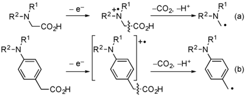
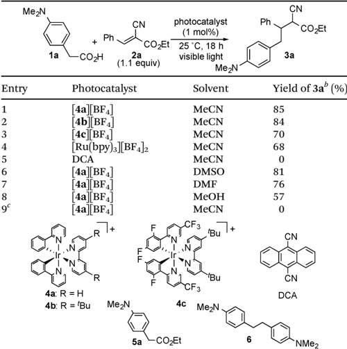
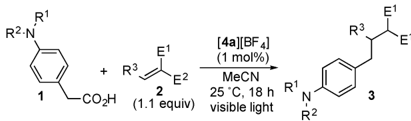
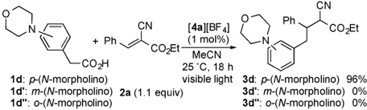
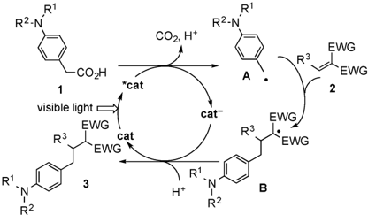

Open Access ,

R1

R2-N

BY-NO

R1

R2-N

7

8

5

4

COzH

- e

R2-N

to Ri

-COz, -H*

·}-COzH

## ChemComm

COzH

}-CО2H

## COMMUNICATION

4

Cite this: Chem. Commun., 2013, ,

Received 13th June 2013, Accepted 4th July 2013

9

7

8

5

4

DOI: 10.1039/c3cc44438d

www.rsc.org/chemcomm

Reactions of arylacetic acids bearing an amino group at the para -position in the benzene ring with alkenes in the presence of a catalytic amount of transition metal polypyridyl complexes as photocatalysts under visible light illumination proceed smoothly to give the corresponding benzylated products via oxidative decarboxylation in good to high yields.

Oxidative decarboxylation of carboxylic acids is one of the fundamental and important processes in nature. The mechanism of decarboxylation has been extensively studied in biochemistry. 1 In organic chemistry, decarboxylation under electrochemical and photochemical conditions provides a useful approach to the formation of alkyl radicals, therefore the decarboxylative dimerization has been found to occur via alkyl radicals as reaction intermediates. 2,3 The selective bond cleavage at the b -position with respect to the radical cation center triggered by photoinduced electron transfer is expected to be one of the most useful methods for the decarboxylative formation of alkyl radicals from carboxylic acids. 4 Especially, it is well known that a single electron oxidation of a -amino acids gives a -aminoalkyl radicals via decarboxylation, and synthetic use of the a -aminoalkyl radicals has been reported (Scheme 1a). 5,6 In contrast, synthetic utilization of the aminoarylacetic acids, which are the ''phenylogue'' of the a -amino acids, has been quite limited 6 a ,7,8 in spite of the utility of the generated benzyl radicals bearing an amino group in organic synthesis (Scheme 1b). 9

Recently we have succeeded in the utilization of a -aminoalkyl radicals via fragmentation of radical cations 10 by a single electron oxidation of amines mediated by photocatalysts. 11-13 We have envisaged that a single electron transfer using photocatalysts is suitable for oxidation of aminoarylacetic acids to trigger decarboxylation resulting in the corresponding benzyl radicals (Scheme 1b). In fact, we have found radical addition reactions via decarboxylation

Institute of Engineering Innovation, School of Engineering, The University of Tokyo, Yayoi, Bunkyo-ku, Tokyo, 113-8656, Japan. E-mail: ynishiba@sogo.t.u-tokyo.ac.jp; Fax: + 81 3-5841-1175; Tel: + 81 3-5841-1175

† Electronic supplementary information (ESI) available: Experimental procedures, characterization data for all new compounds. See DOI: 10.1039/c3cc44438d ‡ Current address: Department of Applied Chemistry, Graduate School of Engineering, Nagoya University, Furo-cho, Chikusa-ku, Nagoya, 464-8603, Japan. E-mail: miyake@apchem.nagoya-u.ac.jp

4

9

-

7

8

5

6

7

8

5

4

-

View Article Online View Journal |View Issue

## Visible light-mediated oxidative decarboxylation of arylacetic acids into benzyl radicals: addition to electron-deficient alkenes by using photoredox catalysts †

Yoshihiro Miyake,* z Kazunari Nakajima and Yoshiaki Nishibayashi*

Scheme 1 Oxidative decarboxylation of carboxylic acids bearing an amino group.

of the aminoarylacetic acids to electron-deficient alkenes. Preliminary results are described herein.

At first, we investigated the reaction of 4-( N , N -dimethylamino)phenylacetic acid ( 1a ) with ethyl ( E )-2-cyano-3-phenylpropenoate ( 2a ) under various conditions (Table 1). When a solution of 1a with 1.1 equiv. of 2a in the presence of [ 4a ][BF4] (1 mol%) in acetonitrile (MeCN) was illuminated with a white LED (14 W) at 25 1 C for 18 h, ethyl 2-cyano-4-(4-( N , N -dimethylamino)phenyl)-3-phenylbutanoate ( 3a ) was obtained in 85% yield (Table 1, entry 1). The reaction using [ 4b ][BF4 ] as a photocatalyst also proceeded smoothly to give 3a in a similar yield (Table 1, entry 2), while the yield of 3a slightly decreased with the use of [ 4c ][BF4] or [Ru(bpy) 3][BF4 ]2 as a photocatalyst (Table 1, entries 3 and 4). In sharp contrast, when 9,10-dicyanoanthracene (DCA) was used in place of [ 4a ][BF4], no formation of 3a was observed at all (Table 1, entry 5). Use of dimethyl sulfoxide (DMSO) as a solvent in place of MeCN afforded 3a in 81% yield (Table 1, entry 6). When other polar solvents such as N , N -dimethylformamide (DMF) and methanol were used, 3a was obtained in lower yields (Table 1, entries 7 and 8). Using ethyl 4-( N , N -dimethylamino)phenylacetate ( 5a ) under similar conditions did not afford 3a at all (Table 1, entry 9). Separately, we confirmed that no formation of 3a was observed in the absence of visible light or a photocatalyst. In the previously reported oxidative decarboxylation, 2,3,7 the homo-coupling of benzyl radicals easily occurred to give the corresponding bibenzyl ( 6 ), while no formation of 6 was observed in all cases presented in Table 1. This result indicates that a visible lightmediated electron transfer using photocatalysts is favorable for addition of benzyl radicals derived from phenylacetic acids to alkenes.

Next, we investigated reactions of a variety of arylacetic acids ( 1 ) with 2a (Table 2). The reaction of phenylacetic acid bearing an N , N -diethylamino moiety at the para -position of the benzene ring

c

R2-N

R1

(a)

(b)

Open Access ,

Me2N

Ari

Nazd

BY-NO

1a

L

4a| BF4

CN

2a

(1.1 equiv)

2a

MeCN

CFз

[4a][BF 4]

(1 mol%)

photocatalyst

Ph

(1 mol%)

[4a][BF 4]

(%IoW L)

MeCN

CO¿Et

25 °C, 18 h

CN

CN

Ph

CN

CO¿Et

N

COzEt

CO¿Et

За

25 °C, 18 h

(1 mol%)

MeCN

Ar

COzEt

Table 1 Photochemical reactions of 4-( N , N -dimethylamino)phenylacetic acid ( 1a ) with ethyl ( E )-2-cyano-3-phenylpropenoate ( 2a ) a 0%

Me2N

4C MezN

a All reactions of 1a (0.25 mmol) with 2a (0.275 mmol) were carried out in the presence of a photocatalyst (0.0025 mmol) in solvent (2.5 mL) under 14 W white LED illumination at 25 1 C for 18 h. b Isolated yield. c 5a was used in place of 1a .

Table 2 Photochemical reactions of arylacetic acids ( 1 ) with 2a a

| Entry   | Arylacetic acid ( 1 )                     | Yield of 3 b (%)   |
|---------|-------------------------------------------|--------------------|
| 1       | Ar = 4-Et 2 N-C 6 H 4 ( 1b )              | 84 ( 3b )          |
| 2       | Ar = 4-PhMeN-C 6 H 4 ( 1c )               | 89 ( 3c )          |
| 3       | Ar = 4-( N -morpholino)-C 6 H 4 ( 1d )    | 96 ( 3d )          |
| 4       | Ar = 4-( N -pyrrolidino)-C 6 H 4 ( 1e )   | 74 ( 3e )          |
| 5       | Ar = 4-BnHN-C 6 H 4 ( 1f )                | 81 ( 3f )          |
| 6 c     | Ar = 4-H 2 N-C 6 H 4 ( 1g )               | 87 ( 3g )          |
| 7       | Ar = 4-( N -morpholino)-1-naphthyl ( 1h ) | 61 ( 3h )          |

( 1b ) proceeded to give 3b in 84% yield (Table 2, entry 1). Other phenylacetic acids bearing a variety of tertiary amino groups such as N -methylN -phenylamino, N -morpholino, and N -pyrrolidino moieties at the para -position of the benzene ring were also applicable, giving the corresponding products ( 3c -3e ) in high yields (Table 2, entries 2-4). Reactions of phenylacetic acids bearing secondary ( 1f ) and primary amino ( 1g ) groups also took place smoothly to give 3f and 3g in 81% and 87% yields, respectively (Table 2, entries 5 and 6). When the acetic acid bearing a 4-( N -morpholino)-1-naphthyl ( 1h ) group was used, 3h was obtained in a good yield (Table 2, entry 7).

Other reactions of 1d or 1g with a variety of alkenes ( 2 ) were also examined by using [ 4a ][BF4] as a photocatalyst (Table 3).

Ph

Table 3 Photochemical reactions of arylacetic acids ( 1d or 1g ) with alkenes ( 2 ) a

| Entry   | Arylacetic acid ( 1 )   | Alkene ( 2 )                                        | Yield of 3 b (%)   |
|---------|-------------------------|-----------------------------------------------------|--------------------|
| 1       | 1d                      | R 3 = 4-MeOC 6 H 4 , E 1 = CN, E 2 = CO 2 Et ( 2b ) | 74 ( 3i )          |
| 2       | 1d                      | R 3 = 4-MeC 6 H 4 , E 1 = CN, E 2 = CO 2 Et ( 2c )  | 93 ( 3j )          |
| 3       | 1d                      | R 3 = 4-PhC 6 H 4 , E 1 = CN, E 2 = CO 2 Et ( 2d )  | 66 ( 3k )          |
| 4       | 1d                      | R 3 = 4-ClC 6 H 4 , E 1 = CN, E 2 = CO 2 Et ( 2e )  | 52 ( 3l )          |
| 5       | 1d                      | R 3 = PhCH 2 CH 2 , E 1 = CN, E 2 = CO 2 Et ( 2f )  | 80 ( 3m )          |
| 6       | 1d                      | R 3 = i Pr, E 1 = CN, E 2 = CO 2 Et ( 2g )          | 51 ( 3n )          |
| 7       | 1d                      | R 3 = Ph, E 1 = E 2 = CN ( 2h )                     | 70 ( 3o )          |
| 8       | 1d                      | R 3 = Ph, E 1 = E 2 = CO 2 Et ( 2i )                | 16 ( 3p )          |
| 9 c     | 1g                      | R 3 = 4-MeC 6 H 4 , E 1 = CN, E 2 = CO 2 Et ( 2c )  | 90 ( 3q )          |
| 10 c    | 1g                      | R 3 = PhCH 2 CH 2 , E 1 = CN, E 2 = CO 2 Et ( 2f )  | 51 ( 3r )          |

a All reactions of 1 (0.25 mmol) with 2a (0.275 mmol) were carried out in the presence of [ 4a ][BF4] (0.0025 mmol) in MeCN (2.5 mL) under 14 W white LED illumination at 25 1 C for 18 h. b Isolated yield. c DMSO was used in place of MeCN.

Introduction of substituents such as methoxy, methyl, phenyl, and chloro at the para -position of the benzene ring of 2a is successful in giving the corresponding products ( 3i -3l ) in good to high yields (Table 3, entries 1-4). Alkenes bearing phenylethyl and iso-propyl groups at the b -position were applied to give 3m and 3n in 80% and 51% yields, respectively (Table 3, entries 5 and 6). The reaction of 1d with benzylidenemalononitrile ( 2h ) proceeded smoothly to give 3o in 70%yield (Table 3, entry 7). However, a lower yield of 3p was obtained when diethyl benzylidenemalonate ( 2i ) was used as a substrate (Table 3, entry 8). The arylacetic acid bearing an amino group ( 1g ) was also transformed efficiently into 3q and 3r in 90% and 51% yields (Table 3, entries 9 and 10).

To investigate the effect of the position of an amino group, we carried out reactions of phenylacetic acids bearing a morpholino group at the para -, meta - and ortho -positions of the benzene ring ( 1d , 1d 0 and 1d 00 ) with 2a under similar conditions (Scheme 2). In sharp contrast to the reaction of 1d , when 1d 0 and 1d 00 were used as substrates, no formation of the corresponding products 3d 0 and 3d 0 0 was observed at all. Furthermore, in order to explore the origin of this reactivity, we also investigated fluorescence quenching studies of 4a in the presence of 1d , 1d 0 or 1d 00 in MeCN. The rate constants for 1d and 1d 0 were estimated to be 2.86 -10 8 M  1 s  1 and 6.78 -10 7 M  1 s  1 respectively, by using the Stern-Volmer plot, while no quenching of 4a by 1d 00 occurred at all. Fromthese results, it is revealed that oxidation of 1d 0 certainly occurred but sequential decarboxylation hardly proceeded. It is reported that the unpaired electron spin density at the para -position in the benzene ring

Scheme 2 Effect of the position of the amino group on reactions of 1d , 1d 0 , and 1d 00 with 2a .

Open Access ,

R1

R2-N

BY-NO

CO¿H

visible light

EWG

R3

R3

Scheme 3 Plausible reaction pathway.

of the one-electron oxidized aniline is much higher than that at the meta -position. 14 The radical character in the benzene ring of the oneelectron oxidized 1d and 1d 0 is expected to have a great effect on the desirable decarboxylation. In the case of 1d 0 , the radical character of the carbon atom at the meta -position with respect to the amino group (at the b -position with respect to the carboxyl group) of the oxidized 1d 0 is too small to induce efficient decarboxylation. On the other hand, Stern-Volmer analysis clearly indicates that oxidation of 1d 00 under photoirradiation occurs scarcely although the spin population at the ortho -position is also known to be similar to that at the para -position. This is probably because an intramolecular hydrogen bonding between the amino group and carboxylic acid in 1d 0 0 inhibits the electron transfer oxidation. 15 In addition, we confirmed that no reaction of 4-methoxyphenylacetic acid ( 1i ) under similar conditions occurred at all. These facts clearly indicate that decarboxylation triggered by a single electron oxidation of the amino group at the para -position is one of the key steps to promote these transformations.

A plausible reaction pathway is shown in Scheme 3. First, a single electron oxidation of aminoarylacetic acid ( 1 ) by an excited photocatalyst (* cat ) and sequential decarboxylation occur to give the benzyl radical ( A ) and the reduced form of the photocatalyst ( cat  ). 4,8 Addition of A to 2 results in the formation of the radical intermediate ( B ). Finally, reduction of B by cat  and subsequent protonation proceed to give the product ( 3 ) accompanied by regeneration of the photocatalyst ( cat ). The reduction of B by the reduced form of an iridium catalyst ([Ir(ppy) 2(bpy)] 0 ) is feasible according to the literature redox potentials. 16,17 Thequantumyieldinthereaction of 1a with 2a wasestimated to be 0.21, which is less than 1 and is in the common range of molecular transformations via photoinduced electron transfer with transition metal polypyridyl complexes. 10 This result suggests that the contribution of a photo independent process including a radical chain process is negligible in the present system. 10 The pathway shown in Scheme 3 is similar to that described in our previous report on the addition of a -aminoalkyl radicals to electron-deficient alkenes. 10 c On the other hand, considering the redox potential of cyanoesters 2 , 16 the reaction pathway via reduction of 2 by the excited photocatalyst 17 and subsequent radical-radical coupling is also possible. 10 a ,18

In summary, we have succeeded in the visible light-mediated synthetic utilization of benzyl radicals formed by oxidation and subsequent decarboxylation of arylacetic acids. This reaction system is applicable for addition of a variety of benzyl radicals bearing an amino group at the para -position in the benzene ring to electrondeficient alkenes. A number of transformations using alkyl radicals from alkyl halides as reaction intermediates have been reported until

COz, H+

R1

R2-N

EWG

EWG

now, where alkyl halides are known to be promising precursors for generation of alkyl radicals. 9 However, examples for preparation of alkyl halides bearing amino groups in a single molecule are limited due to undesirable reactions including N -alkylation reactions. 19 We believe that the method described here provides an alternative route for generation of benzyl radicals bearing an amino group.

## Notes and references

- 1 ( a ) T. Li, L. Huo, C. Pulley and A. Liu, Bioorg. Chem. , 2012, 43 , 2; ( b ) G.-G. Chang and L. Tong, Biochemistry , 2003, 42 , 12721; ( c ) W. W. Cleland, Acc. Chem. Res. , 1999, 32 , 862.
- 2 A. K. Vijh and B. E. Conway, Chem. Rev. , 1967, 67 , 623.
- 3 D. Budac and P. Wan, J. Photochem. Photobiol., A , 1992, 67 , 135.
- 4 ( a ) E. Baciocchi, M. Bietti and O. Lanzalunga, J. Phys. Org. Chem. , 2006, 19 , 467; ( b ) E. Baciocchi, M. Bietti and O. Lanzalunga, Acc. Chem. Res. , 2000, 33 , 243.
- 5 For reviews, see: ( a ) D. W. Cho, U. C. Yoon and P. S. Mariano, Acc. Chem. Res. , 2011, 44 , 204; ( b ) U. C. Yoon and P. S. Mariano, Acc. Chem. Res. , 1992, 25 , 233.
- 6 ( a ) Y. Yoshimi, K. Kobayashi, H. Kamakura, K. Nishikawa, Y. Haga, K. Maeda, T. Morita, T. Itou, Y. Okada and M. Hatanaka, Tetrahedron Lett. , 2010, 51 , 2332; ( b ) A. G. Griesbeck, T. Heinrich, M. Oelgemo ¨ller, J. Lex and A. Molis, J. Am. Chem. Soc. , 2002, 124 , 10972; ( c ) A. G. Griesbeck, T. Heinrich, M. Oelgemo ¨ller, A. Molis and A. Heidtmann, Helv. Chim. Acta , 2002, 85 , 4561; ( d ) Z. Su, P. S. Mariano, D. E. Falvey, U. C. Yoon and S. W. Oh, J. Am. Chem. Soc. , 1998, 120 , 10676.
- 7 L. Cermenati, M. Mella and A. Albini, Tetrahedron , 1998, 54
- , 2575.
- 8 M.A.Smitha, E. Prasad and K. R. Gopidas, J. Am. Chem. Soc. , 2001, 123 , 1159.
- 9 ( a ) For reviews see: P. Renaud, in Radicals in Organic Synthesis , ed. P. Renaud, M. P. Sibi, Wiley-VCH, Weinheim, 2001; ( b ) G. J. Rowlands, Tetrahedron , 2010, 66 , 1593; ( c ) I. Ryu, N. Sonoda and D. P. Curran, Chem. Rev. , 1996, 96 , 177; ( d ) C. P. Jasperse, D. P. Curran and T. L. Fevig, Chem. Rev. , 1991, 91 , 1237.
- 10 ( a ) Y. Miyake, K. Nakajima and Y. Nishibayashi, Chem.-Eur. J. , 2012, 18 , 16473; ( b ) Y. Miyake, Y. Ashida, K. Nakajima and Y. Nishibayashi, Chem. Commun. , 2012, 48 , 6966; ( c ) Y. Miyake, K. Nakajima and Y. Nishibayashi, J. Am. Chem. Soc. , 2012, 134 , 3338. 11 ( a ) L. R. Espelt, E. M. Wiensch and T. P. Yoon, J. Org. Chem. , 2013, 78 , 4107; ( b ) S. Zhu, A. Das, L. Bui, H. Zhou, D. P. Curran and M. Rueping, J. Am. Chem. Soc. , 2013, 135 , 1823; ( c ) P. Kohls, D. Jadhav, G. Pandey and O. Reiser, Org. Lett. , 2012, 14 , 672; ( d ) A. McNally, C. K. Prier and D. W. C. MacMillan, Science , 2011, 334 , 1114.
- 12 M. T. Pirnot, D. A. Rankic, D. B. C. Martin and D. W. C. MacMillan, Science , 2013, 339 , 1593.
- 13 For recent reviews, see: ( a ) C. K. Prier, D. A. Rankic and D. W. C. MacMillan, Chem. Rev. , 2013, 113 , 5322, DOI: 10.1021/cr300503r; ( b ) L. Shi and W. Xia, Chem. Soc. Rev. , 2012, 41 , 7687; ( c ) J. Xuan and W.-J. Xiao, Angew. Chem., Int. Ed. , 2012, 51 , 6828; ( d ) M. A. Ischay and T. P. Yoon, Eur. J. Org. Chem. , 2012, 3359; ( e ) S. Maity and N. Zheng, Synlett , 2012, 1851; ( f ) J. W. Tucker and C. R. J. Stephenson, J. Org. Chem. , 2012, 77 , 1617.
- 14 G. D'Aprano, E. Proynov, M. Lebœuf, M. Leclerc and D. R. Salahub, J. Am. Chem. Soc. , 1996, 118 , 9736.
- 15 ( a ) D. A. Smith and S. Vijayakumar, Tetrahedron Lett. , 1991, 32 , 3617; ( b ) X. Li, Y.-D. Wu and D. Yang, Acc. Chem. Res. , 2008, 41 , 1428; ( c ) X.-J. Liao, W. Guo and S.-H. Xu, Acta Crystallogr., Sect. E , 2011, 67 , o1732; ( d ) R. K. Castellano, Y. Li, E. A. Homan, A. J. Lampkins, I. V. Marı ´ n and K. A. Abboud, Eur. J. Org. Chem. , 2012, 4483.
- 16 X.-Q. Zhu, M. Zhang, Q.-Y. Liu, X.-X. Wang, J.-Y. Zhang and J.-P. Cheng, Angew. Chem., Int. Ed. , 2006, 45 , 3954.
- 17 F. O. Garces, K. A. King and R. J. Watts, Inorg. Chem. , 1988, 27 , 3464.
- 18 See ESI† for experimental details.
- 19 Examples for preparation of 4-aminobenzyl bromides: ( a ) G. Wang, X. Zhang, J. Geng, K. Li, D. Ding, K.-Y. Pu, L. Cai, Y.-H. Lai and B. Liu, Chem.-Eur. J. , 2012, 18 , 9705; ( b ) J.-P. Leclerc, J.-P. Falgueyret, M. Girardin, J. Guay, S. Guiral, Z. Huang, C. S. Li, R. Oballa, Y. K. Ramtohul, K. Skorey, P. Tawa, H. Wang and L. Zhang, Bioorg. Med. Chem. Lett. , 2011, 21 , 6505; ( c ) H. Enomoto, Y. Morikawa, Y. Miyake, F. Tsuji, M. Mizuchi, H. Suhara, K. Fujimura, M. Horiuchi and M. Ban, Bioorg. Med. Chem. Lett. , 2009, 19 , 442.