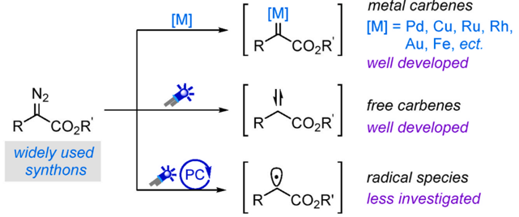
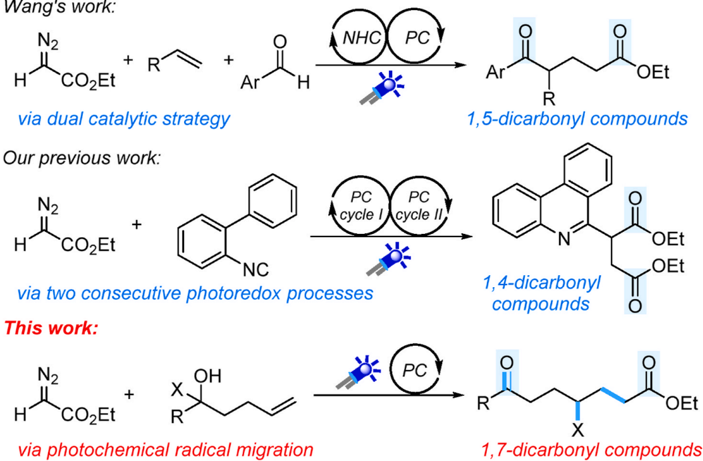
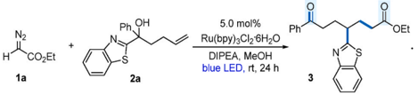
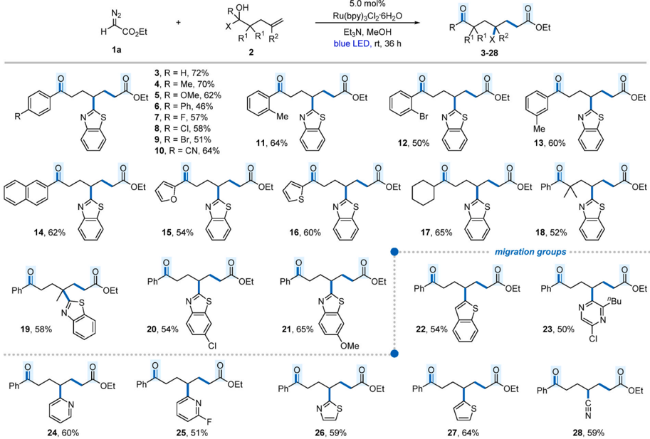
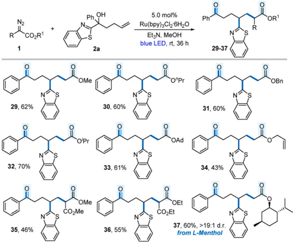
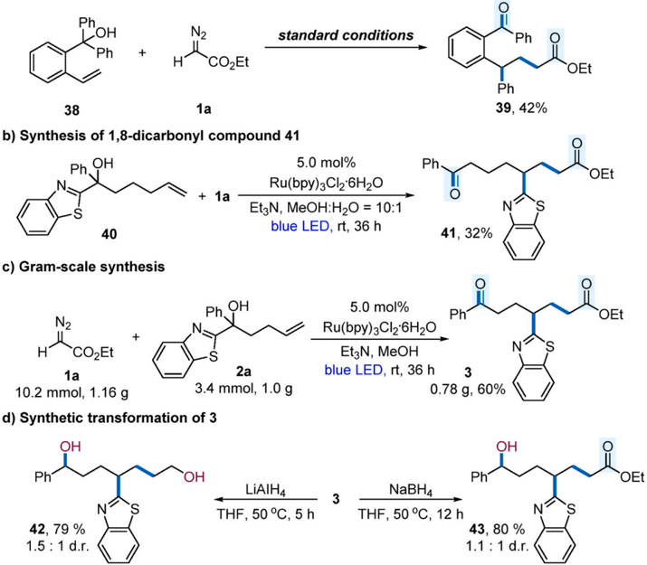
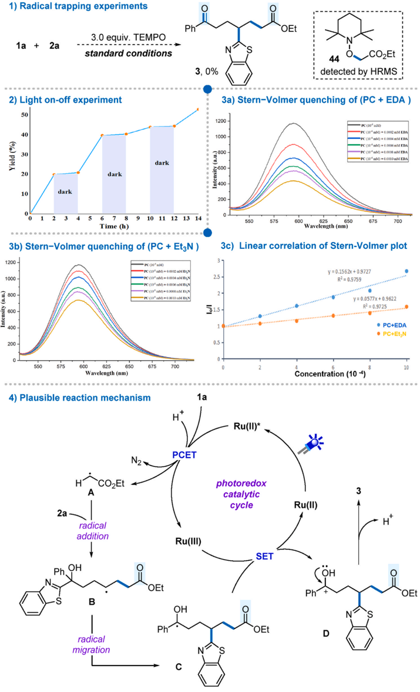

Contents lists available at ScienceDirect

## Tetrahedron Chem

journal homepage: www.journals.elsevier.com/tetrahedron-chem

## Photoredox-enabled remote radical group migration: Pathway to 1,7-dicarbonyl compounds from diazoalkanes

Hai-Bing Ye a , Ye-Peng Bao a , Tian-Yang Liu a , Tao Wei a , Chen Yang a , Qing-An Liu a , Jun Xuan a,b,*

a Anhui Province Key Laboratory of Chemistry for Inorganic/Organic Hybrid Functionalized Materials, College of Chemistry &amp; Chemical Engineering, Anhui University, Hefei, 230601, China

b Key Laboratory of Structure and Functional Regulation of Hybrid Materials, Ministry of Education, Hefei, 230601, China

## A R T I C L E  I N F O

Keywords: 1,n-dicarbonyls Radical migration Diazoalkanes Visible light

Photoredox catalysis

A B S T R A C T

Herein, we developed a mild and efficient photoredox-enabled remote radical group migration with the utilization of diazoalkanes as radical precursors, giving access to various valuable 1,7-dicarbonlys in moderate to good yields. A diverse set of migrating groups, including benzothiazole, benzothiophene, pyrazine, pyridine, thiazole,  thiophene and nitrile were well tolerated. Furthermore, the facile synthesis of 1,8-dicarbonyl compound, scale-up reaction and useful synthetic transformation further proved the method attractive and valuable.

As a kind of commercially available and convenient accessed synthons,  diazo  compounds  find  widespread  application  in  synthetic organic chemistry [1,2]. They generally be recognized as carbene precursors  under  either  transition-metal  catalytic  reaction  conditions, thermal or direct photo-irradiation (Scheme 1a). Starting from diazoalkanes, a wide range carbene transfer reactions, such as X -H insertion, cyclopropanation, ylide formation and others have been well established in the past few years [3 -10]. In contrast, the utilization of diazo compounds  as  free  radical  precursors  to  undergo  radical  type  of  transformations, especially under visible light-induced photoredox catalytic conditions, is much less reported and still underdeveloped [11 -20].

1,n-Dicarbonyl compounds are versatile and useful synthetic building blocks, which are commonly used precursors for the construction of various valuable bioactive heterocycles, e.g. pyrroles, furans and thiophenes etc. [21,22]. Consequently, a considerable number of effective approaches  were  developed  for  their  facile  synthesis,  including  the utilization of visible light-induced photoredox catalytic strategy [23 -28].  However,  to  the  best  of  our  knowledge,  only  two  reported examples are focusing on the photochemical construction of 1,n-dicarbonyl  compounds  from  diazoalkanes  with  the  formation  of  radical species  as  the  key  intermediates.  In  2022,  Wang  and  co-workers  reported  a  dual-catalytic  method  for  the  synthesis  of  1,5-dicarbonyl compounds by merging photoredox catalysis with NHC catalysis using diazo esters as the radical source (Scheme 1b) [29]. Shortly after this work, our group disclosed a photochemical cascade radical cyclization of  2-isocyanobiphenyls  with  diazoalkanes  through  a  stepwise  radical pathway with two consecutive photoredox catalytic cycles, leading to a wide range of succinic ester-containing phenanthridines in average good yields (Scheme 1b) [30]. It is still highly desirable to further expanding the synthetic applicability of diazoalkanes in the construction of other important long-chain 1,n-dicarbonyl skeletons.

On the other hand, remarkable progress has recently been achieved in  the  field  of  radical  difunctionlization  of  alkenes  through  intramolecular  functional  group  migration,  offering  a  robust  method  to distally functionalized alkyl ketones [31 -34]. In 2017, Zhu group reported the synthesis of 1,7-dicarboynls via radical migration strategy with bromodifluoroacetate as radical sources [35]. Despite efficiency, the migration group in this study limited to use cyano group. Xu and co-workers further expanded the strategy with simple ketones/esters as the alkyl radical source [36]. However, stoichiometric amount of diacylperoxide (LPO) was needed as HAT reagent to facilitate the radical generation. Against this background, we hypothesized that the combination of radical migration strategy with photochemical radical transformation  of  diazoalkanes  could  serve  as  a  handle  to  overcome  the above  limitations.  To  date,  the  use  of  diazoalkanes  as  alkyl  radical sources for such photochemical radical migration reaction has not yet been reported. As our continuous research interests in photochemical transformation of diazoalkanes [37 -42], we reported herein a

* Corresponding author. Anhui Province Key Laboratory of Chemistry for Inorganic/Organic Hybrid Functionalized Materials, College of Chemistry &amp; Chemical Engineering, Anhui University, Hefei, 230601, China.

E-mail address: xuanjun@ahu.edu.cn (J. Xuan).

## [https://doi.org/10.1016/j.tchem.2023.100040](https://doi.org/10.1016/j.tchem.2023.100040)

Received 23 April 2023; Received in revised form 24 May 2023; Accepted 9 June 2023

Reaction optimization ª.

A) General reaction models of diazo alkanes

N2

1a

Ph. OH

metal carbenes

5.0 mol%

Ph

OEt

H.-B. Ye et al.

2a blue LED, rt, 24 h

* (PC)

N2

R

CO\_R

widely used synthons

B) Photochemical 1,n-dicarbonyl compound synthesis from diazo alkanes

Wang's work:

N2

H

## R CO\_R' Au, Fe, ect. 3

well developed

CO\_Et

+ R^ +

via dual catalytic strategy

Our previous work:

N2

+

via two consecutive photoredox processes

This work:

N2

H

COZEt

+

X

R

via photochemical radical migration

## Ar OEt

Scheme 1. Photochemical transformation of diazoalkanes.

photoredox-enabled  bisfunctionalization  of  unactivated  olefins  via remote radical group migration and first used diazoalkanes as radical precursors on the construction of valuable 1,7- or 1,8-dicarbonyl compounds (Scheme 1b).

We initially  explored  the  designed  reaction  with  easily  available ethyl 2-diazoacetate 1a and benzothiazole-substituted tertiary alcohol 2a as model substrates under blue LED irradiation at room temperature (Table 1). It was found that the desired 1,7-dicarbonyl product 3 could be obtained in 46% yield with MeOH as reaction media in the presence of DIPEA as the base (entry 1). Examination of several bases showed that Et3N gave the best result (entries 2 -5). Almost similar result was obtained when the reaction was performed in EtOH (entry 6, 42%). Other solvents,  such  as  dichloroethane,  tetrahydrofuran,  could  not  further improve  the  reaction  efficiency  (entries  7 -8).  Further  investigation showed that 3 could be obtained in 72% yield by increasing the loading of 2-diazoacetate 1a and prolonged the reaction time to 36 h (entry 9). Note that, stepwise addition of 2a was needed (for details, see the SI). Without the addition of base, the reaction still occurred with the formation of 3 in 44% yield (entry 10). Control experiments proved the necessity of the photoredox catalyst and blue LED irradiation, and no reaction occurred when either one was individually omitted from the standard conditions (entries 11 -12).

With the optimal reaction conditions in hand, the generality of this

OH

Table 1 Reaction optimization a

.

.

|   Entry | deviation from standard conditions   | Yield (%) b   |
|---------|--------------------------------------|---------------|
|       1 | none                                 | 46            |
|       2 | DBU instead of DIPEA                 | 39            |
|       3 | DABCO instead of DIPEA               | 50            |
|       4 | 2,6-lutidine instead of DIPEA        | 42            |
|       5 | Et 3 N instead of DIPEA              | 57            |
|       6 | EtOH instead of MeOH                 | 42            |
|       7 | DCE instead of MeOH                  | 17            |
|       8 | THF instead of MeOH                  | trace         |
|       9 | 1a : 2a = 3:1, 36 h                  | 72            |
|      10 | without base                         | 44            |
|      11 | In dark                              | n.r.          |
|      12 | without Ru(bpy) 3 Cl 2 • 6H 2 O      | n.r.          |

Ar

H

A NHC

PC

N2

29,62%

32, 70%

14, 62%

S

35, 46%

Ph

19,58%

Ph

24, 60%

N

CO\_Me

S

N2

Ph Он

5.0 mol%

R OH

X

R

OEt

Ruby 30126620

R

H.-B. Ye et al.

2a

2

3-28

blue LED, rt, 36 h

29-37

Scheme 2. Scope of alkanes. Reaction conditions: 1a (0.6 mmol), 2 (0.2 mmol), Ru(bpy)3Cl2 · 6H2O (5 mol%), Et3N (0.2 mmol), MeOH (1 mL).

Scheme 3. Scope of diazoalkanes. Reaction conditions: 1 (0.6 mmol), 2a (0.2 mmol), Ru(bpy)3Cl2 · 6H2O (5 mol%), Et3N (0.2 mmol), MeOH (1 mL).

protocol was then examined. While retaining the benzothiazole moiety as the migration group, we firstly explored the electronic and steric effect of different substituents on the phenyl ring. As the results shown in

Scheme  2,  incorporation  of  either  electron-rich  or  electron-deficient substituents  on  the  phenyl  ring  had  little  effect  on  the  reaction outcome, affording the desired 1,7-dicarbonyls 4 -10 in average good yields. Note that, the benzene rings containing a halogen functionality (8, 9, 12) and a cyano group (10) could be successfully involved, which will serve as synthetic handles for further structural elaboration. Also, almost similar reaction efficiencies were achieved with ortho - and meta -substituted  substrates  (11 -13).  In  addition,  naphthyl,  heteroaryl  and alkyl-derived  alkenes  were  all  qualified  substrates  that  delivered  the target 1,7-dicarbonyl products 14 -17 in 54 -65% yields. Furthermore, we examined the reactivity of alkene 2 bearing a methyl group either on the alkyl chain or tethering with C --C bond under the standard conditions. The desired products 18 and 19 were afforded in 52% and 58% yields,  respectively.  Simply  electronic  modification  of  benzothiazole migration group also proved successful (20 and 21).

This protocol was further applied to the reaction of 1a with tertiary alcohol 2 bearing different migration groups. Apart from benzothiazole, a  wide  range  of  heteroaryl  rings, e.g. benzothiophene ( 22 ),  pyrazine ( 23 ), pyridine ( 24 and 25 ), and five-membered heterocycles including thiazole ( 26 ), thiophene ( 27 ) all migrated smoothly to give the desired products in 50% -64% yields. The reaction also offered a robust method for  the  synthesis  of  cyano-containing  1,7-diacrboyl  compound 28 in 59% yield with the use of cyano as the migration group.

Next, the reaction scope of diazoalkanes was investigated (Scheme 3). Diazoesters bearing primary alkyl ( 29 -31 , 34 ), secondary alkyl ( 32 ), and tertiary alkyl group ( 33 ) worked without the loss of reaction efficiency.  The  acceptor acceptor diazo esters  were  also  amenable

Ph

+

5.0 mol%

Ru(bpy)3C/2:6H20

OR'

a) Synthesis of benzene tethered 1,7-dicarbonyl 39

H.-B. Ye et al.

Ph

+

38

1a b) Synthesis of 1,8-dicarbonyl compound 41

Ph. ОН

N

40

c) Gram-scale synthesis

H* CO,Et

+

1a

10.2 mmol, 1.16 g d) Synthetic transformation of 3

OH

ph

42, 79%

1.5: 1 d.r.

N°

N.

OEt

Scheme 4. Follow-up Chemistry.

substrates to give 35 and 36 in 46% and 55% yield, respectively. More importantly,  diazoalkane  with  more  elaborated  system  such  as L -menthol-derived substrate underwent distal 1,4-heterocycle-migration successfully to deliver the target product 37 in 60% yield.

To examine the utility of the method, we firstly applied this strategy in the synthesis of other type of valuable 1,n-dicarbonyl compounds. Gratifyingly, benzene tethered 1,7-dicarbonyl 39 and 1,8-dicarbonyl 41 could be accessed in good yield using the developed method (Scheme 4a and  4b).  Condition  optimization  showed  that  better  result  could  be obtained with the use of mixture solvents for the synthesis of 41 . Then we performed the model reaction on a gram scale, which gave 1,7-dicarbonyl compound 3 in a synthetically useful amount (Scheme 4c, 60% yield). To further highlight the synthetic value of the obtained 1,7-dicarbonyl adducts to construct other important molecules, we investigated synthetic  transformations  by  using 3 as  the  representative  substrate (Scheme 4d). The reduction of 3 with LiAlH4 in THF at 50 ◦ C generated 1,7-diol 42 in 79% yield. Treatment of 3 with NaBH4  as the reducing reagent at 50 ◦ C gave hydroxy esters 43 in 80% yield.

To gain  a  better  understanding  of  the  reaction  mechanism,  some control experiments were conducted in Scheme 5. This radical migration process was completely inhibited upon the addition of 3.0 equivalents of radical  scavenge  2,2,6,6-tetramethyl-1-piperidinoxy  (TEMPO)  under the standard reaction conditions and the relevant radical trapping adducts 44 could  be  detected  by  high-resolution  mass  spectrometry (Scheme 5-1). Those results revealed that the reaction occurred through a radical pathway and an alkyl radical A (see Scheme 5-4) was involved in the process. Moreover, the light on off interval experiment revealed that a radical chain process should not be the predominant pathway (Scheme  5-2).  Then,  Stern Volmer  luminescence-quenching  experiments were conducted to identify whether the diazoalkanes or the Et3N quenched  the  excited  photoredox  catalyst.  The  addition  of  different concentrations of ethyl 2-diazoacetate 1a to Ru(bpy)3Cl2 · 6H2O could efficiently quench the catalyst (Scheme 5-3a) and a linear correlation was  found  (Scheme  5-3c).  The  quenching  experiment  of  Et3N  also showed a quenching effect, but with less effect comparing with 1a at the same concentration (Scheme 5-3b and Scheme 5-3c). The quenching experiments, together with control experiment results revealed that the major function of Et3N should be as a base to accurate the deportation step.

Based on these mechanistic insights and literature reports, a plausible reaction mechanism was proposed and depicted in Scheme 5. The reaction started with the excitation of the Ru(II) photocatalyst by blue LEDs  to  generate  excited  Ru(II)*.  Then,  ethyl  diazoacetate 1a was reduced by Ru(II)* through the PCET process to liberate an alkyl radical A with the release of N2  gas [11,12,18]. Radical addition of A to the alkene substrate 2a to give a new alkyl radical B , which subsequently underwent  heteroaryl  group  migration  to  deliver α -hydroxy-alkyl radical  intermediate C .  The  oxidation  of C by  Ru(III),  followed  by deprotonation, afforded the desired 1,7-dicarbonyl 3 , together with the regeneration of Ru(II) photocatalyst to compete the catalytic cycle.

In summary, we have developed a photochemical method for the synthesis  of  1,7-dicarbonyl  compounds  from  diazoalkanes  through  a remote radical group migration strategy. The photo-decomposition of diazoalkanes and addition of alkyl radicals to alkene substrates enabled the consecutive formation of two carbon carbon bonds and one carbon oxygen bond. The method provided a broad range of valuable 1,7dicarbonyls with good functional group compatibilities. The mild reaction  conditions  tolerated  a  diverse  set  of  migrating  groups,  such  as benzothiazole, benzothiophene, pyrazine, pyridine, thiazole, thiophene and nitrile. The current work would provide useful insights to further investigation  the  synthetic  potential  of  diazoalkanes,  especially  their applications in photochemical radical transformations.

1) Radical trapping experiments

Yield (%)

550

600

625

Wavelength (nm)

dark

1 2 3

4

5

dark

6 7 8 9 10 11 12 13 14

Time (h)

3b) Stern-Volmer quenching of (PC + EtzN)

1200 -

1000 -

· 800 -

600

400-

Intensity

200 -

575

650

4) Plausible reaction mechanism

2a radical

addition

Ph OH

·S

B

radical migration

OEt

H.-B. Ye et al.

1a +

2a

## standard conditions

2) Light on-off experiment

50

40

30

20

10

N°

COLEt

Scheme 5. Mechanism studies.

H.-B. Ye et al.

## Declaration of competing interest

The authors declare that they have no known competing financial interests or personal relationships that could have appeared to influence the work reported in this paper.

## Data availability

Data will be made available on request.

## Acknowledgments

We acknowledge the National Natural Science Foundation of China (Nos. 21971001 and 21702001) for financial support.

## Appendix A. Supplementary data

Supplementary data to this article can be found online at https://doi. org/10.1016/j.tchem.2023.100040.

## References

- [1] [H.W.L. Davies, D. Morton, Guiding principles for site selective and stereoselective intermolecular C H functionalization by donor/acceptor rhodium carbenes, Chem. Soc. Rev. 40 (2011) 1857 -1869.](http://refhub.elsevier.com/S2666-951X(23)00006-2/sref1)
- [2] [D. Qiu, J. Wang, Recent Developments of Diazo Compounds in Organic Synthesis, World Scientific, London, 2021.](http://refhub.elsevier.com/S2666-951X(23)00006-2/sref2)
- [3] [H.W.L. Davies, J.R. Manning, Catalytic C H functionalization by metal carbenoid and nitrenoid insertion, Nature 451 (2008) 417 -424.](http://refhub.elsevier.com/S2666-951X(23)00006-2/sref3)
- [4] [S.F. Zhu, Q.L. Zhou, Transition-metal-catalyzed enantioselective heteroatom hydrogen bond insertion reactions, Acc. Chem. Res. 45 (2012) 1365 -1377.](http://refhub.elsevier.com/S2666-951X(23)00006-2/sref4)
- [5] [X. Guo, W. Hu, Novel multicomponent reactions via trapping of protic onium ylides with electrophiles, Acc. Chem. Res. 46 (2013) 2427 -2440.](http://refhub.elsevier.com/S2666-951X(23)00006-2/sref5)
- [6] [Y. Xia, D. Qiu, J. Wang, Transition-metal-catalyzed cross-couplings through carbene migratory insertion, Chem. Rev. 117 (2017) 13810 -13889.](http://refhub.elsevier.com/S2666-951X(23)00006-2/sref6)
- [7] [D. Zhu, L. Chen, H. Fan, Q. Yao, S. Zhu, Recent progress on donor and donor donor carbenes, Chem. Soc. Rev. 49 (2020) 908 -950.](http://refhub.elsevier.com/S2666-951X(23)00006-2/sref7)
- [8] [Z. Yang, M.L. Stivanin, I.D. Jurberg, R.M. Koenigs, Visible light-promoted reactions with diazo compounds: a mild and practical strategy towards free carbene intermediates, Chem. Soc. Rev. 49 (2020) 6833 -6847.](http://refhub.elsevier.com/S2666-951X(23)00006-2/sref8)
- [9] [B.G. Cai, J. Xuan, Visible light-promoted transformation of diazo compounds via the formation of free carbene as key intermediate, Chin. J. Org. Chem. 41 (2021) 4565 -4574.](http://refhub.elsevier.com/S2666-951X(23)00006-2/sref9)
- [10] [C. Empel, C. Pei, R.M. Koenigs, Unlocking novel reaction pathways of diazoalkanes with visible light, Chem. Commun. 58 (2022) 2788 -2798.](http://refhub.elsevier.com/S2666-951X(23)00006-2/sref10)
- [11] [S. Li, L. Zhou, Visible light-promoted radical reactions of diazo compounds, Chin. J. Org. Chem. 42 (2022) 3944 -3958.](http://refhub.elsevier.com/S2666-951X(23)00006-2/sref11)
- [12] [Y. Xie, J. Xuan, Photocatalytic reactions involving diazo compounds as radical precursors, Chin. J. Org. Chem. 42 (2022) 4247 -4256.](http://refhub.elsevier.com/S2666-951X(23)00006-2/sref12)
- [13] [J. Durka, J. Turkowska, D. Gryko, Lightning diazo compounds? ACS Sustainable Chem. Eng. 9 (2021) 8895 -8918.](http://refhub.elsevier.com/S2666-951X(23)00006-2/sref13)
- [14] [M. Giedyk, K. Goliszewska, K. ´ O. Proinsias, D. Gryko, Cobalt(I)-catalysed CHalkylation of terminal olefins, and beyond, Chem. Commun. 52 (2016) 1389 -1392.](http://refhub.elsevier.com/S2666-951X(23)00006-2/sref14)
- [15] [X. Huang, R.D. Webster, K. Harms, E. Meggers, Asymmetric catalysis with organic azides and diazo compounds initiated by photoinduced electron transfer, J. Am. Chem. Soc. 138 (2016) 12636 -12642.](http://refhub.elsevier.com/S2666-951X(23)00006-2/sref15)
- [16] [Z. Wang, A.G. Herraiz, A.M. del Hoyo, M.G. Suero, Generating carbyne equivalents with photoredox catalysis, Nature 554 (2018) 86 -91.](http://refhub.elsevier.com/S2666-951X(23)00006-2/sref16)
- [17] [P. Li, J. Zhao, L. Shi, J. Wang, X. Shi, F. Li, Iodinecatalyzed diazoactivation to access radical reactivity, Nat. Commun. 9 (1972) (2018).](http://refhub.elsevier.com/S2666-951X(23)00006-2/sref17)
- [18] [Y.L. Su, G.X. Liu, J.W. Liu, L. Tram, H. Qiu, M.P. Doyle, Radical-mediated strategies for the functionalization of alkenes with diazo Compounds, J. Am. Chem. Soc. 142 (2020) 13846 -13855.](http://refhub.elsevier.com/S2666-951X(23)00006-2/sref18)
- [19] [N. Ma, L. Guo, D. Qi, F. Gao, C. Yang, W. Xia, Visible-light-induced multicomponent synthesis of γ -amino esters with diazo compounds, Org. Lett. 23 (2021) 6278 -6282.](http://refhub.elsevier.com/S2666-951X(23)00006-2/sref19)
- [20] [F. Li, C. Pei, R.M. Koenigs, Photocatalytic gem-difluoroolefination reactions by a formal C-H functionalization/defluorination reaction with diazoacetates, Angew. Chem. Int. Ed. 61 (2022), e202111892.](http://refhub.elsevier.com/S2666-951X(23)00006-2/sref20)
- [21] [X. Chen, D. Enders, Radical umpolung: efficient options for the synthesis of 1, 4dicarbonyl compounds, Angew. Chem. Int. Ed. 58 (2019) 6488 -6490.](http://refhub.elsevier.com/S2666-951X(23)00006-2/sref21)
- [22] [S.F. Kirsch, Syntheses of Polysubstituted furans: recent developments, Org. Biomol. Chem. 4 (2006) 2076 -2080.](http://refhub.elsevier.com/S2666-951X(23)00006-2/sref22)
- [23] [J. Xuan, Z.J. Feng, J.R. Chen, L.Q. Lu, W.J. Xiao, Visible-light-induced c-s bond activation: facile access to 1,4-diketones from β -ketosulfones, Chem. Eur J. 20 (2014) 3045 -3049.](http://refhub.elsevier.com/S2666-951X(23)00006-2/sref23)
- [24] [S. Sarkar, A. Banerjee, W. Yao, E.V. Patterson, M.Y. Ngai, Photocatalytic radical aroylation of unactivated alkenes: pathway to β -functionalized 1,4-, 1,6-, and 1,7diketones, ACS Catal. 9 (2019) 10358 -10364.](http://refhub.elsevier.com/S2666-951X(23)00006-2/sref24)
- [25] [X.X. Zhao, B. Li, W.J. Xia, Visible-light-promoted photocatalyst-free hydroacylation and diacylation of alkenes tuned by NiCl2 ⋅ DME, Org. Lett. 22 (2020) 1056 -1061.](http://refhub.elsevier.com/S2666-951X(23)00006-2/sref25)
- [26] [Y.Y. Cheng, J.X. Yu, T. Lei, H.Y. Hou, B. Chen, C.H. Tung, L.Z. Wu, Direct 1,2dicarbonylation of alkenes towards 1,4-diketones via photocatalysis, Angew. Chem. Int. Ed. 60 (2021) 26822 -26828.](http://refhub.elsevier.com/S2666-951X(23)00006-2/sref26)
- [27] [J. Liu, L.Q. Lu, Y. Luo, W. Zhao, P.C. Sun, W. Jin, X. Qi, Y. Cheng, W.-J. Xiao, Photoredox-enabled chromium-catalyzed alkene diacylations, ACS Catal. 12 (2022) 1879 -1885.](http://refhub.elsevier.com/S2666-951X(23)00006-2/sref27)
- [28] [T. Wong, D. Ma, R.D. Sanza, P. Melchiorre, Photoredox organocatalysis for the enantioselective synthesis of 1,7-dicarbonyl compounds, Org. Lett. 24 (2022) 1695 -1699.](http://refhub.elsevier.com/S2666-951X(23)00006-2/sref28)
- [29] [B. Zhang, J.Q. Qi, Y. Liu, Z. Li, J. Wang, Visible-light-driven bisfunctionalization of un-activated olefins via the merger of proton-coupled electron transfer and carbene catalysis, Org. Lett. (2022) 279 -283.](http://refhub.elsevier.com/S2666-951X(23)00006-2/sref29)
- [30] [H.B. Ye, X.Y. Zhou, L. Li, X.K. He, J. Xuan, Photochemical synthesis of succinic ester-containing phenanthridines from diazo compounds as 1,4-dicarbonyl precursors, Org. Lett. 24 (2022) 6018 -6023.](http://refhub.elsevier.com/S2666-951X(23)00006-2/sref30)
- [31] [X. Wu, Z. Ma, T. Feng, C. Zhu, Radical-mediated rearrangements: past, present, and future, Chem. Soc. Rev. 50 (2021) 11577 -11613.](http://refhub.elsevier.com/S2666-951X(23)00006-2/sref31)
- [32] [X. Wu, C. Zhu, Radical-mediated remote functional group migration, Acc. Chem. Res. 53 (2020) 1620 -1636.](http://refhub.elsevier.com/S2666-951X(23)00006-2/sref32)
- [33] [W. Weng, B. Zhang, Recent Advances in the synthesis of β -functionalized ketones by radical-mediated 1,2-rearrangement of allylic alcohols, Chem. Eur J. 24 (2018) 10934 -10947.](http://refhub.elsevier.com/S2666-951X(23)00006-2/sref33)
- [34] [W. Li, W. Xu, J. Xie, S. Yu, C. Zhu, Distal radical migration strategy: an emerging synthetic means, Chem. Soc. Rev. 47 (2018) 654 -667.](http://refhub.elsevier.com/S2666-951X(23)00006-2/sref34)
- [35] [R. Ren, Z. Wu, L. Huan, C. Zhu, Synergistic strategies of cyano migration and photocatalysis for difunctionalization of unactivated alkenes: synthesis of di- and mono-fluorinated alkyl nitriles, Adv. Synth. Catal. 359 (2017) 3052 -3056.](http://refhub.elsevier.com/S2666-951X(23)00006-2/sref35)
- [36] [J. Fang, W.L. Dong, G.Q. Xu, P.F. Xu, Photocatalyzed metal-free alkylheteroarylation of unactivated olefins via direct acidic C(sp3) H bond activation, Org. Lett. 21 (2019) 4480 -4485.](http://refhub.elsevier.com/S2666-951X(23)00006-2/sref36)
- [37] [B.G. Cai, S.S. Luo, L. Li, L. Li, J. Xuan, W.J. Xiao, Visible light-promoted amide bond formation via one-pot nitrone in situ formation/rearrangement cascade, CCS Chem 2 (2020) 2764 -2771.](http://refhub.elsevier.com/S2666-951X(23)00006-2/sref37)
- [38] [S.J. Zhou, B.G. Cai, C.X. Hu, X. Cheng, L. Li, J. Xuan, Visible light and base promoted O-H insertion/cyclization of para-quinone methides with aryl diazoacetates: an approach to 2,3-dihydrobenzofuran derivatives, Chin. Chem. Lett. 32 (2021) 2577 -2581.](http://refhub.elsevier.com/S2666-951X(23)00006-2/sref38)
- [39] [X. Cheng, B.G. Cai, H. Mao, J. Lu, L. Li, K. Wang, J. Xuan, Divergent synthesis of aziridine and imidazolidine frameworks under blue LED irradiation, Org. Lett. 23 (2021) 4109 -4114.](http://refhub.elsevier.com/S2666-951X(23)00006-2/sref39)
- [40] [B.G. Cai, Y.P. Bao, C. Pei, Q. Li, L. Li, R.M. Koenigs, J. Xuan, Photochemical synthesis of 1,2,4-triazoles via addition reaction of triplet intermediates to diazoalkanes and azomethine ylide intermediates, Chem. Sci. 13 (2022) 13141 -13146.](http://refhub.elsevier.com/S2666-951X(23)00006-2/sref40)
- [41] [B.G. Cai, Q. Li, C. Empel, L. Li, R.M. Koenigs, J. Xuan, Dark and light reactions of carbenes - merging carbene transfer reactions with n-heterocyclic carbene catalysis for the synthesis of hydroxamic acid esters, ACS Catal. 12 (2022) 11129 -11136.](http://refhub.elsevier.com/S2666-951X(23)00006-2/sref41)
- [42] B.G. Cai, G.Y. Xu, J. Xuan, Photochemical multicomponent transformation of acceptor-only diazoalkanes by merging their cycloaddition and carbene reactivities, Chin. Chem. Lett. 33 (2023), https://doi.org/10.1016/j. cclet.2023.108335.