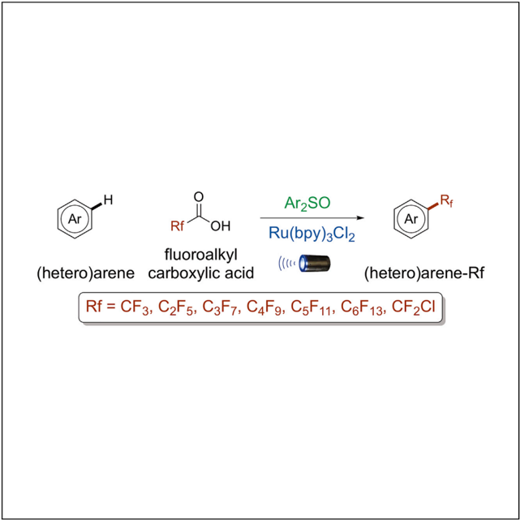
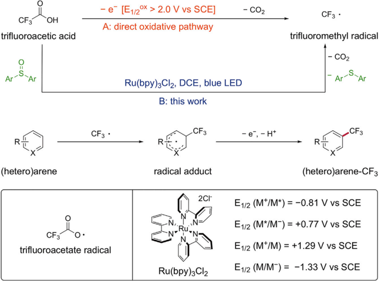
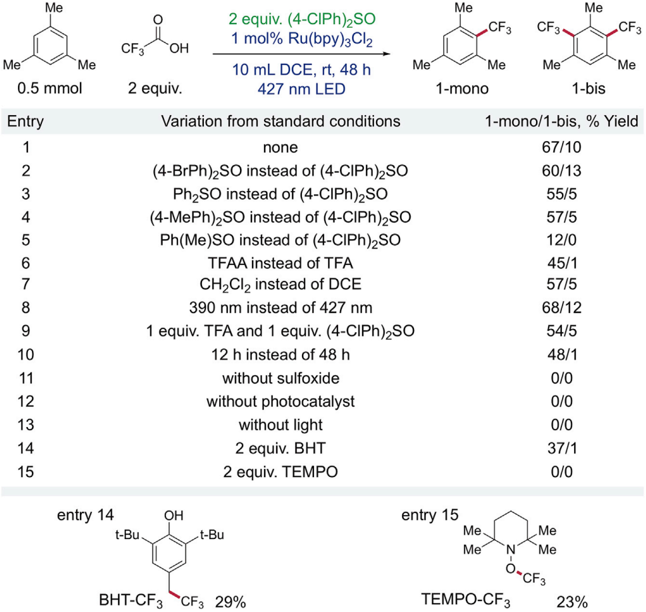
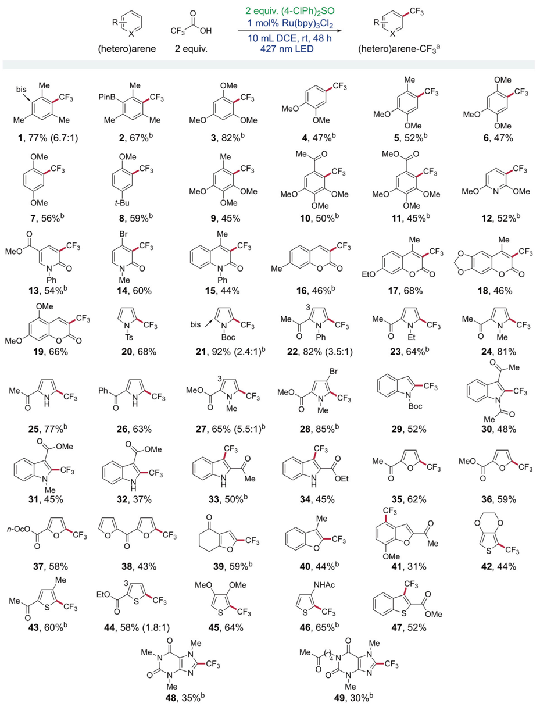
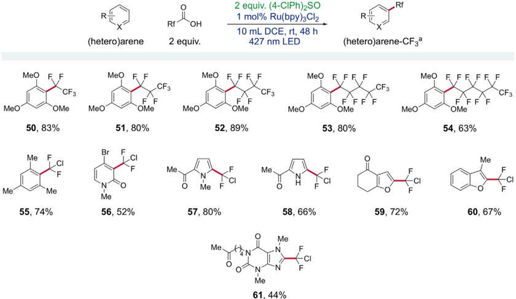

## Report

ArzSO

## Photoredox Catalytic Trifluoromethylation and Perfluoroalkylation of Arenes Using Trifluoroacetic and Related Carboxylic Acids

Trifluoroacetic acid (TFA) is cheap and commercially abundant. Owing to its high oxidation potential, the direct oxidation of TFA to produce the trifluoromethyl radical typically requires harsh conditions. Here, Yin et al. report the use of TFA as a trifluoromethyl radical source via visible light photoredox catalysis.

## Report

## Photoredox Catalytic Trifluoromethylation and Perfluoroalkylation of Arenes Using Trifluoroacetic and Related Carboxylic Acids

Dehang Yin, 1,2 Dengquan Su, 1,2 and Jian Jin 1,3, *

## SUMMARY

Trifluoroacetic acid (TFA) is among the most attractive trifluoromethylation reagents with respect to its low prices, ease of handling, and availability in large quantities. However, because of its exceedingly high oxidation potential, harsh conditions are required for the direct oxidation of TFA to the trifluoroacetate radical, which after prompt CO2 extrusion, affords the desired CF3 radical. Therefore, mild and efficient protocols for the direct conversion of TFA to the CF3 radical are still in high demand. Here, we report a mild and practical method that allows for the direct C-H trifluoromethylation, perfluoroalkylation, and chlorodifluoromethylation of (hetero)arenes using TFA and the related carboxylic acids. A diverse array of arenes and heteroarenes were successfully transformed into valued fluoroalkylated compounds. The combination of photoredox catalysis and a diaryl sulfoxide provides a platform for the facile generation of fluoroalkyl radicals from the corresponding fluoroalkyl carboxylic acids under mild conditions.

## INTRODUCTION

Fluorine serves as the most electronegative element and is consequently endowed with multifaceted behavior in biological systems. In general, fluorinated drugs have better membrane permeability and increased bioavailability compared with their non-fluorinated analogs because of the changes in the physical and chemical properties. 1-4 Despite a long-standing appreciation of the utility of fluorine, the high electronegativity of fluorine renders its installation a challenging task. 5-9 The trifluoromethyl group is one of the privileged moieties in drug discovery in the modern era. Among the top 200 smallmolecule pharmaceuticals by retail sales in 2018, 15 drugs contain at least 1 trifluoromethyl group, mostly (80%) on their aryl or heteroaryl scaffolds. Therefore, simple methodologies for the incorporation of trifluoromethyl and fluoroalkyl groups into arenes and heteroarenes are highly desirable. 10,11 While cross-coupling approaches from aryl halides, 12-21 boronic acids, 22-29 silanes, 30 and aniline derivatives 31-34 have facilitated the CF3 introduction, direct aromatic C-H trifluoromethylation represents a straight manner that does not require pre-functionalization. Recently, transition metal-catalyzed C-H activation has emerged as an effective strategy for the construction of CF3-containing (hetero)arenes. 35-40 Very recently, Ritter and colleagues 41,42 reported a site-selective late-stage trifluoromethylation of arenes via the triaryl sulfonium salt intermediates. Moreover, there is a renaissance in aromatic C-H trifluoromethylation by the CF3 radical addition mechanism. 43 A variety of reagents have been extensively used as CF3 radical precursors, including CF3I, 44-47 CF3Br, 48 CF3SO2Cl, 49,50 (CF3SO2)2O, 51 CF3SO2CH(Me) COPh, 52 Togni reagent, 53,54 Umemoto reagent, 55,56 TMSCF3, 57,58 Langlois reagent NaSO2CF3, 59-64 and Zn(SO2CF3)2. 65,66 Nevertheless, the high cost, environmental

1 CAS Key Laboratory of Synthetic Chemistry of Natural Substances, Center for Excellence in Molecular Synthesis, Shanghai Institute of Organic Chemistry, University of Chinese Academy of Sciences, Chinese Academy of Sciences, 345 Lingling Road, Shanghai 200032, China

2 These authors contributed equally

3 Lead Contact

*Correspondence: jjin@sioc.ac.cn

https://doi.org/10.1016/j.xcrp.2020.100141

CF3

OH

trifluoroacetic acid

- e [E1/2°* &gt; 2.0 V vs SCE]

A: direct oxidative pathway

Ar-S Ar

R

(hetero)arene

CF3

trifluoroacetate radical

OPEN ACCESS

B: this work

Figure 1. Working Hypothesis for the Trifluoromethylation

(A) Direct oxidative pathway: generation of trifluoromethyl radical under harsh conditions.

- (B) This work: generation of trifluoromethyl radical via visible light photoredox catalysis.

impact, and multistep preparation of these reagents hamper their further application on a large scale. In this regard, it is a long-term interest of chemists to develop new trifluoromethylation reactions with inexpensive and easy-to-handle CF3 sources.

Trifluoroacetic acid (TFA) and trifluoroacetic anhydride (TFAA) are among the most attractive trifluoromethylation reagents with respect to their low prices, ease of handling, and availability in large quantities. The major challenge associated with this type of transformation is to produce the trifluoroacetate radical under mild conditions, which after prompt CO2 extrusion affords the desired CF3 radical. Yoshida et al. 67 and subsequently Bra ¨ se and associates 68 disclosed that bis(trifluoroacetyl) peroxide (BTFAP) generated from TFAA and hydrogen peroxide could undergo homolytic cleavage, followed by the release of CO2 to yield the CF3 radical. Remarkably, Stephenson and colleagues 69,70 reported that the adducts of TFAA and pyridine N-oxide derivatives were ready to be reduced via a single-electron transfer pathway to furnish the CF3 radical effectively. Very recently, Qing et al. 71 developed a hypervalent iodine reagent C6F5I(OCOCF3)2 that was easily accessible from C6F5I and TFA by an oxidation procedure, which could also provide the CF3 radical under reductive conditions. TFA and its salts are commercially abundant and low priced. However, because of their exceedingly high oxidation potentials, the direct oxidation of TFA and its salts to the trifluoroacetate radical requires harsh conditions (Figure 1A, direct oxidative pathway)-for instance, strong oxidants, 72 electrolysis with forcing potentials, 73 high temperatures, 74 and ultraviolet irradiation. 75,76 In addition, a large excess of TFA or its salts was usually necessary in these reactions. For all of these reasons, mild and efficient protocols for the direct conversion of TFA to CF3 radical are still in high demand.

As part of our long-term interest in organic radical chemistry, 77-82 here, we present a strategy for the use of TFA and the related carboxylic acids as fluoroalkylation

- CO2

CF3 ·

trifluoromethyl radical

- CO2

-

Ar-S-Ar

Me

Me

2 equiv. (4-CIPh)2SO

CF3

1 mol% Ru(bpy)3Cl2

OH

Me

0.5 mmol

Entry

1

2

3

4

5

6

7

8

10

11

12

13

14

15

10 mL DCE, rt, 48 h

427 nm LED

none

(4-BrPh)2SO instead of (4-CIPh)2SO

Me

CF3

Me

Me

·CF3

Me

1-mono

1-bis

1-mono/1-bis, % Yield

67/10

60/13

|         | 390 nm instead of 427 nm              | 68/12   |
|---------|---------------------------------------|---------|
|         | 1 equiv. TFA and 1 equiv. (4-CIPh)2SO | 54/5    |
|         | 12 h instead of 48 h                  | 48/1    |
|         | without sulfoxide                     | 0/0     |
|         | without photocatalyst                 | 0/0     |
|         | without light                         | 0/0     |
|         | 2 equiv. BHT                          | 37/1    |
|         | 2 equiv. TEMPO                        | 0/0     |
| OH      | entry 15 Me.                          |         |
| t-Bu.   | t-Bu Me N                             | Me Me   |
| BHT-CF3 | CF3 29% TEMPO-CF3                     |         |
|         |                                       | 23%     |

entry 14

Figure 2. Optimization for the Trifluoromethylation

Yields determined by 19 F NMR spectroscopy using trifluoromethylbenzene as an internal standard. BHT, 3,5-ditert -butyl-4-hydroxytoluene. TEMPO, 2,2,6,6-tetramethylpiperidine-1-oxyl.

reagents under mild conditions. A diverse array of arenes and heteroarenes were successfully transformed into valued fluoroalkylated compounds. The working hypothesis is outlined in Figure 1B. We envision that the trifluoroacetate radical could be produced via visible light photoredox catalysis 83 with the assistance of a sulfoxide and should rapidly collapse to generate the CF3 radical. The resultant CF3 radical would then add to the (hetero)arene substrate, followed by an oxidative re-aromatization process to afford the trifluoromethylated (hetero)arene product. Although the detailed mechanism is not clear at this stage, identification of the CF3 radical and thioether ( vide infra ) serves to support the above speculation.

## RESULTS AND DISCUSSION

## Optimization

To explore the proposed aromatic C-H trifluoromethylation with TFA, mesitylene was chosen as the model substrate and a Kessil 40 W 427 nm light-emitting diode (LED) was used as the light source (Figure 2). Our initial experimental results showed that DMSOwasnot a capable activator as compared to diaryl sulfoxides. After careful investigation of various reaction parameters, the trifluoromethylation products 1-mono and 1bis were obtained in a total yield of 77% (mono:bis = 6.7:1), with bis(4-chlorophenyl) sulfoxide as the activator (entry 1). This sulfoxide is commercially available and inexpensive, and could be recycled quantitatively in the forms of sulfoxide and thioether (see Figures S1-S6). While bis(4-bromophenyl) sulfoxide exhibited a comparable efficiency, the electron-richer bisphenyl sulfoxides were less reactive and methyl phenyl sulfoxide had even poorer ability (entries 2-5). TFAA, normally more reactive toward sulfoxide 41,42 provided

Me

Me

bis

R

Me

CF3

Me

Me

1, 77% (6.7:1)

OMe

CF3

OMe

7, 56%'

=C

·CF3

Ph

13, 54%°

OMe

19, 66%

CF3

25, 77%b

-OMe

- CF3

Me

31, 45%

n-Oco

37, 58%

Me

S

Me.

CF3

43, 60%b

PinB.

.CF3

2 equiv. (4-CIPh)2SO

1 mo1% Ru(bpy)3Cl2

10 mL DCE, rt, 48 h

427 nm LED

OMe

.CF3

CF3

R

(hetero)arene-CF3a

Me

CF3

CF3

4

CF3

MeO

MeO

Me

CF3

2 equiv.

MeO

OMe

Report

## Report

the trifluoromethylated products in lower yields (entry 6). Moreover, replacement of the solvent with CH2Cl2 resulted in a decreased total yield (62%, entry 7). The switch of irradiation wavelength from 427 nm to 390 nm resulted in an improved outcome (80%, entry 8). When both TFA and sulfoxide were reduced to 1 equiv each, it still afforded the products a 59% combined yield (entry 9). Shortening the reaction time could reduce the amount of bis-product, making the purification easier (entry 10). Control experiments indicated that the sulfoxide, photocatalyst, and light were essential to this transformation (entries 11-13). By the addition of free radical scavengers, the aromatic C-H trifluoromethylation was severely inhibited with BHT (entry 14) and even shut down in the presence of 2,2,6,6-tetramethylpiperidine-1-oxyl (TEMPO) (entry 15) along with the formation of BHT-CF3 and TEMPO-CF3 adducts, respectively, supporting a radical mechanism in these transformations. Finally, &lt;5% of the corresponding (difluoro)methylated products were observed when using (difluoro)acetic acids.

## Substrate Scope

With the established optimal conditions, we began to examine the substrate scope of the decarboxylative trifluoromethylation protocol by using structurally diverse arenes and heteroarenes (see Supplemental Experimental Procedures and Figures S7-S71). As shown in Figure 3, a variety of aromatic compounds could be transformed into the valuable trifluoromethylated products in moderate to excellent isolated yields. Electron-enrichment favors the electrophilic trifluoromethylation. Therefore, benzene derivatives bearing electron-donating alkyl or alkoxy substituents were amenable to the protocol (1-11). It is of note that the liable boronate group was tolerated under the reaction conditions and could be used for further transformations (2). The introduction of methoxy groups also made pyridine become a good substrate for the protocol (12). A series of pyridinones and coumarins reacted selectively at the a positions (1319). Moreover, 5-membered heteroarenes proved to be suitable substrates for the radical trifluoromethylation, including pyrroles, indoles, furans, benzofurans, thiophenes, and benzothiophenes (20-47). For these types of heteroarenes, the 2-positions, if available, were preferentially trifluoromethylated. The acid-sensitive Boc protecting group could survive from the reaction conditions (21 and 29). It is worth mentioning that the compatibility with boronate and bromide groups illustrated an orthogonal reactivity to the transition metal-catalyzed C-X trifluoromethylation (2, 14 and 28). More complex, biologically active heteroarenes such as caffeine and pentoxifylline could also be functionalized by the trifluoromethylation protocol (48 and 49). Finally, the scalability of the present reaction was demonstrated on a 2.5-mmol scale that afforded the trifluoromethylated product 28 in a 77% yield. For some cases, better yields could be obtained with 390 nm LEDs. At this stage, we are not sure about the exact reason, and speculated that the higher energy of light may be helpful for certain steps in the catalytic cycle. Unfortunately, the electron-deficient (hetero)arenes proved to be poor substrates for this protocol.

While a great deal of effort has been devoted to the CF3 introduction, synthetic procedures for incorporating other fluoroalkyl (Rf) groups are relatively limited. To this end, we decided to investigate the scope of fluoroalkyl carboxylic acids, which resulted in the extension of the current protocol to efficient C-H perfluoroalkylation and chlorodifluoromethylation 84 (Figure 4). We were pleased to find with the corresponding perfluoroalkyl carboxylic acids that the C2F5, C3F7, C4F9 and C5H11 groups were successfully installed onto the arene ring without loss of reactivity as the chain

Standard conditions: (hetero)arene (0.5 mmol), TFA (1.0 mmol), sulfoxide (1.0 mmol), Ru(bpy)3Cl2 (0.005 mmol), 1,2-dichloroethane (DCE) (10 mL), 427 nm blue LED, and room temperature, 48 h. a, Isolated yields; b, 390 nm LED used.

MeO

Me

OMe

50, 83%

F

Me ka

Me

55, 74%

R

(hetero)arene

F F

OPEN ACCESS

CF3

MeO

F F

OMe

Rf

OH

2 equiv.

MeO

MeO

2 equiv. (4-CIPh)2SO

1 mol% Ru(bpy)3Cl2

10 mL DCE, rt, 48 h

427 nm LED

F

EFF

CF3

F

OMer

MeO

Rf

R-

(hetero)arene-CFзa

MBO FEX

MeO

X

OMe

F F F F

MeO

FF

F F

F F

OMe

Figure 4. Scope of Fluoroalkyl Carboxylic Acids for the Fluoroalkylation

Standard conditions: (hetero)arene (0.5 mmol), fluoroalkyl carboxylic acid (1.0 mmol), sulfoxide (1.0 mmol), Ru(bpy)3Cl2 (0.005 mmol), DCE (10 mL), 427 nm blue LED, and room temperature, 48 h. a, Isolated yields.

goes longer (50-53). Until the case of C6F13, a diminished yield was observed perhaps because of the poor solubility of C6F13CO2H (54). Furthermore, the chlorodifluoromethylation proceeded smoothly with a broad range of arenes and heteroarenes (55-61). The chlorodifluoromethyl group can further be converted to other functionalities, for example, the difluoromethyl group, which may act as a competent bioisostere of hydroxyl, thiol, or amine groups in medicinal chemistry.

In summary, we have developed a mild and practical method that allows for the decarboxylative radical trifluoromethylation, perfluoroalkylation, and chlorodifluoromethylation of (hetero)arenes using inexpensive, abundant trifluoracetic acid and the related carboxylic acids. A diverse array of arenes and heteroarenes was successfully transformed into valued fluoroalkylated compounds. The combination of photoredox catalysis and a diaryl sulfoxide provides a platform for the facile generation of fluoroalkyl radicals from the corresponding fluoroalkyl carboxylic acids under mild conditions. Further development of our described protocol in terms of easy removal of the sulfide by-product as well as the possible use of the sulfoxide activator in a catalytic amount is under active investigation in our lab.

## EXPERIMENTAL PROCEDURES

## Resource Availability

## Lead Contact

Further information and request for resources and reagents should be directed to and will be fulfilled by the Lead Contact, Jian Jin (jjin@sioc.ac.cn)

## Materials Availability

Commercially available reagents were used without further purification.

F

x CF3

Meo

F

CF3

## Data and Software Availability

The authors declare that data supporting the findings of this study are available within the article and the Supplemental Information. All other data are available from the Lead Contact upon reasonable request.

## Materials and Characterization

Solvents were treated before use according to the standard methods. All of the reactions were monitored by thin-layer chromatography (TLC) or nuclear magnetic resonance (NMR) analysis. Flash column chromatography was performed on silica gel (230-400 mesh). 1 H NMR, 13 C NMR, and 19 F NMR spectra were recorded at room temperature in CDCl3 on a 400-MHz instrument. High-resolution mass spectrometry (HRMS) data were obtained on a LTQ FTICR mass spectrometer with the electron ionization method. Infrared (IR) spectra were recorded on a Fourier transform infrared (FTIR) spectrometer. For full details of the synthesis and characterization of compounds 1-61, see the Supplemental Experimental Procedures and Figures S7-S71.

## SUPPLEMENTAL INFORMATION

Supplemental Information can be found online at https://doi.org/10.1016/j.xcrp. 2020.100141.

## ACKNOWLEDGMENTS

The authors are grateful for the financial support from the Natural Science Foundation of Shanghai (19ZR1468700), the Shanghai Institute of Organic Chemistry, and the Chinese Academy of Sciences.

## AUTHOR CONTRIBUTIONS

D.Y. and D.S. performed and analyzed the experiments. D.Y. and J.J. designed the experiments to develop the reaction and probe its utility. J.J. prepared the paper.

## DECLARATION OF INTERESTS

The authors declare no competing interests.

Received: May 15, 2020

Revised: June 22, 2020

Accepted: June 29, 2020

Published: August 5, 2020

## REFERENCES

1. [Mu ¨ ller, K., Faeh, C., and Diederich, F. (2007). Fluorine in pharmaceuticals: looking beyond intuition. Science 317 , 1881-1886.](http://refhub.elsevier.com/S2666-3864(20)30145-4/sref1)
2. [Purser, S., Moore, P.R., Swallow, S., and Gouverneur, V. (2008). Fluorine in medicinal chemistry. Chem. Soc. Rev. 37 , 320-330.](http://refhub.elsevier.com/S2666-3864(20)30145-4/sref2)
3. [Wang, J., Sa ´ nchez-Rosello ´ , M., Acen ˜ a, J.L., del Pozo, C., Sorochinsky, A.E., Fustero, S., Soloshonok, V.A., and Liu, H. (2014). Fluorine in pharmaceutical industry: fluorine-containing drugs introduced to the market in the last decade (2001-2011). Chem. Rev. 114 , 24322506.](http://refhub.elsevier.com/S2666-3864(20)30145-4/sref3)
4. [Zhou, Y., Wang, J., Gu, Z., Wang, S., Zhu, W., Acen ˜ a, J.L., Soloshonok, V.A., Izawa, K., and Liu, H. (2016). Next Generation of Fluorine-](http://refhub.elsevier.com/S2666-3864(20)30145-4/sref4)

[Containing Pharmaceuticals, Compounds Currently in Phase II-III Clinical Trials of Major Pharmaceutical Companies: New Structural Trends and Therapeutic Areas. Chem. Rev. 116 , 422-518.](http://refhub.elsevier.com/S2666-3864(20)30145-4/sref4)

5. [Furuya, T., Kamlet, A.S., and Ritter, T. (2011). Catalysis for fluorination and trifluoromethylation. Nature 473 , 470-477.](http://refhub.elsevier.com/S2666-3864(20)30145-4/sref5)
6. [Liang, T., Neumann, C.N., and Ritter, T. (2013). Introduction of fluorine and fluorine-containing functional groups. Angew. Chem. Int. Ed. Engl. 52 , 8214-8264.](http://refhub.elsevier.com/S2666-3864(20)30145-4/sref6)
7. [Campbell, M.G., and Ritter, T. (2014). LateStage Fluorination: From Fundamentals to Application. Org. Process Res. Dev. 18 , 474-480.](http://refhub.elsevier.com/S2666-3864(20)30145-4/sref7)
8. [Campbell, M.G., and Ritter, T. (2015). Modern carbon-fluorine bond forming reactions for aryl fluoride Modern carbon-fluorine bond forming reactions for aryl fluoride synthesis. Chem. Rev. 115 , 612-633.](http://refhub.elsevier.com/S2666-3864(20)30145-4/sref8)
9. [Neumann, C.N., and Ritter, T. (2017). Facile C-F Bond Formation through a Concerted Nucleophilic Aromatic Substitution Mediated by the PhenoFluor Reagent. Acc. Chem. Res. 50 , 2822-2833.](http://refhub.elsevier.com/S2666-3864(20)30145-4/sref9)
10. [Tomashenko, O.A., and Grushin, V.V. (2011). Aromatic trifluoromethylation with metal complexes. Chem. Rev. 111 , 4475-4521.](http://refhub.elsevier.com/S2666-3864(20)30145-4/sref10)
11. [Alonso, C., Martı ´nez de Marigorta, E., Rubiales, G., and Palacios, F. (2015). Carbon trifluoromethylation reactions of hydrocarbon](http://refhub.elsevier.com/S2666-3864(20)30145-4/sref11)

53. [Mejı ´a, E., and Togni, A. (2012). RheniumCatalyzed Trifluoromethylation of Arenes and Heteroarenes by Hypervalent Iodine Reagents. ACS Catal. 2 , 521-527.](http://refhub.elsevier.com/S2666-3864(20)30145-4/sref53)
54. [Charpentier, J., Fru ¨ h, N., and Togni, A. (2015). Electrophilic trifluoromethylation by use of hypervalent iodine reagents. Chem. Rev. 115 , 650-682.](http://refhub.elsevier.com/S2666-3864(20)30145-4/sref54)
55. [Cheng, Y., Yuan, X., Ma, J., and Yu, S. (2015). Direct Aromatic C-H Trifluoromethylation via an Electron-Donor-Acceptor Complex. Chemistry 21 , 8355-8359.](http://refhub.elsevier.com/S2666-3864(20)30145-4/sref55)
56. [Meucci, E.A., Nguyen, S.N., Camasso, N.M., Chong, E., Ariafard, A., Canty, A.J., and Sanford, M.S. (2019). Nickel(IV)-Catalyzed C-H Trifluoromethylation of (Hetero)arenes. J. Am. Chem. Soc. 141 , 12872-12879.](http://refhub.elsevier.com/S2666-3864(20)30145-4/sref56)
57. [Ye, Y., Lee, S.H., and Sanford, M.S. (2011). Silver-mediated trifluoromethylation of arenes using TMSCF3. Org. Lett. 13 , 5464-5467.](http://refhub.elsevier.com/S2666-3864(20)30145-4/sref57)
58. [Seo, S., Taylor, J.B., and Greaney, M.F. (2013). Silver-catalysed trifluoromethylation of arenes at room temperature. Chem. Commun. (Camb.) 49 , 6385-6387.](http://refhub.elsevier.com/S2666-3864(20)30145-4/sref58)
59. [Ji, Y., Brueckl, T., Baxter, R.D., Fujiwara, Y., Seiple, I.B., Su, S., Blackmond, D.G., and Baran, P.S. (2011). Innate C-H trifluoromethylation of heterocycles. Proc. Natl. Acad. Sci. USA 108 , 14411-14415.](http://refhub.elsevier.com/S2666-3864(20)30145-4/sref59)
60. [Li, L., Mu, X., Liu, W., Wang, Y., Mi, Z., and Li, C.-J. (2016). Simple and Clean Photoinduced Aromatic Trifluoromethylation Reaction. J. Am. Chem. Soc. 138 , 5809-5812.](http://refhub.elsevier.com/S2666-3864(20)30145-4/sref60)
61. [Corsico, S., Fagnoni, M., and Ravelli, D. (2017). Sunlight decatungstate photoinduced trifluoromethylations of (hetero)aromatics and electron-poor olefins. Photochem. Photobiol. Sci. 16 , 1375-1380.](http://refhub.elsevier.com/S2666-3864(20)30145-4/sref61)
62. [Abdiaj, I., Bottecchia, C., Alcazar, J., and Noe ¨ l, T. (2017). Visible-Light-Induced Trifluoromethylation of Highly Functionalized Arenes and Heteroarenes in Continuous Flow. Synthesis 49 , 4978-4985.](http://refhub.elsevier.com/S2666-3864(20)30145-4/sref62)
63. [Ghosh, I., Khamrai, J., Savateev, A., Shlapakov, N., Antonietti, M., and Ko ¨ nig, B. (2019). Organic semiconductor photocatalyst can bifunctionalize arenes and heteroarenes. Science 365 , 360-366.](http://refhub.elsevier.com/S2666-3864(20)30145-4/sref63)
64. [Qiu, Y., Scheremetjew, A., Finger, L.H., and Ackermann, L. (2020). Electrophotocatalytic Undirected C-H Trifluoromethylations of (Het) Arenes. Chemistry 26 , 3241-3246.](http://refhub.elsevier.com/S2666-3864(20)30145-4/sref64)
65. [Fujiwara, Y., Dixon, J.A., O'Hara, F., Funder, E.D., Dixon, D.D., Rodriguez, R.A., Baxter, R.D., Herle ´ , B., Sach, N., Collins, M.R., et al. (2012). Practical and innate carbon-hydrogen functionalization of heterocycles. Nature 492 , 95-99.](http://refhub.elsevier.com/S2666-3864(20)30145-4/sref65)
66. [O'Brien, A.G., Maruyama, A., Inokuma, Y., Fujita, M., Baran, P.S., and Blackmond, D.G. (2014). Radical C-H functionalization of heteroarenes under electrochemical control. Angew. Chem. Int. Ed. Engl. 53 , 11868-11871.](http://refhub.elsevier.com/S2666-3864(20)30145-4/sref66)
67. [Sawada, H., Nakayama, M., Yoshida, M., Yoshida, T., and Kamigata, N. (1990). Trifluoromethylation of Aromatic Compounds with Bis(trifluoroacetyl). Peroxide J. Fluorine Chem. 46 , 423-431.](http://refhub.elsevier.com/S2666-3864(20)30145-4/sref67)
68. [Zhong, S., Hafner, A., Hussal, C., Nieger, M., and Bra ¨ se, S. (2015). Metal-free Radical Perfluoroalkylation of (Hetero)arenes. RSC Advances 5 , 6255-6258.](http://refhub.elsevier.com/S2666-3864(20)30145-4/sref68)
69. [Beatty, J.W., Douglas, J.J., Cole, K.P., and Stephenson, C.R.J. (2015). A scalable and operationally simple radical trifluoromethylation. Nat. Commun. 6 , 7919.](http://refhub.elsevier.com/S2666-3864(20)30145-4/sref69)
70. [Beatty, J.W., Douglas, J.J., Miller, R., McAtee, R.C., Cole, K.P., and Stephenson, C.R.J. (2016). Photochemical Perfluoroalkylation with Pyridine N -Oxides: Mechanistic Insights and Performance on a Kilogram Scale. Chem 1 , 456-472.](http://refhub.elsevier.com/S2666-3864(20)30145-4/sref70)
71. [Yang, B., Yu, D., Xu, X.-H., and Qing, F.-L. (2018). Visible-Light Photoredox Decarboxylation of Perfluoroarene Iodine(III) Trifluoroacetates for C-H Trifluoromethylation of (Hetero)arenes. ACS Catal. 8 , 2839-2843.](http://refhub.elsevier.com/S2666-3864(20)30145-4/sref71)
72. [Tanabe, Y., Matsuo, N., and Ohno, N. (1988). Direct Perfluoalkylation Including Trifluoromethylation of Aromatics with Perfluoro Carboxylic Acids Mediated by Xenon Difluoride. J. Org. Chem. 53 , 4582-4585.](http://refhub.elsevier.com/S2666-3864(20)30145-4/sref72)
73. [Depecker, C., Marzouk, H., Trevin, S., and Devynck, J. (1999). Trifluoromethylation of Aromatic Compounds via Kolbe Electrolysis in Pure Organic Solvent. Study on Laboratory and Pilot Scale. New J. Chem. 23 , 739-742.](http://refhub.elsevier.com/S2666-3864(20)30145-4/sref73)
74. [Shi, G., Shao, C., Pan, S., Yu, J., and Zhang, Y. (2015). Silver-catalyzed C-H trifluoromethylation of arenes using trifluoroacetic acid as the trifluoromethylating reagent. Org. Lett. 17 , 38-41.](http://refhub.elsevier.com/S2666-3864(20)30145-4/sref74)
75. [Lai, C., and Mallouk, T.E. (1993). A New Approach to the Photochemical Trifluoromethylation of Aromatic Compounds. J. Chem. Soc. Chem. Commun. 1359-1361.](http://refhub.elsevier.com/S2666-3864(20)30145-4/sref75)
76. [Lin, J., Li, Z., Kan, J., Huang, S., Su, W., and Li, Y. (2017). Photo-driven redox-neutral decarboxylative carbon-hydrogen trifluoromethylation of (hetero)arenes with trifluoroacetic acid. Nat. Commun. 8 , 14353.](http://refhub.elsevier.com/S2666-3864(20)30145-4/sref76)
77. [Li, Z., Wang, X., Xia, S., and Jin, J. (2019). Ligand-Accelerated Iron Photocatalysis Enabling Decarboxylative Alkylation of Heteroarenes. Org. Lett. 21 , 4259-4265.](http://refhub.elsevier.com/S2666-3864(20)30145-4/sref77)
78. [Zhao, H., and Jin, J. (2019). Visible LightPromoted Aliphatic C-H Arylation Using Selectfluor as a Hydrogen Atom Transfer Reagent. Org. Lett. 21 , 6179-6184.](http://refhub.elsevier.com/S2666-3864(20)30145-4/sref78)
79. [Zhao, H., Li, Z., and Jin, J. (2019). Green Oxidant H2O2 as a Hydrogen Atom Transfer Reagent for Visible Light-Mediated Minisci Reaction. New J. Chem. 43 , 12533-12537.](http://refhub.elsevier.com/S2666-3864(20)30145-4/sref79)
80. [Yin, D., and Jin, J. (2019). Transition-Metal-Free Dehydrogenative N-N Coupling of Secondary Amines with KI/KIO4. Eur. J. Org. Chem. 56465649.](http://refhub.elsevier.com/S2666-3864(20)30145-4/sref80)
81. [Feng, G., Wang, X., and Jin, J. (2019). Decarboxylative C-C and C-N Bond Formation by Ligand-Accelerated Iron Photocatalysis. Eur. J. Org. Chem. 6728-6732.](http://refhub.elsevier.com/S2666-3864(20)30145-4/sref81)
82. [Xia, S., Hu, K., Lei, C., and Jin, J. (2020). Intramolecular Aromatic C-H Acyloxylation Enabled by Iron Photocatalysis. Org. Lett. 22 , 1385-1389.](http://refhub.elsevier.com/S2666-3864(20)30145-4/sref82)
83. [Prier, C.K., Rankic, D.A., and MacMillan, D.W.C. (2013). Visible light photoredox catalysis with transition metal complexes: applications in organic synthesis. Chem. Rev. 113 , 5322-5363.](http://refhub.elsevier.com/S2666-3864(20)30145-4/sref83)
84. [McAtee, R.C., Beatty, J.W., McAtee, C.C., and Stephenson, C.R.J. (2018). Radical Chlorodifluoromethylation: Providing a Motif for (Hetero)arene Diversification. Org. Lett. 20 , 3491-3495.](http://refhub.elsevier.com/S2666-3864(20)30145-4/sref84)

