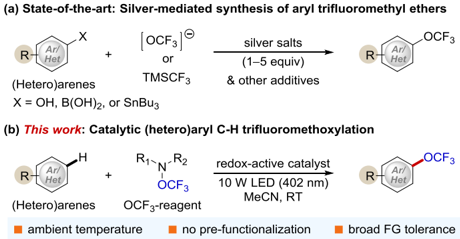
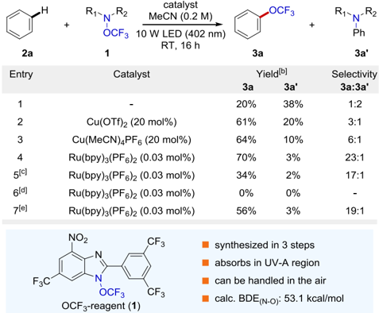
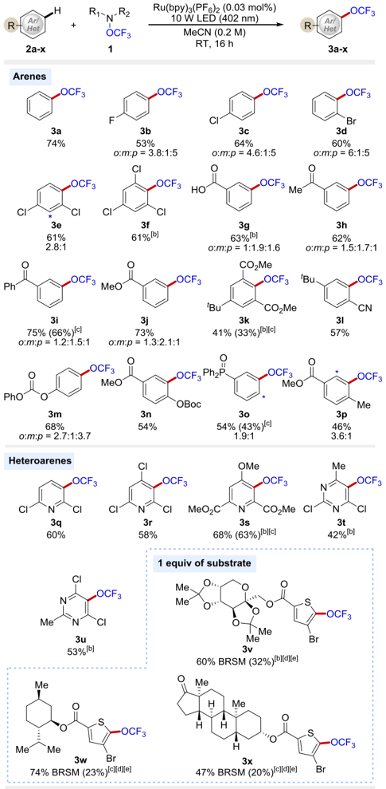
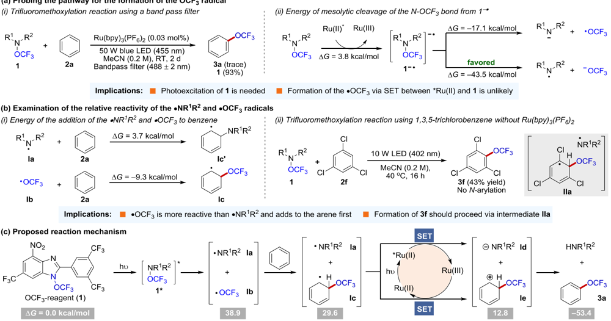
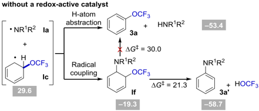
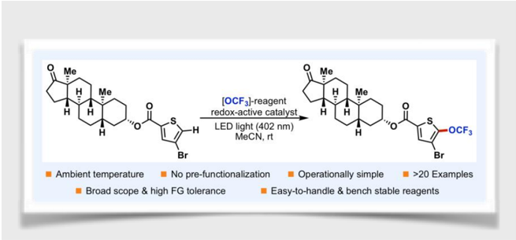

## Author Manuscript

Title:

Catalytic C-H Trifluoromethoxylation of Arenes and Heteroarenes

Authors: Weijia Zheng; Cristian Morales-Rivera; Johnny W. Lee; Peng Liu; Ming-Yu Ngai, Ph.D.

This is the author manuscript accepted for publication and has undergone full peer review but has not been through the copyediting, typesetting, pagination and proofreading process, which may lead to differences between this version and the Version of Record.

To be cited as:

10.1002/ange.201800598

Link to VoR:

https://doi.org/10.1002/ange.201800598

group ne of

WILEY-VCH

W. Zheng, J. W. Lee, Prof.. M.-Y. Ngai stage

Department of Chemistry and Institute of Chemical Biology and

Drug Discovery, State University of New York, Stony Brook, New

York 11794, United States

Department of Chemistry, University of Pittsburgh, Pittsburgh,

## Catalytic C-H Trifluoromethoxylation of Arenes and Heteroarenes

Weijia Zheng, † Cristian A. Morales-Rivera, ‡ Johnny W. Lee, † Peng Liu,* ‡ and Ming-Yu Ngai* †

Dedication ((optional))

Abstract: The  intermolecular  C -H  trifluoromethoxylation  of  arenes remains a long-standing and unsolved problem in organic synthesis. Herein,  we  report  the first catalytic  protocol  employing  a  novel trifluoromethoxylating  reagent  and  redox-active  catalysts  for  the direct (hetero)aryl  C -H  trifluoromethoxylation. Our approach is operationally  simple,  proceeds  at  room  temperature,  uses  easy-tohandle reagents, requires only 0.03 mol% of redox-active catalysts, does not need specialized reaction apparatus, and tolerates a wide variety  of  functional  groups  and  complex  structures  such  as  sugar and natural product derivatives. Importantly, both ground state and photoexcited redox-active catalysts are effective. Detailed computational  and  experimental  studies  suggest  a  unique  reaction pathway where photoexcitation of the trifluoromethoxylating reagent releases  the  OCF3  radical  that  is  trapped  by  (hetero)arenes.  The resulting cyclohexadienyl radicals are oxidized by redox-active catalysts and deprotonated to form the desired products of trifluoromethoxylation.

The trifluoromethoxy (OCF3) group, which is found in more than 350,000 biologically active compounds according to PubChem database as of October 2017, has a broad spectrum of  applications  in  pharmaceuticals. [1] The  prevalence  of  the OCF3 group in drugs can be attributed to its favorable physicochemical properties such as outstanding electronegativity  (χ  =  3.7) [2] that  improves  molecular  metabolic stability,  and  excellent  lipophilicity  (Hansch  parameter:  Πx  = 1.04) [3] that  enhances  membrane permeability. Notably, arenes bearing the  OCF3  group  have  a  distinct  three-dimensional scaffold  where  the  plane  containing  the  C-OCF3  group  is orthogonal to the plane of the aromatic ring. [4] Compounds with such  a  structural  architecture  have  been  shown  to  provide additional binding affinity to biological targets. [5]

Despite these attractive characteristics and the presence of the  OCF3  group  in  marketed  drugs  and  agrochemicals,  only  a handful of approaches have been reported for the synthesis of trifluoromethoxylated  arenes  over  the  last  60  years. [6] Although recent  reports  of  several  powerful  strategies  such  as  silvermediated synthesis of trifluoromethoxylated (hetero)arenes have advanced  the  state-of-the-art  (Scheme  1a), [6b, 7] a catalytic intermolecular C-H trifluoromethoxylation of (hetero)arenes remains  elusive. [8] Such  an  approach  is  appealing  because  it

[ † ] W. Zheng, J. W. Lee, Prof.. M.-Y. Ngai Department of Chemistry and Institute of Chemical Biology and Drug Discovery, State University of New York, Stony Brook, New York 11794, United States E-mail: ming-yu.ngai@stonybrook.edu

‡

[

]

C. A. Morales-Rivera, P. Liu

Department of Chemistry, University of Pittsburgh, Pittsburgh,

Pennsylvania 15260, United States

E-mail: pengliu@pitt.edu

Supporting information for this article is given via a link at the end of the document.

:F3

ice the

S

gents tions.

OCF3

precludes  the  need  for  the  pre-functionalization  of  aromatic compounds. In addition, direct disconnection of the OCF3 group could be envisioned anywhere onto the target and at any time of the synthesis, which would allow the late-stage trifluoromethoxylation of complex molecules.

Seeking  to  establish  C-H  trifluoromethoxylation  reactions, we recently  described  an  easy  and  robust  synthesis  of  a  wide range of (hetero)aromatic hydroxylamides bearing the N -OCF3 moiety, which undergo thermally induced heterolytic cleavage of the N -OCF3  bond  to  form  a  nitrenium-trifluoromethoxide  ion pair. [9] Fast recombination of such an ion pair afford the products of  intramolecular  (hetero)aryl  C-H  trifluoromethoxylation.  We questioned  whether  the  photoexcitation  of  an  appropriate N -OCF3 compound could result in a homolytic cleavage of the N -OCF3 bond (~50 kcal/mol) and the release of the OCF3 radical, which might be trapped intermolecularly by arenes to afford the products of trifluoromethoxylation. [6k] Herein, we  report the successful  development  of  a  catalytic  protocol  utilizing  redoxactive  catalysts  and  an  unprecedented  trifluoromethoxylating reagent for the direct intermolecular  C-H trifluoromethoxylation of various (hetero)arenes at room temperature (Scheme 1b).

Scheme 1. Synthesis of trifluoromethoxylated (hetero)arenes

A key to the success of the proposed transformation is the development  of  easy-to-handle  trifluoromethoxylating  reagents that  release  the  OCF3  radical  under  mild  reaction  conditions. After exploration of a wide array of reagents bearing the N -OCF3 moiety, we were pleased to identify OCF3-reagent 1 capable of direct  trifluoromethoxylation  of  arenes. [10] Upon  exposing 1 (1 equiv) and benzene (10 equiv) in acetonitrile (MeCN) to a 10 W light-emitting  diode  (LED,  λem  =  402  nm,  Figure  S5)  at  room temperature for 16 hours, we observed 20% yield of the desired trifluoromethoxybenzene ( 3a )  and 38% yield of N -arylation side product ( 3a' )  (Table  1,  entry  1). [11] Interestingly,  the  addition  of 20 mol% of Cu(II) or Cu(I) salts shifted the product distributions and increased the yield of 3a (entries 2-3), which indicated that both Cu(II) and Cu(I) could alter the reaction pathway. Notably, the  replacement  of the Cu  salts with  only  0.03  mol%  of Ru(bpy)3(PF6)2 afforded 3a in 70% yield (entry 4). The

15213757, 2018, 31, Downloaded from https://onlinelibrary.wiley.com/doi/10.1002/ange.201800598, Wiley Online Library on [04/05/2026]. See the Terms and Conditions (https://onlinelibrary.wiley.com/terms-and-conditions) on Wiley Online Library for rules of use; OA articles are governed by the applicable Creative Commons License

CF3

WILEY-VCH

transformation  also  worked  with  one  equivalent  of  benzene, albeit  it  gave  the  product  with  a  lower  yield  (entry  5).  Control experiments showed that light and oxygen-free environment are critical for the reaction to proceed with high efficiency (entries 67).

Table 1. Selected Optimization Experiments {a]

[a] Reactions  were  performed  using  1  equivalent  of 1 and  10  equivalents  of benzene. [b] Yields and selectivity were determined by 19 F-NMR using trifluorotoluene  as  an  internal  standard. [c] One  equivalent  of  benzene  was used. [d] Without light. [e] Air atmosphere. BDE = bond dissociation energy.

With  the  optimized  conditions  in  hand,  we  next  sought  to examine  the  substrate  scope.  Gratifyingly,  a  wide  range  of different functional groups was tolerated under the  C -H trifluoromethoxylation conditions (Table 2). [12] Halide substituents ( 3b-3f , 3q-3r , 3t-3x ) remained intact after the reaction, providing an easy handle for further synthetic elaborations. In addition, the mild reaction conditions were compatible with protic functionality such  as  carboxylic  acid  ( 3g )  and  enolizable  ketones  ( 3h , 3x ). Other functional groups such as an ester ( 3j-3k , 3n , 3p , 3s , 3v3x ),  nitrile  ( 3l ),  carbonate  ( 3m-3n ),  ether  ( 3s ),  and  phosphine oxide ( 3o ) were also viable and afforded the desired products in moderate  to  good  yields.  Moreover,  substrates  with  benzylic hydrogens, which are often prone to the hydrogen atom abstraction  in  the  presence  of  radical  species,  were  tolerated ( 3p , 3t-3u ).  Heteroarenes  ( 3q-3x ),  which  are  ubiquitous in biologically  active  molecules,  are  readily  participated  in  the coupling reaction as well. More importantly, compounds with a more elaborated molecular architecture such as fructose ( 3v ), (-)-menthol  ( 3w ),  and  trans-androsterone  ( 3x )  derivatives  were successfully trifluoromethoxylated using 1 equivalent of substrates.

The regioselectivity of the reaction is guided by the electronics  of  the  substituent  except  in  the  case  of  the  bulky substituent. For example, substrates 3k and 3l ,  where the tertbutyl group blocks the ortho -position, afforded only one regioisomer.  Like  other  radical-mediated  aromatic  substitution processes, the OCF3 radical adds to multiple sites of arenes to form  various  regioisomers.  This  is  beneficial  in  the  context  of

Me

OCF3

drug discovery as the isolation of the regioisomers allows rapid biological-activity assays of trifluoromethoxylated analogs. [13] Thus,  this  synthetic  method  is  complementary  to  the  existing site-selective strategies for the synthesis of trifluoromethoxylated (hetero)arenes. [6b, 7]

Table 2. Selected Examples of Trifluoromethoxylation of (Hetero)arenes [a]

[a] Reactions  were  performed  using  1  equivalent  of 1 and  10  equivalents  of (hetero)arenes. Yields and regioselectivity were determined by 19 F-NMR using trifluorotoluene  as  an  internal  standard. [b] Reaction  was performed at 40 °C. [c] Yield in parenthesis is of isolated yield. [d] 1 equivalent of the substrate was used. [e] Isolated  yield  based  on  the  recovered  starting  material  (BRSM).

WILEY-VCH

OCF3

За

1 and used

thi

Scheme 2. Mechanistic studies and proposed reaction mechanism. All energies are Gibbs free energies (kcal/mol) with respect to the ground state reagent 1 and benzene calculated at the M06-2X/6-311++G(d,p)/SMD(MeCN)//M06-2X/6-31+G(d,p) level of theory. All the mechanistic study experiments described in a-b used one equivalent of reagent 1 and ten equivalents of arenes.

A  series  of  experimental  and  computational  studies  were conducted  to  shed  light  on  the  reaction  mechanism  (Scheme 2). [14] We  envisioned  that  the  ·OCF3  could  be  formed  by  the homolytic cleavage of the N -O bond through either photoexcited 1 or the anion radical of 1 ( 1 -· ) generated from SET between 1 and  photoredox-catalysts. [15] To  distinguish  these  two  possible reaction pathways, we  performed the trifluoromethoxylation reaction  using  a  bandpass  filter  (488  ±  2  nm),  where  the photoexcitation  of  the  reagent 1 is  not  feasible  but  that  of Ru(bpy)3(PF6)2 is possible (Scheme 2a-i). We recovered 93% of the starting material 1 , which implicates that the formation of the ·OCF3 requires the photoexcitation of reagent 1 . In addition, DFT calculations showed that if the anion radical of 1 was formed, the mesolytic cleavage of the N -O bond favors the formation of the ·NR 1 R 2 instead  of  the  ·OCF3. [16] Thus,  these  collective  results suggest  that  the  formation  of  the  ·OCF3  via  the  reduction  of reagent 1 by excited Ru(bpy)3(PF6)2 is unlikely.

We then examined the relative reactivity  of  the  ·OCF3  and ·NR 1 R 2 towards an arene. DFT calculations showed the addition of  the  ·OCF3  to  benzene  is  energetically  more  favorable  than that  of  the  ·NR 1 R 2 (Scheme  2b).  This  result  corroborates  the experimental outcome where irradiation of a mixture of reagent 1 and  1,3,5-trichlorobenzene  in  the  absence  of  a  redox-active catalyst gave only the product of trifluoromethoxylation.  Finally, redox-active  catalysts  play  a  critical  role  in  the  final  product distribution ( 3a vs. 3a' ). In the absence of a redox-active catalyst, a significant amount  of N -arylation side-product ( 3a' )  was obtained  (Table  1,  entry  1).  We  speculate  that  once Ic and ·NR 1 R 2 are formed, they can undergo either the hydrogen atom abstraction to give the desired product 3a or the radical coupling reaction  to  produce  cyclohexadiene If (see  footnote). [17] The elimination of H-NR 1 R 2 or H-OCF3 from If would afford 3a or 3a' , respectively. Computational studies showed that the formation of 3a' through the elimination of H-OCF3 is both kinetically (∆∆ G ‡ = -8.7  kcal/mol)  and  thermodynamically  (∆∆ G =  -5.3  kcal/mol, Figure  S8)  more  favorable  than  that  of  H-NR 1 R 2 .  These  data indicate that once If is formed, it will be exclusively converted to N -arylation product 3a' . Thus, the low selectivity between N - and O -arylation in the absence of a redox-active catalyst is likely due to  the  competing  pathways  of  radical  coupling  and  H-atom abstraction, which would form N -  and O -arylation products ( 3a' and 3a ), respectively. However, in the presence of redox-active catalysts, the reaction favors the  formation of the  desired product 3a .  Presumably, redox-active catalysts intervene in the reactions  between If and Ic through  single  electron  transfer (SET)  processes.  Our  experimental  and  computational  data (Figure S7) demonstrate that ground state redox-active catalysts are effective to promote the SET processes. With the photoexcited redox-active catalyst, [Ru(bpy)3(PF6)2*], such processes should be more efficient, [18] and thus only 0.03 mol% of  Ru(bpy)3(PF6)2 is needed.

en, X.

11842;

la, S.

WILEY-VCH

, T. L.

95; d)

ore, J.

52.

P. H.

5. Guo,

551; c)

· Soc.

esired action

le was

1, Acc.

radical

Hu, Y.

. 2016,

F. Jia,

, 138, m. Int.

13696;

owles,

F.Y.

1872-

, Y. Y.

Chem.

. Soc.

On the basis of these mechanistic studies, we envisage that the  photoexcitation  of  reagent 1 under  the  irradiation  of  10  W violet LED light (λem = 402 nm, Figure S5) forms excited 1 , which undergoes  homolytic  N -O  bond  cleavage  to  generate  the N -centered radical (·NR 1 R 2 ) and the OCF3 radical (·OCF3) (Scheme 2c). Once the ·OCF3 is formed, it adds to an arene to afford  the  cyclohexadienyl  radical Ic .  Redox-active  catalysts then mediate sequential single electron transfer (SET) processes between ·NR 1 R 2 and Ic to form ionic species Id and Ie , respectively. Deprotonation of Ie restores the aromaticity and gives the desired product of trifluoromethoxylation ( 3a ).

In  summary,  we  developed  the first catalytic  intermolecular C -H  trifluoromethoxylation  of  (hetero)arenes  employing  redoxactive catalysts and trifluoromethoxylating reagent 1 at ambient temperature. The mild reaction conditions obviate the need for specialized  reaction  apparatus  and  tolerate  a  wide  array  of functional groups. Mechanistic studies showed that (i) photoexcitation  of  reagent 1 forms  the  ·OCF3  and  (ii)  redoxactive  catalysts  intervene  in  the  radical  coupling  reaction  of Ia and Ic to favor the formation of the desired product of trifluoromethoxylation.

## Acknowledgements

Financial support for this work was provided by NIH (R35GM119652  to  M.-Y.N.),  start-up  funds  from  Stony  Brook University  (to  M.-Y.N.),  and  start-up  funds  from  University  of Pittsburgh (to P.L.). We thank P. Zhao for help with measurement of the emission spectrum of the 10 W LED light (402  nm).  We  thank  TOSOH  F-Tech,  Inc.  for  their  gift  of TMSCF3 for the preparation of Togni reagents.  Calculations were performed at the Center for Research Computing at the University of Pittsburgh and the Extreme Science and Engineering  Discovery  Environment  (XSEDE)  supported  by the NSF (ACI-1053575).

Keywords: trifluoromethoxylation · radical · arenes · photocatalysis · trifluoromethoxylating reagent

- [1] P. Jeschke, E. Baston, F. R. Leroux, Mini-Rev. Med. Chem. 2007 , 7 , 1027-1034.
- [2] M. A. Mcclinton, D. A. Mcclinton, Tetrahedron 1992 , 48 , 6555-6666.
- [3] C.  Hansch,  A.  Leo, Substituent  Constants  for  Correlation  Analysis  in Chemistry and Biology , Wiley, New York, 1979 .
- [4] D.  Federsel,  A.  Herrmann,  D.  Christen,  S.  Sander,  H.  Willner,  H. Oberhammer, J. Mol. Struct. 2001 , 567 , 127-136.
- [5] K. Muller, C. Faeh, F. Diederich, Science 2007 , 317 , 1881-1886.
- [6] Synthesis  of  trifluoromethoxylated  (hetero)aromatic  compounds:  for reviews,  see:  a)  F.  R.  Leroux,  B.  Manteau,  J.  P.  Vors,  S.  Pazenok, Beilstein J. Org. Chem. 2008 , 4 ,  13; b) A. Tlili, F. Toulgoat, T. Billard, Angew. Chem. Int. Ed. 2016 , 55 ,  11726-11735; Angew. Chem. 2016 , 128 ,  11900-11909; c) K. N. Lee, J. W. Lee, M.-Y. Ngai, Synlett 2016 , 27 ,  313-319;  for  a  two-step  chlorination/chlorine-fluorine  exchange reaction of electron deficient anisoles, see: d) L. M. Yagupolskii, Dokl. Akad.  Nauk  SSSR 1955 , 105 , 100-102;    for deoxyfluorination  of fluoroformates, see: e) W. A. Sheppard, J. Org. Chem. 1964 , 29 , 1-11; for  electrophilic  trifluoromethylation  of  phenols,  see:  f)  T.  Umemoto, Chem.  Rev. 1996 , 96 ,  1757-1777;  g)  T.  Umemoto,  K.  Adachi,  S.

[7]

[8]

Ishihara, J. Org. Chem. 2007 , 72 , 6905-6917; h) K. Stanek, R. Koller, A. Togni, J. Org. Chem. 2008 , 73 , 7678-7685; for nucleophilic trifluoromethoxylation  of  arenes,  see:  i)  M.  Nishida,  A.  Vij,  R.  L. Kirchmeier, J. M. Shreeve, Inorg. Chem. 1995 , 34 , 6085-6092; j) A. A. Kolomeitsev,  M.  Vorobyev,  H.  Gillandt, Tetrahedron  Lett. 2008 , 49 , 449-454; for radical trifluoromethoxylation of arenes, see: k) F. Venturini,  W.  Navarrini,  A.  Famulari,  M.  Sansotera,  P.  Dardani,  V. Tortelli, J. Fluorine Chem. 2012 , 140 , 43-48.

- a) C. Huang, T. Liang, S. Harada, E. Lee, T. Ritter, J. Am. Chem. Soc. 2011 , 133 , 13308-13310; b) J. B. Liu, C. Chen, L. Chu, Z. H. Chen, X. H.  Xu,  F.  L.  Qing, Angew.  Chem.  Int.  Ed. 2015 , 54 ,  11839-11842; Angew.  Chem. 2015 , 127,12005-12008;  c) T. Khotavivattana, S. Verhoog, M. Tredwell, L. Pfeifer, S. Calderwood, K. Wheelhouse, T. L. Collier, V. Gouverneur, Angew. Chem. Int. Ed. 2015 , 54 , 9991-9995; d) Q. W. Zhang, A. T. Brusoe, V. Mascitti, K. D. Hesp, D. C. Blakemore, J. T. Kohrt, J. F. Hartwig, Angew. Chem. Int. Ed. 2016 , 55 , 9758-9762. Catalytic  trifluoromethoxylation  of  alkenes,  see:  a)  C.  H.  Chen,  P.  H. Chen, G. S. Liu, J. Am. Chem. Soc. 2015 , 137 , 15648-15651; b) S. Guo, F. Cong, R. Guo, L. Wang, P. P. Tang, Nat. Chem. 2017 , 9 , 546-551; c) C. Chen, Y. Luo, L. Fu, P. Chen, Y. Lan, G. Liu, J.  Am. Chem. Soc. 2018 ;  Catalytic decarboxylative fluorination of aryloxydifluorocarboxylic acids, see: d) M. Zhou, C. F. Ni, Z. B. He, J. B. Hu, Org. Lett. 2016 , 18 , 3754-3757;  Catalytic allylic C -H trifluoromethoxylation, see: e) X. Qi, P. Chen,  G.  Liu, Angew.  Chem.  Int.  Ed. 2017 , 56 ,  9517-9521; Angew. Chem. 2017 , 129 ,  9645-9649; e) C. Chen, Y. Luo, L. Fu, P. Chen, Y. Lan, G. Liu, J. Am. Chem. Soc. 2018 , 140 , 1207-1210.

,

- [9] a) K. N. Hojczyk, P. J. Feng, C. B. Zhan, M. Y. Ngai, Angew. Chem. Int. Ed. 2014 , 53 ,  14559-14563; Angew. Chem. 2014 , 126 ,  14787-14791; b) P. Feng, K. N. Lee, J. W. Lee, C. Zhan, M.-Y. Ngai, Chem. Sci. 2016 7 , 424-429.
- [10] See  the  SI  for  the  discussion  of  reagent  design  principles  and  the additional optimization data.
- [11] For  exxample of photocatalyst-free  photoreaction, see:  L. Buzzetti, A. Prieto,  S.  R.  Roy,  P.  Melchiorre, Angew.  Chem.  Int.  Ed. 2017 , 56 , 15039-15043; Angew. Chem. 2017, 129 , 15235-15239.
- [12] Electron-rich  arenes  such  as  anisoles  failed  to  provide  the  desired product  under  the  reaction  conditions.  In  those  cases,  the  reaction mixture turned black, reagent 1 decomposed, and fluorophosgene was detected. See the SI for detailed information.
- [13] D. A. Nagib, D. W. C. MacMillan, Nature 2011 , 480 , 224-228.
- [14] See the Supporting Information for additional mechanistic details.

,

- [15] Cleavage of the N-O bond, see: a) C. R. Jamison, L. E. Overman, Acc. Chem.  Res. 2016 , 49 ,  1578-1586;  Formation  of Ocentered  radical under visible light photoredox conditions, see: b) J. J. Guo, A. H. Hu, Y. L. Chen, J. F. Sun, H. M. Tang, Z. W. Zuo, Angew. Chem. Int. Ed. 2016 55 , 15319-15322; Angew. Chem. 2016, 128 , 15545-15548; c) K. F. Jia, F. Y. Zhang, H. C. Huang, Y. Y. Chen, J. Am. Chem. Soc. 2016 , 138 , 1514-1517; d) C. Y. Wang, K. Harms, E. Meggers, Angew. Chem. Int. Ed. 2016 , 55 ,  13495-13498; Angew. Chem. 2016, 128 ,  13693-13696; e) H. G. Yayla, H. J. Wang, K. T. Tarantino, H. S. Orbe, R. R. Knowles, J.  Am. Chem. Soc. 2016 , 138 ,  10794-10797;  f) J.  Zhang,  Y. Li,  F.  Y. Zhang, C. C. Hu, Y. Y. Chen, Angew. Chem. Int. Ed. 2016 , 55 ,  18721875; Angew. Chem. 2016, 128 , 1904-1907; g) K. F. Jia, Y. Pan, Y. Y. Chen, Angew.  Chem.  Int.  Ed. 2017 , 56 ,  2478-2481; Angew.  Chem. 2017, 129 , 2518-2521.
- [16] L. J. Allen, P.  J.  Cabrera,  M.  Lee,  M.  S. Sanford, J.  Am. Chem. Soc. 2014 , 136 , 5607-5610.
- [17] Proposed mechanism in the absence of redox-active catalyst:

WILEY-VCH

- [18] C. K. Prier, D. A. Rankic, D. W. C. MacMillan, Chem. Rev. 2013 , 113 , 5322-5363.

WILEY-VCH

H

redox-active catalyst

Me

H

H

## Entry for the Table of Contents (Please choose one layout)

Br

Layout 2:

No pre-functionalization

## COMMUNICATION

Br

1 Operationally simple

&gt;20 Examples

Easy-to-handle &amp; bench stable reagents

Me

Weijia Zheng, † Cristian A. MoralesRivera, ‡ Johnny W. Lee, † Peng Liu,* ‡ and Ming-Yu Ngai* †

Page No. - Page No.

Title:  Catalytic C-H Trifluoromethoxylation of Arenes and Heteroarenes