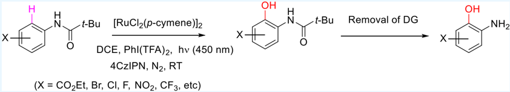
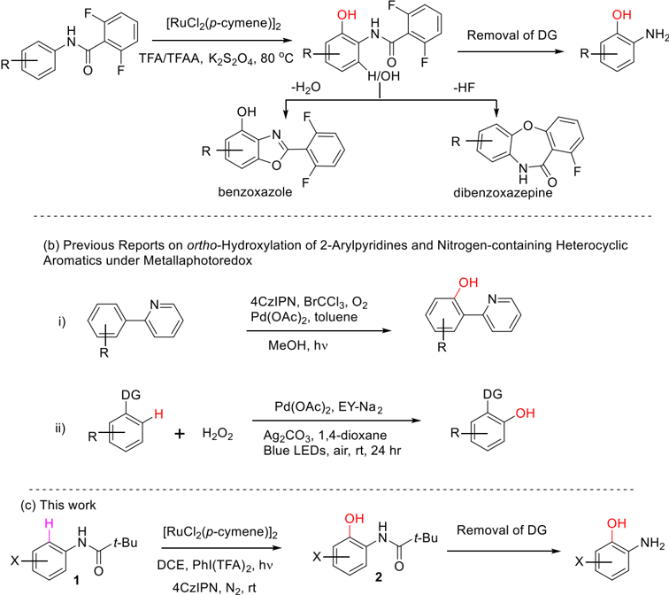
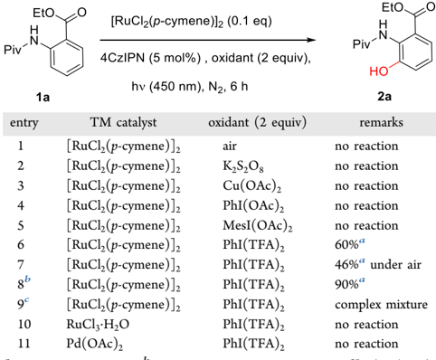
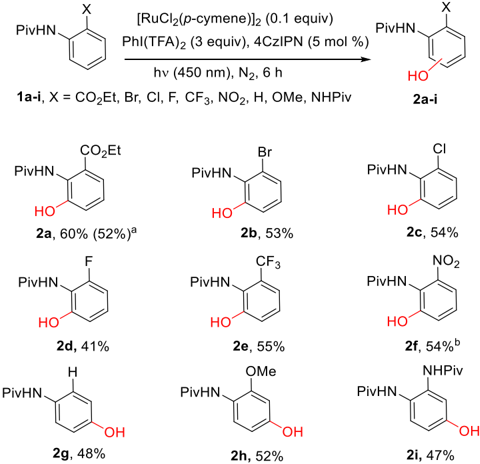
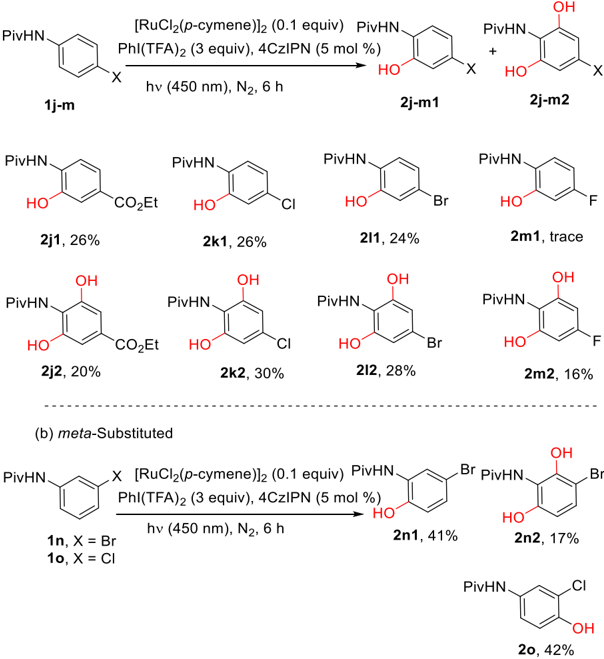
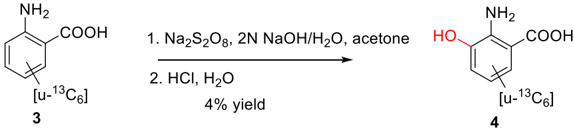
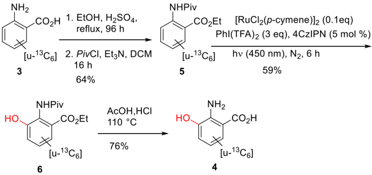
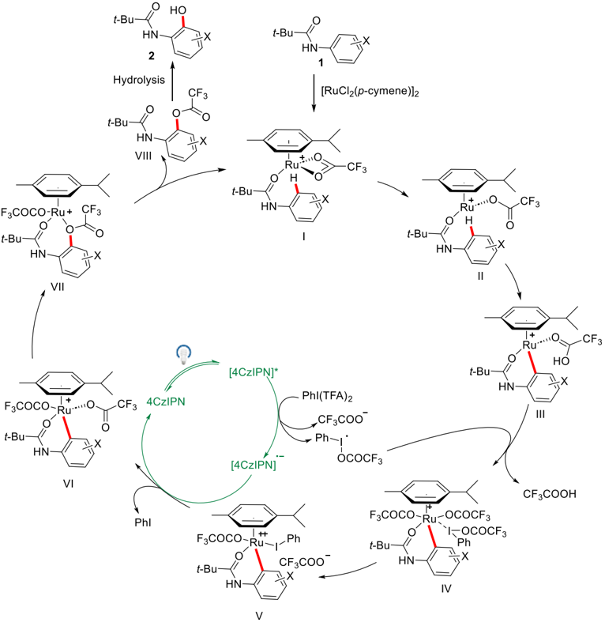

[http://pubs.acs.org/journal/acsodf](http://pubs.acs.org/journal/acsodf?ref=pdf)

Article

## Hydroxylation of Substituted Anilides with Metallaphotocatalysis

Buddha B. Khatri, * Lu Chen, Dawei Xu, Rhys Salter, and Ronghui Lin *

Cite This:

ACS Omega 2024, 9, 19982-19991

ACCESS

[Metrics &amp; More](https://pubs.acs.org/doi/10.1021/acsomega.3c10008?goto=articleMetrics&ref=pdf)

[Article Recommendations](https://pubs.acs.org/doi/10.1021/acsomega.3c10008?goto=recommendations&?ref=pdf)

[Supporting Information](https://pubs.acs.org/doi/10.1021/acsomega.3c10008?goto=supporting-info&ref=pdf)

ABSTRACT: We report the combination of organo-photocatalysis with transition metal (TM) catalysis for directed ortho -hydroxylation of substituted anilides for the synthesis of α -aminophenol derivatives under mild conditions. The developed metallaphotocatalysis utilizes N -pivaloyl as a directing group and phenyl iodine(III) bis(trifluoroacetate) (PIFA) in the combination of the 1,2,3,5-tetrakis(carbazol-9-yl)-4,6-dicyanobenzene (4CzIPN) photocatalyst and [RuCl2( p -cymene)]2 TM catalyst under visible-light irradiation at room temperature. The hydroxylation reaction works well for a wide range of substrates containing electron-withdrawing substituents and could be applied to late-stage functionalization and ortho -hydroxyl metabolite generation for drug compounds-containing anilides with electron-withdrawing substituents in a single mild reaction.

## ■ INTRODUCTION

Aminophenols such as 2-aminophenols and 2-aminobenzene1,3-diols are common structures in biologically active compounds, building blocks in material science, and metabolites in the agrochemical and pharmaceutical industries. 1 Classically, 2-aminophenols are synthesized through sequential nitration-reduction of phenols, 2 but this strategy suffers from poor regioselectivity, functional group tolerance, and tedious work up procedures. In the past decade, with notable advances in transition metal (TM)-catalyzed direct C -H activation, several research groups have utilized TMcatalyzed direct C -H oxidation, leading to hydroxylated arenes and heteroarenes as versatile synthetic intermediates. In 2009, Yu et al. demonstrated carboxylic acid group-directed ortho -hydroxylation of benzoic acids with a Pd catalyst in the presence of 1 atm of O 2 or air. 3 The same group also disclosed Cu(II)-mediated ortho -hydroxylation of aryl C -H bonds. 4 Furthermore, TM-catalyzed carbonyl directed hydroxylation of arenes and heteroarenes has been achieved successfully by the groups of Rao, 5 -7 Ackermann, 8 -12 and others under thermal conditions. 13,14

Although significant progress has been made toward the ortho -hydroxylation of arenes and heteroarenes with a wide range of TM catalysts and oxidants and directing groups, siteselective ortho -hydroxylation of substituted anilines under mild conditions with a readily removable or traceless directing group (DG) remains a challenge. In 2013, Rao et al. described mono- and dihydroxylation of anilines with a Ru catalyst using 2,6-difluororobenzoyl as a DG. 15 The DG was successfully removed after the hydroxylation in a few examples, but in others, it leads to benzoxazole or dibenzoazepine (Scheme 1a).

In 2020, Shi et al. reported an elegant metal-free chelationassisted direct hydroxylation of aromatic amides that covers a wide range of substrates but does not cover some ortho -substituted functional groups such as ester, nitro, F, CF 3 , etc. 16 The published literature utilizes high temperature, harsh reaction conditions, and DGs that are difficult to remove, which limits the scope and practicability of the developed methodologies. 15 -17

More recently, light-induced catalysis has been used in other chemical transformations beyond C -C and C -heteroatom bond-forming cross-coupling reactions due to its ability to generate reactive intermediates under mild conditions. 18,19 In 2018, Singh et al. reported a metallaphotoredox method for ortho -hydroxylation of 2-arylpyridines by integrating 4CzIPN photocatalyst and Pd(OAc)2 as a TM metal catalyst under visible-light conditions (Scheme 1bi). 20 In 2022, ortho -hydroxylation of 2-arylpyridines and 2-arylbenzoxazoles has been reported by Chu and co-workers using a Pd(II) catalyst and an Eosin Y photocatalyst (EY-Na2) under mild conditions (Scheme 1bii). 21 With the onset of hypervalent iodine(III) reagents being prevalently used as an oxidizing reagent in hydroxylation reactions of arenes and heteroarenes in thermal TM catalysis reactions, 7,10,15 and their increasing application in

Received:

December 14, 2023

Revised:

April 9, 2024

Accepted:

April 11, 2024

Published:

April 24, 2024

## Scheme 1. Directed ortho -Hydroxylation of Anilines and 2-Arylpyridines

visible-light-induced organophotocatalysis, 22 we were prompted to investigate directed ortho -hydroxylation of substituted anilides with hypervalent iodine(III) oxidizing reagents under visible-light metallaphotocatalysis (Scheme 1c).

## ■ RESULTS AND DISCUSSION

Initially, we investigated ortho -hydroxylation of ethyl anthranilate with N -trifluoroacetyl, N -2,6-difluorobenzoyl, and N -pivaloyl as the DG under Rao's thermal conditions {[RuCl2( p -cymene)]2, TFA/TFAA, K2S2O8, 80 ° C}, 15 and only N -pivaloyl worked well to give the desired hydroxyl product. Based on this, we hypothesized that an N -pivaloyl (Piv-) group may serve as an ideal DG for the ortho -hydroxylation of substituted anilines because it is stable under reaction conditions and can readily be removed. We began our photochemical investigations with N -pivaloyl ethyl anthranilate 1a , a representative ortho -substituted aniline, and explored reaction conditions to find an optimal oxidizing reagent using [RuCl2( p -cymene)]2 as the TM catalyst and 4CzIPN as the organo-photocatalyst. Standard conditions utilized irradiation of the reaction mixture under visible light (450 nm) for 6 h in dichloroethane under nitrogen (Table 1). A host of oxidants including air, K2S2O8, Cu(OAc)2, PhI(OAc)2, and MesI(OAc)2 were evaluated and found ineffective (Table 1 entries 1 -5), but we were pleased to find 60% conversion by highperformance liquid chromatography (HPLC) into the desired ortho -hydroxylated product 2 with PhI(TFA)2 (Table 1 entry 6). The reaction profile was clean, and the conversion was

Table 1. Optimization of the Reaction Conditions

a Product by HPLC. b 3 equiv of the oxidant used. c [Ir(dF(CF3)ppy)2(dtbbpy)]PF6 (5 mol %) used instead of 4CzIPN.

improved to 90% by HPLC with 3 equiv of the oxidant (Table 1 entry 8). Upon using the iridium photocatalyst [Ir(dF(CF3)ppy)2(dtbbpy)]PF6 instead of 4CzIPN, although some hydroxylated products were observed on HPLC, the reaction mixture was complex (Table 1 entry 9). Alternative TM catalysts such as RuCl 3 · H2O and Pd(OAc)2 were found to be

ineffective in this reaction (Table 1 entries 10 -11). Furthermore, we examined N -trifluoroacetyl, N -2,6-difluorobenzoyl, and N -Boc on the amino group of ethyl anthranilate as the alternative DG, instead of the N -pivaloyl group in 1a , under our current metallaphotoredox hydroxylation conditions, but all failed to give any desired product.

After identifying optimal reaction conditions, the direct ortho -hydroxylation of a range of anilides containing o -substituents was explored to establish the substrate scope of the catalytic reaction. Anilides containing electron-withdrawing groups (EWGs) such as Br, Cl, F, and CF 3 at the ortho position were tolerated and oxidized in modest yields (Scheme 2,

Scheme 2. Substrate Scope for ortho -Substituted Anilides in Isolated Yields

a Yield in parentheses in 1 mmol of the substrate ( 1a ) while others are in 0.125 -0.25 mmol. b Reaction required 0.2 equiv of [RuCl2( p -cymene)]2, 4 equiv of PhI(TFA)2, 10 mol % 4CzIPN, and 24 h of irradiation.

substrates 1a -1e ). In the case of the anilide containing an ortho -nitro substituent, a higher catalyst loading, more oxidant, and longer irradiation time were required to complete the reaction (Scheme 2, substrate 1f ). In contrast, the introduction of electron-donating groups (EDGs) or unsubstituted anilides resulted in para -hydroxylation as the sole outcome (Scheme 2, substrates 1g , 1h , and 1i ), likely by a competitive non-directed mechanism. Such para -selective hydroxylation was previously reported with electron-rich anilides using hypervalent iodine(III) reagents, but only under strong acidic conditions (TFA/ CHCl3). 23 To support the observed para -hydroxylation as the non-directed pathway, three reactions on 1g were performed: (1) without the TM catalyst, (2) without the TM catalyst and photocatalyst, and (3) without the TM catalyst and photocatalyst and in the absence of light (21 h stirring at room temperature). In each case, product 2g was obtained as the major product with HPLC yields of 60%, 71%, and 75% respectively, indicating that PhI(TFA)2 directly oxidizes the substrates 1g to 2g without involving C -H activation and photoredox catalysis.

Substrates with substituents at the para and meta positions were also studied. Unlike ortho -substituted anilides, monohydroxylation was accompanied by second hydroxylation in another ortho position, yielding a mixture of monoand dihydroxylated products (Scheme 3a,b). Dihydroxylation was not surprising and is useful to generate 2-aminobenzene-1,3diols. Again, EWG substituents such as CO2Et, Br, Cl, and F were all well tolerated. Mixtures of mono- and bis-hydroxylated products were separated and fully characterized. In the case of the m -Cl substituent, the para -hydroxylated compound was isolated as the only product, presumably formed by competitive nondirected hydroxylation mechanism described earlier. 23

Another conventional way to access 2-aminophenols from anilines is through ortho -aminophenyl sulfate esters. It has been reported that aromatic amines can be oxidized to ortho -aminophenyl sulfate esters by sodium or potassium persulfate, which in turn can be hydrolyzed in hot acid to its corresponding 2-aminophenols, with the net result being ortho -hydroxylation (Boyland -Sims oxidation). 17 This procedure suffers from harsh reaction conditions, low yield, and tedious workup steps. In a separate program, we were in need of stable-isotope-labeled hydroxy anthranilic acid ([phenylu13 C6]3-HAA) 4 to track the isotope incorporation in downstream analytes of tryptophan degradation by the kynurenine pathway. 24 [Phenyl-u13 C6]3-HAA is not commercially available, but we were able to prepare milligram quantities of it by following the literature procedure with just 4% isolated yield, Scheme 4a. 17,25 By using our developed hydroxylation with the metallaphotocatalysis, the yield (total isolated yield 29%) and reproducibility to access [phenylu13 C6]3-HAA were greatly improved, though with extra steps (Scheme 4b).

Hydroxylation is one of the major metabolism pathways in drug compounds, and often attempts to acquire greater amounts of drug metabolites via chemical approaches to both confirm structures and assess pharmacological properties requires de novo synthesis. One-step synthesis of hydroxyl metabolites from drug molecules or drug candidates is much desired to potentially accelerate drug discovery and research efforts. This mild photocatalytic hydroxylation method could be applied to late-stage functionalization and ortho -hydroxyl metabolite generation for drug-compound-containing anilides with EWG substituents in a single, neutral, and mild reaction.

Hypervalent iodine(III) reagents act as oxidants through electron transfer mechanisms. 22,26 In consideration of the mild nature of selective ortho -hydroxylation of substituted anilides, we became interested in the mechanism of the optimized metallaphotocatalytic method. The reaction of 1a did not proceed in the absence of one of the components from 4CzIPN, [RuCl2( p -cymene)]2, and PhI(TFA)2 or in the absence of the light, confirming the necessity of each component within the catalytic cycle. When the reaction of 1a was performed in the presence of 3 equiv of a radical trapping agent, TEMPO (2,2,6,6-tetramethylpiperidin-1-yl)oxyl, no product ( 2a ) was detected. Likewise, no conversion was observed when PhI(OAc)2 was used in place of PhI(TFA)2 [calculated reference redox potential values in the literature of -0.08 V for PhI(OAc)2 vs 0.63 V PhI(TFA)2 in the single electron transfer (SET) mechanism 27 ]. These observations support a radical reaction pathway for the Rucatalyzed photoredox C -H activation/ ortho -hydroxylation of substituted anilides containing various EWG substituents like

## Scheme 3. Substrate Scope for (a) para - and (b) meta -Substituted Anilides in Isolated Yields

## Scheme 4. Synthesis of [Phenyl-u13 C6]3-hydroxy Anthranilic Acid ([u13 C6]3-HAA)

1a . On the other hand, the hydroxylation of substituted anilides containing EDG substituents, such as substrate 1g , proceeds via competitive direct oxidation with PhI(TFA)2 without involving C -H activation and photoredox catalysis.

## Scheme 5. Plausible Reaction Mechanism

Based on the observed reactions and experimental data, a mechanism for the ortho -hydroxylation of substituted anilides containing the EWG substituents is proposed in Scheme 5. Initially, PhI(TFA)2 undergoes ligand exchange with [RuCl2( p -cymene)]2, where the carbonyl of the N -Piv group of the substrate acts as a DG and facilitates C -H activation to form intermediates I -III. Absorption of visible light by 4CzIPN generates the excited state species, 4CzIPN * , which undergoes SET to another molecule of PhI(TFA)2, generating an iodanyl radical and a trifluoroacetate anion, which engage in a ruthenacycle through ligand exchange. The reduced photocatalyst [4CzIPN] ·-undergoes SET to regenerate the photocatalyst. The oxidation occurs in two steps, first by the cleavage of the I -O bond along with the formation of the Ru -I bond via intermediate IV, followed by the subsequent cleavage of the second I -O bond, forming intermediate V. Reduction of intermediate V, release of iodobenzene and trifluoroacetate coordination to the metal center, forms intermediate VI, which upon the reductive elimination to VII followed by hydrolysis gives the ortho -hydroxylated product. For dihydroxylation, the catalytic cycle repeats and ultimately leads to hydroxylate the other accessible ortho position.

In conclusion, the metallaphotocatalysis method for the ortho -hydroxylation of substituted anilines containing various

EWG substituents operates under mild conditions using a readily removable pivaloyl DG by integrating the photocatalyst 4CzIPN and [RuCl2( p -cymene)]2 and PIFA. The ortho -substituted pivalanilides containing EWGs such as Br, Cl, F, CF3, and CO2Et at the ortho position were hydroxylated at the ortho positions of the DG in 41 -60% isolated yields. In comparison, the substrates with ortho EDGs or unsubstituted anilides resulted in para -hydroxylation of the anilides as the only product, likely by a nondirected hydroxylation mechanism. On the other hand, for para -substituted pivalanilides, monohydroxylation was accompanied by second hydroxylation in another ortho position, yielding a mixture of mono- and bishydroxylated products. For meta -substituted pivalanilides, with limited substrates, it might produce a mixture of mono- and bis-hydroxylated products or monohydroxylated products. This methodology was applicable to hydroxylate at the ortho positions of substituted anilines containing various EWG substituents, which would otherwise not be easily accessible. The utility of the developed hydroxylation method was exemplified by preparing the stable-isotope-labeled compound [phenyl-u13 C6]3-hydroxy anthranilic acid, which was difficult to prepare using conventional methods. The hydroxylation method could be potentially applied to late-stage functionalization and ortho -hydroxyl metabolite generation for drug

compound-containing anilides with EWG substituents in a single, neutral, and mild reaction, offering an advantage to de novo synthesis.

## ■ EXPERIMENTAL SECTION

All reagents and chemicals were obtained from commercial suppliers and used as received. Reactions were monitored by thin layer chromatography (TLC) analysis on silica gel (Merck, 60 F254 plate) and/or liquid chromatography mass spectrometry (LC -MS). TLC plates were visualized by exposure to short-wave ultraviolet (254 and 366 nm) light. LC -MS analyses were performed on an Agilent 6140 quadrupole LC/MS system. Thermally heated reactions were carried out in an oil bath on a hot plate with a temperature controller. Photochemical reactions were performed on photoreactors m1 and m2 from Penn Optical Coatings LLC equipped with 450 nm LED light and an 8 mL vial holder. Purification of compounds was performed by gradient elution by specified solvents either by flash column chromatography or by preparative HPLC. Flash column chromatography was carried out on a CombiFlash Rf with prepacked silica gel (Redi Sep) columns. Preparative HPLC was conducted on a Teledyne ISCO EZ prep using a Phenomenex Gemini C18, 5 μ m, 110 Å column (size: 250 × 21.2 mm). HPLC analysis was performed on an Agilent 1200 using a Waters Xbridge C18, 3.5 μ m, 4.6 × 150 mm column at 25 ° C with a 1 mL/min flow rate and a 5 μ L injection volume. Mobile phase A: 0.1% TFA in H2O. Mobile phase B: 0.1% TFA in CH3CN. Gradient: 10 -90% B, 0 -15 min; 90% B, 15 -18 min; 90 -10% B, 18 -19 min; and 10% B, 19 -20 min 1 H NMR, 13 C NMR, and 2D NMR spectra were recorded on a Bru ker AVANCE III HD Nanobay spectrometer (400 and 500 MHz). Chemical shifts ( δ ) were given in ppm relative to TMS, and multiplicities are reported using the following abbreviations: s = singlet, d = doublet, t = triplet, q = quartet, m = multiplet. Coupling constants ( J ) are given in hertz (Hz). High-resolution mass spectrometry (HRMS) was performed on a Waters TOF LC/ MS system using a Zspray electrospray ionization (ESI) and time-of-flight (TOF) analyzer in the positive-ion detection mode. The mass peak with a higher intensity of [M + H] + was chosen for accurate mass analysis.

̈

Substrates for hydroxylation reactions were purchased from chemical suppliers, except 1a , 1i , and 1j , which were prepared as described below.

Ethyl 2-Pivalamidobenzoate (1a). To a solution of ethyl anthranilate (1.669 g, 10 mmol) in dichloromethane (DCM) at 0 ° C was added triethylamine (4.17 mL, 0.728 g/mL, 30 mmol), followed by pivaloyl chloride (1.462 g, 12 mmol). The reaction was slowly warmed to room temperature and stirred for 4 h before diluting with water (40 mL). Layers were separated, and the aqueous layer was extracted with DCM (2 × 20 mL). Combined organic layers were washed with water and brine, dried over Na 2 SO4, concentrated, and purified on a silica gel column with 20% EtOAc/heptane. Pure fractions were combined and concentrated to obtain the title compound (2.4 g, 96% yield). 1 H NMR (400 MHz, CDCl3): δ 11.36 (br s, 1H), 8.78 (dd, J = 1.0, 8.8 Hz, 1H), 8.05 (dd, J = 1.7, 8.1 Hz, 1H), 7.53 (dt, J = 1.7, 7.9 Hz, 1H), 7.09 -7.04 (m, 1H), 4.39 (q, J = 7.3 Hz, 2H), 1.39 (t, J = 7.3 Hz, 3H), 1.35 (s, 9H). 13 C NMR (101 MHz, CDCl3): δ 177.96, 168.41, 142.05, 134.53, 130.81, 122.14, 120.31, 115.27, 61.34, 40.39, 27.62, 14.22. HRMS (ESI) calcd for C14H20NO3 [M + H] + , 250.1443; found, 250.1447.

N , N ′ -(1,2-Phenylene)bis(2,2-dimethylpropanamide) (1i). To a 0 ° C solution of benzene-1,2-diamine (200 mg, 1.85 mmol) in DCM (3 mL), DMAP (22.6 mg, 0.185 mmol), and N , N -diisopropylamine (0.5 mL, 3.70 mmol) was added pivaloyl chloride (0.46 mL, 3.70 mmol). The solution was slowly warmed to room temperature and stirred for 3 h before diluting with water (5 mL). Layers were separated, and the aqueous layer was extracted with DCM (2 × 3 mL). Combined organics were dried in MgSO4, filtered, and concentrated in vacuo . The residue was purified on a silica gel column with 0 -70% EtOAc/heptane. Pure fractions were combined and concentrated to get the title compound 1i as a fluffy-white solid (439 mg, 86% yield). 1 H NMR data match with the literature. 28 1 H NMR (400 MHz, CDCl3): δ 8.08 (br s, 2H), 7.39 -7.42 (m, 2H), 7.18 -7.22 (m, 2H), 1.32 (s, 18H).

Ethyl 4-Pivalamidobenzoate (1j). Prepared following the literature procedure. 29 1 H NMR (400 MHz, CDCl3): δ 8.03 -7.99 (d, J = 8.8 Hz, 2H), 7.64 -7.60 (d, J = 8.8 Hz, 2H), 7.44 (br s, 1H), 4.36 (q, J = 7.3 Hz, 2H), 1.39 (t, J = 7.3 Hz, 3H), 1.33 (s, 9H).

A general representative procedure for the hydroxylation is described here using ethyl 2-pivalamidobenzoate ( 1a ).

Ethyl 3-Hydroxy-2-pivalamidobenzoate (2a). To a mixture of ethyl 2-pivalamidobenzoate ( 1a ) (31.2 mg, 0.125 mmol), (bis(trifluoroacetoxy)iodo)benzene (161.3 mg, 0.375 mmol), dichloro( p -cymene)ruthenium(II) dimer (7.6 mg, 0.0125 mmol), and 4CzIPN (4.9 mg, 0.0062 mmol) in a vial, dichloroethane (1 mL) was added under nitrogen and irradiated at 450 nm for 6 h. The reaction was concentrated and purified on a silica gel column using 15% EtOAc/heptane to get the monohydroxylated title product 2a (20 mg, 60% yield) as an off-white solid. 1 H NMR (400 MHz, CDCl3): δ 11.35 (br s, 1H), 9.83 (s, 1H), 7.55 (dd, J = 7.6, 1.7 Hz, 1H), 7.17 (dd, J = 8.2, 1.3 Hz, 1H), 7.07 (t, J = 8.2 Hz, 1H), 4.31 (q, J = 7.2 Hz, 2H), 1.36 -1.31 (m, 12H). 13 C NMR (101 MHz, CDCl3): δ 180.55, 168.50, 150.02, 128.97, 125.73, 125.66, 122.86, 119.91, 61.73, 40.15, 27.75, 14.16. HRMS (ESI) calcd for C14H20NO4 [M + H] + , 266.1392; found, 266.1394. The isolated yield of 2a was 52% when the reaction was scaled up to 1 mmol of the substrate ( 1a ), while HPLC analysis of the reaction mixture showed that it was composed of the desired product and the starting material (1a ) in a ratio of about 3:1.

N -(2-Bromo-6-hydroxyphenyl)pivalamide (2b). Prepared following the general procedure from N -(2bromophenyl)pivalamide ( 1b , 50 mg, 0.195 mmol), and 28 mg was isolated (53% yield), 1 HNMR(400 MHz, DMSOd 6 ): δ 9.60 (s, 1H), 8.75 (s, 1H), 7.08 -6.99 (m, 2H), 6.86 (dd, J = 7.8, 2.0 Hz, 1H), 1.22 (s, 9H). 13 C NMR (101 MHz, DMSOd 6 ): δ 176.88, 155.69, 129.02, 125.49, 124.74, 122.91, 115.83, 39.06, 27.89. HRMS (ESI) calcd for C11H15NO2Br [M + H] + , 272.0286; found, 272.0286.

N -(2-Chloro-6-hydroxyphenyl)pivalamide (2c). Prepared following the general procedure from N -(2chlorophenyl)pivalamide ( 1c , 50 mg, 0.236 mmol), and 27 mg was isolated (54% yield). 1 H NMR (500 MHz, CDCl3): δ 9.50 (s, 1H), 8.04 (br s, 1H), 7.07 (dd, J = 8.7, 7.5 Hz, 1H), 6.99 -6.95 (m, 2H), 1.40 (s, 9H). 13 C NMR (126 MHz, CDCl3): δ 179.71, 150.74, 127.17, 126.17, 123.23, 120.73, 119.28, 40.06, 27.66. HRMS (ESI) calcd for C11H15NO2Cl [M + H] + , 228.0791; found, 228.0797.

N -(2-Fluoro-6-hydroxyphenyl)pivalamide (2d). Prepared following the general procedure from N -(2chlorophenyl)pivalamide ( 1d , 24.4 mg, 0.125 mmol), and 11

mg was isolated (42% yield) as an off-white solid. 1 H NMR (400 MHz, CDCl3): δ 9.81 (s, 1H), 7.76 (br s,1H), 7.07 (td, J = 8.29, 6.82 Hz 1H), 6.81 -6.83 (d, J = 8.50, 7.5 Hz, 1H), 6.66 -6.68 (ddd, J = 10.13, 1.13 Hz, 1H), 1.38 (s, 9H). 13 C NMR (126 MHz, CDCl3): δ 179.56, 155.84, 153.43, 150.37, 126.65, 126.55, 115.67, 114.97, 114.85, 106.34, 106.13, 39.80, 27.58. 19 F NMR (377 MHz, CDCl3): δ -128.50 (s, 1F). HRMS (ESI) calcd for C11H14FNO2 [M + H] + , 212.1087; found, 212.1087.

N -(2-Hydroxy-6-(trifluoromethyl)phenyl)pivalamide (2e). Prepared following the general procedure from N -(2(trifluoromethyl)phenyl)pivalamide ( 1e , 57.9 mg, 0.236 mmol), and 34 mg was isolated (55% yield), 1 H NMR (400 MHz, C6D6): δ 9.28 (s, 1H), 7.70 -7.57 (m, 1H), 7.19 -7.16 (m, 1H), 6.88 (d, J = 7.2 Hz, 1H), 6.68 (t, J = 8.1 Hz, 1H), 0.96 (s, 9H). 13 C NMR (101 MHz, CDCl3): δ 180.10, 151.67, 127.32, 125.36, 125.05, 123.65, 122.88, 118.30, 39.77, 27.40. 19 F NMR (377 MHz, CDCl3): δ -60.39 (s, 3F). HRMS (ESI) +

calcd for C12H15NO2F3 [M + H] , 262.1055; found, 262.1056.

N -(2-Hydroxy-6-nitrophenyl)pivalamide (2f). To a mixture of N -(2-nitrophenyl)pivalamide ( 1f , 55.6 mg, 0.25 mmol), (bis(trifluoroacetoxy)iodo)benzene (430 mg, 1.0 mmol), dichloro( p -cymene)ruthenium(II) dimer (30.6 mg, 0.20 mmol), and 4CzIPN (19.7 mg, 0.025 mmol) in a vial, dichloroethane (1 mL) was added under nitrogen and irradiated at 450 nm for 24 h. The reaction was concentrated and purified on a silica gel column using 20% EtOAc/hexane to get the monohydroxylated title product 2f (32 mg, 54% yield) as an off-white solid. 1 H NMR (400 MHz, CDCl3): δ 10.29 (br s, 1H), 9.30 (s, 1H), 7.66 (dd, J = 8.1 1.7 Hz, 1H), 7.29 (dd, J = 7.8, 1.5 Hz, 1H), 7.21 -7.15 (m, 1H), 7.25 -7.11 (m, 1H), 1.42 -1.27 (m, 9H). 13 C NMR (101 MHz, CDCl3): δ 181.09, 151.30, 141.27, 127.14, 126.12, 122.47, 118.00, 40.31, 27.60. HRMS (ESI) calcd for C11H15N2O4 [M + H] + , 239.1032; found, 239.1029.

N -(4-Hydroxyphenyl)pivalamide (2g). Prepared following the general procedure from N -phenylpivalamide ( 1g , 44.3 mg, 0.25 mmol), and 23 mg was isolated (48% yield). Both 1 H and 13 C NMR spectra matched with literature data. 30 1 H NMR (400 MHz, DMSOd 6 ): δ 9.13 (s, br, 1H), 8.94 (s, br, 1H), 7.38 -7.32 (m, 2H), 6.74 -6.60 (m, 2H), 1.20 (s, 9H). 13 C NMR (101 MHz, DMSOd 6 ): δ 176.32, 153.77, 131.31, 122.79, 115.20, 39.28, 27.81.

To confirm non-directed hydroxylation in example N -phenylpivalamide ( 1g ), the following test reactions were conducted: (1) reaction without the TM catalyst, (2) reaction without the TM and photocatalyst, and (3) reaction without the TM and photocatalyst and in the absence of light (21 h stirring at room temp). In all cases, product 2g was formed as a major product with HPLC yields of 60%, 71%, and 75% respectively, while the products were not isolated.

N -(4-Hydroxy-2-methoxyphenyl)pivalamide (2h). Prepared following the general procedure from N -(2methoxyphenyl)pivalamide ( 1h , 38 mg, 0.183 mmol), and 21 mg was isolated (51% yield). 1 H NMR (400 MHz, CDCl3): δ 8.08 (d, J = 8.51 Hz, 1H), 7.94 (s, 1H), 7.27 (s, 1H), 6.84 (br, s, 1H) 6.42 -6.48, (m, 1H), 3.82 (s, 3H), 1.32 (s, 9H). 13 C NMR (126 MHz, CDCl3): δ 176.96, 153.43, 149.73, 121.14, 119.69, 106.64, 98.73, 55.70, 39.76, 27.55. HRMS (ESI) calcd for C12H17NO3 [M + H] + , 224.1287; found, 224.1288.

N , N ′ -(4-Hydroxy-1,2-phenylene)bis(2,2-dimethylpropanamide) (2i). Prepared following the general procedure from N , N ′ -(1,2-phenylene)bis(2,2-dimethylpropanamide) ( 1i ,

34.5 mg, 0.125 mmol), and 17 mg was isolated (47% yield) as an off-white solid. 1 H NMR (400 MHz, CDCl3): δ 7.12 (d, J = 8.68 Hz, 1H), 6.97 (d, J = 2.69 Hz, 1H), 6.65 (dd, J = 8.68, 2.69 Hz, 1H), 1.28 (s, 8H) 1.28(s, 8H). 13 C NMR (126 MHz, CDCl3): δ 180.49, 179.86, 157.15, 134.16, 128.11, 123.77, 114.00, 112.78, 40.53, 40.26, 28.04, 27.97. HRMS (ESI) calcd for C16H24N2O3 [M + H] + , 293.1865; found, 293.1871.

Ethyl 3-Hydroxy-4-pivalamidobenzoate (2j1). Prepared following the general procedure from ethyl 4pivalamidobenzoate ( 1j , 62.3 mg, 0.25 mmol); two products ( 2j1 and 2j2 ) were isolated. 17 mg of 2j1 was isolated (26% yield). 1 H NMR (400 MHz, CDCl3): δ 8.56 (s, 1H), 7.95 (s, 1H), 7.69 (d, J = 1.5 Hz, 1H), 7.58 (dd, J = 8.3, 1.9 Hz, 1H), 7.54 (d, J = 8.3 Hz, 1H), 4.35 (q, J = 6.8 Hz, 2H), 1.40 -1.33 (m, 12H). 13 C NMR (101 MHz, CDCl3): δ 178.72, 166.40, 147.18, 130.25, 127.67, 122.22, 120.96, 119.24, 61.14, 39.86, 27.63, 14.28. HRMS (ESI) calcd for C14H20NO4 [M + H] + , 266.1392; found, 266.1395.

Ethyl 3,5-Dihydroxy-4-pivalamidobenzoate (2j2). Isolated 14 mg of 2j2 (20% yield). 1 H NMR (400 MHz, CDCl3): δ 9.10 (s, 2H), 8.33 (s, 1H), 7.30 -7.25 (m, 2H), 4.34 (q, J = 7.2 Hz, 2H), 1.41 -1.34 (m, 12H). 13 C NMR (101 MHz, CDCl3): δ 179.66, 167.17, 148.30, 127.58, 119.21, 110.51, 61.55, 40.00, 27.65, 14.15. HRMS (ESI) calcd for C14H20NO5 [M + H] + , 282.1344; found, 282.1341.

N -(4-Chloro-2-hydroxyphenyl)pivalamide (2k1). Prepared following the general procedure from N -(4chlorophenyl)pivalamide ( 1k , 52.9 mg, 0.25 mmol); two products ( 2k1 and 2k2 ) were isolated. 15 mg of 2k1 was isolated (26% yield). 1 H NMR (400 MHz, CDCl3): δ 9.06 (s, 1H), 7.63 -7.50 (m, 1H), 7.02 (d, J = 2.0 Hz, 1H), 6.94 (d, J = 8.3 Hz, 1H), 6.86 -6.82 (m, 1H), 1.35 (s, 9H). 13 C NMR (101 MHz, CDCl3): δ 179.24, 149.77, 132.12, 124.39, 122.91, 120.39, 120.02, 39.53, 27.66. HRMS (ESI) calcd for C11H15NO2Cl [M + H] + , 228.0791; found, 228.0796.

N -(4-Chloro-2,6-dihydroxyphenyl)pivalamide (2k2). Isolated 18 mg of 2k2 (30% yield). 1 H NMR (400 MHz, CDCl3): δ 8.25 (s, 2H), 8.05 (br s, 1H), 6.51 (s, 2H), and 1.36 (s, 9H). 13 C NMR (101 MHz, CDCl3): δ 179.27, 148.83, 131.29, 113.80, 109.76, 39.82, 27.65. HRMS (ESI) calcd for C11H15NO3Cl [M + H] + , 244.0748; found, 244.0743.

N -(4-Bromo-2-hydroxyphenyl)pivalamide (2l1). Prepared following the general procedure from N -(4bromophenyl)pivalamide ( 1l , 64 mg, 0.25 mmol); two products ( 2l1 and 2l2 ) were isolated. Isolated 16 mg of 2l1 (24% yield). 1 H NMR (400 MHz, DMSOd 6 ): δ 10.36 (s, 1H), 8.48 (s, 1H), 7.73 (d, J = 8.6 Hz, 1H), 7.03 (d, J = 2.4 Hz, 1H), 6.96 (dd, J = 2.2, 8.6 Hz, 1H), 1.23 (s, 9H). 13 C NMR (101 MHz, DMSOd 6 ): δ 176.83, 149.59, 126.47, 124.01, 122.14, 118.26, 116.15, 39.68, 27.68. HRMS (ESI) calcd for C11H15NO3Br [M + H] + , 272.0286; found, 272.0291.

N -(4-Bromo-2,6-dihydroxyphenyl)pivalamide (2l2). Isolated 20 mg of 2l2 (28% yield). 1 H NMR (400 MHz, DMSOd 6 ): δ 9.74 (s, 2H), 8.43 (s, 1H), 6.52 (s, 2H), 1.23 (s, 9H). 13 C NMR (101 MHz, DMSOd 6 ): δ 178.30, 154.41, 118.80, 114.03, 110.55, 39.24, 27.86. HRMS (ESI) calcd for C11H15NO3Br [M + H] + , 288.0235; found, 288.0242.

N -(4-Fluoro-2,6-dihydroxyphenyl)pivalamide (2m2). To a mixture of N -(4-fluorophenyl)pivalamide ( 1m , 48.8 mg, 0.25 mmol), (bis(trifluoroacetoxy)iodo)benzene (430 mg, 1 mmol), dichloro( p -cymene)ruthenium(II) dimer (15.3 mg, 0.025 mmol), and 4CzIPN (9.9 mg, 0.0125 mmol) in a vial, dichloroethane (2 mL) was added under nitrogen and

irradiated at 450 nm for 24 h, generating a mixture of 2m2 and trace 2m1 . The reaction mixture was concentrated and purified on a silica gel column using 0 -30% EtOAc/hexane to get the dihydroxylated title product 2m2 (9 mg, 16% yield) as an offwhite solid. 1 H NMR (400 MHz, CD3OD): δ 6.14 (d, J = 9.8 Hz, 2H), 1.32 (s, 9H). 13 C NMR (101 MHz, CDCl3): δ 179.71, 161.75, 152.18, 110.19, 94.63, 39.08, 26.51. 19 F NMR (377 MHz, CD3OD): δ -117.09 (s, 1F). HRMS (ESI) calcd for C11H15FNO3 [M + H] + , 228.1036; found, 228.1039.

N -(5-Bromo-2-hydroxyphenyl)pivalamide (2n1). Prepared following the general procedure from N -(3bromophenyl)pivalamide ( 1n , 32 mg, 0.125 mmol); two products ( 2n1 and 2n2 ) were isolated. Isolated 14 mg of 2n1 (42% yield). 1 H NMR (400 MHz, CDCl3): δ 8.62 (br s, 1H), 7.55 (br s, 1H), 7.24 -7.20 (m, 2H), 6.89 (d, J = 8.8 Hz, 1H), 1.35 (s, 9H). 13 C NMR (101 MHz, CDCl3): δ 179.23, 148.10, 129.78, 126.93, 124.80, 121.31, 111.86, 39.61, 27.65. HRMS (ESI) calcd for C11H15NO2Br [M + H] + , 272.0286; found, 272.0290.

N -(3-Bromo-2,6-dihydroxyphenyl)pivalamide (2n2). Isolated 6 mg of 2n2 (17% yield). 1 H NMR (400 MHz, CDCl3): δ 9.74 (br s, 1H), 8.05 (br s, 1H), 7.16 (d, J = 8.8 Hz, 1H), 6.53 (d, J = 9.3 Hz, 1H), 6.16 (br s, 1H), 1.37 (s, 9H). 13 C NMR (101 MHz, CDCl3): δ 179.47, 149.39, 143.83, 128.34, 115.58, 112.81, 99.64, 39.88, 27.65. HRMS (ESI) calcd for C11H15NO3Br [M + H] + , 288.0235; found, 288.0240.

N -(3-Chloro-4-hydroxyphenyl)pivalamide (2o). Prepared following the general procedure from N -(3chlorophenyl)pivalamide ( 1o , 27.2 mg, 0.125 mmol), isolated yield = 12 mg (42% yield). 1 H NMR (400 MHz, CDCl3): δ 7.73 (d, J = 2.4 Hz, 1H), 7.21 (s, br, 1H), 7.17 -7.16 (dd, J = 8.8, 2.4 Hz, 1H), 6.95 (d, J = 8.8 Hz, 1H), 5.51 (s, 1H), 1.30 (s, 9H). 13 C NMR (101 MHz, CDCl3): δ 176.62, 148.20, 131.42, 121.46, 120.68, 119.83, 116.08, 39.49, 27.59. HRMS (ESI) calcd for C11H15NO2Cl [M + H] + , 228.0791; found, 228.0793.

[Phenyl-u13 C6]ethyl 2-Pivalamidobenzoate (5). To an ethanol (1 mL) solution of [phenyl-u13 C6]anthranilic acid ( 3 ) (200 mg, 1.398 mmol) in a 15 mL round-bottom flask equipped with an air condenser was added concentrated sulfuric acid (0.25 mL, 4.69 mmol) at room temperature. The reaction was slowly heated to reflux for 96 h. After cooling to ambient temperature, the reaction mixture was neutralized with 2N aqueous sodium bicarbonate solution and extracted with ethyl acetate (3 × 5 mL). Combined organic layers were dried over anhydrous sodium sulfate, filtered, and concentrated to dryness to get an off-white solid (240 mg), which was dissolved in DCM (2 mL) and cooled to 0 ° C. To this was added triethylamine (0.58 mL) followed by the dropwise addition of pivolyl chloride (236 mg, 1.957 mmol). The reaction was slowly warmed to room temperature and, after stirring for 16 h, diluted with DCM (2.5 mL) and water (5 mL). Layers were separated, and the aqueous layer was extracted with DCM (5 mL). Combined organic layers were dried over anhydrous sodium sulfate and concentrated, and the residue was purified on a 12 g silica gel column with 0 -10% EtOAc/heptane. Pure fractions were combined and concentrated to get the title compound 5 (230 mg, 64% over two steps) as a clear oil, which solidified upon storage. 1 H NMR (400 MHz, CDCl3): δ 11.36 (br s, 1H), 9.05 -8.48 (m, 1H), 8.40 -7.78 (m, 1H), 7.79 -7.31 (m, 1H), 7.30 -6.75 (m, 1H), 4.39 (q, J = 6.8 Hz, 2H), 1.55 (s, H), 1.42 (t, J = 7.3 Hz, 3H), 1.35 (s, 9H). 13 C NMR (101 MHz, CDCl3): δ 177.95, 168.41,

142.03, 134.51, 130.79, 122.08, 120.27, 115.22, 61.33, 40.39, 27.62, 14.22. HRMS (ESI) calcd for C8 13 C6H20NO3 [M + H] + , 256.1644; found, 256.1647.

[Phenyl-u-1 13 C6]3-hydroxy Anthranilic Acid (4). To a solution of [phenyl-u13 C6]ethyl 3-hydroxy-2-pivalamidobenzoate ( 6 ) (18 mg, 0.067 mmol) in acetic acid (1 mL) was added 6 M HCl (2 mL), and the mixture was heated to 110 ° C for 110 h. The reaction was concentrated to dryness and purified on a Teledyne ISCO EZ prep using a Gemini 5 μ m C18 110 Å column (size 250 × 21.2 mm) with the following solvent gradient. Solvent A: 0.1% formic acid in water, solvent B: ACN. 0 -4 min, isocratic 5% B; 4 -7 min, gradient 5 -38% B; 7 -17 min isocratic 38% B, 17 -18 min, gradient 38 -95% B; 18 -21 min, isocratic 95% B; 21 min, back to 35% B; 21 -23 min isocratic 35% B. The flow rate was 22 mL/min. The desired product was eluted at 17.8 min. Pure fractions were combined and concentrated to dryness to give the title compound 4 (8 mg, 76% yield) as an off-white solid. 1 H NMR (400 MHz, DMSOd 6 ) δ = 9.52 (br s, 1H), 8.25 (br s, 1H), 7.42 -6.14 (m, 3H). 13 C NMR (101 MHz, DMSOd 6 ): δ 170.29, 144.92, 141.61, 121.80, 117.11, 114.41, 110.41. HRMS (ESI) calcd for C 13 C6H8NO3 [M + H] + , 160.0705; found, 160.0705.

[Phenyl-u- 13 C6]ethyl 3-Hydroxy-2-pivalamidobenzoate (6). To a mixture of [phenyl-u13 C6]ethyl 2pivalamidobenzoate ( 5 ) (31.9 mg, 0.125 mmol), (bis(trifluoroacetoxy)iodo)benzene (161.3 mg, 0.375 mmol), dichloro( p -cymene)ruthenium(II) dimer (7.6 mg, 0.0125 mmol), and 4CzIPN (4.9 mg, 0.0062 mmol) in a vial, dichloroethane (1 mL) was added under nitrogen and irradiated at 450 nm for 6 h. The reaction was concentrated and purified on a 12 g silica gel column using 15% EtOAc/ hexane to get the title compound 6 (20 mg, 59% yield) as an off-white solid. 1 H NMR (400 MHz, CDCl3): δ 11.33 (br s, 1H), 9.90 (t, J = 4.2 Hz, 1H), 7.92 -7.29 (m, 2H), 7.16 -6.78 (m, 1H), 4.38 (q, J = 7.3 Hz, 2H), 1.45 -1.37 (m, 12H). 13 C NMR (101 MHz, CDCl3): δ 180.55, 168.45, 150.01, 128.95, 125.72, 125.65, 122.78, 119.83, 61.73, 40.14, 27.62, 14.16. HRMS (ESI) calcd for C8 13 C6H20NO4 [M + H] + , 272.1593; found, 272.1596.

## ■ ASSOCIATED CONTENT

## * sı Supporting Information

The Supporting Information is available free of charge at https://pubs.acs.org/doi/10.1021/acsomega.3c10008.

Characterization data including 1 H, 13 C, 19 F, and 2D NMR spectra of the isolated compounds (PDF)

## ■ AUTHOR INFORMATION

## Corresponding Authors

Buddha B. Khatri -Global Discovery Chemistry, Janssen Research &amp; Development LLC, Johnson &amp; Johnson, Spring House, Pennsylvania 19477, United States ; Email: bkhatri@ its.jnj.com

Ronghui Lin -Global Discovery Chemistry, Janssen Research &amp; Development LLC, Johnson &amp; Johnson, Spring House, Pennsylvania 19477, United States; orcid.org/00000001-7951-7253; Email: rlin@its.jnj.com

## Authors

- Lu Chen -Global Discovery Chemistry, Janssen Research &amp; Development LLC, Johnson &amp; Johnson, Spring House, Pennsylvania 19477, United States
- Dawei Xu -Global Discovery Chemistry, Janssen Research &amp; Development LLC, Johnson &amp; Johnson, Spring House, Pennsylvania 19477, United States
- Rhys Salter -Global Discovery Chemistry, Janssen Research &amp; Development LLC, Johnson &amp; Johnson, Spring House, Pennsylvania 19477, United States

Complete contact information is available at: https://pubs.acs.org/10.1021/acsomega.3c10008

## Notes

The authors declare no competing financial interest.

## ■ ACKNOWLEDGMENTS

The authors thank Professor Paul J. Chirik (Chemistry Department, Princeton University) for his review and suggestions of the manuscript. We are also thankful to Dr. George Chiu and Dr. Fan Huang (Janssen Research &amp; Development LLC) for their assistance in literature search and high-resolution mass spectrometry analysis, respectively.

## ■ REFERENCES

- (1) Iqbal, Z.; Joshi, A.; Ranjan De, S. Recent advancements on transition-metal-catalyzed, helation-induced ortho -hydroxylation of arenes. Adv. Synth. Catal. 2020 , 362 (23), 5301 -5351.
- (2) Smith, C. J.; Ali, A.; Chen, L.; Hammond, M. L.; Anderson, M. S.; Chen, Y.; Eveland, S. S.; Guo, Q.; Hyland, S. A.; Milot, D. P.; Sparrow, C. P.; Wright, S. D.; Sinclair, P. J. 2-Arylbenzoxazoles as CETP inhibitors: substitution of the benzoxazole moiety. Bioorg. Med. Chem. Lett. 2010 , 20 (1), 346 -349.
- (3) Zhang, Y.-H.; Yu, J.-Q. Pd(II)-Catalyzed hydroxylation of arenes with 1 atm of O2 or air. J. Am. Chem. Soc. 2009 , 131 (41), 14654 -14655.
- (4) Shang, M.; Shao, Q.; Sun, S.-Z.; Chen, Y.-Q.; Xu, H.; Dai, H.-X.; Yu, J.-Q. Identification of monodentate oxazoline as a ligand for copper-promoted ortho-C-H hydroxylation and amination. Chem. Sci. 2017 , 8 (2), 1469 -1473.
- (5) Shan, G.; Yang, X.; Ma, L.; Rao, Y. Pd-Catalyzed C-H oxygenation with TFA/TFAA: expedient access to oxygen-containing heterocycles and late-stage drug modification. Angew. Chem., Int. Ed. 2012 , 51 (52), 13070 -13074.
- (6) Yang, Y.; Lin, Y.; Rao, Y. Ruthenium(II)-Catalyzed synthesis of hydroxylated arenes with ester as an effective directing group. Org. Lett. 2012 , 14 (11), 2874 -2877.
- (7) Shan, G.; Han, X.; Lin, Y.; Yu, S.; Rao, Y. Broadening the catalyst and reaction scope of regio- and chemoselective C-H oxygenation: a convenient and scalable approach to 2-acylphenols by intriguing Rh(ii) and Ru(ii) catalysis. Org. Biomol. Chem. 2013 , 11 (14), 2318 -2322.
- (8) [Thirunavukkarasu, V. S.; Hubrich, J.; Ackermann, L. RutheniumCatalyzed oxidative C(sp 2 )-H bond hydroxylation: site-selective C-O bond formation on benzamides. Org. Lett. 2012 , 14 (16), 4210 -4213.](https://doi.org/10.1021/ol3018819?urlappend=%3Fref%3DPDF&jav=VoR&rel=cite-as)
- (9) Liu, W.; Ackermann, L. Ortho - and Para -selective Rutheniumcatalyzed C(sp 2 )-H oxygenations of phenol derivatives. Org. Lett. 2013 , 15 (13), 3484 -3486.
- (10) Thirunavukkarasu, V. S.; Ackermann, L. Ruthenium-Catalyzed C-H bond oxygenations with weakly coordinating ketones. Org. Lett. 2012 , 14 (24), 6206 -6209.

́

- (11) Bu, Q.; Kuniyil, R.; Shen, Z.; Gon ka, E.; Ackermann, L. Insights into ruthenium(II/IV)-catalyzed distal C-H oxygenation by weak coordination. Chem. -Eur. J. 2020 , 26 (69), 16450 -16454.
- (12) Yang, F.; Rauch, K.; Kettelhoit, K.; Ackermann, L. Aldehydeassisted ruthenium(II)-catalyzed C-H oxygenations. Angew. Chem., Int. Ed. 2014 , 53 (42), 11285 -11288.
- (13) Mo, F.; Trzepkowski, L. J.; Dong, G. Synthesis of ortho -acylphenols through the palladium-catalyzed ketone-directed hydroxylation of arenes. Angew. Chem., Int. Ed. 2012 , 51 (52), 13075 -13079.
- (14) Yan, Y.; Feng, P.; Zheng, Q.-Z.; Liang, Y.-F.; Lu, J.-F.; Cui, Y.; Jiao, N. PdCl2 and N -Hydroxyphthalimide co-catalyzed C-H hydroxylation by dioxygen activation. Angew. Chem., Int. Ed. 2013 , 52 (22), 5827 -5831.
- (15) Yang, X.; Shan, G.; Rao, Y. Synthesis of 2-aminophenols and heterocycles by Ru-catalyzed C-H mono- and dihydroxylation. Org. Lett. 2013 , 15 (10), 2334 -2337.
- (16) Lv, J.; Zhao, B.; Yuan, Y.; Han, Y.; Shi, Z. Boron-mediated directed aromatic C-H hydroxylation. Nat. Commun. 2020 , 11 (1), 1316.
- (17) Boyland, E.; Sims, P. The oxidation of some aromatic amines with persulphate. J. Chem. Soc. 1954 , 980 -985.
- (18) Shang, T.-Y.; Lu, L.-H.; Cao, Z.; Liu, Y.; He, W.-M.; Yu, B. Recent advances of 1,2,3,5-tetrakis(carbazol-9-yl)-4,6-dicyanobenzene (4CzIPN) in photocatalytic transformations. Chem. Commun. 2019 , 55 (38), 5408 -5419.
- (19) Chan, A. Y.; Perry, I. B.; Bissonnette, N. B.; Buksh, B. F.; Edwards, G. A.; Frye, L. I.; Garry, O. L.; Lavagnino, M. N.; Li, B. X.; Liang, Y.; Mao, E.; Millet, A.; Oakley, J. V.; Reed, N. L.; Sakai, H. A.; Seath, C. P.; MacMillan, D. W. C. Metallaphotoredox: the merger of photoredox and transition metal catalysis. Chem. Rev. 2022 , 122 (2), 1485 -1542.
- (20) Shah, S. S.; Paul, A.; Bera, M.; Venkatesh, Y.; Singh, N. D. P. Metallaphotoredox-mediated Csp 2 -H hydroxylation of arenes under aerobic conditions. Org. Lett. 2018 , 20 (18), 5533 -5536.
- (21) He, C.; Fan, X.; Ji, M.; Sun, X.; Zhang, W.; Zhu, X.; Sun, Z.; Chu, W. Visible light induced palladium catalyzed CH hydroxylation of nitrogen-containing heterocyclic aromatics in the presence of H2O2. Tetrahedron Lett. 2022 , 112 , 154225.
- (22) [Chen, C.; Wang, X.; Yang, T. Recent synthetic applications of the hypervalent iodine(III) reagents in visible-light-induced photoredox catalysis. Front. Chem. 2020 , 8 , 551159.](https://doi.org/10.3389/fchem.2020.551159)
- (23) [Itoh, N.; Sakamoto, T.; Miyazawa, E.; Kikugawa, Y. Introduction of a hydroxy group at the para position and N -iodophenylation of N -arylamides using phenyliodine(III) bis(trifluoroacetate). J. Org. Chem. 2002 , 67 (21), 7424 -7428.](https://doi.org/10.1021/jo0260847?urlappend=%3Fref%3DPDF&jav=VoR&rel=cite-as)
- (24) Schwarcz, R. The kynurenine pathway of tryptophan degradation as a drug target. Curr. Opin. Pharmacol. 2004 , 4 (1), 12 -17.
- (25) Khatri, B.; Lin, R.; Salter, R. Catalyzed C-H activation/ hydroxylation for synthesis of [ 13 C6]3-hydroxy anthranilic acid and hydroxy anilines, In. 14 th International Symposium of the Synthesis and Applications of Isotopes and Isotopically Labeled Compounds , International Isotope Society, June 12 -16, 2022, Raleigh, NC, USA.
- (26) Dohi, T.; Ito, M.; Yamaoka, N.; Morimoto, K.; Fujioka, H.; Kita, Y. Hypervalent iodine(III): selective and efficient singleelectron-transfer (SET) oxidizing agent. Tetrahedron 2009 , 65 (52), 10797 -10815.
- (27) Radzhabov, M. R.; Sheremetev, A. B.; Pivina, T. S. Oxidative ability of organic iodine(iii) reagents: a theoretical assessment. New J. Chem. 2020 , 44 (17), 7051 -7057.
- (28) Gampe, D. M.; Schramm, S.; Ziemann, S.; Westerhausen, M.; Görls, H.; Naumov, P.; Beckert, R. From highly fluorescent donors to strongly absorbing acceptors: the tunable properties of fluorubines. J. Org. Chem. 2017 , 82 , 6153 -6162.
- (29) [Mei, C.; Lu, W. Palladium(II)-catalyzed oxidative homo- and cross-coupling of aryl ortho -sp 2 C-H bonds of anilides at room temperature. J. Org. Chem. 2018 , 83 , 4812 -4823.](https://doi.org/10.1021/acs.joc.8b00120?urlappend=%3Fref%3DPDF&jav=VoR&rel=cite-as)
- (30) Chuang, H.-Y.; Schupp, M.; Meyrelles, R.; Maryasin, B.; Maulide, N. Redox-neutral selenium-catalysed isomerisation of para -hydroxamic acids into para -aminophenols. Angew. Chem., Int. Ed. 2021 , 60 , 13778 -13782.

## ■ NOTE ADDED AFTER ASAP PUBLICATION

This paper originally published ASAP on April 24, 2024. As the Supporting Information file was unreadable, a new version reposted on April 26, 2024.