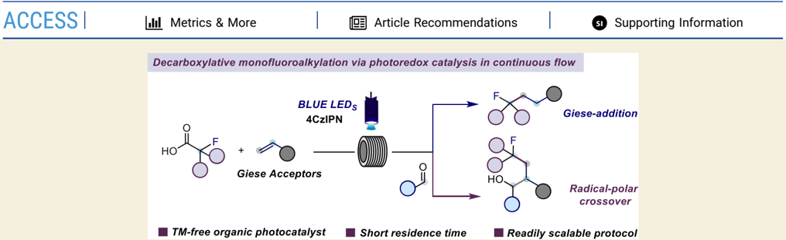
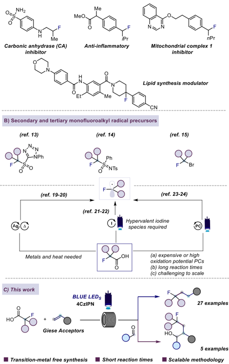
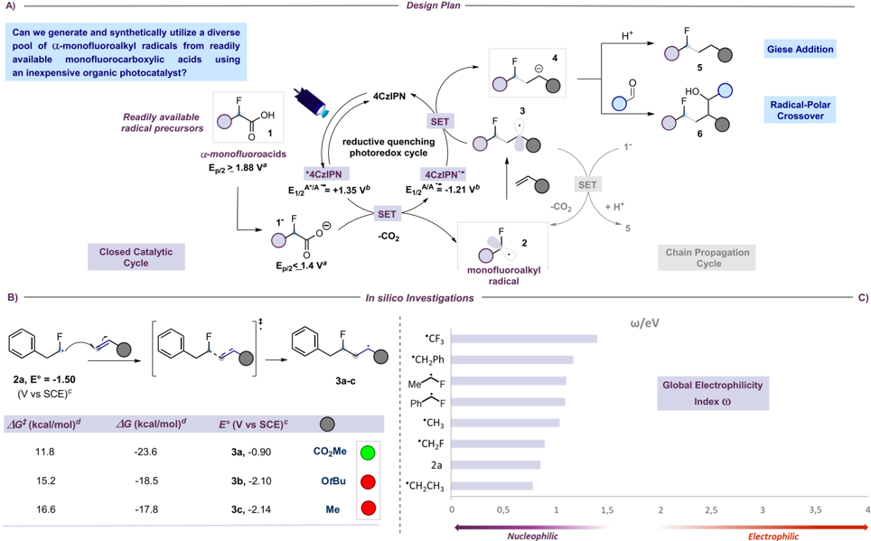
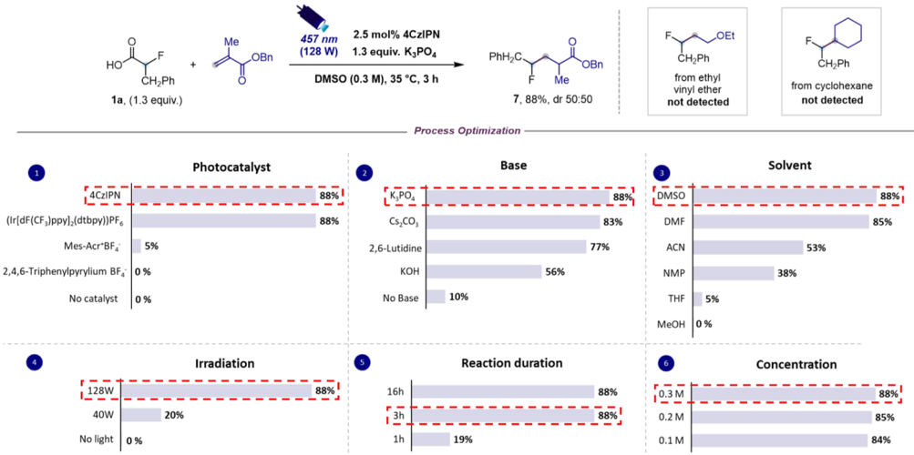
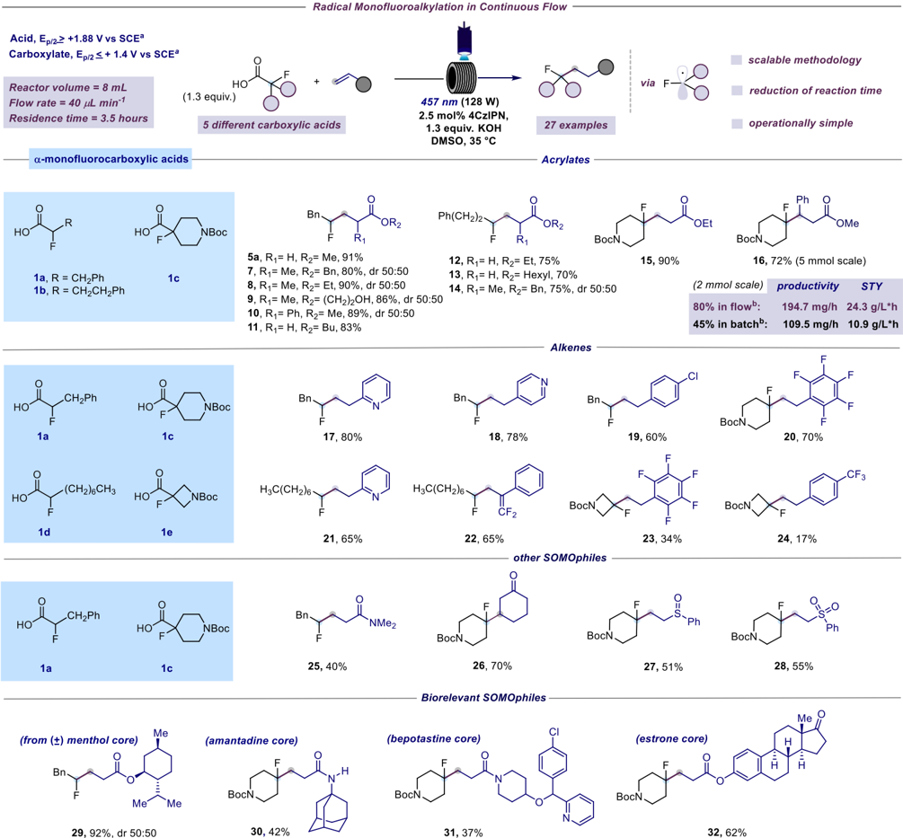
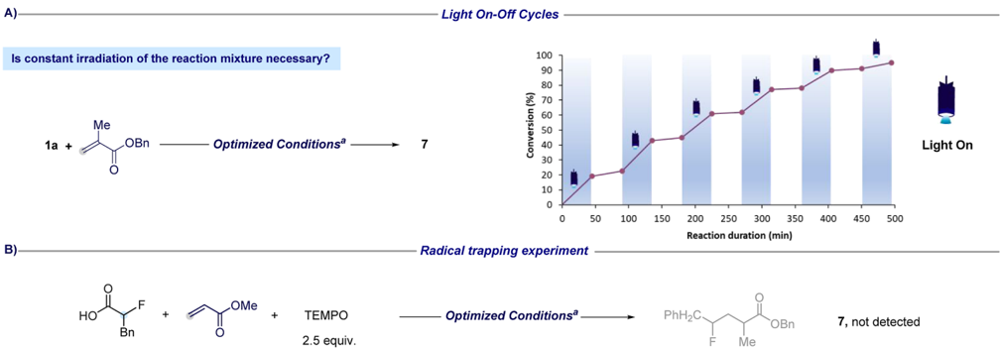
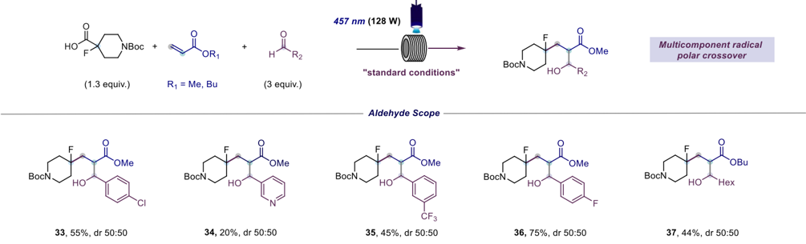

[pubs.acs.org/jacsau](pubs.acs.org/jacsau?ref=pdf)

## Continuous Flow Decarboxylative Monofluoroalkylation Enabled by Photoredox Catalysis

Francesco Pasca, § Yuri Gelato, § Michael Andresini, Defne Serbetci, Philipp Natho, Giuseppe Romanazzi, Leonardo Degennaro, Marco Colella, * and Renzo Luisi *

[Cite This: JACS Au 2025, 5, 684-692](https://pubs.acs.org/action/showCitFormats?doi=10.1021/jacsau.4c00902&ref=pdf)

ABSTRACT: Herein, we report a scalable and mild strategy for the monofluoroalkylation of a wide array of Giese acceptors via visible-light-mediated photoredox catalysis in continuous flow. The use of flow technology significantly enhances productivity and scalability, whereas mildness of conditions and functional group tolerance are ensured by leveraging 4CzIPN, a transition-metal-free organic photocatalyst. Structurally diverse secondary and tertiary monofluoroalkyl radicals can thus be accessed from readily available α -monofluorocarboxylic acids. Given the mild reaction conditions, this protocol is also amenable to the late-stage functionalization of biologically relevant molecules such as menthol, amantadine, bepotastine, and estrone derivatives, rendering it suitable for application to drug discovery programs, for which the introduction of fluorinated fragments is highly sought after. This method was also extended to enable a reductive multicomponent radical-polar crossover transformation to rapidly increase the complexity of the assembled fluorinated architectures in a single synthetic operation.

KEYWORDS:

monofluorocarboxylic acids, photocatalyst, Giese acceptors, fluoroalkylation

Twelve of the fifty-five drugs approved by the FDA in 2023 contain at least one fluorine atom. 1 This data is in line with the trend observed in the past decade, with approximately 20% of approved drugs being fluorinated. 2 Indeed, over the last two decades, there has been a consensus that the introduction of the fluorine atom into the parent molecule can lead to therapeutic benefits through the modulation of lipophilicity, bioavailability, and metabolic stability. 3,4 Specifically, in recent years, the precise incorporation of fluoroalkyl groups has gained prominence as an effective tool to enhance the therapeutic profile of lead compounds (Scheme 1A). Among the various fluoroalkyl motifs, the installation of trifluoromethyl groups ( -CF3) represents the most investigated synthetic operation, 5 followed by difluoroalkylation ( -CF2R) 6 and perfluoroalkylation. 7 In contrast, strategies involving monofluoroalkylation ( -CFR2) with diverse and functionalgroup-containing alkyl chains are comparatively underexplored. Although some progress in monofluoroalkylation in the radical domain has been made 8 using halides, 9 sulfones, 10 sulfonyl halides, 11 and sulfinate salts, 12 the lack of suitable commercially or readily available starting materials often limits the structural

diversity of accessible α -monofluorinated carbon-centered radicals. Indeed, most of these strategies are focused on monofluoromethylation, and only scarce examples of more complex monofluoroalkylation using sulfones, 13 sulfoximines, 14 and halides 15 have been reported (Scheme 1B). The need for a mild and scalable method for the selective introduction of structurally complex monofluorinated alkylfragments is thus imperative.

In this context, α -monofluorocarboxylic acids, readily available either commercially or from abundant precursors such as α -hydroxycarboxylic acids, 16 amino acids, 17 and others, 18 serve as an ideal platform for delivering a diverse pool of α -monofluoroalkyl radicals. The decarboxylation of α -

Received:

October 3, 2024

Revised:

December 5, 2024

Accepted:

December 5, 2024

Published:

February 2, 2025

Scheme 1. (A) Examples of APIs Containing Monofluoroalkyl Groups. (B) Selected Strategies for the Generation of Monofluoroalkyl Radicals. (C) This Work Presents a Straightforward Methodology for the Streamlined Generation of Monofluoroalkyl Radicals from Readily Available α -Monofluorocarboxylic Acids

monofluorocarboxylic acids has already been employed for this purpose. 19 -22 However, these methodologies typically rely on metal catalysts, heating, or strong oxidants (e.g., iodine(III) reagents) to promote the oxidative decarboxylation step, potentially limiting their application to late-stage introduction into structurally complex or sensitive structures. More recently, photocatalytic approaches have also been developed in this context. 23 -25 However, several of these strategies may face limited applicability due to the following factors: (i) the reliance on costly photocatalysts, such as iridium-based metal complexes or acridinium-based organic catalysts with high oxidation potentials, which can diminish functional group compatibility; (ii) the need for prolonged reaction times, often extending to 36 -48 h; and (iii) the use of batch processes, which hinder productivity and scalability, posing challenges for potential applications in the pharmaceutical industry, where direct synthetic strategies for monofluoroalkylation of lead compounds (Scheme 1, A) are in demand. Motivated by our interest in developing monofluoroalkylation methodologies 26 and our experience in refining photochemical processes in continuous flow, 27 we wanted to address the aforementioned limitations and hence develop a scalable, mild, and functionalgroup-tolerant hydromonofluoroalkylation of a diverse array of Giese acceptors under continuous flow conditions using α -monofluorocarboxylic acids as convenient monofluoroalkyl radical precursors (Scheme 1C). 28,29

## ■ DESIGN PLAN

When designing the desired monofluoroalkylation reaction, our aim was to avoid the use of expensive metal-based photocatalysts or photocatalysts with unnecessarily high oxidation potentials. Due to a lack of details concerning the generation of secondary and tertiary monofluoroalkyl radicals from α -monofluoro acids, we conducted cyclic voltammetry experiments and computational analyses to assess the viability of the synthetic strategy depicted in Scheme 2A. We began our investigations by examining the generation of monofluoroalkyl radical 2a from the corresponding 2-fluoro-3-phenylpropanoic acid 1a . Cyclic voltammetry analyses revealed that 2-fluoro-3phenylpropanoic acid in its carboxylate form 1a -is more easily oxidizable ( E 1/2 red = +1.40 V vs SCE) compared to di- and trifluorofluorocarboxylic acids reported in the literature. Based on this finding, we hypothesized that 1,2,3,5-tetrakis(carbazol9-yl)-4,6-dicyanobenzene (4CzIPN) (E1/2 A * /A ·-= +1.35 V versus SCE), an inexpensive and transition-metal-free organic photocatalyst, could be a competent mediator for the initial single-electron transfer (SET) oxidation event. 30 Specifically, irradiation of photocatalyst 4CzIPN with visible light leads to the formation of a long-lived ( τ p = 18.7 ns, τ d = 1390 ns) 31 excited state, * 4CzIPN (A * ), which can undergo reductive quenching in the presence of the carboxylate functionality, to generate the reduced photocatalyst 4CzIPN ·-( A ·-) and the carboxyl radical species, which would immediately extrude CO2 to furnish the monofluoroalkyl radical 2 . Calculations of the global electrophilicity index ( ω ) show a value of less than 1 eV, highlighting the nucleophilic character of monofluoroalkyl radical 2 (Scheme 2C) (vide infra). These radicals should therefore readily undergo Giese addition to SOMOphiles to forge a new C -C bond with the concomitant formation of radical 3 . The subsequent single-electron transfer reduction of the fluorinated radical 3 operated by 4CzIPN ·-( A ·-) (E1/2 A/A ·-= -1.21 V versus SCE) would deliver, upon protonation, the desired α -monofluoro alkylated product 5 while regenerating the photocatalyst. Alternatively, as described below, putative carbanion 4 can be intercepted by an external electrophile, such as a carbonyl compound, yielding fluorinated product 6 . Although this closed catalytic cycle seems plausible, the involvement of radical chain processes must be considered. Specifically, a single-electron transfer (SET) oxidation event promoted by radical 3 on 1 -, which is likely the most abundant species under basic conditions, could, in principle, deliver desired product 5 and monofluoroalkyl radical 2 after protonation and CO2-extrusion, respectively. However, we believe that this SET event is unlikely due to a potential mismatch (see below). Nonetheless, a chain mechanism (not shown in Scheme 2) involving 1 and radical 3 via hydrogen atom transfer (HAT) could operate in addition to the closed catalytic loop. To support the feasibility of the proposed catalytic cycle, we conducted a preliminary computational study of the Giese addition reaction (Scheme 2B). We used radical 2a as the model substrate and examined its addition to three different Giese acceptors: methyl acrylate, t -butyl vinyl ether, and propene. The results, obtained at the SMD-

ve gener.

of a-mc a-mo

ДG‡

Ep/:

able m

4G (

·CF3

*CH,Ph

Me~

Ph

·CH3

·CH2F

2a

*CH,CH3

w/ev

Global Electrophilicity

Index @

Scheme 2. Development of a Direct Decarboxylative Monofluoroalkylation Strategy. (A) Design Plan of the Methodology. (B) Computational Studies on the Addition of 2a to Unsaturated Acceptors. (C) Calculated Global Electrophilicity Indices ( ω ) (See the Supporting Information for Details)

0,5

(dimethyl sulfoxide (DMSO))ω B97X-D3/def2-TZVP// ω B97X-D3/def2-SVP level of theory, indicated that the addition reaction of radical 2a to these acceptors is an exergonic process ( Δ G ° between -17.8 and -23.6 kcal mol -1 ), with relatively low energy barriers ( Δ G ‡ ranging from 11.8 to 16.6 kcal mol -1 ), suggesting that these reactions are likely to occur at room temperature. However, the possibility of completing the proposed reaction cycle and thus sustaining the transformation to completion depends on a favorable match between the reduction potential of 4CzIPN ·-and those of the radical Giese adducts 3 . To this end, reduction potentials for adducts 3a -c were computed at the SMD(DMSO)-M06-2X/ma-def2-TZVP// ω B97X-D3/def2-SVP level and compared to the reported reduction potential of 4CzIPN ·-( -1.21 V vs SCE in MeCN). The results suggested that only the redox process between adduct 3a and 4CzIPN ·-is thermodynamically favorable, corresponding to a cell potential of +0.31 V ( Δ G ° = -7.1 kcal mol -1 ). Interestingly, the reduction potential obtained for radical 2a is -1.50 V versus SCE, close to the value reported for 4CzIPN ·-. This implies that, in principle, the side reaction involving the direct reduction of the fluorinated radical, resulting in the release of the corresponding fluoroalkane, represents a possible competitive reaction pathway. However, during this study, the corresponding fluoroalkane was observed only in some reaction crudes and in small amounts (&lt;10%).

## ■ RESULTS AND DISCUSSION

Encouraged by these initial investigations, we began our study by analyzing the coupling between 1a and benzyl methacrylate as the model reaction. Following an extensive optimization (see the Supporting Information for the full exploration of optimization experiments) under batch conditions, we identified optimal conditions for this monofluoroalkylation strategy. We were delighted to find that the inexpensive 4CzIPN photocatalyst possesses the appropriate redox potential properties to mediate this transformation, avoiding the use of expensive metal-based and strongly oxidizing photocatalysts (Table 1, chart 1). Furthermore, the reaction proceeds smoothly with both organic and inorganic bases (Table 1, chart 2). Optimization experiments also revealed a notable solvent effect (Table 1, chart 3) as the desired fluorinated product 7 was obtained with low to moderate yield when using methanol (MeOH), tetrahydrofuran (THF), N -methyl-2-pyrrolidone (NMP), and acetonitrile (ACN) as reaction solvents. Notably, a considerable improvement in efficiency was achieved using dimethylformamide (DMF) or dimethyl sulfoxide (DMSO). It is worth noting that increasing the light source power from 40 to 128 W leads to a dramatic improvement in the reaction outcome, with the reaction time remaining constant (Table 1, chart 4). Furthermore, control experiments demonstrated that the reaction does not proceed

CH,Ph

457 nm

2.5 mol% 4CzIPN

(128 W)

1.3 equiv. K,PO4

DMSO (0.3 M), 35 °C, 3 h

Table 1. Optimization of Reaction Conditions in Batch a

(Ir[dF(CF2)ppy] (dtbpy))PF6

[Mes-Acr+BF i](https://pubs.acs.org/doi/10.1021/jacsau.4c00902?fig=tbl1&ref=pdf)

2,4,6-Triphenylpyrylium BF

[No catalyst](https://pubs.acs.org/doi/10.1021/jacsau.4c00902?fig=tbl1&ref=pdf)

Me

7, 88%, dr 50:50

OEt

CH2Ph from ethyl

vinyl ether not detected

CH,Ph from cyclohexane

not detected

in the absence of a photocatalyst, or visible light (Table 1, charts 1, 2, and 4). The study of reaction time showed that it is possible to achieve a complete conversion of the limiting unsaturated acceptor in 3 h (Table 1, chart 5). However, the reaction time changes depending on the used SOMOphile (see below). Finally, we observed that the concentration can be increased to 0.3 M without affecting the reaction yield (Table 1, chart 6). Then, we tested the coupling between 1a and nonactivated SOMOphiles, such as vinyl ethyl ether and cyclohexene, under optimized reaction conditions. As predicted by the computational investigations (Scheme 2B), no monofluoroalkylated products were observed in both cases, further supporting the nucleophilic nature of monofluoroalkyl radical 2a .

After identifying 4CzIPN as a suitable photocatalyst for this monofluoroalkylation strategy, we focused our attention on two subsequent objectives: (ii) accelerating the reaction rate and (iii) designing a scalable methodology. As anticipated above, we observed that extending the optimized reaction conditions to other Giese acceptors often required an extension of the reaction times to achieve satisfactory conversions. For instance, in the coupling reaction between 1a and 2-vinylpyridine in batch mode, extending the reaction time from 3 to 16 h resulted in an increase in yield from 47% to 70%. Furthermore, it is well established that scaling up photochemical processes under classical batch conditions is challenging. This is due to the limitations imposed by the Bouguer -Lambert -Beer law, which restricts the use of dimension enlargement to increase the productivity of a synthetic strategy. In addition, the inefficiency of irradiation when large batch reactors are used leads to longer reaction times to allow for greater conversion. However, such overirradiation of the reaction mixture can lead to increasing formation of byproducts, complicating the purification process. 33 Considering our experience in the field of flow technology, 34 we wondered whether it was possible to transfer this methodology to continuous flow microreactors. To pursue this objective, since the use of K3PO4 resulted in a heterogeneous mixture, it was crucial to find a base that was more soluble in the reaction solvent. Therefore, from our screening of bases (Table 1, chart 2), we identified 2,6-lutidine and potassium hydroxide (KOH) as potential alternatives to K3PO4. While 2,6-lutidine provided higher yields under batch conditions, this base is also more expensive (approximately 25 € mol -1 ) and could potentially reduce the efficiency of the purification process. 35 Therefore, we chose potassium hydroxide, which is more economical (approximately 1.6 € mol -1 ) and releases water upon completion of the process, easily removed during the workup. With this modification compared to the batch protocol, we tested the coupling of 2fluoro-3-phenylpropanoic acid 1a with 2-vinylpyridine, which in batch conditions requires longer reaction times to achieve satisfactory conversion (i.e., 16 h). To our delight, we observed that the process could be easily transferred to continuous flow while simultaneously reducing the residence time to 3.5 h, resulting in a significant improvement in process efficiency (Scheme 3, 17 , 80%). In the case of activated SOMOphiles, the residence time can be further shortened to 1.5 h. However, to ensure satisfactory conversion with various SOMOphiles, we opted for a residence time of 3.5 h. With optimized conditions in hand, we then sought to explore the generality of this continuous flow transformation with respect to both α -monofluorocarboxylic acids and Giese acceptors.

Preliminary cyclic voltammetry (see the Supporting Information for details) experiments were conducted to confirm the compatibility of four other ( 1b -e ) structurally diverse α -monofluorocarboxylic acids within the catalytic cycle outlined in Scheme 2A. In these investigations, we discovered that all of these monofluorocarboxylates exhibit an oxidation potential close to the value reported for 4CzIPN (E1/2 A * /A ·-= +1.35 V versus SCE), confirming the suitability for efficient single electron transfer in the initial oxidation event.

Me

OBn

Scheme 3. Photoredox Decarboxylative Monofluoroalkylation Strategy: α -Monofluorocarboxylic Acid and Giese Acceptor Scope. Isolated Yields Are Reported

a Oxidation potentials measured by cyclic voltammetry (see the Supporting Information for details). b The experiments were conducted on a 2 mmol scale, with a residence time of 3 h and a reaction time of 3 h for the flow and batch reactions, respectively.

Remarkably, tri-( 1a , b , c ) and tetrasubstituted ( 1d , e ) α -monofluorocarboxylic acids were found to be competent platforms for delivering a diverse pool of α -monofluoroalkyl radicals, which were effectively coupled with a wide variety of electron-deficient alkenes. As shown in Scheme 3, the addition of secondary and tertiary α -monofluoroalkyl radicals to acrylates proceeds smoothly, producing the corresponding alkyl fluorides in good to excellent yields ( 5a-16 , 70 -91% yield), even in the presence of a substituent at the β position ( 16 , 80% yield). Next, we turned our attention to various styrene derivatives as SOMOphiles ( 17 -24 , 17 -80% yield). Pentafluorostyrene was successfully coupled with the tertiary α -monofluoroalkyl radical 2c generated from 1-Boc-4-fluoro-4piperidinecarboxylic acid ( 20 , 70%), which exhibits a superior performance compared to its four-membered ring counterpart ( 23 , 34%). The addition of α -monofluoroalkyl radical 2d , bearing an aliphatic side chain, to 2-vinyl pyridines afforded the corresponding adduct 21 in a good yield (65%). The addition of this fluorinated radical to the α -(trifluoromethyl)styrene leads to the formation of gem-difluoroalkene 22 , resulting from a fluoride anion elimination after the reduction of the radical adduct of type 3 (see Scheme 2A). 36 Examining other classes of SOMOphiles, we were pleased to observe that our strategy could be extended to α , β -unsaturated carbonyl compounds, such as N , N -dimethylacrylamide and 2-cyclohexen-1-one ( 25 and 26 , 40% and 70% yield, respectively), and sulfur-based Giese-type acceptors, including vinyl sulfoxides ( 27 , 51% yield) and sulfones ( 28 , 55% yield). Next, to demonstrate the

Is constant irradiation of the reaction mixture necessary?

Light On-Off Cycles

100

Scheme 4. Mechanistic Investigations. (a) Radical Trapping Experiment. (b) Light On -Off Experiment

1a +

·

a Optimized batch conditions were used: benzyl methacrylate (1 equiv), 1a (1.3 equiv), K3PO4 (1.3 equiv), and 4CzIPN (2.5 mol %) in DMSO (0.3 M) as the solvent. The mixture was irradiated with 457 nm light (128 W).

Scheme 5. Photoredox-Catalyzed Three-Component Synthesis of Complex Fluorinated Structures via Multicomponent Radical-Polar Crossover in Continuous Flow

applicability of this monofluoroalkylation methodology in latestage functionalization, we sought to derivatize biologically relevant architectures ( 29 -32 ). Notably, we were able to introduce monofluoroalkylated fragments on menthol ( 29 , 92% yield), amantadine ( 30 , 42% yield), bepotastine ( 31 , 37% yield), and estrone ( 32 , 62% yield) derivatives with moderate to excellent yields. Next, the scalability of this monofluoroalkylation approach was demonstrated for the coupling between 1-Boc-4-fluoro-4-piperidinecarboxylic acid 1c and methyl cinnamate. Under batch conditions, when this reaction was run above 2 mmol scale, a significant drop in yield (45% yield) of the desired fluoroalkylated adduct 16 was observed, probably due to limited light penetration and nonuniform irradiation. By transitioning to continuous flow settings, the preparation of compound 16 could be scaled up to 5 mmol without a significant loss of reaction efficiency. Furthermore, the effectiveness of the flow protocol was demonstrated through the comparison of productivity and space-time yield (STY) in batch (109.5 mg h -1 and 10.9 g L -1 h -1 , respectively) and in flow (194.7 mg h -1 and 24.3 g L -1 h -1 , respectively). In line with our objective to develop a scalable methodology, space-time yields of additional examples were also compared for batch and flow ( 7 -14 , see the Supporting Information for details). To our delight, the continuous flow method outperformed the batch method in all cases, leading generally to a doubling of the space-time yield, corroborating our target with regard to our method's scalability. Finally, we conducted a series of mechanistic studies to gather evidence supporting the design plan outlined in Scheme 2A (Scheme 4). We conducted an on -off experiment that involves evaluating the progress of the reaction in alternating periods of irradiation and darkness. Through this, we confirmed that a productive transformation requires constant irradiation of the reaction mixture, although this experiment does not exclude the possibility that a chain process could operate in addition to the closed catalytic cycle (Scheme 4A). The addition of a radical scavenger such as TEMPO (2,2,6,6-tetramethyl-1-piperidinyloxy) suppresses reactivity, confirming the radical nature of the transformation (Scheme 4B). However, it was not possible to detect the adduct between TEMPO and radical 2a through a HRMS analysis.

After assessing the synthetic applicability of this monofluoroalkylation protocol and collecting evidence regarding the proposed mechanism, we contemplate the possibility of designing a photoredox-catalyzed decarboxylative multicomponent radical polar crossover flow transformation to couple α -monofluorocarboxylic acids, Giese acceptors, and aldehydes to create complex fluorinated structures. Indeed, examining the catalytic cycle outlined in Scheme 2A, the fluorinated carboncentered radical 3 is reduced to the corresponding carbanions

BI

4 through a reductive single electron transfer (SET) event mediated by 4CzIPN ·-( A ·-), resulting in the desired fluorinated product 5 after protonation. However, as demonstrated by Boerth, the enolates generated after the reduction of the carbon-centered radical 3 , which originates from the conjugate addition of radical 2 to Michael acceptors, could alternatively participate in a multicomponent radical polar crossover-type reaction, acting as nucleophiles toward carbonyl electrophiles. 37 This multicomponent transformation would enable the creation of complex fluorinated architectures by the formation of multiple bonds in a single transformation. Attracted by this possibility, a mixture of 1-Boc-4-fluoro-4piperidinecarboxylic acid 1c and methyl acrylate, in the presence of an excess of 4-chlorobenzaldehyde, was irradiated through the continuous-flow photoreactor under optimized reaction conditions. Gratifyingly, the methodology enables the forging of two consecutive bonds across the α , β -unsaturated moiety within the methyl acrylate backbone, yielding 55% of fluorinated product 33 (Scheme 5). Excited by this result, we decided to extend this approach to other aromatic aldehydes. The use of 3-pyridinecarboxaldehyde ( 34 , 20%), 3(trifluoromethyl)benzaldehyde ( 35 , 45%), and 4-fluorobenzaldehyde ( 36 , 75%) returned the corresponding fluorinated adducts in moderate to good yields. Furthermore, an aliphatic aldehyde, such as heptanal, proved to be a competent electrophile for this transformation, providing 37 in 44% yield.

In conclusion, we report a visible-light-mediated continuousflow monofluoroalkylation methodology through the addition to Giese acceptors of α -monofluoro carbon-centered radicals, generated from α -monofluorocarboxylic acids as convenient and readily available precursors. Computational and experimental details enable the photocatalytic generation of monofluoroalkyl radicals using 4CzIPN as an inexpensive and transition-metal-free photocatalyst, surpassing the limitations of previously reported procedures. The microflow setup proved instrumental in accelerating the reaction rate and enabling efficient scale-up of this monofluoroalkylation tactic. The mild conditions of this photocatalytic monofluoroalkylation were showcased in the late-stage functionalization of biorelevant derivatives. Notably, we also demonstrated that fluorinated carbon-centered radicals could be involved in a three-component reductive radical-polar crossover reaction to achieve molecular complexity in a single synthetic operation. Given the particular benefits with regard to functional group tolerance and scalability, this protocol should prove beneficial for the pharmaceutical's interest in novel fluorinated entities in drug discovery programs by accessing hitherto undiscovered chemical and unpatented intellectual space.

## ■ METHODS

## General Procedure for Radical Monofluoroalkylation in Continuous Flow

To an oven-dried vial equipped with a stirring bar were added the α -fluoro acid (0.3 mmol, 1.3 equiv) and potassium hydroxide (0.3 mmol, 1.3 equiv). Upon complete solubilization, 4CzIPN (5.9 mg, 2.5 mol %), the SOMOphile (0.23 mmol, 1 equiv), and dry DMSO (1 mL) were added. Subsequently, the vial was sealed with a rubber septum, and the solution was sparged with N2 (1 min). The solution was loaded in a 1 mL poly(tetrafluoroethylene) loop connected to a coil reactor (8 mL) contained in a PhotoCube photoflow reactor equipped with a blue lamp ( λ = 457 nm, 128 W). The solution was pumped (0.04 mL/min) through the coil employing a syringe pump equipped with a gastight syringe containing dry DMSO (10 mL). The reaction mixture was collected after 180 min from the start for 23 min. The solution was diluted with 20 mL of AcOEt and transferred to a separatory funnel, where it was washed three times with 30 mL of brine. The organic extracts were combined, dried over Na2SO4, filtered, and concentrated in vacuo using a rotary evaporator. The crude reaction mixture was analyzed by 1 H NMR and purified by flash column chromatography on silica gel.

## ■ ASSOCIATED CONTENT

## * sı Supporting Information

The Supporting Information is available free of charge at https://pubs.acs.org/doi/10.1021/jacsau.4c00902.

Experimental procedures, optimization tables, characterization data ( 1 H, 13 C, and 19 F NMR and HRMS) for synthesized compounds, and further references provided by the authors (PDF)

## ■ AUTHOR INFORMATION

## Corresponding Authors

Marco Colella -Flow Chemistry and Microreactor Technology FLAME-Lab, Department of Pharmacy  Drug Sciences, University of Bari 'A. Moro', Bari 70125, Italy; orcid.org/0000-0001-7673-5335; Email: marco.colella@ uniba.it

Renzo Luisi -Flow Chemistry and Microreactor Technology FLAME-Lab, Department of Pharmacy  Drug Sciences, University of Bari 'A. Moro', Bari 70125, Italy;

orcid.org/0000-0002-9882-7908; Email: renzo.luisi@ uniba.it

## Authors

Francesco Pasca -Flow Chemistry and Microreactor Technology FLAME-Lab, Department of Pharmacy  Drug Sciences, University of Bari 'A. Moro', Bari 70125, Italy

Yuri Gelato -Flow Chemistry and Microreactor Technology FLAME-Lab, Department of Pharmacy  Drug Sciences, University of Bari 'A. Moro', Bari 70125, Italy

Michael Andresini -Flow Chemistry and Microreactor Technology FLAME-Lab, Department of Pharmacy  Drug Sciences, University of Bari 'A. Moro', Bari 70125, Italy; orcid.org/0000-0003-4523-8488

Defne Serbetci -Flow Chemistry and Microreactor Technology FLAME-Lab, Department of Pharmacy  Drug Sciences, University of Bari 'A. Moro', Bari 70125, Italy

Philipp Natho -Flow Chemistry and Microreactor Technology FLAME-Lab, Department of Pharmacy  Drug

Sciences, University of Bari 'A. Moro', Bari 70125, Italy Giuseppe Romanazzi -DICATECh, Politecnico di Bari, Bari 70125, Italy; orcid.org/0000-0001-5053-7883

Leonardo Degennaro -Flow Chemistry and Microreactor Technology FLAME-Lab, Department of Pharmacy  Drug Sciences, University of Bari 'A. Moro', Bari 70125, Italy; orcid.org/0000-0002-2187-9419

Complete contact information is available at: https://pubs.acs.org/10.1021/jacsau.4c00902

## Author Contributions

§ F.P. and Y.G. contributed equally. M.C. and R.L. designed the project. F.P., Y.G., and D.S. performed most of the experiments with input from P.N., L.D., M.C., and R.L. M.A. carried out the computational investigation. G.R. performed cyclic voltammetry analysis. R.L. was responsible for funding acquisition. All

authors contributed to the writing and editing of the manuscript. CRediT: Francesco Pasca data curation, formal analysis, investigation; Yuri Gelato data curation, formal analysis, investigation; Michael Andresini data curation, writing -original draft, investigation; Defne Serbetci data curation, investigation; Philipp Natho writing -review &amp; editing; Leonardo Degennaro writing -review &amp; editing; Marco Colella conceptualization, writing -original draft, writing -review &amp; editing; Renzo Luisi conceptualization, project administration, resources, supervision, writing - review &amp; editing.

## Notes

The authors declare no competing financial interest.

## ■ ACKNOWLEDGMENTS

The authors are grateful to Marco Muschitiello for experimental support. R.L., L.D., M.A., Y.G., F.P. acknowledge financial support from the European Commission  Horizon Europe Framework, project SusPharma grant agreement No. 101057430. P.N. acknowledges funding from the European Commission ′ s Horizon Europe research and innovation programme through a Marie Skłodowska-Curie Postdoctoral Fellowship 'ExpandFlow' (grant agreement No. 101106497). D.S. acknowledges funding from the European Commission ′ s Horizon Europe research and innovation programme through the Marie Skłodowska-Curie doctoral network 'GreenDigiPharma' (grant agreement No. 101073089). MC acknowledge the University of Bari for the project ERCSEEDSUNIBA 'FlashPhotoFlow', code: 2023-UNBACLE-0243177. The authors also acknowledge the CINECA award under the ISCRA initiative for the availability of high-performance computing resources and support.

## ■ REFERENCES

- (1) Ali, S.; Bolinger, A. A.; Zhou, J. Highlights on FluorineContaining Drugs Approved by U.S. FDA in 2023. Curr. Top. Med. Chem. 2024 , 24 , 843 -849.
- (2) Sheikhi, N.; Bahraminejad, M.; Saeedi, M.; Mirfazli, S. S. A Review: FDA-approved Fluorine-Containing Small Molecules from 2015 to 2022. Eur. J. Med. Chem. 2023 , 260 , 115758.

̃

- (3) Wang, J.; Sánchez-Roselló, M.; Acen a, J. L.; del Pozo, C.; Sorochinsky, A. E.; Fustero, S.; Soloshonok, V. A.; Liu, H. Fluorine in Pharmaceutical Industry: Fluorine-Containing Drugs Introduced to the Market in the Last Decade (2001 -2011). Chem. Rev. 2014 , 114 , 2432 -2506.
- (4) (a) Inoue, M.; Sumii, Y.; Shibata, N. Contribution of Organofluorine Compounds to Pharmaceuticals. ACS Omega 2020 ,
3. [5 , 10633 -10640. (b) Decaens, J.; Couve-Bonnaire, S.; Charette, A. of Fluoro-MonofluoromethylThree-Membered](https://doi.org/10.1002/chem.202003822)
4. B.; Poisson, T.; Jubault, P. Synthesis Difluoromethyl-and Trifluoromethyl-Substituted Rings. Chem.  Eur. J. 2020 , 27 , 2935 -2962.
- (5) Some recent examples of trifluoromethylation under photochemical conditions are listed below: (a) Xue, J.; Li, Y.; Liu, Y.; Li, Q.; Wang, H. Site-Specific Deaminative Trifluoromethylation of Aliphatic Primary Amines. Angew. Chem., Int. Ed. 2024 , 63 , No. e202319030. (b) Cong, F.; Mega, R. S.; Chen, J.; Day, C. S.; Martin, R. Trifluoromethylation of Carbonyl and Unactivated Olefin Derivatives by C(sp 3 ) -C Bond Cleavage. Angew. Chem., Int. Ed. 2022 , 62 (15), No. e202214633. (c) Sarver, P. J.; Bacauanu, V.; Schultz, D. M.; DiRocco, D. A.; Lam, Y.; Sherer, E. C.; MacMillan, D. W. C. The Merger of Decatungstate and Copper Catalysis to Enable Aliphatic C(sp 3 ) -H Trifluoromethylation. Nat. Chem. 2020 , 12 , 459 -467.
- (6) Some recent examples of difluoromethylation under photochemical conditions are listed below: (a) Yue, W.-J.; Day, C. S.; Brenes Rucinski, A. J.; Martin, R. Catalytic Hydrodifluoroalkylation of
7. Unactivated Olefins. Org. Lett. 2022 , 24 , 5109 -5114. (b) Duan, Y.; Xu, Y.; Li, Y.; Mao, L.; Feng, J.; Zhang, R.; Tang, W.; Lu, T.; Chen, Y.; Feng, J. Photochemical Selective Difluoroalkylation Reactions of Bicyclobutanes: Direct Sustainable Pathways to Functionalized Bioisosteres for Drug Discovery. Green Chem. 2024 , 26 , 5512 -5518. (c) Mao, E.; Prieto Kullmer, C. N.; Sakai, H. A.; MacMillan, D. W. C. Direct Bioisostere Replacement Enabled by Metallaphotoredox Deoxydifluoromethylation. J. Am. Chem. Soc. 2024 , 146 , 5067 -5073. (d) Zubkov, M. O.; Kosobokov, M. D.; Levin, V. V.; Kokorekin, V. A.; Korlyukov, A. A.; Hu, J.; Dilman, A. D. A Novel Photoredox-Active Group for the Generation of Fluorinated Radicals from Difluorostyrenes. Chem. Sci. 2020 , 11 , 737 -741.
- (7) Some recent examples of perfluoroalkylation under photochemical conditions are listed below: (a) Longobardo, F.; Gentile, G.; Criado, A.; Actis, A.; Colussi, S.; Dal Santo, V.; Chiesa, M.; Filippini, G.; Fornasiero, P.; Prato, M.; Melchionna, M. Tailored Amorphization of Graphitic Carbon Nitride Triggers Superior Photocatalytic C -C Coupling Towards the Synthesis of Perfluoroalkyl Derivatives. Mater. Chem. Front. 2021 , 5 , 7267 -7275. (b) Balletti, M.; Wachsmuth, T.; Di Sabato, A.; Hartley, W. C.; Melchiorre, P. Enantioselective Catalytic Remote Perfluoroalkylation of α -Branched Enals Driven by Light. Chem. Sci. 2023 , 14 , 4923 -4927. (c) Baguia, H.; Beaudelot, J.; Moucheron, C.; Evano, G. Photoinduced CopperCatalysed Direct Perfluoroalkylation of Heteroarenes. Chem. Commun. 2022 , 58 , 9080 -9083. (d) Filippini, G.; Longobardo, F.; Forster, L.; Criado, A.; Di Carmine, G.; Nasi, L.; D'Agostino, C.; Melchionna, M.; Fornasiero, P.; Prato, M. Light-Driven, Heterogeneous Organocatalysts for C -C Bond Formation Toward Valuable Perfluoroalkylated Intermediates. Sci. Adv. 2020 , 6 , No. eabc9923.
- (8) Fernandes, A. J.; Giri, R.; Houk, K. N.; Katayev, D. Review and Theoretical Analysis of Fluorinated Radicals in Direct CAr -H Functionalization of (Hetero)Arenes. Angew. Chem., Int. Ed. 2024 , 63 , No. e202318377.
- (9) (a) Deneny, P. J.; Kumar, R.; Gaunt, M. J. Visible LightMediated Radical Fluoromethylation via Halogen Atom Transfer Activation of Fluoroiodomethane. Chem. Sci. 2021 , 12 , 12812 -12818. (b) Hell, S. M.; Meyer, C. F.; Ortalli, S.; Sap, J. B. I.; Chen, X.; Gouverneur, V. Hydrofluoromethylation of Alkenes with Fluoroiodomethane and Beyond. Chem. Sci. 2021 , 12 , 12149 -12155.
- (10) Rong, J.; Deng, L.; Tan, P.; Ni, C.; Gu, Y.; Hu, J. Radical Fluoroalkylation of Isocyanides with Fluorinated Sulfones by VisibleLight Photoredox Catalysis. Angew. Chem., Int. Ed. 2016 , 55 , 2743 -2747.
- (11) [Tang, X.; Dolbier, W. R., Jr. Efficient Cu-catalyzed Atom Transfer Radical Addition Reactions of Fluoroalkylsulfonyl Chlorides with Electron-deficient Alkenes Induced by Visible Light. Angew. Chem., Int. Ed. 2015 , 54 , 4246 -4249.](https://doi.org/10.1002/anie.201412199)
- (12) Fujiwara, Y.; Dixon, J. A.; O'Hara, F.; Funder, E. D.; Dixon, D. D.; Rodriguez, R. A.; Baxter, R. D.; Herlé, B.; Sach, N.; Collins, M. R.; Ishihara, Y.; Baran, P. S. Practical and Innate Carbon -Hydrogen Functionalization of Heterocycles. Nature 2012 , 492 , 95 -99.
- (13) Merchant, R. R.; Edwards, J. T.; Qin, T.; Kruszyk, M. M.; Bi, C.; Che, G.; Bao, D.-H.; Qiao, W.; Sun, L.; Collins, M. R.; Fadeyi, O. O.; Gallego, G. M.; Mousseau, J. J.; Nuhant, P.; Baran, P. S. Modular Radical Cross-Coupling with Sulfones Enables Access to sp 3 -rich (fluoro)alkylated scaffolds. Science 2018 , 360 , 75 -80.
- (14) Taniguchi, R.; Noto, N.; Tanaka, S.; Takahashi, K.; Sarkar, S. K.; Oyama, R.; Abe, M.; Koike, T.; Akita, M. Simple Generation of Various α -Monofluoroalkyl Radicals by Organic Photoredox Catalysis: Modular Synthesis of β -Monofluoroketones. Chem. Commun. 2021 , 57 , 2609 -2612.
- (15) Han, J.; Han, J.; Chen, S.; Zhong, T.; He, Y.; Yang, X.; Wang, G.; Zhu, C.; Xie, J. Photoinduced Manganese-Catalysed Hydrofluorocarbofunctionalization of Alkenes. Nat. Synth. 2022 , 1 , 475 -486.
- (16) Cantrell, G. L.; Filler, R. Further Studies on the Synthesis of α -Fluoro Carbonyl Compounds. J. Fluorine Chem. 1985 , 27 , 35 -45.
- (17) Tanasova, M.; Yang, Q.; Olmsted, C. C.; Vasileiou, C.; Li, X.; Anyika, M.; Borhan, B. An Unusual Conformation of α -Haloamides

Due to Cooperative Binding with Zincated Porphyrins. Eur. J. Org Chem. 2009 , 2009 , 4242 -4253.

- (18) (a) Wang, Z.; Guo, C.-Y.; Yang, C.; Chen, J.-P. Ag-Catalyzed Chemoselective Decarboxylative Mono- and gem-Difluorination of Malonic Acid Derivatives. J. Am. Chem. Soc. 2019 , 141 , 5617 -5622.
2. (b) Rozen, S.; Hagooly, A.; Harduf, R. Synthesis of α -Fluorocarboxylates from the Corresponding Acids Using Acetyl Hypofluorite. J. Org. Chem. 2001 , 66 , 7464 -7468.
- (19) Mizuta, S.; Stenhagen, I. S. R.; O'Duill, M.; Wolstenhulme, J.; Kirjavainen, A. K.; Forsback, S. J.; Tredwell, M.; Sandford, G.; Moore, P. R.; Huiban, M.; Luthra, S. K.; Passchier, J.; Solin, O.; Gouverneur, V. Catalytic Decarboxylative Fluorination for the Synthesis of Tri- and Difluoromethyl Arenes. Org. Lett. 2013 , 15 , 2648 -2651.
- (20) Guo, C.; Liu, Z.; Li, X.; Han, X.; Li, Y.; Liu, H.; Zhang, L.; Li, X.; Dong, Y. Silver-Catalyzed Monofluoroalkylation of Heteroarenes with α -Fluorocarboxylic Acids: an Insight into the Solvent Effect. Chem. Commun. 2022 , 58 , 1147 -1150.
- (21) Guo, C.; Han, X.; Feng, Y.; Liu, Z.; Li, Y.; Liu, H.; Zhang, L.; Dong, Y.; Li, X. Straightforward Synthesis of Alkyl Fluorides via Visible-Light-Induced Hydromonoand Difluoroalkylations of Alkenes with α -Fluoro Carboxylic Acids. J. Org. Chem. 2022 , 87 , 9232 -9241.
- (22) Ramkumar, N.; Baumane, L.; Zacs, D.; Veliks, J. Merging Copper(I) Photoredox Catalysis and Iodine(III) Chemistry for the Oxy-Monofluoromethylation of Alkenes. Angew. Chem., Int. Ed. 2023 , 62 , No. e202219027.
- (23) Wang, H.; Liu, C.-F.; Song, Z.; Yuan, M.; Ho, Y. A.; Gutierrez, O.; Koh, M. J. Engaging α -Fluorocarboxylic Acids Directly in Decarboxylative C -C Bond Formation. ACS Catal. 2020 , 10 , 4451 -4459.

́

- (24) Gutiérrez-Bonet, A. .; Liu, W. Synthesis of Alkyl Fluorides and Fluorinated Unnatural Amino Acids via Photochemical Decarboxylation of α -Fluorinated Carboxylic Acids. Org. Lett. 2023 , 25 , 483 -487.
- (25) Bian, K.-J.; Lu, Y.-C.; Nemoto, D., Jr.; Kao, S.-C.; Chen, X.; West, J. G. Photocatalytic Hydrofluoroalkylation of Alkenes with Carboxylic Acids. Nat. Chem. 2023 , 15 , 1683 -1692.
- (26) (a) Parisi, G.; Colella, M.; Monticelli, S.; Romanazzi, G.; Holzer, W.; Langer, T.; Degennaro, L.; Pace, V.; Luisi, R. Exploiting a 'Beast' in Carbenoid Chemistry: Development of a Straightforward Direct Nucleophilic Fluoromethylation Strategy. J. Am. Chem. Soc. 2017 , 139 , 13648 -13651. (b) Monticelli, S.; Colella, M.; Pillari, V.; Tota, A.; Langer, T.; Holzer, W.; Degennaro, L.; Luisi, R.; Pace, V. Modular and Chemoselective Strategy for the Direct Access to α -Fluoroepoxides and Aziridines via the Addition of Fluoroiodomethyllithium to Carbonyl-Like Compounds. Org. Lett. 2019 , 21 , 584 -588. (c) Colella, M.; Tota, A.; Großjohann, A.; Carlucci, C.; Aramini, A.; Sheikh, N. S.; Degennaro, L.; Luisi, R. Straightforward Chemoand Stereoselective Fluorocyclopropanation of Allylic Alcohols: Exploiting the Electrophilic Nature of the not so Elusive Fluoroiodomethyllithium. Chem. Commun. 2019 , 55 , 8430 -8433. (d) Colella, M.; Tota, A.; Takahashi, Y.; Higuma, R.; Ishikawa, S.; Degennaro, L.; Luisi, R.; Nagaki, A. Fluoro-Substituted Methyllithium Chemistry: External Quenching Method Using Flow Microreactors. Angew. Chem., Int. Ed. 2020 , 59 , 10924 -10928. (e) Spennacchio, M.; Colella, M.; Andresini, M.; Dibenedetto, R. S.; Graziano, E.; Aramini, A.; Degennaro, L.; Luisi, R. Unlocking Geminal Fluorohaloalkanes in Nucleophilic Fluoroalkylation Chemistry: Generation and Trapping of Lithiumfluorocarbenoids Enabled by Flow Microreactors. Chem. Commun. 2023 , 59 , 1373 -1376. (f) Colella, M.; Musci, P.; Carlucci, C.; Lillini, S.; Tomassetti, M.; Aramini, A.; Degennaro, L.; Luisi, R. 1,3-Dibromo-1,1-Difluoro-2-Propanone as a Useful Synthon for a Chemoselective Preparation of 4-Bromodifluoromethyl Thiazoles. ACS Omega 2018 , 3 , 14841 -14848.
- (27) (a) Colella, M.; Gelato, Y.; Andresini, M.; Graziano, E.; Vilé, G.; Degennaro, L.; Luisi, R. Forging C -S Bonds on the Azetidine Ring by Continuous Flow Photochemical Addition of Thiols and Disulfides to Azetines. Eur. J. Org Chem. 2023 , 26 , No. e202300413. (b) Pasca, F.; Gelato, Y.; Andresini, M.; Romanazzi, G.; Degennaro,
5. L.; Colella, M.; Luisi, R. Synthesis of Alcohols: Streamlined C1 to Cn Hydroxyalkylation through Photoredox Catalysis. Chem. Sci. 2024 , 15 , 11337 -11346.
- (28) For a review on direct decarboxylative Giese reactions, see: Kitcatt, D. M.; Nicolle, S.; Lee, A.-L. Direct Decarboxylative Giese Reactions. Chem. Soc. Rev. 2022 , 51 , 1415 -1453.
- (29) For recent examples on decarboxylative carbon-carbon couplings, see: (a) Bonciolini, S.; Pulcinella, A.; Leone, M.; Schiroli, D.; Ruiz, A. L.; Sorato, A.; Dubois, M. A. J.; Gopalakrishnan, R.; Masson, G.; Della Ca, N.; Protti, S.; Fagnoni, M.; Zysman-Colman, E.; Johansson, M.; Noël, T. Metal-Free Photocatalytic CrossElectrophile Coupling Enables C1 Homologation and Alkylation of Carboxylic Acids with Aldehydes. Nat. Commun. 2024 , 15 , 1509. (b) Nsouli, R.; Nayak, S.; Balakrishnan, V.; Lin, J.-Y.; Chi, B. K.; Ford, H. G.; Tran, A. V.; Guzei, I. A.; Bacsa, J.; Armada, N. R.; Zenov, F.; Weix, D. J.; Ackerman-Biegasiewicz, L. K. G. Decarboxylative CrossCoupling Enabled by Fe and Ni Metallaphotoredox Catalysis. J. Am. Chem. Soc. 2024 , 146 , 29551 -29559. (c) Lukas, F.; Findlay, M. T.; Fillols, M.; Templ, J.; Savino, E.; Martin, B.; Allmendinger, S.; Furegati, M.; Noël, T. Graphitic Carbon Nitride as a Photocatalyst for Decarboxylative C(Sp 2 ) -C(Sp 3 ) Couplings via Nickel Catalysis. Angew. Chem., Int. Ed. 2024 , 63 , No. e202405902.
- (30) Shang, T.-Y.; Lu, L.-H.; Cao, Z.; Liu, Y.; He, W.-M.; Yu, B. Recent Advances of 1,2,3,5-Tetrakis(carbazol-9-yl)-4,6-dicyanobenzene (4CzIPN) in Photocatalytic Transformations. Chem. Commun. 2019 , 55 , 5408 -5419.
- (31) τ p and τ d refer to the prompt and delayed fluorescence lifetimes, respectively Ishimatsu, R.; Matsunami, S.; Shizu, K.; Adachi, C.; Nakano, K.; Imato, T. Solvent Effect on Thermally Activated Delayed Fluorescence by 1,2,3,5-Tetrakis(carbazol-9-yl)-4,6-dicyanobenzene. J. Phys. Chem. A 2013 , 117 , 5607 -5612.
- (32) Uoyama, H.; Goushi, K.; Shizu, K.; Nomura, H.; Adachi, C. Highly Efficient Organic Light-Emitting Diodes from Delayed Fluorescence. Nature 2012 , 492 , 234 -238.
- (33) (a) Cambié, D.; Bottecchia, C.; Straathof, N. J. W.; Hessel, V.; Noël, T. Applications of Continuous-Flow Photochemistry in Organic Synthesis, Material Science, and Water Treatment. Chem. Rev. 2016 , 116 , 10276 -10341. (b) Zondag, S. D. A.; Mazzarella, D.; Noël, T. Scale-Up of Photochemical Reactions: Transitioning from Lab Scale to Industrial Production. Annu. Rev. Chem. Biomol. Eng. 2023 , 14 , 283 -300. (c) Donnelly, K.; Baumann, M. Scalability of Photochemical Reactions in Continuous Flow Mode. J. Flow Chem. 2021 , 11 , 223 -241.
- (34) (a) Andresini, M.; Colella, M.; Dibenedetto, R. S.; Graziano, E.; Romanazzi, G.; Aramini, A.; Degennaro, L.; Luisi, R. Sustainable Continuous Flow Synthesis of β -Aminocarbonyls via Acid-Catalyzed Hydration of N-Boc-2-azetines. React. Chem. Eng. 2023 , 8 , 3203 -3209. (b) Graziano, E.; Cannillo, D.; Spennacchio, M.; Musci, P.; Pisano, L.; Andresini, M.; Colella, M. A Sustainable and Chemoselective Continuous Flow Hydrogenation of Functionalized 2Azetines to Azetidines. Tetrahedron Green Chem. 2023 , 1 , 100003. (c) Natho, P.; Colella, M.; Andresini, M.; Degennaro, L.; Luisi, R. Taming 3-Oxetanyllithium Using Continuous Flow Technology. Org. Lett. 2024 , 26 , 3032 -3036.
- (35) The prices reported for 2,6-lutidine and potassium hydroxide (KOH) are based on the largest packages available from Tokyo Chemical Industry (TCI) and Carlo Erba, respectively.
- (36) Lu, X.; Wang, X.-X.; Gong, T.-J.; Pi, J.-J.; He, S.-J.; Fu, Y. Nickel-Catalyzed Allylic Defluorinative Alkylation of Trifluoromethyl Alkenes with Reductive Decarboxylation of Redox-Active Esters. Chem. Sci. 2019 , 10 , 809 -814.
- (37) [Venditto, N. J.; Boerth, J. A. Photoredox-Catalyzed Multicomponent Synthesis of Functionalized γ -Amino Butyric Acids via Reductive Radical Polar Crossover. Org. Lett. 2023 , 25 , 3429 -3434.](https://doi.org/10.1021/acs.orglett.3c00991?urlappend=%3Fref%3DPDF&jav=VoR&rel=cite-as)