and Xuanhui Ouyans

CC

-OMe

BY

NH

Received: 30 April 20

Rouicod· 97 Mou 902!

Metal-Free

Cyclization

Photoredox of

Intramolecular

## Metal-Free Photoredox Intramolecular Cyclization of N-Aryl Acrylamides Acrylamides Zhaosheng Liu 1 , Xiaochen Ji 1 , Feng Zhao 2, *, Guojun Deng 1,3 and Huawen Huang 1,3, *

Article

Zhaosheng Liu 1 , Xiaochen Ji 1 , Feng Zhao 2, *, Guojun Deng 1,3 and Huawen Huang 1,3, *

1

Key

Key for

of

Organic

Synthesis

Green

Environmentally

Friendly and

Application

Chemistry and

N-Aryl of

Education,

Province, of

Hunan

Application of

Ministry

Laboratory

Laboratory

- 1 Key Laboratory for Green Organic Synthesis and Application of Hunan Province, Key Laboratory of Environmentally Friendly Chemistry and Application of Ministry of Education, College of Chemistry, Xiangtan University, Xiangtan 411105, China College of Chemistry, Xiangtan University, Xiangtan 411105, China; 15197267785@163.com (Z.L.); xcji@xtu.edu.cn (X.J.); gjdeng@xtu.edu.cn (G.D.) 2 Hunan Provincial Key Laboratory for Synthetic Biology of Traditional Chinese Medicine,
- 2 Hunan Provincial Key Laboratory for Synthetic Biology of Traditional Chinese Medicine, School of Pharmaceutical Sciences, Hunan University of Medicine, Huaihua 418000, China School of Pharmaceutical Sciences, Hunan University of Medicine, Huaihua 418000, China 3 School of Chemistry and Chemical Engineering, Henan Normal University, Xinxiang 453007,

China

- 3 School of Chemistry and Chemical Engineering, Henan Normal University, Xinxiang 453007, China * Correspondence: zhaofenghnmu@163.com (F.Z.); hwhuang@xtu.edu.cn (H.H.)
* Correspondence: zhaofenghnmu@163.com (F.Z.); hwhuang@xtu.edu.cn (H.H.)

Abstract:

novel

A

metal-free photoredox-catalyzed

cyclization reaction

of

N

-aryl acrylamide

is

Abstract: Anovel metal-free photoredox-catalyzed cyclization reaction of N -aryl acrylamide is herein reported that provides synthetically valuable oxindole derivatives through the bis-mediation of H2 O and aldehyde. In this work, sustainable visible light was used as the energy source, and the organic light-emitting molecule 4CzIPN served as the efficient photocatalyst. The main characteristics of this reaction are environmentally friendly and high yields. herein reported that provides synthetically valuable oxindole derivatives through the bis-mediation of H2O and aldehyde. In this work, sustainable visible light was used as the energy source, and the organic light-emitting molecule 4CzIPN served as the efficient photocatalyst. The main characteristics of this reaction are environmentally friendly and high yields.

Keywords:

visible-light hydroarylation;

cyclization;

radical oxindoles;

Keywords: radical cyclization; hydroarylation; oxindoles; visible-light

1.

Introduction

Oxindole is a highly important skeleton that widely exists in biologically active compounds such as naturally occurring products [1] and drugs [2]. Specifically, oxindole compounds represent an important class of drugs with antibiotic, anticancer, antiviral, and other activities [3-5]. For example, ubrogepant [6], a drug for the treatment of migraine, contains a 3-cyclopentyl spiro-7-azaoxindole core. Rhynchophylline [7], which inhibits the activity of peripheral vascular contraction, could reduce vascular resistance and blood pressure and have the effect of anti-platelet aggregation and anti-thrombus (Figure 1). Oxindole is a highly important skeleton that widely exists in biologically active compounds such as naturally occurring products [1] and drugs [2]. Specifically, oxindole compounds represent an important class of drugs with antibiotic, anticancer, antiviral, and other activities [3-5]. For example, ubrogepant [6] , a drug for the treatment of migraine, contains a 3-cyclopentyl spiro-7-azaoxindole core. Rhynchophylline [7], which inhibits the activity of peripheral vascular contraction, could reduce vascular resistance and blood pressure and have the effect of anti-platelet aggregation and anti-thrombus (Figure 1).

## 1. Introduction

Figure 1. Bioactive molecules containing the oxindole motif. Figure 1. Bioactive molecules containing the oxindole motif.

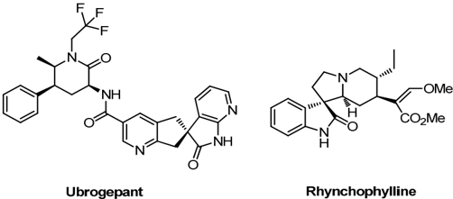

Citation:

Deng,

F.;

Liu,

Z.;

Ji,

X.;

Zhao,

Huang,

Metal-free

H.

G.;

toredox

Intramolecular

Cyclization of

N-Aryl

Acrylamides.

13

x.

,

https://doi.org/10.3390/xxxxx

Citation: Liu, Z.; Ji, X.; Zhao, F.; Deng, G.; Huang, H. Metal-Free Photoredox Intramolecular Cyclization of N-Aryl Acrylamides. Catalysts 2023 , 13 , 1007. https:// doi.org/10.3390/catal13061007 Academic Editors : Renjie Song and Xuanhui Ouyang Received: 30 April 2023 Revised: 27 May 2023

Accepted:

12

June

2023

Academic Editors: Renjie Song and Xuanhui Ouyang Published: 14 June 2023

Received: 30 April 2023 Revised: 27 May 2023 Accepted: 12 June 2023 Published: 14 June 2023 Copyright: © 2023 by Licensee MDPI, Basel, This article is an open

the authors.

Switzerland.

access distributed

article under

the terms

and

Creative

Commons

Copyright: © 2023 by the authors. Licensee MDPI, Basel, Switzerland. This article is an open access article distributed under the terms and conditions of the Creative Commons Attribution (CC BY) license (https:// creativecommons.org/licenses/by/ 4.0/). Attribution (CC BY) license (https://creativecommons.org/license s/by/4.0/).

Because of the pharmaceutical significance of oxindoles [8-10], the construction of this motif has attracted considerable attention among synthetic chemists [11-13]. In the past few years, many functional groups have been installed successfully to oxindoles through the treatment of NBS [14], AgSCN [15], 2,4-pentanedione [16], and AIBN [17]. However, these strategies required stoichiometric amounts of functionalized reagents, high metal catalyst loading, strong oxidant and elevated temperature for high reaction Because of the pharmaceutical significance of oxindoles [8-10], the construction of this motif has attracted considerable attention among synthetic chemists [11-13]. In the past few years, many functional groups have been installed successfully to oxindoles through the treatment of NBS [14], AgSCN [15], 2,4-pentanedione [16], and AIBN [17]. However, these strategies required stoichiometric amounts of functionalized reagents, high metal catalyst loading, strong oxidant and elevated temperature for high reaction efficiency. On the other hand, as one of the most attractive topics in organic chemistry, hydroarylation process has drawn interest of chemists in the past decades [18-24]. Recently, Pan and our group [25,26] independently reported a visible-light-induced hydrocyclization of unactivated alkenes

Catalysts

2023

,

13

,

x.

https://doi.org/10.3390/xxxxx www.mdpi.com/journal/catalysts

Pho-

R2

R1

(c) This work

N

R2

Rз

PCET

4CzIPN (3.0 mol%)

H20 (0.4 mL)

Decanal (1 equiv)

toluene, rt, Ar, 48 h

35 W blue LED

R

Rз

efficiency.

On the

hydroarylation other

process cently,

Pan and

cyclization of

hand, as

one has

drawn our

group

[25,26]

unactivated of

the most

attractive interest

of chemists

independently alkenes

which topics

in the

reported generated

the in

organic chemistry,

past decades

[18-24].

a

visible-light-induced polycyclic

hydro- quinazolinones.

(Figure which generated the polycyclic quinazolinones. (Figure 2a). Photochemical radical addition and cyclization of N -arylacrylamide provide reliable access to a range of functionalized oxindoles [27-37]. Alternatively, our group reported visible light-induced photocatalytic systems for intramolecular hydroarylation of N -arylacrylamide by proton-coupled electron transfer (PCET) process [38] and energy transfer [39] (Figure 2b). However, this reaction requires the addition of strong acids and chlorobenzene as reaction solvent, which limits the substrate scope and further synthetic application. Inspired by these cyclizations of alkene studies, we envision an acid-free visible-light-mediated photocyclization strategy from N -aryl acrylamide to access oxindole skeletons. (Figure 2c). In our recent findings of redoxneutral radical addition and cyclization of N -arylacrylamides with benzaldehydes [40], aliphatic aldehydes did not proceed through the coupling, probably because of the higher reductive potential of them than aromatic aldehydes [41]. Instead, the hydroarylation oxindole product was accessed in moderate yield when pivalaldehyde was exploited in this system. This result encouraged us to explore an acid-free hydroarylation process of N-aryl acrylamide, which was herein reported. 2a). Photochemical radical addition and cyclization of N -arylacrylamide provide reliable access to a range of functionalized oxindoles [27-37]. Alternatively, our group reported visible light-induced photocatalytic systems for intramolecular hydroarylation of N -arylacrylamide by proton-coupled electron transfer (PCET) process [38] and energy transfer [39] (Figure 2b) . However, this reaction requires the addition of strong acids and chlorobenzene as reaction solvent, which limits the substrate scope and further synthetic application. Inspired by these cyclizations of alkene studies, we envision an acid-free visiblelight-mediated photocyclization strategy from N -aryl acrylamide to access oxindole skeletons. (Figure 2c). In our recent findings of redox-neutral radical addition and cyclization of N -arylacrylamides with benzaldehydes [40], aliphatic aldehydes did not proceed through the coupling, probably because of the higher reductive potential of them than aromatic aldehydes [41]. Instead, the hydroarylation oxindole product was accessed in moderate yield when pivalaldehyde was exploited in this system. This result encouraged us to explore an acid-free hydroarylation process of N-aryl acrylamide, which was herein reported.

Figure 2. Cyclization and hydroarylation methods. Figure 2. Cyclization and hydroarylation methods.

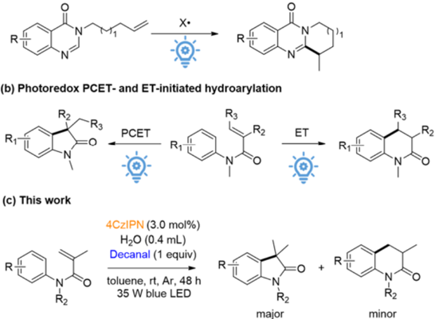

## 2. Results and Discussion 2. Results and Discussion

Therefore, the optimization studies were performed by selecting N -methlyN -phenylmethacrylamide ( 1a ) as the standard reactant. Initially, when the cyclization reaction was performed using 4CzIPN as photocatalyst (PC) along with decanal as additive in water/toluene mixed solvent under a 36 W blue LED at argon atmosphere (Table 1, entry 1), the desired product 2a was obtained in 80% yield. Then, this reaction was independently conducted in the absence of light irradiation (Table 1, entry 2, 0%), water (Table 1, entry 3, yield 17%), PC (Table 1, entry 4, 0%) and aldehydes (Table 1, entry 5, 0%). These control experiments demonstrated the critical role of visible light, photocatalyst and aldehyde and the promotional effect of H2O. We next moved on to screen photocatalysts include Rose bengal (Table 1, entry 6), Mes2AcrtBu2BF4 (Table 1, entry 7), Xanthone (Table 1, entry 8), and 9-Fluorenone (Table 1, entry 9), and found that those PCs were all ineffective. However, neutral Eosin Y showed also a good efficiency (Table 1, entry 10, yield 73%). Other solvents such as THF, DMF, EtOAc, NMP and CH3CN (Table 1, entry 11-16) were Therefore, the optimization studies were performed by selecting N -methlyN -phenylmethacrylamide ( 1a ) as the standard reactant. Initially, when the cyclization reaction was performed using 4CzIPN as photocatalyst (PC) along with decanal as additive in water/toluene mixed solvent under a 36 W blue LED at argon atmosphere (Table 1, entry 1), the desired product 2a was obtained in 80% yield. Then, this reaction was independently conducted in the absence of light irradiation (Table 1, entry 2, 0%), water (Table 1, entry 3, yield 17%), PC (Table 1, entry 4, 0%) and aldehydes (Table 1, entry 5, 0%). These control experiments demonstrated the critical role of visible light, photocatalyst and aldehyde and the promotional effect of H2O. We next moved on to screen photocatalysts include Rose bengal (Table 1, entry 6), Mes2AcrtBu2BF4 (Table 1, entry 7), Xanthone (Table 1, entry 8), and 9-Fluorenone (Table 1, entry 9), and found that those PCs were all ineffective. However, neutral Eosin Y showed also a good efficiency (Table 1, entry 10, yield 73%). Other solvents such as THF, DMF, EtOAc, NMP and CH3CN (Table 1, entry 11-16) were investigated, all of which showed inferior results as compared with toluene. PhCl (Table 1, entry 17) and o -Xylene (Table 1, entry 18) showed moderate yields (65% and 70% yields, respectively). Furthermore, the screening of other aldehyde additives such as 3-phenylpropanal, propionaldehyde, cyclohexanecarbaldehyde, pivalaldehyde, and glutaraldehyde, afforded the cyclization product with slightly reduced yields (Table 1,

2a

PC (3.0 mol%)

H20 (0.4 mL)

additive (1 equiv)

1a

За

35 W blue LED

solvent, rt, Ar, 48 h

CHO

ОНС

aldehyde-1

CHO

aldehyde-4

aldehyde-5

n conditions: 1a (35

CHO

mol, 1 equiv), photocatalyst (0.00€

aldehyde-2

aldehyde-3

5 mg, 0.2 mmol), additive (0.2

Decanal respectively).

Furthermore, nylpropanal,

nylpropanal, propionaldehyde,

dehyde, the

propionaldehyde, dehyde,

afforded

23).

Finally, ucts,

of aldehyde

other screening

cyclohexanecarbaldehyde, afforded

23).

the

Finally, ucts,

with the

cyclization decreasing

cyclization decreasing

with

Table

Table

1.

cyclohexanecarbaldehyde, product

the with

photocatalyst significant

amounts pivalaldehyde,

additives such

pivalaldehyde, product

the with

slightly photocatalyst

significant amounts

Optimization

Optimization slightly

loading of

of of

loading of

remained remained

1a

1a

Reaction

Reaction

Conditions to

2

to

2

reduced mol%

(Table reduced

mol%

(Table

a

.

1.

Conditions

.

a

entries 19-23). Finally, decreasing the photocatalyst loading to 2 mol% resulted in 60% yield of products, with significant amounts of 1a remained (Table 1, entry 24). Entry PC Additive Solvent Yield of 2a (%) b 1 4CzIPN Decanal toluene 80 Entry PC Additive Solvent Yield of 2a (%) b 1 4CzIPN Decanal toluene 80

Table 1. Optimization of Reaction Conditions a . 2 c 4CzIPN Decanal 3 d 4CzIPN Decanal 2 c 4CzIPN Decanal d

toluene toluene

toluene toluene

NR

NR

17

17

3

4CzIPN

Decanal a Reaction conditions: 1a (35 mg, 0.2 mmol), additive (0.2 mmol, 1 equiv), photocatalyst (0.006 mmol), H2O (0.4 mL), solvent (1 mL), under Ar atmosphere, using 35 W blue LED. b Isolated yield of 2a was given, and regioselective ratio of 2a / 3a was more than 25/1 in all cases in this table. c In dark. d No water. e 4CzIPN (2 mol%, 0.004 mmol) was used. a Reaction conditions: 1a (35 mg, 0.2 mmol), additive (0.2 mmol, 1 equiv), photocatalyst (0.006 mmol), H2O (0.4 mL), solvent (1 mL), under Ar atmosphere, using 35 W blue LED. b Isolated yield of 2a was given, and regioselective ratio of 2a / 3a was more than 25/1 in all cases in this table. c In dark. d No water. e 4CzIPN (2 mol%, 0.004 mmol) was used. a Reaction conditions: 1a (35 mg, 0.2 mmol), additive (0.2 mmol, 1 equiv), photocatalyst (0.006 mmol), H2O (0.4 mL), solvent (1 mL), under Ar atmosphere, using 35 W blue LED. b Isolated yield of 2a was given, and regioselective ratio of 2a / 3a was more than 25/1 in all cases in this table. c In dark. d No water. e 4CzIPN (2 mol%, 0.004 mmol) was used.

| Entry - -                             | PC                                                  | Additive Decanal Decanal              | Solvent toluene toluene               | Yield of 2a (%) b NR NR               | Yield of 2a (%) b NR NR               | Yield of 2a (%) b NR NR               | Yield of 2a (%) b NR NR               | Yield of 2a (%) b NR NR               | Yield of 2a (%) b NR NR               | Yield of 2a (%) b NR NR               |
|---------------------------------------|-----------------------------------------------------|---------------------------------------|---------------------------------------|---------------------------------------|---------------------------------------|---------------------------------------|---------------------------------------|---------------------------------------|---------------------------------------|---------------------------------------|
| 1 4CzIPN 4CzIPN                       | 4CzIPN                                              | Decanal                               | toluene toluene toluene               | 80 NR NR                              | 80 NR NR                              | 80 NR NR                              | 80 NR NR                              | 80 NR NR                              | 80 NR NR                              | 80 NR NR                              |
| 2 c Rose Rose                         | 4CzIPN bengal bengal                                | Decanal Decanal Decanal               | toluene toluene toluene               | NR NR NR                              | NR NR NR                              | NR NR NR                              | NR NR NR                              | NR NR NR                              | NR NR NR                              | NR NR NR                              |
| 3 d Mes 2 AcrtBu Mes                  | 4CzIPN 2 PF 6 PF                                    | Decanal Decanal Decanal               | toluene toluene toluene               | 17 NR                                 | 17 NR                                 | 17 NR                                 | 17 NR                                 | 17 NR                                 | 17 NR                                 | 17 NR                                 |
| 4 Xanthone 2 AcrtBu                   | - 2 6                                               | Decanal Decanal                       | toluene toluene                       | NR NR NR                              | NR NR NR                              | NR NR NR                              | NR NR NR                              | NR NR NR                              | NR NR NR                              | NR NR NR                              |
| 5 Xanthone                            | 4CzIPN                                              | - Decanal                             | toluene toluene                       | NR NR                                 | NR NR                                 | NR NR                                 | NR NR                                 | NR NR                                 | NR NR                                 | NR NR                                 |
| 6                                     | Rose bengal 9-Fluorenone 9-Fluorenone               | Decanal Decanal Decanal               | toluene toluene toluene               | NR NR NR                              | NR NR NR                              | NR NR NR                              | NR NR NR                              | NR NR NR                              | NR NR NR                              | NR NR NR                              |
| 7                                     | Mes 2 AcrtBu 2 PF 6 Eosin Y Decanal Eosin Y Decanal | Decanal                               | toluene toluene toluene               | NR 73 73                              | NR 73 73                              | NR 73 73                              | NR 73 73                              | NR 73 73                              | NR 73 73                              | NR 73 73                              |
| 8                                     | Xanthone                                            | Decanal Decanal Decanal               | toluene THF THF                       | NR NR NR                              | NR NR NR                              | NR NR NR                              | NR NR NR                              | NR NR NR                              | NR NR NR                              | NR NR NR                              |
| 9                                     | 9-Fluorenone 4CzIPN 4CzIPN 4CzIPN 4CzIPN            | Decanal Decanal                       | toluene DMF                           | NR NR                                 | NR NR                                 | NR NR                                 | NR NR                                 | NR NR                                 | NR NR                                 | NR NR                                 |
| 10                                    | Eosin Y                                             | Decanal Decanal                       | toluene EtOAc DMF                     | 73 NR                                 | 73 NR                                 | 73 NR                                 | 73 NR                                 | 73 NR                                 | 73 NR                                 | 73 NR                                 |
| 11 4CzIPN 4CzIPN                      | 4CzIPN                                              | Decanal Decanal Decanal               | THF EtOAc                             | NR NR NR                              | NR NR NR                              | NR NR NR                              | NR NR NR                              | NR NR NR                              | NR NR NR                              | NR NR NR                              |
| 12 4CzIPN 4CzIPN                      | 4CzIPN                                              | Decanal Decanal Decanal               | DMF DCE                               | NR NR NR                              | NR NR NR                              | NR NR NR                              | NR NR NR                              | NR NR NR                              | NR NR NR                              | NR NR NR                              |
| 13 4CzIPN 4CzIPN                      | 4CzIPN                                              | Decanal Decanal Decanal               | EtOAc NMP DCE NMP                     | NR NR NR                              | NR NR NR                              | NR NR NR                              | NR NR NR                              | NR NR NR                              | NR NR NR                              | NR NR NR                              |
| 14 4CzIPN                             | 4CzIPN                                              | Decanal Decanal                       | DCE CH 3 CN                           | NR NR                                 | NR NR                                 | NR NR                                 | NR NR                                 | NR NR                                 | NR NR                                 | NR NR                                 |
| 15 4CzIPN                             | 4CzIPN                                              | Decanal Decanal                       | NMP CH 3 CN                           | NR NR                                 | NR NR                                 | NR NR                                 | NR NR                                 | NR NR                                 | NR NR                                 | NR NR                                 |
| 16 4CzIPN 4CzIPN                      | 4CzIPN                                              | Decanal Decanal Decanal               | CH 3 CN PhCl PhCl                     | NR                                    | NR                                    | NR                                    | NR                                    | NR                                    | NR                                    | NR                                    |
| 17 4CzIPN 4CzIPN                      | 4CzIPN                                              | Decanal Decanal Decanal               | PhCl o-Xylene o-Xylene                | 65                                    | 65                                    | 65                                    | 65                                    | 65                                    | 65                                    | 65                                    |
| 18 4CzIPN 4CzIPN                      | 4CzIPN                                              | Decanal Aldehyde-1 Aldehyde-1         | o-Xylene toluene toluene              | 70                                    | 70                                    | 70                                    | 70                                    | 70                                    | 70                                    | 70                                    |
| 19 4CzIPN 4CzIPN                      | 4CzIPN                                              | Aldehyde-1 Aldehyde-2                 | toluene toluene                       | 40                                    | 40                                    | 40                                    | 40                                    | 40                                    | 40                                    | 40                                    |
| 20 4CzIPN                             | 4CzIPN                                              | Aldehyde-2 Aldehyde-3 Aldehyde-2      | toluene toluene toluene               | 67                                    | 67                                    | 67                                    | 67                                    | 67                                    | 67                                    | 67                                    |
| 21 4CzIPN                             | 4CzIPN                                              | Aldehyde-3 Aldehyde-3                 | toluene toluene                       | 33                                    | 33                                    | 33                                    | 33                                    | 33                                    | 33                                    | 33                                    |
| 22 4CzIPN 4CzIPN                      | 4CzIPN                                              | Aldehyde-4 Aldehyde-4 Aldehyde-4      | toluene toluene toluene               | 57                                    | 57                                    | 57                                    | 57                                    | 57                                    | 57                                    | 57                                    |
| 23 4CzIPN 4CzIPN                      | 4CzIPN                                              | Aldehyde-5 Aldehyde-5 Aldehyde-5      | toluene toluene toluene               | 61                                    | 61                                    | 61                                    | 61                                    | 61                                    | 61                                    | 61                                    |
| 24 e 4CzIPN 4CzIPN                    | 4CzIPN                                              | Decanal                               | toluene                               | 60                                    | 60                                    | 60                                    | 60                                    | 60                                    | 60                                    | 60                                    |
| Decanal toluene 60 Decanal toluene 60 | Decanal toluene 60 Decanal toluene 60               | Decanal toluene 60 Decanal toluene 60 | Decanal toluene 60 Decanal toluene 60 | Decanal toluene 60 Decanal toluene 60 | Decanal toluene 60 Decanal toluene 60 | Decanal toluene 60 Decanal toluene 60 | Decanal toluene 60 Decanal toluene 60 | Decanal toluene 60 Decanal toluene 60 | Decanal toluene 60 Decanal toluene 60 | Decanal toluene 60 Decanal toluene 60 |

With the optimized reaction condition in hand, we next explored the substrate scope of the photocyclization reaction of N -arylacrylamides (Figure 3). Generally, a broad range of N -arylacrylamides with various functional groups were subjected and found compatible with this system. The halo-substituted N -methylN -phenylmethacrylamides were carried out with the photochemical reaction, leading to the corresponding halo-substituted With the optimized reaction condition in hand, we next explored the substrate scope of the photocyclization reaction of N -arylacrylamides (Figure 3). Generally, a broad range of N -arylacrylamides with various functional groups were subjected and found compatible with this system. The halo-substituted N -methylN -phenylmethacrylamides were carried out with the photochemical reaction, leading to the corresponding halo-substituted With the optimized reaction condition in hand, we next explored the substrate scope of the photocyclization reaction of N -arylacrylamides (Figure 3). Generally, a broad range of N -arylacrylamides with various functional groups were subjected and found compatible with this system. The halo-substituted N -methylN -phenylmethacrylamides were carried out with the photochemical reaction, leading to the corresponding halo-substituted (such as -Cl, -Br, -I) oxindoles in moderate yields (Figure 3, 2b , 2c , 2d , 35-45% yields), along with the formation of the dihydroquinolines in a trace amount. When alkyl groups such as methyl and tert-butyl were attached, the cyclization products were obtained in excellent yields (Figure 3, 2e-2h , yields 74-89%). As a comparison, para-, meta-, and ortho- substituted compounds were successfully tested and the position of these substituents had little impact on the yield. Notably, meta-substituted N -aryl acrylamide was viable under standard conditions to give the desired product with poor regioselectivity ( 2g ). Introducing a benzyl substituent in the α -position of acrylamides did not have obviously deleterious effects on the reaction yield ( 2i , 85% yield). The reactants with various N -protecting functional groups including phenyl, ethyl, isopropyl and cyclohexyl generated the corresponding yields

(Table resulted

1,

3-phe- as

and yields

(Table resulted

1, and

glutaral-

1, entries

in

60%

entry entry

24).

in

24).

glutaral-

1, entries

60%

yield

19-

19- of

of prod-

prod- yield

2e 89% (4.5:1)

RZ

2a 80% (→25:1)

Ph

2j 75% (&gt;25:1)

2f 82% (2.6:1)

2b 45% (8.8:1)

Bn

20 83% (→25:1)

21 88*

2g 76% (≥25:1, C2:C6=2:1) 2h 74% (≥25:1)

2k 70% (≥25:1)

Ph

21 88% (&gt;25:1)

2m 78% (&gt;25:1)

3t 83% (→25:1)

2p 72% (&gt;25:1)

Figure 3. Substrate scope o a11natratoa c11cn

Rocalico of tho cline

2q 65% (&gt;25:1)

2r 73% (≥25:1)

scope of photocyclization of N-arylacrylamides.

such as methyl and tert-butyl were attached, the cyclization products were obtaine excellent yields (Figure 3,

2e-2h

, yields 74-89%). As a comparison, para-, meta-, an tho- substituted compounds were successfully tested and the position of these subs

ents had little impact on the yield. Notably, meta-substituted

N

-aryl acrylamide was ble under standard conditions to give the desired product with poor regioselectivity

Introducing a benzyl substituent in the

α

deleterious effects on the reaction yield (

-position of acrylamides did not have obvio

2i

, 85% yield). The reactants with various

N

-

tecting functional groups including phenyl, ethyl, isopropyl and cyclohexyl generate products in generally good yields ( 2j , 90% yield, 2l , 82% yield, 2m , 78% yield, 2o , 83% yield). The benzyl protective group ( 2k ) is well tolerated with 70% yield, which could be converted to NH oxindole by debenzylation. In addition, the reaction was extended to phenyl ether, leading to 2n in a modest yield. Then, the reaction systems were found to tolerate the substrate attached with drug molecule such as naproxen ( 2p , 72% yield). Cyclic and diaryl N -acylamines were exploited to smoothly produce the polycyclic products ( 2q-2s ) and N -aryl oxindoles ( 2q ) with yield ranging from 65% to 73%. While our 4CzIPN/decanal catalytic system enabled exclusive 5-exo-trig selectivity for most of the above reactants, N -methylN -arylcinnamamides ( 1t ) afforded the corresponding 4-arylquinolinone as the major product ( 3t , 83%). When the reactants contain strong electron-absorbing groups and partial non-terminal alkenyl, the reaction cannot be performed effectively (See Supplementary Materials for details). corresponding products in generally good yields ( 2j ,  90% yield, 2l , 82% yield, 2m , yield, 2o , 83% yield). The benzyl protective group ( 2k ) is well tolerated with 70% y which could be converted to NH oxindole by debenzylation. In addition, the reaction extended to phenyl ether, leading to 2n in a modest yield. Then, the reaction systems found to tolerate the substrate attached with drug molecule such as naproxen ( 2p , yield). Cyclic and diaryl N -acylamines were exploited to smoothly produce the polyc products ( 2q-2s ) and N -aryl oxindoles ( 2q ) with yield ranging from 65% to 73%. our 4CzIPN/decanal catalytic system enabled exclusive 5-exo-trig selectivity for mo the above reactants, N -methylN -arylcinnamamides ( 1t ) afforded the corresponding ylquinolinone as the major product ( 3t , 83%). When the reactants contain strong elect absorbing groups and partial non-terminal alkenyl, the reaction cannot be performe fectively (See Supplementary Materials for details).

Figure 3. Substrate scope of photocyclization of N Figure 3. Substrate scope of photocyclization of N -arylacrylamides.

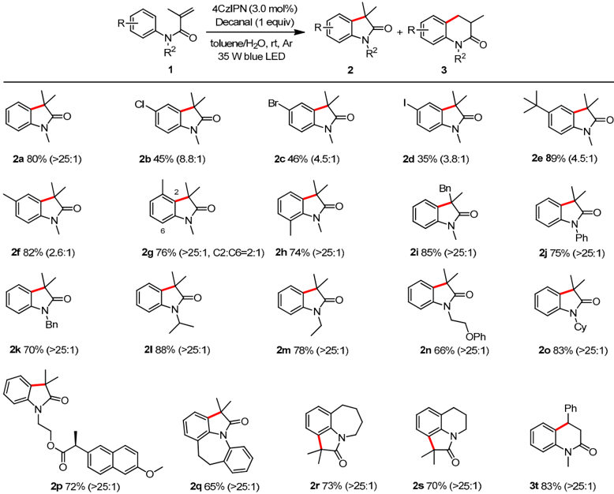

-arylacrylamides.

Because of the superior electrocyclization reactivity, the π -extension substrates as biphenyl acrylamide ( 1u ) and N -(4-methoxyphenyl)N -methylmethacrylamide ( 1v to the formation of 3,4-dihydroquinolinones as the major products in the current sys Because of the superior electrocyclization reactivity, the π -extension substrates such as biphenyl acrylamide ( 1u ) and N -(4-methoxyphenyl)N -methylmethacrylamide ( 1v ) led to the formation of 3,4-dihydroquinolinones as the major products in the current systems ( 3u and 3v ). Besides, we changed the equivalent amounts of the decanal to explore the site-selectivity control for 6-endo-trig vs. 5-exo-trig cyclization of N -([1,1 ′ -biphenyl]-4-yl)N -methylmethacrylamide. While exclusive 6-endo-trig selectivity was observed in the absence of aldehyde additives, the 5-exo-trig cyclization process was enhanced when increasing the amount of decanal (Figure 4). The results indicate that the addition of aldehyde additives in the systems could alter the reaction pathways over 5-exo-trig cyclization.

Next, control experiments were conducted to gain mechanistic insights into the present aldehyde-promoted hydroarylation reaction (Scheme 1). The addition of the radical scavenger 2,2,6,6- tetramethylpiperidin-1-oxyl (TEMPO) or 1,1-diphenylethylene (DPE) to the standard conditions caused complete quenching in the yield of 2a (Scheme 1a). The H/D exchange experiments show that when D5-labeled N -acylaniline (D51a ) was used, no D incorporation of cyclized products was observed. Comparably, the addition of D2O led to 83%

4CzIPN (3.0 mol%)

Decanal (1 equiv)

toluene/H20, rt, Ar

35 W blue LED

2b 45°

Br

2g 76

2c 46% (4.5:1)

2

R2

+ R￾

R2

Ph\_

MeO

0.2 mmol

Ph-

4CzIPN (3.0 mol%)

H20 (0.4 mL)

Decanal (X equiv)

toluene, rt, Ar, 48 h

35 W blue LED

1u

0.2 mmol

MeO\_

4CzIPN (3.0 mol%)

H20 (0.4 mL)

Decanal (X equiv)

Catalysts

1v

, x FOR PEER REVIEW

2023

,

13

35 W blue LED

1v

0.2 mmol

0.2 mmol

Fieure 4 Comnetitive cv

(a) Radical inhibition experiments standard condition

additive (3.0 equiv)

1a

(b) H/D exchange experiments

D5 L

standard condition

D5-1a

N

1a

Catalysts

MeO.

standard condition

D20 (0.4 mL)

2023

,

13

,

x

FOR

D4

PEER

Ph

H20 (0.4 mL)

Decanal (X equiv)

toluene, rt, Ar, 48 h

35 W blue LED

4CzIPN (3.0 mol%)

H20 (0.4 mL)

incorporation of D into newly formed methyl groups (Scheme 1b), indicating the hydrogen in the reaction being derived from water. The control experiment with 3-phenylpropanal under the standard conditions within 24 h furnished the oxindole product 2a in 59% yield, along with the detection of both 3-phenylpropanoic acid and 3-phenylpropan-1-ol. This result suggests the by-product formation from aliphatic aldehyde. The Stern -Volmer quenching experiments indicate that while the acrylamide 1a had not fluorescence quenching effect, the decanal additive quenched slightly the fluorescence emission of excited 4CzIPN (KSV = 54.9, Scheme 1d). Our previous work had also demonstrated that the substrate 1v (KSV = 41.3) and 1t (KSV = 912.4) show also quenching effect, which could be attributed to energy transfer [36]. Finally, the results of the light on/off experiment showed that the present reaction was a continuous illumination reaction (See Supplementary Materials for details). 5  of  14 ( 3u and 3v ). Besides, we changed the equivalent amounts of the decanal to explore the site-selectivity control for 6-endo-trig vs. 5-exo-trig cyclization of N -([1,1 ′ -biphenyl]-4-yl)N -methylmethacrylamide. While exclusive 6-endo-trig selectivity was observed in the absence of aldehyde additives, the 5-exo-trig cyclization process was enhanced when increasing the amount of decanal (Figure 4). The results indicate that the addition of aldehyde additives in the systems could alter the reaction pathways over 5-exo-trig cyclization. 24 h 1a 2a, 59% both detected

TEMPO: 0%

DPE: 0%

D4-2a, 79%

2a, 70%

REVIEW

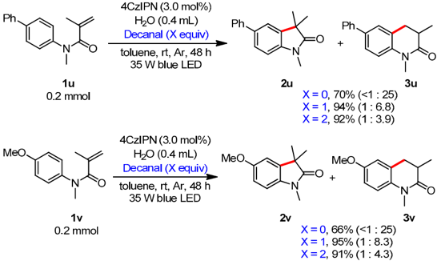

Figure 4. Competitive cyclization. Figure 4. Competitive cyclization.

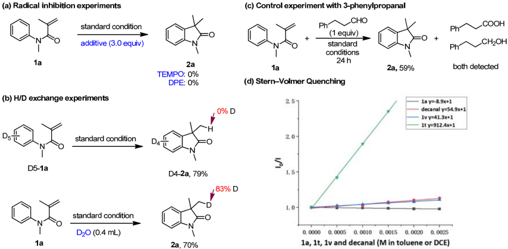

6

of

14

(Scheme 1a). The

) was used, no

2a had not fluo-

(KSV = 912.4) show also quenching effect, which ment showed that the present reaction was a continuous illumination reaction (See Sup-

plementary Materials for details). Scheme 1. Mechanistic studies. Scheme 1. Mechanistic studies.

On the basis of above results of mechanistic studies and previous reports, a possible reaction mechanism involving basically consecutive photoinduced electron transfer (ConPET) [40,42] was proposed (Scheme 2). The 4CzIPN photocatalyst absorbs photon to generate its excited state PC*, which oxidize the aldehydes to give PC anion radical and acyl radical A . The second irradiation of it occurs to afford the excited state of PC anion radical. This highly reductive species ( E red &lt; -2.9 V vs. SCE) [43] undergoes single electron transfer with acrylamide 1a ( E red = -2.45 V vs. SCE) with the assistance of proton to produce the On the basis of above results of mechanistic studies and previous reports, a possible reaction mechanism involving basically consecutive photoinduced electron transfer (ConPET) [40,42] was proposed (Scheme 2). The 4CzIPN photocatalyst absorbs photon to generate its excited state PC*, which oxidize the aldehydes to give PC anion radical and acyl radical A . The second irradiation of it occurs to afford the excited state of PC anion radical. This highly reductive species ( E red &lt; -2.9 V vs. SCE) [43] undergoes single electron transfer with acrylamide 1a ( E red = -2.45 V vs. SCE) with the assistance of proton radical

fer, species

B

.

The and

subsequent deprotonation

of

3-phenylpropanoic dization

intramolecular sequentially

acid of

acyl radical

proceed to

afford and

3-phenylpropan-1-ol radical

and two

cyclization, the

final can

electron reduction

of single

product be

2a electron

.

attributed aldehyde,

The to

the respectively.

trans- formation

further oxi-

We suspect

(d) Stern-Volmer Quenching

Ph zu

Ph\_

=0 +

X = 0, 70% (&lt;1: 25)

X = 1, 94% (1 : 6.8)

X = 2, 92% (1: 3.9)

N^

Зи

- e hv

· R-CHO

+ 2e", + 2H+

- e; + H20

2a

D

anism.

1a

- H+

B

=O

PC

RCO2H

RCH2OH

PC°*

hv

D

Scheme 2. Possible reaction mechanism.

a and Meth of

mechanistic of

On reaction

the basis

mechanism

PET)

[40,42]

erate above

results involving

was proposed

its excited

radical

A

state

.

The

This basically

studies consecutive

(Scheme

2).

The

PC*, second

highly with

which and

previous photoinduced

4CzIPN

oxidize irradiation

the of

species

E

(

red it

reports, electron

photocatalyst

a

possible transfer

absorbs aldehydes

occurs red

2.45

&lt;

V

-

2.9

to

V

to give

PC

afford the

vs.

vs.

SCE)

SCE)

[43]

with the

(Con- photon

anion excited

to radical

state undergoes

assistance of

gen- and

PC

anion single

of electron

proton to

transfer produce

the reductive

acrylamide

1a

(

E

=

-

to produce the radical species B . The subsequent intramolecular radical cyclization, single electron transfer, and deprotonation sequentially proceed to afford the final product 2a . The formation of 3-phenylpropanoic acid and 3-phenylpropan-1-ol can be attributed to the further oxidization of acyl radical and two electron reduction of aldehyde, respectively. We suspect that aliphatic aldehydes have higher reductive potential so that they are easier to be oxidized by the excited photocatalyst. radical species B . The subsequent intramolecular radical cyclization, single electron transfer, and deprotonation sequentially proceed to afford the final product 2a . The formation of 3-phenylpropanoic acid and 3-phenylpropan-1-ol can be attributed to the further oxidization of acyl radical and two electron reduction of aldehyde, respectively. We suspect that aliphatic aldehydes have higher reductive potential so that they are easier to be oxidized by the excited photocatalyst.

Scheme 2. Possible reaction mechanism. Scheme 2. Possible reaction mechanism.

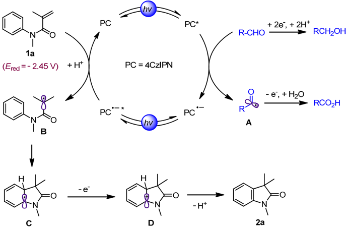

## 3. Materials and Methods

## 3.1. Materials and Chemicals

All reactions were carried out under an atmosphere of nitrogen unless otherwise noted. Colum chromatography was performed using silica gel (200-300 mesh) and thin layer chromatography was performed using silica gel (GF254). 1 H NMR and 13 C NMR spectra were recorded on Bruker-AV (400 and 100 MHz, respectively) instrument using CDCl3, acetone-d6 or dimethyl sulfoxide-d6 as solvent. Mass spectra were measured on Agilent 5975 GC-MS instrument (EI). High-resolution mass spectra (ESI) were obtained with the Thermo Scientific LTQ Orbitrap XL mass spectrometer. The structures of known compounds were further corroborated by comparing their 1 HNMR, 13 C NMR data and HRMS data with those of literature. Melting points were measured with a YUHUA X-5 melting point instrument and were uncorrected. Reagents were used as received or prepared in our laboratory.

## 3.2. General Procedure for Hydroarylation (Standard Conditions)

A 10 mL vial was charged with N -methlyN -phenylmethacrylamide (1a, 35 mg, 0.2 mmol), 4CzIPN (5 mg, 0.006 mmol), decanal (32 mg, 0.2 mmol), H2O (0.4 mL), toluene (1 mL). The atmosphere was exchanged by applying vacuum and backfilling with Ar (this process was conducted for three times). The resulting mixture was stirred at 2000 RPM for 48 h under irradiation with a 36 W blue LED. The crude reaction mixture was quenched with saturated sodium carbonate and extracted with ethyl acetate (3 × 20 mL). The extracts were combined, dried over sodium sulfate, filtered and the volatiles were removed under reduced pressure. The reaction yield was quantified by separation, and then column chromatography was performed using silica gel (200-300 mesh) or thin layer chromatography was performed using silica gel (GF254) to give product 2a .

acyl

n- 2(1n)-one (4.5

Br o standar

epared accordin rformed (PE/E

repared accordir erformed (PE/E

pared according

1H NMR (400 N

formed (PE/EA

\_ IH NMR (400

8117 11 22

· H NMR (400 MH

Catalysts

2023

Catalysts

,

2023

,

13

,

13

,

x

x

FOR

FOR

PEER

PEER

48

h

under with

irradiation sodium

saturated with

were carbonate

combined, dried

sodium saturated

were with

a

36

carbonate combined,

dried reduced

blue

W

and and

over pressure.

reduced chromatography

over pressure.

chromatography

The

LED.

extracted extracted

sodium sodium

The sulfate,

reaction was

sulfate, reaction

The crude

with with

ethyl reaction

filtered yield

ethyl filtered

yield was

was and

acetate the

quantified performed

using chromatography

performed was

using chromatography

using performed

was performed

was using

## 3.3. Characterization Data of Products 3.3. Characterization Data of Products 3.3. Characterization Data of Products

and mixture

acetate

(3

the quantified

(3

×

20

mL).

volatiles was

×

20

mL).

volatiles were

The extracts

were by

silica silica

quenched

The extracts

removed removed

separation, gel

silica by

separation, gel

silica

## 1,3,3-trimethylindolin-2-one (2a) 38 1,3,3-trimethylindolin-2-one (2a) 38 1,3,3-trimethylindolin-2-one (2a) 38

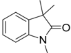

Prepared according to standard conditions. Purification by thin layer chromatography was performed (PE/EA: 6/1) to yield 2a (28 mg, 80%) as a colorless liquid. 1 H NMR (400 MHz, Chloroformd ) δ 7.29 -7.23 (m, 1H), 7.20 (d, J = 7.3 Hz, 1H), 7.06 (t, J = 7.5 Hz, 1H), 6.84 (d, J = 7.8 Hz, 1H), 3.21 (s, 3H), 1.37 (s, 6H). 13 C NMR (101 MHz, Chloroformd ) δ 181.4, 142.6, 135.8, 127.7, 122.5, 122.3, 108.0, 44.2, 26.23, 24.4. Prepared according to standard conditions. Purification by thin layer chromatography was performed (PE/EA: 6/1) to yield 2a (28 mg, 80%) as a colorless liquid. 1 H NMR (400 MHz, Chloroformd ) δ 7.29-7.23 (m, 1H), 7.20 (d, J = 7.3 Hz, 1H), 7.06 (t, J = 7.5 Hz, 1H), 6.84 (d, J = 7.8 Hz, 1H), 3.21 (s, 3H), 1.37 (s, 6H). 13 C NMR (101 MHz, Chloroformd ) δ 181.4, 142.6, 135.8, 127.7, 122.5, 122.3, 108.0, 44.2, 26.23, 24.4. Prepared according to standard conditions. Purification by thin layer chromatography was performed (PE/EA: 6/1) to yield 2a (28 mg, 80%) as a colorless liquid. 1 H NMR (400 MHz, Chloroformd ) δ 7.29 -7.23 (m, 1H), 7.20 (d, J = 7.3 Hz, 1H), 7.06 (t, J = 7.5 Hz, 1H), 6.84 (d, J = 7.8 Hz, 1H), 3.21 (s, 3H), 1.37 (s, 6H). 13 C NMR (101 MHz, Chloroformd ) δ 181.4, 142.6, 135.8, 127.7, 122.5, 122.3, 108.0, 44.2, 26.23, 24.4.

## 5-chloro-1,3,3-trimethylindolin-2-one (2b ) and 6-chloro-1,3-dimethyl-3,4-dihydroquinolin-2(1 H )-one (8.8:1) (3b) 38 5-chloro-1,3,3-trimethylindolin-2-one (2b ) and 6-chloro-1,3-dimethyl-3,4-dihydroquinolin-2(1 H )-one (8.8:1) (3b) 38 5-chloro-1,3,3-trimethylindolin-2-one (2b ) and 6-chloro-1,3-dimethyl-3,4-dihydroquinolin-2(1 H )-one (8.8:1) (3b) 38

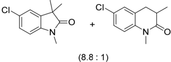

Prepared according to standard conditions. Purification by thin layer chromatography was performed (PE/EA: 6/1) to yield mixture of 2b and 3b (19 mg, 45%) as a colorless liquid. 1 H NMR (400 MHz, Chloroform-d) δ 7.23 (dd, J = 8.2, 2.1 Hz, 1H), 7.17 (d, J = 2.0 Hz, 1H), 6.76 (d, J = 8.2 Hz, 1H), 3.32 (s, 0.3H), 3.20 (s, 3H), 2.90 (dd, J = 14.1, 4.3 Hz, 0.16H), 2.76 -2.50 (m, 0.32H), 1.36 (s, 6H). 13 C NMR (101 MHz, Chloroformd ) δ 180.8, Prepared according to standard conditions. Purification by thin layer chromatography was performed (PE/EA: 6/1) to yield mixture of 2b and 3b (19 mg, 45%) as a colorless liquid. 1 H NMR (400 MHz, Chloroform-d) δ 7.23 (dd, J = 8.2, 2.1 Hz, 1H), 7.17 (d, J = 2.0 Hz, 1H), 6.76 (d, J = 8.2 Hz, 1H), 3.32 (s, 0.3H), 3.20 (s, 3H), 2.90 (dd, J = 14.1, 4.3 Hz, 0.16H), 2.76 -2.50 (m, 0.32H), 1.36 (s, 6H). 13 C NMR (101 MHz, Chloroformd ) δ 180.8, 141.2, 137.5, 127.9, 127.6, 122.9, 108.9, 44.5, 26.3, 24.3. Prepared according to standard conditions. Purification by thin layer chromatography was performed (PE/EA: 6/1) to yield mixture of 2b and 3b (19 mg, 45%) as a colorless liquid. 1 HNMR(400 MHz, Chloroform-d) δ 7.23 (dd, J = 8.2, 2.1 Hz, 1H), 7.17 (d, J = 2.0 Hz, 1H), 6.76 (d, J = 8.2 Hz, 1H), 3.32 (s, 0.3H), 3.20 (s, 3H), 2.90 (dd, J = 14.1, 4.3 Hz, 0.16H), 2.76-2.50 (m, 0.32H), 1.36 (s, 6H). 13 C NMR (101 MHz, Chloroformd ) δ 180.8, 141.2, 137.5, 127.9, 127.6, 122.9, 108.9, 44.5, 26.3, 24.3. REVIEW 8 of 14 REVIEW 8 of 14

141.2, 137.5, 127.9, 127.6, 122.9, 108.9, 44.5, 26.3, 24.3. 5-bromo-1,3,3-trimethylindolin-2-one (2c) and 6-bromo-1,3-dimethyl-3,4-dihydroquinolin-2(1 H )-one (4.5:1) (3c) 38 5-bromo-1,3,3-trimethylindolin-2-one (2c) and 6-bromo-1,3-dimethyl-3,4-dihydroquinolin-2(1 H )-one (4.5:1) (3c) 38 5-bromo-1,3,3-trimethylindolin-2-one (2c) and 6-bromo-1,3-dimethyl-3,4-dihydroquinolin- 2(1 H )-one (4.5:1) (3c) 38

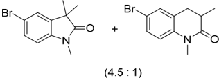

Prepared according to standard conditions. Purification by thin layer chromatography was performed (PE/EA: 6/1) to yield mixture of 2c and 3c (23 mg, 46%) as a colorless liquid. 1 H NMR (400 MHz, Chloroformd ) δ 7.38 (dd, J = 8.3, 1.8 Hz, 1H), 7.31 (d, J = 1.8 Hz, 1H), 6.72 (d, J = 8.2 Hz, 1H), 3.33 (s, 0.67H), 3.19 (s, 3H), 2.90 (dd, J = 14.3, 4.4 Hz, 0.18H), 2.74 -2.56 (m, 0.39H), 1.36 (s, 6H). 13 C NMR (101 MHz, Chloroformd ) δ 180.7, 141.7, 137.9, 130.5, 130.2, 125.7, 116.1, 115.2, 109.51, 44.4, 35.3, 32.9, 29.9, 26.3, 24.3, 15.7. Prepared according to standard conditions. Purification by thin layer chromatography was performed (PE/EA: 6/1) to yield mixture of 2c and 3c (23 mg, 46%) as a colorless liquid. 1 HNMR(400 MHz, Chloroformd ) δ 7.38 (dd, J = 8.3, 1.8 Hz, 1H), 7.31 (d, J = 1.8 Hz, 1H), 6.72 (d, J = 8.2 Hz, 1H), 3.33 (s, 0.67H), 3.19 (s, 3H), 2.90 (dd, J = 14.3, 4.4 Hz, 0.18H), 2.74-2.56 (m, 0.39H), 1.36 (s, 6H). 13 C NMR (101 MHz, Chloroformd ) δ 180.7, 141.7, 137.9, 130.5, 130.2, 125.7, 116.1, 115.2, 109.51, 44.4, 35.3, 32.9, 29.9, 26.3, 24.3, 15.7. Prepared according to standard conditions. Purification by thin layer chromatography was performed (PE/EA: 6/1) to yield mixture of 2c and 3c (23 mg, 46%) as a colorless liquid. 1 H NMR (400 MHz, Chloroformd ) δ 7.38 (dd, J = 8.3, 1.8 Hz, 1H), 7.31 (d, J = 1.8 Hz, 1H), 6.72 (d, J = 8.2 Hz, 1H), 3.33 (s, 0.67H), 3.19 (s, 3H), 2.90 (dd, J = 14.3, 4.4 Hz, 0.18H), 2.74 -2.56 (m, 0.39H), 1.36 (s, 6H). 13 C NMR (101 MHz, Chloroformd ) δ 180.7, 141.7, 137.9, 130.5, 130.2, 125.7, 116.1, 115.2, 109.51, 44.4, 35.3, 32.9, 29.9, 26.3, 24.3, 15.7.

5-iodo-1,3,3-trimethylindolin-2-one (2d) and 6-iodo-1,3-dimethyl-3,4-dihydroquinolin-2(1 H )-one (3.8:1) (3d) 38 5-iodo-1,3,3-trimethylindolin-2-one (2d) and 6-iodo-1,3-dimethyl-3,4-dihydroquinolin-2(1 H )-one (3.8:1) (3d) 38 5-iodo-1,3,3-trimethylindolin-2-one (2d) and 6-iodo-1,3-dimethyl-3,4-dihydroquinolin-2(1 H )-one (3.8:1) (3d) 38

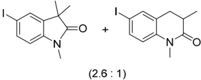

Prepared according to standard conditions. Purification by thin layer chromatography was performed (PE/EA: 6/1) to yield mixture of 2d and 3d (21 mg, 35%) as a colorless liquid. 1 H NMR (400 MHz, Chloroformd ) δ 7.58 (d, J = 8.2 Hz, 1H), 7.48 (s, 1H), 6.63 (d, J = 8.1 Hz, 1H), 3.32 (s, 0.79H), 3.19 (s, 3H), 3.08 -2.77 (m, 0.39H), 2.71 -2.59 (m, 0.52H), 1.36 (s, 6H). 13 C NMR (101 MHz, Chloroformd ) δ 180.6, 142.4, 138.3, 136.5, 131.3, 120.4, Prepared according to standard conditions. Purification by thin layer chromatography was performed (PE/EA: 6/1) to yield mixture of 2d and 3d (21 mg, 35%) as a colorless liquid. 1 H NMR (400 MHz, Chloroformd ) δ 7.58 (d, J = 8.2 Hz, 1H), 7.48 (s, 1H), 6.63 (d, J = 8.1 Hz, 1H), 3.32 (s, 0.79H), 3.19 (s, 3H), 3.08 -2.77 (m, 0.39H), 2.71 -2.59 (m, 0.52H), 1.36 (s, 6H). 13 C NMR (101 MHz, Chloroformd ) δ 180.6, 142.4, 138.3, 136.5, 131.3, 120.4, 116.5, 110.1, 85.7, 85.1, 44.3, 35.3, 32.8, 29.8, 26.3, 24.3, 15.6. Prepared according to standard conditions. Purification by thin layer chromatography was performed (PE/EA: 6/1) to yield mixture of 2d and 3d (21 mg, 35%) as a colorless liquid. 1 H NMR (400 MHz, Chloroformd ) δ 7.58 (d, J = 8.2 Hz, 1H), 7.48 (s, 1H), 6.63 (d, J = 8.1 Hz, 1H), 3.32 (s, 0.79H), 3.19 (s, 3H), 3.08-2.77 (m, 0.39H), 2.71-2.59 (m, 0.52H), 1.36 (s, 6H). 13 C NMR (101 MHz, Chloroformd ) δ 180.6, 142.4, 138.3, 136.5, 131.3, 120.4, 116.5, 110.1, 85.7, 85.1, 44.3, 35.3, 32.8, 29.8, 26.3, 24.3, 15.6.

5-(tert-butyl)-1,3,3-trimethylindolin-2-one

116.5,

44.3,

26.3,

29.8,

85.1,

85.7,

35.3,

110.1,

32.8,

5-(tert-butyl)-1,3,3-trimethylindolin-2-one dihydroquinolin-2(1

dihydroquinolin-2(1

t

38

)-one

H

H

-Bu

t

t

-Bu

O

O

)-one

-Bu

t

+

-Bu

+

38

(4.5:1)

(4.5:1)

(3e)

N

O

N

O

(3e)

(2e)

24.3,

(2e)

and

15.6.

and

6-(

6-(

tert tert

-butyl)-1,3-dimethyl-3,4-

-butyl)-1,3-dimethyl-3,4-

(200-300

(200-300

gel gel

(GF254)

(GF254)

to and

and under

then mesh)

mesh)

to give

under then

column or

product column

or thin

2a

.

thin

2a

.

give product

N

N

+

(2.6: 1)

Preparec

(2: 1)

erformed (PE/

· 1H NMR (400

performed (P

MHz, Chlor

Catalysts

Catalysts

2023

2023

,

,

13

,

13

,

x

x

FOR

FOR

PEER

PEER

Prepared according

raphy

Prepared according

raphy was

was less

(d, less

(d,

J

liquid.

J

liquid.

to standard

performed

(PE/EA:

1 H

=

8.1

1.36

to standard

performed

(PE/EA:

1 H

=

8.1

1.36

NMR

NMR

Hz,

(s,

116.5,

Purification conditions.

to

6/1)

(400

1H),

6H).

Hz,

(s,

116.5, by

of

Purification conditions.

to

6/1)

(400

1H),

3.32

yield mixture

MHz,

Chloroform-

3.32

13 C

110.1,

3d by

of

3d

2d and

2d and

yield mixture

MHz,

Chloroform-

(s,

NMR

13 C

6H).

110.1,

7.58

d

)

δ

0.79H),

(s,

NMR

85.7,

3H),

d

δ

7.58

)

0.79H),

3.19

3H),

(s,

(s,

3.19

(101

(101

85.1,

(d,

=

thin

(21

thin layer

mg,

8.2

J

3.08

-

MHz,

Chloroform-

35.3,

2.77

(d,

(m,

)

δ

d

3.08

MHz,

35.3,

J

=

2.77

-

d

Chloroform-

32.8,

180.6,

(21

layer mg,

8.2

(m,

)

δ

26.3,

Hz, chromatog-

35%)

1H),

0.39H),

Hz, chromatog-

35%)

1H),

0.39H),

142.4,

180.6,

24.3,

142.4,

15.6.

24.3,

(2e)

and

26.3,

44.3,

32.8,

29.8,

5-(tert-butyl)-1,3,3-trimethylindolin-2-one

15.6.

85.7,

85.1,

44.3,

29.8,

## 5-(tert-butyl)-1,3,3-trimethylindolin-2-one (2e) and 6-( tert -butyl)-1,3-dimethyl-3,4dihydroquinolin-2(1 H )-one (4.5:1) (3e) 38 5-(tert-butyl)-1,3,3-trimethylindolin-2-one (2e) and 6-( tert -butyl)-1,3-dimethyl-3,4dihydroquinolin-2(1 H )-one (4.5:1) (3e) 38 dihydroquinolin-2(1 H )-one (4.5:1) (3e) 38

t

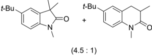

-Bu

t

-Bu

Prepared according to standard conditions. Purification by thin layer chromatography was performed (PE/EA: 6/1) to yield mixture of 2e and 3e (41 mg, 89%) as a colorless liquid. 1 H NMR (400 MHz, Chloroformd ) δ 7.32 -7.23 (m, 2H), 6.78 (d, J = 8.1 Hz, 1H), 3.35 (s, 0.67H), 3.21 (s, 3H), 2.92 (dd, J = 14.5, 4.9 Hz, 0.23H), 2.80 -2.40 (m, 0.46H), 1.38 (s, 6H), 1.33 (d, J = 6.1 Hz, 12H). 13 C NMR (101 MHz, Chloroformd ) δ 145.8, 140.3, 135.6, 124.2, 119.4, 107.4, 44.4, 34.6, 31.7, 31.4, 26.2, 24.5. Prepared according to standard conditions. Purification by thin layer chromatography was performed (PE/EA: 6/1) to yield mixture of 2e and 3e (41 mg, 89%) as a colorless liquid. 1 HNMR(400 MHz, Chloroformd ) δ 7.32-7.23 (m, 2H), 6.78 (d, J = 8.1 Hz, 1H), 3.35 (s, 0.67H), 3.21 (s, 3H), 2.92 (dd, J = 14.5, 4.9 Hz, 0.23H), 2.80-2.40 (m, 0.46H), 1.38 (s, 6H), 1.33 (d, J = 6.1 Hz, 12H). 13 C NMR (101 MHz, Chloroformd ) δ 145.8, 140.3, 135.6, 124.2, 119.4, 107.4, 44.4, 34.6, 31.7, 31.4, 26.2, 24.5. Prepared according to standard conditions. Purification by thin layer chromatography was performed (PE/EA: 6/1) to yield mixture of 2e and 3e (41 mg, 89%) as a colorless liquid. 1 H NMR (400 MHz, Chloroformd ) δ 7.32 -7.23 (m, 2H), 6.78 (d, J = 8.1 Hz, 1H), 3.35 (s, 0.67H), 3.21 (s, 3H), 2.92 (dd, J = 14.5, 4.9 Hz, 0.23H), 2.80 -2.40 (m, 0.46H), 1.38 (s, 6H), 1.33 (d, J = 6.1 Hz, 12H). 13 C NMR (101 MHz, Chloroformd ) δ 145.8, 140.3, 135.6, 124.2, 119.4, 107.4, 44.4, 34.6, 31.7, 31.4, 26.2, 24.5.

## 1,3,3,5-tetramethylindolin-2-one (2f) and 1,3,6-trimethyl-3,4-dihydroquinolin2(1 H )-one (2.6:1) (3f) 38 1,3,3,5-tetramethylindolin-2-one (2f) and 1,3,6-trimethyl-3,4-dihydroquinolin-2(1 H )-one (2.6:1) (3f) 38 1,3,3,5-tetramethylindolin-2-one (2f) and 1,3,6-trimethyl-3,4-dihydroquinolin2(1 H )-one (2.6:1) (3f) 38

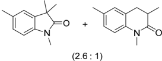

Prepared according to standard conditions. Purification by thin layer chromatography was performed (PE/EA: 6/1) to yield mixture of 2f and 3f (31 mg, 82%) as a colorless liquid. 1 H NMR (400 MHz, Chloroformd ) δ 7.08 -7.00 (m, 2H), 6.73 (d, J = 7.8 Hz, 1H), 3.33 (s, 1.17H), 3.19 (s, 3H), 2.93 -2.83 (m, 0.38H), 2.71 -2.50 (m, 0.85H), 2.69 -2.57 (m, 1H), 2.35 (s, 3H), 2.30 (s, 1.14H), 1.35 (s, 6H), 1.24 (d, J = 6.7 Hz, 1.64H). 13 C NMR (101 MHz, Chloroformd ) δ 181.3, 140.2, 135.8, 132.1, 131.9, 128.6, 127.8, 123.1, 114.3, 107.7, 44.2, 35.5, Prepared according to standard conditions. Purification by thin layer chromatography was performed (PE/EA: 6/1) to yield mixture of 2f and 3f (31 mg, 82%) as a colorless liquid. 1 H NMR (400 MHz, Chloroformd ) δ 7.08 -7.00 (m, 2H), 6.73 (d, J = 7.8 Hz, 1H), 3.33 (s, 1.17H), 3.19 (s, 3H), 2.93 -2.83 (m, 0.38H), 2.71 -2.50 (m, 0.85H), 2.69 -2.57 (m, 1H), 2.35 (s, 3H), 2.30 (s, 1.14H), 1.35 (s, 6H), 1.24 (d, J = 6.7 Hz, 1.64H). 13 C NMR (101 MHz, Chloroformd ) δ 181.3, 140.2, 135.8, 132.1, 131.9, 128.6, 127.8, 123.1, 114.3, 107.7, 44.2, 35.5, 33.2, 29.7, 26.2, 24.4, 21.1, 20.5, 15.7. Prepared according to standard conditions. Purification by thin layer chromatography was performed (PE/EA: 6/1) to yield mixture of 2f and 3f (31 mg, 82%) as a colorless liquid. 1 H NMR (400 MHz, Chloroformd ) δ 7.08-7.00 (m, 2H), 6.73 (d, J = 7.8 Hz, 1H), 3.33 (s, 1.17H), 3.19 (s, 3H), 2.93-2.83 (m, 0.38H), 2.71-2.50 (m, 0.85H), 2.69-2.57 (m, 1H), 2.35 (s, 3H), 2.30 (s, 1.14H), 1.35 (s, 6H), 1.24 (d, J = 6.7 Hz, 1.64H). 13 C NMR (101 MHz, Chloroformd ) δ 181.3, 140.2, 135.8, 132.1, 131.9, 128.6, 127.8, 123.1, 114.3, 107.7, 44.2, 35.5, 33.2, 29.7, 26.2, 24.4, 21.1, 20.5, 15.7. REVIEW 9 of 14 1,3,3,4-tetramethylindolin-2-one (2g) and 1,3,3,6-tetramethylindolin-2-one (2:1) REVIEW 9 of 14 1,3,3,4-tetramethylindolin-2-one (2g) and 1,3,3,6-tetramethylindolin-2-one (2:1) (2g') 1

(2g') 1

## 29.7, 26.2, 24.4, 21.1, 20.5, 15.7. 1,3,3,4-tetramethylindolin-2-one (2g) and 1,3,3,6-tetramethylindolin-2-one (2:1) (2g') 1

33.2,

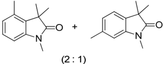

Prepared according to standard conditions. Purification by thin layer chromatography was performed (PE/EA: 6/1) to yield 2g + 2g ′ (29 mg, 76%) as a colorless liquid. 1 H NMR (400 MHz, Chloroformd ) δ 7.16 (t, J = 7.6 Hz, 0.68H),7.08 (d, J = 7.6 Hz, 0.34H), 6.87 (d, J = 7.6 Hz, 0.34H), 6.83 (d, J = 7.6 Hz, 0.68H), 6.70 (d, J = 8.1 Hz, 1H), 3.20 (s, 3H), 2.40 (s, 2H), 2.39 (s, 1H), 1.45 (s, 4H), 1.35 (s, 2H). 13 C NMR (101 MHz, Chloroformd ) δ 181.7, 181.4, 142.9, 142.7, 134.1, 133.0, 132.6, 127.5, 125.0, 122.9, 122.0, 109.0, 105.8, 45.0, 44.0, 26.3, 24.5, 22.4, 21.8, 18.1. Prepared according to standard conditions. Purification by thin layer chromatography was performed (PE/EA: 6/1) to yield 2g + 2g ′ (29 mg, 76%) as a colorless liquid. 1 HNMR (400 MHz, Chloroformd ) δ 7.16 (t, J = 7.6 Hz, 0.68H),7.08 (d, J = 7.6 Hz, 0.34H), 6.87 (d, J = 7.6 Hz, 0.34H), 6.83 (d, J = 7.6 Hz, 0.68H), 6.70 (d, J = 8.1 Hz, 1H), 3.20 (s, 3H), 2.40 (s, 2H), 2.39 (s, 1H), 1.45 (s, 4H), 1.35 (s, 2H). 13 C NMR (101 MHz, Chloroformd ) δ 181.7, 181.4, 142.9, 142.7, 134.1, 133.0, 132.6, 127.5, 125.0, 122.9, 122.0, 109.0, 105.8, 45.0, 44.0, 26.3, 24.5, 22.4, 21.8, 18.1. Prepared according to standard conditions. Purification by thin layer chromatography was performed (PE/EA: 6/1) to yield 2g + 2g ′ (29 mg, 76%) as a colorless liquid. 1 H NMR (400 MHz, Chloroformd ) δ 7.16 (t, J = 7.6 Hz, 0.68H),7.08 (d, J = 7.6 Hz, 0.34H), 6.87 (d, J = 7.6 Hz, 0.34H), 6.83 (d, J = 7.6 Hz, 0.68H), 6.70 (d, J = 8.1 Hz, 1H), 3.20 (s, 3H), 2.40 (s, 2H), 2.39 (s, 1H), 1.45 (s, 4H), 1.35 (s, 2H). 13 C NMR (101 MHz, Chloroformd ) δ 181.7, 181.4, 142.9, 142.7, 134.1, 133.0, 132.6, 127.5, 125.0, 122.9, 122.0, 109.0, 105.8, 45.0, 44.0, 26.3, 24.5, 22.4, 21.8, 18.1.

## 1,3,3,7-tetramethylindolin-2-one (2h) 38 1,3,3,7-tetramethylindolin-2-one (2h) 38 1,3,3,7-tetramethylindolin-2-one (2h) 38

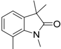

Prepared according to standard conditions. Purification by thin layer chromatography was performed (PE/EA: 6/1) to yield 2h (28 mg, 74%) as a colorless liquid. 1 H NMR (400 MHz, Chloroformd ) δ 7.05 (d, J = 8.0 Hz, 1H), 6.96 (dt, J = 14.7, 7.1 Hz, 2H), 3.50 (s, 3H), 2.59 (s, 3H), 1.35 (s, 6H). 13 C NMR (101 MHz, Chloroformd ) δ 182.1, 140.4, 136.5, 131.4, 122.4, 120.2, 119.7, 43.5, 29.6, 24.8, 19.1. Prepared according to standard conditions. Purification by thin layer chromatography was performed (PE/EA: 6/1) to yield 2h (28 mg, 74%) as a colorless liquid. 1 H NMR (400 MHz, Chloroformd ) δ 7.05 (d, J = 8.0 Hz, 1H), 6.96 (dt, J = 14.7, 7.1 Hz, 2H), 3.50 (s, 3H), 2.59 (s, 3H), 1.35 (s, 6H). 13 C NMR (101 MHz, Chloroformd ) δ 182.1, 140.4, 136.5, 131.4, 122.4, 120.2, 119.7, 43.5, 29.6, 24.8, 19.1. Prepared according to standard conditions. Purification by thin layer chromatography was performed (PE/EA: 6/1) to yield 2h (28 mg, 74%) as a colorless liquid. 1 H NMR (400 MHz, Chloroformd ) δ 7.05 (d, J = 8.0 Hz, 1H), 6.96 (dt, J = 14.7, 7.1 Hz, 2H), 3.50 (s, 3H), 2.59 (s, 3H), 1.35 (s, 6H). 13 C NMR (101 MHz, Chloroformd ) δ 182.1, 140.4, 136.5, 131.4, 122.4, 120.2, 119.7, 43.5, 29.6, 24.8, 19.1.

3-benzyl-1,3-dimethylindolin-2-one

(2i)

38

3-benzyl-1,3-dimethylindolin-2-one

7.48

7.48

2.71

as as

a

color-

(s,

-

color-

a

(s,

1H),

6.63

1H),

2.59

6.63

(m,

0.52H),

138.3,

2.71

-

2.59

(m,

138.3,

6-(

131.3,

120.4,

136.5, tert

136.5,

131.3,

-butyl)-1,3-dimethyl-3,4-

(2i)

38

Catalysts

Catalysts

Catalysts

2023

2023

2023

,

,

,

13

13

13

,

,

,

x

x

x

FOR

FOR

FOR

PEER

PEER

PEER

Prepared according

raphy

Prepared according

raphy was

was

(400

standard to

performed

(PE/EA:

MHz,

3H), standard

to performed

6/1)

6/1)

to to

(PE/EA:

Chloroform-

Chloroform-

2.59

(s,

(400

MHz,

3H),

(s,

2.59

d

)

3H),

1.35

131.4,

(s,

)

d

δ

1.35

(s,

119.7,

δ

conditions.

yield

7.05

conditions.

(28

2h

J

=

(d,

6H).

7.05

6H).

13 C

(d,

8.0

yield

2h

(28

J

Purification mg,

Hz,

Purification mg,

74%)

as

1H),

NMR

8.0

=

(101

Hz,

74%)

as

1H),

6.96

6.96

by thin

layer by

layer thin

a

colorless

(dt,

J

=

MHz,

43.5,

119.7,

131.4,

120.2,

122.4,

3H),

120.2,

29.6,

13 C

29.6,

24.8,

NMR

24.8,

(101

19.1.

19.1.

MHz,

## 3-benzyl-1,3-dimethylindolin-2-one (2i) 38 3-benzyl-1,3-dimethylindolin-2-one (2i) 38 3-benzyl-1,3-dimethylindolin-2-one (2i) 38

122.4,

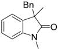

Prepared according to standard conditions within 96 h. Purification by thin layer chromatography was performed (PE/EA: 6/1) to yield 2i (43 mg, 85%) as a solid. mp: 87 -90 °C. 1 H NMR (400 MHz, Chloroformd ) δ 7.18 (t, J = 8.3 Hz, 1H), 7.13 (d, J = 6.6 Hz, 1H), 7.10 -6.98 (m, 4H), 6.85 (dd, J = 7.2, 2.1 Hz, 2H), 6.62 (d, J = 7.7 Hz, 1H), 3.12 (d, J = 13.0 Hz, 1H), 3.01 (d, J = 13.0 Hz, 1H), 2.99 (s, 3H), 1.48 (s, 3H). 13 C NMR (101 MHz, Chloroformd ) δ 178.0, 143.1, 136.2, 133.0, 129.8, 127.8, 127.5, 126.4, 123.3, 122.1, 107.8, 50.0, 44.6, 25.9, 22.8. Prepared according to standard conditions within 96 h. Purification by thin layer chromatography was performed (PE/EA: 6/1) to yield 2i (43 mg, 85%) as a solid. mp: 87-90 ◦ C. 1 HNMR(400MHz,Chloroformd ) δ 7.18 (t, J = 8.3 Hz, 1H), 7.13 (d, J = 6.6 Hz, 1H), 7.10-6.98 (m, 4H), 6.85 (dd, J = 7.2, 2.1 Hz, 2H), 6.62 (d, J = 7.7 Hz, 1H), 3.12 (d, J = 13.0 Hz, 1H), 3.01 (d, J = 13.0 Hz, 1H), 2.99 (s, 3H), 1.48 (s, 3H). 13 C NMR (101 MHz, Chloroformd ) δ 178.0, 143.1, 136.2, 133.0, 129.8, 127.8, 127.5, 126.4, 123.3, 122.1, 107.8, 50.0, 44.6, 25.9, 22.8. Prepared according to standard conditions within 96 h. Purification by thin layer chromatography was performed (PE/EA: 6/1) to yield 2i (43 mg, 85%) as a solid. mp: 87 -90 °C. 1 H NMR (400 MHz, Chloroformd ) δ 7.18 (t, J = 8.3 Hz, 1H), 7.13 (d, J = 6.6 Hz, 1H), 7.10 -6.98 (m, 4H), 6.85 (dd, J = 7.2, 2.1 Hz, 2H), 6.62 (d, J = 7.7 Hz, 1H), 3.12 (d, J = 13.0 Hz, 1H), 3.01 (d, J = 13.0 Hz, 1H), 2.99 (s, 3H), 1.48 (s, 3H). 13 C NMR (101 MHz, Chloroformd ) δ 178.0, 143.1, 136.2, 133.0, 129.8, 127.8, 127.5, 126.4, 123.3, 122.1, 107.8, 50.0, 44.6, 25.9, 22.8.

## 3,3-dimethyl-1-phenylindolin-2-one (2j) 38 3,3-dimethyl-1-phenylindolin-2-one (2j) 38 3,3-dimethyl-1-phenylindolin-2-one (2j) 38

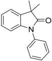

Prepared according to standard conditions. Purification by thin layer chromatography was performed (PE/EA: 6/1) to yield 2j (36 mg, 75%) as a solid. mp: 84-86 °C. 1 H NMR (400 MHz, Chloroformd ) δ 7.53 (t, J = 7.7 Hz, 2H), 7.44 -7.39 (m, 3H), 7.29 (d, J = 7.3 Hz, 1H), 7.20 (t, J = 8.2 Hz, 1H), 7.11 (t, J = 7.2 Hz, 1H), 6.86 (d, J = 7.8 Hz, 1H), 1.51 (s, 6H). 13 C NMR (101 MHz, Chloroformd ) δ 180.7, 142.5, 135.7, 134.7, 129.6, 127.9, 127.6, 126.6, 123.0, Prepared according to standard conditions. Purification by thin layer chromatography was performed (PE/EA: 6/1) to yield 2j (36 mg, 75%) as a solid. mp: 84-86 °C. 1 H NMR (400 MHz, Chloroformd ) δ 7.53 (t, J = 7.7 Hz, 2H), 7.44 -7.39 (m, 3H), 7.29 (d, J = 7.3 Hz, 1H), 7.20 (t, J = 8.2 Hz, 1H), 7.11 (t, J = 7.2 Hz, 1H), 6.86 (d, J = 7.8 Hz, 1H), 1.51 (s, 6H). 13 C NMR (101 MHz, Chloroformd ) δ 180.7, 142.5, 135.7, 134.7, 129.6, 127.9, 127.6, 126.6, 123.0, 109.4, 44.3, 24.8 Prepared according to standard conditions. Purification by thin layer chromatography was performed (PE/EA: 6/1) to yield 2j (36 mg, 75%) as a solid. mp: 84-86 ◦ C. 1 HNMR (400 MHz, Chloroformd ) δ 7.53 (t, J = 7.7 Hz, 2H), 7.44-7.39 (m, 3H), 7.29 (d, J = 7.3 Hz, 1H), 7.20 (t, J = 8.2 Hz, 1H), 7.11 (t, J = 7.2 Hz, 1H), 6.86 (d, J = 7.8 Hz, 1H), 1.51 (s, 6H). 13 C NMR(101 MHz, Chloroformd ) δ 180.7, 142.5, 135.7, 134.7, 129.6, 127.9, 127.6, 126.6, 123.0, 109.4, 44.3, 24.8. REVIEW 10 of 14 REVIEW 10 of 14 REVIEW 10 of 14

## 109.4, 44.3, 24.8 1-benzyl-3,3-dimethylindolin-2-one (2k) 38 1-benzyl-3,3-dimethylindolin-2-one (2k) 38 1-benzyl-3,3-dimethylindolin-2-one (2k) 38

Prepared

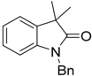

raphy

Purification conditions.

standard to

according performed

(PE/EA:

was

Prepared by

according layer

thin standard

conditions.

Purification chromatog-

to by

a

thin layer

colorless chromatog-

liquid.

1 H

NMR

Prepared according to standard conditions. Purification by thin layer chromatography was performed (PE/EA: 6/1) to yield 2k (35 mg, 70%) as a colorless liquid. 1 H NMR (400 MHz, Chloroformd ) δ 7.33 -7.25 (m, 5H), 7.22 (d, J = 8.1 Hz, 1H), 7.14 (t, J = 8.3 Hz, 1H), 7.03 (t, J = 7.5 Hz, 1H), 6.73 (d, J = 7.7 Hz, 1H), 4.93 (s, 2H), 1.45 (s, 6H). 13 C NMR (101 MHz, Chloroformd ) δ 181.5, 141.7, 136.1, 135.8, 128.8, 127.6, 127.2, 122.5, 122.4, 109.1, 44.2, Prepared according to standard conditions. Purification by thin layer chromatography was performed (PE/EA: 6/1) to yield 2k (35 mg, 70%) as a colorless liquid. 1 HNMR(400MHz, Chloroformd ) δ 7.33-7.25 (m, 5H), 7.22 (d, J = 8.1 Hz, 1H), 7.14 (t, J = 8.3 Hz, 1H), 7.03 (t, J = 7.5 Hz, 1H), 6.73 (d, J = 7.7 Hz, 1H), 4.93 (s, 2H), 1.45 (s, 6H). 13 C NMR (101 MHz, Chloroformd ) δ 181.5, 141.7, 136.1, 135.8, 128.8, 127.6, 127.2, 122.5, 122.4, 109.1, 44.2, 43.6, 24.6. raphy was performed (PE/EA: 6/1) to yield 2k (35 mg, 70%) as a colorless liquid. 1 H NMR (400 MHz, Chloroformd ) δ 7.33 -7.25 (m, 5H), 7.22 (d, J = 8.1 Hz, 1H), 7.14 (t, J = 8.3 Hz, 1H), 7.03 (t, J = 7.5 Hz, 1H), 6.73 (d, J = 7.7 Hz, 1H), 4.93 (s, 2H), 1.45 (s, 6H). 13 C NMR (101 MHz, Chloroformd ) δ 181.5, 141.7, 136.1, 135.8, 128.8, 127.6, 127.2, 122.5, 122.4, 109.1, 44.2, 43.6, 24.6. (400 MHz, Chloroformd ) δ 7.33 -7.25 (m, 5H), 7.22 (d, J = 8.1 Hz, 1H), 7.14 (t, J = 8.3 Hz, 1H), 7.03 (t, J = 7.5 Hz, 1H), 6.73 (d, J = 7.7 Hz, 1H), 4.93 (s, 2H), 1.45 (s, 6H). 13 C NMR (101 MHz, Chloroformd ) δ 181.5, 141.7, 136.1, 135.8, 128.8, 127.6, 127.2, 122.5, 122.4, 109.1, 44.2, 43.6, 24.6. 1-isopropyl-3,3-dimethylindolin-2-one (2l) 38

43.6, to

6/1)

yield

2k

(35

mg, as

70%)

## 24.6. 1-isopropyl-3,3-dimethylindolin-2-one (2l) 38 1-isopropyl-3,3-dimethylindolin-2-one (2l) 38

1-isopropyl-3,3-dimethylindolin-2-one

38

(2l)

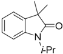

Prepared according to standard conditions. Purification by thin layer chromatography was performed (PE/EA: 6/1) to yield 2l (35 mg, 88%) as a colorless liquid. 1 H NMR (400 MHz, Chloroformd ) δ 7.20 (d, J = 7.9 Hz, 2H), 7.03 (t, J = 7.3 Hz, 2H), 4.71 -4.61 (m, 1H), (101 MHz, Chloroformd ) δ 181.1, 136.4, Prepared according to standard conditions. Purification by thin layer chromatography was performed (PE/EA: 6/1) to yield 2l (35 mg, 88%) as a colorless liquid. 1 H NMR (400 MHz, Chloroformd ) δ 7.20 (d, J = 7.9 Hz, 2H), 7.03 (t, J = 7.3 Hz, 2H), 4.71 -4.61 (m, 1H), 1.47 (d, J = 7.1 Hz, 6H), 1.34 (s, 6H). 13 C NMR (101 MHz, Chloroformd ) δ 181.1, 136.4, 127.3, 122.5, 121.9, 109.9, 43.8, 43.4, 24.0, 19.4. Prepared according to standard conditions. Purification by thin layer chromatography was performed (PE/EA: 6/1) to yield 2l (35 mg, 88%) as a colorless liquid. 1 H NMR (400 MHz, Chloroformd ) δ 7.20 (d, J = 7.9 Hz, 2H), 7.03 (t, J = 7.3 Hz, 2H), 4.71-4.61 (m, 1H), 1.47 (d, J = 7.1 Hz, 6H), 1.34 (s, 6H). 13 C NMR (101 MHz, Chloroformd ) δ 181.1, 136.4, 127.3, 122.5, 121.9, 109.9, 43.8, 43.4, 24.0, 19.4. Prepared according to standard conditions. Purification by thin layer chromatography was performed (PE/EA: 6/1) to yield 2l (35 mg, 88%) as a colorless liquid. 1 H NMR (400 MHz, Chloroformd ) δ 7.20 (d, J = 7.9 Hz, 2H), 7.03 (t, J = 7.3 Hz, 2H), 4.71 -4.61 (m, 1H), 1.47 (d, J = 7.1 Hz, 6H), 1.34 (s, 6H). 13 C NMR (101 MHz, Chloroformd ) δ 181.1, 136.4, 127.3, 122.5, 121.9, 109.9, 43.8, 43.4, 24.0, 19.4.

127.3,

## 1.47 (d, J = 7.1 Hz, 6H), 1.34 (s, 6H). 13 C NMR 122.5, 121.9, 109.9, 43.8, 43.4, 24.0, 19.4. 1-ethyl-3,3-dimethylindolin-2-one (2m) 38 1-ethyl-3,3-dimethylindolin-2-one (2m) 38 1-ethyl-3,3-dimethylindolin-2-one (2m) 38

1-ethyl-3,3-dimethylindolin-2-one

38

(2m)

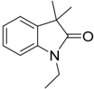

Prepared according to standard conditions. Purification by thin layer chromatography was performed (PE/EA: 6/1) to yield 2m (29 mg, 78%) as a colorless liquid. 1 H NMR Prepared according to standard conditions. Purification by thin layer chromatography was performed (PE/EA: 6/1) to yield 2m (29 mg, 78%) as a colorless liquid. 1 H NMR Prepared according to standard conditions. Purification by thin layer chromatography was performed (PE/EA: 6/1) to yield 2m (29 mg, 78%) as a colorless liquid. 1 H NMR

(400

(400

1H), according

Prepared raphy

performed was

MHz,

MHz,

Chloroform-

d

)

(400

1H),

3.77

Chloroform-

(q,

3.77

(q,

J

=

roform-

7.05

conditions.

standard to

(PE/EA:

to

6/1)

d

)

δ

δ

2H),

7.28

7.28

Chloroform-

MHz,

1H),

d

Purification

7.05

7.18

-

1.36

7.2

Hz,

180.9,

=

(t,

(t,

J

=

7.4

Hz,

7.2

Hz,

3H).

2m

(29

yield

-

7.28

2H),

=

7.2

Hz,

J

δ

7.2

mg, as

78%)

7.05

(m,

7.18

(s,

1.36

(s,

141.6,

(t,

J

=

Hz,

J

2H),

(m,

2H),

6H),

127.5,

1.26

(t,

J

=

122.4,

108.1,

δ

d

)

J

roform-

108.1,

7.4

J

=

7.2

Hz,

7.18

-

1.36

=

3.77

(q,

)

Hz,

3H).

44.0, thin

layer by

a

chromatog- colorless

7.4

liquid.

6.87

1H),

1H),

6.87

Hz,

44.0,

180.9,

141.6,

136.0,

6H),

127.5,

(m,

(s,

1.26

122.4,

2H),

(t,

122.2,

d

)

δ

136.0,

122.2,

3,3-dimethyl-1-(2-phenoxyethyl)indolin-2-one

3,3-dimethyl-1-(2-phenoxyethyl)indolin-2-one

1.26

6H),

127.5,

122.4,

(t,

=

J

122.2,

38

108.1,

13 C

13 C

(d,

NMR

(101

34.4,

34.4,

38

3H).

44.0,

1H),

13 C

NMR

24.3,

34.4,

NMR

1 H

J

(d,

(101

12.7.

J

6.87

NMR

24.3,

12.7.

24.3,

(d,

7.8

=

=

7.8

Hz,

MHz,

J

MHz,

(101

12.7.

Hz,

Chlo-

7.8

=

Chlo-

MHz,

Hz,

Chlo-

2H),

7.2

Hz,

δ

180.9,

141.6,

136.0, roform-

d

)

(2n)

(2n)

a

colorless

(dt,

=

chromatog- liquid.

chromatog- liquid.

14.7,

J

7.1

14.7,

Chloroform-

7.1

Hz,

d

)

δ

182.1,

1 H

NMR

1 H

NMR

Hz,

2H),

182.1,

2H),

140.4,

140.4,

136.5,

136.5,

d

)

δ

Chloroform-

43.5,

Catalysts

Catalysts

2023

,

2023

,

13

,

13

,

x

x

FOR

FOR

PEER

PEER

Prepared raphy

chromatog- layer

by by

a

NMR

1 H

Purification mg,

78%)

standard to

according performed

to as

6/1)

thin

a

colorless

(PE/EA:

liquid.

conditions.

yield

2m

(29

was

Purification mg,

Prepared raphy

was according

performed to

standard

(PE/EA:

6/1)

to conditions.

yield

2m

(29

as

78%)

## 3,3-dimethyl-1-(2-phenoxyethyl)indolin-2-one (2n) 38 3,3-dimethyl-1-(2-phenoxyethyl)indolin-2-one (2n) 38

layer thin

colorless chromatog-

liquid.

1 H

NMR

(400 MHz, Chloroformd ) δ 7.28-7.18 (m, 2H), 7.05 (t, J = 7.4 Hz, 1H), 6.87 (d, J = 7.8 Hz, 1H), 3.77 (q, J = 7.2 Hz, 2H), 1.36 (s, 6H), 1.26 (t, J = 7.2 Hz, 3H). 13 C NMR (101 MHz, Chloroformd ) δ 180.9, 141.6, 136.0, 127.5, 122.4, 122.2, 108.1, 44.0, 34.4, 24.3, 12.7. (400 MHz, Chloroformd ) δ 7.28 -7.18 (m, 2H), 7.05 (t, J = 7.4 Hz, 1H), 6.87 (d, J = 7.8 Hz, 1H), 3.77 (q, J = 7.2 Hz, 2H), 1.36 (s, 6H), 1.26 (t, J = 7.2 Hz, 3H). 13 C NMR (101 MHz, Chloroformd ) δ 180.9, 141.6, 136.0, 127.5, 122.4, 122.2, 108.1, 44.0, 34.4, 24.3, 12.7. (400 MHz, Chloroformd ) δ 7.28 -7.18 (m, 2H), 7.05 (t, J = 7.4 Hz, 1H), 6.87 (d, J = 7.8 Hz, 1H), 3.77 (q, J = 7.2 Hz, 2H), 1.36 (s, 6H), 1.26 (t, J = 7.2 Hz, 3H). 13 C NMR (101 MHz, Chloroformd ) δ 180.9, 141.6, 136.0, 127.5, 122.4, 122.2, 108.1, 44.0, 34.4, 24.3, 12.7. 3,3-dimethyl-1-(2-phenoxyethyl)indolin-2-one (2n) 38

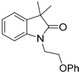

Prepared according to standard conditions. Purification by thin layer chromatography was performed (PE/EA: 6/1) to yield 2n (37 mg, 66%) as a colorless liquid. 1 H NMR (400 MHz, Chloroformd ) δ 7.31 -7.19 (m, 4H), 7.08 (t, J = 8.4 Hz, 2H), 6.94 (t, J = 7.4 Hz, 1H), 6.87 (d, J = 8.7 Hz, 2H), 4.23 (t, J = 5.6 Hz, 2H), 4.14 (t, J = 5.6 Hz, 2H), 1.39 (s, 6H). 13 C NMR (101 MHz, Chloroformd ) δ 181.7, 158.4, 142.2, 135.7, 127.6, 122.5, 122.4, 121.1, 114.5, 109.0, 65.4, 44.1, 24.5. Prepared according to standard conditions. Purification by thin layer chromatography was performed (PE/EA: 6/1) to yield 2n (37 mg, 66%) as a colorless liquid. 1 H NMR (400 MHz, Chloroformd ) δ 7.31-7.19 (m, 4H), 7.08 (t, J = 8.4 Hz, 2H), 6.94 (t, J = 7.4 Hz, 1H), 6.87 (d, J = 8.7 Hz, 2H), 4.23 (t, J = 5.6 Hz, 2H), 4.14 (t, J = 5.6 Hz, 2H), 1.39 (s, 6H). 13 C NMR (101 MHz, Chloroformd ) δ 181.7, 158.4, 142.2, 135.7, 127.6, 122.5, 122.4, 121.1, 114.5, 109.0, 65.4, 44.1, 24.5. Prepared according to standard conditions. Purification by thin layer chromatography was performed (PE/EA: 6/1) to yield 2n (37 mg, 66%) as a colorless liquid. 1 H NMR (400 MHz, Chloroformd ) δ 7.31 -7.19 (m, 4H), 7.08 (t, J = 8.4 Hz, 2H), 6.94 (t, J = 7.4 Hz, 1H), 6.87 (d, J = 8.7 Hz, 2H), 4.23 (t, J = 5.6 Hz, 2H), 4.14 (t, J = 5.6 Hz, 2H), 1.39 (s, 6H). 13 C NMR (101 MHz, Chloroformd ) δ 181.7, 158.4, 142.2, 135.7, 127.6, 122.5, 122.4, 121.1, 114.5, 109.0, 65.4, 44.1, 24.5.

## 1-cyclohexyl-3,3-dimethylindolin-2-one (2o) 38 1-cyclohexyl-3,3-dimethylindolin-2-one (2o) 38 1-cyclohexyl-3,3-dimethylindolin-2-one (2o) 38

REVIEW

11

of

REVIEW

14

11

of

14

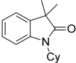

Prepared according to standard conditions. Purification by thin layer chromatography was performed (PE/EA: 6/1) to yield 2o (40 mg, 83%) as a colorless liquid. 1 H NMR Prepared according to standard conditions. Purification by thin layer chromatography was performed (PE/EA: 6/1) to yield 2o (40 mg, 83%) as a colorless liquid. 1 H NMR Prepared according to standard conditions. Purification by thin layer chromatography was performed (PE/EA: 6/1) to yield 2o (40 mg, 83%) as a colorless liquid. 1 H NMR (400 MHz, Chloroformd ) δ 7.25-7.17 (m, 2H), 7.06 (d, J = 7.8 Hz, 1H) 7.02 (t, J = 7.7 Hz, 1H), 4.24-4.11 (m, 1H), 2.22-2.08 (m, 2H), 1.89 (d, J = 13.3 Hz, 2H), 1.80-1.68 (m, 3H), 1.48-1.26 (m, 9H). 13 C NMR (101 MHz, Chloroformd ) δ 181.2, 141.6, 136.4, 127.3, 122.5, 121.8, 110.1, 51.9, 43.8, 29.2, 26.0, 25.5, 24.6. (400 MHz, Chloroformd ) δ 7.25 -7.17 (m, 2H), 7.06 (d, J = 7.8 Hz, 1H) 7.02 (t, J = 7.7 Hz, 1H), 4.24 -4.11 (m, 1H), 2.22 -2.08 (m, 2H), 1.89 (d, J = 13.3 Hz, 2H), 1.80 -1.68 (m, 3H), 1.48 -1.26 (m, 9H). 13 C NMR (101 MHz, Chloroformd ) δ 181.2, 141.6, 136.4, 127.3, 122.5, 121.8, 110.1, 51.9, 43.8, 29.2, 26.0, 25.5, 24.6. 2-(3,3-dimethyl-2-oxoindolin-1-yl)ethyl 2-(6-methoxynaphthalen-2-yl)propanoate (400 MHz, Chloroformd ) δ 7.25 -7.17 (m, 2H), 7.06 (d, J = 7.8 Hz, 1H) 7.02 (t, J = 7.7 Hz, 1H), 4.24 -4.11 (m, 1H), 2.22 -2.08 (m, 2H), 1.89 (d, J = 13.3 Hz, 2H), 1.80 -1.68 (m, 3H), 1.48 -1.26 (m, 9H). 13 C NMR (101 MHz, Chloroformd ) δ 181.2, 141.6, 136.4, 127.3, 122.5, 121.8, 110.1, 51.9, 43.8, 29.2, 26.0, 25.5, 24.6. 2-(3,3-dimethyl-2-oxoindolin-1-yl)ethyl 2-(6-methoxynaphthalen-2-yl)propanoate (2p) 38

## 2-(3,3-dimethyl-2-oxoindolin-1-yl)ethyl 2-(6-methoxynaphthalen-2-yl)propanoate (2p) 38 38

(2p)

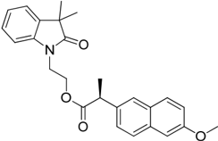

Prepared according to standard conditions. Purification by thin layer chromatography was performed (PE/EA: 3/1) to yield 2q (60 mg, 72%) as a colorless liquid. 1 H NMR (400 MHz, Chloroformd ) δ 7.67 -7.60 (m, 2H), 7.53 (s, 1H), 7.31 -7.25 (m, 1H), 7.18 -7.07 (m, 4H), 7.02 (t, J = 7.1 Hz, 1H), 6.80 (d, J = 7.7 Hz, 1H), 4.41 -4.23 (m, 2H), 4.03 -3.82 (m, 5H), 3.75 (q, J = 7.1 Hz, 1H), 1.48 (d, J = 7.2 Hz, 3H), 1.31 (s, 3H), 1.28 (s, 3H). 13 C NMR (101 MHz, Chloroformd ) δ 181.5, 174.5, 157.6, 141.8, 135.7, 135.3, 133.7, 129.3, 127.6, 126.0, 122.5, 122.4, 119.0, 108.4, 105.5, 61.9, 55.4, 45.4, 44.0, 38.9, 18.3. Prepared according to standard conditions. Purification by thin layer chromatography was performed (PE/EA: 3/1) to yield 2q (60 mg, 72%) as a colorless liquid. 1 H NMR (400 MHz, Chloroformd ) δ 7.67-7.60 (m, 2H), 7.53 (s, 1H), 7.31-7.25 (m, 1H), 7.18-7.07 (m, 4H), 7.02 (t, J = 7.1 Hz, 1H), 6.80 (d, J = 7.7 Hz, 1H), 4.41-4.23 (m, 2H), 4.03-3.82 (m, 5H), 3.75 (q, J = 7.1 Hz, 1H), 1.48 (d, J = 7.2 Hz, 3H), 1.31 (s, 3H), 1.28 (s, 3H). 13 C NMR (101 MHz, Chloroformd ) δ 181.5, 174.5, 157.6, 141.8, 135.7, 135.3, 133.7, 129.3, 127.6, 126.0, 122.5, 122.4, 119.0, 108.4, 105.5, 61.9, 55.4, 45.4, 44.0, 38.9, 18.3. Prepared according to standard conditions. Purification by thin layer chromatography was performed (PE/EA: 3/1) to yield 2q (60 mg, 72%) as a colorless liquid. 1 H NMR (400 MHz, Chloroformd ) δ 7.67 -7.60 (m, 2H), 7.53 (s, 1H), 7.31 -7.25 (m, 1H), 7.18 -7.07 (m, 4H), 7.02 (t, J = 7.1 Hz, 1H), 6.80 (d, J = 7.7 Hz, 1H), 4.41 -4.23 (m, 2H), 4.03 -3.82 (m, 5H), 3.75 (q, J = 7.1 Hz, 1H), 1.48 (d, J = 7.2 Hz, 3H), 1.31 (s, 3H), 1.28 (s, 3H). 13 C NMR (101 MHz, Chloroformd ) δ 181.5, 174.5, 157.6, 141.8, 135.7, 135.3, 133.7, 129.3, 127.6, 126.0, 122.5, 122.4, 119.0, 108.4, 105.5, 61.9, 55.4, 45.4, 44.0, 38.9, 18.3.

## 2,2-dimethyl-6,7-dihydrobenzo [6,7]azepino [3,2,1-hi]indol-1(2H)-one (2q) 38 2,2-dimethyl-6,7-dihydrobenzo [6,7]azepino [3,2,1-hi]indol-1(2H)-one (2q) 38 2,2-dimethyl-6,7-dihydrobenzo [6,7]azepino [3,2,1-hi]indol-1(2H)-one (2q) 38

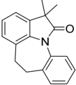

Prepared according to standard conditions. Purification by thin layer chromatography was performed (PE/EA: 6/1) to yield 2p (34 mg, 65%) as a solid. mp: 185-188 °C. 1 H NMR (400 MHz, Chloroformd ) δ 7.83 (d, J = 8.2 Hz, 1H), 7.31 -7.25 (m, 1H), 7.23 -7.14 Prepared according to standard conditions. Purification by thin layer chromatography was performed (PE/EA: 6/1) to yield 2p (34 mg, 65%) as a solid. mp: 185-188 °C. 1 H NMR (400 MHz, Chloroformd ) δ 7.83 (d, J = 8.2 Hz, 1H), 7.31 -7.25 (m, 1H), 7.23 -7.14 Prepared according to standard conditions. Purification by thin layer chromatography was performed (PE/EA: 6/1) to yield 2p (34 mg, 65%) as a solid. mp: 185-188 ◦ C. 1 HNMR (400 MHz, Chloroformd ) δ 7.83 (d, J = 8.2 Hz, 1H), 7.31-7.25 (m, 1H), 7.23-7.14 (m, 2H),

(m,

(m,

7.12

2H),

13 C

2H),

13 C

7.12

NMR

NMR

126.2,

(dd,

(101

125.1,

(dd,

(101

125.1,

=

J

MHz,

122.4,

J

=

MHz,

122.4,

6.3,

2.2

1H),

Hz,

Chloroform-

6.3,

2.2

Hz,

1H),

Chloroform-

7.05

d

6.96

-

7.05

-

6.96

)

δ

181.8,

(m,

139.7,

120.2,

d

δ

)

181.8,

(m,

139.7,

120.2,

43.9,

29.7,

33.7,

34.0,

126.2,

43.9,

34.0,

33.7,

29.7,

7,7-dimethyl-1,2,3,4-tetrahydroazepino

7,7-dimethyl-1,2,3,4-tetrahydroazepino

-

2H),

136.7,

3.20

2.92

(m,

3.20

2H),

(m,

2.92

-

136.7,

136.2,

4H),

129.5,

4H),

129.5,

136.1,

136.2,

136.1,

25.2.

25.2.

[3,2,1-hi]indol-6(7H)-one

[3,2,1-hi]indol-6(7H)-one

(2r)

38

1.49

1.49

(s,

126.5,

(s,

126.5,

6H).

126.3,

6H).

126.3,

(2r)

38

Catalysts

Catalysts

2023

,

2023

,

13

,

13

,

x

x

FOR

FOR

PEER

PEER

Prepared according

raphy performed

was

Prepared according

raphy was

performed

NMR

conditions.

standard to

conditions.

to standard

(PE/EA:

yield

6/1)

to

Chloroform-

MHz,

(400

NMR

(m,

6/1)

to yield

(PE/EA:

Chloroform-

δ

(34

2p

(34

2p

7.83

J

d

(d,

)

(400

8.2

=

Purification mg,

Purification mg,

by as

65%)

a

Hz, by

as

65%)

a

Hz,

MHz,

(d,

7.83

δ

d

)

Hz,

1H),

J

-

7.31

=

8.2

6.96

thin solid.

thin solid.

7.31

1H),

2H),

-

-

-

layer mp:

7.25

layer mp:

7.25

chromatog-

185-188

(m,

185-188

(m,

1 H

°C.

1H),

4H),

°C.

1 H

1H),

7.23

-

7.14

7.23

1.49

-

(s,

2H),

7.12

(dd,

J

=

6.3,

2.2

1H),

7.05

(m,

3.20

2.92

(m,

## 7,7-dimethyl-1,2,3,4-tetrahydroazepino [3,2,1-hi]indol-6(7H)-one (2r) 38 7,7-dimethyl-1,2,3,4-tetrahydroazepino [3,2,1-hi]indol-6(7H)-one (2r) 38

7.14

6H).

7.12 (dd, J = 6.3, 2.2 Hz, 1H), 7.05-6.96 (m, 2H), 3.20-2.92 (m, 4H), 1.49 (s, 6H). 13 C NMR (101 MHz, Chloroformd ) δ 181.8, 139.7, 136.7, 136.2, 136.1, 129.5, 126.5, 126.3, 126.2, 125.1, 122.4, 120.2, 43.9, 34.0, 33.7, 29.7, 25.2. (m, 2H), 7.12 (dd, J = 6.3, 2.2 Hz, 1H), 7.05 -6.96 (m, 2H), 3.20 -2.92 (m, 4H), 1.49 (s, 6H). 13 C NMR (101 MHz, Chloroformd ) δ 181.8, 139.7, 136.7, 136.2, 136.1, 129.5, 126.5, 126.3, 126.2, 125.1, 122.4, 120.2, 43.9, 34.0, 33.7, 29.7, 25.2. 13 C NMR (101 MHz, Chloroformd ) δ 181.8, 139.7, 136.7, 136.2, 136.1, 129.5, 126.5, 126.3, 126.2, 125.1, 122.4, 120.2, 43.9, 34.0, 33.7, 29.7, 25.2. 7,7-dimethyl-1,2,3,4-tetrahydroazepino [3,2,1-hi]indol-6(7H)-one (2r) 38

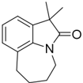

Prepared according to standard conditions. Purification by thin layer chromatography was performed (PE/EA: 6/1) to yield 2r (31 mg, 73%) as a colorless liquid. 1 H NMR (400 MHz, Chloroformd ) δ 7.04 (dd, J = 6.9, 1.5 Hz, 1H), 6.99 -6.90 (m, 2H), 4.03 -3.88 (m, 2H), 3.03 -2.88 (m, 2H), 2.09 -1.95 (m, 4H), 1.36 (s, 6H). 13 C NMR (101 MHz, Chloroformd ) δ 181.8, 141.3, 136.2, 129.0, 125.2, 122.3, 120.1, 44.2, 40.9, 30.9, 26.5, 26.4, 24.7. Prepared according to standard conditions. Purification by thin layer chromatography was performed (PE/EA: 6/1) to yield 2r (31 mg, 73%) as a colorless liquid. 1 H NMR (400 MHz, Chloroformd ) δ 7.04 (dd, J = 6.9, 1.5 Hz, 1H), 6.99-6.90 (m, 2H), 4.03-3.88 (m, 2H), 3.03-2.88 (m, 2H), 2.09-1.95 (m, 4H), 1.36 (s, 6H). 13 C NMR (101 MHz, Chloroformd ) δ 181.8, 141.3, 136.2, 129.0, 125.2, 122.3, 120.1, 44.2, 40.9, 30.9, 26.5, 26.4, 24.7. Prepared according to standard conditions. Purification by thin layer chromatography was performed (PE/EA: 6/1) to yield 2r (31 mg, 73%) as a colorless liquid. 1 H NMR (400 MHz, Chloroformd ) δ 7.04 (dd, J = 6.9, 1.5 Hz, 1H), 6.99 -6.90 (m, 2H), 4.03 -3.88 (m, 2H), 3.03 -2.88 (m, 2H), 2.09 -1.95 (m, 4H), 1.36 (s, 6H). 13 C NMR (101 MHz, Chloroformd ) δ 181.8, 141.3, 136.2, 129.0, 125.2, 122.3, 120.1, 44.2, 40.9, 30.9, 26.5, 26.4, 24.7.

## 1,1-dimethyl-5,6-dihydro-4H-pyrrolo [3,2,1-ij]quinolin-2(1H)-one (2s) 38 1,1-dimethyl-5,6-dihydro-4H-pyrrolo [3,2,1-ij]quinolin-2(1H)-one (2s) 38 1,1-dimethyl-5,6-dihydro-4H-pyrrolo [3,2,1-ij]quinolin-2(1H)-one (2s) 38

REVIEW

REVIEW

14

of

12

12

of

14

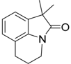

Prepared according to standard conditions. Purification by thin layer chromatography was performed (PE/EA: 6/1) to yield 2s (28 mg, 70%) as a colorless liquid. 1 H NMR Prepared according to standard conditions. Purification by thin layer chromatography was performed (PE/EA: 6/1) to yield 2s (28 mg, 70%) as a colorless liquid. 1 H NMR Prepared according to standard conditions. Purification by thin layer chromatography was performed (PE/EA: 6/1) to yield 2s (28 mg, 70%) as a colorless liquid. 1 H NMR (400 MHz, Chloroformd ) δ 7.06-6.99 (m, 2H), 6.97-6.92 (m, 1H), 3.75-3.69 (m, 2H), 2.79 (t, J = 6.1 Hz, 2H), 2.01 (p, J = 6.0 Hz, 2H), 1.37 (s, 6H). 13 C NMR (101 MHz, Chloroformd ) δ 180.3, 138.5, 134.4, 126.4, 121.9, 120.1, 45.6, 38.8, 24.7, 24.2, 21.2. (400 MHz, Chloroformd ) δ 7.06 -6.99 (m, 2H), 6.97 -6.92 (m, 1H), 3.75 -3.69 (m, 2H), 2.79 (t, J = 6.1 Hz, 2H), 2.01 (p, J = 6.0 Hz, 2H), 1.37 (s, 6H). 13 C NMR (101 MHz, Chloroformd ) δ 180.3, 138.5, 134.4, 126.4, 121.9, 120.1, 45.6, 38.8, 24.7, 24.2, 21.2. (400 MHz, Chloroformd ) δ 7.06 -6.99 (m, 2H), 6.97 -6.92 (m, 1H), 3.75 -3.69 (m, 2H), 2.79 (t, J = 6.1 Hz, 2H), 2.01 (p, J = 6.0 Hz, 2H), 1.37 (s, 6H). 13 C NMR (101 MHz, Chloroformd ) δ 180.3, 138.5, 134.4, 126.4, 121.9, 120.1, 45.6, 38.8, 24.7, 24.2, 21.2. 1-methyl-4-phenyl-3,4-dihydroquinolin-2(1H)-one (3t) 39

## 1-methyl-4-phenyl-3,4-dihydroquinolin-2(1H)-one (3t) 39 1-methyl-4-phenyl-3,4-dihydroquinolin-2(1H)-one (3t) 39

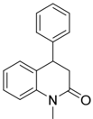

Prepared according to standard conditions. Purification by thin layer chromatography was performed (PE/EA: 6/1) to yield 2t (39 mg, 83%) as a colorless liquid. 1 H NMR (400 MHz, Chloroformd ) δ 7.37 -7.25 (m, 5H), 7.17 (d, J = 7.1 Hz, 2H), 7.07 (d, J = 7.9 Hz, 1H), 7.03 -6.98 (m, 1H), 6.93 (d, J = 7.4 Hz, 1H), 4.24 (t, J = 7.3 Hz, 1H), 3.40 (s, 3H), 3.02 -2.90 (m, 2H). 13 C NMR (101 MHz, Chloroformd ) δ 169.3, 141.0, 140.3, 129.1, 128.8, 128.0, 127.8, 127.7, 127.1, 123.0, 114.8, 41.4, 38.8, 29.5. Prepared according to standard conditions. Purification by thin layer chromatography was performed (PE/EA: 6/1) to yield 2t (39 mg, 83%) as a colorless liquid. 1 H NMR (400 MHz, Chloroformd ) δ 7.37-7.25 (m, 5H), 7.17 (d, J = 7.1 Hz, 2H), 7.07 (d, J = 7.9 Hz, 1H), 7.03-6.98 (m, 1H), 6.93 (d, J = 7.4 Hz, 1H), 4.24 (t, J = 7.3 Hz, 1H), 3.40 (s, 3H), 3.02-2.90 (m, 2H). 13 C NMR (101 MHz, Chloroformd ) δ 169.3, 141.0, 140.3, 129.1, 128.8, 128.0, 127.8, 127.7, 127.1, 123.0, 114.8, 41.4, 38.8, 29.5. Prepared according to standard conditions. Purification by thin layer chromatography was performed (PE/EA: 6/1) to yield 2t (39 mg, 83%) as a colorless liquid. 1 H NMR (400 MHz, Chloroformd ) δ 7.37 -7.25 (m, 5H), 7.17 (d, J = 7.1 Hz, 2H), 7.07 (d, J = 7.9 Hz, 1H), 7.03 -6.98 (m, 1H), 6.93 (d, J = 7.4 Hz, 1H), 4.24 (t, J = 7.3 Hz, 1H), 3.40 (s, 3H), 3.02 -2.90 (m, 2H). 13 C NMR (101 MHz, Chloroformd ) δ 169.3, 141.0, 140.3, 129.1, 128.8, 128.0, 127.8, 127.7, 127.1, 123.0, 114.8, 41.4, 38.8, 29.5.

## 1,3-dimethyl-6-phenyl-3,4-dihydroquinolin-2(1H)-one (3u) 39 1,3-dimethyl-6-phenyl-3,4-dihydroquinolin-2(1H)-one (3u) 39 1,3-dimethyl-6-phenyl-3,4-dihydroquinolin-2(1H)-one (3u) 39

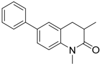

Prepared according to standard conditions. Purification by thin layer chromatography was performed (PE/EA: 6/1) to yield 2u (47 mg, 94%) as a colorless solid.mp: 95-98 °C. 1 H NMR (400 MHz, Chloroformd ) δ 7.58 (d, J = 7.7 Hz, 2H), 7.53 -7.39 (m, 5H), 7.34 (t, J = 7.3 Hz, 1H), 7.04 (d, J = 8.4 Hz, 1H), 3.40 (s, 3H), 3.26 (s, 0.44H), 3.00 (dd, J = 14.8, 5.1 Hz, 0.98H), 2.81 -2.62 (m, 2.07H), 1.43 (s, 0.91H), 1.30 (d, J = 6.7 Hz, 3H). 13 C NMR (101 MHz, Chloroformd ) δ 173.1, 140.2, 139.6, 135.6, 128.8, 127.1, 126. 7, 126.5, 125.9, Prepared according to standard conditions. Purification by thin layer chromatography was performed (PE/EA: 6/1) to yield 2u (47 mg, 94%) as a colorless solid.mp: 95-98 °C. 1 H NMR (400 MHz, Chloroformd ) δ 7.58 (d, J = 7.7 Hz, 2H), 7.53 -7.39 (m, 5H), 7.34 (t, J = 7.3 Hz, 1H), 7.04 (d, J = 8.4 Hz, 1H), 3.40 (s, 3H), 3.26 (s, 0.44H), 3.00 (dd, J = 14.8, 5.1 Hz, 0.98H), 2.81 -2.62 (m, 2.07H), 1.43 (s, 0.91H), 1.30 (d, J = 6.7 Hz, 3H). 13 C NMR (101 MHz, Chloroformd ) δ 173.1, 140.2, 139.6, 135.6, 128.8, 127.1, 126. 7, 126.5, 125.9, 114.8,108.2, 35.5, 33.4, 29.8, 24.4, 15.7. Prepared according to standard conditions. Purification by thin layer chromatography was performed (PE/EA: 6/1) to yield 2u (47 mg, 94%) as a colorless solid.mp: 95-98 ◦ C. 1 H NMR (400 MHz, Chloroformd ) δ 7.58 (d, J = 7.7 Hz, 2H), 7.53-7.39 (m, 5H), 7.34 (t, J = 7.3 Hz, 1H), 7.04 (d, J = 8.4 Hz, 1H), 3.40 (s, 3H), 3.26 (s, 0.44H), 3.00 (dd, J = 14.8, 5.1 Hz, 0.98H), 2.81-2.62 (m, 2.07H), 1.43 (s, 0.91H), 1.30 (d, J = 6.7 Hz, 3H). 13 C NMR (101 MHz, Chloroformd ) δ 173.1, 140.2, 139.6, 135.6, 128.8, 127.1, 126. 7, 126.5, 125.9, 114.8,108.2, 35.5, 33.4, 29.8, 24.4, 15.7.

6-methoxy-1,3-dimethyl-3,4-dihydroquinolin-2(1H)-one

114.8,108.2,

35.5,

33.4,

29.8,

24.4,

15.7.

6-methoxy-1,3-dimethyl-3,4-dihydroquinolin-2(1H)-one

Prepared according

to standard

conditions.

Purification

(3v) 39

(3v) 39

by thin

layer chromatog-

## References

1. Khetmalis, Y.M.; Shivani, M.; Murugesan, S.; Chandra Sekhar, K.V.G. Oxindole and its derivatives: A review on recent progress in biological activities. Biomed. Pharm. 2021 , 141 , 111842. [CrossRef] [PubMed]
2. Kaur, M.; Singh, M.; Chadha, N.; Silakari, O. Oxindole: A chemical prism carrying plethora of therapeutic benefits. Eur. J. Med. Chem. 2016 , 123 , 858-894. [CrossRef] [PubMed]
3. Lai, J.Y.; Cox, P.J.; Patel, R.; Sadiq, S.; Aldous, D.J.; Thurairatnam, S.; Smith, K.; Wheeler, D.; Jagpal, S.; Parveen, S.; et al. Potent small molecule inhibitors of spleen tyrosine kinase (Syk). Bioorg. Med. Chem. Lett. 2003 , 13 , 3111-3114. [CrossRef]
4. Yasuda, D.; Takahashi, K.; Ohe, T.; Nakamura, S.; Mashino, T. Antioxidant activities of 5-hydroxyoxindole and its 3-hydroxy-3phenacyl derivatives: The suppression of lipid peroxidation and intracellular oxidative stress. Bioorg. Med. Chem. 2013 , 21 , 7709-7714. [CrossRef]
5. Yong, S.R.; Ung, A.T.; Pyne, S.G.; Skelton, B.W.; White, A.H. Synthesis of novel 3 ′ -spirocyclic-oxindole derivatives and assessment of their cytostatic activities. Tetrahedron 2007 , 63 , 5579-5586. [CrossRef]
6. Scott, L.J. Ubrogepant: First Approval. Drugs 2020 , 80 , 323-328. [CrossRef]
7. Dandia, A.; Khan, S.; Soni, P.; Indora, A.; Mahawar, D.K.; Pandya, P.; Chauhan, C.S. Diversity-oriented sustainable synthesis of antimicrobial spiropyrrolidine/thiapyrrolizidine oxindole derivatives: New ligands for a metallo-beta-lactamase from Klebsiella pneumonia. Bioorg. Med. Chem. Lett. 2017 , 27 , 2873-2880. [CrossRef]
8. Boddy, A.J.; Bull, J.A. Stereoselective synthesis and applications of spirocyclic oxindoles. Org. Chem. Front. 2021 , 8 , 1026-1084. [CrossRef]
9. Jin, Y.; Wang, L.; Zhang, W.; Wu, H.; Zhang, J. Enantioselective Friedel-Crafts Reaction of Indoles with Isatins Catalyzed by Cinchona Alkaloid Silyl Ether Derivative. Chin. J. Org. Chem. 2021 , 41 , 612-616. [CrossRef]

Prepared according

raphy was

performed

°C.

1 H

(t,

J

NMR

standard to

(PE/EA:

(400

MHz,

=

7.3

Hz,

Hz,

0.98H),

1H), to

6/1)

Chloroform-

7.04

(d,

2.81

2.62

-

MHz,

Chloroform-

114.8,108.2,

35.5, conditions.

yield

(47

2u

d

)

δ

J

Hz,

=

8.4

7.58

1H),

(m,

d

)

2.07H),

δ

33.4,

173.1,

29.8,

1.43

3.40

Purification mg,

(d, by

layer thin

as

94%)

J

7.7

=

(s,

3H),

(s,

140.2,

24.4,

15.7.

## 6-methoxy-1,3-dimethyl-3,4-dihydroquinolin-2(1H)-one (3v) 39 6-methoxy-1,3-dimethyl-3,4-dihydroquinolin-2(1H)-one (3v) 39

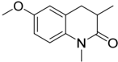

Prepared according to standard conditions. Purification by thin layer chromatography was performed (PE/EA: 6/1) to yield 2u (21 mg, 95%) as a colorless solid.mp: 75-76 °C. 1 H NMR (400 MHz, Chloroformd ) δ 6.85 (d, J = 8.8 Hz, 1H), 6.75 (dd, J = 8.7, 2.9 Hz, 1H), 6.72 -6.69 (m, 1H), 3.77 (s, 1H), 3.76 (s, 3H), 3.30 (s, 3H), 3.16 (s, 0.36H), 2.90 -2.83 (m, 1H), 2.67 -2.54 (m, 2H), 1.34 (s, 0.9H), 1.22 (d, J = 6.6 Hz, 3H). 13 C NMR (101 MHz, Chloroformd ) δ 172.7, 155.2, 133.9, 127.1, 115.3, 114.1, 76.9, 55.5, 35.4, 33.5, 29.9, 24.4, 15.6. Prepared according to standard conditions. Purification by thin layer chromatography was performed (PE/EA: 6/1) to yield 2u (21 mg, 95%) as a colorless solid.mp: 75-76 ◦ C. 1 HNMR(400 MHz, Chloroformd ) δ 6.85 (d, J = 8.8 Hz, 1H), 6.75 (dd, J = 8.7, 2.9 Hz, 1H), 6.72-6.69 (m, 1H), 3.77 (s, 1H), 3.76 (s, 3H), 3.30 (s, 3H), 3.16 (s, 0.36H), 2.90-2.83 (m, 1H), 2.67-2.54 (m, 2H), 1.34 (s, 0.9H), 1.22 (d, J = 6.6 Hz, 3H). 13 C NMR (101 MHz, Chloroformd ) δ 172.7, 155.2, 133.9, 127.1, 115.3, 114.1, 76.9, 55.5, 35.4, 33.5, 29.9, 24.4, 15.6.

## 4. Conclusions 4. Conclusions

In summary, we have developed a mild acidand metal-free photoredox system that enables highly efficient hydroarylation and cyclization of N -arylacrylamides. In this system, aliphatic aldehyde was used instead of strong acid and bromide additive which makes it milder and easier to handle and has probably broader potential applications in the synthesis of more complex compounds. In summary, we have developed a mild acid- and metal-free photoredox system that enables highly efficient hydroarylation and cyclization of N -arylacrylamides. In this system, aliphatic aldehyde was used instead of strong acid and bromide additive which makes it milder and easier to handle and has probably broader potential applications in the synthesis of more complex compounds.

Supplementary Materials: The following supporting information can be downloaded at: www.mdpi.com/xxx/s1, detailed experiments, mechanistic studies, and NMR spectra of all products. Supplementary Materials: The following supporting information can be downloaded at: https: //www.mdpi.com/article/10.3390/catal13061007/s1, detailed experiments, mechanistic studies, and NMRspectra of all products.

Author Contributions: Conceptualization, H.H.; experimental investigation, Z.L.; writing-original draft preparation, Z.L. and H.H.; writing-review and editing, X.J., F.Z. and G.D.; supervision, F.Z. and H.H. All authors have read and agreed to the published version of the manuscript.

Funding: The authors would like to acknowledge the National Natural Science Foundation of China (22071211, 21801076), the Scientific Research Fund of Education Department of Hunan Province (21A0079), the Postgraduate Scientific Research Innovation Project of Hunan Province (CX20220594), and Open Research Fund of School of Chemistry and Chemical Engineering of Henan Normal University (2022C02).

Data Availability Statement: The data that support the findings in the work are available from the corresponding author upon reasonable request.

Conflicts of Interest: The authors declare no conflict of interest.

0.91H),

139.6,

Hz,

3.26

colorless

a

2H),

(s,

1.30

(d, chromatog-

solid.mp:

7.53

-

7.39

0.44H),

J

135.6,

3.00

=

128.8,

Hz,

6.7

127.1,

95-98

(m,

5H),

(dd,

3H).

126.

7.34

J

=

14.8,

13 C

7,

NMR

126.5,

125.9,

5.1

10. Zhou, M.; Sun, J.; Chen, Y.; Jing, Q.; Gao, Q. Decarboxylative Amidation of Acrylamides with Oxamic Acids. Chin. J. Org. Chem. 2022 , 42 , 257-265. [CrossRef]
11. Li, C.C.; Yang, S.D. Various difunctionalizations of acrylamide: An efficient approach to synthesize oxindoles. Org. Biomol. Chem. 2016 , 14 , 4365-4377. [CrossRef]
12. Sakla, A.P.; Kansal, P.; Shankaraiah, N. Syntheses and reactivity of spiro-epoxy/aziridine oxindole cores: Developments in the past decade. Org. Biomol. Chem. 2020 , 18 , 8572-8596. [CrossRef]
13. Kokai, E.; Simig, G.; Volk, B. Literature Survey and Further Studies on the 3-Alkylation of N-Unprotected 3-Monosubstituted Oxindoles. Practical Synthesis of N-Unprotected 3,3-Disubstituted Oxindoles and Subsequent Transformations on the Aromatic Ring. Molecules 2016 , 22 , 24. [CrossRef]
14. Li, D.; Shen, X. Iron- or copper-catalyzed cascade chloromethylation of activated alkenes: Efficient access to chlorinated oxindoles. Tetrahedron Lett. 2020 , 61 , 152316. [CrossRef]
15. Kong, D.L.; Du, J.X.; Chu, W.M.; Ma, C.Y.; Tao, J.Y.; Feng, W.H. Ag/Pyridine Co-Mediated Oxidative Arylthiocyanation of Activated Alkenes. Molecules 2018 , 23 , 2727. [CrossRef] [PubMed]
16. Wang, H.; Guo, L.N.; Duan, X.H. Silver-catalyzed oxidative coupling/cyclization of acrylamides with 1,3-dicarbonyl compounds. Chem. Commun. 2013 , 49 , 10370-10372. [CrossRef] [PubMed]
17. Wei, W.; Wen, J.; Yang, D.; Guo, M.; Tian, L.; You, J.; Wang, H. Copper-catalyzed cyanoalkylarylation of activated alkenes with AIBN: A convenient and efficient approach to cyano-containing oxindoles. RSC Adv. 2014 , 4 , 48535-48538. [CrossRef]
18. Gansauer, A.; von Laufenberg, D.; Kube, C.; Dahmen, T.; Michelmann, A.; Behlendorf, M.; Sure, R.; Seddiqzai, M.; Grimme, S.; Sadasivam, D.V.; et al. Mechanistic study of the titanocene(III)-catalyzed radical arylation of epoxides. Chem.-Eur. J. 2015 , 21 , 280-289. [CrossRef]
19. Muhlhaus, F.; Weissbarth, H.; Dahmen, T.; Schnakenburg, G.; Gansauer, A. Merging Regiodivergent Catalysis with AtomEconomical Radical Arylation. Angew. Chem. Int. Ed. 2019 , 58 , 14208-14212. [CrossRef]
20. Chi, Z.; Gao, Y.; Yang, L.; Zhou, C.; Zhang, M.; Cheng, P.; Li, G. Dearomative spirocyclization via visible-light-induced reductive hydroarylation of non-activated arenes. Chin. Chem. Lett. 2022 , 33 , 225-228. [CrossRef]
21. Gonda, Z.; B é ke, F.; Tischler, O.; Petr ó , M.; Nov á k, Z.; T ó th, B.L. Erythrosine B Catalyzed Visible-Light Photoredox ArylationCyclization of N-Alkyl-N-aryl-2-(trifluoromethyl)acrylamides to 3-(Trifluoromethyl)indolin-2-one Derivatives. Eur. J. Org. Chem. 2017 , 2017 , 2112-2117. [CrossRef]
22. Lu, M.; Liu, Z.; Zhang, J.; Tian, Y.; Qin, H.; Huang, M.; Hu, S.; Cai, S. Synthesis of oxindoles through trifluoromethylation of N-aryl acrylamides by photoredox catalysis. Org. Biomol. Chem. 2018 , 16 , 6564-6568. [CrossRef] [PubMed]
23. Yan, W.; Qu, Z.; Zhao, F.; Deng, G.J.; Mao, G.J.; Huang, H. Visible-Light-Induced Photoredox Dehydrative Coupling/Cyclization of N-Arylacrylamides with Hydroxyketones. Adv. Synth. Catal. 2023 , 365 , 612-617. [CrossRef]
24. Zhu, M.; You, Q.; Li, R. Synthesis of CF2H-containing oxindoles via photoredox-catalyzed radical difluoromethylation and cyclization of N-arylacrylamides. J. Fluor. Chem. 2019 , 228 , 109391. [CrossRef]
25. Wan, X.; Wang, D.; Huang, H.; Mao, G.J.; Deng, G.J. Radical-mediated photoredox hydroarylation with thiosulfonate. Chem. Commun. 2023 , 59 , 2767-2770. [CrossRef]
26. Yang, Z.; Wu, X.; Zhang, J.; Yu, J.T.; Pan, C. Metal-Free Photoinduced Hydrocyclization of Unactivated Alkenes toward Ring-Fused Quinazolin-4(3H)-ones via Intermolecular Hydrogen Atom Transfer. Org. Lett. 2023 , 25 , 1683-1688. [CrossRef]
27. Singh, J.; Sharma, A. Visible Light Mediated Synthesis of Oxindoles. Adv. Synth. Catal. 2021 , 363 , 4284-4308. [CrossRef]
28. Gui, Q.-W.; Teng, F.; Li, Z.-C.; Xiong, Z.-Y.; Jin, X.-F.; Lin, Y.-W.; Cao, Z.; He, W.-M. Visible-light-initiated tandem synthesis of difluoromethylated oxindoles in 2-MeTHF under additive-, metal catalyst-, external photosensitizer-free and mild conditions. Chin. Chem. Lett. 2021 , 32 , 1907-1910. [CrossRef]
29. He, C.; Tang, X.; He, X.; Zhou, Y.; Liu, X.; Feng, X. Regio- and enantioselective conjugate addition of β -nitro α , β -unsaturated carbonyls to construct 3-alkenyl disubstituted oxindoles. Chin. Chem. Lett. 2023 , 34 , 107487. [CrossRef]
30. Marchese, A.D.; Larin, E.M.; Mirabi, B.; Lautens, M. Metal-Catalyzed Approaches toward the Oxindole Core. Acc. Chem. Res. 2020 , 53 , 1605-1619. [CrossRef]
31. Song, Q.; Su, J.; Li, X.; Huang, H. Difluorocarbene-Enabled Synthesis of 3-Substituted-2-oxoindoles from o-Vinylanilines. Chin. J. Org. Chem. 2023 , 43 , 1178-1182. [CrossRef]
32. Wang, H.; Xie, Y.; Zhou, Y.; Cen, N.; Chen, W. Catalyst-free, direct electrochemical trifluoromethylation/cyclization of Narylacrylamides using TfNHNHBoc as a CF3 source. Chin. Chem. Lett. 2022 , 33 , 221-224. [CrossRef]
33. Wang, X.; Liu, Y.; Lu, B.; Li, F. Dirhodium/Xantphos-Catalyzed Tandem C-H Functionalization/Allylic Alkylation: Direct Access to 3-Acyl-3-allyl Oxindole Derivatives from N-Arylα -diazoβ -keto Amides. Chin. J. Org. Chem. 2022 , 42 , 3390-3397. [CrossRef]
34. Zhang, R.-Y.; Xu, M.-M.; Li, H.-Y.; Xu, X.-P.; Ji, S.-J. Cascade reaction involving intramolecular oxygen-migration: Efficient synthesis of 3-allylidene-indolin-2-one compounds under metal-free conditions. Chin. Chem. Lett. 2021 , 32 , 433-436. [CrossRef]
35. Leng, H.; Zhao, Q.; Mao, Q.; Liu, S.; Luo, M.; Qin, R.; Huang, W.; Zhan, G. NHC-catalysed retro-aldol/aldol cascade reaction enabling solvent-controlled stereodivergent synthesis of spirooxindoles. Chin. Chem. Lett. 2021 , 32 , 2567-2571. [CrossRef]
36. Huang, H.; Ji, X.; Zhao, F.; Wu, X. Visible Light-Assisted Photocatalyst-Free Tandem Sulfonylation/ Cyclization for the Synthesis of Oxindoles. Chin. J. Org. Chem. 2022 , 42 , 4323-4331. [CrossRef]
37. Miao, Z.; Zhang, X.; Liu, Y. Research Progress on the Synthetic Method of Five-Membered Spirooxindole Derivatives at C-3 Position. Chin. J. Org. Chem. 2021 , 41 , 3965-3982. [CrossRef]

38. Liu, Z.; Zhong, S.; Ji, X.; Deng, G.-J.; Huang, H. Hydroarylation of Activated Alkenes Enabled by Proton-Coupled Electron Transfer. ACS Catal. 2021 , 11 , 4422-4429. [CrossRef]
39. Liu, Z.; Zhong, S.; Ji, X.; Deng, G.J.; Huang, H. Photoredox Cyclization of N-Arylacrylamides for Synthesis of Dihydroquinolinones. Org. Lett. 2022 , 24 , 349-353. [CrossRef]
40. Qu, Z.; Tian, T.; Tan, Y.; Ji, X.; Deng, G.-J.; Huang, H. Redox-neutral ketyl radical coupling/cyclization of carbonyls with N-aryl acrylamides through consecutive photoinduced electron transfer. Green Chem. 2022 , 24 , 7403-7409. [CrossRef]
41. Nicewicz, D.; Roth, H.; Romero, N. Experimental and Calculated Electrochemical Potentials of Common Organic Molecules for Applications to Single-Electron Redox Chemistry. Synlett 2015 , 27 , 714-723. [CrossRef]
42. Glaser, F.; Kerzig, C.; Wenger, O.S. Multi-Photon Excitation in Photoredox Catalysis: Concepts, Applications, Methods. Angew. Chem. Int. Ed. 2020 , 59 , 10266-10284. [CrossRef] [PubMed]
43. Xu, J.; Cao, J.; Wu, X.; Wang, H.; Yang, X.; Tang, X.; Toh, R.W.; Zhou, R.; Yeow, E.K.L.; Wu, J. Unveiling Extreme Photoreduction Potentials of Donor-Acceptor Cyanoarenes to Access Aryl Radicals from Aryl Chlorides. J. Am. Chem. Soc. 2021 , 143 , 13266-13273. [CrossRef] [PubMed]

Disclaimer/Publisher's Note: The statements, opinions and data contained in all publications are solely those of the individual author(s) and contributor(s) and not of MDPI and/or the editor(s). MDPI and/or the editor(s) disclaim responsibility for any injury to people or property resulting from any ideas, methods, instructions or products referred to in the content.