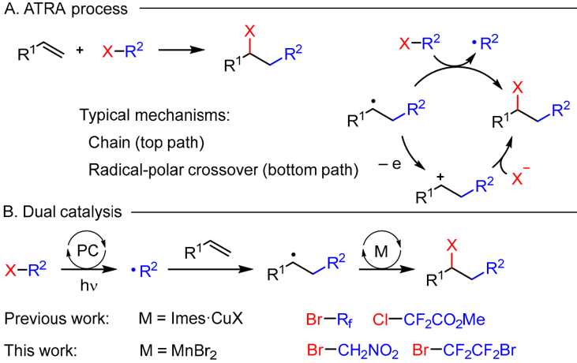
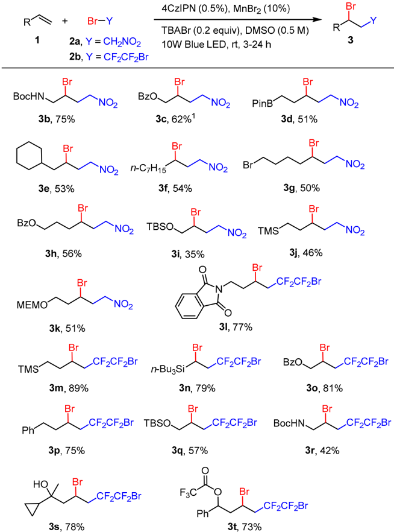
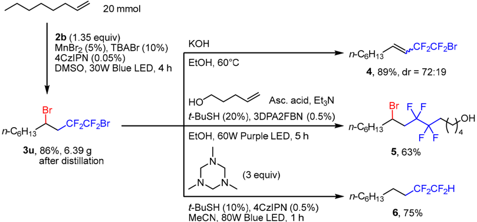
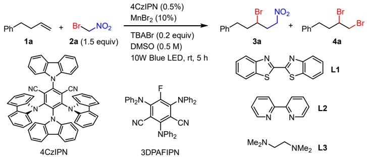
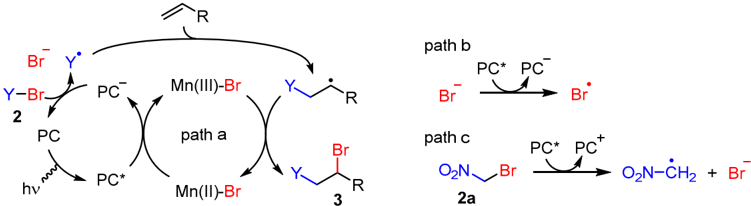
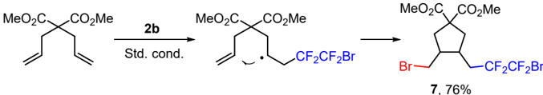

Article

## Atom Transfer Radical Addition via Dual Photoredox/Manganese Catalytic System

Vladislav S. Kostromitin 1,2 , Vitalij V. Levin 1 and Alexander D. Dilman 1, *

- 1 N. D. Zelinsky Institute of Organic Chemistry, Leninsky Prosp. 47, 119991 Moscow, Russia
- 2 Department of Chemistry, Lomonosov Moscow State University, Leninskie Gory 1-3, 119991 Moscow, Russia
* Correspondence: dilman@ioc.ac.ru

Abstract: Atom transfer radical addition of bromonitromethane and 1,2-dibromotetrafluoroethane to alkenes is described. The reaction is performed under blue light irradiation using two catalysts: 4CzIPN and manganese (II) bromide. The cyanoarene photocatalyst serves for the redox activation of starting organic bromide, while the manganese salt facilitates the trapping of the alkyl radical with the formation of the carbon-bromine bond.

Keywords: atom transfer; radical reactions; organofluorine; photocatalysis

## 1. Introduction

Atom transfer radical addition (ATRA) constitutes a valuable way of functionalization of alkenes [1-6]. However, despite intrinsic efficiency, the method has a limited scope, which is associated with a delicate balance of reaction parameters needed for the realization of the sequence of bond-breaking and bond-forming steps. The advent of visible light photocatalysis has offered new opportunities for the generation of free radicals, which have been applied for the cleavage of the carbon-halogen bond [7-11] and successfully used for performing ATRA reactions [2,12]. The best substrates for these processes include perfluorinated alkyl iodides [13-17], bromides bearing an adjacent electron withdrawing group [18-20], and carbon tetrahalides [12,21,22].

The ATRA process may proceed via different mechanisms (Scheme 1A). In a classic chain mechanism, the addition radical abstracts halogen from the starting alkyl halide via a direct halogen transfer step. Alternatively, the addition radical may be oxidized to carbocation followed by capturing halide anion. In 2021 we developed the ATRA reaction of fluorinated alkyl bromides based on the synergistic use of two catalytic cycles-a photoredox cycle responsible for the radical generation and a copper cycle responsible for the carbonbromine bond formation [23,24] (Scheme 1B). However, such readily available halides as bromonitromethane [25] and 1,2-dibromotetrafluoroethane (Halon 2402, Freon 114B2) [26] could not be involved under these conditions, which may be associated with the propensity of used copper complexes towards oxidation by these halides. Recently, Reiser has demonstrated a protocol for the ATRA reaction with bromonitromethane using [Cu(dap)2]Cl as a photocatalyst [27]. Earlier examples of iridium-catalyzed reactions of α -substituted bromonitro compounds involved only styrenes [28]. However, for 1,2-dibromotetrafluoroethane, the ATRA process is known only using reducing systems based on sodium dithionite [29] and Fe/Cp2TiCl2 [30]. It should be noted that the ability to use this fluorinated bromide in combination with alkenes would allow facile synthesis of various organofluorine compounds bearing tetrafluorinated fragments [31] by using subsequent transformations of carbon-bromine bonds.

Herein, we report a method for performing the ATRA reaction of these problematic bromides and unactivated alkenes using dual catalytic system involving manganese (II) salt for effecting carbon-bromine bond formation. In contrast to copper (I), manganese (II) is not prone to facile single electron oxidation, and it would be better suitable as a

Citation: Kostromitin, V.S.; Levin, V.V.; Dilman, A.D. Atom Transfer Radical Addition via Dual Photoredox/Manganese Catalytic System. Catalysts 2023 , 13 , 1126. https://doi.org/10.3390/ catal13071126

Academic Editors: Igor Krylov, Alexander O. Terent'ev and Evgeny Tretyakov

Received: 23 June 2023

Revised: 13 July 2023

Accepted: 17 July 2023

Published: 19 July 2023

Copyright: © 2023 by the authors. Licensee MDPI, Basel, Switzerland. This article is an open access article distributed under the terms and conditions of the Creative Commons Attribution (CC BY) license (https:// creativecommons.org/licenses/by/ 4.0/).

A. ATRA process

· +

RI\

Typical mechanisms:

Chain (top path)

Catalysts

2023

,

13

, x FOR PEER REVIEW

B. Dual catalysis

X-R2

hv

Previous work:

RIN

R2

R2

carrier of the halogen atom to facilitate the carbon-halogen bond formation upon trapping of the alkyl radical. An opportunity of manganese (II) salts to serve for the transfer of a terminating component in a radical alkene difunctionalization process has been recently demonstrated [32]. 2  of  14

RI

· R2

M = Imes ·CuX

This work:

M = MnBr2

Scheme 1. ATRA reaction mechanism.

2. Results

Scheme 1. ATRA reaction mechanism. Scheme 1. ATRA reaction mechanism.

## 2. Results

Herein, we report a method for performing the ATRA reaction of these problematic bromides and unactivated alkenes using dual catalytic system involving manganese (II) salt for effecting carbon-bromine bond formation. In contrast to copper (I), manganese (II) is not prone to facile single electron oxidation, and it would be be tt er suitable as a carrier of the halogen atom to facilitate the carbon-halogen bond formation upon trapping of the alkyl radical. An opportunity of manganese (II) salts to serve for the transfer of a terminating  component  in  a  radical  alkene  difunctionalization  process  has  been  recently demonstrated [32]. 2. Results A reaction of 4-phenylbut-1-ene ( 1a )  with bromonitromethane ( 2a )  was performed employing  manganese  dibromide  (10%)  along  with  tetrabutylammonium  bromide A reaction of 4-phenylbut-1-ene ( 1a ) with bromonitromethane ( 2a ) was performed employing manganese dibromide (10%) along with tetrabutylammonium bromide (TBABr, 20 mol %) in DMSO under 10 W blue LED irradiation, and 4CzIPN was used as a typical carbazolyl based organic photocatalyst [33,34] (Table 1). The desired atom transfer product 3a was isolated in 60% yield, while by-product 4a resulting from the addition of two bromine atoms at the double bond of the alkene was also observed (entry 1). Other solvents and catalysts were less efficient. The decrease in the concentration (from 0.5 to 0.125 M), as well as the use of a more powerful light source, did not lead to a yield increase (entries 5 and 6). The addition of supportive ligands had virtually no effect. In the presence of a copper complex bearing an imidazolium carbene type ligand (Imes · CuBr), the reaction did not proceed at all (entry 12).

(TBABr, 20 mol %) in DMSO under 10 W blue LED irradiation, and 4CzIPN was used as a typical carbazolyl based organic photocatalyst [33,34] (Table 1). The desired atom transfer product 3a was isolated in 60% yield, while by-product 4a resulting from the addition of two bromine atoms at the double bond of the alkene was also observed (entry 1). Other solvents and catalysts were less efficient. The decrease in the concentration (from 0.5 to 0.125 M), as well as the use of a more powerful light source, did not lead to a yield increase (entries 5 and 6). The addition of supportive ligands had virtually no effect. In the presence of a copper complex bearing an imidazolium carbene type ligand (Imes·CuBr), the reaction did not proceed at all (entry 12). Under the optimized conditions, a series of alkenes were subjected to the atom transfer reaction with bromonitromethane 2a and 1,2-dibromotetrafluoroethane 2b (Scheme 2). The reaction tolerates the ester group, N-Boc protected amino fragment, MEM, and TBS protective groups, as well as phthalimide and pinacol boryl fragments. Alkenes having unprotected hydroxyl group, as well as base sensitive trifluoroacetoxy substituent, gave expected products in good yields (compounds 3s and 3t , respectively). In the reaction of styrene with bromonitromethane, a complex mixture was formed containing small amounts of the product (less than 5%). It should also be noted that the amount of dibromide byproducts (similar to 4a ) depends on the nature of alkyl bromide, but not on the alkene. Thus, in reactions of bromonitromethane 2a , about 20% of dibromides were formed for most substrates, while in the case of 2b , dibromides were observed only in amounts of less than 5%.

The reaction may be readily scaled-up. Thus, starting from 20 mmol of 1-octene, target product 3u was obtained in multigram amount (Scheme 3). Importantly, the product was isolated without chromatographic separation simply by vacuum distillation of the crude material. It is also worthy of note that in this experiment the loading of the photocatalyst was decreased ten times up to 0.05 mol %, thereby highlighting the reaction efficiency.

R2

· R2

n-C6H13

‚CF2CF2Br

3и, 86%, 6.39 g after distillation

TMS

Br—Y

2a, Y = CH2NO2

, x FOR PEER REVIEW

Br

BocHN

3b, 75%

Br

Зе, 53%

Br

BzO.

3h, 56%

Bri

MEMO

3k, 51%

Br

\_ CF2CF2Br

3m, 89%

.CFZCF2Br TBSO.

3р, 75%

Bri

3s, 78%

Scheme 2. Synthesis of compounds 3. Isolated yields are shown. 1 60 W LED was usec

20 mmol

2b (1.35 equiv)

MnBrz (5%), TBABr (10%)

Catalysts

2023

,

13

, x FOR PEER REVIEW

5  of  14

BzO

Scheme 2. Synthesis of compounds 3 . Isolated yields are shown.  1  60 W LED was used. Scheme 2. Synthesis of compounds 3 . Isolated yields are shown. 1 60 W LED was used.

The reaction may be readily scaled-up. Thus, starting from 20 mmol of 1-octene, tar-

.

Scheme 3. Gram-scale synthesis and reactions of 3u Scheme 3. Gram-scale synthesis and reactions of 3u .

Products

3

obtained from 1,2-dibromotetrafluoroethane

2b contain two carbon-bro-

mine bonds, which provide opportunities for subsequent functionalization. Given the dif- ferent nature of these C-Br fragments (secondary or perfluorinated), their selective trans-

NO2

NO2

‚CF¿CF¿Br

4CzIPN (0.5%), MnBr2 (10%)

TBABr (0.2 equiv), DMSO (0.5 M)

10W Blue LED, rt, 3-24 h

Br

NOz

PinB

Br

NOz

, x FOR PEER REVIEW

Table 1. Optimization studies. Table 1. Optimization studies.

| Entry 1 Entry   | Deviation from Stand. None Deviation from Stand. Cond.   | Cond. Conv. of >99 Conv. of 1a,% 1   | 1a,% 1 Y. of 3a,% 70 (60) 3 Y. of 3a,% 2   | Y. of 4a,% 20 Y. of 4a,% 2   |
|-----------------|----------------------------------------------------------|--------------------------------------|--------------------------------------------|------------------------------|
| 2 1             | MeCN as solv., 24 None                                   | h >99 >99                            | 56 70 (60) 3                               | 19 20                        |
| 3 4 2           | DMFas solv., 24 3DPAFIPN as PC, MeCN as solv., 24 h      | h 97 h 91 >99                        | 64 32 56                                   | 21 25 19                     |
| 5 3             | 24 Conc. 0.125M h DMFas solv., 24 h                      | >99 97                               | 61 64                                      | 13 21                        |
| 6 7 4           | 60 WLED, 2 1.2 equiv. of 2a , 8 3DPAFIPN as PC, 24 h     | >99 h >99 91                         | 68 68 32                                   | 14 17 25                     |
| 8 5             | L1 (11%) Conc. 0.125M                                    | >99 >99                              | 71 61                                      | 18 13                        |
| 9 6             | L2 (11%) 60 WLED, 2 h                                    | 85 >99                               | 57 68                                      | 20 14                        |
| 10 7            | L3 (11%) 1.2 equiv. of 2a , 8 h                          | 95 >99                               | 48 68                                      | 22 17                        |
| 11 8            | no MnBr 2 L1 (11%)                                       | >99 >99                              | 42 71                                      | 13 18                        |
| 12 9            | Imes·CuBr instead of L2 (11%)                            | MnBr 2 1 85                          | n.d. 57                                    | n.d. 20                      |
| Determined 10   | by analysis. 2 L3 (11%)                                  | by 95                                | 3 Isolated yield. 48                       | 22                           |
| 11              | GC-MS no MnBr 2                                          | Determined NMRanalysis. >99          | 42                                         | 13                           |
| Under the 12    | optimized conditions, Imes · CuBr instead of MnBr 2      | a series of alkenes 1                | were subjected to n.d.                     | the atom trans- n.d.         |

fer reaction with bromonitromethane 2a and 1,2-dibromotetrafluoroethane 2b (Scheme 2). The reaction tolerates the ester group, N-Boc protected amino fragment, MEM, and TBS 1 Determined by GC-MS analysis. 2 Determined by NMR analysis. 3 Isolated yield.

protective groups, as well as phthalimide and pinacol boryl fragments. Alkenes having unprotected hydroxyl group, as well as base sensitive trifluoroacetoxy substituent, gave expected products in good yields (compounds 3s and 3t , respectively). In the reaction of styrene  with  bromonitromethane,  a  complex  mixture  was  formed  containing  small amounts of the product (less than 5%). It should also be noted that the amount of dibromide byproducts (similar to 4a ) depends on the nature of alkyl bromide, but not on the alkene.  Thus,  in  reactions  of  bromonitromethane 2a ,  about  20%  of  dibromides  were formed for most substrates, while in the case of 2b ,  dibromides were observed only in amounts of less than 5%. Products 3 obtained from 1,2-dibromotetrafluoroethane 2b contain two carbon-bromine bonds, which provide opportunities for subsequent functionalization. Given the different nature of these C-Br fragments (secondary or perfluorinated), their selective transformations can be carried out. For example, the treatment of dibromide 3u with potassium hydroxide in ethanol affected the elimination of one bromide leading to alkene 4 as a mixture of geometric isomers in 89% yield. On the other hand, the fluorinated moiety of 3u is apparently more susceptible to single electron reduction and may be preferentially involved in radical reactions. Thus, the interaction of compound 3u with another alkene was performed under photocatalytic conditions. Here, the ascorbic acid under basic conditions was used as stoichiometric reducing agent furnishing hydrofluoroalkylation product 5 . The latter example demonstrates that 1,2-dibromotetrafluoroethane 2b may serve as a template for the synthesis of tetrafluorinated products starting from two different alkenes. Finally, both C-Br bonds can be reduced using the halogen atom transfer (XAT) methodology. In this regard, we applied a triazinane-type reagent recently developed in our group [35] for the conversion of dibromide 3u into tetrafluoroalkane 6 in good yield.

The proposed mechanism is shown in Scheme 4. The photoexcited catalyst may oxidize manganese (II), likely existing in a complex form with bromide anion to manganese (III). The reduced form of the photocatalyst then performs the single electron reduction of organic bromide 2 to generate the radical, which adds to the double bond. At the final step, manganese (III) promotes the bromine transfer leading to product 3 . This mechanism was supported by Stern-Volmer analysis (see Supplementary Materials for details). Thus,

R

path b

Br

Y-Br\_

PC* PČ

Br

Mn(||I)-Br

2

PC

path c path a

OzN\_

‚Br

Dy ne

2a

Mn(|I)-Br

Scheme 4. Propos d mechanism.

Catalysts

2023

Catalysts

2023

PC

PC*

Bř°

,

13

,

13

OzN-CH2 + Br both manganese (II) bromide and bromide anion, as well as their combination, effectively quench the fluorescence of the photocatalyst (paths a and b). It is worth noting that oxidation of bromide anion would generate bromine radical, which itself can oxidize Mn (II) to Mn (III) or recombine with the addition radical leading to product 3 . Moreover, bromine radical can add at the double bond eventually affording dibrominated byproduct 4 . 1,2-Dibromotetrafluoroethane 2b does not quench the fluorescence of 4CzIPN [36], and the reduced form of the photocatalyst is needed. At the same time, bromonitromethane 2a is an effective quencher thereby suggesting that it can be directly reduced by the photoexcited 4CzIPN (path c). The mechanism of the formation of dibromides in reactions of bromonitromethane 2a is not clear at present. It may be tentatively proposed that radical intermediates attack 2a at the oxygen atom followed by the expulsion of bromine radical with its subsequent addition at the double bond, though other pathways cannot be excluded. , x FOR PEER REVIEW 6  of  14 , x FOR PEER REVIEW 6  of  14

Scheme 4. Proposed mechanism. Scheme 4. Proposed mechanism. Scheme 4. Proposed mechanism.

To support the radical character of the reaction, a radical clock experiment was performed (Scheme 5). The reaction of diallylmalonate gave dibromide 7 containing a fivemembered cycle, which results from the rapid intramolecular trapping of the radical intermediate generated from the initial addition of the fluorinated radical. To support the radical character of the reaction, a radical clock experiment was performed (Scheme 5). The reaction of diallylmalonate gave dibromide 7 containing a five-membered cycle, which results from the rapid intramolecular trapping of the radical intermediate generated from the initial addition of the fluorinated radical. To support the radical character of the reaction, a radical clock experiment was performed (Scheme 5). The reaction of diallylmalonate gave dibromide 7 containing a fivemembered cycle, which results from the rapid intramolecular trapping of the radical intermediate generated from the initial addition of the fluorinated radical.

Scheme 5. Radical clock experiment. Scheme 5. Radical clock experiment. Scheme 5. Radical clock experiment.

## 3. Materials and Methods 3. Materials and Methods 3. Materials and Methods

## 3.1. General Information 3.1. General Information 3.1. General Information

trix [38].

All reactions were performed under an argon atmosphere. DMSO was distilled from CaH2 and stored over MS 4 Å. Column chromatography was carried out employing silica gel (230-400 mesh). Precoated silica gel plates F-254 were used for thin-layer analytical chromatography visualizing with UV and/or acidic aq. KMnO4 solution. High-resolution mass-spectra (HRMS) were measured using electrospray ionization (ESI) and a time-offlight (TOF) mass analyzer (Bruker MicrOTOF II). The measurements were conducted in a positive-ion mode (interface capillary voltage -4500 V) or in a negative-ion mode (3200 V); the mass ranged from m / z 50 to m /z 3000. Photo-induced reactions were performed in Duran culture tubes (Roth cat. no K248.1, outside diameter = 12 mm). For irradiation, a strip of 455 nm light-emi tt ing diodes (SMD 2835 -120 LED 1 M Blue, 12 V, 24 W/m; 50 cm strip length) or 455 nm COB LED matrix Hontiey (29-32 V, 3000 mA, 100 W; operated at 60 W) were used. The distance between the reaction vessel and diodes was about 5 mm. The reaction tube was placed in a glass jacket and cooled with water at room temperature. The reaction setup was used as previously described: for LED strip [37] and for LED maAll reactions were performed under an argon atmosphere. DMSO was distilled from CaH2 and stored over MS 4 Å. Column chromatography was carried out employing silica gel (230-400 mesh). Precoated silica gel plates F-254 were used for thin-layer analytical chromatography visualizing with UV and/or acidic aq. KMnO4 solution. High-resolution mass-spectra (HRMS) were measured using electrospray ionization (ESI) and a time-offlight (TOF) mass analyzer (Bruker MicrOTOF II). The measurements were conducted in a positive-ion mode (interface capillary voltage -4500 V) or in a negative-ion mode (3200 V); the mass ranged from m / z 50 to m /z 3000. Photo-induced reactions were performed in Duran culture tubes (Roth cat. no K248.1, outside diameter = 12 mm). For irradiation, a strip of 455 nm light-emi tt ing diodes (SMD 2835 -120 LED 1 M Blue, 12 V, 24 W/m; 50 cm strip length) or 455 nm COB LED matrix Hontiey (29-32 V, 3000 mA, 100 W; operated at 60 W) were used. The distance between the reaction vessel and diodes was about 5 mm. The reaction tube was placed in a glass jacket and cooled with water at room temperature. The reaction setup was used as previously described: for LED strip [37] and for LED maAll reactions were performed under an argon atmosphere. DMSO was distilled from CaH2 and stored over MS 4 Å. Column chromatography was carried out employing silica gel (230-400 mesh). Precoated silica gel plates F-254 were used for thin-layer analytical chromatography visualizing with UV and/or acidic aq. KMnO4 solution. High-resolution mass-spectra (HRMS) were measured using electrospray ionization (ESI) and a time-offlight (TOF) mass analyzer (Bruker MicrOTOF II). The measurements were conducted in a positive-ion mode (interface capillary voltage -4500 V) or in a negative-ion mode (3200 V); the mass ranged from m / z 50 to m /z 3000. Photo-induced reactions were performed in Duran culture tubes (Roth cat. no K248.1, outside diameter = 12 mm). For irradiation, a strip of 455 nm light-emitting diodes (SMD 2835 -120 LED 1 M Blue, 12 V, 24 W/m; 50 cm strip length) or 455 nm COB LED matrix Hontiey (29-32 V, 3000 mA, 100 W; operated at 60 W) were used. The distance between the reaction vessel and diodes was about 5 mm. The reaction tube was placed in a glass jacket and cooled with water at room temperature. The reaction setup was used as previously described: for LED strip [37] and for LED matrix [38].

trix [38].

All commercially available reagents were purchased from Acros Organics, ABCR, or

All commercially available reagents were purchased from Acros Organics, ABCR, or

P&amp;M Invest. Alkenes were distilled prior to use.

tert

-Butyl allylcarbamate [39], allyl ben-

P&amp;M Invest. Alkenes were distilled prior to use.

tert

-Butyl allylcarbamate [39], allyl ben- zoate [40], 2-(but-3-en-1-yl)-4,4,5,5-tetramethyl-1,3,2-dioxaborolane [41], allylcyclohexane

zoate [40], 2-(but-3-en-1-yl)-4,4,5,5-tetramethyl-1,3,2-dioxaborolane [41], allylcyclohexane

[42],  6-bromohex-1-ene  [43],  pent-4-en-1-yl  benzoate  [44],  (allyloxy)(tert-butyl)dime-

[42],  6-bromohex-1-ene  [43],  pent-4-en-1-yl  benzoate  [44],  (allyloxy)(tert-butyl)dime- thylsilane [45], but-3-en-1-yltrimethylsilane [46], 4-((2-methoxyethoxy)methoxy)but-1-ene

thylsilane [45], but-3-en-1-yltrimethylsilane [46], 4-((2-methoxyethoxy)methoxy)but-1-ene

All commercially available reagents were purchased from Acros Organics, ABCR, or P&amp;M Invest. Alkenes were distilled prior to use. tert -Butyl allylcarbamate [39], allyl benzoate [40], 2-(but-3-en-1-yl)-4,4,5,5-tetramethyl-1,3,2-dioxaborolane [41], allylcyclohexane [42], 6-bromohex-1-ene [43], pent-4-en-1-yl benzoate [44], (allyloxy)(tert-butyl)dimethylsilane [45], but-3-en-1-yltrimethylsilane [46], 4-((2-methoxyethoxy)methoxy)but-1-ene [47], 2-(but-3en-1-yl)isoindoline-1,3-dione [48], 4CzIPN [49], 3DPA2FBN [50], and dimethyl diallylmalonate [51] were synthesized according to literature procedures.

## 3.1.1. Synthesis of 2-Cyclopropylpent-4-en-2-ol ( 1s ) [52]

Atwo-neck flask, containing magnesium turnings (40 mmol, 972 mg) was equipped with a magnetic stirring bar, pressure-equalizing dropping funnel, and a condenser with a calcium chloride drying tube. Anhydrous ether (7 mL) and a crystal of iodine (ca. 11 mg) were added. After 5 min of intense stirring, the ether became colorless. The dropping funnel was charged with a solution of allyl bromide (40 mmol, 3.46 mL) and cyclopropyl methyl ketone (20 mmol, 1.87 mL) in anhydrous ether (2 mL), and this solution was added to the suspension of magnesium with intense stirring at such a rate that gentle reflux was maintained (ca. 40 min). The reaction mixture was stirred for 3 h at room temperature, then water (20 mL), and 2M HCl (20 mL) were slowly added, and the resulting mixture was transferred to a separatory funnel. The layers were separated, and the aqueous layer was washed with ether (2 × 10 mL). The combined organic layers were dried with Na2SO4, filtered and concentrated at atmospheric pressure. The residue was distilled under reduced pressure using Hickmann distilling head (bp 62-68 ◦ C, 18 Torr) to give colorless liquid. Yield 2.27 g, 90%. 1 HNMR(300 MHz, Chloroformd ) δ 6.03-5.83 (m, 1H), 5.15-5.02 (m, 2H), 2.38-2.17 (m, 2H), 1.39 (s, 1H), 1.09 (s, 3H), 0.97-0.82 (m, 1H), 0.43-0.22 (m, 4H). 13 C NMR (75 MHz, Chloroformd ) δ 134.4, 118.4, 70.5, 47.8, 26.0, 21.0, 0.61, 0.55.

## 3.1.2. Synthesis of 1-Phenylbut-3-en-1-yl 2,2,2-Trifluoroacetate ( 1t ) [53]

Asolution of 1-phenylbut-3-en-1-ol (10 mmol, 1.48 g) and pyridine (12 mmol, 1.05 mL) in dichloromethane (4 mL) was cooled to 5 ◦ C (water/ice bath) and trifluoroacetic acid anhydride (12 mmol, 1.67 mL) was slowly added. The cooling bath was removed, and the mixture was stirred for 30 min allowing to warm up to room temperature. Then, the reaction was quenched with saturated aqueous solution of NaHCO3 (dropwise, under intense stirring, until evolution of gas has stopped) and transferred to a separatory funnel. The layers were separated, and the aqueous layer was extracted with pentane (2 × 5 mL). The combined organic layers were washed with brine (15 mL), dried with Na2SO4, filtered, and concentrated at atmospheric pressure. The residue was distilled under reduced pressure using Hickmann distilling head (bp 91-96 ◦ C, 13 Torr) to give pale-yellow liquid. Yield 1.94 g, 79%. 1 H NMR (300 MHz, Chloroformd ) δ 7.47-7.25 (m, 5H), 5.95 (dd, J = 8.1, 5.7 Hz, 1H), 5.81-5.61 (m, 1H), 5.22-5.10 (m, 2H), 2.87-2.61 (m, 2H). 13 C NMR (75 MHz, Chloroformd ) δ 156.9 (q, J = 42.5, 41.9 Hz), 137.8, 132.0, 129.1, 128.9, 126.67, 119.5, 114.7 (q, J = 286.2 Hz), 79.8, 40.5. 19 F NMR (282 MHz, Chloroformd ) δ -76.00.

## 3.2. ATRA Reaction of Bromides 2a-b with Alkenes (General Procedure)

Atest tube was evacuated and filled with argon. Then, DMSO (1 mL), TBABr (32 mg, 0.1 mmol), alkene (0.5 mmol), bromide 2 (0.75 mmol, 105 mg for 2a , 89 µ L for 2b ), MnBr2 (11 mg, 0.05 mmol), and 4CzIPN (2 mg, 0.0025 mmol) were added. The tube was screwcapped and irradiated with 455 nm (10 W) strip for 3-24 h. The reaction was quenched with water (5 mL) and extracted (for 3a-l , with methyl tert -butyl ether; for 3m-r , hexane; 3 × 1.5 mL). The combined organic phases were filtered through a short pad of Na2SO4 and concentrated on a rotary evaporator. The residue was purified by column chromatography.

(3-Bromo-5-nitropentyl)benzene ( 3a ). Irradiation time 8 h. Yield 82 mg (60%). Colorless oil. Chromatography: hexane/EtOAc, 15/1. 1 HNMR(300 MHz, CDCl3) δ 7.47-7.20 (m, 5H), 4.64 (t, J = 6.8 Hz, 2H), 4.10-3.95 (m, 1H), 2.97 (ddd, J = 13.9, 8.0, 6.1 Hz, 1H), 2.82 (dt, J = 13.9, 7.9 Hz, 1H), 2.73-2.56 (m, 1H), 2.52-2.34 (m, 1H), 2.34-2.11 (m, 2H). 13 C NMR

(75 MHz, CDCl3) δ 140.3, 128.8, 128.6, 126.5, 73.6, 51.8, 40.8, 36.2, 33.6. HRMS (ESI-TOF): calcd for C11H14[ 81 Br]NO2Na [M+Na]: 296.0080; found 296.0074.

tert-Butyl (2-bromo-4-nitrobutyl)carbamate ( 3b ) [27]. Irradiation time 8 h. Yield 111 mg (75%). Yellow solid. Mp 68-72 ◦ C. Chromatography: hexane/EtOAc, 3/1. 1 HNMR(300 MHz, CDCl3) δ 5.06 (t, J = 6.4 Hz, 1H), 4.70-4.48 (m, 2H), 4.19-4.06 (m, 1H), 3.63-3.41 (m, 2H), 2.70-2.53 (m, 1H), 2.40-2.21 (m, 1H), 1.42 (s, 9H). 13 C NMR (75 MHz, CDCl3) δ 155.9, 80.2, 73.2, 51.2, 47.0, 33.0, 28.4.

2-Bromo-4-nitrobutyl benzoate ( 3c ). Modified general procedure: irradiation using 455 nm 60W LED matrix. Irradiation time 8 h. Yield 94 mg (62%). Pale-yellow oil. Chromatography: hexane/EtOAc, 6/1. 1 H NMR (300 MHz, CDCl3) δ 8.02 (d, J = 7.8 Hz, 2H), 7.64-7.53 (m, 1H), 7.46 (t, J = 7.8 Hz, 2H), 4.70-4.59 (m, 3H), 4.53 (dd, J = 12.0, 6.1 Hz, 1H), 4.39-4.26 (m, 1H), 2.86-2.69 (m, 1H), 2.51-2.32 (m, 1H). 13 C NMR (75 MHz, CDCl3) δ 165.8, 133.6, 129.8, 129.3, 128.67, 73.0, 67.4, 46.4, 32.6. HRMS (ESI-TOF): calcd for C11H12[ 81 Br]NO4Na [M+Na]: 325.9822; found 325.9830.

2-(3-Bromo-5-nitropentyl)-4,4,5,5-tetramethyl-1,3,2-dioxaborolane ( 3d ). Irradiation time 8 h. Yield 82 mg (51%). Colorless oil. Chromatography: hexane/EtOAc, 6/1. 1 H NMR (300 MHz, CDCl3) δ 4.70-4.50 (m, 2H), 4.12-3.97 (m, 1H), 2.68-2.51 (m, 1H), 2.41-2.22 (m, 1H), 2.05-1.86 (m, 2H), 1.23 (s, 12H), 1.12-0.82 (m, 2H). 13 C NMR (75 MHz, CDCl3) δ 83.5, 73.8, 55.1, 35.8, 33.7, 24.9, 24.9, 11.3-7.3 (m). HRMS (ESI-TOF): calcd for C11H21B [ 81 Br]NO4Na [M+Na]: 346.0620; found 346.0612.

(2-Bromo-4-nitrobutyl)cyclohexane ( 3e ). Irradiation time 8 h. Yield 70 mg (53%). Colorless oil. Chromatography: hexane/EtOAc, 20/1. 1 HNMR(300 MHz, CDCl3) δ 4.73-4.49 (m, 2H), 4.20-4.05 (m, 1H), 2.68-2.51 (m, 1H), 2.40-2.23 (m, 1H), 1.92-1.49 (m, 8H), 1.37-1.06 (m, 3H), 1.04-0.73 (m, 2H). 13 C NMR (75 MHz, CDCl3) δ 73.7, 50.5, 46.9, 36.5, 35.7, 33.5, 32.2, 26.5, 26.2, 26.0. HRMS (ESI-TOF): calcd for C10H18[ 81 Br]NO2Na [M+Na]: 288.0393; found 288.0399.

3-Bromo-1-nitrodecane ( 3f ). Irradiation time 8 h. Yield 72 mg (54%). Colorless oil. Chromatography: hexane/EtOAc, 25/1. 1 HNMR(300 MHz, CDCl3) δ 4.72-4.51 (m, 2H), 4.11-3.96 (m, 1H), 2.69-2.52 (m, 1H), 2.43-2.26 (m, 1H), 1.98-1.74 (m, 2H), 1.63-1.38 (m, 2H), 1.36-1.22 (m, 8H), 0.93-0.83 (m, 3H). 13 C NMR (75 MHz, CDCl3) δ 73.7, 52.8, 39.3, 36.2, 31.8, 29.2, 28.9, 27.5, 22.7, 14.2. HRMS (ESI-TOF): calcd for C10H20[ 79 Br]NO2Na [M+Na]: 288.0570; found 288.0567.

3,7-Dibromo-1-nitroheptane ( 3g ). Irradiation time 8 h. Yield 76 mg (50%). Yellow oil. Chromatography: hexane/EtOAc, 6/1. 1 HNMR(300 MHz, CDCl3) δ 4.73-4.52 (m, 2H), 4.11-3.96 (m, 1H), 3.42 (t, J = 6.6 Hz, 2H), 2.70-2.53 (m, 1H), 2.44-2.25 (m, 1H), 2.00-1.51 (m, 6H). 13 C NMR (75 MHz, CDCl3) δ 73.6, 52.1, 38.3, 36.1, 33.12, 32.0, 26.2. HRMS (ESI-TOF): calcd for C7H13[ 81 Br]2NO2Na [M+Na]: 327.9165; found 327.9172.

4-Bromo-6-nitrohexyl benzoate ( 3h ). Irradiation time 8 h. Yield 92 mg (56%). Colorless oil. Chromatography: hexane/EtOAc, 6/1. 1 HNMR(300 MHz, CDCl3) δ 8.02 (d, J = 7.8 Hz, 2H), 7.57 (t, J = 7.4 Hz, 1H), 7.44 (t, J = 7.6 Hz, 2H), 4.73-4.52 (m, 2H), 4.45-4.27 (m, 2H), 4.17-4.04 (m, 1H), 2.72-2.55 (m, 1H), 2.46-2.28 (m, 1H), 2.18-1.83 (m, 4H). 13 C NMR (75 MHz, CDCl3) δ 166.6, 133.2, 130.2, 129.7, 128.5, 73.5, 64.0, 51.9, 36.2, 35.9, 27.0. HRMS (ESI-TOF): calcd for C13H16[ 81 Br]2NO4Na [M+Na]: 354.0135; found 354.0132.

(2-Bromo-4-nitrobutoxy)(tert-butyl)dimethylsilane ( 3i ). Irradiation time 8 h. Yield 55 mg (35%). Colorless oil. Chromatography: hexane/EtOAc, 25/1. 1 HNMR(300 MHz, CDCl3) δ 4.61 (dd, J = 7.6, 6.2 Hz, 2H), 4.10-3.97 (m, 1H), 3.93 (dd, J = 10.7, 4.5 Hz, 1H), 3.77 (dd, J = 10.7, 7.3 Hz, 1H), 2.77 (dtd, J = 15.4, 7.6, 3.5 Hz, 1H), 2.34 (ddt, J = 15.4, 9.5, 6.2 Hz, 1H), 0.90 (s, 9H), 0.09 (s, 3H), 0.08 (s, 3H). 13 C NMR (75 MHz, CDCl3) δ 73.5, 67.3, 50.4, 32.7, 25.9, 18.4, -5.2, -5.3. HRMS (ESI-TOF): calcd for C10H22[ 81 Br]2NO3SiNa [M+Na]: 336.0424; found 336.0432.

(3-Bromo-5-nitropentyl)trimethylsilane ( 3j ). Irradiation time 8 h. Yield 62 mg (46%). Colorless oil. Chromatography: hexane/EtOAc, 25/1. 1 H NMR (300 MHz, CDCl3) δ 4.72-4.52 (m, 2H), 4.00 (dtd, J = 9.5, 6.8, 3.0 Hz, 1H), 2.64 (dtd, J = 15.2, 7.6, 3.0 Hz, 1H), 2.40-2.27 (m, 1H), 1.98-1.74 (m, 2H), 0.74 (ddd, J = 14.1, 10.2, 7.0 Hz, 1H), 0.61 (ddd, J = 14.1,

10.5, 6.9 Hz, 1H), 0.01 (s, 9H). 13 C NMR (75 MHz, CDCl3) δ 73.9, 56.1, 35.4, 34.2, 14.7, -1.7. HRMS (ESI-TOF): calcd for C8H18[ 81 Br]NO2SiNa [M+Na]: 292.0162; found 292.0165.

3-Bromo-1-((2-methoxyethoxy)methoxy)-5-nitropentane ( 3k ). Irradiation time 8 h. Yield 77 mg (51%). Yellow oil. Chromatography: hexane/EtOAc, 1/1. 1 H NMR (300 MHz, CDCl3) δ 4.67 (s, 2H), 4.60 (dd, J = 7.6, 6.1 Hz, 2H), 4.21 (tt, J = 9.3, 3.5 Hz, 1H), 3.77-3.61 (m, 4H), 3.61-3.48 (m, 2H), 3.35 (s, 3H), 2.62 (dtd, J = 15.1, 7.6, 3.5 Hz, 1H), 2.45-2.27 (m, 1H), 2.22-1.95 (m, 2H). 13 C NMR (75 MHz, CDCl3) δ 95.7, 73.6, 71.8, 67.0, 65.0, 59.0, 49.3, 39.0, 36.1. HRMS (ESI-TOF): calcd for C9H18[ 81 Br]NO5Na [M+Na]: 324.0241; found 324.0242.

2-(3,6-Dibromo-5,5,6,6-tetrafluorohexyl)isoindoline-1,3-dione ( 3l ). Irradiation time 5 h. Yield 177 mg (77%). Yellow oil. Chromatography: hexane/EtOAc, 5/1. 1 HNMR(300 MHz, CDCl3) δ 7.84 (dd, J = 5.4, 3.1 Hz, 2H), 7.70 (dd, J = 5.4, 3.1 Hz, 2H), 4.27 (dtd, J = 10.0, 6.6, 3.5 Hz, 1H), 4.00-3.77 (m, 2H), 2.96-2.55 (m, 2H), 2.39 (dtd, J = 14.5, 7.2, 3.5 Hz, 1H), 2.30-2.14 (m, 1H). 13 C NMR (75 MHz, CDCl3) δ 168.1, 134.2, 132.1, 123.4, 117.0 (tt, J = 311.9, 39.0 Hz), 116.2 (tt, J = 257.1, 31.7 Hz), 41.0 (t, J = 2.5 Hz), 39.4 (t, J = 21.3 Hz), 37.4, 37.4, 36.2. 19 F NMR (282 MHz, CDCl3) δ -67.37 (s, 2F), -110.65 (dd, J = 257.2, 27.1 Hz, 1F), -112.33 (dd, J = 257.2, 24.5 Hz, 1F). HRMS (ESI-TOF): calcd for C14H11[ 81 Br]2F4NO2Na [M+Na]: 485.8944; found 485.8922.

(3,6-Dibromo-5,5,6,6-tetrafluorohexyl)trimethylsilane ( 3m ). Irradiation time 5 h. Yield 173 mg (89%). Colorless oil. Chromatography: pentane. 1 H NMR (300 MHz, CDCl3) δ 4.35-4.20 (m, 1H), 2.93-2.59 (m, 2H), 2.04-1.74 (m, 2H), 0.76 (ddd, J = 13.9, 11.9, 4.9 Hz, 3H), 0.63 (ddd, J = 13.9, 11.9, 5.2 Hz, 3H), 0.03 (s, 9H). 13 C NMR (75 MHz, CDCl3) δ 117.8 (tt, J = 312.2, 39.3 Hz), 116.5 (tt, J = 257.3, 32.0 Hz), 48.3, 38.7 (t, J = 21.3 Hz), 34.1, 14.0, -1.7. 19 F NMR (282 MHz, CDCl3) δ -67.09 (s, 2F), -111.01 (dm, J = 256.7 Hz, 1F), -112.41 (dm, J = 256.7 Hz, 1F). Anal. Calcd for C9H16Br2F4Si: C, 27.85; H 4.16. Found: C 27.71, H 4.25.

Tributyl(1,4-dibromo-3,3,4,4-tetrafluorobutyl)silane ( 3n ). Irradiation time 24 h. Yield 191 mg (79%). Colorless oil. Chromatography: hexane. 1 H NMR (300 MHz, CDCl3) δ 3.51 (dd, J = 10.3, 2.7 Hz, 1H), 2.79-2.49 (m, 2H), 1.47-1.22 (m, 12H), 0.91 (t, J = 6.8 Hz, 9H), 0.83-0.63 (m, 6H). 13 C NMR (75 MHz, CDCl3) δ 117.8 (tt, J = 312.0, 39.5 Hz), 116.9 (tt, J = 257.1, 31.1 Hz), 34.9 (t, J = 22.2 Hz), 26.9, 26.8, 26.0, 13.8, 11.0. 19 F NMR (282 MHz, CDCl3) δ -66.96 (s, 2F), -111.46 (dd, J = 258.2, 25.8 Hz, 1F), -114.36 (dd, J = 260.5, 24.6 Hz, 1F). HRMS (ESI-TOF): calcd for C16H30[ 79 Br][ 81 Br]F4SiNa [M+Na]: 509.0292; found 509.0309.

2,5-Dibromo-4,4,5,5-tetrafluoropentyl benzoate ( 3o ). Irradiation time 10 h. Yield 171 mg (81%). Yellow oil. Chromatography: hexane/EtOAc, 20/1. 1 HNMR(300 MHz, CDCl3) δ 8.06 (d, J = 7.2 Hz, 2H), 7.66-7.54 (m, 1H), 7.48 (t, J = 7.7 Hz, 2H), 4.66-4.60 (m, 2H), 4.60-4.47 (m, 1H), 3.08-2.70 (m, 2H). 13 C NMR (75 MHz, CDCl3) δ 165.8, 133.6, 129.9, 129.4, 128.7, 117.0 (tt, J = 311.4, 39.0 Hz), 116.2 (tt, J = 257.2, 31.9 Hz), 67.4, 39.0 (t, J = 2.5 Hz), 36.6 (t, J = 21.8 Hz). 19 F NMR (282 MHz, CDCl3) δ -67.22 (s, 2F), -111.02 (ddd, J = 256.6, 22.9, 11.2 Hz, 1 F), -112.07 (ddd, J = 257.6, 22.1, 12.9 Hz, 1F). HRMS (ESI-TOF): calcd for C12H10[ 81 Br]2F4O2Na [M+Na]: 446.8835; found 446.8832.

(3,6-Dibromo-5,5,6,6-tetrafluorohexyl)benzene ( 3p ). Irradiation time 3 h. Yield 175 mg (75%). Colorless oil. Chromatography: hexane/EtOAc, 100/1. According to 1 HNMRanalysis, the compound contains ca. 3% of impurity, which can be ascribed to the dibromination product 4a [54]. 1 H NMR (300 MHz, CDCl3), 3a : δ 7.40-7.20 (m, 4H), 4.34-4.19 (m, 1H), 3.06-2.61 (m, 4H), 2.40-2.10 (m, 2H); 4a: 3.88 (dd, J = 10.2, 4.3 Hz, 1H), 3.67 (t, J = 9.9 Hz, 1H). 13 C NMR (75 MHz, CDCl3) δ 140.2, 128.7, 128.6, 126.5, 117.2 (tt, J = 311.9, 39.3 Hz), 116.3 (tt, J = 257.1, 257.1, 31.6, 31.6 Hz), 44.3, 40.6, 39.7 (t, J = 21.3 Hz), 33.5. 19 F NMR (282 MHz, CDCl3) δ -67.19 (s, 2F), -110.12 (dd, J = 257.6 Hz, 28.0 Hz, 1F), -112.47 (dd, J = 257.6, 26.0 Hz, 1F). Anal. Calcd for C12H12Br2F4: C, 36.77; H 3.09. Found: C 36.61, H3.25.

tert-Butyl((2,5-dibromo-4,4,5,5-tetrafluoropentyl)oxy)dimethylsilane ( 3q ). Irradiation time 10 h. Yield 123 mg (57%). Colorless oil. Chromatography: hexane/EtOAc, 100/1. 1 HNMR (300 MHz, CDCl3) δ 4.19 (tt, J = 7.1, 4.7 Hz, 1H), 3.93 (dd, J = 10.9, 4.7 Hz, 1H), 3.75 (dd, J = 10.9, 7.1 Hz, 1H), 3.19-2.94 (m, 1H), 2.67-2.41 (m, 1H), 0.90 (s, 9H), 0.09 (s, 3H), 0.08 (s, 3H). 13 C NMR (75 MHz, CDCl3) δ 117.4 (tt, J = 311.3, 38.9 Hz), 116.6 (tt, J = 256.7, 31.6 Hz),

66.9, 42.9 (t, J = 2.3 Hz), 35.6 (t, J = 21.4 Hz), 25.9, 18.4, -5.2, -5.3. 19 F NMR (282 MHz, CDCl3) δ -67.21 (s, 2F), -111.47 (dd, J = 258.2, 22.2 Hz, 1F), -112.52 (dd, J = 255.9, 19.6 Hz, 1F). HRMS (ESI-TOF): calcd for C11H20[ 81 Br]2F4OSiNa [M+Na]: 456.9438; found 456.9415.

tert-Butyl (2,5-dibromo-4,4,5,5-tetrafluoropentyl)carbamate ( 3r ). Irradiation time 5 h. Yield 88 mg (42%). Colorless oil. Chromatography: hexane/EtOAc, 6/1. 1 H NMR (300 MHz, CDCl3) δ 5.03 (s, 1H), 4.40-4.26 (m, 1H), 3.74-3.59 (m, 1H), 3.53-3.38 (m, 1H), 2.90-2.56 (m, 2H), 1.44 (s, 9H). 13 C NMR (75 MHz, CDCl3) δ 155.8, 117.1 (tt, J = 311.7, 38.9 Hz), 116.3 (tt, J = 257.0, 31.6 Hz), 80.3, 47.6, 43.6, 36.9 (t, J = 21.6 Hz), 28.4. 19 F NMR (282 MHz, CDCl3) δ -67.27 (s, 2F), -111.63 (t, J = 18.0 Hz, 2F). HRMS (ESI-TOF): calcd for C10H15[ 81 Br]2F4NO2Na [M+Na]: 441.9257; found 441.9258.

4,7-Dibromo-2-cyclopropyl-6,6,7,7-tetrafluoroheptan-2-ol ( 3s ). Irradiation time 8 h. Yield 151 mg (78%). Colorless oil. Chromatography: hexane/EtOAc, 8/1. Mixture of diastereomers, 5/2. 1 HNMR(300 MHz, Chloroformd ) δ , both isomers: 4.64 ( p , J = 6.6 Hz, 1H), 3.32-2.98 (m, 1H), 2.86-2.56 (m, 1H), 2.38-2.28 (m, 2H), 1.65-1.48 (m, 1H), 1.21 (s, 3H), 0.94-0.81 (m, 1H), 0.57-0.20 (m, 4H). 13 C NMR (75 MHz, Chloroformd ) δ , major isomer: 71.2, 51.6, 40.5 (t, J = 20.8 Hz), 39.6, 27.1, 21.5, 0.9, 0.2; minor isomer: 71.4, 52.3, 40.1 (t, J = 20.7 Hz), 39.7, 28.1, 20.48, 1.0, 0.3; both isomers: 130.0-112.0 (m). 19 F NMR (282 MHz, Chloroformd ) δ , major isomer: -67.26 (s, 2F), -111.80 (t, J = 17.8 Hz, 2F); minor isomer: -67.31 (s, 2F), -110.98 (d, J = 17.8 Hz, 1F), -112.59 (dd, J = 256.4, 25.8 Hz, 1F). HRMS (ESI-TOF): calcd for C10H14[ 81 Br]2F4ONa [M+Na]: 410.9199; found 410.9200.

3,6-Dibromo-5,5,6,6-tetrafluoro-1-phenylhexyl 2,2,2-trifluoroacetate ( 3t ). Irradiation time 24 h. Yield 184 mg (73%). Colorless oil. Chromatography: hexane/EtOAc, 25/1. Mixture of diastereomers, 1/1. 1 HNMR(300 MHz, Chloroformd ) δ , both isomers: 7.50-7.33 (m, 10H), 6.26-6.11 (m, 2H), 4.48-4.32 (m, 1H), 3.87-3.72 (m, 1H), 3.05-2.53 (m, 7H), 2.34-2.19 (m, 1H). 13 C NMR (75 MHz, Chloroformd ) δ , both isomers: 156.6 (q, J = 42.6 Hz), 156.5 (q, J = 42.6 Hz), 137.3, 135.7, 130.0, 129.5, 129.4, 129.2, 127.3, 126.4, 121.9-111.7 (m), 79.3, 78.7, 45.3, 45.3, 43.6, 43.6, 39.8 (t, J = 21.4 Hz), 39.7 (t, J = 21.2 Hz), 39.3. 19 F NMR (282 MHz, Chloroformd ) δ , both isomers: -67.35 (s, 2F), -67.45 (s, 2F), -75.93 (s, 3F), -75.97 (s, 3F), -109.32 (dd, J = 257.5, 30.0 Hz, 2F), -112.12 (dd, J = 104.1, 26.3 Hz, 1F), -113.09 (dd, J = 104.3, 26.6 Hz, 1F). HRMS (ESI-TOF): calcd for C14H11[ 81 Br]2F7O2Na [M+Na]: 528.8866; found 528.8876.

## 3.3. Gram-Scale Synthesis of 1,4-Dibromo-1,1,2,2-tetrafluorodecane ( 3u )

A50 mL Erlenmeyer flask was charged with DMSO (15 mL), and argon was bubbled for 2 min. TBABr (512 mg, 2 mmol), alkene (2.24 g, 20 mmol), bromide 2b (27 mmol, 3.2 mL), MnBr2 (215 mg, 1 mmol), and 4CzIPN (7 mg, 0.01 mmol) were added. The flask was closed with a stopper, placed into a beaker cooled with water flow at room temperature and irradiated for 4 h with a 455 nm 30 W LED matrix placed under the bottom of the beaker. The reaction was quenched with water (30 mL) and extracted with hexane (3 × 10 mL). The combined organic phases were filtered through a short pad of Na2SO4 and concentrated under atmospheric pressure. The residue was distilled under vacuum using a Hickmann distilling head (bp 130-135 ◦ C, 18 Torr) to give colorless oil. Yield 6.39 g (86%). 1 HNMR(300 MHz, Chloroformd ) δ 4.35-4.20 (m, 1H), 2.94-2.55 (m, 2H), 2.07-1.77 (m, 2H), 1.65-1.20 (m, 8H), 0.95-0.84 (m, 3H). 13 CNMR(75MHz,Chloroformd ) δ 117.3 (tt, J = 311.9, 39.1 Hz), 116.4 (tt, J = 257.5, 256.5, 31.6, 31.1 Hz), 45.1, 39.7 (t, J = 21.2 Hz), 39.2 (d, J = 1.7 Hz), 31.7, 28.6, 27.3, 22.67, 14.2. 19 F NMR (282 MHz, Chloroformd ) δ -67.17 (s, 2F), -110.72 (ddd, J = 256.4, 28.3, 9.1 Hz, 1F), -112.77 (dd, J = 257.5, 25.8 Hz, 1F). Anal. Calcd for C10H16Br2F4: C, 32.28; H 4.34. Found: C 32.62, H 4.46.

## 3.4. Synthesis of 1-Bromo-1,1,2,2-tetrafluorodec-3-ene ( 4 )

Potassium hydroxide (0.75 mmol, 42 mg) was added to a stirring solution of compound 3u (0.5 mmol, 186 mg) in ethanol (1 mL) at room temperature. The mixture was heated at 60 ◦ C for 30 min (water bath) and then allowed to cool to room temperature. The mixture was quenched with water (3 mL) and extracted with methyl tert -butyl ether (3 × 2 mL).

The solvent was removed under reduced pressure to give colorless oil. Yield 10 mg, 89%. Mixture of diastereomers, 72:19. 1 H NMR (300 MHz, Chloroformd ) δ , major isomer: 6.50-6.34 (m, 1H), 2.25-2.11 (m, 2H); minor isomer: 6.20-6.03 (m, 1H), 2.38-2.26 (m, 2H); both isomers: 5.71-5.35 (m, 1H), 5.30 (s, 1H), 1.54-1.17 (m, 11H), 0.94-0.84 (m, 4H). 13 C NMR(75 MHz, Chloroformd ) δ , major isomer: 143.5 (t, J = 8.4 Hz), 32.2, 31.7, 28.8, 28.1 (t, J = 1.4 Hz), 22.7, 14.1; minor isomer: 145.6 (t, J = 5.3 Hz), 31.73, 29.2 (d, J = 1.6 Hz), 29.0; both isomers: 122.7-109.7 (m). 19 F NMR (282 MHz, Chloroformd ) δ , major isomer: -66.67 (t, J = 6.6 Hz, 2F), -110.01 (s, 2F); minor isomer: -67.03 (t, J = 6.6 Hz, 2F), -105.19 (s, 2F). Anal. Calcd for C10H15BrF4: C, 41.26; H 5.19. Found: C 41.17, H 5.26.

## 3.5. Synthesis of 9-Bromo-6,6,7,7-tetrafluoropentadecan-1-ol ( 5 )

The reaction tube containing ascorbic acid (132 mg, 0.75 mmol) was evacuated and filled with argon. Then, ethanol (1 mL), triethylamine (104 µ L, 0.75 mmol), pent-4-en-1-ol (0.5 mmol, 43 mg), compound 3u (0.75 mmol, 279 mg), 2-methylpropane-2-thiol (12 µ L, 0.1 mmol) and 3DPA2FBN (1.6 mg, 0.0025 mmol) were added. The tube was screw-capped and irradiated with 400 nm 60W LED matrix for 5 h. The mixture was quenched with water (5 mL) and extracted with methyl tert -butyl ether (3 × 1.5 mL). The combined organic phases were filtered through a short pad of Na2SO4 and concentrated on a rotary evaporator. The residue was purified by column chromatography (hexane/EtOAc, 3/1) to give paleyellow oil. Yield 119 mg, 63%. 1 HNMR(300 MHz, Chloroformd ) δ 4.29 (dtd, J = 10.7, 6.7, 4.1 Hz, 1H), 3.73-3.63 (m, 2H), 2.87-2.47 (m, 2H), 2.16-1.74 (m, 5H), 1.73-1.18 (m, 14H), 0.94-0.83 (m, 3H). 13 C NMR (75 MHz, Chloroformd ) δ 119.0 (tt, J = 249.2, 35.9, 35.1 Hz), 118.2 (tt, J = 251.9, 250.6, 36.1 Hz), 62.5, 46.3, 39.4, 39.3 (t, J = 21.6), 32.3, 31.7, 29.6 (t, J = 22.7 Hz), 28.6, 27.3, 22.7, 17.2 (t, J = 3.7 Hz), 14.2. 19 F NMR (282 MHz, Chloroformd ) δ -114.04 (dd, J = 264.3, 26.5 Hz, 1F), -115.10--116.49 (m, 3F). HRMS (ESI-TOF): calcd for C14H25[ 81 Br]F4ONa [M+Na]: 389.0897; found 389.0906.

## 3.6. Synthesis of 1,1,2,2-Tetrafluorodecane ( 6 )

The reaction tube containing 4CzIPN (2 mg, 0.0025 mmol) was evacuated and filled with argon. Then, acetonitrile (1 mL), 1,3,5-trimethyl-1,3,5-triazinane (194 mg, 1.5 mmol), compound 3u (0.5 mmol, 186 mg) and 2-methylpropane-2-thiol (6 µ L, 0.05 mmol) were added. The tube was screw-capped and irradiated with 455 nm 80W LED matrix for 1 h. The mixture was quenched with water (5 mL) and extracted with methyl tert -butyl ether (3 × 1.5 mL). The combined organic phases were filtered through a short pad of Na2SO4 and concentrated under atmospheric pressure. The residue was purified by column chromatography (dichloromethane) to give colorless oil. Yield 80 mg, 75%. 1 H NMR (300 MHz, Chloroformd ) δ 5.70 (tt, J = 54.1, 3.1 Hz, 1H), 1.95 (tt, J = 18.5, 7.8 Hz, 2H), 1.64-1.51 (m, 2H), 1.47-1.24 (m, 11H), 0.89 (t, J = 6.5 Hz, 3H). 13 C NMR (75 MHz, Chloroformd ) δ 117.8 (tt, J = 245.7, 28.8 Hz), 110.5 (tt, J = 249.1, 41.5 Hz), 31.9, 30.0 (t, J = 22.4 Hz), 29.1, 29.3, 29.2, 22.7, 20.5 (t, J = 3.9 Hz), 14.1. 19 F NMR (282 MHz, Chloroformd ) δ -117.07 (t, J = 18.5 Hz), -136.39 (d, J = 54.1 Hz). Anal. Calcd for C10H18F4: C, 56.06; H 8.47. Found: C 56.18, H 8.61.

## 3.7. Radical Clock Experiment, Synthesis of Dimethyl 3-(3-Bromo-2,2,3,3-tetrafluoropropyl)-4-(bromomethyl)cyclopentane-1,1-dicarboxylate ( 7 )

The reaction was performed the general procedure using dimethyl diallylmalonate and bromide 2b . Irradiation time 5 h. Yield 179 mg (76%). Colorless solid. Mp 60-72 ◦ C. Chromatography: hexane/EtOAc, 10/1. Mixture of diastereomers, 13/1. 1 HNMR(300 MHz, Chloroformd ) δ 3.73 (s, 6H), 3.42-3.20 (m, 2H), 2.68-2.46 (m, 4H), 2.40-1.96 (m, 4H). 13 C NMR(75MHz, Chloroformd ) δ 172.7, 172.5, 117.56 (tt, J = 311.6, 39.7 Hz), 117.4 (tt, J = 255.4, 31.3 Hz), 58.3, 53.2, 44.4, 39.0 (d, J = 2.5 Hz), 38.3, 35.3, 34.9, 32.9, 29.5 (t, J = 22.1 Hz). 19 F NMR (282 MHz, Chloroformd ) δ , major isomer: -66.87 (s, 2F), -110.58 (dd, J = 256.3, 30.1 Hz, 1F), -113.26 (dd, J = 256.3, 28.7 Hz, 1F); minor isomer: -66.74 (s, 2F), -109.88 (dd,

## References

1. Munoz-Molina, J.M.; Belderrain, T.R.; Perez, P.J. Atom Transfer Radical Reactions as a Tool for Olefin Functionalization-On the Way to Practical Applications. Eur. J. Inorg. Chem. 2011 , 2011 , 3155-3164. [CrossRef]
2. Reiser, O. Shining Light on Copper: Unique Opportunities for Visible-Light-Catalyzed Atom Transfer Radical Addition Reactions and Related Processes. Acc. Chem. Res. 2016 , 49 , 1990-1996. [CrossRef] [PubMed]
3. Eckenhoff, W.T.; Pintauer, T. Copper Catalyzed Atom Transfer Radical Addition (ATRA) and Cyclization (ATRC) Reactions in the Presence of Reducing Agents. Catal. Rev. 2010 , 52 , 1-59. [CrossRef]
4. Pintauer, T. Catalyst Regeneration in Transition-Metal-Mediated Atom-Transfer Radical Addition (ATRA) and Cyclization (ATRC) Reactions. Eur. J. Inorg. Chem. 2010 , 2010 , 2449-2460. [CrossRef]
5. Engl, S.; Reiser, O. Copper-photocatalyzed ATRA reactions: Concepts, applications, and opportunities. Chem. Soc. Rev. 2022 , 51 , 5287-5299. [CrossRef]
6. Pintauer, T.; Matyjaszewski, K. Atom transfer radical addition and polymerization reactions catalyzed by ppm amounts of copper complexes. Chem. Soc. Rev. 2008 , 37 , 1087-1097. [CrossRef]
7. Prier, C.K.; Rankic, D.A.; MacMillan, D.W.C. Visible Light Photoredox Catalysis with Transition Metal Complexes: Applications in Organic Synthesis. Chem. Rev. 2013 , 113 , 5322-5363. [CrossRef]
8. Tucker, J.W.; Stephenson, C.R.J. Shining Light on Photoredox Catalysis: Theory and Synthetic Applications. J. Org. Chem. 2012 , 77 , 1617-1622. [CrossRef]
9. Marzo, L.; Pagire, S.K.; Reiser, O.; König, B. Visible-Light Photocatalysis: Does It Make a Difference in Organic Synthesis? Angew. Chem. Int. Ed. 2018 , 57 , 10034-10072. [CrossRef]
10. Candish, L.; Collins, K.D.; Cook, G.C.; Douglas, J.J.; G ó mez-Su á rez, A.; Jolit, A.; Keess, S. Photocatalysis in the Life Science Industry. Chem. Rev. 2022 , 122 , 2907-2980. [CrossRef]
11. Schultz, D.M.; Yoon, T.P. Solar Synthesis: Prospects in Visible Light Photocatalysis. Science 2014 , 343 , 1239176. [CrossRef] [PubMed]
12. Wallentin, C.-J.; Nguyen, J.D.; Finkbeiner, P.; Stephenson, C.R.J. Visible Light-Mediated Atom Transfer Radical Addition via Oxidative and Reductive Quenching of Photocatalysts. J. Am. Chem. Soc. 2012 , 134 , 8875-8884. [CrossRef] [PubMed]
13. Barata-Vallejo, S.; Cooke, M.V.; Postigo, A. Radical Fluoroalkylation Reactions. ACS Catal. 2018 , 8 , 7287-7307. [CrossRef]
14. Chernov, G.I.; Levin, V.V.; Dilman, A.D. Photocatalytic reactions of fluoroalkyl iodides with alkenes. Russ. Chem. Bull. 2023 , 72 , 61-72. [CrossRef]
15. Rosso, C.; Williams, J.D.; Filippini, G.; Prato, M.; Kappe, C.O. Visible-Light-Mediated Iodoperfluoroalkylation of Alkenes in Flow and Its Application to the Synthesis of a Key Fulvestrant Intermediate. Org. Lett. 2019 , 21 , 5341-5345. [CrossRef]
16. Helmecke, L.; Spittler, M.; Baumgarten, K.; Czekelius, C. Metal-Free Activation of C-I Bonds and Perfluoroalkylation of Alkenes with Visible Light Using Phosphine Catalysts. Org. Lett. 2019 , 21 , 7823-7827. [CrossRef] [PubMed]
17. Mao, T.; Ma, M.-J.; Zhao, L.; Xue, D.-P.; Yu, Y.; Gu, J.; He, C.-Y. A general and green fluoroalkylation reaction promoted via noncovalent interactions between acetone and fluoroalkyl iodides. Chem. Commun. 2020 , 56 , 1815-1818. [CrossRef]
18. Li, D.; Mao, T.; Huang, J.; Zhu, Q. Copper-Catalyzed Bromodifluoroacetylation of Alkenes with Ethyl Bromodifluoroacetate. J. Org. Chem. 2018 , 83 , 10445-10452. [CrossRef]
19. Granados, A.; Dhungana, R.K.; Sharique, M.; Majhi, J.; Molander, G.A. From Styrenes to Fluorinated Benzyl Bromides: A Photoinduced Difunctionalization via Atom Transfer Radical Addition. Org. Lett. 2022 , 24 , 4750-4755. [CrossRef]

J = 254.6, 32.0 Hz, 1F), -112.67 (dd, J = 254.6, 26.1 Hz, 1F). HRMS (ESI-TOF): calcd for C13H16[ 81 Br]2F4O4Na [M+Na]: 496.9203; found 496.9185.

## 4. Conclusions

In summary, a method for the atom transfer radical addition of alkenes with readily oxidizable bromonitromethane and Halon 2402 is described. The reaction is performed under blue light irradiation, with readily available manganese (II) salt serving as a key co-catalyst, which facilitates the trapping of the radical intermediate with the formation of the carbon-bromine bond.

Supplementary Materials: The following supporting information can be downloaded at: https:// www.mdpi.com/article/10.3390/catal13071126/s1, Stern-Volmer plots, Copies of NMR spectra.

Author Contributions: V.S.K. experiment; V.V.L. methodology; A.D.D. writing. All authors have read and agreed to the published version of the manuscript.

Funding: This work was supported by the Russian Science Foundation (project 23-13-00130).

Data Availability Statement: The data presented in this study are available in this article.

Conflicts of Interest: The authors declare no conflict of interest.

20. Fedorov, O.V.; Scherbinina, S.I.; Levin, V.V.; Dilman, A.D. Light-Mediated Dual Phosphine-/Copper-Catalyzed Atom Transfer Radical Addition Reaction. J. Org. Chem. 2019 , 84 , 11068-11079. [CrossRef]
21. Matsuo, K.; Yamaguchi, E.; Itoh, A. Atom-Transfer Radical Addition Photocatalysis Using a Heteroleptic Copper Complex. Asian J. Org. Chem. 2018 , 7 , 2435-2438. [CrossRef]
22. Földesi, T.; Sipos, G.; Adamik, R.; Nagy, B.; T ó th, B.L.; B é nyei, A.; Szekeres, K.J.; L á ng, G.G.; Demeter, A.; Peelen, T.J.; et al. Design and application of diimine-based copper(i) complexes in photoredox catalysis. Org. Biomol. Chem. 2019 , 17 , 8343-8347. [CrossRef] [PubMed]
23. Kostromitin, V.S.; Zemtsov, A.A.; Kokorekin, V.A.; Levin, V.V.; Dilman, A.D. Atom-transfer radical addition of fluoroalkyl bromides to alkenes via a photoredox/copper catalytic system. Chem. Commun. 2021 , 57 , 5219-5222. [CrossRef] [PubMed]
24. Kostromitin, V.S.; Zemtsov, A.A.; Levin, V.V.; Dilman, A.D. Photocatalytic Atom-Transfer Radical Addition of Activated Chlorides to Alkenes. Adv. Synth. Cat. 2021 , 363 , 5336-5340. [CrossRef]
25. Fishwick, B.R.; Rowles, D.K.; Stirling, C.J.M. Bromonitromethane-A versatile electrophile. J. Chem. Soc. Perkin Trans. 1986 , 1 , 1171-1179. [CrossRef]
26. Dmowski, W. 1,2-Dibromotetrafluoroethane (Freon 114B2) as a building block for fluorine compounds. J. Fluor. Chem. 2012 , 142 , 6-13. [CrossRef]
27. Reichle, A.; Koch, M.; Sterzel, H.; Großkopf, L.-J.; Floss, J.; Rehbein, J.; Reiser, O. Copper(I) Photocatalyzed Bromonitroalkylation of Olefins: Evidence for Highly Efficient Inner-Sphere Pathways. Angew. Chem. Int. Ed. 2023 , 62 , e202219086. [CrossRef]
28. Tsuchiya, Y.; Onai, R.; Uraguchi, D.; Ooi, T. Redox-regulated divergence in photocatalytic addition of α -nitro alkyl radicals to styrenes. Chem. Commun. 2020 , 56 , 11014-11017. [CrossRef] [PubMed]
29. Wu, F.-H.; Huang, W.-Y. Studies on sulfinatodehalogenation: The addition reaction of halocarbons with olefins initiated by sodium dithionite. J. Fluor. Chem. 2001 , 110 , 59-61. [CrossRef]
30. Hu, C.-M.; Qiu, Y.-L. Addition of 1,2-dihaloperfluoroalkanes to alkenes initiated by dichlorobis( π -cyclopentadienyl)titanium and iron. J. Fluor. Chem. 1991 , 55 , 109-111. [CrossRef]
31. Vaclavik, J.; Klimankova, I.; Budinska, A.; Beier, P. Advances in the Synthesis and Application of Tetrafluoroethylene- and 1,1,2,2-Tetrafluoroethyl-Containing Compounds. Eur. J. Org. Chem. 2018 , 2018 , 3554-3593. [CrossRef]
32. Bian, K.-J.; Nemoto, D., Jr.; Kao, S.-C.; He, Y.; Li, Y.; Wang, X.-S.; West, J.G. Modular Difunctionalization of Unactivated Alkenes through Bio-Inspired Radical Ligand Transfer Catalysis. J. Am. Chem. Soc. 2022 , 144 , 11810-11821. [CrossRef] [PubMed]
33. Speckmeier, E.; Fischer, T.G.; Zeitler, K. A Toolbox Approach To Construct Broadly Applicable Metal-Free Catalysts for Photoredox Chemistry: Deliberate Tuning of Redox Potentials and Importance of Halogens in Donor-Acceptor Cyanoarenes. J. Am. Chem. Soc. 2018 , 140 , 15353-15365. [CrossRef]
34. Shang, T.-Y.; Lu, L.-H.; Cao, Z.; Liu, Y.; He, W.-M.; Yu, B. Recent advances of 1,2,3,5-tetrakis(carbazol-9-yl)-4,6-dicyanobenzene (4CzIPN) in photocatalytic transformations. Chem. Commun. 2019 , 55 , 5408-5419. [CrossRef] [PubMed]
35. Kostromitin, V.S.; Sorokin, A.O.; Levin, V.V.; Dilman, A.D. Aminals as powerful XAT-reagents: Activation of fluorinated alkyl chlorides. Chem. Sci. 2023 , 14 , 3229-3234. [CrossRef] [PubMed]
36. Kostromitin, V.S.; Levin, V.V.; Dilman, A.D. Organophotoredox-Catalyzed Reductive Tetrafluoroalkylation of Alkenes. J. Org. Chem. 2023 , 88 , 6523-6531. [CrossRef]
37. Panferova, L.I.; Levin, V.V.; Struchkova, M.I.; Dilman, A.D. Light-mediated copper-catalyzed phosphorus/halogen exchange in 1,1-difluoroalkylphosphonium salts. Chem. Commun. 2019 , 55 , 1314-1317. [CrossRef]
38. Kosobokov, M.D.; Zubkov, M.O.; Levin, V.V.; Kokorekin, V.A.; Dilman, A.D. Fluoroalkyl sulfides as photoredox-active coupling reagents for alkene difunctionalization. Chem. Commun. 2020 , 56 , 9453-9456. [CrossRef]
39. Kawamoto, A.M.; Wills, M. Enantioselective synthesis of β -hydroxy amines and aziridines using asymmetric transfer hydrogenation of α -amino ketones. J. Chem. Soc. Perkin Trans. 2001 , 1 , 1916-1928. [CrossRef]
40. Yoshida, M.; Higuchi, M.; Shishido, K. Stereoselective Construction of Substituted Chromans by Palladium-Catalyzed Cyclization of Propargylic Carbonates with 2-(2-Hydroxyphenyl)acetates. Org. Lett. 2009 , 11 , 4752-4755. [CrossRef]
41. Sušnik, P.; Hilt, G. Homoallylpinacolboronic Ester as Alkene Component in Cobalt-Catalyzed Alder Ene Reactions. Organometallics 2014 , 33 , 5907-5910. [CrossRef]
42. Beckwith, A.L.J.; Moad, G. Cyclization of 3-allylhex-5-enyl radical: Mechanism, and implications concerning the structures of cyclopolymers. J. Chem. Soc. Perkin Trans. 1975 , 2 , 1726-1733. [CrossRef]
43. Burns, J.M.; Krenske, E.H.; McGeary, R.P. Aromatic Claisen Rearrangements of Benzyl Ketene Acetals: Conversion of Benzylic Alcohols to (ortho-Tolyl)acetates. Eur. J. Org. Chem. 2017 , 2017 , 252-256. [CrossRef]
44. Voutyritsa, E.; Nikitas, N.F.; Apostolopoulou, M.K.; Gerogiannopoulou, A.D.D.; Kokotos, C.G. Photoorganocatalytic Atom Transfer Radical Addition of Bromoacetonitrile to Aliphatic Olefins. Synthesis 2018 , 50 , 3395-3401. [CrossRef]
45. Scheller, M.E.; Frei, B. Syntheses of Cyclopropyl Silyl Ketones. Helv. Chim. Acta 1986 , 69 , 44-52. [CrossRef]
46. Chen, C.; Dugan, T.R.; Brennessel, W.W.; Weix, D.J.; Holland, P.L. Z-Selective Alkene Isomerization by High-Spin Cobalt(II) Complexes. J. Am. Chem. Soc. 2014 , 136 , 945-955. [CrossRef]
47. Lu, Z.; Zeng, X.; Hammond, G.B.; Xu, B. Widely Applicable Hydrofluorination of Alkenes via Bifunctional Activation of Hydrogen Fluoride. J. Am. Chem. Soc. 2017 , 139 , 18202-18205. [CrossRef]

48. Fan, B.-Z.; Hiasa, H.; Lv, W.; Brody, S.; Yang, Z.-Y.; Aldrich, C.; Cushman, M.; Liang, J.-H. Design, synthesis and structure-activity relationships of novel 15-membered macrolides: Quinolone/quinoline-containing sidechains tethered to the C-6 position of azithromycin acylides. Eur. J. Med. Chem. 2020 , 193 , 112222. [CrossRef]
49. Huang, H.; Li, X.; Yu, C.; Zhang, Y.; Mariano, P.S.; Wang, W. Visible-Light-Promoted Nickel- and Organic-Dye-Cocatalyzed Formylation Reaction of Aryl Halides and Triflates and Vinyl Bromides with Diethoxyacetic Acid as a Formyl Equivalent. Angew. Chem. Int. Ed. 2017 , 56 , 1500-1505. [CrossRef]
50. Lux, M.; Klussmann, M. Additions of Aldehyde-Derived Radicals and Nucleophilic N-Alkylindoles to Styrenes by Photoredox Catalysis. Org. Lett. 2020 , 22 , 3697-3701. [CrossRef]
51. Hayashi, Y.; Gotoh, H.; Tamura, T.; Yamaguchi, H.; Masui, R.; Shoji, M. Cysteine-Derived Organocatalyst in a Highly Enantioselective Intramolecular Michael Reaction. J. Am. Chem. Soc. 2005 , 127 , 16028-16029. [CrossRef] [PubMed]
52. Curry, M.J.; Stevens, I.D.R. Preparation and stereochemistry of some 1,1-disubstituted buta-1,3-dienes. J. Chem. Soc. Perkin Trans. 1980 , 1 , 1756-1760. [CrossRef]
53. Creary, X.; O'Donnel, B.D.; Vervaeke, M. Homoallyl -Cyclopropylcarbinyl Cation Manifold. Trimethylsilyl versus Aryl Stabilization. J. Org. Chem. 2007 , 72 , 3360-3368. [CrossRef] [PubMed]
54. Schulz, G.; George, V.; Taser, D.; Kirschning, A. Taming Bromine Azide for Use in Organic Solvents-Radical Bromoazidations and Alcohol Oxidations. J. Org. Chem. 2023 , 88 , 3781-3786. [CrossRef]

Disclaimer/Publisher's Note: The statements, opinions and data contained in all publications are solely those of the individual author(s) and contributor(s) and not of MDPI and/or the editor(s). MDPI and/or the editor(s) disclaim responsibility for any injury to people or property resulting from any ideas, methods, instructions or products referred to in the content.