[pubs.acs.org/acscatalysis](pubs.acs.org/acscatalysis?ref=pdf)

Research Article

## Divergent and Synergistic Photocatalysis: Hydro- and Oxoalkylation of Vinyl Arenes for the Stereoselective Synthesis of Cyclopentanols via a Formal [4+1]-Annulation of 1,3-Dicarbonyls

Narenderreddy Katta, † Quan-Qing Zhao, † Tirtha Mandal, † and Oliver Reiser *

[Cite This: ACS Catal. 2022, 12, 14398-14407](https://pubs.acs.org/action/showCitFormats?doi=10.1021/acscatal.2c04736&ref=pdf)

## ACCESS

[Metrics &amp; More](https://pubs.acs.org/doi/10.1021/acscatal.2c04736?goto=articleMetrics&ref=pdf)

[Article Recommendations](https://pubs.acs.org/doi/10.1021/acscatal.2c04736?goto=recommendations&?ref=pdf)

ABSTRACT: The controllable divergent reactivity of 1,3-dicarbonyls is described, which enables the efficient hydroand oxoalkylation of vinyl arenes. Both reaction pathways are initiated through the formation of polarity-reversed C -centered-radical intermediates at the active methylene center of 1,3-dicarbonyls via direct photocatalytic C -H bond transformations. The oxoalkylation of alkenes is achieved under aerobic conditions via a Cu(II)-photomediated rebound mechanism, while the corresponding hydroalkylation becomes possible under a nitrogen atmosphere by the combination of 4CzIPN and a Brønsted base. The breadth of these divergent protocols is demonstrated in the late-stage modification of drugs and natural products and by the transformation of the products to a variety of heterocycles such as pyridines, pyrroles, or furans. Moreover, the two catalytic modes can be combined synergistically for the stereoselective construction of cyclopentanol derivatives in a formal [4+1]-annulation process.

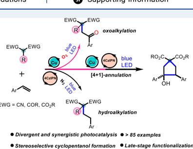

KEYWORDS: cyclopentanols, divergent synthesis, enolate oxidation, photoredox catalysis, synergistic catalysis, visible-light-induced homolysis

## ■ INTRODUCTION

The development of mild and economic methods to selectively construct significant and high-value molecules from simple synthons is of fundamental interest in the field of synthetic chemistry. 1 In this regard, divergent synthesis serves as an appealing yet challenging strategy that enables selective access to diverse scaffolds from the same starting materials, which in turn allows the charting of wider chemical space and the unveiling of distinct mechanistic paradigms. 2 The switch of reaction pathways can be controlled by subtle variations of catalysts or other parameters (additives, solvents, temperature, aerobic or inert gas, etc.). Until now, divergent reactions have been developed mostly using transition metals 2a -d and organocatalysis. 2e,f However, despite this remarkable progress, the exploitation of the photodivergent methodology is still largely underexplored but highly desirable. 3

Over the past decade, visible-light photoredox catalysis has emerged as a powerful platform for the generation of synthetically versatile radical intermediates via single-electron transfer, thus allowing for facile reactions under mild conditions. 4 Accordingly, excellent approaches toward the direct functionalization of alkenes have been achieved on the basis of this catalytic mode. Representative examples are visible-light-driven atom transfer radical additions (ATRAs), 5 or Giese reactions 6 in which the in situ generated radical

species undergo an addition process to polarity-matched alkenes.

Our approach relied on the idea that such reactions could be initiated by generating a radical intermediate via visible-lightmediated single-electron oxidation of a C -H bond that would add to an alkene to produce intermediate A (Scheme 1). The feasibility of developing a photodivergent ATRA reaction pathway is affected by the ability of the reduced photocatalyst to achieve the reduction of incipient radical A . If this is possible, the hydrofunctionalization of alkenes could be achieved in a redox-neutral fashion (path a), while the inability of the reduced photocatalyst to transform A into B calls for an external oxidant (e.g., O 2 ), leading to the oxofunctionalization (path b).

1,3-dicarbonyls serve as one class of readily available and versatile synthons in alkylation reactions by accessing radical intermediates from C -H bond transformation under photocatalytic conditions. 7 For instance, in 2020, Yamashita,

Received:

September 27, 2022

Revised:

October 6, 2022

Published:

November 9, 2022

sı

*

[Supporting Information](https://pubs.acs.org/doi/10.1021/acscatal.2c04736?goto=supporting-info&ref=pdf)

Scheme 1. Photodivergent ATRA: Mechanistic Blueprint

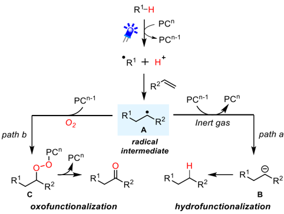

Kobayashi, and co-workers reported the monohydroalkylation of styrenes with malonates. 7a The key to the success was attributed to the use of a Brønsted base -photocatalyst hybrid system to convert malonates to electrophilic alkyl radicals. Later on, Funes-Ardoiz, Ye, and colleagues further extended this methodology to unactivated olefins through dual visiblelight photocatalysis and HAT (hydrogen atom transfer) catalysis. 7b In this case, borane-radical-precursors and thiols are employed as external HAT catalysts. Despite these advances, the twofold oxoalkylation and the corresponding hydroalkylation have not been achieved yet. Herein, we describe the successful execution of the approach outlined in Scheme 1 by the development of a photocatalytic divergent strategy for oxo- and hydroalkylation of vinyl arenes with 1,3- dicarbonyls (Scheme 2A), which culminates in the combination of the two catalytic pathways in a synergistic way to arrive at a new five-membered ring-annulation methodology for the diastereoselective synthesis of cyclopentanols (Scheme 2A).

## ■ RESULTS AND DISCUSSION

Having previously achieved visible-light-driven Cu(II)-catalyzed oxoazidination of alkenes, 8 we aimed to develop an analogous oxoalkylation of enolates derived from 1,3dicarbonyl substrates via visible-light-induced homolysis (dissociative LMCT) of Cu(II)-complexes (Scheme 3). 4b,9

Scheme 3. Concept of Visible-Light-Induced Homolysis (Dissociative LMCT) of Cu(II)-Complexes

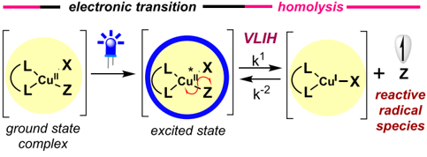

Seminal work on the Cu(II)-induced oxidation of enolates was reported under thermal reaction conditions by Saegusa et al. 10 but has not been explored well till date, which might be a consequence of the slow reaction rate in the key oxidation step. Alternatively, we questioned if a dihydroalkylation reaction of vinyl arenes via photooxidation of enolates with a strongly oxidizing and reducing organo photocatalyst could be developed, i.e., switching the photochemical reactivity by the

Scheme 2. Photodivergent Oxoalkylation and Hydroalkylation of Alkenes with 1,3-Dicarbonyls

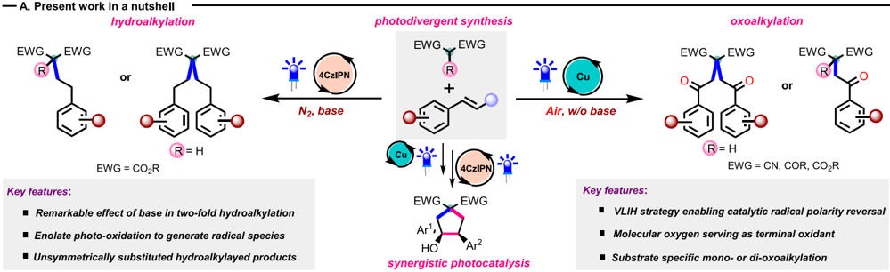

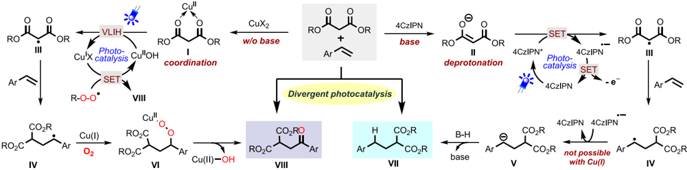

choice of the catalyst and thereby establishing a photodivergent alkene functionalization.

We hypothesized that the key 1,3-dicarbonyl radical intermediate III could arise from visible-light-induced homolysis of Cu(II)-substrate complex I (Scheme 2B, left) or via single-electron oxidation of the enolate anion II by the excited-state photocatalyst 4CzIPN * (Scheme 2B, right). Subsequently, the radical species III adds to the vinyl arene to afford the benzylic radical IV . Radical IV next undergoes a single-electron reduction by the reductive state of the photocatalyst 4CzIPN ·-( E 1/2 = -1.21 V vs SCE in MeCN) 11 and the protonation process to provide the hydroalkylated product VII . On the other hand, given the lower oxidation potential of Cu(I) ( E 1/2 = -0.25 V vs SCE for [Cu I (dap)2]Cl, and -0.36 V vs SCE for [Cu I (dmp)2]Cl, see the Supporting Information), the direct reduction of the radical species IV is not possible but requires molecular O 2 as an external oxidant to give rise to the oxoalkylated product VIII via a peroxo copper species VI .

Using commercially available diethyl malonate ( 1a ) and styrene ( 2a ) as model substrates, the desired diethyl 2-(2-oxo2-phenylethyl)malonate 3 could indeed be obtained in 70% yield by employing Cu(II) (i.e., [Cu II (dap)Cl2]) photocatalyst (PC, 1 mol %) under blue LED irradiation and aerobic conditions (Table 1, entry 1, for further screening details, see the Supporting Information). When the Cu(I) (i.e., [Cu I (dap)2]Cl) photocatalyst (PC, 1 mol %) was used, 3 could also be obtained in 72% yield, in agreement that Cu(II) is easily formed in situ from Cu(I) under aerobic conditions ( E 1/2 = -0.25 V vs SCE; E ox = +0.33 V for molecular oxygen). 8 Other Cu-photocatalyts, including [Cu I (dmp)2]Cl and [Cu II (dmp)2Cl]Cl also performed well; however, with slightly reduced yields (Table 1, entries 3 and 4). No conversion was observed with other commonly used photocatalysts (see the Supporting Information for details). Attempting to facilitate the formation of the enolate of 1a by adding K3PO4 in stoichiometric quantities inhibited the transformation completely (Table 1, entry 5). Moreover, no conversion of the starting materials either to the oxoalkylated 3 or the hydroalkylated product 4 was observed under a N2 atmosphere using the Cu(I) or Cu(II) photocatalyst (Table 1, entries 6 -7).

On the other hand, the twofold hydroalkylation of styrene ( 2a ) with diethyl malonate ( 1a ) to give rise to diethyl 2,2diphenethylmalonate 4 was achieved in 74% yield using 4CzIPN as the photocatalyst (PC, 1 mol %) and K3PO4 as the base (1.0 equiv) in CH3CN under blue LED irradiation (Table 1, entry 8). The addition of a substoichiometric amount of K3PO4 (0.2 equiv) was also found to be effective for the reaction, furnishing the desired product 4 with a slightly reduced yield (Table 1, entry 9). The use of anaerobic conditions and a base (entries 11 -12) was found to be necessary, distinctively differentiating this protocol from the Cu-catalyzed conditions described above. Control experiments revealed that employing a photocatalyst and visible-light irradiation is essential for both reaction pathways.

With the optimized conditions in hand, we explored the scope of the photodivergent process (Tables 2 and 3). We corroborated that a range of 1,3-dicarbonyls were appropriate substrates for the oxoalkylation of vinyl arenes (Table 2). Acyclic malonates were tolerated to afford mono-oxoalkylated products (Tables 2, compounds 3 and 5 -8 ), while for cyclic malonate only the dioxoalkylated product 9 , confirmed by

## Table 1. Reaction Development a

a Condition A: 1a (1 mmol, 2 equiv), 2a (0.5 mmol, 1 equiv), [Cu II (dap)Cl2] (1 mol %), MeCN (0.05 M), blue LED, air, rt, 48 h and Condition B: 1a (0.1 mmol, 1 equiv), 2a (0.3 mmol, 3 equiv), K3PO4 (1 equiv), 4CzIPN (1 mol %), MeCN (0.05 M), blue LED, N2, rt, 24 h. b Determined by NMR analysis using 1,1,2,2tetrachloroethane or 1,3,5-trimethoxybenzene as an internal standard. c 2a (0.1 mmol, 1.0 equiv).

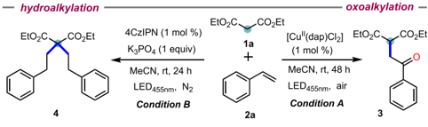

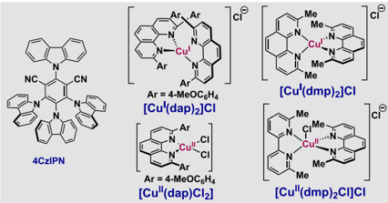

single-crystal X-ray diffraction analysis, could be obtained. 12 Switching to ketoesters and diketones a cleaner reaction was observed under purple LED irradiation using [Cu I (dmp)2]Cl or [Cu II (dmp)2Cl]Cl as the photocatalyst to provide 10 -14 . The reduced efficiency in these cases is due to the formation of a considerable amount of De Mayo products 13 (see the Supporting Information). Moving to cyano derivatives in the 1,3-dicarbonyl moiety results in the dioxoalkylation to give rise to 15 -19 . 14 Of note, mono-oxoalkylation of 1,2-dihydronaphthalene and malononitrile occurred to afford 20 , showing the effect of steric hindrance. To further explore the types of functionalization patterns amenable to this strategy, we looked at substituted cyanoesters and malononitriles to access unsymmetrical oxoalkylated products 21 -23 . Offering ethynyl-4-vinyl benzene to the established reaction conditions, a

## Table 2. Scope of the Oxoalkylation Process a

a Reaction conditions: b 1 (1 mmol, 2 equiv), 2 (0.5 mmol, 1 equiv), [Cu I (dap)2]Cl or [Cu(dap)Cl2] (1 mol %), MeCN (0.05 M), blue LED (455 nm), air, rt, 48 h; c 1 (1 mmol, 2 equiv), 2 (0.5 mmol, 1 equiv), [Cu I (dmp)2]Cl or [Cu II (dmp)2Cl]Cl (1 mol %), MeCN (0.05 M), purple LED (390 nm), air, rt, 48 h; d 1 (1 mmol, 2 equiv), 2 (0.5 mmol, 1 equiv), [Cu I (dmp)2]Cl or [Cu II (dmp)2Cl]Cl (1 mol %), MeOH (0.05 M), blue LED (455 nm), air, rt, 48 h; e 1 (0.4 mmol), 2 (0.2 mmol), MeCN/DCM/CHCl3 (1:1:1); yields are of the isolated products.

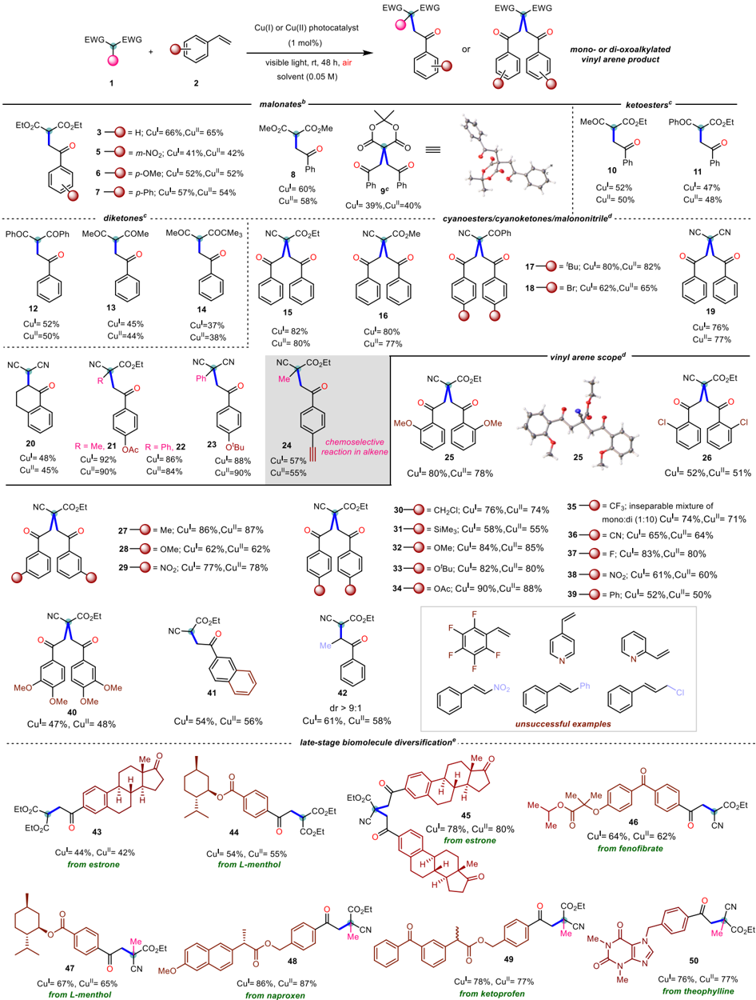

Table 3. Scope of the Hydroalkylation Process a

a Reaction conditions: b 1a (0.1 mmol, 1 equiv), 2 (0.3 mmol, 3 equiv), K3PO4 (1 equiv), 4CzIPN (1 mol %), MeCN (0.05 M), blue LED (455 nm), N2, rt, 24 h. c 2 (1.2 -2.0 equiv), K 3 PO4 (0.8 equiv); yields are of the isolated products.

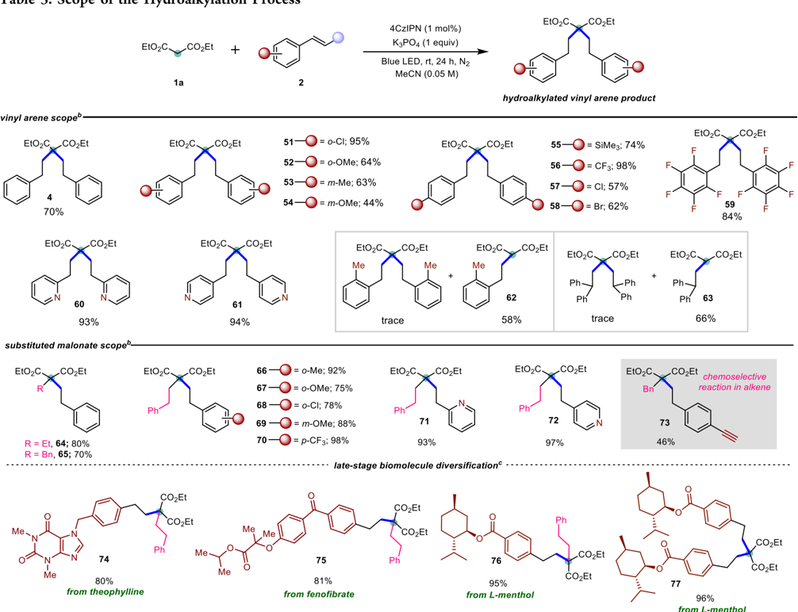

chemoselective reaction was observed only at the styrene double bond to afford compound 24 in good yield.

We next evaluated the scope of the vinyl arenes in the dioxoalkylation reaction with ethyl cyanoacetate 1b , which will enable the preparation of a large panel of 1,5-dicarbonyls, a fundamental structural building block for the assembly of fiveand six-membered carbo and heterocycles and also found as constituents in many natural products and pharmaceuticals. 15 Vinyl arenes decorated with both electron-donating and electron-withdrawing substituents in the para position provided desired dioxoalkylated products in high yields ( 30 -39 , Table 2). We further checked the positional bias on the arene moiety, and gratifyingly metaand orthosubstituted vinyl arenes exhibited significant competency in this transformation ( 25 -29 and 40 ). To complement the amenable set of vinyl arenes, groups like benzyl chloride ( 30 ) and TMS ( 31 ) were well tolerated under the experimental conditions. In addition to a variety of styrenes, polyaromatic 4-vinylbiphenyl and 2vinylnaphthalene were also accommodated, albeit selective mono-oxoalkylation was observed in the latter case, possibly due to steric hindrance ( 39 and 41 ). The vinyl arene derivative adorned with a substituent in the β -position of the styrene selectively gave rise to the monoadduct 42 with high diastereoselectivity.

Next, we inferred that the mildness of our protocol can permit the late-stage application, thus offering access to high levels of possible chemical diversification. In this regard, a representative number of substrates derived from natural products, i.e., estrone ( 43 , 45 ), (-)-menthol ( 44 , 47 ), and drugs, i.e., fenofibrate ( 46 ), naproxen ( 48 ), ketoprofen ( 49 ), and theophylline ( 50 ) successfully underwent oxoalkylation (42 -87%).

We also explored the generality of the hydroalkylation of styrenes (Table 3) under the conditions established for the synthesis of 4 (Table 1). A broad range of substituents on the phenyl ring of vinyl arenes, such as electron-donating and accepting groups in the ortho-, meta, or parapositions could be tolerated to afford products 51 -58 (up to 98%). Notably, highly electron-deficient pentafluoro styrene furnished the desired product 59 in 84% yield. Given the importance of N -containing heterocycles, we deemed 2- and 4-vinylpyridines as important coupling partners, giving rise to 60 and 61 in excellent yields. The use of o -methyl styrene or ethene-1,1diyldibenzene as the starting material resulted in the formation of monohydroalkylated products 62 and 63 , respectively,

indicating the severe steric hindrance of twofold hydroalkylated products.

Diethyl malonates bearing alkyl or benzyl groups were suitable substrates as well to give unsymmetrically substituted hydroalkylated products ( 64 and 65 ). Vinyl arenes bearing a series of electron-donating or electron-accepting groups in the ortho , meta , or para position and also vinyl heteroarenes were accommodated ( 66 -72 ). Also for the hydroalkylation, only the activated double bond of ethynyl-4-vinyl benzene reacted to provide the corresponding hydroalkylated product 73 . We were pleased that the hydroalkylation protocol proved to be effective also in the late-stage functionalizations. In addition to attaching a biologically relevant scaffold to monosubstituted malonate ( 74 -76 ), bringing together two of those through a double hydroalkylation of unsubstituted malonate is possible ( 77 ). Overall, this photodivergent process enables the preparation of oxoalkylated and hydroalkylated styrene derivatives with a highly congested α -quaternary carbon and accentuates the possibility of expanding the domain of drug discovery and may modulate the potency of the parent drugs. 16,17

Given the fact that the photodivergent protocol allows the strategic formation of two different C -C linkages, we envisioned to develop a synergistic photocatalytic pathway 18 by the combination of the oxo- and hydroalkylation process (Table 4). Taking selected products ( 3 , 6 , and 7 ), obtained

Table 4. Synergistic Photocatalysis: Synthesis of Cyclopentanol Derivatives a

a Reaction conditions: Condition A: 1a (1 mmol, 2 equiv), 2 (0.5 mmol, 1 equiv), [Cu I (dap)2]Cl or [Cu II (dap)Cl2] (1 mol %), MeCN (0.05 M), blue LED (455 nm), air, rt, 48 h and Condition B: 3 , 6 -7 (0.1 mmol, 1 equiv), 2 (0.3 mmol, 3 equiv), K3PO4 (1 equiv), 4CzIPN (1 mol %), MeCN (0.05 M), blue LED (455 nm), N2, rt, 24 h. b 4-Vinyl pyridine (1.5 equiv); yields are of the isolated products.

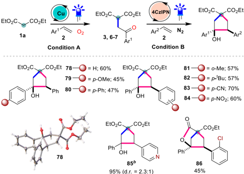

from the oxoalkyation of malonates ( cf . Table 4), the subsequent hydroalkylation with styrenes led to the formation of cycopentanols 78 -86 . The products were obtained with generally high diastereoselectivity, and the annulation sequence was unambiguously proved by the single-crystal X -ray diffraction analysis of 78 . 19 In addition to the synthetic usefulness, this sequence corroborated the mechanistic proposal (Scheme 2B) of an anionic intermediate V .

Scale-up proved to be feasible for both oxoalkylation and hydroalkylation of vinyl arenes (Scheme 4). For example, the

## Scheme 4. Gram-Scale Reactions

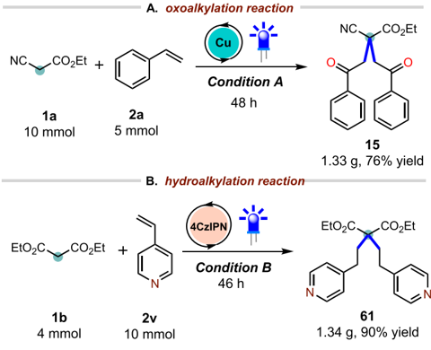

oxoalkylation of styrene 2a with ethyl cyanoacetate 1b was performed on a 5.0 mmol scale to yield 15 without a significant decrease in the isolated yield (76%, Scheme 4A). Likewise, the hydroalkylation of 4-vinyl pyridine with diethyl malonate 1a was also carried out on a 4.0 mmol scale to yield 61 with a comparable yield (90%, Scheme 4B).

The oxo- and hydroalkylation products have the potential as versatile building blocks in organic synthesis. For example, S-, O-, and N-heterocycles can be prepared in a single step from the bisoxoalkylated product 15 (Scheme 5A). 20 Likewise, the trisubstituted pyridine derivative 88 was synthesized from 15 via a condensation -aromatization sequence. The monooxoalkylated product 10 allows access to different 5-membered heterocyclic scaffolds such as 89 and 90 .

On the other hand, the synthetic utility of diethyl 2, 2diphenethylmalonate 4 was demonstrated through the transformation of ester moieties (Scheme 5B). Reduction to diol 91 with LiAlH4 (92%) followed by cyclization to dioxepine 92 proceeded in high yield, representing a structural motif that has been widely applied in the area of material and photoelectrochemistry. 21 Additionally, strained 3,3-diphenethyloxetane 93 could be generated smoothly via nucleophilic substitution -cyclization of diol 91 . In addition, diethyl 2,2diphenethylmalonate 4 is known as a key building block for the construction of the antibiotic potentiator 96 . 22

Finally, to gain more insight into the mechanism, a series of experiments were performed. In line with a mechanistic pathway calling for radical intermediates, the addition of TEMPO completely inhibited both the oxoand hydroalkylation reaction pathways, and the TEMPO adducts 98 and 99 could be characterized (Figure 1A,B). The quantum yield for the Cu-catalyzed oxoalkylation ( = 0.086; see the Supporting Information) makes the possibility of a free radical chain mechanism less likely, which also would not be plausible for the cyclopentanol annulation (Scheme 4). 23 The formation of polarity-reversed 1,3-dicarbonyl radicals in the oxoalkylation process was further confirmed by the generation of products 100 and 101 when the reactions were carried out in the absence of styrene or in the presence of an unactivated alkene partner (Figure 1C). These results also provide an insight into why the scope of the two processes is limited to activated double bonds, i.e., vinyl arenes: We suggest that radical IV (cf. Scheme 2) must be sufficiently stable to shift the equilibrium

Scheme 5. Synthetic Transformations a , b -d

a For the synthesis of S-, O-, and N-heterocycles 87 , see ref 20. b -d For the synthesis of 95 , 96 , and 97 , see ref 22.

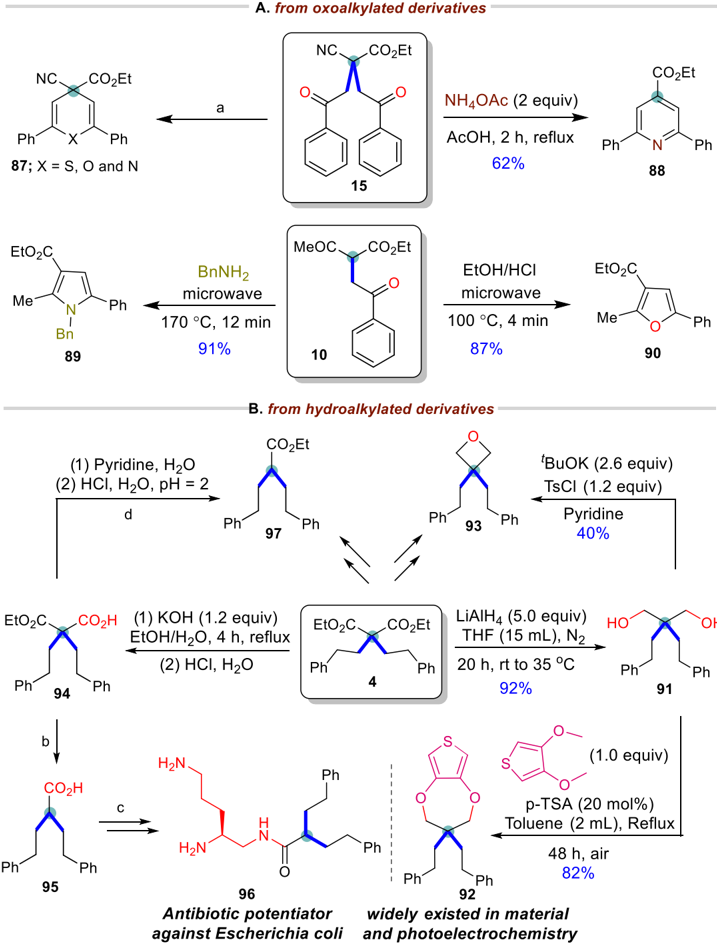

away from the stabilized 1,3-dicarbonyl radical III (or the related 1,3-carbonyl-cyano species) to achieve a productive C -C-coupling. UV -visible experiments clearly indicated that both Cu(I) and Cu(II) photocatalysts exhibit stronger absorption in the visible region through the combination with diethyl malonate 1a , consistent with the intermediacy of Cu-substrate complex I in Scheme 2 (Figure 1D). For the hydroalkylation reaction, Stern -Volmer quenching experiments revealed that only diethyl malonate 1a could quench the excited state of 4CzIPN * with a much higher rate constant in the presence of K3PO4 (Figure 1E). These results suggest that the reaction is initiated by a reductive quenching process, in which 1a undergoes deprotonation followed by oxidation of the resulting enolate by the excited photocatalyst 4CzIPN * .

## ■ CONCLUSIONS

We have discovered a photodivergent strategy for the oxo- and hydroalkylation of vinyl (hetero)arenes with 1,3-dicarbonyls in a mild, economic, and controllable fashion. Both pathways involve enolate photooxidation to generate the polarityreversed 1,3-dicarbonyl radical. The key to the success of this protocol relies on the different reactivity of a benzylic radical intermediate based on the reductive ability of a Cuphotocatalyst or 4CzIPN, thus enabling two distinct catalytic pathways to operate (Scheme 6). This strategy showed a broad substrate scope and high functional group tolerance with each component, providing a complementary access to diversely functionalized products.

In a synergistic interplay of two catalytic manifolds, activation of the malonate via sequential oxoalkylation

e

- D. UV -Vis experiments: oxoalkylation

Acetonitrile

[Cu(dap)2]CI

[Cu(dap)2]CI + 2a

[Cu(dap)2]CI + 1a

Absorption [a.u.]

400|

[- E. Stern-Volmer luminescence quenching: hydroalkylation·](https://pubs.acs.org/doi/10.1021/acscatal.2c04736?fig=fig1&ref=pdf)

1.16

1.14

1.12

1.10

1.08

1.06

1.04

1.02

1.00

0.98 -

0.96 1

0.94 -

0.92 -

0.90 -

0.88

[0.000](https://pubs.acs.org/doi/10.1021/acscatal.2c04736?fig=fig1&ref=pdf)

0,2 -

[0,1 -](https://pubs.acs.org/doi/10.1021/acscatal.2c04736?fig=fig1&ref=pdf)

Figure 1. Mechanistic studies.

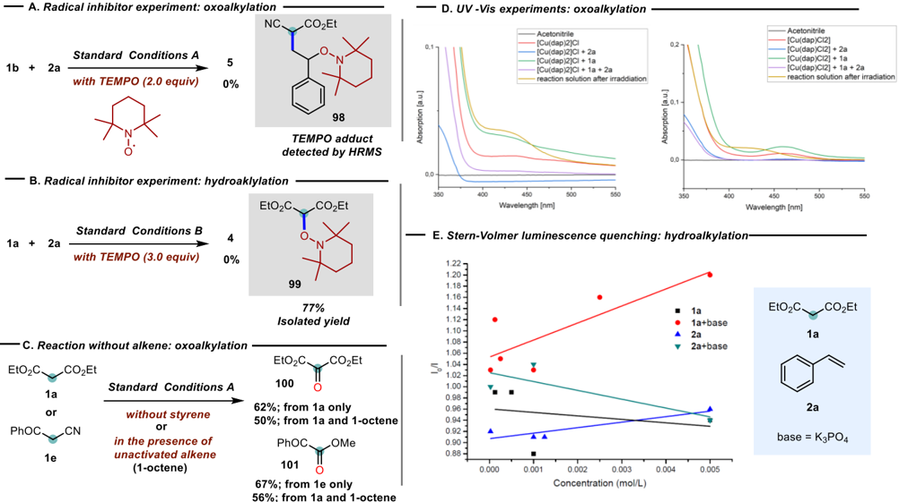

## Scheme 6. Divergent Photocatalysis: Work at a Glance

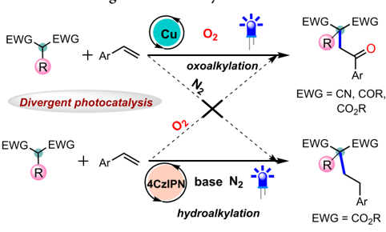

(metallaphotoredox catalysis) and hydroalkylation (organophotoredox catalysis) delivers a variety of highly congested cyclopentanols, thus opening up new opportunities for the construction of cyclic scaffolds. Moreover, the late-stage functionalization further emphasized the utility of this methodology. Ensuing its marked convenience and broad applicability to pharmaceutically relevant scaffolds, we expect this approach will shed new light on the photocatalytic divergent synthesis and find utility within the realm of synthetic and medicinal chemistry research beyond the application we report here.

## ■ ASSOCIATED CONTENT

## * sı Supporting Information

The Supporting Information is available free of charge at https://pubs.acs.org/doi/10.1021/acscatal.2c04736.

Experimental procedures; mechanistic studies; X-ray crystal data; analytical data; and 1 H and 13 C spectra of compounds (PDF)

## [Absorption [a.u.]](https://pubs.acs.org/doi/10.1021/acscatal.2c04736?fig=fig1&ref=pdf)

Acetonitrile

· [Cu(dap)C12]

[Cu(dap)CI2] + 2a

[Cu(dap)CI2] + 1a

[Cu(dap)CI2] + 1a + 2a

Crystallographic data 1 (CIF)

Crystallographic data 2 (CIF)

Crystallographic data 3 (CIF)

## ■ AUTHOR INFORMATION

̈

## Corresponding Author

Oliver Reiser -Institut fu r Organische Chemie, Universit ä t Regensburg, 93053 Regensburg, Germany; orcid.org/ 0000-0003-1430-573X; Email: oliver.reiser@chemie.uniregensburg.de

## Authors

Narenderreddy Katta -Institut fu r Organische Chemie, Universit ä t Regensburg, 93053 Regensburg, Germany Quan-Qing Zhao -Institut fu r Organische Chemie, Universit ä t Regensburg, 93053 Regensburg, Germany; orcid.org/0000-0002-4565-4230

̈

̈

Tirtha Mandal -Institut fu r Organische Chemie, Universit ä t Regensburg, 93053 Regensburg, Germany

Complete contact information is available at: https://pubs.acs.org/10.1021/acscatal.2c04736

## Author Contributions

† N.K., Q.-Q.Z., and T.M. contributed equally to this work. Funding

This work was supported by the Deutsche Forschungsgemeinschaft (DFG, The German Research Foundation) -TRR 325444632635-A2, the DAAD (Ph.D. Research Fellowship N.K.), the China Scholarship Council (Postdoctoral Research Fellowship Q-Q.Z.), and the European Commission (Marie Curie Action CuII -VLIH -101066526; Postdoctoral Research Fellowship T.M.).

## Notes

The authors declare no competing financial interest.

̈

## ■ ACKNOWLEDGMENTS

The authors thank Sabine Stempfhuber and Birgit Hischa for X-ray analysis and Regina Hoheisel for cyclic voltammetry studies (all from The University of Regensburg).

## ■ REFERENCES

- (1) (a) Corey, E. J. The Logic of Chemical Synthesis: Multistep Synthesis of Complex Carbogenic Molecules(Nobel Lecture). Angew. Chem., Int. Ed. 1991 , 30 , 455 -465. (b) Newhouse, T.; Baran, P. S.; Hoffmann, R. W. The economies of synthesis. Chem. Soc. Rev. 2009 , 38 , 3010 -3021.
- (2) (a) Dorn, S. K.; Brown, M. K. Cooperative Pd/Cu Catalysis for Alkene Arylboration: Opportunities for Divergent Reactivity. ACS Catal. 2022 , 12 , 2058 -2063. (b) Hong, F. L.; Ye, L. W. Transition Metal-Catalyzed Tandem Reactions of Ynamides for Divergent NHeterocycle Synthesis. Acc. Chem. Res. 2020 , 53 , 2003 -2019. (c) Ping, L.; Chung, D. S.; Bouffard, J.; Lee, S. G. Transition metal-catalyzed site- and regio-divergent C -Hbond functionalization. Chem. Soc. Rev. 2017 , 46 , 4299 -4328. (d) Lee, Y. C.; Kumar, K.; Waldmann, H. Ligand-Directed Divergent Synthesis of Carbo- and Heterocyclic Ring Systems. Angew. Chem., Int. Ed. 2018 , 57 , 5212 -5226. (e) Beletskaya, I. P.; Najera, C.; Yus, M. Chemodivergent reactions. Chem. Soc. Rev. 2020 , 49 , 7101 -7166. (f) Zhan, G.; Du, W.; Chen, Y. C. Switchable divergent asymmetric synthesis via organocatalysis. Chem. Soc. Rev. 2017 , 46 , 1675 -1692.
- (3) For a review see (a) Sakakibara, Y.; Murakami, K. Switchable Divergent Synthesis Using Photocatalysis. ACS Catal. 2022 , 12 , 1857 -1878. For recent examples (b) Iqbal, N.; Jung, J.; Park, S.; Cho, E. J. Controlled Trifluoromethylation Reactions of Alkynes through Visible-Light Photoredox Catalysis. Angew. Chem., Int. Ed. 2014 , 53 , 539 -542. (c) James, M. J.; Schwarz, J. L.; Strieth-Kalthoff, F.; Wibbeling, B.; Glorius, F. Dearomative Cascade Photocatalysis: Divergent Synthesis through Catalyst Selective Energy Transfer. J. Am. Chem. Soc. 2018 , 140 , 8624 -8628. (d) Xu, J.; Li, Z.; Xu, Y.; Shu, X.; Huo, H. Stereodivergent Synthesis of Both Z- and E-Alkenes by Photoinduced, Ni-Catalyzed Enantioselective C(sp 3 ) -H Alkenylation. ACS Catal. 2021 , 11 , 13567 -13574. (e) Li, J.; Luo, Y.; Cheo, H. W.; Lan, Y.; Wu, J. Photoredox-Catalysis-Modulated, NickelCatalyzed Divergent Difunctionalization of Ethylene. Chem 2019 , 5 , 192 -203. (f) Zhu, S.; Das, A.; Bui, L.; Zhou, H.; Curran, D. P.; Rueping, M. Oxygen Switch in Visible-Light Photoredox Catalysis: Radical Additions and Cyclizations and Unexpected C -C-Bond Cleavage Reactions. J. Am. Chem. Soc. 2013 , 135 , 1823 -1829. (g) Zheng, J.; Dong, X.; Yoon, T. P. Divergent Photocatalytic Reactions of α -Ketoesters under Triplet Sensitization and Photoredox Conditions. Org. Lett. 2020 , 22 , 6520 -6525. (h) Maitland, J. A. P.; Leitch, J. A.; Yamazaki, K.; Christensen, K. E.; Cassar, D. J.; Hamlin, T. A.; Dixon, T. A. Switchable, Reagent-Controlled Diastereodivergent Photocatalytic Carbocyclisation of Imine-Derived α -Amino Radicals. Angew. Chem., Int. Ed. 2021 , 60 , 24116 -24123. (i) Zhu, H.; Zheng, H.; Zhang, J.; Feng, J.; Kong, L.; Zhang, F.; Xue, X. -S.; Zhu, G. Solvent-controlled photocatalytic divergent cyclization of alkynyl aldehydes: access to cyclopentenones and dihydropyranols. Chem. Sci. 2021 , 12 , 11420 -11426. (j) Ghosh, I.; Konig, B. Chromoselective Photocatalysis: Controlled Bond Activation through Light-Color Regulation of Redox Potentials. Angew. Chem., Int. Ed. 2016 , 55 , 7676 -7679.
- (4) (a) Chan, A. Y.; Perry, I. B.; Bissonnette, N. B.; Buksh, B. F.; Edwards, G. A.; Frye, L. I.; Garry, O. L.; Lavagnino, M. N.; Li, B. X.; Liang, Y.; Mao, E.; Millet, A.; Oakley, J. V.; Reed, N. L.; Sakai, H. A.; Seath, C. P.; MacMillan, D. W. C. Metallaphotoredox: The Merger of Photoredox and Transition Metal Catalysis. Chem. Rev. 2022 , 122 , 1485 -1542. (b) Abderrazak, Y.; Bhattacharyya, A.; Reiser, O. VisibleLight-Induced Homolysis of Earth-Abundant Metal-Substrate Complexes: A Complementary Activation Strategy in Photoredox Catalysis. Angew. Chem., Int. Ed. 2021 , 60 , 21100 -21115. (c) Romero, N. A.; Nicewicz, D. A. Organic Photoredox Catalysis. Chem. Rev. 2016 , 116 , 10075 -10166. (d) Prier, C. K.; Rankic, D. A.; MacMillan,
- D. W. C. Visible Light Photoredox Catalysis with Transition Metal Complexes: Applications in Organic Synthesis. Chem. Rev. 2013 , 113 , 5322 -5363.
- (5) (a) Courant, T.; Masson, G. Recent Progress in Visible-Light Photoredox-Catalyzed Intermolecular 1,2-Difunctionalization of Double Bonds via an ATRA-Type Mechanism. J. Org. Chem. 2016 , 81 , 6945 -6952. (b) Engl, S.; Reiser, O. Copper-photocatalyzed ATRA reactions: concepts, applications, and opportunities. Chem. Soc. Rev. 2022 , 51 , 5287 -5299.
- (6) (a) Kitcatt, D. M.; Nicolle, S.; Lee, A. L. Direct decarboxylative Giese reactions. Chem. Soc. Rev. 2022 , 51 , 1415 -1453. (b) Gant Kanegusuku, A. L.; Roizen, J. L. Recent Advances in PhotoredoxMediated Radical Conjugate Addition Reactions: An Expanding Toolkit for the Giese Reaction. Angew. Chem., Int. Ed. 2021 , 60 , 21116 -21149.

́

- (7) (a) Bas , S.; Yamashita, Y.; Kobayashi, S. Development of Brønsted Base -Photocatalyst Hybrid Systems for Highly Efficient C -C Bond Formation Reactions of Malonates with Styrenes. ACS Catal. 2020 , 10 , 10546 -10550. (b) Lei, G.; Xu, M.; Chang, R.; FunesArdoiz, I.; Ye, J. Hydroalkylation of Unactivated Olefins via VisibleLight-Driven Dual Hydrogen Atom Transfer Catalysis. J. Am. Chem. Soc. 2021 , 143 , 11251 -11261. (c) Zhao, Q. Q.; Rehbein, J.; Reiser, O. Thermoneutral synthesis of spiro-1,4-cyclohexadienes by visiblelight-driven dearomatization of benzylmalonates. Green Chem. 2022 , 24 , 2772 -2776. (d) Dong, M.-Y.; Han, C.-Y.; Li, D.-S.; Hong, Y.; Liu, F.; Deng, H.-P. Hydrogen-Evolution Allylic C(sp 3 ) -H Alkylation with Protic C(sp 3 ) -H Bonds via Triplet Synergistic Brønsted Base/ Cobalt/Photoredox Catalysis. ACS Catal. 2022 , 12 , 9533 -9539.
- (8) Hossain, A.; Vidyasagar, A.; Eichinger, C.; Lankes, C.; Phan, J.; Rehbein, J.; Reiser, O. Visible-Light-Accelerated Copper(II)-Catalyzed Regioand Chemoselective Oxo-Azidation of Vinyl Arenes. Angew. Chem., Int. Ed. 2018 , 57 , 8288 -8292.
- (9) (a) Kochi, J. K. Photolyses of Metal Compounds: Cupric Chloride in Organic Media. J. Am. Chem. Soc. 1962 , 84 , 2121 -2127. (b) Fayad, R.; Engl, S.; Danilov, E. O.; Hauke, C. E.; Reiser, O.; Castellano, F. N. Direct Evidence of Visible Light-Induced Homolysis in Chlorobis(2,9-dimethyl-1,10-phenanthroline)copper(II). J. Phys. Chem. Lett. 2020 , 11 , 5345 -5349. (c) Li, Y.; Zhou, K.; Wen, Z.; Cao, S.; Shen, X.; Lei, M.; Gong, L. Copper(II)-Catalyzed Asymmetric Photoredox Reactions: Enantioselective Alkylation of Imines Driven by Visible Light. J. Am. Chem. Soc. 2018 , 140 , 15850 -15858. (d) Xu, P.; Lo ′ pez-Rojas, P.; Ritter, T. Radical Decarboxylative Carbometalation of Benzoic Acids: A Solution to Aromatic Decarboxylative Fluorination. J. Am. Chem. Soc. 2021 , 143 , 5349 -5354. (e) Li, Q. Y.; Gockel, S. N.; Lutovsky, G. A.; DeGlopper, K. S.; Baldwin, N. J.; Bundesmann, M. W.; Tucker, J. W.; Bagley, S. W.; Yoon, T. P. Decarboxylative cross-nucleophile coupling via ligand-to-metal charge transfer photoexcitation of Cu(II) carboxylates. Nat. Chem. 2022 , 14 , 94 -99.
- (10) Ito, Y.; Konoike, T.; Harada, T.; Saegusa, T. Synthesis of 1,4diketones by oxidative coupling of ketone enolates with copper(II) chloride. J. Am. Chem. Soc. 1977 , 99 , 1487 -1493.
- (11) [Luo, J.; Zhang, J. Donor -Acceptor Fluorophores for VisibleLight-Promoted Organic Synthesis: Photoredox/Ni Dual Catalytic C(sp 3 ) -C(sp 2 ) Cross-Coupling. ACS Catal. 2016 , 6 , 873 -877.](https://doi.org/10.1021/acscatal.5b02204?urlappend=%3Fref%3DPDF&jav=VoR&rel=cite-as)
- (12) CCDC deposition number 2196932 for compound 9 and 2196135 for compound 25 contains the supplementary crystallographic data for this paper.
- (13) De Mayo, P.; Takashita, H.; Satter, A. B. The photochemical synthesis of 1, 5-diketones and their cyclisation: a new annulation process. Proc. Chem. Soc. 1962 , 1962 , 119.
- (14) Zhang, S. -L.; Wang, X. -J.; Yu, Z. -L. Chemoselective Access to γ -Ketoesters with Stereogenic Quaternary α -Center or γ -Keto Nitriles by Aerobic Reaction of α -Cyanoesters and Styrenes. Org Lett. 2017 , 19 , 3139 -3142.
- (15) [(a) Che, C.; Qian, Z.; Wu, M.; Zhao, Y.; Zhu, G. Intermolecular Oxidative Radical Addition to Aromatic Aldehydes: Direct Access to 1,4and 1,5-Diketones via Silver-Catalyzed RingOpening Acylation of Cyclopropanols and Cyclobutanols. J. Org.](https://doi.org/10.1021/acs.joc.8b00666?urlappend=%3Fref%3DPDF&jav=VoR&rel=cite-as)

Chem. 2018 , 83 , 5665 -5673. (b) Bellina, F.; Rossi, R. Synthesis and biological activity of pyrrole, pyrroline and pyrrolidine derivatives with two aryl groups on adjacent positions. Tetrahedron 2006 , 62 , 7213 -7256.

- (16) Hoffmann, T.; Gastreich, M. The next level in chemical space navigation: going far beyond enumerable compound libraries. Drug Discovery Today 2019 , 24 , 1148 -1156.
- (17) Reymond, J. L.; Awale, M. Exploring chemical space for drug discovery using the chemical universe database. ACS Chem. Neurosci. 2012 , 3 , 649 -657.
- (18) (a) Skubi, K. L.; Blum, T. R.; Yoon, T. P. Dual Catalysis Strategies in Photochemical Synthesis. Chem. Rev. 2016 , 116 , 10035 -10074. (b) Lang, X.; Zhao, J.; Chen, X. Cooperative photoredox catalysis. Chem. Soc. Rev. 2016 , 45 , 3026 -3038.
- (19) CCDC deposition number 2196133 for compound 78 contains the supplementary crystallographic data for this paper.
- (20) Padmavathi, V.; Balaiah, A.; Reddy, D. B. 2,6-diaryl-4,4disubstituted-4H-thiopyran: Source for spiro heterocycles. J. Heterocycl. Chem. 2002 , 39 , 649 -653.
- (21) (a) Shallcross, R. C.; D'Ambruoso, G. D.; Pyun, J.; Armstrong, N. R. Photoelectrochemical processes in polymer-tethered CdSe nanocrystals. J. Am. Chem. Soc. 2010 , 132 , 2622 -2632. (b) Ma, H. L.; Liu, C. C.; Hu, Z. B.; Yu, P. P.; Zhu, X. F.; Ma, R.; Sun, Z. R.; Zhang, C. H.; Sun, H. T.; Zhu, S. J.; Liang, Y. Y. Propylenedioxy Thiophene Donor to Achieve NIR-II Molecular Fluorophores with Enhanced Brightness. Chem. Mater. 2020 , 32 , 2061 -2069. (c) Yang, Q.; Ma, H.; Liang, Y.; Dai, H. Rational Design of High Brightness NIR-II Organic Dyes with S-D-A-D-S Structure. Acc. Mater. Res. 2021 , 2 , 170 -183.
- (22) Blankson, G. A.; Parhi, A. K.; Kaul, M.; Pilch, D. S.; LaVoie, E. J. Advances in the structural studies of antibiotic potentiators against Escherichia coli . Bioorg. Med. Chem. 2019 , 27 , 3254 -3278.
- (23) (a) Kärkäs, M. D.; Matsuura, B. S.; Stephenson, C. R. J. Enchained by visible light-mediated photoredox catalysis. Science 2015 , 349 , 1285 -1286. (b) Cismesia, M. A.; Yoon, T. P. Characterizing Chain Processes in Visible Light Photoredox Catalysis. Chem. Sci. 2015 , 6 , 5426 -5434.