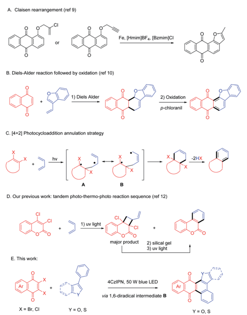
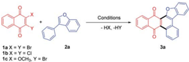
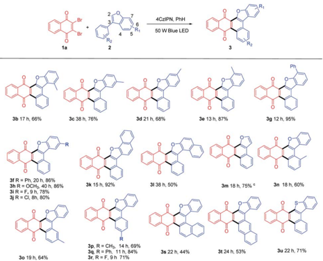
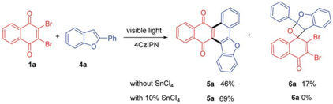
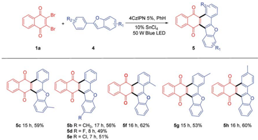
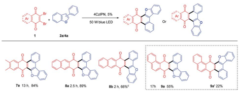
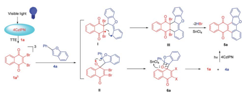

A. Claisen rearrangement (ref 9)

*

## RSC Advances

B. Diels-Alder reaction followed by oxidation (ref 10)

## PAPER

C. [4+2] Photocycloaddition annulation strategy

hv

Cite this: RSC Adv. , 2021, 11 , 38235

B

D. Our previous work: tandem photo-thermo-photo reaction sequence (ref 12)

Received 1st October 2021 Accepted 18th November 2021

DOI: 10.1039/d1ra07314a

rsc.li/rsc-advances

3) uv light

4CZIPN, 50 W blue LED

## Introduction

Polycyclic compounds such as anthraquinones exhibit remarkable bioactivities 1 such as antimicrobial and antiviral, 2 anticancer, 3 anti-in  ammatory, 1 c ,4 and so on. Anthraquinones can also serve as textile dyes, 5 semiconductors in organic electronic devices 6 and colorimetric reagents 7 for their prominent photophysical properties. Functionalization of anthraquinones is an e ffi cient way to access more versatile materials. For example, a fused polycyclic compound containing both anthraquinone and furan motifs, i.e. , anthracenone-furan, has been proved to be potentially useful in biological applications. 8 However, lack of e ffi cient synthetic methods impedes further application of this versatile sca ff old, which urges synthetic chemists to develop new approaches.

To synthesize anthracenone-furan using a furannulation strategy, Aghapour 9 reported a reductive Claisen rearrangement reaction of propargyloxyanthraquinones or 2 0 -chloroprop-2 0 -enyloxyanthraquinones in ionic liquids (Scheme 1, path A). Another synthetic approach to access this important sca ff old is benzannulation approach through Diels Alder reaction of naphthoquinone and vinyl benzofuran followed by oxidation to give aromatized product (Scheme 1, path B). 10 They are both e ffi cient and selective syntheses. Unfortunately, both of them require the pre-synthesis of anthraquinone or vinyl furans so that the reaction scope is limited. Additionally, harsh reaction conditions such as high reacting temperatures are o  en required for DA reactions and stoichiometric oxidant is a prerequisite to oxidize the cyclohexene intermediate.

Photocycloaddition is well known as a powerful synthetic method to a ff ord polycyclic products under mild conditions, 11 which has been applied to synthesize complicated molecules

School of Chemistry and Chemical Engineering, Guangxi University, Nanning, Guangxi 530004, China. E-mail: cheminzhang@gxu.edu.cn

† Electronic supplementary information (ESI) available. See DOI: 10.1039/d1ra07314a

2) Oxidation p-chloranil

Published on 29 November 2021

[Licensed under CC-BY-NC 4.0](https://creativecommons.org/licenses/by-nc/4.0/)

## Visible light enabled [4+2] annulation reactions for anthracenone-furans from 2,3dibromonaphthoquinone and phenylbenzofurans †

Zhimei Mao, Aimin Huang, Lin Ma and Min Zhang *

A facile visible light promoted approach to anthracenone-furans from readily available 2,3dibromonaphthoquinones and phenylbenzofurans via a formal Diels Alder reaction is reported. This reaction involves wavelength-selective agitation of 4CzIPN, energy transfer to quinones, recombination of 1,6-biradicals and elimination to give anthracenone-furans in good to excellent yields in one pot.

including natural products. We thus designed a photoinduced benzannulation strategy from easily available cyclic dihaloethylene and 1,3-dienes (Scheme 1, path C). The benzannulated product can be obtained via [4 + 2] photocycloaddition and elimination of two HX. This method successfully excludes both the harsh conditions in [4 + 2] cycloaddition and the use of oxidant in the aromatizing procedure. However, [4 + 2]

Scheme 1 Synthetic approaches to anthracenone-furans.

photocycloaddition is o  en companied with pervasive [2 + 2] cycloaddition via a 1,4-biradical intermediate A . For example, we have reported a facile one-pot photo -thermal -photo reaction sequence to synthesize dibenzopyranone (Scheme 1, path D). 12 Initially, dibenzopyranone was given as a minor product a  er direct UV irradiation, so that the subsequent thermal -photo reaction sequence was required to transform the predominated cyclobutane. Recently Huang and Nicewicz 13 reported an elegant visible light mediated [4 + 2] cycloaddition of styrenes in the presence of PhSSPh, which acts as a HAT cocatalyst and converts the chemo-selectivity from [2 + 2] to [4 + 2]. In an alternative way, we hypothesized that the extension of the aromatic system would do favor to stabilize the 1, 6-diradical B and give more thermal dynamically stable [4 + 2] cycloadduct as preferred product. Another issue for photocycloaddition strategy is that annulated products with enlarged conjugation system o  en absorb light much stronger than substrates, which prohibited the excitation of substrates, usually leading to an uncomplete transformation. 14 In the past decade, photocycloaddition via photoredox catalysis has been achieved a huge progress using visible light photocatalyst (VLPC). 15 Inspired by the successful visible light driving [4 + 2] reactions, 16 we altered the direct agitation method to photosensitizing strategy and tried to excite substrates by energy transfer from selective agitated VLPC under blue LED irradiation. Herein, we report a visible light enabled [4 + 2] photocycloaddition of 2,3-dihalo quinones ( 1 ) and phenylbenzofurans ( 2 , 4 ) mediated by organo-photocatalyst to give polycyclic anthracenone-furans ( 3 , 5 ) in one pot (Scheme 1, path E).

## Results and discussion

Initially, the visible light mediated reaction of 2,3-dibromo quinone ( 1a ) and 3-phenylbenzofuran ( 2a ) was studied. To our delight, anthracenone-furan 3a was yielded as the only isolatable product in all the investigated conditions. Selected results are summarized in Table 1 (for more details, please see Table S1 in the ESI † ).

Irradiation of 1a and 2a in the absence of VLPC gave annulated 3a in 51% yield under two 24 W blue LEDs for 168 h (entry 1, Table 1). Several VLPCs such as Thioxanthen-9-one (TXO), Rose Bengal (RB), Butanedione (BD) and 4CzIPN were chosen to promote this reaction (entries 2 -6). Among them, 4CzIPN was the most e ffi cient, which gave 3a in 88% yield a  er 49 h irradiation. It is supposed to be owing to both suitable absorption wavelength ( l max ¼ 471 nm) and high triplet energy ( E T ¼ 2.68 eV) 17 to be selectively excited and promote the cycloaddition via energy transfer. TXO possess a similar triplet energy ( E T ¼ 2.8 eV) with a shorter absorption wavelength ( l max ¼ 360 nm) 18 , which gave 3a in 79% yield, slightly lower than 4CzIPN. Meanwhile, RB 18 ( l max ¼ 549 nm, E T ¼ 1.8 eV) gave 3a in 60% yield. Butanedione 19 ( l max ¼ 430 nm, E T ¼ 2.44 eV) gave 3a in 54% yield. It evidently shows that organo-photocatalyst with higher triplet energy gives better yields of 3a . Therefore, this reaction presumably proceeds through a triplet energy transfer mechanism. 20 The assessment of solvent reveals the reaction can be

a Reagents and conditions: 0.1 mmol 1a (31.5 mg), 0.13 mmol 2a (25.2 mg) and 0.005 mmol VLPC in 10 mL distilled benzene was ultrasonicated and purged with N2 for 10 minutes and then irradiated under 24 W blue LED. TXO: Thioxanthen-9-one. 4CzIPN: 2,4,5,6tetrakis(carbazol-9-yl)-1,3-dicyanobenze. b Isolated yield. c Pyridine (2.2 eq.) was added. d 50 W blue LED was used as light source. e NO light, under re  ux. f 2,3-Dichloronaphthoquinone ( 1b ) was used instead of 1a . g 2-Bromo-3-methoxynaphothoquninone ( 1c ) was used instead of 1a .

Table 1 Condition screening for annulation reaction a

| Entry    | VLPC, 5%         | Solvent   |   Time, h | Yield b , %   |
|----------|------------------|-----------|-----------|---------------|
| 1        | No PC            | Benzene   |       168 | 51            |
| 2        | TXO              | Benzene   |        53 | 75            |
| 3        | Rose Bengal, 2%  | Benzene   |        65 | 60            |
| 4        | Butanedione, 30% | Benzene   |        75 | 54            |
| 5        | 4CzIPN           | Benzene   |        49 | 88            |
| 6        | 4CzIPN, 2%       | Benzene   |        51 | 79            |
| 7        | 4CzIPN           | DCE       |        56 | 52            |
| 8        | 4CzIPN           | Dioxane   |        39 | 57            |
| 9        | 4CzIPN           | MeCN      |        48 | 19            |
| 10 c     | 4CzIPN           | Benzene   |        38 | 87            |
| 11 d     | 4CzIPN           | Benzene   |        10 | 92            |
| 12 e     | 4CzIPN           | Benzene   |       156 | NR            |
| 13 d , f | 4CzIPN           | Benzene   |        11 | 61            |
| 14 d , g | 4CzIPN           | Benzene   |         7 | 76            |

carried out in polar solvent such as DCE or 1,4-dioxane, but 3a was given in low yields (52 -57%, entries 7-8). When the reaction was carried out in MeCN, 3a was given in poor yield (19%). Some complicated byproducts were formed, which might be due to side reactions triggered by electron transfer in high polar solvent. Extra addition of pyridine to remove the generated HBr did shorten the reaction time for several hours, but showed no improvement in yield (entry 10). Finally, the reaction mixture was irradiated under a 50 W blue LED for 10 h in the presence of 5% 4CzIPN to give 3a in 92% yield (entry 11). Control experiment of re  uxing in PhH for 156 h in dark gave no product (entry 12), which con  rmed the visible light irradiation as a prerequisite. It should also be noted that 1a could be replaced by 2,3-dichloronaphthoquinone ( 1b ) or 2-bromo-3methoxynaphothoquninone ( 1c ), which gave 3a in lower yields (entries 13-14).

With this optimized condition in hand, we performed the reactions of 1a with a scope of 3-phenylbenzofurans ( 2 ) with substituents on both benzofuran ring (R1) and substituted phenyl ring (R2). The results were summarized in Table 2.

Both electron-donating (Me ( 3b-3e , 3n-3p ), Ph ( 3f , 3g , 3q ), OCH3 ( 3h )) and electron-withdrawing (F( 3i , 3r ), Cl( 3j )) substituted benzofurans, either at R1 or R2 position could a ff ord annulated anthracenone-furans ( 3b-3j , 3n-3r ) in good to excellent yields (60 -95%), which exhibited a good tolerance to the electronic characters of substituents. 3-Phenylnaphtho[1,2b ]

Visible light

4CzIPN|

—Ph

2a/4a

4CzIPN, PhH

4CzIPN 5%, PhH

4CzIPN. 5%

50 W blue LED

50 W Blue LED

10% SnCla

-2HBr visible light

4CzIPN

Table 2 Scope of 3-phenylbenzofurans ( 2 ) a , b

SnCIa

Br without SnCl4

7a 13 h, 84%

3b 17 h, 66%

5c 15 h, 59%

3f R = Ph, 20 h, 86%

3h R = OCH3, 40 h, 86%

3i R = F, 9 h, 78%

3j R = CI, 8h, 80%

3o 19 h, 64%

4CzIPN

5a 46%

6a 17%

a Reagents and conditions: 0.1 mmol 1a , 0.13 mmol 2 and 0.005 mmol 4CzIPN in 10 mL distilled benzene was ultrasonicated and purged with N2 for 10 minutes and then irradiated under 50 W blue LED. b Isolated yield. c 10% SnCl4 was added.

furan ( 2k ) gave anthracenone-furan 3k in excellent yield (92%) as well. While 1-phenylnaphtho[2,1b ]furan ( 2l ) or naphthylbenzofurans ( 2s , 2t ) gave anthracenone-furans ( 3l , 3s , 3t ) in moderate yields (44 -53%) with longer reaction times needed to complete transformation. This is in accordance with the 3-phenylbenzothiophene ( 2u ), which gave 3u with 71% yield a  er 22 h irradiation. It could be attributed to stronger competitive absorption of annulated product vs. photosensitizers (Table S3 † ).

For further extension of reaction scope, irradiation of 1a with 2-phenylbenzofuran ( 4a ) gave both annulated 5a (46%) and oxetane 6a (17%) (Scheme 2). Oxetane was reported to be the major product in photoreaction of 1,4-naphthoquinone and 4a via the Patern` o -B¨ uchi reaction. 21 Oxetane 6a can undergo retro PB reaction slowly to give 1a and 4a , which are converted to 5a upon irradiation. Several Lewis acid cocatalysts were used to e ffi ciently decompose 6a (Table S2 † ). At last, when irradiated in the presence of 10% SnCl4 under 50 W blue LED, the reaction was accomplished in 8 h and 5a was given as the only product in 69% yield. With this condition in hand, several 2-phenylbenzofurans ( 4 ) were investigated as listed in Table 3. There was no signi  cant di ff erence observed in the yields of annulated products from 2-phenylbenzofurans substituted with electrondonating or withdrawing substituents (49 -62%). Notably, this Lewis acid mediation strategy also can be applied to 3-phenylfuran to a ff ord 3m in 75% yield (Table 2).

Scheme 2 Synthesis of anthracenone-furan 5a .

50 W Blue LED

Table 3 Scope of 2-phenylbenzofurans ( 4 ) a , b

a Reagents and conditions: 0.1 mmol 1a , 0.13 mmol 2 and 0.005 mmol 4CzIPN in 10 mL distilled benzene was ultrasonicated and purged with N2 for 10 minutes and then irradiated under 50 W blue LED. b Isolated yield.

## Table 4 The Scope of quinones a , b

a Reagents and conditions: 0.1 mmol 1a , 0.13 mmol 4 and 0.005 mmol 4CzIPN in 10 mL distilled benzene was ultrasonicated and purged with N2 for 10 minutes and then irradiated under 50 W blue LED. b Isolated yield. c 10% SnCl4 was added.

Some other dibromoquinones ( 1d-1f ) were also studied. 2,3Dibromo-6,7-dimethylnaphthalene-1,4-dione ( 1d ) gave 7a in 84% yield. 2,3-Dibromoanthracene-1,4-dione ( 1e ) could react with 2a or 4a to yield 8a (87%) or 8b (66%) smoothly (Table 4). For the reaction of 2,3-dibromophenanthrene-1,4-dione ( 1f ), the annulated regio-isomers 9a / 9a 0 were obtained in 55% or 22% yields. These examples exhibited the successful application of this approach to rather large polycyclic systems.

The plausible mechanism of this reaction can be interpreted as shown in Scheme 3 with the reaction of 1a and 4a as an example. The selective absorption of blue light by the 4CzIPN photosensitizer can drive the reaction through triplet -triplet

Scheme 3 Proposed mechanism.

energy transfer to excite dibromo naphthoquinone 1a to 3 1a * . The triplet 3 1a * reacts with 4a to form 1,6-biradical intermediate I or 1,4-biradical II . Upon the following ISC and radical recombination, intermediate I gives cyclohexene III , which can be converted to 5a a  er elimination of two HBr with the assistance of SnCl4. The intermediate II can give oxetane 6a as a transient intermediate, which undergoes retro -PB reaction promoted by SnCl4 to starting materials that are converted to 5a upon photosensitizing.

## Conclusions

In conclusion, we developed an e ffi cient one-pot visible light promoted reaction to give the versatile anthracenone-furans from readily available starting materials with good to excellent yields. Using blue light and 4CzIPN as the driving force guarantees annulation reaction not only cleaner but also a precise agitation of VLPC leading to an e ffi cient and complete conversion of quinones. Stannic chloride (SnCl4) accelerates the decomposition of oxetane side product to restart [4 + 2] annulation reaction and improves the overall yields of annulated products. It can be applied to benzothiophenes or other dibromoquinones to a ff ord polycyclic molecules with up to seven fused rings. We believe this method will bene  t both the pharmaceutical and material chemistry by providing an alternative e ffi cient platform to polyaromatic heterocyclic compounds.

## Confl icts of interest

The authors declare no competing  nancial interest.

## Acknowledgements

We thank the National Natural Science Foundation of China (No. 21462003, 21861002) for  nancial support.

## Notes and references

- 1 ( a ) M. Masi and A. Evidente, Toxins , 2020, 12 , 714; ( b ) S. Guang-Yao, C. Ming-Long and W. Kui-Wu, Mini-Rev. Org. Chem. , 2020, 17 , 872; ( c ) H. Wang, D. Yang, L. Li, S. Yang, G. Du and Y. Lu, Nat. Prod. Bioprospect. , 2020, 10 , 445.
- 2 J. Wang, X. Qin, Z. Chen, Z. Ju, W. He, Y. Tan, X. Zhou, Z. Tu, F. Lu and Y. Liu, Phytochem. Lett. , 2016, 15 , 13.
- 3 ( a ) H. K. Choi, H. Ryu, A. r. Son, B. Seo, S.-G. Hwang, J.-Y. Song and J. Ahn, Biomed. Pharmacother. , 2016, 79 , 308; ( b ) N. Abu, M. N. Akhtar, W. Y. Ho, S. K. Yeap and N. B. Alitheen, Molecules , 2013, 18 , 10367 -10377.
- 4 M.-Y. Park, H.-J. Kwon and M.-K. Sung, Biosci., Biotechnol., Biochem. , 2009, 73 , 828.
- 5 B. H. Kim, E. Danilov, S. J. Yoon, A. El-Shafei and H. Freeman, Dyes Pigm. , 2021, 184 , 108745.
- 6 M. Irimia-Vladu, Y. Kanbur, F. Camaioni, M. E. Coppola, C. Yumusak, C. V. Irimia, A. Vlad, A. Operamolla,
- G. M. Farinola, G. P. Suranna, N. Gonzalez-Benitez, M. C. Molina, L. F. Bautista, H. Langhals, B. Stadlober, E. D. Glowacki and N. S. Sarici  ci, Chem. Mater. , 2019, 31 , 6315.
- 7 A. Ghosh, D. A. Jose and R. Kaushik, Sens. Actuators, B , 2016, 229 , 545.
- 8 ( a ) J. E. Rixson, J. R. Abraham, Y. Egoshi, B. W. Skelton, K. Young, J. Gilbert, J. A. Sako ff , K. M. Gericke, A. McCluskey and S. G. Stewart, Bioorg. Med. Chem. , 2015, 23 , 3552; ( b ) T. Serevi ˇ cius, P. Adom ˙ enas, O. Adom ˙ enien ˙ e, R. Rimkus, V. Jankauskas, A. Gruodis, K. Kazlauskas and S. Jur ˇ s ˙ enas, Dyes Pigm. , 2013, 98 , 304.
- 9 ( a ) S. Nadali, A. Khoshroo and G. Aghapour, Turk. J. Chem. , 2018, 42 , 883; ( b ) S. Nadali, G. Aghapour and Z. Ra  eepour, Can. J. Chem. , 2017, 95 , 1045.
- 10 J. R. Pearson and Q. N. Porter, Aust. J. Chem. , 1991, 44 , 907.
- 11 ( a ) Z. Zhang, Y.-j. Zhou and X.-W. Liang, Org. Biomol. Chem. , 2020, 18 , 5558; ( b ) D. Sarkar, N. Bera and S. Ghosh, Eur. J. Org. Chem. , 2020, 2020 , 1310; ( c ) V. Ramamurthy and
- J. Sivaguru, Chem. Rev. , 2016, 116 , 9914; ( d ) S. Poplata,
- A. Tr¨ oster, Y.-Q. Zou and T. Bach, Chem. Rev. , 2016, 116 , 9748.
- 12 Y. Zhang, Y. Tian, P. Xiang, N. Huang, J. Wang, J.-H. Xu and M. Zhang, Org. Biomol. Chem. , 2016, 14 , 9874.
- 13 L. Wang, F. Wu, J. Chen, D. A. Nicewicz and Y. Huang, Angew. Chem., Int. Ed. , 2017, 56 , 6896.
- 14 M. Zhang, H.-Y. An, B.-G. Zhao and J.-H. Xu, Org. Biomol. Chem. , 2006, 4 , 33.
- 15 ( a ) M. Sicignano, R. I. Rodr´ ı guez and J. Alem´ an, Eur. J. Org. Chem. , 2021, 2021 , 3303; ( b ) T. Zhang, Y. Zhang and S. Das, ChemCatChem , 2020, 12 , 6173.
- 16 ( a ) T. Uchikura, M. Oshima, M. Kawasaki, K. Takahashi and
- N. Iwasawa, Angew. Chem., Int. Ed. , 2020, 59 , 7403; ( b )
- K. Tanaka, Y. Asada, Y. Hoshino and K. Honda, Org. Biomol. Chem. , 2020, 18 , 8074; ( c ) K. Tanaka, D. Omata,
- Y. Asada, Y. Hoshino and K. Honda, J. Org. Chem. , 2019, 84 , 10669; ( d ) C. Song, X. Dong, Z. Wang, K. Liu, C.-W. Chiang and A. Lei, Angew. Chem., Int. Ed. , 2019, 58 , 12206; ( e ) J. Kollmann, Y. Zhang, W. Schilling, T. Zhang,
- D. Riemer and S. Das, Green Chem. , 2019, 21 , 1916; ( f )
- K. Tanaka, M. Kishimoto, M. Sukekawa, Y. Hoshino and
- K. Honda, Tetrahedron Lett. , 2018, 59 , 3361; ( g ) W. Dong,
- Y. Yuan, X. Gao, B. Hu, X. Xie and Z. Zhang, ChemCatChem , 2018, 10 , 2878; ( h ) N. Arai and T. Ohkuma,
- J. Org. Chem. , 2017, 82 , 7628; ( i ) S. Lin, M. A. Ischay,
- C. G. Fry and T. P. Yoon, J. Am. Chem. Soc. , 2011, 133 , 19350.
- 17 M. Yokoyama, K. Inada, Y. Tsuchiya, H. Nakanotani and C. Adachi, Chem. Commun. , 2018, 54 , 8261.
- 18 N. A. Romero and D. A. Nicewicz, Chem. Rev. , 2016, 116 , 10075.
- 19 Handbook of Photochemistry , ed. M. Montalti, A. Credi, L. Prodi and M. T. Gandol  , CRC Press LLC, 3rd edn, 2006.
- 20 J. Zheng, X. Dong and T. P. Yoon, Org. Lett. , 2020, 22 , 6520. 21 C. H. Krauch and S. Farid, Tetrahedron Lett. , 1966, 7 , 4783.