## RSC Advances

## PAPER

Cite this: RSC Adv. , 2023, 13 , 2514

Received 7th November 2022 Accepted 6th January 2023

DOI: 10.1039/d2ra07064b

rsc.li/rsc-advances

## Introduction

From a green and sustainable chemistry standpoint, both academics and industry are interested in creating clean, a ff ordable, and e ffi cient chemical processes. Radical chemistry has become a potent technique for quickly building complex organic compounds because it produces adaptable open-shell reactive species. Radical reactions can be sparked by thermolysis, radiation, photolysis, electrolysis, and redox systems. Among these methods, photocatalysis, which has been extensively used in radical chemistry, is one that is particularly clean and promising. 1 -5

The revival of visible light photoredox catalysis in organic synthesis, which presents brand-new prospects for the creation of synthetic routes through e ff ective light-mediated transformations, might be seen as a parallel to these discoveries. These factors have contributed to the widespread application of photoredox catalysis in the entire synthesis of complex organic products as well as the production of medicines and building blocks. 6 Ruthenium(II) and iridium(III) complexes are used as photocatalysts in a substantial portion of these reactions, enabling the electron-transfer process. 7 -9

School of Engineering, Apadana Institute of Higher Education, Shiraz, Iran. E-mail: mohamadpour.f.7@gmail.com

† Electronic supplementary information (ESI) available. See DOI: https://doi.org/10.1039/d2ra07064b

|

Published on 17 January 2023

[Licensed under CC-BY-NC 4.0](https://creativecommons.org/licenses/by-nc/4.0/)

Carbazole-based photocatalyst (4CzIPN) for novel donor -acceptor (D -A) fl uorophore-catalyzed visible-light-induced photosynthesis of 3,4dihydropyrimidin-2-(1 H )-ones/thiones via a proton-coupled electron transfer (PCET) process †

Farzaneh Mohamadpour

Based on the Biginelli reaction of b -ketoesters, arylaldehydes, and urea/thiourea, we created a green radical synthesis procedure for 3,4-dihydropyrimidin-2-(1 H )-ones/thiones. A PCET (proton-coupled electron transfer) photocatalyst was used in an ethanol solution in an air environment and at room temperature and visible light to provide a renewable energy source. In this study, we seek to create a novel donor -acceptor (D -A) fl uorophore that is a ff ordable and widely available. The carbazole-based photocatalyst (4CzIPN), in addition to its time-saving capabilities and simplicity of use, exhibits excellent yields, is energy-e ffi cient, and is ecologically friendly. This makes it possible to track the evolution of environmental and chemical factors throughout time. To determine the turnover number (TON) and turnover frequency (TOF) of 3,4-dihydropyrimidin-2-(1 H )-ones/thiones, a study was done. Gram-scale cyclization demonstrates that it may be used in industry e ff ectively.

Libraries of 4CzIPN-type photocatalyst derivatives, according to Zeitler and colleagues, 10 have a variety of electrochemical characteristics and may be useful in the future for creating novel reactions. 9 A novel donor -acceptor (D -A)  uorophore is 1,2,3,5-tetrakis(carbazol-9-yl)-4,6-dicyanobenzene (4CzIPN), which combines carbazolyl as an electron donor and dicyanobenzene as an electron acceptor (Fig. 1 shows its photocatalysis cycles 6 ). 4CzIPN is a desirable metal-free photocatalyst due to its outstanding redox window, environmental and economic sustainability, wide applicability, and well-established electronic characteristics. 1,9,11 . (More information is provided in the ESI † ).

Because of its abundant energy reserves, low cost, and renewable energy sources, visible light irradiation is a dependable approach for organic chemical synthesis. 12 -14

It is thought that dihydropyrimidine structures are bio- and pharmacologically intriguing (Fig. 2). Calcium channel blockers, antihypertensive e ff ects, 15 anticancer, 16 anti-HIV agent, 17 antibacterial and antifungal, 18 antiviral, 19 antioxidative, 20 and anti-in  ammatory. 21

3,4-Dihydropyrimidin-2-(1 H )-ones/thiones can be produced synthetically using a variety of catalysts, including Na2 eosin Y, 22 copper(II)-sulfamate, 23 bakers, yeast, 24 hydrotalcite, 25 hexaaquaaluminium(III) tetra  uoroborate, 26 TBAB, 27 copper(II) tetra  uoroborate, 28 , [Btto][ p -TSA], 29 triethylammonium acetate, 30 saccharin, 31 ca ff eine, 32 zirconium(IV)-salophen

Adapted to photo-redox catalysis

Fig. 1 The 4CzIPN can carry out photocatalytic cycles. 6

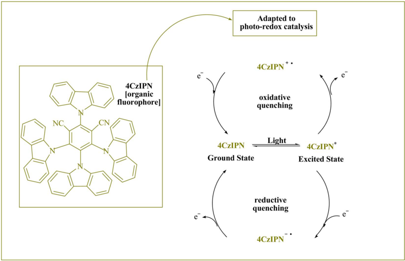

per  uorooctanesulfonate, 33 H3[PW12O40], 34 dioxane-HCl, 35 WSi/ A15, 36 H4[W12SiO40], 37 Zr(H2PO4)2, 38 and GO-chitosan. 39 Due to the lack of metal catalysts, expensive reagents, challenging reactions, and low yields, reaction times are prolonged, which has an in  uence on waste management. Additionally, it can be di ffi cult to separate homogeneous catalysts from reaction mixtures. In recent years, photocatalysts have been successfully used for organic transformations. 40 -45 We have recently used photocatalysts to synthesize heterocyclic chemicals in a green medium. According to the study,  uorophore organic dye photo-redox catalysts are also available and reasonably priced. This technology has led to the development of a donor -acceptor (D -A) as a powerful organo-photocatalyst. Due to its unique photophysical and photochemical characteristics, 1,2,3,5tetrakis(carbazol-9-yl)-4,6-dicyanobenzene (4CzIPN) was the subject of our research. This has led to the development of carbazolyl dicyanobenzenes (CDCBs), a novel donor -acceptor (D -A)  uorophore with fascinating photoelectric performance, extending the arsenal of photocatalysts available to organic chemists. An organic dye molecule with dicyanobenzene as the electron acceptor and carbazolyl as the electron donor was shown to have a signi  cant redox window, great chemical stability, and a variety of uses.

Proton-coupled electron transfer (PCET) photocatalyst, 4CzIPN is a brand-novel carbazole-based photocatalyst that has already been identi  ed as such. This method employs the threecondensation domino Biginelli reaction with arylaldehydes, urea/thiourea, and b -ketoesters, which can also make use of visible light as a renewable energy source and an air environment at a room-temperature in an ethanol solution. Despite the fact that it was  nished without a hitch, on schedule, and within budget.

## Materials and methods

## Characterization

The melting points of each chemical were calculated using a 9100 electrothermal instrument. Additionally, 1 HNMR and 13 CNMRspectra were captured using DMSO-d6 using the Bruker DRX-400, DRX-300, and DRX-100 Avance instruments. Mass spectra were acquired using an Agilent Innovation (HP) spectrometer operating at an ionization potential of 70 eV. Components (carbon, hydrogen, nitrogen) were analyzed using a Heraeus CHN-O-Rapid analyzer. These reagents were provided in substantial amounts by Fluka (Buchs, Switzer-land), Acros (Geel, Belgium), and Merck (Darmstadt, Germany), and they were soon used.

## A procedure for producing 3,4-dihydropyrimidin-2-(1 H )-ones/ thiones (4a -t)

Urea/thiourea ( 2 , 1.5 mmol), ethyl/methyl acetoacetate ( 3 , 1.0 mmol), and arylaldehyde derivatives ( 1 , 1.0 mmol) were stirred at room temperature in EtOH (3 mL) in the presence of 4CzIPN (0.2 mol%). The responses were recorded using TLC. A  er the reaction, screening and washing with water and the crude solid were crystallized from ethanol to obtain the pure material without using any extra puri  cation steps. We are interested in  nding out if we can create the aforementioned chemicals on

NH

| (Е)

S

Monastrol

IH2

NH

OR

Crambescin A

H½N

NH2

\_ NO½

Fig. 2 Pharmaceutically active dihydropyrimidine motifs.

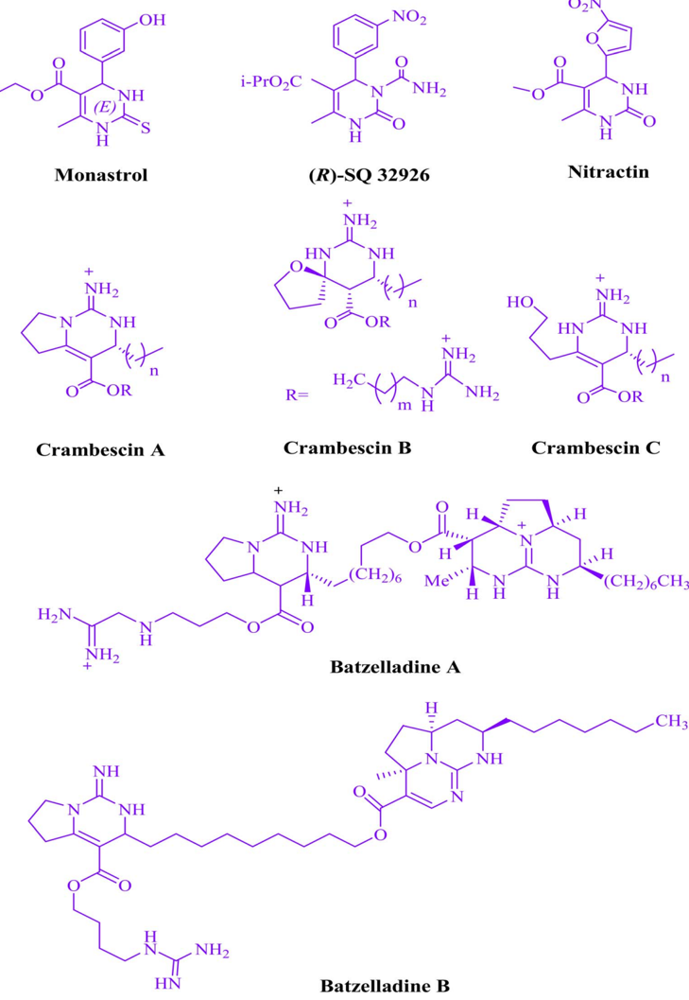

a gram scale in terms of pharmaceutical process R&amp;D. 50 mmol 3-methylbenzaldehyde, 75 mmol urea, and 50 mmol ethyl acetoacetate were each utilized in one experiment. A  er a reaction period of 4 min, the product was recovered by a normal  ltration technique. The chemical appears to be spectroscopically pure based on the 1 HNMR spectrum. Based on the products'

i-PrO2C

spectroscopic data, we categorized them ( 1 HNMR). The ESI †  le contains comprehensive information.

## Results and discussion

This experiment looked at how benzaldehyde (1.0 mmol), urea (1.5 mmol), and ethyl acetoacetate (1.0 mmol) interacted in

NH2

OEt|

NC

Table 1 We o ff er a photocatalyst optimization table for 4a production a

NH2

1,2,3,5-Tetrakis(carbazol-9-yl)-4,6-dicyanobenzene (4CzIPN)

СНз

HN

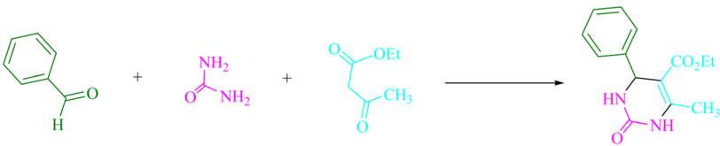

|   Entry | Photocatalyst                            | Solvent (3 mL)   |   Time (min) | Isolated yields (%)   |
|---------|------------------------------------------|------------------|--------------|-----------------------|
|       1 | -                                        | EtOH             |           25 | Trace                 |
|       2 | 4CzIPN (0.1 mol%)                        | EtOH             |            5 | 84                    |
|       3 | 4CzIPN (0.2 mol%)                        | EtOH             |            5 | 96                    |
|       4 | 4CzIPN (0.3 mol%)                        | EtOH             |            5 | 96                    |
|       5 | 2CzPN (0.2 mol%)                         | EtOH             |            5 | 53                    |
|       6 | 4CzPN (0.2 mol%)                         | EtOH             |            5 | 61                    |
|       7 | Carbazole (0.2 mol%)                     | EtOH             |            5 | 38                    |
|       8 | Tetrahydrocarbazole (0.2 mol%)           | EtOH             |            5 | 32                    |
|       9 | Tetra  uoroisophthalonitrile (0.2 mol%) | EtOH             |            5 | 24                    |

a Reaction conditions: at rt, benzaldehyde (1.0 mmol), ethyl acetoacetate (1.0 mmol), and urea (1.5 mmol) are utilized together with several photocatalysts.

EtOH (3 mL). 3 mL of EtOH incubated for 25 minutes without a photocatalyst resulted in a minute amount of 4a at rt (Table 1, entry 1). The addition of multiple additional photocatalysts accelerated the reaction. These substances comprised 4CzIPN,

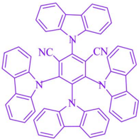

2CzPN, 4CzPN, carbazole, tetrahydrocarbazole, and tetra- uoroisophthalonitrile, as indicated in Fig. 3. By employing this method, 4a can be synthesized with a yield ranging from 24 to 96% (Table 1). These outcomes allowed 4CzIPN to

Fig. 3 In this experiment, catalyst e ff ectiveness was assessed.

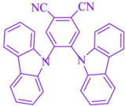

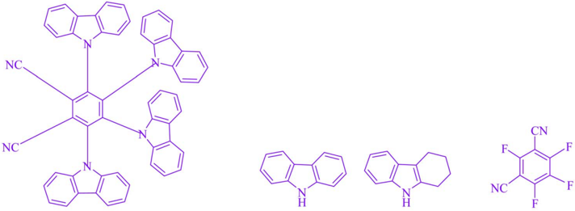

CN

‚CO≥Et

-CHз

NH2

OEt|

Table 2 The solvent and visible light optimization for the synthesis of 4a are shown in a table a

NH2

Нз

HN

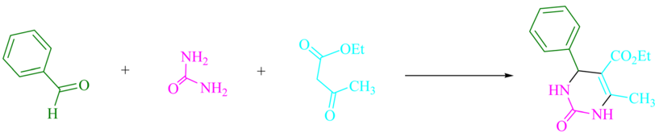

‚CO≥Et

-CHз

|   Entry | Light source      | Solvent (3 mL)   |   Time (min) | Isolated yields (%)   |
|---------|-------------------|------------------|--------------|-----------------------|
|       1 | -                 | EtOH             |           25 | Trace                 |
|       2 | Blue light (7 W)  | -                |           10 | 54                    |
|       3 | Blue light (7 W)  | H 2 O            |            5 | 84                    |
|       4 | Blue light (7 W)  | CH 3 CN          |            5 | 79                    |
|       5 | Blue light (3 W)  | EtOH             |            5 | 91                    |
|       6 | Blue light (7 W)  | EtOH             |            5 | 96                    |
|       7 | White light (7 W) | EtOH             |            5 | 84                    |
|       8 | Green light (7 W) | EtOH             |            5 | 88                    |
|       9 | Blue light (10 W) | EtOH             |            5 | 96                    |
|      10 | Blue light (7 W)  | MeOH             |            7 | 63                    |
|      11 | Blue light (7 W)  | DCM              |           25 | 29                    |
|      12 | Blue light (7 W)  | DMF              |           20 | 31                    |
|      13 | Blue light (7 W)  | EtOAc            |            5 | 74                    |
|      14 | Blue light (7 W)  | DMSO             |           15 | 40                    |
|      15 | Blue light (7 W)  | THF              |           20 | 24                    |

operate more e ff ectively. Table 1, entry 3 indicates that utilizing 0.2 mol% 4CzIPN resulted in a yield of 96%. Table 2 demonstrates that results were much lower for DCM, DMF, DMSO, and THF. Solvent-free, H2O, CH3CN, MeOH, and EtOAc caused to yield more and speed up the process. In EtOH, the reaction had a high rate and yield. Using the information from Table 2 entry 6, a yield of 96% was attained. Studies have examined how blue light a ff ects yield using a variety of light sources (Table 2). Controlling the test without the light source led to the detection of 4a in the trace. According to the study, the creation of product 4a requires both 4CzIPN and visible light. The ideal settings were established using blue LED intensity levels of 3 W, 7 W, and 10 W. The best outcomes were attained with blue LEDs (7 W), according to the data (Table 2, entry 6). Under ideal circumstances, tests on a number of substrates were conducted (Table 3 and Scheme 1). The outcome of the reaction was una ff ected by the benzaldehyde substituent (Table 3). In this reaction, polar and halide substitutions were both allowed. Both reactions involving electron-donating functional groups as well as reactions of electron-withdrawing functional groups are permissible in the reaction's current state. The yield potential of ortho , meta , and para -substituted aromatic aldehydes is very high. Ethyl acetoacetate and methyl acetoacetate react similarly to one another. The reactivity of urea and thiourea was similar.

Table 4 provides a turnover frequency (TOF) and turnover number (TON). Higher TON and TOF values result in greater catalyst e ffi ciency because less catalyst is needed to increase yields. For 4a is a high TON: 480 and TOF: 96. Due to the study's objectives of maximizing yield, decreasing reaction time, and utilizing the least amount of catalyst possible. (More information is provided in the ESI †  le).

Scheme 2 shows the results of control tests that were done to uncover the mechanism underlying this three-component visible light-driven reaction. The two-step Biginelli reaction is thought to consist of the production of benzylideneurea ( I ) in the  rst step and the condensation of ( I ) with ethyl acetoacetate ( 3 ) in the second. Condensation of benzaldehyde ( 1 ) with urea ( 2 ) was carried out under normal conditions (4CzIPN in EtOH under blue LED) by lowering H2O to get benzylideneurea ( I ). As a result, under typical circumstances, the anticipated product 4a was formed in 96% of reactions between the iminium intermediate ( I ) and cation radical ( II ). A trace of product 4a was produced even when the reaction was conducted in complete darkness. Scheme 3 o ff ers a potential reaction pathway based on the  ndings of this experiment.

Scheme 3 shows the proposed mechanism in detail. By employing the proton-coupled electron transfer (PCET) strategy, 4CzIPN  uorophore organic dye produced photocatalytic devices that utilize visible light as a renewable energy source. The process is accelerated by visible light. The electron transfer

NH2

CH3

4a (5 min, 96%)

Lit. 200-202 °C [26]

Mp. 202-204 °C

-CO¿Et

CH3

4e (5 min, 94%)

Lit. 255-257 °C [25|

Mp. 256-258 °C

Me

‚CO, Et

4i (4 min, 94%)

Lit. 203-206 °C [34]

Mp. 205-207 °C

OMe

OMe

CO,Et

4m (6 min, 89%)

Lit. 210-211 °C [38]

Mp. 211-213 °C

-CO¿Et

4q (5 min, 90%)

Lit. 202-203 °C [25]

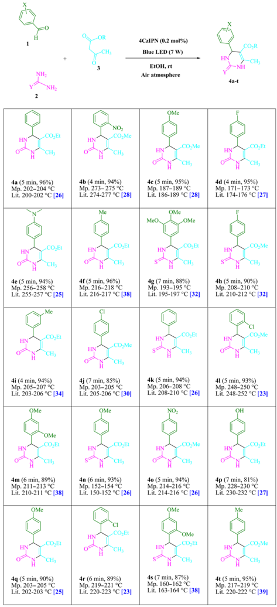

Mp. 203- 205 °C

NO2

-CO¿Me

CH3

4b (4 min, 94%)

Lit. 274-277 °C [28]

Mp. 273-275 °C

-COzEt

CH3

4f (5 min, 96%)

Lit. 216-217 °C [38]

Mp. 216-218 °C

HN

-CO¿Me

4j (7 min, 85%)

Lit. 205-206 °C [30]

Mp. 203-205 °C

OMe

COzEt

4n (6 min, 93%)

Lit. 150-152 °C [26]

Mp. 152-154 °C

-COzEt

CH3

4r (6 min, 89%)

Lit. 220-223 °C [23]

Mp. 219-221 °C

4CzIPN (0.2 mol%)

Table 3 The 3,4-dihydropyrimidin-2-(1 H )-ones/thiones are produced using the carbazole-based photocatalyst (4CzIPN) as a novel donor -acceptor (D -A) fl uorophore CH3 - NH

Air atmosphere

OMe

-CO,Me

4c (5 min, 95%)

Lit. 186-189 °C [28]

Mp. 187-189 °C

MeO

-OMe

-CO,Et

4g (7 min, 88%)

Mp. 193-195 °C

Lit. 195-197 °C [32]

\_CO¿Et

4k (5 min, 94%)

Lit. 208-210 °C [26]

Mp. 206-208 °C

NO-

‚CO¿Me

4o (5 min, 94%)

Lit. 214-216 °C [26]

Mp. 214-216 °C

OMe

СHз

4s (7 min, 87%)

Lit. 163-164 °C [38]

(ET) activity of the 4CzIPN radical anion and arylaldehydes ( 1 ) results in the regeneration of the ground-state 4CzIPN and the intermediate ( A ). The nucleophilic addition of this radical anion ( A ) to urea/thiourea ( 2 ) results in the formation of a reactive iminium intermediate ( B ). The cation radical ( D ) is created by enhancing 4CzIPN * that is caused by visible light using a PCET

Mp. 160-162 °C

method. The cation radical ( D ) attacks the iminium intermediate ( B ), causing the cyclized dehydrated to form ( 4 ) as a consequence. Once excited by light, 4CzIPN undergoes a rapid contact-system transition from the ground state to the excited state. The photocatalytic properties of visible light radiation, the very fast oscillating motion of the bonds, cause the reactants to

NH2

Y

2

CHO

NH2

NH2

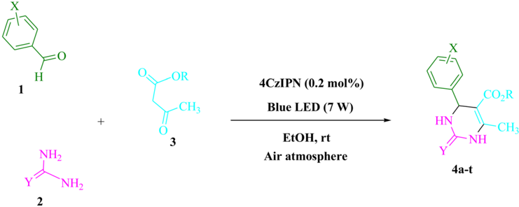

NH2

Scheme 1 An approach to producing 3,4-dihydropyrimidin-2-(1 H )-ones/thiones.

Table 4 The following calculations were done to determine the turnover number (TON) and turnover frequency (TOF)

|   Entry | Product   |   TON |   TOF |   Entry | Product   |   TON |   TOF |
|---------|-----------|-------|-------|---------|-----------|-------|-------|
|       1 | 4a        |   480 |    96 |      11 | 4k        |   470 |    94 |
|       2 | 4b        |   470 | 117.5 |      12 | 4l        |   465 |    93 |
|       3 | 4c        |   475 |    95 |      13 | 4m        |   445 |  74.1 |
|       4 | 4d        |   475 | 118.7 |      14 | 4n        |   465 |  77.5 |
|       5 | 4e        |   470 |    94 |      15 | 4o        |   470 |    94 |
|       6 | 4f        |   480 |    96 |      16 | 4p        |   405 |  57.8 |
|       7 | 4g        |   440 |  62.8 |      17 | 4q        |   450 |    90 |
|       8 | 4h        |   450 |    90 |      18 | 4r        |   445 |  74.1 |
|       9 | 4i        |   470 | 117.5 |      19 | 4s        |   435 |  62.1 |
|      10 | 4j        |   425 |  60.7 |      20 | 4t        |   475 |    95 |

4a: 96%

collide rapidly, resulting in chemical transformations in a short period of time. The higher chemical reaction rates may be due to the synergistic e ff ects of visible light radiation and 4CzIPN.

The ability of several catalysts to synthesis 3,4-dihydropyrimidin-2-(1 H )-ones/thiones are compared in Table 5. This method can be applied in surroundings with visible light, little amount of photocatalyst employed, the speed at which reactions occur, and the absence of byproducts. Atom-economic protocols are highly e ff ective and have a substantial impact on the industry at multigram scales.

Scheme 2 Important control studies are provided by the urea ( 2 , 1.5 mmol), ethyl acetoacetate ( 3 , 1.0 mmol), and benzaldehyde ( 1 , 1.0 mmol) reactions for comprehending their process.

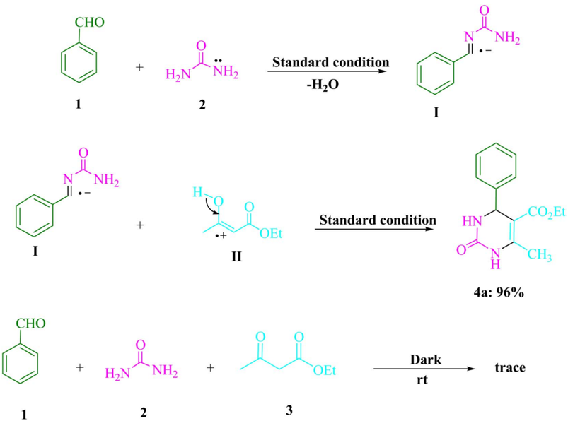

Standard condition

NH

Scheme 3 The proposed mechanism of 3,4-dihydropyrimidin-2-(1 H )-ones/thiones synthesis was described in detail.

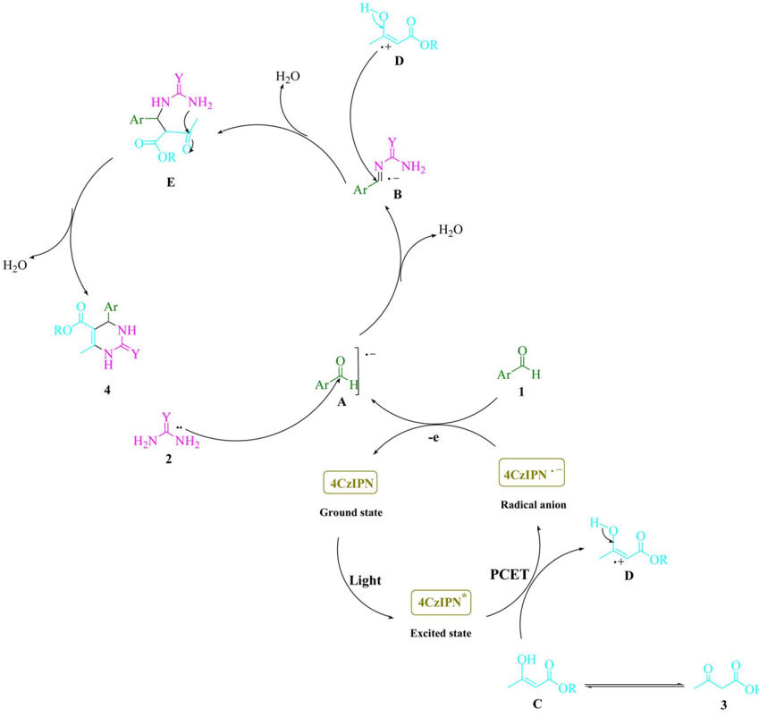

Table 5 An examination of the text's various catalysts' catalytic capacity for the synthesis of 4a a

|   Entry | Catalyst                 | Conditions          | Time/yield (%)   | References   |
|---------|--------------------------|---------------------|------------------|--------------|
|       1 | Bakers, yeast            | Room temperature    | 1440 min/84      | 24           |
|       2 | Hydrotalcite             | Solvent-free, 80 °C | 35 min/84        | 25           |
|       3 | [Al(H 2 O) 6 ](BF 4 ) 3  | MeCN, re  ux       | 1200 min/81      | 26           |
|       4 | Cu(BF 4 ) 2 $ x H 2 O    | Room temperature    | 30 min/90        | 28           |
|       5 | [Btto][ p -TSA]          | Solvent-free, 90 °C | 30 min/96        | 29           |
|       6 | Triethylammonium acetate | Solvent-free,70 °C  | 45 min/90        | 30           |
|       7 | Saccharin                | Solvent-free, 80 °C | 15 min/88        | 31           |
|       8 | Ca ff eine               | Solvent-free, 80 °C | 25 min/91        | 32           |
|       9 | 4CzIPN                   | Blue LED, EtOH, rt  | 5 min/96         | This work    |

## Conclusion

In the radical Biginelli reaction, 3,4-dihydropyrimidin-2-(1 H )-ones/thiones were produced without the need of metals by combining arylaldehydes, b -ketoesters, and urea/thiourea. A

novel donor -acceptor (D -A)  uorophore, 4CzIPN, which is based on carbazoles, was used to catalyze photosynthesis by proton-coupled electron transfer (PCET). In an ethanol solution at ambient temperature and in an environment containing air, visible light can be exploited to produce a renewable energy

source. In addition to the quick reaction time and the absence of potentially toxic solvents, the process also bene  ts from excellent yields, a high-e ffi ciency reaction process, stable conditions, and a renewable energy source. Chromatography was not required for the separating procedure. Without a ff ecting the outcome, a multigram scale reaction of model substrates can be accelerated. The method can therefore be used in a commercial and environmentally friendly manner.

## Confl icts of interest

There are no con  icts to declare.

## Acknowledgements

We gratefully acknowledge  nancial support from the Research Council of the Apadana Institute of Higher Education.

## References

- 1 T. Y. Shang, L. H. Lu, Z. Cao, Y. Liu, W. M. He and B. Yu, Chem. Commun. , 2019, 55 , 5408 -5419.
- 2 F. Mohamadpour, Sci. Rep. , 2022, 12 , 7253.
- 3 F. Mohamadpour, J. Photochem. Photobiol., A , 2021, 418 , 113428.
- 4 F. Mohamadpour, Dyes Pigm. , 2021, 194 , 109628.
- 5 F. Mohamadpour, J. Taiwan Inst. Chem. Eng. , 2021, 129 , 52 -63.
- 6 J. A. Leitch, H. R. Smallman and D. L. Browne, J. Org. Chem. , 2021, 86 , 14095 -14101.
- 7 C. K. Prier, D. A. Rankic and D. W. MacMillan, Chem. Rev. , 2013, 113 , 5322 -5363.
- 8 M. H. Shaw, J. Twilton and D. W. MacMillan, Chem. Rev. , 2016, 81 , 6898 -6926.
- 9 S. Babiola´ aAnnes, RSC Adv. , 2021, 11 , 14079 -14084.
- 10 E. Speckmeier, T. G. Fischer and K. Zeitler, J. Am. Chem. Soc. , 2018, 140 , 15353 -15365.
- 11 Z. Wang, Q. Liu, R. Liu, Z. Ji, Y. Li, X. Zhao and W. Wei, Chin. Chem. Lett. , 2022, 33 , 1479 -1482.
- 12 F. Mohamadpour, J. Saudi Chem. Soc. , 2020, 24 , 636 -641.
- 13 F. Mohamadpour, J. Photochem. Photobiol., A , 2021, 407 , 113041.
- 14 F. Mohamadpour, Monatsh. Chem. , 2021, 152 , 507 -512.
- 15 K. Sujatha, P. Shanmugam, P. T. Perumal, D. Muralidharan and M. Rajendran, Bioorg. Med. Chem. Lett. , 2006, 16 , 4893 -4897.
- 16 S. Wisen, J. Androsavich, C. G. Evans, L. Chang and J. E. Gestwi cki, Bioorg. Med. Chem. Lett. , 2008, 18 , 60 -65.
- 17 L. Heys, C. G. Moore and P. Murphy, Chem. Soc. Rev. , 2000, 29 , 57 -67.
- 18 M. Ashok, B. S. Holla and N. S. Kumara, Eur. J. Med. Chem. , 2007, 42 , 380 -385.
- 19 E. W. Hurst and R. Hull, J. Med. Chem. , 1961, 3 , 215 -229.
- 20 A. M. Magerramow, M. M. Kurbanova, R. T. Abdinbekova, I. A. Rzaeva, V. M. Farzaliev and M. A. Allokhverdiev, Russ. J. Appl. Chem. , 2006, 79 , 787 -790.
- 21 S. S. Bahekar and D. B. Shinde, Bioorg. Med. Chem. Lett. , 2004, 14 , 1733 -1736.
- 22 F. Mohamadpour, ACS Omega , 2022, 7 , 8429 -8436.
- 23 J. N. Liu, J. Li, L. Zhang, L. P. Song, M. Zhang, W. J. Cao, S. Z. Zhu, H. G. Deng and M. Shao, Tetrahedron Lett. , 2012, 53 , 2469 -2472.
- 24 A. Kumar and R. A. Maurya, Tetrahedron Lett. , 2007, 48 , 4569 -4571.
- 25 J. Lal, M. Sharma, S. Gupta, P. Parashar, P. Sahu and D. D. Agarwal, J. Mol. Catal. A: Chem. , 2012, 352 , 31 -37.
- 26 M. Litvic, I. Vecani, Z. M. Ladisic, M. Lovric, V. Voncovic and M. Filipan-Litvic, Tetrahedron , 2010, 66 , 3463 -3471.
- 27 B. Ahmed, R. A. Khan, A. Habibullah and M. Keshai, Tetrahedron Lett. , 2009, 50 , 2889 -2892.
- 28 A. Kamal, T. Krishnaji and M. A. Azhar, Catal. Commun. , 2007, 8 , 1929 -1933.
- 29 Y. Zhang, B. Wang, X. Zhang, J. Huang and C. Liu, Molecules , 2015, 20 , 3811 -3820.
- 30 P. Attri, R. Bhatia, J. Gaur, B. Arora, A. Gupta, N. Kumar and E. H. Choi, Arabian J. Chem. , 2017, 10 , 206 -214.
- 31 F. Mohamadpour, M. T. Maghsoodlou, R. Heydari and M. Lashkari, J. Iran. Chem. Soc. , 2016, 13 , 1549 -1560.
- 32 F. Mohamadpour and M. Lashkari, J. Serb. Chem. Soc. , 2018, 83 , 673 -684.
- 33 N. Li, Y. Wang, F. Liu, X. Zhao, X. Xu, Q. An and K. Yun, Appl. Organomet. Chem. , 2020, 34 , e5454.
- 34 L. V. Chopda and P. N. Dave, Arabian J. Chem. , 2020, 13 , 5911 -5921.
- 35 T. S. Choudhare, D. S. Wagare, V. T. Kadam, A. A. Kharpe and P. D. Netankar, Polycyclic Aromat. Compd. , 2022, 42 , 3865 -3873.
- 36 G. Bosica, F. Cachia, R. De Nittis and N. Mariotti, Molecules , 2021, 26 , 3753.
- 37 L. V. Chopda and P. N. Dave, ChemistrySelect , 2020, 5 , 2395 -2400.
- 38 M. Küçükislamo ˘ glu, S ¸. Bes ¸oluk, M. Zengin, M. Arslan and M. Nebio ˘ glu, Turk. J. Chem. , 2010, 34 , 411 -416.
- 39 A. Maleki and R. Paydar, React. Funct. Polym. , 2016, 109 , 120 -124.
- 40 G. B. Wang, K. H. Xie, H. P. Xu, Y. J. Wang, F. Zhao, Y. Geng and Y. B. Dong, Coord. Chem. Rev. , 2022, 472 , 214774.
- 41 J. Y. Li, Y. H. Li, M. Y. Qi, Q. Lin, Z. R. Tang and Y. J. Xu, ACS Catal. , 2020, 10 , 6262 -6280.
- 42 A. Savateev, I. Ghosh, B. König and M. Antonietti, Angew. Chem., Int. Ed. , 2018, 57 , 15936 -15947.
- 43 H. Hao and X. Lang, ChemCatChem , 2019, 11 , 1378 -1393.
- 44 X. Lang, X. Chen and J. Zhao, Chem. Soc. Rev. , 2014, 43 , 473 -486.
- 45 X. Yu, L. Wang and S. M. Cohen, CrystEngComm , 2017, 19 , 4126 -4136.