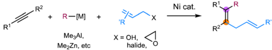
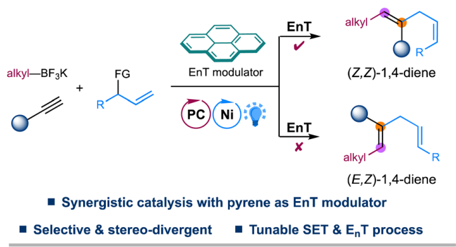
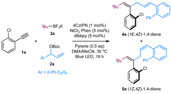
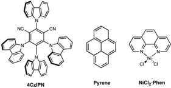
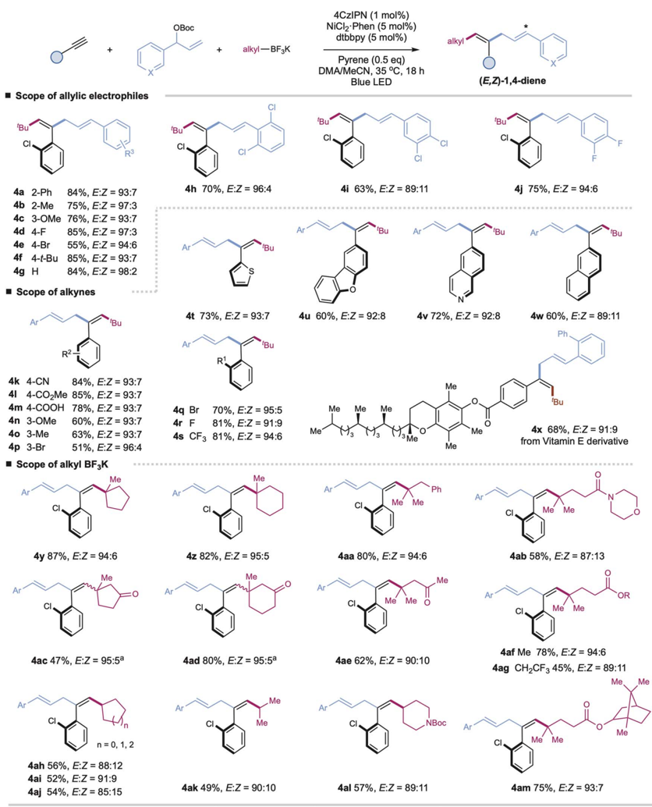
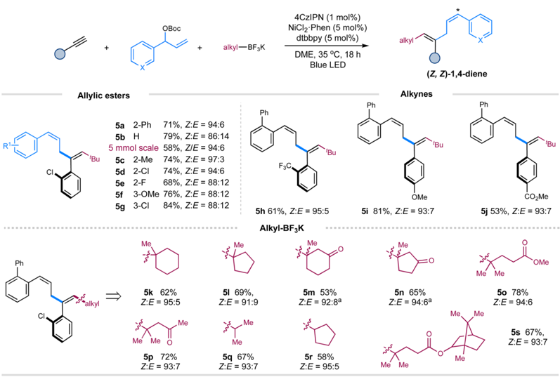
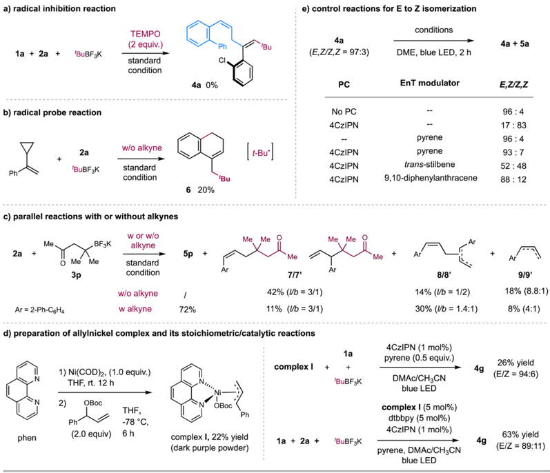
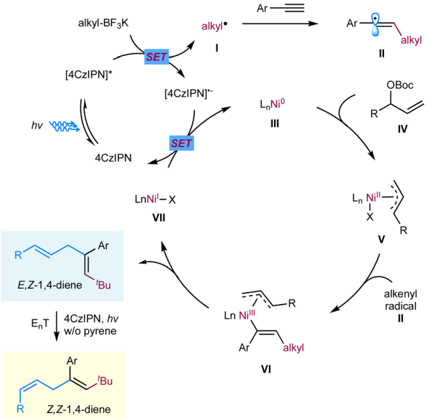

a) Nickel-catalyzed 1,2-carboallylation of alkynes

Ni cat.

## Chemical Science halide,

## EDGE ARTICLE

alkyl-BF¿K

EnT modulator

EnT

Cite this: Chem. Sci. , 2023, 14 , 12143

All publication charges for this article have been paid for by the Royal Society of Chemistry

Received 2nd September 2023 Accepted 11th October 2023

DOI: 10.1039/d3sc04645a rsc.li/chemical-science

## Introduction

The 1,4-diene motifs, also known as skipped dienes, are widely present in di ff erent classes of natural products and biologically active compounds and serve as valuable synthetic synthons in chemical synthesis due to their versatile reactivity. 1 Therefore, the development of e ffi cient methods for constructing these skipped dienes has received increasing attention. Among various synthetic methods developed, 2 -5 transition metalcatalyzed hydroallylation of alkynes represents one of the most straightforward and reliable approaches to accessing skipped dienes. 5 Since the seminal report by Trost in 1998, 5 a a number of elegant examples of catalytic hydroallylation of alkynes, enabled by stoichiometric reductants or hydrides in the presence of nickel, copper, or cobalt catalysts, have later been developed by several other groups, providing e ffi cient and regioselective methods for the synthesis of skipped alkenes. 5 Despite these advancements, selective assembly of highly substituted 1,4-dienes remains challenging.

Transition metal-catalyzed 1,2-carboallylation of alkynes, in which an allyl moiety and another carbon-centered functionality are spontaneously incorporated in one pot, represents a practical tactic for synthesizing substituted 1,4-dienes. 6,7 Despite attractive, only a few examples of 1,2-carboallylation of alkynes, which generally proceed through a two-electron redox

State Key Laboratory for Modi  cation of Chemical Fibers and Polymer Materials, College of Chemistry and Chemical Engineering, Center for Advanced Low-Dimension Materials, Donghua University, Shanghai 201620, China. E-mail: lingling.chu1@dhu.edu.cn

† Electronic supplementary information (ESI) available: Details on experimental procedures and characterization data for all new compounds. See DOI: https://doi.org/10.1039/d3sc04645a

R1

RZ

alkyl

(Z,Z)-1,4-diene

## Divergent 1,2-carboallylation of terminal alkynes enabled by metallaphotoredox catalysis with switchable triplet energy transfer †

Jian Qin, Zhuzhu Zhang, Yi Lu, Shengqing Zhu

and Lingling Chu *

We report a metallaphotoredox strategy for stereodivergent three-component carboallylation of terminal alkynes with allylic carbonates and alkyl tri fl uoroborates. This redox-neutral dual catalytic protocol utilizes commercially available organic photocatalyst 4CzIPN and nickel catalysts to trigger a radical addition/alkenyl -allyl coupling sequence, enabling straightforward access to functionalized 1,4-dienes in a highly chemo-, regio-selective, and stereodivergent fashion. This reaction features a broad substrate generality and a tunable triplet energy transfer control with pyrene as a simple triplet energy modulator, o ff ering a facile synthesis of complex trans - and cis -selective skipped dienes with the same set of readily available substrates.

process, i.e. , carbo-metalation of alkynes followed by crosscouplings, have been successfully developed via nickel catalysis (Fig. 1a). Typically, highly active organometallic agents such as Me3Al, Me2Zn, or alkynyltins are employed for requisite couplings. 6 To our knowledge, catalytic three-component carboallylation of alkynes enabled by transition metal-catalyzed photoinduced electron transfer strategies, 8 an emerging area that has attracted increasing attention in chemical synthesis, remains unknown. Recently, elegant progress has been made in geometric isomerization of alkenes facilitated by triplet -triplet energy transfer (EnT) catalysis, providing a facile

Fig. 1 Divergent three-component carboallylation of alkynes via metallaphotoredox catalysis.

R

R

Published on 13 October 2023 Licensed under CC-BY-NC 4.0

NCI

'Bu-BFзK

За

NiCI2 Phen (5 mol%)

dtbbpy (5 mol%)

\_CI

4a (1E,4Z)-1,4-diene approach to access thermodynamically less stable yet synthetically challenging Z-alkenes. 9 -11 More importantly, a metallaphotoredox system combining EnT process with singleelectron transfer (SET) events allows for the stereo-selective and even -divergent construction of structurally diverse alkenes from simple starting materials. 11 Inspired by these elegant examples, we envisage that metallaphotoredox-enabled carboallylation of alkynes would not only enable a precise assembly of substituted 1,4-dienes but also allow for a stereoselective modulation for the resulting dienes. Herein, we describe a redox-neutral, stereo-divergent 1,2-carboallylation of alkynes with alkyl tri  uoroborates and allylic electrophiles via dual photoredox and nickel catalysis (Fig. 1b). This reaction takes advantage of the versatile reactivity of open-shell alkenyl radicals, 12 in situ generated via radical addition to alkynes, to ensure the facile assembly of substituted skipped dienes with complementary reactivity and selectivity. More importantly, this synergistic protocol allows for a divergent regulation of the stereochemistry of 1,4-diene products with pyrene as a simple EnT modulator, providing a complementary strategy to the previously developed photoinduced divergent synthesis of substituted alkenes that rely on using di ff erent photocatalysts or metal complexes. 11 d -g ,11 i -k

Table 1 Optimization of reaction conditions a

| Entry   | Variations from ' standard ' condition              | Yield of 4a / 5a   | E / Z   |
|---------|-----------------------------------------------------|--------------------|---------|
| 1       | None                                                | 87% (84%)          | 92/8    |
| 2       | Ir[dF(CF 3 )ppy] 2 (dtbbpy)PF 6 , instead of 4CzIPN | 37%                | 17/83   |
| 3       | Ir(ppy) 3 , instead of 4CzIPN                       | 8%                 | 63 : 37 |
| 4       | No 4CzIPN                                           | 23%                | 97/3    |
| 5       | No pyrene & 4CzIPN                                  | 8%                 | -       |
| 6       | No Ni catalyst                                      | 0                  | -       |
| 7       | No ligand                                           | 64%                | 87/13   |
| 8       | No light                                            | 0                  | -       |
| 9       | No pyrene                                           | 79%                | 16/84   |
| 10 b    | No pyrene                                           | 75% (71%)          | 6/94    |

'Bu

## Results and discussion

We began our investigations by employing terminal alkyne 1a as the template substrate, allylic carbonate 2a as the electrophilic coupling partner, and tert -butyl tri  uoroborate 3a as the alkyl radical precursor. As shown in Table 1, the optimal results were obtained with a catalytic combination of Ni(phen)Cl2 as a precatalyst, 4,4 ′ -ditert -butyl-2,2 ′ -bipyridine (dtbbpy) as a ligand, 1,2,3,5-tetrakis(carbazol-9-yl)-4,6-dicyanobenzene (4CzIPN) as a photocatalyst, 13 and pyrene as an additive. The reaction is performed in a DMAc/MeCN solvent with an irradiation of blue LED ( l max = 467 nm) at 35 °C, delivering the desired ( E , Z )-1,4-diene product 4a in 84% yield and high stereoselectivity ( E / Z = 92 : 8) (entry 1). The use of Ir[dF(CF3)ppy]2(dtbbpy)PF6 ð E * III = II 1 = 2 ¼ þ 1 : 21 V vs : SCE Þ , 14 a commonly employed photocatalyst in synergistic nickel catalysis, results in a signi  cant decrease in the yield of product 4a / 5a with an inversed E / Z selectivity of double bond 1, probably due to its higher triplet energy ( E T = 60.1 kcal mol -1 ) 9 c (entry 2). Switching it to Ir(ppy)3, a more reducing photocatalyst, leads to a trace amount of product (entry 3). Control experiments indicate that both nickel catalysts and visible light are essential to the success of this transformation, and the addition of exogenous nitrogen ligands is bene  cial to

'Bu*

4a 2-Ph

4b 2-Me

4d 4-F

4e 4-Br

4f 4-t-Bu

4g H

alkyl-BF¿K

NiCIz Phen (5 mol%)

4CzIPN (1 mol%)

dtbbpy (5 mol%)

Pyrene (0.5 eq)

improving the coupling e ffi ciency (entries 6 -8). Interestingly, product 4a ( E , Z / Z , Z = 97 : 3) was still observed in 23% yield in the absence of 4CzIPN, while only a trace amount of products 4a / 5a was detected in the absence of 4CzIPN and pyrene (entries 4 and 5). These results suggest that pyrene might also function as a photocatalyst to gear the nickel cycle yet cannot promote the E to Z isomerization of double bond 1. Intriguingly, performing the reaction in the absence of pyrene, the stereoisomer ( Z , Z )-1,4-diene

85%, EZ = 97:3

55%, E:Z = 94:6

85%, EZ = 93:7

84%, E:Z = 98:2

· Scope of alkynes

Bu

4k 4-CN

84%, E:Z = 93:7

41 4-CO2Me 85%, E:Z = 93:7

4m 4-COOH

78%, E:Z = 93:7

4n 3-OMe

40 3-Me

4p 3-Br

60%, E:Z = 93:7

63%, E:Z = 93:7

51%, E:Z = 96:4

· Scope of alkyl BF¿K

Me

4y 87%, E:Z = 94:6

4ac 47%, E:Z = 95:5a n = 0, 1, 2

4ah 56%, E:Z = 88:12

4ai 52%, E:Z = 91:9

4aj 54%, E:Z = 85:15

Scheme 1 Substrate scope for (1 E , 4Z )-1,4-dienes. Reaction conditions: alkyne (0.2 mmol), allylic carbonate (1.5 equiv.), alkyl tri fl uoroborate (1.5 equiv.), 4CzIPN (1 mol%), Ni(phen)Cl2 (5 mol%), dtbbpy (5 mol%), pyrene (0.5 equiv.), DMAc/CH3CN [0.05 M] (v/v 3 : 1), blue LED (90 W, l max = 467 nm), ∼ 35 °C, 18 h. Isolated yields. E / Z ratios were determined by 1 H NMR. a E / Z ratio of double bond 4 is around 1 : 1.

OBoc

'Bu alkyl

5a was obtained in 79% yield with opposite stereoselectivity ( E / Z = 16 : 84) (entry 9). Switching the solvent to DME improved the Z -selectivity of 5a to 94 : 6 with comparable yields (entry 10). This protocol represents an operationally simple approach to accessing both Z / E -alkenes by adding or removing pyrene additive. It should be noted that no stereoisomers regarding double bond 4 of 1,4dienes were observed in these cases, probably due to the augmented A1,3-strains in the 4 Z isomers (Table 1). 9 b , c

'Bu

Ph

OBoc

+

alkyl-BFaK

NiCIz Phen (5 mol%)

4CzIPN (1 mol%)

dtbbpy (5 mol%)

DME, 35 °C, 18 h

With the optimal conditions in hand, we turned our attention to investigating the generality of this protocol. As shown in Scheme 1, a wide range of aryl-substituted branched allylic carbonates couple e ffi ciently with aryl alkynes and t BuBF3K under the standard E , Z -selective conditions (with pyrene) (Table 1, entry 1), a ff ording the corresponding tri-substituted 1,4dienes with high yield and excellent stereoselectivity ( 4a -4j , E / Z up to 98 : 2). Installation of electron-donating or electron-poor substituents at the para -, meta -, or ortho -positions of the aromatic rings has no signi  cant e ff ect on the reaction e ffi ciency or stereoselectivity ( 4a -4j ). Alkyl-substituted allylic carbonates are applicable coupling partners, a ff ording the desired products in moderate yields, yet as mixtures of trans / cis isomers ( E / Z = 3 : 1 for product S4an in ESI † ).

A wide range of terminal aryl alkynes with various electrondonating or withdrawing functional groups are applicable with high e ffi ciency and excellent stereoselectivity in this catalytic system ( 4k -4x , E / Z up to 96 : 4). The electronic property or steric hindrance of the aromatic rings of alkynes has no signi  cant e ff ect on the stereoselectivity of resulting 1,4-dienes. The mild conditions are tolerated with many important functional groups, including cyanides, esters, carboxylic acids, and halides ( 4k -4m , 4p , 4q -4r ). Moreover, heteroaryl-, such as thiophenyl-, dibenzo[ b , d ]furanyl-, quinolinyl-, and naphthalenylsubstituted alkynes, are suitable substrates with good yields and stereoselectivity under the optimal conditions ( 4t -4w ). The reactions with complex terminal alkynes, exempli  ed by the one derived from vitamin E, proceed smoothly to a ff ord corresponding functionalized 1,4-dienes under mild conditions ( 4x ).

alkyı —

Nevertheless, internal alkynes are unsuitable coupling partners due to the competitive cross-couplings between allyl carbonates and alkyl tri  uoroborates and self-couplings of allyl carbonates.

Me

Next, we further evaluate the generality regarding alkyl precursors ( 4y -4am , E / Z up to 95 : 5). Both linear and cyclic tertiary alkyl tri  uoroborates, including those derived from biologically active molecules, show high reactivity, allowing for the facile installation of alkyl units at the end of 1,4-dienes ( 4y -4ag , 4am ). Besides tertiary alkyl precursors, cyclic and acyclic secondary alkyl tri  uoroborates are applicable with excellent chemo- and regioselectivity, albeit with slightly decreased yields and stereoselectivity ( 4ah -4al ). The tethered ketones, amides, and esters are well-compatible ( 4ac -4ae , 4ab , 4al , 4af -4ag , and 4am ). Generally, this chemistry a ff ords excellent control for the con  guration of double bond 4 of 1,4-dienes, probably due to the less sterically hindered E -alkenyl radicals combining faster with nickel complexes to form trans -adduct alkenylnickel species. 15 Nevertheless, in the cases of cyclic ketone-derived alkyl tri- uoroborates, we observed a signi  cant loss in the stereoselectivity of double bond 4 ( 4ac and 4ad ). We reason that the potential chelation between the cyclic ketone and nickel species 16 could a ff ect the stereoselective radical capture process, leading to the formation of trans / cis mixtures of alkenylnickel species and,  nally, the Z / E isomers of double bond 4 (see Table S8 † ).

Then, we turned our attention to exploring the scope of these components under the Z -selective conditions (without pyrene) (Table 1, entry 10). As shown in Scheme 2, this protocol is applicable to a wide array of terminal aryl alkynes, allylic carbonates, tertiary and secondary alkyl tri  uoroborates,

Scheme 2 Substrate scope of ( Z , Z )-1,4-dienes. Reaction conditions: alkynes (0.2 mmol), allylic esters (1.5 equiv.), alkyl tri fl uoroborates (1.5 equiv.), 4CzIPN (1 mol%), Ni(phen)Cl2 (5 mol%), dtbbpy (5 mol%), DME [0.05 M] (v/v 3 : 1), blue LED (90 W, l max = 467 nm), ∼ 35 °C, 18 h. Isolated yields. E / Z ratios were determined by 1 H NMR. a E / Z ratio of double bond 4 is around 1 : 1.

|

a) radical inhibition reaction

1a + 2a +

Phi

'BuBF¿K

e) control reactions for E to Z isomerization conditions

4а

(E,Z/Z,Z = 97:3)

a ff ording the corresponding Z , Z -skipped dienes with moderate to good yields and high selectivity ( 5a -5s ). Pleasingly, performing the reaction on a gram scale still led to the formation of product 5a with excellent selectivity, albeit in a decreased yield. The presence of an ortho -substituent on the aromatic ring of allylic carbonates is vital to maintain the excellent Z -selectivity of double bond 4 of 1,4-dienes due to the augmented A1,3strain. 9 b , c condition 'Bu 4CzIPN

2a

+

N

phen

We further performed several preliminary experiments to gain insight into the mechanism (Scheme 3). Light-on/o ff experiments demonstrated that continuous light irradiation is required for product formation and stereoselectivity in these reactions (see Fig. S12 -S15 in ESI † ). Moreover, Stern -Volmer  uorescence quenching experiments revealed that the photoexcited state of 4CzIPN was quenched by alkyl tri  uoroborates instead of alkynes and allylic esters (see Fig. S7 -S10 in ESI † ). Furthermore, the radical inhibition experiment with 2.0 equivalents of 2,2,6,6-tetramethyl-1-piperidinyloxy (TEMPO) led to no formation of the coupling product 4a (Scheme 3a). To probe the nature of radical species, (1-cyclopropylvinyl) benzene was used as a radical probe to react with allylic ester 2a and t -BuBF3K under the standard condition (Scheme 3b). 20% yield of product 6 , probably generated via a radical addition/radical ring-opening/cyclization sequence, was observed, suggesting

TEMPO

(2 equiv.)

Ph

*'Ви

DME, blue LED, 2 h the involvement of t -Bu c radical. On the other hand, the reaction of allylic ester 2a with alkyl tri  uoroborate 3p in the absence of alkyne 1a gave 42% of allyl-alkyl coupling product 7 / 7 ′ (branch &amp; linear), 17 together with 14% of allyl -allyl homo-coupling product 8 / 8 ′ (branch &amp; linear) and 18% of reductive product 9 / 9 ′ (Scheme 3c). In contrast, the standard 3-component reaction of 2a a ff orded the desired product 5p in 72% yield, with only an 11% yield of by-product 7/7 ′ . These results imply that the addition rate of t -Bu c to alkyne might be faster than its coupling rate with allylic carbonate, thus leading to the desired 3component carboallylation reaction. 18 The observation of the allyl-derived side products also implies the potential involvement of allylnickel species. To verify this hypothesis, we prepared p -allyl nickel complex I . The reaction of Ni(COD)2, 1,10-phen, and allylic carbonate in THF gave a 22% yield of nickel complex I as a dark purple powder (Scheme 3d). 19 The stoichiometric reaction of allylnickel complex I with alkyne 1a and t BuBF3K in the presence of catalytic 4CzIPN and pyrene with blue LED irradiation gave 26% yield of 1,4-diene product 4g ( E / Z = 94 : 6); and the reaction of 1a , allylic carbonate, and t BuBF3K with catalytic complex I under otherwise same condition gave product 4g in 63% yield ( E / Z = 89 : 11). These results suggest that allylnickel species could be involved in this carboallylation reaction.

blue LED

Scheme 3 Mechanistic studies. (a) Radical inhibition reaction; (b) radical probe reaction; (c) parallel reactions with or without alkyne; (d) stoichiometric reaction with allylnickel complex; (e) control reactions regarding E to Z isomerization.

4a + 5a

EnT

alkyl-BF K

[4CzIPN]*

Next, we carried out several control reactions to investigate the stereoselectivity. As shown in Scheme 3e, ( E , Z )-1,4-diene 4a ( E / Z = 97 : 3) was e ffi ciently converted to corresponding ( Z , Z )-isomer 5a ( E / Z = 17 : 83) in the presence of catalytic 4CzIPN and blue LED, while with no signi  cant isomerization in the presence of catalytic pyrene ( E / Z = 96 : 4). Based on these results, we reason that ( E , Z )-1,4-dienes could undergo a selective EnT process with photoexcited [4CzIPN] * ( E T = 56.4 kcal mol -1 ), 9 c ,20 to a ff ord ( Z , Z )-1,4-dienes; while the addition of pyrene, likely acting as a triplet energy modulator ( E T = 2.10 eV), 21 suppresses the EnT process to leave ( E , Z )-1,4-dienes as they are. This assumption is also consistent with the  uorescence quenching experimental results, as pyrene showed a slightly more signi  -cant quenching to photoexcited [4CzIPN] * than ( E , Z )-1,4-diene 4a , which could proceed via a selective EnT 21 or triplet -triplet annihilation 22 process (Fig. S11 and S18 -S21 † ). 23 We also tested several potential triplet energy modulators, such as trans -stilbene 24 and 9,10-diphenylanthracene (Scheme 3e). 9,10-Diphenylanthracene, the structure of which is similar to pyrene, gave a comparable e ff ect to pyrene (Scheme 3e); at the same time, the addition of trans -stilbene led to the formation of cis / trans -isomers (Scheme 3e), echoed with its no quenching e ff ect to [4CzIPN] * (Fig. S11 † ).

We propose a potential catalytic cycle for this metallaphotoredox-catalyzed carboallylation of alkynes, as depicted in Fig. 2. A single-electron oxidation of alkyl tri- uoroborate ( E red 1/2 = +1.26 V vs. SCE) 25 by the photoexcited [4CzIPN] * ( E 1/2 = +1.35 V vs. SCE) 13 generates alkyl radical I , which then adds to an alkyne to form alkenyl radical II . The nickel cycle starts from Ni(0) species. Oxidative addition of allylic ester IV to Ni(0) III a ff ords allylnickel intermediate V , 19,26 which then capture alkenyl radical II to form trans -(alkenyl)(allyl)Ni(III) VI . Subsequent reductive elimination of Ni(III) VI would deliver the ( E , Z )-skipped diene product and Ni(I) VII . The  nal SET event between the reducing photocatalyst and Ni(I)

Fig. 2 Proposed mechanism.

SET

Ari

Ar- alkyl

will regenerate the ground-state photocatalyst and Ni(0) to close the two catalytic cycles. While we are unable to rigorously rule out the possibility of alkenylnickel intermediate, generated via direct radical capture of alkenyl radical by Ni(0). Concerning the E / Z selectivity of products, we assume that ( E , Z )-skipped diene remains intact in the presence of pyrene, while undergoing a photoinduced * 4CzIPN-enabled E to Z isomerization in the absence of pyrene, thus securing divergent and modular access to both trans - and cis -1,4-dienes.

## Conclusions

In summary, we report a metallaphotoredox-catalyzed stereodivergent carboallylation strategy for the straightforward synthesis of highly functionalized skipped dienes with readily available terminal alkynes, allylic carbonates, and alkyl tri- uoroborates. Utilizing 4CzIPN as an organic photocatalyst and Ni(phen)Cl2 as a nickel catalyst, this dual protocol enables stereoselective access to a wide range of E , Z -1,4-dienes with pyrene as a triplet energy modulator. Furthermore, this protocol allows for modular synthesis of corresponding Z , Z -isomers with the same substrates and catalysts by removing pyrene additive. These transformations show a broad substrate scope with excellent chemo-, regio-, and stereo-selective controls. Mechanistic investigations shed some light on the reaction pathways and stereoselectivity.

## Author contributions

J. Q., Z. Z., Y. L. conducted the investigation under L. C.'s supervision. L. C. wrote the manuscript and J. Q., S. Z. prepared the ESI. † All authors contributed to the conceptualization of the project and the editing of the manuscript.

## Confl icts of interest

There are no con  icts to declare.

## Acknowledgements

We thank Prof. Zheng Tang at Donghua University for the helpful discussion on triplet -triplet annihilation and Prof. Jin Wen at Donghua University for the calculation of the triplet energy of ( E , Z )-1,4-dienes. We are grateful for the  nancial support provided by the National Natural Science Foundation of China (21971036) and the National Science Fund for Excellent Young Scholars (22122101).

## Notes and references

- 1 ( a ) J. Posp´ ı ˇ sil and I. E. Mark´ o, Total Synthesis of Jerangolid D, J. Am. Chem. Soc. , 2007, 129 , 3516 -3517; ( b ) F. Surup, H. Shojaei, P. von Zezschwitz, B. Kunze and S. Grond, Iromycins from Streptomyces sp. and from synthesis: New inhibitors of the mitochondrial electron transport chain, Bioorg. Med. Chem. , 2008, 16 , 1738 -1746; ( c ) T. Sato, T. Suto, Y. Nagashima, S. Mukai and N. Chida, Total

- Synthesis of Skipped Diene Natural Products, Asian J. Org. Chem. , 2021, 10 , 2486 -2502.
- 2 ( a ) A. Zhang and T. V. RajanBabu, Hydrovinylation of 1,3Dienes: A New Protocol, an Asymmetric Variation, and a Potential Solution to the Exocyclic Side Chain Stereochemistry Problem, J. Am. Chem. Soc. , 2006, 128 , 54 -55; ( b ) V. A. Schmidt, C. R. Kennedy, M. J. Bezdek and P. J. Chirik, Selective [1,4]-Hydrovinylation of 1,3-Dienes with Unactivated Ole  ns Enabled by Iron Diimine Catalysts, J. Am. Chem. Soc. , 2018, 140 , 3443 -3453; ( c ) X. Pang, Z.-Z. Zhao, X.-X. Wei, L. Qi, G.-L. Xu, J. Duan, X.-Y. Liu and X.-Z. Shu, Regiocontrolled Reductive Vinylation of Aliphatic 1,3-Dienes with Vinyl Tri  ates by Nickel Catalysis, J. Am. Chem. Soc. , 2021, 143 , 4536 -4542.
- 3 ( a ) F. Kolundzic and G. C. Micalizio, Synthesis of Substituted 1,4-Dienes by Direct Alkylation of Allylic Alcohols, J. Am. Chem. Soc. , 2007, 129 , 15112 -15113; ( b ) Y. Lee, K. Akiyama, D. G. Gillingham, M. K. Brown and A. H. Hoveyda, Highly Siteand Enantioselective Cu-Catalyzed Allylic Alkylation Reactions with Easily Accessible Vinylaluminum Reagents, J. Am. Chem. Soc. , 2008, 130 , 446 -447; ( c ) K. Akiyama, F. Gao and A. H. Hoveyda, Stereoisomerically pure trisubstituted vinylaluminum reagents and their utility in copper-catalyzed enantioselective synthesis of 1,4-dienes containing Z or E alkenes, Angew. Chem., Int. Ed. , 2010, 49 , 419 -423; ( d ) S. M. Sarkar, Y. Uozumi and Y. M. Yamada, A highly active and reusable self-assembled poly(imidazole/ palladium) catalyst: allylic arylation/alkenylation, Angew. Chem., Int. Ed. , 2011, 50 , 9437 -9441; ( e ) M. S. McCammant, L. Liao and M. S. Sigman, Palladium-Catalyzed 1,4Difunctionalization of Butadiene To Form Skipped Polyenes, J. Am. Chem. Soc. , 2013, 135 , 4167 -4170; ( f ) J. Y. Hamilton, D. Sarlah and E. M. Carreira, Iridiumcatalyzed enantioselective allylic vinylation, J. Am. Chem. Soc. , 2013, 135 , 994 -997; ( g ) C. P. McGeough, A. E. Strom and T. F. Jamison, Ni-Catalyzed Cross-Electrophile Coupling for the Synthesis of Skipped Polyenes, Org. Lett. , 2019, 21 , 3606 -3609.
- 4 O. Bernardo, K. Yamamoto, I. Fern´ andez and L. A. L´ opez, Reactivity of Stabilized Vinyldiazo Compounds toward Alkenyland Alkynylsilanes under Gold Catalysis: Regioand Stereoselective Synthesis of Skipped Dienes and Enynes, Org. Lett. , 2021, 23 , 4452 -4456.
- 5 ( a ) B. M. Trost, G. D. Probst and A. Schoop, RutheniumCatalyzed Alder Ene Type Reactions. A Formal Synthesis of Alternaric Acid, J. Am. Chem. Soc. , 1998, 120 , 9228 -9236; ( b ) G. Hilt and J. Treutwein, Cobalt-Catalyzed Alder -Ene Reaction, Angew. Chem., Int. Ed. , 2007, 46 , 8500 -8502; ( c ) D. P. Todd, B. B. Thompson, A. J. Nett and J. Montgomery, Deoxygenative C -C Bond-Forming Processes via a Net FourElectron Reductive Coupling, J. Am. Chem. Soc. , 2015, 137 , 12788 -12791; ( d ) G. Xu, H. Zhao, B. Fu, A. Cang, G. Zhang, Q. Zhang, T. Xiong and Q. Zhang, Ligand-Controlled Regiodivergent and Enantioselective Copper-Catalyzed Hydroallylation of Alkynes, Angew. Chem., Int. Ed. , 2017, 56 , 13130 -13134; ( e ) M. Mailig, A. Hazra, M. K. Armstrong and G. Lalic, Catalytic Anti-Markovnikov Hydroallylation of
- Terminal and Functionalized Internal Alkynes: Synthesis of Skipped Dienes and Trisubstituted Alkenes, J. Am. Chem. Soc. , 2017, 139 , 6969 -6977; ( f ) D.-W. Ji, Y.-C. Hu, H. Zheng, C.-Y. Zhao, Q.-A. Chen and V. M. Dong, A regioselectivity switch in Pd-catalyzed hydroallylation of alkynes, Chem. Sci. , 2019, 10 , 6311 -6315; ( g ) J. Chen, J. Ying and Z. Lu, Cobalt-catalyzed branched selective hydroallylation of terminal alkynes, Nat. Commun. , 2022, 13 , 4518.
- 6 ( a ) S.-i. Ikeda, D.-M. Cui and Y. Sato, Regioand Stereoselective Synthesis of 3,6-Dien-1-ynes by NickelCatalyzed Coupling Reaction of Allyl Chlorides, 1-Alkynes, and Alkynyltins, J. Org. Chem. , 1994, 59 , 6877 -6878; ( b ) S.-i. Ikeda, H. Miyashita and Y. Sato, Tandem Coupling of Allyl Electrophiles, Alkynes, and Me3Al or Me2Zn in the Presence of a Nickel Catalyst, Organometallics , 1998, 17 , 4316 -4318; ( c ) T. Mori, T. Nakamura and M. Kimura, Stereoselective Coupling Reaction of Dimethylzinc and Alkyne toward Nickelacycles, Org. Lett. , 2011, 13 , 2266 -2269; ( d ) W. Li, S. Yu, J. Li and Y. Zhao, Nickel-Catalyzed Allylmethylation of Alkynes with Allylic Alcohols and AlMe3: Facile Access to Skipped Dienes and Trienes, Angew. Chem., Int. Ed. , 2020, 59 , 14404 -14408.
- 7 ( a ) J. Mateos, E. Rivera-Chao and M. Fañan´ as-Mastral, Synergistic Copper/Palladium Catalysis for the Regio- and Stereoselective Synthesis of Borylated Skipped Dienes, ACS Catal. , 2017, 7 , 5340 -5344; ( b ) A. M. Y. Suliman, E.-A. M. A. Ahmed, T.-J. Gong and Y. Fu, Cu/Pd-Catalyzed cis -Boryl  uoroallylation of Alkynes for the Synthesis of Boryl-Substituted Mono  uoroalkenes, Org. Lett. , 2021, 23 , 3259 -3263; ( c ) N. V´ azquez-Galiñanes, I. Velo-Heleno and M. Fañan´ as-Mastral, Bifunctional Skipped Dienes through Cu/Pd-Catalyzed Allylboration of Alkynes with B2pin2 and Vinyl Epoxides, Org. Lett. , 2022, 24 , 8244 -8248.
- 8 ( a ) M. D. Levin, S. Kim and F. D. Toste, Photoredox Catalysis Unlocks Single-Electron Elementary Steps in Transition Metal Catalyzed Cross-Coupling, ACS Cent. Sci. , 2016, 2 , 293 -301; ( b ) M. N. Hopkinson, A. Tlahuext-Aca and F. Glorius, Merging Visible Light Photoredox and Gold Catalysis, Acc. Chem. Res. , 2016, 49 , 2261 -2272; ( c ) J. Twilton, C. Le, P. Zhang, M. H. Shaw, R. W. Evans and D. W. C. MacMillan, The merger of transition metal and photocatalysis, Nat. Rev. Chem , 2017, 1 , 0052; ( d ) J. A. Milligan, J. P. Phelan, S. O. Badir and G. A. Molander, Alkyl Carbon -Carbon Bond Formation by Nickel/ Photoredox Cross-Coupling, Angew. Chem., Int. Ed. , 2019, 58 , 6152 -6163; ( e ) A. Hossain, A. Bhattacharyya and O. Reiser, Copper's rapid ascent in visible-light photoredox catalysis, Science , 2019, 364 , eaav9713; ( f ) P. Chuentragool, D. Kurandina and V. Gevorgyan, Catalysis with Palladium Complexes Photoexcited by Visible Light, Angew. Chem., Int. Ed. , 2019, 58 , 11586 -11598; ( g ) M. Kojima and S. Matsunaga, The Merger of Photoredox and Cobalt Catalysis, Trends Chem. , 2020, 2 , 410 -426; ( h ) H.-H. Zhang, H. Chen, C. Zhu and S. Yu, A review of enantioselective dual transition metal/photoredox catalysis, Sci. China: Chem. , 2020, 63 , 637 -647; ( i ) A. Y. Chan, I. B. Perry, N. B. Bissonnette, B. F. Buksh, G. A. Edwards, L. I. Frye,

- O. L. Garry, M. N. Lavagnino, B. X. Li, Y. Liang, E. Mao, A. Millet, J. V. Oakley, N. L. Reed, H. A. Sakai, C. P. Seath and D. W. C. MacMillan, Metallaphotoredox: The Merger of Photoredox and Transition Metal Catalysis, Chem. Rev. , 2022, 122 , 1485 -1542.
2. 9 ( a ) J. J. Molloy, T. Morack and R. Gilmour, Positional and Geometrical Isomerisation of Alkenes: The Pinnacle of Atom Economy, Angew. Chem., Int. Ed. , 2019, 58 , 13654 -13664; ( b ) T. Nevesel´ y, M. Wienhold, J. J. Molloy and R. Gilmour, Advances in the E / Z Isomerization of Alkenes Using Small Molecule Photocatalysts, Chem. Rev. , 2022, 122 , 2650 -2694; ( c ) J. Corpas, P. Maule´ on, R. G´ omez Array´ as and J. C. Carretero, E / Z Photoisomerization of Ole  ns as an Emergent Strategy for the Control of Stereodivergence in Catalysis, Adv. Synth. Catal. , 2022, 364 , 1348 -1370; ( d ) Y. Sakakibara and K. Murakami, Switchable Divergent Synthesis Using Photocatalysis, ACS Catal. , 2022, 12 , 1857 -1878.
3. 10 ( a ) K. Singh, S. J. Staig and J. D. Weaver, Facile Synthesis of ZAlkenes via Uphill Catalysis, J. Am. Chem. Soc. , 2014, 136 , 5275 -5278; ( b ) J. B. Metternich and R. Gilmour, A BioInspired, Catalytic E / Z Isomerization of Activated Ole  ns, J. Am. Chem. Soc. , 2015, 137 , 11254 -11257; ( c ) J. J. Molloy, J. B. Metternich, C. G. Daniliuc, A. J. B. Watson and R. Gilmour, Contra-Thermodynamic, Photocatalytic E / Z Isomerization of Styrenyl Boron Species: Vectors to Facilitate Exploration of Two-Dimensional Chemical Space, Angew. Chem., Int. Ed. , 2018, 57 , 3168 -3172; ( d ) J. J. Molloy, M. Sch¨ afer, M. Wienhold, T. Morack, C. G. Daniliuc and R. Gilmour, Boron-enabled geometric isomerization of alkenes via selective energy-transfer catalysis, Science , 2020, 369 , 302 -306; ( e ) T. Nevesel´ y, J. J. Molloy, C. McLaughlin, L. Brüss, C. G. Daniliuc and R. Gilmour, Leveraging the n / p * Interaction in Alkene Isomerization by Selective Energy Transfer Catalysis, Angew. Chem., Int. Ed. , 2022, 61 , e202113600; ( f ) T. J. B. Z¨ ahringer, M. Wienhold, R. Gilmour and C. Kerzig, Direct Observation of Triplet States in the Isomerization of Alkenylboronates by Energy Transfer Catalysis, J. Am. Chem. Soc. , 2023, 145 , 21576 -21586.
4. 11 ( a ) J. B. Metternich and R. Gilmour, One Photocatalyst, n Activation Modes Strategy for Cascade Catalysis: Emulating Coumarin Biosynthesis with ( -)-Ribo  avin, J. Am. Chem. Soc. , 2016, 138 , 1040 -1045; ( b ) H.-H. Zhang, J.-J. Zhao and S. Yu, Enantioselective Allylic Alkylation with 4-Alkyl-1,4dihydro-pyridines Enabled by Photoredox/Palladium Cocatalysis, J. Am. Chem. Soc. , 2018, 140 , 16914 -16919; ( c ) L. Guo, F. Song, S. Zhu, H. Li and L. Chu, syn -Selective alkylarylation of terminal alkynes via the combination of photoredox and nickel catalysis, Nat. Commun. , 2018, 9 , 4543; ( d ) C. Zhu, H. Yue, B. Maity, I. Atodiresei, L. Cavallo and M. Rueping, A multicomponent synthesis of stereode  ned ole  ns via nickel catalysis and single electron/triplet energy transfer, Nat. Catal. , 2019, 2 , 678 -687; ( e ) J. Xu, Z. Li, Y. Xu, X. Shu and H. Huo, Stereodivergent Synthesis of Both Zand E-Alkenes by Photoinduced, Ni-Catalyzed Enantioselective C(sp 3 ) -H

|

- Alkenylation, ACS Catal. , 2021, 11 , 13567 -13574; ( f ) F. Song, F. Wang, L. Guo, X. Feng, Y. Zhang and L. Chu, Visible-Light-Enabled Stereodivergent Synthesis of E - and Z -Con  gured 1,4-Dienes by Photoredox/Nickel Dual Catalysis, Angew. Chem., Int. Ed. , 2020, 59 , 177 -181; ( g ) X. Shen, C. Huang, X.-A. Yuan and S. Yu, Diastereoselective and Stereodivergent Synthesis of 2-Cinnamylpyrrolines Enabled by Photoredox-Catalyzed Iminoalkenylation of Alkenes, Angew. Chem., Int. Ed. , 2021, 60 , 9672 -9679; ( h ) H. Zhang, C. Huang, X.-A. Yuan and S. Yu, Photoexcited Chiral Copper Complex-Mediated Alkene E / Z Isomerization Enables Kinetic Resolution, J. Am. Chem. Soc. , 2022, 144 , 10958 -10967; ( i ) T. Long, C. Zhu, L. Li, L. Shao, S. Zhu, M. Rueping and L. Chu, Ligand-controlled stereodivergent alkenylation of alkynes to access functionalized trans -and cis -1,3-dienes, Nat. Commun. , 2023, 14 , 55; ( j ) L. Huang, M. Szewczyk, R. Kancherla, B. Maity, C. Zhu, L. Cavallo and M. Rueping, Modulating stereoselectivity in allylic C(sp 3 ) -H bond arylations via nickel and photoredox catalysis, Nat. Commun. , 2023, 14 , 548; ( k ) H. Zhang, X. He, X.-A. Yuan and S. Yu, Kinetic Resolution of 2-Cinnamylpyrrolines Enabled by Photoexcited Chiral Copper Complex-Mediated Alkene E / Z Isomerization, ACS Catal. , 2023, 13 , 2857 -2866.
- 12 ( a ) U. Wille, Radical Cascades Initiated by Intermolecular Radical Addition to Alkynes and Related Triple Bond Systems, Chem. Rev. , 2013, 113 , 813 -853; ( b ) W. Liu and W. Kong, Ni-Catalyzed stereoselective difunctionalization of alkynes, Org. Chem. Front. , 2020, 7 , 3941 -3955; ( c ) S. Zhu, X. Zhao, H. Li and L. Chu, Catalytic threecomponent dicarbofunctionalization reactions involving radical capture by nickel, Chem. Soc. Rev. , 2021, 50 , 10836 -10856.
- 13 T.-Y. Shang, L.-H. Lu, Z. Cao, Y. Liu, W.-M. He and B. Yu, Recent advances of 1,2,3,5-tetrakis(carbazol-9-yl)-4,6dicyanobenzene (4CzIPN) in photocatalytic transformations, Chem. Commun. , 2019, 55 , 5408 -5419.
- 14 C. K. Prier, D. A. Rankic and D. W. C. MacMillan, Visible Light Photoredox Catalysis with Transition Metal Complexes: Applications in Organic Synthesis, Chem. Rev. , 2013, 113 , 5322 -5363.
- 15 Y. Dai, F. Wang, S. Zhu and L. Chu, Selective Ni-catalyzed cross-electrophile coupling of alkynes,  uoroalkyl halides, and vinyl halides, Chin. Chem. Lett. , 2022, 33 , 4074 -4078.
- 16 F. Wang, S. Pan, S. Zhu and L. Chu, Selective ThreeComponent Reductive Alkylalkenylation of Unbiased Alkenes via Carbonyl-Directed Nickel Catalysis, ACS Catal. , 2022, 12 , 9779 -9789.
- 17 H. Chen, X. Jia, Y. Yu, Q. Qian and H. Gong, Nickel-Catalyzed Reductive Allylation of Tertiary Alkyl Halides with Allylic Carbonates, Angew. Chem., Int. Ed. , 2017, 56 , 13103 -13106.
- 18 L. Guo, M. Yuan, Y. Zhang, F. Wang, S. Zhu, O. Gutierrez and L. Chu, General Method for Enantioselective ThreeComponent Carboarylation of Alkenes Enabled by VisibleLight Dual Photoredox/Nickel Catalysis, J. Am. Chem. Soc. , 2020, 142 , 20390 -20399.

- 19 K. Liu, Z. Wang, A. N. Kunzel, M. Layh and A. Studer, Regioselective Formal beta-Allylation of Carbonyl Compounds Enabled by Cooperative Nickel and Photoredox Catalysis, Angew. Chem., Int. Ed. , 2023, 62 , e202303473.
- 20 ( a ) J. Lu, B. Pattengale, Q. Liu, S. Yang, W. Shi, S. Li, J. Huang and J. Zhang, Donor -Acceptor Fluorophores for EnergyTransfer-Mediated Photocatalysis, J. Am. Chem. Soc. , 2018, 140 , 13719 -13725; ( b ) S. E. Ch´ erif, A. Ghosh, S. Chelli, I. M. Dixon, J. Kraiem and S. Lakhdar, Merging Grubbs second-generation catalyst with photocatalysis enables Z -selective metathesis of ole  ns: scope, limitations, and mechanism, Chem. Sci. , 2022, 13 , 12065 -12070.
- 21 ( a ) C. Mongin, S. Garakyaraghi, N. Razgoniaeva, M. Zamkov and F. N. Castellano, Direct observation of triplet energy transfer from semiconductor nanocrystals, Science , 2016, 351 , 369 -372; ( b ) P. Herr, C. Kerzig, C. B. Larsen, D. H¨ aussinger and O. S. Wenger, Manganese(I) complexes with metal-to-ligand charge transfer luminescence and photoreactivity, Nat. Chem. , 2021, 13 , 956 -962.
- 22 ( a ) D. V. Kozlov and F. N. Castellano, Anti-Stokes delayed  uorescence from metal -organic bichromophores, Chem.
- Commun. , 2004, 2860 -2861; ( b ) W. Zhao and F. N. Castellano, Upconverted Emission from Pyrene and Ditert -butylpyrene Using Ir(ppy)3 as Triplet Sensitizer, J. Phys. Chem. A , 2006, 110 , 11440 -11445; ( c ) M. Marchini, G. Bergamini, P. G. Cozzi, P. Ceroni and V. Balzani, Photoredox Catalysis: The Need to Elucidate the Photochemical Mechanism, Angew. Chem., Int. Ed. , 2017, 56 , 12820 -12821.
- 23 Note: Due to the compliance of this photoinduced system, currently, we cannot distinguish which pathway (EnT or TTA) is involved in the quenching of * 4CzIPN by pyrene; please see ESI † for related discussions.
- 24 X. Cheng, T. Li, Y. Liu and Z. Lu, Stereo- and Enantioselective Benzylic C -H Alkenylation via Photoredox/Nickel Dual Catalysis, ACS Catal. , 2021, 11 , 11059 -11065.
- 25 D. N. Primer and G. A. Molander, Enabling the CrossCoupling of Tertiary Organoboron Nucleophiles through Radical-Mediated Alkyl Transfer, J. Am. Chem. Soc. , 2017, 139 , 9847 -9850.
- 26 Y. Dai, F. Wu, Z. Zang, H. You and H. Gong, Ni-Catalyzed Reductive Allylation of Unactivated Alkyl Halides with Allylic Carbonates, Chem. -Eur. J. , 2012, 18 , 808 -812.