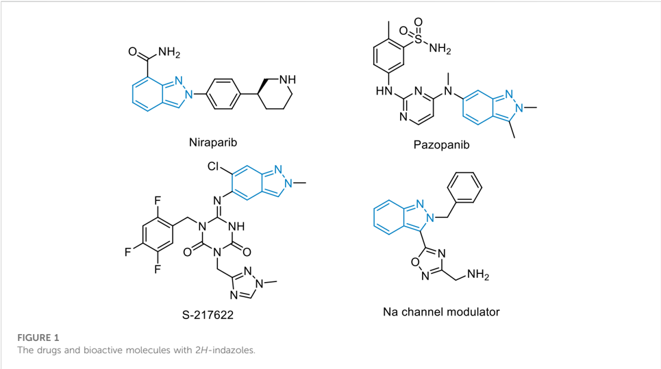
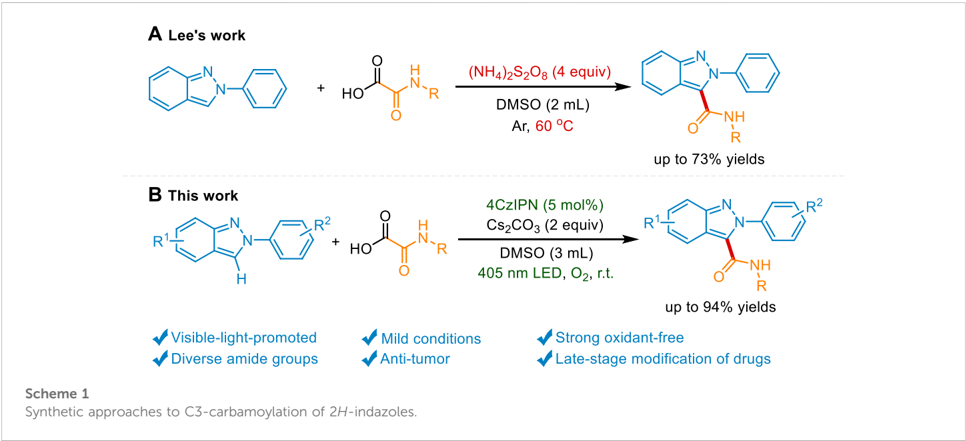
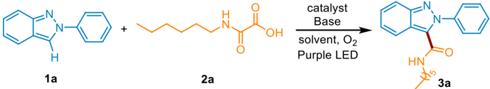
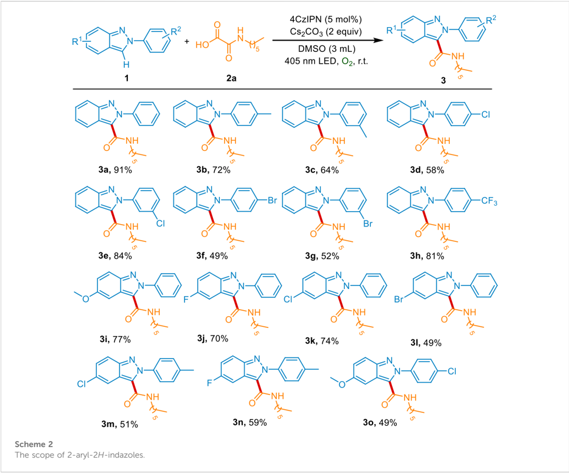
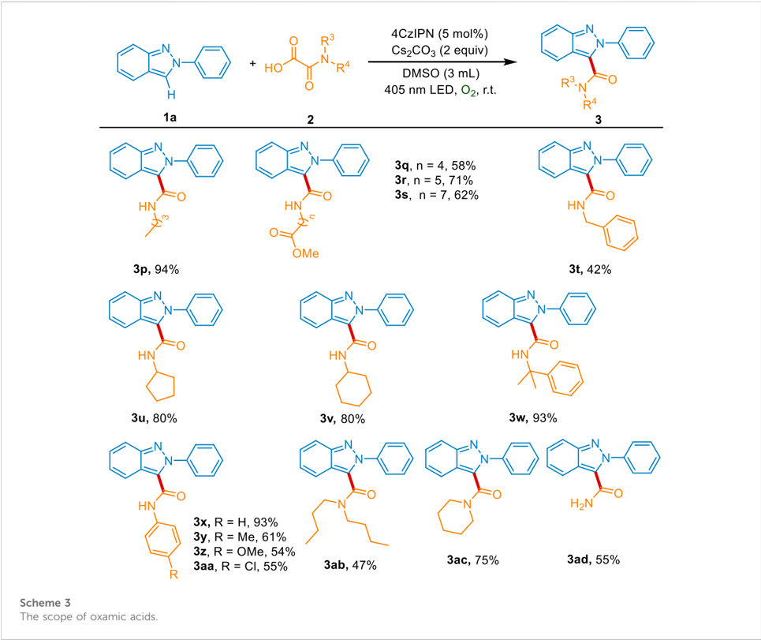
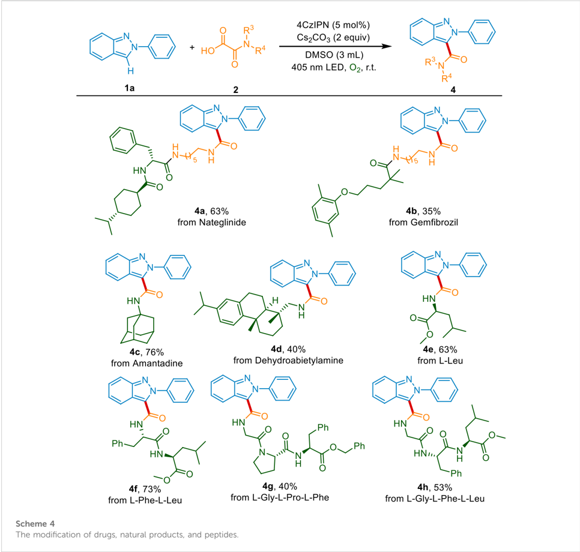
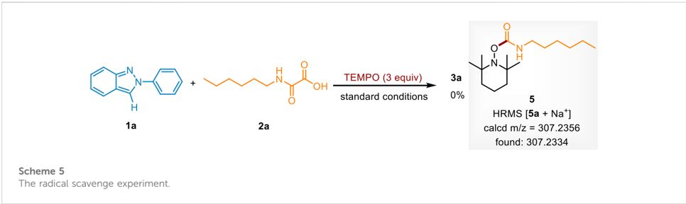
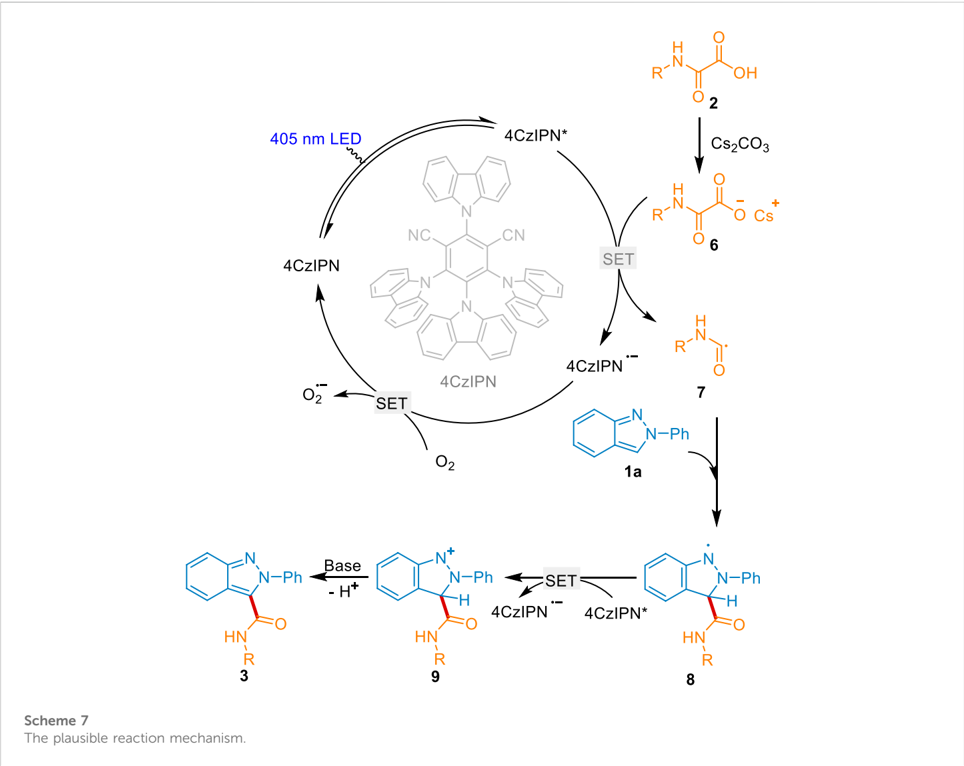
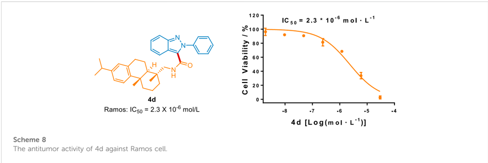

## OPEN ACCESS

EDITED BY

Wei-Min He, University of South China, China

REVIEWED BY

Ge Wu,

Wenzhou Medical University, China

Daoshan Yang,

Qingdao University of Science and

Technology, China

## *CORRESPONDENCE

Dandan Zhang, ddz1110@126.com Yuqin Jiang, jiangyuqin@htu.edu.cn

## SPECIALTY SECTION

This article was submitted to Organic Chemistry, a section of the journal Frontiers in Chemistry

RECEIVED 02 November 2022 ACCEPTED 14 November 2022

PUBLISHED 29 November 2022

## CITATION

Ma C, Shang L, Zhao H, He X, Lv Q, Zhang D and Jiang Y (2022), Visible light-promoted transition metal-free direct C3-carbamoylation of 2 H -Indazoles.

Front. Chem. 10:1087834. doi: 10.3389/fchem.2022.1087834

## COPYRIGHT

© 2022 Ma, Shang, Zhao, He, Lv, Zhang and Jiang. This is an open-access article distributed under the terms of the Creative Commons Attribution License (CC BY). The use, distribution or reproduction in other forums is permitted, provided the original author(s) and the copyright owner(s) are credited and that the original publication in this journal is cited, in accordance with accepted academic practice. No use, distribution or reproduction is permitted which does not comply with these terms.

## [Visible light-promoted transition metal-free direct C3-carbamoylation of 2 H -Indazoles](https://www.frontiersin.org/articles/10.3389/fchem.2022.1087834/full)

Chunhua Ma 1 , Linchun Shang 1 , Hanying Zhao 1 , Xing He 1 , Qiyan Lv 2,3 , Dandan Zhang 1 * and Yuqin Jiang 1 *

1 Collaborative Innovation Centre of Henan Province for Green Manufacturing of Fine Chemicals, Key Laboratory of Green Chemical Media and Reactions, Ministry of Education, Henan Engineering Research Centre of Chiral Hydroxyl Pharmaceutical, Henan Engineering Laboratory of Chemical Pharmaceutical and Biomedical Materials, School of Chemistry and Chemical Engineering, Henan Normal University, Xinxiang, China, 2 National Engineering Research Center of Low-Carbon Processing and Utilization of Forest Biomass, Nanjing Forestry University, Nanjing, China, 3 Green Catalysis Center, College of Chemistry, Zhengzhou University, Zhengzhou, China

We reported a general transition metal-free transformation to access C3carbamoylated 2 H -indazoles via visible light-induced oxidative decarboxylation coupling, in the presence of oxamic acids as the coupling sources, 4CzIPN as the photocatalyst, and Cs2CO3 as the base. The great application potential of this mild condition is highlighted by the late-stage modi fi cation of drugs, N-terminal modi fi cation of peptides, and the good antitumor activity of the novel desired product.

## KEYWORDS

photocatalysis, 2H-indazole, carbamoylation, green oxidant, antitumor

## Introduction

Nitrogen heterocycles are the essential structural elements widely ubiquitous in pharmaceutical chemistry, (Vitaku et al., 2014; Bhutani et al., 2021; Ma et al., 2021a), organic chemistry, (Chen et al., 2021; Darroudi et al., 2021; Jiang et al., 2021; Meng et al., 2021; Qu et al., 2021; Wang and Wang, 2021; Chen and Xuan, 2022; Gao et al., 2022; Wu et al., 2022; Zhang et al., 2022), and material chemistry (Huang and Yu, 2021). Among these, 2 H -indazole is one of the most important heterocycles, existing in various drugs and bioactive molecules (Figure 1). The drug Niraparib with this scaffold is approved to treat various tumors including advanced epithelial ovarian carcinoma and primary peritoneal carcinoma. (Jones et al., 2009). The derivative Pazopanib has become the fi rst-line anti-advanced renal cell carcinoma via inhibiting the activity of vascular endothelial growth factor receptor VEGFR. (Harris et al., 2008). The 3C-like protease inhibitor S-217622 has entered into clinical trials and exhibits antiviral activity against the coronavirus disease 2019 (COVID-19). (Unoh et al., 2022). Therefore, direct and siteselective incorporation of diverse functional groups into 2 H -indazole is of broad interest in organic synthesis and the pharmaceutical industry.

Recent decades have witnessed the impressive achievement of direct C-H functionalization of 2 H -indazoles via radical reactions. (Ghosh et al., 2020; Wang et al., 2022a; Ghosh et al., 2022). The C3phosphonylation, (Singsardar et al., 2018), oxyalkylation, (Singsardar et al., 2019), tri fl uoromethylation, (Murugan et al., 2019; Wei et al., 2021), amination, (Neogi et al.,

2020; Sun et al., 2021a), alkoxylation, (Sun et al., 2021b), arylation, (Aganda et al., 2019; Vidyacharan et al., 2019; Saritha et al., 2021), alkylation, (Liu et al., 2020; Ma et al., 2021b; Ma et al., 2022a), sulfonylation, (Kim et al., 2020; Mahanty et al., 2020), and selenylation (Lin et al., 2022) of 2 H -indazole were reported. However, the development of sustainable strategies to introduce other pharmacophores

TABLE 1 Optimization of reaction conditions a .

| Entry   | Photocatalyst (5 mol%)   | Base (2 equiv)   | Solvent   | Yield (%)   |
|---------|--------------------------|------------------|-----------|-------------|
| 1       | 4CzIPN                   | Cs 2 CO 3        | DMSO      | 56          |
| 2       | Rhodamine B              | Cs 2 CO 3        | DMSO      | 0           |
| 3       | Rhodamine 6G             | Cs 2 CO 3        | DMSO      | 0           |
| 4       | Fluorescein              | Cs 2 CO 3        | DMSO      | 0           |
| 5       | Na 2 -Eosin Y            | Cs 2 CO 3        | DMSO      | 0           |
| 6       | Rose bengal              | Cs 2 CO 3        | DMSO      | 0           |
| 7       | 4CzIPN                   | Na 2 CO 3        | DMSO      | 23          |
| 8       | 4CzIPN                   | K 2 CO 3         | DMSO      | 17          |
| 9       | 4CzIPN                   | LiOH             | DMSO      | 7           |
| 10      | 4CzIPN                   | KOH              | DMSO      | 7           |
| 11      | 4CzIPN                   | CsOH             | DMSO      | 32          |
| 12      | 4CzIPN                   | Et 3 N           | DMSO      | 10          |
| 13      | 4CzIPN                   | DIPEA            | DMSO      | 5           |
| 14      | 4CzIPN                   | TMEDA            | DMSO      | 5           |
| 15      | 4CzIPN                   | DABCO            | DMSO      | 6           |
| 16      | 4CzIPN                   | Cs 2 CO 3        | DCM       | 22          |
| 17      | 4CzIPN                   | Cs 2 CO 3        | MeCN      | 0           |
| 18      | 4CzIPN                   | Cs 2 CO 3        | DMF       | 3           |
| 19      | 4CzIPN                   | Cs 2 CO 3        | DMAC      | 13          |
| 20      | 4CzIPN                   | Cs 2 CO 3        | NMP       | 32          |
| 21      | 4CzIPN                   | Cs 2 CO 3        | THF       | 0           |
| 22      | 4CzIPN                   | Cs 2 CO 3        | DMC       | 0           |
| 23      | 4CzIPN                   | Cs 2 CO 3        | EG        | 0           |
| 24      | 4CzIPN                   | Cs 2 CO 3        | H 2 O     | 0           |
| 25 b    | 4CzIPN                   | Cs 2 CO 3        | DMSO      | 74          |
| 26 c    | 4CzIPN                   | Cs 2 CO 3        | DMSO      | 91          |
| 27 d    | 4CzIPN                   | Cs 2 CO 3        | DMSO      | N. R        |
| 28 c    | -                        | Cs 2 CO 3        | DMSO      | N. R        |
| 29 c    | 4CzIPN                   | -                | DMSO      | N. R        |

into 2 H -indazole is still highly desirable. Amide groups represent a fundamental class of functional groups widely spread in most drugs, bioactive compounds, and peptides. Compared with the traditional condensation method, the C-H carbamoylation protocol provides the desired product without prefunctionalization of the 2 H -indazole and wasteful coupling reagents. Nevertheless, the direct carbamoylation of 2 H -indazole is rarely reported. Only recently, Lee ' s group reports an elegant carbamoylation reaction of 2 H -indazole using oxamic acid as a carbamoylating source under an elevated temperature in the presence of the strong oxidant (NH4)S2O8. (Bhat and Lee, 2021). However, the heating process which is essential for the radical generation results in the consumption of fossil fuels and the potential safety hazard. Meanwhile, a great quantity of strong oxidant might be detrimental to the sensitive functional groups.

Photocatalysis has emerged as a strong strategy to the functionalization of the nitrogen heterocycles. (Liu et al., 2017; Bagdi et al., 2020; Yuan et al., 2020; He et al., 2021; Qi et al., 2021; Yi and He, 2021; Ma et al., 2022b; Wang et al., 2022b; Ma et al., 2022c; Ma et al., 2022d; Ma et al., 2022e; Shi et al., 2022; Xiang et al., 2022; Yan et al., 2022; Yang et al., 2022; Zhu et al., 2022). The mild reaction condition and the visible light-induced neutral redox cycle may solve the above problems. Herein, we reported a visible light-mediated strong oxidant-free protocol to access the carbamoylated 2 H -indazoles under mild conditions and the late-stage modi fi cation of drugs and peptides (Scheme 1).

## Results and discussion

Wechose 2-phenyl-2 H -indazole (1a) and 2-(hexylamino)-2oxoacetic acid (2a) as model substrates to investigate the decarboxylative C (sp 2 )-C (sp 2 ) coupling reaction under 405 nm purple LED irradiation at room temperature. Consistent with the expected, when 4CzIPN was used as the photocatalyst and Cs2CO3 as the base, 1a and 2a could be converted into the carbamoylated 2 H -indazole 3a in 56% yield under O2 atmosphere (Table 1, entry 1). Other transition metalfree photocatalysts including Rhodamine B, Rhodamine 6G, Fluorescein, Na2-Eosin Y, and Rose bengal were catalytically inactive, with no product detected (Table 1, entries 2 -6). Then, a systematic survey of bases were conducted. The results indicated that replacing Cs2CO3 with other inorganic bases (Na2CO3, K2CO3, LiOH, KOH, CsOH) or organic bases (Et3N, DIPEA, TMEDA, DABCO) decreases the formation of the desired product (Table 1, entries 7 -15). A range of solvents, such as, DCM, MeCN, DMF, DMAC, NMP, THF, DMC, EG, and H2O were screened (Table 1, entries 16 -24). We found that DMSO is superior in this process. Increasing the amount of 2a to 2.5 equiv. improved the yield to 74% (Table 1, entry 25). Because the

insoluble residue existed in the reaction system, the volume of DMSO was increased to 3 ml, along with the generation of products in 91% yield (Table 1, entry 26). In the absence of visible light or photocatalyst, no product was detected, which con fi rms the photochemical nature of this method (Table 1, entries 27 -28). The reaction was completely inhibited in the absence of Cs2CO3, indicating the essential role of the base in the transformation (Table 1, entry 29). Taken together, the optimal reaction conditions were established as follows: 1a (0.2 mmol), 2a (2.5 equiv), 4CzIPN (5 mol%) as a catalyst, Cs2CO3 (2 equiv) as a base, DMSO (3 ml) as a solvent, at 35 ° C under O2 atmosphere and the irradiation of purple LED ( λ max = 405 nm) for 12 h.

With the optimal conditions for the construction of carbamoylated 2 H -indazoles in hand, we further explored the scope and generality of this reaction. Firstly, the scope of aryl-2 H -indazoles was examined. As shown in Scheme 2, the substitutions on the phenyl group exhibited good tolerance. The electron-donating groups ( p -Me and m -Me) could give the desired products 3b-3c in 72% and 64% yields, respectively. The derivatives with electron-withdrawing groups ( p -Cl, m -Cl, p -Br, m -Br, and p -CF3) were also effective substrates for this transformation, affording the corresponding products 3d-3h in moderate to good yields. Moreover, both the electron-donating substitution (5-OMe) and the electron-withdrawing groups (5-F, 5-Cl, and 5-Br) on the heteronucleus were well tolerant to the standard conditions (3i-3l). The 2 H -indazoles with disubstitution were also evaluated to react with 2a under the optimal condition, delivering the corresponding products 3m-3o in 49 -59% yields.

Subsequently, we investigated the reactivity pro fi le of a variety of oxamic acids 2. As depicted in Scheme 3, oxamic acids with different length alkyl chains reacted well with 1a, affording the desired products 3p-3s in 58% -94% yields. The

benzyl group was also compatible with the method, giving the product 3t in 42% yield. Both the secondary carbon (cyclopentyl and cyclohexyl group) and tertiary carbon (2-phenylpropyl group) substituted oxamic acids were successful in providing the corresponding products 3u-3w in 80% -93% yields. Meanwhile, the substrates containing primary aromatic amines reacted well with 1a and produced the desired products 3x-3aa in 54% -93% yields. The oxamic acids bearing secondary amine also showed good reactiveness and could be smoothly converted into the carbamoylated products 3ab and 3ac. Moreover, the oxamic acid without N-substitution was tolerated to generate the desired product 3ad in 55% yield.

To evaluate the synthetic utility of this decarboxylative carbamoylation transformation in the pharmaceutical industry, the late-stage modi fi cation of drugs and natural products was conducted. Delightfully, the non-sulfonylureas antibiabetic drug Nateglinide, the lipid regulator Gem fi brozil, and the antiviral drug amantadine could be successfully connected with 2 H -indazole, affording the desired products 4a-4c in 35% -76% yield (Scheme 4). The natural product dehydroabietylamine was also suitable and gave the products 4d in 40% yield. The N-terminal modi fi cated of peptides play an important role in drug development and biochemical research. Inspired by the good functional group tolerance of this sustainable system, we then applied the photocatalytic method in the modi fi cation of natural amino acids and peptides. As shown in Scheme 4, the important amino acid in humans, L-leucine, could be converted into the corresponding products

4e in 63% yield. What ' s more, both the dipeptide (L-phenylalanine-L-leucine) and the tripeptides (L-glycineL-proline-L-phenylalanine and L-glycine-L-phenylalanine-

L-leucine) reacted well with 2 H -indazole, delivering the coupling products 4f-4h in 40% -73% yields. The above results indicate that this method could be used in the development of peptidomimetic drugs and probe molecules.

To investigate the mechanism of this carbamoylation reaction, a radical scavenge experiment was conducted (Scheme 5). When 2,2,6,6-tetramethylpiperidinyl-1-oxyl (TEMPO) was added to the standard conditions, the reaction completely shuttled down. Moreover, the carbamoyl radical trapped adduct 5 was detected by HRMS. It indicates that this photocatalytic transformation occurred via a radical pathway. Next, it was found that the yields of 3a were decreased to 9% and 23% under N2 atmosphere or air atmosphere, revealing that O2 is important in the photocatalytic system.

We performed the Stern -Volmer luminescence-quenching experiments by mixing the photocatalyst 4CzIPN with different concentrations of 2 H -indazole 1a, 2-(hexylamino)-2-oxoacetic acid 2a, or the Cs salt of 2a (6). As depicted in Scheme 6A, the fl uorescence of photoredox catalyst 4CzIPN was quenched by the addition of 1a and 6, and the linear relationships were observed between I 0 /I and the concentration of 1a and 6 (see the Supplementary Figure S2). The oxidative potential of 6 was E 1/2 ox = +0.9 V vs . SCE (Scheme 6B), indicating that the excited state 4CzIPN ( E 1/2(P*/P -) = +1.35 V vs . SCE) (Shang et al., 2019) could be reductively quenched by 6 rather than 1a ( E 1/2 ox = +1.4 V vs . SCE) (Ma et al., 2021b).

A plausible mechanism for this sustainable reaction was proposed according to the above experimental results and the previous reports (Scheme 7). Initially, 4CzIPN was activated into the excited state 4CzIPN* under visible light irradiation. The oxamic acid 2 was in situ converted into the Cs salt 6 in the presence of the base Cs2CO3. 6 underwent the oxidization of 4CzIPN* via single electron transfer (SET) and fragmentation to generate the key carbamoyl radical 7, along with the production of the radical anion 4CzIPN · -. 4CzIPN · -was oxidated by O2 to regenerate the ground state 4CzIPN and close the photoredox cycle. On the other hand, radical 7 attacked the C3-position of 1a to deliver intermediate 8. It underwent the 4CzIPN* mediated

oxidation and base mediated dehydrogenate to afford the desired product 3.

To highlight this greener protocol in the pharmaceutical industry, we evaluated the in vitro antitumor activity of these carbamoylated 2 H -indazole derivatives. As depicted in Scheme 8, compound 4d possessed better antitumor activity against Ramos cell than that of the FDA-approved drug 5- fl uorouracil (5-FU, IC50 = 36.0 × 10 -6 mol/L), suggesting that this method could provide novel chemical entries for anti-human B cell lymphoma treatment.

## Conclusion

In summary, we have developed a visible-light-promoted, transition metal-free, strong oxidant-free method to achieve the direct decarboxylation/carbamylation of 2-aryl2 H -indazoles. This mild and general protocol is tolerant of sensitive functional groups and sterically hindered groups. It is highlighted by the successful application in the late-stage modi fi cation of drugs, natural products, amino acids, and peptides. Moreover, the good antitumor activity of compound 4d indicates that this strategy could be used in antitumor drug development. Further activity studies and structural modi fi cation are ongoing in our laboratory.

## Data availability statement

The original contributions presented in the study are included in the article/Supplementary Material, further inquiries can be directed to the corresponding authors.

## Author contributions

All authors listed have made a substantial, direct, and intellectual contribution to the work, and approved it for publication.

## Funding

We acknowledge the fi nancial support from the National Natural Science Foundation of China (82003585), the Technical innovation Team of Henan Normal University (2022TD03), the Postgraduate Education Reform and Quality Improvement Project of Henan Province (YJS2021AL079), the Scienti fi c Research and Practice

## References

Aganda, K. C. C., Kim, J., and Lee, A. (2019). Visible-light-mediated direct C3arylation of 2H-indazoles enabled by an electron-donor -acceptor complex. Org. Biomol. Chem. 17, 9698 -9702. doi:10.1039/c9ob02074h

Bagdi, A. K., Rahman, M., Bhattacherjee, D., Zyryanov, G. V., Ghosh, S., Chupakhin, O. N., et al. (2020). Visible light promoted cross-dehydrogenative coupling: A decade update. Green Chem. 22, 6632 -6681. doi:10.1039/d0gc02437f

Bhat, V. S., and Lee, A. (2021). Direct C3 carbamoylation of 2H-indazoles. Eur. J. Org. Chem. 2021, 3382 -3385. doi:10.1002/ejoc.202100461

Bhutani, P., Joshi, G., Raja, N., Bachhav, N., Rajanna, P. K., Bhutani, H., et al. (2021). U.S. FDA approved drugs from 2015 -june 2020: A perspective. J. Med. Chem. 64, 2339 -2381. doi:10.1021/acs.jmedchem.0c01786

Chen, J.-Y., Wu, H.-Y., Gui, Q.-W., Yan, S.-S., Deng, J., Lin, Y.-W., et al. (2021). Sustainable electrochemical cross-dehydrogenative coupling of 4-quinolones and diorganyl diselenides. Chin. J. Catal. 42, 1445 -1450. doi:10.1016/s1872-2067(20)63750-0

Chen, Z., and Xuan, J. (2022). Photochemical synthesis of aroylated heterocycles under catalyst and additive free conditions. Chin. J. Org. Chem. 42, 923 -924. doi:10. 6023/cjoc202200018

Innovation Program of Henan Normal University (YL202103), and the National College Students ' innovation and entrepreneurship training program of China (202210476076).

## Acknowledgments

Wewould like to thank the Large Instrument Sharing System for the support of structure con fi rmation.

## Confl ict of interest

The authors declare that the research was conducted in the absence of any commercial or fi nancial relationships that could be construed as a potential con fl ict of interest.

The handling editor declared a past co-authorship with the author QL.

## Publisher ' s note

All claims expressed in this article are solely those of the authors and do not necessarily represent those of their af fi liated organizations, or those of the publisher, the editors and the reviewers. Any product that may be evaluated in this article, or claim that may be made by its manufacturer, is not guaranteed or endorsed by the publisher.

## Supplementary material

The Supplementary Material for this article can be found online at: https://www.frontiersin.org/articles/10.3389/fchem. 2022.1087834/full#supplementary-material

Darroudi, M., Mohammadi Ziarani, G., Bahar, S., Ghasemi, J. B., and Badiei, A. (2021). Lansoprazole-based colorimetric chemosensor for ef fi cient binding and sensing of carbonate ion: Spectroscopy and DFT studies. Front. Chem. 8, 626472. doi:10.3389/fchem.2020.626472

Gao, F., Zhang, S., Lv, Q., and Yu, B. (2022). Recent advances in graphene oxide catalyzed organic transformations. Chin. Chem. Lett. 33, 2354 -2362. doi:10.1016/j. cclet.2021.10.081

Ghosh, D., Ghosh, S., Ghosh, A., Pyne, P., Majumder, S., and Hajra, A. (2022). Visible light-induced functionalization of indazole and pyrazole: A recent update. Chem. Commun. 58, 4435 -4455. doi:10.1039/d2cc00002d

Ghosh, S., Mondal, S., and Hajra, A. (2020). Direct catalytic functionalization of indazole derivatives. Adv. Synth. Catal. 362, 3768 -3794. doi:10.1002/adsc.202000423

Harris, P. A., Boloor, A., Cheung, M., Kumar, R., Crosby, R. M., Davis-Ward, R. G., et al. (2008). Discovery of 5-[[4-[(2, 3-dimethyl-2H-indazol-6-yl) methylamino]-2-pyrimidinyl]amino]-2-methyl-benzenesulfonamide (Pazopanib), a novel and potent vascular endothelial growth factor receptor inhibitor. J. Med. Chem. 51, 4632 -4640. doi:10.1021/jm800566m

He, S., Li, H., Chen, X., Krylov, I. B., Terent ' ev, A. O., Qu, L., et al. (2021). Advances of N-hydroxyphthalimide esters in photocatalytic alkylation reactions. Chin. J. Org. Chem. 41, 4661 -4689. doi:10.6023/cjoc202105041

Huang, J., and Yu, G. (2021). Structural engineering in polymer semiconductors with aromatic N-heterocycles. Chem. Mat. 33, 1513 -1539. doi:10.1021/acs. chemmater.0c03975

Jiang, J., Xiao, F., He, W.-M., and Wang, L. (2021). The application of clean production in organic synthesis. Chin. Chem. Lett. 32, 1637 -1644. doi:10.1016/j. cclet.2021.02.057

Jones, P., Altamura, S., Boueres, J., Ferrigno, F., Fonsi, M., Giomini, C., et al. (2009). Discovery of 2-{4-[(3S)-Piperidin-3-yl]phenyl}-2H-indazole-7carboxamide (MK-4827): A novel oral poly(ADP-ribose)polymerase (parp) inhibitor ef fi cacious in BRCA-1 and -2 mutant tumors. J. Med. Chem. 52, 7170 -7185. doi:10.1021/jm901188v

Kim, W., Kim, H. Y., and Oh, K. (2020). Electrochemical radical -radical crosscoupling approach between sodium sul fi nates and 2H-indazoles to 3-sulfonylated 2H-indazoles. Org. Lett. 22, 6319 -6323. doi:10.1021/acs.orglett.0c02144

Lin, S., Cheng, X., Hasimujiang, B., Xu, Z., Li, F., and Ruan, Z. (2022). Electrochemical regioselective C -H selenylation of 2H-indazole derivatives. Org. Biomol. Chem. 20, 117 -121. doi:10.1039/d1ob02108g

Liu, B., Lim, C.-H., and Miyake, G. M. (2017). Visible-light-promoted C -S crosscoupling via intermolecular charge transfer. J. Am. Chem. Soc. 139, 13616 -13619. doi:10.1021/jacs.7b07390

Liu, L., Jiang, P., Liu, Y., Du, H., and Tan, J. (2020). Direct radical alkylation and acylation of 2H-indazoles using substituted Hantzsch esters as radical reservoirs. Org. Chem. Front. 7, 2278 -2283. doi:10.1039/d0qo00507j

Ma, C.-H., Ji, Y., Zhao, J., He, X., Zhang, S.-T., Jiang, Y.-Q., et al. (2022). Transition-metal-free three-component acetalation-pyridylation of alkenes via photoredox catalysis. Chin. J. Catal. 43, 571 -583. doi:10.1016/s1872-2067(21) 63917-7

Ma, C.-H., Zhao, L., He, X., Jiang, Y.-Q., and Yu, B. (2022). Visible-light-induced direct 3-ethoxycarbonylmethylation of 2-aryl-2H-indazoles in water. Org. Chem. Front. 9, 1445 -1450. doi:10.1039/d1qo01870a

Ma, C., Feng, Z., Li, J., Zhang, D., Li, W., Jiang, Y., et al. (2021). Photocatalytic transition-metal-free direct 3-alkylation of 2-aryl-2H-indazoles in dimethyl carbonate. Org. Chem. Front. 8, 3286 -3291. doi:10.1039/d1qo00064k

Ma, C., Li, Q., Zhao, M., Fan, G., Zhao, J., Zhang, D., et al. (2021). Discovery of 1amino-1H-imidazole-5-carboxamide derivatives as highly selective, covalent bruton ' s tyrosine kinase (BTK) inhibitors. J. Med. Chem. 64, 16242 -16270. doi:10.1021/acs.jmedchem.1c01559

Ma, C., Meng, H., He, X., Jiang, Y., and Yu, B. (2022). Visible-light-promoted transition-metal-free construction of 3-per fl uoroalkylated thio fl avones. Front. Chem. 10, 953978. doi:10.3389/fchem.2022.953978

Ma, C., Meng, H., Li, J., Yang, X., Jiang, Y., and Yu, B. (2022). Photocatalytic transition-metal-free direct 3-acetalation of quinoxaline-2( 1 H )-ones. Chin. J. Chem. 40, 2655 -2662. doi:10.1002/cjoc.202200386

Ma, C., Tian, Y., Wang, J., He, X., Jiang, Y., and Yu, B. (2022). Visible-lightDriven transition-metal-free site-selective access to isonicotinamides. Org. Lett. 24, 8265 -8270. doi:10.1021/acs.orglett.2c02949

Mahanty, K., Maiti, D., and De Sarkar, S. (2020). Regioselective C -H sulfonylation of 2H-indazoles by electrosynthesis. J. Org. Chem. 85, 3699 -3708. doi:10.1021/acs.joc.9b03330

Meng, N., Lv, Y., Liu, Q., Liu, R., Zhao, X., and Wei, W. (2021). Visible-lightinduced three-component reaction of quinoxalin-2(1H)-ones, alkenes and CF3SO2Na leading to 3-tri fl uoroalkylated quinoxalin-2(1H)-ones. Chin. Chem. Lett. 32, 258 -262. doi:10.1016/j.cclet.2020.11.034

Murugan, A., Babu, V. N., Polu, A., Sabarinathan, N., Bakthadoss, M., and Sharada, D. S. (2019). Regioselective C3 -H tri fl uoromethylation of 2H-indazole under transition-metal-free photoredox catalysis. J. Org. Chem. 84, 7796 -7803. doi:10.1021/acs.joc.9b00676

Neogi, S., Ghosh, A. K., Majhi, K., Samanta, S., Kibriya, G., and Hajra, A. (2020). Organophotoredox-Catalyzed direct C -Hamination of 2H-indazoles with amines. Org. Lett. 22, 5605 -5609. doi:10.1021/acs.orglett.0c01973

Qi, Y., Gu, X., Huang, X., Shen, G., Yang, B., He, Q., et al. (2021). Microwaveassisted controllable synthesis of 2-acylbenzothiazoles and bibenzo[b] [1, 4] thiazines from aryl methyl ketones and disulfanediyldianilines. Chin. Chem. Lett. 32, 3544 -3547. doi:10.1016/j.cclet.2021.05.069

Qu, Z., Wang, P., Chen, X., Deng, G.-J., and Huang, H. (2021). Visible-light-driven cadogan reaction. Chin. Chem. Lett. 32, 2582 -2586. doi:10.1016/j.cclet.2021.02.047

Saritha, R., Annes, S. B., and Ramesh, S. (2021). Metal-free, regioselective, visible light activation of 4CzIPN for the arylation of 2H-indazole derivatives. RSC Adv. 11, 14079 -14084. doi:10.1039/d1ra02372a

Shang, T.-Y., Lu, L.-H., Cao, Z., Liu, Y., He, W.-M., and Yu, B. (2019). Recent advances of 1, 2, 3, 5-tetrakis(carbazol-9-yl)-4, 6-dicyanobenzene (4CzIPN) in photocatalytic transformations. Chem. Commun. 55, 5408 -5419. doi:10.1039/ c9cc01047e

Shi, T., Liu, Y.-T., Wang, S.-S., Lv, Q.-Y., and Yu, B. (2022). Recyclable carbon nitride nanosheet-photocatalyzed aminomethylation of imidazo[1, 2-a]pyridines in green solvent. Chin. J. Chem. 40, 97 -103. doi:10.1002/cjoc.202100444

Singsardar, M., Dey, A., Sarkar, R., and Hajra, A. (2018). Visible-light-induced organophotoredox-catalyzed phosphonylation of 2H-indazoles with diphenylphosphine oxide. J. Org. Chem. 83, 12694 -12701. doi:10.1021/acs.joc. 8b02019

Singsardar, M., Laru, S., Mondal, S., and Hajra, A. (2019). Visible-light-induced regioselective cross-dehydrogenative coupling of 2H-indazoles with ethers. J. Org. Chem. 84, 4543 -4550. doi:10.1021/acs.joc.9b00318

Sun, M., Li, L., Wang, L., Huo, J., Sun, M., and Li, P. (2021). Controllable chemoselectivity in the reaction of 2H-indazoles with alcohols under visible-light irradiation: Synthesis of C3-alkoxylated 2H-indazoles and orthoalkoxycarbonylated azobenzenes. Org. Chem. Front. 8, 4230 -4236. doi:10.1039/ d1qo00592h

Sun, M., Zhou, Y., Li, L., Wang, L., Ma, Y., and Li, P. (2021). Electrochemically promoted C-3 amination of 2H-indazoles. Org. Chem. Front. 8, 754 -759. doi:10. 1039/d0qo01088j

Unoh, Y., Uehara, S., Nakahara, K., Nobori, H., Yamatsu, Y., Yamamoto, S., et al. (2022). Discovery of S-217622, a noncovalent oral SARS-CoV-2 3CL protease inhibitor clinical candidate for treating COVID-19. J. Med. Chem. 65, 6499 -6512. doi:10.1021/acs.jmedchem.2c00117

Vidyacharan, S., Ramanjaneyulu, B. T., Jang, S., and Kim, D.-P. (2019). Continuous- fl ow visible light organophotocatalysis for direct arylation of 2Hindazoles: Fast access to drug molecules. ChemSusChem 12, 2581 -2586. doi:10. 1002/cssc.201900736

Vitaku, E., Smith, D. T., and Njardarson, J. T. (2014). Analysis of the structural diversity, substitution patterns, and frequency of nitrogen heterocycles among U.S. FDA approved pharmaceuticals. J. Med. Chem. 57, 10257 -10274. doi:10.1021/ jm501100b

Wang, D., Wang, J., Ma, C., Jiang, Y., and Yu, B. (2022). C-3 functionalization of 2-aryl-2H-indazoles under photo/electrocatalysis. Chin. J. Org. Chem. 42. doi:10. 6023/cjoc202208039

Wang, F., and Wang, S.-Y. (2021). Visible-light-promoted cross-coupling reaction of hypervalent bis-catecholato silicon compounds with selenosulfonates or thiosulfonates. Org. Chem. Front. 8, 1976 -1982. doi:10. 1039/d1qo00085c

Wang, Z., Liu, Q., Liu, R., Ji, Z., Li, Y., Zhao, X., et al. (2022). Visible-light-initiated 4CzIPN catalyzed multi-component tandem reactions to assemble sulfonated quinoxalin-2(1H)-ones. Chin. Chem. Lett. 33, 1479 -1482. doi:10.1016/j.cclet.2021.08.036

Wei, T., Wang, K., Yu, Z., Hou, J., and Xie, Y. (2021). Electrochemically mediated tri fl uoromethylation of 2H-indazole derivatives using CF3SO2Na. Tetrahedron Lett. 86, 153313. doi:10.1016/j.tetlet.2021.153313

Wu, Z.-L., Chen, J.-Y., Tian, X.-Z., Ouyang, W.-T., Zhang, Z.-T., and He, W.-M. (2022). Electrochemical regioselective synthesis of N-substituted/unsubstituted 4selanylisoquinolin-1(2H)-ones. Chin. Chem. Lett. 33, 1501 -1504. doi:10.1016/j. cclet.2021.08.071

Xiang, P., Sun, K., Wang, S., Chen, X., Qu, L., and Yu, B. (2022). Direct benzylation reactions from benzyl halides enabled by transition-metal-free photocatalysis. Chin. Chem. Lett. 33, 5074 -5079. doi:10.1016/j.cclet.2022.03.096

Yan, Q., Cui, W., Li, J., Xu, G., Song, X., Lv, J., et al. (2022). C -H benzylation of quinoxalin-2(1H)-ones via visible-light ribo fl avin photocatalysis. Org. Chem. Front. 9, 2653 -2658. doi:10.1039/d1qo01910d

Yang, D., Yan, Q., Zhu, E., Lv, J., and He, W.-M. (2022). Carbon -sulfur bond formation via photochemical strategies: An ef fi cient method for the synthesis of sulfurcontaining compounds. Chin. Chem. Lett. 33, 1798 -1816. doi:10.1016/j.cclet.2021.09.068

Yi, R., and He, W. (2021). Proton-coupled electron transfer for photosynthesis of phosphorylated N-heteroaromatics. Chin. J. Org. Chem. 41, 1267 -1268. doi:10. 6023/cjoc202100022

Yuan, X., Yang, G., and Yu, B. (2020). Photoinduced decatungstate-catalyzed C-H functionalization. Chin. J. Org. Chem. 40, 3620 -3632. doi:10.6023/cjoc202006068

Zhang, H., Xu, J., Ouyang, Y., Yue, X., Zhou, C., Ni, Z., et al. (2022). Molecular oxygen-mediated selective hydroxyalkylation and alkylation of quinoxalin-2(1H)ones with alkylboronic acids. Chin. Chem. Lett. 33, 2036 -2040. doi:10.1016/j.cclet. 2021.09.069

Zhu, X., Jiang, M., Li, X., Zhu, E., Deng, Q., Song, X., et al. (2022). Alkylsulfonium salts for the photochemical desulphurizative functionalization of heteroarenes. Org. Chem. Front. 9, 347 -355. doi:10.1039/d1qo01570b