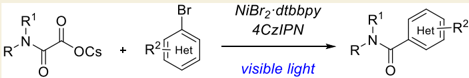
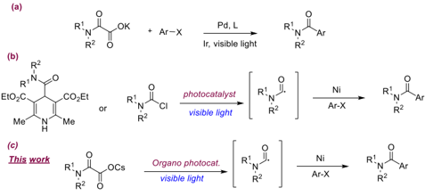
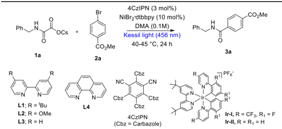
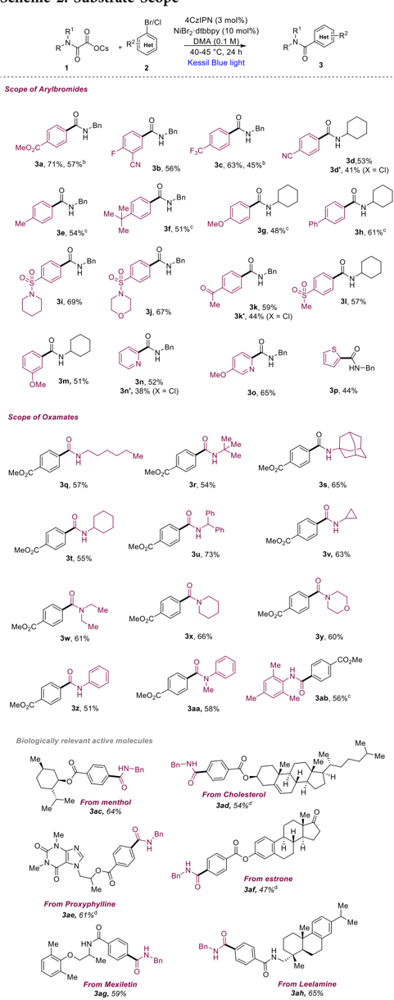
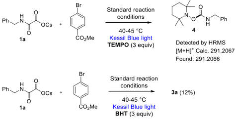
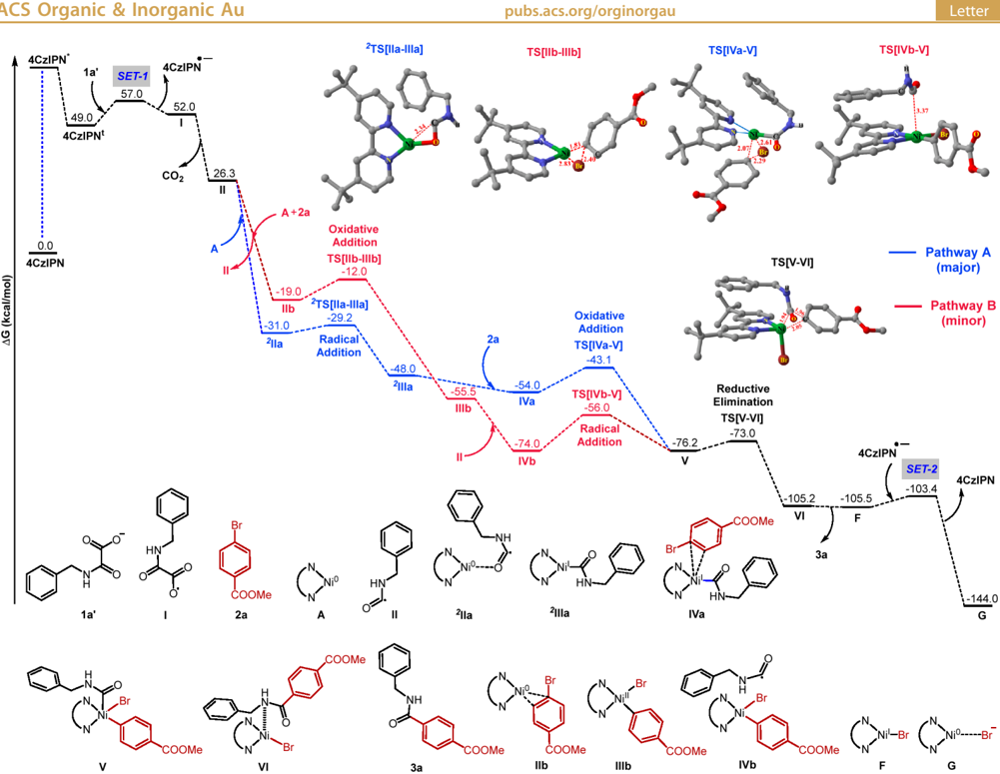
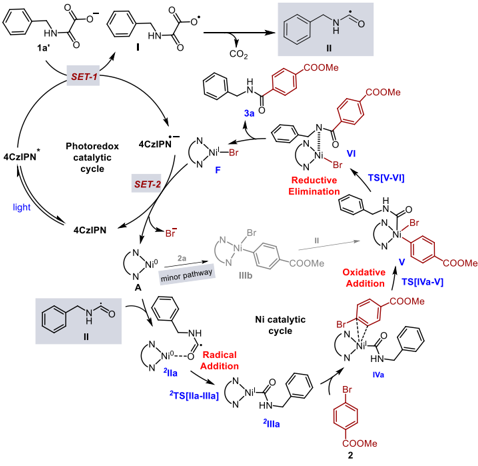

[pubs.acs.org/orginorgau](pubs.acs.org/orginorgau?ref=pdf)

Letter

## Redox-Neutral Decarboxylative Cross-Coupling of Oxamates with Aryl Bromides

Akash Bisoyi, Vijay Kumar Simhadri, # Surya K, # Rositha Kuniyil, * and Veera Reddy Yatham *

[Cite This: ACS Org. Inorg. Au 2024, 4, 223-228](https://pubs.acs.org/action/showCitFormats?doi=10.1021/acsorginorgau.3c00053&ref=pdf)

## ACCESS

[Metrics &amp; More](https://pubs.acs.org/doi/10.1021/acsorginorgau.3c00053?goto=articleMetrics&ref=pdf)

[Article Recommendations](https://pubs.acs.org/doi/10.1021/acsorginorgau.3c00053?goto=recommendations&?ref=pdf)

ABSTRACT: Dual nickel-photoredox-enabled direct synthesis of amides through cross-coupling of cesium oxamates with aryl bromides has been developed. This methodology's key advantages are mild reaction conditions, utilizing organic dye as a photocatalyst, employing readily available starting chemicals as coupling partners, and late-stage carbamoylation of pharmaceutically relevant molecules. DFT studies suggested that the nickel catalytic cycle proceeds via a radical addition pathway prior to the oxidative insertion.

*

sı

[Supporting Information](https://pubs.acs.org/doi/10.1021/acsorginorgau.3c00053?goto=supporting-info&ref=pdf)

KEYWORDS: Visible light, nickel, carbamoylation, amides, cross-coupling, aryl bromides, oxamates

T he amide bond formation is unarguably one of the most important transformations in synthetic organic chemistry. 1 -5 Molecules with amide bonds are important structural units found throughout nature. This amide linkage serves as the backbone of various biomolecules such as proteins, peptides, natural products, polymers, and pharmaceutical drugs. 6 -9 Furthermore, many naturally existing plant-based amides have antitumor, antibacterial, antifungal, and insecticidal effects. Considering the widespread utility and importance of amide bonds, various methodologies have already been developed for their synthesis. 1 -5 The dehydrative condensation in the presence of the stoichiometric amount of coupling reagents is the most commonly employed method for the installation of amide functionality. 10 However, the employed coupling reagents are often quite expensive and produce stoichiometric amounts of byproducts. In order to overcome the aforementioned problems, a catalytic method was introduced for the synthesis of amides where metals were used as catalysts. 11 -14 Among them, the Pd-catalyzed aminocarbonylation process was materialized to some extent. 15 -19 However, the use of high-pressure toxic CO gas and specialized reaction conditions limits the broad applicability of this method. Therefore, developing a new and benign catalytic protocol for amide bond synthesis from commercially available chemicals is highly enviable.

Recently, C -C and C -heteroatom bond formation reactions driven by visible light photocatalysis have emerged as the fastest-growing field in organic synthesis. 20 -23 Furthermore, the integration of photocatalysis with metal catalysis unlocked new opportunities in the cross-coupling domain. 24 -29 The generation of carbamoyl radicals and their application for the synthesis of amides through visible light photocatalysis has been well reported. 30 Also, few reports have been demonstrated for the synthesis of amides through the dual metallo-photoredox catalysis, in which radical cross-

coupling takes place between aryl halides and carbamoyl radical. 31 -33 In 2015, Shang and Fu jointly reported dual Pd/ photoredox-mediated decarboxylative coupling of potassium oxamates with aryl bromides/iodides to produce corresponding amides in good yields (Scheme 1, a). 31 In 2020, Melchiorre

## Scheme 1. Known Strategies for the Photocatalytic Synthesis of Amides from Haloarenes

and co-workers utilized a less expensive combination of photosensitizer and metal catalyst in the presence of visible light, where a variety of bench-stable 4-carbamoyl-1,4dihydropyridine derivatives act as the source of carbamoyl radical and couples with a range of aryl/heteroaryl bromides lead to the formation of amides in good yields (Scheme 1, b). 32 However, the complexity associated with the synthesis of the carbamoyl radical precursors limits its applications. Very

Received:

October 5, 2023

Revised:

November 15, 2023

Accepted:

November 16, 2023

Published:

November 29, 2023

recently, Maiti and co-workers demonstrated the direct generation of carbamoyl radical from carbamoyl chloride in the presence of visible light through the halogen-atom transfer (XAT) concept, and further integration with nickel catalysis led to the formation of amides in good yields (Scheme 1, b). 33 This methodology tolerates a variety of aryl/hetero aryl bromides and aryl chlorides. Moreover, the authors utilize this methodology for the late-stage amidation of halide-containing drug molecules and pharmacophores. However, carbamoyl chlorides were synthesized from the corresponding amines by the treatment of triphosgene, which is toxicologically unsafe. In the present work, we employed easily accessible and stable oxamates 1 as a source of carbamoyl radical in visible-light photocatalysis, and further integration with nickel crosscoupling events in the presence of aryl/heteroaryl bromides led to the formation of amide products (Scheme 1, c).

This synergistic dual Ni/photoredox cross-coupling event was conducted using benzyl oxamate 1a and methyl 4bromobenzoate 2a as a model substrate. After screening several reaction parameters, product 3a was isolated in 71% isolated yield in the presence of 10 mol % of NiBr 2 · dtbbpy and 3 mol % of photocatalyst (4CzIPN), with DMA as a solvent, and upon irradiation with kessil blue light (456 nm, 40 W) at 40 -45 ° C (Table 1, entry 1). Oxamates containing different counter

a Optimization of the reaction conditions: 1a (0.15 mmol), 2a (0.1 mmol), at 40 -45 ° C, for 24 h. b NMR yields using benzyl benzoate as an internal standard. c Isolated yield.

Table 1. Optimization of the Reaction Conditions a

|   Entry | Deviation from optimized conditions   | 3a (%) b       |
|---------|---------------------------------------|----------------|
|       1 | None                                  | 75 (71 c )     |
|       2 | Using Li, Na, and K oxamates          | 27, 33, and 52 |
|       3 | Using NiBr 2 · L2 as ligand           | 62             |
|       4 | Using NiBr 2 · L3 as ligand           | 40             |
|       5 | Using NiBr 2 · L4 as ligand           | 36             |
|       6 | Using Ir - I as photocatalyst         | 46             |
|       7 | Using Ir - II as photocatalyst        | 38             |
|       8 | DMF as solvent                        | 67             |
|       9 | DMSO as solvent                       | 47             |
|      10 | In the absence of photocatalyst       | 0              |
|      11 | In the absence of light               | 0              |
|      12 | In the absence of ligand              | 12             |
|      13 | In the absence of nickel              | 0              |

cations such as Li + , Na + , and K + produce slightly lower yields (Table 1, entry 2). Employing NiBr 2 · L2 (L2 = 4,4 ′ -dimethoxy2,2 ′ -bipyridine) works well (Table 1, entry 3), while employing NiBr2 · L3 and NiBr2 · L4 afford low yields of the product (Table 1, entries 4 -5). In the presence of Ir-based photocatalysts ( Ir -I and Ir -II ), the yields are sluggish (Table 1, entries 6 -7). Using DMF as a solvent produced a good yield of 3a (Table 1, entry 8), while using DMSO resulted in a low yield of product 3a (Table 1, entry 9). Controlled reactions reveal the role of the Ni, ligand, light, and photocatalyst (Table 1, entries 10 -13).

With the optimized reaction conditions as described in Table 1, entry 1, we tested the generality of the synergistic Ni/ photoredox catalysis for amide synthesis (Scheme 2). First, the scope of aryl bromides was evaluated. A wide range of aryl bromides, bearing both electron-deficient and electron-rich substituents, undergo cross-coupling reactions with oxamates 1a and 1b to give moderate to good yields of the amide products ( 3a -3h ; 48 -71%). Aryl bromides containing different functional groups such as ester, ketone, cyano, ether, and sulfonamide are well reacted with the oxamate ( 1a or 1b ) and afford corresponding amides ( 3i -3m ) in good yields (51 -69%). Heteroaryl bromides are well received in our dual catalysis and couple with oxamate 1a to afford corresponding amides ( 3n -3p ) in good yields (44 -65%). Electron-deficient aryl chlorides are also suitable candidates in our reaction and afforded amide products ( 3d ′ , 3k ′ , and 3n ′ ) in moderate yields.

Next, we focused on the scope of the oxamates, which are easily prepared by treating methyl chlorooxoacetate with amines followed by the addition of CsOH. We first evaluated the sterically different primary alkylamine-derived oxamates. N -Hexylamine-, tert -butyl amine-, 1-adamantylamine-, cyclohexyl amine-, benzhydrylamine-, and cyclopropyl amine-derived oxamates were coupled with methyl 4-bromobenzoate ( 2a ) in our reaction conditions and afford corresponding secondary amide products ( 3q -3v ) in good yields (54 -73%). Cyclic and acyclic secondary amines such as morpholine, piperidine, and diethylamine-derived oxamates generate corresponding carbamoyl radicals in our dual catalysis and, coupled with methyl 4bromobenzoate ( 2a ), led to the formation of tertiary amides ( 3w -3y ) in good yields (60 -66%). Finally, oxamates derived from aniline, N -methylaniline, and mesityl amine were successfully converted to their corresponding N -aryl benzamide derivatives ( 3z -3ab ) in our dual Ni/photoredox catalysis. To further investigate the amenability of our methodology toward pharmaceutically relevant molecules, we have employed a few aryl bromides derived from alcohols (menthol, cholesterol, and Proxyphylline), phenol (estrone), and amines (Mexiletin and Leelamine) that were efficiently coupled with benzyl oxamate 1a to afford corresponding amides ( 3ac -3ah ) in moderate to good yields (47 -65%). 34

Next, we carried out a series of preliminary mechanistic experiments in order to gain insight into the plausible reaction mechanism (Scheme 3). First, we conducted the reaction in the presence of a radical trapping agent such as TEMPO (2,2,6,6-tetramethylpiperidin-1-yl)oxyl (3.0 equiv), and no desired product 3a was observed. A TEMPO-adduct 4 was confirmed by HRMS analysis (see Supporting Information). When a radical scavenger such as BHT (3.0 equiv) was added in to the standard reaction condition, product 3a was obtained in a low yield (12%). The above experimental observations indicate the involvement of carbamoyl radicals in our reaction conditions. Next, quenching studies clearly indicate the photoexcited photocatalyst undergoes a reductive quenching by benzyl oxamate 1a (Scheme 4, left). Finally, the light ON -OFF experiment reveals that continuous irradiation of light is required throughout the reaction (Scheme 4, right).

Recently, Jointly Molander -Kozlowski and Terrett -Huestis used density functional theory (DFT) calculations to

## Scheme 2. Substrate Scope a

## Scheme 3. Mechanistic Studies

Scheme 4. Stern -Volmer Plot (Left), ON -OFF Experiment (Right)

determine the feasible reaction pathway for the coupling of carbon radicals with aryl bromides in dual Ni-photoredox catalysis. 35,36 Their studies revealed that both mechanisms (Ni 0 -Ni I -Ni III and Ni 0 -Ni II -Ni III ) are operatively dependent on the type of radical present under the reaction conditions. In order to find the feasible pathway under our reaction conditions, detailed computational studies were conducted using the oxamate anion ( 1a ′ ) and aryl bromide ( 2a ) as the substrates. The calculations were carried out at the UB3LYPD3(BJ)/6-31G ** , LANL2DZ(Ni)+SMD(DMF)//UB3LYPD3(BJ)/6-31G * , LANL2DZ(Ni) level of theory. Our study suggests that the most probable mechanism for the reaction follows pathway A as shown in Figure 1. Pathway A in which the initial step is radical addition followed by oxidative insertion is similar to that proposed by Molander and Kozlowski in 2015. 35 The other possibility is pathway B, where the initial step is an oxidative addition step followed by a radical addition step proposed by Terrett -Huestis and Doyle -MacMillan, was found to be higher in energy compared to that of pathway A. 36,37 The relative Gibbs free energy profile diagram for pathways A and B is given in Figure 1. The important steps involved in the catalytic cycle following pathway A and pathway B are described in the following paragraphs.

Initially, the photocatalyst 4CzIPN goes to an excited singlet state, 4CzIPN * , upon irradiation with Kessil light (456 nm) and then relaxes to the triplet state 4CzIPN t as shown in Figure 1. The single electron transfer (SET-1) from the oxamate anion 1a ′ to the 4CzIPN t generates radical I and 4CzIPN ·-. The energy barrier for SET-1 is 8.0 kcal/mol. The carbamoyl radical II is formed from I upon decarboxylation. Next, through pathway A, carbamoyl radical II enters the nickel catalytic cycle by coordinating to LnNi 0 (Ln = 4,4 ′ -ditert -butyl-2,2 ′ -dipyridyl) species A through the O atom, forming an intermediate 2 IIa of energy -31.0 kcal/mol.

AG (kcal/mol)

4CzIPN*

1a'

4CzIPN*

0.0

4CzIPN

SET-1

57.0

Figure 1. Computed Gibbs free energy profile diagram for the redox-neutral decarboxylative cross-coupling reaction catalyzed by the photocatalyst 4CzIPN and the LnNi 0 species A obtained at the UB3LYP-D3(BJ)/6-31G ** ,LANL2DZ(Ni)+SMD(DMF)//UB3LYP-D3(BJ)/631G * ,LANL2DZ(Ni) level of theory. The relative Gibbs free energies (in kcal/mol) of all intermediates and transition states are with respect to the oxamate anion 1a ′ , 4CzIPN in singlet state, LnNi 0 species A , and the aryl bromide 2a . Ln = 4,4 ′ -ditert -butyl-2,2 ′ -dipyridyl (dtbbpy).

Further, the intermediate 2 IIa converted to a more stable L n Ni I intermediate 2 IIIa ( -48.0 kcal/mol) in the doublet state and proceeded via a low barrier (1.8 kcal/mol) transition state 2 TS[IIa-IIIa]. 38 The intermediate IVa of energy -54.0 kcal/ mol is formed by the coordination of the LnNi I intermediate 2 IIIa and aryl bromide 2a . The next step is the transformation of intermediate IVa through the oxidative insertion of nickel into the aryl -Br bond to form LnNi III intermediate V of energy -76.2 kcal/mol that proceeded via the energy barrier (10.9 kcal/mol) transition state TS[IVa-V]. An alternative possibility is considered in pathway B, where the substrate 2a coordinates to LnNi 0 species A to form intermediate IIb which has an energy of -19.0 kcal/mol. Next, intermediate IIb is transformed to more stable LnNi II intermediate IIIb ( -55.5 kcal/ mol) via a high energy barrier (7.0 kcal/mol) transition state TS[IIb-IIIb] . The intermediate V has been generated via the addition of carbamoyl radical II to the LnNi II intermediate IIIb , which proceeds through a high energy barrier (18 kcal/ mol) via TS[IVb-V] . Next, in both pathways, the C -C bond formation between the aryl carbon of 2a and the amide carbon of 1a' via the reductive elimination of transition state TS[VVI] takes place to form the product -catalyst complex VI . The energies of TS[V-VI] and VI are -73.0 and -105.2 kcal/mol, respectively. When the product 3a decoordinates from the nickel center, Ni(I) species F is formed, which in turn accepts an electron from 4CzIPN ·-through single electron transfer (SET-2) process to form LnNi 0 species G and 4CzIPN . The SET-2 barrier of 2.1 kcal/mol serves as the catalyst regeneration step in this mechanism. The increase in energy barrier (7.0 kcal/mol) for oxidative addition of 2a with LnNi 0 makes pathway A a more favorable pathway.

Combining all the above experimental and computational studies and following previous literature precedents, 31 -33,35,36 we proposed a feasible reaction mechanism in our catalytic cycle as depicted in Scheme 5. Initially, in the photocatalytic cycle, the single electron oxidation of benzylic cesium oxamates 1a ( E ox = +0.74 V vs Fc in DMA, see Supporting Information for the CV of 1a ) takes place by the photoexcited photocatalyst (4CzIPN * , E red = +1.35 V vs SCE) 39 resulting in the generation of the oxamate radical I and radical anion of the photocatalyst (4CzIPN ·-). The radical intermediate I undergoes decarboxylation, leading to carbamoyl radical II . In the nickel cycle, the LnNi II Br2 (Ln = dtbbpy) complex was transformed to LnNi 0 complex ( A ) in the presence of visiblelight photocatalysis utilizing benzylic cesium oxamate as a substoichiometric amount of reductant. Addition of carbamoyl radical to the LnNi 0 complex generates LnNi I intermediate ( 2 IIIa) via 2 IIa. Next, the addition of aryl bromide to the LnNi I

4CzIPN

2TS[lla-llla]

TS[IVa-V]

TS[IVE-V]

## Scheme 5. Mechanistic Hypothesis

intermediate generates another LnNi III intermediate V via IVa . Reductive elimination from the L n Ni III intermediate V liberates the product 3a and LnNi I Br intermediate F . Finally, single electron transfer between LnNi I Br and reduced photocatalyst (4CzIPN ·-) regenerated ground-state photocatalyst (4CzIPN) and active LnNi 0 ( A ) for the next catalytic cycle. Nevertheless, our catalytic cycle cannot completely ignore the alternative reaction pathway that is the initial oxidative addition of aryl bromide 2a to LnNi 0 ( A ), followed by carbamoyl radical addition to generate the LnNi III intermediate V (see Supporting Information for the complete cycle). 40

In summary, we have developed a new catalytic method for synthesizing amides through cross-coupling cesium oxamates with aryl bromides using dual nickel/photoredox catalysis. This strategy works under mild reaction conditions, and corresponding amides are isolated in good to moderate yields. The detailed analysis of the mechanism using DFT reveals that the favorable pathway of the nickel catalytic cycle begins with the radical addition elementary step prior to the oxidative insertion. Further, a variety of carbamoylation chemistry using the oxamates as the carbamoyl radical source is ongoing in our laboratory.

## ■ ASSOCIATED CONTENT

## Data Availability Statement

The data underlying this study are available in the published article and its Supporting Information.

## * sı Supporting Information

The Supporting Information is available free of charge at https://pubs.acs.org/doi/10.1021/acsorginorgau.3c00053.

General experimental procedures, mechanism studies, 1 H and 13 C NMR spectra of all compounds ( 1a -1m , 2s , 2u , 3a -3ah ) (PDF)

## ■ AUTHOR INFORMATION

## Corresponding Authors

Veera Reddy Yatham -School of Chemistry, Indian Institute of Science Education and Research, Thiruvananthapuram 695551, India; orcid.org/0000-0002-3967-5342; Email: reddy@iisertvm.ac.in

Rositha Kuniyil -Department of Chemistry, Indian Institute of Technology Palakkad, Kerala 678557, India ; Email: rosithak@iitpkd.ac.in

## Authors

Akash Bisoyi -School of Chemistry, Indian Institute of Science Education and Research, Thiruvananthapuram 695551, India

Vijay Kumar Simhadri -School of Chemistry, Indian Institute of Science Education and Research, Thiruvananthapuram 695551, India

Surya K -Department of Chemistry, Indian Institute of Technology Palakkad, Kerala 678557, India

Complete contact information is available at: https://pubs.acs.org/10.1021/acsorginorgau.3c00053

## Author Contributions

# V.K.S. and S.K. contributed equally. Credit: Akash Bisoyi : conceptualization (lead), data curation (lead), formal analysis (lead), investigation (lead), writing -review and editing (supporting); Vijay Kumar Simhadri : data curation (lead), formal analysis (supporting), investigation (supporting); Surya K : data curation (lead), formal analysis (supporting); Rositha Kuniyil : data curation (lead), formal analysis (lead); funding acquisition (lead), project administration (lead), resources (lead), supervision (lead), writing -original draft (lead); Veera Reddy Yatham : data curation (supporting), formal analysis (supporting), funding acquisition (lead), project administration (lead), resources (lead), supervision (lead), writing -original draft (lead).

## Notes

The authors declare no competing financial interest.

## ■ ACKNOWLEDGMENTS

Financial support by the Council of Scientific &amp; Industrial Research-Human Resource Development Group (CSIRHRDG), Government of India (File Number: 02/0466/23/ EMR-II) is greatly acknowledged. A.B. thanks MHRD (for PMRF). V.K.S. thanks CSIR-HRDG for the CSIR-JRF fellowship. The authors thank Alisha Rani Tripathy, Udita Choudhury, and Ashutosh Mishra for the synthesis and purification of some of the products. R.K. and S.K. gratefully acknowledge Science and Engineering Research Board (SERB), Government of India (File Number: SRG/2022/ 000307), and IIT Palakkad for the financial support, and Chandra high-performance computing cluster at IIT Palakkad for the computational facilities.

## ■ REFERENCES

- (1) Sabatini, M. T.; Boulton, L. T.; Sneddon, H. F.; Sheppard, T. D. A green chemistry perspective on catalytic amide bond formation. Nature Catal. 2019 , 2 , 10 -17.
- (2) Pattabiraman, V. R.; Bode, J. W. Rethinking amide bond synthesis. Nature 2011 , 480 , 471 -479.
- (3) Shen, B.; Makley, D. M.; Johnston, J. N. Umpolung reactivity in amide and peptide synthesis. Nature 2010 , 465 , 1027 -1033.

- (4) Massolo, E.; Pirola, M.; Benaglia, M. Amide Bond Formation Strategies: Latest Advances on a Dateless Transformation. Eur. J. Org. Chem. 2020 , 2020 , 4641 -4651.
- (5) de Figueiredo, R. M.; Suppo, J.-S.; Campagne, J.-M. Nonclassical Routes for Amide Bond Formation. Chem. Rev. 2016 , 116 , 12029 -12122.
- (6) Greenberg, A.; Breneman, C. M.; Liebman, J. F. The Amide Linkage: Structural Significance in Chemistry, Biochemistry, and Materials Science ; Wiley -Interscience: Chichester, NY, 2000.
- (7) Kumar, V.; Bhatt, V.; Kuma, N. Amides From Plants: Structures and Biological Importance. In Studies in Natural Products Chemistry ; Rahman, A.-U., Ed., Elsevier B.V.: Amsterdam, 2018, Vol. 56 , pp 287 -333.
- (8) Roughley, S. D.; Jordan, A. M. The Medicinal Chemist's Toolbox: An Analysis of Reactions Used in the Pursuit of Drug Candidates. J. Med. Chem. 2011 , 54 , 3451 -3479.
- (9) Bray, B. L. Large-scale manufacture of peptide therapeutics by chemical synthesis. Nat. Rev. Drug Discovery 2003 , 2 , 587 -593.
- (10) Valeur, V.; Bradley, M. Amide bond formation: beyond the myth of coupling reagents. Chem. Soc. Rev. 2009 , 38 , 606 -631.
- (11) Allen, C. L.; Williams, J. M. J. Metal-catalysed approaches to amide bond formation. Chem. Soc. Rev. 2011 , 40 , 3405 -3415.
- (12) Roy, S.; Roy, S.; Gribble, G. W. Metal-catalyzed amidation. Tetrahedron 2012 , 68 , 9867 -9923.
- (13) Veatch, A. M.; Alexanian, E. J. Cobalt-catalyzed aminocarbonylation of (hetero)aryl halides promoted by visible light. Chem. Sci. 2020 , 11 , 7210 -7213.
- (14) [Kancherla, R.; Naveen, T.; Maiti, D. Palladium-Catalyzed [3 + 3] Annulation between Diarylamines and α , β -Unsaturated Acids through C -H Activation: Direct Access to 4-Substituted 2Quinolinones. Chem.  Eur. J. 2015 , 21 , 8360 -8364.](https://doi.org/10.1002/chem.201500774)
- (15) Schoenberg, A.; Heck, R. F. Palladium-catalyzed amidation of aryl, heterocyclic, and vinylic halides. J. Org. Chem. 1974 , 39 , 3327 -3331.
- (16) Brennfuhrer, A.; Neumann, H.; Beller, M. Palladium-Catalyzed Carbonylation Reactions of Aryl Halides and Related Compounds. Angew. Chem., Int. Ed. 2009 , 48 , 4114 -4133.
- (17) Martinelli, J. R.; Clark, T. P.; Watson, D. A.; Munday, R. H.; Buchwald, S. L. Palladium-Catalyzed Aminocarbonylation of Aryl Chlorides at Atmospheric Pressure: The Dual Role of Sodium Phenoxide. Angew. Chem., Int. Ed. 2007 , 46 , 8460 -8463.
- (18) Friis, S. D.; Skrydstrup, T.; Buchwald, S. L. Mild Pd-Catalyzed Aminocarbonylation of (Hetero)Aryl Bromides with a Palladacycle Precatalyst. Org. Lett. 2014 , 16 , 4296 -4299.
- (19) Dang, T. T.; Zhu, Y.; Ngiam, J. S. Y.; Ghosh, S. C.; Chen, A.; Seayad, A. M. Palladium Nanoparticles Supported on ZIF-8 As an Efficient Heterogeneous Catalyst for Aminocarbonylation. ACS Catal. 2013 , 3 , 1406 -1410.
- (20) Shaw, M. H.; Twilton, J.; MacMillan, D. W. C. Photoredox catalysis in organic chemistry. J. Org. Chem. 2016 , 81 , 6898 -6926.
- (21) Romero, N. A.; Nicewicz, D. A. Organic photoredox catalysis. Chem. Rev. 2016 , 116 , 10075 -10166.
- (22) Kärkäs, M. D.; Porco, J. A., Jr; Stephenson, C. R. J. Photochemical approaches to complex chemotypes: applications in natural product synthesis. Chem. Rev. 2016 , 116 , 9683 -9747.
- (23) Grover, J.; Prakash, G.; Teja, C.; Lahiri, G. K.; Maiti, D. MetalFree Photoinduced Hydrogen Atom Transfer Assisted C(sp 3 ) -H Thioarylation. Green Chem. 2023 , 25 , 3431 -3436.
- (24) Chan, A. Y.; Perry, I. B.; Bissonnette, N. B.; Buksh, B. F.; Edwards, G. A.; Frye, L. I.; Garry, O. L.; Lavagnino, M. N.; Li, B. X.; Liang, Y.; Mao, E.; Millet, A.; Oakley, J. V.; Reed, N. L.; Sakai, H. A.; Seath, C. P.; MacMillan, D. W. C. Metallaphotoredox: The Merger of Photoredox and Transition Metal Catalysis. Chem. Rev. 2022 , 122 , 1485 -1542.
- (25) [Zhu, C.; Yue, H.; Chu, L.; Rueping, M. Recent advances in photoredox and nickel dual-catalyzed cascade reactions: pushing the boundaries of complexity. Chem. Sci. 2020 , 11 , 4051 -4064.](https://doi.org/10.1039/D0SC00712A)
- (26) Prier, C. K.; Rankic, D. A.; MacMillan, D. W. C. Visible Light Photoredox Catalysis with Transition Metal Complexes: Applications in Organic Synthesis. Chem. Rev. 2013 , 113 , 5322 -5363.
- (27) Saha, A.; Guin, S.; Ali, W.; Bhattacharya, T.; Sasmal, S.; Goswami, N.; Prakash, G.; Sinha, S. K.; Chandrashekar, H. B.; Panda, S.; Anjana, S. S.; Maiti, D. Photoinduced Regioselective Olefination of Arenes at Proximal and Distal Sites. J. Am. Chem. Soc. 2022 , 144 , 1929 -1940.
- (28) Saha, A.; Ghosh, A.; Guin, S.; Panda, S.; Mal, D. K.; Majumdar, A.; Akita, M.; Maiti, D. Substrate-Rhodium Cooperativity in Photoinduced ortho-Alkynylation of Arenes. Angew. Chem., Int. Ed. 2022 , 61 , No. e202210492.
- (29) Ali, W.; Saha, A.; Ge, H.; Maiti, D. Photoinduced metaSelective C -H Oxygenation of Arenes,. JACS Au 2023 , 3 , 1790 -1799.
- (30) Matsuo, B. T.; Oliveira, P. H. R.; Pissinati, E. F.; Vega, K. B.; de Jesus, I. S.; Correia, J. T. M.; Paixao, M. Photoinduced Carbamoylation Reactions: Unlocking New Reactivities towards Amide Synthesis. Chem. Commun. 2022 , 58 , 8322 -8339.
- (31) Cheng, W.-M.; Shang, R.; Yu, H.-Z.; Fu, Y. Room-Temperature Decarboxylative Couplings of α -Oxocarboxylates with Aryl Halides by Merging Photoredox with Palladium Catalysis. Chem.  Eur. J. 2015 , 21 , 13191 -13195.
- (32) Alandini, N.; Buzzetti, L.; Favi, G.; Schulte, T.; Candish, L.; Collins, K. D.; Melchiorre, P. Amide Synthesis by Nickel/PhotoredoxCatalyzed Direct Carbamoylation of (Hetero)Aryl Bromides. Angew. Chem., Int. Ed. 2020 , 59 , 5248 -5253.
- (33) Maiti, S.; Roy, S.; Ghosh, P.; Kasera, A.; Maiti, D. PhotoExcited Nickel-Catalyzed Silyl-Radical-Mediated Direct Activation of Carbamoyl Chlorides To Access (Hetero)aryl Carbamides. Angew. Chem., Int. Ed. 2022 , 61 , No. e2022074.
- (34) The mass balance accounts for the reduction of aryl bromides, conversion of oxamates to formamide, and unreacted aryl bromides.
- (35) Gutierrez, O.; Tellis, J. C.; Primer, D. N.; Molander, G. A.; Kozlowski, M. C. Nickel-Catalyzed Cross-Coupling of PhotoredoxGenerated Radicals: Uncovering a General Manifold for Stereoconvergence in Nickel-Catalyzed Cross-Couplings. J. Am. Chem. Soc. 2015 , 137 , 4896 -4899.
- (36) Kolahdouzan, K.; Khalaf, R.; Grandner, J. M.; Chen, Y.; Terrett, J. A.; Huestis, M. P. Dual Photoredox/Nickel-Catalyzed Conversion of Aryl Halides to Aryl Aminooxetanes: Computational Evidence for a Substrate-Dependent Switch in Mechanism. ACS Catal. 2020 , 10 , 405 -411.
- (37) Zuo, Z.; Ahneman, D. T.; Chu, L.; Terrett, J. A.; Doyle, A. G.; MacMillan, D. W. C. Merging Photoredox with Nickel Catalysis: Coupling of α -Carboxyl sp 3 -Carbons with Aryl Halides. Science 2014 , 345 , 437 -440.
- (38) Alternative radical addition transition state in quartet spin state 4 TS[IIa-IIIa] was found to be 23.2 kcal/mol higher in energy compared to that in doublet spin state. See Figure 60 in the Supporting Information for more details on radical addition transition state in quartet spin state.
- (39) Shang, T. Y.; Lu, L. H.; Cao, Z.; Liu, Y.; He, W. M.; Yu, B. Recent advances of 1,2,3,5-tetrakis(carbazol-9-yl)-4,6-dicyanobenzene (4CzIPN) in photocatalytic transformations. Chem. Commun. 2019 , 55 , 5408 -5419.
- (40) After submission of this manuscript, a related transformation was reported using oxamic acids as carbamoyl radical source and couples with aryl bromides through Dual Nickel-and PhotoredoxCataysis. Hutskalova, V.; Hamdan, F. B.; Sparr, C. Org. Lett. , 2023, ASAP. DOI: 10.1021/acs.orglett.3c02389.