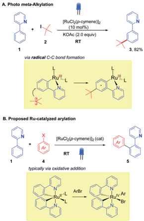
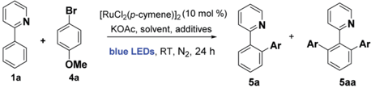
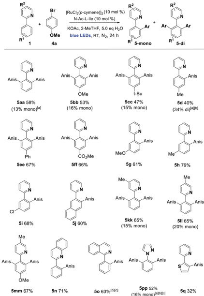
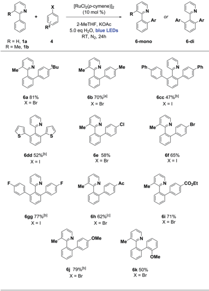
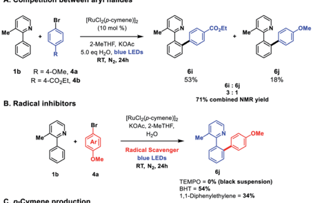
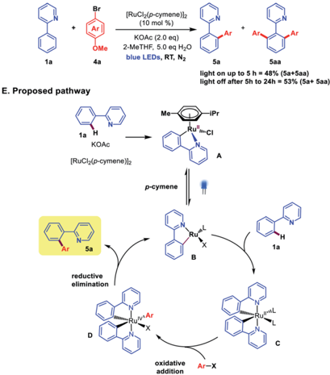

Open Access /

A. Photo meta-Alkylation

[RuC/½(p-cymene)]2

(cc) BY

## Chemical Science

3, 82%

## EDGE ARTICLE

B. Proposed Ru-catalyzed arylation

(RuC/½(p-cymene))2 (cat)

RT

Cite this: Chem. Sci. , 2020, 11 , 4439

Br

All publication charges for this article have been paid for by the Royal Society of Chemistry typically via oxidative addition Ruv Ar

Received 2nd March 2020 Accepted 6th April 2020

DOI: 10.1039/d0sc01289k

rsc.li/chemical-science

## Introduction

The integration of visible light photoredox catalysis with transition metal C -H activation catalysis creates new pathways for bond formation, that frequently operate under mild conditions. The two catalysis regimes can be meshed via two separate catalyst entities, with two corresponding catalysis cycles; 1 or alternatively, a single dual-function catalyst system can be used. 2 We are interested in this latter approach to exploit the facility of some Ru catalysts to absorb visible light, such that their native C -H activation function is enhanced in terms of improved rates, substrate scope, and environmental impact. We, along with the Ackermann group, recently demonstrated this concept for the Ru-catalysed meta -alkylation reaction (Scheme 1). 3 The tert -butylation of 2-phenylpyridine 1 , typically carried out under thermal conditions ( ca. 100  C), could proceed at room temperature under blue-light irradiation using the widely employed catalyst [RuCl2( p -cymene)]2 to give the alkylated product 3 in good yield.

We were interested in exploring this concept of photo-Ru C -H activation in the arylation regime. Ru-catalysed ortho -arylation is a powerful approach to C -C bond formation that has seen extensive development in recent years. 4 Proceeding via Ru(II)/Ru(IV) catalytic cycles, the process has excellent scope for aryl halides (including aryl chlorides), is very tolerant of water and air, and the cost of Ru compares favorably with the far more expensive alternatives of Pd and Rh that are frequently used for ortho C -H arylation. High reaction temperatures are standard, however, when using [RuCl2( p -cymene)]2 as catalyst. 5,6 A photo Ru arylation reaction could activate alternative mechanistic paths and o ff er

School of Chemistry, The University of Manchester, Oxford Road, Manchester, M13 9PL, UK. E-mail: michael.greaney@manchester.ac.uk

† Electronic supplementary information (ESI) available. See DOI: 10.1039/d0sc01289k

View Article Online View Journal | View Issue

## Ortho C -H arylation of arenes at room temperature using visible light ruthenium C -H activation †

Arunachalam Sagadevan, Anastasios Charitou, Fen Wang, Maria Ivanova, Martin Vuagnat and Michael F. Greaney *

A ruthenium-catalyzed ortho C -H arylation process is described using visible light. Using the readily available catalyst [RuCl2( p -cymene)]2, visible light irradiation was found to enable arylation of 2-arylpyridines at room temperature for a range of aryl bromides and iodides.

the possibility of room temperature reaction. 7 The two Rucatalyzed processes, meta -alkylation and ortho -arylation, operate through very di ff erent frameworks in the thermal regime, with the former thought to involve discrete 2  and 3  carbon-centered radicals adding to Ru(III) metallacycles (Scheme 1A), 8 and the latter involving more typical oxidative additions of aryl halides to a Ru(II) center. 9 The role of photoexcitation on a putative arylation process was thus interesting to examine in light of this dichotomy; as the photoreductive formation of highly reactive aryl radicals in analogy to Rumeta alkylation chemistry was unlikely to be a signi  cant factor.

Scheme 1 Ruthenium photocatalysis for meta -alkylation (A) and proposed ortho -arylation (B).

## Results and discussion

## Photoarylation of 2-arylazines with aryl halides

We began by examining the archetypal arylation system of 2phenylpyridine 1a with bromoanisole 4a (Table 1). Using [RuCl2( p -cymene)]2 as catalyst in the presence of KOAc, under blue LED irradiation, we were pleased to observe successful arylation at room temperature to give a good 70% combined conversion to mono and diortho -arylated products 5a and 5aa . As is typical for Ru ortho -arylations of 2-phenyl pyridine, the monoarylated product is a superior substrate than the starting material, giving the diarylated material as the major product.

The reaction worked well in ethereal solvents (entries 1 -4), and a screen of carboxylate and amino acid additives did not yield substantial improvements, although the acetylisoleucine derivative gave slightly improved yields and was retained for substrate screening (entry 7). Common solvents such as MeOH, DCM, MeCN, or DMF were not e ff ective (entry 8), nor were the simple Ru salts shown in entries (10 -12). Control experiments established that both light and catalyst were essential for reaction at room temp (entries 13 -15), and as with our previous Ru meta systems, 10 the reaction was found to be air sensitive and require inert atmospheres to proceed.

With these conditions in hand, we established the scope of the reaction with respect to the C -H component using p -bromoanisole as the arylating agent. Alkyl, alkoxy, carboxy, and

Table 1 Development of Ru photoarylation a

|   Entry | Catalyst                         | Additives             | Solvent                 | Yield b [%]   |
|---------|----------------------------------|-----------------------|-------------------------|---------------|
|       1 | [RuCl 2 ( p -cymene)] 2          | MesCO 2 H             | 1,4-Dioxane             | (70)          |
|       2 | [RuCl 2 ( p -cymene)] 2          | MesCO 2 H             | DME                     | 60            |
|       3 | [RuCl 2 ( p -cymene)] 2          | MesCO 2 H             | THF                     | 65            |
|       4 | [RuCl 2 ( p -cymene)] 2          | MesCO 2 H             | 2-MeTHF                 | (72)          |
|       5 | [RuCl 2 ( p -cymene)] 2          | N-Ac- L -isoleu       | 2-MeTHF                 | (74)          |
|       6 | [RuCl 2 ( p -cymene)] 2          | N-Ac- L -isoleu       | 2-MeTHF                 | (78)          |
|       7 | [RuCl 2 ( p -cymene)] 2          | N-Ac- L -isoleu/H 2 O | 2-MeTHF                 | (80)          |
|       8 | [RuCl 2 ( p -cymene)] 2          | None/H 2 O            | 2-MeTHF                 | (80)          |
|       9 | [RuCl 2 ( p -cymene)] 2          | N-Ac- L -isoleu       | MeOH, MeCN, DCM, or DMF | Trace         |
|      10 | RuCl 3 $ H 2 O                   | None                  | 2-MeTHF                 | 0             |
|      11 | Ru(PPh 3 ) 4 Cl 2                | N-Ac- L -isoleu/H 2 O | 2-MeTHF                 | 0             |
|      12 | Ru(bpy) 3 Cl 2                   | None                  | 2-MeTHF                 | 0             |
|      13 | [RuCl 2 ( p -cymene)] 2 (5 mol%) | N-Ac- L -isoleu/H 2 O | 2-MeTHF                 | (72)          |
|      14 | No catalyst                      | N-Ac- L -isoleu       | 2-MeTHF                 | 0             |
|      15 | [RuCl 2 ( p -cymene)] 2 dark     | N-Ac- L -isoleu/H 2 O | 2-MeTHF                 | 0             |
|      16 | [RuCl 2 ( p -cymene)] 2 with air | N-Ac- L -isoleu/H 2 O | 2-MeTHF                 | 0             |

|

phenyl substitution was tolerated in the 4-position of the arene, favoring the disubstituted product ( 5aa -5 ff ). Substitution in the 3-position with MeO, Me, Cl, and fused ring of the naphthyl group acted as a steric control element, suppressing the second ortho ruthenation step and yielding mono-arylated products exclusively ( 5g -5j ). Some alterations to the directing group were possible, with alkylated pyridines being e ff ective in the reaction, along with bicyclic quinoline and isoquinoline directing groups ( 5kk -5o ) and the pyrazine 5pp . Finally, changing the arene C -H to the 5-membered heteroarene thiophene C -H was partially successful in the photoarylation, a ff ording the novel pyridyl thiophene 5q but in diminished yield (Scheme 2).

We then turned our attention to the aryl halide coupling partner, and were pleased to  nd broad substrate scope across a variety of aryl bromides and iodides (Scheme 3). We used 3methyl-2-phenylpyridine ( 1b ) as the substrate in the majority of cases, to simplify the reaction pathway for monoarylation. We observed good e ffi ciencies for 4-alkyl and moderate e ffi ciencies for 4-phenyl aryl halides ( 6a -6cc ), along with the 2-thienyliodide substrate ( 6dd ). Halogens were well tolerated ( 6e -6gg ), and electron poor (4-keto and 4-carboxy ester groups) along with electron rich (4-methoxy) aryl halides reacted smoothly in each case. Ortho -substituted aryl halides were not generally e ff ective in this protocol, although 1-bromo-2-methoxybenzene did react successfully to give 6k in 50% yield. This ortho substitution pattern is known to favour an oxidative dimerization pathway for aryl halide substrates. 11

Open Access /

R2

R'

R = Me, 1b

R = H, 1a

(cc) BY

Mei

Anis

Anis

6a 81%

X= Br

Saa 58%

(13% mono)(a)

Anis

6dd 52% (b)

X= I

Ph

5ee 67%

Anis

6gg 77%(b)

5i 68%

Me

.Anis

OMe

Br

R2

OMe

4

[RuCl2(p-cymene)]2

(10 mol %)

[RuC/(p-cymene))½ (10 mol %)

KOAc, 2-MeTHF, 5.0 eq H2O

blue LEDs, RT, N2, 24 h

5.0 eq H2O, blue LEDs

Scheme 2 Photoarylation of 2-arylazines with p -bromoanisole (Anis ¼ 4-BrC6H4). Unless otherwise noted, reaction conditions were as follows: 1 (1.0 eq., 0.3 mmol), 4a (2.0 eq., 0.6 mmol), [Ru] catalyst (10 mol%), additive (10 mol%), base (2.0 eq.), solvent (1 mL), H2O (5 eq.). The mixture was irradiated with blue LEDs (40 -90 W power) for 24 h under N2 (1 atm). The yields refer to isolated yields after puri fi cation by column chromatography on silica gel (major product illustrated). a Reaction performed using 0.250 mmol of 1 (1.0 eq.) and 0.375 mmol of 4a (1.5 eq.). b Reaction performed without the addition of N-Ac-L-Ile. c Reaction run for 40 h.

## Mechanistic studies

The exclusive formation of ortho -arylated products, allied with the high reduction potential of aryl halides ( ca.  2.5 eV) 12 would likely preclude any discrete aryl radical generation through SET from a Ru(II) catalytic species in the reaction. This was supported with radical quenching experiments, where the reaction proceeded to reasonable conversion in the presence of both BHT and 1,1-diphenylethene (DHP), although TEMPO was observed to completely inhibit the reaction forming an insoluble black suspension. A competition experiment between the electron-rich bromoanisole 4a and electron-poor bromobenzoate a ff orded a 3 : 1 ratio of products in favour of the benzoate 6i , in line with what is commonly observed in hightemperature Ru ortho -arylation through an oxidative addition mechanism. 13

Recent investigations from Larrosa and co-workers into the mechanism of Ru(II)ortho arylation have identi  ed the inhibitory role of the cymene ligand in [RuCl2( p -cymene)]2 catalysis. 6,14 While this ligand a ff ords an air-stable, easy to use catalyst, it

RT, N2. 24h

R

Ar or

Ar

Ar-

R'

Ar

Ar

Scheme 3 Photoarylation of 2-arylpyridines with various aryl halides. Unless otherwise noted, reaction conditions were as follows: 1 (1.0 eq., 0.25 -0.30 mmol), 4 (1.5 eq., 0.375 -0.45 mmol), [Ru] catalyst (10 mol%), base (2.0 eq.), solvent (1 mL), H2O (5 eq.). The mixture was irradiated with blue LEDs (40 -90 W power) for 24 h in N2 (1 atm). The yields refer to isolated yields after puri fi cation by column chromatography on silica gel. a Reaction run for 72 h. b Reaction performed using 0.3 mmol of 1 (1.0 eq.) and 0.6 mmol of 4 (2.0 eq.) in the presence of N-Ac-L-Ile (10 mol%). c Reaction run for 40 h.

retards activity in catalytic cycles, and must de-complex to enable the formation of the active bis-cycloruthenated complex C (Scheme 4E). We analysed the free cymene formed in the reaction under room temperature blue light irradiation against an ambient light control. Decomplexation was observed in both cases, but with a clear rate increase under blue LED irradiation (Scheme 4C). Photo-decomplexation of h 6 -arenes such as cymene is well known, and has been used as a triggering mechanism for both chemical and biological activity in Ru(II) complexes. 15 However, a light/dark experiment (Scheme 4D) demonstrated that continuous irradiation was necessary for complete conversion. This suggests that either reversible cymene re-complexation can inhibit the reaction, or there is an additional role for visible light in the catalytic cycle ( e.g. photoexcitation of complexes C or D to facilitate either oxidative addition or reductive elimination, respectively). Stern -Volmer experiments with stoichiometric pre-catalyst A and aryl halides did not show clear evidence of photoluminescence quenching, but we cannot rule out an additional role for visible light in subsequent steps in the catalytic cycle at this time.

Open Access /

A. Competition between aryl halides

(cc) BY

## 5.0 eq H2O, blue LEDs RT, N2, 24h

1b

R = 4-OMe, 4a

R = 4-CO,Et, 4b

B. Radical inhibitors

1b

100

90

80

70

89 9

20

10

1a

2-MeTHF, KOAC

+

OMe

4a

2-MeTHF, 5.0 eq H20

blue LEDs, RT, N2

5a

Saa

Scheme 4 (A) Intermolecular competition experiment between aryl halides. (B) Reaction in the presence of radical inhibitors. (C) Detection of free p -cymene. Conversion refers to amount of p -cymene produced. (D) Light on/o ff experiment. (E) Proposed pathway. BHT ¼ butylated hydoxytoluene.

## Conclusions

We have established a room temperature, ruthenium catalysed ortho -arylation reaction that proceeds at room temperature under the agency of visible light irradiation. The reaction

Conversion/%

Me

·CO\_Et

+ Me*

OMe encompasses a wide selection of aryl halides, producing C -H arylated products that are typically accessed at temperatures in excess of 100  C. Initial observations point to a photodecomplexation of the cymene ligand from the ruthenium pre-catalyst as playing a key role in the catalytic cycle. Future work will extend the photoarylation to new C -H substrate classes, and further delineate the role of visible light in the mechanism.

## Confl icts of interest

There are no con  icts to declare.

## Acknowledgements

This work was supported by the EPSRC (EP/P00850X/1), The Royal Society (Newton Fellowship to F. W.), and the EU (Marie Sk ł odowska-Curie Actions Individual Fellowship to M. I.). We thank Dr Louise Natrajan (University of Manchester) for helpful discussions.

## Notes and references

- 1 Reviews: ( a ) M. D. Levin, S. Kim and F. D. Toste, ACS Cent. Sci. , 2016, 2 , 293; ( b ) J. Twilton, C. Le, P. Zhang, M. H. Shaw, R. W. Evans and D. W. C. MacMillan, Nat. Rev. Chem. , 2017, 1 , 0052; ( c ) J. A. Milligan, J. P. Phelan, S. O. Badir and G. A. Molander, Angew. Chem., Int. Ed. , 2019, 58 , 6152; ( d ) M. Parasram and V. Gevorgyan, Chem. Soc. Rev. , 2017, 46 , 6227.
- 2 Selected recent examples: ( a ) W. Ding, L.-Q. Lu, Q. Q. Zhou, Y. Wei, J.-R. Chen and W.-J. Xiao, J. Am. Chem. Soc. , 2017, 139 , 63; ( b ) Y. Li, K. Zhou, Z. Wen, S. Cao, X. Shen, M. Lei and L. Gong, J. Am. Chem. Soc. , 2018, 140 , 15850; ( c ) Q. M. Kainz, C. D. Matier, A. Bartoszewicz, S. L. Zultanski, J. C. Peters and G. C. Fu, Science , 2016, 351 , 681; ( d ) J. M. Ahn, T. S. Ratani, K. I. Hannoun, G. C. Fu and J. C. Peters, J. Am. Chem. Soc. , 2017, 139 , 12716; ( e ) D. B. Bagal, G. Kachkovskyi, M. Knorn, T. Rawner, B. M. Bhanage and O. Reiser, Angew. Chem., Int. Ed. , 2015, 54 , 6999; ( f ) A. Sagadevan, A. Ragupathi and K. C. Hwang, Angew. Chem., Int. Ed. , 2015, 54 , 13896; ( g ) H. Huo, X. Shen, C. Wang, L. Zhang, P. R € ose, L.-A. Chen, K. Harms, M. Marsch, G. Hilt and E. Meggers, Nature , 2014, 515 , 100; ( h ) L. Zhang and E. Meggers, Acc. Chem. Res. , 2017, 50 , 320; ( i ) J. Thongpaen, R. Manguin, V. Dorcet, T. Vives, C. Duhayon, M. Mauduit and O. Basle, Angew. Chem., Int. Ed. , 2019, 58 , 15244; ( j ) S. Witzel, J. Xie, M. Rudolph and A. S. K. Hashmi, Adv. Synth. Catal. , 2017, 359 , 1522; ( k ) I. Abdiaj, A. Fontana, M. Vitoria Gomez, A. de la Hoz and J. Alcazar, Angew. Chem., Int. Ed. , 2018, 57 , 8473; ( l ) B. D. Ravetz, J. Y. Wang, K. E. Ruhl and T. Rovis, ACS Catal. , 2019, 9 , 200; ( m ) R. Kancherla, K. Muralirajan, B. Maity, C. Zhu, P. E. Krach, L. Cavallo and M. Rueping, Angew. Chem., Int. Ed. , 2019, 58 , 3412.
- 3 ( a ) A. Sagadevan and M. F. Greaney, Angew. Chem., Int. Ed. , 2019, 58 , 9826; ( b ) P. Gandeepan, J. Koeller, K. Korvorapun,

- J. Mohr and L. Ackermann, Angew. Chem., Int. Ed. , 2019, 58 , 9820.
2. 4 Reviews: ( a ) P. Nareddy, F. Jordan and M. Szostak, ACS Catal. , 2017, 7 , 5721; ( b ) L. Ackermann, Org. Process Res. Dev. , 2015, 19 , 260; ( c ) P. B. Arockiam, C. Bruneau and P. H. Dixneuf, Chem. Rev. , 2012, 112 , 5879.
3. 5 Selected examples: ( a ) M. Drev, U. Gro ˇ selj, B. Ledinek, F. Perdih, J. Svete, B. ˇ Stefane and F. Po ˇ zgan, Org. Lett. , 2018, 20 , 5268; ( b ) A. Schischko, H. Ren, N. Kaplaneris and L. Ackermann, Angew. Chem., Int. Ed. , 2017, 56 , 1576; ( c ) B. Li, C. Darcel, T. Roisnel and P. H. Dixneuf, J. Organomet. Chem. , 2015, 793 , 200; ( d ) Y.-Q. He and Y.-W. Zhong, Chem. Commun. , 2015, 51 , 3411; ( e ) M. Seki, ACS Catal. , 2014, 4 , 4047; ( f ) L. Ackermann, R. Vicente and A. Althammer, Org. Lett. , 2008, 10 , 2299; ( g ) S. Oi, K. Sakai and Y. Inoue, Org. Lett. , 2005, 7 , 4009.
4. 6 For a recent mild Ru-catalyzed arylation using cyclometallated complexes see: M. Simonetti, D. M. Cannas, X. Just-Baringo, I. J. Vitorica-Yrezabal and I. Larrosa, Nat. Chem. , 2018, 10 , 724.
5. 7 For a review of photoredox arylation, see: ( a ) I. Ghosh, L. Marzo, A. Das, R. Shaikh and B. K¨ onig, Acc. Chem. Res. , 2016, 49 , 1566. For a review of C -H activation under mild conditions, see: ( b ) T. Gensch, M. N. Hopkinson, F. Glorius and J. Wencel-Delord, Chem. Soc. Rev. , 2016, 45 , 2900.
6. 8 ( a ) A. J. Paterson, S. S. John-Campbell, M. F. Mahon, N. J. Press and C. G. Frost, Chem. Commun. , 2015, 51 , 12807; ( b ) J. Li, S. Warratz, D. Zell, S. De Sarkar, E. E. Ishikawa and L. Ackermann, J. Am. Chem. Soc. , 2015, 137 , 13894; ( c ) F. Fumagalli, S. Warratz, S.-K. Zhang, T. Rogge, C. Zhu, A. C. St¨ uckl and L. Ackermann, Chem. -Eur. J. , 2018, 24 , 3984.
7. 9 C. Shan, L. Zhu, L.-B. Qu, R. Bai and Y. Lan, Chem. Soc. Rev. , 2018, 47 , 7552.
8. 10 ( a ) C. J. Teskey, A. Y. W. Lui and M. F. Greaney, Angew. Chem., Int. Ed. , 2015, 54 , 11677; ( b ) H. L. Barlow, C. J. Teskey and M. F. Greaney, Org. Lett. , 2017, 19 , 6662.
9. 11 T. Rogge and L. Ackermann, Angew. Chem., Int. Ed. , 2019, 58 , 15640.
10. 12 C. P. Andrieux, C. Blocman, J. M. Dumas-Bouchiat and J. M. Saveant, J. Am. Chem. Soc. , 1979, 101 , 3431.
11. 13 L. Ackermann, R. Vicente, H. K. Potukuchi and V. Pirovano, Org. Lett. , 2010, 12 , 5032.
12. 14 See also: ( a ) P. Marce, A. J. Paterson, M. F. Mahon and C. G. Frost, Catal. Sci. Technol. , 2016, 6 , 7068; ( b ) J. McIntyre, I. Mayoral-Soler, P. Salvador, A. Poater and D. J. Nelson, Catal. Sci. Technol. , 2018, 8 , 3174; ( c ) E. Ferrer Flegeau, C. Bruneau, P. H. Dixneuf and A. Jutand, J. Am. Chem. Soc. , 2011, 133 (26), 10161.
13. 15 ( a ) E. E. Karslyan, D. S. Perekalin, P. V. Petrovskii, K. A. Lyssenko and A. R. Kudinov, Russ. Chem. Bull. , 2008, 10 , 2201; ( b ) E. E. Karslyan, D. S. Perekalin, P. V. Petrovskii, A. O. Borisova and A. R. Kudinov, Russ. Chem. Bull. , 2009, 58 , 585; ( c ) F. Barrag´ an, P. L´ opez-Sen´ ı n,
- L. Salassa, S. Betanzos-Lara, A. Habtemariam, V. Moreno,
- P. J. Sadler and V. March´ an, J. Am. Chem. Soc. , 2011, 133 , 14098; ( d ) D. S. Perekalin, E. E. Karslyan, E. A. Trifonova,
- A. I. Konovalov, N. L. Loskutova, Y. V. Nelyubina and
- A. R. Kudinov, Eur. J. Inorg. Chem. , 2013, 481 -493; ( e )
- S. L. Saraf, T. J. Fish, A. D. Benningho ff , A. A. Buelt,
- R. C. Smith and L. M. Berreau, Organometallics , 2014, 33 , 6341; ( f ) P. Qin, S. K. Cope, H. Steger, K. M. Veccharelli, R. L. Holland, D. M. Hitt, C. E. Moore, K. K. Baldridge and J. M. O'Connor, Organometallics , 2017, 36 , 3967.