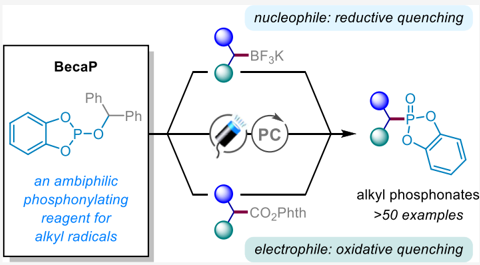
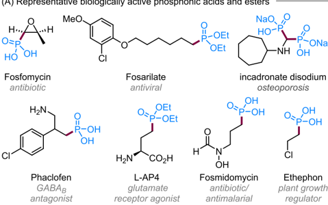
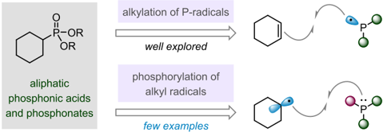
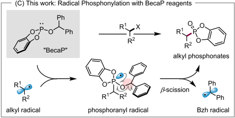
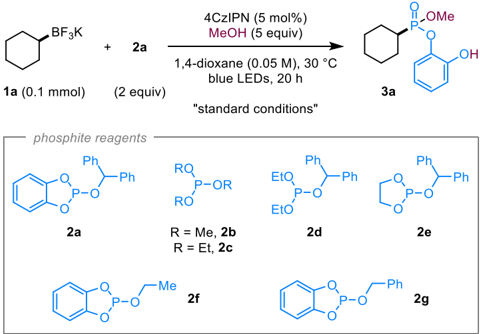
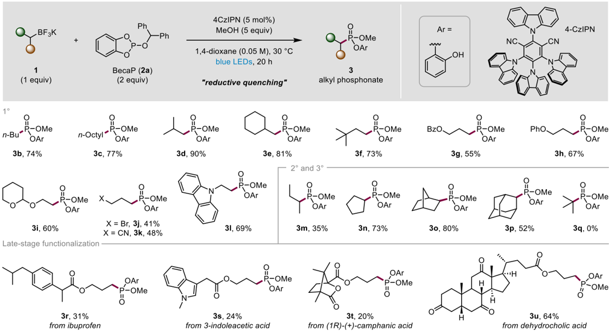
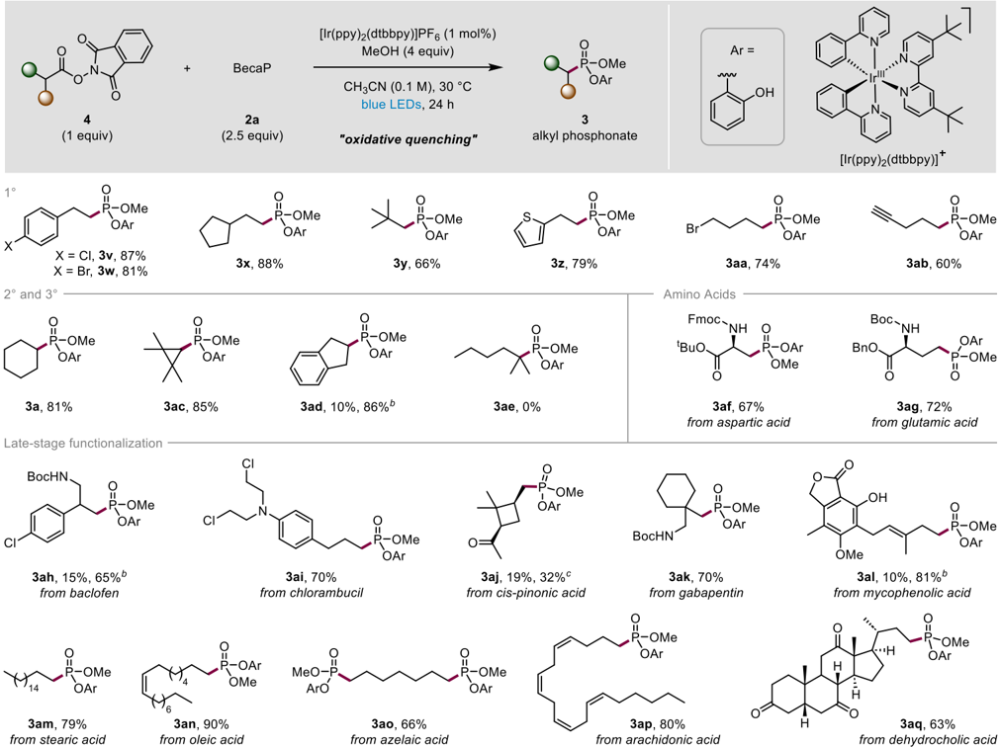
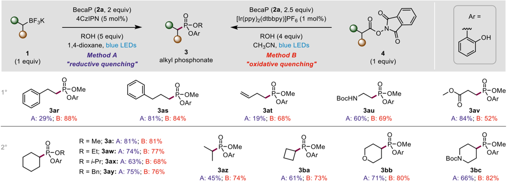
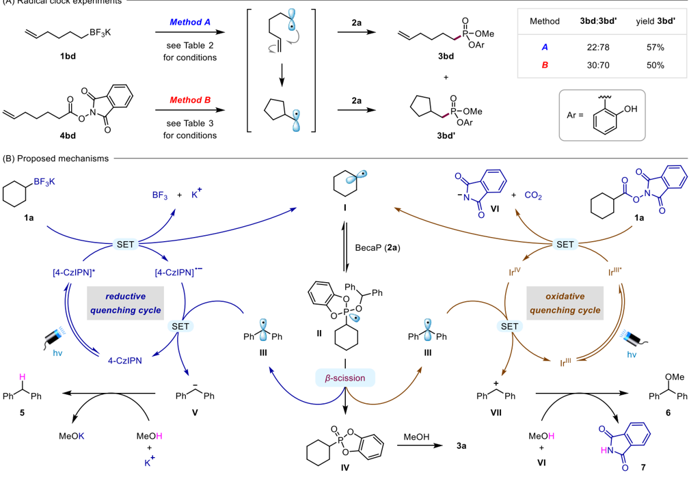
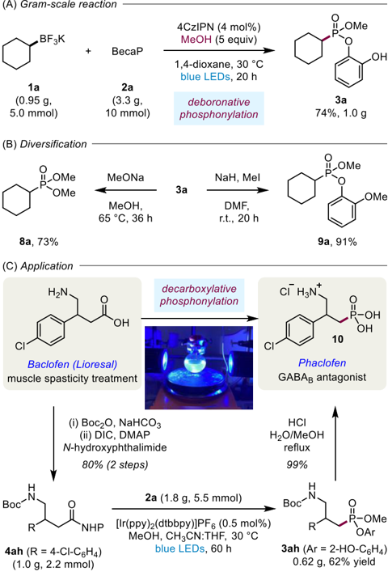

[pubs.acs.org/JACS](pubs.acs.org/JACS?ref=pdf)

## Convergent Deboronative and Decarboxylative Phosphonylation Enabled by the Phosphite Radical Trap 'BecaP'

Santosh K. Pagire, § Chao Shu, § Dominik Reich, Adam Noble, * and Varinder K. Aggarwal *

[Cite This: J. Am. Chem. Soc. 2023, 145, 18649-18657](https://pubs.acs.org/action/showCitFormats?doi=10.1021/jacs.3c06524&ref=pdf)

## ACCESS

[Metrics &amp; More](https://pubs.acs.org/doi/10.1021/jacs.3c06524?goto=articleMetrics&ref=pdf)

[Article Recommendations](https://pubs.acs.org/doi/10.1021/jacs.3c06524?goto=recommendations&?ref=pdf)

ABSTRACT: Carbon -phosphorus bond formation is significant in synthetic chemistry because phosphorus-containing compounds offer numerous indispensable biochemical roles. While there is a plethora of methods to access organophosphorus compounds, phosphonylations of readily accessible alkyl radicals to form aliphatic phosphonates are rare and not commonly used in synthesis. Herein, we introduce a novel phosphorus radical trap 'BecaP' that enables facile and efficient phosphonylation of alkyl radicals under visible light photocatalytic conditions. Importantly, the ambiphilic nature of BecaP allows redox neutral reactions with both nucleophilic (activated by single-electron oxidation) and electrophilic (activated by single-electron reduction) alkyl radical precursors. Thus, a broad scope of feedstock alkyl potassium

[Supporting Information](https://pubs.acs.org/doi/10.1021/jacs.3c06524?goto=supporting-info&ref=pdf)

trifluoroborate salts and redox active carboxylate esters could be employed, with each class of substrate proceeding through a distinct mechanistic pathway. The mild conditions are applicable to the late-stage installation of phosphonate motifs into medicinal agents and natural products, which is showcased by the straightforward conversion of baclofen (muscle relaxant) to phaclofen (GABA B antagonist).

## ■ INTRODUCTION

Organophosphorus compounds have a rich history, with applications spanning organic synthesis, materials science, agrochemistry, and medicinal chemistry. 1 In particular, due to their profound biological activity, phosphonic acids and esters are found in numerous pharmaceuticals and agrochemicals (Scheme 1A). 2,3 Methods to access organophosphonates commonly involve two electron processes, 4 where C -P bond formation is achieved through the reaction of nucleophilic phosphites or H-phosphonates with electrophilic halides 5 or C  X bonds, 6 or reactions of electrophilic phosphorus(V) reagents with organometallics. 7 One electron processes are also known; 8 however, their application to the synthesis of alkyl phosphonates typically involves the reaction of phosphoruscentered radicals with alkenes (Scheme 1B, top). 9,10 In contrast, C -P bond formation by addition of alkyl radicals to phosphorus reagents is rather underdeveloped (Scheme 1B, bottom). 11 While highly reactive aryl radicals add rapidly to trialkyl phosphites, yielding aryl phosphonates after β -scission of the intermediate phosphoranyl radicals, 12 the lower reactivity of alkyl radicals means that they either do not react or undergo unproductive reversible addition. 11a As a result, methods for C -P bond formation from alkyl radicals rely on the use of highly reactive phosphorus reagents, 13 which mainly limits their utility to the synthesis of phosphines, 14 whereas phosphonylations with phosphites to access alkyl

phosphonates are limited to highly reactive alkyl radicals, such as bicyclo[1.1.1]butyl radicals. 15

We reasoned that finding a general solution to alkyl radical phosphonylation could open vast opportunities for radicalmediated synthesis of alkyl phosphonates. In particular, we sought a phosphite reagent that would act as an efficient trap for alkyl radicals under mild conditions and thus allow us to exploit visible light-mediated photoredox catalysis for the generation of alkyl radicals from diverse functional groups. 16 This would enable the transformation of feedstock chemicals, such as boronic acids and carboxylic acids, into their phosphonic acid counterparts  a potentially highly useful process which could be applied to peptides, drugs, and natural products. 17

When considering potential phosphite reagents that could efficiently phosphonylate alkyl radicals, we aimed to address the challenges associated with (1) the low reactivity of alkyl radicals toward common trialkyl phosphites to form phosphoranyl radicals and (2) the unproductive α -scission of

Received:

June 20, 2023

Published:

August 8, 2023

J. Am. Chem. Soc.

2023, 145, 18649

-

Scheme 1. Biologically Relevant Phosphonates and RadicalMediated Approaches to Aliphatic Phosphonates

the resulting phosphoranyl radical outcompeting the desired β -scission pathway. We hypothesized that these challenges could be overcome by designing a phosphite that contained (1) an aromatic diol ligand, which could stabilize the phosphoranyl radical intermediate to facilitate radical addition to phosphorus 18 and (2) an efficient radical leaving group to promote subsequent β -scission. Herein, we report the phosphonylation of a diverse range of alkyl radicals with benzhydryl-catecholphosphite (BecaP), which incorporates a phosphoranyl radicalstabilizing catechol ligand and a benzhydryl (Bzh) radicalleaving group (Scheme 1C). These key structural features enable phosphonylation to occur under mild photocatalytic conditions and in the absence of additional transition-metal catalysts. 19 Notably, the ease of both single-electron oxidation and reduction of the Bzh radical during the photocatalytic cycle allows BecaP to undergo redox neutral reactions with both nucleophilic and electrophilic alkyl radical precursors, thus making it a highly versatile reagent for photoredoxcatalyzed phosphonylations.

## ■ RESULTS AND DISCUSSION

We began our studies by investigating the deboronative phosphonylation of alkyl BF 3 K salts 1 with a range of potential phosphite radical-trapping agents (Table 1). 20 After extensive

Table 1. Optimization of the Deboronative Phosphonylation

|   entry a | Variation from 'standard conditions'          | 3a (%) b   |
|-----------|-----------------------------------------------|------------|
|         1 | no change                                     | 85 (81) c  |
|         2 | 2b - 2f instead of 2a                         | ≤ 1 d      |
|         3 | 2g instead of 2a                              | 18         |
|         4 | no MeOH                                       | 2          |
|         5 | 2 equiv of MeOH                               | 57         |
|         6 | 10 equiv of MeOH                              | 65         |
|         7 | 1.5 equiv of 2a                               | 77         |
|         8 | MeCN as the solvent                           | 73         |
|         9 | Ir[(ppy) 2 (dtbbpy)]PF 6 as the photocatalyst | 75         |
|        10 | in the dark                                   | 0          |
|        11 | no 4CzIPN                                     | 0          |

a Reaction conditions: 1a (0.10 mmol), 2a (0.20 mmol), MeOH, 5 mol % 4CzIPN, solvent (0.05 M, 2.0 mL), 40 W blue Kessil LED lamps ( × 2), N2, r.t., 20 h, then MeOH (0.3 mL), 1 h. b Yields were determined by 1 H NMR analysis using diethyl phthalate as an internal standard. c Yield of the isolated product after column chromatography. d For phosphites 2b -2e , the corresponding products are dimethyl, diethyl, or ethylene glycolato phosphonate esters instead of catecholato phosphonate ester 3a .

optimization, we found that blue light irradiation of a mixture of cyclohexyl potassium trifluoroborate ( 1a ) and BecaP ( 2a ) in the presence of the organic photocatalyst 4CzIPN and MeOH in 1,4-dioxane gave phosphonate 3a in 85% yield (entry 1). It should be noted that a mixture of phosphonate products was obtained due to partial ring-opening of the initially formed cyclic catecholate phosphonate (see IV in Scheme 2) by the reaction with methanol to form 3a ; therefore, an excess of methanol was added after irradiation to give 3a as a single product. We subsequently confirmed the crucial roles of both the catechol ligand and the benzhydryl group on 2a , since phosphites devoid of either were ineffective phosphonylating reagents (entries 2 -3 and Table S1). The optimum reagent, BecaP ( 2a ), is a free flowing crystalline solid, which can easily be accessed on a multigram scale from commercially available precursors in a single step, without chromatographic purification, and can be stored under an inert atmosphere at lower temperature for longer use. In the absence of MeOH, only trace 3a was detected (entry 4), whereas lower yields were obtained when the amount of MeOH was decreased (entry 5 and Table S3; see Table S2 for alternative additives investigated). Increasing the MeOH loading beyond 5 equiv also caused a decrease in the yield (entry 6), which was found to result from a competing reaction with 2a (see Supporting

Table 2. Substrate Scope for the Deboronative Phosphonylation with BecaP a

a Reaction conditions: 1 (0.30 mmol, 1 equiv), 2a (0.60 mmol, 2.0 equiv), MeOH (1.5 mmol, 5 equiv), 4CzIPN (5 mol %), solvent (0.05 M, 6.0 mL), blue LEDs, N2, r.t., 20 h, then MeOH (1 mL), 1 h.

Information, Section S5.3). Lowering the loading of 2a from 2.0 to 1.5 equivalents decreased the yield (entry 7). Alternative solvents and photocatalysts were also investigated, but all were found to be less effective compared to the standard conditions (entries 8 -9 and Tables S4 and S5). Control experiments showed that light and photocatalyst were both essential for the reaction (entries 10 -11).

With optimal conditions in hand, the scope of the deboronative phosphonylation reaction was probed (Table 2). Primary alkyl-BF 3 K salts ( 1b -1l ) were smoothly transformed into the desired alkyl phosphonates ( 3b -3l ). A range of functional groups were tolerated, including esters ( 3g ), acetals ( 3i ), halides ( 3j ), nitriles ( 3k ), and carbazoles ( 3l ). Cyclic secondary alkyl-BF3K salts ( 1n -1p ) were also effectively phosphonylated, delivering the corresponding phosphonates 3n -3p in good yields. However, lower yields were obtained with more hindered acyclic substrates, with sec -butyl phosphonate 3m formed in low yield. Unfortunately, tertiary alkyl-BF 3 K salts ( 1q ) proved unreactive, likely due to the low reactivity of the sterically hindered tertiary alkyl radicals with 2a . Notably, derivatives of drug molecules and natural products, such as ibuprofen ( 3r ), 3-indole acetic acid ( 3s ), camphanic acid ( 3t ), and dehydrocholic acid ( 3u ), could be formed in synthetically useful yields, indicating that the method can be used for late-stage installation of phosphonate groups.

We subsequently investigated the versatility of BecaP by applying it to decarboxylative phosphonylations. 13,17a,21 Since carboxylic acids are readily available feedstock chemicals, and a common source of alkyl radicals in visible light photocatalysis, their use would significantly increase the reach of this chemistry. 22 We recently reported a photoredox-catalyzed decarboxylative phosphonylation of N -hydroxyphthalimide

(NHP) esters derived from α -amino acids. 23 This reaction proceeded through a radical -polar crossover pathway, where C -P bond formation occurred via the reaction of trimethyl phosphite with an intermediate iminium ion, which limited its application to the formation of α -amino phosphonate esters. 21 We reasoned that using BecaP in place of trimethyl phosphite would enable a radical-mediated C -P bond formation and therefore significantly expand the scope of decarboxylative phosphonylations beyond α -amino acids. 19 Gratifyingly, after minor modifications to the reaction conditions (see Tables S6 -S8 for optimization studies), we found that phosphonate 3a could be formed in 81% yield from the corresponding cyclohexyl NHP ester 4a . This result is notable because NHP esters are formal electrophiles, with decarboxylation triggered by single-electron reduction by the excited state photocatalyst (oxidative quenching); 22b whereas trifluoroborate salts are nucleophilic reagents, with deboronation promoted by singleelectron oxidation (reductive quenching). 20 Given that both the deboronative and decarboxylative phosphonylation reactions proceed efficiently in the absence of stoichiometric oxidants or reductants, the BecaP reagent must act as an ambiphilic radical trap, where it is able to function either as a formal electrophile or nucleophile to enable redox neutral photocatalytic reactions with nucleophilic and electrophilic radical precursors, respectively. This makes BecaP a versatile radical trap in photoredox-catalyzed phosphonylations since the success of the reaction is not dependant on the electronics of the alkyl radical precursor.

This decarboxylative phosphonylation of NHP esters 4 was found to be applicable to a broad range of aliphatic carboxylic acids (Table 3). Primary carboxylic acids ( 4v -4ab and 4af -4aq ) bearing distinct functional groups, such as alkenes ( 3an , 3ap ), alkynes ( 3ab ), esters ( 3af , 3ag ), tertiary amines ( 3ai ),

Table 3. Substrate Scope for the Decarboxylative Phosphonylation with BecaP

a Reaction conditions: 4 (0.20 mmol, 1 equiv), 2a (0.50 mmol, 2.5 equiv), MeOH (0.8 mmol, 4 equiv), [Ir(ppy)2dtbbpy]PF6 (1 mol %), solvent (0.1 M, 2.0 mL), blue LEDs, N2, r.t., 24 h, then MeOH (1 mL), 1 h. b MeCN/THF (2:1) as a solvent mixture (0.1 M). c 3.5 equiv of 2a was used.

Table 4. Comparative Substrate Scope for the Deboronative and Decarboxylative Phosphonylation with BecaP a

a See Tables 2 and 3 for reaction conditions for methods A and B, respectively.

halides ( 3v , 3w , 3aa , 3ah , 3ai ), heteroaromatics ( 3z ), carbamates ( 3af -3ah , 3ak ), and ketones ( 3aj , 3aq ), were converted into the corresponding primary phosphonate esters in good to high yields. In addition to cyclohexyl ( 1a ), other cyclic secondary carboxylic acids, including cyclopropyl ( 3ac ) 14c,18a and indanyl ( 3ad ), could be phosphonylated in

## Scheme 2. Mechanistic Studies and Proposed Mechanisms for the Deboronative and Decarboxylative Phosphonylations

high yields. However, tertiary carboxylic acids were unsuccessful ( 3ae ), mirroring the deboronative phosphonylation and observations made by Wang, Zhu and Li in their recently reported photoredox and copper-catalyzed decarboxylative phosphonylation. 19 Pleasingly, derivatives of proteinogenic amino acids bearing carboxylic acid side chains, including Fmoc-protected aspartic acid and Boc-protected glutamic acid, delivered the β -amino and γ -amino phosphonate esters 3af and 3ag , respectively, in good yields. The potential for the application of this methodology in late-stage decarboxylative phosphonylations was also demonstrated by the successful formation of phosphonate derivatives of a range of natural products and medicinally relevant carboxylic acids ( 3ah -3aq ). While the optimized conditions were found to be suitable for the majority of carboxylic acids investigated, for several products ( 3ad , 3ah , and 3al ), dramatically enhanced yields were achieved when a mixed solvent system of MeCN/ tetrahydrofuran (THF) was used due to the low solubility of the NHP esters in MeCN. In addition, increasing the amount of BecaP to 3.5 equiv improved the yield in the phosphonylation of cis -pinonic acid ( 3aj ), which was attributed to competing ring-opening of the cyclobutane by β -scission of the alkyl radical intermediate.

Next, we directly compared the deboronative (method A) and decarboxylative (method B) phosphonylations over a range of substrates (Table 4). We were pleased to find that both methods provided comparable yields, although some exceptions were noted, with the decarboxylative protocol giving significantly higher yields for phenethyl ( 3ar ), butenyl ( 3at ), and isopropyl ( 3az ) products, whereas the deboronative process provides an enhanced yield of methyl carboxylate ester 3av . These results highlight the versatility of BecaP as a radical phosphonylating reagent under photoredox catalysis since it enables phosphonylations of electronically opposing substrates and, as a result, provides the opportunity to maximize product yields through judicious choice of the alkyl radical precursor. Finally, we found that methanol could be replaced with other alcohols under the optimized conditions for both the deboronative and decarboxylative reactions, which gave ethyl ( 3aw ), isopropyl ( 3ax ), and benzyl ( 3ay ) phosphonates in good yields.

Mechanistic studies were conducted to provide evidence for the proposed radical pathway. The phosphonylations of alkyl BF3K salt 1a and NHP ester 4a with BecaP were both inhibited by TEMPO, and the formation for the intermediate cyclohexyl radical was confirmed by the observation of the corresponding TEMPO adduct by mass spectrometry (see Supporting Information, Section S5.2). Radical clock experiments with substrates 1bd and 4bd gave the cyclic phosphonate 3bd ′ selectively over the acyclic product 3bd , which also confirmed the radical nature of the reactions (Scheme 2A). 24 The change in the ratio of 3bd : 3bd ′ between methods A and B reflects the different concentrations of 2a under the two conditions; the lower concentration of 2a under the deboronative conditions (method A, [ 2a ] = 0.1 M) leads to more cyclic product due to a slower rate of phosphonylation of the radical intermediates

compared to the decarboxylative conditions (method B, [ 2a ] = 0.25 M). By using the ratio of cyclized ( 3bd ′ ) and uncyclized ( 3bd ) products (method A = 3.5; method B = 2.3) as an approximation for the relative rates of 5exo -trig cyclization and phosphonylation, and the known rate constant for cyclization of the 5-hexenyl radical (2.7 × 10 5 s -1 at 30 ° C), 25 the rate constant for phosphonylation of primary alkyl radicals can be estimated to be 7.7 × 10 5 M -1 s -1 in 1,4-dioxane and 4.7 × 10 5 M -1 s -1 in MeCN. 26

From the above studies, the following mechanism is proposed for the deboronative phosphonylation reaction (Scheme 2B, left). Reductive quenching of the excited-state photocatalyst ( E 1/2 [4CzIPN * /4CzIPN -· ] = +1.35 V vs SCE) 27 by single-electron transfer (SET) with potassium trifluoroborate 1a ( E p = +1.5 V vs SCE) 28 results in deboronation to generate alkyl radical I and BF3. Addition of I to the phosphorus center of BecaP ( 2a ) gives the transient phosphoranyl radical II , which is stabilized by delocalization of the unpaired electron onto the catecholate ligand. 18b Subsequent rapid β -scission occurs due to the presence of the benzhydryl group, generating the highly stabilized benzhydryl radical III and cyclic catecholate phosphonate IV , which undergoes ring-opening upon reaction with MeOH to form 3a . Turnover of the photocatalyst is enabled by reduction of benzhydryl radical III ( E 1/2 = -1.14 V vs SCE) 29 to anion V by the reduced state of the catalyst ( E 1/2 [4CzIPN/4CzIPN -· ] = -1.21 V vs SCE). 27 Finally, protonation of V by methanol gives diphenylmethane ( 5 ), which was detected by mass spectrometry.

For the decarboxylative phosphonylation, single-electron reduction of NHP ester 4a by the excited state iridium photocatalyst (Ir III * , where Ir III = [Ir(ppy)2(dtbbpy)]PF6) generates the same alkyl radical I , along with CO2 and phthalimide anion VI (Scheme 2B, right). 22a,b Given that this oxidative quenching of the photocatalyst ( E 1/2 [Ir IV /Ir III * ] = -0.96 V vs SCE) 30 by 4a ( E p = -1.23 V vs SCE) 31 is endergonic based on the reduction potentials, we believe that this SET process is facilitated by hydrogen-bonding activation of 4a by MeOH. 32 Following addition of I to 2a and β -scission to form phosphonate IV , turnover of the photocatalyst is possible because the benzhydryl radical III ( E 1/2 = +0.35 V vs SCE) 29 can be oxidized to cation VII by the oxidized state of the catalyst ( E 1/2 [Ir IV /Ir III ] = +1.21 V vs SCE]. 30 Finally, VII is trapped by MeOH to form benzhydryl methyl ether 6 , and proton transfer to VI forms phthalimide ( 7 ). The formation of byproducts 6 and 7 was confirmed by LC -MS and nuclear magnetic resonance (NMR) analyses of the crude reaction mixture (see Supporting Information, Section S5.3).

The above mechanisms highlight the versatility of BecaP as a radical phosphonylating agent, able to undergo productive redox neutral photocatalytic reactions via two mechanistically distinct pathways (reductive and oxidative quenching). This is possible because of the ability of benzhydryl radical III to act as both an oxidant and a reductant to achieve photocatalyst turnover. This makes BecaP an ambiphilic radical trap that reacts with similar efficiency with nucleophilic and electrophilic radical precursors. In addition, the dual role of MeOH as a proton source for anion V and a nucleophilic trap for cation VII means that a single set of reaction conditions could be applicable to photoredox-catalyzed phosphonylations of a broad range of radical precursors.

To highlight the synthetic utility of the new phosphonylation methods, we investigated their scale up and diversification

Scheme 3. Gram-Scale Reactions, Product Diversification, and Application to the Synthesis of Phaclofen

of the products (Scheme 3). The scalability of the deboronative reaction was shown through the phosphonylation of 1a on gram scale in comparable yield to the small-scale reaction (Scheme 3A). As the pendant catechol is retained in the phosphonate product 3 , we investigated diversification of this phosphonate ester. Pleasingly, reaction with sodium methoxide in methanol delivers dimethyl phosphonate 8a in good yield (Scheme 3B). Furthermore, reaction with methyl iodide and base resulted in the formation of the methoxy catechol derivative 9a in excellent yield. We also demonstrated the scalability of the decarboxylative phosphonylation through the transformation of 4ah into 3ah , which was performed with a reduced photocatalyst loading of 0.5 mol % while maintaining similar yields (Scheme 3C). Importantly, product 3ah could be transformed to the biologically active phaclofen 10 in excellent yield by simultaneous Boc-deprotection and hydrolysis of the phosphonate ester. 33 Overall, the decarboxylative phosphonylation method could be employed to convert one biologically active molecule, baclofen, 34 to another bioactive molecule, phaclofen, 35 in 49% yield over four steps.

## ■ CONCLUSIONS

In conclusion, we have developed a novel phosphorus radical trap, BecaP, that allows efficient phosphonylation of alkyl radicals under mild photoredox-catalyzed conditions. The synthetic utility of BecaP was demonstrated through the successful conversion of readily available alkyl potassium

trifluoroborates and NHP esters of alkyl carboxylic acids into the corresponding phosphonate esters. BecaP can be easily accessed on a multigram scale, and the resulting photocatalytic reactions are scalable and provide moderate to excellent yields across a broad spectrum of primary and secondary alkyl substrates. Furthermore, the deboronative and decarboxylative protocols were both found to be suitable for the late-stage modification of complex natural products and drug molecules.

Notably, BecaP could be used for phosphonylations of electronically opposed alkyl radical precursors without additional stoichiometric oxidants or reductants. This was possible because of the ability of the benzhydryl radical leaving group to function as either a single-electron oxidant or reductant to turnover the photocatalytic cycles. Thus, the phosphonylations could proceed through two distinct reaction mechanisms, including a reductive quenching pathway with the nucleophilic trifluoroborates and an oxidative quenching pathway with the electrophilic NHP esters. We anticipate that this ambiphilic reactivity will enable BecaP to be used in a wide range of radical-mediated phosphonylations.

## ■ ASSOCIATED CONTENT

## * sı Supporting Information

The Supporting Information is available free of charge at https://pubs.acs.org/doi/10.1021/jacs.3c06524.

Experimental procedures, characterization data, X-ray crystallography details, and spectra (PDF)

## Accession Codes

CCDC 2216343 contains the supplementary crystallographic data for this paper. These data can be obtained free of charge via www.ccdc.cam.ac.uk/data\_request/cif, or by emailing data\_request@ccdc.cam.ac.uk, or by contacting The Cambridge Crystallographic Data Centre, 12 Union Road, Cambridge CB2 1EZ, UK; fax: +44 1223 336033.

## ■ AUTHOR INFORMATION

## Corresponding Authors

Adam Noble -School of Chemistry, University of Bristol, Bristol BS8 1TS, U.K.; orcid.org/0000-0001-9203-7828; Email: a.noble@bristol.ac.uk

Varinder K. Aggarwal -School of Chemistry, University of Bristol, Bristol BS8 1TS, U.K.; orcid.org/0000-00030344-6430; Email: v.aggarwal@bristol.ac.uk

## Authors

Santosh K. Pagire -School of Chemistry, University of Bristol, Bristol BS8 1TS, U.K.

Chao Shu -School of Chemistry, University of Bristol, Bristol BS8 1TS, U.K.; National Key Laboratory of Green Pesticide, College of Chemistry, Central China Normal University (CCNU), Wuhan, Hubei 430079, China; orcid.org/ 0000-0002-4722-2714

Dominik Reich -School of Chemistry, University of Bristol, Bristol BS8 1TS, U.K.

Complete contact information is available at: https://pubs.acs.org/10.1021/jacs.3c06524

## Author Contributions

§ S.K.P. and C.S. contributed equally to this work.

## Notes

The authors declare no competing financial interest.

## ■ ACKNOWLEDGMENTS

We thank the EPSRC (EP/R004978/1) for support of this work. S.K.P. thanks the Marie Curie Actions (Individual fellowship, project number: 101027513-PhotoPhos) for generous postdoctoral funding. D.R. thanks the Alexander von Humboldt Foundation for a Feodor Lynen Fellowship and the University of Bristol for added support. The authors thank P. Lawrence and N. E. Pridmore (both University of Bristol) for assistance with NMR and X-ray analysis, respectively.

## ■ DEDICATION

This paper is dedicated to Professor Burkhard Ko nig (University of Regensburg, Germany) on the occasion of his 60th birthday.

## ■ REFERENCES

̈

- (1) (a) Kolodiazhnyi, O. I. Phosphorus Compounds of Natural Origin: Prebiotic, Stereochemistry, Application. Symmetry 2021 , 13 , 889. (b) Moonen, K.; Laureyn, I.; Stevens, C. V. Synthetic Methods for Azaheterocyclic Phosphonates and Their Biological Activity. Chem. Rev. 2004 , 104 , 6177 -6216. (c) Papathanasiou, K. E.; Vassaki, M.; Spinthaki, A.; Alatzoglou, F.-E. G.; Tripodianos, E.; Turhanen, P.; Demadis, K. D. Phosphorus Chemistry: From Small Molecules, to Polymers, to Pharmaceutical and Industrial applications. Pure Appl. Chem. 2019 , 91 , 421 -441.
- (2) (a) Rodriguez, J. B.; Gallo-Rodriguez, C. The Role of the Phosphorus Atom in Drug Design. ChemMedChem 2019 , 14 , 190 -216. (b) Yu, H.; Yang, H.; Shi, E.; Tang, W. Development and Clinical Application of Phosphorus-Containing Drugs. Med. Drug Discovery 2020 , 8 , 100063.
- (3) (a) Diana, G. D.; Zalay, E. S.; Salvador, U. J.; Pancic, F.; Steinberg, B. Synthesis of Some Phosphonates with Antiherpetic Activity. J. Med. Chem. 1984 , 27 , 691 -694. (b) Matsumoto, T.; Nagata, N.; Horikoshi, N.; Α dachi, I.; Ohashi, Y.; Ogata, E. Comparative Study of Incadronate and Elcatonin in Patients with Malignancy-Associated Hypercalcaemia. J. Int. Med. Res. 2002 , 30 , 230 -243. (c) Kerr, D. I. B.; Ong, J.; Prager, R. H.; Gynther, B. D.; Curtis, D. R. Phaclofen: A Peripheral and Central Baclofen Antagonist. Brain Res. 1987 , 405 , 150 -154. (d) Evans, R. H.; Francis, A. A.; Jones, A. W.; Smith, D. A. S.; Watkins, J. C. The Effects of a Series Of ω -Phosphonic α -Carboxylic Amino Acids on Electrically Evoked and Excitant Amino Acid-Induced Responses in Isolated Spinal Cord Preparations. Br. J. Pharmacol. 1982 , 75 , 65 -75. (e) Behrendt, C. T.; Kunfermann, A.; Illarionova, V.; Matheeussen, A.; Pein, M. K.; Gräwert, T.; Kaiser, J.; Bacher, A.; Eisenreich, W.; Illarionov, B.; Fischer, M.; Maes, L.; Groll, M.; Kurz, T. Reverse Fosmidomycin Derivatives against the Antimalarial Drug Target IspC (Dxr). J. Med. Chem. 2011 , 54 , 6796 -6802. (f) Zhang, N.; Casida, J. E. Novel Irreversible Butyrylcholinesterase Inhibitors: 2-Chloro-1(substituted-phenyl)ethylphosphonic Acids. Bioorg. Med. Chem. 2002 ,
4. 10 , 1281 -1290.
- (4) (a) Montchamp, J.-L. Phosphinate Chemistry in the 21st Century: A Viable Alternative to the Use of Phosphorus Trichloride in Organophosphorus Synthesis. Acc. Chem. Res. 2014 , 47 , 77 -87. (b) Demmer, C. S.; Krogsgaard-Larsen, N.; Bunch, L. Review on Modern Advances of Chemical Methods for the Introduction of a Phosphonic Acid Group. Chem. Rev. 2011 , 111 , 7981 -8006.
- (5) (a) Kostoudi, S.; Pampalakis, G. Improvements, Variations and Biomedical Applications of the Michaelis -Arbuzov Reaction. Int. J. Mol. Sci. 2022 , 23 , 3395. (b) Oestreich, M.; Tappe, F.; Trepohl, V. Transition-Metal-Catalyzed C -P Cross-Coupling Reactions. Synthesis 2010 , 2010 , 3037 -3062.
- (6) (a) Keglevich, G.; Bálint, E. The Kabachnik -Fields Reaction: Mechanism and Synthetic Use. Molecules 2012 , 17 , 12821 -12835. (b) Zhao, D.; Wang, R. Recent Developments in Metal Catalyzed Asymmetric Addition of Phosphorus Nucleophiles. Chem. Soc. Rev. 2012 , 41 , 2095 -2108. (c) Ali, T. E.; Abdel-Kariem, S. M. Methods

̃

- for the Synthesis of α -Heterocyclic/Heteroarylα -aminophosphonic Acids and their Esters. ARKIVOC 2015 , 2015 , 246 -287. (d) Ordón ez, M.; Viveros-Ceballos, J. L.; Cativiela, C.; Sayago, F. J. An Update on the Stereoselective Synthesis of α -Aminophosphonic Acids and Derivatives. Tetrahedron 2015 , 71 , 1745 -1784.
- (7) Eymery, F.; Iorga, B.; Savignac, P. Synthesis of Phosphonates by Nucleophilic Substitution at Phosphorus: The SNP(V) Reaction. Tetrahedron 1999 , 55 , 13109 -13150.
- (8) (a) Cai, B.-G.; Xuan, J.; Xiao, W.-J. Visible Light-Mediated C -P Bond Formation Reactions. Sci. Bull. 2019 , 64 , 337 -350. (b) Chen, L.; Liu, X.-Y.; Zou, Y.-X. Recent Advances in the Construction of Phosphorus-Substituted Heterocycles, 2009 -2019. Adv. Synth. Catal. 2020 , 362 , 1724 -1818. (c) Li, C. J.; Ung, S. P. M.; Mechrouk, V. A. Shining Light on the Light-Bearing Element: A Brief Review of Photomediated C -H Phosphorylation Reactions. Synthesis 2020 , 53 , 1003 -1022. (d) Liu, J.; Xiao, H.-Z.; Fu, Q.; Yu, D.-G. Advances in Radical Phosphorylation from 2016 to 2021. Chem. Synth. 2021 , 1 , 9.

̂

- (9) (a) Leca, D.; Fensterbank, L.; Laco te, E.; Malacria, M. Recent Advances in the Use of Phosphorus-Centered Radicals in Organic Chemistry. Chem. Soc. Rev. 2005 , 34 , 858 -865. (b) Pan, X.-Q.; Zou, J.-P.; Yi, W.-B.; Zhang, W. Recent Advances in Sulfurand Phosphorous-Centered Radical Reactions for the Formation of S -C and P -C Bonds. Tetrahedron 2015 , 71 , 7481 -7529.
- (10) Alkyl phosphonates can also be accessed via Giese-type radical additions to vinyl phosphonates, see: (a) Junker, H.-D.; Phung, N.; Fessner, W.-D. Diastereoselective Free-radical Synthesis of α -Substituted C-glycosyl Phosphonates, and their use as Building Blocks in the HWE-reaction. Tetrahedron Lett. 1999 , 40 , 7063 -7066. (b) Chudasama, V.; Ahern, J. M.; Fitzmaurice, R. J.; Caddick, S. Synthesis of γ -Ketophosphonates via Aerobic Hydroacylation of Vinyl Phosphonates. Tetrahedron Lett. 2011 , 52 , 1067 -1069. (c) Grayson, J. D.; Cresswell, A. J. γ -Amino Phosphonates via the Photocatalytic α -C -H Alkylation of Primary Amines. Tetrahedron 2021 , 81 , 131896.
- (11) (a) Bentrude, W. G. Phosphoranyl Radicals: Their Structure, Formation, and Reactions. Acc. Chem. Res. 1982 , 15 , 117 -125. (b) Rossi-Ashton, J. A.; Clarke, A. K.; Unsworth, W. P.; Taylor, R. J. K. Phosphoranyl Radical Fragmentation Reactions Driven by Photoredox Catalysis. ACS Catal. 2020 , 10 , 7250 -7261.

̈

- (12) (a) Shaikh, R. S.; Du sel, S. J. S.; König, B. Visible-Light PhotoArbuzov Reaction of Aryl Bromides and Trialkyl Phosphites Yielding Aryl Phosphonates. ACS Catal. 2016 , 6 , 8410 -8414. (b) Shaikh, R. S.; Ghosh, I.; König, B. Direct C -H Phosphonylation of ElectronRich Arenes and Heteroarenes by Visible-Light Photoredox Catalysis. Chem.  Eur. J. 2017 , 23 , 12120 -12124. (c) Jian, Y.; Chen, M.; Huang, B.; Jia, W.; Yang, C.; Xia, W. Visible-Light-Induced C(sp 2 ) -P Bond Formation by Denitrogenative Coupling of Benzotriazoles with Phosphites. Org. Lett. 2018 , 20 , 5370 -5374. (d) Zeng, H.; Dou, Q.; Li, C.-J. Photoinduced Transition-Metal-Free Cross-Coupling of Aryl Halides with H-Phosphonates. Org. Lett. 2019 , 21 , 1301 -1305.
- (13) (a) Barton, D. H. R.; Bridon, D.; Zard, S. Z. Radical Decarboxylative Phosphorylation of Carboxylic Acids. Tetrahedron Lett. 1986 , 27 , 4309 -4312. (b) Barton, D. H. R.; Zhu, J. Elemental White Phosphorus as a Radical Trap: A New and General Route to Phosphonic Acids. J. Am. Chem. Soc. 1993 , 115 , 2071 -2072. (c) Barton, D. H. R.; Vonder Embse, R. A. The Invention of Radical Reactions. Part 39. The Reaction of White Phosphorus with CarbonCentered Radicals. An Improved Procedure for the Synthesis of Phosphonic Acids and Further Mechanistic Insights. Tetrahedron 1998 , 54 , 12475 -12496. (d) Chen, F.; Bai, M.; Zhang, Y.; Liu, W.; Huangfu, X.; Liu, Y.; Tang, G.; Zhao, Y. Decarboxylative Selective Phosphorylation of Aliphatic Acids: A Transition-Metaland Photocatalyst-Free Avenue to Dialkyl and Trialkyl Phosphine Oxides from White Phosphorus. Angew. Chem., Int. Ed. 2022 , 61 , No. e202210334.

̈

- (14) (a) Sato, A.; Yorimitsu, H.; Oshima, K. Radical Phosphination of Organic Halides and Alkyl Imidazole-1-carbothioates. J. Am. Chem. Soc. 2006 , 37 , 4240 -4241. (b) Vaillard, S. E.; Mu ck-Lichtenfeld, C.; Grimme, S.; Studer, A. Homolytic Substitution at Phosphorus for the Synthesis of Alkyl and Aryl Phosphanes. Angew. Chem., Int. Ed. 2007 ,
2. 46 , 6533 -6536. (c) Jin, S.; Haug, G. C.; Nguyen, V. T.; FloresHansen, C.; Arman, H. D.; Larionov, O. V. Decarboxylative Phosphine Synthesis: Insights into the Catalytic, Autocatalytic, and Inhibitory Roles of Additives and Intermediates. ACS Catal. 2019 , 9 , 9764 -9774. (d) Li, C.-K.; Tao, Z.-K.; Shoberu, A.; Zhang, W.; Zou, J.-P. Copper-Catalyzed Cross-Coupling of Alkyl and Phosphorus Radicals for C(sp 3 ) -P Bond Formation. Org. Lett. 2022 , 24 , 6083 -6087. (e) Xie, D.-T.; Chen, H.-L.; Wei, D.; Wei, B.-Y.; Li, Z.-H.; Zhang, J.-W.; Yu, W.; Han, B. Regioselective Fluoroalkylphosphorylation of Unactivated Alkenes by Radical-Mediated Alkoxyphosphine Rearrangement. Angew. Chem. 2022 , 134 , No. e202203398.
- (15) (a) Kaszynski, P.; McMurdie, N. D.; Michl, J. Synthesis of Doubly Bridgehead Substituted Bicyclo[1.1.1]pentanes. Radical Transformations of Bridgehead Halides and Carboxylic Acids. J. Org. Chem. 1991 , 56 , 307 -316. (b) Dockery, K. P.; Bentrude, W. G. Free Radical Chain Reactions of [1.1.1]Propellane with ThreeCoordinate Phosphorus Molecules. Evidence for the High Reactivity of the Bicyclo[1.1.1]pent-1-yl Radical. J. Am. Chem. Soc. 1997 , 119 , 1388 -1399.
- (16) (a) Shaw, M. H.; Twilton, J.; MacMillan, D. W. C. Photoredox Catalysis in Organic Chemistry. J. Org. Chem. 2016 , 81 , 6898 -6926. (b) Marzo, L.; Pagire, S. K.; Reiser, O.; König, B. Visible-Light Photocatalysis: Does It Make a Difference in Organic Synthesis? Angew. Chem., Int. Ed. 2018 , 57 , 10034 -10072. (c) Kanegusuku, A. L. G.; Roizen, J. L. Recent Advances in Photoredox-Mediated Radical Conjugate Addition Reactions: An Expanding Toolkit for the Giese Reaction. Angew. Chem., Int. Ed. 2021 , 60 , 21116 -21149.
- (17) (a) Boto, A.; Gallardo, J. A.; Hernández, R.; Saavedra, C. J. One-pot Synthesis of α -Amino Phosphonates from α -Amino Acids and β -Amino Alcohols. Tetrahedron Lett. 2005 , 46 , 7807 -7811. (b) Luo, K.; Yang, W. C.; Wu, L. Photoredox Catalysis in Organophosphorus Chemistry. Asian J. Org. Chem. 2017 , 6 , 350 -367.
- (18) Aromatic diol ligands (e.g., catechol) have previously been shown to promote alkyl radical additions to boron: (a) Fawcett, A.; Pradeilles, J.; Wang, Y.; Mutsuga, T.; Myers, E. L.; Aggarwal, V. K. Photoinduced Decarboxylative Borylation of Carboxylic Acids. Science 2017 , 357 , 283 -286. (b) Baban, J. A.; Goodchild, N. J.; Roberts, B. P. Electron Spin Resonance Studies of Radicals Derived from 1,3,2Benzodioxaboroles. J. Chem. Soc., Perkin Trans. 2 1986 , 157 -161.
- (19) During the preparation of this manuscript, Wang, Zhu, and Li reported a photoredox-catalyzed decarboxylative radical phosphonylation with trialkylphosphites that requires an additional copper catalyst to promote C -P bond formation: Yin, J.; Lin, X.; Chai, L.; Wang, C.-Y.; Zhu, L.; Li, C. Phosphonylation of Alkyl Radicals. Chem 2023 , 9 , 1945 -1954.
- (20) [Koike, T.; Akita, M. Combination of Organotrifluoroborates with Photoredox Catalysis Marking a New Phase in Organic Radical Chemistry. Org. Biomol. Chem. 2016 , 14 , 6886 -6890.](https://doi.org/10.1039/c6ob00996d)
- (21) (a) Seebach, D.; Charczuk, R.; Gerber, C.; Renaud, P.; Berner, H.; Schneider, H. Elektrochemische Decarboxylierung von L.Threonin- und Oligopeptid-Derivaten unter Bildung von N-Acyl-N, O-acetalen: Herstellung von Oligopeptiden mit Carboxamid-oder Phosphonat-C-Terminus. Helv. Chim. Acta 1989 , 72 , 401 -425. (b) Zecchini, G. P.; Paradisi, M. P.; Torrini, I.; Lucente, G. A Convenient Route to Pyrrolidine-2-phosphonic Acid Dipeptides. Int. J. Pept. Protein Res. 2009 , 34 , 33 -36. (c) Corcoran, R. C.; Green, J. M. Conversion of α -Aminocarboxylic Acids to α -Aminophosphonic Acids. Tetrahedron Lett. 1990 , 31 , 6827 -6830.
- (22) (a) Murarka, S. N-(Acyloxy)phthalimides as Redox-Active Esters in Cross-Coupling Reactions. Adv. Synth. Catal. 2018 , 360 , 1735 -1753. (b) Niu, P.; Li, J.; Zhang, Y.; Huo, C. One-Electron Reduction of Redox-Active Esters to Generate Carbon-Centered Radicals. Eur. J. Org. Chem. 2020 , 2020 , 5801 -5814. (c) Karmakar, S.; Silamkoti, A.; Meanwell, N. A.; Mathur, A.; Gupta, A. K. Utilization of C(sp 3 )-Carboxylic Acids and Their Redox-Active Esters in Decarboxylative Carbon -Carbon Bond Formation. Adv. Synth. Catal. 2021 , 363 , 3693 -3736. (d) Liu, Y. A.; Liao, X.; Chen, H. Recent Progress in Radical Decarboxylative Functionalizations Enabled by Transition-Metal (Ni, Cu, Fe, Co or Cr) Catalysis.

- Synthesis 2021 , 53 , 1 -29. (e) Tibbetts, J. D.; Cresswell, A. J.; Askey, H.; Cao, Q.; Grayson, J.; Hobson, S.; Johnson, G.; Turner-Dore, J. Decarboxylative, Radical C -C Bond Formation with Alkyl or Aryl Carboxylic Acids: Recent Advances. Synthesis 2023 , DOI: 10.1055/a2081-1830.
- (23) Reich, D.; Noble, A.; Aggarwal, V. K. Facile Conversion of α -Amino Acids into α -Amino Phosphonates by Decarboxylative Phosphorylation using Visible-Light Photocatalysis. Angew. Chem. 2022 , 134 , No. e202207063.
- (24) Griller, D.; Ingold, K. U. Free-Radical Clocks. Acc. Chem. Res. 1980 , 13 , 317 -323.
- (25) Chatgilialoglu, C.; Ingold, K. U.; Scaiano, J. C. Rate Constants and Arrhenius Parameters for the Reactions of Primary, Secondary, and Tertiary Alkyl Radicals with Tri-n-butyltin Hydride. J. Am. Chem. Soc. 1981 , 103 , 7739 -7742.
- (26) Fu, Y.; Li, R.-Q.; Liu, L.; Guo, Q.-X. Solvent Effect is Not Significant for the Speed of a Radical Clock. Res. Chem. Int. 2004 , 30 , 279 -286.
- (27) Shang, T.-Y.; Lu, L.-H.; Cao, Z.; Liu, Y.; He, W.-M.; Yu, B. Recent Advances of 1,2,3,5-Tetrakis(carbazol-9-yl)-4,6-dicyanobenzene (4CzIPN) in Photocatalytic Transformations. Chem. Commun. 2019 , 55 , 5408 -5419.
- (28) Yasu, Y.; Koike, T.; Akita, M. Visible Light-Induced Selective Generation of Radicals from Organoborates by Photoredox Catalysis. Adv. Synth. Catal. 2012 , 354 , 3414 -3420.
- (29) Wayner, D. D. M.; Griller, D. Oxidation and Reduction Potentials of Transient Free Radicals. J. Am. Chem. Soc. 1985 , 107 , 7764 -7765.
- (30) Lowry, M. S.; Goldsmith, J. I.; Slinker, J. D.; Rohl, R.; Pascal, R. A., Jr.; Malliaras, G. G.; Bernhard, S. Single-Layer Electroluminescent Devices and Photoinduced Hydrogen Production from an Ionic Iridium(III) Complex. Chem. Mater. 2005 , 17 , 5712 -5719.
- (31) [Niu, K.; Song, L.; Hao, Y.; Liu, Y.; Wang, Q. Electrochemical Decarboxylative C3 Alkylation of Quinoxalin-2(1H)-ones with NHydroxyphthalimide Esters. Chem. Commun. 2020 , 56 , 11673 -11676.](https://doi.org/10.1039/d0cc05391k)
- (32) (a) Tlahuext-Aca, A.; Garza-Sanchez, R. A.; Glorius, F. Multicomponent Oxyalkylation of Styrenes Enabled by HydrogenBond-Assisted Photoinduced Electron Transfer. Angew. Chem., Int. Ed. 2017 , 56 , 3708 -3711. (b) Zhao, Y.; Chen, J.-R.; Xiao, W.-J. VisibleLight Photocatalytic Decarboxylative Alkyl Radical Addition Cascade for Synthesis of Benzazepine Derivatives. Org. Lett. 2018 , 20 , 224 -227.
- (33) Błaszczyk, R.; Gajda, T. Direct Synthesis of Protected Diethyl 1,2-Diaminoalkylphosphonates. Tetrahedron Lett. 2007 , 38 , 5859 -5863.
- (34) Romito, J. W.; Turner, E. R.; Rosener, J. A.; Coldiron, L.; Udipi, A.; Nohrn, L.; Tausiani, J.; Romito, B. T. Baclofen Therapeutics, Toxicity, and Withdrawal: A Narrative Review. SAGE Open Med. 2021 , 9 , 205031212110221.
- (35) (a) Chiefari, J.; Galanopoulos, S.; Janowski, W.; Kerr, D.; Prager, R. The Synthesis of Phosphonobaclofen, an Antagonist of Baclofen. Aust. J. Chem. 1987 , 40 , 1511 -1518. (b) Hall, R. G. An Efficient Synthesis of ( ± )-3-Amino-2-(4-chlorophenyl)-propylphosphonic Acid (PHACLOFEN). Synthesis 1989 , 1989 , 442 -443.