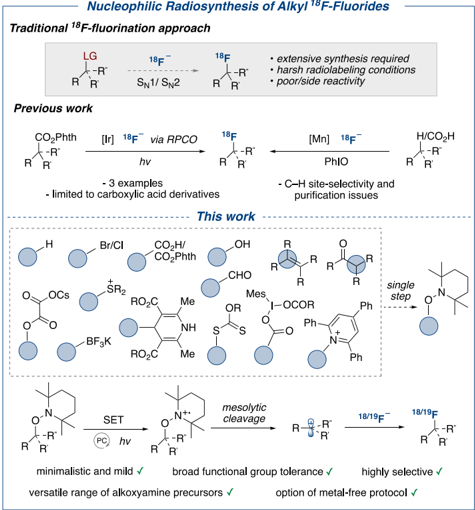
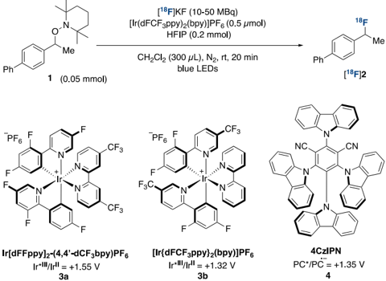
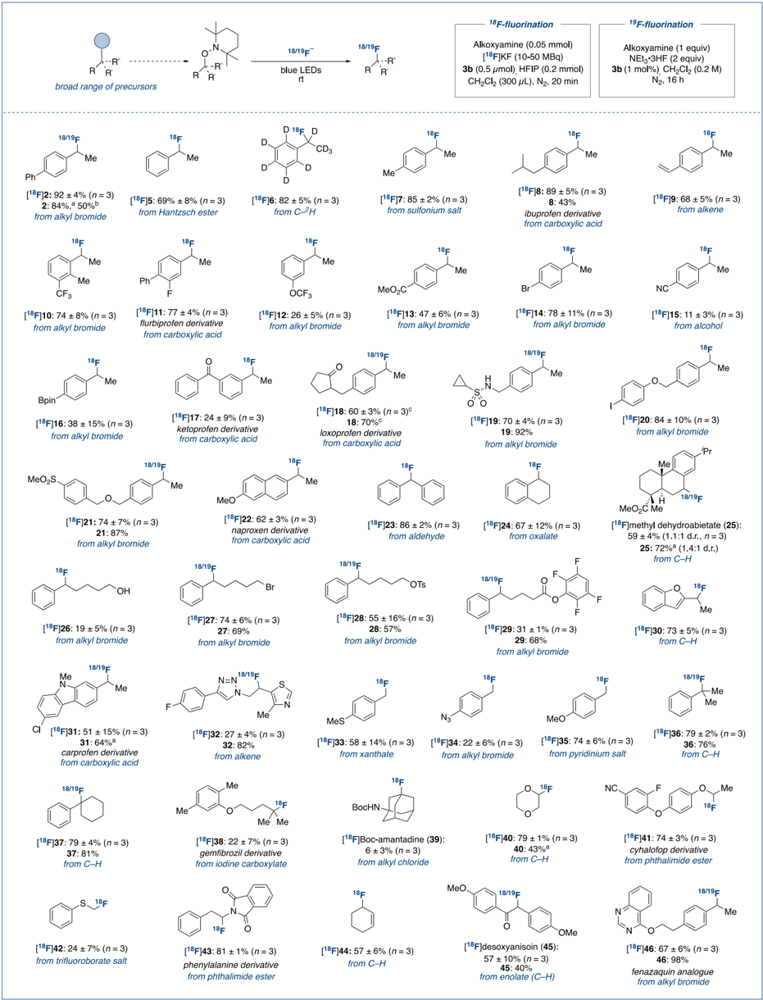
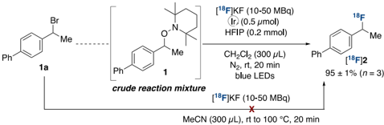
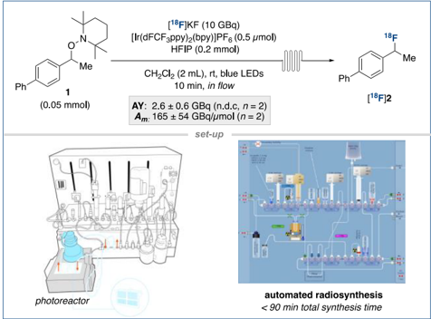

[pubs.acs.org/JACS](pubs.acs.org/JACS?ref=pdf)

Communication

## Photoredox Nucleophilic (Radio)fluorination of Alkoxyamines

Sebastiano Ortalli, Joseph Ford, Andr é s A. Trabanco, Matthew Tredwell, and V é ronique Gouverneur

[Cite This: J. Am. Chem. Soc. 2024, 146, 11599-11604](https://pubs.acs.org/action/showCitFormats?doi=10.1021/jacs.4c02474&ref=pdf)

ACCESS

[Metrics &amp; More](https://pubs.acs.org/doi/10.1021/jacs.4c02474?goto=articleMetrics&ref=pdf)

[Article Recommendations](https://pubs.acs.org/doi/10.1021/jacs.4c02474?goto=recommendations&?ref=pdf)

[Supporting Information](https://pubs.acs.org/doi/10.1021/jacs.4c02474?goto=supporting-info&ref=pdf)

ABSTRACT: Herein, we report a photoredox nucleophilic (radio)fluorination using TEMPO-derived alkoxyamines, a class of substrates accessible in a single step from a diversity of readily available carboxylic acids, halides, alkenes, alcohols, aldehydes, boron reagents, and C -H bonds. This mild and versatile one-electron pathway affords radiolabeled aliphatic fluorides that are typically inaccessible applying conventional nucleophilic substitution technologies due to insufficient reactivity and competitive elimination. Automation of this photoredox process is also demonstrated with a user-friendly and commercially available photoredox flow reactor and radiosynthetic platform, therefore expediting access to labeled aliphatic fluorides in high molar activity ( Am ) for (pre)clinical evaluation.

P ositron emission tomography (PET) stands out among other imaging modalities as this noninvasive and highly sensitive technique allows the interrogation of biological processes in vivo and in real time. 1,2 Moreover, the recent invention of total-body PET offers new opportunities by capturing images of patients' entire bodies and the use of less radioactivity. 3 The decay profile of 18 F is advantageous (97% β + ) and its half-life of 109.7 min well suited to the synthesis of complex radiopharmaceuticals. 4 Transportation to remote imaging centers is also possible enabling multipatient scanning for the acquisition of high-resolution images. 18 F therefore predominates in the clinic, as best exemplified by the leading role of [ 18 F]fluorodeoxyglucose. An additional incentive for the use of 18 F in PET ligands for drug development campaigns stems from the prominence of 19 F in pharmaceuticals. 5 Nevertheless, the bottleneck for PET undeniably remains the development of robust radiosynthetic methodologies, ideally amenable to automation, for the mild and selective incorporation of 18 F into radiotracers. 6

Access to secondary and tertiary 18 F-labeled alkyl fluorides still poses an unmet challenge in 18 F-radiochemistry. Twoelectron pathways with displacement of leaving groups by [ 18 F]fluoride are ineffective as they require extensive synthetic effort to secure complex prefunctionalized precursors, and harsh radiofluorination conditions (&gt;100 ° C). 6a,7 Poor or no reactivity is common alongside the formation of elimination byproducts. Methods exploiting one-electron pathways have been considered to improve this state of play (Figure 1). 8 Doyle and co-workers reported the radiofluorination of Nhydroxyphthalimide esters, 8a a class of substrates accessible from carboxylic acids. This methodology, operating via a radical-polar crossover (RPCO) mechanism, led to three 18 Flabeled products derived from tertiary alkyl or oxocarbenium intermediates. Am reached 37 GBq/ μ mol. An alternative protocol by Groves and co-workers features a manganese complex serving as 18 F-fluorine atom transfer agent with iodosobenzene as the stoichiometric oxidant. 8b -d These conditions were successfully applied to carboxylic acid

Figure 1. Prior art and this work.

substrates. 8b An elegant C -H activation protocol was also investigated but, for selected substrates, this radiochemistry suffers from site-selectivity and purification issues. 8c,d Our goal was to offer radiochemists a novel versatile method to prepare

Received:

February 19, 2024

Revised:

April 19, 2024

Accepted:

April 19, 2024

Published:

April 23, 2024

*

alkyl 18 F-fluorides using a broader range of both starting materials and carbocations. We selected TEMPO-derived alkoxyamines that are amenable to photoredox-induced functionalization with various nucleophiles. 9 Nucleophilic fluorination has however not been investigated. Mechanistically, this chemistry subtly differs from RPCO carbocation generation from e.g . Nhydroxyphthalimide esters since the mesolytic cleavage of alkoxyamines bypasses the formation of reactive C-centered radicals. 8a,9 Synthetically, the TEMPO group also stands out as it is easily installed in a single step from a remarkable range of substrate classes, 10 including carboxylic acids, 10a halides, 10b alkenes, 10c alcohols, 10d aldehydes, 10e boron reagents, 10f thiols, 10g and C -H bonds. 10h We noted that the fluorination of a TEMPO-substituted substrate was reported using Selectfluor serving both as oxidant and fluorinating agent. 11 This reaction was not retained for labeling because the synthesis of [ 18 F]Selectfluor requires [ 18 F]F2, a reagent not available in most radiochemistry facilities and leading to radiolabeled products in low Am . 6d,7b Our aim was therefore to develop a protocol using a fluoride source for extension to radiochemistry. Herein, we report such a protocol with the first redox-neutral, light-mediated nucleophilic fluorination of alkoxyamines, and demonstrate suitability for 18 F-labeling and applications in PET imaging.

̷

We began our investigations with secondary benzylic alkoxyamine 1 (Table 1), a model substrate prone to elimination. Preliminary investigation demonstrated that the fluorination of 1 was successful in the presence of NEt3 · 3HF and photocatalyst 3a (Table 1, entry 1). This chemistry was not deemed ideal for 18 F-labeling due to possible loss of activity in the form of gaseous [ 18 F]HF (bp 19.5 ° C) and the requirement for cumbersome setups incompatible with common automated platforms. 12 Further investigation therefore focused on KF and CsF as the fluoride source (Table 1, entries 2 and 3), well aware that these reagents are also Bro nsted bases that may induce competing elimination. Upon extensive screening of reaction conditions, hexafluoroisopropanol (HFIP) was found crucial for reactivity by serving both as proton source and solubilizing agent. 13,14 Benzylic fluoride 2 was formed in 20% and 59% yield with KF and CsF respectively, alongside alkene resulting from elimination and HFIP-trapped ether byproduct. 14 This result served as entry point to radiochemistry (Table 1, entries 4 -12).

For radiofluorination, the reaction volume was decreased and the stoichiometry of HFIP relative to 1 was reduced to 4 equiv with no detrimental effect. Photocatalyst 3b was preferred over 3a as it was equally effective and is a milder oxidant. The radiofluorination of 1 proceeded in 92% radiochemical yield (RCY) using [ 18 F]KF/K222 with 3b when the reaction mixture was irradiated with visible light in dichloromethane solvent at room temperature over 20 min (Table 1, entry 4). Reactivity was abolished in the absence of 3b (Table 1, entry 5) or irradiation (Table 1, entry 6). While the reaction still proceeds without HFIP, this modification was detrimental (Table 1, entry 7). Alternative solvents such as THF were less effective (Table 1, entry 8). 14 The radiofluorination was successful with organocatalyst 4CzIPN ( 4 ) in place of iridium-based 3b (Table 1, entry 9), giving the option of a metal-free protocol. Photocatalyst 3b was however selected for further studies as its ionic nature facilitates purification (e.g., cartridge filtration) of radiolabeled products. The reaction gave [ 18 F] 2 in 71% RCY after just 2 min of irradiation (Table 1, entry 10), tolerated lower substrate

## Table 1. Reaction Optimization *

|   Entry | Deviation from Standard Conditions                                              | Yield a (%)   | RCY (%)     |
|---------|---------------------------------------------------------------------------------|---------------|-------------|
|       1 | with NEt 3 · 3HF (2 equiv), 3a (1 mol%) in CH 2 Cl 2 (0.2 M) for 16 h           | 84%           |             |
|       2 | with KF (2 equiv), HFIP (10 equiv), 3a (1 mol%) in CH 2 Cl 2 (0.05 M) for 16 h  | 20%           |             |
|       3 | with CsF (2 equiv), HFIP (10 equiv), 3a (1 mol%) in CH 2 Cl 2 (0.05 M) for 16 h | 59%           |             |
|       4 | none                                                                            |               | 92 ± 4 n =3 |
|       5 | no photocatalyst                                                                |               | 0 n =1      |
|       6 | no irradiation                                                                  |               | 0 n =1      |
|       7 | no HFIP                                                                         |               | 11 n =1     |
|       8 | in THF                                                                          |               | 51 n =1     |
|       9 | with 4CzIPN                                                                     |               | 90 n =1     |
|      10 | 2 min reaction time                                                             |               | 71 n =1     |
|      11 | 0.005 mmol substrate loading                                                    |               | 66 n =1     |
|      12 | no N 2 degassing                                                                |               | 82 n =1     |

* [ 18 F]KF was prepared with a K2CO3 (0.011 mmol)/K222 (0.020 mmol) elution protocol. RCY: radiochemical yield determined by radioHPLC. Redox potentials given versus SCE. 15 a Determined by quantitative 19 F NMR.

loading (Table 1, entry 11), and proceeded without N2 degassing (Table 1, entry 12). With the optimized conditions in hand, a robustness screen was carried out to evaluate the compatibility of the protocol with functionalities commonly encountered in medicinal chemistry. 14,16 The results of this study boded well for broad functional group tolerance, 14 and encouraged further investigation on the scope of this reaction (Scheme 1).

Conveniently, all TEMPO substrates were accessed in one step from a multitude of precursors such as halide, carboxylic acid, alkene, phthalimide ester, alcohol, aldehyde, oxalate, xanthate ester, hypervalent iodine compound, trifluoroborate salt, Hantzsch ester, ketone, amine-derived pyridinium salt, sulfonium salt, or C -H bonds. 14 Numerous functional groups were tolerated including ether (e.g., [ 18 F] 20 ), ester (e.g., [ 18 F] 13 ), ketone (e.g., [ 18 F] 17 ), nitrile (e.g., [ 18 F] 15 ), carbamate ([ 18 F] 39 ), sulfonamide ([ 18 F] 19 ) and sulfone ([ 18 F] 21 ). A range of secondary benzylic fluorides ([ 18 F] 2 , [ 18 F] 5 -32 , [ 18 F] 45 , [ 18 F] 46 ) were accessed with RCYs ranging from 11% to 92%. Notably, molecules containing hydridic benzylic (e.g., [ 18 F] 8 ) as well as tertiary aliphatic C -H bonds, including biologically active methyl dehydroabietate 17 ([ 18 F] 25 ) and Boc-protected amantadine ([ 18 F] 39 ), exclusively afforded the desired products with no issues of site-selectivity. This

## Scheme 1. Substrate Scope *

photoreactor set-up

radiofluorination protocol displayed tolerance toward functional groups prone to oxidation ([ 18 F] 26 , [ 18 F] 33 ) and several handles for cross-couplings including aryl chloride ([ 18 F] 31 ), bromide ([ 18 F] 14 ), iodide ([ 18 F] 20 ), as well as an azide ([ 18 F] 34 ) and pinacol boronic ester group ([ 18 F] 16 ). A styrene derivative, known to act as a radical trap under analogous one-electron transformations, 18 afforded the desired product ([ 18 F] 9 ) in excellent RCY. This example illustrates how the mechanistic diversion offered by the mesolytic cleavage of alkoxyamines relative to RPCO serves us well in terms of functional group compatibility. A valuable tetrafluorophenyl (TFP) active ester, routinely employed in radiochemistry for conjugation, 19 was also competent providing [ 18 F] 29 in 31% RCY. No competitive displacement by [ 18 F]fluoride was observed for substrates incorporating electrophilic groups such as a primary alkyl bromide ([ 18 F] 27 ) and tosylate ([ 18 F] 28 ). 14 Such versatility demonstrates the orthogonality of this transformation with respect to traditional two-electron pathways that operate under forceful reaction conditions. Medicinally relevant heterocycles such as benzofuran ([ 18 F] 30 ), carprofen-derived carbazole [ 18 F] 31 , thiazole and triazole ([ 18 F] 32 ), quinazoline ([ 18 F] 46 ), and dioxane ([ 18 F] 40 ) were tolerated. Primary benzylic fluorides were also within reach ([ 18 F] 33 -35 ), as well as challenging tertiary alkyl fluorides ([ 18 F] 36 -39 ). Radiofluorination at the α -heteroatom position is also feasible, providing access to medicinally relevant α -fluorinated ethers and thioethers, 20 as exemplified with dioxane-derived [ 18 F] 40 , cyhalofop derivative [ 18 F] 41 , and α -fluoro thioether [ 18 F] 42 . In addition, 18 F was successfully introduced at the α -amino position of a phenylalanine derivative in excellent RCY ([ 18 F] 43 ). Radiolabeling of an allylic substrate was efficient ([ 18 F] 44 ), as well as an α -fluoro carbonyl compound, providing immunosuppressant [ 18 F]desoxyanisoin ([ 18 F] 45 ) in 57% RCY. 21 Lastly, an analogue of mitochondrial complex 1 (MC-I) inhibitor fenazaquin ([ 18 F] 46 ) could be radiofluorinated in very good yield, offering an orthogonal labeling strategy to that previously reported. 22 In summary, this technology is best applied to precursors leading to sufficiently stabilized carbocationic intermediates. As expected, unactivated primary and secondary aliphatic substrates were unreactive. 14

In line with previous mechanistic scenarios reported for reactions other than fluorination, 9 we propose that upon irradiation with blue light, the excited state of photocatalyst 3b (Ir * III /Ir II = +1.32 V vs SCE) 15b can undergo single-electron transfer (SET) with the alkoxyamine substrate ( E ox ≈ 1.1 V vs SCE). 9 Mesolytic cleavage of the resulting radical cation furnishes a carbocation, which is trapped by fluoride, yielding the desired (radio)fluorinated product. Concurrently, reduction of the TEMPO radical by the photocatalyst, promoted by the presence of HFIP as the proton source, 9 regenerates the photocatalyst ground state. 14

The method is amenable to a one-pot protocol bypassing time-consuming purification of the alkoxyamine precursor (Scheme 2). When aliquots of the crude reaction mixture containing alkyl bromide-derived 1 were submitted to the standard radiofluorination conditions, [ 18 F] 2 was formed with no drop in RCY. 14 Notably, when the radiofluorination of alkyl bromide precursor 1a was attempted under classical twoelectron conditions ([ 18 F]KF/K222 in MeCN), no desired radiolabeled product was observed at temperatures up to 100 ° C. 14

## Scheme 2. One-Pot Radiofluorination *

For (pre)clinical applications, scale-up of the reaction is crucial alongside automation of all necessary steps for radiotracer production on a commercial radiosynthesis platform (Scheme 3). Such development enhances safety, reproducibility, and simplifies the quality control process. Despite the growing interest in photoredox catalysis, 23 translation of these powerful synthetic strategies to radiochemistry has been slow. 24 To the best of our knowledge, a single 18 F-photoradiochemical reaction has been performed on an automated radiosynthesis platform. 25 This process required a bespoke 3D-printed reactor, which limits general adoption by other practitioners. With these challenges in mind, a commercially available photoflow device was selected due to operational simplicity and reliable irradiation of the reaction mixture for maximum reproducibility. 14 This device was combined with a readily available photoreactor equipped with a blue LED light, and a TRASIS AllinOne radiosynthesizer (Scheme 3). With this setup, an automated program enabled the radiosynthesis of [ 18 F] 2 in an activity yield (AY) of 2.6 ± 0.6 GBq (non-decay corrected, n = 2) from 10 GBq starting activity, high molar activity ( Am : 165 ± 54 GBq/ μ mol ( n = 2)), and radiochemical purity (&gt;99%).

In conclusion, we have developed a novel photoredoxmediated fluorination of TEMPO-derived alkoxyamines that was extended to radiolabeling with [ 18 F]KF. The method permits the synthesis of alkyl 18 F-fluorides derived from stabilized carbocations, including biorelevant targets. This

## Scheme 3. Automated Radiofluorination *

* AY (n.d.c.) = activity yield, non-decay corrected; Am = molar activity.

minimalistic technology stands out for its operational simplicity, mildness, compatibility with sensitive functional groups, and orthogonality to conventional two-electron pathways. Scalability and translation to automated radiosynthesis were implemented on a user-friendly and commercial platform furnishing radiolabeled products in good AY, Am , and radiochemical purity. This protocol can be immediately adopted without the need for building bespoke 3D-printed reactors. Combined with the striking versatility of precursors available for the synthesis of TEMPO-derived substrates, we expect broad interest from radiochemists applying PET to interrogate biological process in vivo or to develop diagnostics and pharmaceutical drugs.

## ■ ASSOCIATED CONTENT

## * sı Supporting Information

The Supporting Information is available free of charge at https://pubs.acs.org/doi/10.1021/jacs.4c02474.

Preparation of starting materials, labeling precursors and reference materials; radiofluorination methods; (radio)HPLC traces; NMR spectra (PDF)

## ■ AUTHOR INFORMATION

## Corresponding Author

Véronique Gouverneur -Department of Chemistry, Chemistry Research Laboratory, University of Oxford, Oxford OX1 3TA, United Kingdom; orcid.org/00000001-8638-5308; Email: veronique.gouverneur@ chem.ox.ac.uk

## Authors

Sebastiano Ortalli -Department of Chemistry, Chemistry Research Laboratory, University of Oxford, Oxford OX1 3TA, United Kingdom

- Joseph Ford -Department of Chemistry, Chemistry Research Laboratory, University of Oxford, Oxford OX1 3TA, United Kingdom

Andrés A. Trabanco -Global Discovery Chemistry, Therapeutics Discovery, Johnson &amp; Johnson Innovative Medicine, Janssen-Cilag, S.A., E-45007 Toledo, Spain; orcid.org/0000-0002-4225-758X

Matthew Tredwell -Wales Research and Diagnostic PET Imaging Centre, Cardiff University, Cardiff CF14 4XN, United Kingdom; School of Chemistry, Cardiff University, Cardiff CF10 3AT, United Kingdom; orcid.org/00000002-4184-5611

Complete contact information is available at: https://pubs.acs.org/10.1021/jacs.4c02474

## Notes

The authors declare no competing financial interest.

## ■ ACKNOWLEDGMENTS

J.F. is grateful to the Centre for Doctoral Training in Synthesis for Biology and Medicine for a studentship, generously supported by GlaxoSmithKline, MSD, Syngenta and Vertex. V.G. and S.O. acknowledge financial support from Global Discovery Chemistry, Therapeutics Discovery, Johnson &amp; Johnson Innovative Medicine, Janssen-Cilag S.A., Toledo, Spain.

## ■ REFERENCES

- (1) Ametamey, S. M.; Honer, M.; Schubiger, P. A. Molecular Imaging with PET. Chem. Rev. 2008 , 108 , 1501 -1516.
- (2) (a) Zhang, L.; Villalobos, A. Strategies to facilitate the discovery of novel CNS PET ligands. EJNMMI Radiopharm. Chem. 2017 , 1 , 13. (b) Nerella, S. G.; Singh, P.; Sanam, T.; Digwal, C. S. PET Molecular Imaging in Drug Development: The Imaging and Chemistry Perspective. Front. Med. 2022 , 9 , 812270.
- (3) Katal, S.; Eibschutz, L. S.; Saboury, B.; Gholamrezanezhad, A.; Alavi, A. Advantages and Applications of Total-Body PET Scanning. Diagnostics 2022 , 12 , 426.
- (4) (a) Deng, X.; Rong, J.; Wang, L.; Vasdev, N.; Zhang, L.; Josephson, L.; Liang, S. H. Chemistry for Positron Emission Tomography: Recent Advances in 11 C-, 18 F-, 13 N-, and 15 O-Labeling Reactions. Angew. Chem., Int. Ed. 2019 , 58 , 2580 -2605. (b) Rong, J.; Haider, A.; Jeppesen, T. E.; Josephson, L.; Liang, S. H. Radiochemistry for positron emission tomography. Nat. Commun. 2023 , 14 , 3257.

́

- (5) (a) Purser, S.; Moore, P. R.; Swallow, S.; Gouverneur, V. Fluorine in medicinal chemistry. Chem. Soc. Rev. 2008 , 37 , 320 -330. (b) Gillis, E. P.; Eastman, K. J.; Hill, M. D.; Donnelly, D. J.; Meanwell, N. A. Applications of Fluorine in Medicinal Chemistry. J. Med. Chem. 2015 , 58 , 8315 -8359. (c) Wang, J.; San chez-Roselló, M.; Acen a, J. L.; del Pozo, C.; Sorochinsky, A. E.; Fustero, S.; Soloshonok, V. A.; Liu, H. Fluorine in Pharmaceutical Industry: Fluorine-Containing Drugs Introduced to the Market in the Last Decade (2001 -2011). Chem. Rev. 2014 , 114 , 2432 -2506.

̃

- (6) (a) Ajenjo, J.; Destro, G.; Cornelissen, B.; Gouverneur, V. Closing the gap between 19 F and 18 F chemistry. EJNMMI Radiopharm. Chem. 2021 , 6 , 33. (b) Campbell, M. G.; Mercier, J.; Genicot, C.; Gouverneur, V.; Hooker, J. M.; Ritter, T. Bridging the gaps in 18 F PET tracer development. Nat. Chem. 2017 , 9 , 1 -3. (c) Agdeppa, E. D.; Spilker, M. E. A Review of Imaging Agent Development. AAPS J. 2009 , 11 , 286 -299. (d) Halder, R.; Ritter, T. 18 F-Fluorination: Challenge and Opportunity for Organic Chemists. J. Org. Chem. 2021 , 86 , 13873 -13884. (e) Brooks, A. F.; Topczewski, J. J.; Ichiishi, N.; Sanford, M. S.; Scott, P. J. H. Late-stage [ 18 F]fluorination: new solutions to old problems. Chem. Sci. 2014 , 5 , 4545 -4553. (f) Campbell, M. G.; Ritter, T. Late-Stage Fluorination: From Fundamentals to Application. Org. Process Res. Dev. 2014 , 18 , 474 -480.
- (7) (a) Wang, Y.; Lin, Q.; Shi, H.; Cheng, D. Fluorine-18: Radiochemistry and Target-Specific PET Molecular Probes Design. Front. Chem. 2022 , 10 , 884517. (b) Jacobson, O.; Kiesewetter, D. O.; Chen, X. Fluorine-18 Radiochemistry, Labeling Strategies and Synthetic Routes. Bioconjugate Chem. 2015 , 26 , 1 -18. (c) Furuya, T.; Kamlet, A. S.; Ritter, T. Catalysis for fluorination and trifluoromethylation. Nature 2011 , 473 , 470 -477.
- (8) (a) Webb, E. W.; Park, J. B.; Cole, E. L.; Donnelly, D. J.; Bonacorsi, S. J.; Ewing, W. R.; Doyle, A. G. Nucleophilic (Radio)Fluorination of Redox-Active Esters via Radical-Polar Crossover Enabled by Photoredox Catalysis. J. Am. Chem. Soc. 2020 , 142 , 9493 -9500. (b) Huang, X.; Liu, W.; Hooker, J. M.; Groves, J. T. Targeted Fluorination with the Fluoride Ion by Manganese-Catalyzed Decarboxylation. Angew. Chem., Int. Ed. 2015 , 54 , 5241 -5245. (c) Huang, X.; Liu, W.; Ren, H.; Neelamegam, R.; Hooker, J. M.; Groves, J. T. Late Stage Benzylic C -H Fluorination with [ 18 F]Fluoride for PET Imaging. J. Am. Chem. Soc. 2014 , 136 , 6842 -6845. (d) Liu, W.; Huang, X.; Placzek, M. S.; Krska, S. W.; McQuade, P.; Hooker, J. M.; Groves, J. T. Site-selective 18 F fluorination of unactivated C -H bonds mediated by a manganese porphyrin. Chem. Sci. 2018 , 9 , 1168 -1172.
- (9) Zhu, Q.; Gentry, E. C.; Knowles, R. R. Catalytic Carbocation Generation Enabled by the Mesolytic Cleavage of Alkoxyamine Radical Cations. Angew. Chem., Int. Ed. 2016 , 55 , 9969 -9973.
- (10) For representative examples, see: (a) Schulz, G.; Kirschning, A. Metal free decarboxylative aminoxylation of carboxylic acids using a biphasic solvent system. Org. Biomol. Chem. 2021 , 19 , 273 -278. (b) Braslau, R.; Tsimelzon, A.; Gewandter, J. A Novel Methodology

- for the Synthesis of N -Alkoxyamines. Org. Lett. 2004 , 6 , 2233 -2235. (c) Liang, K.; Liu, Q.; Shen, L.; Li, X.; Wei, D.; Zheng, L.; Xia, C. Intermolecular oxyarylation of olefins with aryl halides and TEMPOH catalyzed by the phenolate anion under visible light. Chem. Sci. 2020 , 11 , 6996 -7002. (d) Li, W.-D.; Wu, Y.; Li, S.-J.; Jiang, Y.-Q.; Li, Y.-L.; Lan, Y.; Xia, J.-B. Boryl Radical Activation of Benzylic C -OH Bond: Cross-Electrophile Coupling of Free Alcohols and CO2 via Photoredox Catalysis. J. Am. Chem. Soc. 2022 , 144 , 8551 -8559. (e) Schoening, K.-U.; Fischer, W.; Hauck, S.; Dichtl, A.; Kuepfert, M. Synthetic Studies on N -Alkoxyamines: A Mild and Broadly Applicable Route Starting from Nitroxide Radicals and Aldehydes. J. Org. Chem. 2009 , 74 , 1567 -1573. (f) Sorin, G.; Martinez Mallorquin, R.; Contie, Y.; Baralle, A.; Malacria, M.; Goddard, J.-P.; Fensterbank, L. Oxidation of Alkyl Trifluoroborates: An Opportunity for Tin-Free Radical Chemistry. Angew. Chem., Int. Ed. 2010 , 49 , 8721 -8723. (g) Griffiths, R. C.; Smith, F. R.; Long, J. E.; Williams, H. E. L.; Layfield, R.; Mitchell, N. J. Site-Selective Modification of Peptides and Proteins via Interception of Free-Radical-Mediated Dechalcogenation. Angew. Chem., Int. Ed. 2020 , 59 , 23659 -23667. (h) Li, L.; Yu, Z.; Shen, Z. Copper-Catalyzed Aminoxylation of Different Types of Hydrocarbons with TEMPO: A Concise Route to N -Alkoxyamine Derivatives. Adv. Synth. Catal. 2015 , 357 , 3495 -3500.

̀

- (11) (a) Kielty, P.; Farra s, P.; Smith, D. A.; Aldabbagh, F. 2(Fluoromethyl)-4,7-dimethoxy-1-methyl1 H -benzimidazole. MolBank 2020 , 2020 , M1129. See also: (b) Lu, Z.; Ju, M.; Wang, Y.; Meinhardt, J. M.; Martinez Alvarado, J. I.; Villemure, E.; Terrett, J. A.; Lin, S. Regioselective aliphatic C -H functionalization using frustrated radical pairs. Nature 2023 , 619 , 514 -520.
- (12) (a) Mathiessen, B.; Jensen, M.; Zhuravlev, F. [ 18 F]Fluoride recovery via gaseous [ 18 F]HF. J. Label Compd. Radiopharm 2011 , 54 , 816 -818. (b) Verhoog, S.; Brooks, A. F.; Winton, W. P.; Viglianti, B. L.; Sanford, M. S.; Scott, P. J. H. Ring opening of epoxides with [ 18 F]FeF species to produce [ 18 F]fluorohydrin PET imaging agents. Chem. Commun. 2019 , 55 , 6361 -6364. (c) Mathiessen, B.; Jensen, A. T. I.; Zhuravlev, F. Homogeneous Nucleophilic Radiofluorination and Fluorination with Phosphazene Hydrofluorides. Chem. Eur. J. 2011 , 17 , 7796 -7805. (d) Cai, L.; Lu, S.; Pike, V. W. Chemistry with [ 18 F]Fluoride Ion. Eur. J. Org. Chem. 2008 , 2008 , 2853 -2873.
- (13) Colomer, I.; Chamberlain, A. E. R.; Haughey, M. B.; Donohoe, T. J. Hexafluoroisopropanol as a highly versatile solvent. Nat. Rev. Chem. 2017 , 1 , 0088.
- (14) [See Supporting Information (SI) for details.](https://pubs.acs.org/doi/suppl/10.1021/jacs.4c02474/suppl_file/ja4c02474_si_001.pdf)

́

- (15) (a) Le, C.; Chen, T. Q.; Liang, T.; Zhang, P.; Macmillan, D. W. C. A radical approach to the copper oxidative addition problem: Trifluoromethylation of bromoarenes. Science 2018 , 360 , 1010 -1014. (b) Zheng, S.; Gutiérrez-Bonet, A .; Molander, G. A. Merging Photoredox PCET with Ni-Catalyzed Cross-Coupling: Cascade Amidoarylation of Unactivated Olefins. Chem. 2019 , 5 , 339 -352. (c) Shang, T.-Y.; Lu, L.-H.; Cao, Z.; Liu, Y.; He, W. M.; Yu, B. Chem. Commun. 2019 , 55 , 5408 -5419.

̌

́

- (16) (a) Collins, K. D.; Glorius, F. A robustness screen for the rapid assessment of chemical reactions. Nat. Chem. 2013 , 5 , 597 -601. (b) Taylor, N. J.; Emer, E.; Preshlock, S.; Schedler, M.; Tredwell, M.; Verhoog, S.; Mercier, J.; Genicot, C.; Gouverneur, V. Derisking the Cu-Mediated 18 F-Fluorination of Heterocyclic Positron Emission Tomography Radioligands. J. Am. Chem. Soc. 2017 , 139 , 8267 -8276. (17) (a) Yoshioka, H.; Mizuno, Y.; Yamaguchi, T.; Ichimaru, Y.; Takeya, K.; Hitotsuyanagi, Y.; Nonogaki, T.; Aoyagi, Y. Methyl dehydroabietate counters high fat diet-induced insulin resistance and hepatic steatosis by modulating peroxisome proliferator-activated receptor signaling in mice. Biomed. Pharmacother. 2018 , 99 , 214 -219. (b) Burc ová, Z.; Kreps, F.; Greifová, M.; Jablonsky , M.; Ház, A.; Schmidt, S .; S urina, I. Antibacterial and antifungal activity of phytosterols and methyl dehydroabietate of Norway spruce bark extracts. J. Biotechnol. 2018 , 282 , 18 -24.

̌

̌

- (18) (a) Arceo, E.; Montroni, E.; Melchiorre, P. Photo-Organocatalysis of Atom-Transfer Radical Additions to Alkenes. Angew. Chem., Int. Ed. 2014 , 53 , 12064 -12068. (b) Murray, P. R. D.; Leibler, I. N.-M.; Hell, S. M.; Villalona, E.; Doyle, A. G.; Knowles, R. R.
2. Radical Redox Annulations: A General Light-Driven Method for the Synthesis of Saturated Heterocycles. ACS Catal. 2022 , 12 , 13732 -13740.
- (19) Schirrmacher, R.; Wängler, B.; Bailey, J.; Bernard-Gauthier, V.; Schirrmacher, E.; Wängler, C. Small Prosthetic Groups in 18 FRadiochemistry: Useful Auxiliaries for the Design of 18 F-PET Tracers. Semin. Nucl. Med. 2017 , 47 , 474 -492.
- (20) Leroux, F.; Jeschke, P.; Schlosser, M. α -Fluorinated Ethers, Thioethers, and Amines: Anomerically Biased Species. Chem. Rev. 2005 , 105 , 827 -856.
- (21) Rhodes, J. R. Immunopotentiatory agents. WO 9407479 A2, 1994.
- (22) Purohit, A.; Benetti, R.; Hayes, M.; Guaraldi, M.; Kagan, M.; Yalamanchilli, P.; Su, F.; Azure, M.; Mistry, M.; Yu, M.; Robinson, S.; Dischino, D. D.; Casebier, D. Quinazoline derivatives as MC-I inhibitors: Evaluation of myocardial uptake using Positron Emission Tomography in rat and non-human primate. Bioorg. Med. Chem. Lett. 2007 , 17 , 4882 -4885.
- (23) [Li, P.; Terrett, J. A.; Zbieg, J. R. Visible-Light Photocatalysis as an Enabling Technology for Drug Discovery: A Paradigm Shift for Chemical Reactivity. ACS Med. Chem. Lett. 2020 , 11 , 2120 -2130.](https://doi.org/10.1021/acsmedchemlett.0c00436?urlappend=%3Fref%3DPDF&jav=VoR&rel=cite-as)
- (24) (a) Lin, D.; Lechermann, L. M.; Huestis, M. P.; Marik, J.; Sap, J. B. I. Light-Driven Radiochemistry with Fluorine-18, Carbon-11 and Zirconium-89. Angew. Chem., Int. Ed. 2024 , 136 , No. e202317136. (b) Bui, T. T.; Kim, H.-K. Recent Advances in Photo-mediated Radiofluorination. Chem. Asian J. 2021 , 16 , 2155 -2167.
- (25) Trump, L.; Lemos, A.; Jacq, J.; Pasau, P.; Lallemand, B.; Mercier, J.; Genicot, C.; Luxen, A.; Lemaire, C. Development of a General Automated Flow Photoredox 18 F-Difluoromethylation of N -Heteroaromatics in an AllinOne Synthesizer. Org. Process Res. Dev. 2020 , 24 , 734 -744.