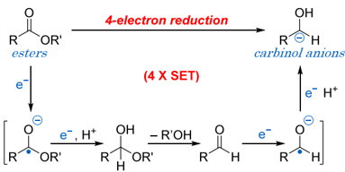
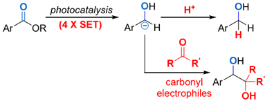
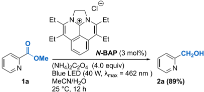
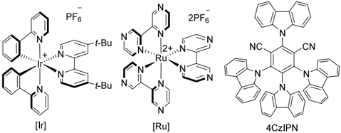
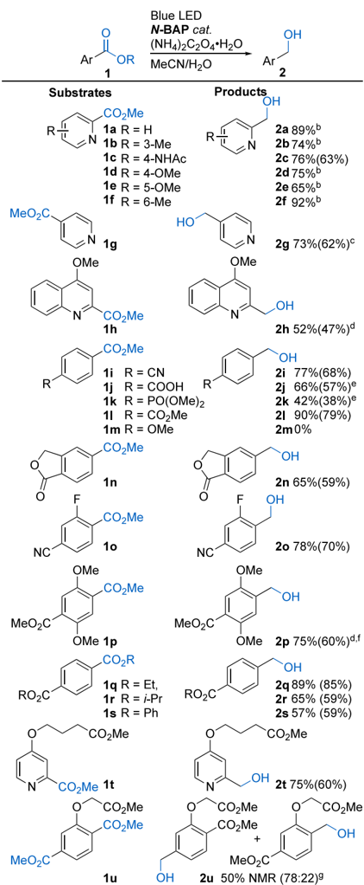
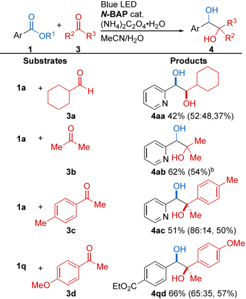
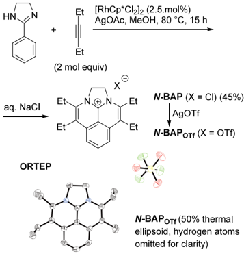
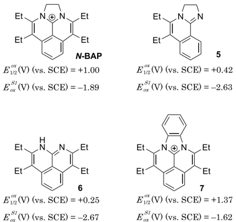
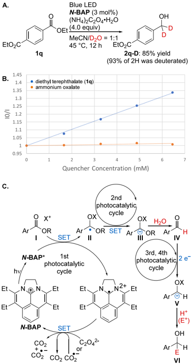

[pubs.acs.org/JACS](pubs.acs.org/JACS?ref=pdf)

Communication

## Multielectron Reduction of Esters by a Diazabenzacenaphthenium Photoredox Catalyst

Shintaro Okumura, * Shusuke Hattori, Lisa Fang, and Yasuhiro Uozumi *

[Cite This: J. Am. Chem. Soc. 2024, 146, 16990-16995](https://pubs.acs.org/action/showCitFormats?doi=10.1021/jacs.4c05272&ref=pdf)

## ACCESS

Metrics &amp; More

Article Recommendations

*

sı

Supporting Information

ABSTRACT: A novel diazabenzacenaphthenium photocatalyst, NBAP , with high photoredox abilities and visible-light absorption was designed and prepared in one step. Under visible-light irradiation, NBAP promoted the four-electron reduction of esters in the presence of ammonium oxalate as a 'traceless reductant' to generate carbinol anion intermediates that underwent protonation with water to give the corresponding alcohols. The resulting carbinol anions also exhibited nucleophilic reactivity under the photocatalytic conditions to undergo a 1,2-addition to a second carbonyl compound, affording unsymmetric 1,2-diols.

D uring the past decade, photoredox catalysis has emerged as a rapidly growing field in chemistry. 1 Within this field, a wide variety of radical-based organic molecular transformations involving a photocatalytic single-electron-transfer (SET) process have been developed. 1 Compared with photoinduced radical reactions, the development of photocatalytic molecular transformations via ionic (anion/cation) species generated through a multielectron-transfer process has received scant attention. 2 We recently achieved the generation of α -hydroxy carbanion (carbinol anion) species from aldehydes and ketones through a successive double SET, thereby realizing an umpoled electrophilic substitution of the carbonyl group. 3,4 However, the photocatalytic reduction of esters to form carbinol anions is a formidable challenge because it requires an unprecedented successive quadruple SET process; as a result, this reaction remains undeveloped. 5 Here, we report the first photocatalytic four-electron reduction of esters by using a novel diazabenzacenaphthenium photocatalyst in which the resulting carbinol anions react with water and a second carbonyl compound, thereby providing a protonative reduction (Scheme 1A) and a cross-pinacol coupling (Scheme 1B).

We began our preliminary study of the photocatalytic ester reduction by using methyl picolinate ( 1a ) as a model substrate. The reactions of 1a were carried out in aqueous acetonitrile under light irradiation in the presence of various photocatalysts and reductants to give pyridin-2-ylmethanol ( 2a ) through protonation of the resulting carbinol anion (Scheme 2). The results, summarized in Table 1, revealed that the ester reduction proceeded efficiently with 4,5,9,10-tetraethyl-1,2dihydrobenz[ de ]imidazo[1,2,3ij ]-1,8-naphthyridinium chloride ( NBAP ) as a photocatalyst and ammonium oxalate as a reductant. Thus, when 1a was treated with NBAP (3 mol %) under blue-light irradiation (40 W, λ max = 462 nm) in the presence of ammonium oxalate monohydrate (4.0 equiv) in 1:1 MeCN -H2O at 25 ° C for 12 h, we were pleased to find that 2-pyridinemethanol ( 2a ) was successfully obtained in 89% yield (Scheme 2; Table 1, entry 1). Ir(ppy)2(dtbbpy)PF6, Ru(bpz)3(PF6)2, and 4CzIPN, 6 which are commonly em-

## Scheme 1. Multielectron Reduction of Esters

Scheme 2. Photocatalytic Reduction of Methyl Picolinate (1a)

Received:

April 22, 2024

Revised:

May 31, 2024

Accepted:

May 31, 2024

Published:

June 13, 2024

|    |
|----|

Table 1. Reduction of Methyl Picolinate (1a) a

| entry   | photocatalyst   | electron source           | yield b (%) of 2a   |
|---------|-----------------|---------------------------|---------------------|
| 1       | N- BAP          | (NH 4 ) 2 C 2 O 4 · H 2 O | 89                  |
| 2       | [Ir]            | (NH 4 ) 2 C 2 O 4 · H 2 O | 2                   |
| 3       | [Ru]            | (NH 4 ) 2 C 2 O 4 · H 2 O | 0                   |
| 4       | 4CzIPN          | (NH 4 ) 2 C 2 O 4 · H 2 O | 0                   |
| 5       | N- BAP          | i -Pr 2 NEt               | 3                   |
| 6       | N- BAP          | N(CH 2 CH 2 OH) 3         | <2                  |
| 7       | N- BAP          | (none)                    | 0                   |
| 8 c     | N- BAP          | (NH 4 ) 2 C 2 O 4 · H 2 O | 0                   |
| 9       | (none)          | (NH 4 ) 2 C 2 O 4 · H 2 O | 0                   |

a

Reaction conditions: 1a (0.2 mmol), photocatalyst (0.006 mmol, 3 mol %), electron source (0.8 mmol, 4.0 equiv), 1:1 MeCN -H2O (3.2 mL), 12 h, 25 ° C, blue LED irradiation (40 W, λ max = 462 nm). b GC yield. c Without light.

ployed in SET reactions under photocatalytic conditions, gave 2a in &lt;2% yield under otherwise similar conditions (entries 2 -4). 7 When the reaction of 1a with NBAP was performed using N , N -diisopropylethylamine ( i -Pr2NEt) or triethanolamine [N(CH2CH2OH)3] instead of ammonium oxalate, 1a was completely consumed, and 2-pyridinemethanol ( 2a ) was formed, but in &lt;3% yield (entries 5 and 6). 8 Tertiary amine reductants such as i -Pr2NEt or N(CH2CH2OH)3 are known to be oxidized to iminium cations in the reduction step of the photocatalysis. 1,9 Consequently, the low yield of 2a would be due to interruption of the four-electron-transfer process by the oxidized byproducts from the amines. In contrast, oxalate is known to serve as a 'traceless reductant'. One-electron oxidation of oxalate affords CO2 and a CO2 radical anion, which is subsequently also converted into CO2 by a second one-electron oxidation. 9,10 As a result, oxalate gives CO 2 as the sole byproduct through oxidation, suggesting that it should not interfere with the multielectron-reduction process. Control experiments revealed that NBAP , oxalate, and light were all essential for the multielectron reduction of the ester (entries 7 -9).

Having identified the combination of NBAP and oxalates as a suitable catalytic system, we examined the reduction of a wide range of esters (Scheme 3). Various methyl picolinates ( 1b -f ) bearing methyl ( 1b , 1f ), methoxy ( 1d , 1e ), or electrophilic amide groups ( 1c ) at the 4-, 5-, or 6-position, or even the sterically hindered 3-position, underwent photocatalytic reduction to give the corresponding alcohols 2b -f in yields of 65 -92%. The reduction of methyl isonicotinate ( 1g ) and methyl quinaldate ( 1h ) proceeded in yields of 73% and 52%, respectively. NBAP also catalyzed the reduction of the benzoate derivatives. In the reduction of methyl benzoates

## Scheme 3. Multielectron Reduction of Esters a

a Reaction conditions: ester 1 (0.2 mmol), NBAP (2 -5 mol %), (NH4)2C2O4 (2.2 -4.0 equiv), 1:1 MeCN -H2O (3.2 mL), 3 -36 h, 25 -45 ° C, blue LED irradiation ( λ max = 462 nm). NMR yields are reported (isolated yields are given in parentheses). b GC yield. c 1:1 MeOH -0.13 M phosphate buffer (pH 6) instead of MeCN -H2O. d MeOH -H2O instead of MeCN -H2O. e NBAP (20 mol %), f NBAP (8 mol %). g On a 0.13 mmol scale.

bearing electrophilic cyano ( 1i ), carboxy ( 1j ), or phosphonate ( 1k ) groups, the ester groups were selectively reduced to afford alcohols 2i -k in up to 77% yield. When dimethyl terephthalate was subjected to the reaction, one of the two ester groups was reduced to give 2l in a 90% yield. Electron-rich methyl 4methoxybenzoate ( 1m ) bearing a very negative reduction potential exhibited little reactivity under similar conditions. 5-

(Methoxycarbonyl)phthalide ( 1n ) underwent reduction of the methoxycarbonyl group rather than the lactone moiety, giving alcohol 2n in 65% yield. Fluoro ( 1o ) and methoxy groups ( 1p ) on the benzene ring were also well tolerated, and alcohols 2o and 2p were obtained in yields of 78% and 75%, respectively. In addition to methyl esters, O -alkyl and O -aryl esters are also eligible substrates. Diethyl, dipropyl, and diphenyl terephthalates afforded the corresponding 4-(hydroxymethyl)benzoates 2q -s in yields of 57 -89%. When the reductions of a methyl picolinate ( 1t ) and a dimethyl terephthalate ( 1u ) bearing an alkyl ester group were performed, NBAP selectively reduced the aromatic ester to afford alcohols 2t and 2u , respectively, in yields of 75% and 50%.

The ester reduction appears to proceed through a fourelectron reduction process, followed by protonation of the resulting carbinol anion. This finding prompted us to examine the reductive cross-pinacol coupling of esters through 1,2addition of the carbinol intermediates onto aldehydes or ketones as electrophiles (Scheme 4). When we treated a

Scheme 4. 1,2-Addition of Esters to Aldehydes or Ketones a

a Reaction conditions: ester 1 (0.2 mmol), aldehyde/ketone 3 (3.0 -5.0 equiv), NBAP (5 -6 mol %), (NH4)2C2O4 (0.8 mmol, 4.0 equiv), 1:1 MeCN -H2O (3.2 mL), 24 -36 h, 25 -45 ° C, blue LED irradiation ( λ max = 462 nm). NMR yields are reported (the syn / anti ratio and the isolated yield are given in parentheses). b 3b -H2O (2:1) instead of MeCN -H2O.

mixture of methyl picolinate ( 1a ) and cyclohexanecarboxaldehyde ( 3a ) with the NBAP catalyst in the presence of ammonium oxalate under blue-light irradiation in MeCN -H2O, we were thrilled to find that unsymmetric 1,2-diol 4aa was successfully obtained in 42% yield. Ester 1a also reacted with an aliphatic ketone ( 3b ) to afford 1,2-diol 4ab in 62% yield. Electron -rich aromatic ketones 3c and 3d were also eligible electrophiles, reacting with methyl picolinate ( 1a ) or diethyl terephthalate ( 1q ) in yields of 51% and 66%, respectively.

To obtain mechanistic insights into the photocatalytic ester reduction with NBAP , we investigated the structural, photophysical, and electrochemical properties of NBAP (Scheme 5 and Figure 1). NBAP was designed and identified

## Scheme 5. Preparation of NBAP

on the basis of an extensive in silico screening (see Figure 2 and Supporting Information, Table S3), with a view to its use as a photocatalyst under visible-light irradiation in photoinduced multielectron-transfer reactions. The photocatalyst was prepared by a rhodium-catalyzed oxidative annulation of 2-phenyl4,5-dihydro-1 H -imidazole with hex-3-yne in one step (Scheme 5). 11 Single-crystal X-ray analysis of NBAPOTf clearly confirmed the presence of a planar π -conjugated diazabenzacenaphthenium structure.

The UV -vis absorption spectrum of NBAP in 1:1 MeCN -H2O solution showed a lowest-energy absorption maximum at 440 nm. The highest-energy fluorescence emission maximum was observed at 452 nm (Figure 1A). The excitation energy for the singlet state ( E 0,0 S1 ), as given by the intersection of the absorption and fluorescence, is 2.79 eV (445 nm). Cyclic voltammetry of NBAP in MeCN solution revealed that its ground-state reduction ( E 1/2 red ) and oxidation potentials ( E 1/2 ox ) are -1.89 V and +1.08 V (vs SCE), respectively (Figure 1B and C). Redox potentials of the singlet excited state ( E ox S1 , E red S1 ) and the triplet excited state ( E ox T1 , E red T1 ) of N -BAP were calculated from the ground-state redox potentials and the excitation energy. 1,12 NBAP exhibited high reducing and oxidizing abilities in its ground and singlet excited states. Considering the reduction potential of aromatic esters (&lt; -1.72 V vs SCE), 13 we surmise that the ground and excited singlet states of NBAP play key roles in the ester reduction, rather than its triplet state. 14

We calculated the photophysical and electrochemical properties of NBAP -related compounds by applying the density functional theory (DFT) approximation B3LYP 6311++G(d,p) (Supporting Information, Table S3). The selected redox potentials in the ground state and in the excited S1 state ( E 1/2 ox and E ox S1 ) are shown in Figure 2. The values for NBAP agreed well with the experimental results listed in Figure 1C. Tricyclic compounds such as dihydroimidazoisoquinoline 5 and diazaphenalene 6 exhibited much lower oxidizing abilities in both their ground and excited states than did NBAP . The reducing abilities of pentacyclic

B.

Current /mA

int. (normalized)

1.45

1.4

0.000

1.35

1.3

-0.010

1.25

1.2

-0.020

1.15

1.1

1.05

-0.030

-2.3

1

· diethyl terephthalate (1q)

· ammonium oxalate

-2.1

0.95

360

[Potential /V (vs. SCE)](https://pubs.acs.org/doi/10.1021/jacs.4c05272?fig=fig1&ref=pdf)

(900 or 2n was deuterated)

0.035

- absorption

0.025

[0.005](https://pubs.acs.org/doi/10.1021/jacs.4c05272?fig=fig1&ref=pdf)

[-0.005](https://pubs.acs.org/doi/10.1021/jacs.4c05272?fig=fig1&ref=pdf)

Figure 1. (A) Absorption and emission spectra. (B) Cyclic voltammetry of NBAP . (C) Electrochemical properties of NBAP .

Figure 2. Calculated redox properties of NBAP -related structures

diazabenzocyclopentalphenalenium 7 11 were also found to be lower than those of NBAP .

Deuteration experiments and fluorescence-quenching experiments were next performed. When the reduction of diethyl terephthalate ( 1q ) was carried out in MeCN -D2O, the deuterated benzyl alcohol 2q-D was obtained in 85% yield with 93% of the two benzylic H atoms replaced by deuterium (Figure 3A). The observation of double deuteration by water,

Figure 3. Mechanistic studies. (A) Deuteration experiment. (B) Fluorescence-quenching experiments. NBAP (20 μ M) and varying amounts of quenchers in 1:1 MeCN -H2O. The ratio of I 0/ I at 452 nm was plotted as a function of the quencher concentration. The Stern -Volmer constant was 51.9 M -1 . (C) Proposed mechanism.

which barely reacts with radical species but reacts readily with anionic species, indicated that the ester reduction proceeded via two types of carbanion intermediate in a stepwise manner through the four-electron reduction of esters. Stern -Volmer fluorescence-quenching experiments showed that excited NBAP was directly quenched by ester 1q but not by ammonium oxalate (Figure 3B). A mechanism consistent with these observations is proposed in Figure 3C. 15 Singlet excited NBAP reduces ester I through SET to give acetal radical II and oxidized NBAP . Oxidized NBAP oxidizes the oxalate anion to afford CO2 and a CO2 radical anion, with regeneration of NBAP . The acetal radical II undergoes a second SET from excited NBAP (or a CO2 radical anion) to form the acetal carbanion III ; this is followed by protonation with water to

give the aldehyde IV . A second two-electron reduction of IV then generates carbinol anion V . The four-electron-reduction process proceeds almost simultaneously to suppress radical side reactions. Lastly, the resulting carbinol anion V reacts with water or a carbonyl electrophile to furnish final product VI .

In conclusion, photocatalytic multielectron reduction of esters has been achieved using a novel diazabenzacenaphthenium photocatalyst, NBAP . NBAP exhibited both high reducing and oxidizing abilities and visible-light absorption. The combination of the NBAP catalyst with oxalate as a traceless reductant permits the rapidly sequential four-electron reduction of esters to generate carbinol anions with subsequent protonation to give alcohols. The nucleophilic reaction of esters, as their carbinol anions, with a second carbonyl compound was also realized under similar photocatalytic conditions, to furnish nonsymmetric 1,2-diols.

## ■ ASSOCIATED CONTENT

## * sı Supporting Information

The Supporting Information is available free of charge at https://pubs.acs.org/doi/10.1021/jacs.4c05272.

Experimental procedures, computational methods, characterization data, and spectroscopic data (PDF)

## Accession Codes

CCDC 2348848 contains the supplementary crystallographic data for this paper. These data can be obtained free of charge via www.ccdc.cam.ac.uk/data\_request/cif, or by emailing data\_request@ccdc.cam.ac.uk, or by contacting The Cambridge Crystallographic Data Centre, 12 Union Road, Cambridge CB2 1EZ, UK; fax: +44 1223 336033.

## ■ AUTHOR INFORMATION

## Corresponding Authors

Shintaro Okumura -Institute for Molecular Science (IMS), Okazaki, Aichi 444-8787, Japan; Department of Functional Molecular Science, SOKENDAI (The Graduate University for Advanced Studies), Okazaki, Aichi 444-8787, Japan; Present Address: Department of Synthetic Chemistry and Biological Chemistry, Kyoto University, Kyoto 615-8510, Japan ; orcid.org/0000-0002-6503-9040; Email: okumura.shintaro.6e@kyoto-u.ac.jp

Yasuhiro Uozumi -Institute for Molecular Science (IMS), Okazaki, Aichi 444-8787, Japan; Department of Functional Molecular Science, SOKENDAI (The Graduate University for Advanced Studies), Okazaki, Aichi 444-8787, Japan; orcid.org/0000-0001-6805-3422; Email: uo@ims.ac.jp

## Authors

Shusuke Hattori -Institute for Molecular Science (IMS), Okazaki, Aichi 444-8787, Japan; Department of Functional Molecular Science, SOKENDAI (The Graduate University for Advanced Studies), Okazaki, Aichi 444-8787, Japan Lisa Fang -Institute for Molecular Science (IMS), Okazaki, Aichi 444-8787, Japan; orcid.org/0009-0005-4798-2157

Complete contact information is available at: https://pubs.acs.org/10.1021/jacs.4c05272

## Author Contributions

The manuscript was written through contributions of all authors.

## Notes

The authors declare no competing financial interest.

## ■ ACKNOWLEDGMENTS

This work was supported by JST, ACT-X Grant Number JPMJAX23D6 and JSPS KAKENHI Grant Number JP24H01873 (Green Catalysis Science), and JP24K17688 (Early-Career Scientists).

## ■ REFERENCES

(1) For selected reviews on photoredox catalysis, see: (a) Prier, C. K.; Rankic, D. A.; MacMillan, D. W. C. Visible Light Photoredox Catalysis with Transition Metal Complexes: Applications in Organic Synthesis. Chem. Rev. 2013 , 113 , 5322 -5363. (b) Romero, N. A.; Nicewicz, D. A. Organic Photoredox Catalysis. Chem. Rev. 2016 , 116 , 10075 -10166. (c) Lee, K. N.; Ngai, M.-Y. Recent Developments in Transition-Metal Photoredox-Catalysed Reactions of Carbonyl Derivatives. Chem. Commun. 2017 , 53 , 13093 -13112. (d) Bell, J. D.; Murphy, J. A. Recent Advances in Visible Light-Activated Radical Coupling Reactions Triggered by (i) Ruthenium, (ii) Iridium and (iii) Organic Photoredox Agents. Chem. Soc. Rev. 2021 , 50 , 9540 -9685. (e) Jeong, D. Y.; You, Y. Organic Photoredox Catalysts Exhibiting Long Excited-State Lifetimes. Synlett 2022 , 33 , 1142 -1153. (f) Noto, N.; Saito, S. Arylamines as More Strongly Reducing Organic Photoredox Catalysts than fac -[Ir(ppy) 3 ]. ACS Catal. 2022 , 12 , 15400 -15415. (g) Kim, D.; Teets, T. S. Strategies for Accessing Photosensitizers with Extreme Redox Potentials. Chem. Phys. Rev. 2022 , 3 , 021302.

- (2) (a) Pitzer, L.; Schwarz, J. L.; Glorius, F. Reductive Radical-Polar Crossover: Traditional Electrophiles in Modern Radical Reactions. Chem. Sci. 2019 , 10 , 8285 -8291. (b) Wiles, R. J.; Molander, G. A. Photoredox-Mediated Net-Neutral Radical/Polar Crossover Reactions. Isr. J. Chem. 2020 , 60 , 281 -293. (c) Sharma, S.; Singh, J.; Sharma, A. Visible Light Assisted Radical-Polar/Polar-Radical Crossover Reactions in Organic Synthesis. Adv. Synth. Catal. 2021 , 363 , 3146 -3169. (d) Donabauer, K.; König, B. Strategies for the Photocatalytic Generation of Carbanion Equivalents for ReductantFree C -C Bond Formations. Acc. Chem. Res. 2021 , 54 , 242 -252.
- (3) (a) Okumura, S.; Uozumi, Y. Photocatalytic Carbinol Cation/ Anion Umpolung: Direct Addition of Aromatic Aldehydes and Ketones to Carbon Dioxide. Org. Lett. 2021 , 23 , 7194 -7198. (b) Okumura, S.; Takahashi, T.; Torii, K.; Uozumi, Y. Photocatalytic Cross-Pinacol Coupling Promoted by Carbon Dioxide. Chem.  Eur. J. 2023 , 29 , e202300840. (c) Okumura, S.; Takahashi, T.; Torii, K.; Uozumi, Y. Photocatalytic 1,4-Addition of Aromatic Aldehydes or Ketones via Umpoled Carbinol Anions. Synlett 2024 , 35 , 303 -306.
- (4) Yu and co-workers reported the photocatalytic generation of α -siloxycarbanions through a successive double SET: Cao, G.-M.; Hu, X.-L.; Liao, L.-L.; Yan, S.-S.; Song, L.; Chruma, J. J.; Gong, L.; Yu, D.G. Visible-Light Photoredox-Catalyzed Umpolung Carboxylation of Carbonyl Compounds with CO2. Nat. Commun. 2021 , 12 , 3306.
- (5) Four-electron reduction of esters previously required a stoichiometric amount of highly reactive metal reductants such as sodium, lithium, and samarium. (a) Arnott, G. E. Reduction of Carboxylic Acids and their Derivatives to Alcohols, Ethers, and Amines. In Comprehensive Organic Synthesis , 2nd ed.; Knochel, P.; Molander, G. A., Ed.; Elsevier, 2014; Vol. 8 , pp 381 -383. (b) JustBaringo, X.; Procter, D. J. Sm(II)-Mediated Electron Transfer to Carboxylic Acid Derivatives: Development of Complexity-Generating Cascades. Acc. Chem. Res. 2015 , 48 , 1263 -1275. (c) Han, M.; Ma, X.; Yao, S.; Ding, Y.; Yan, Z.; Adijiang, A.; Wu, Y.; Li, H.; Zhang, Y.; Lei, P.; Ling, Y.; An, J. Development of a Modified Bouveault -Blanc Reduction for the Selective Synthesis of α , α -Dideuterio Alcohols. J. Org. Chem. 2017 , 82 , 1285 -1290. (d) Luo, S.; Weng, C.; Ding, Y.; Ling, C.; Szostak, M.; Ma, X.; An, J. Reductive Deuteration of Aromatic Esters for the Synthesis of α , α -Dideuterio Benzyl Alcohols Using D2O as Deuterium Source. Synlett 2021 , 32 , 51 -56. (e) Pellegrin, Y.; Odobel, F. Sacrificial Electron Donor Reagents for Solar Fuel Production. C. R. Chimie 2017 , 20 , 283 -295.

(6) Shang, T.-Y.; Lu, L.-H.; Cao, Z.; Liu, Y.; He, W.-M.; Yu, B. Recent Advances of 1,2,3,5-Tetrakis(carbazol-9-yl)-4,6-dicyanoben-

- zene (4CzIPN) in Photocatalytic Transformations. Chem. Commun. 2019 , 55 , 5408 -5419.
- (7) Although Ir(ppy)2(dtbbpy)PF6 has high reducing abilities, it is assumed that it cannot oxidize oxalates in aqueous media due to its low oxidating abilities. On the other hand, Ru(bpz)3(PF6)2, bearing high oxidating abilities, cannot reduce esters due to its low reducing abilities.
- (8) When the reduction of 1a was performed with an Ir(ppy)2(dtbbpy)PF6 catalyst in the presence of i -PrNEt2 instead of oxalates, a complex mixture was also obtained.
- (9) Pellegrin, Y.; Odobel, F. Sacrificial Electron Donor Reagents for Solar Fuel Production. C. R. Chimie 2017 , 20 , 283 -295.
- (10) Sun, H.; Hoffman, M. Z. Reductive Quenching of the Excited States of Ruthenium(II) Complexes Containing 2,2 ′ -Bipyridine, 2,2 ′ -Bipyrazine, and 2,2 ′ -Bipyrimidine Ligands. J. Phys. Chem. 1994 , 98 , 11719 -11726.
- (11) Villar, J. M.; Suárez, J.; Varela, J. A.; Saá, C. N-Doped Cationic PAHs by Rh(III)-Catalyzed Double C -H Activation and Annulation of 2-Arylbenzimidazoles with Alkynes. Org. Lett. 2017 , 19 , 1702 -1705. See Supporting Information Section 2.
- (12) Redox potentials of the triplet excited NBAP were calculated using the ground-state redox potentials and the excitation energy for the triplet state obtained from the phosphorescence of NBAP . See Section 2-4 of the Supporting Information.
- (13) Roth, H. G.; Romero, N. A.; Nicewicz, D. A. Experimental and Calculated Electrochemical Potentials of Common Organic Molecules for Applications to Single-Electron Redox Chemistry. Synlett 2016 , 27 , 714 -723.
- (14) The lifetime of singlet excited N -BAP was 5.7 ns, measured by a fluorescence lifetime spectrometer. See Section 2-3 of the Supporting Information. The involvement of singlet excited NBAP in the ester reduction is also supported by the result that the reduction of 1a proceeded with high efficiency in the presence of oxygen, which is well-known to quench triplet excited states. See Section 3-7 of the Supporting Information.
- (15) Quantum yield in the reduction of methyl picolinate 1a at 450 nm was measured to be Φ = 6.2 × 10 -4 . See Section 3-8 of the Supporting Information. The low quantum yield supported that the ester reduction did not proceed through a radical chain mechanism.