[pubs.acs.org/joc](pubs.acs.org/joc?ref=pdf)

## A Proton-Coupled Electron Transfer Strategy to the Redox-Neutral Photocatalytic CO2 Fixation

̃

[Supporting Information](https://pubs.acs.org/doi/10.1021/acs.joc.2c02952?goto=supporting-info&ref=pdf)

Pietro Franceschi, Elena Rossin, Giulio Goti, Angelo Scopano, Alberto Vega-Pen aloza, Mirco Natali, Deepak Singh, Andrea Sartorel, * and Luca Dell'Amico *

[Cite This: J. Org. Chem. 2023, 88, 6454-6464](https://pubs.acs.org/action/showCitFormats?doi=10.1021/acs.joc.2c02952&ref=pdf)

## ACCESS

[Metrics &amp; More](https://pubs.acs.org/doi/10.1021/acs.joc.2c02952?goto=articleMetrics&ref=pdf)

[Article Recommendations](https://pubs.acs.org/doi/10.1021/acs.joc.2c02952?goto=recommendations&?ref=pdf)

ABSTRACT: Herein, we report our study on the design and development of a novel photocarboxylation method. We have used an organic photoredox catalyst (PC, 4CzIPN) and differently substituted dihydropyridines (DHPs) in combination with an organic base (1,5,7-triazabicyclodec-5-ene, TBD) to access a proton-coupled electron transfer (PCET) based manifold. In depth mechanistic investigations merging experimental analysis (NMR, IR, cyclic voltammetry) and density-functional theory (DFT) calculations reveal the key activity of a H-bonding complex

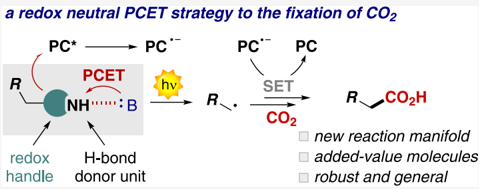

between the DHP and the base. The thermodynamic and kinetic benefits of the PCET mechanism allowed the implementation of a redox-neutral fixation process leading to synthetically relevant carboxylic acids (18 examples with isolated yields up to 75%) under very mild reaction conditions. Finally, diverse product manipulations were performed to demonstrate the synthetic versatility of the obtained products.

## ■ INTRODUCTION

In recent years, the tremendous development of synthetic photocatalysis has tackled the deeper comprehension of reaction mechanisms. 1 -5 Recent progresses in this area were guided by the identification of new ways of generating reactive radical species in milder and more controllable conditions. Three main strategies can be distinguished in this context: (i) energy transfer (EnT), (ii) single electron transfer (SET), and (iii) hydrogen atom transfer (HAT). Furthermore, protoncoupled electron transfer (noted as MS-PCET when a proton and an electron move to  or from  different reagents) has been also explored as a convenient approach in the design of new radical-based mechanistic pathways. 6 -8 For example, MSPCET have been largely investigated in artificial photosynthesis, in particular for the oxygen/hydrogen evolution reactions, and for carbon dioxide reduction. 8 -11 More recently, its importance has been demonstrated also in photosynthetic schemes for the assembly and transformation of organic commodities. In fact, this strategy has been used for the activation of C -H or X -H (X = N, S, O) bonds with the generation of C · or X · radicals. 6,7,12 -15 The oxidative photoinduced MS-PCET (Scheme 1a) is formally a hydrogen equivalent of an hydrogen atom abstraction, while involving the transfer of an electron and a proton to different chemical entities, such as photogenerated oxidant (PC * ) and a Brønsted base. A MS-PCET manifold has several benefits: (i) it displays a wider thermodynamic range of action with respect to HAT; (ii) in a MS-PCET, the potential of the oxidant and the strength of the base can be tuned independently, both

contributing to an effective bond dissociation free energy (BDFE) of the oxidant/base couple ( vide infra ); 7,8 (iii) when the transfer of the electron and of the proton from X -H is concerted, the formation of high-energy charged intermediates is avoided, thus lowering the activation barrier of the process. 9 Given the lower mobility of the proton with respect to the electron, a prerequisite for a concerted process is the preassociation of the X -H group with the base, within a hydrogen bonding network. 7 -9 Examples of photochemical generation of a radical X · upon activation of a X -H bond through an oxidative MS-PCET have been successfully reported for N -H (Scheme 1b), 16 O -H (alcohols and phenols), 9,17 and S -H (thiols). Also C -H bonds have been activated for the formation of C · with this strategy, although this approach has never been used for the generation of nucleophilic intermediates. 7,12 A potential obstacle in promoting oxidative MS-PCET of C -H bonds is their relative reluctance in being preorganized in hydrogen bonding with the base; in previous examples, this condition was achieved by exploiting an intramolecular design properly orienting the C -H and base partners. 12

Special Issue:

Progress in Photocatalysis for Organic

Chemistry

Received:

December 9, 2022

Published:

February 10, 2023

## Scheme 1 a

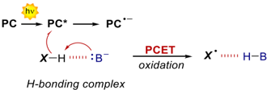

a (a) General mechanism for oxidative MS-PCET and (b) selected example of its application to the activation of N -Hbonds. (c) Aim of this work: oxidative MS-PCET-SET approach to the fixation of CO2 under redox neutral conditions. (d) Previously reported redox neutral SET-SET and (e) HAT-SET strategies for CO2 fixation.

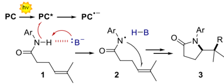

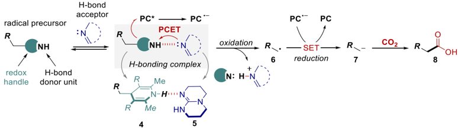

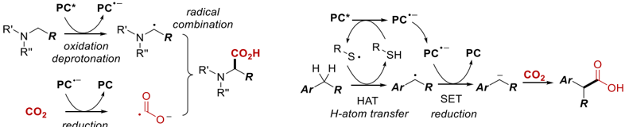

We thus sought to use the thermodynamic benefits of a MSPCET to the generation of charged nucleophilic intermediates such as carbanions, with the final aim of developing a redoxneutral photochemical carboxylation process (Scheme 1c). 18 Because of its synthetic relevance and the high interest of the whole scientific community toward the fixation of CO2, we tested our hypothesis in the reaction between benzylic carbanions and CO2. 18 -21 In particular, we envisioned an oxidative PCET with dihydropyridines (DHPs 4 , in Scheme 1c) and an organic base (TBD 5 ) as the source of radicals, 22 followed by a reductive step of the radical 6 , resulting in the generation of the carbanion 7 , able to intercept CO2. The oxidative and reductive steps are promoted in the photochemical cycle by the excited state and the reduced form of an organic PC, 23,24 respectively. The preorganization of the DHP substrate 4 in a hydrogen bonding complex with the base 5 is pivotal to drive the oxidative PCET step.

The previously successful approaches in this area have involved a UV-light mediated SET-SET processes (Scheme 1d), 25 a HAT-SET approach (Scheme 1e), 26 or redoxunbalanced SET-SET mechanisms (not shown). 27 To the best of our knowledge, a redox-neutral and PCET-based strategy has never been reported, despite the high generality that a PCET manifold can offer.

## ■ RESULTS AND DISCUSSION

We initiated our study by selecting 4BnDHP 4a as the redoxactive radical source that embodies a NH moiety. We tested by cyclic voltammetry the effect of organic bases on the oxidation of 4a in dimethylformamide (DMF) as the solvent (Figure S7). Under anodic scan, 4a (10 -3 M in DMF) shows an irreversible wave peaking at E pa = +0.59 V vs Fc + /Fc ( E pa = anodic peak potential, Fc = ferrocene), and ascribable to one electron oxidation of 4a and subsequent C -C homolytic cleavage. 28,29 In the presence of a base (1.5 equiv), the anodic process shifts to lower potentials, with the higher shift observed for TBD and 1,1,3,3-tetramethylguanidine (TMG) bases ( E pa = +0.37 and +0.35 V vs Fc + /Fc for TBD and TMG, respectively), suggesting a more favorable oxidation of 4a in the presence of a base.

The effect is observed also in acetonitrile (MeCN) as the solvent, with a representative case with TBD reported in Figure 1a. In MeCN, 4a shows an E pa = +0.51 V vs Fc + /Fc, while in the presence of TBD the wave is decreased in intensity and a new process appears at E pa = +0.31 V vs Fc + /Fc (in the same potential range, the TBD alone gives two anodic processes peaking at E pa = +0.49 and +0.92 V vs Fc + /Fc). Interestingly, the addition of the Schreiner's thiourea (a well-established Hbond donor) restores the initial wave typical of 4a .

These results indicate that the role of TBD is to induce a MS-PCET within a 4BnDHP/TBD hydrogen-bonded adduct. With the aim of further confirming these findings, we

Current (uA)

b)

c)

50 -

40

30

20

10

0,0

ЕtОг0

[4a](https://pubs.acs.org/doi/10.1021/acs.joc.2c02952?fig=fig1&ref=pdf)

[5](https://pubs.acs.org/doi/10.1021/acs.joc.2c02952?fig=fig1&ref=pdf)

[9](https://pubs.acs.org/doi/10.1021/acs.joc.2c02952?fig=fig1&ref=pdf)

AIN

H

N-Ar

Figure 1. (a) Cyclic voltammograms and (b) 1 H NMR spectra of 4a (red), 4a + TBD 5 (green), 4a + TBD 5 + Schreiner's thiourea 9 (blue). (c) Optimized geometries of 4BnDHP/TBD at the ground (left) and [4BnDHP/TBD] · + oxidized (right) states, at the B3LYP/6311+g(d,p) level of theory, including a polarizable continuum model of acetonitrile solvent. The spin density in [4BnDHP/TBD] · + is also represented and is entirely localized in the DHP moiety (right).

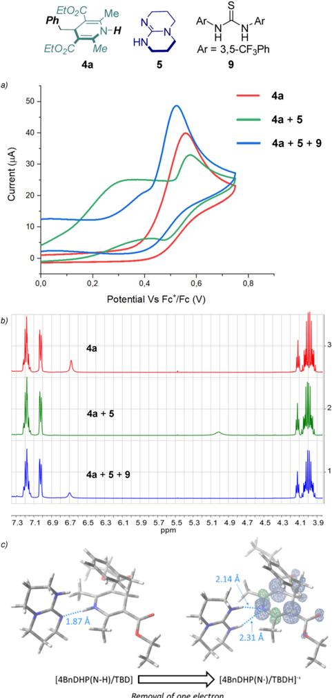

conducted additional analysis by using 1 H NMR, FT-IR, UV -vis, and DFT calculations.

By 1 H NMR analysis, the N -H signal of 4a shows a shift from 6.7 to 5.0 ppm after the addition of TBD, accompanied by a broadening of the peak (from 8 to 32 Hz; blue and green traces in Figure 1b). Conversely, the other signals of 4a undergo negligible changes, thus ruling out a deprotonation of 4a by TBD. 30 As expected, the addition of a competitive H-

Ph

Me bond donor such as Schreiner's thiourea restores the original signal at 6.5 ppm of the N -H (red trace in the NMR in Figure 1b).

The absence of major deprotonation of 4BnDHP by TBD was indeed supported by FT-IR in MeCN solution, where the stretching of the N -Hbond of 4a at 3360 cm -1 persists also in the presence of 1.5 equiv of TBD (Figure S8).

Consistently, the UV -vis analysis of 4a (10 -5 Min MeCN) in the presence of a large excess of TBD (up to 5 × 10 -2 M) allowed us to estimate a p K a value of 30.5 ± 0.3 for the N -H group in 4a (Figure S9 and see details in Supporting Information), 4.5 times higher than the one associated with the TBDH + /TBD couple, p K a = 26. 31

̂

To get insights into the impact of the H-bonding network in the one electron oxidation of the 4BnDHP/TBD adduct, we performed DFT calculations. The one-electron oxidation of the 4a within the 4BnDHP/TBD was modeled at the B3LYP/ 6-311+g(d,p) level of theory, with a polarizable continuum model of MeCN solvent. 32,33 Figure 1c reports the optimized geometry of the 4BnDHP/TBD adduct (optimized as a neutral, singlet species), revealing the N -H ··· N hydrogen bond with N -H and H ··· N distances of 1.04 and 1.87 Å, respectively, and a NH N angle of 178.8 ° . 34,35 A second geometry with different relative orientations of 4a and TBD was considered, showing a similar energy and similar distances and angles within the H-bonding network, see Figure S14 in the Supporting Information. In agreement with MS-PCET manifold, when optimizing the 4BnDHP/TBD adduct upon one electron oxidation (positively charged species with doublet multiplicity), the proton from the N -H group in 4a migrates to the nitrogen of TBD. In the optimized geometry of the resulting state [4BnDHP(N · )/TBDH] · + , an H bonding is still present and involves the N -H moieties of TBDH + and the N atom of the dihydropyridine, with distances of 2.14 and 2.31 Å. The spin density is entirely localized on the DHP scaffold (Figure 1c). The DFT analysis thus confirms a MS-PCET process in the oxidation of the 4BnDHP/TBD adduct to [4BnDHP(N · )/TBDH] · + , where the electron is removed from the 4a with the concomitant proton transfer to the TBD.

With this information in hand, we next evaluated the feasibility of a PCET-based photocarboxylation process. Based on previous reports on light-driven carboxylation methods, we initially evaluated the reaction with the 4CzIPN 11 in DMF under a CO2 atmosphere (1 atm) and 435 nm irradiation (Table 1, entry 1). In the absence of a base, no carboxylation product was detected.

As for the CV experiments, we performed a screening of bases (Table 1, entries 2 -5). The best performance was obtained with TBD, with 71% yield (Table 1, entry 5). Solvent screening, concentration, and the catalyst loading were later evaluated (Table 1, entries 6 -8) to identify the best reaction conditions (Table 1, entry 8, 76% yield). As expected the reactivity was completely suppressed in the absence of the PC or in the dark (Table 1, entries 9 -10).

̈

Recently, Ko nig et al. reported the evolution of 11 in the presence of benzylic radical precursors into a benzylated derivative 4CzBnBN ( 12 ), which was shown to be the real active photocatalyst. 36 Indeed, 12 was verified to form also in our conditions, and consistently the reaction starting from the isolated 12 provides a similar 73% carboxylation yield (Table 1, entry 11). A good yield was obtained also with a less oxidizing photocatalyst 3DPA2FBN 13 (Table 1, entry 12, 71%). Indeed, the excited state of the photocatalyst drives the

a E * ox and E * red refer to the potentials of the PC · + /PC * and PC * / PC ·-couples, respectively; 24 potentials are reported vs Fc + /Fc (for comparison with literature data: E vs Fc + /Fc = E vs SCE -0.37 V). The BDFE values are calculated according to eq 1 ( vide infra ). Optimization of reaction parameters: General conditions are 0.1 mmol of 4a , 1 atm. of CO2, 1 mL of solvent. b Yields are given by 1 H NMR analysis with dibromomethane as internal standard. c 2 mol % of 11 was used. d No light irradiation.

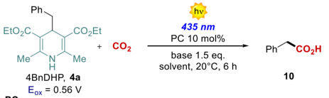

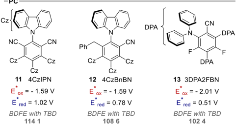

Table 1. Reaction Scheme and Photocatalysts Employed a

| entry    | base   | solvent   |   concentration (M) | PC   | yield b (%)   |
|----------|--------|-----------|---------------------|------|---------------|
| 1        | -      | DMF       |                 0.1 | 11   | trace         |
| 2        | NEt 3  | DMF       |                 0.1 | 11   | 49            |
| 3        | TMG    | DMF       |                 0.1 | 11   | 51            |
| 4        | Me-TBD | DMF       |                 0.1 | 11   | 58            |
| 5        | TBD    | DMF       |                 0.1 | 11   | 71            |
| 6        | TBD    | MeCN      |                 0.1 | 11   | 68            |
| 7        | TBD    | MeCN      |                0.05 | 11   | 73            |
| 8 c      | TBD    | MeCN      |                0.05 | 11   | 76            |
| 9        | TBD    | MeCN      |                0.05 | -    | trace         |
| 10 c , d | TBD    | MeCN      |                0.05 | 11   | -             |
| 11 c     | TBD    | MeCN      |                0.05 | 12   | 73            |
| 12 c     | TBD    | MeCN      |                0.05 | 13   | 71            |

oxidative MS-PCET within the 4BnDHP/TBD adduct. The energetics of the oxidative MS-PCET process can be discussed on the basis of the effective BDFE formalism ( vide supra ), 7,8 by combining the potential of the oxidant (in this case the excited photocatalyst) and the p K a of the acid/base couple (in this case the TBDH + /TBD, p K a = 26 in acetonitrile):

<!-- formula-not-decoded -->

In particular, the BDFE eff is 114.1, 108.6, and 102.4 kcal mol -1 for photocatalysts 11 , 12 , and 13 , respectively, thus being suitable to promote formal hydrogen abstraction from the 4a substrate (BDFE of the N -H bond ca. 90 kcal mol -1 ). 37 As a selected case, the reactivity of 12 * toward the 4BnDHP/TBD adduct was confirmed through emission experiments. Under deaerated or CO2 saturated acetonitrile, the 12 * is characterized by a lifetime of 29 ns and of 4.8 μ s for the singlet and triplet excited states, respectively (Figure S11; under similar conditions the parent 11 * shows a lifetime of 20

ns for the singlet and of 5.1 μ s for the triplet, 24,38,39 Figure S12). Upon addition of 4BnDHP/TBD, a progressive decay of both the singlet and the triplet lifetimes is observed, indicative of a dynamic quenching; a Stern -Volmer plot of the triplet lifetime versus the concentration of 4BnDHP/TBD provides a second order rate constant for the quenching of 1.5 × 10 9 M -1 s -1 , approaching the diffusion limit (Figure S13).

A further investigation on the nature and on the time evolution of the formed species by transient absorption spectroscopy was hampered by the available instrumental setup, which allows for laser excitation at 355 nm, where the substrate 4a gives competitive absorption.

Upon oxidative MS-PCET and fragmentation, the pathway most likely involves a subsequent reduction step of the benzyl radical 6a by the reduced photocatalyst 12 ·-( E = -2.17 V vs Fc + /Fc for the 12 / 12 ·-couple) resulting in the generation of a benzylic carbanion 7a (estimated E ca. -2.4 V vs Fc + /Fc for the 6a / 7a couple), 40 through a radical-polar crossover manifold. This mechanism has been recently established as a general and reliable strategy for the generation of reactive nucleophilic intermediates. 26,41 In this case the presence of an aryl group is key to the stabilization of the carbanion. The benzyl carbanion 7a 33 is finally capable of reacting with CO2 (Scheme 2). 42

Scheme 2. Proposed Reaction Mechanism for the Redox Neutral Photocarboxylation Method Herein Developed

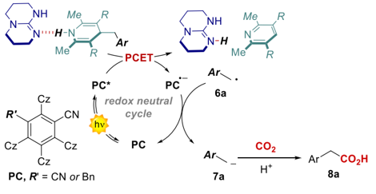

After having investigated the mechanism of the reaction, we explored the generality of the carboxylation process by testing different dihydropyridines (Figure 2). Primary aryl radicals were generated efficiently both from electron-rich and electron-deficient substrates, resulting in the corresponding carboxylated products 10 -17 with isolated yields spanning from 52% to 63%. Remarkably, when scaling up the model reaction to a 1 mmol scale, we obtained the desired phenylacetic acid 10 with an increased 75% isolated yield, 103 mg. Secondary and tertiary precursors were also competent substrates furnishing the carboxylated products 18 -22 from 36% to 58% yield. We also investigated heteroaromatic DHPs 23 -26 , obtaining good isolated yields up to 57%.

In order to confirm the radical nature of process, a new cyclopropyl DHP 4b was synthesized and subjected to the optimized reaction conditions. The carboxylation in this case took place at the more stabilized benzylic position, resulting in the synthesis of a valuable 2-allyl benzoic acid 27 . It is worth mentioning that all the products were isolated without the need of column chromatography.

Other radical precursors were also investigated (Scheme 3a). Different benzylic BF3K or BF3NBu4 salts afforded the

Figure 2. Scope of photochemical carboxylation with DHPs. Yields are given by 1 H NMR analysis with dibromomethane as internal standard. Isolated yields in parentheses.

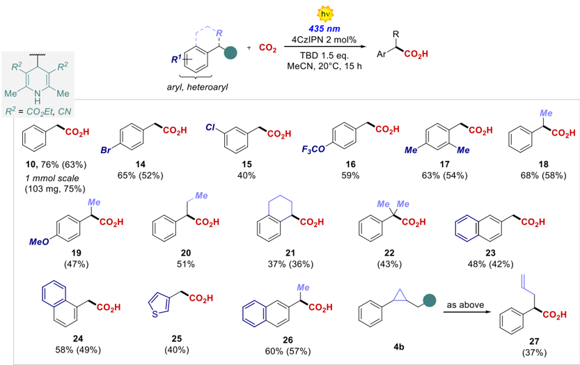

respective products up to 70% isolated yield. In this case, the only operative mechanism is the classical SET, and in agreement with this the less oxidizing PC 13 was not able to promote the carboxylation process (see SI), further confirming our mechanistic findings.

We next demonstrated the synthetic usefulness of the obtained carboxylated products (Scheme 3b). As shown in Scheme 3, 10 was transformed trough a Curtius rearrangement procedure into the carbamate derivative 31 in 78% overall yield. Using L-menthol, the ester 32 was obtained in 97% yield starting from 10 . Finally, product 18 was converted into the corresponding Weinreb amide, and subsequently treated with phenylmagnesium bromide to yield the aryl ketone 33 in 66% yield over two steps.

## ■ CONCLUSIONS

In conclusion, a novel photocarboxylation method using CO2 was developed. The process works through an innovative redox-neutral PCET-SET manifold that was investigated by experimental analysis (NMR, CV, IR and UV -vis) and supported by DFT calculations. The developed method allows access to a series of diverse benzylic radical intermediates, which were readily converted into the corresponding carbanions capable of engaging in the nucleophilic addition to CO2 (isolated yields up to 75%). Finally, we have demonstrated the versatility of the carboxylated products with a series of simple transformations.

## ■ EXPERIMENTAL SECTION

General Information. Chromatographic purification of products was accomplished using flash chromatography on silica gel (SiO2, 0.04 -0.063 mm) purchased from Machery -Nagel, with the indicated solvent system according to the standard techniques. Thin-layer chromatography (TLC) analysis was performed on precoated Merck TLC plates (silica gel 60 GF254, 0.25 mm). Visualization of the developed chromatography was performed by checking UV

̈

absorbance (254 and 365 nm) as well as with phosphomolybdic acid and potassium permanganate solutions. Organic solutions were concentrated under reduced pressure on a Bu chi rotary evaporator. NMR spectra were recorded on a Bruker Avance 300 spectrometer equipped with a BBO-z grad probehead, a Bruker 400 AVANCE III HD equipped with a BBI-z grad probehead, and a Bruker AVANCE Neo 600 equipped with a TCI Prodigy cryoprobe. The chemical shifts ( δ ) for 1 H and 13 C are given in ppm relative to residual signals of the solvents (CHCl3 @7.26 ppm 1 H NMR, 77.2 ppm 13 C NMR; acetone @2.05 ppm 1 H NMR, 29.84 ppm 13 C NMR). Coupling constants are given in Hz. The following abbreviations are used to indicate the multiplicity: s, singlet; d, doublet; t, triplet; q, quartet; m, multiplet; qd, quartet of doublets; brs, broad singlet; brd, broad doublet; brt, broad triplet. NMR yields were calculated by using dibromomethane (4.95 ppm, s, 2H) as internal standard. High-resolution mass spectra (HRMS) were obtained using Waters GCT gas chromatograph coupled with a time-of-flight mass spectrometer (GC/MS-TOF) with electron ionization (EI). Steady-state absorption spectroscopy studies have been performed at room temperature on a Varian Cary 50 UV -vis double beam spectrophotometer; 10 mm path length Hellma Analytics 100 QS quartz cuvettes have been used. Nanosecond transient absorption measurements were performed with an Applied Photophysics laser flash photolysis apparatus, using a frequencydoubled (532 nm, 330 mJ) or tripled (355 nm, 160 mJ) Surelite Continuum II Nd/YAG laser (half-width 6 -8 ns) as excitation source. Transient detection was obtained using a photomultiplieroscilloscope combination (Hamamatsu R928, LeCroy 9360). IR measurements were carried out at room temperature on a JASCO FT/IR-4100 spectrophotometer; 1 mm path length Hellma Analytics 100 QX quartz cuvettes have been used. The electrochemical characterizations were carried out at room temperature, on a BASi EC Epsilon potentiostat-galvanostat. A typical three-electrode cell was employed, which was composed of glassy carbon (GC) working electrode (3 mm diameter), a platinum wire as counter electrode, and a silver/silver chloride electrode (Ag/AgCl (NaCl 3 M)) as reference electrode. The reference electrode is a silver wire that is coated with a thin layer of silver chloride; the electrode body contains sodium chloride (NaCl 3 M). The GC electrode was polished before any

## Scheme 3 a

a (a) Reaction performed with BF3K and BF3NBu4 salts. (b) Products manipulations. DPPA: diphenylphosphoryl azide; DCC: N , N ′ -dicyclohexylcarbodiimide; DMAP: 4-(dimethylamino)pyridine; EDC: N -(3-dimethylaminopropyl)N ′ -ethylcarbodiimide hydrochloride; DIPEA: N , N -diisopropylethylamine.

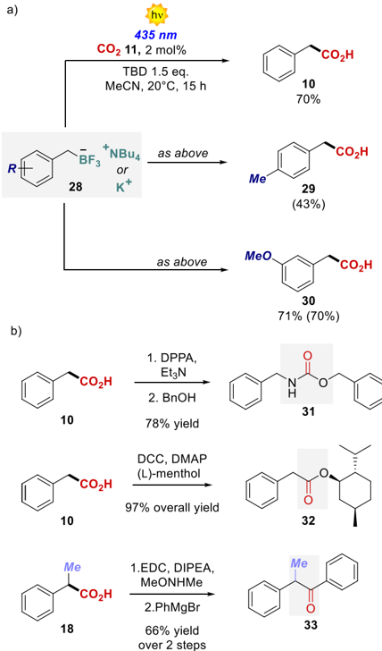

measurement with diamond paste and ultrasonically rinsed with deionized water for 15 min.

General Procedures A and B for the Synthesis of 4BnDHP. A : 4-Substituted-2,6-dimethyl-1,4-dihydropyridine-3,5-dicarboxylates 4a -i and 4l-o were prepared according to the literature. 43

B : 4-Substituted-1,4-dihydropyridine-3,5-dicarbonitriles 4j and 4k were prepared according to the literature. 44

Diethyl 4-benzyl-2,6-dimethyl-1,4-dihydropyridine-3,5-dicarboxylate (4a). Synthesized following general procedure A using 1.16 mL (10 mmol, 1.0 equiv) of phenylacetaldehyde in 6 h. Pure 4a was obtained using flash chromatography on silica gel (hexane:ethyl acetate 8:2 to 7:3) in 34% yield (1.17 g, 3.4 mmol) as a pale-yellow powder. 1 H NMR (400 MHz, CDCl3) δ 7.21 -7.09 (m, 3H), 7.07 -6.96 (m, 2H), 5.36 (s, 1H), 4.19 (t, J = 5.5 Hz, 1H), 4.12 -3.97 (m, 4H), 2.58 (d, J = 5.5 Hz, 2H), 2.17 (s, 6H), 1.23 (t, J = 7.1 Hz, 6H) ppm. 13 C{ 1 H} NMR (101 MHz, CDCl3) δ 167.9, 145.4, 139.4, 130.2, 127.4, 125.7, 102.0, 59.7, 42.4, 35.6, 19.3, 14.5 ppm. These data matched with those previously reported in the literature. 45

Diethyl 2,6-dimethyl-4-((2-phenylcyclopropyl)methyl)-1,4-dihydropyridine-3,5-dicarboxylate (4b). Synthesized following general procedure A using 420 mg (2.6 mmol, 1.0 equiv) of 2-(2phenylcyclopropyl)acetaldehyde ( S12 ) in 4 h. Pure 4b was obtained using flash chromatography on silica gel (hexane:ethyl acetate 9:1) in 33% yield (329 mg, 0.86 mmol) as a pale-yellow powder. 1 H NMR

(400 MHz, CDCl3) δ 7.20 (t, J = 7.7 Hz, 2H), 7.08 (t, J = 7.3 Hz, 1H), 6.93 (d, J = 6.8 Hz, 2H), 5.33 (s, 1H), 4.16 -4.01 (m, 5H), 2.23 (s, 3H), 2.09 (s, 3H), 1.59 (dt, J = 13.9, 5.4 Hz, 1H), 1.49 (dt, J = 8.9, 4.7 Hz, 1H), 1.31 (dd, J = 8.3, 5.5 Hz, 1H), 1.28 -1.21 (m, 6H), 1.10 -0.97 (m, 1H), 0.78 -0.64 (m, 2H) ppm. 13 C{ 1 H} NMR (101 MHz, CDCl3) δ 168.1, 168.0, 145.2, 145.0, 144.6, 128.2, 125.4, 125.1, 103.2, 102.8, 59.7, 40.9, 33.6, 23.9, 20.7, 19.64, 19.60, 16.5, 14.6 ppm. HRMS (ESI-MS) calculated for C23H28NO4 -[M -H] -382.2024, found 382.2046.

Diethyl 4-(4-bromobenzyl)-2,6-dimethyl-1,4-dihydropyridine3,5-dicarboxylate (4c). Synthesized following general procedure A using 468 mg (2.4 mmol, 1.0 equiv) of 2-(4-bromophenyl)acetaldehyde ( S1 ) in 6 h. Pure 4c was obtained using flash chromatography on silica gel (hexane:ethyl acetate 9:1 to 8:2) in 27% yield (277 mg, 0.66 mmol) as a pale-yellow powder. 1 H NMR (400 MHz, CDCl3) δ 7.29 (d, J = 8.1 Hz, 2H), 6.89 (d, J = 8.1 Hz, 2H), 5.59 (s, 1H), 4.17 (t, J = 5.2 Hz, 1H), 4.15 -4.00 (m, 4H), 2.53 (d, J = 5.2 Hz, 2H), 2.17 (s, 6H), 1.25 (t, J = 7.1 Hz, 6H) ppm. 13 C{ 1 H} NMR (101 MHz, CDCl3) δ 167.8, 145.8, 138.4, 131.9, 130.3, 119.7, 101.5, 59.8, 41.7, 35.4, 19.3, 14.5 ppm. These data matched with those previously reported in the literature. 43

Diethyl 4-(3-chlorobenzyl)-2,6-dimethyl-1,4-dihydropyridine3,5-dicarboxylate (4d). Synthesized general procedure A using 375 mg (2.4 mmol, 1.0 equiv) of 2-(3-chlorophenyl)acetaldehyde ( S2 ) in 6 h. Pure 4d was obtained using flash chromatography on silica gel (hexane:ethyl acetate 9:1 to 8:2) in 37% yield (337 mg, 0.89 mmol) as a pale-yellow powder. 1 H NMR (400 MHz, CDCl3) δ 7.15 -7.01 (m, 3H), 6.87 (dt, J = 7.0, 1.6 Hz, 1H), 5.41 (s, 1H), 4.19 (t, J = 5.4 Hz, 1H), 4.15 -4.00 (m, 4H), 2.55 (d, J = 5.4 Hz, 2H), 2.18 (s, 6H), 1.25 (t, J = 7.1 Hz, 6H) ppm. 13 C{ 1 H} NMR (101 MHz, CDCl3) δ 167.8, 145.8, 141.6, 133.2, 130.3, 128.6, 128.5, 125.9, 101.7, 59.9, 42.1, 35.6, 19.4, 14.5 ppm. HRMS (ESI-MS) calculated for C20H23ClNO4 -[M -H] -376,1321, found 372.1322.

Diethyl 2,6-dimethyl-4-(4-(trifluoromethoxy)benzyl)-1,4-dihydropyridine-3,5-dicarboxylate (4e). Synthesized following general procedure A using 204 mg (2.0 mmol, 1.0 equiv) of 2-(4(trifluoromethoxy)phenyl)acetaldehyde ( S3 ) in 6 h. Pure 4e was obtained using flash chromatography on silica gel (hexane:ethyl acetate 9:1 to 85:15) in 39% yield (335 mg, 0.78 mmol) as a paleyellow powder. 1 H NMR (600 MHz, CDCl3) δ 7.03 (s, 4H), 5.29 (s, 1H), 4.18 (t, J = 5.6 Hz, 1H), 4.14 -3.95 (m, 4H), 2.58 (d, J = 5.6 Hz, 2H), 2.18 (s, 5H), 1.23 (t, J = 7.1 Hz, 6H) ppm. 13 C{ 1 H} NMR (151 MHz, CDCl3) δ 167.6, 147.6 (q, J = 1.6 Hz), 145.4, 138.3, 131.2, 120.5 (q, J = 254.9 Hz), 119.9, 101.8, 59.7, 41.6, 35.5, 19.3, 14.3 ppm. 19 F NMR (188 MHz, CDCl3) δ -58.38 (s, 3F) ppm. HRMS (ESIMS) calculated for C21H23F3NO5 -[M -H] -426.1534, found 426.1563.

Diethyl 4-(2,4-dimethylbenzyl)-2,6-dimethyl-1,4-dihydropyridine-3,5-dicarboxylate (4f). Synthesized following general procedure A using 1 g (6.7 mmol, 1.0 equiv) of 2-(2,4-dimethylphenyl)acetaldehyde in 5 h. Pure 4f was obtained using flash chromatography on silica gel (hexane:ethyl acetate 8:2) in 34% yield (842 mg, 2.3 mmol) as a pale-yellow powder. 1 H NMR (400 MHz, CDCl3) δ 6.89 (s, 1H), 6.84 -6.74 (m, 3H), 5.80 (s, 1H), 4.20 (t, J = 7.0 Hz, 1H), 4.03 -3.79 (m, 4H), 2.54 (d, J = 7.0 Hz, 2H), 2.34 (s, 3H), 2.29 (s, 6H), 2.24 (s, 3H), 1.17 (t, J = 7.1 Hz, 3H) ppm. 13 C{ 1 H} NMR (101 MHz, CDCl3) δ 168.0, 145.2, 137.1, 135.3, 134.1, 131.2, 130.6, 125.8, 103.0, 59.7, 39.3, 33.7, 21.0, 19.5, 19.4, 14.3 ppm. HRMS (ESI-MS) calculated for C22H28NO4 -[M -H] -370.2024, found 370.2011.

Diethyl 2,6-dimethyl-4-(1-phenylethyl)-1,4-dihydropyridine-3,5dicarboxylate (4g). Synthesized following general procedure A using 1.33 mL (10 mmol, 1.0 equiv) of 2-phenylpropanal in 4 h. Pure 4g was obtained using flash chromatography on silica gel (hexane:ethyl acetate 9:1 to 7:3) in 35% yield (1.25 g, 3.5 mmol) as a pale-yellow powder. 1 H NMR (400 MHz, CDCl3) δ δ 7.19 -6.95 (m, 5H), 5.28 (s, 1H), 4.18 (d, J = 5.1 Hz, 1H), 4.03 -3.88 (m, 3H), 3.79 (m, 1H), 2.66 (qd, J = 7.2, 4.9 Hz, 1H), 2.10 (s, 6H), 1.18 (t, J = 7.1 Hz, 4H), 1.13 -1.02 (m, 6H) ppm. 13 C{ 1 H} NMR (101 MHz, CDCl3) δ 168.74, 168.71, 145.5, 145.2, 144.5, 128.8, 127.5, 126.1, 101.4, 101.3,

59.92, 59.89, 46.3, 19.6, 19.5, 15.8, 14.7, 14.6 ppm. These data matched with those previously reported in the literature . 45

Diethyl 4-(1-(4-methoxyphenyl)ethyl)-2,6-dimethyl-1,4-dihydropyridine-3,5-dicarboxylate (4h). Synthesized following general procedure A using 1.4 g (8.6 mmol, 1.0 equiv) of 2-(4methoxyphenyl)propanal ( S8 ) in 4 h. Pure 4h was obtained using flash chromatography on silica gel (hexane:ethyl acetate 8:2) in 35% yield (1.16 g, 3.0 mmol) as a pale-yellow powder. 1 H NMR (400 MHz, CDCl3) δ 6.99 (d, J = 8.6 Hz, 2H), 6.73 (d, J = 8.6 Hz, 2H), 5.48 (s, 1H), 4.22 (d, J = 5.0 Hz, 1H), 4.11 -3.88 (m, 4H), 3.75 (s, 3H), 2.69 (qd, J = 7.2, 4.8 Hz, 1H), 2.19 -2.16 (m, 6H), 1.27 (t, J = 7.1 Hz, 3H), 1.20 (t, J = 7.1 Hz, 3H), 1.13 (d, J = 7.3 Hz, 3H) ppm. 13 C{ 1 H} NMR (101 MHz, CDCl3) δ 168.6, 168.5, 158.0, 145.3, 145.0, 136.4, 129.5, 112.7, 101.2, 101.0, 59.73, 59.68, 55.4, 45.3, 40.3, 19.4, 19.2, 15.9, 14.5, 14.4 ppm. HRMS (ESI-MS) calculated for C22H28NO5 -[M -H] -386.1973, found 386.1976.

Diethyl 2,6-dimethyl-4-(1-phenylpropyl)-1,4-dihydropyridine3,5-dicarboxylate (4i). Synthesized following general procedure A using 352 mg (2.4 mmol, 1.0 equiv) of 2-phenylbutanal ( S4 ) in 6 h. Pure 4i was obtained using flash chromatography on silica gel (hexane:ethyl acetate 9:1) in 52% yield (462 mg, 1.2 mmol) as a paleyellow powder. 1 H NMR (400 MHz, CDCl3) δ 7.19 -7.08 (m, 3H), 7.03 -6.96 (m, 2H), 5.13 (s, 1H), 4.33 (d, J = 4.6 Hz, 1H), 4.18 -4.00 (m, 4H), 2.42 (dt, J = 10.1, 5.2 Hz, 1H), 2.13 (s, 3H), 2.10 (s, 3H), 1.75 -1.53 (m, 2H), 1.27 (td, J = 7.1, 4.8 Hz, 6H), 0.76 (t, J = 7.3 Hz, 3H) ppm. 13 C{ 1 H} NMR (101 MHz, CDCl3) δ 169.0, 168.5, 145.6, 145.5, 142.5, 129.6, 127.2, 126.1, 101.6, 100.9, 59.92, 59.88, 55.0, 39.0, 23.3, 19.5, 14.69, 14.66, 12.9 ppm. These data matched with those previously reported in the literature . 43

2,6-Dimethyl-4-(1,2,3,4-tetrahydronaphthalen-1-yl)-1,4-dihydropyridine-3,5-dicarbonitrile (4j). Synthesized following general procedure B using 625 mg (3.9 mmol, 1.0 equiv) of 1,2,3,4tetrahydronaphthalene-1-carbaldehyde ( S9 ) in 4 h. Pure 4j was obtained using flash chromatography on silica gel (hexane:ethyl acetate 6:4 to 4:6) in 12% yield (137 mg, 0.47 mmol) as a pale-yellow powder. 1 H NMR (400 MHz, CDCl3) δ 7.25 -7.20 (m, 1H), 7.20 -7.12 (m, 2H), 7.12 -7.06 (m, 1H), 5.91 (s, 1H), 3.86 (d, J = 3.7 Hz, 1H), 3.17 (q, J = 7.1, 6.5 Hz, 1H), 2.82 -2.68 (m, 2H), 2.11 (s, 3H), 2.05 (s, 3H), 1.99 -1.89 (m, 2H), 1.82 -1.64 (m, 1H) ppm. 13 C{ 1 H} NMR (101 MHz, CDCl3) δ 147.5, 146.9, 139.0, 135.1, 129.3, 128.8, 126.5, 125.9, 118.7, 117.8, 84.4, 82.7, 43.5, 42.1, 30.2, 24.9, 21.4, 18.72, 18.66 ppm. HRMS (ESI-MS) calculated for C19H18N3 -[M -H] -288.1506, found 288.1513.

2,6-Dimethyl-4-(2-phenylpropan-2-yl)-1,4-dihydropyridine-3,5dicarbonitrile (4k). Synthesized following general procedure B using 1.08 g (7.3 mmol, 1.0 equiv) of 2-methyl-2-phenylpropanal ( S10 ) in 4 h. Pure 4k was obtained using flash chromatography on silica gel (hexane:ethyl acetate 6:4 to 4:6) in 45% yield (910 mg, 3.3 mmol) as a pale-yellow powder. 1 H NMR (400 MHz, CDCl3) δ 7.26 -7.17 (m, 5H), 6.23 (s, 1H), 3.22 (s, 1H), 1.95 (s, 6H), 1.35 (s, 6H) ppm. 13 C{ 1 H} NMR (101 MHz, CDCl3) δ 148.6, 144.2, 127.8, 127.0, 126.7, 119.7, 81.0, 47.6, 46.6, 24.6, 18.3 ppm. These data matched with those previously reported in the literature . 44

Diethyl 2,6-dimethyl-4-(naphthalen-2-ylmethyl)-1,4-dihydropyridine-3,5-dicarboxylate (4l). Synthesized following general procedure A using 391 mg (2.3 mmol, 1.0 equiv) of 2-(naphthalen-2yl)acetaldehyde ( S5 ) in 5 h. Pure 4l was obtained using flash chromatography on silica gel (hexane:ethyl acetate 75:25) in 34% yield (307 mg, 0.78 mmol) as a pale-yellow powder. 1 H NMR (400 MHz, CDCl3) δ 7.80 -7.70 (m, 2H), 7.65 (d, J = 8.4 Hz, 1H), 7.47 -7.34 (m, 3H), 7.20 (dd, J = 8.4, 1.7 Hz, 1H), 5.19 (s, 1H), 4.28 (t, J = 5.3 Hz, 1H), 4.12 -3.91 (m, 4H), 2.75 (d, J = 5.3 Hz, 2H), 2.12 (s, 6H), 1.19 (t, J = 7.1 Hz, 6H) ppm. 13 C{ 1 H} NMR (101 MHz, CDCl3) δ 168.0, 145.6, 137.1, 133.4, 132.1, 129.3, 128.4, 127.62, 127.60, 126.5, 125.7, 125.1, 101.9, 59.7, 42.6, 35.8, 19.3, 14.5 ppm. HRMS (ESI-MS) calculated for C24H26NO4 -[M -H] -392.1867, found 392.1870.

Diethyl 2,6-dimethyl-4-(naphthalen-1-ylmethyl)-1,4-dihydropyridine-3,5-dicarboxylate (4m). Synthesized following general procedure A using 306 mg (1.8 mmol, 1.0 equiv) of 2-(naphthalen-1- yl)acetaldehyde ( S6 ) in 5 h. Pure 4m was obtained using flash chromatography on silica gel (hexane:ethyl acetate 75:25) in 29% yield (205 mg, 0.52 mmol) as a pale-yellow powder. 1 H NMR (400 MHz, CDCl3) δ 8.38 (d, 1H, J = 8.4 Hz), 7.80 (d, 1H, J = 7.6 Hz), 7.65 (d, 1H, J = 7.6 Hz), 7.51 -7.44 (m, 2H), 7.30 -7.26 (m, 2H), 7.04 (d, 1H, J = 6.8 Hz), 5.80 (s, 1H), 4.43 (t, 1H, J = 6.7 Hz), 3.93 -3.85 (m, 2H), 3.65 -3.57 (m, 2H), 3.02 (d, 2H, J = 6.7 Hz), 2.24 (s, 6H), 0.93 (t, 3H, J = 7.2 Hz) ppm. 13 C{ 1 H} NMR (101 MHz, CDCl3) δ 167.9, 145.4, 135.2, 133.7, 133.2, 128.3, 128.1, 126.6, 125.4, 125.3, 125.1, 124.9, 102.8, 59.6, 39.8, 34.2, 19.4, 13.8 ppm. These data matched with those previously reported in the literature . 46

Diethyl 2,6-dimethyl-4-(thiophen-3-ylmethyl)-1,4-dihydropyridine-3,5-dicarboxylate (4n). Synthesized following general procedure A using 306 mg (2.4 mmol, 1.0 equiv) of 2-(thiophen-3yl)acetaldehyde ( S7 ) in 6 h. Pure 4n was obtained using flash chromatography on silica gel (hexane:ethyl acetate 75:25) in 34% yield (289 mg, 0.83 mmol) as a pale-yellow powder. 1 H NMR (600 MHz, CDCl3) δ 7.10 (dd, J = 4.9, 3.0 Hz, 1H), 6.81 (dd, J = 4.9, 1.2 Hz, 1H), 6.76 (d, J = 2.8 Hz, 1H), 5.34 (s, 1H), 4.16 (t, J = 5.4 Hz, 1H), 4.14 -4.05 (m, 4H), 2.61 (d, J = 5.4 Hz, 2H), 2.18 (s, 6H), 1.26 (t, J = 7.1 Hz, 6H) ppm. 13 C{ 1 H} NMR (151 MHz, CDCl3) δ 168.0, 145.4, 139.7, 130.1, 123.7, 122.0, 102.1, 59.8, 36.6, 35.2, 19.5, 14.6 ppm. HRMS (ESI-MS) calculated for C18H22NO4S -[M -H] -348.1275, found 348.1310.

Diethyl 2,6-dimethyl-4-(1-(naphthalen-2-yl)ethyl)-1,4-dihydropyridine-3,5-dicarboxylate (4o). Synthesized following general procedure A using 563 mg (3.1 mmol, 1.0 equiv) of 2-(naphthalen2-yl)propanal ( S11 ) in 5 h. Pure 4o was obtained using flash chromatography on silica gel (hexane:ethyl acetate 75:25) in 37% yield (465 mg, 1.1 mmol) as a pale-yellow powder. 1 H NMR (400 MHz, CDCl3) δ 7.75 (m, 2H), 7.67 (d, J = 8.5 Hz, 1H), 7.48 (as, 1H), 7.43 -7.35 (m, 2H), 7.31 (dd, J = 8.5, 1.8 Hz, 1H), 5.24 (s, 1H), 4.37 (d, J = 4.7 Hz, 1H), 4.03 (q, J = 7.1 Hz, 2H), 3.92 (dq, J = 10.8, 7.1 Hz, 1H), 3.72 (dq, J = 10.8, 7.1 Hz, 1H), 2.94 (m, 1H), 2.16 (s, 3H), 2.14 (s, 3H), 1.29 -1.20 (m, 6H), 1.08 (t, J = 7.1 Hz, 3H) ppm. 13 C{ 1 H} NMR (101 MHz, CDCl3) δ 168.7, 168.6, 145.7, 145.3, 142.0, 133.4, 132.5, 128.0, 127.9, 127.7, 126.9, 126.6, 125.8, 125.3, 101.3, 101.1, 59.9, 59.9, 46.5, 40.5, 19.6, 19.4, 15.8, 14.6, 14.4 ppm. These data matched with those previously reported in the literature. 43

General Procedure C for the Synthesis of BF3K and BF3NBu4 Salts. BF3K salts were synthesized following a reported procedure. 47 BF3NBu4 salts were prepared from the corresponding potassium salts by ion-exchange according to the literature procedures. 48 The yield of this step was quantitative.

Tetrabutyl ammonium benzyltrifluoroborate (28a). Synthesized following general procedure C using 357 μ L (3.0 mmol, 1.0 equiv) of benzyl bromide. Pure 28a was obtained in 72% yield (883 mg, 2.2 mmol) as a white solid. 1 H NMR (400 MHz, Acetoned 6) δ 7.12 -7.10 (m, 2H), 7.06 -7.02 (m, 2H), 6.88 (1H, br t, J = 7.3 Hz), 1.65 (s, 2H) ppm. 13 C{ 1 H} NMR (101 MHz, Acetoned 6) δ 148.0, 129.7, 127.8, 122.9, 30.4, 30.0 ppm. These data matched with those previously reported in the literature . 49

Tetrabutyl ammonium 4-methylbenzyltrifluoroborate (28b). Synthesized following general procedure C using 555 mg (3.0 mmol, 1.0 equiv) 4-methylbenzyl bromide. Pure 28b was obtained in 70% yield (872 mg, 2.1 mmol) as a white solid. 1 H NMR (400 MHz, Acetoned 6) δ 6.98 (d, J = 7.6 Hz, 2H), 6.85 (d, J = 7.5 Hz, 2H), 2.19 (s, 3H), 1.58 (bs, 2H) ppm. 13 C{ 1 H} NMR (101 MHz, Acetoned 6) δ 144.7, 131.5, 129.7, 128.6, 21.0 ppm. These data matched with those previously reported in the literature . 50

Potassium 2-methoxybenzyltrifluoroborate (28c). Synthesized following general procedure C using 420 μ L (3.0 mmol, 1.0 equiv) of 3-methoxylbenzyl bromide. Pure 28c was obtained in 70% yield (479 mg, 2.1 mmol) as a white solid. 1 H NMR (400 MHz, Acetoned 6) δ 6.93 (t, J = 7.8 Hz, 1H), 6.70 -6.60 (m, 2H), 6.45 (dd, J = 8.0, 2.6 Hz, 1H), 3.69 (s, 3H), 1.61 (s, 2H) ppm. 13 C{ 1 H} NMR (101 MHz, Acetoned 6) δ 160.0, 149.7, 128.5, 122.4, 115.4, 108.5, 55.0 ppm. These data matched with those previously reported in the literature . 50

General Procedure D for Photochemical Carboxylation Reaction. In a 4 mL vial, DHPs 4a -4o or trifluoroborate salt 28a -c

(0.1 mmol, 1.0 equiv), photocatalyst (0.002 mmol, 2 mol %), and TBD (0.15 mmol, 2 equiv) were added, and then the vial was closed with a PTFE/silicone septum cap and degassed with CO2. The reagents were dissolved in CO2-degassed acetonitrile (2 mL, 0.05 M) and the reaction mixture was bubbled with CO2 for 30 s. Then, the vial was placed in the photochemical reactor shown in section A.2 of the Supporting Information and irradiated for 15 h at 20 ° C. NMR yield was measured using 14 μ L of CH2Br2 and 25 μ L of acetic acid. The solvent was removed, the product was moved in a separating funnel using 10 mL of hexane:DCM 9:1, and 10 mL of a NaOH 1 M aqueous solution were added. The two phases were separated, and then the aqueous phase was washed 2 more times with hexane:DCM 9:1. The reunited aqueous phase was acidified adding a HCl 2 M aqueous solution dropwise until pH 2 is reached. The acidified aqueous phase was extracted with ethyl acetate (5 × 15 mL). The organic phases were collected, dried over anhydrous MgSO4, filtered, and concentrated under reduced pressure, yielding the pure product.

2-Phenylacetic acid (10). Synthesized following general procedure D starting from 34.3 mg (0.1 mmol, 1.0 equiv) of 4a , using 11 as photocatalyst. Pure 10 was obtained in 76% NMR and 63% isolated yield (8.6 mg, 0.063 mmol) as a white solid. 1 H NMR (400 MHz, CDCl3) δ 7.37 -7.15 (m, 5H), 3.61 (s, 2H) ppm. 13 C{ 1 H} NMR (101 MHz, CDCl3) δ 178.1, 133.2, 129.3, 128.6, 127.3, 41.1 ppm. These data matched with those previously reported in the literature . 51

Scale-up Synthesis of 2-Phenylacetic Acid (10) in 1 mmol Scale. In a 50 mL Schlenk tube, 343 mg (1.0 mmol, 1.0 equiv) of 4a , 4CzIPN 11 (15.8 mg, 0.02 mmol, 2 mol %), and TBD (209 mg, 1.5 mmol, 2 equiv) were added. The Schlenk tube was subjected to 3 vacuum/CO2 cycles, and then the reagents were dissolved in CO2degassed acetonitrile (20 mL, 0.05 M), and the reaction mixture was bubbled with CO2 for 30 s. Then, the Schlenk tube was wrapped with an LED strip and placed in the photochemical reactor shown in section A.2 of the Supporting Information and irradiated for 15 h at 20 ° C. The solvent was removed under reduced pressure, the product was moved in a separating funnel using 80 mL of ethyl hexane:DCM 9:1, and 120 mL of a NaOH 1 M aqueous solution were added. The two phases were separated, and then the aqueous phase was further washed with hexane:DCM 9:1 (2 × 80 mL). The reunited aqueous phase was acidified adding a HCl 2 M aqueous solution (100 mL). The acidified aqueous phase was extracted with ethyl acetate (5 × 50 mL). The organic phases were collected, dried over anhydrous MgSO4, filtered, and concentrated under reduced pressure, giving the pure product 10 in 75% yield (103 mg, 0.75 mmol) as a pale orange solid.

2-(4-Bromophenyl)acetic acid (14). Synthesized following general procedure D starting from 42.2 mg (0.1 mmol, 1.0 equiv) of 4c , using 11 as photocatalyst. Pure 14 was obtained in 65% NMR and 52% isolated yield (11.2 mg, 0.052 mmol) as a white solid. 1 H NMR (400 MHz, CDCl3) δ 7.46 (d, J = 8.0 Hz, 2H), 7.16 (d, J = 8.0 Hz, 2H), 3.61 (s, 2H) ppm. 13 C{ 1 H} NMR (101 MHz, CDCl3) δ 176.9, 132.1, 131.8, 131.1, 121.5, 40.3 ppm. These data matched with those previously reported in the literature . 52,53

2-(2-Chlorophenyl)acetic acid (15). Synthesized following general procedure D starting from 37.7 mg (0.1 mmol, 1.0 equiv) of 4d , using 11 as photocatalyst. 15 was obtained in 40% 1 H NMR yield, as judged by integration of the diagnostic benzylic peak at 3.47 ppm. 54

2-(4-(Trifluoromethoxy)phenyl)acetic acid (16). Synthesized following general procedure D starting from 42.7 mg (0.1 mmol, 1.0 equiv) of 4e , using 11 as photocatalyst. 16 was obtained in 59% 1 H NMR yield, as judged by integration of the diagnostic benzylic peak at 3.50 ppm. 55

2-(2,4-Dimethylphenyl)acetic acid (17). Synthesized following general procedure D starting from 37.1 mg (0.1 mmol, 1.0 equiv) of 4f , using 11 as photocatalyst. Pure 17 was obtained in 63% NMR and 54% isolated yield (8.9 mg, 0.054 mmol) as a white solid. 1 H NMR (600 MHz, CDCl3) δ 7.08 (d, J = 7.7 Hz, 1H), 7.01 (s, 1H), 6.98 (d, J = 7.6 Hz, 1H), 3.63 (s, 2H), 2.30 (s, 3H), 2.28 (s, 3H) ppm. 13 C{ 1 H} NMR (151 MHz, CDCl3) δ 177.5, 137.5, 136.9, 131.5, 130.4, 129.2, 127.1, 38.6, 21.2, 19.7 ppm. HRMS (ESI-MS) calculated for C10H11O2 -[M -H] -163.0765, found 163.0748.

2-Phenylpropanoic acid (18). Synthesized following general procedure D starting from 35.7 mg (0.1 mmol, 1.0 equiv) of 4g , using 11 as photocatalyst. Pure 18 was obtained in 68% NMR and 58% isolated yield (8.7 mg, 0.058 mmol) as a colorless oil. 1 H NMR (400 MHz, CDCl3) δ 7.41 -7.29 (m, 5H), 3.75 (q, J = 7.2 Hz, 1H), 1.52 (d, J = 7.2 Hz, 3H) ppm. 13 C{ 1 H} NMR (101 MHz, CDCl3) δ 181.0, 139.9, 128.8, 127.7, 127.5, 45.5, 18.2 ppm. These data matched with those previously reported in the literature . 26

2-(4-Methoxyphenyl)propanoic acid (19). Synthesized following general procedure D starting from 38.7 mg (0.1 mmol, 1.0 equiv) of 4h , using 13 as photocatalyst. Pure 19 was obtained in 47% isolated yield (8.4 mg, 0.047 mmol) as a white solid. 1 H NMR (400 MHz, CDCl3) δ 7.22 (d, J = 8.9 Hz, 2H), 6.85 (d, J = 8.7 Hz, 2H), 3.77 (s, 3H), 3.67 (q, J = 7.2 Hz, 1H), 1.47 (d, J = 7.2 Hz, 3H) ppm. 13 C{ 1 H} NMR (101 MHz, CDCl3) δ 180.8, 159.0, 132.0, 128.8, 114.2, 55.4, 44.6, 18.3 ppm. These data matched with those previously reported in the literature . 26

2-Phenylbutanoic acid (20). Synthesized following general procedure D starting from 37.1 mg (0.1 mmol, 1.0 equiv) of 4i , using 11 as photocatalyst. 20 was obtained in 51% 1 H NMR yield, as judged by integration of the diagnostic benzylic peak at 3.34 ppm. 54

1,2,3,4-Tetrahydronaphthalene-1-carboxylic acid (21). Synthesized following general procedure D starting from 28.9 mg (0.1 mmol, 1.0 equiv) of 4j , using 11 as photocatalyst. Pure 21 was obtained in 37% NMR and 36% isolated yield (6.3 mg, 0.036 mmol) as a paleyellow oil. 1 H NMR (400 MHz, CDCl3) δ 7.28 -7.08 (m, 4H), 3.86 (t, J = 5.7 Hz, 1H), 2.91 -2.71 (m, 2H), 2.28 -2.15 (m, 1H), 2.11 -1.91 (m, 2H), 1.87 -1.74 (m, 1H) ppm. 13 C{ 1 H} NMR (101 MHz, CDCl3) δ 181.3, 137.3, 132.6, 129.6, 129.5, 127.1, 125.8, 44.5, 29.1, 26.5, 20.4 ppm. These data matched with those previously reported in the literature . 56,57

2-Methyl-2-phenylpropanoic acid (22). Synthesized following general procedure D starting from 27.7 mg (0.1 mmol, 1.0 equiv) of 4k , using 13 as photocatalyst. Pure 22 was obtained in 43% isolated yield (7.1 mg, 0.043 mmol) as a white solid. 1 H NMR (400 MHz, CDCl3) δ 7.44 -7.37 (m, 2H), 7.39 -7.30 (m, 2H), 7.30 -7.22 (m, 1H), 1.61 (s, 6H) ppm. 13 C{ 1 H} NMR (101 MHz, CDCl3) δ 181.9, 142.9, 127.4, 125.9, 124.8, 45.3, 26.2 ppm. These data matched with those previously reported in the literature. 58

2-(Naphthalen-2-yl)acetic acid (23). Synthesized following general procedure D starting from 39.3 mg (0.1 mmol, 1.0 equiv) of 4l , using 11 as photocatalyst. Pure 23 was obtained in 48% NMR and 42% isolated yield (7.8 mg, 0.042 mmol) as a yellow solid. 1 H NMR (400 MHz, CDCl3) δ 7.91 -7.77 (m, 3H), 7.74 (s, 1H), 7.54 -7.36 (m, 3H), 3.82 (s, 2H) ppm. 13 C{ 1 H} NMR (101 MHz, CDCl3) δ 177.4, 133.4, 132.6, 130.7, 128.3, 128.2, 127.73, 127.68, 127.3, 126.2, 125.9, 41.1 ppm. These data matched with those previously reported in the literature . 51

2-(Naphthalen-1-yl)acetic acid (24). Synthesized following general procedure D starting from 39.3 mg (0.1 mmol, 1.0 equiv) of 4m , using 11 as photocatalyst. Pure 24 was obtained in 58% NMR and 49% isolated yield (9.1 mg, 0.049 mmol) as a yellow solid. 1 H NMR (400 MHz, CDCl3) δ 7.97 (brd, J = 7.5 Hz, 1H), 7.87 (dd, J = 7.2, 2.4 Hz, 1H), 7.81 (dd, J = 6.9, 2.6 Hz, 1H), 7.58 -7.38 (m, 4H), 4.09 (s, 2H) ppm. 13 C{ 1 H} NMR (101 MHz, CDCl3) δ 178.2, 133.9, 132.1, 129.9, 128.9, 128.5, 128.3, 126.6, 126.0, 125.6, 123.8, 38.9 ppm. These data matched with those previously reported in the literature . 59

2-(Thiophen-3-yl)acetic acid (25). Synthesized following general procedure D starting from 34.9 mg (0.1 mmol, 1.0 equiv) of 4n , using 13 as photocatalyst. Pure 25 was obtained in 40% isolated yield (5.7 mg, 0.040 mmol) as a pale-yellow solid. 1 H NMR (400 MHz, CDCl3) δ 7.31 (dd, J = 5.0, 3.0 Hz, 1H), 7.18 (d, J = 1.6 Hz, 1H), 7.05 (dd, J = 4.9, 1.3 Hz, 1H), 3.71 (s, 2H) ppm. 13 C{ 1 H} NMR (101 MHz, CDCl3) δ 176.9, 132.9, 128.6, 126.1, 123.5, 35.6 ppm. HRMS (ESIMS) calculated for C6H5O2S -[M -H] -141.0016, found 141.0018.

2-(Naphthalen-2-yl)propanoic acid (26). Synthesized following general procedure D starting from 40.8 mg (0.1 mmol, 1.0 equiv) of 4o , using 11 as photocatalyst. Pure 26 was obtained in 60% NMR and 57% isolated yield (11.4 mg, 0.057 mmol) as a yellow solid. 1 H NMR

(400 MHz, CDCl3) δ 7.90 -7.69 (m, 4H), 7.55 -7.37 (m, 3H), 3.92 (q, J = 7.1 Hz, 1H), 1.61 (d, J = 7.1 Hz, 3H) ppm. 13 C{ 1 H} NMR (101 MHz, CDCl3) δ 180.5, 137.4, 133.6, 132.9, 128.6, 128.0, 127.8, 126.6, 126.4, 126.1, 125.9, 45.6, 18.3 ppm. These data matched with those previously reported in the literature . 60

2-Phenylpent-4-enoic acid (27). Synthesized following general procedure D starting from 38.3 mg (0.1 mmol, 1.0 equiv) of 4b , using 11 as photocatalyst. Pure 27 was obtained in 37% isolated yield (6.5 mg, 0.037 mmol) as a yellow oil. 1 H NMR (400 MHz, CDCl3) δ 7.37 -7.23 (m, 5H), 5.79 -5.65 (m, 1H), 5.12 -5.06 (m, 2H), 5.02 (d, J = 10.2 Hz, 1H), 3.66 (dd, J = 8.4, 7.1 Hz, 1H), 2.83 (ddd, J = 14.1, 8.4, 7.2 Hz, 1H), 2.53 (dt, J = 13.9, 6.9 Hz, 1H) ppm. 13 C{ 1 H} NMR (101 MHz, CDCl3) δ 179.7, 137.9, 134.9, 128.7, 128.2, 127.6, 117.3, 51.4, 37.1 ppm. These data matched with those previously reported in the literature . 61

2-(p-Tolyl)acetic acid (29). Synthesized following general procedure D starting from 41.5 mg (0.1 mmol, 1.0 equiv) of 28b , using 11 as photocatalyst. After workup the crude was further purified by flash column chromatography (petroleum ether:EtOAc, 7:3 + 1% AcOH) to get pure 29 in 43% isolated yield (6.5 mg, 0.043 mmol) as a white solid. 1 H NMR (400 MHz, CDCl3) δ 7.21 -7.10 (m, 4H), 3.61 (s, 2H), 2.33 (s, 3H) ppm. 13 C{ 1 H} NMR (101 MHz, CDCl3) δ 178.5, 137.1, 130.3, 129.5, 129.4, 40.8, 21.2 ppm. These data matched with those previously reported in the literature . 59

2-(3-Methoxyphenyl)acetic acid (30). Synthesized following general procedure D starting from 22.8 mg (0.1 mmol, 1.0 equiv) of 28c , using 11 as photocatalyst. Pure 30 was obtained in 71% NMR and 70% isolated yield (11.6 mg, 0.070 mmol) as a yellow solid. 1 H NMR (400 MHz, CDCl3) δ 7.28 -7.21 (m, 1H), 6.90 -6.80 (m, 3H), 3.80 (s, 3H), 3.63 (s, 2H) ppm. 13 C{ 1 H} NMR (101 MHz, CDCl3) δ 177.7, 159.7, 134.7, 129.6, 121.7, 115.1, 112.9, 55.2, 41.1 ppm. These data matched with those previously reported in the literature . 62

Procedures and Characterizations for Product Manipulation. Benzyl benzylcarbamate (31). The procedure was adapted from a report in literature. 63 68.1 mg of 10 (0.5 mmol, 1 equiv) were dissolved in 2 mL of toluene, 119 μ L of diphenylphosphoryl azide (0.55 mmol, 1.1 equiv), and 77 μ L triethylamine (0.55 mmol, 1.1 equiv) were added. The mixture was refluxed, using an oil bath, for 2 h under N2. Gas release was observed. The reaction mixture was cooled to 60 ° C, and 62 μ L of benzyl alcohol (0.6 mmol, 1.2 equiv) were added in one portion. The mixture was heated to 80 ° C, using an oil bath, for 2 days. After cooling to room temperature, 40 mL of water were added, and the mixture was extracted with ethyl acetate (3 × 30 mL). The combined organic phases were washed with water (2 × 30 mL) and once with brine, dried over anhydrous MgSO4, filtered, and concentrated under reduced pressure. The residual oil was purified by column chromatography on silica gel using toluene:ethyl acetate 98:2 to 95:5 as eluent mixture, giving 31 in 78% yield (93.5 mg, 0.39 mmol) as a white solid. 1 H NMR (400 MHz, CDCl3) δ 7.42 -7.26 (m, 10H), 5.14 (s, 2H), 5.07 (s, 1H), 4.39 (d, J = 5.9 Hz, 2H) ppm. 13 C{ 1 H} NMR (101 MHz, CDCl3) δ 156.6, 138.5, 136.6, 128.8, 128.7, 128.3, 127.7, 67.0, 45.3 ppm. These data matched with those previously reported in the literature. 64

(1R,2S,5R)-2-Isopropyl-5-methylcyclohexyl 2-phenylacetate (32). Synthesized following a reported procedure, 65 starting from 13.6 mg of 10 (0.1 mmol, 1.0 equiv) Pure 32 was obtained using flash chromatography (hexane:ethyl acetate 8:2 to 7:3) in 97% yield (26.6 mg, 0.097 mmol) as a pale-yellow oil. 1 H NMR (400 MHz, CDCl3) δ 7.37 -7.26 (m, 5H), 4.71 (td, J = 11.2, 4.0 Hz, 1H), 3.63 (s, 2H), 2.03 -1.94 (m, 1H), 1.80 -1.74 (m, 1H), 1.73 -1.65 (m, 2H), 1.54 -1.33 (m, 2H), 1.11 -1.01 (m, 1H), 1.00 -0.89 (m, 2H), 0.94 -0.86 (m, J = 6.8 Hz, (6H), 0.72 (d, J = 6.8 Hz, 3H). ppm. 13 C{ 1 H} NMR (101 MHz, CDCl3) δ 171.2, 134.4, 129.2, 128.5, 126.9, 74.7, 47.1, 41.9, 40.8, 34.3, 31.4, 26.1, 23.4, 22.0, 20.7, 16.3 ppm. These data matched with those previously reported in the literature. 65

1,2-Diphenylpropan-1-one (33). Synthesized following a procedure from a literature report, 66 starting from 26.7 mg of 18 (0.18 mmol, 1.0 equiv) Pure 33 was obtained using flash chromatography (hexane:ethyl acetate 95:5) as a colorless oil in 91% yield (24.5 mg, 0.12 mmol, 66% over 2 steps). 1 H NMR (400 MHz, CDCl3) δ 7.25

(t, J = 7.4 Hz, 2H), 7.19 -7.13 (m, 3H), 3.68 (q, J = 7.0 Hz, 1H), 1.95 (s, 3H), 1.32 (d, J = 7.1 Hz, 3H) ppm. 13 C{ 1 H} NMR (101 MHz, CDCl3) δ 208.3, 140.7, 128.9, 127.8, 127.1, 53.6, 28.2, 17.2 ppm. These data matched with those previously reported in the literature. 66

## ■ ASSOCIATED CONTENT

## Data Availability Statement

The data underlying this study are available in the published article and its Supporting Information.

## * sı Supporting Information

The Supporting Information is available free of charge at https://pubs.acs.org/doi/10.1021/acs.joc.2c02952.

Details on the materials, instrumentation, synthetic and characterization procedures (PDF)

## ■ AUTHOR INFORMATION

## Corresponding Authors

Andrea Sartorel -Department of Chemical Sciences, University of Padova, 35131 Padova, Italy; orcid.org/ 0000-0002-4310-3507; Email: andrea.sartorel@unipd.it

Luca Dell'Amico -Department of Chemical Sciences, University of Padova, 35131 Padova, Italy; orcid.org/ 0000-0003-0423-9628; Email: luca.dellamico@unipd.it

## Authors

Pietro Franceschi -Department of Chemical Sciences, University of Padova, 35131 Padova, Italy

Elena Rossin -Department of Chemical Sciences, University of Padova, 35131 Padova, Italy

Giulio Goti -Department of Chemical Sciences, University of Padova, 35131 Padova, Italy; orcid.org/0000-00034826-1499

Angelo Scopano -Department of Chemical Sciences, University of Padova, 35131 Padova, Italy

̃

Alberto Vega-Pen aloza -Department of Chemical Sciences, University of Padova, 35131 Padova, Italy

Mirco Natali -Department of Chemical, Pharmaceutical, and Agricultural Sciences, University of Ferrara, 44121 Ferrara, Italy; orcid.org/0000-0002-6638-978X

Deepak Singh -Department of Chemical Sciences, University of Padova, 35131 Padova, Italy

Complete contact information is available at:

[https://pubs.acs.org/10.1021/acs.joc.2c02952](https://pubs.acs.org/doi/10.1021/acs.joc.2c02952?ref=pdf)

## Notes

The authors declare no competing financial interest.

## ■ ACKNOWLEDGMENTS

This work was supported by MUR (Ministero dell'Universita ) PRIN Electrolight4Value 2020927WY3 (L.D. and M.N.), (European Research Council) ERC-Starting Grant 2021 SYNPHOCAT 101040025 (L.D.); the CariParo Foundation Synergy -Progetti di Eccellenza 2018 (A.S.). G.G. thanks the University of Padova for the MSCA Seal of Excellence @ Unipd PhotoFix-Zyme fellowship and MUR for a Young Researchers  Seal of Excellence fellowship. D.S. thanks the European Union for the MSCA fellowship Photo2Bio. We thank the people from the technical services at the Department of Chemical Sciences, University of Padova, for their valuable support: Stefano Mercanzin, Mauro Meneghetti, Lorenzo Dainese, Alberto Doimo, and Roberto Inilli.

̀

## ■ REFERENCES

- (1) Vega-Pen aloza, A.; Mateos, J.; Companyó, X.; Escudero-Casao, M.; Dell'Amico, L. A Rational Approach to Organo-Photocatalysis: Novel Designs and Structure-Property Relationships. Angew. Chem., Int. Ed. 2021 , 60 , 1082 -1097.

̃

- (2) Barham, J. P.; König, B. Synthetic Photoelectrochemistry. Angew. Chemie - Int. Ed. 2020 , 59 (29), 11732 -11747.
- (3) Bortolato, T.; Cuadros, S.; Simionato, G.; Dell'Amico, L. The Advent and Development of Organophotoredox Catalysis. Chem. Commun. 2022 , 58 (9), 1263 -1283.
- (4) Romero, N. A.; Nicewicz, D. A. Organic Photoredox Catalysis. Chem. Rev. 2016 , 116 (17), 10075 -10166.
- (5) Shaw, M. H.; Twilton, J.; MacMillan, D. W. C. Photoredox Catalysis in Organic Chemistry. J. Org. Chem. 2016 , 81 (16), 6898 -6926.
- (6) Gentry, E. C.; Knowles, R. R. Synthetic Applications of ProtonCoupled Electron Transfer. Acc. Chem. Res. 2016 , 49 (8), 1546 -1556. (7) Murray, P. R. D.; Cox, J. H.; Chiappini, N. D.; Roos, C. B.; McLoughlin, E. A.; Hejna, B. G.; Nguyen, S. T.; Ripberger, H. H.; Ganley, J. M.; Tsui, E.; Shin, N. Y.; Koronkiewicz, B.; Qiu, G.; Knowles, R. R. Photochemical and Electrochemical Applications of Proton-Coupled Electron Transfer in Organic Synthesis. Chem. Rev. 2022 , 122 (2), 2017 -2291.
- (8) Agarwal, R. G.; Coste, S. C.; Groff, B. D.; Heuer, A. M.; Noh, H.; Parada, G. A.; Wise, C. F.; Nichols, E. M.; Warren, J. J.; Mayer, J. M. Free Energies of Proton-Coupled Electron Transfer Reagents and Their Applications. Chem. Rev. 2022 , 122 (1), 1 -49.
- (9) Tyburski, R.; Liu, T.; Glover, S. D.; Hammarström, L. ProtonCoupled Electron Transfer Guidelines, Fair and Square. J. Am. Chem. Soc. 2021 , 143 (2), 560 -576.
- (10) Costentin, C.; Savéant, J.-M. Theoretical and Mechanistic Aspects of Proton-Coupled Electron Transfer in Electrochemistry. Curr. Opin. Electrochem. 2017 , 1 (1), 104 -109.
- (11) Rosenthal, J.; Nocera, D. G. Role of Proton-Coupled Electron Transfer in O-O Bond Activation. Acc. Chem. Res. 2007 , 40 (7), 543 -553.
- (12) Markle, T. F.; Darcy, J. W.; Mayer, J. M. A New Strategy to Efficiently Cleave and Form C -H Bonds Using Proton-Coupled Electron Transfer. Sci. Adv. 2018 , 4 (7), 1 -8.
- (13) Koronkiewicz, B.; Sayfutyarova, E. R.; Coste, S. C.; Mercado, B. Q.; Hammes-Schiffer, S.; Mayer, J. M. Structural and Thermodynamic Effects on the Kinetics of C-H Oxidation by Multisite ProtonCoupled Electron Transfer in Fluorenyl Benzoates. J. Org. Chem. 2022 , 87 (5), 2997 -3006.
- (14) Leitch, J. A.; Rossolini, T.; Rogova, T.; Maitland, J. A. P.; Dixon, D. J. α -Amino Radicals via Photocatalytic Single-Electron Reduction of Imine Derivatives. ACS Catal. 2020 , 10 (3), 2009 -2025.
- (15) Proctor, R. S. J.; Colgan, A. C.; Phipps, R. J. Exploiting Attractive Non-Covalent Interactions for the Enantioselective Catalysis of Reactions Involving Radical Intermediates. Nat. Chem. 2020 , 12 (11), 990 -1004.
- (16) Choi, G. J.; Knowles, R. R. Catalytic Alkene Carboaminations Enabled by Oxidative Proton-Coupled Electron Transfer. J. Am. Chem. Soc. 2015 , 137 (29), 9226 -9229.
- (17) Irebo, T.; Reece, S. Y.; Sjodin, M.; Nocera, D. G.; Hammarström, L. Proton-Coupled Electron Transfer of Tyrosine Oxidation: Buffer Dependence and Parallel Mechanisms ProtonCoupled Electron Transfer of Tyrosine Oxidation: Buffer Dependence and Parallel Mechanisms. J. Am. Chem. Soc. 2007 , 129 (50), 15462 -15464.
- (18) Schmalzbauer, M.; Svejstrup, T. D.; Fricke, F.; Brandt, P.; Johansson, M. J.; Bergonzini, G.; König, B. Redox-Neutral Photocatalytic C -HCarboxylation of Arenes and Styrenes with CO2. Chem. 2020 , 6 (10), 2658 -2672.
- (19) Zhang, Z.; Ye, J. H.; Ju, T.; Liao, L. L.; Huang, H.; Gui, Y. Y.; Zhou, W. J.; Yu, D. G. Visible-Light-Driven Catalytic Reductive Carboxylation with CO2. ACS Catal. 2020 , 10 (19), 10871 -10885.
- (20) Meng, Q. Y.; Wang, S.; König, B. Carboxylation of Aromatic and Aliphatic Bromides and Triflates with CO2 by Dual VisibleLight -Nickel Catalysis. Angew. Chem., Int. Ed. 2017 , 56 (43), 13426 -13430.
- (21) (a) Cao, G. M.; Hu, X. L.; Liao, L. L.; Yan, S. S.; Song, L.; Chruma, J. J.; Gong, L.; Yu, D. G. Visible-Light Photoredox-Catalyzed Umpolung Carboxylation of Carbonyl Compounds with CO2. Nat. Commun. 2021 , 12 (1), 2 -11. (b) Cai, B.; Cheo, H. W.; Liu, T.; Wu, J. Light-Promoted Organic Transformations Utilizing Carbon-Based Gas Molecules as Feedstocks. Angew. Chem., Int. Ed. 2021 , 60 , 18950 -18980. (c) Pimparkar, S.; Dalvi, A. K.; Koodan, A.; Maiti, S.; Al-Thabaiti, S. A.; Mokhtar, M.; Dutta, A.; Lee, Y. R.; Maiti, D. Recent Advances in the Incorporation of CO2 for C-H and C-C Bond Functionalization. Green Chem. 2021 , 23 (23), 9283 -9317. (d) Ye, J. H.; Ju, T.; Huang, H.; Liao, L. L.; Yu, D. G. Radical Carboxylative Cyclizations and Carboxylations with CO2. Acc. Chem. Res. 2021 , 54 (10), 2518 -2531. (e) Niu, Y. N.; Jin, X. H.; Liao, L. L.; Huang, H.; Yu, B.; Yu, Y. M.; Yu, D. G. Visible-Light-Driven ExternalPhotocatalyst-Free Alkylative Carboxylation of Alkenes with CO2. Sci. China Chem. 2021 , 64 (7), 1164 -1169.
- (22) [Gallage, P. C.; Pitre, S. P. Direct Photolysis of 4-Tert-Alkyl-1,4Dihydropyridines under Blue-Light Irradiation for the Generation of Tertiary Alkyl Radicals. Green Chem. 2022 , 24 (18), 6845 -6848.](https://doi.org/10.1039/D2GC02153F)
- (23) [Speckmeier, E.; Fischer, T. G.; Zeitler, K. A Toolbox Approach to Construct Broadly Applicable Metal-Free Catalysts for Photoredox Chemistry: Deliberate Tuning of Redox Potentials and Importance of Halogens in Donor-Acceptor Cyanoarenes. J. Am. Chem. Soc. 2018 , 140 (45), 15353 -15365.](https://doi.org/10.1021/jacs.8b08933?urlappend=%3Fref%3DPDF&jav=VoR&rel=cite-as)
- (24) [Wu, Y.; Kim, D.; Teets, T. S. Photophysical Properties and Redox Potentials of Photosensitizers for Organic Photoredox Transformations. Synlett 2022 , 33 (12), 1154 -1179.](https://doi.org/10.1055/a-1390-9065)
- (25) Seo, H.; Katcher, M. H.; Jamison, T. F. Photoredox Activation of Carbon Dioxide for Amino Acid Synthesis in Continuous Flow. Nat. Chem. 2017 , 9 (5), 453 -456.
- (26) Meng, Q. Y.; Schirmer, T. E.; Berger, A. L.; Donabauer, K.; König, B. Photocarboxylation of Benzylic C-H Bonds. J. Am. Chem. Soc. 2019 , 141 (29), 11393 -11397.
- (27) Ran, C. K.; Niu, Y. N.; Song, L.; Wei, M. K.; Cao, Y. F.; Luo, S. P.; Yu, Y. M.; Liao, L. L.; Yu, D. G. Visible-Light PhotoredoxCatalyzed Carboxylation of Activated C(sp 3 )-O Bonds with CO2. ACS Catal. 2022 , 12 (1), 18 -24.
- (28) Wang, P. Z.; Chen, J. R.; Xiao, W. J. Hantzsch Esters: An Emerging Versatile Class of Reagents in Photoredox Catalyzed Organic Synthesis. Org. Biomol. Chem. 2019 , 17 (29), 6936 -6951.
- (29) [Nakajima, K.; Nojima, S.; Sakata, K.; Nishibayashi, Y. VisibleLight-Mediated Aromatic Substitution Reactions of Cyanoarenes with 4-Alkyl-1,4-Dihydropyridines through Double Carbon -Carbon Bond Cleavage. ChemCatChem. 2016 , 8 , 1028 -1032.](https://doi.org/10.1002/cctc.201600037)
- (30) Jin, S.; Dang, H. T.; Haug, G. C.; He, R.; Nguyen, V. D.; Nguyen, V. T.; Arman, H. D.; Schanze, K. S.; Larionov, O. V. Visible Light-Induced Borylation of C-O, C-N, and C-X Bonds. J. Am. Chem. Soc. 2020 , 142 (3), 1603 -1613.
- (31) Waidmann, C. R.; Miller, A. J. M.; Ng, C. W. A.; Scheuermann, M. L.; Porter, T. R.; Tronic, T. A.; Mayer, J. M. Using Combinations of Oxidants and Bases as PCET Reactants: Thermochemical and Practical Considerations. Energy Environ. Sci. 2012 , 5 (7), 7771 -7780.

̃

- (32) Mateos, J.; Rigodanza, F.; Vega-Pen aloza, A.; Sartorel, A.; Natali, M.; Bortolato, T.; Pelosi, G.; Companyó, X.; Bonchio, M.; Dell'Amico, L. Naphthochromenones: Organic Bimodal Photocatalysts Engaging in Both Oxidative and Reductive Quenching Processes. Angew. Chem., Int. Ed. 2020 , 59 (3), 1302 -1312.
- (33) Franceschi, P.; Nicoletti, C.; Bonetto, R.; Bonchio, M.; Natali, M.; Dell'Amico, L.; Sartorel, A. Basicity as a Thermodynamic Descriptor of Carbanions Reactivity with Carbon Dioxide: Application to the Carboxylation of α , β -Unsaturated Ketones. Front. Chem. 2021 , 9 , No. 783993.
- (34) Herschlag, D.; Pinney, M. M. Hydrogen Bonds: Simple after All? Biochemistry 2018 , 57 (24), 3338 -3352.

- (35) (a) Karas, L. J.; Wu, C. H.; Das, R.; Wu, J. I. C. Hydrogen Bond Design Principles. Wiley Interdiscip. Rev. Comput. Mol. Sci. 2020 , 10 (6), 1 -15. (b) Bortolato, T.; Simionato, G.; Vayer, M.; Rosso, C.; Paoloni, L.; Benetti, E. M.; Sartorel, A.; Lebœuf, D.; Dell'Amico, L. The Rational Design of Reducing Organophotoredox Catalysts Unlocks Proton-Coupled Electron-Transfer and Atom Transfer Radical Polymerization Mechanisms. J. Am. Chem. Soc. 2023 , 145 , 1835 -1846.
- (36) Grotjahn, S.; König, B. Photosubstitution in DicyanobenzeneBased Photocatalysts. Org. Lett. 2021 , 23 (8), 3146 -3150.
- (37) Bissonnette, N. B.; Ellis, J. M.; Hamann, L. G.; RomanovMichailidis, F. Expedient Access to Saturated Nitrogen Heterocycles by Photoredox Cyclization of Imino-Tethered Dihydropyridines. Chem. Sci. 2019 , 10 (41), 9591 -9596.
- (38) Ishimatsu, R.; Matsunami, S.; Kasahara, T.; Mizuno, J.; Edura, T.; Adachi, C.; Nakano, K.; Imato, T. Electrogenerated Chemiluminescence of Donor-Acceptor Molecules with Thermally Activated Delayed Fluorescence. Angew. Chem., Int. Ed. 2014 , 126 (27), 7113 -7116.
- (39) Saget, T.; König, B. Photocatalytic Synthesis of Polycyclic Indolones. Chem.  Eur. J. 2020 , 26 (31), 7004 -7007.
- (40) Scialdone, O.; Galia, A.; Errante, G.; Isse, A. A.; Gennaro, A.; Filardo, G. Electrocarboxylation of Benzyl Chlorides at Silver Cathode at the Preparative Scale Level. Electrochim. Acta 2008 , 53 (5), 2514 -2528.
- (41) Donabauer, K.; Maity, M.; Berger, A. L.; Huff, G. S.; Crespi, S.; König, B. Photocatalytic Carbanion Generation-Benzylation of Aliphatic Aldehydes to Secondary Alcohols. Chem. Sci. 2019 , 10 (19), 5162 -5166.
- (42) CO2 is known to form an adduct with TBD. However this was reported to be less electrophilic with respect to the free CO2, see: (a) Villiers, C.; Dognon, J. P.; Pollet, R.; Thuéry, P.; Ephritikhine, M. An Isolated CO2 Adduct of a Nitrogen Base: Crystal and Electronic Structures. Angew. Chem., Int. Ed. 2010 , 49 (20), 3465 -3468. (b) Kee, C. W.; Peh, K. Q. E.; Wong, M. W. Coupling Reactions of Alkynyl Indoles and CO2 by Bicyclic Guanidine: Origin of Catalytic Activity? Chem. - An Asian J. 2017 , 12 (14), 1780 -1789.
- (43) Gandolfo, E.; Tang, X.; Roy, S. R.; Melchiorre, P. Photochemical Asymmetric Nickel-Catalyzed Acyl Cross-Coupling. Angew. Chem., Int. Ed. 2019 , 58 , 16854.
- (44) Chen, W.; Liu, Z.; Tian, J.; Li, J.; Ma, J.; Cheng, X.; Li, G. Building Congested Ketone: Substituted Hantzsch Ester and Nitrile as Alkylation Reagents in Photoredox Catalysis. J. Am. Chem. Soc. 2016 , 138 (38), 12312 -12315.
- (45) Xie, S.; Li, D.; Huang, H.; Zhang, F.; Chen, Y. Intermolecular Radical Addition to Ketoacids Enabled by Boron Activation. J. Am. Chem. Soc. 2019 , 141 (41), 16237 -16242.
- (46) [Nakajima, K.; Guo, X.; Nishibayashi, Y. Cross-Coupling Reactions of Alkenyl Halides with 4-Benzyl-1,4Dihydropyridines Associated with E to Z Isomerization under Nickel and Photoredox Catalysis. Chem. - An Asian J. 2018 , 13 , 3653 -3657.](https://doi.org/10.1002/asia.201801542)
- (47) Han, Q. Q.; Li, G. H.; Sun, Y. Y.; Chen, D. M.; Wang, Z. L.; Yu, X. Y.; Xu, X. M. Silver-Catalyzed Cascade Radical Cyclization of Sodium Sulfinates and o-(Allyloxy)Arylaldehydes towards Functionalized Chroman-4-Ones. Tetrahedron Lett. 2020 , 61 (14), No. 151704.
- (48) Batey, R. A.; Quach, T. D. Synthesis and Cross-Coupling Reactions of Tetraalkylammonium Organotrifluoroborate Salts. Tetrahedron Lett. 2001 , 42 (52), 9099 -9103.
- (49) Inglis, S. R.; Woon, E. C. Y.; Thompson, A. L.; Schofield, C. J. Observations on the Deprotection of Pinanediol and Pinacol Boronate Esters via Fluorinated Intermediates. J. Org. Chem. 2010 , 75 (2), 468 -471.
- (50) Stache, E. E.; Rovis, T.; Doyle, A. G. Dual Nickeland Photoredox-Catalyzed Enantioselective Desymmetrization of Cyclic Meso-Anhydrides. Angew. Chem., Int. Ed. 2017 , 129 , 3733 -3737.
- (51) Cafiero, L. R.; Snowden, T. S. General and Practical Conversion of Aldehydes to Homologated Carboxylic Acids. Org. Lett. 2008 , 10 (17), 3853 -3856.
- (52) Banerjee, S.; Basheer, C.; Zare, R. N. A Study of Heterogeneous Catalysis by Nanoparticle-Embedded Paper-Spray Ionization Mass Spectrometry. Angew. Chem., Int. Ed. 2016 , 55 , 12807 -12811.
- (53) [Xu, C.; Xu, J. BF3 · OEt2-Promoted Tandem Meinwald Rearrangement and Nucleophilic Substitution of Oxiranecarbonitriles. Org. Biomol. Chem. 2020 , 18 (1), 127 -134.](https://doi.org/10.1039/C9OB02428J)
- (54) Ding, Y.; Huang, R.; Zhang, W.; Huang, H. Nickel-Catalyzed Oxidative Carbonylation of Alkylarenes to Arylacetic Acids. Org. Lett. 2022 , 24 (43), 7972 -7977.
- (55) Chen, T. Q.; MacMillan, D. W. C. A metallaphotoredox Strategy for the Cross-Electrophile Coupling of α -Chloro Carbonyls with Aryl Halides. Angew. Chem., Int. Ed. 2019 , 58 (41), 14584 -14588.
- (56) Yoshimi, Y.; Ishise, A.; Oda, H.; Moriguchi, Y.; Kanezaki, H.; Nakaya, Y.; Katsuno, K.; Itou, T.; Inagaki, S.; Morita, T.; Hatanaka, M. Hydroxide Ion as Electron Source for Photochemical Birch-Type Reduction and Photodehalogenation. Tetrahedron Lett. 2008 , 49 (21), 3400 -3404.
- (57) Liao, L. L.; Cao, G. M.; Ye, J. H.; Sun, G. Q.; Zhou, W. J.; Gui, Y. Y.; Yan, S. S.; Shen, G.; Yu, D. G. Visible-Light-Driven ExternalReductant-Free Cross-Electrophile Couplings of Tetraalkyl Ammonium Salts. J. Am. Chem. Soc. 2018 , 140 (50), 17338 -17342.
- (58) Stachulski, A. V.; Berry, N. G.; Iddon, L.; Iqbal, M.; Meng, X.; Jayapal, P.; Johnson, C. H.; Nicholson, J. K.; Lindon, J. C.; Harding, J. R.; Wilson, I. D. Synthesis, Transacylation Kinetics and Computational Chemistry of a Set of Arylacetic Acid 1 β -O-Acyl Glucuronides. Org. Biomol. Chem. 2009 , 7 (12), 2525 -2533.
- (59) Li, C.; Zhao, P.; Li, R.; Zhang, B.; Zhao, W. Oxidation of Alkynyl Boronates to Carboxylic Acids, Esters, and Amides. Angew. Chem., Int. Ed. 2020 , 59 (27), 10913 -10917.
- (60) Liu, W.; Ren, W.; Li, J.; Shi, Y.; Chang, W.; Shi, Y. A LigandDirected Catalytic Regioselective Hydrocarboxylation of Aryl Olefins with Pd and Formic Acid. Org. Lett. 2017 , 19 (7), 1748 -1751.
- (61) Brodzka, A.; Borys, F.; Koszelewski, D.; Ostaszewski, R. Studies on the Synthesis of Endocyclic Enol Lactones via a RCM of Selected Vinyl Esters. J. Org. Chem. 2018 , 83 (15), 8655 -8661.
- (62) Moragas, T.; Gaydou, M.; Martin, R. Nickel-Catalyzed Carboxylation of Benzylic C-N Bonds with CO2. Angew. Chem., Int. Ed. 2016 , 55 , 5053 -5057.
- (63) Liang, J.; Cochran, J. E.; Dorsch, W. A.; Davies, I.; Clark, M. P. Development of a Scalable Synthesis of an Azaindolyl-Pyrimidine Inhibitor of Influenza Virus Replication. Org. Process Res. Dev. 2016 , 20 (5), 965 -969.
- (64) Li, G.; Hu, J.; Zeng, R.; Shi, D. Q.; Zhao, Y. Direct Ortho -Selective C-H Functionalization of Carboxybenzyl-Protected Arylalkylamines via Ir(III)-Catalyzed C-H Activation. Org. Lett. 2018 , 20 (8), 2454 -2458.
- (65) Green, S. P.; Wheelhouse, K. M.; Payne, A. D.; Hallett, J. P.; Miller, P. W.; Bull, J. A. Thermal Stability and Explosive Hazard Assessment of Diazo Compounds and Diazo Transfer Reagents. Org. Process Res. Dev. 2020 , 24 (1), 67 -84.
- (66) Deng, T.; Mazumdar, W.; Ford, R. L.; Jana, N.; Izar, R.; Wink, D. J.; Driver, T. G. Oxidation of Nonactivated Anilines to Generate N-Aryl Nitrenoids. J. Am. Chem. Soc. 2020 , 142 (9), 4456 -4463.