Article

## APalladium-Catalyzed 4CzIPN-Mediated Decarboxylative Acylation Reaction of O-Methyl Ketoximes with α -Keto Acids under Visible Light

Cheng Wang 1 , Shan Yang 1 , Zhibin Huang 1, * and Yingsheng Zhao 1,2, *

- 1 Key Laboratory of Organic Synthesis of Jiangsu Province, College of Chemistry, Chemical Engineering and Materials Science Soochow University, Suzhou 215123, China; 20204209201@stu.suda.edu.cn (C.W.); 20184209164@stu.suda.edu.cn (S.Y.)
- 2 School of Chemistry and Chemical Engineering, Henan Normal University, Xinxiang 453000, China
* Correspondence: zbhuang@suda.edu.cn (Z.H.); yszhao@suda.edu.cn (Y.Z.)

Abstract: This work presents a palladium-catalyzed oxime ether-directed ortho-selective benzoylation using benzoylformic acid as the acyl source with a palladium catalyst and 4CzIPN as the co-catalyst under light. Various non-symmetric benzophenone derivatives were obtained in moderate to good yields. A preliminary mechanism study revealed that the reaction proceeds through a free radical pathway.

Keywords: C-H activation; decarboxylation; palladium catalysis; visible light

## 1. Introduction

Diaryl ketones are important scaffolds that exist in a wide range of biologically active molecules and drugs, such as ketoprofen, fenofibrate, etc. (Scheme 1) [1].

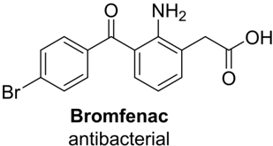

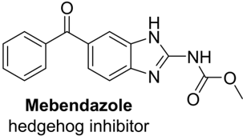

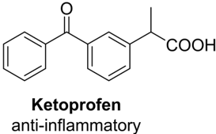

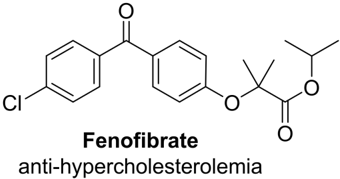

Scheme 1. Drugs containing benzophenone structure.

Transition-metal-catalyzed decarboxylative coupling is an attractive synthetic method for C-C bond formation since it does not require the use of stoichiometric organometallic coupling reagents and forms CO2 as a byproduct instead of toxic metal compounds [2]. In 2008, a general study was first reported on the synthesis of non-symmetrical ketones from α -oxocarboxylates and aryl bromides (Figure 1a) [3]. Since then, various scientists have conducted extensive investigations in this area [4-6]. In 2010, Ge first reported a room-temperature, decarboxylative ortho-acylation of acetanilides with α -keto acids via

/gid00001

Citation: Wang, C.; Yang, S.; Huang, Z.; Zhao, Y. A Palladium-Catalyzed 4CzIPN-Mediated Decarboxylative Acylation Reaction of O-Methyl Ketoximes with α -Keto Acids under Visible Light. Molecules 2022 , 27 , 1980. https://doi.org/10.3390/ molecules27061980

Academic Editor: Haibo Ge

Received: 20 February 2022

Accepted: 14 March 2022

Published: 18 March 2022

Publisher's Note: MDPI stays neutral with regard to jurisdictional claims in published maps and institutional affiliations.

Copyright: © 2022 by the authors. Licensee MDPI, Basel, Switzerland. This article is an open access article distributed under the terms and conditions of the Creative Commons Attribution (CC BY) license (https:// creativecommons.org/licenses/by/ 4.0/).

palladium-catalyzed C-H activation [7]. Subsequently, the ortho-acylation of various substrates with α -keto acids via metal-catalyzed C-H activation was developed [8-11]. However, it has been found that the above methods often require the use of excessive persulfate oxidizer or silver salt to promote the decarboxylation of α -keto acids, which limits their further synthetic application. Herein, a palladium-catalyzed oxime ether-directed ortho-benzoylation reaction under light conditions with 4CzIPN as the photocatalyst and benzoylformic acid as the acyl source is reported, with O2 as the only oxidant. A wide variety of non-symmetric benzophenone compounds can be easily obtained with moderate to good yields by this route.

(a) Pd/Cu-catalyzed decarboxylative cross-coupling

Figure 1. Decarboxylative cross-coupling reactions in the literature and this work. FG: functional group.

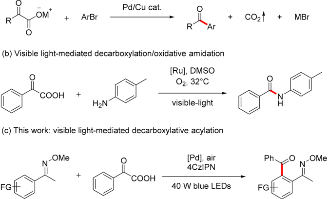

In 2014, Lei and co-workers developed a cross-coupling reaction of benzoylformic acid and aniline in the presence of a photocatalyst, oxygen atmosphere and light (Figure 1b) [12]. The mechanism studies revealed that the reaction proceeded through a benzoyl radical intermediate. Inspired by these results, it was speculated that the indispensable oxidants such as excessive persulfate or silver salts may be replaced by using a photocatalyst with light, which would open a new, highly efficient pathway for decarboxylative reactions. Recently, our group presented several examples of oxime ether-directed selective C-H functionalization [13-15]. It is envisioned that when acetophenone oxime ether is employed as the substrate and benzoylformic acid as the source of benzoyl, the use of a photocatalyst under light may achieve direct ortho-selective benzoylation with a palladium catalyst.

## 2. Results and Discussion

## 2.1. Optimization of the Reaction Conditions

With these conditions in mind, acetophenone oxime ether ( 1a ) was first treated with benzoylformic acid ( 2a ) using Pd(OAc)2 (10 mol%) and Eosin Y (2 mol%) as the catalysts and PhCl (0.2 M) as the solvent at r.t. under the irradiation of 40-watt blue LEDs for 18 h (Table 1, entry 1). Fortunately, the ortho-benzoylated acetophenone oxime ether 3a was obtained in 55% yield. Then, other palladium catalysts were tested, such as Pd(TFA)2 and PdCl2 (Table 1, entries 2-3), but failed to achieve better results. Next, photocatalysts such as fac-Ir(ppy)3, Rose Bengal and 4CzIPN (2,4,5,6-tetra(9H-carbazol-9-yl)isophthalonitrile) were screened (Table 1, entries 4-6). The photocatalyst 4CzIPN greatly improved the transformation, leading to the desired product 3a in 70% yield. To further improve the efficiency of this reaction, several solvents, including CH3CN, DCE and acetic acid, were

tested (Table 1, entries 7-9). An isolated yield of 77% was achieved with acetic acid as the solvent. When 3 equiv. of benzoylformic acid was used, a satisfactory yield of 3a was observed (Table 1, entry 10). Several control experiments were carried out (Table 1, entries 11-14), and the results clearly showed that Pd(OAc)2 and light were both indispensable for this reaction. Interestingly, when the photocatalyst was removed from the reaction, 3a was also obtained with a yield of 30%, which suggested that the photocatalyst only promoted the generation of benzoyl radicals.

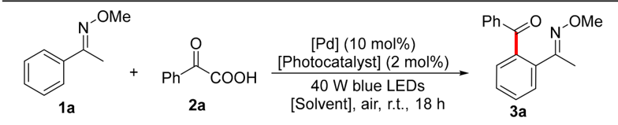

Table 1. Optimization of the reaction conditions.

| Entry   | [Pd]      | [Photocatalyst]   | [Solvent]   | Yield (%)   |
|---------|-----------|-------------------|-------------|-------------|
| 1       | Pd(OAc) 2 | Eosin Y           | PhCl        | 55          |
| 2       | Pd(TFA) 2 | Eosin Y           | PhCl        | 46          |
| 3       | PdCl 2    | Eosin Y           | PhCl        | <5          |
| 4       | Pd(OAc) 2 | fac -Ir(ppy) 3    | PhCl        | 20          |
| 5       | Pd(OAc) 2 | Rose Bengal       | PhCl        | 45          |
| 6       | Pd(OAc) 2 | 4CzIPN            | PhCl        | 70          |
| 7       | Pd(OAc) 2 | 4CzIPN            | CH 3 CN     | <5          |
| 8       | Pd(OAc) 2 | 4CzIPN            | DCE         | 44          |
| 9       | Pd(OAc) 2 | 4CzIPN            | AcOH        | 77          |
| 10 a    | Pd(OAc) 2 | 4CzIPN            | AcOH        | 85          |
| 11 a    | -         | 4CzIPN            | AcOH        | 0           |
| 12 a    | Pd(OAc) 2 | -                 | AcOH        | 30          |
| 13 a,b  | Pd(OAc) 2 | 4CzIPN            | AcOH        | 0           |
| 14 a,c  | Pd(OAc) 2 | 4CzIPN            | AcOH        | 10          |

Reaction conditions: 1a (0.1 mmol), 2a (2 equiv.), [Pd] (10 mol%), [Photocatalyst] (2 mol%), [Solvent] 0.2 M, air, 18 h. Isolated yields are given. a 2a (3 equiv.), b dark, c N2.

## 2.2. Scope of Benzoylformic Acid

With the optimal conditions in hand, the applicability of benzoylformic acid substrates was investigated next (Scheme 2). Benzoylformic acids substituted at the para-position, such as fluorine, chlorine, bromine and methoxy, were well tolerated, yielding the corresponding products in good to excellent yields ( 3a -3e ). The meta-methoxy, fluoro and chloro benzoylformic acids also provided the target products ( 3f -3h ) in moderate yields. Ortho-methyl and bromo-substituted benzoylformic acids were both well compatible in this reaction, leading to the corresponding products 3i (60%) and 3j (21%), respectively. It was found that 3,4-(methylenedioxy)benzoyl formic acid was also suitable for this system, generating the corresponding product 3k with a yield of 47%. When the reaction was carried out with p-hydroxybenzoyl formic acid, the desired target product was not obtained.

Scheme 2. Scope of benzoylformic acid.

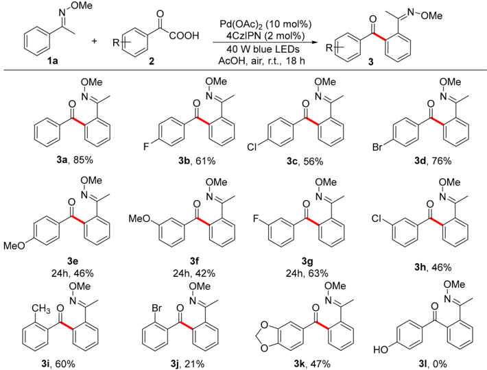

Reaction conditions: 1a (0.1 mmol), 2 (3 equiv.), Pd(OAc)2 (10 mol%), 4CzIPN (2 mol%), AcOH 0.2 M, air, 18 h. Isolated yields are given.

## 2.3. Scope of Acetophenone Oxime Ether

Next, the applicability of acetophenone oxime ether substrates was investigated under the optimal conditions (Scheme 3). For alkyl-substituted acetophenone oxime ethers such as methyl, ethyl, isopropyl, tert-butyl or methoxy derivatives, both para- and meta-substituents yielded the corresponding products in moderate to good yields ( 4a -4h ). Halogen-substituted acetophenone oxime ethers such as fluorine, chlorine and bromine derivatives also provided the target products ( 4i -4p ) in moderate yields. For the metafluorinated acetophenone oxime ether, a mixture of the C-2 benzoylated product 4o ′ and the C-6 benzoylated product 4o was obtained. However, the ortho-fluorinated acetophenone oxime ether did not yield the target product under the standard conditions. When the reaction temperature was increased to 60 ◦ C, the target product 4m was obtained with an isolated yield of 23%. For the para-trifluoromethyl-substituted acetophenone oxime ether, the target product 4p was obtained in 25% yield when the reaction temperature of the system was r.t. and the reaction time was extended to 24 h. When the temperature was increased to 60 ◦ C, the product 4p was obtained with a yield of 40%. In addition, 1-tetralone oxime ether was also found to be suitable for this reaction, and the corresponding product 4q was obtained with a yield of 59%. The chroman-4-one oxime ether also delivered the target product 4r with an isolated yield of 71%. Benzophenone oxime ether was also compatible with this reaction, and the target product 4s was obtained with an isolated yield of 70%, which undoubtedly expanded the substrate scope. For 4,4 ′ -disubstituted benzophenone oxime ethers with methyl, methoxy and fluorine substituents, the corresponding products ( 4t -4v ) were obtained in moderate isolated yields. Derivatives of ketoprofen, a drug with anti-inflammatory and analgesic effects, were also successfully applied to this reaction, and a mixture of 4w and 4w ′ was obtained with a combined yield of 58% ( 4w : 4w ′ = 1.075:1).

Scheme 3. Scope of acetophenone oxime ether.

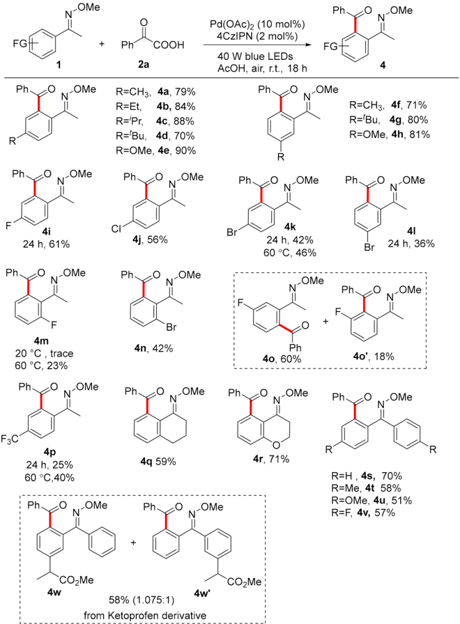

Reaction conditions: 1 (0.1 mmol), 2a (3 equiv.), Pd(OAc)2 (10 mol%), 4CzIPN (2 mol%), AcOH 0.2M, air, 18 h. Isolated yields are given.

## 2.4. Gram-Scale Reaction and Further Transformation

To further test the application value of this route, a gram-scale reaction was carried out for 48 h, and the product 3a was isolated in 72% yield (Scheme 4). Then, 3a and 4s were chosen as representative examples to remove the directing group, and the corresponding derivatives 5 and 6 were isolated with 69% and 89% yield, respectively. Notably, the products 5 and 6 were easily transformed into phthalazine derivatives 7 and 8 in 91% and 96% yields by reaction with hydrazine hydrate. Then, 5 was treated with sodium hydroxide in water and the product 9 was obtained with an isolated yield of 71%.

Scheme 4. Gram-scale reaction and further transformation.

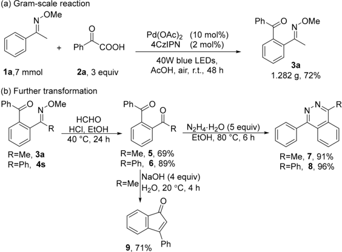

## 2.5. Preliminary Mechanistic Study

Next, several control experiments were carried out to further understand the reaction pathway of this transformation (Scheme 5). First, when the substrate 1a was treated under standard conditions with 3 equiv. of 2,2,6,6-tetramethylpiperidine N-oxide (TEMPO), almost no 3a was detected, but product 10 was obtained with a yield of 19% (Scheme 5a). When 2a was directly treated with 4CzIPN in the presence of 2 equiv. of TEMPO in AcOH under the irradiation of 40-watt blue LEDs, the final isolated yield of 10 was 58% (Scheme 5b). Then, a kinetic isotope effect (KIE) experiment was conducted using pmethylacetophenone oxime ether 1b and 2,3,5,6-tetradeutero-p-trideuterium methyl acetophenone oxime ether 1b ′ as the substrates under optimal conditions. After treatment, a mixture of the products 4a and 4a ′ was obtained (Scheme 5c). The KH/KD = 2.26, which indicated that C-H bond cleavage was the rate-determining step of the reaction.

Scheme 5. Preliminary mechanistic study.

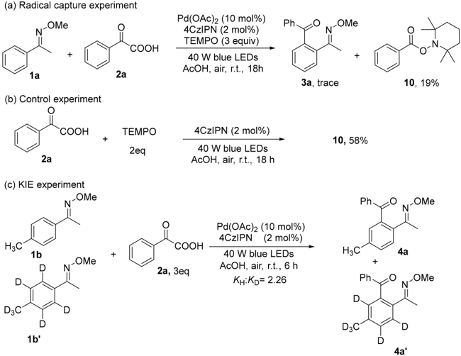

Thus, a possible reaction route was proposed based on the existing literature [16-18] and the aforementioned experimental results (Scheme 6). At first, 4CzIPN was promoted to its excited state (4CzIPN)* under visible light irradiation. The (4CzIPN)* oxidized benzoylformic acid into free radical cations and was simultaneously reduced to (4CzIPN) ·-. Subsequently, electron transfer from (4CzIPN) ·-by molecular oxygen regenerated 4CzIPN for the next run and produced a superoxide radical anion (O2 ·-), which was confirmed by electron spin resonance (ESR; see Figure 2). At the same time, palladium acetate activated the ortho C-H bond of the acetophenone oxime ether to obtain the five-membered ring palladium complex I , followed by the addition of I and benzoyl radicals to obtain the intermediate II . The superoxide radical anion oxidized II to Pd (IV) intermediate III ; then, III was eliminated by reduction to obtain the target product ortho-benzoylated acetophenone oxime ether and palladium acetate to complete the catalytic cycle.

Scheme 6. Plausible reaction mechanism.

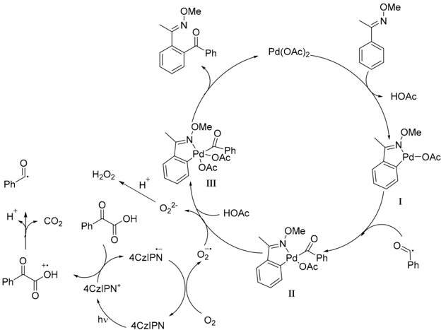

Figure 2. ESR spectra of air-saturated chlorobenzene solution of 2a (1.0 × 10 -3 M), 4CzIPN (2.0 × 10 -5 M) and DMPO (2.0 × 10 -2 M). (a) Without blue LED irradiation; (b) under blue LED irradiation for 60 s. ESR setting parameters (cf: 326.000; st: 30; rmfirst fq: 100.00; md: 0.3 × 0.1; am: 8.00 × 100; tc: 0.03; uF: 9150.577000 MHz; uP: 0.99800 mW; accumu = 3).

## 3. Materials and Methods

## 3.1. General Information

Unless otherwise noted, all reagents were purchased from Acros, Alfa and Adamas and used without further purification. Column chromatography purifications were performed using 200-300 mesh silica gel. NMR spectra were recorded on Varian Inova-400 MHz, Inova-300 MHz, Bruker DRX-400 or Bruker DRX-500 instruments and calibrated using residual solvent peaks as internal references. All heating reactions were conducted in an oil bath. Multiplicities are recorded as follows: s = singlet, d = doublet, t = triplet, dd = doublet of doublets, m = multiplet. HRMS analyses were carried out using a TOF-MS instrument with an EI source. ESR: JES-X320 electron spin resonance spectrometer.

## 3.2. Procedure for Preparation of 2b -2l

Aflame-dried pressure tube was charged with the specified acetophenone (4.0 mmol, 1.0 equiv.) and selenium dioxide (0.89 g, 8.0 mmol, 2.0 equiv.). Dry pyridine (5 mL) was added, the tube was sealed, and the reaction mixture was heated at 110 ◦ C for 18 h. Afterwards, the reaction was cooled to room temperature and filtered. The filtrate was acidified with 1 M HCl solution and extracted three times with EtOAc. Subsequently, the combined organic layers were extracted three times with 1 M NaOH solution. The combined aqueous layers were acidified with conc. HCl and extracted three times with EtOAc. The combined organic layers were dried over Na2SO4 and concentrated in vacuo. Purification by column chromatography yielded the products 2b -2l . The characterization results are consistent with the references [19] (Please see Supplementary Materials).

## 3.3. Preparation of O-Methyl Ketoximes 1a -1w

To a solution of ketones (22.0 mmol) and pyridine (5.0 mL, 61.8 mmol) in EtOH (10 mL), NH2OMe · HCl (2.29 g, 33.0 mmol) was added in one portion, and the reaction mixture was stirred at 60 ◦ C for 6 h. The reaction was quenched by adding water and extracted twice with ethyl acetate. The combined extracts were washed with aqueous HCl and brine and dried over MgSO4. The solvents were removed under reduced pressure. Further recrystallization was conducted from ethyl acetate-hexane to provide O-methyl ketoximes [14].

## 3.4. General Procedures for Ortho-Benzoylation of Acetophenone Oxime Ether

Ketoxime ether ( 1 , 0.10 mmol), aroylformic acid ( 2 , 0.30 mmol), Pd(OAc)2 (10 mol%), 4CzIPN (2 mol%) and AcOH (0.2 M) were added to an oven-dried reaction vessel equipped with a magnetic stirring bar, and the reaction vessel was irradiated using 40 W blue LEDs at r.t. for 18 h. After the reaction was completed, the reaction solution was concentrated under reduced pressure to yield crude product 3 , which was purified by flash chromatography (silica gel, petroleum ether/ethyl acetate).

## 3.5. Gram-Scale Reaction

Acetophenone oxime ether ( 1a , 7 mmol), benzoylformic acid ( 2a , 21 mmol), Pd(OAc)2 (10 mol%), 4CzIPN (2 mol%) and AcOH (0.2 M) were added to an oven-dried reaction vessel equipped with a magnetic stirring bar, and the reaction vessel was irradiated using 40 W blue LEDs at r.t. for 48 h. After the reaction was completed, the reaction solution was concentrated under reduced pressure to yield crude product 3a , which was purified by flash chromatography (silica gel, petroleum ether/ethyl acetate = 50:1).

## 3.6. Further Transformation

A 15-milliliter vial equipped with a magnetic stirrer was charged with 3a (or 4s ) (0.2 mmol) and EtOH (1 mL). Then, 37 wt.% formaldehyde solution (1 mL) and concentrated hydrochloric acid (160 µ L) were added, and the mixture was stirred and heated at 40 ◦ C for 24 h. The reaction was diluted with ethyl acetate. The mixture was concentrated under

reduced pressure and then purified by flash column chromatography to give product 5 (or 6 ) [20].

To the solution of the 1,2-diacylbenzenes ( 5 or 6 ) (0.2 mmol) in ethanol (2 mL) was added hydrazine hydrate (1 mmol), and the resulting mixture was heated at reflux for 6 h under nitrogen. After cooling to room temperature, ethanol was removed under vacuum to give the crude product, which was purified by silica gel column chromatography (ethyl acetate, hexane and methanol) to give the phthalazines ( 7 or 8 ) [21].

To the solution of the 1-(2-benzoylphenyl)ethan-1-one 5 (0.2 mmol) in H2O (1 mL) was added sodium hydroxide (1 mmol), and the resulting mixture was heated at 20 ◦ C for 6 h. The reaction was diluted with ethyl acetate. The mixture was concentrated under reduced pressure and then purified by flash column chromatography to give product 9 [22].

## 3.7. Radical Capture Experiment

Acetophenone oxime ether ( 1a , 0.1 mmol), benzoylformic acid ( 2a , 0.3 mmol), Pd(OAc)2 (10 mol%), 4CzIPN (2 mol%), 2,2,6,6-tetramethyl-1-piperinedinyloxy (0.3 mmol) and AcOH (0.2 M) were added to an oven-dried reaction vessel equipped with a magnetic stirring bar, and the reaction vessel was irradiated using 40W blue LEDs at r.t. for 18 h. After the reaction was completed, the reaction solution was concentrated under reduced pressure to yield crude product 10 , which was purified by flash chromatography (silica gel, petroleum ether/ethyl acetate = 30:1).

## 3.8. Experimental Procedure of Kinetic Isotope Effect

Pd(OAc)2 (0.01 mmol, 2.3 mg), 4CzIPN (0.002 mmol, 1.6 mg), 1b (0.1 mmol,) 1b ′ (0.1 mmol), benzoylformic acid (0.3 mmol) and acetic acid (0.5 mL) were added in sequence to a 5-milliliter glass reaction flask with a magnetic stir bar, and the reaction flask was irradiated under 40 W blue LEDs and stirred at r.t. for 6 h. After the reaction, the reaction solution was diluted with ethyl acetate and filtered through Celite. The filtrate was concentrated in vacuo and purified by silica gel column chromatography to obtain the target products 4a and 4a ′ . According to the 1H NMR results, we calculated KH:KD = 2.26 (2.08 ÷ (3 -2.08) = 2.26).

## 3.9. Determination of Superoxide Radical Anion

Asuperoxide radical anion (O2 ·-) was generated from molecular oxygen by single electron transfer (SET) [23]. We used 5,5-dimethyl-1-pyrroline-N-oxide (DMPO) as a probe to capture the active species O2 ·-[24]. As shown in Figure 2, when the solution of DMPO, 2a and 4CzIPN was in chlorobenzene solution without irradiation, no signal was detected. In contrast, when the same solution was irradiated with blue LEDs, the signal showing that O2 ·-was trapped by DMPO was observed.

## 4. Conclusions

In summary, a dual catalytic system for the ortho-acylation of acetophenone oxime ether was developed herein, and various non-symmetric benzophenone derivatives were obtained in moderate to good yields. The use of a catalytic amount of the photoredox catalyst under the irradiation of blue LEDs avoided the typical high loading of external oxidants. The preliminary mechanistic analysis revealed that the ortho-acylation reaction proceeded via a free radical pathway, and the photoredox catalyst played an important role in the decarboxylation reaction. Further investigations on the combination of photoredox catalysts with transition metal catalysts for other organic transformations are currently underway in our lab.

Supplementary Materials: The following supporting information can be downloaded at: https: //www.mdpi.com/article/10.3390/molecules27061980/s1, Synthetic procedure of starting materials, procedure and spectral data of products, copies of 1 H-NMR, 13 C-NMR spectra.

## References

1. Rahimipour, S.; Palivan, C.; Barbosa, F.; Bilkis, I.; Koch, Y.; Weiner, L.; Fridkin, M.; Mazur, Y.; Gescheidt, G. Chemical and photochemical electron transfer of new helianthrone derivatives: Aspects of their photodynamic activity. J. Am. Chem. Soc. 2003 , 125 , 1376-1384. [CrossRef] [PubMed]
2. Goossen, L.J.; Rodriguez, N.; Goossen, K. Carboxylic acids as substrates in homogeneous catalysis. Angew. Chem. Int. Ed. 2008 , 47 , 3100-3120. [CrossRef] [PubMed]
3. Goossen, L.J.; Rudolphi, F.; Oppel, C.; Rodriguez, N. Synthesis of ketones from α -oxocarboxylates and aryl bromides by Cu/Pd-catalyzed decarboxylative cross-coupling. Angew. Chem. Int. Ed. 2008 , 47 , 3043-3045. [CrossRef] [PubMed]
4. Cornella, J.; Lu, P.; Larrosa, I. Intermolecular decarboxylative direct C-3 arylation of indoles with benzoic acids. Org. Lett. 2009 , 11 , 5506-5509. [CrossRef]
5. Shang, R.; Xu, Q.; Jiang, Y.-Y.; Wang, Y.; Liu, L. Pd-catalyzed decarboxylative cross coupling of potassium polyfluorobenzoates with aryl bromides, chlorides, and triflates. Org. Lett. 2010 , 12 , 1000-1003. [CrossRef]
6. Fu, Z.; Li, Z.; Xiong, Q.; Cai, H. Palladium-Catalyzed Decarboxylative Methylthiolation of Aromatic Carboxylic Acids by Using DMSOas the Sulfurizing Reagent. Eur. J. Org. Chem. 2014 , 2014 , 7798-7802. [CrossRef]
7. Fang, P.; Li, M.; Ge, H. Room temperature palladium-catalyzed decarboxylative ortho-acylation of acetanilides with α -oxocarboxylic acids. J. Am. Chem. Soc. 2010 , 132 , 11898-11899. [CrossRef]
8. Sharma, S.; Khan, I.A.; Saxena, A.K. Room Temperature Palladium-Catalyzed Decarboxylative Acyl/Aroylation using [Fe(III)(EDTA)( η 2 -O2)] 3 -as Oxidant at Biological pH. Adv. Synth. Catal. 2013 , 355 , 673-678. [CrossRef]
9. Hossian, A.; Manna, M.K.; Manna, K.; Jana, R. Palladium-catalyzed decarboxylative, decarbonylative and dehydrogenative C(sp(2))-H acylation at room temperature. Org. Biomol. Chem. 2017 , 15 , 6592-6603. [CrossRef]
10. Lee, P.Y.; Liang, P.; Yu, W.Y. Pd(II)-Catalyzed Direct ortho-C-H Acylation of Aromatic Ketones by Oxidative Decarboxylation of alpha-Oxocarboxylic Acids. Org. Lett. 2017 , 19 , 2082-2085. [CrossRef]
11. Bao, P.; Liu, F.; Lv, Y.; Yue, H.; Li, J.-S.; Wei, W. Visible-light-promoted acridine red catalyzed aerobic oxidative decarboxylative acylation of α -oxo-carboxylic acids with quinoxalin-2(1H)-ones. Org. Chem. Front. 2020 , 7 , 492-498. [CrossRef]
12. Liu, J.; Liu, Q.; Yi, H.; Qin, C.; Bai, R.; Qi, X.; Lan, Y.; Lei, A. Visible-light-mediated decarboxylation/oxidative amidation of alpha-keto acids with amines under mild reaction conditions using O(2). Angew. Chem. Int. Ed. 2014 , 53 , 502-506. [CrossRef] [PubMed]
13. Yuan, C.; Zhu, L.; Zeng, R.; Lan, Y.; Zhao, Y. Ruthenium(II)-Catalyzed C-H Difluoromethylation of Ketoximes: Tuning the Regioselectivity from the meta to the para Position. Angew. Chem. Int. Ed. 2018 , 57 , 1277-1281. [CrossRef] [PubMed]
14. Wang, N.; Liu, L.; Xu, W.; Zhang, M.; Huang, Z.; Shi, D.; Zhao, Y. Rhodium(III)-Catalyzed Oxidative Annulation of Ketoximes with Sulfonamide: A Direct Approach to Indazoles. Org. Lett. 2019 , 21 , 365-368. [CrossRef]
15. Liu, L.; Wang, N.; Dai, C.; Han, Y.; Yang, S.; Huang, Z.; Zhao, Y. Rh(III)-Catalyzed Direct Amination of Aromatic Ketoximes Enabled by Potassium Acetate. Eur. J. Org. Chem. 2019 , 2019 , 7857-7863. [CrossRef]
16. Zhou, C.; Li, P.; Zhu, X.; Wang, L. Merging Photoredox with Palladium Catalysis: Decarboxylative ortho-Acylation of Acetanilides with alpha-Oxocarboxylic Acids under Mild Reaction Conditions. Org. Lett. 2015 , 17 , 6198-6201. [CrossRef]
17. Xu, N.; Li, P.; Xie, Z.; Wang, L. Merging Visible-Light Photocatalysis and Palladium Catalysis for C-H Acylation of Azo- and Azoxybenzenes with alpha-Keto Acids. Chem. Eur. J. 2016 , 22 , 2236-2242. [CrossRef]

Author Contributions: Conceptualization, C.W., S.Y. and Y.Z.; data curation, C.W., S.Y. and Z.H.; methodology, C.W. and S.Y.; supervision, Z.H. and Y.Z.; validation, Z.H.; writing-original draft, Y.Z.; writing-review and editing, Y.Z. All authors have read and agreed to the published version of the manuscript.

Funding: This work was supported by the Natural Science Foundation of China (nos. 21772139 and 22171197), the Major Basic Research Project of the Natural Science Foundation of Jiangsu Higher Education Institutions (21KJA150002), the National local joint engineering laboratory to functional adsorption material technology for environmental protection (SDGC2121) and the PAPD Project. The project was also supported by the Open Research Fund of the School of Chemistry and Chemical Engineering, Henan Normal University.

Institutional Review Board Statement: Not applicable.

Informed Consent Statement:

Not applicable.

Data Availability Statement: The data presented in this study are available on request from the corresponding author.

Conflicts of Interest: The authors declare no conflict of interest.

Sample Availability: Not available.

18. Shi, Q.; Li, P.; Zhu, X.; Wang, L. Decarboxylative/decarbonylative C3-acylation of indoles via photocatalysis: A simple and efficient route to 3-acylindoles. Green Chem. 2016 , 18 , 4916-4923. [CrossRef]
19. Morack, T.; Muck-Lichtenfeld, C.; Gilmour, R. Bioinspired Radical Stetter Reaction: Radical Umpolung Enabled by Ion-Pair Photocatalysis. Angew. Chem. Int. Ed. 2019 , 58 , 1208-1212. [CrossRef]
20. Li, Z.Y.; Wang, G.W. Palladium-Catalyzed Decarboxylative Ortho-Ethoxycarbonylation of O-Methyl Ketoximes and 2-Arylpyridines with Potassium Oxalate Monoester. Org. Lett. 2015 , 17 , 4866-4869. [CrossRef]
21. Harikrishna, K.; Mukkamala, R.; Hinkelmann, B.; Sasse, F.; Aidhen, I.S. Iodine-Promoted Oxidative Conversion ofo-Vinyl Diaryl Ketones intoo-Acetyl Diaryl Ketones, Synthesis of 1-Methyl-4-arylphthalazines as Analogues of Podophyllotoxin. Eur. J. Org. Chem. 2014 , 2014 , 1066-1075. [CrossRef]
22. Chanda, T.; Chowdhury, S.; Ramulu, B.J.; Koley, S.; Jones, R.C.F.; Singh, M.S. Regioselective quadruple domino aldolization/aldol condensation/Michael/SNAr-cyclization: Construction of hexacyclic indeno-fused C-nor-D-homo-steroid frameworks. Tetrahedron 2014 , 70 , 2190-2194. [CrossRef]
23. Fabry, D.C.; Zoller, J.; Raja, S.; Rueping, M. Combining rhodium and photoredox catalysis for C-H functionalizations of arenes: Oxidative Heck reactions with visible light. Angew. Chem. Int. Ed. 2014 , 53 , 10228-10231. [CrossRef] [PubMed]
24. Gao, X.-W.; Meng, Q.-Y.; Xiang, M.; Chen, B.; Feng, K.; Tung, C.-H.; Wu, L.-Z. Combining Visible Light Catalysis and Transition Metal Catalysis for the Alkylation of Secondary Amines. Adv. Synth. Catal. 2013 , 355 , 2158-2164. [CrossRef]