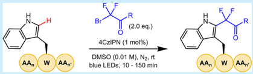
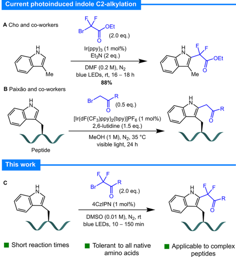
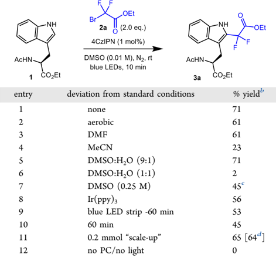
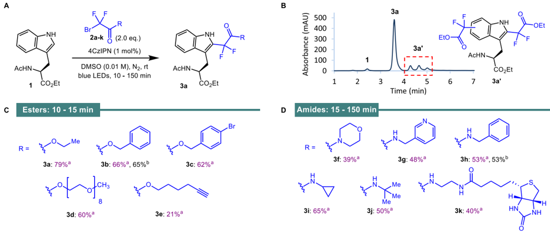
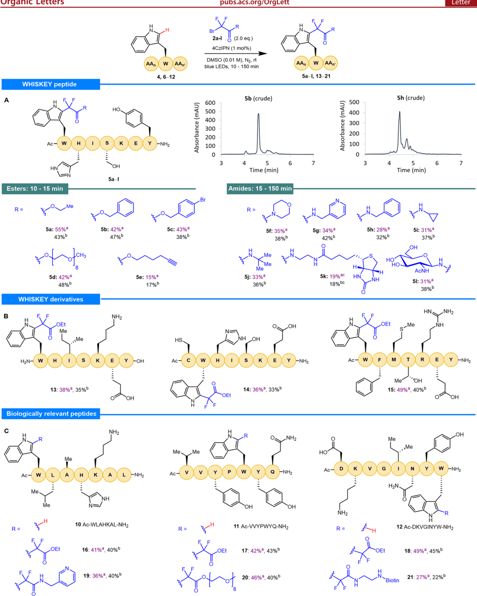

[pubs.acs.org/OrgLett](pubs.acs.org/OrgLett?ref=pdf)

## Chemoselective Late-Stage Functionalization of Peptides via Photocatalytic C2-Alkylation of Tryptophan

Published as part of the Organic Letters virtual special issue 'Chemoselective Methods for Labeling and Modification of Peptides and Proteins'.

Joanna C. Lee, James D. Cuthbertson, * and Nicholas J. Mitchell *

Cite This: Org. Lett.

## ACCESS

[2023, 25, 5459-5464](https://pubs.acs.org/action/showCitFormats?doi=10.1021/acs.orglett.3c01795&ref=pdf)

[Metrics &amp; More](https://pubs.acs.org/doi/10.1021/acs.orglett.3c01795?goto=articleMetrics&ref=pdf)

[Article Recommendations](https://pubs.acs.org/doi/10.1021/acs.orglett.3c01795?goto=recommendations&?ref=pdf)

ABSTRACT: Across eukaryotic proteomes, tryptophan is the least abundant of the 20 canonical amino acids, which makes it an ideal chemical handle for the late-stage functionalization of peptide and protein scaffolds with minimal production of undesired isoforms. Herein, we report the photocatalytic C2-alkylation of tryptophan using bromodifluoroacetate/ acetamide-derived radical precursors. This rapid visible-light-mediated reaction is additive-free, operationally simple, and tolerates diverse

[Supporting Information](https://pubs.acs.org/doi/10.1021/acs.orglett.3c01795?goto=supporting-info&ref=pdf)

functionality. We demonstrate the late-stage modification of a variety of complex peptides, including examples of biological significance.

C hemistry that targets the canonical amino acids enables the late-stage functionalization of peptides and the siteselective modification of proteins. 1 -3 Such techniques facilitate the installation of groups to modulate the activity and/or stability of polypeptide tools and therapeutics. 4 An extensive array of reactions has been developed to target the canonical amino acids. 5 The majority of these chemoselective methods focus on the amino acids lysine (Lys) 1 or cysteine (Cys) 6,7 due to the inherent nucleophilicity of their side chain functional groups. While reactions selective for alternative amino acids have been developed, many of these are less effective on (or cannot be applied to) complex peptides and proteins. 5

Key considerations when developing methods that target the canonical residues include the inherent reactivity of the side chain and relative proteinogenic abundance of the residue. A broad reactivity profile allows for the application of milder and more varied methods of functionalization, thereby facilitating the development of chemoselective chemistry that is likely to be effective on large and complex peptides and proteins. Techniques that target residues with higher natural abundance, such as Lys, often produce multiple isoforms, which can be challenging to separate from the desired product in larger polypeptide systems. Because of the inherent reactivity of its electron-rich indole side chain and its low natural abundance, tryptophan (Trp) is an ideal proteinogenic chemical handle. This residue accounts for just 1.1% of eukaryotic proteomes, 8 the lowest of the 20 canonical amino acids. Thus, the sequence of any given target protein is likely to have no more than one Trp residue. If the protein target does not contain this amino acid, then a non-native Trp mutant can be recombinantly expressed.

Previous efforts to target this residue draw on the wealth of indole chemistry reported in the literature. A significant amount of work has focused on transition metal (TM)catalyzed C -H activation of Trp, including rhodium, 9 -11 manganese, 12,13 and ruthenium 14,15 C2-alkylation; palladiumcatalyzed C2-arylation 16 -19 and peptide olefination; 20 goldcatalyzed C2-ethynylation; 21 and palladium/cobalt-catalyzed macrocyclization. 22 -24 Metal-free strategies toward C2-sulfenylation, 25 trifluoromethylation, 26,27 and arylation 28 have also been explored, as well as the modification of Trp using persistent radical traps. 29 Over the past decade, photocatalytic C -H functionalization has come to the forefront in this field. 30,31 Many of these methods have achieved greater success when applied to the functionalization of complex peptides and proteins compared with transition-metal-catalyzed approaches. Examples include alkylation at the C2 32 and β -positions of Trp. 33 More recently, electron donor -acceptor (EDA) pyridinium salts have been applied to great effect to target Trp in both peptides and proteins. 34 -36

In 2014, Cho et al. reported a method for the photocatalytic difluoroalkylation of aromatic and heteroaromatic compounds, which included two examples of indole C2-alkylation (Figure 1A). 37 Considering the success of photocatalytic methods in this field and the advantages of utilizing Trp as a chemical

Received:

June 1, 2023

Published:

July 18, 2023

Current photoinduced indole C2-alkylation

B Paixão and co-workers

Peptide

This work

· Short reaction times

Figure 1. Selected photocatalytic methods for C2-alkylation of indole/tryptophan.

̃

handle, we reasoned that photocatalytic C2-alkylation could potentially be leveraged as an effective peptide modification strategy. During the course of our studies, Paixa o and coworkers reported a similar photocatalytic method for Trp C2alkylation using α -bromo carbonyl compounds (Figure 1B). 38 However, despite the utility of Paixa o et al.'s method, their chemistry relies on a precious metal photocatalyst and requires extended reaction times (24 h), as well as an additive (2,6lutidine). In order to broaden the scope and extend the applications of Trp C2-alkylation as a bioconjugation strategy, we sought to develop a method that overcomes these limitations. Herein, we report the development of a mild and operationally simple strategy using electron-deficient radicals 39 for the late-stage alkylation of Trp-containing biomolecules that achieves these goals (Figure 1C). The reaction tolerates diverse functionalities and can be applied to complex peptides. Furthermore, the incorporation of a difluoroalkyl moiety enables the modulation of key physicochemical properties that impact the pharmacokinetics of the molecule and allows the progression and conversion of the reaction to be accurately quantified by 19 F NMR spectroscopy.

̃

We initially chose to explore the radical functionalization of amino acid Ac-Trp-OEt ( 1 ) using ethyl bromodifluoroacetate ( 2a ) as the radical precursor; irradiation was achieved using a PhotoRedOx Box (Hepatochem) equipped with a 34 mW cm -2 LED 450 nm bulb. Reactions run under the conditions reported by the Cho group {0.25 M in DMF, 1 mol % fac -[Ir(ppy)3], 2 equiv of TEA, blue LEDs 37 } afforded 30% yield by 19 F NMR over a 17 h period. Following optimization, we identified suitable conditions using the organic photocatalyst 4CzIPN [1,2,3,5-tetrakis(carbazol-9-yl)-4,6-dicyanobenzene 2,4,5,6-tetrakis(9 H -carbazol-9-yl) isophthalonitrile] 40 in DMSO (Table 1, entry 1). Pleasingly, under these conditions, near-complete consumption of starting amino acid 1 was observed (via analytical HPLC) within 10 min. The product

## Table 1. Optimization Studies and Control Reactions a

|   entry | deviation from standard conditions   | % yield b   |
|---------|--------------------------------------|-------------|
|       1 | none                                 | 71          |
|       2 | aerobic                              | 61          |
|       3 | DMF                                  | 61          |
|       4 | MeCN                                 | 23          |
|       5 | DMSO:H 2 O (9:1)                     | 71          |
|       6 | DMSO:H 2 O (1:1)                     | 2           |
|       7 | DMSO (0.25 M)                        | 45 c        |
|       8 | Ir(ppy) 3                            | 56          |
|       9 | blue LED strip -60 min               | 53          |
|      10 | 60 min                               | 45          |
|      11 | 0.2 mmol 'scale-up'                  | 65 [64 d ]  |
|      12 | no PC/no light                       | 0           |

a Reactions performed under a nitrogen atmosphere on a 60.0 μ mol scale. b Yield of product 3a determined by 19 F NMR spectroscopy using α , α , α -trifluorotoluene as the internal standard. c 60 min, 120 μ mol scale. d Isolated yield.

was obtained in 71% yield, as determined by 19 F NMR spectroscopy. Interestingly, stirring was found to have no impact on the reaction and, in some early studies, even resulted in reduced yields because of the formation of a greater proportion of side products; thus, all further reactions were carried out without agitation. Running the reaction under an atmosphere of air gave similar results to an inert atmosphere, highlighting the robustness of the chemistry (Table 1, entry 2). However, to avoid undesired oxidation of residues, such as Cys and methionine (Met), in more complex starting materials, an inert atmosphere was preferred. The reaction was observed to proceed similarly when run in DMF (Table 1, entry 3); however, running the reaction in MeCN severely affected the conversion, with a significant proportion of starting material 1 left unreacted after 10 min (Table 1, entry 4). The reaction tolerates an organic/aqueous solvent mixture up to 10% aqueous (Table 1, entry 5). However, increasing the amount of water further (50% aqueous DMSO) resulted in minimal product formation (Table 1, entry 6). Increasing the concentration of the reaction from 0.01 to 0.25 M reduced the yield to 8% after 10 min and 45% after 60 min with approximately 1 equiv. of 2a left unreacted (Table 1, entry 7). Switching to an iridium(III) photocatalyst [Ir(ppy)3] decreased the yield of the reaction (Table 1, entry 8). The use of inexpensive, lower intensity blue LED strips in place of the PhotoRedOx Box resulted in a lower yield and an increase in reaction time (Table 1, entry 9). Leaving the reaction for longer durations (60 min) resulted in a lower yield because of the formation of undesired side products (overalkylation of the indole ring, Table 1, entry 10). Scale-up of the reaction from 60 μ mol of amino acid 1 to 0.2 mmol had a negligible effect on the yield of product 3a (Table 1, entry 11). Following isolation and purification by flash chromatography, the desired product was obtained in a yield that was comparable with the yield determined spectroscopically. Finally, it was confirmed that the

Figure 2. Photochemical alkylation of Ac-Trp-OEt 1 . (A) Reactions performed on a 20.0 μ mol scale. a Yields were determined by 19 F NMR spectroscopy using α , α , α -trifluorotoluene as the internal standard. b Isolated yield was on a 200 μ mol scale. (B) Analytical HPLC chromatogram of the crude reaction mixture for the photochemical alkylation of Ac-Trp-OEt 1 using probe 2a (40 -80% gradient over 5 min). (C) Ester series of products produced using standard conditions. (D) Amide series of products produced using standard conditions.

reaction does not proceed in the absence of photocatalyst or light (Table 1, entry 12).

With optimized conditions in hand, we sought to explore the scope of the alkylating agent 2 . Several bromodifluoroacetates ( 2b -e ) and bromodifluoroacetamides ( 2f -l ) carrying a range of sterically and electronically different groups, including aliphatic, aromatic, cyclic, and heterocyclic moieties, were prepared [Figure 2, see the Supporting Information (SI) for experimental details]. Radical precursors bearing functionality applicable within the context of chemical biology, such as a PEG chain, an alkyne, a biotin reporter tag, and a sugar moiety, were included in this series. Applying the standard conditions developed for bromide 2a , we repeated the reaction using these compounds to alkylate amino acid 1 (Figure 2A). The 'esterseries' of radical precursors ( 2a -d ) gave the product in yields ranging from 60 to 79% ( 3a -d ), as determined by 19 F NMR spectroscopy. Reaction monitoring via analytical HPLC indicated that the reactions were very close to completion within 10 -15 min for this series. Past this time point range, further undesired overalkylation of the indole was observed, which resulted in lower yields (Figure 2B). Notably, the reaction using radical precursor 2e bearing an alkyne group gave a lower yield (21%), even after extended reaction times, which was attributed to undesired radical addition to the alkyne. The ' amide series ' of radical precursors gave yields from 39 to 65% as determined by 19 F NMR spectroscopy ( 3f -k ). Reaction monitoring indicated that the reactions were complete within 15 -150 min. The reactions with benzyl derivatives 2b and 2h were repeated on a larger scale (0.2 mmol) to enable isolation and full characterization of the products. Both 3b and 3h were isolated in the same yields as those determined by 19 F NMR spectroscopy for the smallerscale reactions.

Having investigated how the steric and electronic properties of alkylating agent 2 govern reactivity, we progressed on to an assessment of our strategy on complex peptides. The sequence Ac-WHISKEY-NH2 4 was synthesized via Fmoc-SPPS (solidphase peptide synthesis). Carrying the majority of proteinogenic chemical functionality displayed across the proteome, this model enables a thorough interrogation of the tolerance and chemoselectivity of our reaction (Figure 3). The standard conditions optimized for Ac-Trp-OEt ( 1 ) were applied to peptide 4 (5 μ mol) using radical precursor 2a . HPLC analysis revealed that the reaction was complete within 10 min; product 5a was obtained in 55% yield, as determined by quantitative 19 F NMR spectroscopy. Following purification by preparative RP-HPLC, the product was isolated in 43% yield. Characterization of the product by 1 H NMR spectroscopy confirmed selective functionalization of Trp, as evidenced by the disappearance of the C2 proton signal.

The reaction was repeated with the remaining ester-derived radical precursors ( 2b -d ) affording yields in the range 42 -43% ( 5b -d ) with comparable isolated yields. The hexyne radical precursor ( 2e ) again gave a lower yield ( 5e ) with a comparable isolated yield (17%). The amide series ( 2f -l ), including the N -acetylglucosamine (Glc N Ac) radical precursor acetamide, 2l , employed to explore C2-glycosylation, afforded yields in the range 19 -35% ( 5f -l ), with the isolated yields mirroring the yields determined spectroscopically. Analysis of the crude reaction mixtures for the amide series showed the generation of a greater proportion of alkylated side-products compared with the ester series compounds (Figure 3A). However, by monitoring the reaction (HPLC) and controlling the end point, overalkylation of the indole could be minimized. While these yields are lower than those acquired for the functionalization of Ac-Trp-OEt ( 1 ), they do demonstrate rapid and chemoselective alkylation of Trp on a complex polypeptide. Importantly, when the substrate Ac-HISKEY-NH2 6 (with the Trp residue omitted) was exposed to the reaction conditions, no undesired modification of the alternative amino acids was observed.

Encouraged by these results, we prepared model peptides 7 -9 to probe the reaction in the presence of a free N-terminus and carboxy C-terminus ( 7 ; H-WHISKEY-OH), a Cys residue ( 8 ; Ac-CWHISKEY-NH2), and additional canonical amino acids with untested reactive functionality ( 9 ; Ac-WFMTREYNH2). The reaction of these models with radical precursor 2a was undertaken, and yields similar to those observed for peptide 4 were confirmed ( 13 -15 ; Figure 3B). In all cases these translated into comparable isolated yields. In addition to

[WHISKEY peptide](https://pubs.acs.org/doi/10.1021/acs.orglett.3c01795?fig=fig3&ref=pdf)

Esters: 10 - 15 min

R=

[WHISKEY derivatives](https://pubs.acs.org/doi/10.1021/acs.orglett.3c01795?fig=fig3&ref=pdf)

H2N-

[Biologically relevant peptides](https://pubs.acs.org/doi/10.1021/acs.orglett.3c01795?fig=fig3&ref=pdf)

Ac-

Me.

R=

2a-l

(2.0 eq.)

4CzIPN (1 mol%)

Figure 3. (A -C) Photochemical chemoselective alkylation of Trp-containing peptides ( 4, 6 -12 ); reactions performed on a 5.00 μ mol scale. a Yields determined by 19 F NMR spectroscopy using α , α , α -trifluorotoluene as the internal standard. b Isolated yields. c 4CzIPN (5 mol %), bromodifluoroacetamide 2k (1.5 equiv).

these models, peptides 10 -12 were synthesized as biologically relevant examples (Figure 3C). Peptide 10 is a dipeptidyl peptidase-4 (DPP-4) inhibitor, and peptides 11 and 12 are angiotensin converting enzyme (ACE) inhibitors. Further-

more, the lone Trp residue in these models is located at different positions in each sequence: N-terminus ( 10 ), internal ( 11 ), and C-terminus ( 12 ), thereby enabling assessment of the effect that the positioning of the Trp residue has on conversion to the product. The reaction of radical precursor 2a with these sequences under standard conditions gave yields comparable with those of reactions using model peptide 4 ( 16 -18 ; Figure 3C). These results suggest that the positioning and local steric and electronic environment surrounding the Trp residue have a negligible effect on the formation of the desired product. Alkylation of the biologically relevant peptides 10 -12 with radical precursor 2g , and the more chemically diverse peptides 2d and 2k , respectively, was also demonstrated on these models ( 19 -21 ; Figure 3C). Pleasingly, the yields were broadly consistent with those achieved using model peptide 4 . The consistency of the yields across the peptide models illustrates the tolerance of this reaction to all proteinogenic functionality.

In conclusion, we have developed a rapid, functional-grouptolerant, and operationally simple photocatalytic difluoroalkylation reaction that enables the chemoselective functionalization of Trp residues in complex peptides. For the majority of the radical precursors explored, the reactions are complete within minutes, regardless of the position of the target residue. The precursors can be readily synthesized using simple, established chemistry, which enables diverse functionality to be introduced into valuable peptide targets at a late stage.

## ■ ASSOCIATED CONTENT

## Data Availability Statement

The data underlying this study are available in the published article and its Supporting Information.

## * sı Supporting Information

The Supporting Information is available free of charge at https://pubs.acs.org/doi/10.1021/acs.orglett.3c01795.

Experimental details and full characterization data of all compounds (PDF)

## ■ AUTHOR INFORMATION

## Corresponding Authors

Nicholas J. Mitchell -School of Chemistry, University of Nottingham, Nottingham NG7 2RD, United Kingdom; orcid.org/0000-0002-9041-1852;

Email: nicholas.mitchell@nottingham.ac.uk

James D. Cuthbertson -School of Chemistry, University of Nottingham, Nottingham NG7 2RD, United Kingdom; School of Chemistry, GlaxoSmithKline Carbon Neutral Laboratories for Sustainable Chemistry, University of Nottingham, Nottingham NG7 2TU, United Kingdom;

[orcid.org/0000-0003-3820-6816;](https://orcid.org/0000-0003-3820-6816)

Email: james.cuthbertson@nottingham.ac.uk

## Author

Joanna C. Lee -School of Chemistry, University of Nottingham, Nottingham NG7 2RD, United Kingdom; School of Chemistry, GlaxoSmithKline Carbon Neutral Laboratories for Sustainable Chemistry, University of Nottingham, Nottingham NG7 2TU, United Kingdom

Complete contact information is available at:

[https://pubs.acs.org/10.1021/acs.orglett.3c01795](https://pubs.acs.org/doi/10.1021/acs.orglett.3c01795?ref=pdf)

## Notes

The authors declare no competing financial interest.

## ■ ACKNOWLEDGMENTS

The authors gratefully acknowledge funding from the UKRI (EP/S028323/1; EP/S017739/1) and the Royal Society (URF awarded to J.D.C. -UF160532). We gratefully acknowledge the support of the EPSRC through the Centre for Doctoral Training in Sustainable Chemistry (PhD studentship for J.C.L. -EP/L015633/1). We thank Kevin Butler for assistance with NMR analysis, and Ben Pointer-Gleadhill, Cameron Baines and Prof. Neil J. Oldham for assistance with MS analysis.

## ■ REFERENCES

- (1) Boutureira, O.; Bernardes, G. J. L. Advances in chemical protein modification. Chem. Rev. 2015 , 115 (5), 2174 -2195.
- (2) Koniev, O.; Wagner, A. Developments and recent advancements in the field of endogenous amino acid selective bond forming reactions for bioconjugation. Chem. Soc. Rev. 2015 , 44 (15), 5495 -5551.
- (3) Hoyt, E. A.; Cal, P. M. S. D.; Oliveira, B. L.; Bernardes, G. J. L. Contemporary approaches to site-selective protein modification. Nat. Rev. Chem. 2019 , 3 (3), 147 -171.
- (4) Krall, N.; Da Cruz, F. P.; Boutureira, O.; Bernardes, G. J. L. Siteselective protein-modification chemistry for basic biology and drug development. Nat. Chem. 2016 , 8 (2), 103 -113.
- (5) deGruyter, J. N.; Malins, L. R.; Baran, P. S. Residue-specific peptide modification: a chemist's guide. Biochemistry 2017 , 56 (30), 3863 -3873.
- (6) Gunnoo, S. B.; Madder, A. Chemical protein modification through cysteine. ChemBioChem. 2016 , 17 (7), 529 -553.
- (7) Chalker, J. M.; Bernardes, G. J. L.; Lin, Y. A.; Davis, B. G. Chemical modification of proteins at cysteine: opportunities in chemistry and biology. Chem.  Asian J. 2009 , 4 (5), 630 -640.
- (8) Gilis, D.; Massar, S.; Cerf, N. J.; Rooman, M. Optimality of the genetic code with respect to protein stability and amino-acid frequencies. Genome Biol. 2001 , 2 , research0049.1.
- (9) Antos, J. M.; McFarland, J. M.; Iavarone, A. T.; Francis, M. B. Chemoselective tryptophan labeling with rhodium carbenoids at mild pH. J. Am. Chem. Soc. 2009 , 131 (17), 6301 -6308.
- (10) Antos, J. M.; Francis, M. B. Selective tryptophan modification with rhodium carbenoids in aqueous solution. J. Am. Chem. Soc. 2004 , 126 (33), 10256 -10257.
- (11) Popp, B. V.; Ball, Z. T. Structure-selective modification of aromatic side chains with dirhodium metallopeptide catalysts. J. Am. Chem. Soc. 2010 , 132 (19), 6660 -6662.
- (12) Ruan, Z.; Sauermann, N.; Manoni, E.; Ackermann, L. Manganese-Catalyzed C-H Alkynylation: Expedient Peptide Synthesis and Modification. Angew. Chem., Int. Ed. 2017 , 56 (12), 3172 -3176.
- (13) Kaplaneris, N.; Rogge, T.; Yin, R.; Wang, H.; Sirvinskaite, G.; Ackermann, L. Late-Stage Diversification through ManganeseCatalyzed C-H Activation: Access to Acyclic, Hybrid, and Stapled Peptides. Angew. Chem., Int. Ed. 2019 , 58 (11), 3476 -3480.
- (14) Schischko, A.; Ren, H.; Kaplaneris, N.; Ackermann, L. Bioorthogonal Diversification of Peptides through Selective Ruthenium (II)-Catalyzed C-H Activation. Angew. Chem., Int. Ed. 2017 , 56 (6), 1576 -1580.
- (15) Schischko, A.; Kaplaneris, N.; Rogge, T.; Sirvinskaite, G.; Son, J.; Ackermann, L. Late-stage peptide C-H alkylation for bioorthogonal C-H activation featuring solid phase peptide synthesis. Nat. Commun. 2019 , 10 (1), 3553.
- (16) Ruiz-Rodríguez, J.; Albericio, F.; Lavilla, R. Postsynthetic modification of peptides: chemoselective C-arylation of tryptophan residues. Chem.  Eur. J. 2010 , 16 (4), 1124 -1127.
- (17) [Reay, A. J.; Williams, T. J.; Fairlamb, I. J. S. Unified mild reaction conditions for C2-selective Pd-catalysed tryptophan](https://doi.org/10.1039/C5OB01174D)

- arylation, including tryptophan-containing peptides. Org. Biomol. Chem. 2015 , 13 (30), 8298 -8309.
- (18) Zhu, Y.; Bauer, M.; Ackermann, L. Late-Stage Peptide Diversification by Bioorthogonal Catalytic C-H Arylation at 23 ° C in H2O. Chem.  Eur. J. 2015 , 21 (28), 9980 -9983.
- (19) Williams, T. J.; Reay, A. J.; Whitwood, A. C.; Fairlamb, I. J. S. A mild and selective Pd-mediated methodology for the synthesis of highly fluorescent 2-arylated tryptophans and tryptophan-containing peptides: a catalytic role for Pd 0 nanoparticles? Chem. Commun. 2014 , 50 (23), 3052 -3054.
- (20) Terrey, M. J.; Holmes, A.; Perry, C. C.; Cross, W. B. C-H olefination of tryptophan residues in peptides: Control of residue selectivity and peptide-amino acid cross-linking. Org. Lett. 2019 , 21 (19), 7902 -7907.
- (21) Hansen, M. B.; Hubálek, F.; Skrydstrup, T.; Hoeg-Jensen, T. Chemo-and regioselective ethynylation of tryptophan-containing peptides and proteins. Chem.  Eur. J. 2016 , 22 (5), 1572 -1576.
- (22) Mendive-Tapia, L.; Preciado, S.; García, J.; Ramón, R.; Kielland, N.; Albericio, F.; Lavilla, R. New peptide architectures through C-H activation stapling between tryptophan-phenylalanine/ tyrosine residues. Nat. Commun. 2015 , 6 (1), 7160.
- (23) Dong, H.; Limberakis, C.; Liras, S.; Price, D.; James, K. Peptidic macrocyclization via palladium-catalyzed chemoselective indole C-2 arylation. Chem. Commun. 2012 , 48 (95), 11644 -11646.
- (24) Lorion, M. M.; Kaplaneris, N.; Son, J.; Kuniyil, R.; Ackermann, L. Late-Stage Peptide Diversification through Cobalt-Catalyzed C-H Activation: Sequential Multicatalysis for Stapled Peptides. Angew. Chem. Int. Ed. 2019 , 58 (6), 1684 -1688.
- (25) Malins, L. R.; Cergol, K. M.; Payne, R. J. Chemoselective sulfenylation and peptide ligation at tryptophan. Chem. Sci. 2014 , 5 (1), 260 -266.
- (26) Imiołek, M.; Karunanithy, G.; Ng, W.-L.; Baldwin, A. J.; Gouverneur, V.; Davis, B. G. Selective radical trifluoromethylation of native residues in proteins. J. Am. Chem. Soc. 2018 , 140 (5), 1568 -1571.

̌

- (27) Rahimidashaghoul, K.; Klimánková, I.; Hubálek, M.; Matous ek, V.; Filgas, J.; Slavíc ek, P.; Slanina, T.; Beier, P. Visible-Light-Driven Fluoroalkylation of Tryptophan Residues in Peptides. ChemPhotoChem. 2021 , 5 (1), 43 -50.

̌

- (28) Zhu, Y.; Bauer, M.; Ploog, J.; Ackermann, L. Late-Stage Diversification of Peptides by Metal-Free C-H Arylation. Chem.  Eur. J. 2014 , 20 (41), 13099 -13102.
- (29) Seki, Y.; Ishiyama, T.; Sasaki, D.; Abe, J.; Sohma, Y.; Oisaki, K.; Kanai, M. Transition metal-free tryptophan-selective bioconjugation of proteins. J. Am. Chem. Soc. 2016 , 138 (34), 10798 -10801.
- (30) King, T. A.; Kandemir, J. M.; Walsh, S. J.; Spring, D. R. Photocatalytic methods for amino acid modification. Chem. Soc. Rev. 2021 , 50 (1), 39 -57.
- (31) Bottecchia, C.; Noël, T. Photocatalytic modification of amino acids, peptides, and proteins. Chem.  Eur. J. 2019 , 25 (1), 26 -42.
- (32) Furst, L.; Matsuura, B. S.; Narayanam, J. M. R.; Tucker, J. W.; Stephenson, C. R. J. Visible light-mediated intermolecular C-H functionalization of electron-rich heterocycles with malonates. Org. Lett. 2010 , 12 (13), 3104 -3107.
- (33) Yu, Y.; Zhang, L.-K.; Buevich, A. V.; Li, G.; Tang, H.; Vachal, P.; Colletti, S. L.; Shi, Z.-C. Chemoselective peptide modification via photocatalytic tryptophan β -position conjugation. J. Am. Chem. Soc. 2018 , 140 (22), 6797 -6800.
- (34) Laroche, B.; Tang, X.; Archer, G.; Di Sanza, R.; Melchiorre, P. Photochemical chemoselective alkylation of tryptophan-containing peptides. Org. Lett. 2021 , 23 (2), 285 -289.
- (35) Tower, S. J.; Hetcher, W. J.; Myers, T. E.; Kuehl, N. J.; Taylor, M. T. Selective modification of tryptophan residues in peptides and proteins using a biomimetic electron transfer process. J. Am. Chem. Soc. 2020 , 142 (20), 9112 -9118.
- (36) Hoopes, C. R.; Garcia, F. J.; Sarkar, A. M.; Kuehl, N. J.; Barkan, D. T.; Collins, N. L.; Meister, G. E.; Bramhall, T. R.; Hsu, C.-H.; Jones, M. D.; Schirle, M.; Taylor, M. T. Donor-Acceptor Pyridinium Salts for Photo-Induced Electron-Transfer-Driven Modification of
10. Tryptophan in Peptides, Proteins, and Proteomes Using Visible Light. J. Am. Chem. Soc. 2022 , 144 (14), 6227 -6236.
- (37) Jung, J.; Kim, E.; You, Y.; Cho, E. J. Visible Light-Induced Aromatic Difluoroalkylation. Adv. Synth. Catal. 2014 , 356 (13), 2741 -2748.

̃

- (38) Lima, R. N.; Delgado, J. A. C.; Bernardi, D. I.; Berlinck, R. G. S.; Kaplaneris, N.; Ackermann, L.; Paixa o, M. W. Post-synthetic functionalization of tryptophan protected peptide sequences through indole (C-2) photocatalytic alkylation. Chem. Commun. 2021 , 57 (47), 5758 -5761.
- (39) Li, Y.; Vaz, R. J.; Olson, S. H.; Munson, M.; Paras, N. A.; Conrad, J. Selectivity in the Addition of Electron-Deficient Radicals to the C2 Position of Indoles. Eur. J. Org. Chem. 2020 , 2020 (36), 5828 -5832.
- (40) Shang, T.-Y.; Lu, L.-H.; Cao, Z.; Liu, Y.; He, W.-M.; Yu, B. Recent advances of 1, 2, 3, 5-tetrakis (carbazol-9-yl)-4, 6dicyanobenzene (4CzIPN) in photocatalytic transformations. Chem. Commun. 2019 , 55 (38), 5408 -5419.