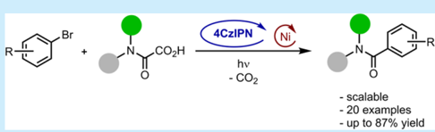
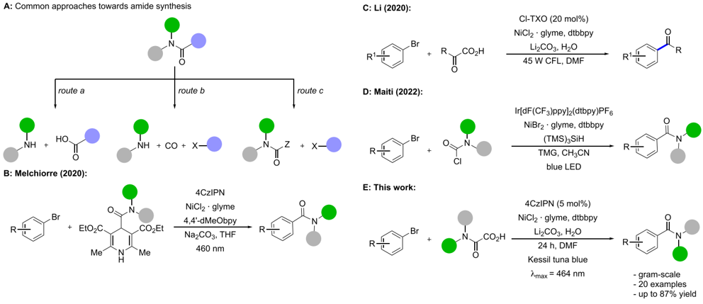
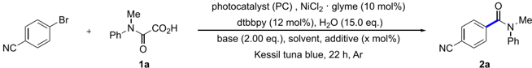
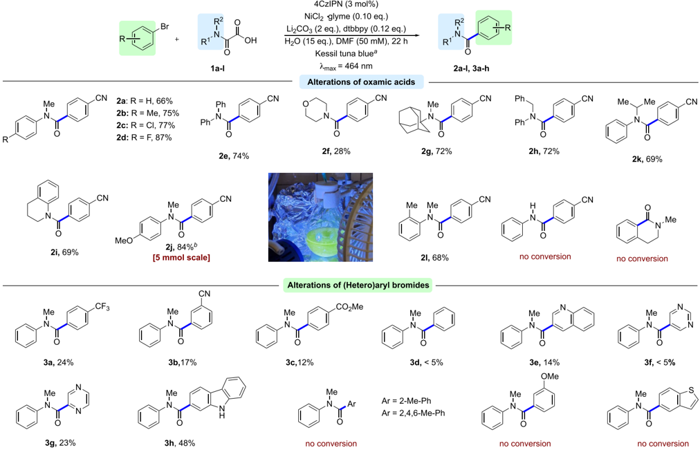
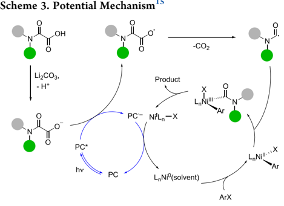
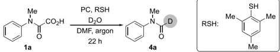
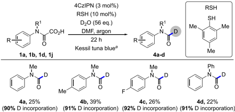

Open Access

Br

OLI

Organic

Letters&gt;

-BY 4.0

R

[- scalable](https://pubs.acs.org/OrgLett?ref=pdf)

- 20 examples

- up to 87% yield pubs.acs.org/OrgLett

## Decarboxylative Nickel- and Photoredox-Catalyzed Aminocarbonylation of (Hetero)Aryl Bromides

Valeriia Hutskalova, Farhan Bou Hamdan, * and Christof Sparr *

[Cite This: Org. Lett. 2024, 26, 2768-2772](https://pubs.acs.org/action/showCitFormats?doi=10.1021/acs.orglett.3c02389&ref=pdf)

## ACCESS

[Metrics &amp; More](https://pubs.acs.org/doi/10.1021/acs.orglett.3c02389?goto=articleMetrics&ref=pdf)

[Article Recommendations](https://pubs.acs.org/doi/10.1021/acs.orglett.3c02389?goto=recommendations&?ref=pdf)

ABSTRACT: An efficient methodology for the photoredox- and nickel-catalyzed aminocarbonylation of (hetero)aryl bromides was developed. The utilization of readily available oxamic acids, the application of a broadly used organic photoredox catalyst (4CzIPN), and mild reaction conditions make this transformation an appealing alternative to classical amidation procedures. The generation of carbamoyl radicals was supported by trapping

Letter

[Supporting Information](https://pubs.acs.org/doi/10.1021/acs.orglett.3c02389?goto=supporting-info&ref=pdf)

reactions with a hydrogen atom transfer catalyst in the presence of D 2 O, yielding the deuterated formamide. The generality of this deuteration protocol was confirmed for various oxamic acids.

T he amide bond is an exceptionally important structural motif not only as the backbone of peptides but also as the linkage of numerous small bioactive pharmaceuticals and agrochemicals. Owing to the high abundance of amides in the final bioactive products 1,2 or synthetic intermediates, amidation reactions belong to the most frequently performed transformations. 3 Therefore, significant efforts have been devoted to the development of new amidation protocols over the last years. 4 -6 The currently available synthetic approaches to amides can be grouped into three general strategies based on the bond disconnections for each specific retrosynthetic consideration (Scheme 1A). Direct coupling of carboxylic acids and amines (route a) clearly represents the most common route to amides. However, without preactivation, the formation of unreactive carboxylate-ammonium salts makes this approach suitable only for a very limited range of substrates that tolerate harsh reaction conditions. The generation of more reactive carboxylic acid derivatives by the application of stoichiometric amounts of an activating or coupling reagent routinely allows for milder reaction conditions. However, poor atom economy, high cost, and certain safety concerns about commonly utilized coupling agents 7 along with a significant amount of generated waste limit this synthetic approach and negatively impact its suitability for industrial applications. Transition-metal-catalyzed aminocarbonylation (route b), 8,9 in turn, represents a three-component methodology that transforms readily available aryl halides to amides. However, the use of toxic CO gas, expensive palladium catalysts, and ligands hampers the application of this reaction in industry on a large scale. Route c, on the other hand, relies on the initial formation of the desired N  C(  O) bond, followed by the later creation of a C  Cbond with the required substituent. This strategy is realized by the generation of a carbamoyl radical as a reactive intermediate. The corresponding Nhydroxyphthalimide esters 10,11 and 4-carbamoyl-1,4-dihydropyridines 12 thereby proved to be useful carbamoyl radical precursors

(Scheme 1B). However, in both cases, poor atom economy and waste arising from the decarboxylative auxiliary are noteworthy disadvantages compared with substrates that decarboxylate without byproducts (Scheme 1C). Recently, the Maiti group reported a silyl-radical-mediated halogen abstraction as a tool to access carbamoyl radicals starting from carbamoyl chlorides (Scheme 1D). 13 In contrast, the readily available and expediently utilized oxamic acids represent an attractive alternative as carbamoyl radical precursors with only CO2 contributing to the waste stream. 14 Interestingly, Li and coworkers disclosed a single example of an amide preparation by a decarboxylative nickel-catalyzed cross-coupling (Scheme 1C). 15 However, this example required a high photocatalyst loading (20 mol %), and the yield was compromised. Moreover, the Fu group reported a decarboxylative coupling of potassium oxalate monoamides with aryl halides with precious iridium and palladium catalysts. 16 Considering the need for new efficient amidation methodologies, we hence aimed to explore the scope of decarboxylative nickeland organophotoredox-catalyzed aminocarbonylation of aryl halides (Scheme 1E).

We initiated our studies by an expeditious substrate preparation by an operationally simple two-step sequence involving the acylation of N -methylaniline with methyl 2chloro-2-oxoacetate followed by hydrolysis of the obtained methyl ester. With oxamic acid 1a in hand, we embarked on the optimization of the reaction conditions. For a comparison with the reported example, 15 we started our optimizations utilizing 2-

Special Issue:

Organic Chemistry Driven by Academic-

Industrial Collaborations

Received:

July 21, 2023

Published:

October 5, 2023

[4CzIРN](https://pubs.acs.org/OrgLett?ref=pdf)

Scheme 1. Classical Synthetic Routes and Photoredox-Catalytic Approaches toward Amides

Table 1. Optimization of the Reaction Conditions

|   Entry a | PC                               |   PC (mol | Base      | Solvent   | Concentration   | Modifications   | Conversion b   | Yield c (Isolated yield)   |
|-----------|----------------------------------|-----------|-----------|-----------|-----------------|-----------------|----------------|----------------------------|
|         1 | Cl-TXO                           |        20 | Li 2 CO 3 | DMF       | 33 mM           |                 | 39%            | 25%                        |
|         2 | Cl-TXO                           |        20 | Na 2 CO 3 | DMF       | 33 mM           |                 | 49%            | 22%                        |
|         3 | Cl-TXO                           |        20 | K 2 CO 3  | DMF       | 33 mM           |                 | 58%            | 28%                        |
|         4 | Cl-TXO                           |        20 | Cs 2 CO 3 | DMF       | 33 mM           |                 | 49%            | 23%                        |
|         5 | Cl-TXO                           |        20 | Li 2 CO 3 | DMF       | 33 mM           | Phthalimide d   | 56%            | 27%                        |
|         6 | di- t Bu-Mes-Acr + BF 4 -        |         5 | Li 2 CO 3 | DMF       | 33 mM           | SynLED          | 0%             | 0%                         |
|         7 | (Ir(dF(CF 3 )ppy) 2 (dtbpy))PF 6 |         8 | Li 2 CO 3 | DMF       | 33 mM           |                 | 76%            | 31%                        |
|         8 | 4CzIPN                           |         1 | Li 2 CO 3 | DMF       | 33 mM           |                 | 78%            | 53%                        |
|         9 | 4CzIPN                           |         3 | Li 2 CO 3 | DMF       | 33 mM           |                 | >95%           | 63% (51%)                  |
|        10 | 4CzIPN                           |         5 | Li 2 CO 3 | DMF       | 33 mM           |                 | >95%           | 45%                        |
|        11 | 4CzIPN                           |         8 | Li 2 CO 3 | DMF       | 33 mM           |                 | >95%           | 47%                        |
|        12 | 4CzIPN                           |        15 | Li 2 CO 3 | DMF       | 33 mM           |                 | >95%           | 40%                        |
|        13 | 3CzClIPN                         |         3 | Li 2 CO 3 | DMF       | 33 mM           |                 | 0%             | 0%                         |
|        14 | 5CzBN                            |         3 | Li 2 CO 3 | DMF       | 33 mM           |                 | >95%           | 63%                        |
|        15 | 3DPA2FBN                         |         3 | Li 2 CO 3 | DMF       | 33 mM           |                 | 44%            | 23%                        |
|        16 | 4CzIPN                           |         3 | Li 2 CO 3 | DMF       | 33 mM           | No H 2 O        | >95%           | 45%                        |
|        17 | 4CzIPN                           |         3 | Li 2 CO 3 | THF       | 33 mM           |                 | 0%             | 0%                         |
|        18 | 4CzIPN                           |         3 | Li 2 CO 3 | DMC       | 33 mM           |                 | 0%             | 0%                         |
|        19 | 4CzIPN                           |         3 | Li 2 CO 3 | CH 3 CN   | 33 mM           |                 | 0%             | 0%                         |
|        20 | 4CzIPN                           |         3 | Li 2 CO 3 | DMF       | 20 mM           |                 | >95%           | 36%                        |
|        21 | 4CzIPN                           |         3 | Li 2 CO 3 | DMF       | 50mM            |                 | >95%           | 64%                        |

a Reaction conditions: 4-Bromobenzonitrile (18.2 mg, 100 μ mol), 1a (35.8 mg, 200 μ mol), base (200 μ mol), NiCl2 · glyme (2.20 mg, 10.0 μ mol), 4,4 ′ -dtbbpy (4,4-ditert -butyl-2,2-dipyridyl) (3.22 mg, 12.0 μ mol), argon, 22 h, Kessil tuna blue as a light source ( λ max = 464 nm). b Conversion based on 1 H NMR analysis of the crude reaction mixture. c Yields determined by 1 H NMR analysis of the crude mixture using 1,2,4,5tetramethylbenzene as an internal standard. d 0.25 equiv.

chloro-thioxanthen-9-one (Cl-TXO) as photocatalyst. However, in our hands neither the change of the light source nor the diversification of the nickel salt or solvent allowed a yield of more than 30% to be achieved (details are provided in the Supporting Information). Notably, lowering the nickel loading to 5 mol % led to a decreased conversion and yield, while diverse bipyridine ligands showed insignificant differences in the reaction outcome (Table S2). Variations of the base also did not result in any noteworthy change in the reaction performance (Table 1, entries 1 -4). Furthermore, the application of phthalimide 17 as an additive was also ineffective for the improvement of the yield (Table 1, entry 5). We next proceeded with the evaluation of diversified photocatalysts. While acridinium salts proved to be unsuitable for this transformation (Table S1), transition-metal-based photocatalyst ((Ir(dF(CF 3 )-ppy)2(dtbpy))PF6 delivered the desired product in 30% yield

br cale]

R2

RIN

1a-l

Ph

Ph-N

2e, 74%

CN

NICI2 glyme (0.10 eq.)

Li2COз (2 eq.), dtbbpy (0.12 eq.)

H20 (15 eq.), DMF (50 mM), 22 h

Kessil tuna bluea

## Scheme 2. Substrate Scope

Me

a Reaction conditions: ArBr (200 μ mol, 1.00 equiv), 1a -l (400 μ mol, 2.00 equiv), Li2CO3 (29.6 mg, 400 μ mol, 2.00 equiv), 4CzIPN (4.73 mg, 6.00 μ mol, 0.03 equiv), NiCl 2 · glyme (4.39 mg, 20.0 μ mol, 0.10 equiv), 4,4 ′ -dtbbpy (6.44 mg, 24.0 μ mol, 0.12 equiv), DMF (4.0 mL), H2O (54.0 mg, 3.00 mmol, 15.0 equiv), argon, 22 h, Kessil tuna blue ( λ max = 464 nm), isolated yields are reported. b 4-Bromobenzonitrile (910 mg, 5.00 mmol, 1.00 equiv), 1j (2.09 g, 10.0 mmol, 2.0 equiv), 22 h.

(Table 1, entry 7). In contrast, representatives of the cyanoarene-based organic donor -acceptor photocatalysts showed promising results. In particular, full conversion of the 4-bromobenzonitrile was achieved with 1,2,3,5-tetrakis(carbazol-9-yl)-4,6-dicyanobenzene (4CzIPN) and pentacarbazolylbenzonitrile (5CzBN) (Table 1, entries 9, 14). On the other hand, two other members of this class of photocatalysts led to either low yield or no reaction (Table 1, entries 13, 15). These results were rationalized by the insufficient ground state reduction potential of 3CzClIPN ( E 1/2(PC/PC ·-) = -1.16 V) 18 for nickel reductions ( E 1/2(Ni II /Ni 0 ) = -1.20 V) 15 and the poor oxidizing properties of 3DPA2FBN ( E 1/2(PC * /PC ·-) = +0.92 V) that negatively affect the decarboxylation of oxamic acid. The photocatalyst loading also appeared as a decisive factor, since an increase of the loading to more than 3% caused a notable drop in yield (Table 1, entries 10 -12), while the application of 1 mol % of 4CzIPN was insufficient to achieve full conversion (Table 1, entry 8). Further extensive reaction condition optimization revealed DMF and NiCl2 · glyme as the ideal solvent and nickel precursor (Table 1, entry 21). After establishing these suitable reaction conditions, we next set out to assess the substrate scope by varying the natures of both the oxamic acid and the coupling partner. To our delight, oxamic acids bearing halides ( -Cl, -F) and electron-donating groups ( -Me, -OMe) all yielded products ( 2b , 2c , 2d , 2j ) with high isolated yields in the range of 75 -87% (Scheme 2). Moreover, both N -alkylN -aryl and N , N -dialkyl derivatives were identified as suitable substrates tolerating different alkyl groups, such as benzyl ( 2h ) and sterically hindered adamantyl ( 2g ) or isopropyl residues ( 2k ). Remarkably, N , N -diaryl oxamic acid ( 1e ) was also successfully subjected to the reaction, giving the corresponding product with high yield ( 2e ). However, the methodology was unsuitable for 2-oxo-2-(phenylamino)acetic acid ( 1m ), presumably due to the lower stability of the generated N -arylcarbamoyl radical and its tendency for decarbonylation. 19,20 Interestingly, no formation of the desired product was observed for the intramolecular version of the transformation (Scheme 2). Next, the generality of the reaction was explored for different aryl bromides. Substrates containing electron-withdrawing substituents ( -CF3, -CN, and -CO2Me) yielded the desired products, albeit with low yields ( 3a , 3b , and 3c ), while aryl bromides possessing an electron-donating group ( -OMe) did not participate in the desired transformation. This observation could be due to a slow oxidative addition step of electron-rich aryl halides which can cause aggregation of low-valent nickel complexes. 21 Sterically hindered aryl bromides also represent a limitation of the methodology. Several electron-deficient heteroaryl bromides such as 3-bromoquinoline and 2bromopyrazine gave rise to products with moderate or low yields ( 3e , 3g ). We next investigated the efficiency of the developed aminocarbonylation procedure of (hetero)aryl bromides by demonstrating that it is suitably performed on a

R1

gram scale. The product 2j (Scheme 2) was thereby prepared with an isolated yield of 84% on a 5 mmol scale with no need to change the reaction parameters. A potential mechanism of this dual catalytic transformation involves the excitation of the photocatalyst 4CzIPN (PC) by irradiation with visible light. 15 The obtained PC * next oxidizes the salt formed of the oxamic acid, leading to the corresponding radical that rapidly undergoes decarboxylation to form the carbamoyl radical (Scheme 3). The

resulting reduced species of the photocatalyst then participates in the generation of L n Ni 0 by a L n Ni I X reduction. The reduced nickel complex results in an oxidative addition of the aryl bromide, followed by the interception of the carbamoyl radical. Finally, a reductive elimination yields the desired amide product and regenerates L n Ni I X. Formation of trace amounts of N -methylN -phenylformamide (&lt;5% yield) as a side-product during the preparation of 2a serves as an indication of the generation of carbamoyl radicals according to this mechanism. To further support the involvement of the carbamoyl radicals, we explored the preparation of deuterated formamides by synergistic thiol and photoredox catalysis utilizing D2O as an inexpensive deuterium source. Recently, the Li group developed an approach to C1-deuterated aldehydes relying on the photoredox-catalyzed decarboxylation of α -oxo carboxylic acids. 22 In contrast, the preparation of deuterated formamides starting from readily available oxamic acids remained unknown. We therefore initiated our investigation using a reaction system similar to the one developed for the aminocarbonylation of aryl bromides using 4CzIPN as a photocatalyst, Li2CO3 as a base, and DMF as a reaction medium (Table 2). Notably, performing the reaction with 2,4,6-trimethylthiophenol as a hydrogen atom transfer catalyst gave a 43% yield with high D incorporation (90%) (Table 2, entry 4). Reducing the amount of D2O led to both decreased yield and D incorporation (Table 2, entry 3), while doubling the quantity of D 2 Ocaused a significant drop in yield with only minor improvement in D incorporation (Table 2, entry 5). Furthermore, a comparison of the performances of Irbased photocatalyst (Table 2, entries 1 and 2) with the organic one (4CzIPN) revealed that the latter is as efficient, validating that the use of precious metals is not needed for this transformation. Moreover, control experiments demonstrated that the presence of both photocatalyst and HAT catalyst is essential for the desired deuteration reaction (Table 2, entries 8, 10). Finally, we applied the deuteration protocol to four different oxamic acids that yielded desired products 4a -4d with moderate yields and high D incorporation (90 -92%) (Scheme

## Table 2. Deuterated Formamide Synthesis: Optimization a

|   Entry b | PC     | Thiol (mol %)   | D 2 O (equiv)   | Yield c (D incorporation)   |
|-----------|--------|-----------------|-----------------|-----------------------------|
|         1 | [Ir]   | 10              | 28              | 37% (73%)                   |
|         2 | [Ir]   | 10              | 56              | 40% (87%)                   |
|         3 | 4CzIPN | 10              | 28              | 22% (43%)                   |
|         4 | 4CzIPN | 10              | 56              | 43% (90%)                   |
|         5 | 4CzIPN | 10              | 112             | 11% (92%)                   |
|         6 | 4CzIPN | 30              | 56              | 35% (87%)                   |
|         7 | 4CzIPN | 60              | 56              | 32% (86%)                   |
|         8 | -      | 10              | 56              | 0%                          |
|         9 | 4CzIPN | 10              | -               | 44% (0%)                    |
|        10 | 4CzIPN | -               | 56              | 0%                          |

- a [Ir] = Ir(dF(CF3)ppy)2(dtbpy))PF6. b Reaction conditions: 1a (17.9 mg, 100 μ mol), 4CzIPN (2.37 mg, 3.00 μ mol), Li2CO3 (7.39 mg, 100 μ mol), DMF (2.0 mL), argon, 22 h, Kessil tuna blue ( λ max = 464 nm). c Yields were determined by the 1 H NMR analysis of the crude mixture using 1,2,4,5-tetramethylbenzene as an internal standard.
- 4). Therefore, this reaction can be used not only to evaluate the formation of carbamoyl radicals but also as an approach to deuterated formamides under mild metal-free conditions.

## Scheme 4. Preparation of Deuterated Formamides

a Reaction conditions: 1 (300 μ mol), Li2CO3 (22.2 mg, 300 μ mol), 2,4,6-trimethylthiophenol (4.57 mg, 3.00 μ mol), D2O (336 μ g, 16.8 mmol), DMF (6.0 mL), argon, 22 h, Kessil tuna blue ( λ max = 464 nm).

In conclusion, an efficient methodology toward amide synthesis relying on the photoredoxand nickel-catalyzed cross-coupling of readily available oxamic acids with aryl bromides was developed. Mild reaction conditions and the application of a broadly used organic photocatalyst (4CzIPN) make this transformation suitable as an alternative to precious metal-catalyzed aminocarbonylations. The scope and limitations were investigated by varying the oxamic acids and (hetero)aryl bromides. The procedure was successfully performed on a gram scale, and the trapping of the carbamoyl radical with a HAT catalyst in the presence of D2O supports the generation of carbamoyl radicals. Furthermore, a methodology that provides access to deuterated formamides was applied to different oxamic acids, yielding the desired products with a high level of D incorporation.

## ■ ASSOCIATED CONTENT

## Data Availability Statement

The data underlying this study are available in the published article and its Supporting Information.

## * sı Supporting Information

The Supporting Information is available free of charge at https://pubs.acs.org/doi/10.1021/acs.orglett.3c02389.

Experimental details and characterization data (PDF)

## ■ AUTHOR INFORMATION

## Corresponding Authors

Farhan Bou Hamdan -Syngenta Crop Protection AG, Crop Protection Research, CH-4332 Stein, Switzerland ;

[Email: farhan.bou\_hamdan@syngenta.com](mailto:farhan.bou_hamdan@syngenta.com)

Christof Sparr -Department of Chemistry, University of Basel, 4056 Basel, Switzerland; orcid.org/0000-0002-42130941; Email: christof.sparr@unibas.ch

## Author

Valeriia Hutskalova -Department of Chemistry, University of Basel, 4056 Basel, Switzerland

Complete contact information is available at: https://pubs.acs.org/10.1021/acs.orglett.3c02389

## Notes

The authors declare no competing financial interest.

## ■ ACKNOWLEDGMENTS

We thank E. Hamon (University of Basel) for experimental assistance and acknowledge Syngenta Crop Protection AG and the University of Basel for financial support. The authors are grateful to Prof. Oliver Wenger (University of Basel) for valuable discussions.

## ■ REFERENCES

- (1) [Ghose, A. K.; Viswanadhan, V. N.; Wendoloski, J. J. A KnowledgeBased Approach in Designing Combinatorial or Medicinal Chemistry Libraries for Drug Discovery. 1. A Qualitative and Quantitative Characterization of Known Drug Databases. J. Comb. Chem. 1999 , 1 , 55 -68.](https://doi.org/10.1021/cc9800071?urlappend=%3Fref%3DPDF&jav=VoR&rel=cite-as)
- (2) Gisi, U.; Lamberth, C.; Mehl, A.; Seitz, T. In Modern Crop Protection Compounds ; Jeschke, P., Witschel, M., Krämer, W., Schirmer, U., Eds.; Wiley-VCH: Weinheim, Germany, 2019; Ch. 18.
- (3) (a) Carey, J. S.; Laffan, D.; Thomson, C.; Williams, M. T. Analysis of the Reactions Used for the preparation of drug candidate molecules. Org. Biomol. Chem. 2006 , 4 , 2337 -2347. (b) Roughley, S. D.; Jordan, A. M. The Medicinal Chemist's Toolbox: An Analysis of Reactions Used in the Pursuit of Drug Candidates. J. Med. Chem. 2011 , 54 , 3451 -3479. (4) Pattabiraman, V. R.; Bode, J. W. Rethinking amide bond synthesis.
4. Nature 2011 , 480 , 471 -479.
- (5) (a) De Figueiredo, R. M.; Suppo, J. S.; Campagne, J. M. Nonclassical Routes for Amide Bond Formation. Chem. Rev. 2016 , 116 , 12029 -12122. (b) Valeur, E.; Bradley, M. Amide bond formation: beyond the myth of coupling reagents. Chem. Soc. Rev. 2009 , 38 , 606 -631. (c) Lu, B.; Xiao, W.-J.; Chen, J.-R. Recent Advances in VisibleLight-Mediated Amide Synthesis. Molecules 2022 , 27 , 517 -557.
- (6) (a) Elwood, M. L.; Henry, M. C.; Lopez-Fernandez, J. D.; Mowat, J. M.; Boyle, M.; Buist, B.; Livingstone, K.; Jamieson, C. Functionalized Tetrazoles as Latent Active Esters in the Synthesis of Amide Bonds. Org. Lett. 2022 , 24 , 9491 -9496. (b) Braddock, D. C.; Davies, J. J.; Lickiss, P. D. Methyltrimethoxysilane (MTM) as a Reagent for Direct Amidation of Carboxylic Acids. Org. Lett. 2022 , 24 , 1175 -1179. (c) Sawant, D. N.; Bagal, D. B.; Ogawa, S.; Selvam, K.; Saito, S. Diboron-Catalyzed

Dehydrative Amidation of Aromatic Carboxylic Acids with Amines. Org. Lett. 2018 , 20 , 4397 -4400. (d) Song, G.; Li, G. S. Q.; Nong, D. Z.; Song, J.; Li, G.; Wang, C.; Xiao, J.; Xue, D. Ni-Catalyzed Photochemical C -N Coupling of Amides with (Hetero)aryl Chlorides. Chem. Eur. J. 2023 , 29 , No. e202300458.

- (7) (a) Mcknelly, K. J.; Sokol, W.; Nowick, J. S. Anaphylaxis Induced by Peptide Coupling Agents: Lessons Learned from Repeated Exposure to HATU, HBTU, and HCTU. J. Org. Chem. 2020 , 85 , 1764 -1768. (b) McFarland, A. D.; Buser, J. Y.; Embry, M. C.; Held, C. B.; Kolis, S. P. Generation of Hydrogen Cyanide from the Reaction of Oxyma (Ethyl Cyano(hydroxyimino)acetate) and DIC (Diisopropylcarbodiimide). Org. Process Res. Dev. 2019 , 23 , 2099 -2105.
- (8) Schoenberg, A.; Heck, R. F. Palladium-catalyzed amidation of aryl, heterocyclic, and vinylic halides. J. Org. Chem. 1974 , 39 , 3327 -3331.
- (9) (a) Kégl, T. R.; Mika, L. T.; Kégl, T. 27 Years of Catalytic Carbonylative Coupling Reactions in Hungary (1994 -2021). Molecules 2022 , 27 , 460 -478. (b) Fang, W.; Deng, Q.; Xu, M.; Tu, T. Highly Efficient Aminocarbonylation of Iodoarenes at Atmospheric Pressure Catalyzed by a Robust Acenaphthoimidazolyidene Allylic Palladium Complex. Org. Lett. 2013 , 15 , 3678 -3681.
- (10) [Petersen, W. F.; Taylor, R. J. K.; Donald, J. R. PhotoredoxCatalyzed Reductive Carbamoyl Radical Generation: A Redox-Neutral Intermolecular Addition -Cyclization Approach to Functionalized 3,4Dihydroquinolin-2-ones. Org. Lett. 2017 , 19 , 874 -877.](https://doi.org/10.1021/acs.orglett.7b00022?urlappend=%3Fref%3DPDF&jav=VoR&rel=cite-as)
- (11) Petersen, W. F.; Taylor, R. J. K.; Donald, J. R. Photoredoxcatalyzed procedure for carbamoyl radical generation: 3,4-dihydroquinolin-2-one and quinolin-2-one synthesis. Org. Biomol. Chem. 2017 , 15 , 5831 -5845.
- (12) Alandini, N.; Buzzetti, L.; Favi, G.; Schulte, T.; Candish, L.; Collins, K. D.; Melchiorre, P. Amide Synthesis by Nickel/PhotoredoxCatalyzed Direct Carbamoylation of (Hetero)Aryl Bromides. Angew. Chem., Int. Ed. 2020 , 59 , 5248 -5253.
- (13) Maiti, S.; Roy, S.; Ghosh, P.; Kasera, A.; Maiti, D. Photo-Excited Nickel-Catalyzed Silyl-Radical-Mediated Direct Activation of Carbamoyl Chlorides To Access (Hetero)aryl Carbamides. Angew. Chem., Int. Ed. 2022 , 61 , No. e202207472.
- (14) Bai, Q.-F.; Jin, C.; He, J.-Y.; Feng, G. Carbamoyl Radicals via Photoredox Decarboxylation of Oxamic Acids in Aqueous Media: Access to 3,4-Dihydroquinolin-2(1 H )-ones. Org. Lett. 2018 , 20 , 2172 -2175.
- (15) Zhu, D. L.; Wu, Q.; Young, D. J.; Wang, H.; Ren, Z. G.; Li, H. X. Acyl Radicals from α -Keto Acids Using a Carbonyl Photocatalyst: Photoredox-Catalyzed Synthesis of Ketones. Org. Lett. 2020 , 22 , 6832 -6837.
- (16) Cheng, W. M.; Shang, R.; Yu, H. Z.; Fu, Y. Room-Temperature Decarboxylative Couplings of α -Oxocarboxylates with Aryl Halides by Merging Photoredox with Palladium Catalysis. Chem. Eur. J. 2015 , 21 , 13191 -13195.
- (17) Prieto Kullmer, C. N.; Kautzky, J. A.; Krska, S. W.; Nowak, T.; Dreher, S. D.; MacMillan, D. W. C. Accelerating reaction generality and mechanistic insight through additive mapping. Science 2022 , 376 , 532 -539.
- (18) [Speckmeier, E.; Fischer, T. G.; Zeitler, K. A Toolbox Approach to Construct Broadly Applicable Metal-Free Catalysts for Photoredox Chemistry: Deliberate Tuning of Redox Potentials and Importance of Halogens in Donor -Acceptor Cyanoarenes. J. Am. Chem. Soc. 2018 , 140 , 15353 -15365.](https://doi.org/10.1021/jacs.8b08933?urlappend=%3Fref%3DPDF&jav=VoR&rel=cite-as)
- (19) Grossi, L. N -alkyl and N -aryl-carbamoly radicals: a new σ -type radical. J. Chem. Soc., Chem. Commun. 1989 , 39 , 1248 -1250.
- (20) Ogbu, I. M.; Kurtay, G.; Robert, F.; Landais, Y. Oxamic acids: useful precursors of carbamoyl radicals. Chem. Commun. 2022 , 58 , 7593 -7607.
- (21) [Gisbertz, S.; Reinschauer, S.; Pieber, B. Overcoming limitations in dual photoredox/nickel-catalysed C -N cross-couplings due to catalyst deactivation. Nat. Catal. 2020 , 3 , 611 -620.](https://doi.org/10.1038/s41929-020-0473-6)
- (22) [Hu, C. H.; Li, Y. Visible-Light Photoredox-Catalyzed Decarboxylation of α -Oxo Carboxylic Acids to C1-Deuterated Aldehydes and Aldehydes. J. Org. Chem. 2023 , 88 , 6401 -6406.](https://doi.org/10.1021/acs.joc.2c02299?urlappend=%3Fref%3DPDF&jav=VoR&rel=cite-as)