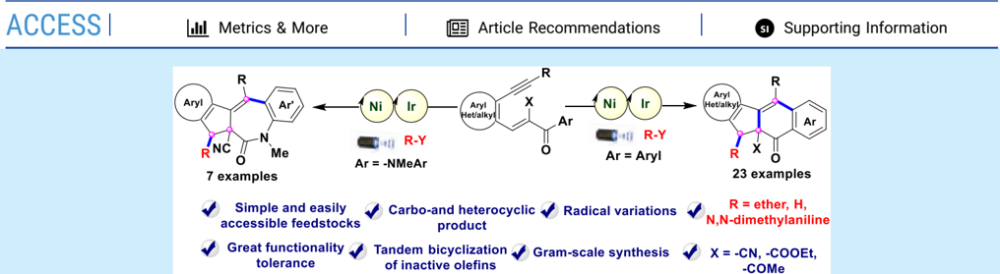
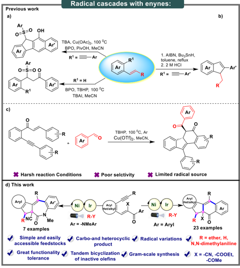
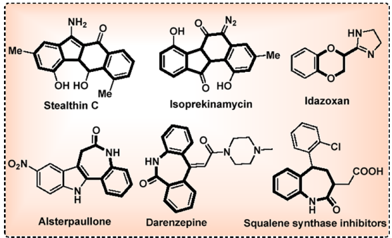
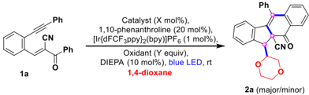
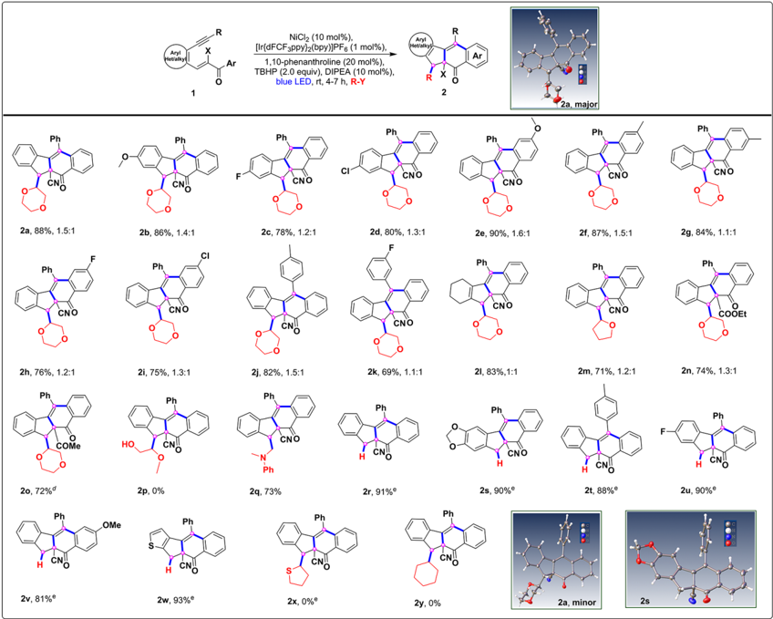
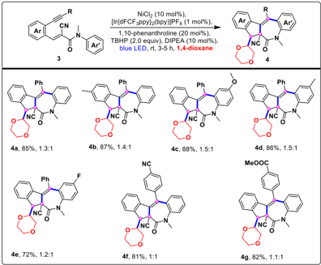
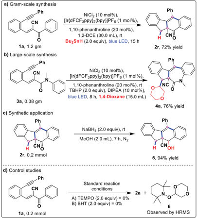
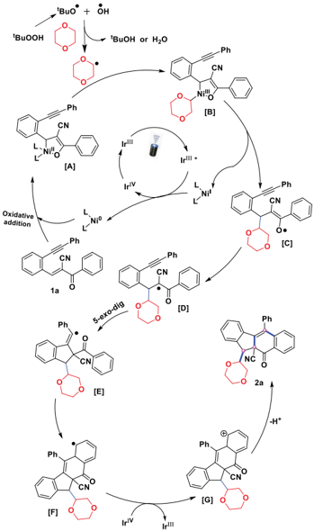

[pubs.acs.org/OrgLett](pubs.acs.org/OrgLett?ref=pdf)

## Photochemical Radical Bicyclization of 1,5-Enynes: Divergent Synthesis of Fluorenes and Azepinones

Babasaheb Sopan Gore, Chun-Cheng Chen, Ping-Yu Lin, and Jeh-Jeng Wang *

Cite This:

Org. Lett. 2024, 26, 757-762

ABSTRACT: A dual nickel- and iridium-photocatalyzed radical cascade bicyclization reaction for the synthesis of highly complex molecular structures in an atom- and step-economic manner has been described. A series of radical precursors are utilized for the divergent synthesis of diversely substituted fluorenes and indenoazepinones bearing quaternary carbons by using cascade cyclization reactions of 1,5-enynes. This reaction is characterized by its mild conditions, broad substrate scope, excellent selectivity, and satisfactory yield including facile scale-up synthesis.

T he radical cascade reaction is a fundamental method for organic synthesis because it allows direct access to the synthesis of biologically important targets. 1 Additionally, such an approach enables the production of highly functionalized polycyclic architectures from readily accessible feedstocks in a concise, efficient, and straightforward manner. 2 Among these, 1,5-enynes are attractive building blocks in cascade cyclization owing to their varying levels of reactivity for one-pot heterocycle and carbocycle synthesis. 3 The key advantage of this process is its ability to produce structural complexity under mild conditions with high atom economy. 4 Several cycloisomerization reactions have been observed in 1,5-enynes, 5a such as metal-catalyzed cycloisomerization, which includes nucleophilic and electrophilic additions. 5b However, the radical bicyclization of 1,5-enynes remains unexplored under visiblelight-mediated photoredox catalytic conditions. Owing to their low reactivity and high steric factors, the use of the internal alkenes of enynes as radical acceptors poses considerable challenges and remains largely unsolved. Jiang et al. developed a protocol for the tandem 5exo -dig /6endo -trig carbonylation of 1,5-enynes with aryl sulfonyls in the presence of TBAI/ BPO/PivOH and copper (Scheme 1a). 6a Similarly, in 2013, Alabugin et al. described the regioselective synthesis of substituted indenes with Bu3Sn -H as a radical source under conventional conditions (Scheme 1b). 6b Recently, in 2020 Wu and co-workers reported copper-catalyzed radical bicyclization of 1,6-enynes with aldehydes for the synthesis of benzo[ a ]-fluorenone skeletons under heating conditions (Scheme 1c). 6c Despite recent advances, the development of robust, reliable

multiple-ring polycyclic molecules containing quaternary carbon centers 7 and the use of ether, α -amino alkyl, or tin hydride radicals in the tandem bicyclization of 1,5-enynes remain largely unexplored. Meanwhile, polycyclic aromatic hydrocarbons and azepine derivatives are valuable resources for material science, drug discovery, pharmaceuticals, and other bioactive compounds (Figure 1). 8 Results from previous studies 9a and our interest in enyne-assisted cyclization 9b -d led to the investigation of a previously unexplored application of radical cascade cyclization induced by photoredox catalysis. Further, the realization of our envisaged protocol will provide new opportunities for the synthesis of valuable and sterically demanding quaternary carbon centers. This article describes the development of an efficient, practical, and modular platform for building highly diastereoselective and regiodivergent 5exo -dig bicyclizations with high atom and step economy in a single operation to construct the substituted fluorene and azepinone scaffolds under visible-light induced photoredox catalysis (Scheme 1d). Initially, we examined the intermolecular oxidative α -functionalization of an ether such as 1,4dioxane with conjugated enynes of internal olefins. The first

Received:

December 18, 2023

Revised:

January 10, 2024

Accepted:

January 11, 2024

Published:

January 17, 2024

Ar

Ni

Ni

·11} R-

·11] R-Y

Ar = -NMeA

Ar = Aryl

Mé

Scheme 1. Different Reactivity Patterns for Radical Cascades of Enynes

Alsterpaullone

Figure 1. Representative bioactive scaffolds.

experiment involved 1,4-dioxane as the substrate and solvent coupled with ( E )-2-benzoyl-3-(2-phenylethynyl)phenyl)acrylonitrile ( 1a ) as the electron-deficient internal olefin under blue LED irradiation with 1 mol % of Ir(III) sensitizer (Table 1). The reaction did not yield the desired product in the absence of the catalyst or oxidant (entries 1 and 2). Further screening of various oxidants, such as K2S2O8, H2O2, DTBP, and TBHP (entries 3 -6), in the presence of NiCl2 (10 mol %), 1,10-phenanthroline (20 mol %), [Ir{dFCF3ppy}2(bpy)]PF6 (1.0 mol %), and DIPEA (10 mol %) under blue LED irradiation indicated the effectiveness of TBHP as an oxidant, affording an 88% yield of benzo[ b ]fluorene-10a-carbonitrile 2a (entry 6). However, the reaction produced the desired product in a yield of only 62% after a prolonged reaction time (10 h) (entry 7). Several commercially available photocatalysts (TBADT and Ru(bpy)3(PF6)2) were then examined (entries 8 and 9), but the performance remained unaltered. Increasing or decreasing NiCl2 as well as TBHP was found to be ineffective (entries 10 -13). Several other catalysts commonly used for catalytic transformations were also screened, including CuCl2, FeCl2, NiBr2, and Ni(acac)2. Each of these catalysts

Ve

a Standard conditions: 1a (0.20 mmol), catalyst (X mol %), 1,10phenanthroline (20 mol %), [Ir{dFCF3ppy}2(bpy)]PF6 = Ir( ΙΙΙ ) = (1.0 mol %), and DIPEA (10 mol %) in 1,4-dioxane (3.0 mL) were stirred for 4 h and irradiated with blue LED ( λ max = 462 nm, latent temperature ∼ 25 -30 ° C). b Isolated reaction yield. c 1 H NMR analysis of the crude reaction mixture, d Reaction mixture stirred at 10 h. e TBADT used instead of Ir (III). f [Ru(bpy)3](PF6)2 used instead of Ir (III). g K3PO4 used instead of DIPEA. h Na2CO3 used instead of DIPEA. i TEA used instead of DIPEA.

Table 1. Optimization of Reaction Conditions for Radical Cyclization a

| Entry   | Catalyst (mol %)   | Oxidant ( Y equiv)   | Yield (%) b   | dr c   |
|---------|--------------------|----------------------|---------------|--------|
| 1       |                    |                      | 0             |        |
| 2       | NiCl 2 (10)        |                      | 0             |        |
| 3       | NiCl 2 (10)        | K 2 S 2 O 8 (2.0)    | trace         |        |
| 4       | NiCl 2 (10)        | H 2 O 2 (2.0)        | trace         |        |
| 5       | NiCl 2 (10)        | DTBP (2.0)           | 50            | 1.1:1  |
| 6       | NiCl 2 (10)        | TBHP (2.0)           | 88            | 1.5:1  |
| 7 d     | NiCl 2 (10)        | TBHP (2.0)           | 62            | 1.3:1  |
| 8 e     | NiCl 2 (10)        | TBHP (2.0)           | trace         |        |
| 9 f     | NiCl 2 (10)        | TBHP (2.0)           | 15            | 1:1    |
| 10      | NiCl 2 (20)        | TBHP (2.0)           | 58            | 1.3:1  |
| 11      | NiCl 2 (5)         | TBHP (2.0)           | 69            | 1.4:1  |
| 12      | NiCl 2 (10)        | TBHP (3.0)           | 71            | 1.3:1  |
| 13      | NiCl 2 (10)        | TBHP (1.0)           | 60            | 1.3:1  |
| 14      | CuCl 2 (10)        | TBHP (2.0)           | 53            | 1.2:1  |
| 15      | FeCl 2 (10)        | TBHP (3.0)           | 10            | 1:1    |
| 16      | NiBr 2 (10)        | TBHP (2.0)           | 46            | 1.1:1  |
| 17      | Ni(acac) 2 (10)    | TBHP (3.0)           | 48            | 1.1:1  |
| 18 g    | NiCl 2 (10)        | TBHP (2.0)           | 0             |        |
| 19 h    | NiCl 2 (10)        | TBHP (2.0)           | 0             |        |
| 20 i    | NiCl 2 (10)        | TBHP (2.0)           | trace         |        |

̈

performed poorly, and their use considerably inhibited the generation of 2a (entries 14 -17). Finally, replacing Hu nig's base with K3PO4, Na2CO3, and TEA did not form the desired product but rather caused the decomposition of the starting material (entries 18 -20). The diastereomeric ratio of these products was determined using 1 H NMR and found to be between 1:1 and 1.5:1; both were easily isolated as major and minor products using standard silica gel chromatography. As a consequence of the versatility of radical cascade cyclization, we investigated intermolecular radical cascades of 1,5-enyne substrates with a variety of radical precursors (Scheme 2). When the α -β -conjugated 1,5-enynes were treated under optimized conditions (Table 1, entry 6) with dioxane as a radical initiator, a separable diastereomeric mixture (1.5:1) of compounds 2a was obtained at a yield of 88% (Scheme 2). Although the reaction was shown to be robust, the designed photocatalytic process has not been investigated for fluorene synthesis. The scope of the substrate was later evaluated by extensively varying and probing different substituents at various positions of the aromatic ring, such as methoxy, methyl, fluoro, and chloro groups. In all cases, the reactions occurred smoothly, which indicated comparable reactivity and provided good yields with moderate to excellent diastereoselectivity ( 2b -2k ) (Scheme 2). Cyclohexene-incorporated

Ph

CNO

2a, 88%, 1.5:1

Phi

CNO

2h, 76%, 1.2:1

Ph

COMe

20, 72%°

Ph

CNI

2v, 81%€

[2i, 75%, 1.3:1](https://pubs.acs.org/doi/10.1021/acs.orglett.3c04246?fig=sch2&ref=pdf)

HOL

2p, 0%

OMe

NiCIz (10 mol%),

[Ir{dFCF3ppy)½(bpy)]PF6 (1 mol%),

1,10-phenanthroline (20 mol%), blue LED, rt, 4-7 h, R-Y

TBHP (2.0 equiv), DIPEA (10 mol%),

Scheme 2. Substrate Scope for Radical Bicyclization a -c

2a, major

a Standard conditions: 1 (0.2 mmol), NiCl2 (10 mol %), 1,10-phenanthroline (20 mol%), DIPEA (10 mol %), TBHP (70% aq, 2.0 equiv), R -Y = 1,4-dioxane/THF/2-methoxyethanol/cyclohexane (3.0 mL), [Ir{dFCF3ppy}2(bpy)]PF6 (1.0 mol%), stirred for 4 -7 h and irradiated with blue LEDs ( λ max = 462 nm, latent temperature ∼ 25 -30 ° C). b Isolated yields. c Diastereomeric ratio determined by 1 H NMR analysis. d A mixture of isomers was isolated. e 1,2-DCE (3.0 mL) was used as a solvent instead of 1,4-dioxane for N , N -dimethylaniline (2.0 equiv), Bu3Sn -H (2.0 equiv), and tetrahydrothiophene (2.0 equiv).

enyne ( 1l ) was also tested, and the corresponding product ( 2l ) was obtained in high yields (Scheme 2). Next, we also successfully demonstrated that the reaction of THF ( 1m ), ester ( 1n ), and ketone ( 1o ) incorporated fluorene synthesis in good yields (Scheme 2).

The present method is applicable for the selective synthesis of fluorene derivatives under photoredox catalysis with N , N -dimethylaniline and Bu3Sn -H (hydrogen radical), as the radical initiators under slightly modified reaction conditions were evaluated (Table S1, see the Supporting Information for more details). In all cases, the electron-donating, halogen, and heterocyclic derivatives afforded the corresponding products in moderate to excellent yields, including simple derivatives ( 2q -2w ) (Scheme 2). However, when the 2-methoxyethanol, tetrahydrothiophene, and cyclohexane as radical precursors were subjected to intermolecular bicyclization, no desired products 2p , 2x , and 2y were obtained (Scheme 2). Next, these results prompted a more detailed examination of aminotethered enynes, which showed a high tolerance and provided densely substituted indeno-fused azepine 10 scaffolds ( 4a -4g ) in good reaction yields (Scheme 3). Moreover, the structure of compounds 2a (major:minor) and 2s were confirmed by using X-ray crystallography. To assess the practicality of the radical cascade protocol, both sequential gramand large-scale

## Scheme 3. Substrate Scope for Azepine Derivatives a -c

a Standard conditions: 3 (0.2 mmol), NiCl2 (10 mol %), 1,10phenanthroline (20 mol%), DIPEA (10 mol %), TBHP (70% aq., 2.0 equiv), 1,4-dioxane (3.0 mL), [Ir{dFCF3ppy}2(bpy)]PF6 (1.0 mol%), stirred for 3 -5 h and irradiated with blue LEDs ( λ max = 462 nm, latent temperature ∼ 25 -30 ° C). b Isolated yields. c Diastereomeric ratio determined by 1 H NMR analysis.

Aryl

Het'alkyl

reactions were performed. No considerable decrease in the yield was observed in either process. As outlined in Scheme 4,

Scheme 4. Synthetic Applications and Control Studies

the bicyclization products 2r and 4a yielded 72% and 76% yield, respectively (Scheme 4a,b). We then investigated the late-stage skeletal transformation of sterically hindered fluorenes, synthesizing hydroxy-fused fluorene ( 5 ) in high yield by reducing compound 2r (Scheme 4c). Finally, to explore the reaction mechanistic information on the cascade bicyclization of the designed enynes, a couple of control experiments were conducted. For the former, when TEMPO and BHT were added to the reaction of 1a under standard conditions, adduct 6 could be detected by ESI-HRMS (see the Supporting Information for more details) while the formation of 2a was inhibited (Scheme 4d). This result revealed that the radical process might be involved in the cascade bicyclization process. Based on the above observations and previous studies on Ni/Ir dual photocatalysis, 11 a plausible mechanism for the radical cyclization of 1,5-enynes is illustrated in Scheme 5. The oxidative addition of Ni 0 to compound 1a would produce a Ni II complex (oxa-nickelacle), while tBuOOH would generate tBuO · and · OH radicals under the designed conditions and quickly extract the hydrogen atom from 1,4-dioxane to produce a dioxane radical species. Next, the dioxane radical reacts with intermediate [ A ] to produce Ni III intermediate [ B ], followed by subsequent reductive elimination to produce a new C -C bond and oxygen-centered radical intermediate [ C ]. Next, the long-lived excited state Ir III * photocatalyst transfers a single electron to Ni I to generate both Ir IV and Ni 0 , thus completing the nickel catalytic cycle. The tautomerization of the intermediate [ C ] would then generate a five- membered cyclic structure with the vinyl radical intermediate [ E ] via 5exo-dig cyclization. Finally, the intramolecular reaction of the vinyl radical intermediate with nearby arenes produces a new cyclohexadienyl radical species [ F ], which is oxidized to cationic intermediates by reducing Ir IV to Ir III . The cationic species eventually undergoes deprotonation to form product 2 .

In conclusion, we have developed a radical tandem bicyclization strategy of conjugated internal 1,5-enynes to construct the substituted fluorenes and azepinones framework

Scheme 5. Plausible Mechanism of Intermolecular Radical Bicyclization of 1,5-Enynes

with various radical precursors under dual nickel (an earthabundant metal) -Ir photoredox catalysis. This study provides a novel step- and atom-economical approach for synthesizing the carbo-/heterocyclic product with wide functionality and regioselectivity. These skeletons are also valuable feedstocks in medicinal chemistry, as they are difficult to synthesize using conventional approaches. Furthermore, the construction of highly chemoand regioselective organic and medicinally important skeletons by using α , β -conjugated 1,5-enynes is in progress in our laboratory.

## ■ ASSOCIATED CONTENT

## Data Availability Statement

The data underlying this study are available in the published article and its online Supporting Information.

## * sı Supporting Information

The Supporting Information is available free of charge at https://pubs.acs.org/doi/10.1021/acs.orglett.3c04246.

Experimental data, spectral characterization, solvent system, method for crystal growth of 2a and 2s , and X-ray crystal data (PDF)

## Accession Codes

CCDC 2226549 -2226550 and 2226770 contain the supplementary crystallographic data for this paper. These data can be obtained free of charge via www.ccdc.cam.ac.uk/data\_request/ cif, or by emailing data\_request@ccdc.cam.ac.uk, or by contacting The Cambridge Crystallographic Data Centre, 12 Union Road, Cambridge CB2 1EZ, UK; fax: +44 1223 336033.

## ■ AUTHOR INFORMATION

## Corresponding Author

Jeh-Jeng Wang -Department of Medicinal and Applied Chemistry, Kaohsiung Medical University, Kaohsiung City 807, Taiwan; Department of Medical Research, Kaohsiung Medical University Hospital, Kaohsiung City 807, Taiwan; orcid.org/0000-0002-3148-1885; Email: jjwang@ kmu.edu.tw

## Authors

Babasaheb Sopan Gore -Department of Medicinal and Applied Chemistry, Kaohsiung Medical University, Kaohsiung City 807, Taiwan; orcid.org/0000-0002-8709-0568

- Chun-Cheng Chen -Department of Medicinal and Applied Chemistry, Kaohsiung Medical University, Kaohsiung City 807, Taiwan

Ping-Yu Lin -Department of Medicinal and Applied Chemistry, Kaohsiung Medical University, Kaohsiung City 807, Taiwan

Complete contact information is available at: https://pubs.acs.org/10.1021/acs.orglett.3c04246

## Author Contributions

B.S.G. conceived and designed the project, performed and analyzed the experimental data, wrote the manuscript and Supporting Information, and collected experimental data. P.Y.L. and C.-C.C conducted some experiments. J.J.W. supervised and contributed to the relevant discussions while writing the manuscript. All authors have given approval to the final version of the manuscript.

## Notes

The authors declare no competing financial interest.

## ■ ACKNOWLEDGMENTS

The authors gratefully acknowledge funding from the National Science and Technology Council (NSTC), Taiwan, and the Centre for Research and Development of Kaohsiung Medical University for 400 MHz NMR, and X-ray crystallography analyses.

## ■ REFERENCES

- (1) (a) Liao, J.; Yang, X.; Ouyang, L.; Lai, Y.; Huang, J.; Luo, R. Recent advances in cascade radical cyclization of radical acceptors for the synthesis of carbo- and heterocycles. Org. Chem. Front. 2021 , 8 , 1345 -1363. (b) Sahoo, H.; Singh, S.; Baidya, M. Radical Cascade Reaction of Aryl Alkynoates at Room Temperature: Synthesis of Fully Substituted α , β -Unsaturated Acids with Chalcogen Functionality. Org. Lett. 2018 , 20 , 3678 -3681. (c) Li, J.-T.; Luo, J.-N.; Wang, J.-L.; Wang, D.-K.; Yu, Y.-Z.; Zhuo, C.-X. Stereoselective intermolecular radical cascade reactions of tryptophans or γ -alkenylα -amino acids with acrylamides via photoredox catalysis. Nat. Commun. 2022 , 13 , 1778. (d) Xiong, T.; Zhang, Q. Recent advances in the direct construction of enantioenriched stereocenters through addition of radicals to internal alkenes. Chem. Soc. Rev. 2021 , 50 , 8857 -8873. (e) Jasperse, C. P.; Curran, D. P.; Fevig, T. L. Radical reactions in natural product synthesis. Chem. Rev. 1991 , 91 , 1237 -1286.
- (2) (a) Yi, H.; Zhang, G.; Wang, H.; Huang, Z.; Wang, J.; Singh, A. K.; Lei, A. Recent Advances in Radical C-H Activation/Radical CrossCoupling. Chem. Rev. 2017 , 117 , 9016 -9085. (b) Yuan, Y.; Yang, J.; Lei, A. Recent advances in electrochemical oxidative cross-coupling with hydrogen evolution involving radicals. Chem. Soc. Rev. 2021 , 50 , 10058 -10086.
- (3) [Yu, L.-Z.; Wei, Y.; Shi, M. Synthesis of Polysubstituted Polycyclic Aromatic Hydrocarbons by Gold-Catalyzed CyclizationOxidation of Alkylidenecyclopropane-Containing 1,5-Enynes. ACS Catal. 2017 , 7 , 4242 -4247.](https://doi.org/10.1021/acscatal.7b00784?urlappend=%3Fref%3DPDF&jav=VoR&rel=cite-as)
- (4) (a) Liu, Y.; Zhang, N.; Xu, Y.; Chen, Y. Visible-Light-Induced Radical Cascade Reaction of 1-Allyl-2-ethynylbenzoimidazoles with Thiosulfonates to Assemble Thiosulfonylated Pyrrolo[1,2a ]-benzimidazoles. J. Org. Chem. 2021 , 86 , 16882 -16891. (b) Du, J.; Wang, X.; Wang, H.; Wei, J.; Huang, X.; Song, J.; Zhang, J. Photoinduced Palladium-Catalyzed Intermolecular Radical Cascade Cyclization of N-Arylacrylamides with Unactivated Alkyl Bromides. Org. Lett. 2021 , 23 , 5631 -5635. (c) Li, L.; Li, J.-Z.; Sun, Y.-B.; Luo, C.-M.; Qiu, H.; Tang, K.; Liu, H.; Wei, W.-T. Visible-Light-Catalyzed Tandem Radical Addition/1,5-Hydrogen Atom Transfer/Cyclization of 2-Alkynylarylethers with Sulfonyl Chlorides. Org. Lett. 2022 , 24 , 4704. (d) Wang, Z.; Liu, Q.; Liu, R.; Ji, Z.; Li, Y.; Zhao, X.; Wei, W. Visible-light-initiated 4CzIPN catalyzed multi-component tandem reactions to assemble sulfonated quinoxalin-2(1H)-ones. Chin. Chem. Lett. 2022 , 33 , 1479.
- (5) (a) Xin, X.; Wang, D.; Wu, F.; Li, X.; Wan, B. Cyclization and N -Iodosuccinimide-Induced Electrophilic Iodocyclization of 3-Aza-1,5enynes To Synthesize 1,2-Dihydropyridines and 3-Iodo-1,2-dihydropyridines. J. Org. Chem. 2013 , 78 , 4065 -4074. (b) Patel, R. I.; Singh, J.; Sharma, A. Visible Light-Mediated Manipulation of 1,n-Enynes in Organic Synthesis. ChemCatChem. 2022 , 14 , No. e202200260.
- (6) (a) Chen, Z.-Z.; Liu, S.; Hao, W.-J.; Xu, G.; Wu, S.; Miao, J.-N.; Jiang, B.; Wang, S.-L.; Tu, S.-J.; Li, G. Catalytic arylsulfonyl radicaltriggered 1,5-enyne-bicyclizations and hydrosulfonylation of α , β -conjugates. Chem. Sci. 2015 , 6 , 6654 -6658. (b) Mondal, S.; Mohamed, R. K.; Manoharan, M.; Phan, H.; Alabugin, I. V. Drawing from a Pool of Radicals for the Design of Selective Enyne Cyclizations. Org. Lett. 2013 , 15 , 5650 -5653. (c) Zhou, Y.; Zhao, P.; Yu, X.-X.; Geng, X.; Wang, C.; Huang, C.; Yang, H.; Zhao, Z.-Y.; Wu, A.-X. Radical Tandem Bicyclization Triggered by the α -Position of α , β -Unsaturated Ketones Bearing Nonterminal 1,6-Enynes: Synthesis of the 5 H -Benzo[ a ]fluoren-5-one Skeleton. Org. Lett. 2020 , 22 , 8359 -8364.
- (7) Murphy, J. J.; Bastida, D.; Paria, S.; Fagnoni, M.; Melchiorre, P. Asymmetric catalytic formation of quaternary carbons by iminium ion trapping of radicals. Nature 2016 , 532 , 218 -222.
- (8) (a) Banala, A. K.; Levy, B. A.; Khatri, S. S.; Furman, C. A.; Roof, R. A.; Mishra, Y.; Griffin, S. A.; Sibley, D. R.; Luedtke, R. R.; Newman, A. H. N -(3-Fluoro-4-(4-(2-methoxy or 2,3-dichlorophenyl) piperazine-1-yl)butyl) arylcarboxamides as Selective Dopamine D3 Receptor Ligands: Critical Role of the Carboxamide Linker for D3 Receptor Selectivity. J. Med. Chem. 2011 , 54 , 3581 -3594. (b) Craig, D.; Spreadbury, S. R. J.; White, A. J. P. Synthesis and hetero-Diels -Alder reactions of enantiomerically pure dihydro-1H-azepines. Chem. Commun. 2020 , 56 , 9803 -9806. (c) Peneau, A.; Tricart, Q.; Guillou, C.; Chabaud, L. Mild rhodium(III)-catalyzed intramolecular annulation of benzamides with allylic alcohols to access azepinone derivatives. Chem. Commun. 2018 , 54 , 5891 -5894. (d) Zhang, Z.; Tan, P.; Wang, S.; Wang, H.; Xie, L.; Chen, Y.; Han, L.; Yang, S.; Sun, K. Visible-Light-Promoted Selective Sulfonylation and Selenylation of Dienes to Access Sulfonyl-/Seleno-benzazepine Derivatives. Org. Lett. 2023 , 25 , 4208 -4213.
- (9) (a) Xuan, J.; Studer, A. Radical cascade cyclization of 1,n-enynes and diynes for the synthesis of carbocycles and heterocycles. Chem. Soc. Rev. 2017 , 46 , 4329 -4346. (b) Gore, B. S.; Lin, J.-H.; Wang, J.-J. Unraveling innate substrate-controlled arylation and bicyclization of 1,5-enynes with α , β conjugates: synthesis of substituted benzo[ a ]-fluorenes. Green Chem. 2021 , 23 , 4144 -4149. (c) Gore, B. S.; Chiang, C.-H.; Lee, C. C.; Shih, Y.-L.; Wang, J.-J. De Novo Protocol for the Construction of Benzo[ a ]fluorenes via Nitrile/Alkene Activation. Org. Lett. 2020 , 22 , 7848 -7852. (d) Gore, B. S.; Kuo, C.-Y.; Wang, J.-J. Visible light-assisted Ni-/Ir-catalysed atom-economic synthesis of spiro[furan-3,1 ′ -indene] derivatives. Chem. Commun. 2022 , 58 , 4087 -4090.

- (10) Sun, K.; Zhao, D.; Li, Q.; Ni, S.; Zheng, G.; Zhang, Q. Synthesis of medium-sized benzo[ b ]azocines and benzo[ b ]azonines by photoinduced 8-/9-endo sulfonyl-cyclization. Sci. China Chem. 2023 , 66 , 2309. (b) Zhang, Z.; Tan, P.; Wang, S.; Wang, H.; Xie, L.; Chen, Y.; Han, L.; Yang, S.; Sun, K. Visible-Light-Promoted Selective Sulfonylation and Selenylation of Dienes to Access Sulfonyl-/Selenobenzazepine Derivatives. Org. Lett. 2023 , 25 , 4208.
- (11) (a) Heitz, D. R.; Tellis, J. C.; Molander, G. A. Photochemical Nickel-Catalyzed C-H Arylation: Synthetic Scope and Mechanistic Investigations. J. Am. Chem. Soc. 2016 , 138 , 12715 -12718. (b) Shields, B. J.; Doyle, A. G. Direct C(sp 3 )-H Cross Coupling Enabled by Catalytic Generation of Chlorine Radicals. J. Am. Chem. Soc. 2016 , 138 , 12719 -12722.