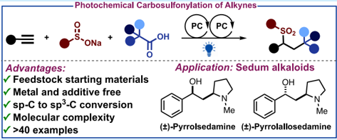
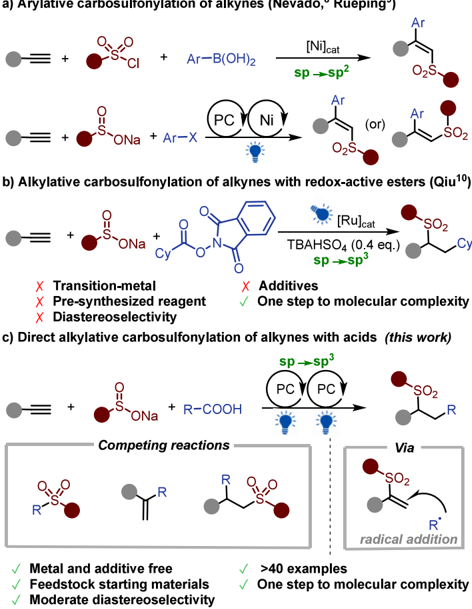
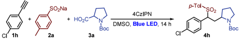
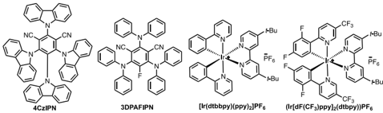
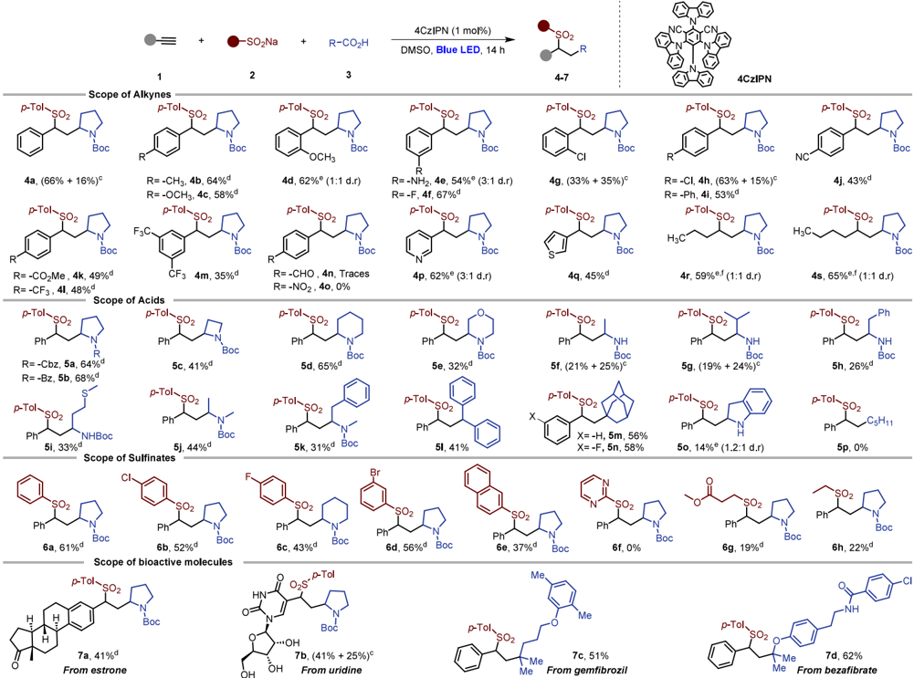
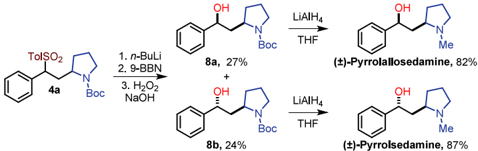
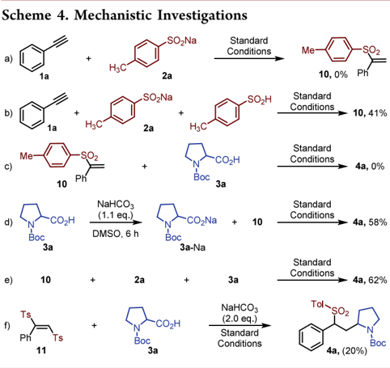
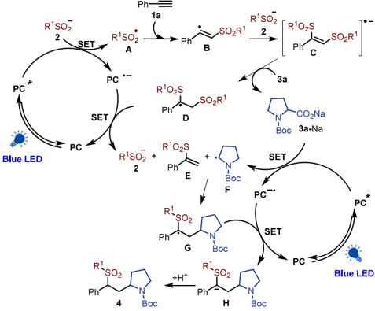

[pubs.acs.org/OrgLett](pubs.acs.org/OrgLett?ref=pdf)

## Carbosulfonylation of Alkynes: A Direct Conversion of sp -C to sp 3 -C through Visible Light-Mediated 3 -Component Reaction

Mandapati Bhargava Reddy, Vanessa E. Becker, and Eoghan M. McGarrigle *

Cite This: Org. Lett.

2024, 26, 7858-7863

## ACCESS

[Metrics &amp; More](https://pubs.acs.org/doi/10.1021/acs.orglett.4c02700?goto=articleMetrics&ref=pdf)

[Article Recommendations](https://pubs.acs.org/doi/10.1021/acs.orglett.4c02700?goto=recommendations&?ref=pdf)

ABSTRACT: A 3-component metal-free carbosulfonylation of alkynes is reported using readily available alkyl carboxylic acids and arylsulfinates under visible light irradiation. This photochemical approach gives direct conversion of sp-C to sp 3 -C yielding highly functionalized alkyl sulfones. It employs feedstock chemicals as starting materials and shows a broad substrate scope and moderate diastereoselectivity. The method's utility is highlighted in the synthesis of sedum alkaloids. A single photocatalyst is proposed to be active in two distinct photocatalytic cycles operating in tandem.

[Supporting Information](https://pubs.acs.org/doi/10.1021/acs.orglett.4c02700?goto=supporting-info&ref=pdf)

A lkyne difunctionalizations are some of the most straightforward approaches to construct highly functionalized and complex molecules in a single step. 1 In particular, multicomponent difunctionalizations involving feedstock chemicals can convert alkynes into valuable organic compounds in a single step. 2 In this context, decarboxylative carbofunctionalizations involving abundant feedstock chemicals and carboxylic acids have gained attention. 3 MacMillan and Rueping have developed metallaphotoredox-catalyzed Markovnikov and anti-Markovnikov type hydroalkylations of alkynes with alkyl carboxylic acids to give alkene products. 4 Despite recent advances, direct carbofunctionalizations of alkynes involving carboxylic acids are limited to 2-component couplings and they generally require metal catalysts and additives. Herein, we report a direct 3-component carbofunctionalization of alkynes using carboxylic acids and sulfinates to make alkyl sulfones.

Alkyl sulfones are versatile compounds due to their importance in material science, synthetic chemistry, and pharmaceuticals. 5 Furthermore, alkyl sulfones have recently emerged as radical acceptors in photochemical reactions. 6 Carbosulfonylation of alkynes is one of the simplest approaches to construct complex sulfone-containing compounds. 7 In 2017, Nevado reported the nickel-catalyzed carbosulfonylation of alkynes with arylboronic acids and sulfonyl chlorides via sulfonyl radicals. 8 Recently, Rueping developed a stereocontrolled carbosulfonylation of alkynes using aryl halides and aryl sulfinates under metallaphotoredox conditions (Scheme 1a). 9 These two examples are sp-C to sp 2 -C carbosulfonylations yielding a new sp 2 -sp 2 C -C bond. Very recently, Qiu reported sp 2 /sp-C to sp 3 -C alkylative carbosulfonylation of alkenes and alkynes to give products with sp 3 -sp 3 C -C bonds, but using redox-active esters (Scheme 1b). 10 These carbosulfonylation protocols are underexplored and generally require transition metal catalysts. Thus, an efficient

metal-free carbosulfonylation of alkynes from readily available starting materials and abundant feedstock chemicals is highly desirable. We report here the development of such a method.

Recently, organic organophotoredox catalysis has gained an important role in organic synthesis due to the broad range of substrates, scope of reactions, and as an alternative to transition metal catalysis. 11 In particular, 4CzIPN and other similar organic photocatalysts have emerged as alternatives to more traditional Ir-based photocatalysts. 12 These organophotocatalysts can generate alkyl radicals from carboxylic acids via single-electron transfer (SET). 13 Inspired by previous results and to further explore our interest in metal-free sulfonylations, 14a,b we have developed a highly regioselective carbosulfonylation of alkynes with readily available carboxylic acids and arylsulfinates to access sp 3 -rich valuable alkyl sulfones in a single step. 14c

We began with 4-chlorophenylacetylene 1h , p -toluenesulfinate 2a , and Boc-L-proline 3a as model substrates to develop a photochemical carbosulfonylation procedure (Table 1). After screening, it was found that visible light irradiation of a 1:2:2 mixture of 1h : 2a : 3a with 4CzIPN as catalyst (1 mol %) in DMSO under nitrogen for 14 h gave the desired carbosulfonylated product 4h in 82% spectroscopic yield in a 4:1 d.r. The major diastereomer was isolated in 63% yield (entry 1). A solvent screen identified DMSO as the best solvent (entries 1 -4). The introduction of Cs2CO3 led to a lowered yield of product 4h (entry 5). 4CzIPN was found to

Received:

July 23, 2024

Revised:

September 2, 2024

Accepted:

September 6, 2024

Published:

September 11, 2024

Scheme 1. Approaches to Carbosulfonylation of Alkynes

be the best photocatalyst, with 3DPAFIPN failing to produce the desired product 4h and iridium-based photocatalysts being less efficient (entries 6 -8). No further improvement was observed when catalyst loading was doubled (entry 9). Using air instead of a nitrogen atmosphere gave only 56% of desired product 4h (entry 10). Both photocatalyst and blue light irradiation were confirmed to be required (entries 11, 12). For further optimization, see the Supporting Information (SI).

Having found suitable reaction conditions, we examined the generality of this method, starting by varying the alkyne (Scheme 2). The photochemical carbosulfonylation was successful with phenylacetylenes bearing electron-donating groups such as 4-Me and 4-OMe reacting with sodium p -toluenesulfinate 2a and Boc-L-proline 3a to give 4b and 4c with a 64% and 58% yield of the major diastereomer, respectively. 2-OMe and 3-NH2 substituted phenylacetylenes afforded 4d and 4e in 62% and 54% yield, respectively, as a mixture of diastereomers. Halogen-substituted phenylacetylenes (3-F, 2-Cl, and 4-Cl) were also suitable substrates for the carbosulfonylation reaction and gave the corresponding products 4f -4h in good yields. Phenylacetylenes with electron-withdrawing groups such as 4-CN, 4-COOMe, -CF3, and 4-Ph effectively reacted to give 4i -4m in moderate yields. In contrast, 4-NO2 and 4-CHO substituted phenylacetylenes failed to afford the desired products 4n and 4o . Gratifyingly, heteroaromatic-substituted alkynes bearing pyridine and thiophene rings and aliphatic alkynes were also well tolerated under this protocol, giving sulfones 4p -4s in 45 -65% yield.

Next, we explored the scope with a range of alkyl carboxylic acids under the optimized reaction conditions (Scheme 2). Cyclic secondary carboxylic acids with a variety of protecting

## Table 1. Optimization of Reaction Conditions a

a Reaction conditions: 1h (0.1 mmol), 2a (0.2 mmol), 3a (0.2 mmol), and catalyst (1 mol %) in 2 mL solvent were irradiated with blue LED (456 nm, 40W) in the presence of N2 atmosphere. b Yields and selectivity were determined by NMR with 1,3,5-trimethoxybenzene as an internal standard. Isolated yield of major diastereomer in parentheses. DMC = Dimethyl carbonate.

groups and ring sizes were suitable for this photochemical carbosulfonylation and gave the corresponding products 5a -5e in good yields. To further expand the substrate scope of carboxylic acids, various acyclic amino acids were screened using our protocol. The desired products 5f -5k were formed in moderate yields. To our delight, carboxylic acids without an α -heteroatom such as diphenylacetic acid and 1-adamantanecarboxylic acid also gave the desired products 5l -5n in 41%, 56%, and 58% yield, respectively. Indoline-2-carboxylic acid gave the corresponding product 5o in lower yield, but primary carboxylic acids such as hexanoic acid failed to produce the desired product 5p . For primary carboxylic acids use of the redox-active ester in Qiu's carbosulfonylation of alkenes provides the desired product. 10 Finally, we explored the substrate scope with respect to sulfinates and late-stage modification of bioactive molecules. Aryl sulfinates bearing halogens in the p -or m -positions gave the corresponding products 6b -6d in good yields. Sodium naphthalene-2sulfinate gave the corresponding sulfone 6e in moderate yield but pyrimidine sufinate failed to afford corresponding product 6f under this protocol. Notably, sodium alkylsulfinates also reacted to give the desired products 6g and 6h , albeit in lower yield. Alkynes derived from bioactive molecules such as

## Scheme 2. Reaction Scope

a Reaction conditions: 1 (0.1 mmol), 2 (0.2 mmol), 3 (0.2 mmol) and catalyst (1 mol %) in DMSO (2 mL) irradiation with blue LED (456 nm, 40W) under N2. b Isolated yields. c Isolated yields of both diastereomers. d Isolated yield of major diastereomer (4:1 d.r.). e Isolated yield of mixture of diastereomers. f Isolated yield after Boc deprotection.

estrone and uridine gave the corresponding products in good yields. Further, bioactive molecules containing carboxylic acids such as gemfibrozil and bezafibrate also smoothly underwent the reaction and afforded the corresponding products in 51% and 62% yields, respectively. To demonstrate its utility, we applied our methodology to the synthesis of the sedum alkaloids pyrrolallosedamine and pyrrolsedamine (Scheme 3), natural products that are effective in the treatment of cognitive disorders. 15

To gain insights into the mechanism of the reaction, we performed a series of quenching and control experiments (Scheme 4 and see the SI). Addition of the radical scavenger

## Scheme 3. Application to the Synthesis of Sedum Alkaloids

TEMPO to standard reaction conditions stopped the production of 4a , and the TEMPO adduct of both the tosyl

radical and the alkyl radical were detected by HRMS (see SI). Treatment of alkyne 1a with sulfinate 2a under optimized conditions failed to give vinyl sulfinate 10 , 16 but 10 was produced in the presence of sulfinic acid (Scheme 4a,b). The reaction of proposed vinyl sulfonate intermediate 10 with BocL-proline 3a under optimized conditions failed to produce 4a (Scheme 4c). In contrast, the reaction of 10 with presynthesized Boc-Pro-ONa ( 3a-Na ) or sulfinate 2a with Boc-L-proline 3a gave the desired product 4a in 58% and 62% yields, respectively (Scheme 4d,e). This reveals that sodium sulfinate 2a plays a role in the generation of the alkyl radical in reaction mixture and supports a proposal that vinyl sulfinate 10 may be one of the intermediates of the reaction. This was further supported by reaction monitoring by NMR spectroscopy (SI Figure S3). When the disulfone compound 11 was synthesized and treated with acid 3a in the presence of NaHCO3, the desired product 4a was obtained in 20% yield (Scheme 4f), supporting our proposal of a bis-sulfonyl intermediate. In Stern -Volmer quenching experiments, the 4CzIPN was quenched by sulfinate 2a and a mixture of both 2a and acid 3a ; it failed to quench by acid 3a alone, indicating the importance of sodium sulfinate to the generation of alkyl radical from 3a (see SI).

Scheme 5. Plausible Mechanistic Proposal (PC = 4CzIPN)

Based on the above experiments and previous literature, 3c,6b,13,16,17 we propose the reaction pathway shown in Scheme 5. Absorption of blue light generates the excited photocatalyst PC * which then oxidizes sodium sulfinate 2 to form sulfinyl radical A ( E 1/2 (PhO2S · /PhSO2Na) = -0.37 vs SCE) along with PC ·-( E 1/2 (PC * /PC ·-) = +1.43 vs SCE). 18 Then sulfinyl radical A reacts with the alkyne to form vinyl radical B . 8 Sodium sulfinate 2 then reacts with vinyl radical B to form radical anion C . 17 The radical anion C is protonated by acid 3a to give radical D and the proline salt 3a-Na . SET quenches the PC ·-and then the resulting anion undergoes elimination of sulfinate 2 to give vinyl sulfone E . This proposal may resolve the apparent contradictory literature proposals (see the SI for further discussion). 19 Thus, sulfinate is proposed to act as a sulfinyl radical source and a catalyst. 7d The proline salt 3a-Na reacts with the excited photocatalyst PC * to form alkyl radical F . Vinyl sulfone E reacts with the alkyl radical F to give G . SET with PC ·-gives anion H and regenerates PC. Protonation of H gives the final product 4 .

The success of the 3-component reaction relies on the radicals A and F behaving differently. We speculate that slow generation of 3a-Na (and thus F ), as the byproduct of formation of D , may help to regulate the 3-component reaction; the electrophilic sulfinyl radical A would be expected to react preferentially with electron-rich 1a , while nucleophilic alkyl radical F reacts preferentially with electron-poor E . In contrast, the reactions of A with E , and F with 1a would be expected to be slow. Such considerations may enable the development of other 3-component reactions involving two different radicals reacting sequentially. Dual photoredox 20 processes involving a single photocatalyst in two distinct cycles have great potential for rapid assembly of complex molecules.

In conclusion, we have demonstrated a robust carbosulfonylation of alkynes to give alkyl sulfones using readily available alkyl carboxylic acids and sodium sulfinates under photochemical conditions. This mild, metal-free sp-C to sp 3 -C reaction protocol has a broad substrate scope with high functional group tolerance. It enables the generation of novel functionalized alkyl sulfones in a single step from common feedstock chemicals. Furthermore, we synthesized two sedum alkaloids as an application of our methodology. We have proposed a plausible mechanism which is supported by quenching and control experiments. We anticipate the synthesis of these novel alkyl sulfones will enable further applications in synthetic chemistry.

## ■ ASSOCIATED CONTENT

## Data Availability Statement

The data underlying this study are available in the published article and its online Supporting Information.

## * sı Supporting Information

The Supporting Information is available free of charge at https://pubs.acs.org/doi/10.1021/acs.orglett.4c02700.

Experimental procedures and 1 H and 13 C NMR spectra for all new compounds (PDF)

FAIR data, including the primary NMR FID files, for compound(s) 4a -m , p -s , 5a -o , 6a -e , g , h , 7a -d , 8a , b , 9 , 10 , 10f , pyrrolsedamine, and pyrolallosedamine (ZIP)

## ■ AUTHOR INFORMATION

## Corresponding Author

Eoghan M. McGarrigle -Centre for Synthesis &amp; Chemical Biology, UCD School of Chemistry, Dublin 4, Ireland; A2P CDT in Sustainable Chemistry and BiOrbic Bioeconomy SFI Research Centre, University College Dublin, Dublin 4, Ireland; orcid.org/0000-0001-8160-6431; Email: eoghan.mcgarrigle@ucd.ie

## Authors

Mandapati Bhargava Reddy -Centre for Synthesis &amp; Chemical Biology, UCD School of Chemistry, Dublin 4, Ireland; A2P CDT in Sustainable Chemistry and BiOrbic Bioeconomy SFI Research Centre, University College Dublin, Dublin 4, Ireland

Vanessa E. Becker -Centre for Synthesis &amp; Chemical Biology, UCD School of Chemistry, Dublin 4, Ireland

Complete contact information is available at: https://pubs.acs.org/10.1021/acs.orglett.4c02700

## Author Contributions

MBR and VEB, conceptualization, investigation, methodology, writing. EMM, conceptualization, supervision, writing. All authors have approved the final version of the manuscript.

## Notes

The authors declare no competing financial interest.

## ■ ACKNOWLEDGMENTS

MBR and VEB thank the Irish Research Council for a Postdoctoral Fellowship (GOIPD/2022/576) and Postgraduate Scholarship (GOIPG/2021/1056). We thank SFI (18/RI/ 5702) for MS infrastructure, the A2P CDT supported by Science Foundation Ireland (SFI) and the Engineering and Physical Sciences Research Council (EPSRC) under Grant No. 18/EPSRC-CDT/3582 and BiOrbic, the Bioeconomy SFI Research Centre, funded by Ireland's European Structural and Investment Programmes, Science Foundation Ireland (16/ RC/3889) and European Regional Development Fund. We thank Prof. D. Gilheany (UCD) and B. Bieszczad (UCD) for helpful discussions.

## ■ REFERENCES

- (1) (a) Gupta, S.; Kundu, A.; Ghosh, S.; Chakraborty, A.; Hajra, A. Visible-Light-Induced Organophotoredox-Catalyzed Difunc-tionlization of Alkenes and Alkynes. Green Chem. 2023 , 25 , 8459 -8493. (b) Hu, C.; Mena, J.; Alabugin, I. V. Design Principles of the use of Alkynes in Radical Cascades. Nat. Rev. Chem. 2023 , 7 , 405 -423. (c) Wille, U. Radical Cascades Initiated by Intermolecular Radical Addition to Alkynes and Related Triple Bond Systems. Chem. Rev. 2013 , 113 , 813 -853.
- (2) (a) Zhu, S.; Zhao, X.; Li, H.; Chu, L. Catalytic ThreeComponent Dicarbofunctionalization Reactions Involving Radical Capture by Nickel. Chem. Soc. Rev. 2021 , 50 , 10836 -10856. (b) Ruijter, E.; Scheffelaar, R.; Orru, R. V. A. Multicomponent Reaction Design in the Quest for Molecular Complexity and Diversity. Angew. Chem., Int. Ed. 2011 , 50 , 6234 -6246.
- (3) (a) Rahaman, A.; Chauhan, S. S.; Bhadra, S. Recent Advances in Catalytic Decarboxylative Transformations of Carboxylic Acid Groups Attached to a Non-Aromatic sp2 or sp Carbon. Org. Bio-mol. Chem. 2023 , 21 , 5691 -5724. (b) Mega, R. S.; Duong, V. K.; No-ble, A.; Aggarwal, V. K. Decarboxylative Conjunctive Cross-cou-pling of Vinyl Boronic Esters using Metallaphotoredox Catalysis. Angew. Chem., Int. Ed. 2020 , 59 , 4375 -4379. (c) Chan, A.; Perry, I.; Bissonnette, N.; Buksh, B.; Edwards, G.; Frye, L.; Garry, O.; Lavagnino, M.; Li, B.; Liang, Y.; et al. Metallaphotoredox: The Merger of Photoredox and Transition Metal Catalysis. Chem. Rev. 2022 , 122 , 1485 -1542. (d) Tibbetts, J. D.; Cresswell, A. J.; Askey, H.; Cao, Q.; Grayson, J.; Hobson, S.; Johnson, G.; Turner-Dore, J. Decarboxylative, Radical C -C Bond Formation with Alkyl or Aryl Carboxylic Acids: Recent Advances. Synthesis 2023 , 55 , 3239 -3250.
- (4) (a) Till, N. A.; Smith, R. T.; MacMillan, D. W. C. Decarboxylative Hydroalkylation of Alkynes. J. Am. Chem. Soc. 2018 , 140 , 5701 -5705. (b) Yue, H.; Zhu, C.; Kancherla, R.; Liu, F.; Rueping, M. Regioselective Hydroalkylation and Arylalkylation of Alkynes by Photoredox/Nickel Dual Catalysis: Application and Mechanism. Angew. Chem., Int. Ed. 2020 , 59 , 5738 -5746.
- (5) (a) Monos, T. M.; McAtee, R. C.; Stephenson, C. R. J. Arylsulfonylacetamides as Bifunctional Reagents for Alkene AminoArylation. Science 2018 , 361 , 1369 -1373. (b) Kaiser, D.; Klose, I.; Oost, R.; Neuhaus, J.; Maulide, N. Bond-Forming and -Breaking Reactions at Sulfur(IV): Sulfoxides, Sulfonium Salts, Sulfur Ylides, and Sulfinate Salts. Chem. Rev. 2019 , 119 , 8701 -8780. (c) Zhang, X.; Chen, K.; Sun, Z.; Hu, G.; Xiao, R.; Cheng, H.-M.; Li, F. StructureRelated Electrochemical Performance of Organosulfur Compounds for Lithium-Sulfur Batteries. Energy Environ. Sci. 2020 , 13 , 1076 -1095. (d) Feng, M.; Tang, B.; Liang, S. H.; Jiang, X. Sulfur Containing
6. Scaffolds in Drugs: Synthesis and Application in Medicinal Chemistry. Curr. Top. Med. Chem. 2016 , 16 , 1200 -1216.
- (6) (a) Smith, J. M.; Dixon, J. A.; deGruyter, J. N.; Baran, P. S. Alkyl Sulfinates: Radical Precursors Enabling Drug Discovery. J. Med. Chem. 2019 , 62 , 2256 -2264. (b) Ociepa, M.; Turkowska, J.; Gryko, D. Redox-Activated Amines in C(sp3)-C(sp) and C(sp3)-C(sp2) Bond Formation Enabled by Metal-Free Photoredox Catalysis. ACS Catal. 2018 , 8 , 11362 -11367.
- (7) (a) Long, T.; Zhu, C.; Li, L.; Shao, L.; Zhu, S.; Rueping, M.; Chu, L. Ligand-Controlled Stereodivergent Alkenylation of Alkynes to access Functionalized Trans- and Cis-1,3-dienes. Nat. Commun. 2023 , 14 , 55. (b) Zhou, Y.; Qin, Y.; Wang, Q.; Zhang, Z.; Zhu, G. Photocatalytic Sulfonylcarbocyclization of Alkynes Using SEt as a Traceless Directing Group: Access to Cyclopentenes and Indenes. Angew. Chem., Int. Ed. 2022 , 61 , No. e202110864. (c) Xie, S.; Li, Y.; Liu, P.; Sun, P. Visible Light-induced Radical Addition/Annulation to Construct Phenylsulfonyl-functionalized Dihydrobenzofurans In-volving an Intramolecular 1,5-Hydrogen Atom Transfer Process. Org. Lett. 2020 , 22 , 8774 -8779. (d) Gao, Y.; Liu, S.; Su, W. CO2-Facilitated Radical Sequential (3 + 2) Annulationof 1,6-Enynes via Cooperation of Sulfinate Catalysis and Photocatalysis. Green Chem. 2023 , 25 , 7335 -7343.

̈

- (8) García-Domínguez, A.; Mu ller, S.; Nevado, C. Nickel-Catalyzed Intermolecular Carbosulfonylation of Alkynes via Sulfonyl Radi-cals. Angew. Chem., Int. Ed. 2017 , 56 , 9949 -9952.
- (9) Zhu, C.; Yue, H.; Maity, B.; Atodiresei, I.; Cavallo, L.; Rueping, M. A Multicomponent Synthesis of Stereodefined Olefins via Nickel Catalysis and Single Electron/Triplet Energy Transfer. Nat. Catal. 2019 , 2 , 678 -687.
- (10) Lu, L.; Wang, H.; Huang, S.; Xiong, B.; Zeng, X.; Ling, Y.; Qiu, X. Photoredox Catalysis in Alkene and Alkyne Alkylsulfonyla-tions: the Construction of Markovnikov Selective α -Sulfones. Chem. Commun. 2023 , 59 , 10420 -10423.
- (11) (a) Bortolato, T.; Cuadros, S.; Simionato, G.; Dell'Amico, L. The Advent and Development of Organophotoredox Catalysis. Chem. Commun. 2022 , 58 , 1263 -1283. (b) Romero, N. A.; Nicewicz, D. A. Organic Photoredox Catalysis. Chem. Rev. 2016 , 116 , 10075 -10166.
- (12) Shang, T. Y.; Lu, L. H.; Cao, Z.; Liu, Y.; He, W. M.; Yu, B. Recent Advances of 1,2,3,5-Tetrakis(Carbazol-9-yl)-4,6-Dicyanobenzene (4CzIPN) in Photocatalytic Transformations. Chem. Commun. 2019 , 55 , 5408 -5419.
- (13) (a) Paul, S.; Filippini, D.; Silvi, M. Polarity Transduction Enables the Formal Electronically Mismatched Radical Addition to Al-kenes. J. Am. Chem. Soc. 2023 , 145 , 2773 -2778. (b) Shu, C.; Mega, R. S.; Andreassen, B. J.; Noble, A.; Aggarwal, V. K. Synthesis of Functionalized Cyclopropanes from Carboxylic Acids by a Radical Ad-dition-Polar Cyclization Cascade. Angew. Chem., Int. Ed. 2018 , 57 , 15430 -15434.
- (14) (a) Bhargava Reddy, M.; McGarrigle, E. M. Visible-lightinduced bifunctionalisation of (homo) propargylic amines with CO 2 and arylsulfinates. Chem. Commun. 2023 , 59 , 13711 -13714. (b) Bhargava Reddy, M.; McGarrigle, E. M. Iodine-Mediated Photoinduced Tuneable Disulfonylation and Sulfinylsulfonylation of Alkynes with Sodium Arylsulfinates. Chem. Commun. 2023 , 59 , 7767 -7770. (c) Preprint of this article: 10.26434/chemrxiv-2024-127pg.
- (15) (a) Bhosale, V. A.; Markad, S. B.; Waghmode, S. B. A Concise Enantioselective Synthesis of Pyrrolidine Sedum Alkaloids ( R )-( R )-(+), ( S )-( S )-( -)-Pyrrolsedamine and ( S )-( R )-(+)-Pyrrolal-losedamine by Using Proline Catalysed α -Amination Reaction. Tetrahedron 2017 , 73 , 5344 -5349. (b) Davies, S. G.; Fletcher, A. M.; Roberts, P. M.; Smith, A. D. Asymmetric Synthesis of Sedum Al-kaloids via Lithium Amide Conjugate Addition. Tetrahedron 2009 , 65 , 10192 -10213.
- (16) Wang, H.; Lu, Q.; Chiang, C.-W.; Luo, Y.; Zhou, J.; Wang, G.; Lei, A. Markovnikov-Selective Radical Addition of S-Nucleophiles to Terminal Alkynes through a Photoredox Process. Angew. Chem., Int. Ed. 2017 , 56 , 595 -599.
- (17) Burykina, J. V.; Shlapakov, N. S.; Gordeev, E. G.; König, B.; Ananikov, V. P. Selectivity Control in Thiol-Yne Click Reactions Via

- Visible Light Induced Associative Electron Upconversion. Chem. Sci. 2020 , 11 , 10061 -10070.
- (18) Du, X. Y.; Cheng-Sánchez, I.; Nevado, C. Dual Nickel/Photoredox-Catalyzed Asymmetric Carbosulfonylation of Alkenes. J. Am. Chem. Soc. 2023 , 145 , 12532 -12540.
- (19) The regioselectivity of reactions in ref 16 is contrary to that observed by Sun, Nevado, and Rueping [refs 7c, 8, 9].
- (20) Skubi, K. L.; Blum, T. R.; Yoon, T. P. Dual Catalysis Strategies in Photochemical Synthesis. Chem. Rev. 2016 , 116 , 10035 -10074.

