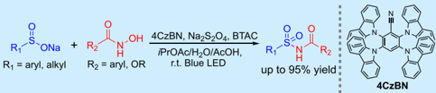
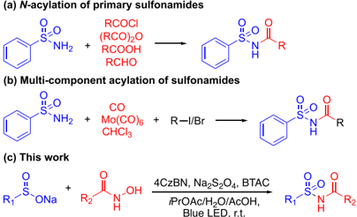
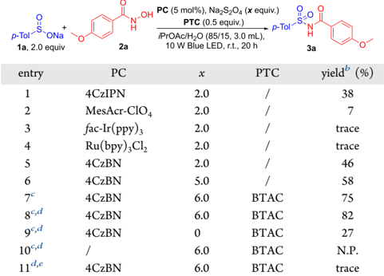
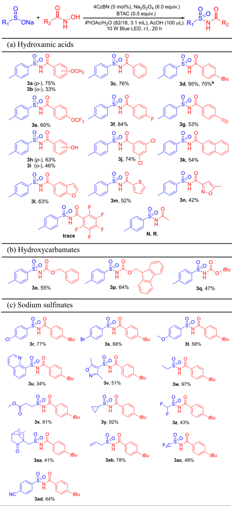
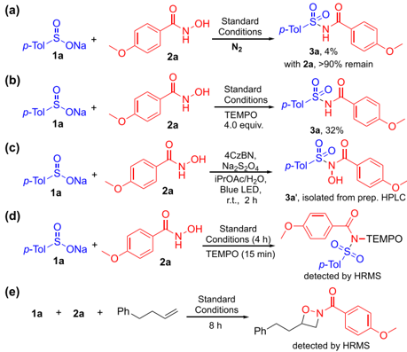
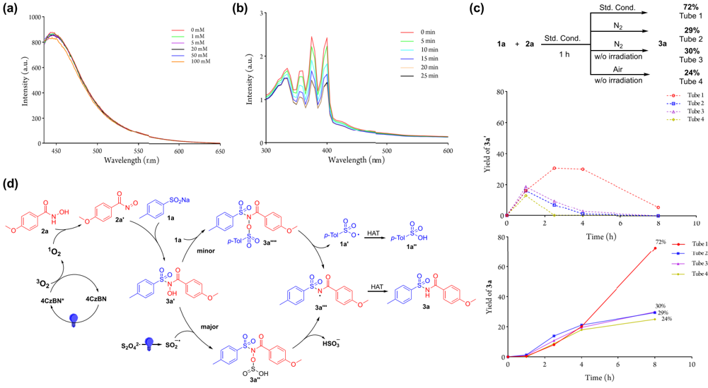

[pubs.acs.org/OrgLett](pubs.acs.org/OrgLett?ref=pdf)

## Transition-Metal Free Photocatalytic Synthesis of Acylsulfonamides

Long Yin Lam and Cong Ma *

Cite This:

Org. Lett. 2025, 27, 4732-4736

## ACCESS

[Metrics &amp; More](https://pubs.acs.org/doi/10.1021/acs.orglett.5c01129?goto=articleMetrics&ref=pdf)

[Article Recommendations](https://pubs.acs.org/doi/10.1021/acs.orglett.5c01129?goto=recommendations&?ref=pdf)

ABSTRACT: We have developed a transition-metal-free photocatalytic S -N coupling reaction utilizing sodium organosulfinate and hydroxamic acid to synthesize acylsulfonamides. Employing 2,3,5,6-tetra(9H-carbazol-9-yl)benzonitrile (4CzBN) as a photocatalyst, this method enables the preparation of a wide range of acylsulfonamides from arylhydroxamic acids or N -hydroxycarba-

[Supporting Information](https://pubs.acs.org/doi/10.1021/acs.orglett.5c01129?goto=supporting-info&ref=pdf)

mates. Mechanistic studies indicate that the generation of singlet oxygen ( 1 O2) via the Energy Transfer Process (EnT) is crucial for facilitating the reaction. This approach offers a sustainable and efficient pathway for acylsulfonamide synthesis under mild conditions.

A cylsulfonamides are fundamental scaffolds in pharmaceutical development due to their broad range of biological activities. 1 They are widely recognized as bioisosteres of carboxylic acid groups, attributed to their similar acidity and resistance to chemical and enzymatic hydrolysis. In addition to serving as direct drug motifs, acylsulfonamide scaffolds are extensively utilized in solid-phase peptide synthesis 2 and as acylating agents for amines. 3 These versatile applications underscore their significance in medicinal chemistry and synthetic methodologies.

The prominent role of acylsulfonamides in medicinal chemistry has spurred extensive research into their synthesis. Traditional methods for synthesizing acylsulfonamides typically involve the acylation of primary sulfonamides using various acylating agents, such as acyl chlorides, 1,4 acid anhydrides, 5,6 or carboxylic acids with the assistance of coupling reagents (Scheme 1a). 7 -9 Lewis acids, including TiCl4, 10 Bi(OTf)3, 11 Fe3O4 -diatomite, 12 and Fe3O4/SnO nanoparticles, 13 have been employed as efficient catalysts for the N -acylation of sulfonamides. However, the use of acyl chlorides and anhydrides is unfavored and declining due to their susceptibility to hydrolysis and chemoselectivity issues

## Scheme 1. Methods for Preparing Acylsulfonamides

## Table 1. Optimization Study a

| entry    | PC             |   x | PTC   | yield b (%)   |
|----------|----------------|-----|-------|---------------|
| 1        | 4CzIPN         | 2.0 | /     | 38            |
| 2        | MesAcr-ClO 4   | 2.0 | /     | 7             |
| 3        | f ac-Ir(ppy) 3 | 2.0 | /     | trace         |
| 4        | Ru(bpy) 3 Cl 2 | 2.0 | /     | trace         |
| 5        | 4CzBN          | 2.0 | /     | 46            |
| 6        | 4CzBN          | 5.0 | /     | 58            |
| 7 c      | 4CzBN          | 6.0 | BTAC  | 75            |
| 8 c , d  | 4CzBN          | 6.0 | BTAC  | 82            |
| 9 c , d  | 4CzBN          |   0 | BTAC  | 27            |
| 10 c , d | /              | 6.0 | BTAC  | N.P.          |
| 11 d , e | 4CzBN          | 6.0 | BTAC  | trace         |

a Reaction conditions: 1a (0.6 mmol), 2a (0.3 mmol), PC (5 mol %), Na2S2O4 (0.3 × x mmol), PTC (0.15 mmol) and i PrOAc/H2O (85/ 15, 3.0 mL) were irradiated with 10 W blue LED at room temperature (rt) for 20 h. b HPLC yield. c 3.1 mL solvent ( i PrOAc 2.55 mL + H2O 0.55 mL). d Addition of 100 μ L AcOH. e Only i PrOAc is used as a solvent.

with important pharmaceutical functional groups, such as -OH and -NH2, which are prone to nucleophilic substitution.

To avoid the use of acyl chlorides and anhydrides, innovative protocols have been developed that utilize aldehydes as efficient acyl surrogates for the N -acylation of sulfonamides, facilitated by Rh(II) catalysts 14 or organo-

Received:

March 20, 2025

Revised:

April 25, 2025

Accepted:

April 28, 2025

Published:

April 30, 2025

Table 2. Substrate Scope of the Reaction a

a Isolated yield. Reaction conditions: sodium organosulfinate (0.6 mmol), hydroxamic acid (0.3 mmol), 4CzBN (5 mol %), Na2S2O4 (1.8 mmol), BTAC (0.15 mmol), i PrOAc (2.55 mL), H2O (0.55 mL) and AcOH (100 uL) were stirred under 10 W blue LED irradiation for 20 h at rt. b 1.5 mmol scale.

catalysts (Scheme 1a). 15 Additionally, multicomponent reactions have been explored for the acylation of sulfonamides. By employing carbonyl sources such as CO, 16 Mo(CO)6, 17,18 or CHCl3, 19 sulfonamides can be coupled with aryl halides to produce acylsulfonamides through a sequential formation of N -C and C -C bonds (Scheme 1b). Despite these advancements, many methods still depend on the nucleophilic substitution of the sulfonamide -NH2 group or require

## Scheme 2. Control Experiments

catalytic or stoichiometric amounts of transition metals to drive the reaction. Moreover, current synthetic protocols often begin with primary sulfonamides, which limits the diversity of available methods for accessing acylsulfonamides. The preparation of acylsulfonamides via the transfer of a sulfamoyl group has also been reported using Burgess inner salts 20,21 or chlorosulfonylcarbamates. 22,23 However, these methods often face challenges due to the need for reactive starting materials or restricted substrate tolerability.

We are interested in expanding the synthetic applications of sodium organosulfinate salts to prepare a variety of pharmaceutically important sulfur-containing scaffolds. 24 -27 In our previous study on the preparation of arylsulfonamides, we observed that benzamide remained intact under persulfate oxidation, highlighting the challenge of directly oxidizing benzamide. 26 This finding prompted us to explore the synthesis of acylsulfonamides using alternative amide surrogates to circumvent the high activation barrier associated with benzamide. Among the various amide surrogates, we selected hydroxamic acid for investigation due to its higher oxidation state of the nitrogen atom, compared to benzamide and its ease of preparation from carboxylic acids. While hydroxamic acid is often used as a synthon in cycloaddition reactions, 28 -30 its application in other synthetic areas has been underexplored. Herein, we present a new synthetic protocol for the preparation of acylsulfonamides via a photocatalytic reaction with sodium organosulfinates and hydroxamic acid (Scheme 1c).

To begin, sodium p -toluenesulfinate ( 1a ) and 4-methoxybenzohydroxamic acid ( 2a ) were selected as model substrates for the optimization study. Following preliminary screening of reaction conditions (see Tables S1 and S2 in the Supporting Information), the desired acylsulfonamide ( 3a ) was obtained in a 38% yield using 1,2,3,5-tetrakis(carbazol-9-yl)4,6-dicyanobenzene (4CzIPN) 31,32 as the photocatalyst (PC) and Na2S2O4 as the reductant under 10 W blue LED irradiation (Table 1, entry 1). We then evaluated other photocatalysts (Table 1, entries 2 -4), but neither acridinium-, Ru- nor Irbased photocatalysts produced satisfactory results. To further improve the reaction, several cyanoarene-based catalysts were synthesized via SNAr reactions between polyfluorinated cyanoarenes and substituted carbazoles to fine-tune the

(a)

(d)

1000·

800-

Intensity (a.u.)

600 -

400

200-

450

2a

302

4CZBN*

0mM

1 mM

5 mM

20 mM

100 mM

0 min

15 min

20 min

Scheme 3. Mechanistic Studies: (a) Fluorescence Spectra of 4CzBN with Various Concentrations of 2a; (b) UV-Visible Spectra of ABDA with 4CzBN with Various Irradiation Time; (c) Time Trace Analysis of 3a and 3a ′ Formation under Different Conditions; and (d) Plausible Mechanism Tube 3

60-

Tube 4

photocatalyst's redox properties. 33,34 Among these, 2,3,5,6tetra(9H-carbazol-9-yl)benzonitrile (4CzBN) exhibited the highest catalytic activity, achieving a 58% yield with 5.0 equiv of Na2S2O4 (Table 1, entry 6). Given the biphasic nature of the reaction, we anticipated that adding a phase-transfer catalyst (PTC) would enhance mass transfer between phases. Indeed, the addition of benzyl trimethylammonium chloride (BTAC) increased the yield to 75% (Table 1, entry 7). Finally, the addition of acetic acid further enhanced the reaction, affording 3a in an 82% yield (Table 1, entry 8). In this reaction, the photocatalyst is indispensable, and the presence of Na2S2O4 and water can dramatically improve reaction yields (Table 1, entries 9 -11 and the SI). In the absence of Na 2S2O4, compound 3a can still be obtained in moderate yield. This is likely due to the excess of 1a acting as a reductant in the reaction. 35

With the optimal conditions established, we proceeded to investigate the functional group tolerance of hydroxamic acids and sodium organosulfinates for the synthesis of acylsulfonamides (Table 2). Benzohydroxamic acids with various para -substituents were successfully converted to acylsulfonamides with good yields ( 3a , 3c -3h ), notably achieving a 95% yield with the -t Bu substituent ( 3d ). Remarkably, the -OH substituent, typically susceptible to nucleophilic substitution, was also compatible with this reaction (3h and 3i) . We examined steric effects on reaction performance using o -OMe and o -OH substituted benzohydroxamic acids ( 3b and 3i ). The yields for these substrates were reduced compared to their para -substituted counterparts, with o -OMe showing a particularly pronounced effect ( 3b ). Additionally, polyaromatic and heteroaryl hydroxamic acids were employed to produce the corresponding acylsulfonamides with satisfactory yields ( 3k -3n ). Encouraged by the results with benzohydroxamic acids, we extended this reaction to N -hydroxycarbamates. Common alkyl N -hydroxycarbamates, such as benzyl, 9-fluorenylmethyl, and t Bu, were well-tolerated, yielding satisfactory results ( 3o -3q ). High electron-withdrawing pentafluorobenzohydroxamic acid or alkyl hydroxamic acid did not yield the desired product. Neither N -methylated nor O -methylated hydroxamic acids underwent the reaction, with most of the starting materials remaining unreacted. This suggests that methylation at either the nitrogen or oxygen position may hinder the reactivity of hydroxamic acids under the reaction conditions.

The scope of sodium arylsulfinate was also evaluated. Halogenated and p -OMe-substituted sodium benzenesulfinates served effectively as sulfonyl surrogates, yielding acylsulfonamides in satisfactory to good yields ( 3r -3t , 3ad ). When using sodium heteroarylsulfinates, the desired products were obtained in moderate to acceptable yields ( 3u and 3v ). Notably, sodium alkylsulfinates demonstrated compatibility with this reaction, outperforming sodium arylsulfinates. Simple alkyl groups were well-tolerated, achieving excellent yields ( 3w -3y ). Additionally, more challenging alkyl groups, such as difluoromethyl and trifluoromethyl, camphoric groups, and propyl-2-ene, were successfully utilized to produce the corresponding acylsulfonamides with moderate to good yields ( 3z -3ac ).

To elucidate the reaction mechanism, a series of control experiments was conducted (see Scheme 2 and the SI). Initially, the reaction was performed under a nitrogen atmosphere, which hindered the formation of 3a , with over 90% of 2a recovered from the reaction mixture. This underscores the crucial role of oxygen in the reaction (Scheme 2a). The addition of TEMPO also interfered with the formation of 3a , resulting in only a 32% yield (Scheme 2b). Time trace analysis of the reaction mixture led to the isolation

50 mM

(b)

(c)

Std. Cond

1 h

Std. Cond

N2

Nz w/o irradiation

За

72%

Tube 1

29%

Tube 2

30%

Tube 3

and identification of N -hydroxylacylsulfonamide ( 3a ′ ) as a key intermediate in the formation of 3a (Scheme 2c and SI). In a radical trap experiment with TEMPO, an N -centered radical species was trapped and detected by HRMS, suggesting a radical mechanism for the dehydroxylation of 3a ′ to 3a (Scheme 2d). Upon the addition of 4-phenylbutene as a trapping agent, a [2 + 2] cycloaddition product derived from 2a was detected by HRMS (an exemplary exo product is shown in Scheme 2e). This observation suggests the formation of an acylnitroso as a reaction intermediate. 30

Additionally, a fluorescence quenching experiment was conducted to identify the potential quenchers of 4CzBN. The result indicated that neither 1a nor 2a is an efficient quencher of 4CzBN (Scheme 3a and Figure S1). To further explore the role of oxygen in the reaction, 9,10-anthracenediylbis(methylene)dimalonic acid (ABDA) was used as a probe to assess the potential generation of singlet oxygen ( 1 O2) (Scheme 3b). The formation of 1 O2 would oxidize ABDA to endoperoxide species, resulting in decreased ABDA absorbance. 36 By irradiating 4CzBN with ABDA at different time intervals, a decrease in ABDA absorbance was observed, suggesting that 4CzBN generates 1 O2.

Time trace analysis was conducted to study the dehydroxylation process from 3a ′ to 3a (Scheme 3c). Initially, the reaction was irradiated for 1 h to generate 3a ′ , followed by continuation under various reaction conditions. The results showed that dehydroxylation proceeded smoothly, regardless of the presence of oxygen or irradiation, suggesting a nonphotocatalytic pathway.

Based on the control experiments and previous literature, a plausible mechanism is proposed (Scheme 3d). The reaction begins with the generation of singlet oxygen 1 O2 via an energy transfer pathway (EnT) from the excited state of 4CzBN (4CzBN * ), induced by photoirradiation. The 1 O2 then oxidizes 2a into a nitroso carbonyl intermediate ( 2a ′ ), 30,37 which subsequently reacts with 1a to produce 3a ′ . 38 Next, 3a ′ is reduced to an N -centered radical species 3a ′′′ , by a sulfur dioxide radical anion generated from the decomposition of Na2S2O4, 39 through the formation of an N -sulfinic acid acylsulfonamide adduct 3a ′′ . Excess 1a may also participate in the reduction of 3a ′ through the formation of 3a ′′′′ , which subsequently leads to 3a ′′′ and generates a sulfonyloxyl radical 1a ′ . 35 Finally, the desired product, 3a , is obtained through a hydrogen atom transfer (HAT) process involving 3a ′′′ .

In conclusion, we have developed a photocatalytic S -N coupling reaction between hydroxamic acid and sodium sulfinate for the synthesis of acylsulfonamides using the cyanoarene-based photocatalyst, 4CzBN. a diverse range of acylsulfonamides was successfully synthesized. Mechanistic studies suggest that EnT occurs between 4CzBN * and O2, generating 1 O2 to oxidize hydroxamic acid into a nitrosocarbonyl intermediate, facilitating further reaction.

## ■ ASSOCIATED CONTENT

## Data Availability Statement

The data underlying this study are available in the published article and its Supporting Information.

## * sı Supporting Information

The Supporting Information is available free of charge at https://pubs.acs.org/doi/10.1021/acs.orglett.5c01129.

Procedures, figures, full optimization conditions, characterization, and NMR spectra (PDF)

## ■ AUTHOR INFORMATION

## Corresponding Author

Cong Ma -State Key Laboratory of Chemical Biology and Drug Discovery, Department of Applied Biology and Chemical Technology, PolyU Marshall Research Centre for Medical Microbial Biotechnology, The Hong Kong Polytechnic University, Kowloon, Hong Kong SAR, China; orcid.org/0000-0001-9245-0356; Email: cong.ma@ polyu.edu.hk

## Author

Long Yin Lam -State Key Laboratory of Chemical Biology and Drug Discovery, Department of Applied Biology and Chemical Technology, PolyU Marshall Research Centre for Medical Microbial Biotechnology, The Hong Kong Polytechnic University, Kowloon, Hong Kong SAR, China; orcid.org/0000-0001-5503-0061

Complete contact information is available at: https://pubs.acs.org/10.1021/acs.orglett.5c01129

## Notes

The authors declare no competing financial interest.

## ■ ACKNOWLEDGMENTS

We gratefully acknowledge the financial support from the Research Grants Council of the Hong Kong Special Administrative Region, China (No. PolyU 15100022), Hong Kong Polytechnic University (State Key Laboratory of Chemical Biology and Drug Discovery and PolyU Marshall Research Centre for Medical Microbial Biotechnology). We thank the University Research Facility in Life Sciences (ULS) of the Hong Kong Polytechnic University for the technical assistance.

## ■ REFERENCES

- (1) Ammazzalorso, A.; De Filippis, B.; Giampietro, L.; Amoroso, R. N-acylsulfonamides: Synthetic routes and biological potential in medicinal chemistry. Chem. Biol. Drug Des. 2017 , 90 , 1094 -1105.
- (2) Kenner, G.; McDermott, J.; Sheppard, R. The safety catch principle in solid phase peptide synthesis. J. Chem. Soc. D: Chem. Commun. 1971 , 12 , 636 -637.
- (3) Guillard, S.; Aramini, A.; Cesta, M. C.; Colagioia, S.; Coniglio, S.; Genovese, F.; Nano, G.; Nuzzo, E.; Orlando, V.; Allegretti, M. NAcyltrifluoromethanesulfonamides as new chemoselective acylating agents for aliphatic and aromatic amines. Tetrahedron 2006 , 62 , 5608 -5616.
- (4) Yates, M. H.; Kallman, N. J.; Ley, C. P.; Wei, J. N. Development of an acyl sulfonamide anti-proliferative agent, LY573636 · Na. Org. Process Res. Dev. 2009 , 13 , 255 -262.
- (5) Le Bourdonnec, B.; Meulon, E.; Yous, S.; Goossens, J.-F.; Houssin, R.; Hénichart, J.-P. Synthesis and pharmacological evaluation of new pyrazolidine-3, 5-diones as AT1 angiotensin II receptor antagonists. J. Med. Chem. 2000 , 43 , 2685 -2697.
- (6) Hou, X.; Wang, Y.; Yang, Y.; Xiao, Z. Discovery of Novel Biphenyl Carboxylic Acid Derivatives as Potent URAT1 Inhibitors. Molecules 2023 , 28 , 7415.
- (7) Lobb, K. L.; Hipskind, P. A.; Aikins, J. A.; et al. Acyl Sulfonamide Anti-Proliferatives: Benzene Substituent Structure -Activity Relationships for a Novel Class of Antitumor Agents. J. Med. Chem. 2004 , 47 , 5367 -5380.
- (8) Rega, M. F.; Wu, B.; Wei, J.; Zhang, Z.; Cellitti, J. F.; Pellecchia, M. SAR by interligand nuclear Overhauser effects (ILOEs) based discovery of acylsulfonamide compounds active against Bcl-xL and Mcl-1. J. Med. Chem. 2011 , 54 , 6000 -6013.

- (9) Yokokawa, F.; Nilar, S.; Noble, C. G.; Lim, S. P.; Rao, R.; Tania, S.; Wang, G.; Lee, G.; Hunziker, J. r.; Karuna, R.; et al. Discovery of potent non-nucleoside inhibitors of dengue viral RNA-dependent RNA polymerase from a fragment hit using structure-based drug design. J. Med. Chem. 2016 , 59 , 3935 -3952.
- (10) Fu, S.; Lian, X.; Ma, T.; Chen, W.; Zheng, M.; Zeng, W. TiCl4promoted direct N-acylation of sulfonamide with carboxylic ester. Tetrahedron Lett. 2010 , 51 , 5834 -5837.
- (11) Adibi, H.; Massah, A. R.; Majnooni, M. B.; Shahidi, S.; Afshar, M.; Abiri, R.; Naghash, H. J. Synthesis, characterization, and antimicrobial evaluation of sulfonamides containing n-acyl moieties catalyzed by bismuth (III) salts under both solvent and solvent-free conditions. Synth. Commun. 2010 , 40 , 2753 -2766.
- (12) [Ghasemi, M. H.; Kowsari, E.; Hosseini, S. K. Catalytic activity of magnetic Fe3O4@ Diatomite earth and acetic acid for the Nacylation of sulfonamides. Tetrahedron Lett. 2016 , 57 , 387 -391.](https://doi.org/10.1016/j.tetlet.2015.12.044)
- (13) [Ghazviniyan, M.; Masnabadi, N.; Ghasemi, M. H. A nanohybrid of Fe3O4/SnO magnetic recyclable catalyst for chemoselective N1-acylation of sulfanilamide under mild reaction conditions. Res. Chem. Intermed. 2023 , 49 , 5273 -5288.](https://doi.org/10.1007/s11164-023-05143-y)
- (14) Chan, J.; Baucom, K. D.; Murry, J. A. Rh (II)-catalyzed intermolecular oxidative sulfamidation of aldehydes: A mild efficient synthesis of N-sulfonylcarboxamides. J. Am. Chem. Soc. 2007 , 129 , 14106 -14107.
- (15) Zheng, C.; Liu, X.; Ma, C. Organocatalytic Direct N-Acylation of Amides with Aldehydes under Oxidative Conditions. J. Org. Chem. 2017 , 82 , 6940 -6945.
- (16) [Mohanty, A.; Sadhukhan, S.; Nayak, M. K.; Roy, S. Aminocarbonylation Reaction Using a Pd -Sn Heterobimetallic Catalyst: Three-Component Coupling for Direct Access of the Amide Functionality. J. Org. Chem. 2024 , 89 , 1010 -1017.](https://doi.org/10.1021/acs.joc.3c02087?urlappend=%3Fref%3DPDF&jav=VoR&rel=cite-as)
- (17) Roberts, B.; Liptrot, D.; Alcaraz, L.; Luker, T.; Stocks, M. J. Molybdenum-mediated carbonylation of aryl halides with nucleophiles using microwave irradiation. Org. Lett. 2010 , 12 , 4280 -4283.
- (18) Wu, X.; Rönn, R.; Gossas, T.; Larhed, M. Easy-to-execute carbonylations: microwave synthesis of acyl sulfonamides using Mo (CO) 6 as a solid carbon monoxide source. J. Org. Chem. 2005 , 70 , 3094 -3098.
- (19) Mohanty, A.; Nayak, M. K.; Roy, S. A Pd -Sn heterobimetallic catalyst for carbonylative Suzuki, Sonogashira and aminocarbonylation reactions using chloroform as a CO surrogate. Org. Biomol. Chem. 2023 , 21 , 5601 -5608.
- (20) Vijayasaradhi, S.; Srinivas, R.; Ramesh, U.; Prakash, K. C.; Sathish, K. A simple and effective Lewis acid assisted synthesis of indole-3-sulfonyl carbamates and sulfonamides using Burgess reagent. Results Chem. 2022 , 4 , 100467.
- (21) Young, J. M.; Lee, A. G.; Chandrasekaran, R. Y.; Tucker, J. W. The synthesis of alkyl and (hetero) aryl sulfonamides from sulfamoyl inner salts. J. Org. Chem. 2015 , 80 , 8417 -8423.
- (22) Wang, M.-M.; Johnsson, K. Metal-free introduction of primary sulfonamide into electron-rich aromatics. Chem. Sci. 2024 , 15 , 12310 -12315.
- (23) Zhang, X.; Tan, J.; Zhong, Y.; Zhuang, Z.; He, Q.; Jiang, M.; Yang, C. Direct aminosulfonylation of electron-rich (hetero) arenes utilizing tert-butyl chlorosulfonylcarbamate and diisopropylethylamine. Org. Chem. Front. 2025 , 12 , 670 -677.
- (24) Liu, Y.; Lam, L. Y.; Ye, J.; Blanchard, N.; Ma, C. DABCOpromoted Diaryl Thioether Formation by Metal-catalyzed Coupling of Sodium Sulfinates and Aryl Iodides. Adv. Synth. Catal. 2020 , 362 , 2326 -2331.
- (25) Lam, L. Y.; Ma, C. Chan -lam-type C -S coupling reaction by sodium aryl sulfinates and organoboron compounds. Org. Lett. 2021 , 23 , 6164 -6168.
- (26) Lam, L. Y.; Chan, K. H.; Ma, C. Copper-catalyzed synthesis of functionalized aryl sulfonamides from sodium sulfinates in green solvents. J. Org. Chem. 2022 , 87 , 8802 -8810.
- (27) Ma, C.; Lam, L. Y. Recent Advances in Deoxygenative Thioether Synthesis Using Oxygenated Sulfur Surrogates. Synthesis 2025 , DOI: 10.1055/a-2513-0725.
- (28) [Zuo, Y.; He, X.; Tang, Q.; Hu, W.; Zhou, T.; Hu, W.; Shang, Y. Palladium-Catalyzed 5-exo-dig Cyclization Cascade, Sequential Amination/Etherification for Stereoselective Construction of 3Methyleneindolinones. Adv. Synth. Catal. 2021 , 363 , 2117 -2123.](https://doi.org/10.1002/adsc.202001369)
- (29) Jäger, C.; Gregori, B. J.; Aho, J. A.; Hallamaa, M.; Deska, J. Peroxidase-induced C -N bond formation via nitroso ene and Diels -Alder reactions. Green Chem. 2023 , 25 , 3166 -3174.
- (30) Memeo, M. G.; Quadrelli, P. Generation and trapping of nitrosocarbonyl intermediates. Chem. Rev. 2017 , 117 , 2108 -2200.
- (31) [Zhang, D.; Cai, M.; Zhang, Y.; Zhang, D.; Duan, L. Sterically shielded blue thermally activated delayed fluorescence emitters with improved efficiency and stability. Mater. Horiz. 2016 , 3 , 145 -151.](https://doi.org/10.1039/C5MH00258C)
- (32) Zhang, D.; Cai, M.; Bin, Z.; Zhang, Y.; Zhang, D.; Duan, L. Highly efficient blue thermally activated delayed fluorescent OLEDs with record-low driving voltages utilizing high triplet energy hosts with small singlet-triplet splittings. Chem. Sci. 2016 , 7 (5), 3355 -3363.
- (33) Liu, Y.; Chen, X.-L.; Li, X.-Y.; Zhu, S.-S.; Li, S.-J.; Song, Y.; Qu, L.-B.; Yu, B. 4CzIPN-t Bu-catalyzed proton-coupled electron transfer for photosynthesis of phosphorylated N-heteroaromatics. J. Am. Chem. Soc. 2021 , 143 , 964 -972.
- (34) Tlili, A.; Lakhdar, S. Acridinium salts and cyanoarenes as powerful photocatalysts: opportunities in organic synthesis. Angew. Chem. 2021 , 133 (36), 19678 -19701.
- (35) Korth, H. G.; Neville, A. G.; Lusztyk, J. Direct spectroscopic detection of sulfonyloxyl radicals and first measurements of their absolute reactivities. J. Phys. Chem. 1990 , 94 , 8835 -8839.
- (36) Li, C.; Wang, Y.; Lu, Y.; Guo, J.; Zhu, C.; He, H.; Duan, X.; Pan, M.; Su, C. An iridium (III)-palladium (II) metal-organic cage for efficient mitochondria-targeted photodynamic therapy. Chin. Chem. Lett. 2020 , 31 , 1183 -1187.
- (37) Frazier, C. P.; Palmer, L. I.; Samoshin, A. V.; de Alaniz, J. R. Accessing nitrosocarbonyl compounds with temporal and spatial control via the photoredox oxidation of N-substituted hydroxylamines. Tetrahedron Lett. 2015 , 56 , 3353 -3357.
- (38) Lo Conte, M. L.; Carroll, K. S. Chemoselective ligation of sulfinic acids with aryl-nitroso compounds. Angew. Chem., Int. Ed. Engl. 2012 , 51 , 6502.
- (39) [Kumar, V.; Poojary, B.; Prathibha, A.; Shruthi, N. Synthesis of some novel 1, 2-disubstituted benzimidazole-5-carboxylates via Onepot method using Sodium Dithionite and its effect on NDebenzylation. Synth. Commun. 2014 , 44 , 3414 -3425.](https://doi.org/10.1080/00397911.2014.943347)