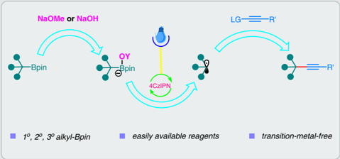
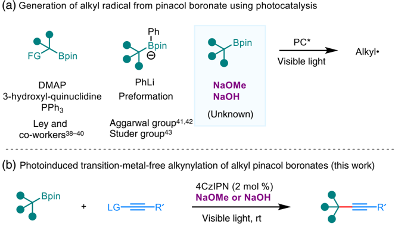
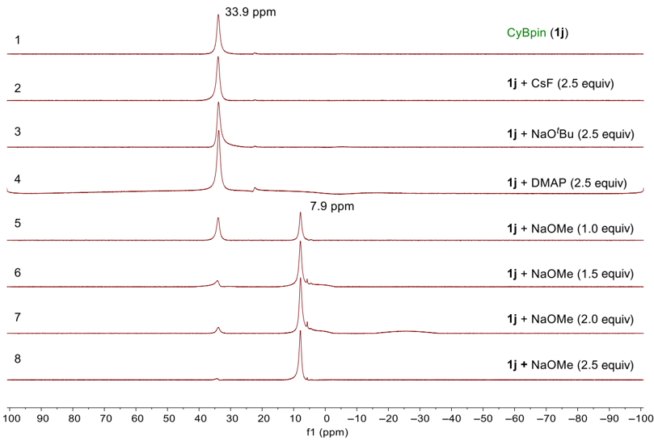
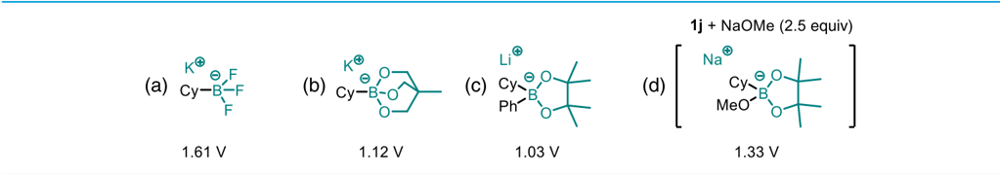
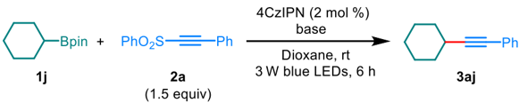
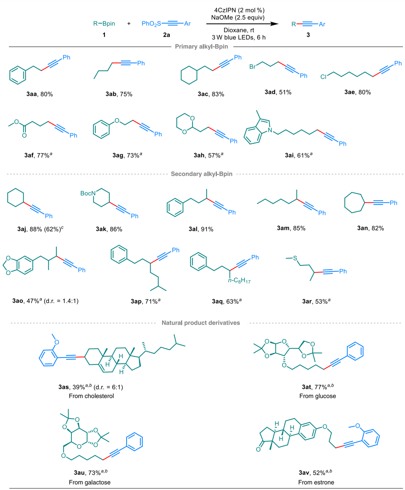
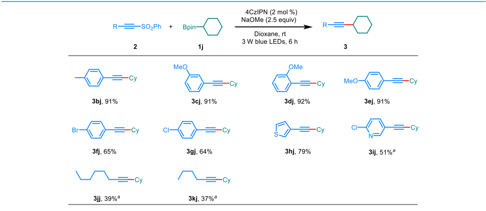
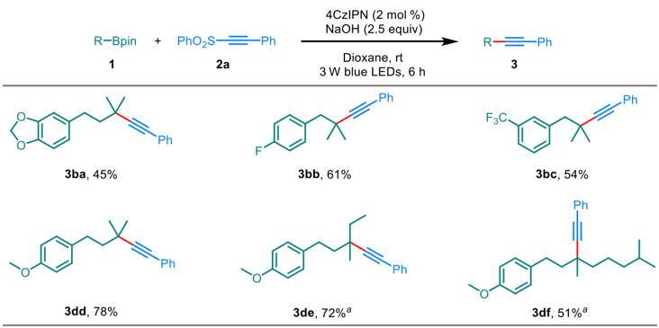
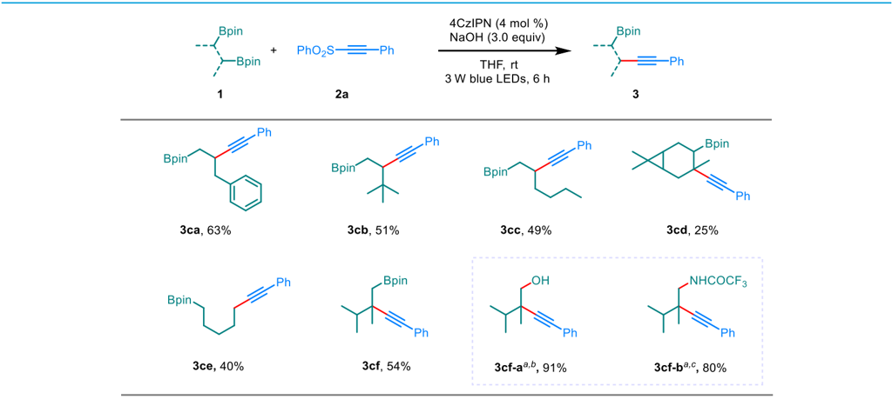
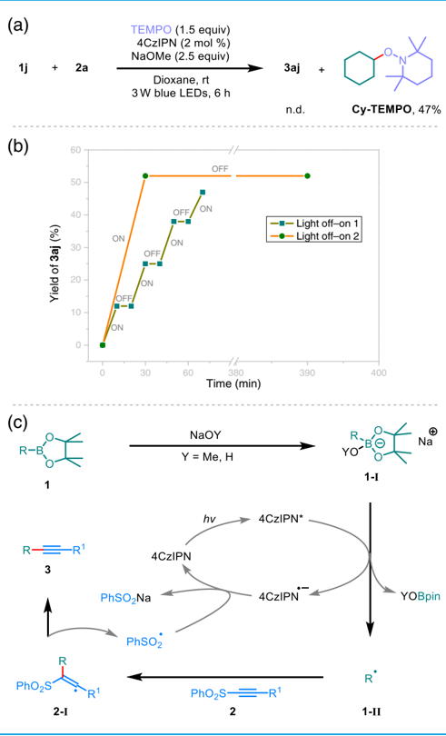

Received: June 12, 2020 | Accepted: July 26, 2020 | Published: Sept. 21, 2020

## Photoinduced Transition-Metal-Free Alkynylation of Alkyl Pinacol Boronates

Dunfa Shi 1,2 , Chungu Xia 1 &amp; Chao Liu 1 *

1 State Key Laboratory for Oxo Synthesis and Selective Oxidation, CAS Key Laboratory of Chemistry of Northwestern Plant Resources, Suzhou Research Institute, Lanzhou Institute of Chemical Physics, Chinese Academy of Sciences, Lanzhou 730000, 2 University of Chinese Academy of Sciences, Beijing 100049

*Corresponding author: chaoliu@licp.cas.cn

Cite this:

CCS Chem .

2020 , 2 , 1718 - 1728

An unprecedented visible-light-induced transitionmetal-free alkynylation of alkyl pinacol boronates has beendemonstratedwithalkynylphenylsulfones asthe alkynylation reagents and 4CzIPN as the organic photocatalyst. Common sodium methoxide (NaOMe) or sodium hydroxide (NaOH) was used as the Lewis basetogeneratephotoactivetetra-coordinatedboron species. Various functional groupswerewelltolerated. The selective monoalkynylation of diboronates was achieved to keep one boryl group in the product for potential further transformations. Radical trapping experiments and electron paramagnetic resonance (EPR) analysis confirmed the generation of alkyl radical intermediate.

## Introduction

Organoboroncompoundsarevaluable synthetic building blocks primarily because of their highly transformable ability for organic synthesis. 1,2 In the past decades, various organoboron compounds have been developed and applied in chemical synthesis. However, as one of the widely accessible organoboron compounds, alkyl pinacol boronates (alkyl-Bpin) have been less explored in C -C bond formation, although 1,2-boronate rearrangements (including Zweifel olefination 3 -5 and Aggarwal coupling 6 -16 ) have solved some problems. Arylboronates have been proven to be the great C -C bond-forming coupling partners in the powerful and versatile

Keywords: organoboron, photocatalysis, C -C coupling, radical, synthetic methods

Suzuki -Miyaura couplings. 17,18 However, alkylboronates are generally recalcitrant substrates in Suzuki -Miyaura couplings and only limited examples have succeeded, 19 -26 because the less polar alkyl C -B bond usually leads to reluctant transmetallation. Recently, as an effective strategy, the activation of alkylboron reagents to alkyl radicals in C -C bond-forming reactions has attracted increasing attention, 27 -36 as it has the potential to enlarge the application of alkylborons in C -C bond formation. Very recently, the Renaud group 37 demonstrated a novel strategy by in situ transesterification from radical inactive alkyl-Bpin to radical active alkyl-Bcat for the homolytic activation of alkyl-Bpin. Catalytic visible-lightinduced generation of alkyl radicals from alkylborons

2020

, 2, 1718

-

1728

Scheme 1 | (a and b) Photoinduced generation of alkyl radicals from alkyl-Bpin and its application in a transitionmetal-free alkynylation. LG = -SO2Ph. FG = aryl or amino groups. LG, leaving group; FG, functional group.

under mild conditions was attractive, a method in which anionic trifluoroborate salts are the dominant alkylboron reagents. a Comparably, alkyl-Bpin could be readily available and soluble in most of common organic solvents. Due to the versatile preparation of alkyl-Bpin, most of the recent studies on alkyltrifluoroborates used the alkyl-Bpin as precursors of those trifluoroborates. Therefore, using alkyl-Bpin as alkyl radical precursors under photocatalysis would be highly appealing in organic synthesis. However, only scarce examples have been demonstrated. In 2016, Ley and co-workers 38 -40 initiated the photocatalytic activation of pinacol boronates to alkyl radicals in C -C (Csp 3 -Csp 3 and Csp 3 -Csp 2 ) bond-forming reactions by using 4-Dimethylaminopyridine ' in the proof (DMAP), 3-hydroxyl-quinuclidine, or PPh3 as the Lewis base, in which specific benzylic or α -amino alkyl-Bpin were primarily utilized (Scheme 1a). Very recently, the Aggarwal group 41,42 successfully achieved the activation of unactivated alkyl-Bpin under photoredox conditions by preformation of ate complex using phenyllithium (PhLi) reagent (Scheme 1a). The generated alkyl radicals reacted with olefins to form Csp 3 -Csp 3 bonds. The Studer group 43 also used this activation strategy to achieve protodeboronation of alkyl-Bpin. However, the preformation of ate complex using PhLi at low-temperature and solvent-switch operation make this strategy less practical. Generally, alkoxide anions or hydroxide anion could coordinate with boron centers to activate pinacol boronates via the formation of alkyl trioxyl borate. If unactivated alkyl-Bpin could be activated to generate alkyl radicals in the presence of alkali metal alkoxide or hydroxide under photocatalysis, it would be very practical and appealing for the application of alkyl-Bpin in organic synthesis. Although the homolytic activation of alkyl triol boronate under photocatalysis

, 2, 1718

-

1728

demonstrated the possibility, 44 there are no related reports on alkyl-Bpin to date. Herein, we demonstrated the photocatalytic activation of alkyl-Bpin by using sodium methoxide (NaOMe) or sodium hydroxide (NaOH) as the Lewis base to achieve a Csp 3 -Csp bond-forming alkynylation of alkyl-Bpin (Scheme 1b).

## Experimental Methods

## General procedure

In a glovebox, a flame-dried resealable reaction tube of solvent flask (25 mL) equipped with a magnetic stirring bar was charged with alkyl-Bpin 1 (0.40 mmol), alkynyl phenylsulfone 2 (0.60 mmol), 1,2,3,5-tetrakis(carbazol-9yl)-4,6-dicyanobenzene (4CzIPN; 6.4 mg, 0.008 mmol), NaOMe (54.0 mg, 1.0 mmol) or NaOH (40.0 mg, 1.0 mmol), and dioxane (8 mL). The tube was sealed with a Teflon screw cap and taken out of the glovebox. The tube was stirred under the irradiation of blue light-emitting diodes (LEDs; 3 W) with a fan to keep the reaction at room temperature for 6 h. Upon completion, the reaction mixture was quenched by ammonium chloride (NH4Cl) solution and extracted by ethyl acetate. After removing the solvent by vacuum, the resulting residue was purified by flash column chromatography on silica gel to afford the desired products. Experimental details and characterization methods are available in Supporting Information.

## Results and Discussion

Our group has been focusing on the development of new methods for the synthesis and application of alkylBpin. 45 -52 Considering the challenge of the less reactive

Figure 1 | 11 B NMR analysis of the reaction between bases and Cy-Bpin in d 8-THF at room temperature.

alkyl-Bpin in C -C bond-forming reactions, we attempted the important Csp 3 -Csp bond formations for the synthesis of functionalized alkynes, and the Csp 3 -Csp bond formations have attracted continuous efforts in the synthetic community, including 1,2-metalate rearrangements, 53 -64 and alkynylation of various alkyl radical precursors including halides, trifluoroborate salts, carboxylic acids, aliphatic alcohols, alkanes, 65 -73 and so forth. It has been demonstrated that tetra-coordinated boron centers are generally necessary for the generation of carbon radicals from organoboron reagents under photocatalysis. Therefore, before investigating the optimal conditions for the alkynlation of alkyl-Bpin, we initiated our studies by testing the interaction of several common bases with alkyl-Bpin by 11 B NMR analysis in tetrahydrofuran (THF)d 8 (Figure 1). Cyclohexyl pinacol boronate (Cy-Bpin) 1j (33.9 ppm for 11 B NMR, Figure 1, spectrum 1) was used as the model by stirring with the base for 5 min before NMR analysis. The 11 B NMR of the mixture of caesium fluoride (CsF), sodium tert-butoxide (NaO t Bu), or DMAP (2.5 equiv) with 1j showednoobvious signals for tetra-coordinated boron species (Figure 1, spectra 2 -4). When NaOMe was used as the base, a new peak at 7.9 ppm was observed and it was assigned as a tetra-coordinated alkylborate species resulting from the coordination of methoxide with 1j . 74,75 Moreover, 1 equiv of NaOMe resulted in a mixture with partial coordination (Figure 1, spectrum 5). Along with increasing the amount of NaOMe, the signal of 1j decreased and the signal at

7.9 ppm increased (Figure 1, spectra 5 -8). When 2.5 equiv of NaOMe was used, nearly a single signal of the tetra-coordinated boron species was observed in the reaction mixture (Figure 1, spectrum 8). These phenomena suggested that excess NaOMe was necessary to achieve full coordination at the boron center.

Before studying the photoinduced homolytic activation of 1j in C -C bond-forming reactions, the reduction potential for the mixture of 1j and NaOMe (2.5 equiv) was measured together with those of known photocatalytic-active alkylborons including cyclohexyl trifluoroborates, cyclohexyl triol boronate, and phenyl cyclohexyl borate for reference under the same standard (Figures 2a -2d). As a result, the reduction potential of CyBF3K is 1.61 V versus Ag/AgCl in THF. The value of Akita ' s cyclohexyl triol boronate and Aggarwal ' s phenyl cyclohexyl borate are 1.12 and 1.03 V, respectively. The reduction potential of the mixture of 1j and NaOMe (2.5 equiv) was 1.33 V versus Ag/AgCl, which was smaller than that of CyBF3K. This result demonstrated the high possibility of photoinduced homolytic activation of alkyl-Bpin in the presence of NaOMe.

According to our initial hypothesis, a photocatalyst 4CzIPN under 3 W blue LED irradiation was applied for the homolytic activation of 1j in the presence of NaOMe as the base. It has been demonstrated that alkynyl phenylsulfone could well be used as alkynylation reagent via a radical addition/elimination strategy. 76 Wefirst applied alkynyl phenylsulfone 2a as the model to test the

2020

, 2, 1718

-

1728

Figure 2 | (a -d) Reduction potentials of different alkylborons versus Ag/AgCl in THF.

alkynylation of 1j under photocatalysis following the understanding of the above base effect (Table 1). Obviously, with 2 equiv of NaOMe as the base in THF, the reaction afforded the desired coupling product 3aj in 80% yield after 6 h reaction under irradiation (Table 1, entry 1). However, the detection of a significant amount of THF alkynylation made the isolation of 3aj troublesome. 77 Switching the solvent from THF to dioxane avoided this problem without decrease of reaction efficiency (Table 1, entry 2). Using 2.5 equiv of NaOMe increased the yield to 91% and was determined to be the optimal condition (Table 1, entry 3). As shown in Figure 1, 1 equiv of NaOMe could not fully convert 1j to tetra-coordinated borate; as a result, a low yield of the coupling product 3aj was obtained by using 1 equiv of NaOMe (Table 1, entry 4), demonstrating the importance of full coordination. The bases with less efficient coordination in a short time, as shown in Figure 1, resulted in low yields of 3aj (entries 5 and 6). Bases such as DMAP, PPh3, and isonicotinonitrile for the homolytic activation of benzylic pinacol boronates under photocatalysis were not effective in this transformation, 38 -40 and polar solvents such as dimethylformamide (DMF), dimethyl sulfoxide (DMSO), and methanol (MeOH), widely used in photocatalysis, were also less effective (see Section 1 in Supporting Information). Lowering the loading of 2a to 1.3 and 1.0 equiv resulted in incomplete consumption of the starting boronates, and the corresponding coupling products were obtained in relatively low yields (Table 1, entry 3). Control experiments showed that no coupling product was detected when the reaction was performed in the absence of photocatalyst 4CzIPN or in dark (Table 1, entries 7 and 8).

With the optimal condition in hand, we further investigated the substrate scope of this photoinduced transitionmetal-free alkynylation of alkyl-Bpin (Scheme 2). First, primary alkyl-Bpin was evaluated. As shown in Scheme 2, different kinds of primary alkyl groups were installed with goodyields ( 3aa , 3ab , and 3ac ). Halo substituents, such as Br or Cl, were well tolerated to give moderate to good yields of their corresponding products ( 3ad and 3ae ). Different functional groups, such as ester ( 3af ), aryl ether ( 3ag ), and acetal ( 3ah ), were also compatible in this transformation. In addition, an indole derivative was successfully used to generate the target alkyne ( 3ai ). Subsequently, secondary alkyl-Bpin was also screened for the

Table 1 | Reaction Parameters of Photoinduced Transition-Metal-Free Alkynylation of Alkyl-Bpin

|   Entry | Base(equivalent)                    | 3aj (%) a                         |
|---------|-------------------------------------|-----------------------------------|
|      1. | NaOMe (2.0), THF instead of dioxane | 80                                |
|      2. | NaOMe (2.0)                         | 80                                |
|      3. | NaOMe (2.5)                         | 91 ( 88 ) b , 84 b , c , 71 b , d |
|      4. | NaOMe (1.0)                         | 16                                |
|      5. | CsF (2.0)                           | 11                                |
|      6. | NaO t Bu (2.0)                      | 14                                |
|      7. | NaOMe (2.0), no 4CzIPN              | n.d.                              |
|      8. | NaOMe (2.0), in dark                | n.d.                              |

Abbreviations: n.d., not detected; rt, room temperature; GC, gas chromatography.

a Determined by GC analysis by using naphthalene as the internal standard.

b Yield based on isolated product.

c 2a (1.3 equiv).

d 2a (1.0 equiv).

Scheme 2 | Substrate scope of alkyl-Bpin. Reaction condition: 1 (0.4 mmol), 2a (0.6 mmol), 4CzIPN (0.008 mmol), NaOMe (1.0 mmol), and dioxane (8.0 mL), irradiation supplied by blue LEDs (3 W), 6 h. Yields based on isolated products. a 0.016 mmol 4CzIPN was used. b 0.2 mmol scale. c 5.0 mmol scale. d.r., diastereomeric ratio; rt, room temperature.

Citation denotes calendar and volume year of first online publication.

transformation. Both acyclic and cyclic secondary alkyl-Bpin were well compatible and afforded the desired products in moderate to excellent yields ( 3aj -3ar ). Boc-protected piperidinyl substrate was suitable for this reaction ( 3ak ). The good tolerance of thioether exhibited the advantage of transition-metal-free conditions ( 3ar ). Moreover, a large-scale (5.0 mmol) reaction was carried out for 3aj under the standard condition; as a result, 0.57 g (62%) 3aj was obtained with the remaining of a significant amount of CyBpin ( 1j ). To further demonstrate the utility of this photoinduced transition-metal-free alkynylation of alkyl-Bpin, several natural product derivatives were applied to this alkynylation protocol. The pinacol boronate derivative of cholesterol provided moderate yield of the corresponding alkyne 3as . Carbohydrates fragments were retained well in this transformation and the corresponding substrates derived from glucose and galactose gave high yields of the coupling products 3at and 3au . Estrone derivative reacted efficiently to give the desired product 3av in moderate yield, demonstrating the good tolerance of ketone functionality.

Next, the scope of alkynyl phenyl sulfone 2 was further evaluated by using 1j as the coupling partner (Scheme 3). Aromatic alkynes bearing electron-donating substituents were well behaved, and para-, ortho-, and metasubstituted phenyls all gave excellent yields of the desired products ( 3bj , 3cj , 3dj , and 3ej ). The presence of aromatic halogen groups such as C -Cl and C -Br provided moderate yields of the coupling products ( 3fj and 3gj ), which allowed for further functionalizations of those alkynes. Heteroaryl alkyne derivatives also worked well ( 3hj and 3ij ). It is noteworthy that alkyl alkyne phenyl sulfones were also suitable substrates for this transformation, although relatively low yields were obtained ( 3jj and 3kj ).

When it came to the alkynylation of tertiary alkyl-Bpin, only trace amount of product was obtained by using NaOMe as the base. Meanwhile, clear evidence showed that the alkynyl phenylsulfone substrate in the mixture was decomposed by NaOMe. 78 We presumed that the bulky tertiary alkyl group prevented the efficient coordination of methoxide to the boron center of Bpin. Considering this aspect, a smaller size oxyl-base NaOH was then chosen instead of NaOMe. Although NaOH might suffer from poor solubility in dioxane, the interaction of hydroxide with the boron center of the Bpin group might be beneficial to achieve a high chemoselectivity toward alkynylation of tertiary alkyl-Bpin. To our delight, simply switching from NaOMe to NaOH as the base, under the standard conditions, the reactions ran smoothly to give the desired products. 11 BNMRanalysis exhibited that both NaOMe and NaOH were sluggish to coordinate to the tertiary alkyl-Bpin in a period of 5 min, while the coordination could be compensated by extending to 1 h (see Section 9 in Supporting Information). More importantly, we found that NaOH did not destroy phenylsulfone in dioxane during a long period of coordination with tertiary alkyl-Bpin. The above observation addressed that the advantage of NaOH in the case of tertiary alkyl-Bpin was its nonreactivity toward the coupling partner alkynyl phenyl sulfone. Therefore, it left enough time for NaOH to coordinate with the boron center of tertiary alkyl-Bpin. With these modifications, a series of tertiary alkyl-Bpin was well alkynylated under photocatalysis conditions (Scheme 4). Various

Scheme 3 | Substrate scope of alkynyl sulfones. Reaction conditions: 1j (0.4 mmol), 2 (0.6 mmol), 4CzIPN (0.008 mmol), NaOMe (1.0 mmol), and dioxane (8.0 mL), irradiation supplied by blue LEDs (3 W), 6 h. a 0.024 mmol 4CzIPN was used. Yields based on isolated products. rt, room temperature.

CCS Chem.

2020

, 2, 1718

-

1728

Scheme 4 | Substrates of tertiary alkyl-Bpin. Reaction conditions: 1 (0.4 mmol), 2a (0.6 mmol), 4CzIPN (0.008 mmol), NaOH(1.0 mmol), and dioxane (8.0 mL), irradiation supplied by blue LEDs (3 W), 6 h. a THF as solvent. Yields based on isolated products. rt, room temperature.

functional groups, such as piperonyl ( 3ba ), aromatic C -F ( 3bb ), C -CF3 ( 3bc ), and C -OMe ( 3bd , 3be , and 3bf ), were well tolerated.

With NaOH as the base, several 1,2-diboronates were subjected to this alkynylation process (Scheme 5). To our delight, selective monoalkynylation was observed at the secondary or tertiary position with moderate yields ( 3ca , 3cb , 3cc , 3cd , and 3cf ). Aggarwal ' s 42 previous report showed that 1,2-diboronates could proceed radical

1,2-boron shift under photoinduced homolytic activation conditions to achieve functionalization at a more sterichindered position, suggesting that a radical 1,2-boron shift most likely occurred in this alkynylation protocol. Interestingly, in our case of 1,5-diboronate, selective monodeborylative alkynylation product ( 3ce ) was also obtained even with excess 2a . Although moderate yields were obtained for these monoalkynylation products, the di-alkynylation products were not

Scheme 5 | Selected substrates of pinacol diboronates. Reaction conditions: 1 (0.3 mmol), 2a (0.6 mmol), 4CzIPN (0.016 mmol), NaOH (0.9 mmol), THF (6.0 mL), irradiation supplied by 3 W blue LEDs, 6 h. a 3cf-a and 3cf-b were prepared from 3cf and yields were based on 3cf . Yields based on isolated products. b Reaction conditions for the synthesis of 3cf-a : 3cf (0.2 mmol), 3M NaOH (2 mL), 30% H2O2 (1.0 mL), THF (2 mL), rt, 30 min. c Reaction conditions for the synthesis of 3cf-b : 3cf (0.15 mmol), H2N-DABCO (0.15 mmol), KO t Bu (0.36 mmol), THF (2 mL), 80 °C, 1 h, then trifluoroacetic anhydride (TFAA) (0.3 mmol), 80 °C, 1 h. rt, room temperature.

, 2, 1718

-

1728

observed. Some unknown byproducts must be generated in the reaction mixture.

To show further transformations of the remaining Bpin group, one of the monoalkynylation products 3cf subjected to perform oxidation by using standard H2O2/ NaOH procedure and the corresponding homopropargyl alcohol 3cf-a was obtained in 91% yield. The amination of 3cf was also carried out by using the amination reagent 1-amino-1,4-diazabicyclo[2.2.2]octane-1,4-diium iodide (H2N-DABCO) that has recently been developed in our group 45,79 ; as a result, the corresponding homopropargyl amine 3cf-b was obtained in 80% yield. As the 1,2-diboronates were generally synthesized from the diborylation of olefins, this selective monoalkynylation protocol provided possibilities for selective difunctionalization of those olefins.

To confirm the radical process of this photocatalysis reaction, a radical trapping experiment was conducted using 1j and 2a as models in the presence of 2,2,6,6tetramethylpiperidine-1-oxyl (TEMPO) under the standard conditions (Scheme 6a). As a result, the alkynylation was completely inhibited, and only an alkyl radical trapping product Cy-TEMPO was obtained in 47% yield. Furthermore, the electron paramagnetic resonance (EPR) experiment was also conducted. After 5,5-dimethyl-1-pyrroline N -oxide (DMPO) was added in the reaction of 1j and 2e , an EPR signal ( g = 2.0066, AN = 14.13 G, AH = 21.30 G, linewidth = 0.8) exhibited the generation of an alkyl radical species under the reaction condition (see Section 11 in Supporting Information). Two light on -off experiments were also carried out (Scheme 6b). In the case of every 10 min light on and off, the yield of the coupling product 3aj increased only when the light was on. We also carried out an experiment by light irradiation for 30 min and then allowing the reaction to proceed in dark for 6 h (the standard reaction time). As a result, the yield did not increase in dark condition. These results might exclude the possibility of radical chain reaction. The luminescence quenching experiments demonstrated that the interaction only occurred between the ate complex (alkyl-Bpin + NaOMe)withthe excited photocatalyst 4CzIPN* and the single acetylene sulfone, alkyl-Bpin, or NaOMe did not quench the excited photocatalyst 4CzIPN* (see Section 7 in Supporting Information). Based on these experiments, a plausible mechanism is proposed in Scheme 6c. Initially, the coordination of methoxide or hydroxide with alkyl-Bpin ( 1 ) generated a tetra-coordinated alkylboron species 1-I . Subsequently, single-electron transfer (SET) between the excited photocatalyst 4CzIPN* and 1-I generated an alkyl radical 1-II and the anionic catalyst radical. Then, the radical addition of 1-II to the triple bond of alkynyl phenylsulfone 2 generated intermediate 2-I . Subsequently, the elimination of sulfonyl radical recovered the triple bond to generate the final product 3 . Meanwhile, the SET oxidation of the anionic catalyst radical by the sulfonyl radical

Scheme 6 | (a -c) Mechanistic studies and the proposed mechanism. rt, room temperature.

regenerated the ground state catalyst 4CzIPN to close the catalytic cycle.

## Conclusion

Wehavedevelopedanefficient photoinduced transitionmetal-free alkynylation of alkyl-Bpin. Widely available NaOMe was applied as the Lewis base for the activation of primary and secondary alkyl-Bpin. In the case of bulky tertiary alkyl-Bpin, NaOH was used as the Lewis base. Various functional groups were well tolerated. Alkynyl phenylsulfones were used as alkynylation reagents. 4CzIPN was applied as the organic photocatalyst under blue LED irradiation. The selective monoalkynylation of diboronates was achieved to keep one boryl group in the product for potential further transformations. Radical trapping experiment and EPR analysis confirmed the generation of alkyl radical, and a plausible mechanism was subsequently proposed.

2020

, 2, 1718

-

1728

## Footnote

a See refs. 27 -31, and references therein.

## Supporting Information

[Supporting Information is available.](https://www.chinesechemsoc.org/doi/suppl/10.31635/ccschem.020.202000371)

## Conflict of Interest

There is no conflict of interest to report.

## Funding Information

Financial support for this work was provided by the National Natural Science Foundation of China (nos. 21673261 and 91745110), the Natural Science Foundation of Jiangsu Province (nos. BK20190002 and BK20181194), the Youth Innovation Promotion Association CAS (no. 2018458), and the Key Research Program of Frontier Sciences of CAS (no. QYZDJ-SSW-SLH051).

## Acknowledgments

The authors thank Professor Xinquan Hu for helpful revision of this manuscript.

## References

1. Hall, D. G. Boronic Acids: Preparation and Applications in Organic Synthesis, Medicine and Materials, 2nd ed.; Wiley-VCH Verlag GmbH &amp; Co. KGaA: Weinheim, Germany, 2011 ; Vols. 1 and 2.
2. Dhillon, R. S. Hydroboration and Organic Synthesis ; Springer: Germany, 2007 .
3. Armstrong, R. J.; Niwetmarin, W.; Aggarwal, V. K. Synthesis of Functionalized Alkenes by a Transition-Metal-Free Zweifel Coupling. Org. Lett. 2017 , 19 , 2762 -2765.
4. Armstrong, R. J.; Garcia-Ruiz, C.; Myers, E. L.; Aggarwal, V. K. Stereodivergent Olefination of Enantioenriched Boronic Esters. Angew. Chem. Int. Ed. 2017 , 56 , 786 -790.
5. Armstrong, R. J.; Aggarwal, V. K. 50 Years of Zweifel Olefination: A Transition-Metal-Free Coupling. Synthesis 2017 , 49 , 3323 -3336.
6. Bonet, A.; Odachowski, M.; Leonori, D.; Essafi, S.; Aggarwal, V. K. Enantiospecific sp 2 -sp 3 Coupling of Secondary and Tertiary Boronic Esters. Nat. Chem. 2014 , 6 , 584 -589.
7. Llaveria, J.; Leonori, D.; Aggarwal, V. K. Stereospecific Coupling of Boronic Esters with N-Heteroaromatic Compounds. J. Am. Chem. Soc. 2015 , 137 , 10958 -10961.
8. Odachowski, M.; Bonet, A.; Essafi, S.; Conti-Ramsden, P.; Harvey, J. N.; Leonori, D.; Aggarwal, V. K. Development of Enantiospecific Coupling of Secondary and Tertiary Boronic Esters with Aromatic Compounds. J. Am. Chem. Soc. 2016 , 138 , 9521 -9532.
9. Aichhorn, S.; Bigler, R.; Myers, E. L.; Aggarwal, V. K. Enantiospecific Synthesis of ortho-Substituted Benzylic Boronic Esters by a 1,2-Metalate Rearrangement/1,3-Borotropic Shift Sequence. J. Am. Chem. Soc. 2017 , 139 , 9519 -9522. 10. Ganesh, V.; Odachowski, M.; Aggarwal, V. K. Alkynyl Moiety for Triggering 1,2-Metallate Shifts: Enantiospecific sp 2 -sp 3 Coupling of Boronic Esters with p-Arylacetylenes. Angew. Chem. Int. Ed. 2017 , 56 , 9752 -9756.

11. Wang, Y. H.; Noble, A.; Sandford, C.; Aggarwal, V. K. Enantiospecific Trifluoromethyl-Radical-Induced ThreeComponent Coupling of Boronic Esters with Furans. Angew. Chem. Int. Ed. 2017 , 56 , 1810 -1814.

12. Wilson, C. M.; Ganesh, V.; Noble, A.; Aggarwal, V. K. Enantiospecific sp 2 -sp 3 Coupling of ortho- and para-Phenols with Secondary and Tertiary Boronic Esters. Angew. Chem. Int. Ed. 2017 , 56 , 16318 -16322.

13. Bigler, R.; Aggarwal, V. K. ortho-Directing Chromium Arene Complexes as Efficient Mediators for Enantiospecific C(sp 2 ) -C(sp 3 ) Cross-Coupling Reactions. Angew. Chem. Int. Ed. 2018 , 57 , 1082 -1086.
14. Ganesh, V.; Noble, A.; Aggarwal, V. K. Chiral Aniline Synthesis via Stereospecific C(sp 3 ) -C(sp 2 ) Coupling of Boronic Esters with Aryl Hydrazines. Org. Lett. 2018 , 20 , 6144 -6147. 15. Silvi, M.; Schrof, R.; Noble, A.; Aggarwal, V. K. Enantiospecific Three-Component Alkylation of Furan and Indole. Chem. Eur. J. 2018 , 24 , 4279 -4282.
16. Rubial, B.; Collins, B. S. L.; Bigler, R.; Aichhorn, S.; Noble, A.; Aggarwal, V. K. Enantiospecific Synthesis of ortho-Substituted 1,1-Diarylalkanes by a 1,2-Metalate Rearrangement/Anti-SN 2 ′ Elimination/Rearomatizing Allylic Suzuki -Miyaura Reaction Sequence. Angew. Chem. Int. Ed. 2019 , 58 , 1366 -1370.
17. Rygus, J. P. G.; Crudden, C. M. Enantiospecific and Iterative Suzuki -Miyaura Cross-Couplings. J. Am. Chem. Soc. 2017 , 139 , 18124 -18137.
18. Miyaura, N.; Suzuki, A. Palladium-Catalyzed Cross-Coupling Reactions of Organoboron Compounds. Chem. Rev. 1995 , 95 , 2457 -2483.
19. Bergmann, A. M.; Oldham, A. M.; You, W.; Brown, M. K. Copper-Catalyzed Cross-Coupling of Aryl-, Primary Alkyl-, and Secondary Alkylboranes with Heteroaryl Bromides. Chem. Commun. 2018 , 54 , 5381 -5384.
20. Chen, B.; Cao, P.; Yin, X.; Liao, Y.; Jiang, L.; Ye, J.; Wang, M.; Liao, J. Modular Synthesis of Enantioenriched 1,1,2Triarylethanes by an Enantioselective Arylboration and Cross-Coupling Sequence. ACS Catal. 2017 , 7 , 2425 -2429.
21. Crudden, C. M.; Ziebenhaus, C.; Rygus, J. P.; Ghozati, K.; Unsworth, P. J.; Nambo, M.; Voth, S.; Hutchinson, M.; Laberge, V. S.; Maekawa, Y.; Imao, D. Iterative Protecting Group-Free Cross-Coupling Leading to Chiral Multiply Arylated Structures. Nat. Commun. 2016 , 7 , 11065.
22. Blaisdell, T. P.; Morken, J. P. Hydroxyl-Directed CrossCoupling: A Scalable Synthesis of Debromohamigeran E and Other Targets of Interest. J. Am. Chem. Soc. 2015 , 137 , 8712 -8715.
23. Mlynarski, S. N.; Schuster, C. H.; Morken, J. P. Asymmetric Synthesis from Terminal Alkenes by Cascades of Diboration and Cross-Coupling. Nature 2014 , 505 , 386 -390.

DOI: 10.31635/ccschem.020.202000371

, 2, 1718

-

1728

Citation denotes calendar and volume year of first online publication.

24. Zou, G.; Falck, J. R. Suzuki -Miyaura Cross-Coupling of Lithium n-Alkylborates. Tetrahedron Lett. 2001 , 42 , 5817 -5819.
25. Sato, M.; Miyaura, N.; Suzuki, A. Cross-Coupling Reaction of Alkylboronic or Arylboronic Acid-Esters with Organic Halides Induced by Thallium (I) Salts and Palladium-Catalyst. Chem. Lett. 1989 , 18 , 1405 -1408.
26. Ohmura, T.; Miwa, K.; Awano, T.; Suginome, M. Enantiospecific Suzuki -Miyaura Coupling of Nonbenzylic α -(Acylamino)alkylboronic Acid Derivatives. Chem. Asian J. 2018 , 13 , 2414 -2417.
27. Milligan, J. A.; Phelan, J. P.; Badir, S. O.; Molander, G. A. Alkyl Carbon -Carbon Bond Formation by Nickel/ Photoredox Cross-Coupling. Angew. Chem. Int. Ed. 2019 , 58 , 6152 -6163.
28. Duan, K.; Yan, X.; Liu, Y.; Li, Z. Recent Progress in the Radical Chemistry of Alkylborates and Alkylboronates. Adv. Synth. Catal. 2018 , 360 , 2781 -2795.
29. Koike, T.; Akita, M. Combination of Organotrifluoroborates with Photoredox Catalysis Marking a New Phase in Organic Radical Chemistry. Org. Biomol. Chem. 2016 , 14 , 6886 -6890.
30. Molander, G. A. Organotrifluoroborates: Another Branch of the Mighty Oak. J. Org. Chem. 2015 , 80 , 7837 -7848.
31. Duret, G.; Quinlan, R.; Bisseret, P.; Blanchard, N. Boron Chemistry in a New Light. Chem. Sci. 2015 , 6 , 5366 -5382.
32. Ollivier, C.; Renaud, P. A Convenient and General Tin-Free Procedure for Radical Conjugate Addition. Angew. Chem. Int. Ed. 2000 , 39 , 925 -928.
33. Cadot, C.; Cossy, J.; Dalko, P. I. Radical Carbon -Carbon Coupling Reactions via Organoboranes. Chem. Commun. 2000 , 1017 -1018.
34. Chen, Y.; Lu, L.-Q.; Yu, D.-G.; Zhu, C.-J.; Xiao, W.-J. Visible Light-Driven Organic Photochemical Synthesis in China. Sci. China Chem. 2019 , 62 , 24 -57.
35. Li, Z.; Wang, Z.; Zhu, L.; Tan, X.; Li, C. Silver-Catalyzed Radical Fluorination of Alkylboronates in Aqueous Solution. J. Am. Chem. Soc. 2014 , 136 , 16439 -16443.
36. Schaffner, A.-P.; Darmency, V.; Renaud, P. Radical-Mediated Alkenylation, Alkynylation, Methanimination, and Cyanation of B-Alkylcatecholboranes. Angew. Chem. Int. Ed. 2006 , 45 , 5847 -5849.
37. Andre-Joyaux, E.; Kuzovlev, A.; Tappin, N. D. C.; Renaud, P. A General Approach to Deboronative Radical Chain Reactions with Pinacol Alkylboronic Esters. Angew. Chem. Int. Ed. 2020 , 59 , 13859 -13864.
38. Lima, F.; Kabeshov, M. A.; Tran, D. N.; Battilocchio, C.; Sedelmeier, J.; Sedelmeier, G.; Schenkel, B.; Ley, S. V. Visible Light Activation of Boronic Esters Enables Efficient Photoredox C(sp 2 ) -C(sp 3 ) Cross-Couplings in Flow. Angew. Chem. Int. Ed. 2016 , 55 , 14085 -14089.
39. Lima, F.; Sharma, U. K.; Grunenberg, L.; Saha, D.; Johannsen, S.; Sedelmeier, J.; Van der Eycken, E. V.; Ley, S. V. A Lewis Base Catalysis Approach for the Photoredox Activation of Boronic Acids and Esters. Angew. Chem. Int. Ed. 2017 , 56 , 15136 -15140.
40. Lima, F.; Grunenberg, L.; Rahman, H. B. A.; Labes, R.; Sedelmeier, J.; Ley, S. V. Organic Photocatalysis for the
18. Radical Couplings of Boronic Acid Derivatives in Batch and Flow. Chem. Commun. 2018 , 54 , 5606 -5609.
41. Shu, C.; Noble, A.; Aggarwal, V. K. Photoredox-Catalyzed Cyclobutane Synthesis by a Deboronative Radical Addition-Polar Cyclization Cascade. Angew. Chem. Int. Ed. 2019 , 58 , 3870 -3874.
42. Kaiser, D.; Noble, A.; Fasano, V.; Aggarwal, V. K. 1,2-Boron Shifts of Beta-Boryl Radicals Generated from Bis-Boronic Esters Using Photoredox Catalysis. J. Am. Chem. Soc. 2019 , 141 , 14104 -14109.
43. Clausen, F.; Kischkewitz, M.; Bergander, K.; Studer, A. Catalytic Protodeboronation of Pinacol Boronic Esters: Formal Anti-Markovnikov Hydromethylation of Alkenes. Chem. Sci. 2019 , 10 , 6210 -6214.
44. Yasu, Y.; Koike, T.; Akita, M. Visible Light-Induced Selective Generation of Radicals from Organoborates by Photoredox Catalysis. Adv. Synth. Catal. 2012 , 354 , 3414 -3420.
45. Liu, X.; Zhu, Q.; Chen, D.; Wang, L.; Jin, L.; Liu, C. Aminoazanium of DABCO: An Amination Reagent for Alkyl and Aryl Pinacol Boronates. Angew. Chem. Int. Ed. 2020 , 59 , 2745 -2749.
46. Shi, D.; Wang, L.; Xia, C.; Liu, C. Synthesis of Secondary and Tertiary Alkyl Boronic Esters by gem-Carboborylation: Carbonyl Compounds as Bis(electrophile) Equivalents. Angew. Chem. Int. Ed. 2018 , 57 , 10318 -10322.
47. Sun, W.; Wang, L.; Xia, C.; Liu, C. Dual Functionalization of α -Monoboryl Carbanions Through Deoxygenative Enolization with Carboxylic Acids. Angew. Chem. Int. Ed. 2018 , 57 , 5501 -5505.
48. Wang, L.; Zhang, T.; Sun, W.; He, Z.; Xia, C.; Lan, Y.; Liu, C. C -OFunctionalization of α -Oxyboronates: A Deoxygenative gem-Diborylation and gem-Silylborylation of Aldehydes and Ketones. J. Am. Chem. Soc. 2017 , 139 , 5257 -5264.
49. Wang, L.; Sun, W.; Liu, C. Cu-Catalyzed Deoxygenative gem-Hydroborylation of Aromatic Aldehydes and Ketones to Access Benzylboronic Esters. Chin. J. Catal. 2018 , 39 , 1725 -1729.
50. He, Z.; Fan, M.; Xu, J.; Hu, Y.; Wang, L.; Wu, X.; Xia, C.; Liu, C. Iron-Catalyzed Deoxygenative Diborylation of Ketones to Internal gem-Diboronates. Chin. J. Org. Chem. 2019 , 39 , 3438 -3445.
51. He, Z.; Zhu, Q.; Hu, X.; Wang, L.; Xia, C.; Liu, C. Cooperation Between an Alcoholic Proton and Boryl Species in the Catalytic gem-Hydrodiborylation of Carboxylic Esters to Access 1,1-Diborylalkanes. Org. Chem. Front. 2019 , 6 , 900 -907.
52. Zhu, Q.; He, Z.; Wang, L.; Hu, Y.; Xia, C.; Liu, C. α -C -H Borylation of Secondary Alcohols via Ru/Fe Relay Catalysis: Building a Platform for Alcoholic C -H/C -O Functionalizations. Chem. Commun. 2019 , 55 , 11884 -11887.
53. Wang, Y. H.; Noble, A.; Myers, E. L.; Aggarwal, V. K. Enantiospecific Alkynylation of Alkylboronic Esters. Angew. Chem. Int. Ed. 2016 , 55 , 4270 -4274.
54. Brown, H. C.; Mahindroo, V. K.; Bhat, N. G.; Singaram, B. Chiral Synthesis via Organoboranes. 29. A General Synthesis of Alpha.-Chiral Monosubstituted Acetylenes and Their Trimethylsilyl Derivatives from Enantiomerically Pure Boronic Esters. J. Org. Chem. 1991 , 56 , 1500 -1505.

2020

, 2, 1718

-

1728

55. Pelter, A.; Drake, R. A. Methyl Group Migration in the Reactions of Alkynyltrialkylborates. Tetrahedron Lett. 1988 , 29 , 4181 -4184.

56. Brown, H. C.; Gupta, A. K.; Prasad, J. V. N. V.; Srebnik, M. Chiral Synthesis via Organoboranes. 17. Preparation of Alpha.-Chiral. Alpha. ' -Alkynyl Ketones of High Enantiomeric Excess from Optically Pure Organyl(1-Alkynyl)borinic Esters. J. Org. Chem. 1988 , 53 , 1391 -1394.

57. Brown, H. C.; Bakshi, R. K.; Singaram, B. Chiral Synthesis via Organoboranes. 12. Conversion of Boronic Esters of Essentially 100% Optical Purity into Monoalkylthexylboranes Providing Convenient Synthetic Routes to Trans-Olefins, Cis-Olefins, Alkynes, and Ketones of Very High Enantiomeric Purities. J. Am. Chem. Soc. 1988 , 110 , 1529 -1534.

58. Suzuki, A.; Miyaura, N.; Abiko, S.; Itoh, M.; Midland, M. M.; Sinclair, J. A.; Brown, H. C. Vinylic Organoboranes. 1. A Convenient Synthesis of Acetylenes via the Reaction of Lithium (1-Alkynyl) Organoborates with Iodine. J. Org. Chem. 1986 , 51 , 4507 -4511.

59. Sikorski, J. A.; Bhat, N. G.; Cole, T. E.; Wang, K. K.; Brown, H. C. Vinylic Organoboranes. 5. An Improved, Convenient Synthesis of Unsymmetrical Alkynes via Iodination of Lithium Alkynyl Ate Complexes of Thexylalkylborinates. J. Org. Chem. 1986 , 51 , 4521 -4525.

60. Brown, H. C.; Basavaiah, D.; Bhat, N. G. Vinylic Organoboranes. 4. A General, One-Pot Synthesis of 6- and 7-Alkyn1-ols via Boracyclanes. Influence of Steric Effects in the Iodination of Lithium Alkynyl Ate Complexes of Dialkylborinates. J. Org. Chem. 1986 , 51 , 4518 -4521.

61. Yamada, K.; Miyaura, N.; Itoh, M.; Suzuki, A. A Convenient and General Synthesis of 2-Alkynoates or 1-Alkynyl Aryl Ketones via the Reaction of Iodine with the Ate-Complexes Obtained from Lithium Ethoxycarbonyl-or Aroylacetylenide and Trialkylboranes. Synthesis 1977 , 1977 , 679 -681.

62. Yamada, K.; Miyaura, N.; Itoh, M.; Suzuki, A. The Reaction of Iodine with Ate-Complexes Obtained from Organoboranes and Lithium Chloroacetylide. Convenient Syntheses of Symmetric Alkynes and Alkenes. Tetrahedron Lett. 1975 , 16 , 1961 -1964.

63. Naruse, M.; Utimoto, K.; Nozaki, H. The Reaction of Lithium Trialkylalkynylborate with Methanesulphinyl Chloride: A Novel Route to Internal Acetylenes. Tetrahedron 1974 , 30 , 2159 -2163.

64. Suzuki, A.; Miyaura, N.; Abiko, S.; Itoh, M.; Brown, H. C.; Sinclair, J. A.; Midland, M. M. Convenient and General Synthesis of Acetylenes via Reaction of Iodine with Lithium 1Alkynyltriorganoborates. J. Am. Chem. Soc. 1973 , 95 , 3080 -3081.

65. Huang, H.; Zhang, G.; Gong, L.; Zhang, S.; Chen, Y. Visible-Light-Induced Chemoselective Deboronative Alkynylation Under Biomolecule-Compatible Conditions. J. Am. Chem. Soc. 2014 , 136 , 2280 -2283.

66. Liu, W.; Li, L.; Li, C.-J. Empowering a Transition-MetalFree Coupling Between Alkyne and Alkyl Iodide with Light in Water. Nat. Commun. 2015 , 6 , 6526.

67. Liu, W.; Chen, Z.; Li, L.; Wang, H.; Li, C.-J. Transition-Metal-Free Coupling of Alkynes with α -Bromo Carbonyl Compounds: An Efficient Approach Towards β , γ -Alkynoates and Allenoates. Chem. Eur. J. 2016 , 22 , 5888 -5893.

68. Wang, M.; Zhang, H.; Liu, J.; Wu, X.; Zhu, C. Radical Monofluoroalkylative Alkynylation of Olefins by a Docking-Migration Strategy. Angew. Chem. Int. Ed. 2019 , 58 , 17646 -17650.

69. Xu, Y.; Wu, Z.; Jiang, J.; Ke, Z.; Zhu, C. Merging Distal Alkynyl Migration and Photoredox Catalysis for Radical Trifluoromethylative Alkynylation of Unactivated Olefins. Angew. Chem. Int. Ed. 2017 , 56 , 4545 -4548.

70. Ren, R.; Wu, Z.; Xu, Y.; Zhu, C. C -C Bond-Forming Strategy by Manganese-Catalyzed Oxidative Ring-Opening Cyanation and Ethynylation of Cyclobutanol Derivatives. Angew. Chem. Int. Ed. 2016 , 55 , 2866 -2869.

71. Liu, X.; Wang, Z.; Cheng, X.; Li, C. Silver-Catalyzed Decarboxylative Alkynylation of Aliphatic Carboxylic Acids in AqueousSolution. J. Am. Chem. Soc. 2012 , 134 , 14330 -14333. 72. Tang, S.; Liu, Y.; Gao, X.; Wang, P.; Huang, P.; Lei, A. Multi-Metal-Catalyzed Oxidative Radical Alkynylation with Terminal Alkynes: A New Strategy for C(sp 3 ) -C(sp) Bond Formation. J. Am. Chem. Soc. 2018 , 140 , 6006 -6013.

73. Tang, S.; Wang, P.; Li, H.; Lei, A. Multimetallic Catalysed Radical Oxidative C(sp 3 ) -H/C(sp) -H Cross-Coupling Between Unactivated Alkanes and Terminal Alkynes. Nat. Commun. 2016 , 7 , 11676.

74. Lovinger, G. J.; Aparece, M. D.; Morken, J. P. Pd-Catalyzed Conjunctive Cross-Coupling Between Grignard-Derived Boron ' Ate ' Complexes and C(sp 2 ) Halides or Triflates: NaOTf as a Grignard Activator and Halide Scavenger. J. Am. Chem. Soc. 2017 , 139 , 3153 -3160.

75. Wrackmeyer, B. In Annual Reports on NMR Spectroscopy on NMR Spectroscopy; ScienceDirect; Bayreuth. FRG: 1988 ; Vol. 20, pp 61 -203.

76. Le Vaillant, F.; Waser, J. Alkynylation of Radicals: Spotlight on the ' Third Way ' to Transfer Triple Bonds. Chem. Sci. 2019 , 10 , 8909 -8923.

77. Paul, S.; Guin, J. Radical C(sp 3 ) -H Alkenylation, Alkynylation and Allylation of Ethers and Amides Enabled by Photocatalysis. Green Chem. 2017 , 19 , 2530 -2534.

78. Marzo, L.; Parra, A.; Frías, M.; Alemán, J.; García Ruano, J. L. Synthesis of Alkyl-Ynol-Ethers by ' Anti-Michael Addition ' of Metal Alkoxides to β -Substituted Alkynylsulfones. Eur. J. Org. Chem. 2013 , 2013 , 4405 -4409.

79. Li, H.; Yin, G. Aminoazanium of Triethylenediamine: A General and Practical Amination Reagent for Alkyl and Aryl Pinacol Boronates. Chin. J. Org. Chem. 2020 , 40 , 547 -548.

